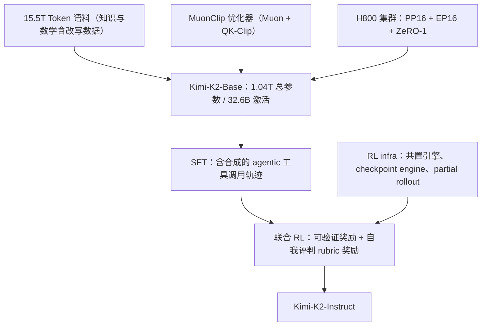
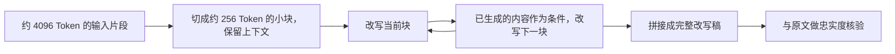
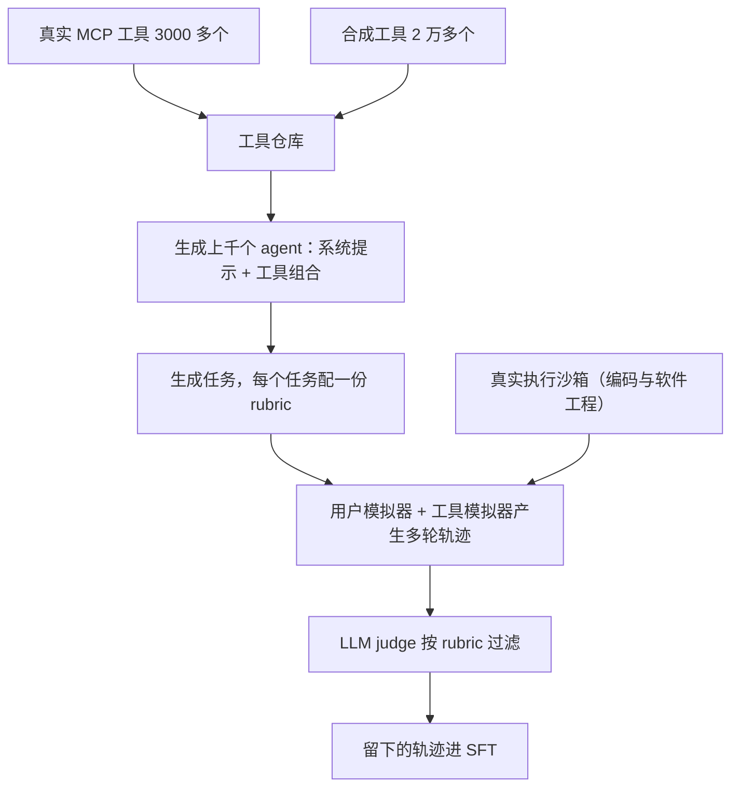
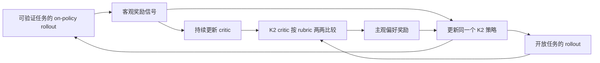

# Kimi K2：好数据见底之后，把每个 Token 和每条轨迹都当成稀缺品

<!-- release-date: 2025-07-11 -->

> 本文依据本地 `papers/Moonshot/Kimi-K2.pdf`，即 Kimi Team **Kimi K2: Open Agentic Intelligence — Technical Report of Kimi K2**，arXiv:2507.20534v2、2026-02-03 提交的修订版，共 32 页。页码均指 PDF 自身的页码。文中区分三件事：**报告明确写了什么**、**我们怎么解释它**、**哪些是外部资料或本文推算**。

## 阅读前先认识几个词

- **Token（词元）**：模型读写文本的基本单位。一个汉字、一个单词或一段标点都可能被切成一个或多个 Token。
- **MoE（Mixture-of-Experts，混合专家）**：一层前馈网络拆成很多个专家，每个 Token 只调用其中少数几个。总参数可以很大，每 Token 的计算量却不必跟着涨。
- **注意力 logits（attention logits，注意力打分）**：Query 与 Key 点乘后、进入 softmax 之前的原始分数。分数越极端，softmax 越接近「只看一个位置」。
- **优化器（optimizer）**：决定每一步怎样按梯度改参数的算法。AdamW 是最常用的一种。
- **SFT（Supervised Fine-Tuning，监督微调）** 与 **RL（Reinforcement Learning，强化学习）**：前者拿「问题—好答案」成对数据继续训练；后者让模型自己做任务，按结果给奖励再训练。模型做一次任务的完整过程叫 **rollout（采样轨迹）**。

这份报告里最重要的几个名字：

- **Token efficiency（Token 效率）**：每消耗一个训练 Token 能换来多少性能。报告把它当成与算力并列的扩展系数（PDF p. 2）。
- **Muon**：一种优化器，把带动量的更新矩阵近似正交化，让各个方向的更新幅度接近。
- **QK-Clip**：每步更新之后，把最大注意力打分超过阈值的那些头的 Query/Key 投影权重按比例缩小。
- **MuonClip**：Muon 加权重衰减、加更新 RMS 对齐、再加 QK-Clip 合成的优化器（PDF p. 3）。
- **Agentic Intelligence（智能体智能）**：模型在复杂环境里自己感知、规划、推理并动手，比如连续调用工具、改文件、跑测试再修错（PDF p. 2）。

## 一句话先说清

Kimi K2 是一个总参数 1.04T、每 Token 激活 32B 的 MoE 模型，报告主打「开源非思考模型里最强、尤其擅长 agentic 任务」（PDF p. 1–2）。它不是「把模型做得更大」的故事，而是回答两个**供给**问题（PDF p. 2）：

1. **高质量人类文本快用完了**。要继续变强，就得让同一批 Token 产生更多学习信号；
2. **Agentic 轨迹在自然语料里几乎不存在**。网上有大量文章和代码，却很少有「一个 agent 连续调十几次工具、中途出错再修正」的完整记录。

K2 在两头各做了一套：

- 预训练侧：用 **Muon** 提高 Token 效率，用 **QK-Clip** 修掉 Muon 在大规模下的失稳，再用 **改写（rephrasing）** 把有限的好语料变成更多不重复的样本；
- 后训练侧：先用一条**大规模 agentic 数据合成流水线**把轨迹「造」出来，再用一个把**可验证奖励**与**自我评判**合在一起的联合 RL 继续训练。

如果只记一句话：

> **外部供给见底时，能力的来源就从「找到更多数据」变成「把已有数据和已有模型改造成新的训练信号」，而每一次改造都要配一个能判断好坏的验证器。**

## 先看全景：K2 由哪几块拼成



这张图按报告 §2–§3 的叙事（PDF p. 2–15）重画，只表示模块的连接顺序，不表示各阶段的耗时或算力比例。

架构沿用 DeepSeek-V3 的路子：MLA（Multi-head Latent Attention，多头潜在注意力，把每个 Token 的 Key/Value 压成一条低维潜向量再缓存）加超稀疏 MoE，隐藏维 7168，单个专家的中间维 2048（PDF p. 6）。和 DeepSeek-V3 并排看（PDF p. 6，Table 2）：

| 配置 | DeepSeek-V3 | Kimi K2 | 变化 |
|---|---:|---:|---:|
| 层数 | 61 | 61 | 不变 |
| 总参数 | 671B | 1.04T | ↑ 54% |
| 每 Token 激活参数 | 37B | 32.6B | ↓ 13% |
| 路由专家总数 | 256 | 384 | ↑ 50% |
| 每 Token 激活专家 | 8 | 8 | 不变 |
| 共享专家 | 1 | 1 | 不变 |
| 注意力头 | 128 | 64 | ↓ 50% |
| 稠密层 | 3 | 1 | ↓ 67% |
| 专家分组 | 有 | 无 | — |

两格最反直觉：**总参数多了 54%，激活参数反而少了 13%**；**注意力头砍掉一半**。这两个选择各有一组实验依据，见后文「第三层矛盾」。

报告里激活参数写过 32B 与 32.6B，总参数写过 1T、1.04T 与 1043B（PDF p. 1、2、6、18），是同一个数的粗略与精确写法。

## 第一层矛盾：想省 Token 就得换优化器，换了优化器训练又会炸

### 旧问题：AdamW 稳，但不够省

报告开篇就给出判断：高质量人类数据越来越有限，Token 效率正在成为扩展的关键系数（PDF p. 2）。Moonshot 之前的 Moonlight 工作显示，在**相同算力、相同模型规模、因而相同数据量**的条件下，Muon 明显优于 AdamW（PDF p. 3）。这个条件很重要：它说的是「同样的 Token 学到更多」，不是「训练更快」。

Muon 在 Algorithm 1 里是这样一步（PDF p. 4）：

$$
M_t = \mu M_{t-1} + G_t,
\qquad
O_t = \mathrm{NewtonSchulz}(M_t) \cdot \sqrt{\max(n, m)} \cdot 0.2
$$

$$
W_t = W_{t-1} - \eta \left( O_t + \lambda W_{t-1} \right)
$$

- $G_t$ 是梯度，$\mu$ 是动量系数，$M_t$ 是累积动量；
- Newton-Schulz 迭代用几次矩阵乘法把矩阵的奇异值都推向 1，近似正交化，省掉一次昂贵的奇异值分解；
- $\sqrt{\max(n, m)} \cdot 0.2$ 把更新的 RMS 对齐到 AdamW 的量级（算法注释写作 Match Adam RMS），原来那套学习率和权重衰减超参还能沿用；
- $\eta$ 是学习率，$\lambda$ 是权重衰减。

### 新问题：Muon 更容易把注意力打分推爆

报告说，把 Muon 往大规模扩时会遇到**注意力 logits 爆炸**，在他们的实验里 Muon 比 AdamW 更常见（PDF p. 3）。


左半边是问题，右半边是处理后的样子。最大打分到上千，softmax 基本退化成 one-hot，报告说这种量级通常会带来明显的 loss 尖峰，偶尔发散（PDF p. 3）。

### 两种现成办法为什么不够

报告点了两个现成方案（PDF p. 3）：

- **logit soft-cap**（直接把打分截到一个范围内）：截断发生在打分算出来之后，Query 和 Key 的点乘在被截之前仍可能长得过大，产生大数的权重还在继续增长；
- **QK-Norm**（点乘前先对 Query、Key 做归一化）：**用不到 MLA 上**，因为 MLA 推理时每个头完整的 Key 矩阵并不实际展开。

第二点说明这不是「懒得用现成方法」，而是 MLA 这个架构选择把一条常规路堵住了。K2 要沿用 MLA 省 KV Cache，就得另找稳定性的出口。

### 新设计：QK-Clip 改权重，不改这一步的输出

先给每个头定义一个标量 max logit，即这批数据 $B$ 里进入该头 softmax 的最大值（PDF p. 3）：

$$
S_{\max}^{h} = \frac{1}{\sqrt{d}} \max_{X \in B} \max_{i, j} Q_i^{h} {K_j^{h}}^{\top}
$$

$h$ 是头编号，$i, j$ 是同一条样本 $X$ 里的 Token 下标，$d$ 是头维。每个头算一个缩放因子 $\gamma_h = \min(1, \tau / S_{\max}^{h})$：只有超过阈值 $\tau$ 的头 $\gamma_h < 1$，其余等于 1、什么也不做。报告先给了对所有头一刀切的朴素版，但实际只有一小部分头会爆，所以用逐头版，把对训练的干预降到最小（PDF p. 3）。


图上是 MLA 一个头的四块分量怎样分担缩放。它是「共享参数限制了可用的干预手段」的一个典型例子：共享的那块一动就会波及所有头，只能让对面一边全担。

两个细节值得记住：

- **它不改本步的前向与反向**。max logit 只是一个「该压多狠」的指导信号，而且在前向里顺带就算出来了（PDF p. 3–4）。QK-Clip 更像训练循环外挂的约束，不是新加的一层；
- **它压的是来源，不是结果**。soft-cap 截的是打分，QK-Clip 缩的是产生打分的权重。

### 证据链：三层实验

| 层级 | 规模 | 设置 | 结论 | 页码 |
|---|---|---|---|---|
| 问题存在 | 9B 激活 / 53B 总参数 MoE | 原版 Muon | 最大 logits 很快超过 1000 | PDF p. 3–4 |
| 药没有副作用 | 0.5B 激活 / 3B 总参数 MoE | Muon 对比 MuonClip，$\tau = 30$ | loss 曲线几乎重合，下游任务无统计显著退化 | PDF p. 30 |
| 正式规模有效 | Kimi K2 | MuonClip，$\tau = 100$ | 全程无 loss 尖峰 | PDF p. 4–5 |

第二层用的阈值比正式训练**严苛得多**（30 对 100）。逻辑是：连过度激进的裁剪都不伤收敛，温和的正式设置就更安全。第三层的 loss 曲线是逐步画的，没有平滑也没有降采样，横跨约 15.5T Token，只省掉了训练最开头一小段（PDF p. 5，Figure 3）。

### 这个机制会自己关掉

附录 D 给了触发统计（PDF p. 30）：

- 前 7 万步：**12.7%** 的注意力头至少触发过一次 QK-Clip；
- 7 万步之后：所有头都曾把自己的 $S_{\max}$ 降到 100 以下，QK-Clip 从此不再生效。

报告把这叫**最小干预原则**：需要时启动，训练稳定后自动停用（PDF p. 29）。一个在后期完全不触发的机制，对最终权重没有直接影响，更像脚手架而不是结构件。全程也没有调过 $\tau$（PDF p. 4）。

### 附录 E 给的是假设，不是证明

报告试着解释「为什么偏偏是 Muon」（PDF p. 30–31）。链条是：

1. 打分的上界由权重谱范数决定：$|q_i \cdot k_j| \le \lVert x_i \rVert \lVert x_j \rVert \lVert W_q \rVert \lVert W_k \rVert$；RMSNorm 已管住输入范数，问题只能出在 $\lVert W_q \rVert$ 或 $\lVert W_k \rVert$ 上；
2. Muon 的更新所有奇异值相等、有效秩满；Adam 的更新谱偏斜、有效秩低。16B 的 Moonlight 上，Muon 训出来的权重奇异值熵更高；
3. 权重和更新的有效秩都高，某对奇异向量与更新方向对齐的概率就更大，对应奇异值更容易被**加性地**推高；
4. 打分是双线性形式，$W_q W_k^{\top}$ 把谱范数平方了，任一边涨一点都会被放大。

报告自己用的词是 hypothesize。它有一条观测支撑（Moonlight 的奇异值熵），但没有证明，读的时候不要当定理。

### 代价与边界

- 多了一个超参 $\tau$。K2 用 100 且全程没调，但报告没有给出 $\tau$ 的选择过程或敏感性分析；
- 它治的是注意力打分爆炸这一种失稳，报告没有声称能解决所有 loss spike。

### 这一节可以带走什么

1. **把监控指标直接接成控制动作**。很多团队会画 max logit 曲线，涨了就人工降学习率或回滚；QK-Clip 让这个指标按固定规则驱动一次权重缩放；
2. **干预贴近病因**。当一个量在持续增长时，压住它的来源往往比压住它本身更有效；
3. **让保护机制能自己退休**。危险期起作用、稳定期归零，比常驻约束更值得追求。

## 第二层矛盾：好语料只有那么多，重复读又会过拟合

### 旧问题：读一遍不够，读十遍变差

知识密集的文本有个尴尬处境：只训一个 epoch 吸收不充分，多训几个 epoch 收益递减、过拟合风险上升（PDF p. 5）。

### 新设计：不重复读，而是换一种说法再读

K2 的知识改写流水线有三个部件（PDF p. 5）：

1. **风格与视角多样的提示**：受 WRAP 启发，用一批精心设计的提示，让大模型把原文用不同风格、从不同视角忠实改写；
2. **按块自回归生成**：长文档切段，逐段改写，再拼回完整段落，以保住全局连贯、避免信息丢失，并绕开大模型隐含的输出长度限制；
3. **忠实度核验**：把每段改写与原文做语义一致性比对，作为进训练之前的第一道质检。



这张图据 PDF p. 6 Figure 4 与 §2.2 重画，是数据生成的机制示意；4096 与 256 是 Figure 4 上标注的尺寸。报告没有公开改写 Prompt 或改写样本，这里不举例。

按块改写解决的是一个很具体的工程问题。**我们的解释**：让模型「把这一万字重写一遍」，它往往写到一半开始概括、跳段或提前收尾；切成短任务后，每次都有余量把细节写全。

### 实验：三种配置对照

报告用一个 K2 早期 checkpoint，在 SimpleQA 上比了三种配置（PDF p. 5，Table 1）：

| 改写次数 | 训练 epoch | SimpleQA 准确率 |
|---:|---:|---:|
| 0（原始维基文本） | 10 | 23.76 |
| 1 | 10 | 27.39 |
| 10 | 1 | 28.94 |

**我们的读法**：三种配置读到的 Token 量级相近，区别在于是同一份文本重复十次，还是十种改写各读一遍。准确率一路涨，方向很清楚。

边界也要说清：

- 只有**一个数据集、一个指标**，用的是早期 checkpoint，没有公开模型规模和训练步数；
- **正式训练没有用「改写 10 次」这一档**。报告紧接着说，把方法推广到其他大规模知识语料后结果同样积极，且**每份语料最多改写两次**（PDF p. 5）。Table 1 证明的是方向，生产取值更保守，原因报告没说。

### 数学语料走另一条路

数学文档改写成「学习笔记」风格，方法沿用 SwallowMath；另外把其他语言的高质量数学材料翻译成英文以增加多样性（PDF p. 6）。

这个差别本身有信息量：知识类文本的价值在事实覆盖，所以要换视角多看几遍；数学材料的价值在推导过程，所以改成更利于学习推导的形式。**同样叫「合成数据」，不同领域的目标并不一样。**

报告也承认，合成数据作为持续扩展的手段仍是开放问题：怎样推广到多样的来源领域而不损害事实准确性、怎样把幻觉和意外的有害内容降到最低、怎样扩展到超大规模数据集（PDF p. 6）。

### 语料全貌

15.5T Token，四个领域：网页文本、代码、数学、知识；大部分数据处理流水线沿用 Kimi K1.5；每个领域都做了正确性与质量校验和针对性的数据实验（PDF p. 6）。**没有公开**：各领域配比、去重与过滤阈值、质量分类器、改写数据占总量的比例、污染检查、词表与分词方案。

### 这一节可以带走什么

- **重复不是复用稀缺数据的唯一方式**。先问能不能换一种忠实的表达，再问要不要多训几个 epoch；
- **长内容的改写要切块**，否则会撞上模型隐含的输出长度限制；
- **合成必须配核验**。没有忠实度核验，改写就从数据增强变成噪声注入。

## 第三层矛盾：同一份预算，买稀疏度还是买注意力头

两个决定方向相反，依据是同一类受控实验。

### 稀疏度：越稀疏越好，但要在成本处停下

稀疏度定义为专家总数与激活专家数之比（PDF p. 7）。固定激活专家 8、共享专家 1，只改变专家总数，结论是：**固定激活参数（即固定 FLOPs）时，专家越多，训练与验证 loss 越低**（PDF p. 7，Figure 5）。

具体到数：要达到同样的验证 loss 1.5，稀疏度 48 比稀疏度 8、16、32 分别少用 1.69 倍、1.39 倍、1.15 倍的 FLOPs（PDF p. 7）。这串数在递减：从 8 到 16 的收益远大于从 32 到 48。Figure 5 里还有稀疏度 64 的曲线，K2 没选它，理由只有一句：稀疏度越高，基础设施越复杂，要在性能与成本之间平衡，所以取 48，即 384 个专家里选 8 个（PDF p. 7）。

**scaling law 告诉你方向，不告诉你停在哪。** 曲线还在往下走，但每多一档，专家并行的通信、负载均衡和显存压力都要重新解决。

### 注意力头：这次的结论是别加

DeepSeek-V3 把注意力头数设为层数的约两倍，以更好地利用显存带宽、提高计算效率。K2 反过来（PDF p. 7）：

- **代价**：序列长度 128k、专家总数固定为 384 时，注意力头从 64 加到 128，推理 FLOPs **增加 83%**；
- **收益**：等 Token 训练条件下，头数等于层数与头数翻倍的对照，验证 loss 只降 **0.5%–1.2%**，在不同算力预算下都是这个量级（PDF p. 7，Figure 6）。

报告的判断是：稀疏度 48 已经给了足够强的性能，头数翻倍的边际收益配不上推理成本，于是取 64 个头；并特别说明这在 agentic 应用里尤其重要，因为那里离不开高效的长上下文处理（PDF p. 7）。

| 维度 | 训练侧收益 | 推理侧代价 | 决定 |
|---|---|---|---|
| 稀疏度 8 → 48 | 同 loss 省 1.69 倍 FLOPs | 基础设施更复杂 | 采纳，停在 48 |
| 注意力头 64 → 128 | 验证 loss 降 0.5%–1.2% | 128k 下推理 FLOPs 增 83% | 拒绝 |

这张表说明 K2 不是「照抄 DeepSeek-V3 再放大」，而是对每个维度分别追问：**这一步的训练收益，值不值它的推理价格。** 可迁移的原则是：架构消融必须同时报告部署侧的代价。

## Infra：把 1T 模型塞进有限的显存

### 硬件与并行

NVIDIA H800 集群，每节点 2 TB 内存、8 张 GPU，节点内 NVLink 与 NVSwitch，节点间 8×400 Gbps RoCE（PDF p. 7）。

并行策略的设计目标是**能在任意 32 的倍数个节点上训练**，因为大模型训练常在资源时多时少的情况下推进（PDF p. 7）。组合是：16 路带虚拟阶段的流水线并行（PP）、16 路专家并行（EP）、ZeRO-1 数据并行（PDF p. 8）。

参数用 BF16、梯度累积缓冲用 FP32，共约 6 TB 显存，分布在 256 张 GPU 组成的模型并行组上。节点多时优化器状态分布式存放，每卡占用可忽略；节点少时（比如 32 个）部分卸载到 CPU。这样每张卡上所有状态约占 30 GB，其余留给激活（PDF p. 8）。报告强调这种一致性对**研究效率**的价值：小规模与大规模实验复用同一套并行配置，迭代快得多（PDF p. 8）。

### 为什么不用 DualPipe

DeepSeek-V3 用 DualPipe 重叠通信与计算。K2 没用，理由是 DualPipe 让参数与梯度所需的内存翻倍，得靠加并行度补偿；加 PP 会多出流水线气泡，加 EP 开销更高；对超过 1 万亿参数的模型，这些额外成本高得不可接受（PDF p. 8）。

K2 的做法是**多排几个 warm-up 微批次**，在标准的交错式 1F1B 调度下把 EP 的 all-to-all 通信藏进计算里。交错 1F1B 切出更多阶段，PP 通信开销变得不可忽略；对策是把权重梯度计算从每个微批次的反向里拆出来，与对应的 PP 通信并行，于是除 warm-up 阶段外的 PP 通信都能被重叠（PDF p. 8，Figure 7）。

### 64 个头如何决定了 EP = 16

这是全文架构与系统耦合最紧的一处（PDF p. 8）：

1. K2 只有 64 个头，注意力计算时间比 128 头的 DeepSeek-V3 短；
2. 1F1B 阶段要做到计算与通信完全重叠，EP 操作的时间就得跟着缩短；
3. 办法是用**最小可行的 EP 并行度**，即 EP = 16；
4. 附带好处：EP 组小，专家均衡的约束也放松了，不用额外调优就能接近最优速度。

**可以用来藏通信的时间，上限就是计算时间。** 计算变快了，通信预算同步缩水，原来的并行配置不能假定仍然成立。

### 三招压激活显存

参数、梯度缓冲和优化器状态放好之后，剩下的显存放不下完整的 MoE 激活，1F1B warm-up 阶段靠前的流水线阶段堆得最多。三招（PDF p. 8–9）：

1. **选择性重计算**：对便宜但占地方大的部分重算，包括 LayerNorm、SwiGLU 与 MLA 上投影；MoE 下投影也重算。报告说最后这项是可选的，但它留出足够显存，**防止训练早期因专家不均衡而崩溃**；
2. **FP8 存储不敏感的激活**：MoE 上投影与 SwiGLU 的输入压成 FP8-E4M3，按 1×128 的 tile 配 FP32 缩放因子；小规模实验没有可测的 loss 上升；
3. **激活卸载到 CPU**：其余激活全部卸载，由一个拷贝引擎流式搬运，与计算和通信 kernel 重叠；1F1B 阶段卸载上一个微批次的前向激活、同时预取下一个微批次的反向激活。卸载会因 PCIe 拥塞轻微影响 EP 通信，但测试显示 EP 通信仍被完全重叠。

第 2 条里有一个必须读到的限制：**FP8 只用于存储，不用于计算**，因为初步研究里观察到了性能退化的潜在风险（PDF p. 8）。存下来省显存只损失一次量化精度；拿去做矩阵乘，误差会沿整条计算链累积。K2 只吃了前一半的收益。

## 训练 recipe：4K 上下文训出来，最后才扩到 128K

完整配方在一页里写完（PDF p. 9）：

| 阶段 | 上下文 | Token 量 | 学习率 |
|---|---|---:|---|
| 主训练前段 | 4,096 | 10T | 500 步 warmup 后恒定 $2 \times 10^{-4}$ |
| 主训练后段 | 4,096 | 5.5T | cosine 从 $2 \times 10^{-4}$ 降到 $2 \times 10^{-5}$ |
| 退火 | 4K | 400B | 从 $2 \times 10^{-5}$ 降到 $7 \times 10^{-6}$ |
| 长上下文激活 | 32K | 60B | 同上 |
| 扩展到 128K | — | — | 用 YaRN 外推，不再训练 |

全程 MuonClip、WSD（Warmup-Stable-Decay，预热—稳定—衰减）学习率调度、权重衰减 0.1、全局 batch 恒定 6700 万 Token（PDF p. 9）。

一个容易被忽略的事实：**K2 的绝大部分训练在 4096 的上下文里完成**。32K 阶段只有 600 亿 Token，不到 15.5T 的 0.5%（本文换算）；128K 靠 YaRN（一种调整 RoPE 频率的位置编码外推方法）得到，没有在 128K 上真正训练过。后面评测里 K2 在几项长上下文基准上落后，可以对上这一点。

## 后训练一：SFT 与大规模 agentic 数据合成

### SFT

后训练用 Muon，并推荐用 Muon 微调 K2，依据是 Moonlight 的结论：Muon 预训练的 checkpoint 配 Muon 微调效果最好（PDF p. 9）。指令数据按两条原则构建：最大化提示多样性、确保回复质量；候选回复由 K1.5 与其他内部领域专家模型生成，再由大模型或人工评判做质量评估与过滤（PDF p. 9）。

### 旧问题：真实环境好，但造不出规模

模型要学会自主使用陌生工具、与外部环境交互、在推理—执行—纠错中改进动作。真实环境给的信号最真，却受成本、复杂度、隐私和可访问性限制，难以大规模构建（PDF p. 9）。

### 新设计：三阶段合成流水线



这张图据 PDF p. 10 Figure 8 与 §3.1.1（PDF p. 9–11）重画，是数据合成的机制示意，不表示各环节的通过率。

**工具从哪来**（PDF p. 10）：

- **真实工具**：从 GitHub 仓库直接抓取 3000 多个 MCP（Model Context Protocol，模型上下文协议，一种让模型调用外部工具的开放协议）工具规格；
- **合成工具**：层级化地演化领域。先定关键类别（如金融交易、软件应用、机器人控制），再在每个类别下演化出具体应用领域，最后为每个领域合成接口、描述和操作语义清楚的工具，共 2 万多个。

Figure 9 用 t-SNE 画了两类工具的嵌入分布：真实工具按原始来源类别自然成簇，合成工具按预定义领域组织，两者覆盖工具空间中互补的区域（PDF p. 10）。**我们的解释**：真实工具反映人们实际造了什么，热门领域多、冷门领域几乎没有；合成工具自上而下展开，能按设计补空白。

**任务与轨迹**（PDF p. 10–11）：

- 合成各种系统提示并配上不同的工具组合，得到数千个能力、专长与行为模式各异的 agent；
- 每个任务配一份明确的 **rubric**（评分标准），写清成功条件、预期的工具使用模式和评估检查点；
- 轨迹由两个模拟器驱动：**用户模拟器**是大模型生成的、沟通风格与偏好各异的用户人设；**工具模拟器**报告称其「功能上等价于一个世界模型」，每次执行后维护并更新状态，并引入受控的随机性，产生成功、部分失败与边界情况；
- 一个基于大模型的 judge 按 rubric 评估每条轨迹，**只保留满足成功条件的**。

工具模拟器的两个设计值得记住：**有状态**，agent 第三步的动作会真的受第一步影响；**受控随机**，训练数据里会自然出现失败，模型才有机会学纠错。

**模拟不够真的地方用真沙箱补**。报告承认模拟保真度有固有局限，所以在真实性最关键的编码与软件工程任务上，用真实执行沙箱，按测试通过率这类客观指标给反馈（PDF p. 11）。

### 这条流水线的本质

报告自己的概括是：可扩展的模拟加上有针对性的真实执行，再加质量过滤，**实际上实现了大规模的拒绝采样**（rejection sampling，大量生成、按标准丢掉不合格的）（PDF p. 11）。它不需要生成器一次写对，只需要**能大量生成**、并且**能可靠判断好坏**。杠杆在 rubric 与 judge 的质量上。

报告给出的规模只有一句：这条流水线能生成「数万条」多样的高质量训练样本（PDF p. 9）。最终保留多少条、过滤通过率、judge 是哪个模型、合成数据在 SFT 里的占比、SFT 超参，都没有公开。

## 后训练二：可验证与不可验证任务共用一个 RL

RL 在 K1.5 的基础上扩大任务多样性与训练 FLOPs，搭了一个类 Gym 的可扩展框架（PDF p. 11）。难点是：数学题能自动判对错，「这段话写得好不好」不能。K2 让两类任务共用一套训练循环。

### 可验证奖励 Gym

五类任务（PDF p. 11–12）：

- **数学、STEM 与逻辑**：QA 对来自专家标注、内部抽取流水线与开源数据集，用标签体系**刻意提高覆盖不足领域的比例**；逻辑任务包括多跳表格推理、跨表聚合，以及 24 点、数独、谜语、字母算式、摩尔斯电码解码等谜题。难度用 **SFT 模型的 pass@k** 评估，只留中等难度的题。**我们的解释**：太易和太难的题梯度都接近零，用当前模型自己的表现定义难度，比人工难度标签更贴合训练需要；
- **复杂指令遵循**：长度、风格这类可验证的约束交给代码解释器做确定性判定，需要细致理解的交给 LLM-as-judge；另设一个 **hack-check 层**，专门抓「声称已遵守、实际没遵守」的欺骗性回答。训练指令有三个来源：数据团队手写的复杂条件提示与 rubric、受 AutoIF 启发的 agentic 指令扩增、一个专门生成探测失败模式与边界情况指令的微调模型；
- **忠实性**：受 FACTS Grounding 启发，训练一个**句子级**的忠实性评判模型，专门找「做了事实断言、上下文里却没有支撑」的句子，当作奖励模型用；
- **编码与软件工程**：竞赛题与判题器来自开源数据与合成来源，并从**预训练数据里检索出高质量的人写单元测试**来保证奖励正确；软件工程任务从 GitHub 收集大量 PR 与 issue，搭成带可执行单元测试的开发环境，沙箱由 Kubernetes 支撑，**支持 1 万个以上并发实例**；
- **安全**：从人工整理的种子提示出发（暴力、欺诈、歧视等），用自动演化流水线模拟角色扮演、文学叙事、学术论述等越狱手法。攻击模型迭代生成对抗提示，目标模型作答，评判模型按任务 rubric 给出成功或失败的二元标签。

### 超越可验证：自我评判 rubric 奖励

对帮助性、创造性、推理深度、事实性、安全性这类没法压成机械规则的目标，K2 用 **Self-Critique Rubric Reward**（PDF p. 12）：

- K2 作为 actor，对覆盖广泛用例的通用提示生成回复；
- K2 作为 critic，对所有结果做**两两比较排序**，依据三类 rubric：核心 rubric（附录 F.1，代表 Kimi 看重的助手基本价值）、规定性 rubric（附录 F.2，目标是消除 reward hacking）、数据团队为特定指令场景写的人工 rubric；
- 部分 rubric 可以设为强制，但 K2 保留在它们与自身先验之间权衡的余地；
- critic 的能力在 SFT 阶段用开源与内部偏好数据初始化。

### 闭环 critic 校准

自我评判的风险很明显：运动员兼任裁判，裁判的标准会不会跟着运动员一起漂？



这张图据 §3.2.2（PDF p. 12）重画，是奖励闭环的机制示意，不表示两类任务的采样比例或更新频率。

K2 的答案是**用可验证任务的客观信号，持续校准主观裁判**：RL 期间，可验证奖励提示上产生的 on-policy rollout 被用来不断更新 critic，把 RLVR（Reinforcement Learning with Verifiable Rewards，可验证奖励强化学习）的客观信号蒸馏进评估模型，让它在缺少显式奖励的任务上的判断也扎根在可验证数据上，并与策略的演进同步重新校准（PDF p. 12–13）。

锚点任务不必覆盖全部场景，只要足够频繁地把裁判拉回来。**但报告没有给出**校准频率、权重、critic 规模，也没有「不做闭环会漂多少」的对照实验。这个机制的合理性靠论证，不靠本报告里的消融。

### RL 算法：K1.5 的目标加三个补丁

基础目标沿用 K1.5。对每个问题 $x$，从旧策略 $\pi_{\mathrm{old}}$ 采样 $K$ 个回复 $y_1, \dots, y_K$，优化（PDF p. 13）：

$$
L_{\mathrm{RL}}(\theta) = \mathbb{E}_{x \sim \mathcal{D}} \left[ \frac{1}{K} \sum_{i=1}^{K} \left( r(x, y_i) - \bar{r}(x) - \tau \log \frac{\pi_\theta(y_i \mid x)}{\pi_{\mathrm{old}}(y_i \mid x)} \right)^{2} \right]
$$

- $r(x, y_i)$ 是第 $i$ 个回复的奖励，$\bar{r}(x)$ 是这组回复的平均奖励，二者之差是「比同组平均好多少」；
- $\tau \log \frac{\pi_\theta}{\pi_{\mathrm{old}}}$ 衡量新策略在这个回复上偏离旧策略多远，$\tau > 0$ 是促进稳定的正则系数（和 QK-Clip 的阈值同名，不是同一个量）；
- 外面的平方要求两者**匹配**。**我们的解释**：概率提高的幅度应与这个回复实际好出多少成比例，好得越多才允许偏离越远。

这个目标同样用 Muon 优化。三个补丁（PDF p. 13）：

- **预算控制（Budget Control）**：RL 常让回复越变越长。长回复在复杂推理上有用，在非推理领域往往配不上推理成本。K2 按任务类型给每个样本设最大 Token 预算，超出即截断并罚分；报告说这显著提升了 Token 效率。这里的 Token 效率换了含义，从「每个训练 Token 带来多少性能」变成「每个输出 Token 带来多少价值」；
- **PTX loss**：精选一批高质量样本，以辅助损失并入 RL 目标，防止联合训练时遗忘，也降低对训练中有限任务集的过拟合；
- **温度衰减**：创意写作和复杂推理在早期需要高温探索，后期或评测时仍保持高温会引入过多随机性，于是按调度逐步降温，从探索转向利用。

三个补丁都不改主目标，只用外围约束修 RL 的已知副作用：变长、遗忘、过度随机。

### 附录 F：rubric 的内容与它的副作用

核心 rubric 三条（PDF p. 31）：清晰与相关（简洁但完整回应意图，避免不必要的长列举，需要选择时给一个明确答案）；对话流畅与投入（自然推进对话，恰当追问，语气贴合场景）；客观务实（避免元评论，也避免对用户或其输入的无端奉承）。规定性 rubric 两条都是禁令：不以恭维用户或问题开头；不写解释「本回复为什么好」的句子（PDF p. 31）。

难得的是 **F.3 Limitations** 主动写出了副作用（PDF p. 31–32）：这套框架可能偏好**显得自信果断**的回复，即使场景本身模糊或主观。原因有两条：规定性规则禁止自我评估、免责声明与含糊措辞，而这些有时反映的是认知上的谦逊；rubric 奖励直接果断的回答，在复杂或开放场景里可能打击本应谨慎或多视角的回复。结果是模型偶尔会在该承认不确定的地方过度笃定；报告说以后可能对校准后的不确定性做更细的处理。

**简洁果断与承认不确定在 rubric 层面很难同时表达**，因为两者在表面文本上长得很像。K2 选了前者，并公开了代价。

## 工具调用的 Token 模板

附录 B 公开了工具调用在 Token 层的格式（PDF p. 26–27），这是「怎样正确部署 K2」最直接的材料。三部分：

- **工具声明消息**：列出可用工具与参数 schema，外面包着特殊 Token；
- **助手消息里的调用段**：编码模型要调哪些工具；
- **工具结果消息**：封装执行结果。

调用段的模板（PDF p. 27）：

```text
<|tool_call_section_begin|>
<|tool_call_begin|>
functions.{{tool name}}:{{counter}}
<|tool_arguments_begin|>
{{ json serialized call arguments }}
<|tool_call_end|>
<|tool_call_begin|>
...
<|tool_call_end|>
<|tool_call_section_end|>
```

三个设计值得记：

- **工具声明用 TypeScript 写**，比 OpenAI 兼容 API 的 JSON schema 短得多，同时能表达参数的类型与约束；为了兼容第三方框架，一部分训练数据仍用 JSON 声明（PDF p. 26）；
- **一个回合里可以并行调用多个工具**，每个调用有唯一 ID `functions.{tool-name}:{counter}`，counter 在整段对话里从 0 递增（PDF p. 27）；
- **约束解码兜底**：推理时模型偶尔会吐出意外 Token 导致解析失败，于是做了一个受 lm-format-enforcer 启发的约束解码模块 enforcer，一旦生成调用段的起始 Token，就强制后续 Token 符合模板、JSON 参数符合声明的 schema（PDF p. 27）。

## RL 基础设施：1T 模型做 RL，最贵的是搬参数

### 共置架构带来的新瓶颈

K2 沿用 K1.5 的混合**共置**（colocated）架构：训练引擎与推理引擎在同一批 worker 上，一个工作时另一个释放或卸载 GPU 资源；中央控制器每轮先让推理引擎生成数据，再让训练引擎训练，然后把新参数送回推理引擎（PDF p. 13）。共置省机器，但每一轮都要把新参数从训练引擎搬到推理引擎，而两边的切分方式还不一样（PDF p. 14）。

用网络文件系统做重切分和广播不现实：要把开销压低，所需的聚合带宽达到**每秒数 PB**（PDF p. 14）。


### checkpoint engine：故意多传数据

报告明确写出了取舍（PDF p. 14）：不管每个推理 worker 怎么切分，一律向整个集群广播完整参数集。这比理论最优多传好几倍数据，但系统设计更简单，对训练与推理引擎的侵入更小，维护和测试也简单得多。更反直觉的是，这个「笨」方案**实际跑赢了**精确的按需传输，原因是同步开销更少、网络带宽利用率更高。一次全量参数更新**不到 30 秒**，相对一次典型的 RL 迭代可以忽略。对 1T 模型，更新按参数逐个流水执行以压低内存占用；checkpoint engine 的源码已开源（PDF p. 14）。

**传的数据少，不等于跑得快。** 精确按需传输要先知道谁要什么，就得同步和协商；无差别广播不需要协商，还能把网络跑满。

附录 G 讲了图下半部分的细节（PDF p. 32）：每张卡上有三个等大的缓冲，一个 H2D（Host to Device，主机到设备）缓冲加载卸载在 CPU 的参数，两个 IPC 缓冲用于卡间广播并共享给推理引擎。理论上三步能排成流水；但在 H800 上，并发的 H2D 与广播会把共享的 PCIe 打满，三段塌成串行，于是退回两段方案。两段方案会受多次同步 H2D 拖累，但设备够多时模型切得够碎，整套参数一次就能装进 H2D 缓冲，这个开销随之消失。**设备规模一变，瓶颈的形态也跟着变。**

### 启动：让 checkpoint 只被完整读一次

大规模训练容易出故障，启动时间要优化（PDF p. 14）。训练侧让每个 worker 只从磁盘读一部分或完全不读，再把参数广播给同伴，目标是所有 worker 合起来只读一次 checkpoint。推理引擎是彼此独立的副本，为了不在它们之间加同步屏障，复用 checkpoint engine 启动：先由它集体读盘，再按上一节的方式更新未初始化的推理引擎。附带好处是对单点故障更鲁棒，一个推理副本重启不需要和其他副本通信。

### Agentic rollout 的三个优化

（PDF p. 15）

1. **环境阻塞**：有些交互要等虚拟机、代码解释器之类的环境反馈，GPU 会闲着。对策是把重型环境部署成可独立扩容的专用服务，并用大量并发 rollout 摊薄昂贵交互的延迟；
2. **超长轨迹**：用 K1.5 的 **partial rollout**（部分采样），让没跑完的长尾任务先暂停、下一轮 RL 迭代再接着跑，不拖住整批；
3. **接入成本**：做了一个受 OpenAI Gym 启发的统一接口，简化新环境的接入，报告明确把它归为研究效率。

## 评测：先看条件，再看分数

### 条件先说清

（PDF p. 15）

- **所有模型都在非思考（non-thinking）模式下评测**，对照模型也关掉思考，以排除测试时额外计算的增益；
- 输出上限 8192 Token，只有 SWE-bench Verified（Agentless）放宽到 16384；
- 长上下文任务的窗口设为 128K，超长输入截断；
- 方差大的基准重复采样 $k$ 次取平均，记作 Avg@k。

这张表回答的是「不许额外思考时谁更强」，不是「谁的能力上限更高」。部分数据点因评测成本过高而缺省（PDF p. 15）。

### 封面八张图（Figure 1，PDF p. 1）

封面图的柱子读数（Opus 与 Sonnet 指 Claude 4 系列；SWE-bench Multilingual 只测了 Claude 4 Sonnet，因为 Opus 成本过高）：

| 基准 | Kimi-K2-Instruct | DeepSeek-V3-0324 | Qwen3-235B-A22B | GPT-4.1 | Claude 4 Opus | Gemini 2.5 Flash |
|---|---:|---:|---:|---:|---:|---:|
| SWE-bench Verified | 65.8 | 38.8 | 34.4 | 54.6 | 72.5 | — |
| SWE-bench Multilingual | 47.3 | 25.8 | 20.9 | 31.5 | 51.0（Sonnet） | — |
| LiveCodeBench v6 | 53.7 | 46.9 | 37.0 | 44.7 | 47.4 | 44.7 |
| OJBench | 27.1 | 24.0 | 11.3 | 19.5 | 19.6 | 19.5 |
| τ²-Bench 微平均 | 66.1 | 48.8 | 37.3 | 54.4 | 67.6 | 41.0 |
| ACEBench（英文） | 76.5 | 72.7 | 70.5 | 80.1 | 75.6 | 74.5 |
| AIME 2025 | 49.5 | 46.7 | 24.7 | 37.0 | 33.9 | 46.6 |
| GPQA-Diamond | 75.1 | 68.4 | 62.9 | 66.3 | 74.9 | 68.2 |

读法：**八张图里，K2 在开源模型中张张第一；但算上闭源模型，它只在 LiveCodeBench、OJBench、AIME 2025、GPQA-Diamond 四张上第一。** 另外四张恰好都是 agentic 与工具调用（SWE-bench 两项、τ²-Bench、ACEBench），分别被 Claude 4 Opus、Claude 4 Sonnet、Claude 4 Opus、GPT-4.1 超过。摘要的措辞是「超过大多数开源与闭源基线」（PDF p. 1），这与图对得上。

### 完整成绩里读出的边界（Table 3，PDF p. 16）

Table 3 有 40 多行，这里按「领先」与「落后」各挑几行。

**非思考模式下全表第一的**：

| 基准 | K2 | 次好 |
|---|---:|---|
| LiveCodeBench v6 | 53.7 | Claude Sonnet 4 48.5 |
| OJBench | 27.1 | DeepSeek-V3-0324 24.0 |
| AIME 2024（Avg@64） | 69.6 | Gemini 2.5 Flash 61.3 |
| HMMT 2025（Avg@32） | 38.8 | Gemini 2.5 Flash 34.7 |
| GPQA-Diamond（Avg@8） | 75.1 | Claude Opus 4 74.9 |
| IFEval（Prompt Strict） | 89.8 | GPT-4.1 88.0 |
| Multi-Challenge | 54.1 | Claude Opus 4 49.0 |
| Arena Hard v2.0 创意写作（胜率） | 85.0 | Gemini 2.5 Flash 72.8 |
| FACTS Grounding | 88.5 | Gemini 2.5 Flash 86.6 |
| τ² telecom（Avg@4） | 65.8 | Claude Opus 4 57.0 |
| DROP | 93.5 | Claude Sonnet 4 92.0 |

**明确落后的**：

| 基准 | K2 | 最好的对照 |
|---|---:|---|
| SWE-bench Verified 单次 agentic | 65.8 | Claude Sonnet 4 72.7 |
| SWE-bench Verified 多次尝试 | 71.6 | Claude Sonnet 4 80.2 |
| Multi-SWE-bench | 18.3 | Claude Sonnet 4 29.2 |
| PaperBench Code-Dev | 27.8 | Claude Sonnet 4 43.3 |
| Terminal Bench（自家框架） | 30.0 | Claude Opus 4 43.2 |
| Aider-Polyglot | 60.0 | Claude Opus 4 70.7 |
| τ² retail / airline（Avg@4） | 70.6 / 56.5 | Claude Opus 4 81.8 / 60.0 |
| ACEBench | 76.5 | GPT-4.1 80.1 |
| SimpleQA | 31.0 | GPT-4.1 42.3 |
| MMLU-Pro | 81.1 | Claude Opus 4 86.6 |
| MRCR（长上下文检索） | 55.0 | Gemini 2.5 Flash 81.7 |
| FRAMES | 77.1 | GPT-4.1 87.4 |
| LongBench v2 | 49.1 | Gemini 2.5 Flash 55.5 |

三点读法：

1. **τ²-Bench 的微平均掩盖了子域差异**。K2 在电信子域大幅领先，零售与航空落后于 Claude Opus 4，微平均 66.1 也低于 Opus 的 67.6（Figure 1）；
2. **长上下文的三项推理与检索都落后于最强对照**，这与训练 recipe 对得上：主体在 4K 上训，32K 只有 600 亿 Token，128K 靠外推（PDF p. 9）。附录 C 的说法是 FRAMES 与 LongBench v2 比 DeepSeek-V3-0324 低约 2 个点、MRCR 高于 DeepSeek-V3-0324（PDF p. 29）；
3. **Humanity's Last Exam 上所有模型都在 3.7–7.1 之间**，K2 是 4.7（PDF p. 16）。非思考模式下这个基准对谁都太难，这一行反映的是任务难度，不是模型差距。

附录 C 补了几条有用的细节（PDF p. 27–29）：

- Terminal Bench 用默认的 Terminus 框架得 25.0，换到 Moonshot 自家的 agentic 框架是 30.0。**同一个模型，换 harness 差 5 个点**；
- Aider-Polyglot 的 60.0 是在严格去污染之后得到的；
- 数学平均比 Gemini 2.5 Flash 高 5.3 个点、比 DeepSeek-V3-0324 高 5.5、比 GPT-4.1 高 15.8；
- 幻觉：HHEM-2.1-Open 测得 1.1%（表里记为 98.9），FaithJudge 在 RAG 任务上 7.4%（表里记为 92.6）；
- τ²-Bench 与 ACEBench 都在 temperature 0 下跑，τ² 各子域按 4 个种子取平均。

### Base 模型（Table 4，PDF p. 18）

对照是 DeepSeek-V3-Base、Qwen2.5-72B-Base 和 Llama 4-Maverick-Base。报告解释了为什么不比 Qwen3：Qwen3-235B-A22B-Base 没有开源，Qwen 系列最大的开源 base 是 Qwen2.5-72B（PDF p. 17）。所有模型用同一套内部评测框架（PDF p. 17）。

| 基准 | Kimi-K2-Base | DeepSeek-V3-Base | Llama4-Maverick-Base | Qwen2.5-72B-Base |
|---|---:|---:|---:|---:|
| 激活 / 总参数 | 32B / 1043B | 37B / 671B | 17B / 400B | 72B / 72B（稠密） |
| MMLU | 87.79 | 87.10 | 84.87 | 86.08 |
| MMLU-Pro | 69.17 | 60.59 | 63.47 | 62.80 |
| SuperGPQA | 44.67 | 39.20 | 38.84 | 34.23 |
| GPQA-Diamond（avg@8） | 48.11 | 50.51 | 49.43 | 40.78 |
| SimpleQA | 35.25 | 26.49 | 23.74 | 10.31 |
| HellaSwag | 94.60 | 89.44 | 86.02 | 95.27 |
| EvalPlus | 80.33 | 65.61 | 65.48 | 66.04 |
| LiveCodeBench v6 | 26.29 | 24.57 | 25.14 | 22.29 |
| MATH | 70.22 | 61.70 | 63.02 | 62.68 |
| CMATH | 90.26 | 90.53 | 88.07 | 86.98 |
| C-Eval | 92.50 | 90.04 | 80.91 | 90.86 |
| CSimpleQA | 77.57 | 72.13 | 53.47 | 50.53 |

12 个英文基准里 10 个第一（PDF p. 17）；输掉的是 GPQA-Diamond（48.11 对 DeepSeek 50.51）、HellaSwag（94.60 对 Qwen 95.27），外加数学里的 CMATH（90.26 对 90.53）（PDF p. 18）。

SimpleQA 从 DeepSeek-V3-Base 的 26.49 涨到 35.25，而 SimpleQA 正是改写实验用的指标（PDF p. 5、18）；EvalPlus 从 65.61 涨到 80.33。但**这张表里 K2 同时换了优化器、数据、架构和规模**，不能从中分离出任何单个组件的贡献，报告也没有全尺寸的逐组件消融。

### 开放式评测与人类偏好

- **Arena-Hard-Auto v2.0**：难题胜率 54.5（低于 Claude Opus 4 的 59.7）、创意写作胜率 85.0（全表最高）（PDF p. 16、29）；
- **中文内部基准**（PDF p. 29，Figure 11）：

| 对手 | 胜 | 平 | 负 |
|---|---:|---:|---:|
| DeepSeek-V3-0324 | 59.6% | 23.5% | 16.9% |
| Claude Sonnet 4 | 64.6% | 18.8% | 16.6% |
| ChatGPT-4o-latest | 65.4% | 17.6% | 17.0% |

  这个基准来自真实用户查询，访问受限以防过拟合；代价是外部无法复核（PDF p. 29）；

- **LMSYS Arena**：截至 2025-07-17，基于 3000 多张真实用户盲投，开源第一、总榜第五（PDF p. 2、17、29）。这是发布时的快照。

### 安全评测

用 Promptfoo 生成对抗提示，与 DeepSeek-V3、DeepSeek-R1、Qwen3 比；每个插件与策略组合生成 3 条攻击提示，中英双语都支持的组合各生成 3 条，共 6 条；引入人工复核，同一测试集由同一人审（PDF p. 18–19）。Table 6（PDF p. 19）里 K2-Instruct 的通过率：

| 插件 | Basic | Base64 | Prompt Injection | Iterative Jailbreak | Crescendo |
|---|---:|---:|---:|---:|---:|
| Harmful | 98.04 | 100 | 93.14 | 92.16 | 64.71 |
| Criminal | 100 | 96.97 | 75.76 | 57.57 | 56.06 |
| Misinformation | 97.28 | 98.48 | 98.39 | 63.97 | 85.71 |
| Privacy | 100 | 100 | 88.33 | 76.67 | 96.67 |
| Security | 77.84 | 82.93 | 87.80 | 43.90 | 68.29 |

最低的是 **Security 在 Iterative Jailbreak 下只有 43.90**。报告的观察（PDF p. 19–20）：Base64 下各模型通过率普遍接近或达到 100%，编码变换对基本鲁棒性影响很小；Crescendo 普遍拉低通过率；复杂策略不总是比基础提示更有效，有些提示多轮变换后失去了原本的对抗意图。局限也写了：人工复核带主观性；部分插件涉及 API 滥用或外部工具调用，更适合评估带工具的 agent，对基础 LLM 相关性有限（PDF p. 20）。

这套评测只覆盖红队通过率一个维度，**没有**生物化学等高危能力评估，也没有第三方独立评测。

## 报告内几处对不上

1. **τ²-Bench 与 ACEBench 的措辞**：§4.1.2 说 K2 在这两项上「大幅超过所有基线」（PDF p. 17），但 Figure 1 里 Claude 4 Opus 的 τ² 微平均 67.6 高于 K2 的 66.1，Table 3 里 GPT-4.1 的 ACEBench 80.1 高于 K2 的 76.5（PDF p. 1、16）；附录 C 的措辞则是 ACEBench「与 GPT-4.1 保持竞争」（PDF p. 28）；
2. **Qwen3 的 PaperBench**：Table 3 为 13.2（PDF p. 16），附录 C 写 8.2%（PDF p. 28）；
3. **Arena-Hard 难题胜率**：附录 C 说 K2 在难题（54.5）与创意写作（85.0）上都取得最高胜率（PDF p. 29），但 Table 3 里 Claude Opus 4 的难题胜率是 59.7（PDF p. 16），只有创意写作一项是 K2 第一；
4. **安全策略清单**：Table 5 列的策略是 Basic、Prompt Injection、Iterative Jailbreak、Crescendo 四项，Table 6 结果里多了一个 Base64（PDF p. 19）。

都不影响主结论，但引用时以表为准，并看清是哪个口径。

## 报告写明的限制，和它没告诉我们的事

### 报告自己写的三条

§5 很短（PDF p. 20）：

1. 困难推理任务或**工具定义不清**时，模型可能生成过多 Token，导致输出被截断或工具调用不完整；
2. **不必要地开启工具**时，某些任务的表现可能下降；
3. 构建完整软件项目时，一次性提示的成功率不如把 K2 放进 agentic 编码框架里用。

第三条与 Terminal Bench 换 harness 差 5 个点是同一件事的两面（PDF p. 28）：K2 的能力很依赖它被放进什么样的执行框架。第二条也很实用：挂上工具不是免费的，工具描述占上下文，工具的存在会诱导模型去用它。

### 没有公开的

- **训练总账**：GPU 数量、训练时长、总 FLOPs、成本；
- **数据**：四个领域的配比、去重与过滤阈值、改写数据占比、污染检查；
- **词表与分词方案**：报告全篇没有提到；
- **MoE 负载均衡**：没有写路由打分函数与均衡方法，只在 infra 一节提到 EP 组小可以放松专家均衡的约束（PDF p. 8）；
- **多 Token 预测（MTP）**：报告全篇没有提到；
- **逐组件消融**：MuonClip、改写、384 专家、64 头各自贡献多少，没有全尺寸对照；
- **QK-Clip 的 $\tau$ 怎么选**：为什么是 100、敏感性如何；
- **合成与 RL 的规模**：保留了多少条轨迹、过滤通过率、judge 是谁、RL 训练步数与 FLOPs、各类任务采样比例、奖励权重；
- **critic**：规模、训练量、闭环校准频率、防漂移的量化证据；
- **SFT 超参**：完全没有。

## 最值得带回自己项目的八条

### 1. 把监控指标直接接成控制动作

QK-Clip 不是「看到 max logit 涨了就人工降学习率」，而是让这个指标按固定规则驱动一次权重缩放。任何已经在画的曲线，都值得问一句：能不能让它自己触发修正？

### 2. 让保护机制能自己退休

12.7% 的头触发过，7 万步后完全静默（PDF p. 30）。好的稳定性机制在危险期起作用、在稳定期归零。

### 3. 共享参数会限制你能动哪里

MLA 里共享的 RoPE Key 一动就波及所有头，于是只能让 Query 侧单边承担缩放。设计干预之前，先画清楚哪些参数是共享的。

### 4. 稀缺数据不只能重复，还能改写

十种忠实改写各读一遍，胜过同一份读十遍（23.76 → 28.94，PDF p. 5）。但生产里只改写两次：趋势的方向和落地的取值是两件事。

### 5. 架构消融必须带上部署价格

注意力头翻倍只看 loss 是一笔便宜的小提升（0.5%–1.2%），算上 128K 推理的 83% FLOPs 增量就成了坏交易（PDF p. 7）。任何架构对比表都该有一列写推理成本。

### 6. 主观裁判需要客观锚点

用可验证任务的 on-policy 信号持续刷新 critic（PDF p. 12），是自我评判系统里最实用的防漂移设计。

### 7. 规则的大流量可能比精确的小流量更快

全量广播比按需传输多传好几倍数据，却因同步更少、带宽更满而更快（PDF p. 14）。在集合通信里，「传得少」和「跑得快」不是一回事。

### 8. 造数据的杠杆在「能判好坏」

整条 agentic 合成流水线本质是大规模拒绝采样（PDF p. 11）。真正的瓶颈是 rubric 与 judge 的质量，不是生成器的单次成功率。

## 关键词回看

- **Token 效率**：每个训练 Token 换来多少性能；K2 把它当作与算力并列的扩展系数。
- **Muon**：把带动量的矩阵更新近似正交化的优化器；同样 Token 学得更多，但更容易触发注意力打分爆炸。
- **QK-Clip**：每步更新后按比例缩小超阈值头的 Query/Key 投影权重；在 MLA 上只缩每头独有的分量。
- **MuonClip**：Muon + 权重衰减 + 更新 RMS 对齐 + QK-Clip。
- **改写（rephrasing）**：用风格与视角多样的提示忠实重写高质量语料，按块自回归生成并做忠实度核验，替代多轮重复。
- **稀疏度缩放律**：固定激活参数时，专家越多 loss 越低，但边际收益递减、基础设施成本上升。
- **MCP**：让模型调用外部工具的开放协议；K2 从 GitHub 抓了 3000 多个真实 MCP 工具规格。
- **rubric**：贯穿后训练的评分标准，既定义合成任务的成功条件，也定义开放任务的偏好信号。
- **自我评判 rubric 奖励**：K2 同时当 actor 与 critic，按 rubric 两两比较产生偏好信号。
- **闭环 critic 校准**：用可验证任务的客观信号持续更新 critic，防止主观评判随策略漂移。
- **RLVR**：奖励可以由程序自动判定的强化学习。
- **预算控制 / PTX loss / 温度衰减**：分别抑制 RL 带来的回复变长、遗忘和过度随机。
- **partial rollout**：暂停长尾未完成的轨迹，下一轮迭代再接着跑。
- **checkpoint engine**：共置在训练节点上的参数中转层，用全量广播换简单与高带宽，1T 模型参数更新不到 30 秒。
- **YaRN**：一种位置编码外推方法，K2 用它把 32K 训练过的窗口扩到 128K。

## 最后的判断

Kimi K2 最有说服力的地方，不是那张跑赢开源同行的对比表，而是它对两个供给问题给出了形状完整的答案。

**有实验支撑的**：Muon 在大规模下的打分爆炸（Figure 2 左）、QK-Clip 在小规模上不伤 loss（Figure 12）、全尺寸训练零尖峰与 QK-Clip 自动停用（Figure 2 右、Figure 3、附录 D）、改写优于重复（Table 1，单一指标）、稀疏度与注意力头的受控对比（Figure 5、6）、完整的 Instruct 与 Base 评测表。

**只有作者论证或观察的**：Muon 更易爆炸的机理（附录 E 明说是假设）；闭环 critic 校准能防漂移；改写生产取值「最多两次」为何合适；合成数据「显著提升」工具调用能力没有给对照数字（PDF p. 11）。

**完全没有公开的**：训练总账、数据配比、词表、负载均衡、逐组件消融、合成与 RL 的规模、critic 的一切、SFT 超参。

读评测时要自己校准三件事：所有对照都在非思考模式下；封面的 agentic 四项里闭源模型仍然领先，「大幅超过所有基线」这句与自家的图表不符；长上下文不是这一代的强项，训练 recipe 已经说明了原因。

如果只带走一句：

> **当外部供给见底，能力的增量要从「更多数据」转向「更高效地用已有数据，以及用已有模型制造新数据」；而每一次制造，都要配一个能判断好坏的验证器。**

## 资料与阅读边界

**原始依据**

- 本地 `papers/Moonshot/Kimi-K2.pdf`，即 arXiv:2507.20534v2（2026-02-03 提交），32 页。全文所有带 `(PDF p. N)` 的数字都出自这一版。

**版本核查**

- [arXiv:2507.20534](https://arxiv.org/abs/2507.20534) 的提交历史为 v1（2025-07-28）、v2（2026-02-03），v2 即最新版，与本地 PDF 一致。

**首发日证据**

- 官方权重仓库 [moonshotai/Kimi-K2-Instruct](https://huggingface.co/moonshotai/Kimi-K2-Instruct) 的提交历史显示，模型文件于 2025-07-11（UTC）上传，README 与部署文档同日上线。`release-date` 取 **2025-07-11**，即权重首次对外开放的日期，而非 arXiv 首次提交日（2025-07-28）。权重仓与官方代码仓 [MoonshotAI/Kimi-K2](https://github.com/MoonshotAI/Kimi-K2) 的仓库创建时间是 2025-07-03，属于预置，不是首发日。

**外部补充（不是报告内容）**

- 官方权重的 [`config.json`](https://huggingface.co/moonshotai/Kimi-K2-Instruct/blob/main/config.json)：`vocab_size` 163840、`scoring_func` sigmoid、`n_group` 与 `topk_group` 均为 1（与报告「无专家分组」一致）、`first_k_dense_replace` 1、`num_nextn_predict_layers` 0、`max_position_embeddings` 131072、YaRN 因子 32、原始上下文 4096。词表大小、路由打分函数这两项报告没写，只在配置里能看到；发布的权重配置里多 Token 预测层数为 0。
- checkpoint engine 的开源实现：[MoonshotAI/checkpoint-engine](https://github.com/MoonshotAI/checkpoint-engine)，即报告脚注 4 指向的仓库（PDF p. 14）。
- Muon 的原始说明见 Keller Jordan 的 [Muon: An optimizer for hidden layers in neural networks](https://kellerjordan.github.io/posts/muon/)（报告参考文献 [34]）；「相同算力与规模下 Muon 优于 AdamW」出自 Moonshot 的 Moonlight 工作 [Muon is Scalable for LLM Training](https://arxiv.org/abs/2502.16982)（参考文献 [47]），K2 报告只是转述（PDF p. 3）。本库另有 Muon-is-Scalable-for-LLM-Training 一篇。
- 「32K 阶段不到总量 0.5%」、封面八张图里 K2 的名次，都是本文按报告数字所做的换算与比较。
