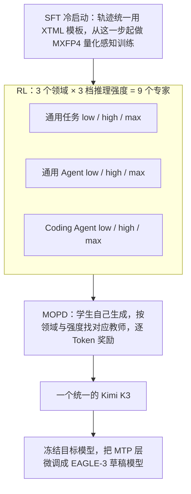
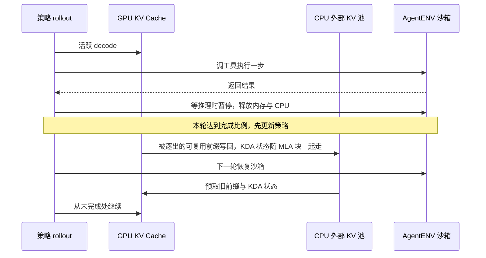
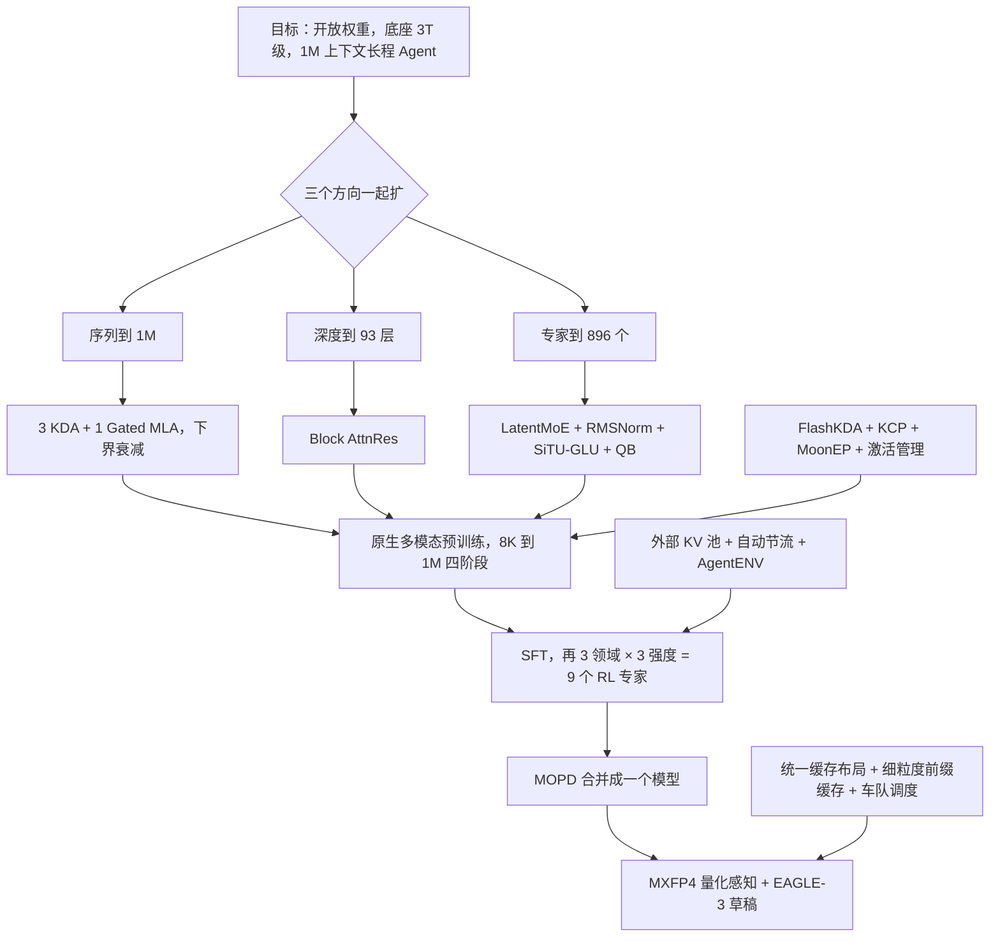

# Kimi K3：序列、深度、宽度一起扩，信息流就成了系统问题

<!-- release-date: 2026-07-16 -->

> 本文依据本地 `papers/Moonshot/Kimi-K3.pdf`，即 **Kimi K3: Open Frontier Intelligence — Technical Report of Kimi K3**，arXiv:2607.24653v2，2026-08-07 提交的修订版，共 47 页。页码均指 PDF 自身的页码。文中会区分三件事：**报告明确写了什么**、**我们怎么解释它**、**哪些是外部资料或本文推算**。

## 阅读前先认识几个词

只需要五个概念就能读完全文：

- **Token（词元）**：模型读写的最小单位。文字、代码、图像块、视频帧最终都变成 Token 序列。
- **KV Cache（Key-Value Cache，键值缓存）**：生成时把每个历史 Token 算出的 Key 和 Value 留在显存里，下一步就不用重算整段历史。标准注意力的这份缓存随上下文变长而线性增长。
- **残差流（residual stream）**：信息穿过一层层网络的主干道。标准残差连接把每一层的输出都加到同一个状态上，层越多，早期的东西越被稀释。
- **MoE（Mixture-of-Experts，混合专家）**：把前馈网络拆成很多个小专家，每个 Token 只让其中几个干活。总参数可以很大，单个 Token 的计算量不跟着涨。
- **RL（Reinforcement Learning，强化学习）与 rollout**：让模型实际去做任务，按结果好坏继续训练；模型做一次任务留下的完整过程叫 rollout（轨迹）。

这份报告里最重要的几个名字：

- **KDA（Kimi Delta Attention）**：一种线性注意力，把整段历史写进一个固定大小的矩阵状态，代价不随上下文变长。
- **Gated MLA**：带输出门的多头潜在注意力（MLA 最早出自 DeepSeek-V2），负责隔几层做一次真正的全局回看。
- **AttnRes（Attention Residuals，注意力残差）**：让每一层像做注意力一样，自己挑要从哪些旧层取信息。
- **Stable LatentMoE**：让大量路由专家在一个更窄的潜空间里干活，再用三件工具把它稳住。
- **MOPD（Multi-Teacher On-Policy Distillation，多教师同策略蒸馏）**：把 9 个分领域、分推理强度训练的专家，合并回一个学生模型。

## 一句话先说清

Kimi K3 是一个 2.8T 总参数、每 Token 激活 104B、原生支持视觉、上下文 1M Token 的 MoE 模型，权重全部开放（PDF p. 1）。报告称，架构、数据和训练方法的改进合起来，相对 Kimi K2 带来约 **2.5 倍**的整体 scaling efficiency（缩放效率）（PDF p. 1、p. 10）。

报告开头给的动机很直接：推理模型让「测试时计算」成了第二条 scaling 轴，开源社区在这条轴上进步很快；但在第一条轴（预训练底座的规模）上，很多开源模型还停在 1T 级左右。K3 要把两条轴一起推到前沿：底座推到 3T 级，同时在 1M 上下文上放大 RL、推理强度和长程交互（PDF p. 2）。

把一个模型同时往三个方向扩（序列到 1M、深度到 93 层、专家到 896 个），信息在三个地方都会堵。K3 的做法是每个方向换一种信息流动方式：

1. **序列方向**：3 层 KDA 配 1 层 Gated MLA，便宜的压缩记忆和昂贵的全局回看分层出现；
2. **深度方向**：AttnRes 让层可以回头挑旧层，而不是只接收所有旧层的总和；
3. **宽度方向**：Stable LatentMoE 让 896 个专家在一半宽度的潜空间里工作。

然后，这三处改动一路传导到训练并行、RL 系统、沙箱和线上缓存，报告用了 9 页讲 infra（PDF p. 17–25）。

报告对结果的自我定位也很克制：整体仍落后于最强的两个闭源模型 Claude Fable 5 和 GPT-5.6 Sol，但在它的评测集里稳定领先其余开源和闭源模型（PDF p. 1、p. 26）。

如果只记一句话，可以记这一句：

> **规模扩大之后，真正要设计的是信息怎样流动：沿序列、沿深度、沿专家。每一处流动方式的改变，都会连带改掉训练、RL 和服务系统。**

## 先看全景：一个块里的三条信息流

序列、深度、宽度三处各换了一种走法，下面三节分别讲。输入端还有一条原生视觉通路：图像和视频先经过从零训练的 MoonViT-V2，再由一个轻量 MLP 投影进语言主干（PDF p. 3、p. 10）。

和上一代放在一起看（PDF p. 11，Table 1）：

| 配置 | Kimi K2 | Kimi K3 |
|---|---:|---:|
| 层数 | 61 | 93 |
| 总参数 / 每 Token 激活参数 | 1.04T / 32.6B | 2.78T / 104.2B |
| 隐藏维 | 7,168 | 7,168 |
| LatentMoE 潜空间维度 | — | 3,584（隐藏维的一半） |
| 单个专家的中间维 | 2,048 | 3,072 |
| 路由专家 / 每 Token 激活 | 384 / 8 | 896 / 16 |
| 共享专家 | 1 | 2 |
| 注意力头数 | 64 | 96 |
| 稠密层 | 1 | 1 |
| 词表 | 160K | 160K |
| 训练上下文 | 128K | 1M |
| 注意力 | 61 层 MLA | 69 层 KDA + 24 层 MLA |
| 激活函数 | SwiGLU | SiTU-GLU |
| MTP 层 | 1 | 1 |
| 视觉编码器 | — | 401M 参数，27 层，patch 14，12 头 |

K2 一列照录 K3 报告的 Table 1。其中「MTP 层 1」在 K2 自己的报告里没有出现，公开发布的 Kimi-K2-Instruct 配置里 MTP 层数是 0（外部补充），这一格以 K3 报告的说法为准、来源存疑。

表里有一个容易跳过的细节：**隐藏维没变**，还是 7,168。K3 的总参数涨了 167%、激活参数涨了 220%，几乎全部来自更深（93 层）和更宽的专家池，而不是加宽主干（涨幅来自 Table 1 的 Δ 列）。这也是为什么深度方向的信息流（AttnRes）和专家方向的稳定性（Stable LatentMoE）在 K3 里变成了头等问题。

## 第一层矛盾：三个方向一起扩，信息在三处堵住

### 序列：1M Token 太贵，压缩又会丢

标准注意力让每个 Token 都能直接看到所有历史，擅长精确检索；但计算量随长度平方增长，KV Cache 线性增长。线性注意力把历史写进固定大小的状态，内存不涨；但历史被压缩后，模型很难再精确地回到某一个具体 Token。

只用一种，要么太贵，要么太忘。

### 深度：残差流是一条越来越挤的路

报告的比喻是：标准残差连接把所有之前的信息压进同一个状态 $h_l$，这在深度方向上的瓶颈，很像 RNN 在时间方向上的瓶颈（PDF p. 6）。Transformer 用注意力取代了时间上的循环；那深度方向上，能不能也用注意力取代「一路相加」？

### 宽度：专家越多越细，越容易失控

专家池从 384 扩到 896，每 Token 激活从 8 个到 16 个。报告点名了这种极端稀疏会放大的两种失败（PDF p. 6–7）：

1. 路由路径由降维、专家前馈、升维串成将近 4 次连续矩阵乘，这种病态结构在 2.8T 规模上会让内部激活爆炸；
2. 把近千个专家的负载拉平，超出了现有「无辅助损失偏置更新」还能表现良好的范围。

> 三处的共同点是「选择性读取」：序列上读哪些 Token，深度上读哪些层，宽度上读哪些专家。K3 的三个核心设计，都是在改这三种读取方式。

## 核心设计一：序列方向，KDA 负责记，MLA 负责回看

### 排法：3:1 混合，最后一层一定是全局注意力

每个块里 3 层 KDA 后接 1 层 Gated MLA，这个模式在主干里重复；主干末尾再加 1 层 Gated MLA，保证最后一层一定做全局注意力（PDF p. 4）。于是全模型是 69 层 KDA 加 24 层 MLA（PDF p. 11），也就是 23 个块加末尾 1 层，共 93 层（本文算术）。

### KDA：带逐通道遗忘的增量规则

先看一个注意力头。KDA 维护一个矩阵状态 $S_t \in \mathbb{R}^{d_k \times d_v}$，每来一个 Token 更新一次（PDF p. 4，式 1）：

$$
S_t = \left(I - \beta_t k_t k_t^{\top}\right)\mathrm{Diag}(\alpha_t)\, S_{t-1} + \beta_t k_t v_t^{\top},
\qquad
\tilde{o}_t = S_t^{\top} q_t
$$

从右往左读这一步做了三件事：

- $\mathrm{Diag}(\alpha_t) S_{t-1}$：先按通道遗忘，$\alpha_t \in (0,1)^{d_k}$ 是每个 Key 通道各自的保留率；
- $(I - \beta_t k_t k_t^{\top})$：再沿当前 Key 的方向擦掉旧内容，$\beta_t \in (0,1)$ 控制写入强度；
- $+\beta_t k_t v_t^{\top}$：最后写入新内容。读出时用查询 $q_t$ 去乘状态。

状态大小只由头维决定，不随 Token 数增长。代价是：状态本身就是压缩，历史不是无损保留的。

训练时 KDA 不会逐 Token 串行跑。它把序列切成 chunk，chunk 内并行、chunk 间传状态（PDF p. 4，式 3–4）。chunk 内的并行公式会用到累计保留率的**倒数**来重缩放 Key。许多小于 1 的保留率连乘，倒数可能大到溢出。

### 下界衰减：先限定数值范围，kernel 才能统一

前作 Kimi Linear 在对数空间里算相对衰减，并把每个 chunk 再切成 16 Token 的小块。非对角小块可以直接用 Tensor Core 做密集矩阵乘，但对角小块仍然要逐个位置对显式计算，这是 chunk 内的主要瓶颈（PDF p. 4）。

K3 改的是从衰减 logit $z_t$ 到每步对数衰减 $g_t$ 的映射（PDF p. 5，式 5）：

$$
g_t = g_{\min}\,\mathrm{Sigmoid}\!\left(e^{A} z_t\right) \in (g_{\min}, 0),
\qquad
\alpha_t = e^{g_t},
\qquad
g_{\min} = -5
$$

Kimi Linear 用的是负 Softplus，取值范围是 $(-\infty, 0)$，没有下界。换成带缩放的 Sigmoid 之后，下界就是 $-5$。图下方那条数值链是报告自己给的推导（PDF p. 5）。

收益不只是「更稳定」：**一个参数化的改动，直接删掉了一条 kernel 慢路径。** 代价是每一步的保留率不能低于 $e^{-5}$，模型没法在一步之内把某个通道彻底清零。

K3 还把 KDA 的输出门从低秩改成输入相关的全秩投影，在按头的 RMSNorm 之后逐通道控制输出（PDF p. 5，式 6）。

### Gated MLA：隔几层做一次真正的全局回看

MLA 把每个 Token 的 Key 和 Value 压成一条低维潜向量 $c_t = W_c x_t$ 来缓存，用时再升维（PDF p. 5）。它仍是全局注意力，缓存仍会随序列增长，只是每个 Token 存得少。

K3 对 MLA 做了两处改动：

- **全部 MLA 层都不用显式位置编码（NoPE）**。Query 和 Key 都不加 RoPE 之类的位置编码。位置和新近性交给中间的 KDA 层提供，MLA 只做按内容的全局交互。这样扩上下文时不用重调 RoPE 的频率基，也不用 YaRN（PDF p. 5）。
- **加一个输入相关的逐通道全秩输出门**（PDF p. 5–6，式 7）：

$$
y_t = W_o\left[\mathrm{Sigmoid}(W_g x_t) \odot \tilde{o}_t\right]
$$

$\tilde{o}_t$ 是不带门的注意力输出。门让每个 Token 决定从全局注意力里读哪些通道。

还有一个训练细节：为了修正前人指出的 flash attention 中的有偏舍入误差，训练时注意力输出保持 FP32。这让片上输出 tile 的占用翻倍，于是团队重排了训练 kernel，让它和 KV 暂存缓冲重叠，而不是和 Query tile 重叠，腾出共享内存给更深的 KV 流水线（PDF p. 6）。更高的精度不是一个开关，它要连着共享内存布局一起改。

### 这一节的代价与边界

- **KDA 的固定状态只属于 KDA 层。** 24 层 MLA 的 KV Cache 仍会随上下文增长。把 K3 说成「1M 上下文固定显存」是错的。
- **NoPE 只解决「位置编码怎么外推」。** 模型能不能真的用上远处的信息，要靠后面讲的渐进式长上下文训练和专门合成的长距离任务。
- **3:1 这个比例是给定的**，报告没有给出搜索过程或全尺寸消融。

### 这一节可以带走什么

- **便宜的压缩记忆和昂贵的精确回看可以分层出现。** 日志 Agent、视频模型、长期记忆系统都可以让大部分层做压缩，只让少数层做全局读取。
- **先把数值范围写进参数化，再设计 kernel。** 如果算子因为极端值不得不保留特殊分支，限制参数的值域有时比继续优化那条分支更有效。

## 核心设计二：深度方向，AttnRes 让层自己挑旧层

### 完整版：在深度上做一次 softmax 注意力

对第 $l$ 层，定义一个只属于这一层的可学习伪查询 $q_l = w_l \in \mathbb{R}^d$；Key 和 Value 都是之前各层的输出，第 0 个来源是 Token embedding（PDF p. 6，式 8）。然后（式 9）：

$$
\alpha_{i \to l} = \frac{\exp\!\left(q_l^{\top} \mathrm{RMSNorm}(k_i)\right)}{\sum_{j=0}^{l-1} \exp\!\left(q_l^{\top} \mathrm{RMSNorm}(k_j)\right)},
\qquad
h_l = \sum_{i=0}^{l-1} \alpha_{i \to l}\, v_i
$$

$\alpha_{i \to l}$ 是第 $l$ 层分给第 $i$ 个旧来源的权重。RMSNorm 防止输出幅度大的层单凭幅度垄断权重。于是第 $l$ 层可以说「我主要要第 5 层和第 20 层的东西」，而不是被动接收所有层的总和。

层数不到 100，这个 $O(L^2 d)$ 的算术量付得起；真正的开销是要把所有层的输出都留着，显存是 $O(Ld)$，流水线并行下还要跨 stage 传（PDF p. 6）。

### Block AttnRes：块内只累加，块间才做注意力

把 $L$ 层切成 $N$ 块。块内各层的输出直接求和，得到一个块级表示；块间才对这 $N$ 个块级表示做完整的注意力（PDF p. 6，式 10）。块内第一层看的是 embedding 加之前各块的汇总；之后的层再多看一个「本块到目前为止的部分和」。

这样显存和通信从 $O(Ld)$ 降到 $O(Nd)$。块结构还限定了推理时的状态大小，让并行算出的块间结果能用 online softmax 和顺序推进的块内部分和合并，明显降低推理耗时（PDF p. 6）。

报告说 $N \approx 8$ 在各种规模上都能拿回大部分收益；K3 用 8 块、每块 12 层，最后一块不满，连 embedding 共 9 个块级来源（PDF p. 6）。

### 这一节的代价与边界

- 块级表示要一直留着，流水线并行时要跨 stage 传。报告为此在训练侧做了「块表示只生成一次、只增量传新块」的优化（PDF p. 20），在服务侧给 prefill 和 decode 各写了一套 kernel（PDF p. 24）。
- 报告没有给 AttnRes 在 K3 全尺寸上的单独消融，它对最终分数贡献多少不可知。

**可以带走的一条**：深层网络的信息瓶颈不只在 Token 之间，也在层之间。如果模型总要在后层恢复早期的细节，可以考虑让深度方向也有受控的检索，而不是只加宽主干。

## 核心设计三：宽度方向，Stable LatentMoE

### LatentMoE：公共路径全宽，专业路径变窄

普通 MoE 里，每个被选中的专家都收到完整的 $d$ 维表示，专家越多、激活越多，通信和专家权重的读取就越多。LatentMoE 把两条路分开（PDF p. 6–7，式 11）：

$$
u = \sum_{i \in \mathcal{T}_k(x)} p_i\, E^{\text{routed}}_i\!\left(W_{\downarrow} x\right),
\qquad
y = \sum_{j=1}^{N_s} E^{\text{shared}}_j(x) + W_{\uparrow}\,\mathrm{RMSNorm}(u)
$$

- 共享专家直接处理全宽的 $x$，$N_s = 2$；
- 路由路径先用 $W_{\downarrow}$ 把 $x$ 压到 $\ell = 3{,}584$ 维，在潜空间里由选中的 16 个专家处理，加权汇总成 $u$，再用 $W_{\uparrow}$ 升回全宽。

896 选 16，报告称稀疏度为 56（PDF p. 6）。

### 稳定件一：升维前加 RMSNorm

原版 LatentMoE 直接对汇总结果 $u$ 升维，而 $u$ 的尺度会随选了哪些专家、权重多大而变。K3 在汇总和升维之间插一个 RMSNorm，降低路由分支对尺度变化的敏感度，再和全宽的共享分支相加。报告说这一改动除了稳住训练，还**稳定地改善了验证损失和下游基准**（PDF p. 7）。

### 稳定件二：SiTU-GLU，两条分支都加软上限

SwiGLU 是两个因子相乘，而且两个因子都没有上界；某个坐标上两边同时很大，就会冒出激活离群值，低精度下还有溢出风险（PDF p. 7）。K3 提出 SiTU-GLU（Sigmoid Tanh Unit GLU），用平滑上限 $\mathrm{softcap}(x, \beta) = \beta \tanh(x/\beta)$ 分别罩住门分支的线性因子和上分支（PDF p. 7，式 12）：

$$
\mathrm{SiTU\text{-}GLU}(x) = \left[\beta_1 \tanh\!\left(\frac{W_g x}{\beta_1}\right) \odot \mathrm{Sigmoid}(W_g x)\right] \odot \left[\beta_2 \tanh\!\left(\frac{W_u x}{\beta_2}\right)\right]
$$

K3 取 $\beta_1 = 4$、$\beta_2 = 25$（PDF p. 8）。$\tanh$ 在原点附近近似线性，所以 SiTU-GLU 在原点附近一阶等于 SwiGLU；数值大了才平滑饱和，每个输出坐标的绝对值都小于 $\beta_1 \beta_2 = 100$（PDF p. 43，附录 B）。和对门的预激活直接硬截断相比，平滑上限在饱和边界以外仍保留非零梯度，报告说这样训练表现更好（PDF p. 43）。

### 稳定件三：分位数均衡，直接算出门槛

K3 沿用无辅助损失的路由：给每个专家一个偏置 $b_j$，只在 Top-k 选择时加上，不进混合权重（PDF p. 8，式 13）：

$$
\mathcal{T}_i = \mathrm{argtopk}\left(s_i + b\right),
\qquad
p_{i,j} = \frac{s_{i,j}}{\sum_{r \in \mathcal{T}_i} s_{i,r}}
$$

$s_i = \mathrm{Sigmoid}(W_r x_i)$ 是路由分数。因为 $b$ 不在 $p_{i,j}$ 里，它只管「分给谁」，不改变混合权重，也不干扰路由器自身的梯度优化。

问题在 $b$ 怎么更新。原方法每步按负载偏高或偏低，把偏置固定地挪一个步长 $\gamma$：步长小就适应慢，步长大就来回震荡，专家池到 896 个时更难拉平（PDF p. 8）。

**QB（Quantile Balancing，分位数均衡）** 不再一步步推，而是直接算出让每个专家恰好接到目标负载 $q = mk/n$ 的偏置（$m$ 个 Token、$n$ 个专家、每 Token 选 $k$ 个）。做法是路由时多取一个，用 Top-$(k+1)$：前 $k$ 个是真正走的路由，第 $k+1$ 个分数就是 Token $i$ 的截止线 $\alpha_i$。于是专家 $j$ 在 Token $i$ 上的 margin 是 $s_{i,j} - \alpha_i$，把门槛放在这一列第 $q+1$ 大的 margin 上，恰好 $q$ 个 Token 越线。因为 $q/m = k/n$，这就是 margin 的 $(1-k/n)$ 分位数（PDF p. 8–9，式 14）：

$$
\hat{b}_j^{(t+1)} = -\,\mathrm{quantile}_{1-k/n}\!\left(s_{:,j} - \alpha^{(t)}\right),
\qquad
b^{(t+1)} = \hat{b}^{(t+1)} - \mathrm{mean}\!\left(\hat{b}^{(t+1)}\right)\mathbf{1}
$$

第二步减去均值，因为所有偏置一起平移不改变 Top-k 的结果。新偏置下一步才生效，一个 batch 永远不会用从它自己算出来的偏置去路由；推理时偏置冻结（PDF p. 9）。

附录把这件事放回最优均衡指派问题：QB 的两步更新正是对偶问题上沿 Token 轴和专家轴的精确坐标下降，而原来的固定步长更新相当于在同一个对偶目标上走一步 SignSGD。所以 QB 不需要类似学习率的超参数，也能更快达到均衡（PDF p. 43–44，附录 C）。

规模上的实现是直方图：全局 batch 的 margin 有几百万个，分散在各卡和各个梯度累积步里，没法收齐算精确分位数。K3 给每个专家维护一个 1000 桶的直方图，前向时各卡本地累加计数，step 末一次整数 all-reduce 合并，再从累计计数里读分位数。误差不超过一个桶宽，$B = 1000$ 时至多几个 $10^{-3}$，没观察到可测的残余不均；通信量与 Token 数无关，在报告的配置下不到逐 micro-batch 交换原始 margin 的 1%（PDF p. 44–45，附录 D）。

### 稳定宽度扩展不是一个组件

「Stable」来自三件事一起起作用：RMSNorm 管尺度，SiTU-GLU 管值域，QB 管负载。只搬走其中一个名字，不能假设会得到同样的效果。报告没有公开三者在 2.78T 模型上的拆分消融；公开了的是 RMSNorm「稳定改善验证损失」这一句定性结论。

**可以带走的一条**：多个无界因子相乘的链条，只在最后截断就晚了；更稳的是每个因子在常用区间内保持原样、在极端处平滑封顶。负载均衡同理，能写成「满足目标负载的门槛」时，就直接解出门槛，而不是一步步推。

## 原生视觉与 Per-Head Muon

### 视觉编码器从零训练，为的是稳

K3 从预训练第一天起就让文本、图像、视频在同一个上下文里、用同一个下一 Token 预测目标一起训练，没有事后的模态对齐阶段。渲染结果和生成它的代码处在同一 Token 流里，模型可以写代码、看截图或视频帧、再改，不用把视觉任务交给另一个模型（PDF p. 9、p. 11）。

和 Kimi K2.5 最大的不同是视觉编码器 MoonViT-V2 **从零开始**、用下一 Token 预测训练。之前包括 K2.5 在内的做法都用 SigLIP 这类对比学习预训练的模型初始化编码器。报告说放弃这个做法主要是为了训练稳定：把预训练编码器接到语言模型上联合训练时，SigLIP 初始化的 MoonViT-3D 梯度范数持续偏高、尖峰频繁，而 MoonViT-V2 全程稳定（PDF p. 9，Figure 6）。报告还说 MoonViT-V2 在各项视觉评测上与 SigLIP 初始化的基线相当，并据此认为在这个规模上对比预训练作为初始化不是必需的（PDF p. 9）。

这个结论的准确说法是「训练更稳，最终持平」，不是「从零训练在视觉分数上更高」。报告没有给逐项的视觉对比表。

MoonViT-V2 有 27 层、约 0.4B 参数，用 RMSNorm，去掉了线性层和注意力投影里所有的 bias，进一步帮助从零训练稳定。图像和视频共享全部参数，注意力拆成帧内空间和帧间时间两步，再沿时间池化；进入语言主干前用 $2 \times 2$ 的 pixel shuffle 把视觉 Token 数降到四分之一，所以最大 3584 × 3584 像素的输入也能放进 1M 上下文（PDF p. 10）。

### Per-Head Muon：别让大头抢走小头的更新

K3 沿用 K2 的 Muon 优化器（对矩阵参数的动量做 Newton–Schulz 正交化）。对 Q、K、V 投影，K3 改成按头处理：把动量矩阵沿头的维度切开，每个头单独正交化（PDF p. 10）。

理由是：整矩阵正交化把所有头当成一个耦合的大块，梯度或动量大的头会主导共同的更新方向，小尺度的头得不到充分归一化。按头处理让各头的更新尺度更均衡，大规模下训练更稳；细长的小块做 Newton–Schulz 也比整块便宜一点（PDF p. 10）。

## 预训练：路线公开了，总账没有

### 数据

文本语料分四个领域：网页文本、代码、数学、知识。每个领域都用规则、分类器质量打分和去重过滤，领域采样率由小模型消融决定；知识和数学语料沿用 K2 的改写流程，按不同风格和视角改写、分块自回归生成、再与原文做忠实度核验（PDF p. 10）。

视觉语料沿用 K2.5 的分类：图文描述、图文交错文档、OCR、感知、视频、视觉编程。定位监督同时给绝对坐标和归一化到 $[0,1]$ 的坐标。另外大幅扩充了「代码 + 渲染结果」配对的程序化多模态数据，覆盖 SVG、3D 资产、网页、游戏和 CAD 图（PDF p. 10）。

报告**没有公开**：预训练总 Token 数、各类数据的配比、来源清单、合成数据占比、去重阈值和污染检查。

### Scaling law：两种学习率曲线要分别调参

架构、数据和训练方法都变了，最优训练区间也跟着变，所以团队重新做了 scaling law 研究，重调 batch size、学习率、每参数 Token 数和模型形状。在留出的分布外验证集上，拟合曲线显示这些改进合起来带来约 2.5 倍的 scaling efficiency（PDF p. 10，Figure 7 在 p. 11）。

这里有一个值得学的实验习惯。对比 cosine 衰减与 WSD（Warmup-Stable-Decay）时，团队发现两者的最优峰值学习率和 batch size 差别很大；拿同一组超参去比，结果只是在偏袒和那组超参更合拍的那一方。于是对两种 schedule 各做一次独立的 scaling law 搜索，各自最优时，cosine 的最终损失始终更低，K3 因此默认用 cosine（PDF p. 10）。

Figure 7 只标了两条拟合线、「2.5×」的间距和 $10^{20}$、$10^{21}$ 两个 FLOPs 刻度（PDF p. 11），读者无法重建拟合，也看不出各组件的贡献。**2.5 倍是整体结果，不是某个组件的加速，也不是训练吞吐快了 2.5 倍。**

### 训练 recipe 与上下文课程

公开的优化设置：Per-Head Muon，加 K2 的权重裁剪；MoE 用 QB；cosine 学习率，前 1% 线性 warmup；weight decay 全程 0.1（PDF p. 11）。峰值学习率、batch size、训练步数、GPU 数量、训练时长、总 FLOPs 都没有公开。

1M 上下文分四个阶段拉长：预训练阶段从 8K 到 64K，cooldown 阶段从 256K 到 1M。最贵的超长序列计算集中在很小一部分训练预算里（PDF p. 12）。

长数据有两个处理要点（PDF p. 12）：

- **清洗与上采样**：自然来源的长文档和长视频里有大量近重复、二进制块、截断文件和坏日志，用精确与模糊去重、视频帧的感知哈希、规则与分类器过滤、结构校验清掉；真正连贯的长样本稀少，cooldown 时上采样。
- **制造远程依赖**：报告的原话是「长度本身不带来长程能力」。团队把多模态文档和子任务仔细打乱、拼接，合成出只有看遍整段 1M 上下文散落的信息才能完成的任务，防止注意力退化成只看局部。

**可以带走的一条**：长上下文数据要能证明「删掉远处的部分，任务就做不出来」。只把短样本拼长，花了钱，长程能力未必出现。

## 后训练：先分开练，再合并回一个模型

后训练分三段：SFT 建立 Agent 冷启动能力，RL 按领域和推理强度分别训出专家，MOPD 把这些专家合并成一个模型（PDF p. 12）。

根据 PDF p. 12–14 的 §4.1 重画，是流程示意，不表示各段的算力或数据比例。

### SFT：模板本身就是接口协议

SFT 数据用前代 Kimi 的分领域模型合成轨迹，再经多阶段验证和人在环标注，大幅扩充了复杂 Agent 任务的覆盖（PDF p. 12）。

所有数据用 XTML（eXtensible Token Markup Language）模板序列化。它长得像 XML，但尖括号语法被三个保留的特殊 Token 取代，每个结构边界都是显式的特殊 Token，消除了元素边界上的分词歧义，也方便流式解析和约束解码（PDF p. 46，附录 F）。几个设计点（PDF p. 46–47）：

- **放置位置反映作用范围**：工具声明和推理强度这类全局选项放在所有输入消息之前；`tool_choice`、`response_format` 这类单次选项放在输入消息之后，改它们不会让历史 KV Cache 失效；会话中途加载的工具用一条额外的工具声明消息插进来，不用重建前面的上下文。
- **助手消息分三个 channel**：think、response、tools。思考模式与指令模式只靠生成前缀区分。K3 只支持保留思考：思考模式下历史里的 think channel 一直保留，哪怕是空的。
- **工具调用带编号、参数带类型**：并行调用用 index 对应结果；字符串参数直接写原文，代码不用再转义成 JSON 字符串。
- **推理强度用自然语言写进一条选项消息**，而不是改生成前缀或暴露 Token 预算，预训练模型本来就擅长遵循这种指令，新增选项几乎不用额外训练。

### RL：3 个领域 × 3 档强度

K3 不为单个基准训专门的 RL 模型，而是分三大领域，每个领域在每档推理强度上各训一个专家（PDF p. 12）：

1. **通用任务**：一般体验、视觉、推理、忠实性、搜索、知识工作；
2. **通用 Agent**：长程助理、深度研究、段落级写作；
3. **Coding Agent**：软件工程、编码体验、kernel、网页开发。

强度分 low、high、max 三档，合计 9 个专家。Figure 8 画了 8 个内部与公开评测在 RL 过程中的分数和平均步数，随 RL FLOPs 增加整体上升，工具调用步数也跟着增加（PDF p. 13）。图上没有给坐标数值和最终 FLOPs，曲线也有明显波动；它支持「继续加 RL 算力仍有效」，不能读成各项能力同比例增长。

### Partial rollout：长轨迹不必等齐

每轮对 $N$ 个 prompt 各采 $K$ 条轨迹。等到 $\lambda NK$ 条（$\lambda \in (0,1)$）完成就暂停生成，先拿已完成的去更新策略；没完成的轨迹进队列，下一轮开头优先续跑。一个 prompt 的 $K$ 条全部完成后立即送去优化（PDF p. 13）。

一条长轨迹因此会跨多轮迭代，数据会「过期」。报告说它的策略优化算法通过一个逐 Token 正则化把更新限制在局部邻域内，能容忍这种极端离策略的情形（PDF p. 13）。正则化的具体公式和系数没有公开，算法本体说是沿用 K2.5。

### 推理强度 RL：把预算写进奖励

每道题有一个从冷启动模型估出的初始 Token 预算 $b_0(x)$。轨迹的总用量 $T(y)$ 超过 $\tau \cdot b_0(x)$ 时，奖励直接改写成 $-1$。通用任务里 $T(y)$ 数思考 Token；Agent 任务里数所有输出 Token，包括推理和工具调用参数（PDF p. 13）。

训练按 $\tau$ 分阶段：先用较大的 $\tau$ 训 max 专家（仍设上限防过度思考），再把 $\tau$ 退火得到 high 和 low；$\tau$ 的调整在人的指导下按领域配置（PDF p. 13）。推理强度因此是训练时学出来的预算条件，不是上线时的截断。

### Agentic GRM：开放题的评审必须按规程来

不可自动验证的通用任务用 Agentic Generative Reward Model（GRM），沿用 K2.5 的锦标赛式两两比较组内奖励。评审 Agent 必须按四步规程走：读产出、生成量表、按量表给每个候选打分、把分数记进 scorepad（PDF p. 13）。

为防止奖励黑客往「越写越长」的方向跑，加了和推理强度同形的长度控制：从冷启动模型估一个初始长度 $\ell_0$，乘数 $\sigma$，候选长度超过 $\sigma \cdot \ell_0$ 就自动输掉那次比较（PDF p. 13）。$\sigma$、量表数据和 GRM 本身的规模没有公开。

### MOPD：学生在自己会走到的地方学

训练时，对领域 $d$ 和采样到的推理强度 $e$，用 9 个专家中对应的那个做教师。学生自己生成回答，在每个生成的 Token 上计算奖励（PDF p. 13–14，式 15）：

$$
r^{d}_{\text{opd}}(y_t \mid e, x, y_{<t}) = \mathrm{clip}\!\left(\mathrm{sg}\!\left[\log \frac{\pi^{(d,e)}_{\text{teacher}}(y_t \mid x, y_{<t})}{\pi_\theta(y_t \mid e, x, y_{<t})}\right],\ -R_{\max},\ R_{\max}\right)
$$

$\mathrm{sg}$ 是停止梯度，$R_{\max}$ 裁掉极端的优势信号。教师比学生更看好这个 Token，奖励为正；反之为负。它的要点是 **on-policy**：学生在自己真实会走进的状态上向教师学，避免离线蒸馏「训练时看的是教师的轨迹，部署时却走进自己的陌生状态」的落差。这个奖励是逐 Token 的稠密信号，可以直接接进 RL 框架，partial rollout 也照样能用（PDF p. 14）。

报告还说试过更细的 top-k 蒸馏目标，在它的设定下收敛速度和最终表现都没有明显优势（PDF p. 14）。9 个教师的数据量、采样比例和 MOPD 的训练量没有公开。

### 部署感知的后训练：量化和草稿模型都进训练闭环

**MXFP4 量化感知训练。** MoE 专家权重占了参数内存的大头，K3 把它们量化到 MXFP4，专家的输入激活用 MXFP8；注意力投影、LatentMoE 投影、共享专家和路由器保持高精度。整个后训练阶段（SFT 和 RL）都做量化感知训练；RL 里 rollout 和训练用同一套量化方案，消除训推不一致（PDF p. 12、p. 14）。

**EAGLE-3 草稿模型。** 投机解码让小草稿模型先猜几个 Token，再由大模型一次验证。K3 预训练时就带一个结构与主干块相同的 MTP 层，而 EAGLE-3 的草稿模型恰好是一个同结构的解码层，于是直接把 MTP 层微调成草稿模型，目标模型冻结（PDF p. 14）。细节：

- 训练时展开 7 步，第一步之后草稿吃自己之前的输出，模拟推理时的循环起草；
- 输入融合目标模型第 1 个、第 4 个和最后一个 AttnRes 块的输出（低、中、高层特征），拼接后用一个无偏置矩阵投影，初始化为 $[\,0\ \ 0\ \ I\,]$，开始时等于只用高层特征，也就是 MTP 层预训练时的输入，之后再慢慢学会用低、中层；
- 损失直接优化接受率。无损投机采样下每个 Token 的接受率是 $\sum_x \min(p(x), q(x))$，$p$、$q$ 是目标和草稿模型的下一 Token 分布。小容量的草稿模型最小化 KL 并不保证接受率最大，所以直接最小化它的负对数（PDF p. 14，式 16）：

$$
\mathcal{L}_{\mathrm{LK}} = -\log \sum_{x \in \mathcal{V}} \min\big(p(x),\ q(x)\big)
$$

草稿模型同样用专家 MXFP4、输入 MXFP8 的配置（PDF p. 14）。报告没有给接受长度和端到端加速的数字。

**可以带走的一条**：上线必用的低精度和加速手段，越早进训练闭环越好；代理模型（草稿、检索器、打分器）应该对着系统真正关心的决策指标训练，而不是对着一个方便的距离。

## RL 环境：先有可验证的环境，才有可放大的 RL

报告说 RL 的效果很大程度上取决于环境是否丰富、多样、能被可靠验证（PDF p. 14）。

### 统一白盒环境：同一个任务换不同 harness

只用一套固定的 Agent harness 训练，模型会过拟合到它的工具 schema、系统提示、上下文管理和交互协议。K3 的统一白盒 RL 环境把 harness 表示成一组可配置、可组合的模块：工具接口、系统提示、上下文管理策略、技能、记忆、子 Agent 等，能拼出 Kimi Code、Claude Code、Codex、OpenClaw、Hermes，也能拼出全新的组合。RL 时不同任务组动态配不同的 harness（PDF p. 14–15）。

### 知识图谱引导的任务合成：先知道哪里稀疏

任务质量和多样性主要由素材决定。K3 建了一个会自我扩展的层级知识图谱：从一组粗粒度种子节点出发，给每个节点派一个 Agent 多轮搜索；加新节点前先查图里有没有等价或相关概念以免重复；边永远从粗概念指向细概念，形成有向无环图；Agent 判断概念足够「原子」时这一枝停止扩展（PDF p. 15）。

出题时，按目标分布在不同粒度上采样节点（单个或相关组合），把关键词和祖先节点的上下文组合成检索词，取回真实材料，再由合成 Agent 做成编码、知识、视觉等不同类型的任务（PDF p. 15，Figure 9）。

### 几类可验证的 Agent 任务

| 任务类型 | 报告写的做法 | 奖励怎么来 |
|---|---|---|
| 多步信息搜索、专业工作、视觉推理 | 搜证据、在沙箱里操作领域工具做交付物；视觉题在带 Python 的沙箱里裁剪、放大、计算，把输出图像当新观察 | 答案可验证（PDF p. 15–16） |
| Kernel 优化 | 从单算子到融合大 kernel，覆盖 CUDA、Triton、CuTe DSL、TileLang 等写法和 BF16、FP8、FP4 | 超出数值误差阈值得 0；追平专家实现得 0.5，逼近硬件 roofline 趋向 1；惩罚 CUDA graph 回放、缓存输入、降精度等黑客手法（PDF p. 16） |
| 个人助理 | 仿真 Gmail、Notion、Slack、Canvas，任务跨多个模拟日，事件跨应用交织；单条 rollout 可达数千次工具调用、数百万 Token | 每个事件各有判据，规则或模型评判（PDF p. 16） |
| 自主执行任务（AET） | 只给目标、约束、工具和预算，没有参考轨迹；含黑盒系统复现、量化因子挖掘、税务审计 | 按最终环境状态由独立验证器评；公开验证器给诊断反馈，隐藏验证器评留出场景，提交次数有限（PDF p. 16） |
| 网页开发 | 从一句话到多段需求，产出网站、游戏、3D/WebGL、可视化、全栈应用，在多种脚手架下 rollout | 确定性检查加模型评判；构建失败、运行报错或伪造产物直接清零（PDF p. 16） |

Figure 10 是一个黑盒系统复现的例子：Agent 只能通过查询一个隐藏的 3D 相机维修管理系统来理解它，再把它重建成网页应用。验证器给出的完成度（PDF p. 17）：

| 模型 | 完成度 |
|---|---:|
| Kimi K3 | 1.000 |
| Claude Opus 4.8 | 0.918 |
| GPT-5.5 | 0.893 |
| Kimi K2.6 | 0.560 |

这是一个代表案例，不是这类任务的平均成功率。

**可以带走的一条**：长任务不要只有「最后过没过」。能暴露中间里程碑的验证器，让奖励更稠密，也让失败更好定位；公开与隐藏验证器分开，是防奖励黑客的直接手段。

## Infra 一：KDA 的算法与系统协同

KDA 用固定大小的递归状态替代了随长度增长的 KV Cache。串行更新让并行变难，但固定大小的状态又便宜、好传、好复用（PDF p. 17）。下面三处都围绕这两点。

### 设备内：FlashKDA 与 SM 级上下文并行

训练和 prefill 用 FlashKDA，一个基于 CUTLASS 的 chunkwise kernel，把 chunk 内计算和跨 chunk 的状态传递重叠起来，明显快过 Triton 参考实现，已作为 flash-linear-attention 的后端自动调度（PDF p. 17）。

纯张量并行部署时，头被分到各卡，但递归本身没有变短；超长序列 prefill 时，每张卡只有几个头，大部分 SM 空闲。关键观察是：每一段的状态转移可以脱离「进入这段时的状态」单独算，事后再精确拼起来。于是一张卡内把序列切给各 SM 并行算，再合并出每段的精确初始状态，不需要任何跨卡通信（PDF p. 17–18）。

### 跨设备：KCP 只交换固定大小的片段摘要

普通线性注意力的上下文并行可以直接把各卡从零状态算出的局部状态加起来。KDA 不行：它的更新是 $S_t = M_t S_{t-1} + \beta_t k_t v_t^{\top}$，其中 $M_t = I - \beta_t k_t k_t^{\top} \mathrm{Diag}(\alpha_t)$ 会先作用在进入的状态上，所以一段序列的效果依赖于进入它时的状态（PDF p. 18）。

KCP（KDA Context Parallelism）把每一段对状态的作用拆成两个都能本地算的量：累计转移 $M$ 和从零状态出发的局部写入 $\widetilde{S}$。第 $i$ 段就是一个仿射变换 $F_i(S) = M_i S + \widetilde{S}_i$（PDF p. 18，式 17）。两段首尾相接：

$$
F_j\big(F_i(S)\big) = M_j M_i\, S + \left(\widetilde{S}_j + M_j \widetilde{S}_i\right)
$$

这种合并满足结合律，所以能做前缀扫描。每张卡先用本地 Token 算出自己的 $M$ 和 $\widetilde{S}$，一次 all-gather 交换，然后各自按顺序从 $S = 0$ 开始套用前面各段的变换，重建自己的进入状态。通信量是固定大小，与序列长度无关（PDF p. 18）。上面这条两段合并式是本文为讲清结合律写的，报告给出的是多段展开的一般式。

**可以带走的一条**：如果一段数据对状态的作用能写成「可结合的转移 + 零状态贡献」，就可以先本地压成摘要，再交换摘要，而不是交换原始数据。

## Infra 二：3T 级预训练

预训练组合了带虚拟阶段的流水线并行、专家并行、ZeRO-1 数据并行、Pipeline ZeRO-2 梯度分片和上下文并行（PDF p. 18）。报告点名了三个问题：专家并行各卡负载不均、激活加梯度加优化器状态超出显存、视觉编码器计算量波动大而且卡在关键路径上（PDF p. 19）。

### MoonEP：每张卡恰好收 S × K 个 Token

传统专家并行里各卡收到的 Token 数不一样，算力不均拖慢训练，形状动态变化还带来显存碎片。MoonEP 在保留 DeepEP 这类方案整体流程的基础上，加入冗余专家的在线规划与迁移：前向时根据当前 micro-batch 这一层的路由结果规划冗余专家并预取，反向时把它们的梯度先放本地缓冲，算完再归约回原主卡（PDF p. 19）。

目标是每张卡恰好收 $S \times K$ 个 Token（$S$ 为序列长度，$K$ 为每 Token 选的专家数）。关键问题是需要多少冗余专家。报告证明：设 $E$ 个专家、$R$ 张专家并行卡，均衡方案总存在，且每张卡至多需要 $E/R$ 个冗余专家；这个上界基本是紧的，存在需要约 $E/R$ 个的路由输出（PDF p. 19，证明在 p. 45–46 附录 E）。预留 $E/R$ 个槽位就保证规划永远有解，训练不会中断。相比之下，报告指出 ECHO、UltraEP 等前作预设冗余数量或设每卡 Token 上限，一旦上限内无解训练就得停，上限还要手调（PDF p. 19）。

每步求精确最优太贵，所以离线用整数线性规划算一些代表性情形作参照，线上用一个 GPU 规划 kernel 求近似最优，开销可忽略，而且始终满足 $E/R$ 上界（PDF p. 19）。

完全均衡带来的连锁收益（PDF p. 19–20）：

- **零拷贝通信**：规划 kernel 事先算好每个 Token 的目的地，Token 直接发到远端卡上按专家分组的位置。同样的零拷贝路径，DeepEP 在最坏不均衡下要 $S \times K \times R$ 的通信缓冲，MoonEP 固定只要 $S \times K$；
- **静态形状、免同步**：每卡工作量事先确定，不用每层都让主机等设备回报 Token 数再发射 kernel；
- **专家 GEMM 调度**：卡间均衡了，卡内各专家的 Token 数仍然偏，用一个按当前分布调参的调度器排 GEMM；共享专家的 GEMM 放到单独的 stream 上重叠。

### 显存：按每个张量的生命周期管理

报告列了一组配合使用的做法（PDF p. 20）：

- **统一激活管理器**：每个留给反向的张量挂一个可插拔的存储后端，重算、量化、本地或远端卸载都只是存储策略，可按张量粒度自由组合，用注解声明、与模型代码解耦。K3 的大部分激活用分块 FP8 量化加卸载，逐元素算子用重算；
- **MoE 反向改写**：借鉴 SonicMoE，把路由概率的梯度改写成只依赖中间激活，不再依赖前向输出；分组 GEMM 的输入在反向时重算 dispatch 取回；
- **AttnRes**：块表示在块边界层只生成一次、常驻 GPU，AttnRes 计算整体做 checkpoint，每层留给反向的激活与标准残差相同；流水线阶段之间只增量传新块；
- **流水线各卡的激活平衡**：交错 1F1B 下前面的卡攒的激活多，用 Mooncake Transfer Engine 把激活卸到其他流水线卡的内存上；
- **Pipeline ZeRO-2**：梯度按数据并行分片后放 CPU，GPU 上只留双梯度缓冲；
- **点对点的 Muon**：Newton–Schulz 需要完整矩阵，每张卡只通过点对点通信从属主卡取回自己负责的参数分片，不再对整个参数缓冲做 all-gather。

### 视觉编码器：塞进流水线空隙

大图和长视频会让视觉编码器耗时暴涨、各卡负载不均。K3 把上下文并行扩展到编码器：大图沿 patch 维切到多卡，按子组分配多张大图；再把 ViT 的前向和反向拆开，除了开头必须同步做的那几个，其余全部排进流水线的空隙里，编码器的有效开销基本消失（PDF p. 21）。

## Infra 三：1M 上下文的 Agentic RL

报告把资源效率当成首要目标：用共置训练把每个 1M 上下文的 K3 RL 实验控制在几百张 GPU 内，用 partial rollout 削长尾。但长 rollout 要留 KV Cache，会额外占 CPU 内存，和训练侧的状态抢资源；prefill 和 decode 的效率又依赖前缀管理和请求调度（PDF p. 21）。

### 外部 KV 池：只写回离开活跃路径的前缀

1M 上下文的多步 rollout 里，一次前缀缓存未命中非常贵。partial rollout 让问题更糟：每轮开头，上一轮没跑完的长 prefill 请求同时涌来；投机解码又让请求在工具调用间隙周转更快，前缀块更替更频繁（PDF p. 21）。

K3 用写回（write-back）设计把「保留前缀」和「驻留 GPU」解耦：正在 decode 的块留在 GPU；可复用的空闲前缀只在被 GPU 逐出时才写到 CPU 内存里的外部 KV 池，下次复用前预取回来。KDA 状态与对应的 MLA KV 块一起卸载、一起预取，两种状态的生命周期保持对齐。比起写直通（write-through），只有离开活跃路径的前缀才占 CPU 内存和带宽（PDF p. 21）。

为了给外部池腾出内存，训练迭代结束后把模型权重和优化器状态卸到 NVMe；rollout 迭代结束后释放外部池（PDF p. 21）。NVMe 的带宽、容量和恢复耗时没有公开。

### 自动节流：并发随 KV 压力收紧

多步 rollout 的上下文越走越长。按全轨迹平均长度定一个固定并发，前期保守、后期又可能压爆 KV Cache 触发抢占。K3 在请求调度层用活跃请求数、排队请求数和 KV Cache 利用率等运行时信号动态控制发给推理引擎的请求数：前期放开，KV 压力上来后收紧，不用手调（PDF p. 21）。

### 借用梯度缓冲做参考模型前向

RL 损失需要参考模型这类只做前向的非策略模型，它们的权重太大，没法常驻 GPU。K3 把这些权重放在 CPU，用时才实体化，存储直接借用策略模型的 FP32 梯度缓冲：之后真正算梯度时会覆盖它，所以是安全的。配合 ZeRO-2，每张卡只保留两个 VPP chunk 的梯度缓冲，一个用于当前前向，另一个预取下一块，拷贝藏在计算后面（PDF p. 22）。

### AgentENV：暂停沙箱要比一直养着便宜

K3 用了容器、GPU 沙箱和一个新的 microVM 沙箱 AgentENV，后者与合作方共同开发并已开源（PDF p. 22）。三个设计目标（PDF p. 22）：

- **高保真隔离**：Agent 越强，探索越激进，甚至会尝试奖励黑客。早期用容器时观察到过几次由 Agent 意外操作引起的内核崩溃和死锁；而复杂任务又需要接近真实的环境，比如挂载磁盘、跑容器、起虚拟机。AgentENV 用 Firecracker 跑隔离的 microVM；
- **灵活的生命周期**：增量 checkpoint 只存上次以来被改写的内存页，checkpoint 和恢复的延迟低至 133 ms 和 49 ms。在此之上提供三种操作：暂停与恢复（暂停时不占内存和 CPU；Agent 等模型推理的时间可占沙箱生命周期的 98%）、fork（从原沙箱的精确状态分出新沙箱，原沙箱继续跑，用于无副作用地评判奖励）、定期快照（用于故障恢复）；
- **高密度**：数万个各带不同镜像的沙箱可能要在几秒内起来。镜像格式用 OverlayBD，配自研 ublk 驱动、存储层共享和 P2P 传输，大规模下启动延迟不到 1 秒；写时复制内存和页缓存优化让真实负载的内存超卖比达到 6.5 倍。

整个 K3 训练与评测共创建了 51,219,741 个沙箱，涉及 1,505,678 个镜像（PDF p. 22）。

根据 PDF p. 13 与 p. 21–22 的文字重画，是时序示意，不代表每次工具调用都会逐出 KV，也不按实际耗时比例。

partial rollout 只有在模型状态、KV 状态、环境状态三层都能恢复时才成立。少一层，暂停就变成重算。

## Infra 四：线上服务

服务侧面对同样的三件事：混合架构要同时管两种完全不同的缓存，新模块和高度稀疏的专家各需要专门 kernel，线上请求的单次成本相差三个数量级（PDF p. 22）。

### 统一缓存布局

MLA 的 KV 随长度增长、按 Token 分页；KDA 的递归状态大小固定、每个请求一份。分开管理会把分配、淘汰和传输逻辑写两遍。K3 把 KDA 状态和 MLA KV 放进同一个分页块池，页的字节数统一，共用一套分配、引用计数和淘汰实现；页内各头的状态按头连续存放，每个头的字节流自成一段，是跨节点传输的最小单位。prefill 和 decode 节点张量并行度不同时，在传输路径上重排，GPU 侧不用重新洗牌（PDF p. 23）。

报告还提到一个开发中的意外好处：两种页的格式差别很大，任何类型混淆的访问读出来都是乱码而不是看似合理的数据，等于一个零开销的自检（PDF p. 23）。

### 前缀缓存：分配用粗页，命中用细哈希

按块哈希做前缀缓存时，只有完整的物理块被哈希，只有块对齐的前缀能复用。到了 K3 这就行不通：命中位置上必须有持久化的 KDA 状态，而 KDA 状态很大，只能在稀疏的边界上存，于是共享的块大小被迫取 1024–6144 Token；哈希又绑在存储块上，粒度也跟着变粗。在这么粗的粒度上，缓存几乎没用（PDF p. 23）。

K3 把两种粒度解耦：物理块仍是粗的分配单位，前缀哈希在 MLA 页内按细的哈希块（例如 512 Token）做；KDA 反过来对齐，只在 MLA 哈希端点的一个稀疏子集上存检查点。中间检查点随请求推进被回收，对话轮次边界上的检查点保留下来供跨请求复用；缓存的检查点是只读快照，命中时复制进请求自己的状态（PDF p. 23）。

图上的例子来自报告 Figure 12：命中点 $B = 2560 = 5 \times 512$，落在一个 6144 Token 物理块的内部；请求从 $B$ 继续 prefill，而不是从 0 重算（PDF p. 24）。

### 并发下的一致性

命中的块同时是共享的缓存项和某个私有请求的增长点，MLA 与各个 KDA 缓存组还必须在每个命中边界上一致。报告按具体的失败方式定了三条规则（PDF p. 24）：

1. 所有缓存组从同一个空闲链表取块，为一组分配私有副本可能逐出另一组刚命中的块，所以先把命中的块在所有组里钉住，再分配；
2. 复制到私有块发生在前向之前的 GPU 上，本调度步内刚分配或刚登记的块，不参与匹配，直到复制完成；
3. 检查点必须在每个 KDA 组里都存在才能用于恢复，所以逐出任何一组的检查点时，其他组的对应检查点一起原子失效。

有了这些，混合 KDA–MLA 模型的前缀缓存达到和全注意力模型一样的通用性：任何共享前缀都能在任何 512 Token 边界复用，与请求长度、分块方式和调度交错无关（PDF p. 24）。

### Kernel

- **KDA decode**：状态每步原地更新。MTP 投机解码被拒掉一部分草稿时，状态已经走过了最后一个被接受的 Token，没法简单回滚；给每个草稿位置存快照又会让状态流量翻倍。K3 只缓存草稿 Token 的投影输入（比状态小得多），在片上重建被接受 Token 的状态，这一设计与同期的 ReplaySSM 独立提出；重放、bonus Token 和下一个草稿窗口在一个融合 kernel 里共用一个递归循环（PDF p. 24）。
- **Block AttnRes**：prefill 用序列并行避免每张卡都实体化块表示；decode 把块间 kernel 放到旁路 stream 上重叠，块内部分和的合并连同 RMSNorm 融进前面的张量并行 all-reduce（PDF p. 24）。
- **Stable LatentMoE**：潜空间降维和路由器融合成一个 GEMM；潜空间权重分片，输出 all-gather 融进 GEMM 尾部，并与共享专家计算重叠；小 batch decode 用 WarpDecode 的「以 Token 为中心」设计，一个 warp 负责一个输出神经元，权重离线重排以降低运行时反量化开销（PDF p. 25）。

### 车队级调度

1M 上下文下，一个典型的编码请求带 400K Token 前缀、只新增 4K Token，命中缓存比重新 prefill 便宜几个数量级（PDF p. 25）。所以把请求路由到持有它前缀缓存的集群。但这样一个会话就绑死在一个集群上，集群故障会中断所有绑在它上面的会话。

K3 用一致性哈希给每个会话绑两个集群：主集群服务流量，预先指定的备集群在主集群故障时接管，备集群没有缓存、需要重新 prefill。一致性哈希把各会话的备集群均匀分散到整个车队，故障时的重算工作分摊到很多集群上（PDF p. 25）。

另一条是按预算准入：线上请求从不到 2K 到 1M Token，单次成本差约三个数量级，「平均请求」式的容量规划和限流都会失效；典型故障是一波长上下文请求占满算力，之后到的短请求排不上，所有请求的首 Token 延迟都变差。K3 给不同类别的请求各分一份资源预算，长上下文突发最多用光自己那份（PDF p. 25）。

**可以带走的一条**：缓存亲和性要和故障隔离一起设计；准入控制要按成本类别分预算，不要把极短与极长的请求放进一个无差别的队列。

## 评测：先看条件，再看排行榜

### 设置

K3 全部用 max 推理强度、温度 1.0；无工具的单步任务 top-p 取 0.95，Agent 任务取 1.0。对照模型都用最大推理强度，只有 GPT-5.5 用 xhigh；Claude Fable 5 的结果含 fallback，GPT-5.6 Sol 的结果可能含安全拦截（PDF p. 26）。

几条影响读表的口径（PDF p. 26）：

- 编码题用 Kimi Code、Claude Code 或 Codex 三种 harness 之一；Terminal-Bench 2.1 报的是所有模型在各 harness 上的最好分；
- SWE-Marathon 用针对 H20 重新校准的分支，Claude Fable 5 在 35% 的任务上触发了 fallback；
- BrowseComp 在 300K Token 处做上下文压缩；用满 1M、不做上下文管理时 K3 得 90.4%；
- OfficeQA Pro 把整套 PDF 渲染成图片给 Agent，没有可机读的文字；
- 部分分数引自 Artificial Analysis、Vals AI 和各官方榜单，快照日期为 2026-07-23 或 07-24。

所以表中的数字是「模型 + 推理预算 + harness + 工具」的系统结果。

### 公开基准：长程 Agent 领先，研究级推理与电脑操作仍落后

从 Table 2 摘出能说明边界的行（PDF p. 27；每格为该列模型的分数）：

| 基准 | Kimi K3 | Claude Fable 5 | GPT-5.6 Sol | Claude Opus 4.8 | GPT-5.5 | GLM-5.2 |
|---|---:|---:|---:|---:|---:|---:|
| GPQA Diamond | 93.5 | 92.6 | **94.1** | 91.0 | 93.5 | 91.2 |
| CritPt | 23.4 | 28.6 | **32.3** | 20.9 | 27.1 | 20.9 |
| HLE-Full（无工具 / 有工具） | 43.5 / 56.0 | **53.3 / 63.0** | 44.5 / 58.0 | 49.8 / 57.9 | 41.4 / 52.2 | — |
| DeepSWE | 67.5 | 70.0 | **73.0** | 59.0 | 67.0 | 46.2 |
| ProgramBench | **77.8** | 76.8 | 77.6 | 71.9 | 70.8 | 63.7 |
| Terminal-Bench 2.1 | 88.3 | 88.0 | **88.8** | 84.6 | 83.4 | 82.7 |
| FrontierSWE | 81.2 | **86.6** | 71.3 | 66.7 | 64.9 | 67.3 |
| SWE-Marathon | **42.0** | 35.0 | 39.0 | 40.0 | 14.0 | 13.0 |
| BrowseComp | **91.2** | 88.0 | 90.4 | 84.3 | 84.4 | — |
| DeepSearchQA（F1） | **95.0** | 94.2 | — | 93.1 | — | — |
| MCPMark-Verified | **94.5** | 87.4 | 92.9 | 76.4 | 92.9 | — |
| GDPval-AA v2（Elo） | 1686 | **1747** | 1736 | 1593 | 1491 | 1510 |
| OfficeQA Pro | 63.3 | **69.9** | 63.2 | 63.9 | 60.9 | 41.4 |
| OSWorld-Verified | 84.8 | **85.0** | 83.0 | 83.4 | 79.0 | — |
| OSWorld 2.0 | 58.3 | **66.1** | 62.6 | 55.7 | 49.5 | — |
| OmniDocBench | **91.1** | 89.8 | 85.8 | 87.9 | 89.4 | — |
| Video-MME（带字幕） | **90.0** | — | 89.5 | 86.0 | 89.3 | — |
| MMVU | **82.1** | — | 81.2 | 79.2 | 81.7 | — |
| WorldVQA ForceAnswer | 51.0 | **56.7** | 41.8 | 39.1 | 38.5 | — |

加粗为该行最高分，与原表一致。

报告自己的归纳（PDF p. 26–28）：研究生级推理跟上了前沿，但研究级任务还有差距（HLE、CritPt）；编码上 ProgramBench 第一、SWE-Marathon 比 Fable 5 高 7 分、Terminal-Bench 与 GPT-5.6 Sol 只差 0.5；Agent 上 BrowseComp、DeepSearchQA、MCPMark 等一批第一，例外是 Fable 5 领先的两个 Elo 制知识工作榜（GDPval-AA 第 3、AA-Briefcase 第 2）；更难的电脑操作（OSWorld 2.0、SaaS-Bench）仍由 Fable 5 或 GPT-5.6 Sol 领先。

### 内部评测：比公开榜更能拉开强弱

报告说内部评测比公开基准更清楚地分开了 K3 的长处和短处（PDF p. 30）。从 Table 3 摘几行（PDF p. 29）：

| 基准 | Kimi K3 | 该行最高 |
|---|---:|---|
| Kimi Code Bench 2.0（Claude Code） | 73.7 | 76.9（Fable 5） |
| Coding Experience（Claude Code） | **59.9** | K3 最高 |
| Swarm Bench | **76.3** | K3 最高 |
| Deep Research Bench | **90.0** | K3 最高 |
| CLIF Bench | **52.4** | K3 最高 |
| Finance Bench | 62.6 | 62.7（GPT-5.6 Sol） |
| 24/7 ClawBench 2.0 | 48.3 | 52.0（GPT-5.6 Sol） |
| MIRA Bench | 64.1 | 72.9（Fable 5） |
| Agentic Vision Bench | 78.3 | 82.9（GPT-5.6 Sol） |
| KWV Bench | 64.7 | 66.9（GPT-5.6 Sol） |
| Agent Behavior Bench | 65.0 | 76.4（GPT-5.6 Sol） |
| Chat All-in-One | 85.2 | 88.0（Fable 5） |

强项集中在编排和研究型任务（Swarm、Deep Research）和编码体验；落后的是 Agent 行为规范、多角色企业协作、全天候助理和视觉细节（PDF p. 30）。

内部 Webdev Bench 让专家在不知道模型身份的情况下，从代码质量、功能完整、视觉还原、交互体验比较 K3 与 Claude Opus 4.8（都用 Claude Code）：总体 K3 胜 58.6%、平 13.8%、负 27.6%，净胜 31.0 个百分点；3D / WebGL / Shader 类净胜 59.1 个百分点最大，游戏类只净胜 14.9（PDF p. 29，Table 4）。

这些评测更像真实工作，但题目、量表和原始输出都没有公开，只能当作发布方的结果。

### 网络安全：能力本身就是风险信号

报告按运营风险分两级评测，并说明 Anthropic 和 OpenAI 的前沿模型会拒绝网络安全任务，无法对比，所以排除在外（PDF p. 30）。

- **第 1 级，漏洞发现**：在操作系统内核、数据库、AI 服务、Web 框架、区块链、VPN 等数十个广泛部署的系统中找到数百个候选漏洞；经人工复核的部分约 70% 确认为真，其中包括 6 个项目里的 16 个此前未知漏洞。报告举了两个 Linux 内核的例子：一个可远程触发的堆越界写（专家确认为远程拒绝服务原语），一个 RDMA 子系统里 Dirty-COW 类的漏洞（专家确认为确定性的本地提权原语）（PDF p. 30）。
- **第 2 级，端到端利用**：36 个任务，16 个用户态、20 个 Linux 内核，每个都经人类专家验证可解，全套约需 540 专家小时。K3 完成 14 个（38.9%），GLM-5.2 完成 8 个（22.2%）；K3 的 14 个里有 10 个来自用户态，内核任务两个模型都有四分之三没解出（PDF p. 30–31）。

失败主要来自四类：从已有原语补完利用链的最后一段、在缓解措施下选错策略、陷入长时间无进展的调试、提交前验证不足（PDF p. 31）。

英国 AI Security Institute 与美国 NIST 下属的 CAISI 的联合评估给出一致的结论：K3 在利用开发上强于 GLM-5.2（ExploitBench 32% 对 24%；在一个人类专家约需 20 小时的 32 步模拟企业网络上走到第 17 步对第 11 步），但在端到端完成利用上落后于前沿的网络安全能力模型，41 个任务中实现任意代码执行 0 次（PDF p. 31）。报告把这些结果称为能力的下界，并说每次大版本更新会重新评估（PDF p. 31）。

### 第三方评测与成本

截至 2026-07-23 的第三方结果（PDF p. 31–32，Table 5）：

| 来源 | Kimi K3 | 排名 | 第一名 |
|---|---:|---|---|
| Artificial Analysis Intelligence Index v4.1 | 57.1 | 580 个中第 4（合并 GPT-5.6 Sol 各档后第 3） | Fable 5，59.9 |
| Vals Index | 74.7 | 39 个中第 2 | Fable 5，75.1 |
| WebDev Arena（Elo） | 1,678 | 99 个中第 1，第一个登顶的开放模型 | K3 |
| Text Arena（Elo） | 1,486 | 200 个中第 8 | Fable 5，1,507 |
| Agent Arena | 9.1 | 37 个中第 4 | Fable 5，12.7 |

Elo 类分数会随对局累积漂移，这些是发布时的快照。

成本部分比较了每任务美元成本（PDF p. 31–32，Figure 13）：

- Kimi Code Bench 2.0：比 Fable 5 低 4.0 分，成本是它的 38%；high 强度就已追平 Opus 4.8 的 max 分数，成本约三分之一；
- BrowseComp：91.2% 的最高分，每题 2.03 美元，是 GPT-5.6 Sol（90.4%）成本的一半，比两款 Claude 的 max 配置便宜一个数量级；
- GDPval-AA v2：与 GPT-5.6 Sol 相差不到 50 Elo，成本低 13%，比 Fable 5 便宜 2.6 倍；
- AA-Briefcase：第二名，成本约为第一名 Fable 5 的一半。

Kimi Code Bench 的成本是内部测的，BrowseComp 的 Claude 与 GPT 成本引自公开图表，后两项引自 Artificial Analysis 的按量计价（PDF p. 31）。它们会随定价和 Token 用量变化。

## 案例：证明「能端到端做事」，不是消融实验

报告第 7 节给了几类代表案例（PDF p. 33–34）：

- **GPU kernel 优化**：每个模型在同样配置的沙箱里、每题最多 24 小时，优化 AttnRes、DeepSeek Sparse Attention、KDA、MLA（头维 512）四个 kernel，硬件是 NVIDIA Hopper GPU 和另一厂商的 GPGPU。K3 把 AttnRes 从 283.6 ms 降到 114.4 ms，DSA 和 KDA 运行时间分别减少 55.1% 和 73.6%，MLA 达到峰值 TFLOPS 的一半以上；整体与 Fable 5 相当，明显好于 Opus 4.8、GPT-5.6 Sol 和 GPT-5.5（PDF p. 33）。Figure 14 的 AttnRes 曲线上，相对 FLA Triton 基线的提速：K3 59.7%、Fable 5 57.1%、GPT-5.5 30.8%、GPT-5.6 Sol 17.3%（PDF p. 33）。报告还说，开发后期一个早期 K3 checkpoint 已经承担了团队大部分 kernel 优化工作。
- **GPU 编译器**：K3 开发了 MiniTriton，一个带 tile 级 Python 前端、轻量 MLIR 优化层和 PTX 代码生成的小型类 Triton 编译器，外加类 PyTorch 的张量库、自动微分和基于 NCCL 的分布式原语。在 NVIDIA L20 上，核心基准的几何平均优于 PyTorch eager 和 torch.compile；从零写的 Tensor Core 矩阵乘在最大形状上接近 cuBLAS，约达实测上限的 90%；用它端到端训练一个 GPT，损失曲线紧贴 PyTorch，全模型梯度与 torch 的差不超过 fp32 自身的舍入误差（$10^{-4}$）（PDF p. 33，Figure 15 在 p. 34）。
- **芯片设计**：为一个同架构的 nano 模型（混合 KDA 与 NoPE-MLA、块大小为 2 的 Block AttnRes、1 个共享专家的 sigmoid 路由 MoE、分组 INT4 权重量化）设计推理芯片原型。一次 48 小时的自主运行，用开源 EDA 工具和 Nangate45 标准单元库完成构建、优化和验证：在 4 mm² 的面积预算内 100 MHz 时序收敛，RTL 仿真解码吞吐超过 8,700 tokens/s，含 1.46M 个标准单元、0.277 MiB SRAM 和带融合反量化的 INT4 乘加阵列（PDF p. 33）。
- **科研编程**：复现计算天体物理中的 I–Love–Q 普适关系，审阅 20 多篇论文并交叉核验，评估 300 多个状态方程，发现已发表公式中的不一致，写 3,000 多行 Python 并做成交互式网页面板，约 2 小时；报告称有经验的研究者通常要 1–2 周（PDF p. 34）。
- **知识工作与视频**：在 Kimi Work 里做一个覆盖 42 年 AI ASIC 产业的交互式研究网站，120 多轮迭代，用了 87 份季报和 99 份原始 PDF（超过 11,000 页），2,800 多次网页搜索、1,100 多次终端查询；另一例用 20 多个并发子 Agent 分析 GWTC-5 的 391 个引力波事件。视频方面，做了一段 3Blue1Brown 风格的自身架构讲解动画，并从 56 个素材片段剪出预告片（PDF p. 34）。

这些案例由发布方挑选和叙述，说明「长上下文 + 工具 + 视觉」能怎样组合，不能替代成功率分布和失败样本。

## 报告承认的限制，和报告没说的事

### 报告自己承认的

- 整体性能仍落后于最强的闭源模型 Claude Fable 5 和 GPT-5.6 Sol（PDF p. 1、p. 26、p. 34）；
- 研究级推理（HLE、CritPt）是主要改进方向（PDF p. 26）；
- 内核利用链的完成仍是瓶颈，很多专家可解的任务没解出来；网络安全评测只是能力下界（PDF p. 31）。

### 报告没有公开的

- 预训练总 Token 数、数据配比、来源清单和污染检查；
- 峰值学习率、batch size、训练步数、GPU 数、训练时长、总成本；
- KDA、AttnRes、Stable LatentMoE、原生视觉、Per-Head Muon 在全尺寸上的逐组件消融，以及 3:1 比例、8 块、$\beta_1 = 4$、$\beta_2 = 25$ 这些取值的搜索过程；
- 9 个 RL 专家的数据量、奖励权重、partial rollout 正则化的公式、$\tau$ 与 $\sigma$ 的取值；
- GRM 的规模与量表数据，MOPD 的教师采样比例与训练量；
- 量化感知训练的精度对比，EAGLE-3 的接受长度与端到端加速；
- 外部 KV 池的容量、NVMe 恢复开销、线上车队的真实吞吐；
- 内部评测的题目、量表和原始输出。

开放权重降低了研究和部署门槛，但不等于训练数据、训练代码和生产系统都可复现。

## 最值得带回自己项目的八条

### 1. 扩模型之前，先画三条信息流

序列上读哪些 Token，深度上读哪些层，宽度上读哪些专家。K3 的三处核心改动都是在改「选择性读取」，最好一起评估，而不是各自堆组件。

### 2. 昂贵路径和便宜路径可以分层混用

KDA 保持固定状态，MLA 周期性做全局回看。不必让每一层都拥有同样高的访问能力；把昂贵能力放在少数位置，常比把所有层做成折中更清楚。

### 3. 数值范围可以直接消灭 kernel 特殊分支

给 log-decay 设下界，对角小块就能走 Tensor Core。算法的值域、数据布局和硬件指令应该一起设计。

### 4. 加自由度的同时加稳定边界

更多专家、更长的乘法链扩大了表达力，也扩大了极端值。RMSNorm、SiTU 软上限、QB 分别约束尺度、值域和负载，而且都是「在常用区间内不改变行为」的约束。

### 5. 均衡有两层：统计均衡和执行均衡

QB 用分位数让每个专家的期望负载达标，MoonEP 再用冗余专家让每张卡的实际 Token 数完全相等。前者不能自动保证后者，后者还顺带换来零拷贝和静态形状。

### 6. 长上下文数据必须制造远程依赖

长文件本身不够。任务要真的依赖远处的证据，模型才会学会远程访问。

### 7. 保存状态之前，先问它能不能用更小的东西重建

KCP 只交换片段摘要，KDA decode 只存草稿的投影输入，前缀缓存只在稀疏边界存 KDA 检查点，AgentENV 只存被改写的内存页，参考模型借用梯度缓冲。昂贵系统先找「恢复所需的最小充分状态」。

### 8. 能力、成本、风险分开报告

最高分回答上限，每任务成本回答能不能用，网络安全评测回答潜在风险。压成一句「模型更强」会丢掉最重要的决策信息。

## 用一张图重新串起全文

根据 PDF p. 3–25 的 §2–§5 综合重画，是全文因果关系示意，不是报告原图。

## 关键词回看

- **KDA**：带逐通道遗忘门的增量规则线性注意力，状态大小固定。
- **下界衰减**：把每步 log-decay 限制在 $(-5, 0)$，让 chunk 内对角小块也能走 Tensor Core。
- **Gated MLA**：带全秩输出门、不加位置编码的 MLA，负责周期性的全局回看。
- **AttnRes / Block AttnRes**：每层用伪查询在深度上对旧层做注意力；分块版块内求和、块间注意力。
- **LatentMoE**：路由专家在一半宽度的潜空间里工作，共享专家保留全宽。
- **SiTU-GLU**：两个分支都加 $\beta \tanh(x/\beta)$ 软上限的 GLU，输出绝对值小于 100。
- **QB（分位数均衡）**：用 margin 的 $(1-k/n)$ 分位数直接算专家偏置，规模上用 1000 桶直方图估计。
- **Per-Head Muon**：按注意力头分别对 Q、K、V 动量做正交化。
- **XTML**：用保留特殊 Token 表示结构边界的对话模板。
- **Partial rollout**：完成比例到 $\lambda$ 就先更新，没跑完的下轮续跑。
- **MOPD**：学生自己生成，按领域和推理强度找对应教师，逐 Token 给 clip 过的对数概率比奖励。
- **LK 损失**：草稿模型直接最小化接受率的负对数。
- **KCP**：把序列片段压成「累计转移 + 零状态写入」，固定大小 all-gather 后前缀扫描。
- **MoonEP**：用至多 $E/R$ 个冗余专家让每张卡恰好收 $S \times K$ 个 Token。
- **AgentENV**：基于 Firecracker microVM、可增量 checkpoint、暂停、fork 的沙箱。
- **KDA 感知的前缀缓存**：粗页分配、细哈希命中，KDA 检查点与 MLA 哈希端点对齐。

## 最后的判断

Kimi K3 这份报告最值得学的，不是某一个新名词，而是这些名词确实连成了一条因果链。

KDA 让长序列的状态可以压缩，Gated MLA 保留周期性的全局回看；AttnRes 让深层网络不必把旧信息全挤进一条残差流；Stable LatentMoE 让更多专家在更窄的空间里工作，同时用软上限和分位数守住稳定。

这些结构一放大，系统就得接手：KCP 把递归变成片段摘要的通信，MoonEP 把路由波动变成静态工作量，激活管理器安排每块内存的生命周期；到了 1M 上下文的 Agentic RL，模型状态、KV 状态和沙箱状态要一起暂停、一起恢复；上线时，两种缓存要在同一个边界上命中。

它的证据强度也是分层的：

- **有直接证据的**：Figure 6 的梯度范数对比、QB 与 SiTU-GLU 的推导和上界、MoonEP 的冗余上界证明、完整的公开基准表、网络安全的分级结果与第三方评估。
- **只有结论、没有对照数字的**：2.5 倍 scaling efficiency 的组件分解、RMSNorm「稳定改善验证损失」、从零训练视觉编码器「与基线持平」、top-k 蒸馏「没有明显优势」。
- **完全没有公开的**：训练总账、数据配比、逐组件消融、RL 超参和各项服务侧的实测吞吐。

如果只带走一句：

> **规模扩大后，真正要扩的不是参数数字，而是信息、状态和工作量在模型与系统之间被准确传递的能力。**

## 资料与阅读边界

**原始依据**

- 本地 `papers/Moonshot/Kimi-K3.pdf`，即 arXiv:2607.24653v2（2026-08-07 提交），47 页。全文所有带 `(PDF p. N)` 的数字都出自这一版。

**版本核查**

- arXiv 论文页 [arXiv:2607.24653](https://arxiv.org/abs/2607.24653) 的提交历史为 v1（2026-07-27）、v2（2026-08-07），v2 即最新版，与本地 PDF 一致，无需替换。

**首发日证据**

- Kimi 官方博客 [Kimi K3](https://www.kimi.com/blog/kimi-k3) 写明「Kimi K3 is available today on Kimi.com」，并同时开放 API；当天的媒体报道（如 [Simon Willison 2026-07-16](https://simonwillison.net/2026/Jul/16/kimi-k3/)）与之一致。权重在博客里承诺「7 月 27 日前」发布。因此 `release-date` 取 **2026-07-16**，即首次对外可用日，而不是 arXiv 首次提交日（2026-07-27）。

**外部补充（不是报告内容）**

- 官方模型卡：[moonshotai/Kimi-K3](https://huggingface.co/moonshotai/Kimi-K3)；官方仓库：[MoonshotAI/Kimi-K3](https://github.com/MoonshotAI/Kimi-K3)。
- 报告中提到的开源实现：[MoonEP](https://github.com/MoonshotAI/MoonEP)、[AgentENV](https://github.com/kvcache-ai/AgentENV)、[MiniTriton](https://github.com/MoonshotAI/minitriton)、[nano-kpu](https://github.com/MoonshotAI/nano-kpu)；KDA 的上下文并行实现见 flash-linear-attention 的 PR #691（PDF p. 18 脚注）。本文没有阅读这些仓库的源码，没有把其中的实现细节当作报告结论。
- 「隐藏维不变、参数增长来自深度和专家池」、23 个块的层数算术、KCP 两段合并式，都是本文根据报告的配置与公式所做的推算或改写。
- 相关解读：Kimi-Linear（KDA 的来源）、Kimi-K2 与 Kimi-K2.5（前代的 MLA、Muon、QK-Clip 与 Agent Swarm）、Muon-is-Scalable-for-LLM-Training、Mooncake、DeepSeek-V2（MLA 的来源）各篇。
