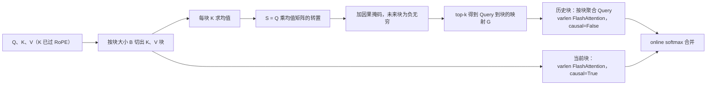
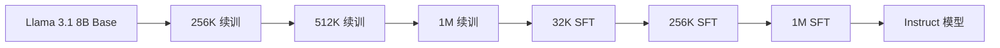

# MoBA：把 MoE 的路由搬进注意力，让每个 Query 自己挑该读的块

<!-- release-date: 2025-02-18 -->

> 本文依据 Moonshot AI、清华大学与之江实验室 / 浙江大学的 **MoBA: Mixture of Block Attention for Long-Context LLMs**（Technical Report），arXiv:2502.13189v1，2025-02-18，共 15 页：正文与参考文献到 p. 13，附录 A 在 p. 13–15。页码均指这份 PDF 自身的页码。文中区分三件事：**报告明确写了什么**、**我们怎么解释它**、**哪些是外部资料或本文推算**。

## 读前先把几个词说成人话

这篇报告只改注意力这一个模块，但它借了 MoE 的一整套说法。先把会反复出现的词翻成人话。

- **Token（词元）**：模型读写文本的最小单位。100 万 Token 的上下文，大约是几本长篇小说。
- **注意力（attention）**：当前这个 Token 回头看前文、决定参考哪些位置的机制。它给每个历史位置打一个分，再按分数加权取信息。
- **Query / Key / Value**：注意力的三个角色。Query 是当前 Token 的提问，Key 是每个历史 Token 的索引标签，Value 是它真正携带的内容。打分靠 Query 与 Key 做内积。
- **全注意力（full attention）**：每个 Query 和前面全部 Key 都比一次。序列长 $N$，总比较次数是 $N^2$ 量级，这就是长上下文贵的根源。
- **稀疏注意力（sparse attention）**：每个 Query 只看一部分历史。**稀疏度** 指被跳过的比例，稀疏度 95% 就是只看 5%。
- **MoE（Mixture-of-Experts，混合专家）**：把 FFN 拆成很多个专家，一个叫 **门控网络（gating network）** 或 **路由器（router）** 的小模块给每个 Token 挑少数几个。挑分数最高的 $k$ 个叫 **top-k**。
- **共享专家（shared expert）**：不经路由、每个 Token 都必经的专家，见 DeepSeekMoE 一篇。MoBA 会拿它打比方。
- **FlashAttention**：把注意力按小块搬进 GPU 片上缓存计算的实现。它算的是精确注意力，只是更省显存读写。它的 **变长（varlen）** 接口能一次处理一批长度各不相同的序列。
- **预填充（prefill）与解码（decode）**：一次请求分两段。prefill 一次读完整段输入，decode 随后逐个吐出新 Token。
- **SFT（Supervised Fine-Tuning，监督微调）**：用「提示 + 标准回答」的数据继续训练，通常只在回答部分计 loss。

这篇报告自己造的词只有一个：

- **MoBA（Mixture of Block Attention，混合块注意力）**：把上下文按位置切成等长的块，把每个块当成一个「专家」，让每个 Query 用 top-k 门控挑几块去读，其余块完全不算。

## 一句话先说清

2025 年初，长上下文有两类省钱办法，各有一笔账没付清（PDF p. 1–2）：

1. **写死结构的稀疏**：attention sink（永远看开头几个 Token）、滑动窗口（只看最近一段），或者只在推理期挑 Token 的 Quest、MInference。前者替模型决定了看哪里，任务一换就可能不对；后者只省推理，训练照样是全注意力的价钱。
2. **把 softmax 换成线性近似**：Mamba、RWKV、RetNet。改造现成的 Transformer 要付很高的转换成本，复杂推理上的证据也还少。

MoBA 的回答是一句口号，报告叫它 **less structure（少结构）** 原则：不替模型规定看哪里，只给它一个足够便宜的挑选办法（PDF p. 1–2）。具体做法是把 MoE 的 top-k 路由搬进注意力，路由的对象从「专家」换成「一段历史」。

它不新增一个参数，也不改 softmax。于是同一套权重可以在全注意力和 MoBA 之间来回切：这一层稀疏、那一层稠密；训练前 90% 的 Token 稀疏、最后 10% 稠密；prefill 稀疏、decode 稠密（PDF p. 4、p. 7–9）。报告还说 MoBA 已经部署在 Kimi 的长上下文服务里（PDF p. 1），但没有给部署规模、时间或线上数字。

读结论时要带着三条边界：

- 最大的实验是从 Llama 3.1 8B **续训** 出来的 1M 上下文模型，不是从头训的大模型（PDF p. 8–9）。
- 下游评测里 MoBA **只管 prefill**，生成阶段切回了全注意力（PDF p. 9）。
- 效率只测了 **注意力层的前向时间**：1M 时快约 6.5 倍，10M 时快约 16 倍（PDF p. 10）。没有反向、没有解码、没有写测试硬件。

### 一条阅读路线

原文只有 11 页正文，半小时能读完：

1. **p. 3 式 (2)–(6) 与 Figure 1**：切块、均值打分、top-k。
2. **p. 4 的因果两条与「当前块 = 共享专家」**：整篇最容易漏的细节。
3. **p. 5 Algorithm 1**：怎么把逐 Token 不同的稀疏模式塞进 FlashAttention。
4. **p. 6–7 Figure 3、Figure 4**：scaling law 与块粒度消融。Figure 3 要配合附录 p. 15 的 Table 3 读。
5. **p. 7–8 Figure 5**：两种和全注意力混用的办法。
6. **p. 8–10 Table 2、Figure 2、Figure 7**：8B 续训到 1M 的评测与速度。

## 主要矛盾：长上下文要稀疏，但谁来决定看哪里

全注意力的式子很朴素（PDF p. 2，式 1）：

$$
\mathrm{Attn}(\mathbf{q}, \mathbf{K}, \mathbf{V}) = \mathrm{Softmax}\bigl(\mathbf{q}\mathbf{K}^{\top}\bigr)\mathbf{V}
$$

$\mathbf{q}$ 是一个 Query 向量，$\mathbf{K}, \mathbf{V}$ 是全部 $N$ 个历史 Token 的 Key 与 Value。问题在「全部 $N$ 个」：上下文从 10 万涨到 100 万，每个 Query 的比较次数涨 10 倍，总量涨 100 倍。

报告承认注意力分数本来就稀疏，softmax 之后大部分位置的权重几乎是零（PDF p. 1）。难的不是「能不能少看」，而是「由谁决定少看哪些」：

- 让人来决定（sink、窗口），就是在模型身上加偏置，换个任务可能正好把要看的那段丢掉；
- 让推理期的启发式来决定（Quest、MInference），训练时模型没见过这种稀疏，训练成本也一分没省（PDF p. 2）；
- 干脆换成线性注意力，又得从头训或付高额转换成本（PDF p. 2）。

于是报告的研究问题是（PDF p. 2）：能不能 **保留原 Transformer 框架**、**不预设注意力模式**，同时能在全注意力与稀疏之间 **无缝切换**，从而既兼容已有预训练模型、又能加速训练和推理？后面每个设计都在同时满足这三条。

## 先看全景：一次 MoBA 注意力做了什么

这张图按 PDF p. 3 Figure 1a、p. 4 的因果规则与 p. 5 Algorithm 1 重画，是机制示意，分数是编的。原文 Figure 1a 是两个 Query、四个块、top-2 的例子：第一个 Query 选了第 1、2 块，第二个选了第 3、4 块（PDF p. 3）。同一层里，不同 Token 读到的历史可以完全不同，这就是「让模型自己决定」的直观含义。

## 核心设计一：块就是专家，均值就是门控

### 旧问题：逐 Token 挑太贵，写死模式又太笨

要让每个 Query 自己挑，最细的做法是逐个 Token 打分再挑。但给 $N$ 个 Key 各打一个分，本身就是一遍全注意力的打分量。要省钱，挑选的单位必须比 Token 粗。

### 新设计：按位置切块，每块一个代表分

MoBA 把式 (1) 里的「全部 Key」换成「选中的那部分」（PDF p. 3，式 2）：

$$
\mathrm{MoBA}(\mathbf{q}, \mathbf{K}, \mathbf{V}) = \mathrm{Softmax}\bigl(\mathbf{q}\mathbf{K}[I]^{\top}\bigr)\mathbf{V}[I]
$$

$I$ 是被选中的位置集合。式子的形状没变，softmax 也没变，变的只是参与运算的历史少了。

$I$ 怎么来，分三步（PDF p. 3，式 3–6）：

1. **切块**：长度 $N$ 的上下文切成 $n$ 块，块大小 $B = N/n$，第 $i$ 块覆盖位置 $I_i = [(i-1)B+1,\ iB]$。
2. **打分**：第 $i$ 块的亲和度是 Query 与该块 Key 均值的内积：

$$
s_i = \bigl\langle \mathbf{q},\ \mathrm{mean\_pool}(\mathbf{K}[I_i]) \bigr\rangle
$$

3. **选块**：分数进前 $k$ 名的块门控 $g_i = 1$，其余为 0；$I$ 就是所有 $g_i > 0$ 的块的并集。

这里有两处和 MoE 不一样，值得停一下。

第一，**门控没有参数**。块的代表向量是算出来的平均，不是学出来的投影。这正是后面「随时切换」的根基：MoBA 与全注意力用的是同一套权重（PDF p. 4）。

第二，**门控值不乘回输出**。$g_i$ 只是 0 或 1 的开关。选中的块一起进同一个 softmax 归一化，没选中的块等价于权重为零。所以 MoBA 算出来的是「在一个子集上的精确注意力」，而不是几路结果的加权和。

**我们如何解释它。** 均值打分便宜，代价是会把块内差异抹平：一个 4096 Token 的块里若只有一句相关，这句的信号会被其余几千个 Token 稀释。报告在相关工作里点到了另一种选法：Quest 可以看成块更小、代表向量用逐坐标 min 与 max 的 MoBA（PDF p. 10）。报告没有比较这几种代表向量孰优孰劣。

还有一个只在 Figure 1b 里画出来的细节：打分用的 Q 和 K 都取自 RoPE（旋转位置编码）之后（PDF p. 3，Figure 1b）。也就是说，块的均值里混着位置信息。报告没有讨论这个选择，也没有做 RoPE 前后打分的对照。

### 收益与代价

收益是打分量从 $N$ 降到 $n = N/B$：Algorithm 1 第 5 行的打分矩阵是 $N \times h \times n$，比全注意力的 $N \times h \times N$ 小 $B$ 倍（PDF p. 5）。它仍然是「所有 Query 乘所有块」的稠密计算，只是每一格便宜了 $B$ 倍。

代价是稀疏度随长度变，不是一个固定值。报告的稀疏度一律按 $1 - Bk/N$ 算，写的都是「最高达到」：

| 设置 | $B$ | $k$ | $N$ | 稀疏度 | 出处 |
|---|---:|---:|---:|---:|---|
| scaling law | 512 | 3 | 8K | 81.25% | PDF p. 6 |
| 尾部 loss | 512 | 3 | 32K | 95.31% | PDF p. 7 |
| 8B 续训 | 4096 | 12 | 1M | 95.31% | PDF p. 9 |
| 同一 8B 跑 RULER | 4096 | 12 | 128K | 62.5% | PDF p. 9 |

同一个模型，跑 1M 时只读 4.7%，跑 128K 时要读 37.5%。**我们如何解释它。** 再往前推一步：一个位置 $p$ 的 Query 只有 $\lceil p/B \rceil$ 个块可选，块数不超过 $k$ 时 top-k 会把能选的全选上，此时 MoBA 与全注意力完全等价。以 8B 模型的 $B = 4096$、$k = 12$ 算，序列前 48K 个位置跑的都是全注意力。这是由式 (5) 与因果约束推出的，报告没有写。

报告自己在这里有一处口径不一致：p. 6 同一段先算出 8K 设置的稀疏度是 81.25%，段末总结却写成「稀疏度最高 75%」。本文按算式取 81.25%。

### 可迁移启发

想让模型「自己挑」，先找一个比 Token 粗、又能被已有张量直接算出来的挑选单位。无参数的代表向量让挑选器不需要单独训练，也不改变模型的参数表，这是后面所有切换自由度的前提。

## 核心设计二：因果性的两道补丁，当前块就是共享专家

### 旧问题：切块加平均，会在两处偷看未来

自回归模型的铁律是：一个 Token 不能看到它后面的内容。切块加平均在两个地方破坏这条铁律（PDF p. 4）：

1. 整块都在 Query 之后的块，如果参与打分，就是直接看未来；
2. Query 所在的那一块，它的均值是整块平均出来的，里面掺了 Query 之后那些 Token 的 Key。光给它打分，信息就漏了。

### 新设计：未来块置负无穷，当前块强制选中

对应两道补丁（PDF p. 4）：

- **不许选未来块**：对任何 $\mathrm{pos}(q) < i \times B$ 的块，直接令 $s_i = -\infty$、$g_i = 0$。
- **当前块强制入选，并加块内因果掩码**：Query 所在的块 $g_i = 1$，不参与比分；块内只允许看排在自己前面的位置。

第二道补丁顺带有一个收益：它逼模型总是看到局部上下文。报告把它类比成现代 MoE 里的共享专家，即在路由规则之外加一条静态规则（PDF p. 4）。这个类比很准：DeepSeekMoE 把公共知识交给不经路由的共享专家，MoBA 把「紧邻的上下文」交给不经门控的当前块。

有一个容易漏的推论写在脚注里：$k$ 这个名额包含当前块。top-k 取 3 时，每个 Query 最多只看 2 个历史块加当前块（PDF p. 6 脚注 3）。

### 在 Algorithm 1 里的落地

这两道补丁决定了计算必须分两路（PDF p. 5，Algorithm 1 第 10–14 行）：

这张图按 PDF p. 5 Algorithm 1 与 p. 3 Figure 1b 重画。历史块整块可见，不需要掩码；当前块必须逐位置掩掉未来，所以两路分开算，最后用 online softmax 合起来。online softmax 只保存每路的最大值与求和项，就能把几段局部归一化的结果拼成一次完整 softmax，数学上与一次算完等价（PDF p. 5）。

## 核心设计三：同一套权重，可以随时换回全注意力

### 旧问题：稀疏架构一旦上身就下不来

线性注意力改了注意力的数学形式，想换回来就得重新训练。推理期稀疏又和训练对不上。两者都没法在「省钱」和「稳妥」之间按需切换。

### 新设计：MoBA 是全注意力的替身，不增不减参数

报告的原话是：MoBA 设计成全注意力的替代品，参数数量完全相同，不增加也不减少（PDF p. 4）。于是每一层在初始化时可以选全注意力或 MoBA，训练中途也能改（PDF p. 4）。报告提到，从全注意力切到滑动窗口的类似思路已有先例（PDF p. 4）。

报告还给了一个表达力论证（PDF p. 4）：

- 滑动窗口 = 门控永远选最近几个块的 MoBA；
- attention sink = 门控永远同时选开头块和最近块的 MoBA。

所以这两种流行的静态稀疏都是 MoBA 的特例，MoBA 换一个特定的门控就能逼近很多静态稀疏架构。**我们如何解释它。** 这个论证说明 MoBA 的「可表达集合」更大，不说明学出来的门控一定会找到更好的那个点；后者要靠实验。

### 可迁移启发

设计一个效率模块时，先问它能不能「退化成原模块」。能退化，就可以在训练阶段、网络层、推理阶段三个维度上按需开关，风险可控。后面三组实验，正好是这三个开关各拨一次。

## 实验一：scaling law，要换一把尺子才看得出差距

### 设置

报告按 Chinchilla 的做法训了五个规模，每个都训到各自的算力最优点（PDF p. 6，Table 1）：

| 参数量 | 头数 | 层数 | 隐藏维 | 训练 Token | 块大小 | top-k |
|---:|---:|---:|---:|---:|---:|---:|
| 568M | 14 | 14 | 1792 | 10.8B | 512 | 3 |
| 822M | 16 | 16 | 2048 | 15.3B | 512 | 3 |
| 1.1B | 18 | 18 | 2304 | 20.6B | 512 | 3 |
| 1.5B | 20 | 20 | 2560 | 27.4B | 512 | 3 |
| 2.1B | 22 | 22 | 2816 | 36.9B | 512 | 3 |

因为 MoBA 不增不减参数，学习率、batch size 等超参两边完全相同，唯一的变量就是注意力模块（PDF p. 6）。这是一个很干净的对照。

### 普通 LM loss 几乎重合，但它看不出长上下文

序列长 8K 时，两边验证 loss 的差距始终在 $10^{-3}$ 量级（PDF p. 6）。拟合曲线见 Figure 3(c)（PDF p. 6）：

| 指标 | MoBA | 全注意力 |
|---|---|---|
| LM loss，序列 8K | $2.625 \times C^{-0.063}$ | $2.622 \times C^{-0.063}$ |
| 尾部 loss，序列 32K，最后 2K | $1.546 \times C^{-0.108}$ | $1.464 \times C^{-0.097}$ |

$C$ 是训练算力，单位 PFLOP/s-days。

报告自己指出第一行的局限：LM loss 会被数据长度分布带偏，真实语料以短序列为主，长距离依赖的贡献被平均掉了（PDF p. 7）。于是它换了一把尺子，叫 **尾部 loss（trailing LM loss）**：只统计序列最后一段 Token 的 loss，并且只统计真正达到最大长度的序列（PDF p. 7）。把序列拉到 32K 后，MoBA 的稀疏度升到 95.31%。

附录 A.1 交代了这把尺子的来历：按实际位置把序列切成若干段，比如 30K–32K 这一段只反映长度超过 30K 的文档；他们发现全注意力与稀疏架构的差距 **大部分集中在尾部 Token**，于是长上下文的 scaling 研究只盯尾部就够了（PDF p. 13）。

这里还有一处标注不一致：Figure 3 图注写尾部 loss 统计「最后 1K」，同图 (b) 的纵轴和 (c) 的表格都写「最后 2K」（PDF p. 6）。本文按 2K 引用。

### 尾部 loss：MoBA 一直更差，但斜率更陡

这张图是本文用附录 Table 3（PDF p. 15）的 16 组拟合式代入三档算力算出来的，不是原文的图；原文 Figure 8（PDF p. 14）是这 16 组各自的拟合曲线。

报告的判断是：五个实验里 MoBA 的尾部 loss 都略高于全注意力，但差距在逐步收窄，这意味着 MoBA 在长上下文上可以扩展（PDF p. 7）。「收窄」的依据是指数：MoBA 是 $-0.108$，全注意力是 $-0.097$，MoBA 的曲线更陡。

**我们如何解释它。** 图上能读出两件报告正文没有明说的事。第一，代价不是均匀的：序列前 8K 几乎没有差距，越往后差距越大，因为越往后 MoBA 的稀疏度越高。第二，把两条尾部拟合式令其相等，交点在 $C \approx 140$ PFLOP/s-days，而实验里最大模型的算力只跑到 5–6 左右（读自 Figure 3 横轴）。所以「会追平」是外推，不是观测。报告用的词是「implies」，分寸是对的。

## 实验二：块要切多细

设计很干净：1.5B 模型、32K 上下文，把上下文切成 8、16、32、64、128 块，对应选 2、4、8、16、32 块，每档都只读 25%（PDF p. 7）。唯一变的是「以多大的颗粒去挑」。

报告的结论：最粗那档与更细各档之间有 $10^{-2}$ 量级的差距；细粒度切分看来是 MoE 家族（包括 MoBA）通用的增益手段（PDF p. 7）。这和 DeepSeekMoE 把专家切细的结论同向，报告也引了它（PDF p. 4）。

**我们如何解释它。** 图的准确读法是「别切太粗」，而不是「越细越好」：从 16 块选 4 起，四个点在基线上下来回，32 块选 8 与 128 块选 32 甚至略低于基线。报告只测了 loss，没有测更细粒度的效率代价：块越多，打分矩阵越大，每块分到的 Query 越少、FlashAttention 的每次调用越碎。这一半账需要自己补。

## 实验三：两种和全注意力混用的办法

### 训练阶段切换：前 90% 稀疏，后 10% 稠密

三个 1.5B 模型，各训 30B Token，上下文 32K，MoBA 用 $B = 2048$、$k = 3$（PDF p. 7）：一个前 90% Token 用 MoBA、后 10% 切回全注意力；一个全程全注意力；一个全程 MoBA。评测用 **逐位置 LM loss**，把每个位置的 loss 单独拆开看（PDF p. 7–8）。

结果是：纯 MoBA 在尾部位置 loss 更高，两阶段混合几乎与全注意力重合；切换那一刻没有观察到明显的 loss 尖峰（PDF p. 8）。报告把它定位为「高效长上下文预训练」的一种方案。

**我们如何解释它。** 这组实验说明两件事：前 90% 用稀疏训出来的权重，拿去跑全注意力不会崩；最后一小段稠密训练就能补回尾部。90/10 这个比例没有消融，也只在 1.5B、30B Token 上做过。训练省了多少算力，报告没有算。

### 层级混合：救 SFT

报告观察到 MoBA 在 SFT 阶段有时表现欠佳（PDF p. 8，Figure 5b）。它给的原因明确写成推测：SFT 通常不对提示部分计 loss，梯度只从回答部分的 Token 出发；稀疏注意力下，这些梯度更难传回整段上下文，形成稀疏梯度问题（PDF p. 8）。

对策是把最后几层换回全注意力，其余层保持 MoBA。Figure 5b、5c 显示，换回的层越多，SFT loss 与尾部 loss 越低，10 层时几乎追平全注意力（PDF p. 8）。

**我们如何解释它。** 「稀疏梯度」是一个合理但未经验证的解释：报告没有做「提示部分也计 loss」这样的对照来隔离原因。这组 SFT 实验的模型规模、数据量和训练长度，报告都没有交代。

## 实验四：从 Llama 3.1 8B 续训到 1M

### 配方

这是报告里唯一一个接近真实模型的实验（PDF p. 8–9）：

这张图按 PDF p. 8 Figure 6 重画。正文另写了一个 128K 的起点：模型先在 128K 上训练，再逐步扩到 256K、512K、1M；256K 阶段开头用位置插值把有效上下文从 128K 拉到 1M（PDF p. 8–9）。

MoBA 的具体用法（PDF p. 9）：

- 1M 续训完成之后，再开启 MoBA 训 100B Token；
- $B = 4096$、$k = 12$，1M 时稀疏度 95.31%；
- 层级混合：最后 3 层保持全注意力，其余 29 层换成 MoBA；
- SFT 同样从 32K 逐步扩到 1M；
- 对照组 Llama-8B-1M-Full 走同样的流程，只是全程全注意力。

报告对「前面几段续训是否已经用 MoBA」写得不够清楚：它说这个模型「叫 Llama-8B-1M-MoBA」、续训到 1M，然后「MoBA 被激活 100B Token」。按字面读，MoBA 是在 1M 续训之后才打开的；续训 Token 总量、SFT 数据都没有给。

### 评测：MoBA 只管 prefill

全部评测里，MoBA 只用于 prefill，生成阶段切回全注意力（PDF p. 9）。结果见 Table 2（PDF p. 9）：

| 基准 | Llama-8B-1M-MoBA | Llama-8B-1M-Full |
|---|---:|---:|
| AGIEval（0-shot） | 0.5144 | 0.5146 |
| BBH（3-shot） | 0.6573 | 0.6589 |
| CEval（5-shot） | 0.6273 | 0.6165 |
| GSM8K（5-shot） | 0.7278 | 0.7142 |
| HellaSwag（0-shot） | 0.8262 | 0.8279 |
| Loogle（0-shot） | 0.4209 | 0.4016 |
| Competition Math（0-shot） | 0.4254 | 0.4324 |
| MBPP（3-shot） | 0.5380 | 0.5320 |
| MBPP Sanitized（0-shot） | 0.6926 | 0.6615 |
| MMLU（0-shot） | 0.4903 | 0.4904 |
| MMLU Pro（5-shot，CoT） | 0.4295 | 0.4328 |
| HumanEval（0-shot，pass@1） | 0.6951 | 0.7012 |
| SimpleQA（0-shot） | 0.0465 | 0.0492 |
| TriviaQA（0-shot） | 0.5673 | 0.5667 |
| LongBench @32K（0-shot） | 0.4828 | 0.4821 |
| RULER @128K（0-shot） | 0.7818 | 0.7849 |

16 项里 MoBA 7 项略高、9 项略低，差距大多在小数点后第二、三位。报告的判断是两者「高度可比」；最长的 RULER 上，MoBA 在 62.5% 稀疏度下 0.7818 对 0.7849（PDF p. 9）。1M 的大海捞针（Needle in a Haystack）测试里，Figure 7 从 32K 到 1M、针放在任意深度，整张热图都是满分色（PDF p. 9）。

**我们如何解释它。** 读这张表要记住三件事。第一，大部分基准的样本远短于 48K，按上一节的推算，这些样本上 MoBA 本来就等价于全注意力，打平是应该的。第二，生成阶段用的是全注意力，所以这张表证明的是「稀疏 prefill 不伤效果」，不是「全程稀疏不伤效果」。第三，最后 3 层始终是全注意力，结果是层级混合的成绩，不是纯 MoBA 的成绩。

## 效率：注意力前向快 6.5 倍到 16 倍

两组测量（PDF p. 5 Figure 2、p. 10）：

- **(a)**：拿上一节两个 8B 模型，只比注意力层的前向时间，因为其余层的 FLOPs 两边相同。MoBA 在所有长度上都更快，1M prefill 时快到 6.5 倍。
- **(b)**：固定稀疏度 95.31%（块数固定 64、top-k 固定 3，块随长度变大），一路扩到 10M。为了放下 10M，张量并行扩展到 Query 头这一级，Key 与 Value 广播到各个头。10M 时注意力计算时间缩短到约十六分之一。

报告把速度归功于两件事：块稀疏本身，以及把 MoE 的调度与 FlashAttention 结合的实现（PDF p. 10）。

**我们如何解释它。** 这组数字是 prefill 注意力算子的时间，不是端到端吞吐：没有反向（训练加速没测）、没有解码（评测里解码本来就是全注意力）、没有写 GPU 型号与 batch。(b) 固定的是块数而不是块大小，10M 时每块约 16 万 Token，这时的 MoBA 更像「在 64 大段里挑 3 段」，和 (a) 的 4096 Token 小块不是同一个工作点。

## 与 NSA：同一周公开的两条路

MoBA 的 arXiv v1 与官方代码都在 2025-02-18 公开；DeepSeek 的 NSA 论文 v1 提交于 2025-02-16，官方在 2025-02-18 发文介绍（出处见文末）。两份原件互相没有引用对方，下面的对照全是本文按两份原件整理的，不是任何一方的说法。NSA 的细节见 NSA 一篇。

| | MoBA | NSA |
|---|---|---|
| 块怎么打分 | q 与块内 Key 均值的内积，无参数（PDF p. 3） | 复用压缩分支的注意力分数；压缩用可学习的 MLP |
| 选中之后读什么 | 块内原始 Token；块大小 512–4096 | 块内原始 Token；选择块 64 |
| 写死的必选 | 当前块 | 开头 1 块、本地 2 块，另有 512 Token 滑窗 |
| 全局粗看 | 没有 | 压缩分支把全部历史压成摘要 |
| 几路怎么合并 | 选中的块同进一个 softmax | 三个分支各算注意力，再用 sigmoid 门加权 |
| 新增参数 | 零 | 压缩 MLP、门控 MLP、三分支各自的 K 与 V |
| 头之间是否共享选择 | 按 Algorithm 1 的张量形状每头各选 | GQA 组内所有头共享一套块 |
| 实验怎么训 | 从头训小模型；续训 Llama 3.1 8B | 从头预训练 27B MoE |
| 解码 | 评测里切回全注意力 | 稀疏；11.6 倍是按访存量的估算 |
| 速度证据 | 注意力前向，1M 约 6.5 倍、10M 约 16 倍 | Triton 算子，64K 前向 9.0 倍、反向 6.0 倍 |

**我们如何解释它。** 两边都在做「先粗挑块，再精读块内原文」，分歧在三处：

- **挑选器要不要学**：MoBA 坚持零参数，换来随时切回全注意力的自由；NSA 让挑选寄生在一个可学习的压缩分支上，换来更好的挑选信号，也失去了与原模型权重的互换性。
- **结构写死多少**：MoBA 的口号是少结构，只写死当前块；NSA 反而把开头块、本地块和滑窗都写成固定通路，理由是防止局部模式抢走学习（见 NSA 一篇）。
- **为谁优化**：MoBA 的实验盯 prefill 与续训；NSA 的实验盯从头预训练与解码访存，并按 GQA 组共享选择来省显存读。

后来的 DSA（见 DeepSeek-V3.2 一篇）又回到逐 Token 选择，MSA（见 MiniMax-Sparse-Attention 一篇）在 GQA 上按组挑块。块级还是 Token 级、选择在多少个头之间共享，是这条线上反复被重新定价的两个旋钮。

## 限制、边界，以及不要补进去的实现

- **没有从头训的大模型**。最大的从头训练是 2.1B；8B 是续训，而且最后 3 层保持全注意力。
- **下游评测没有稀疏解码**。Table 2 与大海捞针都是「MoBA prefill + 全注意力 decode」。
- **速度只测了注意力前向**。训练加速是由结构推出来的，没有测；硬件、batch、端到端延迟都没写。
- **SFT 的问题只给了推测**。稀疏梯度的解释没有对照实验，层级混合实验的规模也没交代。
- **几处口径不一致**：p. 6 的 81.25% 与 75%，Figure 3 图注的 1K 与轴标的 2K；8B 续训里 MoBA 从哪一段开始启用写得含糊。
- **Kimi 部署只有一句话**。哪些模型、多长上下文、省了多少，报告没有给。
- **没有和其他稀疏方法比**。实验只有「MoBA 对全注意力」，Quest、MInference 等只出现在相关工作里。

## 可迁移启发

1. **让效率模块能退化成原模块**。MoBA 所有灵活性都来自「同一套参数、零新增」。能退化，就能按训练阶段、网络层、推理阶段分别开关，出了问题随时回退。
2. **挑选的单位要比计算的单位粗**。逐 Token 打分等于先算一遍全注意力；按块打分把挑选成本降到 $1/B$，再用成熟的块内算子精读。
3. **必经通路是硬约束，不是损失项**。当前块强制入选，既修好了因果泄漏，又保住了局部上下文，路由器怎么学都改不掉它。
4. **找对尺子再做 scaling**。平均 loss 看不出长上下文退化；尾部 loss 把差距集中暴露出来，同时把实验成本降下来。评估任何「只在特定条件下才退化」的改动，都可以先找出差距集中的那个子集。
5. **稀疏与稠密可以分工**。大部分训练用稀疏、最后一小段用稠密；大部分层用稀疏、最后几层用稠密；prefill 用稀疏、decode 用稠密。报告把三种分工都做通了，但每一种的最佳比例都还没有消融。
6. **读稀疏度要看分母**。块大小和 $k$ 固定时，稀疏度随序列长度变。评测样本短于 $Bk$ 时，稀疏注意力等价于全注意力，这类基准上的「打平」不能算作稀疏的证据。

## 关键词回看

- **less structure**：不替模型规定看哪里，只提供便宜的挑选方式。MoBA 的设计原则。
- **块（block）**：按位置等长切出的一段上下文，是 MoBA 的「专家」。
- **均值打分**：$s_i = \langle q, \mathrm{mean\_pool}(K[I_i]) \rangle$，零参数，取自 RoPE 之后的 Key。
- **当前块**：Query 所在的块，强制入选并加块内因果掩码，相当于共享专家。
- **top-k 含当前块**：$k = 3$ 时最多 2 个历史块。
- **稀疏度 $1 - Bk/N$**：随长度变；8B 模型在 1M 时 95.31%，128K 时 62.5%。
- **尾部 loss**：只统计满长序列最后 2K Token 的 loss，用来暴露长上下文差距。
- **两阶段混合**：前 90% Token 用 MoBA，后 10% 用全注意力。
- **层级混合**：最后几层用全注意力；8B 模型是最后 3 层。
- **6.5× / 16×**：1M 与 10M 时注意力层前向的加速，只是 prefill 算子时间。

## 资料与阅读边界

### 本文依据的版本与首发日

- 原件：[arXiv:2502.13189](https://arxiv.org/abs/2502.13189) v1，2025-02-18 提交，15 页；arXiv 上截至本文核对时只有这一版。
- 这篇报告后来以同名论文收录于 NeurIPS 2025（[NeurIPS 2025 poster 页](https://neurips.cc/virtual/2025/poster/117997)、[ML Anthology 条目](https://mlanthology.org/neurips/2025/lu2025neurips-moba/)）。会议版全文未能取得，本文没有核对它与 arXiv v1 的差异；会议版摘要把「已部署支持 Kimi 的长上下文请求」改写成了「已部署处理有长上下文需求的实际生产负载」。
- `release-date` 取 **2025-02-18**。MoBA 是一项技术，按报告库口径取该技术首次官方公开日：官方仓库 [MoonshotAI/MoBA](https://github.com/MoonshotAI/MoBA) 的首个提交与 arXiv v1 提交都在 2025-02-18（UTC），仓库略早几小时。报告说它已在 Kimi 线上使用，但没有公开何时开始，无法据此取更早的日期。

### 报告明确写了、本文覆盖了的部分

摘要与第 1 节的三类旧方案；第 2.1–2.2 节式 (1)–(6)、Figure 1、因果两条、细粒度切块、与全注意力混合、SWA 与 sink 是特例；第 2.3 节五步实现、Algorithm 1、Figure 2；第 3.1 节 Table 1、Figure 3、尾部 loss、Figure 4；第 3.2 节两阶段混合、层级混合与 Figure 5；第 3.3 节 8B 续训、Figure 6、Table 2、Figure 7；第 3.4 节效率；第 4 节相关工作中与 Quest、Longheads 的关系；第 5 节结论与未来工作；附录 A.1、Figure 8 与 Table 3。

### 外部资料补充（不是 PDF 原文）

- 官方仓库 README 提醒：MoBA 需要对已有模型继续训练才能拿到加速，不是直接套在预训练模型上的即插即用方案；仓库提供基于注意力掩码的朴素实现与基于 `flash-attn` 的高效实现两种后端。本文没有读仓库源码，不把实现细节当作报告结论。
- NSA 的时间线：arXiv v1 提交于 2025-02-16（[arXiv:2502.11089](https://arxiv.org/abs/2502.11089)），DeepSeek 官方在 2025-02-18 发文介绍（[DeepSeek 官方 X 帖子](https://x.com/deepseek_ai/status/1891745487071609327)）。
- 站内对照（纯文本篇名）：NSA、DeepSeek-V3.2（DSA）、MiniMax-Sparse-Attention（MSA）、DeepSeekMoE（共享专家与细粒度专家）、Kimi-Linear（Moonshot 后来的线性注意力路线）。这些是站内已有解读的记述，只用来给 MoBA 定位。

### 原文没有公开、本文也不补的缺口

- Kimi 线上部署的模型、上下文长度与收益；
- 8B 续训各阶段的 Token 数、SFT 数据，以及 MoBA 究竟从哪一段开始启用；
- 层级混合 SFT 实验的模型规模与数据；
- 速度测试的硬件、batch、反向与解码耗时、端到端吞吐；
- 与 Quest、MInference 等稀疏方法的同条件对比；
- 两阶段混合 90/10、层级混合层数的消融。
