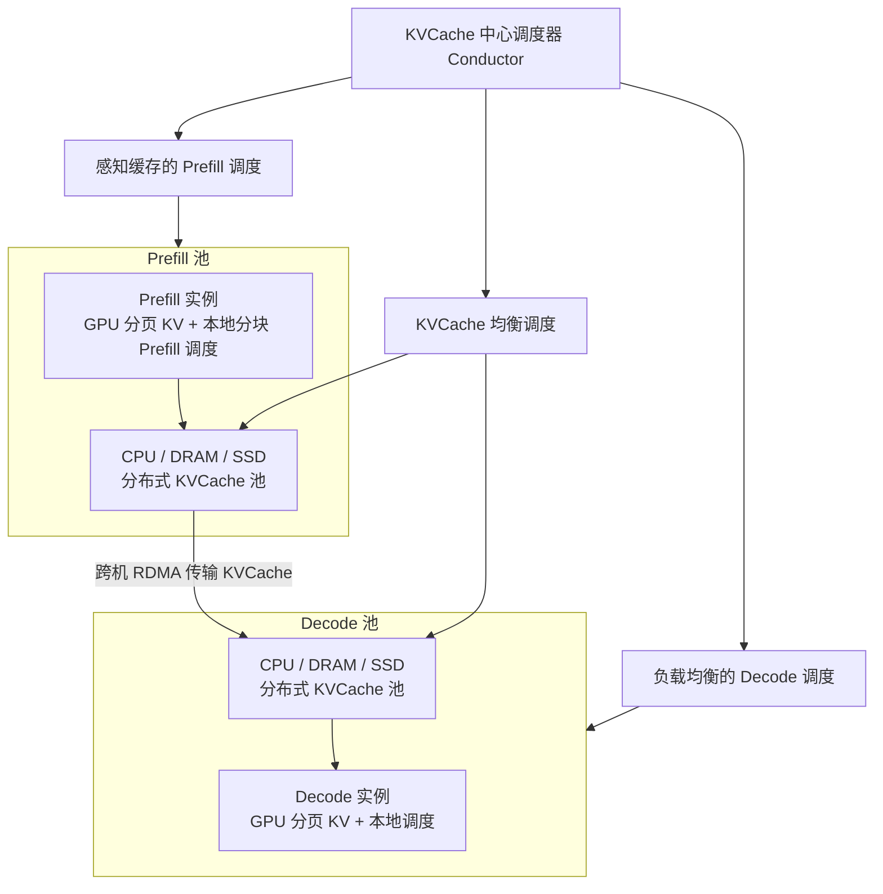

# Mooncake：KV 才是调度中心，过载时先拒绝

<!-- release-date: 2024-06-24 -->

> 本文依据 **Mooncake: A KVCache-centric Disaggregated Architecture for LLM Serving**，arXiv:2407.00079v4，2025-09-03 修订，共 23 页。页码均指这份 PDF。署名 Moonshot AI 与清华大学，通讯作者是清华的 Mingxing Zhang 与 Moonshot 的 Xinran Xu；Ruoyu Qin 的部分工作在 Moonshot 实习期间完成，与 Zheming Li 共同一作（PDF p.1）。全文把三件事分开标注：**报告明确写了什么**、**我们如何解释或验算它**、**哪些是外部资料补充**。

这是 Kimi 的 **推理服务架构** 论文，不是模型卡。论文开篇就说 Mooncake 是 Kimi 的服务平台（PDF p.1），但全部实验用的是一份与 LLaMA2-70B 同架构的 dummy 模型（PDF p.3、p.15）。第 1.1、1.2 节标题把项目名拼成了 Mooncacke，正文其余地方都写 Mooncake。

## 读前先把几个词钉死

- **Prefill（预填充）**：把整段提示词一次喂进去，算出所有位置的 Key / Value，并吐出第一个输出词元。形状是大矩阵乘，通常算力吃得饱。
- **Decode（解码）**：之后每步只进一个新词元，读完整份历史缓存再吐下一个。形状接近矩阵乘向量，通常被显存带宽卡住。
- **KVCache（键值缓存）**：每个词元算过一次的 Key 和 Value。后面每一步都要回看它，所以留着不重算。它随上下文线性变大，是这篇论文真正的调度对象。
- **TTFT / TBT**：Time to First Token 是请求到达后等到第一个词的时间；Time Between Tokens 是同一请求相邻两个输出词的间隔。两者分别是 Prefill 侧和 Decode 侧的服务等级目标（Service Level Objective，SLO）。
- **MFU（Model FLOPs Utilization，模型浮点利用率）**：实际做的有效运算占硬件峰值的比例。
- **有效吞吐（effective throughput）**：论文要最大化的目标。它接近别人说的 goodput，但口径更严——**只有完整跑完的请求才计入**；中途被拒的请求，已经消耗和已经生成的词元都不算（PDF p.4）。

PD 分离与 KVCache 的通用原理在知识库的 PD分离、KVCache 两篇。本文只讲这份 PDF 自己怎么把这两件事做成一套生产调度。

## 一句话先说清

Mooncake 不只是「把 Prefill 和 Decode 拆开」。

拆开只是前提。它换掉的是调度器心里的那张图：以前调度器盯着 GPU 忙不忙、队列里有多少请求；Mooncake 盯着 **KVCache 在哪、有多热、搬过去要多久、搬完 Decode 还接不接得住**。过载时它也不假装所有请求都能被处理，而是在 Prefill 开始前就预测 Decode 会不会爆，爆就直接拒。

摘要的两个数：模拟场景下吞吐最高提升 **525%**；真实负载下让 Kimi 多处理 **75%** 的请求（PDF p.1）。后文会说清这两个数各自的前提。

> **KVCache 才是调度中心。过载时先拒绝，不要把算力浪费在注定交不出货的请求上。**

### 一条阅读路线

1. **p.1–2 的问题定义与 Figure 1**：两池各自的优化目标与约束。
2. **p.4 Figure 2 与有效吞吐的定义**：为什么 Prefill 和 Decode 该分开，以及「只算跑完的请求」。
3. **p.5–7 Figure 3–6 与 Table 1**：分离式 KVCache 池、一条请求的四步、开源 trace。
4. **p.8–9 第 5 节**：为什么还要独立 Prefill 池，分块流水线并行与逐层 Prefill。
5. **p.10–12 Algorithm 1 与 Figure 8**：KVCache 中心调度和热点迁移。
6. **p.12–14 第 7 节与 Figure 9–10**：过载、提前拒绝、振荡与预测。
7. **p.15–17 第 8 节**：端到端实验与过载实验。

## 先看矛盾：吞吐想复用、想攒批，延迟却不答应

Kimi 作为模型即服务（Model as a Service，MaaS）提供方，要解一个带约束的优化问题：目标是最大化有效吞吐，论文明说这直接对应收入；约束是不同档位的延迟 SLO，主要是 TTFT 和 TBT（PDF p.1）。

提高吞吐的路，论文只点了两条（PDF p.1）：**尽量复用 KVCache**，少做重复 Prefill；**尽量把每个 batch 里的词元数做大**，提高 MFU。两条都会打到延迟上：从远处搬缓存会拉长 TTFT，batch 太大会拉长 TBT（PDF p.2）。所以吞吐导向的优化和延迟 SLO 不是同一方向上的两个旋钮，而是一对互相卡住的约束。

更深一层的矛盾在两个阶段的资源画像：

论文给的原因（PDF p.4）：注意力的计算量按输入长度平方涨、MLP 按长度线性涨，所以 Prefill 时间随长度超线性上升；Decode 每步每条请求只进一个词，受访存限制，计算时间随 batch 亚线性上升。

**我们如何解释它**：这张图不是在说「拆开就能变快」，而是在说 **两个阶段的最优解不在同一台机器上**。Prefill 想要算力、按长度扩；Decode 想要带宽、按并发扩。塞进同一批 GPU，长 Prefill 会把 Decode 的 TBT 打乱。

于是论文把 GPU 集群拆成几个彼此协作、目标不同的资源池（PDF p.1–2）。拆的不只是 Prefill 和 Decode，还有那些平时闲着的 CPU、DRAM 和 SSD。

## 全景：三池一台调度器

Figure 1 把整套架构画成三层（PDF p.2）。下面按该图重画，是机制示意，不是实测拓扑：

两边的优化目标写在原图右侧，必须分开记（PDF p.2）：

| | Prefill 阶段 | Decode 阶段 |
|---|---|---|
| 优化目标 | 最大化缓存复用 | 最大化吞吐 |
| 约束 | TTFT SLO、最低 MFU、KVCache 装得进 DRAM | TBT SLO、KVCache 装得进显存（VRAM） |

两边的内存墙不一样：Prefill 侧盯的是 **DRAM**，Decode 侧盯的是 **VRAM**。这不是笔误，后面逐层 Prefill 会解释：Prefill 实例几乎不必考虑显存装不装得下所有在途请求，只要单条装得下（PDF p.9）。

全局调度器叫 **Conductor**。每个请求它要选一对 Prefill 与 Decode 实例（PDF p.2）：把尽量多的可复用 KVCache 送到选中的 Prefill 实例；Prefill 按块、按层做完，并把新 KVCache 持续流向 Decode 实例；Decode 实例装入 KVCache，把请求加进连续批处理。

选择策略比这三步麻烦得多（PDF p.2）。等低层存储上的缓存可能直接打穿 TTFT；缓存服务器太热还会把网络堵死。所以 Conductor 还要预判 KV 块的未来使用并做换出与复制：最热的块复制到多个节点以免争抢，最冷的换出去省预留成本。Prefill 节点的 DRAM 又被全局缓存池占掉一大块，调度时得把剩余 DRAM 算进去。Decode 侧则是另一本账：batch 越大 MFU 越好，但受 TBT SLO 和「在途 KV 能不能塞进显存」的双重限制。

现有研究大多假设资源够用、只优化利用率。论文的判断相反：GPU 供给跟不上，MaaS 高峰时严重过载；过载时要预测未来负载，Prefill 做完 Decode 若已没有空位，就该提前拒绝，免得白做 Prefill；可朴素的提前拒绝又会让负载来回抖（PDF p.2–3）。这就是后文 **面向过载的调度（overload-oriented scheduling）** 的来由。

## 分离式 KVCache 池：一条请求怎样用上别人算过的块

论文把 GPU 集群里本来利用不足的 CPU、DRAM、SSD 和 RDMA 收成一个分离的 KVCache 池（PDF p.4）。它要解决的不是「再买一批缓存机器」，而是让靠近 GPU 的前缀缓存几乎不加硬件成本地做大（PDF p.5）。

图上画清了块怎么匹配、流向哪里，下面补三件图上读不出的事。

**块怎么存、怎么搬。** CPU 内存里的 KV 按分页块存放，淘汰可以用 LRU、LFU，或按请求特征定制（PDF p.5）。跨 CPU / GPU 与跨机的搬运交给 **Messenger**：每个推理实例里的一个独立进程，基于 GPUDirect RDMA（PDF p.5）。这套池子还让 Kimi 能向外部用户提供 context caching API，进一步提高复用（PDF p.5）。

**一条请求的四步**（PDF p.5–6，Figure 4）：

1. **复用 KVCache**：分词完成后，Conductor 选出 Prefill 节点（或节点组）和 Decode 节点。Prefill 节点拿到原始输入、可复用的前缀块 ID、给这条请求新分配的完整块 ID，按前缀块 ID 从远端 CPU 内存把 KV 装进 GPU；没有前缀就跳过。选哪个 Prefill 节点，要同时顾及复用多、负载均、TTFT 守得住三件事。
2. **增量 Prefill**：用前缀缓存把没命中的那段算完，新 KV 写回 CPU 内存。未命中的词元数超过阈值 `prefill_chunk` 时，切成多块流水执行；这个阈值按「打满这块 GPU 的算力」来选，**通常大于 1000 个词元**。
3. **传输 KVCache**：Messenger 与增量 Prefill 异步重叠，每一层算完就把这一层的 KV 流到目标 Decode 节点的 CPU 内存。
4. **Decode**：整份 KV 到达 Decode 节点的 CPU DRAM 后，请求按连续批处理加入下一批。Conductor 事先按当时负载挑过 Decode 节点，但 Prefill 做完负载可能已经变了，本地调度器会再查一次；这次复查仍可能拒掉请求，**那时 Prefill 的开销就白花了**。

两边都在藏传输，但藏的位置不同：Prefill 侧的加载和存储逐层进行、与计算并行；Decode 侧是 GPU 算的同时，把 CPU 上的 KV 异步装进显存，免得 GPU 空转（PDF p.6，Figure 4 图注）。

**我们如何解释它**：PD 分离之后 KV 必须在机器之间搬家，缓存池若还钉在单卡显存上，复用半径就只剩「恰好打到同一张卡」。把 DRAM、SSD 拉进来，复用半径变成整个集群。代价是 Conductor 必须把「缓存在哪、搬多久、会不会堵网」都算进 TTFT：调度从「找一台空闲 GPU」变成「找一条划得来的 KV 路径」。

## 真实负载长什么样：一小时的开源 trace

为了让别人能复现缓存策略，作者从线上抽样了一小时的请求，优先收同一会话里的请求以保留缓存关系（PDF p.6）。数据集 **23,608** 条，字段只有 `timestamp`、`input_length`、`output_length`、`hash_ids`；时间戳是 0 到 **3,600,000** 毫秒的相对到达时间；块大小 **512** 个词元；不含任何用户文本（PDF p.7）。trace 开源在 `https://github.com/kvcache-ai/Mooncake`（PDF p.3）。

后文实验多处写「23,000 条真实请求」（PDF p.11、p.15、p.17），和这里的 23,608 差了六百多条，论文没有解释。两处数字按字面分开引用，不捏成同一个集合。

Figure 5 是输入与输出长度的直方图（PDF p.6）：输入可以长到约 12 万词元量级；输出最多的是极短的一档，几百词元处还有一个隆起，2,000 附近又有一个小尖峰。正文给的平均数是输入 **7,590**、输出 **182** 词元（PDF p.7）。

同一页还写了「平均输入输出比约为 720」。**这一句用同页数字复现不出来**：7,590 ÷ 182 ≈ 41.7；Table 2 里 Real Data 一行平均输入 7,955、输出 194，相除约 41.0（PDF p.15）。可能是逐条请求的比值再求平均，被极短输出拉高，但论文没交代口径。我们按两个平均数理解这条负载：**长输入、短输出**，720 不当作可引用的统计量。

Table 1 在「只有一个全局缓存池」的假设下，比较三种淘汰策略的命中率（PDF p.8）。LengthAwareCache 类似 LFU，但优先保留出现在请求靠后位置的块（PDF p.7）。

| 块容量 | Inf | 100,000 | 50,000 | 30,000 | 10,000 | 1,000 |
|---|---:|---:|---:|---:|---:|---:|
| LRUCache | 0.51 | 0.51 | 0.50 | 0.48 | 0.40 | 0.30 |
| LFUCache | 0.51 | 0.51 | 0.49 | 0.43 | 0.35 | 0.30 |
| LengthAwareCache | 0.51 | 0.50 | 0.48 | 0.42 | 0.35 | 0.30 |

容量从 1,000 加到 50,000 块，命中率从 30% 升到 50%，再往上几乎不涨（PDF p.7）。作者马上补了一句：这不代表大缓存没用，因为抽样只是真实负载的子集，实际容量要按比例放大；这份数据上 LRU 最好，可能是请求有时间局部性（PDF p.8）。

Figure 6 更刺眼：**超过 50% 的缓存块从未被用到，少数块被访问上万次**（PDF p.8）。热块必须复制，否则传输会堵。这直接引出后文的热点迁移。

相关工作一节还给了一组对照（PDF p.18）：即便假设存储容量和 TTFT SLO 都无穷，他们当前的线上负载理论上最多只能复用约 **50%** 的 KVCache；而在他们的「和论文对话」服务 papers.cool 上，复用可以到约 **90%**。复用率是场景的函数，不是架构的常数。

## 为什么还要独立 Prefill 池：chunked prefill 不够

第 5 节开头承认：Decode 节点必须独立几乎没有争议，但要不要单独、弹性的 Prefill 池还在争论（PDF p.8）。Splitwise、DistServe、TetriInfer 都主张拆开；可 **分块预填充（chunked prefill）** 出现之后，有人会问拆开是否还有必要。chunked prefill 把输入切成小块塞进连续批处理，好处有两个：所有节点一视同仁、调度简单；小块 Prefill 还能抬高 Decode batch 的计算强度，MFU 更好（PDF p.8）。

Mooncake 还是拆开了。一条请求的 Prefill **只有在不必切块、又不破坏 TBT SLO 时**，才会被内联进 Decode batch（PDF p.8）。两条理由：长上下文的 Prefill 需要另一套跨节点并行（§5.1）；拆开之后 Prefill 侧能省下显存（§5.2）。

**我们如何解释它**：chunked prefill 是在 **同一台 GPU 上调和两种形状**；Mooncake 认为长上下文一旦要跨节点，调和的代价高于拆开再传输。它没有说短请求永远不该混部，只是给混部留了一扇很窄的门。

## 长上下文怎么跨节点：分块流水线并行

上下文长度正从 8k 走向 128K 甚至 1M；长请求的输入常常是输出的 **10–100 倍**，TTFT 变成主矛盾（PDF p.8）。长 Prefill 的并行度很高，用超过一台 8 卡节点去算是划得来的。三种跨节点做法的账（PDF p.8–9）：

| 做法 | 每层跨节点通信 | 论文的判断 |
|---|---|---|
| 张量并行（TP）跨节点 | 两次昂贵的 RDMA all-reduce | Prefill 的 MFU 明显下降 |
| 序列并行（SP，如 Ring Attention） | 至少一次 | 省网、MFU 好过跨节点 TP，但仍不如单节点 TP；还和 KV 传输抢网 |
| 分块流水线并行（CPP） | 只在流水级边界 | 易与计算重叠，MFU 更好，少抢网 |

SP 还有一个部署上的麻烦：理想做法是把 Prefill 节点分成只做 TP 的一组和做 SP 的一组，只在 TTFT 逼着的时候才把请求送进 SP 组，可静态分组会让一侧空转。LoongServe 那样的弹性序列并行能动态伸缩 SP 组，但要预先建好全局通信组，还要把缓存复用和 SLO 违约算进 Conductor，不适合他们「部署中频繁在线扩缩」的场景（PDF p.8）。

Mooncake 的答案是 **分块流水线并行（Chunked Pipeline Parallelism，CPP）**：Prefill 集群里每 X 个节点编成一个流水线组；一条请求的输入按不超过 `prefill_chunk` 切块，同一请求的不同块可以同时在不同节点上算，从而降 TTFT（PDF p.9）。X 的取值论文没给。好处有两条：跨节点通信只在流水级边界，容易与计算重叠；短请求几乎不加开销，长请求也不用频繁改节点分组。作者说这种流水加速在训练系统里见过，但据他们所知这是第一次用在推理上（PDF p.9）。

**对自己的项目有什么用**：一旦决定长 Prefill 必须跨节点，先问通信发生在每层还是只发生在级边界。CPP 借的是 decoder-only 的因果性：后一块只需要前面块的 KV，于是可以排成流水，而不必把一条序列横切后每层都做一次环。编码器或双向注意力不能直接照抄。

## 逐层 Prefill：把 KV 搬走，把显存腾出来

显存是稀缺资源。论文把一条请求的占用成本写成 $S \times T$：$S$ 是这份 KV 的大小，$T$ 是它在显存里待的时间（PDF p.9）。如果把请求切块、每块内联进别人的 Decode，**$T$ 会被拉长**，占用成本反而变大。这是他们对「用 chunked prefill 省显存」的反驳。

Prefill 逐层进行、又是计算受限，所以 KV 的搬运可以藏进计算。Mooncake 用 launch / wait 做异步加载与存储（PDF p.9）：某一层注意力开始前，先等这一层的 KV 加载完，并立刻发起下一层的加载；这一层注意力算完，立刻发起这一层的异步存储；所有层算完，再等全部存储结束。重叠之后，Prefill 实例的执行时间大约等于「KV 加载时间」与「普通 Prefill 时间」中较长的那个，取决于前缀命中占输入的比例（PDF p.9）。

Figure 7 单独画了「把 KV 存出去」的额外延迟（PDF p.9）。逐层那根柱子是「逐层 Prefill」相对「不存 KV 的 Prefill」的延迟差。读图近似如下：

| 序列长度 | 8,000 | 16,000 | 32,000 | 64,000 | 128,000 |
|---|---:|---:|---:|---:|---:|
| 串行存储（秒） | 约 0.11 | 约 0.12 | 约 0.23 | 约 0.42 | 约 0.87 |
| 逐层重叠（秒） | 约 0.10 | 约 0.10 | 约 0.12 | 约 0.10 | 约 0.10 |

串行存储的开销随长度翻倍而翻倍，逐层重叠后基本停在 0.1 秒上下。正文只写到「逐层 Prefill 能有效降低长请求的这笔延迟」（PDF p.9）。

重叠一旦成立，Prefill 调度就可以 **不看显存容量**，只要单条请求装得下；Figure 1 里 Prefill 的约束因此只剩 KV 分布和可用 DRAM（PDF p.9）。腾出来的显存他们打算另用：比如 OpenAI Batch API 那种成本低 50%、只承诺 24 小时内完成的批量请求，没有严格 TBT，可以把它们的 Decode 也内联进 Prefill，换更高的 MFU（PDF p.9）。这是设想，不是已部署功能。

## KVCache 中心调度：命中长度、排队、传输一起算 TTFT

第 6 节讲正常负载下 Conductor 怎么选机器，过载留给第 7 节（PDF p.10）。前人通常按「每台机器挂了多少请求」做负载均衡。Mooncake 选 Prefill 实例时还要看前缀命中长度和可复用块的分布：优先打到命中更长的实例以少算，但有时必须打到别处，才能保住整体均衡和 TTFT（PDF p.10）。

Algorithm 1（PDF p.10）可以缩成下面这条因果链，是机制转写，不是代码：

1. 把输入按块算哈希（本块词元加上一块的哈希），找出全局最长的前缀命中 `best_prefix_len` 及其持有实例。论文注明 vLLM 已有类似的复用逻辑，但开源版只支持本地 KVCache（PDF p.10）。
2. 对每个 Prefill 实例，读出它本地的命中长度 `prefix_len`，估计排队时间 $T_{\mathrm{queue}}$。
3. 若 `best_prefix_len / prefix_len` 小于阈值 `kvcache_balancing_threshold`，说明本地命中已经够好：这台的 TTFT 估为 $T_{\mathrm{queue}} + T_{\mathrm{prefill}}$，Prefill 时间按本地命中估。
4. 否则说明值得把最好那份缓存搬过来：TTFT 估为 $T_{\mathrm{transfer}} + T_{\mathrm{queue}} + T_{\mathrm{prefill}}$，Prefill 时间按 `best_prefix_len` 估。
5. 在所有实例里取 TTFT 最小的那台；Decode 实例另按负载均衡选出，得到预估 TBT。
6. TTFT 或 TBT 任一破 SLO，直接拒绝，向上层返回 **HTTP 429 Too Many Requests**（PDF p.11）。
7. 若选中实例的命中相对全局最好仍差过阈值，就触发一次 **热点迁移**：把 KV 从最好的持有者拷到选中实例。

Prefill 时间用离线数据拟合的预测模型估，输入是请求长度和命中长度；Transformer 的计算模式规整，数据够多时误差很小。排队时间是队列里已有请求的 Prefill 时间之和。各实例的 TTFT 并行计算，相对推理时间可以忽略（PDF p.11）。真正难估的是传输时间：它不只看数据量，还看发送端当下堵不堵，这也是必须复制热块的原因（PDF p.11）。

## 热点块怎么复制：启发式迁移，不预测未来

每台 Prefill 机器管自己的本地前缀缓存，访问频率差得很远：系统提示几乎每条请求都会命中，某份本地长文档可能只有一个用户在用（PDF p.11）。从分布式缓存的角度看，问题是怎么备份，才能让全局调度同时拿到高命中和低负载。

稻草人方案是收集每块的全局使用、训一个模型预测未来、再决定复制或换出。论文直接否定：负载随时间剧烈变化，用户还在快速增长，**不可能准确预测未来的使用**（PDF p.11）。他们改用启发式的自动热点迁移，两条规则（PDF p.11）：

- 请求因负载没能打到命中最长的实例时，Conductor 把缓存位置连同请求一起转给备选实例；论文写的条件是「估计的额外 Prefill 时间短于传输时间」，此时备选实例主动从持有者拉取 KV 存到本地；
- 若全局最好的远程命中并不比「本地可复用前缀 × 一个阈值」更长，宁可重算。阈值目前手工调，脚注说以后可以改成自适应。

两条规则的副作用才是重点：**热块会自然被复制到多台机器**，不需要先预测谁会热。

验证实验用夜里闲置的机器搭了 **8 个 Prefill + 8 个 Decode** 实例，回放约 **23,000** 条真实请求，比较四种调度（PDF p.11–12）。Figure 8 是 TTFT 箱线图，每个箱上标了一个数（读自图内标注）：

| 调度 | 图上标注的 TTFT（秒） |
|---|---:|
| KVCache-centric（感知缓存 + 缓存均衡） | 6.26 |
| cache-aware（只感知缓存） | 14.36 |
| load-balancing（只看负载） | 60.41 |
| random | 92.07 |

这四个数标在绿色三角标记旁，三角与箱中的中位线不重合；正文说评估指标是平均 TTFT 和 TTFT SLO 达成率（PDF p.12），所以它们应是均值（本文推断，图注没写明）。图中 SLO 虚线约在 30 秒处，KVCache-centric 的整个箱体与上须都在线下，random 的上须拉到 250 秒以上（读自图）。论文的结论只有定性一句：KVCache-centric 在两个指标上都优于 random 和 load-balancing（PDF p.12）。

**对自己的项目有什么用**：分布式前缀缓存不必一上来就做全局热度预测。让「这次没打到最佳命中」本身去驱动复制，预测误差就不会变成振荡源。阈值仍是手工缺口，论文自己也承认。

## 过载时的真正问题：不要假设请求都能被处理

第 7 节是这篇论文和 DistServe 一类工作分道的地方。多数服务论文假设所有请求都会被处理，于是优化吞吐或 TTFT / TBT；商业服务里这既不经济也不现实——请求量涨得比集群快，高峰过载是常态（PDF p.12）。系统应当一直接单到某个负载阈值，之后的请求直接拒绝或留待重试。分离架构让调度更灵活，但也带来耦合系统没有、前作 Splitwise、DistServe、TetriInfer 也没写过的问题（PDF p.12）。

**先定义负载。** 耦合系统里 Prefill 和 Decode 互相干扰，TTFT / TBT 不好预测，负载常被简化成「在处理的请求数 / 最大容量」。Mooncake 两阶段独立，于是直接用 SLO 当负载：记 TTFT 与 TBT 的约束为 $l_{\mathrm{ttft}}$、$l_{\mathrm{tbt}}$，某实例的负载就是它预测的最大 TTFT / TBT 与这两条线的比（PDF p.12）。调度要做两个决定：按 Prefill 负载决定接不接 Prefill；按 Decode 负载决定能不能进 Decode。

**再把判断提前。** 朴素做法在 Prefill 之后才发现 Decode 接不住，那笔 Prefill 算力就白烧了，Prefill 侧的「负载」也虚高于真正成功的请求数（PDF p.12）。**提前拒绝（Early Rejection）** 把 Decode 负载的评估挪到 Prefill 开始之前：请求一到，Conductor 取 Prefill 池与 Decode 池里更忙的那一侧来决定接或拒（PDF p.12）。

## 提前拒绝会抖，用预测把它压住

这种抖动是实测到的：Figure 9 是 20 台机器的集群在只做提前拒绝时 20 分钟的负载（PDF p.13）。读图可见 Prefill 负载在接近 0 与 95% 左右之间大起大落，Decode 负载大致在 35%–95% 之间起伏，两条线经常一高一低。论文说，Prefill 机器越少、Prefill 越耗时，这种反相越明显（PDF p.13）。

根因是时间差：按 **当前** Decode 负载做决定，等 Prefill 做完，Decode 的真实负载已经是另一回事（PDF p.13）。上图（a）就是论文 Figure 10a 的四段理论故事。

**我们如何解释它**：这是分离架构特有的反馈环。耦合系统里两阶段抢同一块 GPU，忙就一起忙；拆开之后，Conductor 看到的 Decode 永远是上一拍 Prefill 的结果。提前拒绝把反馈环缩短了，振荡反而更整齐。

**带预测的提前拒绝（Early Rejection Based on Prediction）** 不再问「Decode 现在忙不忙」，而问「等这批请求 Prefill 做完，Decode 会不会忙」（PDF p.13，Figure 10b）。预测有两条路（PDF p.13–14）：

- **请求级**：若能预知每条请求的输出长度，就能更准地估 TTFT / TBT，知道某时刻 Decode 能完成多少、会新进多少。难处是输出长度难测，要么成本高（论文指向 TetriInfer），要么精度低，过载时尤其难。
- **系统级**：不预测单条何时结束，只估一段时间后实例的 batch 规模或 TBT 状态。持续进行、精度要求低，更适合过载。

Mooncake 当时用系统级：假设每条请求的 Decode 都耗时同一个 $t_d$。对未来时刻 $t$，先把 Prefill 在 $t$ 之前能做完的请求加进 Decode，再把运行超过 $t_d$、该结束的请求拿掉，最后用各 Decode 实例的平均 TBT 与 $l_{\mathrm{tbt}}$ 之比当预测负载（PDF p.14）。请求级预测留作未来工作。

**对自己的项目有什么用**：分离系统里，用当前 Decode 利用率做准入是错的时间点，要预测的是 **Prefill 延迟之后** 的 Decode。预测不必精确到每条输出长度，先假设一个统一的 $t_d$ 就能把相位对齐。这个 $t_d$ 怎么估、估错会怎样，论文没有消融。

## 实验怎么证明

先把实验边界说清。为保护专有信息、方便复现，**所有实验都用与 LLaMA2-70B 同架构的 dummy 模型**，回放真实的到达时间、输入输出长度和重映射后的块哈希，不含用户内容（PDF p.3、p.15）。下面的倍数是「这份 dummy 模型 + 这些负载」上的系统倍数，不是 Kimi 线上某个真实模型的倍数。

- **集群**：每节点 **8 张 NVIDIA A800-SXM4-80GB**，NVLINK 互连；节点间 RDMA 最高 **800 Gbps**。一个节点启动时要么当 Prefill 实例、要么当 Decode 实例（PDF p.15）。
- **SLO 口径**：看 P90。论文在 p.4 定义 $\mathrm{TTFT}_{P90}=4\times$ 的意思是「90% 请求的 TTFT 不超过同条件下无干扰单请求的 4 倍」；端到端实验取 $\mathrm{TTFT}_{P90}=10\times$、$\mathrm{TBT}_{P90}=5\times$，阈值以最低请求速率下的观测值为基准（PDF p.4、p.15）。图上把 TTFT / TBT 除以上限，1.0 就是 SLO 墙。
- **生产口径**：线上用固定的 TTFT / TBT SLO，监控发现守不住就加资源或拒请求；GPU 供给紧张时弹性扩容通常做不到，所以拒哪些请求才是过载调度的核心（PDF p.4）。
- **基线**：vLLM，有连续批处理和 PagedAttention，但 Prefill 与 Decode 耦合，长上下文会干扰 Decode（PDF p.15）。

### 公开数据集：3P+1D 比 2P+2D 更合这组负载

Table 2（PDF p.15）：

| 数据集 | 平均输入 | 平均输出 | 缓存比 | 到达 |
|---|---:|---:|---|---|
| ArXiv Summarization | 8,088 | 229 | 约 0% | 泊松 |
| L-Eval | 19,019 | 72 | 大于 80% | 泊松 |
| Simulated Data | 16k / 32k / 64k / 128k | 512 | 50% | 泊松 |
| Real Data | 7,955 | 194 | 约 50% | 按时间戳回放 |

对照是 4 个 vLLM 实例，记作 vLLM-[4M]；Mooncake 试了 3 个 Prefill + 1 个 Decode 的 [3P+1D] 和 [2P+2D]（PDF p.15）。在守住 SLO 的前提下，Mooncake-[3P+1D] 相对 vLLM-[4M]，ArXiv Summarization 吞吐高 **20%**，L-Eval 高 **40%**；L-Eval 还额外吃到了前缀缓存（PDF p.15）。[2P+2D] 的 TBT 更低，但 TTFT 不如另外两者，因为两池负载不平衡（PDF p.15–16）。

Figure 11 的曲线与此一致（读图，不另报精确拐点，PDF p.16）：ArXiv 上 [2P+2D] 的 TTFT 最早撞墙；L-Eval 上 vLLM 的 TBT 很早拉升，[3P+1D] 能撑到更高的请求速率。作者说真实集群里两边需求在一段时间内大致稳定，配比可以预设；更灵活的部署和角色转换留待未来（PDF p.16）。

### 模拟长上下文：相对 vLLM 高 50%–525%

模拟数据上配置相同。长请求会严重干扰 vLLM 的 Decode，于是 vLLM **改为逐条处理、不再组批**；Mooncake 照常组批，因为分离让 Prefill 打不到 Decode 的 TBT（PDF p.16）。在同样的 TTFT 与 TBT SLO 下，Mooncake 吞吐高 **50%–525%**，525% 就是摘要里「某些模拟场景」那句（PDF p.1、p.16）。

Figure 12 从 16k 画到 128k（PDF p.16）。横轴请求速率随长度急剧变小：16k 最多约 1.5 req/s，128k 只有 0.02–0.14 req/s（读自坐标轴）。vLLM 的 TTFT 很快顶到 1.0，TBT 因为逐条处理而很低；Mooncake 的 TBT 四张图都停在墙下。525% 对应哪个长度、哪个配比，正文没有拆开，引用时只能说「模拟长上下文上的上界」。

### 真实回放：TTFT 差不多，差在 TBT 长尾

更大的对照是 Mooncake-[10P+10D] 对 vLLM-[20M]，按真实到达时间回放，墙是固定的：**TTFT 上限 30 秒，TBT 上限每词 0.1 秒**（PDF p.17）。Figure 13 的 CDF 显示：两边 TTFT 几乎重合，几乎 100% 的请求在 30 秒内；Mooncake 几乎 100% 满足 TBT，vLLM 只有约 **57%**，还有极长的 TBT 尾巴。守住 SLO 的前提下，Mooncake 能多处理约 **75%** 的请求，这就是摘要里那句的出处（PDF p.17）。注意分母是「守住 SLO 的请求」，不是系统打满时的原始到达数。

### 过载：拒得更早，少烧 Prefill

过载实验用 8P+8D 集群、23,000 条真实 trace，回放速度提到 **2 倍** 来制造过载（PDF p.17）。基线策略是「两个阶段开始前各按负载拒」，会把已经做完 Prefill 的请求再拒掉。Table 3（PDF p.17）：

| | 基线 | 提前拒绝 | 带预测的提前拒绝 |
|---|---:|---:|---:|
| 拒绝请求数 | 4,183 | 3,771 | 3,589 |

提前拒绝少拒 412 条，再加预测又少拒 182 条（本文相减）。论文强调的是 **少做无效 Prefill、压住负载抖动，从而提高有效利用率**（PDF p.17）。即便用带预测的策略，仍有 3,589 / 23,000 ≈ 15.6% 的请求被拒（本文验算）：过载实验证明的是「同样过载，拒在更早、浪费更少」，不是「预测之后就不用拒」。

## 和同期工作差在哪

以下差别以这份 PDF 的相关工作为准，不把那几篇的实验数字读进来。Mooncake 明确感谢 vLLM 开源社区，把 Orca 的迭代级调度、SARATHI 的 chunked prefill、FastServe 的换出都当作可以互补的优化（PDF p.18）。PD 分离这一支，论文点了三篇（PDF p.18）：Splitwise 的 arXiv 版出现时 Mooncake 还在早期，进一步推动了他们；DistServe 为每个阶段优化资源分配与并行策略，最大化 GPU goodput；TetriInfer 同时做 chunked prefill 和两阶段分离，外加预测式的两阶段调度。

Mooncake 自己划出的差别散在摘要、第 2 节和第 9 节，可以收成四条：

1. **调度中心不是 GPU，是 KVCache。** 它把 CPU、DRAM、SSD 收成分布式 KV 池，让 Conductor 按缓存分布选路（PDF p.1–2、p.18）。
2. **goodput 只计跑完的请求。** 没跑完的请求，已消耗与已生成的词元都不计，所以必须尽早拒绝（PDF p.4）。
3. **过载是一等公民。** 前作没有处理分离架构下的过载调度（PDF p.12）。
4. **长上下文用 CPP，而不是把 chunked prefill 内联进 Decode。** 内联只留给「不切块也不破 TBT」的 Prefill（PDF p.8–9）。

和同期的分层缓存工作 **AttentionStore** 比：两边都用更便宜的存储装 KV，很多设计选择重合；差别是长上下文下 KV 极大，需要高容量、高带宽的传输和以 KVCache 为中心的全局调度，Mooncake 也不是一个独立的缓存服务，而是把存储和感知缓存的调度绑在一起（PDF p.18）。和做 prompt 调度的 **Preble** 比：论文说他们印证了很多结论，但线上 trace 的真实可复用性远小于开源基准复现出的结果（PDF p.18）。Prompt Cache、SGLang 的 RadixAttention 则被列为已被广泛采用的前缀缓存做法。

## 论文写了什么、没写什么

**被实验托住的：**

- 在 dummy LLaMA2-70B 与给定 SLO 墙上，分离架构对长上下文的 TBT 长尾有效（Figure 12、13）；
- 感知缓存加热点迁移，能把 TTFT 从「只看负载」的量级打下来（Figure 8）；
- 3P+1D 对这组偏 Prefill 的负载比 2P+2D 更合适，配比是一等设计问题（Figure 11）；
- 提前拒绝能少烧 Prefill，加上系统级预测还能再少拒一些（Table 3）。

**只是作者观察、没有对照实验的：**

- 「不可能准确预测未来的 KV 使用，所以改用启发式迁移」（PDF p.11），没有真把预测器训出来比一场；
- 系统级统一 $t_d$ 优于请求级输出长度预测，请求级被留作未来工作（PDF p.14）；
- 线上复用理论上限 50%、papers.cool 可达 90%（PDF p.18），没有给统计口径。

**论文承认但没做完的**（PDF p.9、p.16、p.18–19）：

- Prefill / Decode 实例的动态配比与角色转换；
- 按请求优先级、不同 TTFT / TBT 档位调度；
- KV 的复制、迁移，以及针对部分命中和过期的专门淘汰策略；
- 把空闲显存拿去跑批量类离线 Decode；
- 异构加速器：只看每美元或每瓦带宽，当时的 GDDR 乃至 LPDDR 可以比旗舰加速器好一个数量级；Decode 阶段注意力的计算强度只取决于注意力头数与 KV 头数之比，加大 batch 也抬不上去，所以可以把注意力从其他线性算子里再拆出去，他们有一份初步模拟；DeepSeek-V2 的 MLA 则从另一个方向直接抬高计算强度。

**完全没公开的：**

- Kimi 真实模型的结构、精度、并行度；
- Conductor 的工程实现、`kvcache_balancing_threshold` 的取值、`prefill_chunk` 的精确值（只说通常大于 1000）；
- CPP 每个流水组的节点数 X；
- Messenger 的协议细节；
- 系统级预测里 $t_d$ 怎么估；
- 生产环境的绝对 QPS、机器数与成本。

## 论文之后发生了什么（外部补充）

下面整节都不是这份 PDF 的内容。

- **开源组件晚于论文。** 官方仓库 [kvcache-ai/Mooncake](https://github.com/kvcache-ai/Mooncake) 的 README 记录：2024-07-09 开源 trace；2024-11-28 开源 Transfer Engine；2025-03-07 开源 Mooncake Store；此后又接入 vLLM、SGLang 等引擎。这些都是论文之后的产品化，不能读回这 23 页。
- **会议与期刊版。** 同项目以 *Mooncake: Trading More Storage for Less Computation* 为题发表于 FAST 2025，README 记其获最佳论文。ACM Transactions on Storage 的期刊版（[DOI 10.1145/3773772](https://doi.org/10.1145/3773772)，2026-08）摘要写的是有效请求容量提升 59%–498%，以及在 A800、H800 集群上分别多处理 115%、107% 的请求。**那些不是 v4 的数字**，本文只保留 v4 的 75% 与 525%。
- **vLLM 已经不是论文里那个基线。** 论文写开源 vLLM 当时只有本地 KVCache、且两阶段耦合（PDF p.10、p.15）；今天的 vLLM 默认开前缀缓存，也支持 PD 分离，对照见本站 PagedAttention 一篇的「论文之后」一节。
- **本站其他 Kimi 报告** 讲的是模型与训练。例如 Kimi-k1.5 一篇里用 Mooncake 经 RDMA 传权重，那是后来的用法，不要读回本篇的 Prefill / Decode 调度。

## 能带走的几条

1. **先换调度中心，再谈拆不拆。** PD 分离是手段。Mooncake 换掉的是调度目标的自变量：从「GPU 利用率」换成「KV 在哪、复用多少、搬多久、Decode 还接不接得住」。没有这一层，拆开只是多一次传输。
2. **有效吞吐要先定义「什么叫浪费」。** 中途被拒的请求若仍计入吞吐，调度器就没有动力把拒绝提前。把没跑完的词元全部记零（PDF p.4），过载策略自然会往前挪。
3. **分离系统的准入时刻，是「未来的 Decode」而不是「现在的 Decode」。** 只看当前 Decode 负载会制造反相空转；先用统一的 $t_d$ 预测，就能把相位对齐（PDF p.13–14）。
4. **长上下文跨节点，先数通信次数。** 跨节点 TP 每层两次 all-reduce，SP 每层至少一次，CPP 只在级边界（PDF p.8–9）。集群里还要同时传 KV 时，抢网本身就是成本。
5. **占用成本是 $S \times T$。** 把 Prefill 碎成小块塞进 Decode，看似省了干扰，却让 KV 在显存里待得更久（PDF p.9）。省显存有时靠的是更快地把 KV 搬走，而不是把它切碎。
6. **热块复制可以是调度的副作用。** 「这次没打到最佳命中」就是复制信号（PDF p.11）。对用户在快速增长的服务，启发式往往比热度预测稳。
7. **配比是一等设计问题。** 同样 4 个节点，3P+1D 和 2P+2D 会在 TTFT 与 TBT 上互换胜负（PDF p.15–16）。优化了 Decode 却发现 TTFT 变差，先回头数 Prefill 机器。

## 关键词回看

- **KVCache-centric**：调度、复制、换出、拒绝都以 KV 块的位置和热度为中心，而不是以 GPU 队列长度为中心。
- **Conductor**：全局调度器，选 Prefill / Decode 实例对、估 TTFT / TBT、触发热点迁移和过载拒绝。
- **Messenger**：每个实例里独立的 GPUDirect RDMA 传输进程，逐层把 KV 从 Prefill 流到 Decode。
- **前缀哈希链**：每块哈希把前一块的哈希算进去，命中只能从头连续匹配；块大小 512 个词元。
- **CPP（分块流水线并行）**：长 Prefill 跨节点的方式，按 `prefill_chunk` 切块、在流水线组上并行，通信只在级边界。
- **逐层 Prefill**：每层算前等本层 KV 装好并预取下一层，算完立刻异步存出，使 Prefill 调度可以不看显存。
- **提前拒绝**：Prefill 开始前就用两池中更忙那侧的负载决定接不接。
- **带预测的提前拒绝**：用 Prefill 做完之后的 Decode 负载来决定，打破反相振荡。
- **有效吞吐**：只统计跑完且守住 SLO 的请求，作废请求的词元记零。
- **HTTP 429**：Conductor 判定 SLO 内做不完时给上层的拒绝码。

## 最后的判断

这篇论文的贡献不是发明 PD 分离，Splitwise、DistServe、TetriInfer 当时都在做拆开。它的贡献是把拆开之后 **真正变难的两件事** 写成了系统：KV 变成集群里的一等资源；过载变成必须预测的常态，而不是评测曲线右端的异常。

实验部分要带着三个限制读。第一，模型是 dummy LLaMA2-70B，不是 Kimi 自己的模型。第二，525% 是模拟长上下文相对「不再组批的 vLLM」的上界，75% 才是真实回放、以守住 SLO 计的数字。第三，过载实验证明的是「少拒、少浪费」，不是「预测之后可以不拒」。

> **当 GPU 已经不够用时，调度器最贵的错误不是拒得太多，而是把 Prefill 做完再拒。**

## 资料与阅读边界

- **本文依据**：[arXiv:2407.00079](https://arxiv.org/abs/2407.00079) 的 v4（2025-09-03），23 页，为 arXiv 上的最新版；全部技术结论与页码只以这一版为准。
- **`release-date` 取 2024-06-24**：对象是这套服务架构的公开技术，按首次官方公开日记；最早的官方事件是 arXiv v1 提交（2024-06-24 02:05:32 UTC）。官方仓库创建于 2024-06-25，README 把技术报告发布记在 2024-06-26，均晚于 v1。Kimi 产品本身更早上线，不回写到这篇架构论文；后续修订与会议、期刊发表也不回写。
- **作者与归属**：Ruoyu Qin、Zheming Li、Weiran He、Mingxing Zhang、Yongwei Wu、Weimin Zheng、Xinran Xu；Moonshot AI 与清华大学（PDF p.1）。
- **对照前作**（论文参考文献，不是本篇实验）：Splitwise [arXiv:2311.18677](https://arxiv.org/abs/2311.18677)；DistServe [arXiv:2401.09670](https://arxiv.org/abs/2401.09670)；TetriInfer [arXiv:2401.11181](https://arxiv.org/abs/2401.11181)；AttentionStore [arXiv:2403.19708](https://arxiv.org/abs/2403.19708)。
- **图表**：Figure 1、Figure 4 改写为 Mermaid 与正文步骤；Figure 2 的讲解图按原图逐点读数重画，是读图近似；Figure 3、Figure 10 的讲解图据原图重画，是机制示意；Figure 7、Figure 8 的数值读自原图，已在正文注明；Table 1–3 按 PDF 转录。Figure 5、6、9、11、12、13 只引用正文写出的结论和读图可见的形状，不从图上估精确数值。
