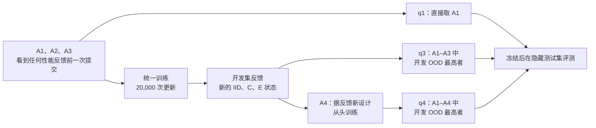

# 让训练时的先验替技能说话：APPL 把结构先验写进技能接口

<!-- release-date: 2026-09-28 -->

> 本文依据 **Agent Priors-guided Policy Learning**（APPL），作者 Puming Jiang、Tianrun Hu（共同一作）、Haozhe Du、Yibo Li、Zhiwei Xue、Xinhu Li、Harold Soh，新加坡国立大学（National University of Singapore，NUS），arXiv:2609.35690v1，2026-09-28 提交，共 35 页，封面标 Preprint。正文 10 页，参考文献到第 17 页，附录 A–D 占第 18–35 页。页码均指这份 PDF 的页码，与页脚印刷页码一致。文中区分 3 件事：**论文明确写了什么**、**我们如何解释它**、**哪些是外部补充**。

## 读前先把几个词说成人话

这篇论文讲的是机器人从少量演示里学技能，再把技能拼成新任务。难点不在扩散模型，也不在大模型规划，而在两者之间那道「接口」：上层到底知道下层技能多少事情。

先把会反复出现的词说清楚：

- **演示（demonstration）**：人或脚本控制机器人完整做一遍任务留下的轨迹。本文的演示全部由脚本专家或脚本规划器生成，只含成功轨迹（PDF p. 18、p. 22）。
- **技能（skill）**：一个可复用的操作，带一个子目标，比如「拉开抽屉」。一个技能可以有好几个具体实现，每个实现是一个 **策略（policy）**（PDF p. 4）。
- **扩散策略（Diffusion Policy，DP）**：把「给定观测，输出一段动作」写成扩散模型去噪的模仿学习方法。少量演示下它倾向于复现演示过的动作，到分布外状态容易失灵（PDF p. 3）。
- **分布外（Out-of-Distribution，OOD）**：测试时的状态落在演示没覆盖过的范围，比如物体被挪到演示里从没出现过的位置。
- **结构先验（structural prior）**：对「这个行为依赖什么」的一条假设。论文的例子是：抓取只依赖夹爪相对物体的位姿，与物体在世界坐标里的绝对位置无关（PDF p. 1）。把它写进训练，它决定策略往哪个方向泛化；把它写成文字，它告诉上层这个策略在哪里能用。
- **成功区域与适用区域**：成功区域是策略真正能完成子目标的起始状态集合，上层一般看不见；适用区域是接口里「声称」能用的范围。两者对不上，信息就丢了（PDF p. 4）。
- **交接（handoff）**：前一个技能结束、后一个技能接手的那一刻。前一个技能留下的状态，未必是后一个技能演示里见过的起点。
- **TCP（Tool Center Point，工具中心点）**：机械臂末端执行器上的参考点。实验二里所有方法都输出 TCP 目标位姿，再由共享的逆运动学模块（IK）换成关节命令（PDF p. 6、p. 22）；实验一的策略则直接输出 MetaWorld 原生的末端位移命令（PDF p. 18）。
- **VLA（Vision-Language-Action，视觉–语言–动作模型）**：用大规模数据把语言指令、图像和动作塞进一个模型。实验二里的对照用的是 π0.5（PDF p. 8、p. 23）。

## 一句话先说清

少量演示学出来的机器人，部署时要同时扛住 2 种泛化（PDF p. 1）：

1. **技能泛化**：物体挪了位置，或者起点是另一个技能留下的状态，单个技能仍要做得成。
2. **组合泛化**：把学过的技能跳过、调序、从中途开始，拼出演示里没有的新任务。

两者互相依赖。上层的组合决策要知道每个技能「物理上能做到哪」，下层技能又必须覆盖上层把它放进去的那些状态。论文认为现有做法在 2 层之间丢了信息：一个技能在哪里能用，由训练它时用的结构决定；可上层只通过技能名、一句指令或一个符号算子认识它，这些描述里没有那份结构（PDF p. 1）。

APPL 的做法是把同一个结构先验派 2 个用场（PDF p. 2、p. 4）：

- **训练时**，先验通过表示、动作坐标系或辅助损失写进策略，决定它的 **覆盖（coverage）**；
- **运行时**，同一个先验连同训练支撑范围、交接条件和验证证据，写进接口给上层 agent 读，支撑 **选择（selection）**。

一个离线的构建 agent 负责切分演示、为每个技能提出多个先验、各训一个策略并验证；一个在线的运行时 agent 读这些接口，挑策略、给参数、定时长和停止条件，把技能拼向新目标（PDF p. 2）。

摘要和引言给的核心数字（PDF p. 3）：

- 6 个 MetaWorld 任务上，每任务只有 2 条演示时，agent 设计的先验把 OOD 成功率做到 89.6%，固定关系先验只有 37.9%；
- 5 个长时程 ManiSkill 任务、每任务 12 条演示，物体被挪动后 APPL 成功率 50.0%，整任务扩散策略只有 10.0%；
- 中途开始或要求提前结束的任务变体上 92.5%；
- 16 个演示里从没出现过的技能组合，解出 8 个；
- 保留同一个策略库、只把接口里构建时写下的信息藏起来，成功率显著下降。

最后一条是全文的落点：**训练时为了让技能泛化而做的结构假设，也正是上层决定「何时、如何用这个技能」所需的信息**（PDF p. 3）。

### 一条阅读路线

如果只有半小时读原文，建议按这个顺序：

1. **p. 2 的 Figure 1**：先看清构建 agent、冻结技能库、运行时 agent 3 块怎么连，橙色标的是先验的 2 个用场。
2. **p. 4 第 3 节**：成功区域 $W$、适用区域 $A$，以及「忠实」与「信息充分」2 个接口标准。全文的论证都踩在这 2 个集合上。
3. **p. 5–7 第 4 节**：式 2 是覆盖，式 3 是选择，式 6 是接口的 4 个字段，式 7 是运行时循环。
4. **p. 7 Table 1、p. 8 结果段**：实验一只测覆盖。
5. **p. 9 Table 2 与结果段**：实验二测覆盖加选择，消融把「同一个库、不同接口信息」分开。
6. **p. 23–26 附录 B.3–B.6**：配对检验、验证误导选择的机理、失败模式、以及评测口径里事后调整过的地方。读结论前一定要看。

附录 C（p. 27–31）是 4 个 agent 的原文提示词，附录 D（p. 32–35）是和最近方法的逐项对比，第一次可以只当对照表。

## 主要矛盾：上层看得见技能叫什么，看不见技能在哪能用

论文把现有路线分成 3 类，各自卡在不同地方（PDF p. 1–2）：

| 路线 | 2 层怎么连 | 卡在哪 |
|---|---|---|
| VLA | 任务语义和底层控制塞进一个模型 | 学到的行为在什么条件下泛化是隐式的，对布局和物体位置变化仍不够稳 |
| 任务与运动规划（TAMP） | 2 层分开，用符号前置条件和效果连起来 | 前置条件和效果要人写或从数据里学；SymSkill 让同一份结构同时服务 2 层，但结构取自预先定好的相对坐标系谓词和动力系统控制器 |
| agent 把策略当工具调用 | 用语言当接口 | 技能名或指令说明工具「干什么」，不说明它在什么物理条件下有效；技能之间的交接仍是常见失败来源 |

另一条线是给少量演示策略加结构先验：以物体为中心的表示、功能对应、可供性与接触位置、等变性与任务相关坐标系、视觉提示等。论文指出 2 个共同点（PDF p. 3）：每种先验只适合一族操作，由人按任务挑选；先验只用于训练，后面负责组合的系统完全不知道它。

还有一条线是让语言模型设计学习系统的一部分，最接近的是 LGA 和 KALM，它们让模型为模仿学习选表示先验。差别在于它们每个任务只产出 1 个设计、只用于训练（PDF p. 3–4）。

于是矛盾可以压成一句：

> 训练时为了泛化做的结构假设，恰好是上层判断「这个策略在哪能用」最需要的信息；现有系统要么根本不做这个假设，要么做了却在训练结束后把它丢掉。

## 先看全景：离线建库，在线组合

图引自原文 Figure 1（PDF p. 2）。中栏放大的那张卡片是 `red_transfer__h02`：先验是「目标相对于观测到的红色目标位置」，交接重叠里包括了蓝块的拾取，证据是训练起点范围和「验证 10/12」，策略是冻结检查点 $\pi_6$。橙色标的就是先验的 2 个用场：实线箭头向下「塑造学习」，虚线箭头向右「告知调用」。

这张图里有 3 件事要先记住，后面都会展开：

- 技能库是 **冻结** 的。运行时 agent 不能改权重、不能写控制代码，每个回合之间记忆清空（PDF p. 7）。它能做的只有「选哪个策略、给什么参数、跑多久、什么时候停」。
- 同一个技能会有 **多个实现**。图里每行 4 个策略对应 4 个先验，其中第 4 个是看过验证结果后补的（PDF p. 6）。
- 接口不是一句技能名，而是 4 个字段：先验描述、交接描述、支撑描述、验证证据（PDF p. 6，式 6）。

## 问题定义：成功区域 $W$ 与适用区域 $A$

第 3 节把直觉写成了集合，这是读懂消融实验的钥匙。

### 目标

机器人观测 $o$、动作 $a$，$\mathrm{Succ}(g, o) \in \{0, 1\}$ 表示目标 $g$ 在观测 $o$ 处是否成立。系统 $S = (C, L)$ 由技能库 $L$ 和组合器 $C$ 组成：库里是策略和接口的配对，一个技能可以有多个策略；组合器按顺序调用策略，但 **只能通过接口 $I_i$ 看到策略**。构建阶段拿到 $N$ 条完整、未切分的演示和任务知识，产出一个冻结系统，最大化测试分布上的期望成功率（PDF p. 4，式 1）：

$$
J(S) = \mathbb{E}_{g \sim P_{\text{test}},\ o_0 \sim \mu_{\text{test}}(g)}\big[\mathrm{Succ}(g, o_T)\big]
$$

这里 $P_{\text{test}}$ 是测试目标分布，$\mu_{\text{test}}(g)$ 是给定目标时的初始状态分布，$o_T$ 是回合结束时的观测。

### 3 种分布外

策略 $\pi_i$ 的 **成功区域** $W(\pi_i)$，是从中出发能以至少 $1-\epsilon$ 的概率达成子目标的起始观测集合（PDF p. 4）。论文据此区分 3 种测试（PDF p. 4）：

| 名称 | 变了什么 | 没变什么 | 测的是 |
|---|---|---|---|
| 动作级 OOD（motion-level） | 物体位置 | 任务与技能顺序 | 技能泛化 |
| 任务级 OOD（task-level） | 从演示中途某阶段附近开始，或只要求做到某个中间子目标 | 演示的技能顺序 | 按当前进度和要求终点调整执行 |
| 组合（composition） | 跳过、调序技能，或某个子目标一开始就已满足、但下一个技能的入口条件与演示交接不同 | — | 组合泛化 |

论文的例子：把蓝块放进抽屉、同时让红块留在抽屉里。这跳过了演示中「先把红块取出」那一步，也改变了放置技能的入口条件。论文特意强调，**只挪物体不算新组合**（PDF p. 4）。

可靠的组合要求 2 件事同时成立：各次调用的子目标合起来达成 $g$，且第 $j$ 次调用的起点落在被调策略的成功区域里，即 $o_{t_j} \in W(\pi_{i_j})$。所以 2 种泛化是耦合的：一个新顺序或新交接，会制造出技能泛化必须覆盖的新起点（PDF p. 4）。

### 接口的 2 个标准

组合器看不见 $W(\pi_i)$。接口 $I_i$ 只给出一个声称的 **适用区域** $A_i$，组合器只能检查 $o_{t_j} \in A_{i_j}$（PDF p. 4）：

- 若 $A_i \not\subseteq W(\pi_i)$，组合器会在策略做不成的地方调用它；
- 若 $A_i$ 远小于 $W(\pi_i)$，组合器会放弃本来能用的调用。

于是好接口要 **忠实**（faithful）：$A_i \subseteq W(\pi_i)$；还要 **信息充分**（informative）：$A_i \approx W(\pi_i)$。问题被定义成：只用演示和任务知识，同时造出「成功区域覆盖新组合会产生的状态」的策略，以及「忠实且信息充分地描述这些区域」的接口（PDF p. 4）。

**我们如何解释它。** 这个形式化把「接口」从工程细节提升为一个可以被消融的变量。实验二的几组消融恰好就是在固定 $W$（同一个库）的前提下改变组合器能看到的 $A$，这是全文最干净的一组对照。

## 核心设计一：同一个先验，派 2 个用场

### 旧问题：同一组演示能拟合出成功区域完全不同的策略

少量演示下，很多策略都能把演示拟合好，但离开演示后的行为差别很大，成功区域 $W(\pi_i)$ 也就不同（PDF p. 5）。用哪种结构去约束学习，传统上是人按任务定的一次性设计决定。

### 训练实现：先验决定覆盖

先验 $\rho_i$ 可以通过策略表示、动作参数化、网络结构或辅助训练目标来实现。记对应的策略类为 $\Theta_{\rho_i}$，训练目标是行为克隆损失加上先验专属的辅助损失（PDF p. 5，式 2）：

$$
\theta_i = \arg\min_{\theta \in \Theta_{\rho_i}} \mathbb{E}_{D_{k(i)}}\big[\ell_{\text{BC}}(\theta) + \lambda_i\, \ell^{\text{aux}}_{\rho_i}(\theta)\big]
$$

$D_{k(i)}$ 是策略 $i$ 所属技能的数据，$\ell_{\text{BC}}$ 是行为克隆损失，$\lambda_i$ 是辅助项权重。先验于是决定了策略在演示之外怎么表现，也就决定了 $W(\pi_i)$。论文把这个用场叫做 **覆盖**（PDF p. 5）。

论文给的一个具体实现是物体坐标系先验：在每个动作块开始时取观测到的物体位姿 $(R_t, p_t)$，把末端执行器目标换到物体坐标系里（PDF p. 6，式 5）：

$$
x^{\text{loc}} = R_t^{\top}(x^{\text{world}} - p_t), \qquad \Delta x^{\text{loc}} = R_t^{\top} \Delta x^{\text{world}}, \qquad \Delta x^{\text{world}} = R_t\, \Delta x^{\text{loc}}
$$

$R_t$ 是物体朝向的旋转矩阵，$p_t$ 是物体位置。训练时把演示动作编码进物体坐标，推理时再解码回世界坐标。这样学到的行为依赖的是相对物体的运动，而不是绝对运动。

### 描述实现：先验支撑选择

同一个先验还有一个文字版本，进入运行时接口。对基于表示的先验，记 $\phi_{\rho_i}(o)$ 为变换后的观测，$R_i$ 为变换后的技能演示所覆盖的区域，则假设的适用区域是（PDF p. 5，式 3）：

$$
A_i = \{\, o : \phi_{\rho_i}(o) \in R_i \,\}
$$

人话版：在物体坐标系先验下，物体被挪到一个新的绝对位置，只要相对关系仍在演示范围内，这个状态就仍算在 $A_i$ 里。运行时 agent 用这份信息决定调哪个策略，论文把这个用场叫做 **选择**（PDF p. 5）。

### 为什么同一个先验能让接口更忠实，以及它保证不了什么

论文的论证是：训练和描述用同一个先验，适用区域的声明就建立在真正塑造了策略的那条假设上，因此 **意在** 提高忠实度 $A_i \subseteq W(\pi_i)$。论文同时明说这 **不被保证**：它取决于先验本身对不对，也取决于训出来的策略有没有真正实现这个先验。信息充分还额外要求 $A_i$ 不要无谓地保守（PDF p. 5）。

既然合适的结构因技能、因情形而异，构建就要同时选切分方式 $\sigma$ 和每个策略的先验（PDF p. 5，式 4）：

$$
\max_{\sigma,\ \{\rho_i\}} J\big(S(\sigma, \{\rho_i\}, D_N)\big)
$$

这是一个开放的设计空间，而部署目标 $J$ 在构建时又拿不到。所以 APPL 用语言模型 agent 来提出、实现、评估候选设计（PDF p. 5）。

### 可迁移启发

训练时做过的每一个结构假设，都值得被写成下游能读的文档。它不保证正确，但它是一份「这个模型应该在哪里好用」的可证伪假设，比一个模型名或一句功能描述有用得多。

## 核心设计二：切分时故意让相邻技能重叠

构建 agent 拿到完整演示、任务目标和观测与控制约定，在每条轨迹上提出技能边界，把执行同一操作的片段归成技能数据集 $D_k$（PDF p. 5）。

关键是 **相邻片段故意在交接处重叠**：一个技能的训练数据包含前驱技能的末尾一段和后继技能的开头一段（PDF p. 5）。这样后继策略的训练支撑覆盖了前驱 **实际会走到** 的状态，包括前驱名义上还没做完的状态。重叠复用原演示里的转移，不增加任何演示数据。

图 1 中栏那张 `red_transfer__h02` 卡片上写的「交接重叠包括蓝块拾取」，就是这个机制的一个实例（PDF p. 2）。分段提示词还要求 agent 报告共享的索引、监督动作数和时长，并解释重叠如何帮到接手的技能（PDF p. 28）。

论文对这个设计的定位很克制：它沿袭了扩大后继技能「起始集」的已有工作，**作为设计选择，不算贡献**（PDF p. 34–35）。

**我们如何解释它。** 重叠给的是一份「交接附近的覆盖」，同时又把交接条件写进了接口的 $h_i$ 字段。它是同一条思路在数据层的投影：不只让策略学得宽一点，也让上层知道它学宽了多少。

## 核心设计三：每个技能提多个先验，各训一个，验证后再补一个

### 提多个，而不是选一个

对每个技能，构建 agent 从不同的先验族里提出若干个，而不是押宝在一个设计上。理由是：事先通常无法知道哪条结构假设能在该技能日后被调用的所有状态上泛化最好；留下多个按先验区分的策略，运行时就有了同一技能的备选实现（PDF p. 6）。

提示词把「互补」定义得很具体：互补的意思是它们 **预期的失败不同**，而不只是实现不同。每个先验要写清它针对哪种变化或失败、机制是什么、上层在什么可观测条件下该优先选它、它预计在哪失败、由集合里哪一个兜底；至少一个先验必须针对被操作物体相对演示的位移（PDF p. 29）。

实验二里 agent 实际交出的组合（PDF p. 22）：

- 每个技能 3 个互补先验，至少 1 个针对物体位移；
- 3 个原始任务的 10 个技能里，每个技能都有一个「在被操作物体或机构坐标系里表达目标」的先验，和一个「预测相对当前 TCP 位姿修正量」的先验；
- 其中 8 个技能还有「目的地坐标系」先验，7 个先验加了阶段输入或辅助阶段目标。

### 实现：固定接口，统一配方

agent 针对一个固定的策略接口写实现：从因果观测历史构造输入，把演示动作编码进先验指定的坐标，把预测动作解码回原生命令，可以加式 2 的辅助损失。每个先验产出一个独立的条件扩散策略，用同一份训练配方；共享的 IK 模块把解码后的末端目标换成关节命令（PDF p. 6）。

### 验证，再补 1 个

冻结之前，构建 agent 为每个候选策略收集有限的执行证据（PDF p. 6、p. 22）：

1. 只用演示过的技能入口状态，不做任何 OOD 试跑；
2. 每个策略从每条演示里对应片段的入口状态出发，跑片段长度的 1.5 倍，在最终状态检查预先定义的出口条件，例如抽屉至少拉开 0.29 m；中途短暂满足、最终不满足的不算通过；
3. agent 读结果写验证报告，把观察到的结果和对策略的推断分开写；
4. 根据反馈，为每个技能再提 1 个先验（命名为 `h04`），同样训练、同样验证；
5. 最后为每个策略写一份使用说明，连同验证分数一起进入接口。

### 可迁移启发

「同一能力保留多个实现、按适用条件区分」在软件里很常见，在学习型策略库里却少见。这里的关键是区分的维度：不是按性能排名留最好的那个，而是按「各自预期在哪失败」留一组互补的，把挑选推迟到真正知道当前状态的运行时。

## 核心设计四：4 个字段的接口，与只能「选、给参、定时、定停」的运行时 agent

### 接口长什么样

构建 agent 为每个策略记录一个接口（PDF p. 6，式 6）：

$$
I_i = (d_i,\ h_i,\ s_i,\ v_i)
$$

| 字段 | 内容（PDF p. 6） |
|---|---|
| $d_i$ 先验描述 | 先验背后的结构假设：策略被设计成依赖哪些观测与关系、预计能容忍哪些变化、已知局限 |
| $h_i$ 交接描述 | 入口与出口条件，以及重叠片段所代表的前驱与后继状态 |
| $s_i$ 支撑描述 | 演示训练支撑的摘要，比如技能入口状态的取值范围 |
| $v_i$ 验证证据 | 验证阶段收集的证据 |

每个接口还声明策略需要的类型化参数，比如要操作的物体和目的地（PDF p. 6）。

### 运行时循环

构建完成后，技能库、接口、运行时 agent 的模型、提示词和工具全部冻结（PDF p. 6）。每个决策点，运行时 agent 收到任务目标 $g$、当前状态与目标谓词、最近交互历史、本回合笔记本和可用策略接口，用之前可以查看任意策略的完整接口（PDF p. 6）。循环写成（PDF p. 6，式 7）：

$$
(i_j, u_j, m_{j+1}) \sim R_\alpha(\cdot \mid h_{t_j}, g, m_j, L), \qquad a_{t:t+H} \sim \pi_{i_j}(\cdot \mid h_t, u_j), \qquad t_j \le t < t_{j+1}
$$

$R_\alpha$ 是运行时 agent，$h_t$ 是交互历史，$m_j$ 是回合笔记本，$i_j$ 是第 $j$ 次调用选中的策略，$u_j$ 是调用参数，$a_{t:t+H}$ 是 $H$ 步的动作块。前半句是 agent 选择，后半句是冻结策略执行。

一次调用 $u_j$ 规定 3 样东西（PDF p. 6、p. 23）：

- 策略的类型化参数；
- 执行时长，实验二里每次调用至多 300 步；
- 停止条件，作用在观测量上，可以是绝对值，也可以是相对调用开始时的变化量。论文的例子：要求夹爪开度小于 3 cm，且被抓物体抬高超过 4 cm（PDF p. 6）。

执行器用新观测运行所选策略，每一步检查停止条件；条件触发就把控制权连同更新后的状态与目标谓词交还 agent。整体任务目标一旦满足，执行器也会立刻中断调用（PDF p. 6–7）。之后 agent 可以继续当前技能、换同一技能的另一个策略、调用别的技能，或结束任务。再次调用同一策略会接着它的动作队列，换策略则清空队列（PDF p. 23）。

它 **不能** 写控制代码，不能改冻结的库，每回合之间记忆清空（PDF p. 7）。

### 2 个用场在这里会合

训练实现决定每个策略真正能从哪些状态成功；接口暴露的是构建时对这份能力的假设。运行时 agent 用后者来挑选和串联策略，让库里学到的覆盖在新任务上被用起来（PDF p. 7）。

**我们如何解释它。** 运行时 agent 的权限被刻意收窄成调度器：它不产生动作，只决定「谁来做、做多久、看到什么就停」。这让实验二能把「选得好不好」和「技能本身行不行」拆开看。代价是：库里没有的能力，agent 也变不出来，失败分析里会看到这一点。

## 实验一：只测覆盖，agent 设计的先验让单个技能泛化

实验一只问一件事：给定技能和少量演示，agent 能否设计并实现让策略泛化的先验？技能和子目标直接给定，不涉及组合（PDF p. 7）。

### 测试状态长什么样

图引自原文 Figure 3（PDF p. 19）。每个任务变化 2 个空间因子：IID 在演示过的因子组合内重新采样；C（recombined）把 2 个因子交叉组合；E（extrapolated）把 2 个因子都放到演示区间之外。OOD 是 C 与 E 等权平均（PDF p. 7）。论文特别说明，C 是单个技能内部的空间因子重组，**不是技能组合**（PDF p. 18）。

演示在「低–低」和「高–高」2 个格子之间交替，所以 $N = 2, 5, 10, 20$ 时分别含 1/1、3/2、5/5、10/10 条（PDF p. 18）。这种排布让演示里 2 个因子高度相关，策略很容易学到「看一个因子就猜另一个」的捷径，C 测试专门戳这一点。

各任务的因子与区间（PDF p. 18，Table 3，平移单位 m，偏航单位度）：

| 任务 | 因子 | 演示 L | 演示 H | 外推 E-L | 外推 E-H |
|---|---|---|---|---|---|
| pick-place-wall | 物体 x | [−.030, −.015] | [.015, .030] | [−.050, −.040] | [.040, .050] |
| | 目标 x | [−.030, −.015] | [.015, .030] | [−.050, −.040] | [.040, .050] |
| assembly | 螺母 x | [−.040, −.020] | [.020, .040] | [−.080, −.060] | [.060, .080] |
| | 插销目标 x | [−.050, −.030] | [.030, .050] | [−.100, −.080] | [.080, .100] |
| drawer | 柜体 x | [−.040, −.020] | [.020, .040] | [−.100, −.070] | [.070, .100] |
| | 柜体偏航 | [−10, −5] | [5, 10] | [−37, −33] | [33, 37] |
| door | 门 x | [.030, .040] | [.060, .070] | [.000, .020] | [.080, .100] |
| | 门偏航 | [−10, −5] | [5, 10] | [−37, −33] | [33, 37] |
| peg-insert-side | 插销 y | [.550, .575] | [.625, .650] | [.500, .525] | [.675, .700] |
| | 盒子 y | [.500, .525] | [.575, .600] | [.425, .450] | [.650, .675] |
| stick-push | 棍子 x | [−.065, −.060] | [−.050, −.045] | [−.080, −.073] | [−.037, −.030] |
| | 目标 y | [.565, .572] | [.580, .587] | [.550, .557] | [.593, .600] |

### 设定与对照

6 个改编后的 MetaWorld 任务（MetaWorld 3.1.1 的状态输入版本），每个任务 20 条成功演示（PDF p. 7、p. 18）。所有系统拿到同样的状态通道：当前与上一时刻的手部位置、夹爪开度、至多 2 个物体的位置与朝向，加上目标和少量任务专属点；设计时 agent 还可以看每个演示集至多 16 张图像，但策略本身不用图像（PDF p. 18）。动作是 MetaWorld 原生命令，每步末端位移至多 1 cm，控制频率 80 Hz；策略预测 16 步、执行前 4 步后重新规划；回合在首次成功、原生终止或 500 步时结束（PDF p. 18）。

| 系统 | 做法（PDF p. 7、p. 19） |
|---|---|
| B0 | 原版条件 1D U-Net 扩散策略，输入标准化的状态历史，预测原生动作 |
| B1 | 在 B0 上加 3 个预先定义的世界坐标系关系向量（物体减手、目标减被操作部件、stick-push 再加目标减工具），小 MLP 编码后与状态拼接。论文强调它是 **一个** 固定关系先验，不是专家先验的穷举 |
| A1–A4 | agent 的候选。共享扩散主干、20,000 次更新预算、控制器与评测，可以改表示、编码器、动作坐标和辅助损失；参数量不超过 B0 的 3 倍 |

设计 agent 用的是 GPT-6 Astra，推理强度 max（PDF p. 19）。共享的训练与采样设置见 Table 5：历史 2 帧、预测 16 步、执行 4 步；AdamW、恒定学习率 $10^{-4}$；20,000 次更新、batch 128；DDPM 100 步训练、DDIM 16 步采样；评测最终的 EMA 检查点（PDF p. 20）。

### 候选怎么产生、怎么挑

流程按 PDF p. 7 与附录 A、C.1（p. 18、p. 27–28）重画，是协议示意，不是论文原图。每个任务 × $N$ 组合（共 24 个）里，agent 先交 3 个候选，此后才拿到开发集反馈，再设计第 4 个。选择规则事先冻结：最大化开发集上 C 与 E 成功率各占一半的平均，平局时依次比推理延迟、参数量、候选编号；IID 和隐藏测试分数都不参与选择（PDF p. 7、p. 27–28）。3 种报告口径共用 144 个训练好的模型，不额外训练（PDF p. 7、p. 18）。

每个候选至多 3 次接口检查（首次校验加 2 次修复），检查里不允许跑任务、不允许优化更新、不允许性能搜索；做不出有效候选时要显式提交无效，不能克隆别的模型（PDF p. 27）。

### 结果

Table 1（PDF p. 7），6 任务等权平均的隐藏测试成功率（%）：

| 方法 | $N=2$ IID | $N=2$ OOD | $N=5$ IID | $N=5$ OOD | $N=10$ IID | $N=10$ OOD | $N=20$ IID | $N=20$ OOD | OOD 均值 |
|---|---:|---:|---:|---:|---:|---:|---:|---:|---:|
| Diffusion Policy（B0） | 73.33 | 28.96 | 82.50 | 37.29 | 97.50 | 38.54 | 100.00 | 46.67 | 37.86 |
| 关系先验（B1） | 85.83 | 37.92 | 93.33 | 42.71 | 100.00 | 52.29 | 100.00 | 56.25 | 47.29 |
| APPL 首个提案（q1） | 84.17 | 56.04 | 95.83 | 63.54 | 100.00 | 73.33 | 100.00 | 78.75 | 67.92 |
| APPL 三选一（q3） | 90.83 | 80.00 | 100.00 | 81.46 | 100.00 | 90.42 | 100.00 | 88.96 | 85.21 |
| APPL（q4） | 96.67 | **89.58** | 100.00 | **93.54** | 100.00 | **93.33** | 100.00 | **93.13** | **92.40** |

论文的读法（PDF p. 8）：

- 每个 $N$ 上 agent 设计的先验都抬高了 OOD 成功率。$N=2$ 时 q4 是 89.58%，B0 是 28.96%，B1 是 37.92%；q4 相对 B1 的领先在 $N = 2, 5, 10, 20$ 时分别是 51.67、50.83、41.04、36.88 个百分点。
- $N$ 较大时各方法 IID 成功率接近，所以收益来自泛化，而不是拟合得更好。附录补了一个更直白的对照：$N=20$ 时所有系统 IID 都是 100.00%，但 E 成功率 B0 是 25.42%，B1 是 36.25%，q4 是 88.33%（PDF p. 21）。

把 q1 → q3 → q4 拆成 3 步看（PDF p. 8）：

| 步骤 | 相对上一步增加（百分点） |
|---|---|
| 首个提案 q1 相对 B1 | 18.1–22.5 |
| 提 3 个、按开发 OOD 挑（q3 相对 q1） | 10.2–24.0 |
| 反馈后再设计 1 个（q4 相对 q3） | 2.9–12.1 |

A4 在 24 个条件里被选中 15 次；测试成功率上升 10 次、持平 13 次、下降 1 次（PDF p. 8）。

论文同时提醒：q1 到 q4 每一步都同时增加了候选数和开发集挑选，所以 q4 − q3 并不能单独度量「反馈」的作用（PDF p. 8、p. 21）。

### 分任务看

图引自原文 Figure 4（PDF p. 21），图中数值为读图估计。door 面板上看不到单独的 B0 灰线，被 B1 的线遮住；stick-push 的 q3 线同样被 q4 遮住。论文的文字结论：assembly 仍是最难的任务、随 $N$ 不单调；24 个条件里 q4 全部高于 B0，23 个高于 B1、1 个持平（PDF p. 21）。

图注有一句容易被忽略的话：不同 $N$ 下 agent 设计出来的结构可能不同，所以这些曲线描述的是「设计流程」随数据量的表现，**不是某一个架构的数据扩展曲线**（PDF p. 21）。

### 2 个修订案例：反馈到底改了什么

附录明说这 2 个例子是看过结果之后挑来说明问题的，不是消融（PDF p. 20）。

**drawer，$N=2$。** A1 在柜体坐标系里表达手–把手关系和动作，OOD 75.00%。演示里的平面动作接近 $4(p^{\text{handle}} - p^{\text{hand}})$，于是 A4 在动作编码里减掉这一项，网络只需预测残差（PDF p. 8）。附录给了可逆的编码式（PDF p. 20，式 8）：

$$
z_{xyz} = L_\theta\, a_{xyz} + 4 P_{xy}\, e, \qquad a_{xyz} = L_\theta^{-1}\big(z_{xyz} - 4 P_{xy}\, e\big)
$$

$L_\theta$ 把世界向量转到柜体坐标，$e = L_\theta(h - \text{handle})$ 是手相对把手的误差，$P_{xy}$ 把竖直分量置零，夹爪通道不变。网络学的是 $z$，执行时再按右式解回真实动作。残差能外推到新位置，OOD 升到 100.00%，即 80 个 OOD 回合全部成功（PDF p. 20）。

**assembly，$N=5$。** 演示里螺母和目标位置是相关的，开发反馈显示「交叉布局」失败。A4 在圆环被抬起之前削弱目标特征和目标对齐坐标系，拆掉这条捷径，OOD 从 41.25% 升到 93.75%（PDF p. 8）。附录补充：A4 同时组合了 A1 的度量关系特征和 A2 的搬运坐标系、用抬升与夹爪信号切换坐标、去掉了 A2 的边与注意力编码器，好几处一起改了，所以收益 **无法归到某一个部件**（PDF p. 20）。

**反例。** door，$N=20$：A4 把 A1 的 44 维条件压到 25 维，开发分数同为满分、延迟更低而被选中，测试 OOD 却从 100.00% 降到 96.25%（PDF p. 20）。

**我们如何解释它。** drawer 那个案例最值得记：agent 看到「演示动作近似一个比例控制律」，就把这个控制律写进动作编码，让网络只学残差。这是一个人类工程师也会做的、而且极具任务针对性的先验。它说明 agent 设计的价值不在于「有一个先验」，而在于能针对每个技能、每次数据找到不同的那条规律。

### 读这张表要知道的边界

- 区间是 95% 的分层自助法区间（20,000 次重采样），**以已训练的模型和这 6 个任务为条件**，不度量训练种子之间或独立 agent 设计之间的波动（PDF p. 20）。训练种子固定为 0（PDF p. 20）。
- 每个模型测 20 个 IID、40 个 C、40 个 E 状态；开发集是每格 IID 5 个、C 10 个、E 5 个（PDF p. 19）。
- 这 6 个任务和 20 条演示是早先开发中采集的，研究开始前就已被看过（PDF p. 18）。
- drawer 与 door 改了环境：整个柜体会旋转平移，后挡轨后移，把手目标是关节行程 80% 处的把手位姿；assembly 放宽了螺母重置范围（PDF p. 18）。这些改动对所有系统共享，在设计会话之前固定。

## 实验二：覆盖加选择，在长时程任务上拼技能

实验二问：运行时 agent 能不能把按先验区分的技能策略组合起来，从演示里没有的状态和目标出发完成任务（PDF p. 8）？

图引自原文 Figure 2（PDF p. 8）。每个任务 12 条成功演示，由脚本规划器采集，不含失败和恢复（PDF p. 8、p. 22）。状态包括 Panda 机械臂关节位置与速度、TCP 位姿、任务物体位姿、抽屉位移或盖子角度这类关节状态，以及目标位置；只有 Agent+VLA 里的 VLA 额外拿到图像（PDF p. 22）。ManiSkill 以 20 Hz 做关节位置控制，回合上限 5,000 步，运行时 agent 推理时仿真暂停（PDF p. 22）。

几个成功判据（PDF p. 22）：drawer exchange 要求抽屉拉开超过 0.26 m、红块在垫子上、蓝块在抽屉里；pour and return 要求 12 颗颗粒里至少 10 颗进碗，且容器直立在标记区域里。

构建 agent 把 drawer exchange、buffer exchange、pour and return 各切成 3 个技能，retrieve and store 与 covered peg assembly 各切成 4 个（PDF p. 22）。实验二所有 agent 角色用的是 GPT-5.6 Sol，推理强度 extra-high；运行时 agent 每回合至多 128 次请求，上下文保留最近 6 轮（PDF p. 22）。

### 对照与消融

| 方法 | 是什么（PDF p. 8、p. 22–23） |
|---|---|
| DP | 一个整任务扩散策略，预测世界坐标系下的 TCP 位置、6D 旋转和夹爪命令；60,000 次更新 |
| SinglePrior | 同一个语言模型为整任务设计 1 个先验、训 1 个策略，没有运行时 agent；60,000 次更新 |
| Agent+VLA | 保留 APPL 的运行时 agent、提示词、工具和执行器，把技能库换成 1 个 π0.5 VLA，agent 用技能名作为指令调用它 |
| w/o interface information | 同一个已验证的库（每技能 4 个策略），接口里只剩技能名、随机打乱的匿名标签 A–D 和调用格式 |
| w/o prior information | 在上一行基础上加回每个策略的验证分数和出口判据；先验、交接、支撑描述和使用说明仍藏起来 |
| w/o HL agent | 同一个库，用固定规则代替 agent：按演示顺序走技能，观察到几何子目标就算完成，每个策略至多 300 步，连续 2 次失败换下一个策略 |
| w/o verification | 每个技能只有 3 个原始策略，跳过验证；完整 APPL 多出第 4 个策略、验证证据和使用说明 |

APPL 每个策略训练 20,000 次更新，预测 16 步、执行 8 步（PDF p. 22）。Agent+VLA 全量微调了 `lerobot/pi05_base` 的 4.14B 参数，训练数据就是 APPL 库用的 5 个任务的 204 个技能片段（112,761 帧），配 17 条来自切分的技能名指令；有效 batch 56，预先定好 10 个 epoch（20,136 次更新），评测最终检查点、不做挑选；每次输出 50 步动作块、执行前 8 步（PDF p. 23）。

**我们如何解释它。** 前 3 行消融是全文最有说服力的设计：技能库完全相同，$W$ 不变，只改组合器能看到的接口信息。这正是第 3 节「信息在 $A$ 与 $W$ 之间丢失」的直接操作化。最后一行 w/o verification 则同时改了策略数和信息，不是干净的单变量消融，论文自己也这么说（PDF p. 25）。

### 3 套测试

| 测试 | 每任务 | 内容（PDF p. 8、p. 23–24） |
|---|---|---|
| 动作级 OOD（M） | 8 个冻结布局 | 被操作物体在至少一个轴上偏离标称位置 13–27.5 mm，超出各自 ±8–15 mm 的演示范围 |
| 任务级 OOD（T） | 8 例 | 4 例从演示中途某阶段附近恢复执行（如抽屉已开、插销已在手里），4 例只要求演示序列的一个前缀（如只开抽屉） |
| 组合（Comp.） | 5 个任务共 16 例 | 跳过或调序技能，或某个子目标一开始已完成、但入口条件与演示交接不同 |

脚本规划器能完成全部任务级与组合例、以及 40 个动作级 OOD 布局中的 37 个（PDF p. 23）。DP 和 SinglePrior 没有目标输入，只参与动作级 OOD 比较（PDF p. 9）。每例跑 1 个回合，成功按「首次达成目标」计（PDF p. 9）。

### 结果

Table 2（PDF p. 9），每格是成功例数：

| 方法 | Drawer M | Drawer T | Buffer M | Buffer T | Retrieve M | Retrieve T | Peg M | Peg T | Pour M | Pour T | M 合计（%） | T 合计（%） | Comp. |
|---|---|---|---|---|---|---|---|---|---|---|---:|---:|---|
| DP | 0/8 | – | 0/8 | – | 1/8 | – | 3/8 | – | 0/8 | – | 10.0 | – | – |
| SinglePrior | 1/8 | – | 0/8 | – | 2/8 | – | 1/8 | – | 0/8 | – | 10.0 | – | – |
| Agent+VLA | 1/8 | 8/8 | 1/8 | 4/8 | 5/8 | 8/8 | 5/8 | 4/8 | 1/8 | 4/8 | 32.5 | 70.0 | 6/16 |
| w/o interface information | 0/8 | 4/8 | 4/8 | 5/8 | 2/8 | 6/8 | 0/8 | 7/8 | 2/8 | 4/8 | 20.0 | 65.0 | 2/16 |
| w/o prior information | 4/8 | 7/8 | 0/8 | 4/8 | 4/8 | 6/8 | 3/8 | 6/8 | 7/8 | 6/8 | 45.0 | 72.5 | 3/16 |
| w/o HL agent | 0/8 | 4/8 | 2/8 | 4/8 | 0/8 | 4/8 | 3/8 | 4/8 | 4/8 | 5/8 | 22.5 | 52.5 | 1/16 |
| w/o verification | 2/8 | 5/8 | 3/8 | 6/8 | 2/8 | 5/8 | 8/8 | 6/8 | 6/8 | 5/8 | 52.5 | 67.5 | 7/16 |
| APPL | 3/8 | 7/8 | 2/8 | 8/8 | 7/8 | 8/8 | 1/8 | 7/8 | 7/8 | 7/8 | 50.0 | **92.5** | **8/16** |

动作级 OOD 合计一列，最高的是 w/o verification 的 52.5，不是完整 APPL 的 50.0。两者总数只差 1 例：covered peg assembly 一格 8/8 对 1/8，抵掉了 APPL 在其他 4 个任务上的净领先（PDF p. 9）。原因在后面「验证会在偏移下排错序」一节。

**APPL 比整任务策略更能扛物体偏移。** 动作级 OOD 上 APPL 50.0%，DP 与 SinglePrior 都是 10.0%，配对精确 McNemar 检验 $p < 0.001$（PDF p. 9）。论文明确说这是 **系统级** 对比：它衡量的是运行时调度加上「一个由多样先验训出的更大技能库」的合并优势（PDF p. 9），不能单独归给先验或单独归给 agent。

**同一个库，需要有信息的选择。** 保留已验证的策略、拿掉全部接口信息，动作级 OOD 从 50.0% 掉到 20.0%，任务级从 92.5% 掉到 65.0%，组合从 8/16 掉到 2/16；把 agent 换成固定规则则是 22.5%、52.5%、1/16（PDF p. 9）。

这些差距是否站得住，看附录 Table 9 的配对检验（PDF p. 24）。「胜」是只有 APPL 做成的例数，「负」是只有对照做成的例数，$p$ 是双侧精确 McNemar 值：

| 对照 | 测试 | 胜 | 负 | $p$ |
|---|---|---:|---:|---:|
| DP | 动作级 OOD | 18 | 2 | < 0.001 |
| SinglePrior | 动作级 OOD | 17 | 1 | < 0.001 |
| w/o interface information | 动作级 OOD | 17 | 5 | 0.017 |
| w/o interface information | 任务级 OOD | 12 | 1 | 0.003 |
| w/o interface information | 组合 | 6 | 0 | 0.031 |
| w/o prior information | 动作级 OOD | 6 | 4 | 0.754 |
| w/o prior information | 任务级 OOD | 9 | 1 | 0.021 |
| w/o prior information | 组合 | 6 | 1 | 0.125 |
| w/o HL agent | 动作级 OOD | 15 | 4 | 0.019 |
| w/o HL agent | 任务级 OOD | 16 | 0 | < 0.001 |
| w/o HL agent | 组合 | 7 | 0 | 0.016 |
| w/o verification | 任务级 OOD | 11 | 1 | 0.006 |

拿掉全部接口信息、或换成固定规则，3 套测试上都显著；只藏先验描述时，显著的只有任务级 OOD。

附录 B.4 把接口信息拆成 2 层逐级加回（PDF p. 25）：

| 从 → 到 | 动作级 OOD | 任务级 OOD | 组合 |
|---|---|---|---|
| 无接口信息 → 加回验证分数与出口判据 | 20.0% → 45.0%（胜 15 负 5，$p = 0.041$） | 65.0% → 72.5% | 2/16 → 3/16 |
| 再加回先验、交接、支撑描述与使用说明（即完整 APPL） | 45.0% → 50.0%（胜 6 负 4，$p = 0.754$） | 72.5% → 92.5%（胜 9 负 1，$p = 0.021$） | 3/16 → 8/16（胜 6 负 1，$p = 0.125$） |

论文自己的结论很分寸（PDF p. 25）：验证信息就收回了接口在动作级 OOD 上的大部分收益；先验等描述的额外收益主要体现在任务级变体上；组合上的差异是一个 **正向但统计上不显著** 的趋势。

**我们如何解释它。** 这张拆解表其实修正了摘要的读法。「先验写进接口」这件事，在物体偏移上几乎没有额外贡献（45.0 对 50.0，不显著），显著的贡献在任务级 OOD；组合上 3/16 到 8/16 看着翻倍，但 16 例里胜 6 负 1，样本量撑不起显著性。真正稳健的结论是「同一个库，有接口信息的选择远好于没有信息或固定规则」。

### 一个组合例子：agent 怎么用先验推理

「不倒颗粒、直接把满容器放回」这个组合例最能说明完整 agent 怎么用先验信息（PDF p. 9）：放回策略的交接说明写的是「容器已倒空」，但它的先验 **不包含颗粒状态**。agent 由此推断这个策略也能放回一个满的容器，抓起后直接调用它，2 次调用就达成目标。

这正是「先验描述」与「交接描述」2 个字段各自给出的信息：交接字段说演示里它是在什么状态下接手的，先验字段说它到底依赖什么。后者让 agent 敢把它用在交接字段没写过的状态上。

### 验证会在偏移下排错序

验证在整体上帮了选择，但它只在演示入口状态上打分，在偏移下可能把策略排错（PDF p. 9）。

Table 8（PDF p. 24）是每个策略从 12 个演示入口状态出发的验证通过数，h01–h03 是原始先验，h04 是看过验证后补的；每个任务最后一行是整任务策略从演示初始状态出发的结果：

| 任务 | 技能 | h01 | h02 | h03 | h04 |
|---|---|---|---|---|---|
| Drawer exchange | open_drawer | 3/12 | 6/12 | 12/12 | 2/12 |
| | red_transfer | 4/12 | 10/12 | 9/12 | 10/12 |
| | blue_insert | 10/12 | 12/12 | 10/12 | 11/12 |
| | 整任务策略 | DP 5/12；SinglePrior 5/12 | | | |
| Buffer exchange | buffer_red | 5/12 | 12/12 | 0/12 | 8/12 |
| | place_blue | 7/12 | 1/12 | 12/12 | 4/12 |
| | place_red | 3/12 | 12/12 | 12/12 | 12/12 |
| | 整任务策略 | DP 1/12；SinglePrior 0/12 | | | |
| Retrieve and store | open_drawer | 6/12 | 12/12 | 10/12 | 7/12 |
| | retrieve_tunnel_block | 5/12 | 12/12 | 12/12 | 4/12 |
| | place_block_in_drawer | 5/12 | 12/12 | 12/12 | 5/12 |
| | close_drawer | 12/12 | 12/12 | 12/12 | 12/12 |
| | 整任务策略 | DP 1/12；SinglePrior 1/12 | | | |
| Covered peg assembly | open_hinged_lid | 7/12 | 12/12 | 10/12 | 12/12 |
| | retrieve_peg_from_box | 0/12 | 4/12 | 8/12 | 3/12 |
| | reorient_and_stage_peg | 5/12 | 8/12 | 0/12 | 2/12 |
| | align_and_insert_peg | 12/12 | 12/12 | 12/12 | 12/12 |
| | 整任务策略 | DP 4/12；SinglePrior 4/12 | | | |
| Pour and return | grasp_lift_stage | 2/12 | 0/12 | 7/12 | 11/12 |
| | controlled_pour_and_right | 8/12 | 9/12 | 6/12 | 12/12 |
| | return_place_release | 12/12 | 12/12 | 12/12 | 3/12 |
| | 整任务策略 | DP 2/12；SinglePrior 0/12 | | | |

这张表里有 3 件事（PDF p. 25）：

1. 在 3 个原始任务上，物体或机构坐标系先验的验证通过数中位数是 5/12，预测相对当前 TCP 修正量的先验中位数是 12/12。在演示入口状态上，「相对当前位姿微调」天然占便宜。
2. 补出来的 h04 只在 pour and return 里比该技能最好的原始策略验证得更好（11 对 7、12 对 9）。
3. 有验证信息时，动作级 OOD 下 49% 的调用落在 12 次全过的策略上；没有验证信息时是 26%。

covered peg assembly 的失败就出在这里。重定向技能的验证报告把 h02 定为首选、建议不要常规使用 h03；有验证的 agent 在每个布局上一律先选 h02。没有验证的 agent 首次选 h03 的布局有 4 个、h02 有 3 个、h01 有 1 个（PDF p. 25）。结果动作级 OOD 从 8/8 掉到 1/8，抵掉了其他 4 个任务上的收益（PDF p. 9）。

h03 为什么被误判？它的 12 次验证都在第 347–384 步之间先满足了「摆好」判据，然后在第 570 步固定评分之前又丢掉了（PDF p. 25）。0/12 这个分数掩盖了一段 agent 本可以交接给插入技能的窗口。验证只看固定时长后的终态，而运行时 agent 恰恰会用停止条件在中途交接。

论文给的教训是：验证应该在策略日后被调用的入口分布与交接规则下评估策略（PDF p. 25），在真机上做不了 OOD 试跑时尤其如此（PDF p. 9）。

### 剩下的失败

论文归纳了 3 类（PDF p. 9、p. 25）：

1. **后续动作破坏先前进展**：drawer exchange 里一次抓取把抽屉推关了，之后没有任何开抽屉策略能处理那个机械臂状态。
2. **抓空或掉落**：演示里没有恢复轨迹，库里也没有「重新接近丢失物体」的技能，插销和颗粒容器都遇到过。
3. **新组合违反技能的演示入口条件**：covered peg assembly 的 3 个组合例全部失败，取插销时要么机械臂从初始位出发且盖子已经开着，要么插销放在桌上，都不是演示里的入口状态。

论文特别区分：这几类是「缺恢复能力或入口覆盖」，和验证那个例子「在本可用的策略里选错」不是一回事。另外有 2 个 drawer 布局连脚本规划器也做不成，所以并非每个失败都能归到学到的库上（PDF p. 25）。

组合例按任务拆开：drawer exchange 4 例中 2、buffer exchange 3 例中 1、retrieve and store 3 例中 3、covered peg assembly 3 例中 0、pour and return 3 例中 2（PDF p. 24）。任务级的 2 半：APPL 完成 20 个恢复例中的 18 个、20 个前缀目标例中的 19 个，各消融分别是 12–14 和 9–17（PDF p. 24）。

## 评测口径里要知道的几件事

附录 B.6 坦白了几处评测设计上的事后调整，读 Table 2 前必须知道（PDF p. 25–26）：

- **动作级 OOD 这一档是看过更难那档的结果后才选的**：做法是把超出演示范围的位移减半。新的初始状态对所有方法共用。附录给了换算式：演示半宽为 $b$ 的偏移 $d$ 变成 $\mathrm{sign}(d)\big(\min(|d|, b) + \tfrac{1}{2}\max(|d| - b, 0)\big)$（PDF p. 23）。
- **4 个 drawer 例在看过任务级结果后被改划为组合例**：替补的任务级例和 12 个新组合例在评测前固定、并已由脚本规划器跑通。新加的任务在 APPL 于其上出任何结果之前就已选定。
- **停止规则与设计不一致**：任务级评测器本来设计了「目标保持 300 步」的条件，但共享执行器在第一个满足目标的步就中断了调用。有 agent 的方法共 173 个成功的任务级与组合回合，全部在满足目标 1 步后结束；固定规则的 22 个成功回合也都在首次达成时停止。所以 300 步保持条件 **没有约束任何一个报告的成功**。这些结果衡量的是「执行器辅助停止下的目标达成」，既不能说明 agent 能不能自己停住，也不能说明结果是否稳定保持。
- **瞬时成功确实出现过**：组合例 C-N3 要求把方块放进抽屉并让抽屉开着。无验证的变体被记成功时方块还在下落，按 20 Hz 相邻位置推算，最后一个控制步的平均下落速度约 1.66 m/s。几何目标达到了，但是否保持没有评估。

**我们如何解释它。** 这些披露本身是加分项，但它们说明 Table 2 的数字是「首次触碰目标」的口径，比通常理解的「完成任务」要宽。再加上每格只有 8 例、每例只跑 1 个回合，单格之间差 1–2 例不宜过度解读，论文自己也只在配对 McNemar 检验显著的地方下强结论。

## 和最近几条路线差在哪

附录 D 用 2 张表把相关工作按「结构塑造策略」和「结构告诉调用者」2 个用场重新排了一遍。Table 10（PDF p. 32）：

| 路线 | 塑造策略吗 | 告诉调用者什么 | 结构由谁设计 |
|---|---|---|---|
| 结构先验 | 是 | 不告诉，先验只留在训练里 | 人，按任务族 |
| agent 设计学习系统 | 是，每个策略 1 个设计 | 不告诉，设计只服务训练 | agent |
| 通用 VLA | 隐式，通过数据 | 一条不说明适用范围的指令 | 数据 |
| agent 调用工具 | 否，工具是给定的 | 名称、可行性估计或执行记录 | 设计者或预训练 |
| 共享抽象 | 部分，通过固定规则或配方 | 谓词、前置条件与效果，或技能规格 | 设计者或固定规则 |
| APPL | 是，每个技能多个备选先验 | 同一批先验，加交接重叠和训练支撑 | agent，按技能 |

几组关键差异（PDF p. 33–35）：

- **SymSkill** 是最接近的前作：离线从未切分的演示里联合学谓词、算子和相对坐标系下的动力系统技能，在线由符号规划器组合并能实时恢复。和 APPL 差 3 处：结构只来自一个设计族、每个算子只关联一个策略、规划器读的是符号前置条件与效果。论文认为两者互补，SymSkill 学到的谓词和反应式恢复可以放进 APPL 的接口里当执行检查和后备行为。
- **LGA、KALM、ATK** 证明了语言或视觉语言模型能为模仿学习选表示先验，但每个只自动化一族先验、每个任务出 1 个设计、只当策略输入。APPL **不主张**「agent 设计先验」本身是新东西，新在多族、多备选、并复用为运行时文档。
- **Harness VLA、BATON、RoboHarness** 也是用指令、步数预算和停止条件调用策略，APPL **不主张** 这种调用方式是新的。差别是那些系统在策略存在之后才从执行里学出适用范围、入口条件或策略卡片；APPL 的文档来自构建时的先验和训练数据里的重叠，第一次执行前就有了。
- **Agentic Skill Discovery** 也为每个技能保留多个策略变体，但把「怎么在其中挑」留给了未来工作；APPL 用区分这些变体的先验来做这个选择。

## 限制、边界与未公开

论文自己写明的（PDF p. 10–11）：

- **结构先验描述的是「意图中的泛化」，不保证能力**：策略离开演示支撑仍可能失败，现有库也不足以支撑恢复。下一步包括改进验证、通过定向采集或数据增强扩大技能支撑、接入运动规划器等互补工具。
- **只在仿真里评测**：运行时检查与先验本身并不能让真机部署变安全。
- **重跑不保证复现**：重新运行基于大模型的 agent 可能产出不同的策略设计和运行时决策；数值上的精确一致还取决于软硬件环境。

我们读完必须留下的判断：

- **实验一的统计只覆盖模型条件下的测试状态波动**：区间不含训练种子、不含独立重复的 agent 设计（PDF p. 20）。一次 agent 会话就是一个样本。
- **实验二每格 8 例、每例 1 回合**：组合只有 16 例，最引人注目的 8/16 对 3/16 在配对检验下 $p = 0.125$，不显著（PDF p. 24–25）。
- **「先验写进接口」的显著贡献集中在任务级 OOD**：动作级 OOD 的收益大多由验证信息就能收回（PDF p. 25）。
- **验证可能起反作用**：在 covered peg assembly 上，验证信息把正确策略压了下去，动作级 OOD 从 8/8 跌到 1/8（PDF p. 9、p. 25）。验证协议与运行时交接规则不一致，是一个结构性问题。
- **评测口径有事后调整**，成功按首次触碰目标计，没有评估保持（PDF p. 25–26）。
- **系统级对比混了多个因素**：APPL 对 DP 与 SinglePrior 的 50.0 对 10.0，同时包含运行时调度和「更大、更多样」的策略库，还包含训练预算差异（DP 与 SinglePrior 每个策略 60,000 次更新，APPL 每个策略 20,000 次，但 APPL 策略数多得多）（PDF p. 9、p. 22）。论文没有给出总训练算力的对比。

原件没有写的：

- 训练与推理的墙钟时间、GPU 型号与数量、总算力；
- 构建 agent 与运行时 agent 的调用开销（token 数、费用、每次决策的延迟）；论文只说仿真在 agent 推理时暂停（PDF p. 22）；
- 2 个实验分别用的 GPT-6 Astra 与 GPT-5.6 Sol 除名称和推理强度设置外的任何信息（PDF p. 19、p. 22），也没有换用其他语言模型的对照；
- agent 生成的具体先验代码、工具定义和 `INTERFACE.md` 等参考文档：论文说会随代码发布（PDF p. 11、p. 27），这份 PDF 里没有；
- 真机实验。

## 可迁移启发

1. **把训练时的假设写成下游能读的文档。** 不管是机器人策略还是任何一个被别的系统调用的模型，训练时「我假设它依赖什么、不依赖什么」是一份免费的适用范围说明。不写下来，它就在训练结束时丢了。
2. **接口质量可以用 2 个集合来想。** 声称能用的范围 $A$ 和真正能用的范围 $W$：$A$ 超出 $W$ 是误调用，$A$ 远小于 $W$ 是浪费。设计任何工具描述、模型卡片、API 文档时，都可以问一句：这份描述忠实吗？信息够吗？
3. **测接口的价值，要固定能力、只改信息。** 实验二前 3 行消融用同一个库、只改调用方能看到的字段，这是把「能力」和「选择」分开的标准做法。评估 agent 的工具使用时值得照搬。
4. **同一能力保留多个实现，按预期失败模式区分。** 不要只留排行榜第一名。把「各自在哪会失败」写清楚，把挑选推迟到知道当前状态的那一刻。
5. **验证协议要和使用方式对齐。** 只在演示入口、固定时长、看终态的验证，会惩罚「中途达标、随后漂移」的策略，而运行时恰好会在中途交接。验证的入口分布与终止规则，应当和部署时一致。
6. **让 agent 先提多个、再按开发集挑，比让它一次交 1 个更值。** 实验一里「提 3 个再挑」的增益（10.2–24.0 个百分点）大于「看反馈再改 1 个」（2.9–12.1 个百分点）（PDF p. 8）。在 agent 驱动的设计循环里，宽度往往比深度划算。
7. **调度层权限越窄，归因越清楚。** 运行时 agent 不能写代码、不能改权重，只能选、给参、定时、定停。这让失败可以被归到「库里没有」还是「选错了」，也让系统更容易审计。

## 关键词回看

- **结构先验**：对「行为依赖什么」的假设。训练时决定覆盖，写进接口时支撑选择。
- **覆盖与选择**：先验的 2 个用场，分别对应式 2 和式 3。
- **成功区域 $W$ 与适用区域 $A$**：真正能用的起点集合与接口声称能用的集合。好接口要忠实（$A \subseteq W$）且信息充分（$A \approx W$）。
- **动作级 OOD、任务级 OOD、组合**：只挪物体；中途开始或提前结束；跳过、调序或改变入口条件。只挪物体不算新组合。
- **交接重叠**：切分时让相邻技能的训练片段互相重叠，扩大后继技能的起始覆盖。论文不把它算作贡献。
- **接口 4 字段**：先验描述 $d_i$、交接描述 $h_i$、支撑描述 $s_i$、验证证据 $v_i$。
- **h01–h04**：每个技能 3 个原始先验加 1 个看过验证后补的先验。
- **q1、q3、q4**：首个提案、3 选 1、4 选 1。选择只看开发集 C 与 E 的平均。
- **89.58% 对 37.92%**：实验一 $N=2$ 时 q4 与 B1 的 OOD 成功率。
- **50.0%、92.5%、8/16**：实验二 APPL 的动作级 OOD、任务级 OOD 与组合成绩。
- **8/8 → 1/8**：covered peg assembly 上验证信息把策略排错序的代价。
- **首次达成**：实验二的成功口径；300 步保持条件实际没有生效。

## 资料与阅读边界

### 本文依据的版本

- 原件：arXiv:2609.35690，[arxiv.org/abs/2609.35690](https://arxiv.org/abs/2609.35690)。截至核验只有 v1，提交于 2026-09-28，PDF 共 35 页，页边标 `arXiv:2609.35690v1 [cs.RO] 28 Sep 2026`。
- `release-date` 取 2026-09-28。这篇是方法论文，没有对外可用的模型或服务；论文写明代码、agent 生成的策略实现、提示词、评测例和回合结果将来会发布（PDF p. 11），截至核验未见官方仓库，因此取技术首次官方公开日，即 arXiv v1 提交日。

### 论文明确写了、本文覆盖了的部分

摘要；第 1 节动机与 Figure 1；第 2 节相关工作；第 3 节问题定义（式 1、成功区域、3 种 OOD、接口标准）；第 4 节先验的 2 种实现（式 2–5）、切分重叠、提出与验证、接口（式 6）、运行时组合（式 7）；第 5.1 节实验一与 Table 1；第 5.2 节实验二、Figure 2 与 Table 2；第 6 节结论与限制；AI 使用、可复现与伦理声明；附录 A（Table 3–6、Figure 3–4、修订案例与式 8）；附录 B（Table 7–9、评测例、验证与选择分析、失败机理、评测口径）；附录 C 提示词的要点；附录 D（Table 10–11 与最近方法对比）。

### 外部补充（不是 PDF 原文）

- 版本与提交日期来自 arXiv 摘要页。除此之外本文没有引入外部资料；文中所有对比方法的描述均以 PDF 附录 D 的表述为准，没有另行核对那些方法的原文。

### 原文没有公开、本文也不补的缺口

- 代码、agent 生成的先验实现、工具定义与参考文档（论文称将随代码发布）；
- 训练与推理的硬件、墙钟时间和总算力，以及 agent 调用的开销；
- 所用语言模型除名称和推理强度设置外的信息，以及换用其他模型的对照；
- 训练种子或独立 agent 会话之间的方差；
- 真机实验与「目标达成后能否保持」的评估。
