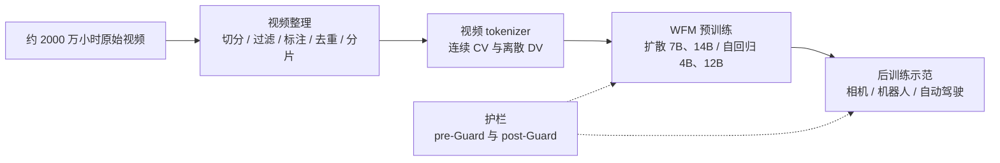

# Cosmos：世界写不成仿真器，就从两千万小时视频里学一个

<!-- release-date: 2024-11-06 -->

> 本文依据本地 `papers/NVIDIA/Cosmos.pdf`，即 NVIDIA 的 **Cosmos World Foundation Model Platform for Physical AI**，arXiv:2501.03575v3、2025-07-09 提交的修订版（页眉日期 2025-7-11），共 75 页：正文 58 页，第 59–60 页是贡献者与致谢，第 61–75 页是参考文献。页码均指 PDF 自身的页码。这一版里的模型用 2025 年 3 月之后的命名（`Cosmos-Predict1-*`、`Cosmos-Tokenize1-*`）。文中区分三件事：**报告明确写了什么**、**我们怎么解释它**、**哪些是外部资料或本文推算**。

## 阅读前先认识几个词

- **Physical AI（物理 AI）**：报告的定义是「装有传感器和执行器的 AI 系统」，传感器用来观察世界，执行器用来改变世界（PDF p.1）。机器人、自动驾驶车都算。
- **世界模型（world model）**：给定过去看到的画面和这一步对世界的「扰动」，预测接下来的画面。
- **世界基础模型（World Foundation Model，WFM）**：报告提出的定位词，指一个通用的世界模型，可以微调成某个具体场景的定制世界模型（PDF p.1）。它之于世界模型，相当于基座大模型之于垂直领域的助手。
- **Token 与 tokenizer**：生成模型不直接吃像素。tokenizer 先把视频压成一串紧凑的符号（token），token 越少，后面的模型越跑得动。
- **连续 token 与离散 token**：连续 token 是浮点向量，给扩散模型用；离散 token 是整数编号，给用交叉熵训练的 GPT 式模型用（PDF p.11–12）。
- **扩散模型（diffusion model）**：先给数据加噪声，训练一个网络一步步去噪；生成时从纯噪声出发反复去噪。**DiT**（Diffusion Transformer）是把去噪网络换成 transformer 的写法。
- **自回归（autoregressive）**：一次生成一个 token，接回输入再生成下一个，和语言模型一样。
- **Text2World / Video2World**：报告给两类任务起的名字。前者「一段文字 → 一段世界视频」；后者「过去的视频 + 一个提示 → 未来的视频」，这才是世界模型的正式形态（PDF p.5）。

## 一句话先说清

Cosmos 不是一个模型，而是一套**帮开发者造自己的世界模型**的平台：数据整理流水线、视频 tokenizer、预训练好的世界基础模型、几个后训练示范，以及安全护栏（PDF p.5，图 4）。权重以 NVIDIA 开放模型许可发布（PDF p.1、p.4）。

预训练模型分两族（PDF p.18，表 10）：

- **扩散族**：7B 与 14B 两个 Text2World 基座，各自微调出一个 Video2World，使用连续 tokenizer；
- **自回归族**：4B 与 12B 两个「只看视频、不懂文字」的基座，各自加交叉注意力得到 5B 与 13B 的 Video2World，使用离散 tokenizer。

报告里的全部 WFM 在 **10,000 张 H100 上训了三个月**（PDF p.18），没有拆到单个模型。

它买到了什么、没买到什么，报告自己的实验说得很清楚：

1. **几何上自洽。** 在 RealEstate10K 的 500 个静态场景上，7B-Text2World 生成视频的 Sampson 误差 0.355、相机位姿估计成功率 62.6%，基线 VideoLDM 是 0.841 与 4.4%（PDF p.37，表 19）。
2. **物理上还不行。** 在 800 段刚体仿真视频上，最好的 9 帧条件预测，物体掩码平均 IoU 也只有 0.598（14B-Video2World），而且**大模型并不比小模型更守物理**（PDF p.39–40，表 20）。
3. **微调之后能接上具体任务。** 相机控制、机器人指令与动作、六路自动驾驶视图三类后训练，都明显好过同样微调的基线（PDF p.43、p.47–48、p.52）。但报告也写明：这些 `-Sample-` 模型只是示范，不是能直接用的生产模型（PDF p.40）。

如果只记一句话：

> **Cosmos 押的注是「世界的仿真器写不出来，就像语言模型学语言那样从视频里学」。它把「看起来对」做到了，「物理上对」还没做到，报告自己也这么说。**

### 一条阅读路线

1. **p.1–6**：动机、WFM 的定义（图 3）、平台五件套（图 4）、五个设想用途。
2. **p.6–11**：数据整理，含表 1–3。
3. **p.11–18**：tokenizer，重点是图 9 与表 5、6、9。
4. **p.18–35**：两族预训练模型，表 10 是地图，表 11–18 是配置与推理。
5. **p.35–40**：3D 一致性与物理对齐评测，全篇最重要的两张表（表 19、20）。
6. **p.40–53**：三类后训练；**p.53–55**：护栏；**p.58**：结论与限制。

## 先讲矛盾：机器人为什么不能「多练几遍」

语言模型的进步有一条朴素的路：把数据和算力一起放大。Physical AI 走不了这条路。

报告开篇把原因写得很直接：Physical AI 需要的是**观测与动作交替出现**的序列数据，而动作会真的扰动物理世界，可能损坏系统和环境；AI 还稚嫩、必须靠探索性动作学习的时候尤其如此（PDF p.1）。互联网上有海量视频，但视频只记录了「发生了什么」，没有记录「当时做了什么动作」。

于是有了那句老话：Physical AI 需要先在数字世界里训练（PDF p.1）。它需要两个数字孪生：自己的副本（策略模型）和世界的副本（世界模型）。

难点在世界的副本。传统做法是基于物理定律和系统辨识手写模型，机器人和自动化行业用了几十年；报告在相关工作里指出，这类为某个系统专门写的模型通常局限在低维状态空间，难以跨系统泛化和迁移，换个任务或环境就要重做（PDF p.55）。

Cosmos 的回答是：像训练语言基座那样，先用大量、多样的视频训出一个「通才」世界模型，再用目标场景的小数据把它微调成「专才」（PDF p.1–2，图 2）。这个赌注一下，后面就是一串必须还清的账：视频不能直接拿来训、视频太大塞不进 transformer、扩散和自回归选哪条、通才怎么变专才、照片级生成器开放出去怎么保证安全。这五笔账，正好是平台的五个部件。

## 先看全景：一个函数，五个部件

报告把 WFM 写成一个函数（PDF p.4，图 3）：给定从 0 到 $t$ 时刻的 RGB 视频 $x_{0:t}$ 和当前扰动 $c_t$，预测下一时刻的观测：

$$
\hat x_{t+1} = \mathcal{W}(x_{0:t},\ c_t)
$$

关键在 $c_t$ 定义得很宽：它可以是 Physical AI 的一个动作、一次随机扰动、或一段对扰动的文字描述（PDF p.4）。**这个宽松定义就是整个平台的设计自由度**：因为 $c_t$ 可以是文字，预训练能用互联网视频加自动生成的字幕；因为 $c_t$ 也可以是相机位姿、机械臂的 7 维动作或一条行车轨迹，后训练能把同一个底座接到不同场景上。

这张图根据报告图 4 与图 5（PDF p.5–6）重画，只表达部件之间的依赖，不代表时序或并行方式。

报告第 2.1 节还列了 WFM 的五种设想用途：策略评估、策略初始化、策略训练、规划或模型预测控制、合成数据生成（PDF p.4–5）。紧接着一句是：**本文没有包含把 Cosmos WFM 用于这些场景的实证结果**（PDF p.5）。读后面的实验时要记住这一点：报告证明的是「生成得像、可以控制」，不是「拿它训出的策略更好」。

## 第一笔账：两千万小时视频，怎么变成能训练的数据

报告说，数据决定了模型的天花板（PDF p.1）。

### 原料与配比

训练用专有视频数据集和公开的互联网视频，累计约 2000 万小时，分辨率 720p 到 4K（PDF p.6–7）。目标品类是刻意挑的（PDF p.6）：

| 品类 | 占比 |
|---|---:|
| 自然动态 | 20% |
| 手部动作与物体操作 | 16% |
| 空间感知与导航 | 16% |
| 驾驶 | 11% |
| 人体动作与活动 | 10% |
| 第一人称视角 | 8% |
| 动态相机运动 | 8% |
| 合成渲染 | 4% |
| 其他 | 7% |

这不是互联网视频的自然分布。手部操作、空间导航、第一人称、驾驶加起来过半，全是「一个身体在世界里干活」的视角。

产出是约 $10^8$ 个 2–60 秒的片段用于预训练、约 $10^7$ 个用于微调（PDF p.1、p.7）。流水线五步：切分、过滤、标注、去重、分片（PDF p.6，图 5）。

### 切分：先把镜头切换切掉

很多视频里有镜头切换，上一秒是纽约厨房里两个人聊天，下一秒是非洲草原上狮子追斑马（报告自己举的例子，PDF p.7）。不切开，模型学到的是「画面可以毫无理由地整体跳变」，这恰好是物理世界不会发生的事。所以先按镜头切，短于 2 秒的丢掉，长于 60 秒的再切（PDF p.7）。

选哪个镜头检测算法，报告自建了基准 ShotBench 来比（PDF p.7–8，表 1）。F1 分数：

| 数据集 | PySceneDetect | Panda70M | TransNetV2 | AutoShot |
|---|---:|---:|---:|---:|
| BBC | 0.889 | 0.777 | **0.967** | 0.952 |
| RAI | 0.831 | 0.829 | **0.919** | 0.906 |
| SHOT | 0.718 | 0.622 | 0.821 | **0.834** |
| ClipShots | 0.477 | 0.513 | **0.726** | 0.711 |

端到端学习的方法明显好过手工特征与启发式规则。TransNetV2 和 AutoShot 互有胜负，最后选 TransNetV2，理由有二：它在更难的镜头切换上更好；而且纯神经网络能直接吃 GPU 加速，不必像 Panda70M 那样把 PySceneDetect 和 ImageBind 嵌入用复杂逻辑拼起来（PDF p.8）。后一条是纯工程理由。

### 转码：6.5 倍来自换软件栈

切好的片段统一重编码成高码率 mp4（`h264_nvenc`），并用快速运动和高频纹理的视频压测过画质（PDF p.8）。提速的过程在表 2（PDF p.8）：

| 方案 | GPU | 编解码器 | 批量 | 吞吐（视频/秒） |
|---|---|---|---:|---:|
| ffmpeg | H100（补到 28 核 CPU） | libx264 | 1 | 0.0574 |
| ffmpeg | L40S | h264_nvenc | 1 | 0.0674 |
| ffmpeg | L40S | h264_nvenc | 16 | 0.1026 |
| PyNvideoCodec + ffmpeg | L40S | h264_nvenc | 1 | **0.3702** |

三处加速性质不同：L40S 同时有硬件解码器（NVDEC）和编码器（NVENC），H100 只有 NVDEC，所以 L40S 快约 17%；同一视频的多个片段成批转码；最大的一跳是把视频流转码从 ffmpeg 换成 PyNvideoCodec，因为 ffmpeg 没能把硬件编解码器用满，多 GPU 节点上尤其明显（PDF p.8）。合起来约 6.5 倍。

**可迁移启发。** 数据流水线的瓶颈常常不在算法，而在某个通用工具没走到硬件的快路径上。这种问题只有实测吞吐才能发现。

### 过滤：四道闸

| 过滤 | 拦什么 | 怎么做 |
|---|---|---|
| 运动 | 静止画面、手持相机的乱抖；顺带给片段打上摇、推、俯仰等运动标签 | ViT 分类器读光流，TensorRT 加速的光流网络效果最好 |
| 画质 | 伪影、噪点、模糊、过曝欠曝；低美学 | DOVER 质量分最低 15% 丢掉；美学分阈值取保守的 3.5 |
| 叠字 | 后期加上去的大量文字 | InternVideo2 嵌入 + MLP 二分类器，训练标签由专有 VLM 生成 |
| 类型 | 抽象图案、游戏录像、动画等 | 自建分类体系 + MLP 分类器；同时上采样人与物体交互、下采样自然风光 |

（PDF p.9）

三个细节值得记。美学阈值故意定得低，因为「美学对 Physical AI 不那么重要」（PDF p.9）：一段难看的仓库录像，对学物理的价值可能远高于调过色的旅拍。叠字过滤只针对后期加的字，不针对场景里本来就有的字，比如驾驶视频里的路牌（PDF p.9）。类型过滤同时做了「排除」和「配比」两件事，前面那张品类表就是这么调出来的。

两个分类器的训练集都靠专有 VLM 打标：每段均匀抽 8 帧，问 VLM 最合适的类别（PDF p.9）。**用贵的大模型标少量数据，再蒸馏成便宜的小分类器跑全量**，这是现代数据流水线的标准套路。报告没给这些分类器的准确率。

### 标注：统一文风，省掉一个学习任务

每个片段用 VLM 生成描述，而不用网页自带的 alt text。理由是：统一风格的描述让世界模型不必在训练中适应五花八门的文本格式（PDF p.10）。

他们比过 VFC、Qwen2-VL、VILA，按小规模人工评估选了 VILA；用的是内部 13B 参数、为视频描述微调过、扩大了上下文的版本，最大输入 5904 token、输出 256 token；每段喂 8 帧，描述平均 559 个字符、97 个词（PDF p.10）。推理换成 FP8 量化的 TensorRT-LLM 引擎后，报告说吞吐是 PyTorch 半精度基线的 10 倍（PDF p.10，表 3）：

| 引擎 | 精度 | 批量 | 片段/秒 | token/秒 |
|---|---|---:|---:|---:|
| PyTorch | FP16 | 1 | 0.21 | 49.6 |
| TRT-LLM | FP16 | 1 | 0.40 | 95.6 |
| TRT-LLM | FP16 | 16 | 1.09 | 260.9 |
| TRT-LLM | FP8 | 16 | **1.96** | **470.6** |

按表算是 9.3 倍（片段）或 9.5 倍（token），「10 倍」是取整（本文核算）。按 1.96 片段/秒标 1 亿个片段，约合 590 个单卡日（本文推算，报告没给）。在这个量级上，标注本身就是一次大规模推理任务，所以值得为它做量化和专门的推理引擎。

### 去重、分片与基础设施

去重沿用 SemDeDup 与 DataComp 的思路：复用过滤阶段算好的 InternVideo2 嵌入，用多节点 GPU 加速的 k-means 聚成 10,000 个簇，只在簇内算两两距离；遇到重复保留分辨率最高的那个；为了不把整个距离矩阵放进显存，按 256 的块在线算上三角并做 argmax 归约（PDF p.10）。**去掉约 30% 的数据**（PDF p.10）。同一批嵌入和聚类还顺手做成了一个视觉搜索引擎，能用文字或视频查询整个训练集，用来排查数据问题、理解预训练数据与下游应用的差距（PDF p.10）。

分片按分辨率、宽高比和长度把片段打成 webdataset，与训练课程对齐（PDF p.10）。

基础设施用 Ray 实现面向地理分散集群的流式流水线，把数据传输和计算解耦，使内存需求随流水线复杂度而不是数据量增长；不同阶段同时占用不同的硬件资源（网络带宽摄入数据、NVDEC 解码、GPU 计算），调度器扩展了 Fragmentation Gradient Descent 算法来自动伸缩各阶段（PDF p.11）。

## 第二笔账：视频太大，先用 tokenizer 压小

一段 121 帧、$1280\times704$ 的视频有约 1.09 亿个像素位置，直接送进 transformer 不可能。tokenizer 是这条链上压缩最狠的一环。

图引自原文图 9（PDF p.14）。左边是时间上的因果分组，右边是编码器与解码器的模块：Haar 小波、因果残差块、因果下采样、因果时空注意力，解码器镜像编码器。

### 因果：一个小约束换来图像与视频共用一个网络

Cosmos Tokenizer 最核心的选择是**时间上因果**：当前帧的 token 不依赖未来的帧（PDF p.5）。报告给了两个理由（PDF p.5）：

- **训练侧**：因果视频 tokenizer 在输入只有一帧时，就是一个图像 tokenizer。于是图像和视频可以联合训练，而图像数据外观丰富、种类更多，对视频模型很重要。
- **应用侧**：Physical AI 活在因果的世界里，因果 tokenizer 更贴合。

机制在图 9 和图 7 的说明里：第一帧 $x_0$ 单独成组、单独对应第一个时间 token，之后每 4 帧一组，所以图像（$T=0$）和视频（$T>0$）落在同一个潜空间里（PDF p.12–13）。卷积在时间方向只做左侧补零（补 $k-1$），「不许看未来」直接写进了算子形状（PDF p.13–14）。

报告没有做因果与非因果的对照，所以「放弃未来帧」在重建质量上损失多少，文中无从得知。

### 小波变换：先用信号处理去冗余

输入先过一个 2 级 3D Haar 小波变换，在 $x$、$y$、$t$ 三个方向各降采样 4 倍（PDF p.13）。要注意：小波变换是可逆的，位置数少了 64 倍，但信息挪进了通道，总数值并没有减少。报告给的理由是，它把视频换成一个消除了像素冗余的更紧凑表示，让后面的层专注于更「语义」的压缩（PDF p.13）。

编码器主体是残差块与下采样块交替；卷积做成时空分解（先 $1\times k\times k$ 的空间卷积，再 $k\times1\times1$ 的时间卷积）；注意力同样因果且时空分解；激活用 Swish；归一化用 LayerNorm 而不是 GroupNorm，理由是后者会在潜空间或输出的局部区域产生过大的幅值（PDF p.13–14）。

### 连续用 AE，离散用 FSQ：用结构省掉辅助损失

连续 tokenizer 用最朴素的自编码器（AE），潜维度 16；离散 tokenizer 用 FSQ（有限标量量化），潜维度 6，每维各自取整到固定档位，档位 $(8,8,8,5,5,5)$，于是词表大小是 $8\times8\times8\times5\times5\times5 = 64{,}000$（PDF p.14、p.28）。

这样选的直接好处是：训练时**只监督解码器输出**，不需要任何接在潜空间上的辅助损失。用 VAE 就得加 KL 先验损失，用 VQ-VAE 就得加 commitment 损失（PDF p.14）。VQ 的码本是学出来的，需要额外约束防止大部分码用不上；FSQ 的「码本」是固定格点，没有东西可学，也就少一项要调的超参。

训练分两阶段（PDF p.14–15）：第一阶段用 L1 重建损失加 VGG-19 感知损失；第二阶段加光流损失（管帧间平滑）和 Gram 矩阵损失（管锐度）；最后用对抗损失微调，补大压缩率下的细节。图像与视频的 mini-batch 按预设频率交替（PDF p.14）。

分两阶段的道理很直白：L1 和感知损失都逐帧计算，管不到帧与帧之间的连贯，所以要专门加光流项；L1 天然偏爱模糊，所以要加锐度项和对抗损失去对冲。

### 结果：压缩率和质量的交换

报告训练了图像的两档（$8\times8$、$16\times16$）和视频的三档（$4\times8\times8$、$8\times8\times8$、$8\times16\times16$），并分两代：Cosmos-0.1-Tokenizer 用较少的 720p 帧训练（连续 49 帧、离散 17 帧），Cosmos-Tokenize1 用更多的 360p 或 720p 帧训练（连续 121 帧、离散 49 帧）（PDF p.15–16）。视频 tokenizer 在 DAVIS 上的主要行（PDF p.16，表 5、表 6）：

| Tokenizer | 类型 | 帧数 | PSNR ↑ | SSIM ↑ | rFVD ↓ |
|---|---|---:|---:|---:|---:|
| CogVideoX 4×8×8 | 连续 | 17 | 29.29 | 0.864 | 19.58 |
| Cosmos-0.1 CV4×8×8 | 连续 | 49 | 32.80 | 0.900 | 15.93 |
| Cosmos-Tokenize1 CV4×8×8-360p | 连续 | 49 | **35.85** | **0.920** | **10.057** |
| Cosmos-Tokenize1 CV8×8×8-720p | 连续 | 121 | 31.28 | 0.868 | 23.49 |
| VideoGPT 4×4×4 | 离散 | — | 28.17 | **0.850** | 72.33 |
| Cosmos-0.1 DV4×8×8 | 离散 | 17 | 28.81 | 0.818 | **37.36** |
| Cosmos-Tokenize1 DV4×8×8-360p | 离散 | 49 | **32.97** | 0.840 | 53.44 |
| Cosmos-Tokenize1 DV8×16×16-720p | 离散 | 49 | 25.49 | 0.719 | 259.33 |

读这张表要知道四件事：

1. **离散比连续差一大截。** 同为 $4\times8\times8$，Tokenize1 连续版 rFVD 10.057，离散版 53.44。把 16 维浮点换成一个整数，信息一定会掉。
2. **自回归族用的恰好是最差的一档。** DV8×16×16 的 PSNR 25.49、rFVD 259.33，而这正是自回归 WFM 用的 tokenizer（PDF p.18）。后面那个「扩散解码器」就是为它补救的。
3. **「全部指标领先」在离散这边不成立。** 报告说 $4\times8\times8$ 档在所有指标上都超过前人（PDF p.17），但表 6 里 SSIM 最高的是 VideoGPT（0.850，DAVIS；TokenBench 上 0.914），TokenBench 上 rFVD 最低的也是 VideoGPT（13.85）。VideoGPT 的压缩率是 $4\times4\times4$，只有 Cosmos 这一档的四分之一，所以不是等条件比较，但表格本身不支持「全部」二字。
4. **帧数不同的行不是严格对照。** CogVideoX 17 帧，Cosmos 49 帧或 121 帧，报告没有讨论序列长度对指标的影响（本文判断）。

报告还新建了一个视频评测集 TokenBench：从 BDD100K、EgoExo-4D、BridgeData V2、Panda-70M 各取 100 段，EgoExo-4D 另配外视角，共 500 段，取前 10 秒、短边缩到 1080（PDF p.16）。

速度上赢得干净（PDF p.17，表 9，单张 A100 80GB，每帧编解码时间）：

| Tokenizer | 分辨率 | 参数量 | 每帧耗时 |
|---|---|---:|---:|
| CogVideoX 4×8×8 | 720×1280 | 216M | 414 ms |
| Cosmos-0.1 CV4×8×8 | 720×1280 | 105M | **34.8 ms** |
| FLUX 8×8 | 1024×1024 | 84M | 242 ms |
| Cosmos-0.1 CI8×8 | 1024×1024 | 77M | **62.7 ms** |

报告概括为「快 2–12 倍、模型最小」（PDF p.18），并说单张 A100 80GB 能一次编码 8 秒 1080p 或 10 秒 720p 视频（PDF p.13）。要注意，离散版 Cosmos-0.1 DV4×8×8 有 105M 参数，比对照的 Omni-Tokenizer（54M）大，「最小」并不对每一行成立（PDF p.17，表 9）。

## 第三笔账：扩散和自回归，两条路为什么都走

这张讲解图由我们根据表 12 脚注与表 14 推算（PDF p.19–22、p.30），条长按对数刻度画。扩散族的上下文长度 56,320，报告在表 12 脚注里把算式写了出来：$1280 \div 8 \div 2 \times 704 \div 8 \div 2 \times [(121-1)\div 8 + 1]$（PDF p.22）。

两族模型的地图在表 10（PDF p.18）：

| | 扩散族 | 自回归族 |
|---|---|---|
| 基座 | Predict1-7B-Text2World、Predict1-14B-Text2World | Predict1-4B、Predict1-12B |
| 派生 | 7B、14B 的 Video2World | 5B、13B 的 Video2World |
| tokenizer | Tokenize1-CV8×8×8-720p（连续） | Tokenize1-DV8×16×16-720p（离散） |
| 配套增强件 | UpsamplePrompt1-12B-Text2World（提示词扩写器） | Predict1-7B-Decoder-DV8×16×16ToCV8×8×8-720p（扩散解码器） |

为什么两条都走？报告的回答是：扩散模型画质更好，自回归模型更能借用 LLM 社区的各种技术（PDF p.56）。结论里说得更具体：自回归 WFM 有两项还没兑现的潜力，一是复用语言模型的预训练权重继承世界知识，二是用为因果注意力设计的推理优化加速生成；如果兑现，它会特别适合需要交互控制或实时处理的场景（PDF p.58）。报告也说两者的边界不僵硬：双向注意力的扩散 transformer 可以蒸馏成因果注意力、从而用上 KV 缓存；自回归模型也可以接扩散头（PDF p.58）。

**我们如何解释它。** 画质上扩散赢，但世界模型的终局用途是「让机器人反复查询」，那更像一个要求低延迟的服务。两条都做，等于把赌注分散在「画质」和「服务形态」两头。

## 扩散 WFM：把 DiT 改造成视频世界模型

图引自原文图 11（PDF p.20）。

### 目标函数：EDM 加一层不确定性加权

扩散族沿用 EDM 的框架（PDF p.19）。在噪声水平 $\sigma$ 下，去噪器 $D_\theta$ 的损失是把加了噪的样本还原回干净样本：

$$
\mathcal{L}(D_\theta,\sigma) = \mathbb{E}_{x_0,n}\bigl\|D_\theta(x_0+n;\sigma) - x_0\bigr\|_2^2,\qquad n\sim\mathcal{N}(0,\sigma^2 I)
$$

总损失是各噪声水平上的加权期望（PDF p.19）：

$$
\mathcal{L}(D_\theta) = \mathbb{E}_\sigma\Bigl[\frac{\lambda(\sigma)}{e^{u(\sigma)}}\mathcal{L}(D_\theta,\sigma) + u(\sigma)\Bigr],\qquad \lambda(\sigma) = \frac{\sigma^2+\sigma_{\mathrm{data}}^2}{(\sigma\cdot\sigma_{\mathrm{data}})^2}
$$

噪声水平按 $\ln\sigma\sim\mathcal{N}(P_{\mathrm{mean}},P_{\mathrm{std}}^2)$ 采样。$\lambda(\sigma)$ 是 EDM 原有的静态权重，保证**训练开始时**各噪声水平贡献相等；但随着训练推进，这个平衡会失效（PDF p.19）。Cosmos 把「在不同噪声水平上去噪」看成多任务学习，加了一个用小 MLP 表示的不确定性函数 $u(\sigma)$：模型对某一档越没把握，$u(\sigma)$ 越大，这一档的损失被打折；但 $u(\sigma)$ 本身也被加进损失，不能无限变大（PDF p.19）。

报告也交代了它和流匹配（flow matching）的关系：两者理论上等价，差别主要在预条件设计和超参，实践中他们没遇到 EDM 带来的性能限制（PDF p.19）。

### 网络：DiT 上的五处改动

1. **3D patchify。** 潜表示按 $(p_t,p_h,p_w)=(1,2,2)$ 的小立方体切块，每块线性投影成一个 token（PDF p.20）。时间方向不再切块，因为 tokenizer 已在时间上压了 8 倍。
2. **FPS 感知的 3D RoPE 加可学习绝对位置嵌入。** 特征维切成三块，分别沿时间、高、宽施加旋转位置编码，于是能生成任意尺寸、宽高比和时长；实现上只需把三轴的频率拼好，就能复用为 LLM 优化过的 RoPE kernel；时间频率按训练视频的帧率缩放，以支持不同 FPS（PDF p.20）。换分辨率或时长时借助 NTK-RoPE，5,000 步内就能收敛到合理水平（PDF p.20–21）。每个块再加一个可学习的绝对位置嵌入，能降低训练损失、减少画面「形变」（morphing）伪影（PDF p.21）。
3. **交叉注意力接文本。** 每个块依次是自注意力、交叉注意力、前馈；交叉注意力以 T5-XXL 的文本嵌入为 key 和 value（PDF p.21）。
4. **QK 归一化。** 训练早期注意力 logits 增长不稳，导致注意力熵坍塌，于是在所有自注意力和交叉注意力里用带可学习缩放的 RMSNorm 归一化 $Q$ 和 $K$（PDF p.21）。
5. **AdaLN-LoRA。** DiT 的自适应层归一化（AdaLN）占了大量参数，却几乎不占 FLOPs。借鉴 W.A.L.T，用秩 256 的 LoRA 把这些稠密投影分解成低秩近似；对 7B 模型，参数从 11B 降到 7B，减少 36%，各项评测持平（PDF p.21）。

最后一条最值得带走：**先把「参数占比」和「算力占比」分开列一张表，占参数不占算力的模块，往往可以白白压缩。**

配置（PDF p.21，表 11）：

| | 7B | 14B |
|---|---:|---:|
| 层数 | 28 | 36 |
| 模型维度 | 4,096 | 5,120 |
| FFN 隐藏维度 | 16,384 | 20,480 |
| 注意力头 / KV 头 | 32 / 32 | 40 / 40 |
| AdaLN-LoRA 维度 | 256 | 256 |
| 基础学习率 | $2^{-15}$ | $2^{-16}$ |
| 权重衰减 | 0.1 | 0.2 |

共用：GELU 激活、混合位置嵌入、2,500 步线性预热、AdamW $\beta_1=0.9$、$\beta_2=0.99$、$\epsilon=10^{-10}$。Text2World 的条件是文本与 FPS，Video2World 再加条件帧（PDF p.21）。

### 训练：五个细节

**一、图像与视频的潜表示分开标准化。** 图像 batch 与视频 batch 交替训练；两类数据的潜表示用各自估计的统计量对齐分布；视频潜表示还沿帧和通道做标准化，让它更接近各向同性高斯（PDF p.21–22）。报告给了一个理论好处：信噪比与尺度无关。一个方差为 4 的潜表示，要加 $\mathcal{N}(0,4\sigma^2)$ 的噪声才能和方差为 1 的表示加 $\mathcal{N}(0,\sigma^2)$ 达到同样的信噪比；统一标准化之后，即使训练中途换了 tokenizer，模型也容易适应（PDF p.22）。

**二、视频 batch 的噪声按帧数开方放大。** 视频 batch 的去噪损失比图像 batch 收敛慢，报告归因于帧间冗余让视频的梯度更小，于是把视频 batch 的噪声水平乘以帧数的平方根（PDF p.22）。

**三、渐进式训练**（PDF p.22，表 12）：

| 阶段 | 分辨率 | 帧数 | 上下文长度 | FSDP / CP 规模 |
|---|---|---:|---:|---|
| 低分辨率预训练 | 512p（640×512） | 57 | 10,240 | 64 / 2 |
| 高分辨率预训练 | 720p（1280×704） | 121 | 56,320 | 64 / 8 |
| 高质量微调 | 720p（1280×704） | 121 | 56,320 | 64 / 8 |

高质量微调在精选子集上跑 $\mathcal{O}(10^4)$ 步，学习率线性衰减（PDF p.22）。上下文长度涨了 5.5 倍，上下文并行（CP）规模从 2 涨到 8：**并行策略跟着上下文长度走，而不是跟着模型大小走**（本文观察）。

**四、多宽高比。** 数据按 1:1、3:4、4:3、9:16、16:9 分五个桶，每个数据并行组只从一个桶采样；按最长边缩放，缺的像素用反射填充，并把填充掩码交给去噪器（PDF p.22）。

**五、混合精度与稳定性。** BF16 与 FP32 两份权重，前反向用 BF16，更新用 FP32；去噪损失乘以 10；AdamW 用较低的 beta 与 eps 能显著减少 loss spike。14B 训练中 loss spike 很少，且没有不可恢复的（PDF p.22）。

### 文本与视频条件

文本编码器是 T5-XXL，嵌入零填充到固定长度 512（PDF p.23）。报告用无分类器引导（CFG）增强文本对齐，但**不像常见做法那样在训练中随机把文本嵌入置零**，理由是推理时的负面提示词已经够用（PDF p.23）。报告还有一段坦率的观察：做文生图时，模型即使不用引导也能生成高保真图像，他们归功于高质量数据，认为精挑的数据能起到 CFG 那种「偏向偏好模式」的作用；但视频缺少同等质量的数据，低引导下效果差，只能用更高的引导值（PDF p.23）。

Video2World 的做法（PDF p.23）：条件帧沿时间维与待生成帧拼接；训练时给条件帧加一点噪声（$P_{\mathrm{mean}}=-3.0$、$P_{\mathrm{std}}=2.0$）以提高鲁棒性；再沿通道拼一个二值掩码标出哪些是条件帧；损失不算条件帧位置；训练时随机改变条件帧数，推理时可以只给一张图，也可以给多帧。

### 规模化：一笔清楚的显存账

报告把显存拆成四块（PDF p.23）：参数每个 10 字节（FP32 与 BF16 两份，外加 FP32 的 EMA 权重），梯度 2 字节（BF16），优化器状态 8 字节（AdamW 两个动量，FP32），激活约 $2\times\text{层数}\times15\times\text{序列长度}\times\text{batch}\times d_{\text{model}}$ 字节。

以 14B-Text2World 为例：参数、梯度、优化器状态合计约 280 GB，高分辨率预训练时激活另需约 310 GB（PDF p.23）。H100 只有 80 GB，于是：

- **FSDP**（全分片数据并行）把参数、梯度、优化器状态切开，7B 用 32 路、14B 用 64 路；14B 每卡约 $280/64\approx4$ GB（PDF p.23–24）。
- **CP**（上下文并行）沿序列维切 $Q$ 与 $K,V$，每卡算一段 $Q$，轮流接收其他卡的 $K,V$ 块。用 TransformerEngine 的点对点实现，边传边算；CP 组放在 NVLink 相连的卡内；图像 batch 上下文短，关掉 CP；交叉注意力的 $K,V$ 太短，算的时间盖不住通信，也不用 CP。CP 8 路后，14B 的激活每卡约 $310/8\approx40$ GB（PDF p.24）。

报告补了一句：这些是低估，实际还有 tokenizer、未分片参数和 CP 为重叠通信而多留的 $K,V$ 块（PDF p.24）。

和同行比，扩散族**刻意不用张量并行（TP）与序列并行（SP）**，而 HunyuanVideo、MovieGen 都用了；报告说这样也达到了相当的模型 FLOPs 利用率（MFU），但没给数值（PDF p.24–25）。报告还提醒，LLM 常用的 $6\times\text{序列长度}\times P$ 估算 FLOPs 对长上下文扩散模型不准，因为自注意力的二次项占比大；逐项 FLOPs 在表 13（PDF p.24–25）。

### 提示词扩写器：补训练与推理的分布差

训练时的提示是 VLM 写的长描述，用户输入往往短得多、风格也不同（PDF p.25）。扩写器要满足三条：忠于原意、贴近训练提示的分布、补足视觉细节（PDF p.25）。

Text2World 的扩写器是微调过的 Mistral-NeMo-12B-Instruct。配对数据的造法很巧：用 VLM 根据**训练用的长提示和对应视频**生成短提示，也就是「长到短」而不是「短到长」，这样长的那一端保证来自真实的训练分布，两端也保证忠实（PDF p.25–26）。Video2World 则直接用开源的 Pixtral-12B 加零样本提示工程，效果够好，没再微调（PDF p.26）。

### 结果

扩散族的结果在这一节只有定性图：14B 比 7B 细节更丰富、动作更复杂、运动更稳（PDF p.26–27，图 12、13）。长视频用自回归方式续写：第一段以一张图为条件，之后五段各以前一段的最后 9 帧为条件（PDF p.26，图 13 说明）。定量比较在第 5.3 节。

## 自回归 WFM：把视频当语言来写

目标就是下一个 token 预测（PDF p.27）：

$$
\mathcal{L}_{\mathrm{NLL}} = \sum_i -\log P(v_i \mid v_1,\ldots,v_{i-1};\Theta)
$$

4B 与 12B 基座是从零训练的 Llama3 风格 GPT，只做视频预测，**不具备语言理解**；文本条件靠后加的交叉注意力，接 T5 嵌入（PDF p.19）。

### 架构的四处改动

1. **3D 位置编码，相对与绝对并用。** 3D RoPE 编码相对位置；训练分阶段拉长视频，时间轴用 YaRN 外推，空间轴不动。每个块另加一个按时间、高、宽分解的正弦绝对位置嵌入，同样能降低损失、减少形变伪影（PDF p.27）。扩散族用的是可学习的绝对位置嵌入，这里用正弦的，报告没解释为什么不同。
2. **词表。** 就是 FSQ 的 $(8,8,8,5,5,5)$ 格点，64,000 个码（PDF p.28）。
3. **交叉注意力接文本**，加在每个自注意力层之后（PDF p.28）。
4. **QK 归一化加 z-loss。** QK 归一化之后用可学习参数 $\gamma$ 缩放点积，而不是固定的 $1/\sqrt{d_k}$；z-loss 惩罚 logits 偏离零，系数 $3\times10^{-4}$，报告说它对把梯度范数保持在健康区间很关键，尤其是扩展到大量 GPU 节点时（PDF p.28–29）。

### 配置与训练阶段

| | 4B | 5B-Video2World | 12B | 13B-Video2World |
|---|---:|---:|---:|---:|
| 层数 | 16 | 16 | 40 | 40 |
| 模型维度 | 4,096 | 4,096 | 5,120 | 5,120 |
| 交叉注意力 | 无 | 有 | 无 | 有 |
| 基础学习率 | $1\times10^{-3}$ | $3\times10^{-4}$ | $1\times10^{-3}$ | $5\times10^{-4}$ |

共用：权重衰减 0.01、5,000 步线性预热、SwiGLU、FFN 隐藏维度 14,336、注意力头 32、KV 头 8、token 数 12,800、词表 64,000、3D RoPE（$\theta=500{,}000$）加 3D APE（PDF p.30，表 14）。

训练分阶段（PDF p.29–30）：阶段 1 给第 1 帧、预测后 16 帧（17 帧上下文）；阶段 1.1 用 YaRN 把上下文拉到 34 帧；阶段 2 加入新初始化的交叉注意力层接文本，34 帧上下文，图像与视频联合训练。空间分辨率固定 $640\times1024$。之后仿照 LLM 做 30,000 步「降温」：高质量数据、学习率线性降到 0（PDF p.30）。4B 与 12B 只走阶段 1 和 1.1，5B 与 13B 再走阶段 2（PDF p.30）。

显存账比扩散族轻（PDF p.29）：参数 6 字节（BF16 与 FP32，没有 EMA）、梯度 2 字节、优化器 8 字节，12B 约 192 GB；并行策略用的是 **TP 加 SP**，和扩散族正好相反。报告把上下文并行和流水线并行留给未来（PDF p.29）。

### 推理：借 LLM 工具链，做到 10 FPS

这一节是「自回归能借 LLM 工具链」这个论点的实证。底层是 KV 缓存、张量并行和 `torch.compile`，照 gpt-fast 的实现（PDF p.30）。

**Medusa 投机解码。** 在骨干后面加几个额外的解码头，一次并行猜出后面几个 token，再用拒绝采样校验（PDF p.30–31）。每个头是带 SiLU 与残差的单层 FFN，多个头的权重合并成一个 FFN 以提高并行度；不用原论文的树形注意力（PDF p.31）。微调哪些层也比过：只训 Medusa 头，多 token 预测很差；全量微调，质量退化；**冻住骨干、只放开最后两层 transformer 和输出层**效果最好（PDF p.31）。

头数的消融（PDF p.31，表 15，8 张 H100、50 段 $640\times1024$ 的未见视频）：

| 模型 | Medusa 头数 | 0 | 3 | 6 | 9 | 12 |
|---|---|---:|---:|---:|---:|---:|
| 4B | token/秒 | 444.95 | 663.51 | 829.59 | **894.67** | 890.64 |
| 4B | 前向次数 | 7,680 | 2,860 | 2,073 | 1,812 | 1,682 |
| 5B | token/秒 | 303.61 | 659.94 | 758.58 | **982.77** | 978.80 |
| 5B | 前向次数 | 10,240 | 2,857 | 2,382 | 1,799 | 1,673 |

4B 最多 2.0 倍吞吐、4.6 倍更少前向；5B 最多 3.2 倍吞吐、6.1 倍更少前向（PDF p.31）。头越多前向越少，但吞吐在 9 个头之后不再上升，9 个头是最佳平衡（PDF p.31）。

**低分辨率换实时。** 先用目标领域的 320p 视频微调离散 tokenizer，再把 4B 模型在 $320\times512$ 上微调，最后加上 Medusa 头；8 张 H100、`torch.compile` 的 max-autotune 模式下，吞吐 806.61 token/秒、10.08 帧/秒，即不到 1 秒生成 10 帧（PDF p.31–32，表 17）。所以「10 FPS 实时」有四个前提：8 张 H100、低分辨率、4B 模型、领域内微调。

完整的推理时间在表 16：生成 32 帧、单帧条件、BF16（PDF p.32）。例如 4B 单卡不带扩散解码器 31.04 秒，加 Medusa 23.52 秒；带扩散解码器 61.49 秒。12B、13B 没有 Medusa 版本。

### 扩散解码器：给离散 token 补细节

离散 tokenizer 压得太狠，自回归输出常常发糊、有伪影（PDF p.32）。补救办法是造一个更强的解码器：微调 7B 扩散模型，让它把 DV8×16×16 空间的离散 token 映射到 CV8×8×8 空间的连续 token（PDF p.19、p.32）。

图引自原文图 15（PDF p.33）。训练时每段视频被编码两次：一次用连续的 CV8×8×8，一次用离散的 DV8×16×16。离散 token 经可学习的词表嵌入变成 16 维向量，在 $x$、$y$ 方向上采样 2 倍，与加了噪的连续 token 沿通道拼接，送进第一层扩了通道的去噪器（PDF p.32–33）。因为离散条件没有加噪，去噪器学会利用条件里的信息去还原。推理时，自回归模型输出离散 token，去噪器据此生成连续 token，再交给 CV8×8×8 的解码器还原成 RGB（PDF p.33，图 16）。

代价有两个：推理时间几乎翻倍（表 16）；补出来的细节不保证是真的。报告的说法是「增强细节，同时保留内容」（PDF p.34）。对要据此做规划的机器人来说，「看起来清楚」和「细节是对的」是两回事（本文判断）。

### 结果与失败模式

定性上，12B 比 4B 运动更好、细节更锐利；13B 比 5B 运动更好（PDF p.33–34，图 17）。一条阴性结果：自回归的 Text2World 用了扩写后的提示，输出并没有变好；报告猜测是这些模型大部分训练都在做纯视频预测，没被逼着去用文字（PDF p.34）。

一个显著的失败是**物体从画面下方凭空冒出来**（PDF p.34–35，图 19）。报告造了 100 个 Physical AI 输入，人工检查失败率（PDF p.36，表 18）：

| 模型 | 单帧条件 | 9 帧条件 |
|---|---:|---:|
| Predict1-4B | 15% | 1% |
| Predict1-5B-Video2World | 7% | 2% |
| Predict1-12B | 2% | 1% |
| Predict1-13B-Video2World | 3% | 0% |

单帧条件下，小模型崩得厉害，大模型稳；给 9 帧历史，所有模型都降到 2% 或以下。正文写的是「低于 2%」（PDF p.35），和表里 5B 的 2% 略有出入。**多给 8 帧历史的效果，比把 4B 换成 12B 还大**（本文观察）：信息不足时先补输入，再考虑加参数。

## 评测：3D 一致性买到了，物理没买到

报告一开头就承认：世界模型的评测非常不容易，这里只测两个方面，更全面的评测留给未来（PDF p.35）。

### 3D 一致性：赢得漂亮，但要小心怎么读

**测法**（PDF p.36）：从 RealEstate10K 测试集随机取 500 段静态场景视频，用专有 VLM 把它们描述成静态场景作为提示，基线是 VideoLDM。两类指标：

- **几何一致性**：用 SuperPoint 加 LightGlue 找特征点对应，OpenCV 八点法加 RANSAC 估基础矩阵，算 Sampson 误差（点到对极线距离的一阶近似，按 960×540 画面的对角线归一化），并看相机位姿估计（COLMAP 一类的运动恢复结构）的成功率。
- **视角合成一致性**：每 8 帧留出 1 帧，用其余帧拟合 3D 高斯溅射，再看留出帧合成得好不好（PSNR、SSIM、LPIPS）。

结果（PDF p.37，表 19）：

| 方法 | Sampson 误差 ↓ | 位姿估计成功率 ↑ | PSNR ↑ | SSIM ↑ | LPIPS ↓ |
|---|---:|---:|---:|---:|---:|
| VideoLDM | 0.841 | 4.4% | 26.23 | 0.783 | 0.135 |
| 7B-Text2World | **0.355** | 62.6% | **33.02** | **0.939** | **0.070** |
| 7B-Video2World | 0.473 | **68.4%** | 30.66 | 0.929 | 0.085 |
| 4B | 0.433 | 35.6% | 32.56 | 0.933 | 0.090 |
| 5B-Video2World | 0.392 | 27.0% | 32.18 | 0.931 | 0.090 |
| 真实视频（参考） | 0.431 | 56.4% | 35.38 | 0.962 | 0.054 |

对 VideoLDM 的优势很明确：4.4% 的成功率意味着 VideoLDM 的视频大约二十段里十九段连相机位姿都估不出来。

但有一处要停下来看：**7B-Text2World 的 Sampson 误差比真实视频还低，两个扩散模型的位姿成功率也比真实视频还高。** 报告把这表述为「甚至达到了真实视频的水平」（PDF p.36–37）。更可能的解释是：生成视频比真实视频「更静」、纹理更规整、运动更缓，特征点更好匹配；而真实视频有运动模糊、曝光变化和动态物体（本文判断）。另外，视角合成的指标只在位姿估计成功的样本上算（PDF p.37），VideoLDM 只剩 4.4% 的样本参与，两边比的不是同一批。所以这张表证明的是「不会几何崩坏」，不是「比真实世界还自洽」。

表里没有 14B 和 12B、13B（PDF p.37）。

### 物理对齐：报告最诚实的一节

报告先把结论说了：预训练 WFM 有一定物理理解，但很容易就能生成违反物理的例子；需要在数据整理时剔除物理上不合理的视频、改进模型设计，强物理对齐的 WFM 留给未来（PDF p.37）。

**测法。** 用 PhysX 和 Isaac Sim 造了 8 类刚体场景：自由落体、斜面滚动、U 形坡、稳定堆叠、不稳定堆叠、多米诺、跷跷板、陀螺（PDF p.37）。每类随机化物体的数量、大小、纹理、形状和背景，从 4 个固定视角渲染，共 800 段 1080p、100 帧的视频；物体从第一帧起全部可见，避免「存在不存在」的歧义（PDF p.37）。

图引自原文图 20（PDF p.38）。每组上排是物理正确的仿真，下排是 7B-Video2World 以 9 帧和运动描述为条件的预测，蓝框是用来算物体级指标的跟踪对象。

三层指标（PDF p.39）：像素级的 PSNR、SSIM；特征级的 DreamSim 相似度；物体级的平均 IoU：用 SAMURAI 把第一帧的真值实例掩码传播到预测视频里，再和真值掩码算交并比。物体级指标的意义是排除背景变化、画质这类混杂因素（PDF p.39）。一个画质很好但物体运动全错的视频，在 PSNR 上未必吃亏，在 IoU 上一定吃亏。

结果（PDF p.39，表 20，33 帧上计算，这是自回归族支持的最大长度）：

| 模型 | 条件 | PSNR ↑ | SSIM ↑ | DreamSim ↑ | 平均 IoU ↑ |
|---|---|---:|---:|---:|---:|
| 7B-Video2World | 提示 + 1 帧 | 17.34 | 0.538 | 0.836 | 0.332 |
| 7B-Video2World | 提示 + 9 帧 | **21.06** | **0.691** | 0.859 | 0.592 |
| 14B-Video2World | 提示 + 1 帧 | 16.81 | 0.521 | 0.836 | 0.338 |
| 14B-Video2World | 提示 + 9 帧 | 20.21 | 0.635 | 0.860 | **0.598** |
| 4B | 1 帧 | 17.91 | 0.486 | 0.827 | 0.394 |
| 4B | 9 帧 | 18.13 | 0.482 | 0.859 | 0.481 |
| 5B-Video2World | 提示 + 1 帧 | 17.67 | 0.478 | 0.818 | 0.376 |
| 5B-Video2World | 提示 + 9 帧 | 18.29 | 0.481 | 0.864 | 0.481 |
| 12B | 1 帧 | 17.94 | 0.486 | 0.829 | 0.395 |
| 12B | 9 帧 | 18.22 | 0.487 | **0.869** | 0.487 |
| 13B-Video2World | 提示 + 1 帧 | 18.00 | 0.486 | 0.830 | 0.397 |
| 13B-Video2World | 提示 + 9 帧 | 18.26 | 0.482 | 0.865 | 0.482 |

报告的三条观察（PDF p.39–40）：

1. 条件帧越多，越能推断速度、加速度，预测越好。
2. 9 帧条件下，扩散族的像素级预测好过自回归族，这和「扩散画质更好」的观察一致。
3. **更大的模型并没有更守物理。** 大模型画质更好，但所有 WFM 在物理遵循上同样吃力。

我们再补两条读表时容易漏的：

- **单帧条件下，自回归族反而更好。** 1 帧时自回归的 IoU 是 0.376–0.397，扩散族只有 0.332–0.338（表 20）。扩散族的优势主要来自多给的 8 帧历史。
- **最好的 IoU 也只有 0.598。** 这些都是课本级的刚体场景，而预测物体和真值只有约六成重叠。

报告列出的失败类型包括：物体凭空出现或消失、形状改变、不合理的运动学、违反重力（PDF p.40）。它把这套仿真基准定位成「发现失败案例的工具」，打算加更复杂的场景、提高照片真实感以缩小仿真与真实的差距（预训练数据全是真实视频）、细化指标（PDF p.40）。这道仿真到真实的落差会在多大程度上污染像素级指标，报告没有量化。

**这一节是全篇最该带走的结论。** 能生成好看、几何自洽、可控的世界，不等于拿到了可信的物理引擎。报告的结论一节也说：包括他们自己在内的现有模型，还不足以当物理世界的可靠仿真器（PDF p.58）。

## 第四笔账：把通才变成专才

后训练模型的名字都带 `-Sample-`，报告明说这是为了强调它们只是示范应用，绝不是任何真实应用的完整系统或生产模型，开发者需要用自己的数据再微调（PDF p.40）。三个场景的地图（PDF p.40，表 21）：

| 场景 | 模型 | 条件 |
|---|---|---|
| 相机控制 | 7B-Video2World-Sample-CameraCond | 文本 + 图像 + 相机 |
| 机器人指令 | 7B / 5B-Video2World-Sample-Instruction | 文本 + 视频 |
| 机器人动作 | 7B / 5B-Video2World-Sample-ActionCond | 动作 + 视频 |
| 自动驾驶 | 7B-Text2World-Sample-MultiView；-TrajectoryCond；7B-Video2World-Sample-MultiView | 文本；文本 + 轨迹；文本 + 视频 |

### 相机控制：把视角变成一个可拨的旋钮

**怎么接。** 用 Plücker 嵌入表示相机：对潜空间的每个像素（把潜表示当成下采样的图像），用光线方向 $d$ 和相机中心 $c$ 算出 $r=(d,\ c\times d)\in\mathbb{R}^6$，与潜表示沿通道拼接；位姿都相对第一帧（PDF p.41）。tokenizer 在时间上压了 8 倍，所以每 8 帧取第 4 帧的 Plücker 嵌入（PDF p.41）。

**数据。** DL3DV-10K 的静态场景视频，切成 256 帧片段，用 GLOMAP 做运动恢复结构拿到逐帧位姿，再用专有 VLM 写静态场景描述；训练时缩放到 $704\times1252$ 再反射填充到 $704\times1280$，采样 57 帧，其余超参与扩散基座相同（PDF p.40–41）。

**结果**（PDF p.43，表 22）：基线 CamCo 同样在 DL3DV-10K 上微调，测试用 RealEstate10K 那 500 个样本；CamCo 只能生成 14 帧、$256\times256$，所以把 57 帧轨迹在时间上 4 倍下采样给它，并做中心裁剪（PDF p.41）。

| 方法 | 位姿估计成功率 ↑ | 旋转误差（°）↓ | 平移误差 ↓ | FID ↓ | FVD ↓ |
|---|---:|---:|---:|---:|---:|
| CamCo | 43.0% | 8.277 | 0.185 | 57.49 | 433.24 |
| 7B-Video2World-Sample-CameraCond | **82.0%** | **1.646** | **0.038** | **14.30** | **120.49** |

两边都在 DL3DV-10K 上训练、在 RealEstate10K 上测，存在明显的分布偏移，报告说 Cosmos 克服了这个偏移，也能泛化到没见过的相机轨迹（PDF p.43）。这里的比较有一个没说破的不对称：CamCo 分辨率和帧数都受限，被迫在低分辨率、下采样轨迹上比（本文判断）。

定性上还演示了摇杆式控制（前进、后退、左转、右转）和「同一张图、同一条相机轨迹、不同随机种子生成不同世界」（PDF p.43–45，图 22、23）。

### 机器人操作：指令与动作两条接法

**两个任务**（PDF p.43）：指令式视频预测，输入当前帧与一句指令，输出机器人执行指令的视频；动作式下一帧预测，输入当前帧与一个动作向量，输出下一帧，连续跑就能得到整段视频。

**数据**（PDF p.43、p.46）：指令任务用内部的 Cosmos-1X 数据集，约 200 小时 1X 公司 EVE 人形机器人的第一人称视频，挑出约 12,000 段 1–9 秒的片段，每段一句指令，再用 VLM 扩写，30 FPS、$512\times512$。动作任务用公开的 Bridge 数据集，约 20,000 段第三人称机械臂视频，$320\times256$、5 FPS，动作是与 OpenVLA 相同的 7 维夹爪坐标增量 $(\Delta x,\Delta y,\Delta z,\Delta\theta_r,\Delta\theta_p,\Delta\theta_y,\Delta\text{Gripper})$。

**怎么接**（PDF p.46）：指令用 T5 嵌入经交叉注意力接入。动作是预训练时没见过的新模态，两族接法不同：5B 自回归版用一个 MLP 把动作投影后经**交叉注意力**接入；7B 扩散版用 MLP 投影后**加到 DiT 的时间步嵌入上**。报告没有比较这两种接法本身的优劣。

**指令任务用人工评测**（PDF p.46–47，图 24）。10 位评估员在 23 个测试片段上做成对匿名比较，四个维度：指令遵循、物体恒存、真实性（有没有凭空出现的东西）、整体（这段视频是否足以让机器人据此规划）。基线是在 Cosmos-1X 上微调的 VideoLDM：

| 维度 | 7B 胜 / 平 / 负 | 5B 胜 / 平 / 负 |
|---|---|---|
| 指令遵循 | 65.2% / 17.4% / 17.4% | 43.5% / 21.7% / 34.8% |
| 物体恒存 | 82.6% / 8.7% / 8.7% | 47.8% / 17.4% / 34.8% |
| 真实性 | 73.9% / 13.0% / 13.0% | 43.5% / 30.4% / 26.1% |
| 整体 | 78.3% / 8.7% / 13.0% | 56.5% / 13.0% / 30.4% |

（读自图 24）所有百分比都是 1/23 的整数倍，说明结果是按 23 个片段计票的，10 位评估员的意见如何汇总成每片段一票，报告没写。5B 自回归版整体也占优，但每一项的领先幅度都远小于 7B 扩散版。

**动作任务用自动指标**（PDF p.48，表 23）。基线是在 Bridge 上微调的 IRASim，官方测试集随机取 100 段：

| 方法 | PSNR ↑ | SSIM ↑ | Latent L2 ↓ | FVD ↓ |
|---|---:|---:|---:|---:|
| IRASim-Action | 19.13 | 0.64 | 0.38 | 593 |
| 5B-Video2World-Sample-ActionCond | 19.95 | 0.80 | 0.36 | 434 |
| 7B-Video2World-Sample-ActionCond | **21.14** | **0.82** | **0.32** | **190** |

扩散版明显好过自回归版，和前面「扩散画质更好」一致。

### 自动驾驶：六路视图同时生成

一个理想的驾驶世界模型应该是多视图的，最好还和目标车的传感器布置一致（PDF p.48）。

**数据**（PDF p.48）：内部的 RDS（Real Driving Scene）数据集，约 360 万段 20 秒环视片段，合计约 2 万小时，前、左、右、后、左后、右后六个视角，附带自车运动信息用来构造轨迹。数据是按目标分布从大语料里挑的：对手车密度、天气、光照、自车速度、自车行为、道路类型与人口密度；再补挖一轮，保证收费站、桥、隧道、减速带等少见道路结构有足够片段。每个视角单独写描述，统一以「The video is captured from a camera mounted on a car. The camera is facing …」开头。

**怎么接**（PDF p.49）：从 7B-Text2World 微调，一次同时生成六个视角，输出 6 路、57 帧、$848\times480$。两处结构改动：

- **位置编码按视角独立。** 不把 RoPE 扩出一个「视角」维，而是每个视角各用原来的位置编码，再给去噪器加一个全局的视角嵌入。
- **交叉注意力按视角分开。** 六个视角作为一个整体做自注意力去噪，但每个视角的交叉注意力只看自己那段描述。

轨迹条件是 3D 空间里 64 个点，每点间隔 0.1 秒，从 $(0,0,0)$ 走到终点（PDF p.49）。报告说用逐区间的动作向量可以做更细的控制，留给未来。三个模型的关系是：多视图文生视频 → 加轨迹条件 → 加视频条件可续写，57 帧可续到 201 帧（PDF p.49）。报告还展示了它能生成 RDS 里没有的场景，比如在河面上开车（PDF p.49，图 28）。

**结果**（PDF p.50–52）：基线 VideoLDM-MultiView 用同样的微调配方得到。质量指标用 1,000 个样本；一致性指标按前进、左转、右转、其他四类各取 200 个，共 800 个样本（PDF p.50）。

| 方法 | FID ↓ | FVD ↓ | 时间 Sampson 误差 ↓ | 跨视角 Sampson 误差 ↓ |
|---|---:|---:|---:|---:|
| VideoLDM-MultiView | 60.84 | 884.46 | 1.24 | 6.48 |
| MultiView | **32.16** | **210.23** | 0.68 | 2.11 |
| MultiView-TrajectoryCond | — | — | **0.59** | **2.02** |
| 真实视频（参考） | — | — | 0.69 | 1.71 |

（PDF p.52，表 24）时间 Sampson 误差看每个视角内部随时间是否自洽，跨视角 Sampson 误差看不同视角之间是否自洽（PDF p.51）。

| 方法 | TAE-ATE ↓ | TAE-RPE-R ↓ | TAE-RPE-t ↓ | TFE（厘米）↓ |
|---|---:|---:|---:|---:|
| VideoLDM-MultiView | 0.88 | 22.94 | 0.77 | — |
| MultiView | 0.77 | 4.25 | 0.29 | — |
| MultiView-TrajectoryCond | 0.54 | 4.31 | 0.18 | 20.20 |
| 真实视频（参考） | 0.49 | 4.60 | 0.14 | 13.49 |

（PDF p.52，表 25，TAE 各项乘了 $10^2$）两个轨迹指标的思路都值得学（PDF p.52）：**轨迹一致误差（TAE）** 分别用「前 + 左前」和「前 + 右前」两组相机估计前视相机的轨迹，比两条轨迹是否一致，衡量多视图是否自洽；**轨迹跟随误差（TFE）** 把估出来的轨迹和输入的轨迹条件比。带轨迹条件的模型 TFE 20.20 厘米，真值 13.49 厘米，差不到 7 厘米（PDF p.52）。

最后一项是物体跟踪一致性：用 YOLOv11x 跟踪生成的 8 秒视频，人工找「两个不同物体被跟踪器并成一个」这类物理上不可能的情况；随机 20 段视频、157 个物体里一例都没有（PDF p.53）。这个结果要谨慎读：样本只有 20 段，而且查的是很粗的错误，不查运动是否符合物理（本文判断）。它和前面物理对齐一节 IoU 约 0.6 的结论并不矛盾。

## 第五笔账：护栏

这张图根据报告图 30（PDF p.54）重画：前两个节点属于 pre-Guard（拦输入），后两个属于 post-Guard（拦输出）。

- **关键词拦截**：先用 WordNetLemmatizer 做词形还原，再和硬编码的黑名单比对，命中就整条提示拒绝（PDF p.54）。
- **Aegis**：Aegis-AI-Content-Safety-LlamaGuard-LLM-Defensive-1.0，即 Llama-Guard 在 NVIDIA Aegis 内容安全数据集上微调的版本，覆盖 13 类风险；用更严的防御版而非宽松版；判为暴力、性、犯罪策划、武器、药物滥用、自杀、儿童性虐待内容、仇恨、骚扰、威胁、脏话之一就不生成（PDF p.54）。
- **视频内容安全分类器**：逐帧提 SigLIP 嵌入，用一个 MLP 分类；任何一帧不安全，整段视频就判为不安全。训练数据三种来源：用 VLM 给数据集抽帧打标、用自家 WFM 生成边角案例、人工给一部分数据打「黄金标准」标签（PDF p.54–55）。
- **人脸模糊**：用 RetinaFace 找高置信度的人脸，大于 $20\times20$ 像素的区域做像素化（PDF p.55）。
- **红队**：专门的红队用标准与对抗提示探测系统，专家按 1–5 分在多个伤害类别上标注，并标出不安全内容的起止帧；截至发表已测试并标注超过 10,000 对提示与视频（PDF p.55）。

报告没给任何一环的准确率、误拦率或绕过率。「测过 10,000 对」是工作量，不是效果。

## 报告没写的、以及对不上的地方

**没有公开的：**

- 训练成本只有「全部模型、10,000 张 H100、三个月」一句（PDF p.18），没有单模型的 GPU 小时、token 数或步数（除降温 30,000 步、高质量微调 $\mathcal{O}(10^4)$ 步等少数几处）。
- 专有数据与公开数据各占多少、图像数据的规模、各过滤器的准确率、上下采样的倍数都没给。
- 扩散族的 MFU 只说「相当」，没有数值（PDF p.25）。
- 第 2.1 节的五个用途没有任何实验（PDF p.5）。
- 物理评测里没有和其他视频模型的对照，只比了 Cosmos 自家各变体（PDF p.39）。
- 护栏各环节没有量化效果。

**报告内部对不上的：**

1. **自回归族到底用没用 GQA。** 正文说它没有采用 MQA 或 GQA 这类省显存的注意力（PDF p.29），但表 14 写着注意力头 32、KV 头 8，这正是 4:1 的 GQA（PDF p.30）。
2. **34 帧与 12,800 token。** 阶段 1.1 与阶段 2 写的是 34 帧上下文（PDF p.29–30），但 12,800 token 按 $640\times1024$、DV8×16×16 算，对应 $1+(33-1)/8=5$ 个时间格，即 33 帧；表 20 也说 33 帧是自回归族支持的最大长度（PDF p.39）。
3. **9 帧条件的失败率。** 正文说都低于 2%（PDF p.35），表 18 里 5B 是 2%（PDF p.36）。
4. **离散 tokenizer「全部指标领先」。** 表 6 里 VideoGPT 在 SSIM 和 TokenBench 的 rFVD 上更好（PDF p.16–17）。
5. **表 15 与表 16 的时间对不上。** 按表 15，5B 不加 Medusa 时 303.61 token/秒、10,240 次前向，折算约 33.7 秒；表 16 里 5B 在 8 卡、不带扩散解码器时是 25.70 秒（本文核算）。4B 按同样算法约 17.3 秒，与表 16 的 17.62 秒接近，所以两张表的测试设置可能不同，报告没有说明。
6. **小笔误。** 表 8 里两个离散图像 tokenizer 的量化方式写成了 AE（PDF p.17）；扩散解码器一处写成「Cosmos-Predict1-7B-Text2Video」（PDF p.32）；「10 倍」加速按表算是 9.3–9.5 倍（PDF p.10）。

## 可迁移启发

### 可以直接借用的

1. **过滤器的严格度由下游用途决定。** 美学阈值取保守的 3.5，因为 Physical AI 不在乎好不好看（PDF p.9）。
2. **贵模型打标、小模型跑全量。** VLM 标少量数据，蒸馏成 InternVideo2 嵌入上的 MLP 分类器，跑全部片段（PDF p.9）。
3. **一次算好的嵌入要榨干。** 同一批嵌入用于叠字过滤、类型过滤、去重聚类和数据搜索引擎（PDF p.9–10）。
4. **用结构换掉损失项。** AE 不需要 KL 项，FSQ 不需要 commitment 项，调参面更小（PDF p.14）。
5. **因果约束换统一。** 第一帧单独成组，一个 tokenizer 同时服务图像和视频（PDF p.5、p.12）。
6. **占参数不占算力的模块，是免费的压缩对象。** AdaLN-LoRA 减掉 36% 参数，性能持平（PDF p.21）。
7. **训练与推理的输入分布差，用「长到短」造配对数据来补。** 长的一端来自真实训练分布，保证忠实（PDF p.25）。
8. **物理评测要排除画质的干扰。** 用仿真造真值，再用物体掩码的 IoU 而不是 PSNR 衡量（PDF p.37–39）。
9. **失败率异常高时，先看输入够不够。** 单帧 15% 与 9 帧 1% 的差距，比 4B 到 12B 的差距更大（PDF p.36）。

### 依赖规模或硬件的

- 10,000 张 H100 三个月、2000 万小时视频，以及为此设计的 Ray 流水线与多资源调度，只有在这个量级上才划算（PDF p.11、p.18）。
- 10 FPS 实时依赖 8 张 H100、$320\times512$、4B 模型和领域内微调（PDF p.32）。
- 用 L40S 而不是 H100 做转码，只在「有没有 NVENC」这个硬件差异上成立（PDF p.8）。

## 关键词回看

- **WFM（世界基础模型）**：通用的世界模型，微调后成为具体场景的世界模型。
- **扰动 $c_t$**：可以是动作、随机扰动或文字，宽松定义是平台自由度的来源。
- **Text2World / Video2World**：文字生成世界视频；过去视频加提示生成未来视频。
- **因果 tokenizer**：不看未来帧，第一帧单独成组，图像视频共用一个网络。
- **Haar 小波前置**：先用可逆变换去掉像素冗余，再让网络做语义压缩。
- **FSQ**：每维取整到固定档位的量化，$(8,8,8,5,5,5)$ 共 64,000 个码。
- **EDM 加不确定性加权**：让模型自报每个噪声水平有多难，再据此打折，同时为「报难」付代价。
- **AdaLN-LoRA**：把 AdaLN 的稠密投影换成低秩，7B 从 11B 参数降下来。
- **FSDP 加 CP**：扩散族的并行组合，不用 TP；自回归族反过来用 TP 加 SP。
- **Medusa**：多个解码头并行猜后续 token 的投机解码，9 个头最划算。
- **扩散解码器**：把离散 token 翻译成连续 token 再解码，补自回归输出的细节。
- **Sampson 误差、TAE、TFE**：分别衡量几何自洽、多视图轨迹一致与轨迹跟随。
- **平均 IoU（物理对齐）**：预测物体掩码与仿真真值的重叠，最好只有 0.598。
- **pre-Guard / post-Guard**：拦输入的关键词与 Aegis，拦输出的逐帧分类器与人脸像素化。

## 最后的判断

Cosmos 这份报告最值得学的，是它把「造一个世界模型」拆成了一张完整的工程账：数据怎么洗、视频怎么压、两种生成范式各有什么代价、怎么接到具体机器人上、怎么放心开放出去。每一笔都给了做法，大部分给了数字。

它的证据强度是分层的：

- **有直接实验支撑的**：数据流水线各环节的选型（表 1–3）、tokenizer 的压缩与速度（表 5–9）、Medusa 与实时推理（表 15–17）、自回归失败率（表 18）、3D 一致性（表 19）、物理对齐（表 20）、三类后训练对各自基线的优势（表 22–25、图 24）。
- **只有定性图或作者观察的**：14B 比 7B 好、12B 比 4B 好（图 12、13、17）；扩散解码器「保留内容」；扩散族不用 TP 也有相当的 MFU。
- **完全没有实验的**：WFM 用于策略评估、策略训练、规划、合成数据这些真正的下游用途（PDF p.5）。

几处表述要自己校准：3D 一致性「达到真实视频水平」有样本口径和「生成视频更静」两个折扣；离散 tokenizer 并非全部指标领先；「10 FPS 实时」有四个前提；自回归族其实用了 GQA。

如果只带走一句：

> **从视频里学出来的世界，现在能做到「看起来对、几何上对、按指令动」，还做不到「物理上对」。报告最诚实的地方，是它自己用一张表把这条界线画了出来。**

## 资料与阅读边界

- **原件**：本地 `papers/NVIDIA/Cosmos.pdf`，即 [arXiv:2501.03575](https://arxiv.org/abs/2501.03575) v3（2025-07-09），75 页。arXiv 提交历史为 v1（2025-01-07）、v2（2025-03-18）、v3（2025-07-09），v3 即最新版。
- **首发日取 2024-11-06**：报告覆盖的 Cosmos 模型家族里，最早对外可用的是 Cosmos-0.1-Tokenizer（报告在表 5–9 中评测了它）。NVIDIA 官方博客 [NVIDIA Advances Robot Learning, Humanoid Development With New AI and Simulation Tools](https://blogs.nvidia.com/blog/robot-learning-humanoid-development/)（2024-11-06）写明 Cosmos tokenizer 已在 GitHub 与 Hugging Face 上可用；GitHub 仓库 [NVIDIA/Cosmos-Tokenizer](https://github.com/NVIDIA/Cosmos-Tokenizer) 的首个提交与 Hugging Face 上 `nvidia/Cosmos-0.1-Tokenizer-*` 的公开说明都在同一天。世界基础模型本身于 2025-01-06 在 CES 上随 [NVIDIA 新闻稿](https://nvidianews.nvidia.com/news/nvidia-launches-cosmos-world-foundation-model-platform-to-accelerate-physical-ai-development) 开放权重，晚于 tokenizer。
- **外部补充**：`Cosmos-Predict1-*`、`Cosmos-Tokenize1-*` 是 2025 年 3 月之后的命名，2025-01 首发时的权重仓库名为 `nvidia/Cosmos-1.0-*`，这一点来自 Hugging Face 仓库，不是报告内容。
- **本文推算与读图**：VILA 加速的实际倍数、约 590 个单卡日的标注耗时、token 数讲解图的各级数量、表 15 与表 16 的折算时间，均为本文算术；图 24 的各项百分比读自图。3D 一致性「生成视频更静」的解释、CamCo 对比的不对称、0/157 的样本局限，均为本文判断。
