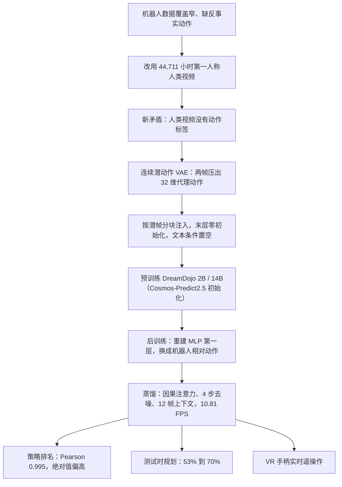

# DreamDojo：人类视频有物理、没有按键，他们先发明一套连续的潜动作

<!-- release-date: 2026-02-18 -->

> 本文依据 NVIDIA 的 **DreamDojo: A Generalist Robot World Model from Large-Scale Human Videos**，arXiv:2602.06949v1，2026-02-06 提交，封面日期 2026-2-9，共 33 页。页码均指 PDF 自身的页码。文中会区分三件事：**报告明确写了什么**、**我们怎么解释它**、**哪些是外部资料或本文从图上读出的数字**。

## 阅读前先认识几个词

- **世界模型（world model）**：给定当前画面和这一步要执行的动作，预测接下来的画面。报告把它写成一个状态转移函数 $s_{t+1} \sim p(\cdot \mid s_t, a_t)$，全文的「世界模型」都专指这一类（PDF p.3，式 1）。它能当仿真器用：不上真机，先在「梦」里看动作的后果。
- **动作标签**：两帧之间操作者实际发了什么指令。游戏里是按键，机器人里是关节角或末端位姿。互联网上的人类视频普遍没有这个东西。
- **潜动作（latent action）**：不从外部拿标签，而是从相邻两帧的画面变化里，用一个「信息瓶颈」压出一个最能解释这次变化的变量，当作动作的代理。
- **DiT（Diffusion Transformer，扩散 Transformer）**：用 Transformer 当去噪网络的扩散模型。DreamDojo 的底座 Cosmos-Predict2.5 就是这种结构，工作在视频压缩后的连续潜空间里（PDF p.3）。
- **流匹配（flow matching）**：一类生成模型的训练目标，学怎样把噪声一步步推成真实样本。
- **后训练（post-training）**：这里不是对齐人类偏好，而是在少量目标机器人数据上，把已经学到的世界动力学接到这台机器人的动作空间上。
- **蒸馏（distillation）**：把一个慢而准的教师模型，压成一个快的学生模型。这篇要的是能边看边出帧、实时交互的学生。

## 一句话先说清

DreamDojo 是一个面向灵巧操作的机器人世界模型，2B 和 14B 两个尺寸，从 NVIDIA 的视频世界基础模型 Cosmos-Predict2.5 初始化（PDF p.3、p.9）。它做了三件事：

1. 先在 **44,711 小时**第一人称人类视频上预训练，用自己学出来的**连续潜动作**充当所有视频的统一动作标签（PDF p.5–7）；
2. 再在一台目标机器人的小规模数据上后训练，把动作接口换成真实的关节动作（PDF p.7）；
3. 最后蒸馏成一个 4 步去噪的自回归学生，单张 H100 上 **10.81 FPS**、640×480 分辨率，能连续交互 1 分钟以上（PDF p.2、p.13）。

报告拿它做了三个应用：给真实策略排名的评测器（与真机成功率的 Pearson 相关 0.995）、测试时挑动作的规划器（成功率从 53% 提到 70%），以及 VR 手柄实时遥操作一台虚拟机器人（PDF p.13–14）。

如果只记一句话：

> **开放世界的机器人仿真，瓶颈不只在视频生成得像不像，更在动作条件从哪来、以什么形态接到哪一帧。人类视频解决覆盖面，连续潜动作解决没有标签。**

## 先讲矛盾：视频最多的地方，恰恰没有动作标签

视频世界模型这两年进步很快，但大多停在离散控制上：游戏按键、驾驶指令。机器人要的是高维、接触密集的连续动作，这一块没跟上（PDF p.2）。报告把卡点拆成三条（PDF p.2）：

- **覆盖面窄**。机器人硬件型号多、采集贵，真实世界的环境种类几乎无限，很容易超出手头机器人数据的分布。
- **全是专家示范**。现有数据集几乎都是「该怎么做」的示范，缺少意图上的随机性，模型很少见到「伸手但没碰到」这种反事实动作，于是对这类动作常常没反应。
- **结果**：现有视频世界模型只能复现训练时见过的场景布置，对没见过的动作不听话。

最直接的办法是把真机数据再采大几个数量级。报告认为这不是最划算的轴，因为每一条新轨迹都要人去遥操作（PDF p.4）。另一边，人每天都在用第一人称视角抓、倒、叠、装、失败再来，交互背后的物理在人和机器人之间大体共享（PDF p.2）。于是他们押注：

> 先从大规模第一人称人类视频里把交互物理学出来，再在少量目标机器人数据上把控制接口接到真关节上。

这个押注马上撞上第二个矛盾：**人类视频几乎没有细粒度动作标签**。没有 $a_t$，上面那个转移函数就训不成。把各数据集五花八门的动作格式统一成一种，要付出大量工程；只做被动的下一帧预测，又会漏掉「动作导致什么」的因果（PDF p.2、p.6）。DreamDojo 的核心设计就是为这个缺口准备的。

## 先看全景：三段训练，两种动作接口

上图引自原文图 1（PDF p.3）。三段训练（PDF p.3–4）：

1. **人类视频预训练**：In-lab、EgoDex、DreamDojo-HV 三个第一人称数据集，所有视频都以连续潜动作为条件；
2. **目标机器人后训练**：重置动作条件层，在目标机器人数据上微调，学新的动作空间；这批数据可以只来自有限的场景；
3. **蒸馏**：学会目标动作空间之后，再蒸馏出实时、上下文更一致的学生。

要先分清两种「动作」：预训练时世界模型看到的，是潜动作模型从相邻帧抽出的 32 维连续向量；后训练和实际使用时，它吃的是目标机器人真实的相对关节动作。潜动作只是预训练阶段的脚手架，不是给人按的按键。

这里的「世界模型」和库里 pi0.7 一篇说的不是一回事：pi0.7 的世界模型只根据一句子任务画一张近未来的目标图，给策略当提示；DreamDojo 是按每一步动作预测视频，可以代替真机做评测。和 Cosmos 一篇的关系更直接：DreamDojo 用的底座 Cosmos-Predict2.5 是 Cosmos 平台的后续版本（出处是另一份报告，arXiv:2511.00062，不是库里 Cosmos 那篇）。

## 数据：44,711 小时第一人称视频

现有机器人世界模型走不出分布，报告认为根因是训练数据的动词、物体、环境都太窄（PDF p.4）。人类数据来自三个来源（PDF p.4–5，表 1）：

| 来源 | 小时 | 轨迹 | 技能 | 场景 | 它补什么 |
|---|---:|---:|---:|---:|---|
| In-lab | 55 | 13.9k | 35 | 1 | 自家实验室桌面，采集者戴 Manus 手套和 Vive Ultimate Tracker，手部位姿可直接重定向成 GR-1 动作，用来验证核心设计 |
| EgoDex | 829 | 30k | 194 | 5 | 公开的灵巧操作集，Apple Vision Pro 录制，带高精度 3D 手与手指位姿，补物体种类 |
| DreamDojo-HV | 43,827 | 1,135k | 6,015 | 1,135k | 众包采集的内部数据集，家居、工业、零售、教育、行政等场景，每段配一句任务描述 |
| 合计 | 44,711 | 1,179k | ≥6,015 | ≥1,135k | 预训练用的混合数据 |

技能数由 GPT 根据每段视频的全局语言标注估计（PDF p.5）。表 1 里的「场景」数与轨迹数相同，更像每条轨迹算一个场景；正文另给了去重后的数：超过 9,869 个独特场景、6,015 个独特任务、43,237 个独特物体（PDF p.5）。

报告称，这份混合数据比此前世界模型训练用过的最大数据集时长多 15 倍、技能多 96 倍、场景多 2,000 倍（PDF p.2、p.5）。用表 1 可以对上两项：时长相对 AgiBot-World 的 2.9k 小时约 15 倍；场景相对 DROID 的 564 个约 2,000 倍。技能那一项，6,015 相对表中最多的 87（AgiBot-World）约 69 倍，96 倍用的是哪个分母报告没写。

DreamDojo-HV 的场景分布读自原文图 2a（PDF p.4）：

| 类别 | 小时 | 占比 |
|---|---:|---:|
| 家务 | 18,483 | 42.2% |
| 零售与消费品 | 6,161 | 14.1% |
| 汽车与交通 | 3,895 | 8.9% |
| 食品饮料 | 3,693 | 8.4% |
| 时尚配饰 | 2,360 | 5.4% |
| 一般维修 | 1,956 | 4.5% |
| 其余 11 类（行政、工厂、酒店、印刷、教育、运动等） | 各 131–1,217 | 合计约 16.6% |

图 2b 说明它不是抓放的堆砌：多数视频包含 5–20 个子任务，是要多次交互才做完的长程任务；技能频次上 pick 最多，其后是 move、fold、wipe、pull、place、cut 等（读自图 2b，PDF p.4）。

预训练并不按小时均匀采样：最终模型对 In-lab、EgoDex、DreamDojo-HV 的采样比是 1 : 2 : 10（PDF p.9）。DreamDojo-HV 原片报告写作内部数据集，没说会公开。

## 核心设计一：连续潜动作，给无标签视频发明一套动作

### 为什么不直接用视频，也不用手部估计

没有细动作标签时，最省事的是把人类视频当普通视频预测：只看过去的帧，猜未来的帧。报告做了这个对照，结论是它确实能搬一点物理，让没见过的物体看起来更合理；但世界模型必须学「动作的后果」，只看被动视频会把因果学浅，接到目标机器人上交互性不够（PDF p.6）。

另一条路是用 HaMeR 这类现成的手部估计器从像素里抠手部位姿。报告指出三个问题（PDF p.6）：管不了手以外的动作（手臂、行走）；严重遮挡和相机大幅移动时估不准；它抓的是人手的低层几何，本体差距一大就难迁到机器人上。

### 潜动作模型怎么学

上图引自原文图 3（PDF p.6）。潜动作这条线不是这篇的新词：报告点名了 Genie、AdaWorld 和 LAPA 等前作，并明确说受 AdaWorld 启发，选**连续**潜动作，理由是它跨本体泛化更好、适配更高效（PDF p.6–7）。

潜动作模型是一个 VAE，骨架是 Genie 的时空 Transformer（PDF p.7）：

- 编码器吃相邻两帧 $f^{t:t+1}$，抽出时空特征，把全局特征投影成一个低维向量 $\hat{a}_t$；
- 解码器只拿前一帧 $f^t$ 和这个向量，去预测后一帧 $f^{t+1}$；
- 向量很短，再加 KL 正则，两者一起构成信息瓶颈：想重建后一帧，模型就只能把两帧之间最关键的运动压进 $\hat{a}_t$。

训练目标是后一帧的重建似然减去 KL 项（PDF p.7，式 3）：

$$
\mathcal{L}^{\mathrm{pred}}_{\theta,\phi}(f^{t+1})
=
\mathbb{E}_{q_\phi(\hat{a}\mid f^{t:t+1})}
\log p_\theta(f^{t+1}\mid \hat{a}, f^t)
-
\beta\, D_{\mathrm{KL}}\bigl(q_\phi(\hat{a}\mid f^{t:t+1}) \,\|\, p(\hat{a})\bigr)
$$

$q_\phi$ 是编码器，$p_\theta$ 是解码器，$\beta$ 控制瓶颈有多紧。关键在不对称：**编码器能看见未来，解码器不能**，所以解码器缺的那部分信息只能从 $\hat{a}$ 里来。

规格（PDF p.9）：

| 项 | 取值 |
|---|---|
| 参数量 | 700M |
| 潜动作维度 | 32 |
| 结构 | 编码器 24 块 + 解码器 24 块 |
| 训练 | 从零训 400k 步，总 batch 256；AdamW，weight decay 0.01，恒定学习率 $2.5\times10^{-5}$ |
| 数据 | 三个人类数据集，加内部机器人数据（Unitree G1、Fourier GR-1、AgiBot、YAM） |
| 预处理 | 按 1、2、3、4 倍随机时间降采样以覆盖不同速度；中心裁剪并缩放到 320×240 |
| $\beta$ | $10^{-6}$，在表征容量和后训练可迁移性之间折中 |

图 3 右边的检索是报告给的「学到了什么」的证据：在不同数据集里找潜动作最相近的帧对，人和机器人背景天差地别，做的却是同类动作（PDF p.6）。这是定性展示，报告没有给跨本体对齐的量化指标。潜动作模型同时见过人类和机器人视频，也没有单独消融「要不要看机器人数据」。

与 Genie 的对照（外部补充，细节见库里 Genie 一篇）：Genie 把潜动作量化进一本很小的离散码本，推理时这些码就是给人按的按键；DreamDojo 不做量化，输出连续向量，而且只在预训练里当伪标签，后训练就把它换掉。共享的是信息瓶颈这个想法，不共享码本，也不共享「推理时按潜动作」这条接口。

### 潜动作怎么接进世界模型，又怎么换成机器人动作

上图依据 3.3.1–3.3.3 节（PDF p.5–7）和训练设置（PDF p.9）重画，是机制示意。

**预训练**（PDF p.7）：从相邻帧抽出潜动作，按潜帧切块，经一个轻量 MLP 投到和时间步嵌入相同的维度，两者相加后送进每个 DiT 块的自适应 LayerNorm，调制 scale、shift、gate。这正是 Cosmos-Predict2.5 原本注入时间步的那条通路（PDF p.3）。MLP 的最后一层零初始化，训练开始时不扰动已经预训练好的底座；报告说经验上这样物理更好（PDF p.7）。文本条件在预训练里固定为空 prompt（PDF p.9），可控性全靠这条动作通路。

**后训练**（PDF p.7、p.9）：把目标机器人的真值动作展平成序列送进同一个 MLP；**第一层重新初始化**，以适配新的动作维度，其余权重全部一起微调。视频按约 10 Hz 采样，每段 13 帧，首帧是条件帧，后面是 12 步相对动作；默认用 128 张 H100 训 50k 步，batch 512。

报告的说法是：因为预训练够强，目标机器人数据可以只在有限场景、小规模地采，微调后仍能对未见物体零样本泛化；潜动作空间是连续的，也让后训练适配得更好（PDF p.7）。「零样本」在这里是相对后训练用的那批机器人场景说的，不是没见过目标机器人。

### 收益：潜动作逼近「戴着动捕设备」的理想情况

表 2 是这一设计的直接证据。所有方法先在对应人类数据上预训练 50k 步，再在分布内的 GR-1 数据上后训练 25k 步，评测集含 GR-1 训练数据里没有的新物体和新动作（PDF p.10–11）：

| 预训练方式 | In-lab：PSNR↑ / SSIM↑ / LPIPS↓ | EgoDex：PSNR↑ / SSIM↑ / LPIPS↓ |
|---|---|---|
| 不预训练 | 20.576 / 0.774 / 0.222 | 19.952 / 0.787 / 0.219 |
| 只预测视频（action-free） | 20.797 / 0.773 / 0.222 | 19.924 / 0.783 / 0.222 |
| 潜动作 | 20.913 / 0.776 / 0.219 | 20.344 / 0.790 / 0.214 |
| 真值动作（理想，需额外设备） | 20.960 / 0.773 / 0.219 | 20.474 / 0.795 / 0.211 |

最后一行在 In-lab 上是手套采到、重定向成 GR-1 的动作，在 EgoDex 上是 Vision Pro 位姿转成的 MANO 手部参数（PDF p.11）。三点读法：

- 只预测视频的收益很小，在 EgoDex 上甚至略差于不预训练。报告的原话是「边际收益」（PDF p.11）。
- 潜动作把和理想设定的差距缩到很小，而它是唯一能扩展到没有动捕设备的众包视频上的一条路。
- 自动指标的绝对差都在零点几 dB，看表容易觉得差别不大。后训练过程中的曲线更能说明问题：

上图引自原文附录图 13（PDF p.24）。潜动作预训练在后训练一开始就处在高位，而且在 EgoDex 上与另两条的差距到 25k 步仍没被追平；只预测视频和不预训练在 EgoDex 上几乎重合（读自图 13）。报告的结论是潜动作能达到更高的上限（PDF p.20）。

## 核心设计二：相对动作加分块注入，让高维连续控制不打架

潜动作解决的是「人类视频没标签」。机器人自己的动作条件还有两个更朴素的问题（PDF p.5–6）：

1. **绝对关节位姿难以比较**。同一个「拿杯子」，起始关节角可以差很远，模型要在很宽的空间里拟合。改法是把每个潜帧（每 4 个时间步）开头的位姿当原点，后面的动作都相对它来写。相对量集中在一个更窄、跨轨迹共享的空间里，组合起来也更容易泛化。
2. **整段动作当全局条件会混淆因果**。交互严格遵守因果，看到未来的动作帮不了当前这一步，只会加噪声。改法是按 tokenizer 的时间压缩比把动作切块：WAN2.2 tokenizer 时间上压 4 倍，一个视频潜帧对应 4 个像素帧，就把对应的 4 步动作拼成一块，只送给这一个潜帧。

表 5 在**不做人类视频预训练**、只用 GR-1 数据微调 Cosmos-Predict2.5 30k 步的设定下，把两项改动和下一节的时间一致性损失逐项加上（PDF p.12）：

| 改动 | GR-1 验证集：PSNR↑ / SSIM↑ / LPIPS↓ | 反事实集：PSNR↑ / SSIM↑ / LPIPS↓ |
|---|---|---|
| 原始架构 | 16.199 / 0.557 / 0.315 | 19.448 / 0.768 / 0.211 |
| + 相对动作 | 16.522 / 0.576 / 0.304 | 19.482 / 0.772 / 0.212 |
| + 分块注入 | 17.626 / 0.620 / 0.267 | 20.783 / 0.790 / 0.193 |
| + 时间一致性损失 | 17.630 / 0.622 / 0.266 | 20.980 / 0.796 / 0.189 |

最大的一跳是分块注入，两个评测集的 PSNR 都涨了一个多 dB。相对动作在专家示范上有用，在反事实集上几乎没变，LPIPS 还略差一点；报告的措辞是两者都「显著」改善（PDF p.12），表上看分块才是主力。附录图 9 有这几档的定性对比（PDF p.19）。

可迁移的一句：**条件信号在时间上对齐，往往比把条件做得更花哨更重要。** 能按因果切块，就不要全局广播。

## 核心设计三：时间一致性损失，监督帧与帧怎么变

Cosmos-Predict2.5 的流匹配损失对每一帧单独算（PDF p.3，式 2）：

$$
\mathcal{L}_{\mathrm{flow}}(\theta)
=
\mathbb{E}_{\mathbf{x},\epsilon,\mathbf{c},t}
\bigl\|\mathbf{u}(\mathbf{x}_t, t, \mathbf{c}; \theta) - \mathbf{v}_t\bigr\|^2
$$

$\mathbf{x}_t$ 是加了噪声的视频潜变量，$\mathbf{v}_t = \epsilon - \mathbf{x}$ 是真值速度（噪声减干净样本），$\mathbf{c}$ 是条件，$\mathbf{u}$ 是去噪网络。它逐帧监督「像不像」，对「这一帧到下一帧该怎么变」没有直接信号，而物体动力学和动作跟随恰恰体现在这个差分里（PDF p.7）。

记预测速度为 $\mathbf{z}_t = \mathbf{u}(\mathbf{x}_t, t, \mathbf{c}; \theta)$，第 $i$ 个潜帧上的分量为 $z^i$、$v^i$。新加的一项要求相邻潜帧的预测速度差去贴真值速度差（PDF p.7，式 4–5）：

$$
\mathcal{L}_{\mathrm{temporal}}(\theta)
=
\mathbb{E}\Bigl[\sum_{i=1}^{K-1}
\bigl\|(z^{i+1}-z^{i}) - (v^{i+1}-v^{i})\bigr\|^2\Bigr],
\qquad
\mathcal{L}_{\mathrm{final}} = \mathcal{L}_{\mathrm{flow}} + \lambda\,\mathcal{L}_{\mathrm{temporal}}
$$

$K$ 是视频潜帧的个数，实验取 $\lambda = 0.1$。报告说这一项不仅让动作可控学得更快，还让物体更完整、伪影更少（PDF p.7）。表 5 最后一行，它在 GR-1 验证集上几乎不动，在反事实集上 PSNR 再涨约 0.2。它是补丁，不是主引擎。

## 预训练规模

两个尺寸的世界模型都从 Cosmos-Predict2.5 初始化，在 256 张 H100 上预训练 140k 步，有效 batch 1024；AdamW，weight decay 0.1，学习率 $1.6\times10^{-4}$，全程维护 EMA 权重，所有结果都用 EMA 生成；帧中心裁剪到 640×480，切成 13 帧的片段（PDF p.9）。报告没有把这些折成总 GPU 小时。

## 蒸馏：从 2.72 FPS 的教师到 10.81 FPS 的学生

### 为什么要蒸馏

实时遥操作和在线规划要求世界模型边看边出帧。双向注意力的视频扩散模型有两个结构障碍（PDF p.8）：双向注意力预设了固定时长，不能一直往下滚；去噪步数多（报告举的典型值是 50），速度上不去。实际推理时教师用 35 步去噪，并关掉了 classifier-free guidance，经验上它收益有限（PDF p.10）。

### 怎么蒸

沿 Self Forcing 的两阶段做法（PDF p.8）。学生沿用教师的结构和权重，只把双向注意力换成因果注意力，把去噪步数缩到很少（如 4 步）。

**第一阶段 warmup**：学生用 teacher forcing，上下文是教师生成的潜变量，回归教师 ODE 轨迹解出的干净样本 $x_0$（PDF p.8，式 6）：

$$
\mathcal{L}_{\mathrm{warmup}} = \mathbb{E}_{x,t}\bigl\|G_{\mathrm{student}}(x_t, t) - x_0\bigr\|^2
$$

**第二阶段 distillation**：学生改吃**自己先前生成的**潜变量，让训练分布和推理时一致，减少误差累积。监督是把学生分布推向教师的分布匹配损失 $D_{\mathrm{KL}}(p_{\mathrm{teacher}} \| p_{\mathrm{student}})$。这个 KL 本身算不出来，但梯度可以用一对分数模型来估（PDF p.8，式 7–8）：

$$
\nabla \mathcal{L}_{\mathrm{distill}}
=
-\mathbb{E}_{z,t}\Bigl[\bigl(s_{\mathrm{real}}(x_t,t) - s_{\mathrm{fake}}(x_t,t)\bigr)\frac{dG_{\mathrm{student}}}{d\theta}\Bigr]
$$

$z$ 是初始噪声，$x_t$ 由学生从 $z$ 生成后再加噪得到；$s_{\mathrm{real}}$ 由教师估计，$s_{\mathrm{fake}}$ 由一个在学生输出上训练的模型估计。直觉是：真分数和假分数之差，指出学生该往哪边改。

即便训练与推理对齐了，长程仍会漂。报告的补丁是让学生训练时生成 $N' > N$ 帧（$N$ 是教师的视野），再随机选一个长度 $N$ 的窗口回传损失，相当于提前演练更长的自回归（PDF p.8）。

具体设置（PDF p.10）：学生是 12 帧的因果滑动窗口；warmup 生成 10k 条 ODE 轨迹、训 10k 步；蒸馏阶段学生随机生成 13–49 帧，只在最后 13 帧上算损失，训 3k 步；全部在 64 张 H100 上完成，warmup batch 256，蒸馏 batch 64。

蒸馏的对象是**在 GR-1 上后训练过的 DreamDojo-2B**（PDF p.12）。所以 10.81 FPS 只属于这个 2B 学生，14B 没有实时版本的数字。

### 收益：快了近 4 倍，而且看得见历史

表 6 在 GR-1 Long Eval 上连续生成 600 帧，即 1 分钟的多阶段长任务（PDF p.12–13）：

| | PSNR↑ | SSIM↑ | LPIPS↓ | FPS↑ | 每次预测帧数 | 上下文帧数 |
|---|---:|---:|---:|---:|---:|---:|
| 教师 | 14.086 | 0.442 | 0.412 | 2.72 | 12 | 1 |
| 学生 | 13.146 | 0.379 | 0.485 | 10.81 | 4 | 12 |

单张 H100 上快了近 4 倍，画质有下降，报告称为轻微（PDF p.12–13）。更有结构意义的是后两列：学生每次只出 4 帧，交互粒度更细；教师只以一张初始帧为条件，学生能看 12 帧历史。报告说这让学生对遮挡和相机晃动更稳，被挡住的物体能从上下文里「找回来」，教师做不到（PDF p.12，附录图 11 在 p.22）。

表 7 回答另一个问题：蒸馏会不会把人类视频预训练带来的泛化蒸没（PDF p.13）？

| 教师 | In-lab PSNR | EgoDex PSNR | DreamDojo-HV PSNR | 反事实 PSNR / SSIM / LPIPS |
|---|---:|---:|---:|---|
| 无人类视频预训练（Cosmos-Predict2.5） | 20.304 | 19.119 | 17.869 | 19.782 / 0.758 / 0.232 |
| 有人类视频预训练 | 20.733 | 19.313 | 18.195 | 19.891 / 0.746 / 0.234 |

四个评测集上 PSNR 全部更高，前三个的 SSIM 和 LPIPS 也更好；报告说「全面显著更好」（PDF p.13），但反事实集上 SSIM 和 LPIPS 其实略差。所以更准确的说法是：预训练的泛化收益大体传给了学生，反事实动作那一项证据较弱。

## 实验：评测集怎么搭，预训练带来多少

### 评测集故意对机器人数据是分布外

六个评测集都用 Fourier GR-1 人形机器人采集，尽量复刻人类视频里出现过的物体和交互，但这些物体和动作不在默认的机器人训练集里（PDF p.10，图 4 在 p.9）：

| 评测集 | 测什么 |
|---|---|
| In-lab Eval / EgoDex Eval / DreamDojo-HV Eval | 分别复刻三个人类数据集里的新物体、新交互 |
| Counterfactual Eval | 机器人数据集里没有的反事实动作，如拍玩具、伸手却没碰到物体 |
| EgoDex-novel / DreamDojo-HV-novel | 用 Gemini 2.5 Flash Image 改换前两者的背景，各 25 条，测环境变化 |

自动指标用 PSNR、SSIM、LPIPS。为了拉开差距，未蒸馏模型把最后一帧预测当成下一轮的条件帧，自回归生成三轮，得到 100 段、多数为 49 帧的视频（PDF p.10）。两个改背景的集合没有真值视频，改成人评：12 名志愿者在网页上对比两段生成视频和真值，按物理正确性（物体恒存、形状一致、接触因果）和动作跟随（重点看机器人姿态，允许平局）二选一，视频左右顺序随机打乱（PDF p.10，网页界面见附录图 7，p.17）。

### 人类数据越多样，分布外表现越好

表 3 的数据消融把采样比改成各数据集均匀，仍是预训练 50k 步、后训练 25k 步（PDF p.11）：

| 预训练 | In-lab：PSNR / SSIM / LPIPS | EgoDex | DreamDojo-HV | 反事实 |
|---|---|---|---|---|
| 不预训练（Cosmos-Predict2.5） | 20.576 / 0.774 / 0.222 | 19.952 / 0.787 / 0.219 | 18.274 / 0.754 / 0.236 | 20.472 / 0.802 / 0.190 |
| In-lab | 20.913 / 0.776 / 0.219 | 20.267 / 0.785 / 0.218 | 18.621 / 0.754 / 0.233 | 20.755 / 0.796 / 0.187 |
| + EgoDex | 20.972 / 0.778 / 0.216 | 20.334 / 0.791 / 0.215 | 18.706 / 0.762 / 0.230 | 20.797 / 0.796 / 0.188 |
| + DreamDojo-HV | 21.016 / 0.781 / 0.215 | 20.414 / 0.790 / 0.216 | 18.724 / 0.759 / 0.232 | 20.852 / 0.799 / 0.188 |
| DreamDojo-2B（最终配方） | 21.114 / 0.774 / 0.222 | 20.411 / 0.775 / 0.226 | 18.813 / 0.747 / 0.238 | 20.907 / 0.787 / 0.192 |
| DreamDojo-14B（最终配方） | 21.413 / 0.788 / 0.208 | 20.525 / 0.787 / 0.213 | 18.924 / 0.751 / 0.228 | 21.087 / 0.793 / 0.185 |

读表要知道三件事：

- **PSNR 随数据变多单调上升**，四个评测集都是，包括反事实动作。这支撑报告的主张：数据更多样，不仅物理更好，对分布外动作的可控性也更好（PDF p.11）。
- **SSIM 和 LPIPS 不单调**。加入 DreamDojo-HV 后，EgoDex 和 HV 两列的 SSIM 反而比「+EgoDex」略低；反事实列的 SSIM 所有预训练变体都低于不预训练。
- **最终的两行不是同一组对照**：它们用 140k 步和 1 : 2 : 10 的采样比，不能和上面几行逐格比。2B 的 PSNR 在四列中的三列更高，SSIM 和 LPIPS 却多数比消融行差；14B 的 PSNR 四列都最好，SSIM 只在 In-lab 一列最好。

附录图 8 的定性对比更直观：没有人类视频预训练时，纸张、纸箱、植物、洗碗机门这些机器人数据没覆盖的物体会糊、会穿模（PDF p.18）。

### 人评：14B 赢在容量

像素指标对「杯子还在不在、有没有穿模」不敏感，而这正是人评盯的东西。表 4 在 EgoDex-novel 和 DreamDojo-HV-novel 共 50 条上，三个模型都后训练 30k 步（PDF p.12）：

| | DreamDojo-2B 胜 Cosmos-Predict2.5 | DreamDojo-14B 胜 Cosmos-Predict2.5 | DreamDojo-14B 胜 2B |
|---|---:|---:|---:|
| 物理正确 | 62.50% | 73.50% | 72.50% |
| 动作跟随 | 63.45% | 72.55% | 65.53% |

这里的 Cosmos-Predict2.5 是没有人类视频预训练、只做同样后训练的底座。2B 已经稳定赢它，14B 再赢 2B，报告归因于更大的容量（PDF p.12）。这是全文最接近「开放世界、接触丰富」的证据。

## 应用：排名器、规划器和实时遥操作

### 策略评测：能不能给真机策略排名

任务是 AgiBot 装水果。他们训了一个单视角、不用本体状态的 GR00T N1.5 变体，把训练过程中的几个 checkpoint 部署到真机；同时把 DreamDojo-2B 在同一份 AgiBot 数据上后训练。20 个场景，梨、芒果、香蕉、杨桃的组合和摆放各不相同，5 个水果都装进袋子算 100%。每个场景真机跑约 80 秒，再用同一张初始帧让 DreamDojo-2B 模拟整段，由人按同一标准打分（PDF p.13）。

| checkpoint | A | B | E | D | C | F |
|---|---:|---:|---:|---:|---:|---:|
| DreamDojo 里的成功率 | 0.06 | 0.37 | 0.56 | 0.59 | 0.72 | 0.81 |
| 真机成功率 | 0.00 | 0.19 | 0.29 | 0.28 | 0.40 | 0.44 |

数字读自原文图 5a（PDF p.14）。报告给出 Pearson $r = 0.995$、MMRV（Mean Maximum Rank Violation，衡量排序违背程度）$= 0.003$（PDF p.13–14）。

读表能看到两件事：排序几乎完全一致，只有 D 和 E 两个真机只差约一个百分点的点在模拟里颠倒了，这正是 MMRV 不为零的来源；但绝对值**普遍高出真机近一倍**。报告在限制一节也承认，DreamDojo 里的绝对成功率常常高于真机，说明它不太会生成细腻的失败（PDF p.15）。所以它是好用的排名器，不是校准过的成功率预测器。

### 基于模型的规划：先看几种未来再动手

同样是 AgiBot 装水果，10 个场景。把训练中的 5 个 checkpoint 集成起来出动作提案，批量送进蒸馏后的 DreamDojo-2B 预测未来视频，再由一个外部价值模型挑最好的一条交给真机执行（PDF p.13–14）。

价值模型在附录 D.6（PDF p.20）：冻结的 DINOv2 逐帧提特征，上面一个全局注意力模块，输入 4 帧短视频，预测离下一个子任务边界还有多少步（子任务边界取相邻两段语言标注之间的关键帧，按数据集中最长的子任务间隔归一化）。对生成视频按步长 1 滑窗估值，取从开头到估值开始回升之前的平均；**值最低**、也就是离完成当前子任务最近的提案被选中。附录图 14 展示了它在两条示例上的估计（PDF p.24）。

| 策略组（读自图 5b，成功率 %） | A | B | C | D | E | 均匀采样 | 用 DreamDojo 挑 |
|---|---:|---:|---:|---:|---:|---:|---:|
| 方差较大的一组 | 5 | 16 | 35 | 47 | 53 | 37 | 70 |
| 基本收敛的一组 | 35 | 39 | 41 | 48 | 63 | 55 | 68 |

数字标注在原文图 5b 的柱上（PDF p.14）。第一组比最好的单个 checkpoint 高 17 个百分点，比均匀采样接近 2 倍，和正文一致（PDF p.14）。第二组正文也说「接近 2 倍」，但对均匀采样只是 55% 到 68%，对最好的单点只高 5 个百分点；近 2 倍只在对最弱的 A 时成立。报告据此认为，提案的方差越大，规划的收益越大（PDF p.14）。代价是世界模型带来的额外延迟，报告没给具体数字。

### 实时遥操作

DreamDojo-2B 部署在一台带 RTX 5090 的本地台式机上，用 PICO VR 手柄采集上半身动作，作为 G1 的动作条件，可以实时遥操作一台虚拟机器人（PDF p.14，图 6）。报告没给 5090 上的帧率。这也说明了为什么一定要蒸馏：2.72 FPS 的教师做闭环遥操作会明显迟钝。

## 报告承认的限制，和报告没说的事

### 报告自己承认的（PDF p.15）

- 不常见的动作仍然模拟不好，点名了拍打和快速挥手；
- 策略评测里绝对成功率偏高，细腻的失败生成不出来；建议将来用策略自己的 rollout 覆盖更广的动作分布；
- 推理速度还有很大的工程优化空间（这里引用的后续工作之一是 DreamZero，见 DreamZero 一篇，本文不讨论它的结果）；
- 不天然支持多视角，而当前最强的策略很依赖多视角；
- 后训练时如何尽量保住预训练知识，没有深入研究。

### 报告没有公开或没有回答的

- DreamDojo-HV 原片的公开计划、采集与标注流程、质量控制；
- 预训练与后训练的总 GPU 小时；
- 14B 的蒸馏版本与实时帧率，以及 RTX 5090 上的帧率；
- 潜动作维度 32 与 $\beta$ 的扫描实验、潜动作模型要不要看机器人数据的消融；
- 跨本体对齐的量化指标，图 3 的检索只是定性展示；
- 规划带来的额外延迟有多大；
- 人评的评分细则与一致性，只知道 12 名志愿者、允许平局。

## 最值得带回自己项目的六条

### 1. 标签跟不上数据规模时，先占住条件槽，再换槽里的东西

潜动作的作用，是让世界模型在无标签视频上先学会「看着动作预测」；后训练只换掉 MLP 第一层，把槽里的内容换成真实动作。条件通路本身留下来。这套接法在任何「无标签大数据 + 有标签小数据」的场景都能用。

### 2. 代理条件的形态要跟下游一致

游戏按键是离散的，用码本就行；机器人关节是连续的，DreamDojo 就用连续向量。选代理之前，先问下游真正的控制信号是什么形态。

### 3. 条件按因果切块，别全局广播

表 5 里分块注入的增益比相对动作和时间损失加起来还大。条件信号在时间上对齐，常常比条件本身更花哨更重要。

### 4. 插进预训练模型的新条件，末层零初始化

零初始化让新通路在训练起点什么都不改，底座不被打乱；后训练需要换输入维度时，只重建第一层。小项目往预训练模型里加控制信号，也可以照这个接。

### 5. 蒸馏换来的不只是速度，还有上下文

学生从「只看 1 帧」变成「看 12 帧」，遮挡恢复是结构上的红利，不是画质上的红利。选蒸馏方案时，把「学生能看多少历史」也列进指标。

### 6. 世界模型当评测器，先问能不能排序，再问绝对值准不准

Pearson 0.995 和「绝对成功率高出近一倍」可以同时成立。拿它挑 checkpoint 很合适，拿它估上线成功率就不行。

不能照搬的也要说清：44k 小时众包视频、256 张 H100 的预训练、128 张的后训练，都依赖 NVIDIA 的规模；桌面单卡能跑的只有已经蒸好的 2B 学生。

## 用一张图重新串起全文

## 关键词回看

- **DreamDojo-HV**：43,827 小时众包第一人称视频，与 In-lab、EgoDex 合成 44,711 小时的预训练数据。
- **连续潜动作**：潜动作 VAE 从相邻两帧压出的 32 维向量，当作所有无标签视频的统一代理动作，只在预训练中使用。
- **信息瓶颈**：编码器看得见后一帧、解码器看不见，逼潜动作只装两帧间最关键的运动。
- **相对动作**：以每个潜帧起点的位姿为原点重写动作，缩小建模空间。
- **分块注入**：每 4 步动作拼一块，只送给对应的那个视频潜帧，避免未来动作混淆因果。
- **自适应 LayerNorm 注入**：动作嵌入与时间步嵌入相加，调制每个 DiT 块的 scale、shift、gate。
- **时间一致性损失**：让相邻潜帧的预测速度差贴近真值速度差，权重 0.1。
- **Self Forcing 蒸馏**：warmup 回归教师 ODE 解，再让学生吃自己的输出做分布匹配，得到 4 步、因果、12 帧上下文的学生。
- **MMRV**：衡量模拟排名与真机排名违背程度的指标，越低越好。

## 最后的判断

DreamDojo 最值得记住的，是它把「人类视频没有动作」这个老问题拆成了两步：先用信息瓶颈给视频发明一套连续的代理动作，让世界模型学会按动作预测；再在少量机器人数据上把代理换成真动作。人类视频负责覆盖面，机器人数据只负责接口。

证据强度是分层的：

- **有受控对照的**：潜动作优于只预测视频并逼近真值动作（表 2、图 13）、分块注入是架构改动里的主力（表 5）、人类数据越多样分布外 PSNR 越高（表 3）、人评上预训练和更大容量都有用（表 4）；
- **有结果但要打折读的**：蒸馏后泛化保留（表 7，反事实一列的 SSIM 与 LPIPS 反而略差）、规划收益（第二组的「近 2 倍」只对最弱的 checkpoint 成立）、策略评测（排序准，绝对值偏高）；
- **只有定性展示的**：潜动作跨本体对齐（图 3）、学生从遮挡中找回物体（图 11）；
- **没有公开的**：HV 原片、算力总账、潜动作的超参扫描。

如果只带走一句：

> **没有动作标签的数据也能教会世界模型「动作会导致什么」，前提是先给它一个信息瓶颈，让动作的位置被一个代理变量占住。**

## 资料与阅读边界

**原始依据**

- 本地 `papers/NVIDIA/DreamDojo.pdf`，即 [arXiv:2602.06949](https://arxiv.org/abs/2602.06949) v1，33 页。arXiv 页面至今只有 v1，本地件就是最新版。项目页：<https://dreamdojo-world.github.io/>。

**首发日证据**

- 官方代码仓库 [NVIDIA/DreamDojo](https://github.com/NVIDIA/DreamDojo) 的 README 更新日志写明「[2026/02/18] We released all pretrained and post-trained checkpoints (2B and 14B)」，同日发布训练代码与 GR-1 后训练数据、评测集；论文另记为「[2026/02/09]」。`release-date` 取模型权重首次官方开放的 **2026-02-18**，不取论文公开日。Hugging Face 权重仓库 [nvidia/DreamDojo](https://huggingface.co/nvidia/DreamDojo) 的文件在 2026-02-14 已有上传，属发布前的预置，不据此前移。

**外部补充（不是报告内容）**

- Genie 的离散码本做法见库里 Genie 一篇；连续潜动作的直接前作是 AdaWorld（Gao 等，ICML 2025），蒸馏范式来自 Self Forcing（Huang 等，NeurIPS 2025），底座报告是 World Simulation with Video Foundation Models for Physical AI（arXiv:2511.00062），均取自本报告参考文献。
- 图 2a 的类别小时数、图 2b 的分布、图 5 与图 13 的数值，是本文从原文图中读出的，报告正文没有写出这些值。
- 代码与权重是论文之后的发布，实现细节以仓库为准；不能从「开源了代码和权重」推出 DreamDojo-HV 原片也已公开。
