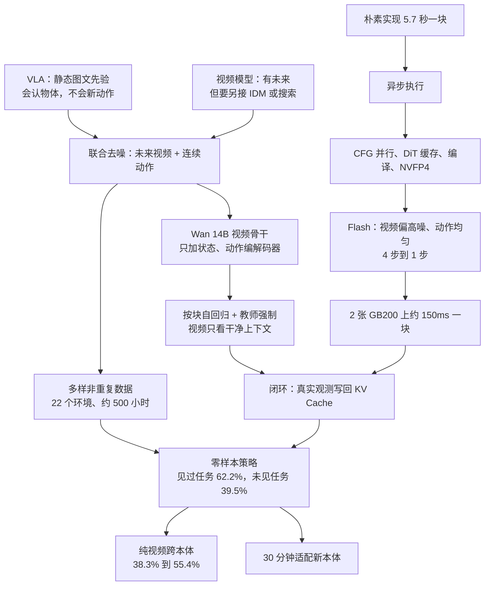

# DreamZero：VLA 会认物体却不会新动作，于是让策略同时梦见画面和电机

<!-- release-date: 2026-02-04 -->

> 本文依据 NVIDIA 的 **World Action Models are Zero-shot Policies**，arXiv:2602.15922v1，2026-02-17 提交，封面日期 2026-2-19，共 36 页。页码均指 PDF 自身的页码。文中会区分三件事：**报告明确写了什么**、**我们怎么解释它**、**哪些是外部资料或本文从图上读出的数字**。

## 读前先把几个词说成人话

这篇报告的新词不多，难的是它把两条原本分开的路线接到了一起：机器人策略和视频生成。先把会反复出现的词说清楚。

- **VLA（Vision-Language-Action model，视觉—语言—动作模型）**：从一个在互联网图文上预训练过的视觉—语言模型出发，看画面、读指令、直接输出电机动作。本文的对照基线 GR00T N1.6 与 π0.5 都是这一类（PDF p.10）。
- **世界模型（world model）**：给定过去的画面（以及这一步的动作），预测世界接下来长什么样。
- **WAM（World Action Model，世界动作模型）**：报告给「借世界建模能力来预测动作」的模型起的类名。DreamZero 是其中**同时生成未来视频和动作**的那一种（PDF p.2、p.5）。
- **逆动力学模型（Inverse Dynamics Model，IDM）**：看见「这一刻到下一刻世界怎么变了」，反推当时应该发什么动作。
- **流匹配（flow matching）**：扩散模型的一种训练方式。不一次给出干净样本，而是学一个「速度场」，把纯噪声一步步推成数据。去噪进度用时间步 $t\in[0,1]$ 表示，本文约定 $t=0$ 是纯噪声、$t=1$ 是干净数据（PDF p.7）。
- **动作块（action chunk）**：一次预测一小段未来动作，而不是一步一个。DreamZero 在 AgiBot 上一块是 48 步动作，按 30Hz 执行，覆盖 1.6 秒（PDF p.8、p.21）。
- **KV Cache（键值缓存）**：自回归生成时把已经算过的历史中间结果留在显存里，下一步不必从头重算。
- **本体（embodiment）**：机器人的身体。换一种手臂或夹爪，动作空间和外观都变了。
- **任务进度（task progress）**：按完成了多少阶段打 0 到 1 的分，比只有 0/1 的成功率更细。叠衣服看 5 个阶段完成几个，装水果看 10 个装进几个（PDF p.13）。

## 一句话先说清

2026 年初，VLA 已经能听懂「把可乐罐移到泰勒·斯威夫特那边」：它在视觉—语言预训练里认识这个人，再接上机器人数据里学过的「移动」技能。但换成「解开鞋带」，只要机器人数据里没有这个动作，它就做不了（PDF p.2）。报告把缺口概括成一句：VLA 从图文里继承的是「做什么」，缺的是「怎么做」——和几何、动力学、电机控制对齐的空间感（PDF p.2）。

DreamZero 的回答是：**别从静态图文出发，从一个已经会预测世界怎么动的视频模型出发；在同一次去噪里，既生成未来几帧画面，也生成与这些画面对齐的连续动作。** 视频负责「梦见」世界怎么演化，动作负责把梦翻译成电机指令，测试时不再另接规划器或搜索（PDF p.2、p.20）。

它是一个建在 Wan2.1-I2V-14B-480P 图像到视频扩散模型上的 14B WAM（PDF p.2、p.11）。报告的主结果，数字都带着设定：

- **见过的任务、没见过的环境与物体**（AgiBot G1 双臂移动机器人，10 个任务）：平均任务进度 **62.2%**，最强的预训练 VLA 是 27.4%（PDF p.13）；
- **没见过的任务**（10 个训练里完全没有的动作，如解鞋带、熨衣服、握手）：**39.5%** 对 16.3%（PDF p.14）；
- **实时闭环**：朴素实现一块动作要 5.7 秒，经过系统、实现与模型三层优化，在 **2 张 GB200** 上约 150ms 一块，即每秒约 7 块（PDF p.8–10、p.18）；
- **跨本体**：别的机器人或人类的**纯视频**（没有动作标签），10–20 分钟就把未见任务进度从 38.3% 提到 55.4% / 54.3%；再用约 **30 分钟**玩耍数据适配一台全新的机器人（PDF p.16）。

这篇值得带走的一句话：

> **动作克隆把「世界接下来会怎样」藏在观测到动作的平均里，所以只能靠重复演示把它逼出来；把未来画面写进输出，同一批杂乱数据就从噪声变成了教材。**

### 一条阅读路线

1. **p.2、p.4–5**：VLA 为什么泛化不到新动作，视频模型为什么还不是策略。
2. **p.6 图 4、式 1**：联合预测怎么拆成「视频预测 × 逆动力学」，又为什么不拆开训。
3. **p.7 式 2–3、p.20–21 图 13–14**：按块自回归、教师强制，以及推理时用真实观测换掉梦。
4. **p.8–10 与表 1**：5.7 秒怎么一路压到 150ms，DreamZero-Flash 为什么要把两种模态的噪声拆开。
5. **p.10–11 图 6**：「多样优先于重复」的数据是怎么采出来的。
6. **p.13–17 图 8–10、表 2–4**：六个研究问题与消融。
7. **p.18–19、p.28–29 图 16**：作者自己写的限制，以及失败长什么样。

## 主要矛盾：VLA 知道做什么，不知道怎么做

### VLA 的泛化停在语义层

VLA 的骨干是在**静态**图文上预训练的，继承不到时间和空间上的先验（PDF p.4）。于是它擅长的是换物体、换说法；换一个新环境、新动作就难了。

报告点了现有 VLA 补这两个缺口的办法（PDF p.5）：

- **环境泛化**靠在几百个真实环境里为特定任务采遥操作数据；
- **任务泛化**靠堆一大库语言条件的运动原语。

第二条有个根本限制：可能的物理交互组合太多了，没法用一张固定的回合级任务表穷尽。相比之下，基于视频的世界模型从数据里**每一对相邻帧**都能学到东西，还能借大规模视频预训练理解物理（PDF p.5）。

### 视频模型有未来，却没有手

另一条线早就在用视频生成帮机器人：先生成一段「机器人该怎么做」的视频，测试时再用逆动力学模型、光流或轨迹预测把动作抠出来（PDF p.5）。视频把「世界会怎么动」说清楚了，但策略被拆成两段，对齐要另做。

潜空间世界模型（Dreamer、V-JEPA 2）与三维点云世界模型（PointWorld）是第三类。它们建模的是前向动力学 $p(s_{t+1}\mid s_t,a_t)$：给定状态和动作预测下一个状态。要得到一条动作轨迹，测试时还得做目标条件规划或 MPPI 这类采样搜索（PDF p.20）。

### 矛盾于是变成

> VLA 的动作是端到端的、快的，但学不到世界怎么变；视频模型学到了世界怎么变，但吐不出动作，或者要靠测试时的搜索才吐得出。能不能让一个网络同时拥有两边的长处：像 VLA 一样端到端出动作，又像视频模型一样被「未来画面」这个稠密信号监督。

报告把这叫做「兼得两种范式：端到端 VLA 的顺畅梯度，加上为规划服务的稠密世界建模监督」（PDF p.5）。

### 把视频模型改成 WAM，要过三关

报告把难点列成三条（PDF p.6）：

1. **视频—动作对齐**：未来画面和电机指令必须紧紧咬合，简单地在视频模型上接一个独立的动作头会对不齐；
2. **架构选择**：双向还是自回归，影响模态对齐、误差累积和推理效率；
3. **实时推理**：视频扩散要在高维潜空间里迭代去噪，对闭环控制慢得不可接受。

下面三节核心设计，正好一关对应一节。

## 先看全景：一个网络，训练时教师强制，推理时闭环

*引自原文图 4（PDF p.6）。左半是训练，右半是推理。*

输入有三路：视频经 VAE 编成潜变量，语言指令经文本编码器，本体感受（关节状态）经状态编码器。三路进同一个因果 DiT（Diffusion Transformer，用 Transformer 当去噪网络的扩散模型），它同时预测未来视频帧和动作，再分别经 VAE 解码器与动作解码器输出（PDF p.6）。

图上最要紧的是右半底部那条回路：**动作块执行完之后，真实摄像头画面被写回 KV Cache，替换掉模型自己生成的帧**（PDF p.6、p.8）。生成的视频不是给人看的，是给动作当「对齐物」的；一旦现实可见，梦就被丢掉。

贯穿全文的配置（PDF p.11、p.21）：

| 项 | AgiBot G1（双臂移动） | Franka（单臂，DROID 数据） |
|---|---|---|
| 骨干 | Wan2.1-I2V-14B-480P | 同左 |
| 训练 | 100K 步，全局 batch 128 | 同左 |
| 更新哪些参数 | 全部 DiT 块、状态编码器、动作编码器、动作解码器 | 同左 |
| 冻结 | 文本编码器、图像编码器、VAE | 同左 |
| 视频采样率 | 5 FPS | 5 FPS |
| 动作采样率 | 30Hz | 15Hz |
| 动作地平线 $H$ | 48 步 | 24 步 |
| 每块覆盖 | 1.6 秒 | 1.6 秒 |
| 每块潜帧数 $K$ | 2 | 2 |
| 默认块数 $M$ | 4 | 4 |
| 最大视觉上下文 | 8 个潜帧 = 33 帧原始视频 ≈ 6.6 秒 | 同左 |

两条数据各自单独预训练，多本体联合训练留作未来工作（PDF p.10）。动作默认用相对关节位置，并滤掉空闲动作（PDF p.11）。他们试过 LoRA，效果更差，所以全参微调 DiT（PDF p.11）。

## 核心设计一：联合预测，把视频预测和逆动力学装进一个网络

### 一个分解式

DreamZero 要学的分布，报告写成一次分解（PDF p.6，式 1）。先用人话读：给定历史画面、语言指令和当前关节状态，同时写出未来一段的画面和动作，等价于「先预测未来视频，再从这段视频里反推动作」。

$$
\pi_0(\mathbf{o}_{l:l+H},\mathbf{a}_{l:l+H}\mid \mathbf{o}_{0:l},\mathbf{c},\mathbf{q}_l)
=
\underbrace{\pi_0(\mathbf{o}_{l:l+H}\mid \mathbf{o}_{0:l},\mathbf{c},\mathbf{q}_l)}_{\text{视频预测}}
\;
\underbrace{\pi_0(\mathbf{a}_{l:l+H}\mid \mathbf{o}_{0:l+H},\mathbf{q}_l)}_{\text{逆动力学}}
$$

$\mathbf{o}$ 是画面，$\mathbf{a}$ 是动作，$\mathbf{c}$ 是语言，$\mathbf{q}_l$ 是本体感受；$l$ 是从轨迹里随机抽的起点，$H$ 是固定地平线。注意第二项的条件是 $\mathbf{o}_{0:l+H}$：动作是看着**包括未来画面在内**的整段视觉去推的。

### 新设计：不拆成两个模型

有了这个分解，最省事的做法是训两个模型：一个视频预测模型，一个逆动力学模型，已有工作就是这么做的（PDF p.7）。DreamZero 选择**一个网络、一个联合目标、端到端训练**，理由有两条（PDF p.7）：

1. 两个模态走同一个去噪过程，视频与动作的对齐更深；
2. 预训练视频模型已经在网络规模视频上优化过第一项，DreamZero 只需额外学会「预测这台机器人的视频」和「从生成的视频里抽出对应动作」。

报告还写了一个假设：相比从 VLM 训 VLA，这种做法泛化更好，因为视频帧既当输入条件又当预测目标，时间动力学是被显式学出来的（PDF p.7）。这是作者的假设，后面的实验是在支持它，但没有一个实验把「联合」与「拆开」直接对照。

**我们如何解释它。** 联合训练让动作头不能「自己编一套和画面无关的关节轨迹」：画面预测错了，动作损失会在同一张计算图里一起受罚。拆开的视频模型加后接 IDM 没有这条共同梯度，两边各自对、合起来可能对不上。

### 这就是「世界模型即策略」的机制答案

1. **输出里本来就有可执行的连续动作**，不是测试时搜出来的；
2. **视频是隐式的视觉规划器**：动作被训练成与预测的视觉未来对齐（PDF p.5）；
3. **闭环时用真观测换掉梦**：下一场梦从现实重新开始。

报告由此推出一句很强的话：这种表述意味着「提高机器人能力可以还原成提高视频生成」（PDF p.5）。后文的失败分析与模型规模消融都在给这句话找证据。

### 可迁移启发

想把生成模型改成控制器时，先问：输出空间里有没有「环境接下来会怎样」这一项。没有的话，动作只能从当前帧硬猜动力学。有未来预测时，尽量让动作和未来走同一张计算图，而不是生成完再另接一个翻译器。

## 核心设计二：按块自回归，训练时教师强制，推理时真值覆盖

### 为什么选自回归：双向模型的采样两难

报告给自回归列了三条好处：能用 KV Cache 加速；策略能以视觉历史为条件，是有状态的；避开双向模型的模态对齐难题（PDF p.7）。第三条最不直观，附录 B 用一张图讲清了（PDF p.20–21）。

*引自原文图 13（PDF p.20）。*

一条长示范只有一句整段的语言标注，比如「把黑色物体放进抽屉并关上抽屉」。双向模型一次处理固定长度的序列：

- **不子采样**，生成的视频只覆盖任务的一小截，语言描述的却是画面里还没发生的事，语言跟随会明显变差（报告说这是在一个内部视频预测基准上测到的）；
- **子采样**去迁就语言区间，又碰上闭环训练的需求：模型必须能从任务中途任意一点接手。采样点落在中途（图中 $T=20$）时，子采样会扭曲原生帧率，视频与动作就难对齐了（PDF p.21）。

自回归不子采样，而是把前面的画面当「视频上下文」，语言—视频对应和原生帧率可以同时保住（PDF p.21）。

还有一个细节：**自回归只加在视频上**，理由是避免闭环里动作预测的误差一路传下去（PDF p.7）。每块有固定数量的潜帧，与动作地平线对齐；变长视频按块切，就像语言模型吃变长 token 序列（PDF p.7）。

### 训练目标：教师强制的联合流匹配

标准 DreamZero 让视频和动作**共享同一个去噪时间步**，报告说这样训练初期收敛更快（PDF p.7）。这一点和其他几篇 WAM 不同，后面的 Flash 会把它拆开。

教师强制的意思是：当前块带噪声，前面各块是干净的；模型只负责把当前块去噪（PDF p.7）。对第 $k$ 块、时间步 $t_k\in[0,1]$，带噪的视频潜变量和动作都是干净样本与高斯噪声的线性插值（PDF p.7，式 2）：

$$
\mathbf{z}^k_{t_k}=t_k\mathbf{z}^k_1+(1-t_k)\mathbf{z}^k_0,
\qquad
\mathbf{a}^k_{t_k}=t_k\mathbf{a}^k_1+(1-t_k)\mathbf{a}^k_0
$$

下标 1 是干净样本（视频潜变量、归一化后的动作），下标 0 是标准高斯噪声。同一块里所有帧共享 $t_k$，不同块的时间步独立抽。

模型 $\mathbf{u}_\theta$ 同时预测两个模态的速度，损失是加权均方误差（PDF p.7，式 3）：

$$
\mathcal{L}(\theta)=\mathbb{E}\left[\frac{1}{K}\sum_{k=1}^{K}w(t_k)\left\|\mathbf{u}_\theta\big([\mathbf{z}^k_{t_k},\mathbf{a}^k_{t_k}];\mathcal{C}_k,\mathbf{c},\mathbf{q}_k,t_k\big)-\mathbf{v}^k\right\|^2\right]
$$

目标速度就是「干净减去噪声」：$\mathbf{v}^k=[\mathbf{z}^k_1,\mathbf{a}^k_1]-[\mathbf{z}^k_0,\mathbf{a}^k_0]$；$w(t_k)$ 是预先定好的时间步权重；$\mathcal{C}_k$ 是前面各块的干净上下文（PDF p.7–8）。式 3 求和上限的 $K$ 指一条轨迹里的块数；附录 C 把每块的潜帧数也记作 $K$（取 2），块数改记 $M$（PDF p.21）。两处同名不同义，读原文时别混。

### 注意力掩码：谁能看见谁

训练按整条轨迹一次更新，靠注意力掩码保证当前噪声块只能看见前面的干净内容（PDF p.8）。

*引自原文图 14（PDF p.21）。纵轴是查询，横轴是键值；$C$ 是干净条件帧，$Z$ 是带噪视频块，$Y$ 是带噪动作块。*

逐格读图 (a) 能读出两件图注没写明的事：

- 第 $k$ 个噪声块（$Z_k$、$Y_k$）只看 $C_0$ 到 $C_{k-1}$ 这些干净帧和自己这一块，**看不到更早的噪声块**；
- 干净帧 $C_k$ 只看自己和更早的干净帧，不看任何噪声块。

所以一条轨迹里的 $M$ 个块能在一次前向里并行地各自做教师强制，互不串扰。式 3 里 $\mathcal{C}_k$ 写的是干净视频和动作对，图 14 的上下文列里画的只有干净画面帧 $C$，没有单独的干净动作列（PDF p.7、p.21）；按图，历史动作不在注意力的键值里；按式 3，上下文又包含干净动作。两处口径不一致，报告没有解释。

推理掩码 (b) 与训练同构，只是干净帧改从 KV Cache 读，而且 $C_0$、$C_1$、$C_2$ 在推理时换成真实观测（PDF p.21）。附录的推理伪代码写得更直白：每执行完一块，拿真实画面过一遍 VAE、写进缓存，再把本块预测的视频潜变量丢掉（PDF p.22，算法 2）。

### 真值覆盖为什么是 WAM 独有的优势

纯视频自回归生成会累积误差：第 10 块的画面建立在前 9 块模型自己画的画面上。DreamZero 是策略，每执行一块就能看到真实世界，于是用真实观测替换生成帧，**复合误差问题被消掉了**，报告称这是 WAM 相对纯视频生成的关键优势（PDF p.8）。

视觉记忆目前是短程的：最大上下文 8 个潜帧，约 6.6 秒（PDF p.21）。报告在脚注里写明，这篇没有专门评测或后训练「必须靠记忆才能成功」的任务（PDF p.8）。

### 可迁移启发

闭环系统里，**能被真实观测替换的模态**适合做成自回归上下文；不能被替换的模态（这里是已执行的动作）不要把误差再灌回下一步。任何「生成加执行」的系统都可以问一句：哪些中间量，执行之后能拿真值覆盖。

## 核心设计三：把 5.7 秒压到 150ms

### 反应缺口有多大

反应式策略要在几十毫秒内响应环境变化。单卡朴素实现下，DreamZero 生成一个动作块约要 **5.7 秒**，瓶颈有三：为了动作平滑要走 16 步扩散；14B DiT 本身就贵；推理没结束，机器人就不能动（PDF p.8）。

一个直觉上的捷径是推理时只出动作、不出视频。报告脚注说，在 14B 规模上这几乎不省时间，延迟由扩散步数和 DiT 块数主导；而且视频和动作是联合训练的，随便减少动作的去噪步数会掉质量（PDF p.8）。这正是后面 Flash 要解决的事。

### 第一步：异步执行，改写约束

*讲解图，根据 PDF p.8–9 与附录 D.1（p.23）的文字绘制；节拍是示意，不是实测时间线。*

运动控制器一直执行最近的动作块，推理在最新观测上并行跑。约束因此从「推理必须在机器人动之前结束」变成「推理必须在当前动作块用完之前结束」（PDF p.8）。双臂部署用 48 步、30Hz 的动作块，每块覆盖 1.6 秒；他们把推理延迟目标定在约 200ms 以下，好让计算和执行有足够重叠（PDF p.8）。

图的第二行说明异步本身不够：推理 5.7 秒而块只有 1.6 秒，机器人照样会停。异步是结构，真正让它成立的是下面几层提速。

报告说的「7Hz」指每秒约生成 7 个动作块（150ms 一块），不是把电机指令降到 7Hz；电机侧仍按 30Hz 执行块内动作（PDF p.3、p.8）。

### 第二步：系统级并行和缓存

- **CFG 并行**：无分类器引导（classifier-free guidance，CFG）每步要跑有条件和无条件两次前向。他们把两次分到两张 GPU 上，每步延迟降 **47%**（PDF p.8）。讨论里「7Hz 要 2 张 GB200」的两张卡，我们推断就是这两路前向各占一张（报告没有明说）。
- **DiT 缓存**：流匹配里相邻几步预测的速度方向往往很像。相邻速度的余弦相似度超过阈值时，直接复用缓存的速度、跳过 DiT 前向，平均 DiT 步数从 16 降到 4，对视频与动作质量的影响很小（PDF p.8、p.23）。附录把它和 TeaCache、TaylorSeer 区分开：那两者看输入差异或做泰勒外推，这里看的是速度向量的方向一致性（PDF p.23）。阈值的具体数值报告没给。

### 第三步：实现级

- `torch.compile` 加 CUDA Graphs，强制静态形状与整图捕获；由于 KV Cache 形状在第一条轨迹里不断变化，只在第一条轨迹上反复重编译，之后不再重编译。为此他们把模型改成函数式写法，KV Cache 显式地作为输入传入、作为输出返回（PDF p.9、p.23）。
- 在 Blackwell 上做训练后量化：权重和激活量化到 NVFP4（E2M1），敏感的 QKV 投影与 Softmax 留在 FP8（E4M3），LayerNorm、RoPE 这类非线性运算用 FP16 累加（PDF p.9、p.23）。
- 注意力走 cuDNN 后端；Flow UniPC 调度器原先有几步在 CPU 上算，迁到 GPU 后去掉了 CPU–GPU 同步停顿（PDF p.9、p.23）。

除了 DiT 缓存和量化，其余系统与实现优化都与基线数学等价，测不到性能下降（PDF p.10）。这条纪律值得记：会改数值的优化和不改数值的优化分开报。

### 第四步：DreamZero-Flash，把两种模态的噪声时间表拆开

系统优化之后，扩散步数仍是主瓶颈。直接减步不行：当前块里视频还很噪，残余的视觉噪声会漏进动作（PDF p.9）。

Flash 的洞察是一个训练—推理失配。标准 DreamZero 给两个模态抽同一个 $t_k\sim\mathcal{U}(0,1)$，训练时模型看到的永远是「视频和动作一样噪」；可少步甚至单步推理时，要求的是「动作已经去净，视频还半噪」（PDF p.9）。

*引自原文图 5（PDF p.9）。横轴越靠左噪声越大。*

于是 Flash 让视频时间步偏向高噪声，动作保持均匀（PDF p.24，式 5）：

$$
t_k^{\text{video}}=1-\eta,\quad \eta\sim\mathrm{Beta}(\alpha,\beta),\ \alpha>\beta;
\qquad
t_k^{\text{action}}\sim\mathcal{U}(0,1)
$$

实践中取 $\mathrm{Beta}(7,1)$，$\mathbb{E}[\eta]=0.875$，于是 $\mathbb{E}[t_k^{\text{video}}]=0.125$，而耦合版是 0.5（PDF p.24）。训练中模型就要经常从「很吵的视觉上下文」里预测干净动作，正好对上单步推理的处境。结果是扩散步从 4 降到 1，推理从约 350ms 降到约 150ms（PDF p.9）。Flash 主要作为主模型训练之后的最后一个阶段来用（PDF p.9）。

附录算法 1 的伪代码把 Flash 分支写成 $t_{\text{vid}}\sim\mathrm{Beta}(7,1)$，少了正文式 5 的「$1-\eta$」（PDF p.22）。按字面，那会让视频偏向干净一端，和正文、图 5 相反；应以正文式 5 与图 5 为准。

动作块最后还要平滑：先用三次插值上采样到 2 倍分辨率，过一遍 Savitzky-Golay 滤波（窗口 21、三次多项式），再降回原分辨率（PDF p.9、p.24）。

### 累计加速

表 1（PDF p.10），每一行都包含上面各行的全部优化：

| 优化 | H100 | GB200 |
|---|---:|---:|
| 基线 | $1\times$ | $1.1\times$ |
| 系统级：+ CFG 并行 | $1.9\times$ | $1.8\times$ |
| 系统级：+ DiT 缓存 | $5.5\times$ | $5.4\times$ |
| 实现级：+ torch.compile + CUDA Graphs | $8.9\times$ | $10.9\times$ |
| 实现级：+ Kernel 与调度器 | $9.6\times$ | $14.8\times$ |
| 实现级：+ NVFP4 量化 | — | $16.6\times$ |
| 模型级：+ DreamZero-Flash | — | $38\times$ |

系统加实现在 H100 上约 9 倍、GB200 上约 16 倍；再加 Flash，GB200 上 38 倍，延迟从 5.7 秒到 150ms（PDF p.9–10）。$5.7\ \text{s} / 150\ \text{ms} = 38$，与表一致。H100 没有 NVFP4 与 Flash 两行，报告标为不适用。

代价写在讨论里：这是 **2 张 GB200** 跑出的约 7Hz；当前 VLA 在消费级 GPU 上可以到 20Hz 以上，DreamZero 仍然昂贵得多（PDF p.18）。

### 可迁移启发

- 生成模型当控制器，先把延迟约束改写成「当前块过期前完成」。异步执行是结构，不是调参。
- 少步推理之前，先列出推理时会见到的噪声搭配，再把它塞回训练分布。Flash 不是「少走几步」的推理技巧，而是把「动作已净、视频仍噪」这个状态提前教给模型。
- 会动数值的缓存与量化，和数学等价的编译与 kernel 优化，分开报告。

## 数据：多样优先于重复

### 为什么数据哲学要换

报告的假设是：只预测动作、不编码未来世界状态的模型，很难吃好高度异构、非重复的数据，因为它得从吵闹的状态—动作对里暗暗推断动力学；WAM 有世界建模目标，所以采集时可以优先广度和实用性，而不是每个任务反复演示（PDF p.10）。

### AgiBot 预训练语料

用 AgiBot G1 在 **22 个真实环境**里采了约 **500 小时**遥操作，环境包括家庭、餐厅、超市、咖啡店、办公室、仓库、实验室、酒店和零售店（PDF p.10、p.24–25）。图 6 的统计（PDF p.11；图例里的数字由我们读图）：

| 量 | 数值 |
|---|---|
| 回合数 | 7,193 |
| 平均回合时长 | 4.4 分钟 |
| 平均每回合子任务 | 42.4 |
| 子任务总数 | 304,791 |
| 独特技能 | 244 |
| 图例：导航 / 转身 / 躯干 / 操作 | 66,355 / 58,442 / 46,269 / 125,062 |

四类图例之和是 296,128，比总数少 8,663，原文没解释差额，所以这四类不能当成互斥的全划分。回合明显长于常见操作数据集；导航用来在工位之间移动，躯干调整用来够不同高度的货架和柜子（PDF p.10–11）。

采集流程是刻意设计出长尾的（PDF p.24）：

- 每天给遥操作员一张打印的任务单。每个回合从中挑 **3 个粗粒度任务**（比如「收拾」）连着做，每个 1–2 分钟，一回合约 5 分钟；
- 每天收工时登记每个任务的次数，**某个任务累计到 50 个回合就从任务单上撤掉**，操作员只能提出新任务；
- 三个任务串在一回合里，既增加回合内的多样性，也让模型学到任务之间的平滑过渡，例如收盘子、擦桌子、整理调料。

这批数据当时还没开源，报告说计划后续放出，项目页有样本（PDF p.11）。

### DROID：可复现的公开对照

第二条线用 Franka 单臂和公开的 DROID 数据集，证明 WAM 在多样开源数据上同样成立，并在内部数据放出前提供可复现的检查点（PDF p.11）。

### 可迁移启发

「每个任务采几百条几乎一样的演示」不是定律，而是动作克隆这个目标逼出来的采集习惯。换了监督信号，采集策略也该一起换。「到 50 回合就退役」这种硬规则，比口头强调多样性更可执行。

## 实验怎么证明

### 评测默认就是分布外

预训练和后训练数据的采集地，与评测场地不在同一个地理位置，所以每项评测都是**没见过的环境、没见过的物体**，测的是分布外泛化而不是训练集内插（PDF p.11）。

任务粒度按「所需动作 + 物体类型」定义：训练里叠过红衬衫、评测叠一件尺寸颜色不同的黑衬衫，算见过的任务；改叠袜子，动作模式变了，算没见过的任务（PDF p.11–12）。

对照是两个 VLA：GR00T N1.6 与 π0.5，各跑两种初始化（PDF p.10）：

1. **从零**：只用预训练 VLM 权重，没吃过机器人数据，与 DreamZero 公平对比；
2. **从预训练**：官方检查点，已在数千小时跨本体机器人数据上训过。

两者再在与 DreamZero **相同的数据**上继续训，总 batch 与梯度步对齐（PDF p.10）。DreamZero 自己没有任何机器人预训练，图例里标作 Scratch。

- **AgiBot**：10 个见过任务（分 PnP-Easy、PnP-Hard、接触丰富三类）+ 10 个没见过任务；每任务 8 次，分给 4 台机器人、各在不同环境用不同物体，每个检查点 80 次（PDF p.12）。
- **DROID**：20 个见过任务 + 20 个 DROID 里没出现过的动词，每任务 2 次，共 80 次；基线是公开的 π0.5-DROID 和内部训的 GR00T N1.6-DROID；物体位置在检查点间固定，按部分完成打 0 到 1 分（PDF p.12）。

### Q1：多样、非重复的数据，WAM 学得更好吗

预训练完直接评，任务在预训练分布里，环境与物体都是零样本（PDF p.13）。图 8 各柱的数值（读自图 8）：

| AgiBot 任务进度（%） | GR00T 从零 | GR00T 预训练 | π0.5 从零 | π0.5 预训练 | DreamZero |
|---|---:|---:|---:|---:|---:|
| PnP-Easy | 2.1 | 17.6 | 0 | 52.1 | **93.8** |
| PnP-Hard | 0 | 4.7 | 0 | 22.7 | **48.4** |
| 接触丰富 | 0 | 4.2 | 0 | 9.2 | **49.0** |
| 平均 | 0.6 | 8.4 | 0 | 27.4 | **62.2** |

| DROID（%） | GR00T 预训练 | π0.5 预训练 | DreamZero |
|---|---:|---:|---:|
| 平均任务进度 | 62 | 69 | **82** |
| 平均成功率 | 42 | 42 | **75** |

从零 VLA 在 AgiBot 上几乎全军覆没：简单抓放偶尔能伸向正确物体，但在新环境里和没见过的物体交互不准。DreamZero 的 62.2% 是最强预训练 VLA（27.4%）的 2 倍多，而那些 VLA 在吃这份数据之前已经在数千小时跨本体数据上预训练过（PDF p.13）。DROID 上同样：只吃 DROID 的 DreamZero 超过了吃过多个本体的预训练 VLA。

报告的归因是联合视频—动作：VLA 需要海量机器人数据才能学会观测到动作的直接映射，WAM 把视频生成当成动作预测的强先验（PDF p.13）。

### Q2：没见过的任务呢

图 9 评 10 个预训练里完全没有的任务（PDF p.14，数值读自图 9）：

| AgiBot 未见任务（任务进度 %） | GR00T 预训练 | π0.5 预训练 | DreamZero |
|---|---:|---:|---:|
| 解鞋带 | 0.1 | 9.4 | 28.1 |
| 从假人头上摘帽子 | 12.5 | 42.9 | 85.7 |
| 用笔画 | 0 | 14.3 | 35.7 |
| 抽出吸管 | 6.2 | 18.8 | 46.9 |
| 叠方块 | 0 | 6.2 | 23.9 |
| 用刷子画画 | 6.2 | 17.9 | 28.6 |
| 熨衣服 | 0 | 14.3 | 28.6 |
| 握手 | 18.8 | 25 | 59.2 |
| 叠地图 | 0 | 0 | 8.2 |
| 拉购物车 | 0 | 14.3 | 50 |
| **平均** | 5 | 16.3 | **39.5** |

两个从零 VLA 的平均分别是 0.7 与 0，不到 1%（PDF p.14）。图上 GR00T 预训练的平均柱标的是 5，按十个任务逐项平均是 4.4，原图两处对不上，差别不影响结论。DROID 上，DreamZero 是 49% 任务进度、22.5% 成功率；GR00T N1.6 是 31% / 12.5%，π0.5 是 33% / 7.5%（PDF p.14）。

定性观察比数字更有信息量：预训练 VLA 常常**不管指令是什么，都先伸手去抓**，过拟合到抓放这种主导行为，所以能拿到一点进度，却完不成指定任务。DreamZero 会先为没见过的任务做视觉规划再执行（PDF p.14）。除此之外，他们还用口头指令做了 100 多个自由形式任务（如「戳破气球」「按电梯按钮」），那是展示，不是和基线对齐的对照（PDF p.14）。

### Q3：任务专属后训练之后，环境泛化还在吗

三个下游任务在 AgiBot 上各后训练 50K 步：叠衣服 33 小时（5 个阶段、2 种衣服）、装水果 12 小时（10 个水果）、收拾桌子 40 小时（5 件垃圾 + 5 件餐具）；每任务 10 次，初始画面加图像叠加以降低方差（PDF p.12–13）。图 10（PDF p.15，数值读自图 10）：

| 任务进度（%） | GR00T 从零 | GR00T 预训练 | π0.5 从零 | π0.5 预训练 | DreamZero |
|---|---:|---:|---:|---:|---:|
| 叠衣服 | 2.5 | 65 | 1.5 | 92.5 | 92.5 |
| 装水果 | 27 | 56 | 0 | 71 | **96** |
| 收拾桌子 | 0 | 39 | 0 | 76 | 83 |
| 平均 | 9.8 | 53.3 | 0.5 | 79.8 | **90.5** |

叠衣服、收拾桌子与最强预训练 VLA 相当，装水果明显更好。引言里「后训练后仍比最强 VLA 平均高 10% 任务进度」对应的就是 90.5% 对 79.8%（PDF p.3、p.15）。后训练评测仍在没见过的环境里做，所以报告说环境泛化在后训练之后被保住了（PDF p.15）。

### Q4：纯视频的跨本体数据，能补没见过的任务吗

设定（PDF p.15–16）：

- 跨本体数据**只走视频预测目标，不带动作**；AgiBot 预训练数据仍走联合视频—动作目标；
- 两种来源：双臂 YAM 机器人（机器人到机器人），以及第一人称人类示范（人到机器人）；
- 各采 9 个未见任务、72 条多视角轨迹（每任务 8 条），YAM 20 分钟，人类 12 分钟；拉购物车没法用 YAM 遥操作，所以排除；
- 从 DreamZero-AgiBot 检查点出发，与预训练数据 1:1 混合再训 10K 步。

表 2（PDF p.16，± 为标准误差）：

| 方法 | 9 个未见任务的平均任务进度 |
|---|---|
| DreamZero | $38.3\% \pm 7.6\%$ |
| + 人到机器人 | $54.3\% \pm 10.4\%$ |
| + 机器人到机器人 | $55.4\% \pm 9.5\%$ |

38.3% 不是 Q2 里的 39.5%：把图 9 中 DreamZero 去掉拉购物车后另外 9 个任务取平均，正好是 38.3%（本文按图 9 数值验算）。相对提升按表算是机器人到机器人 +44.6%、人到机器人 +41.8%；摘要写的「超过 42%」，对人到机器人这一行略微说满了（本文推算）。

报告自己的措辞很克制：成功率仍然中等，这只是「10–20 分钟纯视频就有稳定提升」的早期信号；它指向一条可能的扩展路径，因为人类视频比机器人数据多几个数量级，但转移机制还需加强（PDF p.16）。机器人到机器人略好，作者猜是因为 YAM 与 AgiBot 都是双臂平行夹爪，本体差距更小（PDF p.16）。

### Q5：新机器人，30 分钟玩耍数据够吗

把 DreamZero-AgiBot 检查点后训练到全新的双臂 YAM 上：11 个任务、55 条轨迹、约 30 分钟玩耍数据（PDF p.16）。评测是需要语言跟随的抓放变体，物体包括训练里没见过的南瓜、泰迪熊、笔、杯面、纸袋（PDF p.16–17）。

这一问**没有对照表**，只有定性结果与解释。作者观察到语言跟随还在、视频与动作依然紧密对齐；效率归因于两点（PDF p.17）：

1. AgiBot G1 与 YAM 外观相近，都是双臂平行夹爪；
2. 更根本的是，从预测视频学一个隐式 IDM，可能天生比直接学策略省样本：模型只需学「视觉未来到动作」，物理动力学已经在视频预训练里。

失败同样主要来自视频预测而不是动作提取。这次后训练只用了 11 条短的、任务级的全局语言标注，作者猜多样化语言会更强，但没做（PDF p.17）。

### Q6：Flash 单步去噪还剩多少分

在收拾桌子上（PDF p.17，表 3，± 为标准误差）：

| 方法 | 去噪步数 | 任务进度 | 推理延迟 | 加速 |
|---|---:|---|---:|---:|
| DreamZero | 4 | $83\% \pm 6.1\%$ | 350ms | $1\times$ |
| DreamZero | 1 | $52\% \pm 10.2\%$ | 150ms | $2.33\times$ |
| DreamZero-Flash | 1 | $74\% \pm 10.1\%$ | 150ms | $2.33\times$ |

标准模型从 4 步砍到 1 步，83% 掉到 52%；Flash 单步回到 74%，离 4 步只差 9 个点，快约 2 倍（PDF p.17）。正文把 74% 称作「平均成功率」，表头是任务进度，这里按表头记。

### 消融：多样性、规模、架构

算力所限，消融全部训 50K 步、batch 32，只评 PnP-Easy（PDF p.17，表 4）。所以这些数字**不能**和图 8 主结果的 93.8% 直接比。

| 问题 | 设置 | 任务进度 |
|---|---|---|
| 数据多样性 | 14B 自回归，500 小时**重复**数据 | $33\% \pm 4.2\%$ |
|  | 14B 自回归，500 小时**多样**数据 | $50\% \pm 6.3\%$ |
| 模型规模 | 5B 自回归，多样 | $21\% \pm 4.2\%$ |
|  | 14B 自回归，多样 | $50\% \pm 6.3\%$ |
|  | 5B VLA，多样 | $0\% \pm 0.0\%$ |
|  | 14B VLA，多样 | $0\% \pm 0.0\%$ |
| 架构 | 14B 双向，多样 | $50\% \pm 14.4\%$ |
|  | 14B 自回归，多样 | $50\% \pm 6.3\%$ |

- **多样性**：重复数据是 70 个任务、物体位置和配置相近的大量重复演示。同样 500 小时，多样数据从 33% 做到 50%。作者的解释是：视频预测大多从预训练继承，真正要新学的是逆动力学；稳健的 IDM 需要在各种上下文里见过状态—动作对应，重复数据天生不够（PDF p.18）。
- **规模**：14B 明显好于 5B，小模型容易出现视觉幻觉，再变成错误动作（PDF p.18）。为公平起见，VLA 也按规模对齐：从 8B 与 32B 预训练 VLM 初始化，截掉后一半 Transformer 块，再接上 DiT 动作模块。更大的 VLA 在多样数据上仍是 0%，常常在物体附近徘徊却不接触（PDF p.18）。**只加容量，解决不了 VLA 吃不动多样数据的问题。**
- **自回归对双向**：任务进度均值相同，但自回归的动作明显更平滑，反传贯穿整段动作序列带来更好的时间一致性；推理因 KV Cache 快 3–4 倍（PDF p.18）。双向的标准误差也大得多（14.4% 对 6.3%）。

规模这一条是「提高视频生成就是提高策略」的正面证据：骨干更大、视频预测更好，下游动作就更好（PDF p.3、p.18）。

## 失败长什么样

*引自原文图 16（PDF p.29）。每组上排是模型生成的视频（多视角拼成一张，缺失视角为黑块），下排是真机执行。*

两个例子（PDF p.28）：

- **AgiBot**，指令「拿起马克笔在白板上画线」：生成视频里左臂抓起笔、递给右臂，并没有去画；真机同样抓住笔的上端，然后交给右臂。
- **DROID**，指令「把可颂放进烤箱」：生成视频里机器人先抓面包，而不是先开烤箱门；真机同样先抓面包，拿着面包够到烤箱后卡住。

两例都是**视频计划错了，动作忠实地跟着错计划走**。报告的推论是：提高 WAM 的语言跟随和视觉规划能力，就会提高动作执行（PDF p.28）。这与主结果里「多数失败来自视频生成而不是动作预测」是同一句话（PDF p.14）。

**我们如何解释它。** 这组失败其实是好消息：它把责任定位到了一个模块。失败分析如果分不清是「梦错了」还是「手错了」，后续工作只能两边一起改；这里能明确指向视频骨干，「改进视频模型等于改进策略」才成了一条可检验的链。

## 限制、边界，以及没写的东西

### 报告自己承认的（PDF p.18–19）

- **还没有 WAM 的缩放律。** 更大的视频骨干和更多样的数据在表 4 里有用，但模型规模、数据规模、训练算力之间的最优配比没画出来。作者预期 WAM 对动作会有比 VLA 更直接的缩放关系，但没做。
- **人类视频仍是实验室里的小数据。** 只有 12 分钟；更大规模的第一人称人类视频数据集已有公开，但这篇没用。
- **仍然太贵。** 2 张 GB200 才约 7Hz；VLA 在消费级 GPU 上能到 20Hz 以上。若更小的视频骨干也能泛化，WAM 才可能当边缘设备上的实时 System 1。
- **长程不够。** 现在是短程的 System 1，视觉记忆约 6 秒；长程要么接一个 System 2 规划器，要么把 WAM 的上下文做长。
- **高精度操作可能吃亏。** 行为克隆在亚厘米级任务（插钥匙、精细装配）上的老问题还在；多样预训练偏广度，可能欠了这类任务需要的密集演示。作者引用 Cosmos Policy 的结果说 WAM 在毫米级公差上也许有优势，那是别人的实验，不是本文的。
- **本体设计有两股反向的力。** 自由度越高，学准隐式 IDM 需要的玩耍数据越多；而越像人的本体（尤其带灵巧手的人形）虽然自由度更高，却可能更好地吃到视频预训练与海量人类第一人称视频。

### 报告没给、本文也不补的

- 学习率、优化器、硬件卡数、墙钟时间和总训练成本；
- DiT 缓存的余弦阈值、CFG 引导强度、Flash 阶段的步数与数据量；
- AgiBot 内部数据集本身（当时计划后续开源）；
- Genie Sim 3.0、PolaRiS、RoboArena 上的具体分数。正文只说开源了这些评测的代码，并在脚注里写：只在约 500 小时真机数据上训练、没吃过 Genie Sim 3.0 那 10k 小时仿真训练数据，仍在这个 100 个任务的仿真基准上有「不平凡」的表现，但没给数字（PDF p.3–4）；
- 少样本 YAM 适配没有对照表，也没有和其他方法比「多少数据才能适应新本体」；
- 「联合训练」对「视频模型 + 独立 IDM」的直接对照。

还有两处原文小瑕疵：表 2 图注说基线「来自表 9」，但全文只有表 1–7（PDF p.16）；算法 1 的 Flash 采样少了「$1-\eta$」（PDF p.22），前文已说明。

### 读结论时要带上的限定

2 倍泛化、42% 相对提升、30 分钟适配，都建立在几个前提上：AgiBot 与 YAM 都是双臂平行夹爪；评测任务与打分协议由作者定义；主指标是任务进度而不是纯成功率。换到差得更远的本体，或换成独立第三方协议，报告没给保证。

## 可迁移启发

1. **先问监督信号里有没有「未来」。** 动作克隆把动力学藏在观测到动作的平均里，所以必然渴求重复演示。把未来世界状态写成显式目标之后，同一批杂数据就能用。换目标比换网络更优先。
2. **能联合生成，就别拆成「先做梦、再翻译」。** 式 1 在数学上能拆成视频预测乘 IDM，工程上却选一个网络、一次去噪；共同梯度是对齐的来源。
3. **闭环里用真值覆盖预测，是策略相对纯生成的特权。** 每执行一块就把真实观测写回缓存、丢掉预测帧，等于每一块都从现实重新校准。
4. **采集规则要和损失匹配。** 50 回合退役、每回合三个粗任务、22 个真实环境，是世界建模目标下才合理的采集法；损失若仍是动作克隆，这样采出来的数据会被当成噪声。
5. **把推理时会遇到的噪声搭配写回训练。** Flash 纠正的是「训练时两模态同噪、推理时动作已净视频仍噪」的失配。少步蒸馏、早停一类加速，都可以先列出推理时的失配，再在训练分布里制造它。
6. **容量救不了目标。** 表 4 里 14B 的 VLA 在多样数据上仍是 0%。先换表示和损失，再谈加参数。
7. **失败分析要能指向下一个该改的模块。** 「视频错了，动作就跟着错」把责任落在视觉规划上，才导出「改进视频骨干就是改进策略」这条可检验的链。

## 用一张图重新串起全文

这张图按全文叙事重画，是逻辑示意，不是论文原图。

## 关键词回看

- **WAM（世界动作模型）**：借世界建模（本文是未来视频）来带动动作预测的一类模型；DreamZero 是联合生成视频与动作的那一种。
- **联合预测**：同一次去噪里出未来视频和连续动作。数学上等于视频预测乘逆动力学，工程上是一个网络。
- **隐式 IDM**：从预测的视觉未来反推动作；在 DreamZero 里不单独部署，少样本适配时主要学的就是它。
- **教师强制分块**：当前块带噪、历史块干净；每块 2 个潜帧，与 1.6 秒的动作块对齐。
- **真值覆盖**：执行后用真实观测替换缓存里的预测帧，切断视频自回归的误差累积。
- **异步执行**：控制器持续执行最新动作块，推理并行跑；约束变成「当前块用完前算完」。
- **DiT 缓存**：相邻速度方向足够一致就复用，平均 16 步降到 4 步。
- **DreamZero-Flash**：视频时间步偏向高噪声、动作仍均匀，为单步推理补齐训练分布；4 步到 1 步，350ms 到 150ms。
- **任务进度**：按阶段完成比例打分，本文的主指标。
- **62.2% / 39.5% / 90.5% / 55.4%**：见过任务、未见任务、后训练、机器人到机器人跨本体后的 AgiBot 平均任务进度。

## 资料与阅读边界

### 本文依据的版本

- 本地原件：`papers/NVIDIA/DreamZero.pdf`，即 arXiv:2602.15922v1，*World Action Models are Zero-shot Policies*，36 页。官方页 [arXiv:2602.15922](https://arxiv.org/abs/2602.15922) 截至核验只有 v1（2026-02-17 提交），与本地一致。
- 项目页 [dreamzero0.github.io](https://dreamzero0.github.io)，代码 [dreamzero0/dreamzero](https://github.com/dreamzero0/dreamzero)（Apache-2.0）。项目页上的评测录像与数据样本不是本文数字的来源，主结果一律回到 PDF。

### 首发日

`release-date` 取 **2026-02-04**，即模型权重与推理代码首次公开的日子，早于 arXiv 提交（2026-02-17）与封面日期（2026-2-19）。依据：Hugging Face 权重仓库 [GEAR-Dreams/DreamZero-DROID](https://huggingface.co/GEAR-Dreams/DreamZero-DROID) 的权重文件在 2026-02-04 UTC 上午分批提交；GitHub 代码仓的首个提交在同日 16:42 UTC（仓库 1 月 27 日预建，空仓库不算）；项目负责人 Joel Jang 在同日 16:33 UTC 发帖宣布开源权重与推理代码（[帖子](https://x.com/jang_yoel/status/2019086869162811894)）。AgiBot 检查点晚至 2026-02-28 才上传，属于同一家族的后续交付，不回写首发日。

### 外部补充（不是 PDF 原文）

- 开源检查点：[`GEAR-Dreams/DreamZero-DROID`](https://huggingface.co/GEAR-Dreams/DreamZero-DROID)、[`GEAR-Dreams/DreamZero-AgiBot`](https://huggingface.co/GEAR-Dreams/DreamZero-AgiBot)。
- 本文从图上读出的数字：图 6 图例的四类技能计数与总数；图 8、图 9、图 10 中正文没有逐条写出的柱高。正文写了的平均数一律以正文为准。
- 本文推算的数字：38.3% 由图 9 去掉拉购物车后复算；+44.6% 与 +41.8% 由表 2 计算；$5.7\ \text{s}/150\ \text{ms}=38$。

### 与本库其他篇的分工

同为 NVIDIA、晚两周公开的 DreamDojo 一篇走的是另一条路：世界模型把动作当**输入条件**，当仿真器用；DreamZero 把动作当**输出**，世界模型本身就是策略。pi0.7 一篇仍在 VLA 框架内，解决的是「VLA 怎样吃下更杂的数据」。三篇放在一起读，能看清「未来预测」在机器人系统里分别被放在了哪个位置。
