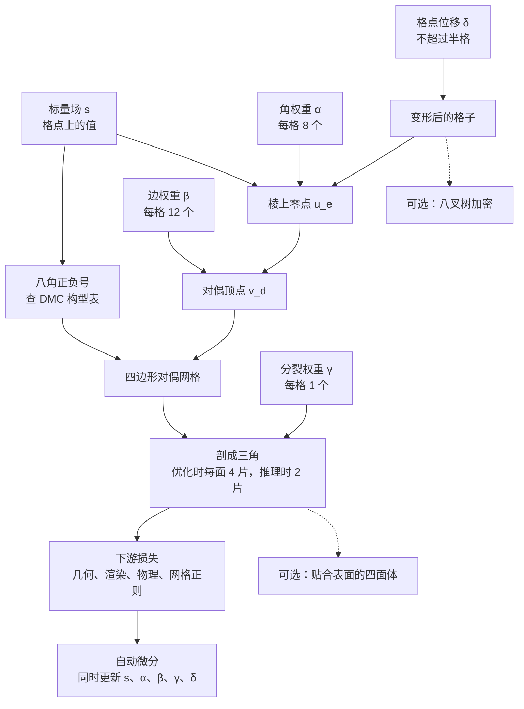

# FlexiCubes：等值面提取要能跟着梯度改网格

<!-- release-date: 2023-07-26 -->

> 本文依据 NVIDIA、多伦多大学与 Vector Institute 的 **Flexible Isosurface Extraction for Gradient-Based Mesh Optimization**，arXiv:2308.05371v1（2023-08-10），共 25 页：第 1–16 页是正文与参考文献，第 17–25 页是同一份 PDF 里的补充材料。它同时是 SIGGRAPH 2023 论文，刊于 *ACM Transactions on Graphics* 第 42 卷第 4 期 Article 37（doi:[10.1145/3592430](https://doi.org/10.1145/3592430)）。页码指 PDF 自身页码，与页眉印的 `1:N` 一致。文中区分三件事：**报告写了什么**、**我们如何解释它**、**哪些是外部补充**。

## 读前先把几个词说成人话

这篇论文难读，不在公式，而在它讨论的对象很陌生：不是模型，也不是训练，而是「从一个数值场里抽出三角网格」这一步。先把会反复出现的词说清楚：

- **三角网格（mesh）**：一堆顶点加上把它们连起来的三角形，游戏引擎、建模软件、物理仿真都吃这种格式。
- **标量场与等值面**：给空间里每一点一个数 $s(x)$，把 $s(x)=0$ 的点连成的那张曲面叫等值面。外正内负的 $s$ 就是有向距离场（Signed Distance Function，SDF）一类的表示。形状因此变成「一个函数的零水平集」。
- **规则格子**：把空间切成立方体。原文记号里 $X$ 是格点，$C$ 是格子，抽出的网格是 $M=(V,F)$（PDF p. 3–4）。$s$ 存在格点上还是由网络现场算，对抽网格来说没有区别。
- **移动立方体（Marching Cubes，MC）**：看每个立方体八个角的正负号，查表决定怎么连面，顶点放在符号变化的**棱**上。
- **对偶（dual）**：MC 的顶点在棱上、面在格子里；对偶方法反过来，在格子**内部**放顶点，再把相邻格子的顶点连成面。对偶轮廓（Dual Contouring，DC）和对偶移动立方体（Dual Marching Cubes，DMC）都属于这一类。
- **二次误差函数（Quadratic Error Function，QEF）**：DC 用局部法向解一个最小二乘来定顶点位置，锐边贴得好，但解可能跑出格子（PDF p. 4）。
- **DMTet（Deep Marching Tetrahedra）**：同一组作者的前作，在四面体格子上做可微的 Marching Tetrahedra，并让格点也能挪动（PDF p. 3–4）。
- **流形、水密、自交**：流形大致是「每一处局部都像一张纸」；水密是没有洞；自交是三角形互相穿过。
- **瘦三角（sliver）**：一个角极小的细长三角形。渲染、仿真、UV 展开都怕它。

## 一句话先说清

越来越多的系统用同一个套路「长出」网格：在空间里放一个标量场，抽出零等值面，在网格上算目标，再把梯度送回场里改一轮（PDF p. 2–3）。摄影测量、3D 生成、反物理都这么做。

问题是，抽网格的算法原本是为「场已经定了，忠实地画出来」设计的。进了优化闭环，它就不再是后处理，而是表示本身：它决定优化器够得着哪些形状，也决定梯度走不走得动。

FlexiCubes 的回答是：**拓扑继续查表，几何交给一组被约束在格子里的可学参数。** 具体是在 DMC 上加三组局部参数，和标量场 $s$ 一起被自动微分更新（PDF p. 5）：

- 每个格子 8 个角权重 $\alpha$、12 个边权重 $\beta$，决定对偶顶点落在格子里哪儿；
- 每个格子 1 个分裂权重 $\gamma$，决定四边形沿哪条对角线剖成三角；
- 每个格点 1 个三维位移 $\delta$，让格子本身贴向薄结构。

在此之上还能顺带抽出贴合表面的四面体体网格，以及在细节多的地方用八叉树加密（PDF p. 5、p. 7）。论文最硬的结论有两条：

- 79 个形状的重建里，$64^3$ 格子上 FlexiCubes 的锐边误差 ECD 是 0.71，同档 MC 是 1.25、DMTet 是 3.59，连拿真值场做一次性提取的 DC 也是 3.80（PDF p. 8，Table 2）；
- 把 nvdiffrec 与 GET3D 里负责抽网格的 DMTet 换成它、其余不动，几何误差或 FID 大多变好（PDF p. 12–13，Table 5–6）。

代价是抽取本身变贵：$64^3$ 上反向时间和显存都约是 DMTet 的 5 倍，而且不保证无自交（PDF p. 14）。

### 一条阅读路线

如果只有半小时读原文，建议按这个顺序：

1. **p. 2 的两个性质与 Table 1**：先弄清 Grad. 与 Flexible 为什么打架。
2. **p. 4 的 Figure 2–3、p. 5 的 Figure 4**：旧方法各自卡在哪；Figure 4 是整篇最直观的一张图。
3. **p. 5–7 的式 (3)–(7) 与 Figure 6、Figure 8**：三组参数到底加在哪。
4. **p. 8 Table 2、p. 10 Table 3–4**：重建主表、逐项消融、网格正则。
5. **p. 11–14 的四个应用与 Table 5–8**：换上去之后下游变了什么、贵了多少。
6. **p. 14–15 的限制，以及补充 p. 17 与 p. 20–21**：自交、连续性、四面体与反物理里的脏活。

## 主要矛盾：优化器要走得动，顶点又要挪得开

报告把一个好用的网格生成步骤拆成两个性质（PDF p. 2）：

- **Grad.**：对网格的微分有定义，而且梯度下降在实践里真的收敛。
- **Flexible.**：每个顶点都能单独、局部地挪动，用较少的面片贴上表面特征。

两者天然冲突。自由度一多，退化几何和自交的空间也跟着变大，而这些恰恰会让梯度优化不收敛（PDF p. 2）。于是已有方法通常只保住一条。

报告用 Table 1 把这个冲突写成一张分类表（PDF p. 2）。**Grad.** 指梯度优化在实践里有效，**Uniform** 指剖分大体均匀、少瘦三角：

| 方法 | Grad. | 锐边 | Uniform | 无自交 | 2-流形 |
|---|---|---|---|---|---|
| MC | 是 | 否 | 否 | 是 | 否 |
| DC | 否 | 是 | 否 | 否 | 否 |
| NDC | 否 | 是 | 是 | 是 | 否 |
| DMC 质心 | 是 | 否 | 是 | 是 | 是 |
| DMC QEF | 否 | 是 | 是 | 是 | 是 |
| 模板网格 | 否 | 否 | 是 | 否 | 是 |
| DMTet | 是 | 是 | 否 | 是 | 是 |
| FlexiCubes | 是 | 是 | 是 | 否 | 是 |

FlexiCubes 唯一没勾的是「无自交」。这不是笔误：第 7.2 节把自交明确写成限制（PDF p. 14）。

报告还强调了使用场景的差别：FlexiCubes **不是**给已知、固定的标量场做一次性提取用的；它面对的是「场未知、提取要做很多轮」的优化（PDF p. 3）。这句话决定了后面所有设计取舍，也解释了实验为什么要拿「优化得怎么样」而不是「画得准不准」来比。

下面这张 Figure 4 是整篇论文最直观的一张证据：同一个球，用七种提取方式朝同一个 CAD 零件优化，看 0、50、100、200、1000 步时长成什么样。

原文图注的读法是：DMTet 能还原锐边但瘦三角多；MC 贴不上锐边；NDC 在优化中发散；DC 要加强正则才收敛，而且带伪影；FlexiCubes 得到的网格保住了细节（PDF p. 5）。补充材料交代了这次实验的设置：损失与第 5.1 节的重建实验相同，DMTet 用 64 的四面体格子，其余方法用 48 的体素格子，让三角数大致相当（PDF p. 17）。三种 DC 变体的区别是给 QEF 加的正则权重：$\lambda = 0.01$、$\lambda = 1$，以及干脆取零点质心（PDF p. 18，式 10）。

**我们如何解释它。** 这张图把表 1 的抽象勾叉变成了具体症状。弱正则的 DC 到第 1000 步仍是一团碎片，这就是「顶点可能飞出格子」在优化里的样子；强正则和取质心能收敛，但代价是放弃了 DC 本来的卖点。NDC 把 QEF 换成网络，嵌进优化后景观更绕，直接散掉。能同时走得动、又长出锐边和整齐三角的，只剩最后一行。

## 旧方案各自卡在哪

### MC：顶点被钉在棱上

MC 在符号变化的格子棱上做线性插值（PDF p. 4，式 1）：

$$
u_e = \frac{x_a\, s(x_b) - x_b\, s(x_a)}{s(x_b) - s(x_a)}
$$

$x_a$、$x_b$ 是棱的两个端点。分母为零时表达式奇异，但 DMTet 的作者指出提取时不会在奇异条件下求值（PDF p. 4）。MC 的输出无自交、是流形；问题在于顶点只能沿一张稀疏的棱网滑动，不与坐标轴对齐的锐边永远对不上，等值面擦过格点时还会挤出瘦三角（PDF p. 4）。

让格点本身变形（DefTet、DMTet）能明显改善贴合，但抽出的顶点仍然不能各自独立移动，会围着格子的某个自由度聚成星形瘦三角（PDF p. 4）。

### DC：锐边有了，梯度没了

DC 在格子内部解 QEF 放顶点（PDF p. 4，式 2）：

$$
v_d = \mathop{\mathrm{argmin}}_{v_d} \sum_{u_e \in \mathcal{Z}_e} \nabla s(u_e) \cdot (v_d - u_e)
$$

$u_e$ 是棱上零点，$\nabla s(u_e)$ 是那里的场梯度。它在固定场上贴锐边很好，进了优化就出三个问题（PDF p. 4，Figure 2）：

- 解不保证落在格子里；法向共面时顶点会「炸」到远处，带来自交和数值不稳；
- 把顶点硬夹回格子，会把某些方向的梯度清零；
- 正则加到足以稳住，锐边的优势也就没了。

此外 DC 的连接关系可能非流形，输出的非平面四边形剖成三角时还会引入误差（PDF p. 4，Figure 3）。Neural Dual Contouring（NDC）用网络代替式 2，改善了对不完美但**固定**的场的提取；可一旦要对场本身优化，多穿一层网络会让优化景观更复杂、妨碍收敛（PDF p. 4）。

### DMC：拓扑对了，质心不够活

DMC 和 DC 一样把顶点放在格子内部，但它走的不是「格子的对偶」，而是「MC 那张网格的对偶」：MC 在每个格子里切出的每一片原始面（primal face）对应一个对偶顶点（PDF p. 5）。困难构型里一个格子可以放出不止一个顶点，最多四个（Figure 7 的 C13），输出因此总是流形（PDF p. 5）。

顶点位置有两种取法：像 DC 那样解 QEF，就继承 DC 的数值病；取原始面上零点的质心，就没病，但也没有贴单条锐边的自由（PDF p. 5）。Figure 3 把三者摆在一起：MC 贴不上锐边；DC 贴得上但可能出现非流形顶点；DMC 没有非流形顶点，表达锐边的自由度不如 DC（PDF p. 4）。

FlexiCubes 选的起点正是「DMC 质心」这一格：Grad. 和流形都已经有了，缺的只是 Flexible。作者把「以一个在困难构型下也能给出正确拓扑的方案为底」称为成功的关键之一（PDF p. 5）。

## 先看全景：场、参数、查表、网格

这张图按第 4 节与 Figure 5–8（PDF p. 5–7）重画，只表示模块怎么连，不含耗时。它说明三件事：

**第一，拓扑仍然只看符号。** 哪几片面、怎么连，由八个角的正负号查 DMC 表决定；亏格、孔洞、片数照样能随 $s$ 的符号变化而变。

**第二，几何多了四组旋钮。** $\alpha$、$\beta$、$\delta$ 决定顶点在哪，$\gamma$ 决定四边形怎么剖。它们与 $s$ 一起按下游目标更新（PDF p. 5）。

**第三，四面体和八叉树是同一套提取的延伸。** 不是另一种表示，公式大部分照旧。

## 核心设计一：让对偶顶点在格子里自由走

### 旧问题

DMC 质心的 Grad. 是好的，Flexible 不够；DC 的 QEF 反过来。报告要的是：顶点能在对偶单元里自由走，但走不出格子，反传才稳。

### 新设计

这张图按原文 Figure 2 最右格与 Figure 6（PDF p. 4、p. 6）重画，是二维机制示意，不是实测形状。

普通 DMC 分两步：先用式 3（与式 1 相同）在棱上插出零点，再把对偶顶点放在原始面各零点的质心（PDF p. 5，式 4）：

$$
v_d = \frac{1}{|V_E|} \sum_{u_e \in V_E} u_e
$$

$V_E$ 是围成这片原始面的那些零点。FlexiCubes 把两步都换成加权版本（PDF p. 6）。每个格子先有 8 个正的**角权重** $\alpha$，零点位置变成（式 5）：

$$
u_e = \frac{s(x_i)\,\alpha_i\, x_j - s(x_j)\,\alpha_j\, x_i}{s(x_i)\,\alpha_i - s(x_j)\,\alpha_j}
$$

再有 12 个正的**边权重** $\beta$，质心变成加权质心（式 6）：

$$
v_d = \frac{1}{\sum_{u_e \in V_E} \beta_e} \sum_{u_e \in V_E} \beta_e\, u_e
$$

实现里对 $\alpha$、$\beta$ 都套一层 $\tanh(\cdot)+1$，把取值压在 $[0,2]$；两组合计每格 20 个标量（PDF p. 6）。权重**按格子独立**，相邻格子的同一个角、同一条棱不共享：独立更灵活，而对偶设定下也没有需要维持的连续性条件（PDF p. 6）。

### 工作机制

两个式子都是刻意写成的**凸组合**：$\alpha$ 只能让零点在两个端点之间滑动，$\beta$ 只能在零点之间取平均。所以抽出的顶点必然落在所在格子各格点的凸包里（PDF p. 6）。一个凸格子放出多个对偶顶点时，它们所在的原始面互不相交，这就挡住了绝大多数自交（PDF p. 6）。

作者还提到，$\tanh$ 让权重可能贴近 0，式 5 理论上仍有退化的可能，但他们没有观察到由此引起的收敛问题（PDF p. 6）。

### 可迁移启发

给优化器加自由度，要同时满足两件事：够用，以及走不出安全区。把位置直接写成「格子里任意 $xyz$」也能 Flexible，但边界约束和反传都要另外处理；写成权重的凸组合，约束和可微就是同一件事。

## 核心设计二：四边形沿哪条对角线剖，也变成连续自由度

### 旧问题

DMC 和 FlexiCubes 抽出的都是非平面四边形，渲染和仿真通常要三角。随便挑一条对角线，弯曲区域会出现明显瑕疵；形状未知时，也不存在一条永远正确的剖分规则（PDF p. 6，Figure 8 左）。

### 新设计

这张图按原文 Figure 8（PDF p. 6）重画，是机制示意。

每个格子一个正的**分裂权重** $\gamma$，传给该格子放出的顶点（PDF p. 7）。**只在优化期间**，每个四边形插入一个中点 $\overline{v_d}$ 剖成 4 片三角，中点位置是（式 7）：

$$
\overline{v_d} = \frac{\gamma_{c_1}\gamma_{c_3}\,\dfrac{v_d^{c_1}+v_d^{c_3}}{2} + \gamma_{c_2}\gamma_{c_4}\,\dfrac{v_d^{c_2}+v_d^{c_4}}{2}}{\gamma_{c_1}\gamma_{c_3} + \gamma_{c_2}\gamma_{c_4}}
$$

$v_d^{c_k}$ 是四边形的四个顶点，分子两项分别是两条对角线的中点。优化完成、做最终提取时，不再插中点，只沿 $\gamma$ 乘积更大的那条对角线剖成 2 片（PDF p. 7）。

### 收益、代价、边界

直观地说，调 $\gamma$ 就是在两种剖法得到的几何之间平滑插值，优化会把它推向更符合目标的那一边（PDF p. 7）。Figure 9 最右一格的读法是：剖分对角线跟着特征走了（PDF p. 7）。

代价只在训练期：每个四边形多一个顶点、多两片三角；推理时这笔开销消失。

**我们如何解释它。** $\gamma$ 定义在格子一级，一个格子放出多个顶点时共用同一个 $\gamma$，细碎拓扑里这份自由度未必够用。报告没有讨论这一点。

### 可迁移启发

离散选择不要在前向里用 argmax 掐死。先让两种合法结果按连续权重混合，梯度自己挑边，最后再硬切。这和网络里的软路由、Gumbel-Softmax 是同一类动作，只是对象换成了四边形的对角线。

## 核心设计三：格子本身也能挪，但有上限

只在格子内部挪顶点，仍受格子朝向限制。薄片、斜着的细结构需要格子自己转过去。FlexiCubes 借鉴 DefTet 与 DMTet，给每个格点一个位移 $\delta \in \mathbb{R}^3$，并把位移限制在格距的一半以内，保证格子永不翻转（PDF p. 7）。

这个上限是有意的刚性：放得更宽，格子可能翻转，查表拓扑和实际几何就会打架。报告把「小心约束过的 Flexible」当作方法本身，而不是事后补丁。

## 三组参数各赚了什么

Table 3 在 $64^3$ 上按顺序逐项加上去（PDF p. 10）。CD（Chamfer Distance，倒角距离）单位 $10^{-5}$，ECD（只在锐边点上算的倒角距离）单位 $10^{-2}$，IN$>5^\circ$ 是法向偏差超过 5 度的点所占比例：

| 配方 | IN$>5^\circ$ (%) ↓ | CD ↓ | F1 ↑ | ECD ↓ | EF1 ↑ |
|---|---:|---:|---:|---:|---:|
| DMC 质心 | 53.02 | 5.85 | 0.65 | 2.60 | 0.19 |
| + 灵活顶点 $\alpha$、$\beta$ | 40.88 | 5.34 | 0.68 | 0.99 | 0.37 |
| + 格点位移 $\delta$ | 39.46 | 5.01 | 0.69 | 0.98 | 0.41 |
| + 灵活剖分 $\gamma$ | 34.87 | 4.87 | 0.70 | 0.71 | 0.43 |

注意表里的顺序是先加位移、再加剖分，和第 4 节的小节顺序不同。

读法：

- **锐边主要是 $\alpha$、$\beta$ 赚来的**：ECD 从 2.60 一步降到 0.99；
- **格点位移补的是整体贴合**：CD 从 5.34 到 5.01，ECD 几乎不动；
- **灵活剖分再压一截**：IN$>5^\circ$ 从 39.46% 到 34.87%，ECD 从 0.98 到 0.71。

Figure 9 是同一组消融的画面：加上灵活顶点后网格边与锐利特征对得更齐，加上格点位移后进一步改善，加上灵活剖分后对角线沿特征走（PDF p. 7）。

## 扩展一：顺手抽出贴合表面的四面体

物理仿真和角色体变形要的是体网格。先抽表面再另外四面体化，表面与体之间的梯度就断了。FlexiCubes 沿用 Liang 与 Zhang 2014 为 DC 设计的体剖分，改接到 DMC 的连接关系上，得到与表面严格共形、同样可微的四面体网格（PDF p. 7，Figure 10）：

- 顶点集 = 格点 ∪ 格子里抽出的表面顶点 ∪ 没有表面顶点的格子的中点；
- 两端同号的格子棱：生成 4 个四面体，每个由这条棱的两个端点加相邻两个格子里的顶点构成；
- 两端异号的格子棱：生成 2 个四棱锥，每个由一个格点加相邻各格的一个顶点构成，再按第 4.3 节从底面各剖成 2 个四面体。

难点是 DMC 一个格子可能有多个顶点，要挑对。多数情况能从 Figure 7 直接读出；补充材料给了两条规则，用查找表实现（PDF p. 7、p. 17）。构型 C18 的内部填不满，作者写明这是限制，只是优化中很少遇到，也不妨碍下游（PDF p. 17）。

## 扩展二：细节多的地方用八叉树加密

均匀格子处处一样密：平面浪费三角，尖角仍可能不够。八叉树能变分辨率，但跨层相邻处若符号不一致，会出现裂缝或非流形（PDF p. 7，Figure 11）。DC 时代的解法是约束八叉树的拓扑或场的符号，可那要求拓扑事先已知；优化中拓扑一直在变，套不上（PDF p. 8）。

这张图按原文 Figure 11（PDF p. 7）重画，是二维机制示意。

FlexiCubes 的做法是：细格贴着粗格时，细格多出来的那些格点**不学自己的 SDF**，而是取粗格那一面四个角的插值，从而保证交界两侧符号一致（PDF p. 8）。补充 A.2 给了实现：借 Ju 等人 2002 年的方法找八叉树的最小棱，对与粗面相邻的细面顶点预先算好双线性权重；八叉树结构更新时才重新识别这些受约束的格点（PDF p. 17）。细分到哪由应用决定，例如几何拟合看局部曲率、反渲染看视觉误差（PDF p. 7）。

效果：Figure 12 的头像上，不加约束有 318 个非流形顶点，加约束后只剩 1 个（PDF p. 8）。报告承认，跨层组合 Figure 7 的全部构型后仍有少数情况会留洞，所以说的是「几乎水密」（PDF p. 8）。Figure 14 的两个例子（CD 单位 $10^{-5}$，PDF p. 10）：

| | 均匀 $32^3$ | 自适应 $64^3$ | 自适应 $128^3$ | 参考网格 |
|---|---|---|---|---|
| 例 1 | 2.1k 三角，CD 4.3 | 4.5k，CD 2.5 | 7.6k，CD 2.4 | 10k |
| 例 2 | 2.1k 三角，CD 5.7 | 5.7k，CD 4.7 | 22k，CD 4.4 | 104k |

补充 C.3 交代了细分策略：从低分辨率均匀格子出发，给每个格子维护目标损失的滑动平均；形状收敛后，把损失超过 0.04 的格子细分，如此迭代，不需要事先按真值几何建好八叉树（PDF p. 19）。

### 可迁移启发

变分辨率时，真正要守的不是「每个顶点都自由」，而是交界上的一致。自由给细处，约束给接缝。

## 两项内部正则：过参数化是故意的

$\alpha$、$\beta$ 把每个顶点的位置写过了头。作者说这是有意为之：凸权重、有界位移、随机优化都靠这份冗余（PDF p. 8）。为此加了两项专门针对内部参数的正则，**所有例子都用**（PDF p. 8）。

第一项 $\mathcal{L}_{\mathrm{dev}}$ 看每个对偶顶点到它所在原始面各零点的距离是否差不多，用平均绝对偏差（MAD）惩罚（式 8）：

$$
\mathcal{L}_{\mathrm{dev}} = \sum_{v \in V} \mathrm{MAD}\bigl(\{\, \lVert v - u_e \rVert_2 : u_e \in \mathcal{N}_v \,\}\bigr)
$$

它让顶点待在格子中部附近，四周留出还能再挪的余量，同时也正则化抽出的连接关系（PDF p. 8）。补充 Figure 26 是唯一的直接证据：关掉它，平坦处会出现可见的接缝（PDF p. 19）。没有单独的定量消融。

第二项 $\mathcal{L}_{\mathrm{sign}}$ 沿用 nvdiffrec（Munkberg 等人 2022）的做法，对所有两端异号的格子棱用交叉熵惩罚（式 9）：

$$
\mathcal{L}_{\mathrm{sign}} = \sum_{(s_a, s_b)} H\bigl(\sigma(s_a),\, \mathrm{sign}(s_b)\bigr)
$$

$H$ 是交叉熵，$\sigma$ 是 sigmoid。它压制下游目标看不到的区域里长出的多余几何，例如物体内部的空腔（PDF p. 8）。

两项都不替代应用损失。应用损失可以是深度、SDF、渲染、等边长度、可展性；这两项只负责让内部参数别把自己逼进死角。

## 实验一：监督最干净时，提取方式本身差多少

### 设置

第 5.1 节刻意去掉「目标函数不完美」这个干扰：每一步抽网格，从随机相机渲染深度与剪影，与真值比；再随机采 1000 个点比较 SDF（PDF p. 8–9）。数据是 Myles 等人 2014 年收集的形状，去掉非水密与极细（如铁丝）的之后剩 79 个，从带噪扫描到精细 CAD 都有（PDF p. 9）。

基线分两类（PDF p. 9）：

- **可微、靠优化重建的**：MC、DMTet 与 FlexiCubes；
- **不可微、直接拿真值 SDF 做一次性提取的**：$MC_{SDF}$、$DC_{hermite}$（法向用有限差分补）、$NDC_{SDF}$（用作者发布的预训练模型）。

四面体格子的分辨率与体素格子不能直接比，同样的数字顶点数不同，所以表里另给了更高分辨率的 DMTet，让三角数对齐（PDF p. 9）。

补充 C.1 的配方（PDF p. 18）：mask、depth、SDF、$\mathcal{L}_{\mathrm{dev}}$ 的权重分别是 1、10、2000、1；$\mathcal{L}_{\mathrm{sign}}$ 的系数从 0.2 线性降到 0.01；每个形状优化 1000 步，学习率 0.01；物体放进 $[-1,1]^3$，包围盒最长边缩放到 1.8。

### 重建精度

Table 2 的 $64^3$ 一档（PDF p. 8）：

| 方法 | IN$>5^\circ$ (%) ↓ | CD ↓ | F1 ↑ | ECD ↓ | EF1 ↑ | 顶点 | 三角 |
|---|---:|---:|---:|---:|---:|---:|---:|
| $MC_{SDF}$ | 80.67 | 6.84 | 0.55 | 2.55 | 0.14 | 9881 | 19783 |
| $DC_{hermite}$ | 63.34 | 5.90 | 0.61 | 3.80 | 0.23 | 9828 | 19769 |
| $NDC_{SDF}$ | 55.22 | 6.16 | 0.57 | 1.22 | 0.26 | 9828 | 19769 |
| MC | 52.37 | 6.33 | 0.66 | 1.25 | 0.25 | 10459 | 20801 |
| DMTet(64) | 50.20 | 7.50 | 0.66 | 3.77 | 0.28 | 6783 | 13566 |
| DMTet(80) | 48.66 | 5.17 | 0.66 | 3.59 | 0.29 | 10385 | 20784 |
| FlexiCubes | 34.87 | 4.87 | 0.70 | 0.71 | 0.43 | 9916 | 19843 |

两件值得记住的事：

**端到端优化本身就胜过「拿真值场再提取」。** 同样是 MC，拿真值 SDF 一次性提取的 CD 是 6.84，可微优化出来的是 6.33。报告的解释是：端到端优化能把提取这一步引入的离散误差一并压下去（PDF p. 10）。

**锐边上，FlexiCubes 连拿真值场的 DC / NDC 都赢。** $64^3$ 的 ECD：DC 3.80，NDC 1.22，FlexiCubes 0.71；EF1 也是它最高。$32^3$ 与 $128^3$ 两档方向一致（PDF p. 8）。唯一的例外在 $128^3$ 的 F1：DMTet 0.74、MC 0.72，都略高于 FlexiCubes 的 0.71；但同档的 IN$>5^\circ$、CD、ECD、EF1 仍是 FlexiCubes 最好（PDF p. 8）。

Figure 13 是同一组对照的画面（PDF p. 9；更多例子在补充 Figure 27，PDF p. 22）。左边三列从真值 SDF 直接提取，第三行那个带镂空的壳体上可以看到明显破面；右边三列靠可微优化，三者整体形状都在，差别在细处与三角质量。

### 三角质量

Figure 15 画了六种方法的长宽比、半径比、最小角、最大角分布（PDF p. 11）。原文的读法是：FlexiCubes 的瘦三角明显更少，边长更接近等边；最小角、最大角的分布平滑，说明它能把三角微调到略微非平面的区域里，而不是被格子钉死。补充 Table 9 把「最小角小于 10 度的三角占比」写成了数（$64^3$，PDF p. 19）：$MC_{SDF}$ 24.32%，DC 8.67%，NDC 0.48%，MC 11.90%，DMTet(64) 14.41%，DMTet(80) 17.88%，FlexiCubes 1.97%。

也就是说，在瘦三角这一项上 NDC 其实比 FlexiCubes 还少。报告自己的措辞是「与表现最好的 NDC 相当」（PDF p. 10），这一点要如实记住：FlexiCubes 的优势是几何和三角质量同时站得住，而不是每一列都第一。

### 网格正则：表示得听得懂网格语言

第 5.2 节要说明的是：有些好性质只能写在网格上。等边长度、可展性都依赖离散的连接关系，没法直接写成标量场的函数。FlexiCubes 抽出的网格可微，这类正则可以直接加进去；MC 太刚性，加了也改不动（PDF p. 10）。

等边正则惩罚边长的方差。做法是先无正则重建 1000 步，再加正则跑 300 步，权重从 0 逐步升到 100（PDF p. 10）。Table 4（$64^3$，PDF p. 10）：

| | IN$>5^\circ$ (%) | CD | 长宽比 $>4$ (%) | 半径比 $>4$ (%) | 最小角 $<10^\circ$ (%) |
|---|---:|---:|---:|---:|---:|
| MC | 52.37 | 6.33 | 11.71 | 11.71 | 11.84 |
| DMTet(80) | 48.66 | 5.17 | 17.31 | 16.68 | 17.83 |
| FlexiCubes | 34.87 | 4.87 | 2.93 | 4.49 | 2.04 |
| MC + 正则 | 50.16 | 8.56 | 11.46 | 11.43 | 11.62 |
| DMTet(80) + 正则 | 67.65 | 6.69 | 0.29 | 0.46 | 0.26 |
| FlexiCubes + 正则 | 41.05 | 5.46 | 0.39 | 0.69 | 0.24 |

三行各说明一件事：

- **MC 几乎改不动三角质量**，瘦三角比例仍在 11% 上下，CD 反而从 6.33 恶化到 8.56；
- **DMTet 能把瘦三角压到很低，但几何掉得狠**：IN$>5^\circ$ 从 48.66% 升到 67.65%；
- **FlexiCubes 同样把瘦三角压下去**，IN$>5^\circ$ 只从 34.87% 升到 41.05%。

Figure 16 是画面：加正则后 MC 和 DMTet 丢了局部细节，FlexiCubes 只是略有退化（PDF p. 11）。这里 FlexiCubes 无正则一行的最小角比例是 2.04%，与补充 Table 9 的 1.97% 略有出入，原文没有说明口径差别。

可展性（developability）是更复杂的网格项：它惩罚相对一张平板的拉伸，但不惩罚单一方向的弯曲，对应用钣金、胶合板这类板材加工（PDF p. 10）。Figure 17 把 Stein 等人 2018 年的可展能量加进合成摄影测量：FlexiCubes 既贴住了形状，又分出了板片；MC 既丢了形状特征，也做不出这种风格（PDF p. 11）。

补充 Figure 25 还测了旋转：同一个零件换三种摆放，MC 在特征与坐标轴对齐时表现好，一转就出现台阶；DMTet 更稳，但瘦三角多；FlexiCubes 两种毛病都没有（PDF p. 19）。

**我们如何解释它。** 这一节是整篇最能迁移的一条：网格正则要起作用，前提是表示本身有能同时满足「像」和「整齐」的自由度。只换损失、不换表示，MC 做不到。

## 实验二：下游只换抽网格那一层

第 6 节四个应用的共同姿势是：已有系统里负责抽网格的那一层换成 FlexiCubes，其余尽量不动（PDF p. 11–14）。

### 摄影测量：nvdiffrec

nvdiffrec 从多视图图像联合优化形状、材质和光照，拓扑那一步原本用 DMTet。把它换成 FlexiCubes、其余流程不变，正文说同等三角数下几何重建更好（PDF p. 11）。不过 Figure 20 的 LDraw 过山车场景里，图注标的三角数是 DMTet 317k、FlexiCubes 229k，并不相等；图注本身的结论是三角更均匀、细节更多（PDF p. 12）。

补充 D.1 的损失是 $\lambda_{dev}\mathcal{L}_{\mathrm{dev}} + \mathcal{L}_{\mathrm{sign}} + \lambda_{mask}\mathcal{L}_{\mathrm{mask}}$，取 $\lambda_{dev}=0.25$、$\lambda_{mask}=5.0$；nvdiffrec 第二阶段「拓扑冻结后再优化光照、材质和形状」保持原样（PDF p. 20）。

Table 5 是 NeRF 合成数据集上的新视角 PSNR 与几何误差（PDF p. 12）。这里的 CD 只在测试视角看得见的三角上、用 2.5M 个点算，单位 $10^{-2}$，尺度与第 5 节不同，**不能**和 Table 2 比（PDF p. 12、p. 18）：

| | Chair | Drums | Ficus | Hotdog | Lego | Mats | Mic | Ship |
|---|---:|---:|---:|---:|---:|---:|---:|---:|
| PSNR DMTet | 31.8 | 24.6 | 30.9 | 33.2 | 29.0 | 27.0 | 30.7 | 26.0 |
| PSNR FlexiCubes | 31.8 | 24.7 | 30.9 | 33.4 | 28.8 | 26.7 | 30.8 | 25.9 |
| CD DMTet | 4.51 | 3.98 | 0.30 | 2.67 | 2.41 | 0.41 | 1.20 | 55.8 |
| CD FlexiCubes | 0.45 | 2.27 | 0.37 | 1.44 | 1.60 | 0.53 | 1.51 | 10.5 |

PSNR 几乎打平，几何不是：Chair 的 CD 从 4.51 降到 0.45，Ship 从 55.8 降到 10.5；但 Ficus、Mats、Mic 三个场景 FlexiCubes 的 CD 略差。报告在这一节强调的不是再多一点 PSNR，而是三角质量：Figure 18 两个场景的线框里瘦三角更少，八个场景合起来的最小角直方图也往大角度集中（PDF p. 11）；更整齐的三角也让现成工具 xatlas 做 UV 展开更容易，Figure 21 里纹理块更大，纹理过滤更好（PDF p. 12）。

真实照片上（Figure 19，PDF p. 12）：Tanks and Temples 的 Family 场景用 nvdiffrecmc，PSNR 28.49 / 28.47 dB（DMTet / FlexiCubes），三角约 96k / 79k；GoldCape 场景用 nvdiffrec，24.44 / 24.56 dB，三角约 55k / 38k。图注的判断是 FlexiCubes 剖分更均匀，GoldCape 的沟槽这类小细节更清楚。

### 动画网格减面：同一套壳要经得住整段动作

任务是：已知骨骼动画和目标物体的图像，学一张低面数网格，并用同一套骨骼重新绑定（PDF p. 12–13）。基线是只在 T-pose 上优化、事后再蒙皮；FlexiCubes 版则在每一步都可微地重新蒙皮，对随机相机、随机动画帧算图像损失（PDF p. 13）。

补充 D.2 的细节（PDF p. 20）：格子只用 $32^3$；蒙皮权重按参考网格的 10 个最近邻做反距离加权得到；端到端版先在 T-pose 上跑 300 步拿到初始几何，再打开动画。Figure 22 里参考网格 23k 三角，两种 FlexiCubes 结果都是 1.7k；放大框落在动作帧里被拉伸的肩臂一带，图注的结论是在整段动画上优化能重新分配三角密度、避免网格被拉扯（PDF p. 13）。蒙皮权重本身没有一起优化，因为拓扑在变，需要一套在顶点增删下仍一致的参数化，留作未来工作（PDF p. 20）。

### 3D 生成：GET3D 只改生成器最后一层

GET3D 靠可微等值面直接生成带纹理的网格，原本的提取模块是 DMTet。这里把生成器最后一层改成除了每个格点的 SDF 与位移外，再为每个格子多输出 21 个数（8 个角权重、12 个边权重、1 个分裂权重）；其余结构、训练流程、超参以及 ShapeNet 的 Car、Chair、Motorbike 数据划分全部不变（PDF p. 13、p. 20）。Table 6 的 FID（越低越好，PDF p. 13）：

| | Motorbike | Chair | Car |
|---|---:|---:|---:|
| DMTet | 48.90 | 22.41 | 10.60 |
| FlexiCubes | 44.87 | 17.51 | 9.55 |

三类都降了，Chair 降得最多。Figure 23 与补充 Figure 29 是定性结果：细结构更多、表面更均匀、瘦三角更少（PDF p. 13、p. 24）。报告把它称为「即插即用的可微网格提取模块」，并说因为只改最后一层，额外计算「相对可忽略」（PDF p. 13、p. 20）；后一句是定性判断，没有单独给生成器的计算量。

### 反物理：形状和密度分两段学

利用能直接抽出四面体这一点，报告把 FlexiCubes 接上可微 FEM 仿真器 GradSim 和可微渲染，从多视角视频里恢复形状、纹理与质量密度（PDF p. 14）。Figure 24 的例子：参考密度 $D=0.300$，从球形初始化、随机猜的 $D=1.500$ 出发，优化后得到 $D=0.311$（PDF p. 14）；补充 Figure 30 的另一例参考 0.500，优化到 0.511（PDF p. 25）。

补充 D.4 把这件事的难处写得很直白（PDF p. 20–21）：

- 为了仿真便宜，体网格只用 $32^3$ 格子抽取；真值视频用 neo-Hookean 弹性、Lamé 参数 $\mu=\lambda=1000$、阻尼 1.5，时间步 $1/8192$ 秒，渲染 512 个视角；
- 体积小于 $2\times 10^{-7}$ 的四面体要删掉（形状归一化到 $(-0.45, 0.45)$），否则仿真数值不稳；删掉的代价是表面出现细缝，作者希望以后用新正则解决；
- 形状与物理参数联合优化总会出现 NaN 而崩溃，所以分两段：先用视频第一帧做刚体重建，只优化形状与纹理；再固定形状，用视频损失只优化密度，200 步收敛。

**我们如何解释它。** 这个实验证明的是「抽出的体网格能直接进现成的可微仿真」，而不是「从视频联合恢复几何与全部本构参数」已经可行：Lamé 参数在优化中始终是已知量。

## 代价：抽取更贵，但通常不是瓶颈

Table 7 只测提取本身（PDF p. 14）：

| | 前向 (ms) | 反向 (ms) | 显存 (MB) |
|---|---:|---:|---:|
| $64^3$ MC | 2.28 | 0.43 | 12.05 |
| $64^3$ DMTet | 2.33 | 1.38 | 22.44 |
| $64^3$ DMC 质心 | 4.97 | 1.69 | 25.08 |
| $64^3$ FlexiCubes | 8.93 | 7.32 | 116.56 |
| $128^3$ MC | 5.08 | 0.58 | 72.85 |
| $128^3$ DMTet | 6.94 | 1.39 | 168.27 |
| $128^3$ DMC 质心 | 7.34 | 1.74 | 150.75 |
| $128^3$ FlexiCubes | 14.06 | 9.53 | 816.17 |

$64^3$ 上 FlexiCubes 的反向时间和显存都约是 DMTet 的 5 倍，$128^3$ 显存到了 816 MB。作者的论点是这笔账放进整条下游流水线里仍然小，Table 8 在 $96^3$ 上给了整步开销（PDF p. 14）：

| | nvdiffrecmc + DMTet | nvdiffrecmc + FlexiCubes | GET3D + DMTet | GET3D + FlexiCubes |
|---|---:|---:|---:|---:|
| 每步 (ms) | 307 | 315 | 510 | 610 |
| 显存 (GiB) | 13.1 | 15.3 | 11.6 | 11.1 |

表注解释了两边显存为什么走向相反：nvdiffrecmc 把每个格子的参数直接存在显存里，多出来的 $\alpha$、$\beta$、$\gamma$ 抬高了显存；GET3D 用网络预测这些参数，而 FlexiCubes 表示同样的几何需要的三角更少，总显存反而略降（PDF p. 14）。作者还说，最高格子分辨率受渲染和网络限制，不受提取限制；所有应用都取高端 GPU 撑得住的最高分辨率（PDF p. 14）。GET3D 每步从 510 ms 涨到 610 ms，这 20% 左右的增幅不算「可忽略」，读表时要自己记住。

## 限制：报告自己写了没保证什么

**不保证无自交。** 顶点能灵活移动，也就可能移进相交的构型；作者试过严格限制在无自交范围内，发现会不可接受地损害表达力和优化（PDF p. 14）。$64^3$、79 个形状上，自交三角占 0.10%，低于 DC 的 1.48% 与 NDC 的 0.13%（PDF p. 14）。补充 Table 9 给了三档完整数字：FlexiCubes 的非流形顶点、非流形边都是 0，自交比例在 $32^3$、$64^3$、$128^3$ 上分别是 0.715%、0.103%、0.017%（PDF p. 19）。

**四面体和八叉树的保证更弱。** 歧义构型下偶尔会有小空腔或非流形单元；作者认为不妨碍下游，但应用若硬性要求水密，需要额外处理（PDF p. 14–15）。均匀格子上表面总是 2-流形，也是按 Wenger 2013 的办法修补了 DMC 构型 C16、C19 的歧义之后才成立的（PDF p. 17）。

**并不全局连续。** 等值面滑过格点时网格会跳变，这是从 DC、DMC 继承下来的。作者的辩护是：在 Adam 这类随机优化里，小的局部不连续不妨碍优化，所以分析焦点放在「下游优化得动」（Figure 4），而不是形式上的可微与光滑（PDF p. 15）。这是经验判断，不是定理。

**未来工作写了但没做**：把体渲染和网格表示结合以改善视觉任务的梯度；4D 时空网格；把自适应层次提取接进生成模型（PDF p. 15）。最后一条也说明，论文里的 GET3D 实验用的是均匀格子。

## 可迁移的设计原则

把上面串回一件事：抽网格的算法一旦进了优化闭环，它就不再是后处理，而是表示本身。

1. **先分清哪一步必须离散，哪一步可以连续。** 拓扑查表，几何交给可学参数。两件事写进同一个可微表达式，优化器才能同时改「连什么」和「连在哪」。
2. **自由度要配安全区。** $\alpha$、$\beta$ 是凸组合，$\delta$ 有半格上限，$\gamma$ 只在两种合法剖分之间插值。没有安全区的 Flexible，就是 DC 那种飞出格子的 Flexible。
3. **过参数化要配「留余量」的正则。** $\mathcal{L}_{\mathrm{dev}}$ 不是为了好看，是为了别把权重用满，下一步还有地方挪。
4. **网格正则生效的前提，是表示有对应的自由度。** Table 4 与 Figure 17 说明：同样的等边、可展损失，MC 几乎无动于衷，FlexiCubes 能在几何与网格质量之间折中。
5. **即插即用是一种推广策略。** 摄影测量、生成、仿真三条线都只换提取层。衡量成功的不是 PSNR 再高 0.1 dB，而是同样面数下几何更忠实、三角更整齐、UV 更好展、体网格能进仿真。
6. **能反传不等于能联合优化一切。** 反物理必须两阶段、必须删掉过小的四面体。可微流水线的工程边界，和表示的数学边界是两回事。

## 论文之后发生了什么

**以下是外部补充，不是本 PDF 的内容。**

- 官方代码仓 [nv-tlabs/FlexiCubes](https://github.com/nv-tlabs/FlexiCubes) 的首个提交在 2023-09-14，README 写明核心函数从 Kaolin v0.15.0 起进入 `kaolin.ops.conversions.FlexiCubes`；Kaolin v0.15.0 发布于 2023-12-20。官方项目页见 [research.nvidia.com/labs/toronto-ai/flexicubes](https://research.nvidia.com/labs/toronto-ai/flexicubes/)。
- NVIDIA 技术博客 [Better 3D Meshes, from Reconstruction to Generative AI](https://developer.nvidia.com/blog/better-3d-meshes-from-reconstruction-to-generative-ai/)（2023-08-11）把它介绍为优化流水线里 Marching Cubes 的替代品。
- 后来的物体级 3D 生成系统把它当作网格解码器的末端来用。本库的 TRELLIS 一篇里，结构化潜变量的网格解码器就是先细分格子、再用 FlexiCubes 抽面；TRELLIS-2 一篇则改用不需要标量场的灵活对偶网格来编码网格。那些系统怎么设计潜空间、为什么放弃等值面场，属于它们各自的报告，不回写进这篇 2023 年的原文。

## 关键词回看

| 词 | 在本篇里具体指什么 |
|---|---|
| 基于梯度的网格优化 | 标量场 → 抽网格 → 在网格上算目标 → 反传回场，反复迭代 |
| Grad. / Flexible | 优化走得动 / 顶点能局部贴特征；两者默认冲突 |
| MC | 顶点钉在格子棱上的经典提取 |
| DC / QEF | 格子内解最小二乘贴锐边，优化时顶点可能飞出格子 |
| DMC | 取 MC 网格的对偶；质心版稳而不活，QEF 版活而不稳 |
| DMTet | 可微 Marching Tetrahedra 加格点变形；锐边有，瘦三角多 |
| $\alpha$、$\beta$ | 每格 8 + 12 个正权重，用凸组合安放对偶顶点 |
| $\gamma$ | 每格 1 个权重，训练时软选四边形的对角线 |
| $\delta$ | 格点位移，不超过半个格距 |
| $\mathcal{L}_{\mathrm{dev}}$ / $\mathcal{L}_{\mathrm{sign}}$ | 让顶点留出活动余量 / 压掉无监督区域的多余几何 |
| 悬挂格点约束 | 八叉树交界上细格多出的格点取粗格面插值，保证符号一致 |
| nvdiffrec / GET3D | 论文里两条即插即用的下游，不是本方法的训练目标 |

## 资料与阅读边界

- 版本与首发日：arXiv 上只有 v1（2023-08-10 提交），本文据此写作。`release-date` 取 2023-07-26，是 ACM TOG 在线发表日（Crossref 记录的 published-online），也是这项技术最早的官方公开事件，早于 arXiv v1、NVIDIA 技术博客（2023-08-11）和代码仓首个提交（2023-09-14）。
- 本文覆盖：摘要与 Figure 1；第 1–3 节的问题定义、Table 1 与 Figure 2–4；第 4 节的全部方法与 Figure 5–12；第 5 节的 Table 2–4 与 Figure 13–17；第 6 节四个应用与 Table 5–6、Figure 18–24；第 7 节的 Table 7–8、限制与未来工作；补充材料 A–D、Table 9 与 Figure 25–30。
- 原文没有公开、本文也不补：形式化的可微或连续性分析；生成器训练的算力与时长；自适应格子接入生成的实验；大场景、开放空间的重建；反物理中本构参数的联合估计。
