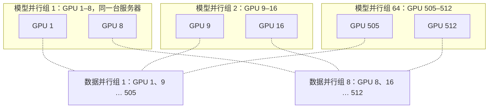

# Megatron-LM：顺着矩阵的行列切开 Transformer，模型并行不必换编译器

<!-- release-date: 2019-08-13 -->

> 本文依据 NVIDIA 的 **Megatron-LM: Training Multi-Billion Parameter Language Models Using Model Parallelism**，arXiv:1909.08053v4，2020-03-13，共 15 页。页码均指 PDF 自身的页码。文中会区分三件事：**论文明确写了什么**、**我们怎么解释它**、**哪些是外部资料或本文推算**。

## 读前先把几个词说成人话

这篇论文的门槛不在公式，而在它同时用了两套词：矩阵乘的词，和分布式训练的词。先把会反复出现的说清楚。

- **GEMM（General Matrix Multiply，通用矩阵乘）**：两块矩阵相乘。Transformer 的算力几乎全花在这上面：QKV 投影、注意力输出投影、MLP 的两层、最后的词表 logits。
- **数据并行（data parallelism）**：同一份模型复制到多张卡，各吃一小批不同的数据，反向后把梯度加总。前提是整份模型放得进一张卡。
- **模型并行（model parallelism）**：把一份模型拆到多张卡上。一张卡装不下时只能走这条路。
- **层内模型并行（intra-layer model parallelism）**：不按层切，而把同一层里的大矩阵切开，几张卡各算一块。这就是后来常说的张量并行（tensor parallelism，TP）；论文自己只用 intra-layer 这个词。
- **流水线并行（pipeline model parallelism）**：按层切，前几层在卡 A，后几层在卡 B，激活顺着往下传。GPipe 走这条路，这篇论文不做。
- **All-Reduce（全归约）**：一组卡各有一份同形状的张量，把它们加总，再让每张卡都拿到总和。
- **注意力头（attention head）**：多头注意力把隐藏向量拆成几组小的 Q、K、V，各组独立算注意力再拼回。头与头互不依赖，这是切分能成立的关键。
- **弱缩放（weak scaling）**：加卡的同时把问题做大，让每张卡的活大致不变。本文的「问题」是模型，不是 batch。

## 一句话先说清

2019 年，BERT、GPT-2 已经证明模型越大越好用，可模型一大就超出单卡显存。Adam 这类优化器还要为每个参数额外存动量等状态，单卡能训的规模被压得更小（PDF p. 1）。当时能切模型的 GPipe 和 Mesh-TensorFlow，要么要重写模型，要么依赖还在开发中的定制编译器（PDF p. 1）。

Megatron-LM 的主张是：**Transformer 里的矩阵乘本来就能顺着行、列切开，只要在原生 PyTorch 里插几处 All-Reduce，不要新编译器，不要改库，不写 C++**（PDF p. 1、p. 4）。

它用三组结果证明这件事（PDF p. 1–2）：

- **切得动，而且切完还快**：8.3B 参数、512 张 V100、8 路层内切分，整个应用持续 15.1 PFLOPS；相对单卡 39 TFLOPS（理论峰值的 30%）的基线，缩放效率 76%。
- **变大确实更好**：GPT-2 风格 8.3B 在 WikiText103 上困惑度 10.8（此前最好 15.8），LAMBADA 准确率 66.5%（此前 63.2%）。
- **BERT 放大有个结构坑**：原版 BERT 做大会退化，把 LayerNorm 与残差的顺序换一下才稳；换完的 3.9B 在 RACE 上到 90.9%（此前 89.4%）。

对训练系统来说，要记的不是这几个分数，而是两条切法规则和一个前提：每层只同步 4 次，切不开的小算子每卡重复算，而这一切发生在一台机器的 NVSwitch 里。

### 一条阅读路线

如果只有半小时读原文，建议按这个顺序：

1. **p. 4 式 (1)–(3) 与 Figure 3**：MLP 为什么先列切再行切，注意力为什么按头切，$f$ / $g$ 这对算子是什么。
2. **p. 5 Figure 4 与前两段**：一层 4 次 All-Reduce；词表切开后把交叉熵融进去；切不掉的就复制。
3. **p. 6 Table 1 与 Figure 5**：四档弱缩放，8 卡 77%、512 卡 74%。
4. **p. 7 Table 2–3**：GPT-2 风格三档与零样本结果。
5. **p. 8 Figure 7 与 Table 5**：BERT 的 LayerNorm 位置消融，以及随规模单调变好的下游分数。
6. **p. 11–12 附录 B、p. 14–15 附录 D–E**：模型并行与数据并行怎么编组、随机数怎么分；头数对效率的影响；WikiText103 的困惑度怎么算。

## 主要矛盾：模型比卡大，而现成的切法都要换一套栈

数据并行解决不了「装不下」。它要求整份模型放进每个 worker；加卡只能加大 batch，batch 太大又会伤收敛（PDF p. 3）。ALBERT 用参数共享缩小显存，但这等于限制了模型容量（PDF p. 3）。所以必须做模型并行。

当时的模型并行有两条路（PDF p. 3）：

- **流水线，按层切。** 一组算子在这张卡上算完，把输出交给下一张卡。GPipe 用同步梯度避免参数服务器的不一致，代价是要额外逻辑编排通信和计算，会有降低效率的流水线气泡；或者改优化器，会伤精度。
- **更一般的张量切分。** Mesh-TensorFlow 让用户用一门语言声明沿哪一维切，再由编译器插入集合通信；FlexFlow 试图自动选并行策略。论文承认自己借用了和 Mesh-TensorFlow 类似的洞察：注意力头之间天然可并行。

卡住的不是「能不能切」，而是「切完要不要重写模型、换编译器」。于是矛盾变成：

> 模型已经大过单卡，数据并行帮不上；现成的模型并行要么带着气泡，要么要一整套新框架。能不能只利用 Transformer 自己的结构，在熟悉的 PyTorch 里用最少的通信把一层切开，而且切完 GPU 仍然主要在做矩阵乘、不是在等网络？

**我们如何解释它。** 这是一次「结构比编译器更重要」的赌注。Transformer 的一层几乎全是 GEMM 加逐元素非线性。只要切法顺着 GEMM 的行列走，通信可以压到每层固定几次。后文 77% / 74% 的缩放效率，就是这个赌注的回报。

## 先看全景：他们用的层长什么样

论文 Figure 2 画的是他们实际采用的层，不是 2017 年原版 Transformer（PDF p. 3）。两处不同论文点了名：非线性用 GeLU 而不是 ReLU；LayerNorm 加在注意力和 MLP 的**输入**上，原版加在输出上。这就是后来说的 pre-norm。GPT-2 用 Decoder（从左到右），BERT 用 Encoder（双向），被切的是两边都有的那些 GEMM，所以切分不依赖这一点。

一层 = 自注意力块 + 两层 MLP 块（PDF p. 4）。论文对两块分别做模型并行，下面三个核心设计都落在这一层里；第四节讲它们怎么串成「一层只同步 4 次」。

## 核心设计一：MLP 先切列、再切行，把非线性留在本地


### 旧问题：切错一刀，非线性前就要同步

MLP 的第一步是一次 GEMM 加 GeLU（PDF p. 4，式 1）：

$$
Y = \operatorname{GeLU}(XA)
$$

$X$ 是输入激活，$A$ 是第一张权重。一种切法是把 $A$ 按行切、$X$ 按列切：$X = [X_1, X_2]$，$A$ 上下分成 $A_1$、$A_2$（式 2）。这样每张卡只算得出 $X_1A_1$ 或 $X_2A_2$，要得到 $Y$ 必须先把两块加起来，再过 GeLU。因为 GeLU 不是线性的：

$$
\operatorname{GeLU}(X_1A_1 + X_2A_2) \neq \operatorname{GeLU}(X_1A_1) + \operatorname{GeLU}(X_2A_2)
$$

非线性之前多了一个同步点（PDF p. 4）。

### 新设计：第一张列切，第二张行切

改成把 $A$ 按列切，$A = [A_1, A_2]$。每张卡算自己那几列，GeLU 逐元素作用，可以就地做（式 3）：

$$
[Y_1, Y_2] = [\operatorname{GeLU}(XA_1),\ \operatorname{GeLU}(XA_2)]
$$

第二张权重 $B$ 于是按行切，正好吃进本卡的 $Y_1$ 或 $Y_2$，两张 GEMM 之间不通信。每张卡算出的是最终输出的一份部分和，进 Dropout 之前做一次 All-Reduce 把它们加起来（PDF p. 4，Figure 3a）。

### 工作机制：一对共轭算子 $f$ 与 $g$

通信被收进两个算子里（PDF p. 4，Figure 3 图注）：$f$ 前向恒等、反向对梯度做 All-Reduce；$g$ 前向对激活做 All-Reduce、反向恒等。MLP 整块前向只有一次 $g$，反向只有一次 $f$。论文把 $f$ 写成了几行 PyTorch（PDF p. 4，Code 1）：

```python
class f(torch.autograd.Function):
    def forward(ctx, x):
        return x
    def backward(ctx, gradient):
        all_reduce(gradient)
        return gradient
```

$g$ 把前向和反向对调即可。所谓「插入几个通信原语」，形状就是这两个自定义 autograd 函数，不是一套图编译器。

### 可迁移启发

判断一个算子能不能就地切，先问**非线性在不在切缝上**。逐元素的非线性在列切之后仍是本地操作；需要跨切块求和的，必须先同步。自己切卷积、切专家、切任何「矩阵乘夹非线性」的结构，都可以先画这张真值表。

## 核心设计二：注意力按头切，QKV 算完再行切输出

### 新设计：让每张卡拿到完整的几个头

多头注意力里，每个头的 Q、K、V 矩阵乘彼此独立。论文把 Q、K、V 三张投影按列切，使每个头对应的矩阵乘完全落在一张卡上（PDF p. 4，Figure 3b）。于是头内部的 $QK^\top$、softmax、Dropout、乘 $V$ 全部本地完成，**完成自注意力之前不需要任何通信**。其后的输出投影按行切，直接吃各卡已经算好的头输出，中间同样不通信。

结构和 MLP 完全同构：两张 GEMM 融成一组，中间的同步点被去掉，出口一次 $g$（PDF p. 4）。

### 代价与边界：头越多，单卡的 GEMM 越瘦

按头切意味着头数与切分方式绑在一起。附录 D 固定 8.3B、8 路模型并行，只改头数（PDF p. 14–15，Table 7）：

| 头数 | 每头隐藏维 | 缩放效率 |
|---:|---:|---:|
| 16 | 192 | 82% |
| 24 | 128 | 80% |
| 32 | 96 | 77% |

头越多，注意力里的 GEMM 越小，softmax 的元素越多，效率略降。论文提醒以后设计大模型时要在速度和精度之间权衡这个超参（PDF p. 14）。

### 可迁移启发

天然独立的子结构（头、专家、分组）是最便宜的切分边界：切在它们之间，内部零通信。但切分粒度会反过来约束超参，头数、每头维度都会影响每张卡上矩阵的形状。

## 核心设计三：词表也切开，但不在网上搬 logits

### 旧问题：输出层是一张更大的 GEMM

输出嵌入的形状是隐藏维 $H$ 乘词表大小 $v$。GPT-2 的词表是 50,257，值得单独切（PDF p. 4）。输入嵌入与输出嵌入共享权重，所以两边都要改。

### 新设计：沿词表维切开，再把交叉熵融进去

论文把嵌入矩阵 $E_{H\times v}$ 沿词表维按列切成 $E = [E_1, E_2]$，每张卡只持有一部分词的向量（PDF p. 4–5）。输入侧查表之后做一次 $g$，把各卡的部分嵌入加回完整隐藏向量（PDF p. 5）。

输出侧如果先各算一段 logits、再 all-gather 成完整 logits 送进交叉熵，要通信 $b \times s \times v$ 个元素（$b$ 是 batch，$s$ 是序列长），词表一大这就很贵。论文的做法是把并行 GEMM 的输出直接与交叉熵融合，通信量降到 $b \times s$：各卡交换的是标量损失，不是 logits（PDF p. 5）。

**我们如何解释它。** 层内 All-Reduce 的体积跟隐藏维成正比，logits 的体积跟词表成正比，而词表往往比隐藏维大一个数量级。不融合的话，模型并行的通信账会被输出层单独吃掉。这是全文最像「省总线」的一刀。

### 可迁移启发

先看通信对象是不是「最后要被归约成更小量的东西」。若是，就把归约提前到本地做完，只传归约后的结果。

## 切不掉的就复制：一层只同步 4 次

一层 Transformer 里，注意力一块、MLP 一块，各有一次 $g$ 和一次 $f$：前向 2 次 All-Reduce，反向 2 次，合计 4 次（PDF p. 4–5，Figure 4）。


这张图按论文 Figure 4（PDF p. 5）重画，是机制示意。两个模型并行区之外的 LayerNorm、Dropout、残差没有被切。

论文对它们的处理很直接：与其让一张卡算完再广播，不如每张卡各算一遍（PDF p. 5）。LayerNorm 参数在每张卡上各存一份，模型并行区的输出在各卡上直接做 Dropout 和残差，再喂进下一个并行区。优化器也顺着这个布局：每个 worker 只优化自己那份参数；由于所有值要么是本地的、要么是复制的，更新后的参数不需要再在模型并行组内同步（PDF p. 5）。

**论文明确写了：** 这套做法可以概括为「减少通信、让 GPU 保持算力受限（compute bound）」（PDF p. 5）。**论文没有写：** 把 All-Reduce 和下一段计算重叠起来。这篇的思路是**少通信**，不是**藏通信**。

复制带来一个容易静默出错的细节：随机数（PDF p. 11–12，附录 B.2）。

- 残差之前的 Dropout 在并行区之外，各卡算的是同一份张量，掩码必须一模一样，所以训练开始时各卡用同一个种子。
- 注意力里的 Dropout 在并行区之内，各卡处理的是不同的头，掩码应该不同，所以另备一个按 worker 独立播种的生成器。

**我们如何解释它。** 不分两套随机数，要么各卡残差对不齐，要么所有分片共用一张 Dropout 掩码、正则效果打折。两种错都不会报错，只会让模型悄悄变差。

## 和数据并行怎么叠：8 × 64 = 512

模型并行与数据并行正交，可以同时用（PDF p. 11，附录 B.1）。同一台服务器里的几张卡组成模型并行组，合起来持有一份模型；其余卡组成更多的模型并行组；各组里「同一位置」的卡组成数据并行组，持有相同的参数分片，反向时在组内 All-Reduce 梯度，多个数据并行组的归约并行进行。



这张图按论文 Figure 8（PDF p. 12）重画。8.3B 用 8 路模型并行 × 64 路数据并行，共 512 张卡；所有通信都是 PyTorch 对 NCCL 的 Python 调用（PDF p. 11）。

硬件是最多 32 台 DGX-2H，共 512 张 32 GB 的 Tesla V100；机内 GPU 之间经 NVSwitch 有 300 GB/s，机间每台 8 块 InfiniBand 网卡共 100 GB/s（PDF p. 6）。

**我们如何解释它。** 一台 DGX-2H 有 16 张卡，模型并行组只用 8 张，所以每层那 4 次 All-Reduce 全部走机内 NVSwitch；跨机的只有数据并行的梯度归约，每个迭代一次。论文没有把「模型并行不跨机」写成原则，但实验布局就是这样。它在结论里把跨机当成下一步：超过 16B 的模型会超出一台 DGX-2H 16 张卡的显存，那时更适合把层内切分、层间切分和跨节点模型并行混合使用（PDF p. 9）。这正是 Megatron-LM-2 一篇要回答的问题。

## 训练设置：写了的和没写的

**语料**（PDF p. 5）。合并 Wikipedia、CC-Stories、RealNews、OpenWebtext；删掉出现在 WikiText103 测试集里的维基文章，清掉 CC-Stories 预处理留下的多余换行。BERT 另加 BooksCorpus，GPT-2 不加，因为它与 LAMBADA 重叠。合并后丢掉短于 128 token 的文档，用 LSH 按 Jaccard 相似度大于 0.7 去重，最终得到 174 GB 去重文本。论文没有写这 174 GB 折合多少 token。

**泄漏检查**（PDF p. 7）。按 GPT-2 论文的做法算测试集 8-gram 在训练集里的出现比例：WikiText103 测试集至多 10.8%，LAMBADA 至多 1.4%；论文注明 WikiText103 自己的训练集与测试集已有 9.09% 重叠。

**优化**（PDF p. 5）。混合精度加动态 loss scaling；权重按 $\mathcal{N}(0, 0.02)$ 初始化，残差层之前再乘 $1/\sqrt{2N}$（$N$ 是层数）；Adam 加 weight decay $\lambda = 0.01$；全局梯度范数裁剪 1.0；Dropout 一律 0.1；每个 Transformer 层之后做一次激活检查点。

**GPT-2 风格**（PDF p. 5–6）。序列 1024，batch 512，训 300k 次迭代；学习率 $1.5\times10^{-4}$，前 3k 次热身，其余 297k 次单周期余弦衰减，下限 $1\times10^{-5}$。原始词表 50,257；为了让每卡的词表片段是 128 的倍数、并支持到 8 路切分，词表补到能被 $128 \times 8 = 1024$ 整除，即 51,200（PDF p. 6）。

**BERT 风格**（PDF p. 6）。大体沿用 ALBERT 的训练流程：原版 BERT 词表 30,522；用句序预测替换下一句预测；用 SpanBERT 的整词 n-gram 掩码；batch 1024，学习率 $1.0\times10^{-4}$，热身 10,000 次，线性衰减 200 万次；其余与原版 BERT 相同。论文没有单独写出 BERT 的序列长度。

**本文推算，不是论文数字：** GPT-2 风格一轮训练约 $512 \times 1024 \times 300{,}000 \approx 1.57\times10^{11}$ 个 token；按一个 epoch 68,507 次迭代（PDF p. 7），300k 次约 4.4 个 epoch。

## 缩放实验：先钉死一条强基线，再把模型做大

弱缩放用四档 GPT-2 配置。为了让自注意力里的 GEMM 形状一致，每头隐藏维固定为 96，靠加头数和层数把模型从 1.2B 拉到 8.3B（PDF p. 6，Table 1）：

| 隐藏维 | 头数 | 层数 | 参数 | 纯模型并行卡数 | 模型 + 数据并行卡数 |
|---:|---:|---:|---:|---:|---:|
| 1536 | 16 | 40 | 1.2B | 1 | 64 |
| 1920 | 20 | 54 | 2.5B | 2 | 128 |
| 2304 | 24 | 64 | 4.2B | 4 | 256 |
| 3072 | 32 | 72 | 8.3B | 8 | 512 |

1.2B 还放得进一张卡，8.3B 需要 8 路模型并行。纯模型并行时 batch 固定为 8；模型加数据并行时全局 batch 固定为 512，对应 64 路数据并行（PDF p. 6）。

基线是第一行在单卡上跑：整个训练过程持续 39 TFLOPS，是 DGX-2H 单卡理论峰值的 30%，论文称它为强基线（PDF p. 6）。论文特别说明，这里的弱缩放不是加大 batch，而是把模型做大，用来训以前根本训不了的模型（PDF p. 6）。

Figure 5 的柱上标了缩放效率（PDF p. 6）：

| 设置 | 1.2B | 2.5B | 4.2B | 8.3B |
|---|---:|---:|---:|---:|
| 纯模型并行 | 1 卡 100% | 2 卡 95% | 4 卡 82% | 8 卡 77% |
| 模型 + 数据并行 | 64 卡 96% | 128 卡 83% | 256 卡 79% | 512 卡 74% |

正文点名的是两端：8.3B 用 8 卡纯模型并行达到线性的 77%；512 卡模型加数据并行达到 74%，多掉的那一截来自数据并行额外的梯度通信（PDF p. 6）。

摘要与引言用的是另一个口径：8.3B 在 512 卡上「最高」持续 15.1 PFLOPS，相对单卡是 76%（PDF p. 1–2）。**本文验算：** $15.1\times10^{15} / (39\times10^{12}\times512) \approx 75.6\%$，与 76% 对得上；而 $0.74 \times 39 \times 512 \approx 14.8$ PFLOPS。两套数差约两个百分点，论文没有解释，分别按各自出处引用即可。Figure 1 是同一件事的绝对吞吐（对数纵轴），正文没有逐点给数（PDF p. 2）。

同一套切法也能在 batch 不变时给还放得下的模型提速。附录 D.2 固定 1.2B、batch 8，只加模型并行卡数（PDF p. 15，Table 8）：

| 卡数 | 1 | 2 | 4 | 8 |
|---|---:|---:|---:|---:|
| 加速比 | 1.0 | 1.64 | 2.34 | 2.98 |

两卡快 64%，再往上每卡计算量变小，显存带宽和通信开始主导，收益递减（PDF p. 15）。「能切」不等于「切得越碎越好」。

## GPT-2 风格 8.3B：变大确实带来零样本收益

评测用的三档不是缩放研究那四档（PDF p. 7，Table 2）：

| 参数 | 层数 | 隐藏维 | 头数 | 每头维 | 卡数 | 每 epoch 天数 |
|---:|---:|---:|---:|---:|---:|---:|
| 355M | 24 | 1024 | 16 | 64 | 64 | 0.86 |
| 2.5B | 54 | 1920 | 20 | 96 | 128 | 2.27 |
| 8.3B | 72 | 3072 | 24 | 128 | 512 | 2.10 |

355M 与 BERT-Large 同尺寸；2.5B 大于当时最大的 GPT-2，配置与 Table 1 那档相同；8.3B 据作者所知是当时训过的最大的从左到右 Transformer 语言模型，但头数从 32 改成了 24（PDF p. 6–7）。结合上一节的头数表，这个 24 头配置的缩放效率是 80%。

Figure 6 显示三档都训满 300k 次迭代，越大收敛越快、终点越低，8.3B 的验证困惑度到 9.27（PDF p. 7）。这是他们自己的验证集。

零样本结果（PDF p. 7，Table 3）：

| 模型 | WikiText103 困惑度 ↓ | LAMBADA 准确率 ↑ |
|---|---:|---:|
| 355M | 19.31 | 45.18% |
| 2.5B | 12.76 | 61.73% |
| 8.3B | **10.81** | **66.51%** |
| 此前最好 | 15.79 | 63.24% |

此前最好分别来自 Khandelwal 等人 2019（WikiText103）和 Radford 等人 2019（LAMBADA）。论文强调 10.81 是「经过恰当调整」的困惑度，口径在附录 E，见下文「评测口径」。

论文还提到，Microsoft 与 NVIDIA 合作用 Megatron 训了 170 亿参数的 GPT-2 风格模型 Turing-NLG，准确率随规模继续上升（PDF p. 7）。附录 C 的 8.3B 续写样例流畅但会编事实，例如写出「DeepMind 于 2016 年 12 月发布了超过 15 亿参数的 GPT-3」（PDF p. 13）；论文把样例放在附录，不当评测。

## BERT：放大之前，先换残差的分叉点


### 旧问题：BERT 做大反而变差

ALBERT 报告过，把 BERT 做到超过 336M 的 BERT-Large 会出现意外的退化，他们的修法是参数共享（PDF p. 7）。

### 新设计：不共享参数，改 LayerNorm 与残差的顺序

Megatron 走另一条路：保留全部参数，只把层内 LayerNorm 与残差连接的顺序换掉。论文说结构 (b) 消除了原版结构 (a) 的不稳定，训练损失也更低；据作者所知，这是第一次报告这一改动能让更大的 BERT 训得动（PDF p. 7）。图上的读法：336M 用原版结构没问题，752M 用原版结构就在中途失稳；换成 (b) 后 752M 不但稳住，还比 336M 更低。

**我们如何解释它。** 图 (a) 里残差从 LayerNorm 之后分出，捷径上传的是已经被归一化过的值，等价于原版 BERT 的 post-norm；图 (b) 里残差从 LayerNorm 之前分出，主干从输入一路直通到输出，就是 pre-norm。GPT-2 本来就是输入侧 LayerNorm，所以放大 GPT-2 没撞上这堵墙。ALBERT 靠减少有效容量绕开，这篇把主干改直。两者都对「336M 以上退化」负责，修的不是同一个零件。

### 收益：分数随规模单调变好

用结构 (b) 的三档 BERT，每头隐藏维固定 64（PDF p. 7–8，Table 4）：

| 参数 | 层数 | 隐藏维 | 头数 | 卡数 |
|---:|---:|---:|---:|---:|
| 336M | 24 | 1024 | 16 | 128 |
| 1.3B | 24 | 2048 | 32 | 256 |
| 3.9B | 48 | 2560 | 40 | 512 |

1.3B 就是 ALBERT 里那个被报告比 336M 更差的 BERT-xlarge 配置。336M 和 1.3B 训 200 万次迭代；3.9B 训了 150 万次，论文写它「仍在训练」。在 3% 的留出集上，验证困惑度依次是 1.58、1.30、1.16（PDF p. 8）。

下游按 RoBERTa 的微调流程：先在 batch 与学习率上搜索，再报 5 个随机种子的中位数；RACE 测试集用开发集上取中位数的那个检查点；SQuAD 开发集与 RACE 测试集另报 5 模型集成（PDF p. 8）。

| 模型 | 预训练 token 比 | MNLI m/mm | QQP | SQuAD 1.1 F1/EM | SQuAD 2.0 F1/EM | RACE m/h |
|---|---:|---|---:|---|---|---|
| RoBERTa | 2 | 90.2 / 90.2 | 92.2 | 94.6 / 88.9 | 89.4 / 86.5 | 83.2（86.5 / 81.8） |
| ALBERT | 3 | 90.8 | 92.2 | 94.8 / 89.3 | 90.2 / 87.4 | 86.5（89.0 / 85.5） |
| XLNet | 2 | 90.8 / 90.8 | 92.3 | 95.1 / 89.7 | 90.6 / 87.9 | 85.4（88.6 / 84.0） |
| Megatron-336M | 1 | 89.7 / 90.0 | 92.3 | 94.2 / 88.0 | 88.1 / 84.8 | 83.0（86.9 / 81.5） |
| Megatron-1.3B | 1 | 90.9 / 91.0 | 92.6 | 94.9 / 89.1 | 90.2 / 87.1 | 87.3（90.4 / 86.1） |
| Megatron-3.9B | 1 | 91.4 / 91.4 | 92.7 | 95.5 / 90.0 | 91.2 / 88.5 | 89.5（91.8 / 88.6） |
| ALBERT 集成 | — | — | — | 95.5 / 90.1 | 91.4 / 88.9 | 89.4（91.2 / 88.6） |
| Megatron-3.9B 集成 | — | — | — | 95.8 / 90.5 | 91.7 / 89.0 | **90.9（93.1 / 90.0）** |

（PDF p. 8，Table 5。MNLI、QQP、SQuAD 是开发集，RACE 是测试集。预训练 token 比以他们的 336M 为 1。）

三件事按正文读（PDF p. 8）：模型变大，所有任务都变好，包括曾经「越大越差」的 1.3B；3.9B 在开发集上是当时 BERT 系里最好的；RACE 测试集上单模型与集成都是新的最好。摘要里的「90.9% 对 89.4%」是**集成对集成**；单模型 89.5 对 ALBERT 单模型 86.5。附录的微调超参表把最大模型写成 3.8B（PDF p. 11，Table 6），与正文 3.9B 不一致，应是同一档的笔误。

### 可迁移启发

「一放大就崩」时先画残差与归一化的顺序，再决定要不要减容量。结构缺陷会伪装成「模型不能再大」。

## 评测口径：10.81 和 66.51% 都绑在附录 E 上

**WikiText103**（PDF p. 15）。困惑度是平均交叉熵的指数。WikiText103 测试集自带词级切分，前人按它报困惑度；这篇的模型吃子词，所以把子词上的交叉熵总和除以**原始词级 token 数** $T_o$，而不是子词数 $T$：

$$
\mathrm{PPL} = \exp\Bigl(-\frac{1}{T_o}\sum_{t=1}^{T}\log P(t \mid 0:t-1)\Bigr)
$$

测试集上 $T_o = 245{,}566$，$T = 270{,}329$。他们还先用可逆的去切分器清掉标点和空白上的预处理痕迹，$T_o$ 在清理之前计数。另一处调整是窗口：Transformer 只能看 1024 个 token，逐位置滑窗太贵，他们每次把窗口前移 $o = 32$ 个 token、只对窗口最后 32 个位置算损失（overlapping evaluation）。

**LAMBADA**（PDF p. 15）。4–5 句上下文，遮住最后一个词。模型用子词，所以在未处理的原始 LAMBADA 上要求组成那个词的全部子词都预测对才算对，用 teacher forcing。论文说这与原任务的整词预测等价。

**我们如何解释它。** 分母用词数而不是子词数，能让子词模型和词级模型在同一把尺上比；32 token 的重叠窗口让每个位置几乎都有接近满窗口的上下文。换分母、换窗口、换「整词全对」，分数都会动。引用 10.81 时要带上这套口径。

## 限制、边界，以及不要补进去的实现

论文自己写明的，或读完必须留下的判断：

- **最大只做到 8.3B、8 路层内切分，全在一台机器里。** 超过 16B 需要层内加层间、跨节点的模型并行，论文只当未来工作（PDF p. 9）。
- **效率只对比了自己的单卡基线。** 没有和 GPipe、Mesh-TensorFlow 在同模型、同硬件上比墙钟。与它们的对立写在方法层：要不要重写模型、要不要编译器、有没有气泡。
- **没有测通信与计算的重叠，也没有拆出通信时间。** 77% / 74% 是端到端弱缩放效率。
- **LayerNorm、Dropout、残差是复制计算，不是再切一维。** 它们的激活在每张卡上都有一份完整副本。
- **3.9B BERT 没有训完。** 150 万次迭代，对照档是 200 万次（PDF p. 8）。

论文没有公开、本文也不补的：

- 174 GB 语料折合多少 token，BERT 的序列长度，分词器的算法名；
- V100 峰值 TFLOPS 的绝对值（只给了「39 是 30%」）；
- 15.1 PFLOPS / 76% 与 Figure 5 的 74% 为什么差两个百分点；
- 优化器状态是否在数据并行组内再切（正文只说每个模型并行 worker 优化自己那份参数）；
- 融合 kernel、NCCL 算法选择等实现细节。

## 可迁移启发

1. **先问矩阵能不能就地切开，再问要不要新框架。** 判据是非线性在不在切缝上。列切让 GeLU 留在本地，行切接住它，一块只剩出口一次同步。
2. **通信次数是设计目标，不是实现细节。** 一层 4 次 All-Reduce 是「两张 GEMM 融成一组」的直接推论；词表融合交叉熵是同一条原则用在最大的那张 GEMM 上。先减次数和体积，再谈重叠。
3. **切不开的小算子，复制往往比广播便宜。** LayerNorm、Dropout、残差各卡重算一遍。复制之后要检查随机数：并行区外同种子，并行区内不同种子。
4. **把最密的通信关进最快的链路。** 8 路模型并行全在 NVSwitch 里，跨机只剩每个迭代一次的梯度归约。74% 的前提就是这个布局。
5. **弱缩放加的是模型，不是 batch。** 把加卡花在加参数上，每张卡的 GEMM 仍然饱满，2.5B 与 8.3B 的每 epoch 墙钟才能都在两天左右。
6. **「放大即崩」先查结构。** BERT 的问题不在容量，在残差从哪里分出。
7. **分数绑在口径上。** 10.81 的分母是原始词数，66.51% 要求整词全对，90.9% 是 5 模型集成。

## 关键词回看

- **层内模型并行（张量并行）**：把同一层的 GEMM 按列或按行切开，本文的主方法（PDF p. 1、p. 4）。
- **列切接行切**：第一张权重列切，非线性本地做，第二张行切，出口一次 All-Reduce（PDF p. 4）。
- **$f$ / $g$**：一对共轭算子，$f$ 前向恒等、反向归约梯度，$g$ 相反（PDF p. 4）。
- **按头切**：QKV 列切后每卡持有完整的几个头，注意力内部零通信（PDF p. 4）。
- **词表并行 + 融合交叉熵**：通信从 $b\times s\times v$ 降到 $b\times s$（PDF p. 5）。
- **复制计算**：LayerNorm、Dropout、残差各卡重算，LayerNorm 参数各卡一份（PDF p. 5）。
- **两套随机数**：并行区外同种子，并行区内按 worker 独立播种（PDF p. 11–12）。
- **8 × 64 = 512**：8.3B 的模型并行 × 数据并行编组（PDF p. 11–12）。
- **77% / 74% / 76%**：8 卡纯模型并行、512 卡模型加数据并行、摘要的 15.1 PFLOPS 口径（PDF p. 1、p. 6）。
- **pre-norm 重排**：残差从 LayerNorm 之前分出，让 BERT 能放大到 3.9B（PDF p. 7–8）。

## 资料与阅读边界

### 本文依据的版本与首发日

- 原件：[arXiv:1909.08053](https://arxiv.org/abs/1909.08053) 的 v4（2020-03-13），15 页，即 arXiv 上的最新版；v1 提交于 2019-09-17。
- `release-date` 取 **2019-08-13**。这篇讲的是一项公开技术，不是对外可用的模型，按该技术首次官方公开日取值。NVIDIA 应用深度学习研究组（ADLR）的官方博客 [MegatronLM: Training Billion+ Parameter Language Models Using GPU Model Parallelism](https://nv-adlr.github.io/MegatronLM) 标注发表于 2019-08-13，已给出同一套层内切分、8.3B / 512 张 V100 / 15.1 PFLOPS / 76% 的结果，并指向公开代码，早于 arXiv v1。

### 外部资料补充（不是 PDF 原文）

- 上述 2019-08-13 博客只讲 GPT-2 风格三档，没有 BERT 部分；其中 2.5B 的 WikiText103 与 LAMBADA 写作 12.68 与 61.52%，与论文 Table 3 的 12.76 与 61.73% 不同。本文一律以论文为准。
- 论文给出的代码仓库是 [NVIDIA/Megatron-LM](https://github.com/NVIDIA/Megatron-LM)（PDF p. 2）。今天的仓库已拆出 Megatron Core，并行维度与精度支持都远超这篇论文，不能拿来改写 2019–2020 年的结论。
- Turing-NLG 见 Microsoft 的 [官方博客](https://www.microsoft.com/en-us/research/blog/turing-nlg-a-17-billion-parameter-language-model-by-microsoft/)；本文只引用 PDF p. 7 的转述。

### 与相邻几篇的分工

- **Megatron-LM-2 一篇**是这篇的后作：把本文的层内切分放进节点内，跨节点加流水线，再叠数据并行，做到万亿参数。本文不引用那篇的任何规模和吞吐数字。
- **GPipe 一篇**讲按层切的流水线；本文只按 PDF 的程度提它：正交、互补，但有气泡、要额外编排。
- **BERT 一篇**讲原版 post-norm 结构；本文 Figure 7 (a) 就是它，并证明它在 752M 上不稳。
- **Ultra-Scale-Playbook 一篇**把「先列切后行切、张量并行尽量不跨节点」写成今天的操作手册。那是后来的教学总结，不是本文的实验结论。

### 原文没有公开、本文也不补的缺口

- 语料 token 数、BERT 序列长度、分词器；
- 15.1 PFLOPS 与 74% 之间的口径差；
- 通信时间的拆分与任何重叠实现；
- 与 GPipe、Mesh-TensorFlow 的同条件对比；
- 3.9B BERT 训完之后的结果。
