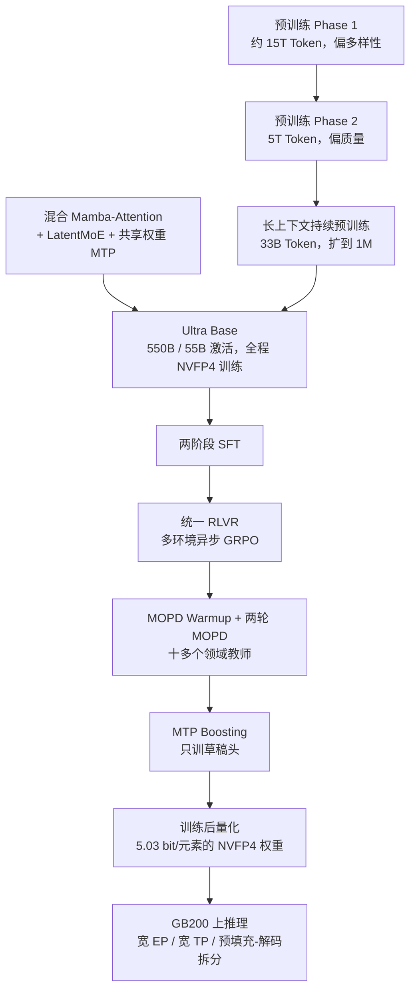
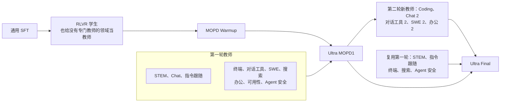
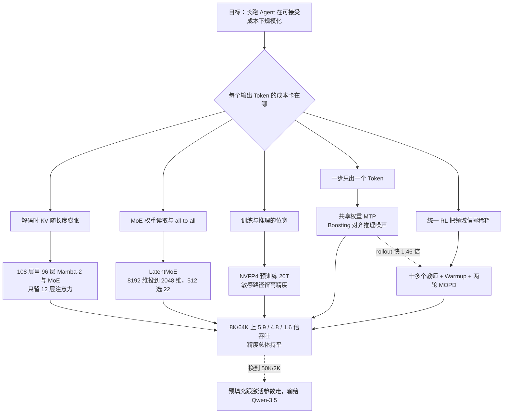

# Nemotron 3 Ultra：长跑 Agent 的账单记在解码上，550B 只激活 55B 去省它

<!-- release-date: 2026-06-04 -->

> 本文依据 NVIDIA 发布的 **Nemotron 3 Ultra: Open, Efficient Mixture-of-Experts Hybrid Mamba-Transformer Model for Agentic Reasoning**，即本地 `papers/NVIDIA/Nemotron-3-Ultra.pdf`（封面日期 2026-6-9，65 页；对应 arXiv:2606.15007v1）。页码均指这份 PDF。文中区分三件事：**报告明确写了什么**、**我们怎么解释或验算它**、**哪些是外部资料补充**。

## 阅读前先认识几个词

- **Token（词元）**：模型读写文本的最小单位。
- **KV Cache（Key-Value Cache，键值缓存）**：注意力层把读过的位置算出的 Key 和 Value 留在显存里，生成下一个 Token 时不必重算。上下文越长，它越大。
- **MoE（Mixture-of-Experts，混合专家）**：把前馈网络拆成很多「专家」小网络，每个 Token 只让其中几个干活。总参数可以很大，单次计算量却不必同比增长。
- **Mamba-2**：一种状态空间模型（SSM，State Space Model）。它不存全部历史，只维护一份**固定大小**的状态，读一个 Token 更新一次。
- **预填充（prefill）与解码（decode）**：预填充是一次性读完输入，算力受限；解码是一个接一个吐 Token，每步都要把权重和缓存读一遍，通常内存带宽受限。

报告里最重要的几个新名字：

- **LatentMoE（潜空间混合专家）**：路由专家不在模型的隐藏维度里算，而是先把 Token 投到更窄的潜空间再分发、计算、收回。
- **MTP（Multi-Token Prediction，多 Token 预测）**：一次前向顺带预测后面几个 Token，推理时当投机解码的草稿。
- **NVFP4**：NVIDIA 的 4 位浮点格式，元素是 E2M1，再配块级缩放。
- **RLVR（Reinforcement Learning with Verifiable Reward，可验证奖励的强化学习）**：奖励来自程序或环境能判对错的信号。
- **MOPD（Multi-teacher On-Policy Distillation，多教师在线策略蒸馏）**：学生自己生成轨迹，多个领域教师在这些轨迹上逐 Token 打分。

## 一句话先说清

Nemotron 3 Ultra 不是「再堆一个更大的模型」的故事，而是**把长跑 Agent 最贵的那一段——长输出的解码——压便宜**的故事。

它有 550B 总参数，每个 Token 激活 55B，在 20T Token 上预训练，上下文扩到 1M（PDF p. 1）。报告的主数字是：在 8K 输入 / 64K 输出的设置上，推理吞吐是 GLM-5.1-754B-A40B 的 **5.9 倍**、Kimi-K2.6-1T-A32B 的 **4.8 倍**、Qwen-3.5-397B-17B 的 **1.6 倍**，精度「大致持平」（PDF p. 1）。

这组倍数来自四处改造叠在一起：

1. **混合 Mamba-Attention**：108 层里只有 12 层是注意力，其余靠固定大小的状态记历史，解码时缓存不随长度膨胀；
2. **LatentMoE**：专家在 2048 维潜空间里算，512 个专家每次点 22 个；
3. **MTP + NVFP4**：一次多吐几个草稿 Token，权重压到 4 位；
4. **SFT → 统一 RLVR → 两轮 MOPD**：后训练专门补 Agent 需要的长程工具使用。

如果只记一句话：

> **先问产品的负载是解码重还是预填充重。Ultra 的每一项设计都押在「解码重」上，押对的地方赢 5.9 倍，押错的地方会输。**

报告自己用一张图把「押错」也画出来了：换到 50K 输入 / 2K 输出的预填充重负载，Ultra 输给 Qwen-3.5（PDF p. 49）。这是全文最值得带走的判断。

## 先看全景：一条从 20T Token 到一张 NVFP4 权重的流水线

这张图按 PDF p. 1 的训练叙述、p. 15 图 9 的后训练流水线与 §4–§5 重画，是流程示意，不含时长。

开源清单在引言末尾（PDF p. 2–3）：

| 类别 | 报告给出的对象 |
|---|---|
| 权重 | Base BF16、后训练 BF16、后训练 NVFP4、做 RLHF 用的 GenRM |
| 新预训练数据 | Code-v3（173B GitHub Token，截至 2025-09-30）、Legal-v1、Specialized-v1.2 |
| 后训练数据 | Nemotron-Posttraining-v3 |
| 训练配方 | [NVIDIA-NeMo/Nemotron](https://github.com/NVIDIA-NeMo/Nemotron) |

## 第一层矛盾：Agent 的账单和聊天不是同一种账

标准 Transformer 每吐一个 Token，都要回头读一遍全部历史的 KV Cache。上下文从几千拉到一百万时，瓶颈从算力变成**内存带宽**。

长跑 Agent 把这件事放大到极致：输入已经很长，输出往往更长。一次终端任务、一次仓库修补、一次带搜索的调研，解码步数动辄上万。报告开篇就说，应用正在从聊天机器人变成能自己写代码、做研究的长程 Agent，「快而省的推理」因此变成一等需求（PDF p. 1）。

所以主对比点选在 8K/64K，不是随便选的：这正是「历史不短、输出很长」的 Agent 负载。

## 核心设计一：混合 Mamba-Attention，108 层里注意力只有 12 层

Ultra 用的是和 Nemotron 3 Super 相同的混合架构，扩到 550B 总参数、每 Token 激活 55B（PDF p. 3）。按图 2 逐块数下来正好 108 层，与表 1 一致；注意力只在中段单元里出现，开头和结尾都是纯 Mamba-2 加 MoE。

三种层的分工，报告在推理一节写得最清楚（PDF p. 48）：

- **Mamba-2**：预填充时代价随序列长度亚二次增长；解码时状态大小固定，缓存占用有上界；
- **稀疏的全局注意力锚点**：需要把任意两个位置精确连起来时才上场；
- **LatentMoE**：用隐藏维度换更多路由专家，推理成本几乎不涨。

一个帮助建模的类比（不是报告原话）：注意力像逐字翻全部会议纪要，Mamba-2 像只维护一份不断改写的摘要。摘要会丢细节，所以要留少量注意力层做「全对全」的精确检索。

关键尺寸（PDF p. 4，表 1）：

| 配置 | Nemotron 3 Ultra |
|---|---:|
| 总层数 | 108 |
| 隐藏维度 $d$ | 8192 |
| 查询头 / KV 头 | 64 / 2 |
| 每头维度 | 128 |
| Mamba 状态维 / 组数 / 头数 / 头维 | 128 / 8 / 256 / 64 |
| 路由专家中间维 | 5120 |
| 共享专家中间维 | 10240 |
| 每层专家数 / 每 Token 激活 | 512 / 22 |
| MoE 潜空间维度 $\ell$ | 2048 |
| MTP 层（共享权重） | 2 |

表里有两件要当场读出来的事：

1. **GQA 压得很狠**。64 个查询头共用 2 个 KV 头，32:1。注意力层本来就只有 12 层，KV 头再压到 2，解码时要搬的注意力缓存进一步变小。
2. **潜空间是隐藏维度的 1/4**。$8192 / 2048 = 4$，这就是下一节 LatentMoE 那笔账的比例。

**收益在基座上就看得到。** 基座评测里最能说明「混合没有把长上下文做坏」的是 RULER：64K 为 95.30，128K 为 92.49，256K 为 86.22，512K 为 84.54，1M 为 76.83（PDF p. 10，表 2）。对照模型在 256K 之后大多没有数，GLM-4.5-Base 在 128K 已经是 0.00。

**代价在预填充上。** Mamba 省的是「每步读多少历史」，省不了「每个 Token 算多少 FLOPs」。后者跟激活参数走，而 Ultra 激活 55B。这一点放到推理一节用图 15 讲。

**可以带走的**：先写出负载的 ISL/OSL（输入与输出长度），再决定把钱花在「减少逐步读缓存」还是「减少每 Token 计算」。

## 核心设计二：LatentMoE，把专家搬进 2048 维

### 旧问题：MoE 在服务时卡的常常不是 FLOPs

标准 MoE 的卖点是「少激活几个专家，用很低的计算换很多参数」。服务阶段却常常不是这样：延迟优先时，每步要把专家权重从 HBM 读出来；吞吐优先时，要把 Token 在 GPU 之间 all-to-all 分发。两条路径的成本都跟**被路由的向量有多宽**成正比。

### 新设计：路由载荷和专家计算进潜空间

Ultra 正文没有重新推导 LatentMoE，只说沿用它，并在推理一节把它概括成「用隐藏维度换更多路由专家」（PDF p. 3、p. 48）。实现数字是 $d = 8192$、$\ell = 2048$、512 个专家、Top-22（PDF p. 4）。

以下机制来自报告引用的 [LatentMoE 项目页](https://research.nvidia.com/labs/nemotron/LatentMoE/)，属**外部补充**：每个 Token 先从 $d$ 投影到 $\ell$；分发、专家计算、合并都在 $\ell$ 维里做；结果再投影回 $d$。路由器仍然看原始隐藏状态，共享专家也留在 $d$ 维。

按 $d / \ell = 4$，all-to-all 通信量和专家权重读取都大约缩小 4 倍，省下的预算拿去把专家变多、Top-$k$ 变大。Ultra 表 1 的共享专家中间维 10240 是路由专家的两倍，与「共享专家不进潜空间」的设定对得上——这是本文按表 1 做的对照，不是 PDF 的推导。

### 代价与边界

多了一对上下投影，且潜空间不能压过任务需要的特征秩。Ultra 没有讨论 $\ell = 2048$ 怎么选，也没有在 550B 上做「标准 MoE vs LatentMoE」的同规模消融；引言只说它带来了「比标准细粒度 MoE 更好的每参数精度」（PDF p. 1）。量化一节从反面给了一条证据：潜空间投影被留在 BF16，因为量化后的精度损失压不过推理收益（PDF p. 43）。

**可以带走的**：瓶颈公式里哪个变量只出现在成本侧，就压哪个。通信跟被路由向量的宽度走，表达力跟专家数和 Top-$k$ 走，于是只压宽度。路由器、共享专家这类「不是带宽大头、但对选择质量敏感」的路径反而留在高维。

## 核心设计三：MTP，一次搬运多带几个草稿

### 旧问题：为一个 Token 要把整份权重读一遍

小 batch 解码几乎总是带宽受限：每步的固定开销是「读一遍权重」，产出只有一个 Token。投机解码的经典做法是另训一个小草稿模型，但那又多一个要维护的模型。

### 新设计：共享权重的 MTP 头，训练全程都在

Ultra 预训练就带两个 MTP 头，每个是一层注意力加一层 MoE，两个头**共享参数**，报告说是为了「稳健的自回归草稿」（PDF p. 3）。损失系数合计 0.1，每个头 0.05（PDF p. 12），SFT 阶段仍保留（PDF p. 15）。推理时同一个头递归滚几步，草稿长度不需要额外参数。

### MTP Boosting：训练时见过的输入，和推理时不一样

这是 Ultra 相对 Super 新增的一步（PDF p. 29–30）。

教师强制训练时，第 2 步 MTP 的输入是上一步 MTP 产出的整段移位隐状态。推理时却不是：第 2 步看到的是主干的 $(h_1,\ldots,h_n)$ 再加上一个 MTP 自己产的状态，越往后混进的 MTP 噪声越多。报告把这叫训练-推理错位（train-inference mismatch），它让深位置的接受率变差（PDF p. 29）。

修法有三条（PDF p. 29–30）：

- 从 MOPD 检查点出发，**冻住主干，只训 MTP 头**，Agent 能力不会被训回去；
- 前向时第 $k$ 步的输入从第 $1,\ldots,k-1$ 步的隐状态里采样，让训练见到推理时那种噪声；
- 损失换成对主干 logits 的温度缩放前向 KL，关掉对金标 Token 的交叉熵，让头去拟合主干的完整分布。

$$\mathcal{L}_{\mathrm{MTP}}(\theta)=\frac{T^{2}}{N_{\mathrm{mtp}}|\mathcal{A}|}\sum_{k=1}^{N_{\mathrm{mtp}}}\sum_{t\in\mathcal{A}}D_{\mathrm{KL}}\bigl(\sigma(z_{t+k}/T)\,\big\|\,\sigma(z^{\mathrm{mtp}_{k}}_{t+k}/T)\bigr)$$

$\mathcal{A}$ 是助手回复的 Token 位置，$\sigma$ 是 softmax，$z$ 是主干 logits，$z^{\mathrm{mtp}_k}$ 是第 $k$ 步草稿的 logits；$T = 2$，$N_{\mathrm{mtp}} = 7$（PDF p. 30）。数据是 MOPD 检查点在通用与 Agent 种子提示上以温度 1 采的 rollout，训 12K 步、全局 batch 64、序列截到 8K（PDF p. 30）。

### 收益：训练、推理两头都用上

- **接受长度**：SPEED-Bench 质量划分、草稿长度 7 上，平均接受长度从 4.387 升到 4.584（温度 1 采样时 4.165 → 4.331），与 Qwen3.5-397B-A17B 的 4.580 持平，远高于 DeepSeek-V4-Flash 的 2.667；对应的投机解码加速提升从摘要任务的 3.15% 到代码任务的 5.82%（PDF p. 30，表 6）。
- **RL rollout**：扫 $k \in \{0, 3, 5, 7\}$，$k = 5$ 时每步 rollout 生成时间快 1.46 倍，收益集中在最慢的长尾轨迹上（PDF p. 32，图 12）。原因是长轨迹 Token 多，而且它们在 batch 末尾、并发降下来时才跑，投机解码这时最划算。
- **单用户推理**：ISL/OSL/BS = 10K/16K/1、单节点 GB200、TP=4 上扫草稿长度，DL=6 时峰值，相对无 MTP 快 **2.89 倍**，再长则验证开销超过边际接受收益而回落（PDF p. 50，图 16）。

混合模型还多一个纯注意力没有的问题：草稿被拒要回滚，但 Mamba 的状态每步覆盖写，回不到更早的 Token。Ultra 的做法是**每一步草稿都给 SSM 状态拍快照**；同一机制放粗到每隔固定 Token 拍一次，就给 Mamba 带来了跨请求的前缀缓存（PDF p. 48）。

### 代价与边界

- 大 batch 时每步被计算主导，验证开销会吃掉吞吐，这时要缩短草稿甚至关掉 MTP。草稿长度被做成部署时的旋钮（PDF p. 48）。
- Boosting 只改头不改主干，提高的是接受长度，不是 Agent 精度。
- 辅助头不是「加了就免费」：第一次预训练发散就出在 MTP 上，见后文稳定性一节。

**可以带走的**：任何「训练用教师强制、推理用自回归」的附加头，都要按推理时的输入噪声来训。Ultra 的修法很便宜——冻主干、只训头、把输入改成从历史草稿状态里采样。

## 核心设计四：NVFP4 预训练，20T Token 主要在 4 位上跑

### 旧问题：4 位能不能从「跑几百 B Token」变成「跑 20T」

把预训练从 BF16 或 FP8 压到 FP4，省的是通信、存储和矩阵乘吞吐。风险是量化噪声在万亿 Token 尺度上累积，loss 悄悄漂走或直接发散。报告称这是迄今最大规模、稳定且准确的 NVFP4 训练演示（PDF p. 4）。

### 新设计：主体走 NVFP4，敏感路径留高精度

配方与 Super 相同（PDF p. 3）：元素 E2M1，权重做二维块量化，wgrad 的输入做随机 Hadamard 变换，梯度做随机舍入；矩阵乘走 Transformer Engine 开源的 cuBLAS NVFP4 GEMM，覆盖 fprop、dgrad、wgrad。以下路径留在更高精度（PDF p. 3–4）：网络最后 15%（16 层）、Mamba 输出投影、潜空间投影、QKV 与注意力投影、MTP 层、嵌入层。

### 证据：切回 BF16 的旁路实验

他们从 5T、10T、16T 检查点把所有张量切回 BF16，各续训 74B Token，比较训练 loss 的相对差（PDF p. 4，图 3）：

| 分叉点 | 开头 5B Token 的平均 gap | 74B Token 后的 gap |
|---|---:|---:|
| 5T | 0.27% | 0.33% |
| 10T | 0.28% | 0.34% |
| 16T | 0.25% | 0.03% |

平均低于 0.4%，比他们在更小模型上见过的 NVFP4–BF16 gap 还小（PDF p. 4）。图 3 下半幅更关键：从 16T 切回 BF16 **没有修好**第二次发散（PDF p. 5），所以那次发散不能归咎于 4 位格式。

边界：0.4% 以下的 loss gap 是代理指标，不是端到端精度等价的证明；报告也没有给「全程 BF16 训 550B」的墙钟或能耗对照。

**可以带走的**：低精度先保护「每个 Token 都经过、没有稀疏性挡着」的路径——输出层、嵌入、注意力投影、潜空间投影。它们对格式更敏感，又不是计算大头。Ultra 在训练后量化时又做了几乎相同的选择。

## 数据与训练：先多样性，再质量，再加 33B 的 1M 上下文

### 两阶段课程

学习率是 Warmup-Stable-Decay（WSD），总视野 20T Token：前 200B warmup 到 $2.5\times 10^{-4}$，最后 5T 按 minus-sqrt 衰减到 $2.5\times 10^{-6}$（PDF p. 8–9）。数据在约 15T（约 75%）处从偏多样性的 Phase 1 切到偏质量的 Phase 2（PDF p. 8）。两阶段配比读自图 4（PDF p. 9）：

| 类别 | Phase 1 | Phase 2 |
|---|---:|---:|
| syn-crawl-high | 22.4% | 22.4% |
| syn-crawl-medium | 10.3% | 3.8% |
| crawl-high / crawl-medium-high | 6.5% / 5.7% | 6.5% / 5.7% |
| crawl-medium | 4.3% | — |
| finepdfs | unfiltered 4.9% | high 10.7% + medium 2.5% |
| code / nemotron-cc-code | 14.0% / 2.1% | 14.0% / 2.1% |
| math | 6.4% | 6.4% |
| sft-stem / sft-code / sft-general | 9.2% / 3.9% / 1.6% | 9.2% / 3.9% / 4.0% |
| multilingual | 5.0% | 5.0% |
| academic / wiki / crawl++ | 1.6% / 0.6% / 1.4% | 1.6% / 0.6% / 1.4% |
| legal | — | 0.1% |

高质量过滤与合成网页是最大头，Phase 1 约 49%、Phase 2 约 38%（PDF p. 8）。对着表看切换发生了什么：砍掉的是 crawl-medium 和大半 syn-crawl-medium，加进来的是过滤后的 finepdfs、更多 sft-general 和一点法律数据。多语覆盖 11 种语言，Crawl++ 是 OpenWebText、BigScience、Reddit（PDF p. 8）。

超参其余与 Super 相同，MTP 损失系数 0.1（PDF p. 9）。预训练中用离线检查点合并做评测，滑窗 500B、间隔 25B；最终从多种合并设置里选了一个 500B 窗口、知识/数学/代码较均衡的版本送进长上下文阶段（PDF p. 9）。

### 新加的数据，消融都跑在小模型上

§2.3 只讲自 Super 以来新加并公开的数据（PDF p. 4–8）：

| 数据集 | 报告写了什么 | 消融证据 |
|---|---|---|
| Code-v3 | GitHub 新切 173B Token，截至 2025-09-30 | 无单独消融 |
| Multiple-Choice / Generative | 用公开 benchmark 的训练集当种子合成问答，不用测试集 | 某家族基座检查点上 100B Token 的 phase-3 续训：MMLU-Pro 64.8 → 66.6，代码均分 73.2 → 75.1，常识 72.9 → 74.5，GPQA 30.8 → 41.9，数学 87.6 → 87.9（PDF p. 6） |
| Fact-Seeking | 从 Finewiki 抽事实，再让 Qwen3-30B-A3B 出题 | Nano 中间检查点最后 100B 注入，SimpleQA 代理分 40.24 → 50.16；题目改成了选择题，不能与原版比（PDF p. 6） |
| Moral-Scenarios | 已有道德情景题的思维链版 | 无 |
| Legal | 法规、判例、合同、服务条款等的抽取、清洗与合成 | 从 Nano 14.9T 检查点续训 100B，LegalBench 均分 64.6 → 74.7（PDF p. 8） |

这些消融都在 Nano 或更小的检查点上，是「值得加进配比」的存在性证据，不是 550B 上的收益。

### 长上下文：92% 的迭代在 1M，8% 回到 4K

预训练末尾有一段持续预训练（PDF p. 9）：恒定学习率 $2.5\times 10^{-6}$；上下文并行 32、张量并行 8、专家并行 128、流水线并行 2，跑在 GB200 上；46% 长上下文数据 + 54% Phase 2 数据；**配比里没有任何 RULER 风格数据**。

92% 的迭代在 1,048,576 Token 上训，8% 在 4,096 上训，同一次迭代不混长度，每次迭代 25,165,824 个 Token。4K 迭代只放数学与代码的 SFT 风格数据，报告说这样最能保住短基准。整段共 33B Token（PDF p. 9）。

**可以带走的**：长上下文阶段不要只喂长数据；以及，RULER 可以很高，训练里却完全没有 RULER 形态的数据——想测真实长程能力，就别在训练里刷测试形态。

## 预训练稳定性：第一次查清了，第二次没有

两次发散的共同特征是训练交叉熵与 wgrad 的 L2 范数同时上升（PDF p. 11–12，图 5）。

**第一次，约 8T。** 为了让数据并行的梯度归约在线上走 BF16，他们把输出层的本地梯度累加从 FP32 降到了 BF16。两个 MTP 头的损失各乘 0.05，它们对共享输出层的 wgrad 贡献在 BF16 只有 7 位尾数的情况下几乎全丢。图 6 显示 MTP-2 的损失先于主损失开始尖刺。回滚到更早的检查点、恢复 FP32 梯度归约后恢复稳定（PDF p. 12）。

**第二次，约 16T。** 消融发现：回滚到 15T 并立即开始退火（试了 5T 和 10T 两种衰减视野）可以避免发散（PDF p. 12，图 7）。他们据此做了一个工程决定：把总视野砍到 20T。对着图 5 看，Phase 2 数据的切换点和这次退火起点都落在约 15T。

第二次没有找到根因，报告记下两个「相关、不因果」的现象（PDF p. 13–14）：

1. **专家不平衡与死专家。** 用 MaxVio 度量峰值负载相对均匀均值的偏离：

$$\mathrm{MaxVio}=\frac{\max_{1\le i\le E}T_i}{\mu}$$

$T_i$ 是路由到第 $i$ 个专家的 Token 数，$\mu$ 是均值，理论上限是 $E/k$，Ultra 与 Super 为 $512/22 = 23.27$。每个检查点取 20 个 iteration、共 500M Token 计算。Ultra 开始时各层中位数 1.2、最大 4.8（第一个 MoE 层）；到 12T，中位数仍约 1.2，最大值涨到约 12，还是第一层（PDF p. 14）。

2. **残差流范数在深度上差了 4 个数量级**（Super 是 3 个）。Nano 与 Super 的早期层范数先升后降再稳住；Ultra 的早期层从约 7.5T 开始抬头，11T 附近剧烈尖刺，作者读作信号传播变差（PDF p. 14，图 8）。

**可以带走的**：

- 辅助损失一旦与主干共享一块矩阵，这块矩阵的累加精度要按**最小的那个损失系数**来配，而不是按主损失。0.05 乘上 BF16 的量化步长，梯度可以直接下溢成 0。
- MaxVio 和残差范数不必等 loss 爆了才看。中位数一路平静时，最大值已经在第一层爬到 12，只看平均会漏掉。

## 后训练：统一 RL 不够，把十多个教师蒸馏回学生

后训练是 Ultra 相对 Super「大幅重设计」的部分：在连续的 RL 阶段之外加入 MOPD（PDF p. 15）。

### SFT：两阶段，数据按能力拼

| | Stage 1 | Stage 2 |
|---|---|---|
| 打包长度 | 294,912 | 515,000（补入最长 512K 的长上下文数据） |
| 全局 batch / 样本数 | 64 / 204,800 | 64 / 19,200 |
| 峰值 / 最小学习率 | $1.5\times 10^{-5}$ / $1\times 10^{-6}$ | $1\times 10^{-5}$ / $2\times 10^{-6}$ |
| warmup 样本 | 9,600 | 6,400 |

两阶段都保留共享权重 MTP 目标，系数 0.1（PDF p. 15）。打包用长度感知的 best-fit：不截断、不拆对话、包内去重，源文件轮询读入后再整体打乱。报告强调彻底混匀是大规模训练稳定的前提（PDF p. 19–20）。

数据覆盖长上下文、推理效率与控制、安全、搜索、终端、对话工具、软件缺陷修复、数学与证明、科学、聊天、竞赛代码、CUDA、RTL、多语言（PDF p. 15–19）。几个值得记住的量：

- 安全：Super 的 45K 英文数据翻成德、西、法、日、意、中六种语言，回译语义相似度低于 0.8 的丢掉，每种语言约丢 10%–15%，最终约 135K（PDF p. 16）；
- 搜索：保留 Super 的 Wikidata 多跳轨迹，另从 OpenResearcher 取出商业许可可用的约 21.7K 条（PDF p. 16）；
- 终端：约 370K 条多轮对话，DeepSeek-V3.2 在 Harbor 的 Terminus-2 里当执行 Agent（PDF p. 17）；
- 数学：180 万条工具调用 + 190 万条非工具（PDF p. 18）；
- 竞赛代码：120 万 Python 推理、100 万 C++14 推理、130 万 Python 工具调用（PDF p. 18）；
- CUDA 约 10 万条，RTL（ACE-RTL）约 120 万条（PDF p. 18–19）。

软件缺陷修复的轨迹过滤写得最具体（PDF p. 17）：必须以合法提交结束；禁用 push、pull、fetch、clone 等 git 操作；剔除「改-测-改」死循环和只读不改；检查畸形工具调用和最终补丁里的 `print(`、`pdb`、`breakpoint()`；改了代码却从不跑测试的也丢掉。报告直说：原始 rollout 里很多行为「任务完成了，但不该让模型学」。

推理预算控制也在这里埋下：一类样本的思考过程被截到随机预算、答案不变，相对 Nano 与 Super 的改动是截断样本里的 `</think>` **不计入 SFT 损失**（PDF p. 16）。

### RLVR：一个阶段覆盖所有环境

目标覆盖终端、办公、软件工程、搜索、通用工具调用、数学、代码、STEM、安全、聊天、指令跟随、长上下文问答、归纳与转导推理、结构化输出和可用性；有脚手架的环境会换多种实现与交互格式，避免对单一脚手架过拟合（PDF p. 20）。算法大体是 Super 的异步 GRPO 加稳定性修补；全局 batch 8192，每条 16 个 rollout；生成长度从 48K 起步，后来提到 64K（PDF p. 20）。

### 为什么还要 MOPD

环境一多，每个领域在一个 batch 里只剩几条样本，领域信号被稀释，也越来越难平衡（PDF p. 20）。Ultra 的回答是另训十多个领域教师，每个走自己的数据与流水线，再让学生在所有领域上生成轨迹、由对应教师给稠密监督。

完全在线时，目标是让学生在自己走到的每个前缀上贴近教师，即最大化负反向 KL（PDF p. 21，式 1）：

$$\mathcal{J}_{\mathrm{MOPD}}(\theta)=\sum_{i=1}^{N}\lambda_i\,\mathbb{E}_{q\sim\mathcal{D}_i,\,y\sim\pi_\theta(\cdot|q)}\Biggl[\sum_{t=1}^{H}\log\pi^{T_i}(y_t|s_t)-\log\pi_\theta(y_t|s_t)\Biggr]$$

$\pi_\theta$ 是学生，$\pi^{T_i}$ 是第 $i$ 个领域的教师，$s_t$ 是学生自己生成到第 $t$ 步的前缀，$\lambda_i$ 是领域权重。和稀疏、依赖环境的 RLVR 奖励不同，这里**每个 Token 都有信号**。

实际实现是异步的：rollout、教师打分、学习者三条流水线并行，轨迹可能来自过期的行为策略。他们把行为策略与作为信任域中心的近端策略拆开，稠密优势取 $\hat A_t = \mathrm{sg}[\ell^{T_i}_t - \ell^{\mathrm{prox}}_t]$（教师与近端策略在采样 Token 上的对数概率之差，sg 是停梯度），再配 PPO 式裁剪与 IcePop 的 Token 掩码（PDF p. 21–22，式 2–3）。最大生成长度 192K，每 batch 1024 条 prompt、每条 1 个 rollout；消融里多 rollout 没有额外好处（PDF p. 22）。

两轮的教师安排（PDF p. 21，图 10）：

### 每个教师各治一种失败

§3.3.2 不是一张超参表，而是「每个教师针对哪种失败」（PDF p. 22–26）：

- **SWE**：先 Agent 数据 SFT，再用 PivotRL 做单步环境，最后端到端 SWE-RL（隐藏测试给二元奖励，走 GRPO）。打满轮数或超时的轨迹掩掉损失，畸形推理与工具调用给负优势。为防读金补丁作弊，开跑前把容器里的仓库改写成「停在 base commit 的新鲜 clone」，未来提交物理删除；运行时拦截远程 git 和从 GitHub 网页、raw、Pages 下载。生成长度 192K，最多 200 轮（PDF p. 22）。
- **办公**：面向 GDPval 这类要交付表格、文档、音频等成品的任务。从通用 SFT 后的 Ultra 出发，用强模型在 AfterQuery 任务上的完整轨迹做轻量 SFT，再在 MOPD 里用这些轨迹的 pivot 蒸馏（PDF p. 22–23）。
- **搜索**：Super 没学过上下文管理。Ultra 的搜索教师在轨迹里加入「超预算就全部丢弃重来」与摘要压缩，主要用前者，让模型能搜得比官方上下文长度更久（PDF p. 23）。
- **终端**：针对最长一小时的任务，用 PivotRL 迭代，准确率饱和就重新做难度画像（PDF p. 23）。
- **对话工具**：在 Super 配方上扩到有依赖的多步动作，抑制对话 Agent 过早结束（PDF p. 23）。
- **可用性**：从结构化 schema 扩到文档抽取、引用格式、自由文本格式，schema 覆盖 JSON、YAML、XML、TOML、CSV（PDF p. 23）。
- **Agent 安全**：针对间接提示注入。用户请求是良性的，读工具返回的内容里藏着让模型调用另一个写工具的攻击；四类攻击是未授权动作、改数据、拒绝服务、数据外泄。攻击由 Super 对着 Nano 自动迭代改写，只留打穿了的。验证器只看「有没有带着目标参数调用攻击指定的工具」（PDF p. 24）。
- **Chat**：策略模型一大就会钻奖励模型的空子，于是在 Ultra SFT 上训了更大的 GenRM，给两个回复分别打分并排序；有用户原则时按原则判，没有时按通用有用性。RLHF 只用总分。带原则的 GenRM 让多轮迭代不必每次重训奖励模型（PDF p. 24）。这个 GenRM 就是开源清单里那份权重。
- **指令跟随与事实性**：在 RLVR 检查点上继续做领域 RLVR，混合指令跟随、弃答与 RLHF 环境；弃答奖励在训练中动态校准，在准确率与减少幻觉之间找平衡（PDF p. 24–25）。
- **STEM（通识推理）**：在学生上再做 SFT 与 RL。SFT 按 Token 而不是条数配比：40B 生成 Token 里科学 58.75%、数学 23.63%、竞赛代码 10.13%、通用 7.50%（PDF p. 26），数据主要由 DeepSeek-V4-Pro 生成（PDF p. 25–26）。RL 阶段故意转向人文与社会学，结果**所有领域都涨**（PDF p. 26）——这是作者观察，没有「只做 STEM RL」的对照。
- **竞赛代码**：在通识推理教师上再做一轮 RL，只留该教师 8 次 rollout 没有全对的 3.5K 题，LiveCodeBench v6 再 +2.4（PDF p. 26）。

通识推理教师与 DeepSeek V4 Pro (High) 的对比（PDF p. 25，表 3，报告说一分以内视为噪声）：

| 基准 | DeepSeek V4 Pro (High) | 学生 | 通识推理教师 |
|---|---:|---:|---:|
| HLE（无工具） | 34.5 | 25.6 | 32.1 |
| GPQA | 89.1 | 85.0 | 88.5 |
| MMLU-Pro | 87.1 | 85.7 | 87.7 |
| LiveCodeBench v6 | 89.8 | 87.4 | 90.0 |
| IMOAnswerBench | 88.0 | 84.5 | 92.5 |
| Apex Shortlist | 85.5 | 68.9 | 85.4 |

### Warmup：学生采样不到教师擅长的轨迹，蒸馏就落空

关键发现：用差异很大的流水线训出来的教师，直接 MOPD 合并效果不好（PDF p. 27）。作者的假设是：师生的 SFT 数据不同，学生生成的轨迹对教师来说是分布外，教师给的监督因此不可靠。教师和学生是并行开发的，这个问题一定会发生。

解法是 MOPD 前做一次**很轻的 SFT**，数据取自教师的训练分布，让学生的轨迹落进教师的支持范围。规模故意做小，无关领域的小幅退步留给后面的 MOPD 捞回（PDF p. 27）。

| 基准 | 学生 | 有 Warmup | 无 Warmup | 教师 |
|---|---:|---:|---:|---:|
| GDPVal | 28.9 | 46.7 | 35.3 | 49.5 |
| BrowseComp | 31.0 | 44.4 | 33.0 | 51.0 |
| HLE（无工具） | 25.6 | 26.7 | 26.3 | 32.1 |

（PDF p. 27，表 4）Agent 域上，Warmup 几乎决定了蒸馏是否有效；HLE 上可有可无。

### 结果：Agent 域回收率高，自包含推理回收率低

回收率定义为 $(\mathrm{MOPD2}-\mathrm{RLVR})/(\mathrm{Teacher}-\mathrm{RLVR})$，即 MOPD 补上了师生差距的几成（PDF p. 27–28，表 5）：

| 基准 | SFT | RLVR | MOPD1 | MOPD2 | 教师 | 回收率 |
|---|---:|---:|---:|---:|---:|---:|
| Terminal Bench 2.0 | 34.5 | 44.5 | 50.8 | 54.0 | 50.0 | 172.7% |
| GDPVal | 23.2 | 28.9 | 46.7 | 46.7 | 49.5 | 86.4% |
| SWE-Bench Verified | 63.5 | 65.8 | 70.1 | 71.7 | 72.5 | 88.1% |
| TauBench Telecom | 55.7 | 82.7 | 91.2 | 92.9 | 94.0 | 90.3% |
| BrowseComp | 14.3 | 31.0 | 41.0 | 44.4 | 51.0 | 67.0% |
| LiveCodeBench v6 | 85.5 | 87.4 | 90.0 | 89.0 | 92.4 | 32.0% |
| IMOAnswerBench（无工具） | 85.1 | 84.5 | 88.1 | 88.6 | 92.5 | 51.3% |
| HLE（无工具） | 19.7 | 25.6 | 25.9 | 26.7 | 32.1 | 16.9% |
| OmniScience 非幻觉率 | 4.8 | 46.3 | 77.9 | 78.7 | 87.0 | 79.6% |
| IFBench（prompt loose） | 62.3 | 78.4 | 80.0 | 81.7 | 83.0 | 71.7% |
| Multi-Challenge | 53.3 | 60.3 | 62.8 | 63.8 | 63.3 | 116.7% |

分三层读：

- **报告有表支持的**：在学生已经能采样到的轨迹上，MOPD 能把教师的 Token 级偏好合回来。工具选择、环境交互、弃答、多步执行这类模式回收率高，有的甚至超过对应教师（Terminal Bench 172.7%、Multi-Challenge 116.7%）。作者举例说 MOPD2 在 Terminal Bench 的数据科学题上明显强于教师，推测来自办公流程的迁移（PDF p. 28）。
- **作者的解释**：HLE 只回收 16.9%，是在线蒸馏设定的限制而非教师不行。通识推理教师的增益来自 DeepSeek-V4-Pro 生成的另一套推理数据上的大规模 SFT+RL，学生没见过这些数据；教师的优势不是「对学生已有轨迹的不同偏好」，MOPD 最擅长的那种信号用不上（PDF p. 28）。这与 Warmup 在 HLE 上无效互相印证。
- **试过但没成、或没来得及做的**（PDF p. 28–29）：用 top-$k$ 或全词表的分布匹配代替采样 Token 目标，在 Terminal Bench 等 Agent 基准上反而更差；「先统一 SFT 再分教师」「教师先产 SFT 数据再训学生」两条更干净的奠基路径没有系统比较；端到端长程 Agent 与单轮推理混在一个 MOPD batch 里会因 rollout 时长悬殊而浪费算力，所以多数 Agent 任务实际用的是类似 PivotRL 的单轮 rollout。

**可以带走的**：蒸馏信号的质量取决于学生轨迹是否落在教师的支持里。教师更强不等于学生能学到；对「能力来自另一份离线数据」的教师，该给学生的是那份数据，而不是再加一轮在线蒸馏。

## 推理预算控制：三种模式，换的是 Token 不是结构

Ultra 训了三种推理模式：关思考、常规、中等努力；后两种还能叠加推理时的预算截断（PDF p. 31）。中等努力在 SFT 引入、RLVR 再优化：约 2.5% 的 RLVR prompt 走中等努力，覆盖数学、STEM、代码，奖励按长度调整；效果泛化到训练没覆盖的任务，最终档位靠超参校准（PDF p. 31）。

图 11 纵轴是 Artificial Analysis Intelligence Index V4，横轴是以 Qwen 3.5 397B 的平均 Token 数为 1 的相对啰嗦度。下表是读图得到的近似坐标（PDF p. 31）：

| 模型 | 相对 Token 数 | AA Index V4 |
|---|---:|---:|
| Kimi-K2.6 | 约 1.69 | 约 53.6 |
| GLM-5.1 | 约 1.32 | 约 51.8 |
| GLM-5 | 约 1.07 | 约 50.4 |
| **Ultra（常规）** | 约 1.06 | 约 49.9 |
| MiniMax-M2.7 | 约 0.95 | 约 49.7 |
| Qwen3.5-397B | 1.00 | 约 44.7 |
| **Ultra（中等努力）** | 约 0.37 | 约 42.8 |
| Super | 约 1.37 | 约 36.6 |

报告的结论是中等努力平均少用约 2.5 倍 Token，准确率掉约 7%（PDF p. 31）。按图上坐标，两点的横坐标之比接近 2.9，纵坐标差约 7 个指数点（相对降幅约 14%），所以「7%」更像是指数点而非相对百分比——这是本文读图的判断，报告没有给逐点数值。另外，这是多模型散点，不是 Ultra 自己的受控曲线；换掉 Qwen 这个分母，相对位置都会变。

**可以带走的**：思考长度应当是推理时的旋钮，而且训练里必须见过「被打断」的样子。Ultra 把截断样本放进 SFT，并且不让 `</think>` 成为截断样本的监督目标，避免模型学成「看到结束标记就当思考已完整」。

## 量化：一张 NVFP4 权重，Blackwell 走 W4A4，Hopper 走 W4A16

后训练之后做训练后量化（PTQ，Post-Training Quantization）。起点是 Super 上的敏感度分析得出的逐层混合精度，再扫平均位宽与 FP4 权重量化算法（PDF p. 41）。最终逐算子精度（PDF p. 41，表 12）：

| 层 / 算子 | BF16 基线 | 量化后 |
|---|---|---|
| 嵌入、输出层、MTP | BF16 | BF16 |
| MoE 路由专家 | BF16 | NVFP4 |
| MoE 共享专家 | BF16 | FP8 per-tensor |
| Mamba mixer 线性层 | BF16 | FP8 per-tensor |
| 注意力线性层 | BF16 | BF16 |
| LatentMoE 投影 | BF16 | BF16 |
| Mamba conv1d | BF16 | BF16 |
| KV cache | BF16 | FP8 |
| Mamba SSM cache | FP32 | FP16 + 随机舍入 |

### 位宽：唯一有分辨力的是长上下文

表 13 在一个固定中间检查点上扫 4.85 到 7.19 bit/元素（BPE，bits per element）。SciCode、GPQA Diamond、HLE、IFBench、AA-Omniscience 在整个区间都在噪声内持平；只有 AA-LCR 在 4.85 → 5.03 这一步从 62.25 升到 64.69，之后到 7.19 都停在 64.2–65.0。这一步恰好是「在纯 NVFP4 上引入混合 FP8 层」，所以长上下文的恢复归功于那几层高精度，而不是整体多给的 bit。再加 43% 的 bit 到 7.19 没有任何基准再涨，于是选 5.03（PDF p. 41–42）。

报告自己标了两个读表注意（PDF p. 42）：CritPt 在 3%–5% 的地板附近且不单调，当作噪声；AA-Omniscience 的非幻觉率在 4.85 上略高（54.13 对 51.59），归为方差。

### 权重尺度：Four-Over-Six 赢在 5.03，输在 4.85

激活沿用 NVFP4 默认的 max 校准，权重试了 max、MSE、Four-Over-Six（PDF p. 42–43）。Four-Over-Six 把全局权重尺度放大 1.75 倍，每个微块在 $M=4$ 与 $M=6$ 两套 FP4 网格里选重建误差更小的。在 48 个 MoE 层、49,152 个路由专家投影上，它把中位相对 MSE 比标准 max 降了 16.4%；MSE 校准能再降 27.1%，但下游没有稳定涨分（PDF p. 43）。

| 位宽配置 | max | MSE | Four-Over-Six |
|---|---:|---:|---:|
| 5.43（只有路由专家 NVFP4） | 97.44 | 98.27 | — |
| 5.03（路由专家 NVFP4 + 混合 FP8） | 96.78 | 98.40 | **98.50** |
| 4.85（专家与 Mamba 都 NVFP4） | **98.32** | 97.57 | 84.71 |

（PDF p. 43，表 14，数值是 6 个 AA 基准相对 BF16 的中位恢复率。）作者推测 Mamba 线性层对离群值敏感，更适合 max 尺度，所以激进配置下 Four-Over-Six 崩了。

### 为什么一张权重伺候两代 GPU

Hopper 没有原生 FP4 Tensor Core，直觉上该出一个 FP8（W8A8）版本。Ultra 的规模把这笔账翻了过来（PDF p. 44–46）：

- BF16 模型约 1.1 TB，单节点塞不下（PDF p. 44）；
- 8×H100 共 640 GiB。FP8 权重约 540 GiB，每卡只剩约 10 GiB 给激活、KV 与 Mamba 状态；NVFP4 约 330 GiB，每卡剩约 40 GiB；
- FP8 的缓存预算把 batch 卡死，负载始终停在带宽受限区，走不到 FP8 Tensor Core 有意义的计算受限区；实测吞吐-延迟曲线上 W4A16 处处不低于 W8A8；
- 加上 MTP 差距更大：4 位省下的空间让 MTP 权重也能放进单个 8 卡节点；FP8 要带 MTP 就得扩到两台 H100，丢掉单 NVLink 域。

W4A8 看上去两头占，但 NVFP4 的 E2M1 元素配 E4M3 块尺度，等效 E6M4，范围超过 FP8 的 E4M3，直接转会饱和崩精度；要保精度就得 W4 → BF16 → FP8 绕一圈、每个 GEMM 前多一次转换。既然 W8A8 已经慢于 W4A16，W4A8 只会更差（PDF p. 46）。

同一张权重当 W4A16 与 W4A4 跑（PDF p. 47，表 17）：W4A16 在五个任务里四个优于 W4A4，四个在 BF16 一分以内或更高（例外都是 HLE）。最终 BF16 对 NVFP4 的大表（PDF p. 47，表 18）里，Agent 项大多差 1–3 分：Terminal Bench 2.1 56.4 → 53.9，BrowseComp 44.4 → 41.4，RULER 1M 94.7 → 94.0；GDPVal、IFBench、GPQA 等几项 NVFP4 反而略高。注意两列用的引擎版本不同（BF16 用 vLLM 0.17.1，NVFP4 用 0.22.0），细差不宜过度解读。

量化工具链的一个工程数字：550B 用 HuggingFace transformers 逐层 PTQ 约 2 小时（4×B300、CPU offload），用 Megatron-LM 约 45 分钟（16×B300，EP = DP = 16）（PDF p. 44，表 15；正文写成 42 分钟，与表不一致）。

### Mamba 缓存：短序列上它比 KV 还大

| 上下文长度 | FP8 KV cache | Mamba 状态 8 位 / 16 位 / 32 位 |
|---|---:|---|
| 1K | 6 MB | 96 / 192 / 384 MB（与长度无关） |
| 16K | 约 96 MB | 与 8 位 Mamba 状态持平 |
| 32K | 约 192 MB | 与 16 位持平 |
| 64K | 约 384 MB | 与 32 位持平 |
| 128K | 768 MB | — |

（batch = 1，读自 PDF p. 45 图 14。）所以序列短于 64K 时，32 位的 Mamba 状态比 FP8 KV 还大，既占显存又在解码时压着 DRAM 读带宽（PDF p. 44）。他们先把状态从 FP32 收到 FP16 + 随机舍入，这是当前发布版的做法（PDF p. 46）。更激进的 8 位方案只在 **Super 上做了仿真**（PDF p. 45，表 16）：朴素 FP16 最近舍入会让准确率掉 1.07%、啰嗦度涨 9.98%，随机舍入几乎抹平；块缩放 INT8 + 随机舍入大体保住 FP32 水平；FP8 E4M3 更差。每隔 $CC$ 步才存一次状态、中间靠缓存的输入激活重放，能进一步减少连续量化次数。优化过的 8 位内核还在开发。

**可以带走的**：量化预算要扫的是「哪一类任务还在涨」，而不是平均 bit 数；在 HBM 刚够放下 FP8 权重的节点上，更窄的权重可能比「理论算得更快」的 FP8 更能把 batch 做上去；NVFP4 不是 FP8 的子集，不能直接转。

## 推理：5.9 倍从哪来，在哪会吐回去

| 负载（ISL/OSL） | Ultra | GLM-5.1 | Kimi-K2.6 | Qwen-3.5 |
|---|---:|---:|---:|---:|
| 8K/64K（解码重） | **5.9** | 1.0 | 1.2 | 3.7 |
| 50K/2K（预填充重） | 3.9 | 1.0 | 0.9 | **4.6** |

（相对 GLM-5.1 归一的每卡输出吞吐，NVFP4、GB200 NVL72、最大吞吐点、关闭投机解码，读自 PDF p. 49 图 15。）

报告把两行的原因写死了（PDF p. 48）：

- **预填充是计算受限**，每 Token 代价跟 FLOPs 走，FLOPs 由激活参数定。Ultra 激活 55B、Qwen-3.5 激活 17B，大约 3.2 倍 FLOPs 惩罚，所以 Ultra 在预填充重的负载上落后。
- **大 batch 解码**时几乎所有专家都会被点到，每步代价改跟**总权重读取**走，550B 对 397B 只差约 1.39 倍。MoE 这边的劣势一小，序列混合方式就成了决定因素：Mamba-2 每步代价不随长度增长，Ultra 于是反超。

首页那张图 1 的吞吐口径还有两处要留意（PDF p. 2）：Ultra 用 TensorRT-LLM、对照用 vLLM；各模型分别开或关投机解码、取各自最好的数。5.9 倍支持的是这个测量协议，不是任意框架上的端到端延迟。同一件事在全文有三种说法：摘要「最高约 6 倍」（PDF p. 1），引言与图 1 的 5.9 倍（PDF p. 1–2），结论「5 倍」（PDF p. 51）。

### 超大规模服务要处理的几件事

- **并行轴随 batch 换**：小 batch 被权重读取带宽卡住，宽张量并行把每步 HBM 流量除以 TP 倍数，单条隐状态的 NVLink AllReduce 可以忽略；大 batch 变成激活通信受限，专家并行胜出——卡间只剩路由专家两端的 all-to-all，注意力、Mamba、专家 GEMM 都在本卡。实践选择是高吞吐用宽 EP、低延迟用宽 TP，部分低延迟点上 TP + EP 再给注意力和 Mamba 加 DP 更好（PDF p. 49）。
- **宽 EP 必须均衡**：all-to-all 是同步的，一个 rank 空转就卡住整组，所以请求打到最空的 worker，热点专家跨 rank 复制（EPLB）。GB200 NVL72 的 72 卡在一个 NVLink 域里，宽 EP 不必付跨域互联的代价（PDF p. 49）。
- **预填充-解码拆分要同时搬 KV 和 SSM 状态**：他们把识别混合缓存组的 KV 事件元数据、多节点 Ray 所需的 NIXL 修复合进了上游，vLLM 上混合模型的拆分可以开箱即用；目前在预填充重负载上端到端提升约 10%（PDF p. 50）。
- **all-to-all 后端**：在 50K/2K 上路由 all-to-all 约占运行时间 15%–20%。vLLM 默认用 AllGather + ReduceScatter，每个 rank 拿到全部 Token；换成 FlashInfer 的 NVLinkOneSided 端到端约 +5%（PDF p. 50）。
- **MoE 侧再切块**：预填充切块变大后，注意力与 Mamba 按 DP 分请求，路由专家内核却要处理所有 DP rank 的 Token 并集，撞上内核资源上限；修法是在 MoE 内核里再切块，已合入 vLLM（PDF p. 50–51）。
- **权重 padding**：若干（TP、量化格式、硬件）组合让每卡 GEMM 形状不满足内核对齐，只能加载时补齐；报告希望下一代直接把内部维度选成对所有组合友好（PDF p. 51）。

**可以带走的**：混合模型的缓存不是一种对象。拆分、前缀缓存、投机回滚，都要为「变长的 KV」和「定长、覆盖写的 SSM 状态」各做一套语义。把 SSM 快照做成和草稿步绑定的原语，前缀缓存只是同一原语放粗，比另起一套缓存体系干净。

## RL 基础设施：失败几乎都在生成和沙箱，不在算法

生产集群是 GB200 + Slurm，沙箱跑在同机 CPU 上。失败归因（PDF p. 32，表 7）：生成引擎失败或超时 56%，沙箱与工具调用 36%，其他软件 8%。

| 问题 | 之前 | 之后 |
|---|---|---|
| Ray GCS 启动 | 30+ 分钟 | 10 分钟 |
| 检查点阻塞 | 60 秒 | 不到 1 秒 |
| 冷启动 JIT | 38.8 分钟 | 0.4 分钟 |
| 多节点 vLLM 启动 | 25 分钟 | 9.5 分钟 |
| 容器解压 | 2–3 分钟且会级联失败 | 热节点约 0 秒 |

（PDF p. 33，表 8。）几条可以单独拿走的做法（PDF p. 33–36）：

- 多角色启动不要每个节点各发一次 `srun`：Slurm 控制器串行处理 RPC，是 $O(n)$；改成一次多节点 `srun` 变成 $O(1)$。
- 3K+ GPU 时 Ray 的单线程 GCS 会被 actor 注册打满：短命 actor 改成 task、按节点池化初始化 actor，砍掉 40% 的注册，再等 Ray 2.55 的修复。
- GB200 NVL72 的 NVLink 域是整柜 72 卡（18 个节点）。EP 组一旦跨柜，all-to-all 就掉到 InfiniBand。他们在 `ray start` 前从 `nvidia-smi` 读出 ClusterUUID 注册成 Ray 自定义资源，再按 `(domain_min_topo_rank, topo_rank, gpu_id)` 排序，保证 EP 组不出柜，端到端 **+20%**。
- Grace 双插座上 GPU 0/1 属 NUMA 0、GPU 2/3 属 NUMA 1，把进程显式绑到本地插座，端到端 **+10%**。
- JIT 冷启动 38.8 分钟里 FlashInfer cubin 编译占 28 分钟；解法是共享存储上的热缓存、启动时解到节点本地 `/tmp`、cubin 直接打进容器。
- 约 44 GB 的容器被数千节点同时从共享存储读会打爆存储；用 Enroot 本地缓存，作业结束时只让一个 sidecar 回写 JIT 缓存。

这些数字属于 RL 训练基础设施，和推理的 5.9 倍不是一回事。

## 实验：哪些结论有证据，哪些没赢

### 基座：知识、数学、代码与长上下文领先，常识不占优

| 基准 | Ultra Base | DeepSeek-V3.2-Exp | Mistral-Large-3 | Kimi-K2 | GLM-4.5 |
|---|---:|---:|---:|---:|---:|
| MMLU-Pro | **79.07** | 63.26 | 67.42 | 69.15 | 65.78 |
| GPQA | **50.00** | 31.82 | 34.85 | 43.43 | 34.85 |
| GSM8K | 88.10 | 84.38 | **91.21** | 91.05 | 85.37 |
| MATH | **82.00** | 60.12 | 62.88 | 68.40 | 57.58 |
| HumanEval | **83.84** | 61.85 | 66.71 | 78.20 | 78.16 |
| WinoGrande | 79.32 | 83.43 | 82.08 | 84.21 | **85.24** |
| RULER 128K | **92.49** | 91.88 | 55.77 | 88.61 | 0.00 |
| RULER 1M | **76.83** | — | — | — | — |

（摘自 PDF p. 10，表 2。）报告说基座「显著更高」，这是总体概括：GSM8K 上 Mistral 与 Kimi 更高；PIQA、OpenBookQA、RACE、WinoGrande 这几项常识与阅读题 Ultra 都不是最高，WinoGrande 甚至低于全部对照。

### 后训练大表：Agent 优先、精度持平，不是全面第一

表 10 对照 MiniMax-2.7、GLM-5.1、Kimi-K2.6、Qwen-3.5、DeepSeek-V4-Pro、DeepSeek-V4-Flash（PDF p. 38）。摘几行：

| 基准 | Ultra | MiniMax-2.7 | GLM-5.1 | Kimi-K2.6 | Qwen-3.5 | V4-Pro | V4-Flash |
|---|---:|---:|---:|---:|---:|---:|---:|
| Terminal Bench 2.1 | 56.4 | 55.5 | 59.3 | **67.2** | 49.9 | 49.2 | 54.2 |
| GDPVal | 46.7 | 47.6 | **54.7** | 50.4 | 34.6 | 54.6 | 50.2 |
| SWE-Bench Verified | 70.7 | 75.3 | **76.2** | 75.7 | 73.6 | 74.5 | 73.5 |
| ProfBench（Search） | 56.0 | 52.0 | 46.0 | 56.0 | 53.0 | **59.9** | 57.0 |
| PinchBench | 90.0 | 77.6 | 81.2 | 90.2 | 86.6 | 88.6 | **91.3** |
| BrowseComp | 44.4 | 54.1 | 59.4 | **61.3** | 40.5 | 59.4 | 46.9 |
| HLE（无工具） | 26.7 | 23.1 | 27.2 | 34.8 | 28.5 | **37.7** | 32.2 |
| OmniScience 准确率 | 24.1 | 20.5 | 31.3 | 35.5 | 35.9 | **46.8** | 39.9 |
| OmniScience 非幻觉率 | **78.7** | 74.4 | 66.8 | 67.1 | 7.4 | 5.7 | 2.8 |
| IFBench | 81.7 | 74.6 | 76.6 | 73.7 | 78.2 | 79.1 | **82.0** |
| RULER 1M | **94.7** | — | — | — | 90.1 | 94.2 | 87.7 |

读这张表：

- **报告当作设计目标达成的**：1M 长上下文（RULER 94.7，对照里 GLM、Kimi、MiniMax 上下文不够，没有数）；可靠性（非幻觉率 78.7 全表最高，代价是准确率只有 24.1——Ultra 更爱弃答）；指令跟随；以及 PinchBench 与 ProfBench。后两个被明确写成**开发期完全不看、最终只评一次**的留出闸门，Ultra 分别距最佳 1.3 分、与 1T 参数的 Kimi-K2.6 并列（PDF p. 39）。
- **表里写着、但容易被宣传抹掉的**：SWE-Bench Verified 70.7 低于全部六个对照；Terminal Bench 2.1、GDPVal、BrowseComp、HLE 都不是第一，BrowseComp 与 HLE 差距还不小。IOI 2025 得 570.0/600，报告说落在当年官方榜第二到第三名的人类选手之间（PDF p. 39），但 Kimi-K2.6 的 585.0、V4-Pro 的 580.1 更高。

所以「精度持平」是准确的措辞，「全面领先」不是。Ultra 的强项是长上下文、弃答、指令跟随和留出闸门上的泛化；仓库修补与开放浏览不是它的峰值。

两处表述对不上，按出现位置引用：GLM-5.1 在引言和图 1 写作 754B-A40B，在表 10 表头写作 744B-A40B（PDF p. 1–2、p. 38）。

### 测试时扩展：高算力搜索，不是单次作答

以 Ultra 为底座跑「生成-验证-修正」流水线（PDF p. 40，表 11）：IMO-ProofBench Advanced 82.3%（173/210），IMO 2025 83.3%（35/42），Putnam 2025 96.7%（116/120），USAMO 2026 97.6%（41/42）。图 13 显示 IMO-ProofBench Advanced 上从第 1 轮的 77/210 爬到第 5 轮的 173/210，参照线是 Aletheia（Gemini Deep Think）的 91.9%。与所沿用方法的原论文相比，每题起步 128 次证明尝试、上下文放到 512K（PDF p. 40 脚注）。这些是测试时算力的数字，不能与表 10 的单次评测直接比。

### 同一个模型换脚手架，分数能垮掉

| SWE-bench Verified | Mini SWE Agent | OpenCode | Pi | Claude | Hermes | OpenHands | Codex | 平均 |
|---|---:|---:|---:|---:|---:|---:|---:|---:|
| GLM-5.1 | 71.3 | 74.8 | 74.4 | 74.4 | 74.5 | 73.7 | 73.6 | 73.8 |
| Kimi-K2.6 | 70.7 | 71.1 | 73.7 | 74.2 | 72.5 | 73.3 | 65.8 | 71.6 |
| Ultra | 65.0 | 67.3 | 70.4 | 60.3 | 69.9 | 70.3 | **21.1** | 60.6 |

| Terminal-Bench 2.1 | Terminus | OpenCode | Pi | Claude | Hermes | OpenHands | Codex | 平均 |
|---|---:|---:|---:|---:|---:|---:|---:|---:|
| GLM-5.1 | 59.3 | 61.8 | 61.4 | 51.9 | 71.3 | 55.5 | 51.2 | 58.9 |
| Kimi-K2.6 | 67.2 | 51.7 | 58.0 | 57.5 | 61.4 | 63.8 | 48.3 | 58.3 |
| Ultra | 55.1 | 46.7 | 52.1 | 47.2 | 52.8 | 52.6 | 35.5 | 48.9 |

（读自 PDF p. 65 图 17 的热力图。）报告把「脚手架鲁棒性」当作后训练目标：任务分成五个垂直，每个垂直至少在两种脚手架下训练，候选有 Stirrup、OpenHands、OpenCode、Terminus、Droid 和内部自定义（PDF p. 64–65）。图 17 同时说明这件事没做完：Codex 下的 SWE-bench Verified 只有 21.1，七个脚手架平均 60.6，低于两个对照。表 10 的 70.7 是哪个脚手架上的数，报告没有标注。

### 评测协议里要带着走的限制

- 所有模型用同样的 Agent 资源（CPU、超时）、输入、提示模板、重复次数与指标实现；温度、top_p、最大 Token 取各模型卡片推荐值（PDF p. 37）。
- BrowseComp、Tau Bench 3、ProfBench、PinchBench、Vals.ai Financial Agent、LongBench v2 还没进开源评测工具，用官方实现或内部脚手架（PDF p. 37）。
- TauBench V3 给用户模拟器加了防过早结束的提示，Banking 域开终端工具，用户模拟器是 GPT-5.2（低推理档），8 次平均；ProfBench 开搜索与浏览、256K 上下文、不做上下文管理，16 次平均；BrowseComp 用自定义搜索脚手架，检索结果落盘、模型只看摘要，再用 grep、head、sed 按需查看；Vals.ai 金融 Agent 评的是 200 题（50 道公开验证题 + 150 道授权验证题），不是完整的 337 题私有测试集（PDF p. 64）。

这些设定意味着 BrowseComp、ProfBench 的绝对分高度依赖脚手架与工具，换搜索引擎、换是否落盘，分数都会动。

## 报告没有公开的

- 550B 预训练的 GPU 小时、能耗与集群规模；
- LatentMoE 在 550B 上相对标准 MoE 的同规模消融，以及 $\ell = 2048$ 的选法；
- 注意力层是否使用 RoPE 等位置编码细节，本报告没有写；
- 第二次预训练发散的根因；
- 表 10 各 Agent 基准所用的脚手架；
- GLM-5.1 的参数量到底是 754B 还是 744B；
- 8 位 Mamba 缓存在 Ultra 本体上的精度；
- 端到端 Agent rollout 相对单轮 PivotRL 能否再涨。

## 最值得带回自己项目的七条

### 1. 先选负载点，再选架构

Ultra 的每一项效率设计都对着「解码长、预填充中等」的 Agent。换到预填充为主的负载，激活参数更小的模型会赢，图 15 把这件事写死了。需求里要写 ISL/OSL，而不是只写「要更快」。

### 2. 分层降本，而不是全局降本

路由专家进潜空间、进 NVFP4；路由器、潜空间投影、注意力、嵌入、MTP、最后 16 层留高维或高精度。同一个判断在架构、预训练精度、训练后量化里出现了三次。

### 3. 辅助目标会污染共享矩阵

MTP 系数 0.05 足以让 BF16 下的输出层梯度消失。凡是「多一个损失头、共享一块大矩阵」的设计，累加精度都要按最小的头来配。

### 4. 在线蒸馏的前提是支持重叠

教师强只是必要条件。Agent 域上一次轻量 Warmup 就能大幅改善；HLE 这种「教师吃过学生没见过的离线数据」的差距，MOPD 几乎学不到。先问学生会不会采样到教师擅长的轨迹，再决定蒸馏还是补 SFT。

### 5. 推理优化会回流成训练速度

MTP 为服务而做，最后让 RL rollout 快了 1.46 倍，而且专砍长尾。RL 成为后训练主力以后，投机解码、混合缓存、宽 EP 都是训练件。

### 6. 量化格式的第一问题有时是「还剩多少显存给状态」

Hopper 上选 W4A16，不是因为 FP4 更准，而是 330 GiB 比 540 GiB 更能把 MTP 和缓存留在单个 NVLink 域里。

### 7. 脚手架是策略的一部分

每个垂直至少用两种脚手架训练，图 17 仍显示 Codex 列崩溃。只报一个默认脚手架上的 Agent 分数，等于只评了「模型加那个脚手架」的联合策略。

## 用一张图重新串起全文

根据 PDF p. 1、p. 3、p. 15、p. 32、p. 48–49 重画的因果示意，虚线表示「推理件回流到训练」和「负载换了结论反转」。

## 关键词回看

- **Hybrid Mamba-Attention MoE**：Mamba-2 做序列建模主力，少量注意力做精确检索，LatentMoE 提供前馈容量；Ultra 108 层里注意力 12 层。
- **LatentMoE**：路由载荷与专家计算在潜空间 $\ell$ 里做，路由器与共享专家留在 $d$；Ultra 取 $\ell = 2048$、512 专家、Top-22。
- **MTP / MTP Boosting**：共享权重的多 Token 预测头做原生投机解码；Boosting 冻主干、按推理时的噪声输入重训头。
- **NVFP4**：E2M1 元素加块级缩放；预训练主体 4 位，训练后量化的工作点是 5.03 bit/元素。
- **WSD**：Warmup-Stable-Decay 学习率，20T 视野，最后 5T 衰减。
- **MaxVio**：专家峰值负载相对均匀均值的倍数，上限 $E/k$。
- **RLVR**：可验证奖励的强化学习；Ultra 用统一多环境的异步 GRPO。
- **MOPD / Warmup**：学生自采样、教师逐 Token 打分的多教师蒸馏；蒸馏前用教师分布做轻量 SFT，让学生轨迹落进教师的支持。
- **PivotRL**：多数 Agent 任务在 MOPD 里改用的单轮 rollout，避免长程 rollout 拖垮异步流水线。
- **GenRM**：带推理、可按用户原则判分的生成式奖励模型，随 Ultra 开源。
- **推理预算控制**：关思考、常规、中等努力三档，后两档可在推理时截断思考。
- **Four-Over-Six**：NVFP4 权重微块在 $M=4$ 与 $M=6$ 两套网格间择优。
- **EPLB**：宽专家并行下复制热点专家，缓解同步 all-to-all 的短板。

## 最后的判断

Nemotron 3 Ultra 这份报告最值得学的，不是某一个新名词，而是它**把全部效率手段押在同一个负载假设上，并且诚实地画出押错时的样子**。

证据强度是分层的：

- **有直接实验支撑的**：8K/64K 协议下的吞吐倍数与 50K/2K 下的反转（图 1、图 15）；NVFP4 旁路实验的 loss gap；MOPD 的回收率与 Warmup 消融（表 4、表 5）；位宽扫描与一张 NVFP4 权重的精度（表 13、表 17、表 18）；MTP Boosting 的接受长度（表 6）。
- **只有作者观察的**：第二次发散与 MaxVio、残差范数的关联；STEM 教师做非 STEM RL 后「全面上涨」；中等努力「少 2.5 倍 Token、掉约 7%」来自多模型散点图。
- **完全没有公开的**：预训练算力账、LatentMoE 的同规模消融、表 10 的脚手架口径。

还有几处表述要读者自己校准：吞吐倍数只在特定负载与引擎组合下成立，全文三处说法是 6 倍、5.9 倍、5 倍；「精度持平」成立，「全面领先」不成立；表 10 的 SWE-Bench 分数一换脚手架就可能掉一截。

如果只带走一句：

> **效率不是一个数字，而是「在哪种负载上」的数字。先把负载写清楚，再去比倍数。**

## 资料与阅读边界

**原始依据**

- 本地 `papers/NVIDIA/Nemotron-3-Ultra.pdf`，65 页，封面日期 2026-6-9。全文所有 `(PDF p. N)` 都出自这一版。

**版本核查**

- NVIDIA Research 官方 PDF（https://research.nvidia.com/labs/nemotron/files/NVIDIA-Nemotron-3-Ultra-Technical-Report.pdf）于 2026-09-29 复核，与本地文件逐字节一致；arXiv:2606.15007 只有 v1（2026-06-12）。无需替换。

**首发日证据**

- [NVIDIA Research 产品页](https://research.nvidia.com/labs/nemotron/Nemotron-3-Ultra/) 标注 Published: June 04, 2026，并给出四份权重的 Hugging Face 链接；[NVIDIA 技术博客](https://developer.nvidia.com/blog/nvidia-nemotron-3-ultra-powers-faster-more-efficient-reasoning-for-long-running-agents/) 日期同为 2026-06-04；NVFP4 权重卡写 Release Date June 4, 2026。
- Hugging Face 权重仓的文件上传发生在 2026-06-03（UTC），属发布前预置，不作首发日。PDF 封面 2026-6-9 与 arXiv 2026-06-12 都是文档日期。因此 `release-date` 取 **2026-06-04**。

**外部补充（不是报告内容）**

- LatentMoE 的投影与分发机制来自 [LatentMoE 项目页](https://research.nvidia.com/labs/nemotron/LatentMoE/)；Ultra 报告只采用这套结构并给出尺寸。
- NVIDIA 技术博客的说法与 PDF 不同口径：「比同类开源模型高 5 倍吞吐」「在 SWE-bench 与 Terminal-Bench 2.0 上任务完成成本最多低 30%」，以及许可证改为 OpenMDW-1.1。本文以 PDF 为准，不用博客覆盖。
- 权重卡另写训练时间 2025 年 12 月至 2026 年 4 月。
- 家族背景（Nano、Super 的定位与白皮书里的代理实验）见 Nemotron-3 一篇，本文不把那边的数字写成 Ultra 的结论。

**本文做的算术与读图**

- 图 2 的层数加总（108 = 6 + 25 × 4 + 2，注意力 12 层）、图 4 的配比、图 11 与图 14 的坐标、图 17 的热力图数值，都是本文读图所得；图 11 的「7% 更像指数点」是本文判断。
