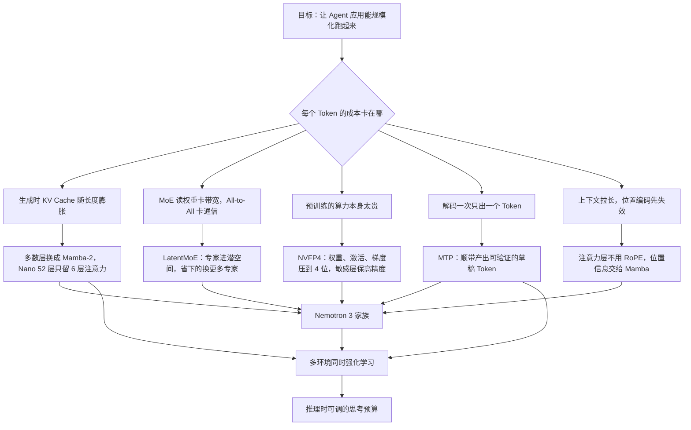

# NVIDIA Nemotron 3：把「每个字节换到多少精度」当成架构目标

<!-- release-date: 2025-12-15 -->

> 本文依据 **NVIDIA Nemotron 3: Efficient and Open Intelligence**（NVIDIA），arXiv:2512.20856v1，PDF 页眉日期 2025-12-25，共 13 页（正文 9 页，贡献者名单 3 页，参考文献 1 页）。页码均指 PDF 自身的页码。文中区分三件事：**报告明确写了什么**、**我们怎么解释或验算它**、**哪些是外部资料补充**。

## 先说清这是一份什么文件

这是一份**白皮书**，不是完整技术报告。原文自己交代：Nano 与它自己的技术报告、以及这份白皮书一起发布，Super 与 Ultra 在之后几个月跟进（PDF p. 1）；Figure 2 的图注直接让读者去看 Nano 的技术报告（PDF p. 2）。

所以它是一张**地图**，不是施工手册：告诉你 NVIDIA 这一代押了哪七项技术、每项为什么值得押、手上有哪些初步证据；不给超参表、算力账单和数据配比。

## 阅读前先认识几个词

- **Token（词元）**：模型读写文本的最小单位。一个汉字、一个英文单词或一个标点，都可能是一个或几个 Token。
- **KV Cache（Key-Value Cache，键值缓存）**：注意力层把读过的每个 Token 的 Key 和 Value 留在显存里，生成下一个 Token 时不必重算。上下文越长，它越大。
- **MoE（Mixture-of-Experts，混合专家）**：把前馈网络拆成很多「专家」小网络，每个 Token 只让其中几个干活。参数可以很多，单次计算量不必同比增长。
- **Mamba-2**：一种状态空间模型（SSM，State Space Model）。它不保存全部历史，只维护一份**固定大小**的状态，读一个 Token 更新一次。
- **GQA（Grouped-Query Attention，分组查询注意力）**：多个查询头共用一组 Key / Value，用来压缩 KV Cache；KV 头越少，缓存越小。
- **RoPE（Rotary Position Embedding，旋转位置编码）**：按位置把向量旋转一个角度，把「第几个位置」编进注意力。
- **Agentic AI（智能体式 AI）**：模型不是答一句就结束，而是反复调工具、读结果、再决定下一步，一个任务可能跑几十上百轮。

这份白皮书里最重要的三个新名字：**LatentMoE（潜空间混合专家）**、**MTP（Multi-Token Prediction，多 Token 预测）**、**NVFP4**（NVIDIA 的 4 位浮点格式）。

## 一句话先说清

Nemotron 3 想解决的不是「模型不够聪明」，而是 **「模型跑起来太贵，Agent 规模化不起来」**。

Agent 一次任务要来回很多轮，每轮都要读很长的历史、写很长的思考。这时卡住产品的往往不是准确率差那几个点，而是每张 GPU 每秒能吐多少 Token。白皮书第 2.2 节的小标题把这把尺子写了出来：**Improved Accuracy per Byte**，「每个字节换到的精度」（PDF p. 3）。几乎每一项设计都在压同一个分母：

- 生成时每步要从显存搬多少 KV Cache 的字节？→ 大多数层换成 Mamba-2；
- 算一层 MoE 要读多少专家权重、在卡间传多少字节？→ LatentMoE 把路由专家搬进低维潜空间；
- 训练时每个数占几个 bit？→ NVFP4 把权重、激活、梯度都压到 4 位；
- 搬一次全模型权重只换回一个 Token，值不值？→ MTP 顺带产出草稿 Token；
- 上下文拉到一百万，位置编码会不会先崩？→ 注意力层干脆不用 RoPE。

如果只记一句话：

> **当推理成本成为硬约束时，「加多少参数」这个问题应该换成「同样的字节预算下，怎样买到更多智能」。**

## 先看全景：七项技术，分别装在谁身上

最容易读漏、也最关键的一件事：**七项技术并不是三个成员都有**（PDF p. 1、9）。

| 技术 | Nano | Super / Ultra | 白皮书里的证据来自 |
|---|:---:|:---:|---|
| 混合 Mamba-Transformer MoE | ✓ | ✓ | Nano 的层图与跨模型对比（p. 2） |
| 最长 1M 上下文，注意力层不用 RoPE | ✓ | ✓ | Nano 与上一代的 RULER 对比、Nano 的 NLL 曲线（p. 7–8） |
| 多环境强化学习 | ✓ | ✓ | Nano 单次 RL 的曲线（p. 9） |
| 推理时思考预算控制 | ✓ | ✓ | Nano 的精度—长度曲线（p. 9） |
| LatentMoE | | ✓ | 8B 激活 / 73B 总参的对照模型（p. 4） |
| NVFP4 训练 | | ✓ | Nano 与 8B 激活 MoE 的 loss 对比（p. 6–7） |
| MTP | | ✓ | 8B 激活 transformer MoE 的消融（p. 5） |

直接后果是：**LatentMoE、NVFP4 与 MTP 三项，在白皮书里都还没有被一个已上线的模型证明过**，证据主要来自约 8B 激活、训练 1T Token 的代理实验。这是白皮书的性质，读的时候要一直记着。

三个成员的定位（PDF p. 1）：

| 成员 | 白皮书给的定位 | 发布状态 |
|---|---|---|
| Nano | 最小，精度胜过同档模型，推理成本极低 | 与白皮书同时发布 |
| Super | 面向协作式 Agent 与大批量负载，如 IT 工单自动化 | 之后几个月 |
| Ultra | 最大，提供最强的精度与推理能力 | 之后几个月 |

白皮书没有给出 Super 与 Ultra 的参数规模、层配置或具体时间表。

## 核心设计一：混合 Mamba-Transformer MoE

### 旧问题：注意力的账随长度线性变贵

标准 Transformer 每生成一个 Token，都要回头看全部历史，历史的 Key / Value 存在 KV Cache 里，缓存**随上下文长度线性增长**。上下文一长，每步都要把这一大块缓存从显存读一遍，瓶颈从算力变成了**内存带宽**。Agent 天生长上下文、长输出，把这个问题放到最大。

### 新设计：大多数层只存一个固定大小的状态

白皮书的说法是：不把 MoE 层和「生成时要看一份线性增长的 KV Cache」的自注意力层交错，而是主要和「生成时只存常数大小状态」的 Mamba-2 层交错，只保留少数注意力层（PDF p. 2）。三种层的分工（PDF p. 3）：

| 层 | 负责什么 | 生成时的成本特征 |
|---|---|---|
| MoE | 稀疏地扩参数，同样算力下换更高精度 | 只读被选中的专家权重 |
| 自注意力 | 「高保真的全对全信息路由」：在需要时把任意两个位置精确连起来 | KV Cache 随长度线性增长 |
| Mamba-2 | 序列建模主力 | 推理时的计算与显存都固定 |

为什么不全换成 Mamba-2？固定大小的状态必然丢信息，所以要留几层注意力负责精确查找。

这是 Nano 的层模式（PDF p. 2 Figure 1）。层数是从图上数出来的，白皮书正文没有直接写。52 层里只有 6 层注意力，约九分之一；每个注意力层的 GQA 只有 2 个 KV 头（PDF p. 6），Nano 的 KV Cache 因此被压得很小。注意力不是均匀撒开的：前 34 层每 7 层一个，之后只在第 43 层出现一次。白皮书没有解释这个排布。

### 收益：Figure 2 的两组数字

Figure 2 把 Nano 和两个同量级的开放模型放在一起，左边是精度，右边是相对吞吐（PDF p. 2）：

| 评测 | Nemotron-3-Nano-30B-A3B | Qwen3-30B-A3B-Thinking-2507 | GPT-OSS-20B-A4B |
|---|---:|---:|---:|
| Arena-Hard-v2-Avg（对话） | 67.7 | 57.8 | 48.5 |
| AIME25（数学） | 89.1 | 85.0 | 91.7 |
| AIME25 带工具 | 99.2 | – | 98.7 |
| IFBench（指令遵循） | 71.5 | 51.0 | 65.0 |
| $\tau^2$-Bench（工具使用） | 49.0 | 47.7 | 47.5 |
| SWE-Bench（编程） | 38.8 | 22.0 | 34.0 |
| LiveCodeBench v6（编程） | 68.2 | 66.0 | 61.0 |
| RULER @ 1M（长上下文） | 86.3 | 77.5 | N/A |
| 相对吞吐，输入 8K / 输出 16K | 3.3 | 1.0 | 1.5 |

正文对应的一句：在常见推理负载（8K 输入 / 16K 输出）下，Nano 30B-A3B 的吞吐是 Qwen3-30B-A3B 的 **3.3 倍**，序列更长时加速更多（PDF p. 2）。

读这张表要注意四点：

1. **吞吐是相对值**，以 Qwen3 为 1.0，纵轴单位是「每 GPU 每秒输出 Token」；白皮书没写用的是哪张卡、什么推理框架、什么批大小。
2. **不是每项都赢。** AIME25 不带工具时 GPT-OSS-20B 的 91.7 高于 Nano 的 89.1；带工具后 Nano 反超（99.2 对 98.7），但那是另一种设置。
3. **RULER @ 1M 那栏 GPT-OSS 是 N/A**，是没测这个长度，不是零分。
4. 评测协议（采样次数、harness、系统提示）都没写，图注把读者指向 Nano 的技术报告。

所以 Figure 2 支持的结论是：**在这个负载点上，混合架构同时拿到了有竞争力的精度和明显更高的吞吐**，不是「Nano 在所有任务上都最强」。

### 代价与边界

白皮书没有这一节，下面是我们的判断：

- 固定状态一定会丢信息。「留几层注意力、留在哪」白皮书没有给消融。
- 推理系统要同时管注意力的 KV Cache 和 Mamba 的循环状态，两者形状、更新方式、淘汰规则都不同；白皮书没写推理实现。
- 后面 Table 3 会看到，Nano 在 128K–512K 上的 RULER 分数**低于**上一代 Nemotron Nano 2。混合 MoE 换来的是更平缓的衰减，不是全长度更强。

### 可迁移启发

> **先确认瓶颈是算力还是搬运，再决定往哪个维度花钱。**

生成阶段受带宽限制时，「换更快的 GPU」不如「让每步要读的字节变少」。Nemotron 3 把大多数层的记忆结构从「随长度增长」换成「固定大小」；这个思路在流式处理、在线特征、长会话状态管理里都成立：能用固定大小的摘要顶住的地方，就不留全量历史。

## 核心设计二：LatentMoE，把专家搬进低维空间，省下的再买更多专家

这是白皮书里推理最完整、最有推广价值的一节。

### 旧问题：MoE 在两种部署里卡的不是同一件事

白皮书先区分两种部署（PDF p. 3）：

- **延迟优先**：一次只处理几十到几百个 Token。MoE 层受**内存带宽**限制，读专家权重的时间远超实际计算。每个专家矩阵是 $d \times m$（$d$ 是隐藏维度，$m$ 是专家 FFN 中间维度），想省带宽只能减 $d$ 或 $m$。
- **吞吐优先**：一次处理几千个 Token。主要瓶颈变成 **all-to-all 通信**：把 Token 分发到持有目标专家的 GPU，再把结果收回。

两类瓶颈对参数的敏感方向不同。白皮书写的两条比例关系是（PDF p. 3–4）：

$$
V_{\text{comm}} \propto K \times d,
\qquad
\text{有效非线性预算} \propto K \times m
$$

$K$ 是每个 Token 激活的专家数。通信量与 $m$ 无关；表达力与 $d$ 无关。$K$ 两边都在：想加表达力就得加 $K$，加 $K$ 又直接顶高通信。

### 新设计：换掉 $d$，而不是换掉 $K$

据 Figure 3（PDF p. 3）与 Table 1 的配置（PDF p. 4）重画。每个 Token 先从 $d$ 维投到更小的潜维 $\ell$，分发、专家计算、回收都在 $\ell$ 维里做，最后投回 $d$ 维（PDF p. 4）。每个专家的权重加载量和 all-to-all 载荷都缩小到 $\ell / d$，白皮书说这个比例典型约为四分之一（PDF p. 3）。

省下来的预算原地再投资：专家总数 $N' = N \cdot d/\ell$，每 Token 激活数 $K' = K \cdot d/\ell$（PDF p. 4）。假定专家中间维度 $m$ 不变，账是这样平的（本文代数）：

- 通信量：$K' \times \ell = K \times d$，不变；
- 专家权重总量：$N' \times \ell \times m = N \times d \times m$，不变；
- 有效非线性预算：$K' \times m = (d/\ell) \cdot K \times m$，变成原来的 $d/\ell$ 倍。

**通信与计算账单大致不变，非线性预算和专家多样性涨了约 4 倍**，这就是「每字节精度」的字面含义。

### 什么留在原维度

路由门、共享专家和所有非专家层都留在原始的 $d$ 维，理由是它们对上面两个瓶颈贡献不大（PDF p. 4）。我们的解释：降维是有代价的，只在瓶颈真正所在的路径上降；路由器若也降维，选专家的判断质量可能下降，而它本来就不是带宽大头。NVFP4 一节还提到，潜空间的两个投影保持 BF16，因为它们对单步时间影响很小（PDF p. 6）。

### 证据：Table 1

一对配平的模型：都是约 8B 激活、73B 总参，训练 1T Token，超参完全相同（PDF p. 4）。

| | Standard MoE | LatentMoE |
|---|---|---|
| 激活 / 总参数 | 8.09B / 72.6B | 8.02B / 72.8B |
| 隐藏维 / 潜维 | $d = 4096$ | $\ell = 1024$ |
| 专家总数 | 128 | 512 |
| 每 Token 激活专家 | 6 | 22 |

| 评测 | Standard MoE | LatentMoE | 差值 |
|---|---:|---:|---:|
| MMLU-Pro | 48.30 | 52.87 | +4.57 |
| MMLU | 70.10 | 72.11 | +2.01 |
| Code | 51.95 | 55.14 | +3.19 |
| Math | 78.32 | 80.19 | +1.87 |
| Commonsense Understanding | 81.73 | 82.10 | +0.37 |

Code 是 HumanEval、HumanEval+、MBPP、MBPP+ 的平均；Math 是 GSM8K CoT 与 MATH-500 的平均；Commonsense Understanding 是 RACE、ARC-Challenge、HellaSwag、Winogrande 的平均（PDF p. 4）。差值列是本文减法。

这组对照控制得很干净：激活参数、总参数、Token 数、超参都相同，只换 MoE 的组织方式，是白皮书里最严格的一组实验。边界也清楚：

- 只有一个规模点，只训到 1T Token；
- 增益不均匀，MMLU-Pro 涨 4.57，常识理解只涨 0.37；
- 是基座评测，不是后训练后的 Agent 能力。

### 一个没解释的小缺口

按公式 $K' = 6 \times 4 = 24$，实际用的是 **22**；专家总数倒是严格的 $128 \times 4 = 512$（PDF p. 4）。白皮书没有解释。一个可能的原因是 LatentMoE 多出的两个投影占了激活参数，少激活 2 个专家以把激活参数配平到约 8B；这是我们的猜测，没有证据。

### 可迁移启发

- **先把瓶颈写成公式，再决定动哪个变量。** 通信 $\propto K \times d$、表达力 $\propto K \times m$ 一摆出来，「该动 $d$」就是显然的。
- **省下的预算要原地再投资。** 只把 4 倍带宽落袋，得到的是更快但更笨的模型。
- **分路径降本。** 路由器、共享专家留在高维，只在瓶颈路径上降维。

## 核心设计三：MTP，一次搬运多带几个 Token

### 旧问题：为一个 Token 搬一遍全部权重

自回归生成每产出一个 Token，都要把整个模型的权重从显存过一遍。批量小的时候（比如单用户对话），GPU 算力几乎闲着，全在等搬运。

### 新设计：让模型顺带预测后面几个 Token

MTP 让模型在预测下一个 Token 之外，同时预测再往后的几个（PDF p. 4–5）。两种收益白皮书都提到了：

- **训练侧**：多个未来 Token 提供更密的监督信号，促使模型提前几步规划（PDF p. 4–5）；
- **推理侧**：这些额外预测天然就是**投机解码**（speculative decoding）的草稿，不需要单独训练草稿模型（PDF p. 5）。投机解码先便宜地猜几个 Token，再用主模型一次验证，猜对就省下几次前向，输出分布不变。

### 证据：Table 2 与 97% 接受率

消融跑在一个约 8B 激活的 **transformer MoE** 基座上（不是混合架构），训练 1T Token（PDF p. 5）：

| 类别 | 任务 | 基线 | 基线 + MTP |
|---|---|---:|---:|
| 通用知识 | MMLU（5-shot, acc） | 70.06 | 71.26 |
| 通用知识 | MMLU-Pro（5-shot, CoT EM） | 45.05 | 47.84 |
| 代码 | MBPP-Sanitized（3-shot） | 65.58 | 66.89 |
| 常识理解 | ARC-Challenge（25-shot, acc_norm） | 86.43 | 88.05 |
| 常识理解 | WinoGrande（0-shot, acc） | 74.59 | 75.45 |
| 阅读理解 | RACE（0-shot, acc） | 84.02 | 85.36 |
| 数学 | GSM8K（8-shot, acc） | 82.49 | 84.46 |

白皮书说平均提升约 2.4%（PDF p. 5），没写口径。我们按表复算：7 项的**绝对**提升是 +0.86 到 +2.79 个百分点，平均约 +1.58 点；**相对**提升（提升量除以基线）是 1.15% 到 6.19%，平均约 2.41%。所以「约 2.4%」是相对提升的平均。

推理侧，白皮书设计了一个轻量 MTP 模块，在 8B 激活 MoE 的消融里，**前两个预测 Token 的接受率约 97%**（PDF p. 5），原因是 MTP 的预测与主模型「高度一致」。

### 边界

- 消融在 transformer MoE 上做，没有混合架构上的 MTP 消融；
- 没写 MTP 的深度（预测多远）、模块结构和损失权重；
- MTP 只装在 Super 与 Ultra 上（PDF p. 1、9），白皮书发布时已上线的 Nano 用不上这一条。

### 可迁移启发

> **一次昂贵的搬运只换回一个结果时，想办法在同一次搬运里多带点货，再配一个便宜的验证把错的丢掉。**

一次数据库往返多取几行、一次前向多出几个候选，都是同一个模式；投机解码安全，是因为主模型的验证保证了输出分布不变。

## 核心设计四：NVFP4，把 4 位浮点真的用在预训练里

### 旧问题：低精度是「模拟」还是「真跑」

FP4 用 4 个二进制位表示一个浮点数（BF16 用 16 位，FP8 用 8 位）。位数越少，表示越粗，但搬运的字节越少、专用硬件上的乘加越快。白皮书给的硬件数字：GB300 上 FP4 的峰值吞吐是 FP8 的 **3 倍**（PDF p. 5）。

白皮书点出一个关键区别（PDF p. 5–6）：此前的 NVFP4 预训练工作用「量化再反量化」函数**模拟** NVFP4 数值，底下跑的仍是 BF16 矩阵乘；这次用的是**原生 NVFP4 GEMM**，经 cuBLAS 后端接入 Transformer Engine。权重、激活、梯度都量化到 NVFP4，因此前向（fprop）、对输入求梯度（dgrad）、对权重求梯度（wgrad）三种矩阵乘都用 NVFP4（PDF p. 5）。白皮书说在混合 Mamba-MoE 架构上稳定、准确地完成了**最多 25T Token** 的 NVFP4 预训练（PDF p. 5）。

### 格式与三个数值技巧

NVFP4 格式四个要素（PDF p. 6）：每 16 个元素一组的细粒度块缩放；块缩放因子用 E4M3；再套一层 FP32 全局缩放；元素本身是 E2M1（1 位符号、2 位指数、1 位尾数）。

我们的解释：4 位的动态范围极窄，两级缩放把「绝对量级」交给缩放因子，元素只负责组内的相对大小；组越小，组内数值越接近，浪费的表示能力越少。

配套的三个技巧（PDF p. 6）：

- **权重用二维块缩放**：权重在前向和反向里按不同方向被读，二维分块让两个方向都有合理的缩放；
- **wgrad 的输入做随机 Hadamard 变换（RHT）**：一种廉价的正交变换，把少数离群大值摊到更多维度上，避免一个离群点把整组的缩放顶上去；
- **梯度用随机舍入（stochastic rounding）**：按距离概率性地取上或取下，大量小梯度的期望不会被系统性地舍成零。

（每条的作用说明是我们的解释，白皮书只列了做法。）

### 关键做法：精度按部件分级

白皮书明确列出了不用 NVFP4 的地方（PDF p. 6）：

| 部件 | 保留的精度 | 白皮书给的理由 |
|---|---|---|
| 网络最后 15% | 高精度 | 维持稳定 |
| LatentMoE 的潜空间投影 | BF16 | 对单步时间影响很小 |
| MTP 层 | BF16 | 位于网络末端，且要保住 MTP 能力 |
| QKV 与注意力投影 | BF16 | 注意力层本来就少，每层 GQA 只有 2 个 KV 头，要保住它们的保真度 |
| Mamba 输出投影 | MXFP8 | 量化到 NVFP4 时下溢归零（flush to zero）的比例在 Nano 上高达 40% |

最后一条的诊断方式值得借鉴：**下溢归零比例是一个可直接测量、指向具体层的信号**，不必跑完训练再看 loss 差在哪。QKV 与注意力投影保 BF16，则是一个「稀缺路径要保护」的判断：整个网络只有少数注意力层，每层又只有 2 个 KV 头，冗余度低，掉一点就没得补（后半句是我们的解释）。

### 证据：Figure 4 与 Figure 5

引自原文 Figure 4（PDF p. 6）。纵轴是相对 BF16 的百分比差，越高越好；深蓝是 8B 激活的更大 MoE（A8B），绿是 Nano（A3B）的 NVFP4 配方，浅蓝是 Nano 的消融：从 500B Token 的 NVFP4 检查点出发，把 Mamba 输出、QKV 和注意力投影也量化到 NVFP4。

白皮书的两条结论（PDF p. 6）：

1. **规模越大，差距越小。** Nano 上 NVFP4 与 BF16 的相对 loss 差 **小于 1%**；8B 激活的更大 MoE 上 **小于 0.6%**，与量化感知训练缩放律的前作一致。
2. **敏感层不能降。** 浅蓝线明显低于绿线，说明上表的精度分级是必要的。

图上还有一件正文没提的事：深蓝线在前约 0.4T Token 有多次大幅跳变，验证 loss 在约 0.3T 处越出了 ±2% 的刻度（读自图）。白皮书没有解释这些跳变。

Figure 5 是 8B 激活 MoE 训到 1T Token 的 8 项下游评测轨迹（MMLU、MATH-500、GSM8K、MBPP-Sanitized、MMLU-Pro、ARC-Challenge、HumanEval、WinoGrande），NVFP4 与 BF16 两条线基本重合；评测本身在 BF16 下做（PDF p. 7）。白皮书据此说小的 loss 差不一定变成下游精度下降，与 Mamba-MLP 上的前作一致（PDF p. 6）。

### 边界

- **25T 与图对不上长度。** 正文说最多 25T Token，Figure 4 与 Figure 5 只画到 1T。不能把「< 1%」外推成「25T 全程都 < 1%」。
- 「网络最后 15%」具体是哪些层、「高精度」是 BF16 还是 MXFP8，没写。
- 没有 NVFP4 训练的端到端加速比。3 倍是硬件峰值比，不是实测训练吞吐。
- 已发布的 Nano 权重是否用 NVFP4 训练，白皮书没有正面说：摘要写的是「Super 与 Ultra 用 NVFP4 训练」（PDF p. 1），Figure 4 里的 Nano NVFP4 曲线更像实验运行。

### 可迁移启发

- **降精度按敏感度分级，并找一个能直接测量的敏感度指标。** 下溢归零比例、量化相对误差、激活动态范围都可以。顺序是先测量、再分级、最后才定统一配方。
- **保护稀缺路径。** 某种层在网络里只剩几层时，它的每一层都不可替代。

## 核心设计五：一百万 Token，靠「不用 RoPE」绕开外推

### 旧问题：RoPE 在训练长度之外会失灵

RoPE 按位置旋转向量。训练时见过的角度范围有限，推理序列远超训练长度时，出现的是训练中没见过的角度分布。白皮书把 RoPE 称为扩展上下文的「已知障碍」（PDF p. 7）。常见对策是各种 RoPE 缩放 / 插值，本质是把没见过的角度压回见过的范围。

### 新设计：Mamba 已经带位置信息，注意力层就不要 RoPE

白皮书的理由是：Mamba 层提供隐式的位置信息，所以 Nemotron 3 的注意力层不用 RoPE，也就没有扩展上下文时 RoPE 的分布外问题（PDF p. 7）。纯 Transformer 上的类似探索见 SWAN（PDF p. 7、13）。

这是混合架构的一个连带红利：为推理效率引入 Mamba，顺手拆掉了长上下文外推的一整条补丁链。

### 训练时怎么把长度撑上去

Nano 的三个阶段（PDF p. 7）：

| 阶段 | 序列长度 |
|---|---|
| 继续预训练（CPT，continued pre-training） | 512K |
| 有监督微调（SFT） | 256K |
| 强化学习里的长上下文环境 | 输入最长 32K |

三个阶段都加入了为长程检索、多跳推理、多文档信息聚合等能力设计的合成数据（PDF p. 7）。白皮书还说，CPT 中**没有观察到需要从 8K 到 512K 分阶段逐步拉长**（PDF p. 7）。我们的推断：阶梯式扩展主要是为了让位置编码平滑适应新范围，没有 RoPE，这个理由就不在了。白皮书没有这么解释。

训练最长到 512K，却宣称支持 1M，所以 1M 这一档本身就是外推，Table 3 正是在测这件事。

### 证据：Table 3 与 Figure 6

RULER 是专门测「长上下文里能不能真找到东西」的评测集。Table 3 对比上一代稠密混合与这一代 MoE 混合（PDF p. 8）：

| 模型 | 128K | 256K | 512K | 1M |
|---|---:|---:|---:|---:|
| Nemotron-Nano-12B-v2-Base（稠密混合） | 85.13 | 79.85 | 75.12 | 23.43 |
| Nemotron-3-Nano-30B-A3B-Base（MoE 混合） | 74.48 | 71.67 | 66.02 | 54.19 |

**两个模型都只训到 512K**（PDF p. 8），1M 一列对两者都是外推。这张表要完整读：

- 128K、256K、512K 三档，**上一代反而更高**，128K 上高出 10 个多点；
- 只有 1M 这一档新一代大幅反超，54.19 对 23.43。

白皮书的措辞是准确的：上一代在 512K 到 1M 之间「断崖式下跌」，这一代「平缓衰减」（PDF p. 8）。它证明的是**外推更鲁棒**，不是**长上下文能力全面更强**。另外白皮书把差异归因于「MoE 混合对比稠密混合」（PDF p. 7–8），但两个模型同时差着总参数（30B 对 12B）、激活参数、数据和配方，**这不是受控实验**。

第二个证据是 Figure 6（PDF p. 8）：在超过 100 万 Token 的仓库级代码序列上，测各位置之前的累积平均负对数似然（NLL，越低表示预测越好）。思路是：连贯文本里越靠后的 Token 应该越好预测。曲线从位置 128 处约 1.2 降到 1M 处约 0.42（读自图），图标题写明幂律拟合 $R^2 = 0.883$。白皮书的措辞很克制：这「表明」模型能在测试范围内用上长输入（suggesting，不是 proving）。它只覆盖代码一种数据，累积平均也会抹平局部波动。

### 可迁移启发

- **引入一个新模块后，检查它是否让另一个模块的补丁变得多余。** RoPE 缩放、位置插值都是「显式位置编码 + 长度外推」这个组合的补丁。
- **外推能力和绝对能力是两件事。** 你的实际长度落在哪一档，决定该选哪个模型。

## 核心设计六：多环境强化学习，所有任务一起练

### 旧问题：分阶段训练会冲掉先学的能力

以前给不同能力分设训练阶段。白皮书说，分阶段方法「往往导致某些能力退化」，并引了 NVIDIA 上一代和 DeepSeek 的经验（PDF p. 8）。

### 新设计：一次 RL 同时优化所有环境

Nemotron 3 构建了一批 RL 环境，覆盖数学与科学推理、竞赛编程、指令遵循、软件工程、搜索、聊天、通用 Agent 工具使用、长上下文等，**所有任务同时训练**（PDF p. 8）。白皮书的观察是：更稳定、更不容易奖励作弊（reward hacking，模型钻奖励函数空子而不是真解题）、整体更好（PDF p. 8）。

Figure 7 是 Nano 单次 RL 里 8 个基准随步数（约 0–550 步）的变化：AALCR、AIME25、GPQA、IFBench Prompt、LiveCodeBench、MMLU Pro、SciCode、$\tau^2$-Bench 平均（PDF p. 9）。多数曲线整体上行，AALCR、SciCode、$\tau^2$-Bench 抖动很大（读自图）。**Figure 7 只有「同时训练」一条线，没有分阶段对照**，所以「同时训练更好」在这份白皮书里是作者的观察与判断。

### 算法与系统：GRPO 加带掩码的重要性采样

算法是 **GRPO**（Group Relative Policy Optimization，组相对策略优化），配 **masked importance sampling（带掩码的重要性采样）**，用来处理训练策略与 rollout 策略之间的差异（PDF p. 8）。

背后是异步 RL 的根本矛盾。为了采样效率，白皮书用**异步 RL 架构，把训练和推理解耦**（PDF p. 8）；一解耦，采样用的参数就比正在更新的参数旧了几步。样本来自旧策略时要用重要性采样修正，大致是乘一个比值：

$$
w = \frac{\pi_{\text{train}}(a \mid s)}{\pi_{\text{rollout}}(a \mid s)}
$$

$\pi_{\text{train}}$ 是正在更新的策略给这个 Token 的概率，$\pi_{\text{rollout}}$ 是采样时那个策略给的概率，$a$ 是生成的 Token，$s$ 是上下文。两个策略接近时比值约为 1，差得远时会极大或极小。「masked」大概是对某些位置或比值范围做掩码，但**白皮书没写掩码规则**，这里不往下猜。

系统侧有一条呼应前文的设计：**用 MTP 加速 rollout 生成**；混合架构的高推理吞吐，在大规模 rollout 生成时相对其他开源模型也是显著优势（PDF p. 8）。为推理效率做的架构选择，回过头加速了训练本身。

整个后训练软件栈以 Apache 2.0 开源：[NeMo-RL](https://github.com/NVIDIA-NeMo/RL) 做可扩展 RL 训练，[NeMo-Gym](https://github.com/NVIDIA-NeMo/Gym) 提供 RL 环境集合（PDF p. 8）。

### 边界

没有环境清单与配比、奖励设计、训练超参、rollout 规模；没有掩码重要性采样的定义；没有异步架构的拓扑与参数滞后步数；「更不易奖励作弊」没有度量方式；Figure 7 没有对照组。

## 核心设计七：推理时的思考预算控制

### 旧问题：思考多久不该是固定的

推理模型先写一长串思考再回答。难题与简单题需要的思考量差很多；只靠 `max_tokens` 硬砍，会得到一个没进入回答阶段就被截断的输出。

### 新设计：到预算就补一个结束标记，让它直接作答

做法很朴素（PDF p. 9）：用户给定思考的最大 Token 预算；模型思考到预算时，把 `</think>` 追加进序列，让模型继续生成，它会基于**不完整的思考**给出回答。关键在于模型是被**训练成**能配合这种预算控制的（与 Nemotron Nano 2 相同，PDF p. 9），它见过「思考被截断、要立刻作答」这种输入形态。

引自原文 Figure 8（PDF p. 9）。横轴是对数刻度，四条曲线在对数轴上大致直线上升，也就是说每把预算翻一倍，精度涨一截，线性尺度下是边际递减；GPQA、LiveCodeBench、MMLU Pro 在最大预算处略有回落（读自图）。各条曲线的横轴范围差很多：AIME25 画到 32K，MMLU Pro 只到 4K 出头，**不同任务的合理预算可以差一个数量级**。

### 可迁移启发

- **想让一个行为在推理时可调，就得在训练时让模型见过这种调法。** 长度、格式、工具使用都一样。
- **把「花多少算力」暴露成调用方可调的参数**，而不是替所有人选一个中间值。

## 开放到什么程度

白皮书三处说法措辞略有不同（PDF p. 1、9）：

- 摘要：公开模型权重、预训练与后训练软件、recipe，以及**所有我们持有再分发权的数据**；
- 引言：公开全部模型权重、训练 recipe，以及**超过 10 万亿 Token 的数据集**；
- 结论：公开模型权重、预训练与后训练软件、训练 recipe，以及**大部分训练数据**。

「持有再分发权的数据」和「大部分训练数据」是同一件事的两种说法：**有一部分数据因许可原因放不出来**。权重、软件和 recipe 承诺完整，数据有缺口。后训练软件栈明确是 Apache 2.0（PDF p. 8）；模型权重本身的许可白皮书没写。

## 报告没有公开的

**模型层面**

- Nano 的完整超参：隐藏维度、专家数、激活专家数、FFN 中间维度、词表；Figure 1 只给层排列。
- Super 与 Ultra 的参数规模、层配置、发布时间。
- MTP 的深度、结构、损失权重；LatentMoE 的投影是否带归一化、是否有辅助损失。

**训练层面**

- 预训练数据的来源配比、过滤、去重与污染检查；训练算力、GPU 数量与成本。
- Nano 的预训练 Token 数（25T 是 NVFP4 一节的表述，没有说就是 Nano 的预训练量）。
- 「网络最后 15%」是哪些层；多环境 RL 的环境清单、配比、奖励与超参；掩码重要性采样的形式；异步 RL 的拓扑。

**系统层面**

- 1M 上下文的推理实现：KV Cache 与 Mamba 状态怎么共存、分页、淘汰。
- Figure 2 吞吐测试的硬件、框架、批大小；NVFP4 训练的实测加速比。
- 安全评测与红队结果（贡献者名单里有「Evaluation, Safety and Release」一组，正文没有对应章节，PDF p. 11）。

## 哪些结论有实验支撑，哪些只是作者判断

**有对照实验支撑的**

- LatentMoE 优于标准 MoE：同激活、同总参、同 Token、同超参的对照（Table 1，PDF p. 4），全文最干净的一组。
- MTP 提升基座精度：同一模型加不加 MTP（Table 2，PDF p. 5）。
- NVFP4 的敏感层必须保高精度：Figure 4 的浅蓝消融线（PDF p. 6）。
- NVFP4 与 BF16 的下游轨迹接近：Figure 5 的双线对照（PDF p. 7）。

**有测量但不是受控对照的**

- MoE 混合比稠密混合更抗长度外推：Table 3 的两个模型同时差着参数、数据和配方（PDF p. 8）。
- Nano 吞吐是 Qwen3 的 3.3 倍：跨模型对比，测试环境未公开（PDF p. 2）。
- 模型能用上 1M 上下文：Figure 6 的 NLL 下降是观察性证据（PDF p. 8）。

**只是作者的观察或工程判断**

- 多环境同时 RL 更稳定、更不易奖励作弊、整体更好：Figure 7 没有对照组（PDF p. 8–9）。
- CPT 不需要阶梯式拉长：「没观察到需要」，不是证明了不需要（PDF p. 7）。
- 注意力层为什么前密后疏、激活专家为什么是 22 而不是 24：没有解释（PDF p. 2、4）。

**属于宣告而非结果的**

- Super 与 Ultra 的能力描述、数据与软件的开放承诺（PDF p. 1、9）。

## 最值得带回自己项目的六条

### 1. 给系统找一把统一的尺子

Nemotron 3 的尺子是「每字节换到多少精度」。有了它，架构选型、MoE 组织、数值精度、解码策略这些看似不相干的决定，就能放在同一个坐标系里比较。

### 2. 先写出瓶颈公式，再决定动哪个变量

通信 $\propto K \times d$，表达力 $\propto K \times m$。成本和收益写成同一组变量的函数之后，该动谁就清楚了。

### 3. 省下来的预算要原地再投资

降维省了约 4 倍带宽，就把专家数和激活数各扩约 4 倍。优化的终点不一定是「更快」，也可以是「同样快但更强」。

### 4. 降精度按敏感度分级，用可测量的指标定位

下溢归零比例高达 40% 是一个事前就能测、直接指向具体层的信号；少数不可替代的层（这里是注意力）优先保护。

### 5. 新组件可能让旧补丁变得多余

引入 Mamba 是为了推理效率，结果顺手让 RoPE 外推这条补丁链消失。换组件时要问：旧方案里哪些复杂度是专门为被替换掉的组件服务的？

### 6. 推理优化会回流到训练

MTP 为投机解码而设计，最后被用来加速 RL 的 rollout；混合架构的高吞吐也直接缩短了 RL 采样时间。在 RL 成为后训练主力之后，推理速度就是训练速度的一部分。

## 用一张图重新串起全文

本文的总结示意，依据 PDF p. 1–9 的整体叙事，不含实测数据。S1 与 S4 各有一条箭头指向 P，即「推理优化回流到训练」。

## 关键词回看

- **混合 Mamba-Transformer MoE**：以 Mamba-2 层为主、少量注意力层、与 MoE 层交错；Nano 是 23 层 Mamba-2、6 层注意力、23 层 MoE，共 52 层。
- **Mamba-2**：状态空间模型，生成时只维护固定大小的状态，计算与显存都固定。
- **LatentMoE**：把路由专家的计算与 all-to-all 通信搬进更小的潜空间，用省下的带宽把专家总数和激活数各扩大同样的倍数。
- **每字节精度（accuracy per byte）**：白皮书第 2.2 节标题里的概念，也是全文的统一尺子。
- **MTP**：训练时额外预测后面几个 Token；推理时这些预测直接当投机解码的草稿。
- **投机解码**：先便宜地猜几个 Token，再用主模型一次验证；猜对即省，输出分布不变。
- **NVFP4**：4 位浮点格式，元素 E2M1，每 16 个元素一个 E4M3 块缩放因子，外加一层 FP32 全局缩放。
- **下溢归零（flush to zero）**：数值小到低精度格式表示不了，直接变成 0；它的比例可用来定位量化敏感层。
- **随机 Hadamard 变换**：廉价的正交变换，把离群大值摊到更多维度，减轻量化的离群点问题。
- **随机舍入**：按距离概率性地取上或取下，避免大量小值被系统性地舍成零。
- **RULER**：度量长上下文里实际检索与推理能力的评测集。
- **GRPO**：白皮书采用的 RL 算法，配带掩码的重要性采样处理训练与 rollout 策略的差异。
- **思考预算控制**：思考达到预算就补上 `</think>` 让模型直接作答；模型在训练时就见过这种打断。

## 最后的判断

这份白皮书的价值不在任何单项技术的新颖度：Mamba 混合、MoE、MTP、低精度训练、多环境 RL 都有前作。它的价值在于**把一整套效率手段挂在同一根轴上，并说清每一项为什么值得押**。

它最强的一段是 LatentMoE：从「两种部署的瓶颈不同」出发，写出两条比例关系，换掉那个只出现在成本侧的变量，再用一组配平严格的对照实验收尾。这段推理的质量比结论本身更值得学。

它最弱的一段是多环境 RL：结论有价值，但只有一条曲线、没有对照，是一个值得相信、尚未被这份材料证明的判断。

还要记住一个结构性事实：**LatentMoE、NVFP4 与 MTP 只装在 Super 与 Ultra 上，而这两个模型在白皮书发布时还没有上线。** 已上线的 Nano 用的是混合架构、无 RoPE 长上下文、多环境 RL 与预算控制这四项。不要把七项技术的收益都记在 Nano 头上。

> **当推理成本成为硬约束时，问的不该是「再加多少参数」，而是「同样的字节预算下，怎样买到更多智能」。**

## 资料与阅读边界

**原始依据**

- 本地 `papers/NVIDIA/Nemotron-3.pdf`，即 [arXiv:2512.20856v1](https://arxiv.org/abs/2512.20856)（2025-12-24 提交），PDF 页眉日期 2025-12-25，13 页。arXiv 上只有 v1。

**首发日证据**

- `release-date` 取 **2025-12-15**，即家族首个成员 Nano 对外可用的日期。NVIDIA 官方新闻稿 [NVIDIA Debuts Nemotron 3 Family of Open Models](https://nvidianews.nvidia.com/news/nvidia-debuts-nemotron-3-family-of-open-models) 发布于 2025 年 12 月 15 日，写明 Nemotron 3 Nano 当天可在 Hugging Face 与多家推理服务商使用、Super 与 Ultra 预计 2026 年上半年推出；同日的 [NVIDIA 技术博客](https://developer.nvidia.com/blog/inside-nvidia-nemotron-3-techniques-tools-and-data-that-make-it-efficient-and-accurate/) 与 [NVIDIA Research Nemotron 3 页面](https://research.nvidia.com/labs/nemotron/Nemotron-3/) 一致。Hugging Face 权重仓库建于 2025 年 12 月 3–6 日，是发布前的预置；arXiv 提交日与 PDF 页眉日期都晚于开放日，不作首发日。

**外部补充（不是白皮书内容）**

- Nano 的完整超参、预训练数据与详细评测在单独的 [NVIDIA Nemotron 3 Nano Technical Report](https://research.nvidia.com/labs/nemotron/files/NVIDIA-Nemotron-3-Nano-Technical-Report.pdf) 中，本文没有引用其中数字。
- 白皮书之后，Nemotron 3 Ultra 发布了自己的技术报告，LatentMoE、MTP 与 NVFP4 在 550B 规模上的实际配置与证据见 Nemotron-3-Ultra 一篇。
- 白皮书引用的关键前作：[Transformers are SSMs（Mamba-2）](https://arxiv.org/abs/2405.21060)、[Pretraining Large Language Models with NVFP4](https://arxiv.org/abs/2509.25149)、[RULER](https://arxiv.org/abs/2404.06654)、[NVIDIA Nemotron Nano 2](https://arxiv.org/abs/2508.14444)、[Nemotron-H](https://arxiv.org/abs/2504.03624)、[Scaling Law for Quantization-Aware Training](https://arxiv.org/abs/2505.14302)。只用于追溯背景。
- 文中的层数与层号、LatentMoE 的代数、Table 1 差值与 Table 2 的平均提升，是本文根据白皮书数字所做的计数与算术。
