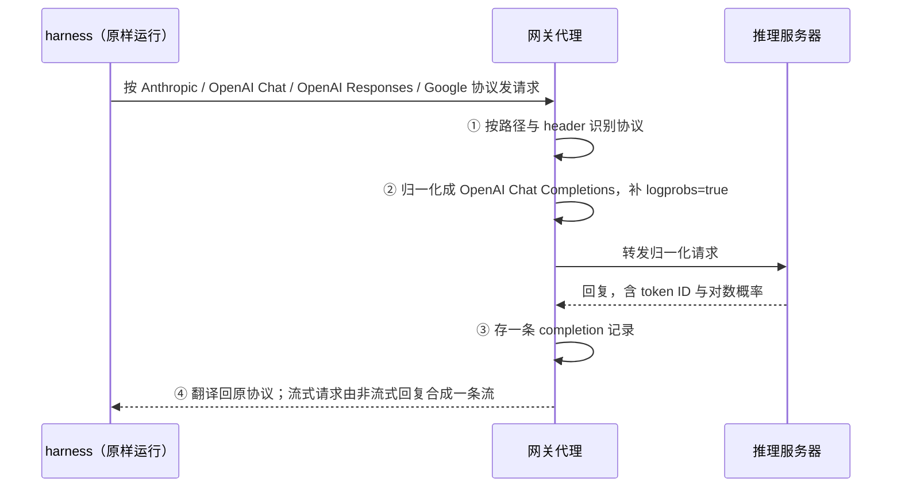

# Polar：把 RL 的观测点挪到模型 API 这一层，harness 就能原样当训练环境

<!-- release-date: 2026-05-14 -->

> 本文依据 **Polar: Agentic RL on Any Harness at Scale**，arXiv:2605.24220v1，2026-05-22 提交，共 17 页（正文与结论 p. 1–12，参考文献 p. 13–14，附录 A.1–A.5 p. 15–17）。十二位作者，首页没有逐人标注单位；页眉是 NVIDIA 标识，版权行为「© 2026 NVIDIA」，代码仓库在 NVIDIA-NeMo 组织下（PDF p. 1）。页码均指 PDF 自身的页码。文中会区分三件事：**论文明确写了什么**、**我们怎么解释它**、**哪些是外部资料**。

## 读前先把几个词说成人话

这篇论文假设你知道「用强化学习（Reinforcement Learning，RL）训练 Agent」大致怎么回事。下面几个词够读完全文。

- **harness（脚手架）**：让大模型能干活的那层程序。Claude Code、Codex CLI、Qwen Code、Pi 这些命令行编码助手都是 harness。它管系统提示词、工具定义、何时调哪个工具、上下文太长时怎么压缩（论文叫 **compaction**）、要不要派子 Agent、何时停。模型只负责「看一段上下文，吐一段文本」；把几十上百次这样的调用串成一次完整任务的，是 harness。
- **rollout（采样执行）与 trajectory（轨迹）**：让当前模型在环境里把任务跑一遍，叫一次 rollout；跑出来的完整记录叫一条轨迹。给轨迹打一个 **reward（奖励）**，比如补丁能不能让测试通过，再用带奖励的轨迹更新模型。
- **GRPO（Group Relative Policy Optimization，组相对策略优化）**：同一道题采一组回答，用组内相对好坏当优势，不训价值网络。出处见 DeepSeekMath 一篇。
- **behavior policy（行为策略）与 log probability（对数概率）**：生成轨迹时用的那版模型叫行为策略。策略梯度必须算在「它当时真的采样出来的那串 token」上，往往还要用它当时给这些 token 的对数概率做重要性修正。
- **retokenization drift（重分词漂移）**：把 token 解码成文本、再把文本编码回 token，得到的序列可能和原来不同。同一段文字有多种切法，「文字一样」不等于「token 一样」。harness 和模型之间走的是文本接口，这个问题在 Agent 训练里格外常见。
- **loss mask（损失掩码）**：一条训练序列里哪些 token 参与算梯度（标 1），哪些只当上下文（标 0）。
- **proxy（代理）**：夹在客户端和服务端之间的一层程序。客户端以为在跟真服务说话，其实说给了代理；代理转发、记录，再把回复原样交回。

## 一句话先说清

2026 年的 agentic RL 有一个越来越别扭的错位：**最能干的 Agent 是一整个软件系统，可 RL 框架要求你把它改写成一个 `env.step()` 才肯训练它。**

论文把这个错位讲得很具体（PDF p. 2）。传统 RL 假设训练对象能暴露成一个简单、标准的接口，研究者只管算法。到了 Agent 时代，训练对象可能同时涉及异构环境、外部工具、长时间运行的工作流，可能用别的语言写成，甚至以闭源二进制分发。把它改写成 RL 框架的环境接口，要么工作量巨大，要么根本做不到，而且改写本身会丢掉真实执行路径上的细节。

论文的问题只有一句（PDF p. 2）：

> Can we train agents with RL without opening the box?

它的回答建立在一个观察上：**Agent 内部千差万别，但每个基于大模型的 Agent 都必须去调模型。** 这个模型 API 边界是所有 Agent 共有、而且位于 Agent 之外的接口（PDF p. 2）。于是 Polar 不去集成 harness，而是**监听 harness 发出的模型调用**：记下提示词、采样出的 token、对数概率和回复，在 harness 外面重建成 RL 轨迹。harness 一行不改（PDF p. 2–3）。名字也由此而来：它出自 ProRL Agent servR，又连接着训练环境与产品 harness 这「两极」（PDF p. 3）。摘要自称它重写了同一团队的前作 ProRL Agent（PDF p. 1），前作见 ProRL-Agent 一篇。

四条贡献里三条是设计、一条是验证（PDF p. 3）：

1. **代理式 rollout 与重建**：在 harness 和推理服务器之间放一个兼容各家协议的代理，harness 只需把模型地址指过来；
2. **rollout 即服务（rollout-as-a-service）**：任务提交、环境准备、harness 执行、轨迹重建、评估、回调都拆到异步服务边界后面，让慢而长尾的 Agent rollout 独立于 GPU 训练扩展；
3. **token 保真的轨迹重建**：保守的逐请求策略，加上更省的前缀合并策略；
4. **真实编码 harness 上的端到端验证**，外加离线 SFT 数据生成。

验证结果（PDF p. 1、p. 10）：同一个 Qwen3.5-4B、同一个 GRPO 配方、同一批 SWE-Gym 训练题，分别套进 Codex、Claude Code、Qwen Code、Pi 四个 harness 训练，SWE-Bench Verified 的 pass@1（一次尝试就通过的比例）分别提高 **22.6、4.8、0.6、6.2** 个百分点。四个增益差得这么远，本身就是这篇论文最值得记的结论：**harness 是策略的一部分，换 harness 就换了一个要优化的行为。**

### 一条阅读路线

1. **p. 1 Figure 1、p. 2 Figure 2**：先看代理放在哪、和传统框架差在哪。
2. **p. 6 §3.2**：代理对每个请求做的四步。
3. **p. 7 Figure 4、p. 7–8 §3.4.2**：前缀合并怎么切链、怎么拼 token、怎么打掩码。这是全文技术含量最高的一节。
4. **p. 5 Figure 3、p. 6 §3.3**：网关里的分阶段异步。
5. **p. 10 Table 1、p. 9 Figure 6、p. 8 Figure 5**：四个 harness 的结果，以及重建策略的消融。
6. **p. 11 Table 2**：把 Polar 当离线数据工厂。附录 p. 15–17 是框架对比、超参、任务载荷与服务 API。

## 先看全景：两个组件，一个代理

*引自原文 Figure 1（PDF p. 1）。*

论文说 Polar 只有两个核心组件，分工的原则是「耐久的任务管理」与「单个会话的执行和捕获」分开（PDF p. 5）：

| 组件 | 职责 | 为什么这样切 |
|---|---|---|
| Rollout Server | 接收 `TaskRequest`，展开成 `num_samples` 个独立 session；分发给网关；持久化紧凑的终态结果；提供轮询；接收网关回调 | 只管任务状态，不碰任何一条 session 的执行细节 |
| Gateway Node | 拥有每个 session 的完整生命周期：起 runtime、准备 harness、跑 harness、从捕获的调用里重建轨迹、评估、拆资源、回传；**同时托管 harness 用的代理端点** | 代理和 session 注册表在同一个进程里，捕获到的模型调用天然绑在对应 session 上，不需要单独的 trace 收集服务 |

**session 是调度单元**：它带着 session ID、task ID、超时预算、runtime 规格、agent 规格、轨迹构建器、评估器和回调 URL（PDF p. 5）。附录 A.3 的代表性任务载荷把这些都摆出来了（PDF p. 16）：`harness` 写 `codex`，`builder` 写 `prefix_merging`，`evaluator` 写 `swebench_harness` 并要求刷新 runtime，`metadata` 里带 `group_id`、`policy_version`、`rollout_step`。

训练框架只通过这份载荷和回调跟 Polar 打交道，所以论文说它与 harness、训练基础设施和 RL 算法三者都无关（PDF p. 1），训练框架独立于 Polar 的服务（PDF p. 5）。

**我们如何解释它。** Figure 1 里 Trainer 到 Inference Server 的「weight sync」画成一条虚线，正文从头到尾没讲怎么做。权重同步是训练框架与推理服务器之间的事，Polar 不管；异策略修正也一样，后面会看到它只在元数据里带一个 `policy_version`。

## 主要矛盾：为什么「把 harness 改写成环境」走不通

*引自原文 Figure 2（PDF p. 2）。*

左边那个红色问号就是论文要回答的矛盾。按这条路做，论文点出两个代价（PDF p. 2）：**训练器会依赖 harness 专用的集成代码**，每来一个新 harness 就要写一份；**改写可能丢掉原生执行路径上的细节**，你在框架里重写的 Codex 未必还是那个 Codex。

论文把已有系统分成两档（PDF p. 2）。SkyRL-Agent 和 PRIME-RL 把 Agent 执行直接集成进 RL 流水线，要用户去适配基础设施。Agent Lightning 和 rLLM 用标准化追踪接口和 LLM 调用捕获降低了负担，但仍然要求 Agent 遵守规定的接口——**降低了集成成本，没有消除它**。而 harness 越来越复杂，有的根本不暴露内部实现，这条路只会越走越窄。

右边就是 Polar 的选择。相关工作一节说得更直白（PDF p. 4）：对很多编码和终端 Agent，**最可靠的接口不是 SDK 的回调图，而是 harness 本来就在用的那个 provider API 端点**。代理因此成了观测设备：接受 Anthropic、OpenAI Chat、OpenAI Responses 和 Google 风格的请求，翻译给本地推理后端，记录训练器要的 token 级字段。论文自己承认这个接入点**比通用的可观测性插桩窄**，换来的是对命令行程序、包管理工具和二进制都有效。

### 作者自己打的设计对照

附录 A.1 的 Table 3 把七个系统按四个维度打分（PDF p. 15）：

| 系统 | 异步 RL | 异步 rollout 分阶段 | rollout 即服务 | 原生 harness 无关 |
|---|:-:|:-:|:-:|:-:|
| Polar | ✓ | ✓ | ✓ | ✓ |
| ProRL Agent | ✓ | ✓ | ✓ | ✗ |
| SkyRL-Agent | ✓ | ✓ | ✗ | ● |
| PRIME-RL | ✓ | ✗ | ✗ | ✗ |
| Agent Lightning | ● | ✗ | ● | ● |
| rLLM | ● | ✗ | ✗ | ✗ |
| OpenClaw-RL | ✓ | ✗ | ✗ | ● |

四列的定义（PDF p. 15）：**异步 RL** 指训练能在生成继续时消费 rollout，且有明确的策略版本或陈旧度处理；**分阶段**指 rollout 被拆成可独立调度的准备、执行、后处理（重建与评估）、清理；**rollout 即服务**指有一个能与具体训练循环分离的耐久任务 API；**原生 harness 无关**指 CLI、SDK 或应用形态的 harness 不必重新实现成框架环境就能训。✓ 是一等支持，● 是部分或计划中，✗ 是作者在对方代码或文档里**没找到**这条作为主要设计契约。

读这张表要留两个心眼。第一，这是作者打的分，✗ 的定义是「没找到」而不是「做不到」；表后还专门解释了几个 ● 为什么不是 ✗，例如 rLLM 已有能捕获 token ID 与对数概率的模型网关，只是它的 rollout 服务抽象比分布式 runtime 生命周期服务窄（PDF p. 15）。第二，**ProRL Agent 和 Polar 只差最后一列**。前者要用户在 rollout 服务里实现一个 agent handler，后者只要一个「准备配置、启动原生可执行文件」的 harness adapter，代理从外面观察（PDF p. 3）。

### 和评估框架 Harbor 的分界

Harbor 也在容器里跑 Claude Code、OpenHands、Codex CLI 这些原生 harness，把原生日志转成评估轨迹，动机与 Polar 高度一致（PDF p. 4）。差别在**模型边界与训练数据契约**：Harbor 按各 provider 的配置启动 harness，不提供翻译协议、居中调解模型流量的网关；想用 Claude Code 评一个 Qwen checkpoint，得在 Harbor 之外自己搭 Anthropic 兼容端点。Polar 把代理放在这个位置，同样的 harness 执行就能产出 token ID、对数概率、loss mask 与奖励（PDF p. 4）。

**我们如何解释它。** 这段顺带说明 Polar 还有第二个身份：**让任意模型跑进任意 harness 的适配层**。实验三的离线数据工厂用的就是这个身份。

## 核心设计一：模型 API 代理——观测点为什么放得这么低

### 旧问题：你控制不了的程序，没法插桩

要从 Agent 执行里拿训练信号，得知道模型每一步看到了什么、生成了什么。传统做法是在 Agent 内部插桩。可 harness 不一定给你机会：它可能是别人的二进制、是你不熟的语言，内部结构每个版本都在变。

### 新设计：harness 只改一个 base URL

harness 通过**自己正常的环境变量或配置文件**把模型 base URL 指向网关（PDF p. 6）。它以为在跟 OpenAI 或 Anthropic 说话，其实说给了网关里的代理。每个进来的模型请求，网关做四步（PDF p. 6）：

按 §3.2（PDF p. 6）重画的机制示意，箭头只表示先后，不表示耗时。

1. **识别协议**：用请求路径和 header 区分 Anthropic Messages、OpenAI Chat Completions、OpenAI Responses 和 Google `generateContent` 风格。
2. **归一化**：provider 转换器把角色、内容分段、工具定义、工具选择、停止控制和生成参数转成本地推理服务器吃的 OpenAI Chat Completions 形态，**并补上训练要的字段，比如 `logprobs=true`**。
3. **捕获**：存一条 completion 记录——请求消息、响应消息、prompt token ID、采样出的响应 token ID、结束原因、推理后端给的对数概率。
4. **还原**：把响应翻回 harness 期望的 schema。流式请求的实现是**先向上游要一个非流式响应，再合成一条 provider 形态的流**；论文说这简化了忠实的 token 捕获，又保住了与期待 server-sent events 的 harness 的兼容。

论文用一句话说清为什么边界放这么低：代理**刻意位于 Agent 框架之下**，它不需要懂 harness 怎么规划、怎么管工具、何时停，只要保持 API 兼容、记够重建训练样本的信息（PDF p. 6）。

两个配套件都很小（PDF p. 6）。**harness adapter** 可以装配置、注册 MCP（Model Context Protocol）服务器或 skills、写 provider 设置，然后返回启动 Agent 的 shell 命令；有一个通用 shell 命令 harness 能包住任意 Agent，常用的做成了快捷方式：`claude_code`、`codex`、`gemini_cli`、`qwen_code`、`opencode`、`pi`。**runtime 接口**只有 start、stop、exec、upload、download、cancellation 六个动作，首版支持 Docker 和面向 HPC（高性能计算集群）的 rootless Apptainer；网关只依赖这个接口，换隔离后端不必改别处。

### 收益、代价与边界

收益是全文的前提：harness 一行不改就能训，同一套代理还让 Qwen 模型跑进 Claude Code 成为可能（PDF p. 4）。

代价与边界，论文写了的和没写的分开：

- **推理后端必须能回 token ID 和对数概率。** 第二步补 `logprobs=true` 就是为此（PDF p. 6）。**我们如何解释它：** 如果后端是只回文本的商业 API，这条路就断了；论文没有明说这一点。
- **流式是合成的**（PDF p. 6）。对训练无所谓，但 harness 在流式模式下感到的首 token 延迟与真实部署不同。论文没讨论。
- **provider 专有字段怎么处理没写。** §2.4 提到 provider API 可能返回文本、tool-call JSON、reasoning 字段或流式事件（PDF p. 4），正文没有给代理对 reasoning 字段的处理规则。
- **代理自身的开销没测。** 全文没有一个关于代理延迟或吞吐的数字。

### 可迁移启发

**要观测一个你控制不了的系统，先找它必须经过、而你控制得了的那个接口。** 这不限于 RL：任何「别人的程序 + 你的模型」的组合，模型 API 都是天然的观测点与控制点，可以在这里记录、改写、限流、换模型，对方程序不需要知道。

## 核心设计二：token 保真的轨迹重建

代理记下的是一堆零散的 completion 记录，一次调用一条。解一道 SWE 题可能有几十上百次调用。怎么把它们变成训练器要的样本，是论文最有技术含量的一节。

### 旧问题：文本接口天然会漂移

§2.4 把问题说清楚了（PDF p. 4）：**Agent RL 的训练信号，只有贴在行为策略真正采样出的 token 上才是对的。** 可 provider API 回的是文本、tool-call JSON、reasoning 字段或流式事件，不是推理后端用的那串 token ID 和对数概率；把对话解码再编码，token 就可能变了。论文引用了 vLLM 博客上 Agent Lightning 团队对重分词漂移的讨论。

Polar 的原则一句话（PDF p. 4）：**生成的 assistant token 从推理响应里直接复制；非生成的「夹层」token 取规范的 prompt 分词；loss mask 只把行为策略的 token 标成可训练。**

### 数据结构

轨迹构建器把一个有序的 `CompletionSession`（一次 harness session 里代理捕获的调用序列）转成一个 `Trajectory`，里面有一条或多条 `Trace`；每条 `Trace` 带 prompt token ID、response token ID、loss mask、prompt 消息、response 消息、工具定义、对数概率、奖励和元数据（PDF p. 7）。构建策略是注册表式的，可以自定义，论文给了两种（PDF p. 7）。

*引自原文 Figure 4（PDF p. 7）。黄 = 预填充，绿 = 模型生成，蓝 = 上下文压缩，橙色网格 = 被掩掉。*

### 策略一：逐请求（`per_request`）

每个 completion 变成一条 trace（PDF p. 7），就是 Figure 4 左下那四条。它对单次调用是无损的，但把一个连贯的多轮 session 打碎成很多短样本；论文说复杂的编码 harness 解一道题就能产生**数百条**这样的 trace，压给下游训练器（PDF p. 7）。

### 策略二：前缀合并（`prefix_merging`）

想法是：**harness 的很多次调用，其实是同一段对话在不断追加。** 第二次调用的 prompt 等于第一次的 prompt 加上第一次的回复、工具结果和新指令。把这种只追加的调用串起来，训练器就能一次看完整个过程。

但论文强调它**不假设整个 session 是一段对话**（PDF p. 7）。先切链，再在每条链内合并。

**切链。** 设 session 有 $T$ 次 completion $C_1,\dots,C_T$，第 $i$ 次的 prompt token 序列是 $p_i$、原始采样出的响应 token 是 $a_i$、响应对数概率是 $\ell_i$。Polar 把它们分成有序的链（PDF p. 7）：

$$
\mathcal{G}=\{G_1,\dots,G_J\},\qquad G_j=(C_{i^j_1},\dots,C_{i^j_{K_j}}),\qquad i^j_1<\dots<i^j_{K_j}
$$

一次新的 completion 要加入某条链，必须**同时**满足：一个归一化的消息级分组键认定它是候选续写；并且对该链最后一个 prompt 满足严格的 token 前缀关系。对链内相邻两次（PDF p. 7）：

$$
p_{i_{m+1}}[1:|p_{i_m}|]=p_{i_m}
$$

也就是后一次 prompt 的前 $|p_{i_m}|$ 个 token，必须和前一次 prompt 逐个相同。于是子 Agent、并行分支、上下文压缩、prompt 改写、独立的工具中介对话都会**自然另起一条链**，而不是硬塞进一条全局 trace（PDF p. 8）。原因很朴素：压缩之后 prompt 变了，前缀关系断了；子 Agent 有自己的系统提示词，从第一个 token 就对不上。Figure 4 右下正是这样：压缩后的 A4 与子 Agent 的 A2 各成一条。

**链内合并。** 下图把一条两次调用的链拆到 token 层面。

难点在于（PDF p. 8）：$p_{m+1}$ 里装的是**服务器按规范重新渲染的上一轮回复**，加上 harness 在下一次生成前插进来的夹层上下文。上一轮回复的正文不能从这份渲染里抄，因为行为策略的 token 是原始采样出来的 $a_m$。所以先取出多出来的那截「规范尾巴」：

$$
t_m=p_{m+1}[|p_m|+1:]
$$

再在 $t_m$ 里找第一个回合结束符 $e$：若 $a_m$ 本来就以 $e$ 结尾，夹层 $u_m$ 取那个 $e$ 之后的后缀；否则 $u_m$ 从那个 $e$ 开始，让 assistant 回合在进入下一段上下文前仍是闭合的（PDF p. 8）。这条链代表的完整序列是：

$$
z^{(j)}=p_1\,\|\,a_1\,\|\,u_1\,\|\,a_2\,\|\,u_2\,\|\cdots\|\,a_K
$$

$\|$ 表示拼接。发出的 trace 把 $p_1$ 存成 prompt，其余后缀存成 response；loss mask 在 $a_m$ 上为 1、在 $u_m$ 上为 0；$a_m$ 复制真实对数概率，$u_m$ 的位置填**合成**条目，只为让 `response_logprobs` 与 `response_ids` 对齐，能不能训完全由 `loss_mask` 决定（PDF p. 8）。论文把整个构造压成一条正确性不变式（PDF p. 8）：

> Every trainable token matches the behavior policy during rollout, and any non-generated tokens are masked out.

每个可训练 token 都与 rollout 时的行为策略一致，所有非生成的 token 都被掩掉。

### 附录例子里一处对不上的地方

附录 A.4 的代表性 trace（PDF p. 16–17）里，`response_ids` 结尾是 `[…, 151645, 271, 151644]`，对应 `loss_mask` 结尾是 `[…, 0, 0, 1]`，token 151645 的对数概率是 0.0。

**我们如何解释它。** 按 Qwen 系列分词器的常见约定，151644、151645 通常是 `<|im_start|>`、`<|im_end|>`（外部推断，论文没解释这些 ID）。若成立，151645 被掩、拿到合成的 0.0，正是「$a_m$ 没以 $e$ 结尾、$e$ 归入 $u_m$」那种情形。可紧跟着的 151644 被标成 1——按正文规则，下一轮的回合开始符属于夹层，应该掩掉。这份例子标着 representative，多半是手写示意，不必当实现细节读；拿它对照算法时知道两者不完全自洽即可。

### 收益、代价与边界

收益在实验二有硬数字：同样三个训练步，送进训练器的更新从 1,185 个压到 218 个，墙钟从 189.5 分钟压到 35.2 分钟（PDF p. 10）。

代价与边界：

- **合并只覆盖只追加的那部分。** 一次压缩就切一刀，一个子 Agent 就多一条链。上下文管理激进的 harness 合并率会低；论文没报各 harness 的平均链数和链长。
- **`per_request` 加结果奖励广播会 reward hacking。** 论文试过把 session 级结果奖励广播到每条请求级 trace，观察到显著的 reward hacking，原因是信用分配太吵：一条请求级 trace 拿到了整个 session 的功劳，又没有 session 归一化或过程奖励模型来校正；论文把这两样列为路线图，说不在这项工作的范围内（PDF p. 10）。四个 harness 实验全部用 `prefix_merging`（PDF p. 9），两件事的关联论文没挑明，是我们的推断。
- **分组键怎么算没写**（PDF p. 7）。它是决定哪些调用有资格进同一条链的第一道门。
- **夹层来自「规范的 prompt 分词」**（PDF p. 4），隐含假设训练器与推理服务器渲染 prompt 用的是同一套分词和模板。两边不一致会怎样，论文没讨论。

### 可迁移启发

**数据从哪个接口出来，就在哪个接口上保真，不要在中间任何一层「翻译回去」。** 采样 token 从推理响应里抄，夹层 token 从服务器分词里抄，两者拼起来再用掩码分清谁是模型说的。检查任何「记录 → 转换 → 还原」的数据管线，都值得问一句：中间有没有一个有损的文本中转。

## 核心设计三：网关内的分阶段异步与 rollout 即服务

### 旧问题：一次 rollout 里混着好几种完全不同的成本

一次长程 harness rollout 的成本清单是：runtime 启动、依赖准备、harness 执行、评估器准备、跑测试、打补丁、拆除（PDF p. 6）。瓶颈各不相同：起容器吃 CPU 与 I/O，跑 harness 吃 GPU 推理，跑测试套件可能要几分钟。一个 worker 从头串到尾，大部分时间都在等某一段。

### 新设计：三个隔离的池，加一个有界缓冲

*引自原文 Figure 3（PDF p. 5）。*

每台网关有 INIT、RUNNING、POSTRUN 三个隔离的 worker 池，加一个有界的 READY 缓冲（PDF p. 6）：INIT 起 runtime、执行 prepare 动作；READY 存放已初始化、等运行槽位的 runtime；RUNNING 执行 harness；POSTRUN 重建轨迹、跑评估器、执行 post-run 钩子、发回调、拆资源。READY 缓冲的作用是**让 CPU 密集的准备在后台先做好，不堵 GPU 密集的执行**（PDF p. 6）。

两个细节值得单拎出来（PDF p. 6）：

- **评估器预热。** 如果评估器要一个干净 runtime（SWE-Bench 要在没被 Agent 改过的环境里跑测试），网关**在 Agent 还在跑时**就开始准备它。Figure 3 里的 INIT(EVAL) 就是这一步，附录载荷里的 `refresh_runtime: true` 对应它（PDF p. 16）。
- **一个共享 deadline。** 每个 session 只有一个总超时；harness 超时了、但模型调用已被捕获时，网关**仍进入 post-run**，把部分轨迹带着 timeout 终态回收。超时不等于白跑。

### rollout 即服务：训练器只看见几个端点

附录 A.5 列出 rollout 服务的全部 API（PDF p. 17）：

| 端点 | 用途 |
|---|---|
| `POST /rollout/task/submit` | 提交一个非阻塞任务 |
| `GET /rollout/task/{task_id}` | 轮询任务状态、部分结果与最终结果 |
| `GET /rollout/status` | 查看任务、节点与待处理 session |
| `POST /callbacks/session_result` | 接收网关的 session 回调 |
| `POST /nodes/register`、`POST /nodes/{node_id}/heartbeat` | 维护网关成员与调度指标 |

网关另外暴露 session 的创建、查询、删除，外加一个兜住所有 provider 风格模型请求的代理面；session 删除只是终态持久化之后的尽力清理（PDF p. 17）。论文的接入示例是 Slime：一个后台 worker 提交任务、接收完成回调、把 trace 转成 Slime 的 `Sample`、做轨迹感知的奖励后处理（PDF p. 5）。这条流水线跑起来的利用率曲线是 Figure 5(a)，放在实验二一节。

### 和前作的分工

ProRL Agent 已经有一条 INIT → RUN → EVAL 三阶段异步流水线，三段各有 worker 池和队列（ProRL Agent 原件 p. 8）；集成契约是用户实现一个带 `init`、`run`、`eval` 三个生命周期方法的 `AgentHandler`（原件 p. 5）；它也已用 token-in / token-out 避免重分词漂移（原件 p. 9）。以上是外部补充，详见 ProRL-Agent 一篇。

**我们如何解释它。** 对照两份原件，Polar 在这一层的变化是：**在执行和评估之间插进了「轨迹重建」**，并把「用户写 handler」换成「用户给 adapter、代理从外面看」。论文自己的说法是继承了「rollout 应该是一个服务」这个高层想法，改了集成契约（PDF p. 3）。

### 收益、代价与边界

- **标题里的「at Scale」没有扩展性实验。** 全文没有节点数、GPU 数、并发 session 数与吞吐的关系，没有和其他 rollout 框架的吞吐对照，也没有多网关下的调度开销。效率证据只有 Figure 5 的两组利用率曲线（PDF p. 8）。
- **异步的陈旧度问题整体交给训练器。** Polar 只在任务元数据里带 `policy_version` 和 `rollout_step`（PDF p. 16）；Table 4 只写了一行「TIS Enabled」，没有定义也没有展开（PDF p. 15）。TIS 通常指截断重要性采样（truncated importance sampling），这是外部常识，不是论文的说明。
- **池子配比与缓冲大小没有指导**，只有 Figure 3 那个 2/4/4 示例（PDF p. 5）。

### 可迁移启发

**把「准备」「执行」「收尾」拆成不同的池，瓶颈资源不同的阶段才能互相重叠。** 这是经典流水线思想；Polar 多了两个值得抄的小动作：评估用的干净环境在执行期间就提前准备，超时后仍走收尾回收部分结果。前者把评估准备藏进执行时间，后者让长尾任务的失败不再是全损。

## 评估器与奖励怎么落到 trace 上

评估器也是注册表式的，在轨迹构建之后运行，拿到轨迹、session 产物，以及（可选的）刷新过的 runtime（PDF p. 9）。内置三种：session 完成奖励、可配置的「对输出跑测试」、SWE-Bench / SWE-Gym harness 评估器。结果奖励可以广播给每条 trace；带过程奖励的任务可能需要逐 trace 赋值；注册表还能扩展到规则校验、Agent 当评委和任务专属的奖励整形（PDF p. 9）。

**我们如何解释它。** 这一节要和 reward hacking 那句连起来读（PDF p. 10）：广播本身是支持的机制，出问题的是**广播给了太碎的 trace**。前缀合并把一条链合成一条 trace，广播的粒度变成「一段连贯的对话」，信用分配的噪声随之下降。

## 实验一：同一个 4B 模型、同一个配方、四个 harness

四组实验共享的设置（PDF p. 9–10，附录 Table 4 在 p. 15）：

| 项目 | 取值 |
|---|---|
| 基座 | Qwen/Qwen3.5-4B |
| 训练数据 | NovaSky-AI/SkyRL-v0-293-data 的训练切分，293 道 SWE-Gym 任务 |
| 训练器 | Slime 异步 GRPO，1 epoch |
| rollout batch size / 每题采样 | 4 / 16 |
| 轨迹构建 | `prefix_merging` |
| 优化器 / 学习率 / 权重衰减 | Adam / $1\times10^{-6}$ / 0.1 |
| TIS | Enabled |
| 奖励 | `swebench_harness` 在新 runtime 里给最终补丁打分 |
| 评估 | SWE-Bench Verified 全集，pass@1，跑在对应 harness 上 |

Table 4 的图注写明这些取自 `examples/swegym_slime_grpo`，**集群拓扑与 worker 放置被省略了**（PDF p. 15）。

Table 1（PDF p. 10）：

| harness | 基座 | Polar RL 后 | 增益（百分点） |
|---|---:|---:|---:|
| Codex | 3.8% | 26.4% | 22.6 |
| Claude Code | 29.8% | 34.6% | 4.8 |
| Qwen Code | 34.6% | 35.2% | 0.6 |
| Pi | 34.2% | 40.4% | 6.2 |

*引自原文 Figure 6（PDF p. 9）。横轴步数读自图。*

论文用前十步与后十步的平均训练奖励概括这四条曲线（PDF p. 10）：Codex 9.5% → 54.5%，Claude Code 28.8% → 67.0%，Qwen Code 61.6% → 66.0%（论文自己也说更嘈杂），Pi 61.6% → 76.2%。

### 怎么读这组数字

**第一，同一个模型在不同 harness 里的起点差了九倍。** Codex 里 3.8%，Qwen Code 里 34.6%（PDF p. 10）。论文的解释是：Codex 给一个 Qwen 模型呈现的是陌生的动作协议、上下文策略和补丁提交风格，这个模型从没被当成 Codex 原生策略训练过（PDF p. 10）。这是全文最重要的实验观察：**评测分数不只是模型的分数，是「模型 × harness」的分数。**

**第二，增益最大的地方正是起点最低的地方。** Codex 涨 22.6，论文说很可能是因为不熟悉的工具 schema（PDF p. 10）；RL 在这里学的主要是「怎么在这个 harness 里正确地行动」。Qwen Code 是模型的原生 harness，起点已经高，只涨 0.6。论文的总结是：harness 原生的 RL 对陌生执行路径带来大幅适配增益，对已对齐的 harness 仍能保住增益（PDF p. 10）。

**第三，增益的来源是「奖励贴在真实执行路径的 token 上」。** Polar 不改 harness，把奖励附着在真正流经 Codex 执行路径的采样 token 上，所以 GRPO 优化的正是模型评测时必须用的那种行为（PDF p. 10）。这是设计一与设计二在实验上的汇合点。

**第四，训练奖励与评测分数不在一把尺上。** 训练奖励是 SWE-Gym 训练题上的 rollout pass@1，Table 1 是 SWE-Bench Verified 上的 pass@1。Claude Code 训练奖励涨了近 40 个点，评测只涨 4.8，两者不能互换着读。

**论文没说的。** pass@1 是一次运行还是多次平均没写；四个 harness 的版本号没写；训练用了多少 GPU、跑了多久没写；也没有「同一模型同一 harness、换别的框架训」的对照。所以这组数字证明的是**四个未改动的 harness 都能产出可训练的信号**，不是「Polar 比别的框架训得好」。论文对实验的定位本来也是这样：测试未经修改的 harness 能否产出可训练的 trace（PDF p. 9）。

## 实验二：重建策略的消融

同一个模型、硬件与拓扑，只改捕获的 completion 是按 `per_request` 发出还是按 `prefix_merging` 合并（PDF p. 10）。

*引自原文 Figure 5（PDF p. 8）。*

| 同样三个训练步 | `per_request` | `prefix_merging` |
|---|---:|---:|
| 送进训练器的更新数 | 1,185 个请求级更新 | 218 个合并 trace 更新 |
| 墙钟时间 | 189.5 分钟 | 35.2 分钟 |
| rollout GPU 平均利用率 | 20.4% | 87.7% |

以上数字都出自正文（PDF p. 10），论文报告的加速是 5.39×。按表里两个时间相除是 5.38，差在取整上。

**我们如何解释它。** (b) 里的形状说明了瓶颈在哪：逐请求时，训练器要吞一千多个碎样本，每一步都算很久，rollout 侧只能停下等它；前缀合并把样本数压到约五分之一，训练器每步快得多，rollout 几乎不停。(a) 则是 rollout 即服务在正常运行时的样子：rollout 服务一直拿现有策略推，训练器凑够一批评估过的轨迹组才走一步（PDF p. 8 图注）。

这组消融证明了：在这套系统里，重建策略对训练效率的影响是数量级的。它没证明前缀合并训出来的模型更好——没有同一 harness 上两种策略的最终分数对照，而 `per_request` 配合奖励广播本来就会 reward hacking（PDF p. 10）。「三个训练步」也是很短的窗口，正文自称这是 a partial utilization profile（PDF p. 10）。

## 实验三：把 Polar 当离线数据工厂

让 Polar 适合 RL 的那些原语——每 session 容器隔离、自动重试、网关调度——同样适合把一个固定 checkpoint 和一个 harness 扇出到整个集群、把每个 session 落盘、再筛选成下游训练数据（PDF p. 10）。案例配置刻意极简（PDF p. 11）：

| 项目 | 取值 |
|---|---|
| 推理 | 单个 8×H100 的 SGLang 服务，Qwen3.5-122B-A10B，TP=8，`max_model_len` 32,768 |
| harness | pi-coding-agent v0.67.68 |
| 任务 | 七个 SWE-Gym 仓库的 1,638 个实例 |
| 隔离 | 每个任务一个 Apptainer SIF，基于 SWE-Gym 参考镜像叠加 Node.js 22 与 harness；`bash`、`read`、`edit`、`write` 作用在目标 commit 的新 checkout 上 |
| 提交参数 | `max_concurrent` 5–8，`max_retries` 1，单任务超时 3,600 秒；以 `empty_generation` 结束的轨迹重试一次，其余原样接受 |
| 接受判据 | SWE-Bench 评估报告最终补丁解决了每一个 FAIL_TO_PASS 测试，且没弄红任何 PASS_TO_PASS 测试 |
| 成本 | 交互分区上约 64 GPU 小时 |

Table 2（PDF p. 11）：

| 仓库 | 尝试 | 接受 | 接受率 |
|---|---:|---:|---:|
| getmoto/moto | 343 | 184 | 53.6% |
| python/mypy | 257 | 101 | 39.3% |
| conan-io/conan | 71 | 27 | 38.0% |
| pydantic/pydantic | 81 | 24 | 29.6% |
| iterative/dvc | 219 | 45 | 20.5% |
| pandas-dev/pandas | 477 | 98 | 19.7% |
| dask/dask | 141 | 25 | 17.7% |
| 合计 | 1,638 | 504 | 30.8% |

论文的读法是接受率随任务难度差异很大：以修 bug 为主的 moto 过半，测试套件更长的数据框与数据流类仓库低于 20%（PDF p. 11）。

**这张表有两处算不拢。** 七行「尝试」相加是 1,589，不是合计行的 1,638；pandas 行 98/477 是 20.5%，不是表里的 19.7%。其余六行的比率与合计行 504/1,638 = 30.8% 都对得上。论文没有解释，这一行的数字不宜直接拿去二次计算。

发布的每条记录含 SWE-Gym 实例元数据（`instance_id`、`repo`、`problem_statement`、`base_commit`、`version`）和完整多轮对话，后者是 OpenAI 风格的消息列表，以产出被接受补丁的那个 assistant 回合结尾。轨迹很长：平均每个 session 104 条消息、51 个 assistant 回合，长尾超过 200 个回合。语料以 Apache-2.0 许可发布为 Hugging Face 数据集，按仓库分层做 90/10 的训练 / 测试切分（PDF p. 11，脚注 3）。

筛选器特意只用一个二值校验器，为的是可复现。同一套部署不改 runtime 就能做拒绝采样（多采几次只留通过的）、校验器训练数据（把被拒的也留下）、偏好数据（同题配对通过与被拒）；扩到 2,438 个 SWE-Gym 全集、换更强的教师、加 `codex` 或 `claude_code`，都不用改编排代码（PDF p. 11）。

## 限制、边界，以及不要补进去的实现

- **没有扩展性实验，也没有跨框架对照。** 标题写 at Scale，效率证据只有 Figure 5；四 harness 实验证明的是「能训」，不是「训得更好」。
- **RL 实验的算力、拓扑与墙钟没有公开**（PDF p. 15 图注明说省略）。
- **异策略修正交给了训练器**，论文只写「TIS Enabled」（PDF p. 15），没报陈旧度。
- **代理开销没测**：延迟、吞吐、协议翻译失败率都没有数字。
- **分组键的定义、reasoning 字段的处理规则没写**（PDF p. 4、p. 7）。
- **`per_request` 的 reward hacking 只有一句定性描述**（PDF p. 10），没有现象和数字。
- **各 harness 的链数、链长没报**，pass@1 的运行次数与评测时的 harness 版本没写。
- **Table 2 的合计与各行对不上**（PDF p. 11）；附录 A.4 例子的掩码与正文规则不完全自洽（PDF p. 16–17）；附录 A.3 载荷的 `num_samples` 是 8，Table 4 的每题采样数是 16（PDF p. 15–16），载荷标着 representative，不能当实验配置。

## 与同方向几篇串起来读

| | HybridFlow | AReaL | Laminar | Polar |
|---|---|---|---|---|
| 回答的问题 | 多个模型的 RL 数据流怎么写 | 一批里最慢的轨迹拖住集群怎么办 | 全局权重同步点怎么取消 | 现成的 Agent 程序怎么原样当环境 |
| 改的是哪一层 | 训练框架的编程模型 | 生成与训练解耦，加算法修正 | 异步的粒度（批到条） | rollout 与 Agent 之间的集成边界 |
| 有没有扩展性实验 | 有 | 有 | 有 | 没有 |

三条接续关系：

1. **Polar 站在「rollout 与训练解耦」已是共识的位置上。** AReaL、Laminar 花大力气证明解耦之后怎么把吞吐做上去；Polar 把解耦当前提（连权重同步都不管），力气花在解耦边界的另一侧——rollout 服务与 Agent 程序之间。前面几篇的环境是一个 Python 函数或一个沙箱，Polar 的环境是 Claude Code。
2. **同一个接入点，另一家也选了。** AReaL-2.0 一篇的原型同样让已部署的 Agent 只把推理地址换成自己的网关，由数据代理记录会话。两者的差别在用途：Polar 在离线任务集上批量跑 harness，奖励由评估器给出；AReaL 2.0 想接的是线上真实流量，奖励从哪来它没写。两篇互不引用。
3. **harness 敏感性在别处被当成了风险。** APEX-Agents-SkyRL-Recipe 一篇讨论「RL 增益是否绑在训练时那套 harness 上」时，把本篇的结果列为一份证据。Polar 自己的读法是反过来用这件事：既然分数绑在 harness 上，就在评测要用的那个 harness 里训。

## 可迁移启发

1. **找那个「对方必经、你可控」的接口，而不是改对方。** 每个 LLM Agent 都得调模型（PDF p. 2）；把模型地址指向自己，观测、记录、换模型就都有了。
2. **数据在哪个接口出来，就在哪个接口保真。** 不让 token 经过文本这一层：采样 token 从推理响应里抄，夹层从规范分词里抄，掩码分清谁是谁（PDF p. 4、p. 8）。
3. **合并的粒度决定信用分配的噪声。** 同样的结果奖励，广播给几百条碎 trace 会 reward hacking，广播给几条连贯的链就能训（PDF p. 10）。没有过程奖励或 session 归一化时，宁可把样本合粗一点。
4. **不假设整段执行是一段对话，让结构自己切。** 只在严格 token 前缀成立处合并（PDF p. 7），压缩、子 Agent、并行分支自动断开，不需要理解 harness 的语义。
5. **评估的准备藏进执行时间里，超时不该是全损。** 干净环境在 Agent 还在跑时就起，超时后仍回收已捕获的调用（PDF p. 6）。
6. **评测分数是「模型 × harness」的分数。** 同一个 4B 模型在四个 harness 里起点从 3.8% 到 34.6%（PDF p. 10）。看 Agent 榜单先问 harness 是什么、模型在那个 harness 里训过没有。
7. **系统论文的「更快」要连着分母读。** 5.39× 是同一系统内两种重建策略之比（PDF p. 10），不是对别家框架的加速比。

## 关键词回看

- **harness**：让模型能执行任务的那层程序，管提示词、工具、上下文、子 Agent 与停止条件。本篇的训练对象。
- **模型 API 代理**：夹在 harness 与推理服务器之间、兼容四种协议的网关组件；识别、归一化、捕获、还原四步（PDF p. 6）。
- **harness adapter**：装配置、注册 MCP 或 skills、写 provider 设置、返回启动命令的小适配器，替代前作要用户实现的 handler（PDF p. 3、p. 6）。
- **Rollout Server / Gateway Node**：前者管耐久的任务状态，后者管单个 session 的执行与捕获并托管代理（PDF p. 5）。
- **INIT / READY / RUNNING / POSTRUN**：网关内三个隔离的 worker 池加一个有界缓冲（PDF p. 6）。
- **评估器预热、共享 deadline**：干净 runtime 在执行期间提前准备；超时后仍回收部分轨迹（PDF p. 6）。
- **`per_request` / `prefix_merging`**：每次调用一条 trace 的保守策略；按分组键与严格 token 前缀切链、链内拼接的合并策略（PDF p. 7–8）。
- **规范尾巴与夹层**：$t_m$ 里回合结束符之后（或从它开始）的那段非生成 token $u_m$，掩码为 0（PDF p. 8）。
- **token 保真 / 重分词漂移**：可训练 token 必须等于采样 token；文本往返会破坏这一点（PDF p. 4）。
- **rollout 即服务**：一个能与具体训练循环分离的耐久任务 API（PDF p. 15、p. 17）。

## 资料与阅读边界

**版本与首发日。** arXiv 上只有 v1（2026-05-22T21:06:12Z，[arXiv API](https://export.arxiv.org/api/query?id_list=2605.24220)），即页头所列版本。`release-date` 取 2026-05-14：官方仓库 [NVIDIA-NeMo/ProRL-Agent-Server](https://github.com/NVIDIA-NeMo/ProRL-Agent-Server) 的 [PR #28「Merging Polar to Main」](https://github.com/NVIDIA-NeMo/ProRL-Agent-Server/pull/28) 于当天合入默认分支 `stable`，早于 arXiv v1 八天；仓库没有 release 或 tag。此前 Polar 代码只在功能分支上开发，不算发布事件。

**覆盖了原文哪些部分。** 摘要与 Figure 1；§1 引言与四条贡献；§2 相关工作（Agent RL 系统、低侵入插桩、Harbor 与 SWE 基准、token 保真）；§3 架构、代理四步、adapter、runtime、分阶段异步与 Figure 3、轨迹重建与 Figure 4、评估与奖励；§4 四 harness 实验、Table 1、Figure 6、重建消融与 Figure 5、离线数据生成与 Table 2；§5 结论；附录 A.1 Table 3、A.2 Table 4、A.3 载荷、A.4 代表性 trace、A.5 服务 API。

**外部补充（不是论文内容）。**

- 前作 ProRL Agent 的三阶段流水线、`AgentHandler` 与 token-in / token-out，依据 [arXiv:2603.18815](https://arxiv.org/abs/2603.18815) v1 原件 p. 5、p. 8、p. 9。
- 官方仓库现在的描述是「Agentic RL on Any Harness at Scale」，Apache-2.0，源码在 `src/polar/`（`gateway`、`rollout`、`runtime`、`trajectory`、`agent` 等），另有 `src/slime_bridge/`。没有单独的 `NVIDIA-NeMo/Polar` 仓库。
- 论文第 1 页说 Polar「已注册为 NeMo Gym 环境之一」。NeMo Gym 仓库里的 [PR #1349「Polar integration」](https://github.com/NVIDIA-NeMo/Gym/pull/1349) 2026-05-16 创建，截至 2026-09-30 仍未合入，Gym 主分支的环境目录里也没有 `polar`。
- 脚注 3 给出的数据集 [nvidia/polar-swegym-pi-qwen35-122b-a10b-trajectories](https://huggingface.co/datasets/nvidia/polar-swegym-pi-qwen35-122b-a10b-trajectories) 截至 2026-09-30 匿名访问返回 401，无法确认是否公开，也就无法核对 504 条与 90/10 切分。
- 训练集 [NovaSky-AI/SkyRL-v0-293-data](https://huggingface.co/datasets/NovaSky-AI/SkyRL-v0-293-data) 是公开的 SWE-Gym 子集；SWE-Bench Verified 是 OpenAI 与 SWE-bench 作者人工筛出的 500 题子集（[OpenAI 介绍页](https://openai.com/index/introducing-swe-bench-verified/)）。
- SkyRL-Agent、PRIME-RL、Agent Lightning、rLLM、Harbor、OpenClaw-RL 在本篇里只按 Polar 论文的描述出现（PDF p. 2–4、p. 15）；其中 SkyRL-Agent 与 Agent-Lightning 另有单篇解读，两边说法若有出入，以各自原件为准。

**原文没有公开的缺口。** 扩展性与跨框架对照；RL 实验的算力、拓扑与墙钟；TIS 的定义与陈旧度；代理开销；分组键定义；reasoning 字段处理；reward hacking 的现象与数字；各 harness 的链数与链长；pass@1 的运行次数与评测时的 harness 版本；Table 2 的求和差异原因。
