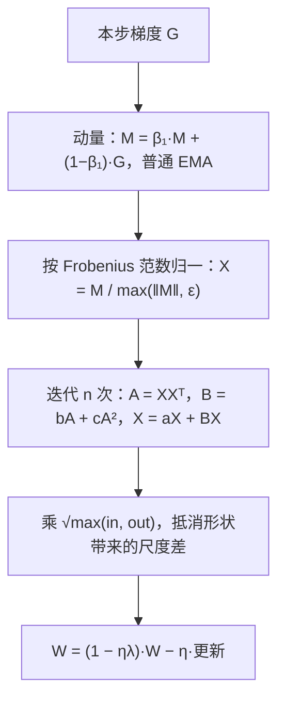
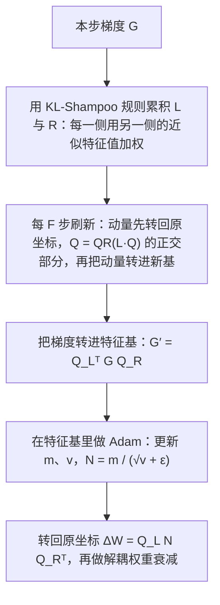

# SOAP 和 Muon 能把预训练 batch 推到一亿 token，但 SOAP 必须先把过期预条件修好

<!-- release-date: 2026-07-13 -->

> 本文依据 NVIDIA 的 **SOAP, Muon, and Beyond: Pushing LLM Pretraining Scales**，作者 Mikail Khona、Aditya Vavre、Boxiang Wang、Deyu Fu、Hao Wu、Mike Chrzanowski、Bryan Catanzaro、Dheevatsa Mudigere、Jeff Pool、Michael Lightstone、Mohammad Shoeybi、Mostofa Patwary、Nima Tajbakhsh、Tijmen Blankevoort，十四人全部署名 NVIDIA（PDF p. 1）。版本是 arXiv:2607.20548v1，2026-07-13 提交，封面标注 2026-7-24，共 32 页。页码均指这份 PDF 本身的页码。文中区分三件事：**论文写了什么**、**我们如何解释或验算它**、**哪些是外部资料补充**。
>
> 这是一篇优化器论文，不发布模型。它做三件事：在超大 batch 的 MoE 预训练上比较 AdamW、Muon、SOAP；修好 SOAP 在大 batch 下的不稳定；在 Megatron-LM 里给这类「要看整张矩阵」的优化器做一套不近似的分布式实现（PDF p. 1–2）。

## 读前先把几个词说成人话

预训练想跑得快，最直接的办法是加卡。加卡就要加数据并行，加数据并行就要把全局 batch 做大。可 batch 一大，默认的 AdamW 会先扛不住：loss 尖峰变多，多花的 token 换不来等比例的进步。

这篇论文问的是：换一个「看得见矩阵结构」的优化器，能不能把 batch 继续往上推？推到一亿 token 时，谁还稳？

后面反复出现的词先说清楚：

- **优化器（optimizer）**：拿到梯度之后，决定这一步权重怎么改的规则。
- **AdamW**：大模型预训练的默认优化器。它给每个参数**单独**记梯度的一阶、二阶滑动平均，再给每个坐标配一个步长（PDF p. 2）。
- **预条件（preconditioning）**：不直接用原始梯度改权重，先用一组统计量把梯度「摆正」：压住已经走得很猛的方向，抬一抬几乎没动的方向。
- **Kronecker 因子**：不存「所有元素两两相关」的巨大矩阵，只分别存一个「行相关」矩阵和一个「列相关」矩阵，用两者的组合近似完整相关。Shampoo 和 SOAP 都靠它省内存（PDF p. 3）。
- **SOAP**：Vyas 等人 2024 的优化器。先估计行、列两个方向的相关结构，把梯度转到它们的「特征方向」里，在那里做 Adam 式的逐元素自适应，再转回来（PDF p. 3）。
- **Muon**（MomentUm Orthogonalized by Newton-Schulz）：只认真对待**二维权重矩阵**。先累积动量，再把动量矩阵近似「正交化」，让各个方向的更新幅度拉平（PDF p. 3）。
- **更新 RMS（update RMS）**：一步更新里所有元素平方平均后开根号，衡量「这一步改动有多大」。
- **全局 batch（GBS）**：一步参数更新用到的全部 token。本文的基线是 3072 条 × 8192 token，约 2500 万 token，记作 1×（PDF p. 7）。
- **MoE（Mixture-of-Experts，混合专家）**：一层前馈拆成很多专家，每个 token 只激活其中几个。

## 一句话先说清

论文把结论分成三层（PDF p. 1–2）：

1. **在他们测过的规模上，SOAP 和 Muon 都持续优于 AdamW。** 规模是数十亿参数、万亿 token；全局 batch 最高到 1 亿 token 时，这两个优化器仍能稳住训练，AdamW 则会退化。
2. **SOAP 的标准实现在大 batch 下会「甩鞭」。** 根因是预条件跟不上当前梯度。修法是每一步都用当前梯度做 QR 刷新特征基，再把 Kronecker 因子的累积换成 KL 散度正则的估计。
3. **算法收益要配一套不切碎矩阵的分布式实现。** 他们给 Megatron-LM 写了 layer-wise 分布式优化器：整张矩阵分给不同的数据并行 rank，优化器的数学不做近似。

结论一节把推荐写得很直白：**KL-SOAP 总体最有效；内存不是瓶颈时，推荐 KL-SOAP 而不是 Muon**（PDF p. 19）。

读完全文要补三句限定。第一，AdamW 的退化只在 2 倍基线（5000 万 token）上直接画出来过；1 亿 token 那一档只比了 SOAP 与 Muon，没有 AdamW。第二，SOAP 只在稠密模型和 Qwen3-30B-A3B 结构上跑过，72B 模型上只有 Muon。第三，KL-SOAP 对 Muon 的优势只有训练 loss 曲线上「一致但轻微」的一点，没有下游评测。

### 一张实验地图

论文的曲线分散在正文和附录里，先把谁和谁在什么规模上比过排成一张表：

| 模型 | 训练 token | 比了什么 | batch | 图表 |
|---|---:|---|---|---|
| Nemotron-3-Nano-30B-A3B（混合注意力–Mamba MoE） | 3T | AdamW 1× 对 Muon 1× / 2× / 3× | 25M–75M | Figure 1，Table 5（PDF p. 10、p. 12） |
| Nemotron-3-72B-A8B（混合 LatentMoE，带 MTP） | 1T | AdamW 1× 对 Muon 2× | 25M / 50M | Figure 2，Table 5（PDF p. 10、p. 12） |
| Nemotron-3-Nano-30B-A3B | 1T | AdamW 1× 对 AdamW 2× | 25M / 50M | Figure 10（PDF p. 30） |
| 621M 稠密 Transformer | 约 0.025T | 过期预条件的 SOAP | 12.5M | Figure 4（PDF p. 14） |
| 8B 稠密 | 0.27T 后中断 / 0.6T | 过期预条件的 SOAP 对实时预条件 | 原文未写 | Figure 5（PDF p. 15） |
| Qwen3-30B-A3B 结构 | 1T | SOAP 有无 KL 协方差 | 原文未写 | Figure 6（PDF p. 16） |
| Qwen3-30B-A3B 结构 | 1T | Muon 对 SOAP，各自 1× / 2× / 4× | 25M–100M | Figure 7（PDF p. 17） |
| Qwen3-30B-A3B 结构 | 1T | Muon 对 MOP 对 SOAP | 24M | Figure 8（PDF p. 18） |

「72B」与「100M」两个头条数字落在不同的行上：72B 模型最大只跑到 50M，100M 只在 Qwen3-30B-A3B 结构上出现过。

### 一条阅读路线

只有半小时读原文，建议按这个顺序：

1. **p. 3–4 的第 2 节**：AdamW、Shampoo、SOAP、Muon 四个公式，以及 $\beta=0$ 时 Shampoo 退化成 Muon 的那一行。
2. **p. 4 的 3.1 节**：MoE 的专家为什么看不到大 batch。
3. **p. 8 的 5.2 节**：update-RMS matching 怎么让学习率在优化器之间可比。
4. **p. 10 Figure 1–2，p. 30 Figure 10**：Muon 能吃大 batch、AdamW 不能。
5. **p. 11–15 的 5.4 节与 Figure 4–5**：SOAP 的甩鞭与修法。
6. **p. 17–18 的 Figure 7–8**：KL-SOAP 对 Muon。
7. **p. 18–19 的第 6 节**：layer-wise 分布式优化器。

## 主要矛盾：看得见矩阵结构的优化器，要么不稳，要么装不进训练系统

引言先摆出优化器的双重身份（PDF p. 1）：

- **系统一侧**：优化器状态往往比模型参数本身更吃显存，直接决定怎么切分、怎么管显存；它在极端 batch 下能不能稳，决定训练能扩到多大的集群。
- **算法一侧**：它管数据效率、收敛速度和泛化。

过去十几年的选择，被一条很土的张力绑住了：AdamW、RMSProp、LaProp 这类按元素走的优化器最好写、最好切、最好扩；真正近似损失曲率的高阶方法理论上能迈更大的步，却因为复杂而不敢上前沿模型（PDF p. 1）。

AdamW 的盲点，论文写得很清楚：它把每个元素的更新当成独立事件，**忽略梯度之间的相关，也忽略权重作为线性算子的结构**（PDF p. 1）。一个线性层的权重是「把一个向量空间映到另一个向量空间」的矩阵，AdamW 只知道第 $(i,j)$ 个数该加多少。

Shampoo 族（SOAP、Eigen-corrected Shampoo、KL-Shampoo）和 Muon、Scion 这类谱方法是中间地带，想用可控的计算和内存换到二阶方法的好处。但论文马上补了一句：面对细粒度 MoE 这类前沿模型，它们仍然过不了可扩展性这关（PDF p. 2）。

于是矛盾变成：

> 同一个优化器，要同时在**大 batch 下稳**、**学习率能和 AdamW 公平比**、**在切分过的分布式系统里算得出完整的矩阵更新**。三件事缺一件，前面的收益都兑现不了。

论文的五条贡献正好对应这三件事，外加一个开源库（PDF p. 2）：用 update-RMS matching 在 MoE 上公平比较三种优化器；修好 SOAP 预条件计算的不稳定；在大 batch 下比较 SOAP 和 Muon；与 Megatron-LM 兼容的 layer-wise 分布式实现；开源 [Emerging-Optimizers](https://github.com/NVIDIA-NeMo/Emerging-Optimizers) 库。

## 三种优化器，差在改权重之前多看了哪一层结构

### AdamW：每个坐标自己决定步长

先说要算什么：对摊平后的梯度向量，分别维护「平均梯度」和「平均平方梯度」，用后者当每个坐标的步长分母。令 $g_t\in\mathbb{R}^{mn}$ 是把梯度矩阵 $G_t\in\mathbb{R}^{m\times n}$ 摊平后的向量（PDF p. 2）：

$$
m_t = \beta_1 m_{t-1} + (1-\beta_1)g_t,\qquad
v_t = \beta_2 v_{t-1} + (1-\beta_2)\, g_t \odot g_t
$$

$\odot$ 是逐元素相乘。更新方向大致是 $m_t$ 逐元素除以 $\sqrt{v_t}+\epsilon$。某个坐标最近的梯度又大又稳，$v$ 就大，步长被压小；几乎没动过的坐标，步长相对更大。

好处在系统一侧：状态和计算都按元素走，**可以任意切分**。代价也在这里：行与行、列与列、头与头、专家与专家之间的相关，AdamW 一概不看（PDF p. 3）。

### Shampoo：分别记住行相关和列相关

Shampoo 把梯度当矩阵看，维护两个对称矩阵（PDF p. 3）：

$$
L_t = \beta_2 L_{t-1} + (1-\beta_2) G_t G_t^\top,\qquad
R_t = \beta_2 R_{t-1} + (1-\beta_2) G_t^\top G_t
$$

$L_t$ 记「哪些行常常一起动」，$R_t$ 记「哪些列常常一起动」。完整的两两相关矩阵是 $(mn)\times(mn)$，存不下；Kronecker 分解把它拆成 $m\times m$ 加 $n\times n$。更新方向用两个因子的逆四分之一次幂（PDF p. 3）：

$$
u_t = \bigl(R_t^{-1/4} \otimes L_t^{-1/4}\bigr) g_t
$$

直觉是：哪组方向上的梯度能量已经很大，就在那组方向上把步长压下来。这叫 **白化（whitening）**：先把相关结构洗平，再迈步。

### SOAP：在 Shampoo 的特征基里做 Adam

SOAP 不直接用矩阵幂去乘梯度，而是三步（PDF p. 3，式 1）：

$$
u_t = Q_L\,\operatorname{Adam}\!\left(Q_L^\top m_t Q_R\right) Q_R^\top
$$

$Q_L$、$Q_R$ 是 $L_t$、$R_t$ 的特征向量矩阵。先把梯度转到这组特征基里，行、列相关在那里近似被对角化；在转过的坐标系里做 Adam 式逐元素自适应；再转回原坐标。

可以想成先把桌子转一个角度，让相关的坐标轴尽量分开，再在每条轴上用 Adam 的老办法调步长，最后把桌子转回去。特征基碰巧是单位阵时，旋转什么也没做，SOAP 就是 AdamW。论文据此说 SOAP 比古典 Shampoo 更接近 AdamW，超参可能更好迁移（PDF p. 3）。

代价写得很明确：Shampoo 和 SOAP 都要维护全精度的 Kronecker 因子和特征基，**内存明显比 AdamW 大**（PDF p. 3）。

### Muon：不存预条件，直接把动量矩阵梳齐

Muon 走相反的路：不估计、也不存储预条件矩阵，先照常做动量，然后把动量矩阵正交化（PDF p. 3）。

目标是动量 $M_t$ 的 **极因子（polar factor）**，即离它最近的正交矩阵。若 $M_t=U\Sigma V^\top$，极因子就是 $UV^\top$：方向保留，奇异值全部变成 1。每步对每个矩阵做精确 SVD 太贵，所以用 Newton-Schulz 迭代，靠矩阵多项式去逼近（PDF p. 3）。

对二维权重而言，这是一次 **谱更新**：它管的是各个奇异方向上的尺度，不是每个坐标自己的分母（PDF p. 3）。

### 三者其实在同一条谱上

论文给了一条把它们连起来的等式（PDF p. 3）：

$$
(GG^\top)^{-1/4}\, G\, (G^\top G)^{-1/4} = UV^\top
$$

读法是：把 Shampoo 的两个滑动平均都关掉（$\beta_1=\beta_2=0$），它的预条件更新就恰好是 Muon 的极因子。附录 A.1 从 SOAP 这一侧补全了同一个故事：关掉滑动平均时，梯度转到特征基后正好变成奇异值对角阵 $\Sigma$；若再把 Adam 近似成符号函数，更新就是 $-\eta\,UV^\top$（PDF p. 26，式 8）。

**我们如何解释它。** AdamW 调「每个格子迈多大」；Muon 调「整张地图各方向迈得是否均匀」；SOAP 先把地图转到相关已拉开的坐标系，再在那里做 AdamW。三者都在压住少数主导方向吃掉全部更新预算，只是取了三个不同的工程点。

规模化时的差别，论文在第 2 节末尾一段说完（PDF p. 3–4）：

| | 看到的结构 | 额外状态 | 内存相对 AdamW | 切分难度 |
|---|---|---|---|---|
| AdamW | 无，逐元素 | 一阶、二阶矩 | 基准 | 按元素，可以任意切 |
| SOAP | 行、列相关 | Adam 两个矩，加 $L$、$R$ 与特征基 $Q_L$、$Q_R$ | 大得多 | 要整张矩阵，布局复杂；对数值稳定与预条件新鲜度敏感 |
| Muon | 奇异方向 | 只有动量 | 更低，不存二阶矩 | 同样要整张矩阵；优化器步计算更重，随 Newton-Schulz 迭代次数涨 |

## 为什么 MoE 的大 batch 其实是两套物理

这张图按原文式 (2) 换算，是比例示意，不是实测。3.1 节是全文最值得记的动机之一。MoE 的绝大多数参数住在专家线性层里，常常超过总参数的 90%；这些层因为 top-$k$ 路由，看到的有效 batch 比全局 batch 小得多（PDF p. 4）。设全局 batch 为 $B_{\mathrm{Global}}$ 个 token，共 $N$ 个专家，每个 token 激活 $k$ 个，理想负载均衡时单个专家的有效 batch 是（PDF p. 4，式 2）：

$$
B_{\mathrm{eff}}^{\mathrm{expert}} = B_{\mathrm{Global}} \times \frac{k}{N}
$$

细粒度 MoE 里 $k\ll N$。论文举的例子是 top-8、256 个专家，比值 0.03125（PDF p. 4）。

后果是：稀疏的专家参数停在「比较好优化」的小有效 batch 区；稠密参数和共享参数必须吞下整个全局 batch。所以把全局 batch 推大，主要压的是稠密部件的大 batch 耐受力（PDF p. 4）。MoE 预训练因此特别依赖一个在极端 batch 下仍能让稠密参数稳定、token 高效的优化器。

**我们的换算。** 用论文自己的三个 MoE 配置（Table 2，PDF p. 7），全局 25M 时单个专家分别只有：Nano 约 1.17M，72B 约 0.29M，Qwen3-30B-A3B 约 1.56M。72B 那一档专家不到百万 token，而注意力、共享专家、Mamba 里的稠密投影要面对完整的 25M 到 100M。

**可迁移启发。** 评估一个优化器能不能吃大 batch，要分开问稠密部件和专家部件。把 MoE 的全局 batch 当成「每个参数都看到的 batch」，会同时高估专家的 batch、低估稠密部件的压力。

## 换 batch、换优化器之前，先把更新尺度对齐

### 换 batch：平方根缩放

后面的对照会把全局 batch 最多改到 4 倍。不先规定学习率怎么跟着变，所有「A 优于 B」都可能只是步长没对齐（PDF p. 4）。

3.2 节用 SGD 讲这条逻辑。小批量梯度的协方差与 batch 成反比，$\mathrm{Cov}(\hat g_B)=\Sigma/B$；参数更新 $\Delta\theta=\eta\hat g_B$ 的协方差就是 $\eta^2\Sigma/B$（PDF p. 4）。从 $B$ 换到 $B'$ 时，要让更新的随机波动尺度不变，令两边协方差相等，得到平方根缩放（PDF p. 5，式 3）：

$$
\eta' = \eta \sqrt{\frac{B'}{B}}
$$

论文说线性缩放也有人提过，但 batch 跳得很猛时平方根更安全，不会让学习率爆掉（PDF p. 5）。

### 换优化器：update-RMS matching

换优化器最隐蔽的不公平，是让一方每步改权重改得更大。loss 掉得快，其实只是学习率没对齐。论文采用 Kimi-Moonshot 提出的 **update RMS matching**：让不同优化器的参数更新 RMS 一致，把为 AdamW 调好的学习率直接迁过去，省掉一次网格搜索（PDF p. 8）。

**SOAP 天然对齐。** 要证的是：SOAP 的更新 $\Delta W=Q_L N Q_R^\top$ 和旋转前的 $N$ 范数相等。因为 $Q_L^\top Q_L=I$、$Q_R^\top Q_R=I$（PDF p. 8）：

$$
\lVert\Delta W\rVert_F^2
= \operatorname{Tr}\!\left(Q_R N^\top Q_L^\top Q_L N Q_R^\top\right)
= \lVert N\rVert_F^2
$$

旋转不改变 Frobenius 范数，所以 SOAP 在特征基里做完 Adam 再转回来，更新大小和 AdamW 同量级，学习率可以直接比。

**Muon 要补一个因子。** 正交化之后的矩阵范数由形状决定，不会自动等于 AdamW。论文把 Kimi 的 RMS matching 用到 Muon 上，得到一个依赖动量 EMA 阻尼的修正因子（PDF p. 8）：

$$
\sqrt{\frac{1-\beta_1}{1+\beta_1}} \approx 0.2
$$

$\beta_1=0.9$ 时是 $\sqrt{0.1/1.9}\approx0.229$。

**我们如何解释它。** Moonshot 那篇里的 0.2 是「AdamW 实测更新 RMS 大约在 0.2–0.4」的经验值（外部补充，见 Muon-is-Scalable-for-LLM-Training 一篇）。这里的写法给了它一个来由：梯度近似独立同分布时，$\beta_1$ 的 EMA 会把逐元素的 RMS 缩小到原来的 $\sqrt{(1-\beta_1)/(1+\beta_1)}$。两篇的 0.2 是同一个量级、不同的推导。另外，Algorithm 1 第 12 行只写了按形状的 $\sqrt{\max(\mathrm{in},\mathrm{out})}$ 缩放，约 0.2 的因子只出现在 5.2 节正文，没有写进算法框（PDF p. 8–9）。照着算法框实现时，要到开源代码里确认这一步乘在了哪里。

还有一个和常见 Muon 配方不同的选择：Nesterov 动量在他们的实验里没有改善收敛，Muon 和 SOAP 都改用普通 EMA（PDF p. 8）。这只是这个设定下的观察，不是「Nesterov 普遍无用」。

### Algorithm 1：Muon 一步做了什么

整张算法框做四件事：累积动量，用多项式迭代逼近极因子，按矩阵形状缩放，解耦权重衰减后写回（PDF p. 9）。

这张流程图按原文 Algorithm 1（PDF p. 9）重画，是步骤示意。超参见 Table 4（PDF p. 9）：

| 符号 | 含义 | 取值 |
|---|---|---|
| $\beta_1$ | 动量 EMA | 0.9 |
| $\lambda_t$ | 解耦权重衰减 | 0.1 |
| $n$ | Newton-Schulz 迭代次数 | 16 |
| $(a_i,b_i,c_i)$ | 多项式系数 | PolarExpress |
| $\epsilon$ | Frobenius 归一化的下限 | $10^{-7}$ |

迭代 16 次、系数来自 PolarExpress，比很多公开 Muon 实现在正交化上花得更多。附录 Figure 11 在 Nano-V3、1T token 上把它和常用的五次多项式 Newton-Schulz 比过：两条训练曲线几乎重合，相对差在最初一小段之后大约只在 ±0.2% 内（读自 Figure 11，PDF p. 31）。换一套近似系数，本身没有拉开训练曲线。

## Muon 对 AdamW：batch 放大之后谁还稳

5.3 节的主张分两句（PDF p. 8–9）：

- 基线 1× batch 上，Muon 已经 loss 更低、尖峰更少；
- 把全局 batch 再放大时，AdamW 很快碰到不稳定和收益递减，Muon 仍能用上多出来的数据并行。

他们还补了一句：在他们的数据上，训练 loss 与留出验证 loss 相关，所以后面的曲线都画训练 loss（PDF p. 9）。

### Nano-V3：大 batch 先落后，token 拉长后追上

图注自己写了读法：batch 更大的一方通常先落后，token 视野拉长后才会超过 batch 更小的一方（PDF p. 10）。这张图里 AdamW 只跑了 1×，它是 Nemotron-3 Nano 原版的 AdamW 基线（PDF p. 10）。

### 72B-A8B：Muon 用两倍 batch，仍比 AdamW 低、没有尖峰

这是「评测到 72B MoE」那句话的主曲线（PDF p. 2、p. 10）。要看清它比的是什么：Muon 用了两倍 batch 和 batch 爬坡，AdamW 用 1× 基线。优化器、batch 和爬坡三件事同时变了，72B 上没有 Muon 1× 或 AdamW 2× 的对照。

### AdamW 自己放大 batch：同一套技巧帮不了它

附录 C 的结论：让 Muon 能跑大 batch 的那两招（batch 爬坡加平方根学习率）帮不了 AdamW（PDF p. 29）。50M 那条用了爬坡和平方根缩放，仍比 25M 差、尖峰更多。AdamW 的 $\beta_1$、$\beta_2$、$\epsilon$ 该怎么随 batch 调，列为未来工作（PDF p. 29）。

**论文的假设。** 极端 batch 下梯度噪声变小，AdamW 的逐元素二阶矩 $v_t$ 可能校准失准、过度自信，步长变得次优；Muon 的正交化按结构归一化更新方向，与坐标尺度无关，对大 batch 的方差变化更不敏感（PDF p. 9）。这是假设，没有单独的消融去证明。

**我们如何解释它。** 三张图合起来，支持的是「Muon 能吃 2–3 倍 batch 而 AdamW 在 2 倍时已经退化」。摘要里「到 1 亿 token 时 AdamW 退化」那一半，全文没有直接的 AdamW 100M 曲线；100M 只出现在 SOAP 对 Muon 的比较里。

### batch 爬坡：从 2M 开始倍增

大 batch 实验（Muon 和 AdamW 都算）在训练早期加了一段 batch 爬坡：从 256 条样本（约 2M token）起，每隔 $S$ 步翻倍，在固定的 $N$ 步内爬到目标 batch，与总 token 视野无关（PDF p. 9、p. 11）。学习率 warmup 跟着 batch 走，近似保持 $\eta\propto\sqrt{B}$，让每个阶段的更新方差尺度不变（PDF p. 11）。$S$ 与 $N$ 的数值原文没有给。

原文 Figure 3 画了两条爬坡曲线（PDF p. 11）。读图可见：目标 50M 那条在约 2M、4M、8M、17M、34M 各停一段，约 52B token 时跳到 50M；目标 75M 那条多一级约 67M，约 118B token 时跳到 75M。

他们承认没有按模型规模调爬坡：临界 batch 通常随训练 loss 变化，更大的模型理应更早到达更高的临界 batch（PDF p. 11）。

### 下游评测：代码和常识更好，但不是每一格都赢

（PDF p. 12，Table 5。1× = 25M token；「8B Hybrid」即 72B 总参、8B 激活的混合 LatentMoE。）

| 指标 | Nano Muon 3× | Nano Muon 2× | Nano Muon 1× | Nano AdamW 1× | 8B Hybrid Muon 2× | 8B Hybrid AdamW 1× |
|---|---:|---:|---:|---:|---:|---:|
| MMLU | 74.00 | 74.80 | 73.71 | 73.38 | 74.89 | 74.59 |
| MMLU PRO CoT | 55.61 | 56.77 | 58.19 | 54.45 | 59.60 | 57.52 |
| HumanEval | 62.22 | 64.79 | 62.56 | 63.26 | 65.79 | 57.62 |
| HumanEval+ | 59.18 | 62.13 | 59.63 | 58.63 | 61.86 | 56.40 |
| MBPP | 68.15 | 69.92 | 68.91 | 67.61 | 70.99 | 66.79 |
| MBPP+ | 58.02 | 57.94 | 57.80 | 59.36 | 55.26 | 55.07 |
| Coding Avg. | 61.89 | 63.70 | 62.23 | 62.22 | 63.48 | 58.97 |
| Math 500 | 73.25 | 74.05 | 75.50 | 71.50 | 75.60 | 80.20 |
| GSM8k CoT | 89.69 | 89.08 | 89.54 | 87.79 | 85.97 | 87.87 |
| Math Avg. | 81.47 | 81.57 | 82.52 | 79.65 | 80.79 | 84.04 |
| Race | 85.84 | 85.55 | 85.45 | 85.17 | 86.32 | 85.26 |
| ARC Challenge | 89.16 | 89.50 | 88.05 | 88.40 | 89.16 | 89.09 |
| Winogrande | 74.19 | 72.69 | 74.51 | 72.93 | 75.37 | 73.95 |
| Hellaswag | 81.23 | 81.39 | 81.51 | 81.06 | 82.37 | 82.33 |
| Commonsense Avg. | 82.61 | 82.28 | 82.38 | 81.89 | 83.31 | 82.66 |

论文的读法：两个架构上，Muon 在基线 batch 就匹配或超过 AdamW，并随 batch 放大继续变好，收益最明显的是代码和常识推理；这说明 Muon 的大 batch 效率能迁移到约 $5\times10^{22}$ 预训练 FLOPs 规模的 MoE（PDF p. 11）。

「全面更好」这句话表撑不住，几处反向格子同样是论文数据：

- Nano 的代码平均在 1× 上几乎打平（62.23 对 62.22），2× 才拉开到 63.70，3× 又回到 61.89；MBPP+ 上 AdamW 的 59.36 高于所有 Muon 列。
- **72B 档的数学是 AdamW 更好**：Math 500 80.20 对 75.60，数学平均 84.04 对 80.79，GSM8k 也是 AdamW 更高。原文没有解释这一格。
- 72B 档真正拉开的是代码：代码平均 63.48 对 58.97，HumanEval 65.79 对 57.62。

同一节还报告了一个架构敏感性：Muon 最好只打在稠密线性投影上，Mamba 的 conv1D 权重退回 AdamW 收敛更好（PDF p. 11），细节见后文附录一节。

## SOAP 的甩鞭：过期的预条件比不做预条件更危险

5.4 节先承认：把 SOAP 扩到大 batch、大参数量时，他们撞上了严重的经验障碍（PDF p. 11）。

### 旧问题：参考实现为了省 QR，让特征基落后

SOAP 的参考实现（脚注指向 nikhilvyas/SOAP）为了省 QR 分解的开销，**不频繁刷新特征基**，比如每 10 步一次；而且刷新时**把当前这一步的梯度排除在外**（PDF p. 11–12）。小模型、较高的刷新间隔下这没问题；大 batch 预训练里，它在训练早期引发剧烈的不稳定：权重梯度范数先振荡，语言模型 loss 紧跟着尖峰（PDF p. 12）。

论文把原因叫作 **过期预条件（stale preconditioner）**：大 batch 训练早期损失曲面变化很快，却拿过时的梯度统计去转当前梯度，优化轨迹就像被弹弓甩出去（PDF p. 12）。

621M 模型上，振荡最终被阻尼掉，模型还能收敛（PDF p. 12）。图上要看的是顺序：每次都是梯度范数先尖、loss 后跳，符合「预条件把梯度转错了方向」的解释。

放大到 8B 稠密模型，同样的滞后变成灾难：训练发散，质量显著差于 AdamW（PDF p. 12）。图里只画了两条 SOAP，没有画 AdamW。

### 新设计：每步刷新，而且把当前梯度算进去

5.4.2 节的关键句是：只把刷新频率提到每一步**不够**，如果当前这一步的梯度仍被排除在外；真正解决问题的是**每步 QR** 加上**当前梯度进入特征基计算**这一组合（PDF p. 13）。改成实时梯度统计后，SOAP 消除了 loss 尖峰，语言模型 loss 与 Muon 相当（PDF p. 13）。论文注明，这种做法在原版 SOAP 里就有，但 Anil 等人的可扩展 Shampoo、KL-Shampoo 等工作里没有（PDF p. 13）。

附录 E 补了两点：必须**每步**做 QR 才能压住尖峰，因为训练早期预条件的基变化很快，更慢的日程跟不上；频率到了每步之后，用 QR 还是用对称特征分解 `eigh` 几乎没差，所以默认用更便宜的 QR（PDF p. 31；Figure 13，PDF p. 32）。

**我们如何解释它。** 这不是「特征基这个想法错了」，而是「特征基的刷新策略在大 batch 早期不够新」。优化器状态里最贵的那部分一旦变成过期地图，步子迈得越大，走错方向的惩罚越大。AdamW 没有这张地图，Muon 每步现做一张，都不会有过期问题。

**代价。** 每步对每个矩阵做两次 QR。原文没有给这部分的吞吐开销，结论一节把「优化 KL-Shampoo 特征基更新的矩阵乘吞吐」列为待改进项（PDF p. 19）。

### Algorithm 2：KL-SOAP 一步在做什么

整张算法框做五件事（PDF p. 13）：

这张流程图按原文 Algorithm 2（PDF p. 13）重画，是步骤示意。三处细节值得单独说。

**累积因子。** 先用当前特征基抽出近似特征值 $\lambda_L=\mathrm{diag}(Q_L^\top L_{t-1}Q_L)$，右侧同理；再用**另一侧**的特征值加权累积，例如 $L_t$ 的新增项是 $G_t(\lambda_R+\epsilon)^{-p}G_t^\top$ 除以输出维度（PDF p. 13）。

**刷新特征基。** $Q_L=\mathrm{QR}(L_tQ_L).Q$ 是一次正交迭代：拿当前 $L$ 乘上旧的 $Q$，做 QR，留下新的正交部分。刷新前先把 Adam 动量用旧基转回参数空间，刷新后再用新基转回去（PDF p. 13）。不这样做，基转了、动量还停在旧坐标系，等于拿错位的矩去除新方向上的梯度。

**超参。** Table 6（PDF p. 13）：

| 符号 | 含义 | 取值 |
|---|---|---|
| $\beta_{\mathrm{kron}}$ | Kronecker 因子的 EMA 系数 | 0.95 |
| $\beta_1$ | 特征基内的一阶矩 EMA | 0.9 |
| $\beta_2$ | 特征基内的二阶矩 EMA | 0.95 |
| $p$ | KL-Shampoo 协方差更新的指数 | $-1$ |
| $F$ | 特征基刷新频率 | 1（每步） |
| $\lambda_t$ | 解耦权重衰减 | 0.1 |
| $\epsilon$ | KL 协方差与 Adam 的数值下限 | $10^{-8}$ |

**算法框里有两处与表和附录对不上。** 第一，框里三个 EMA 都写成「$(1-\beta)$ 乘旧量、$\beta$ 乘新量」，而 Algorithm 1 与第 2 节的写法是「$\beta$ 乘旧量」；按表里的 0.9、0.95 取值和惯例，框面写法会把平滑强度整个颠倒。第二，$p=-1$ 代入框里的 $(\lambda+\epsilon)^{-p}$ 得到的是乘以 $\lambda$，而附录 A.3 写明 KL-Shampoo 用的是**另一侧因子的逆**（PDF p. 28，式 11）。原文没有说明这两处。外部补充：开源库在论文提交当天的版本里，这两处都按惯例实现（EMA 是 $\beta$ 乘旧量；特征值取 $-1$ 次幂，即逆），见文末资料一节。

## KL 协方差：第二层稳定器

**旧问题。** 就算已经每步实时刷新，Kronecker 因子按 $GG^\top$、$G^\top G$ 累积，在规模上仍可能不稳（PDF p. 14）。

**新设计。** 换成 KL-Shampoo 那种 KL 散度正则的协方差估计，作为第二层稳定（PDF p. 14）。

论文把收益拆成两部分：更低的最终 loss 来自对梯度协方差更好的估计；更少的尖峰来自更新的谱性质（PDF p. 14）。

**工作机制。** 附录 A.3 用 SVD 解释为什么更稳。设梯度 $G=U\Sigma V^\top$，两个因子已大致对齐到梯度的奇异向量上。KL-Shampoo 的更新是每一侧用另一侧的逆去加权（PDF p. 28，式 11）：

$$
S_a \leftarrow (1-\beta)\,S_a + \beta\, G\,S_b^{-1} G^\top
$$

在不动点上，两侧的特征值满足 $\Lambda\approx\Sigma^2\Lambda^{-1}$，于是 $\Lambda\approx\Sigma$（PDF p. 28，式 12）。对比标准 Shampoo 跟踪的是 $\Lambda\approx\Sigma^2$。要分解或求逆的矩阵，条件数因此从 $(\sigma_{\max}/\sigma_{\min})^2$ 降到 $\sigma_{\max}/\sigma_{\min}$（PDF p. 14，式 4；PDF p. 28，式 13）：

$$
\kappa(S_{\mathrm{KL\text{-}Shampoo}})=\sqrt{\kappa(S_{\mathrm{Shampoo}})}
$$

梯度病态时，条件数小的矩阵在特征分解里更不容易被浮点噪声放大。论文把「这就是尖峰消失的原因」明确写成**假设**（PDF p. 14）。

附录 A.2 还补了 Hessian 视角：Shampoo 近似的 Hessian，特征向量是左右奇异向量的 Kronecker 积 $u_i\otimes v_j$，特征值正比于 $\sigma_i^2\sigma_j^2$；预条件在 Shampoo 里相当于乘 $H^{-1/4}$，在 SOAP 里相当于 $H^{-1/2}$，压住大奇异方向、抬起小奇异方向（PDF p. 27）。这是解释，不是新实验。

**可迁移启发。** 带状态的预条件有两个一等超参：刷新多勤，以及当前样本进不进统计。先把「新鲜度」修好，再考虑换更贵的分解算法。

## KL-SOAP 对 Muon：优势一致，但很薄

5.5 节为了只比算法，做了两处对齐（PDF p. 14）：

- 张量并行都用最简单的 blocking（只拿本卡那一块做预条件）；
- 关掉 Muon 的 QKV 切分，把融合的 QKV 投影当成一张矩阵，和他们 SOAP 实现的默认行为一致。

比较对象是 Qwen3-30B-A3B 结构（PDF p. 14）。

4× 就是 1 亿 token 的全局 batch。图注特意写了这组实验**没有用任何 batch 爬坡**（PDF p. 17）。正文对应的句子是：用实时梯度统计的 SOAP 与 Muon 的语言模型 loss 相当（PDF p. 13）。

论文还加了一个对照 **MOP（Momentum Orthogonalized by Polar）**：把 Muon 的 Newton-Schulz 换成经 SVD 的精确极分解（PDF p. 16），用来衡量 Muon 的正交化近似差多少。

正文的判断是：预训练的大部分时间里，KL-SOAP 对 Muon 保持一致但轻微的交叉熵优势（PDF p. 16）。

**我们如何解释它。** MOP 略优于 Muon，说明 Newton-Schulz 在这个规模上还没把极因子逼到位；可 Figure 11 里 PolarExpress 16 步和旧的五次多项式又几乎重合。两件事可以同时成立：换一套近似系数不足以拉开曲线，换成精确 SVD 则能看到一点。原文没有把这一点量化成「值不值得每步做 SVD」。

### $\epsilon$ 在两种优化器里不是同一个旋钮

SOAP 的 $\epsilon$ 类似 AdamW：给旋转后二阶矩的分母、以及 KL-Shampoo 累积里的特征值铺一层地板；因为 SOAP 实际上对 Kronecker 因子的特征值做逆平方类的运算，这个 $\epsilon$ 也可以看成 Shampoo 预条件最小有效特征值的软下限（PDF p. 16）。Muon 的 $\epsilon$ 则出现在 Newton-Schulz 之前的归一化 $M/\max(\lVert M\rVert_F,\epsilon)$ 里，下界的是 Frobenius 范数，不是逐元素的二阶矩（PDF p. 16）。

所以 $\epsilon$ 被当作各优化器自己的超参：SOAP 与 AdamW 用 $10^{-8}$，Muon 用 $10^{-7}$。论文明写**没有系统搜索 $\epsilon$**，它该怎样随模型规模、参数化、精度和训练视野变化，列为后续工作（PDF p. 16）。

## 分布式实现：整层给一张卡，而不是把一张矩阵切碎

### 张量并行里的三种预条件范围

张量并行（TP）会把一层的权重切到多张 GPU 上。除了最简单的 blocking，Emerging-Optimizers 还支持两种用整层权重做预条件的方式（PDF p. 5）：

| 模式 | 做法 | 适用 |
|---|---|---|
| blocking | 只拿本卡拥有的那一块做预条件 | 最简单，但是近似 |
| Duplicated | 先在 TP 组内 all-gather 整层权重，每张卡各自跑 Newton-Schulz | 小层，通信是瓶颈时 |
| Distributed | 每次 Newton-Schulz 迭代里，把第一次矩阵乘的中间结果 all-reduce | 大层，计算是瓶颈时 |

后两种先用整层的统计量做归一化，因此和不做 TP 时数学上等价（PDF p. 5）。5.5 节的受控比较两边都故意用了 blocking（PDF p. 14）。

### 数据并行里的切分：layer-wise

**旧问题。** ZeRO-1 那类「把优化器状态均匀切给各个数据并行 rank」的做法，不能直接用在 Muon、SOAP 上：每个 rank 只有碎片，算不出完整更新，还得额外通信把张量拼回来（PDF p. 5）。常规 FSDP 按元素对称切分，同样和「必须看到整张二维矩阵」冲突（PDF p. 6、p. 18）。

**新设计。** 不同层的参数分给不同的数据并行 rank，每张 GPU 拿到的是**完整的若干层**，预条件才算得出来（PDF p. 5）。第 6 节给了三条实现要点（PDF p. 18–19）：

1. **负载均衡**：不摊平切开单个张量，而是把整张参数矩阵按大小排序，轮流分给各 GPU。各卡内存大致均匀，矩阵不被切碎。
2. **参数更新**：每张 GPU 只更新分到自己的参数，二维矩阵走 Muon 或 SOAP，普通向量走 AdamW，结果摊平进一块 buffer，等下一步前向时收集。
3. **重叠的参数 all-gather**：同步按 Megatron DDP 的 bucket 切成若干段，和模型执行顺序对齐，限制消息大小并形成流水。前向在用当前 bucket 的权重算激活时，异步 all-gather 下一个 bucket 的更新后权重，把网络延迟藏在计算后面。因为矩阵保持完整，各卡参数总量略不均，不能用等长的 all-gather，改用变长的 **allgather-V**，这样不需要为对齐补零，也不用再切碎张量。

**收益。** 摘要里「不近似优化器计算」指的就是这件事：blocking 那种「只拿本卡碎片做预条件」是近似；layer-wise 让每张卡看到整层，优化器数学保持原样（PDF p. 1、p. 18）。

**代价与边界。** 各卡负载只能「大致」均匀；SOAP 在这套实现上还没走完：layer-wise 还需要原生支持 SOAP 的张量并行、处理融合张量（比如注意力的 QKV 切分）、提高 KL-Shampoo 特征基更新的矩阵乘吞吐（PDF p. 19）。摘要提到的「进一步加速 layer-wise 实现的系统级改进」，正文没有给出具体数字（PDF p. 1）。

TP 那张表和 layer-wise 是两条不同的轴：前者解决**张量并行内部**要不要、怎样为 Newton-Schulz 拼回整层；后者解决**数据并行上**优化器状态怎么切。

更远的方向是让 DDP 的一维连续 buffer 变成 **由优化器决定的布局**：优化器预先决定参数与梯度 buffer 怎么切，让通信 bucket 对齐二维计算的结构。Megatron-LM 里这条工作在 PR #4509，计划用 reduce-scatter 替换梯度 all-reduce（PDF p. 19）。

相关工作里另外两条系统路线：veScale-FSDP 的 RaggedShard 允许不对称、任意粒度的切分，把完整参数动态收集到一台设备上做复杂计算再异步散回；Canzona 把优化器状态的逻辑归属和模型参数的物理分布解开，数据并行上保持矩阵完整，张量并行上用异步流水线藏住矩阵重建（PDF p. 6）。

**可迁移启发。** 分片边界必须服从算法语义。Muon、SOAP 要整张矩阵，按元素切碎就等于改了算法。layer-wise 的取舍是：放弃「每个张量切得绝对均匀」，换来「每一步仍是原来那个优化器」。

## 附录里改变落地判断的几件事

### MXFP8：loss 略差，多数下游反而更高

附录 B 用 NVIDIA 在 Blackwell 上的 MXFP8 配方，配 Muon，把 Nano-V3 和 8B Hybrid LatentMoE 各训 1T token，全部在 2× batch（50M）下（PDF p. 29）。结论：MXFP8 有小的 loss 差距，但多数下游评测高于 BF16；把剩下走 AdamW 的参数换成 Lion（$\beta_1,\beta_2=0.95,0.98$）还能再改善 loss 和评测（PDF p. 29）。

（PDF p. 29，Table 7 的聚合行。）

| 指标 | Nano BF16 | Nano MXFP8 | 8B Hybrid BF16 | 8B Hybrid MXFP8 | 8B Hybrid MXFP8 + Lion |
|---|---:|---:|---:|---:|---:|
| MMLU | 69.33 | 67.84 | 74.89 | 75.7 | 76.00 |
| MMLU PRO CoT | 51.20 | 50.37 | 59.6 | 61.6 | 62.2 |
| Coding Avg. | 56.55 | 58.78 | 63.48 | 64.02 | 65.00 |
| Math Avg. | 77.64 | 76.31 | 80.79 | 83.15 | 82.63 |
| Commonsense Avg. | 78.76 | 79.46 | 83.31 | 83.53 | 84.65 |

Nano 的 MMLU 与数学在 MXFP8 下略降，代码与常识略升；8B Hybrid 上 MXFP8 多数更好，Lion 再把代码与常识往上推，数学平均略低于纯 MXFP8。「多数下游更高」有表支持，不是每一格都升。Nano 这里是 1T token，数字不能和 Table 5 里 3T 的 Nano 直接比。

### Conv1D：正交化不是对所有算子都合理

附录 D：混合架构里的 Mamba2 层，把 Conv1D 参数从 Muon 拿出来改走 AdamW，训练和验证 loss 有温和但一致的改善，Figure 12 标的是约 0.1%（PDF p. 29、p. 32）。那张图只训到约 0.16T token。理由是：Conv1D 编码的是在每个序列位置上共享、反复使用的局部时间滤波器，正交性约束在几何上没有依据，不像普通线性投影（PDF p. 31）。结论一节补了更重的一句：给 Mamba2 的 Conv1D 做正交化会伤精度，有时以 NaN 的形式失稳（PDF p. 19–20）。

这指向一个原则：矩阵优化器默认「这块参数是满秩线性算子」，不是这种算子就不要硬套。论文把 MLA、LoRA 与满秩预条件假设的相互作用列为待查，并指向按张量形状和算子职能把参数分给 AdamW 或 Muon 的混合配方（PDF p. 20）。

### 切不切 QKV：早期有差，1T 终点没有

附录 D.1：Qwen3-30B-A3B 结构上，Muon 在正交化前把融合的 QKV 切开，早期 loss 更低；训满 1T token 时两条线重合（PDF p. 30–31，Figure 9）。所以 5.5 节为了和 SOAP 对齐而关掉 QKV 切分，牺牲的主要是早期曲线。结论一节仍把「给 SOAP 做 QKV 切分」列为待办（PDF p. 19）。

### 正交化的数值地板

最后一条未来工作是给更大规模的警告（PDF p. 20）。模型越大，矩阵越大，梯度奇异值的长尾越重。优化器步在 FP32 里做，这些小奇异值和对应的向量很容易掉到 FP32 机器精度以下：$2^{-23}\approx1.19\times10^{-7}$。若 Muon 的 Newton-Schulz 在 BF16 里做，精度更粗：$2^{-7}=0.0078125$。小奇异值往往是数值噪声而不是信号，等于铺了一层噪声地板。截断或正则化的正交化、以及对应的硬件友好算法，仍是开放问题。

## 结论与未来工作

第 7 节的推荐写死了：SOAP 和 Muon 都持续优于 AdamW，并能扩到明显更大的预训练 batch；KL-SOAP 总体最有效，内存不是瓶颈时推荐它而不是 Muon（PDF p. 19）。Megatron-LM 集成和 Emerging-Optimizers 都已开源。

未来工作按原文顺序是五条（PDF p. 19–20）：

1. SOAP 的张量并行、融合张量与 QKV 切分、KL 特征基更新的吞吐；
2. 由优化器决定的 DDP buffer 布局；
3. 优化器与架构共同设计（Conv1D、MLA、LoRA）；
4. 大 batch 与 batch 规模定律：本文**没有**导出或测量规模定律，只把 batch 当作系统约束往上推，目的是减少数据并行通信、提高 GPU 利用率；
5. 更大规模、更长视野上更准确的正交化，以及长尾奇异值的数值问题。

## 限制与未公开信息

**论文自己写明的限制：**

- 没有系统搜索 $\epsilon$（PDF p. 16）；
- 没有按模型规模调 batch 爬坡，也没有测 batch 规模定律（PDF p. 11、p. 20）；
- Muon 对 SOAP 的受控比较用 blocking、关闭 QKV 切分，Figure 7 没有爬坡（PDF p. 14、p. 17）；
- 让 Muon 能跑大 batch 的技巧帮不了 AdamW，AdamW 的超参随 batch 怎么调留作未来（PDF p. 29）。

**规模上不要合并的事实：**

- 100M token 的 batch 只出现在 Qwen3-30B-A3B 结构的 4×，而且只比了 SOAP 与 Muon（Figure 7）；
- 72B 模型的主结果是 Muon 50M 对 AdamW 25M、1T token，Muon 带爬坡（Figure 2）；
- AdamW 的大 batch 退化只在 Nano、50M、1T token 上画过（Figure 10）；
- SOAP 从未在 72B 或 Nano 上跑过；推荐 KL-SOAP 的依据是 Qwen3-30B-A3B 结构上的训练 loss 曲线。

**表上的反向格子：** 72B 档的数学是 AdamW 更好（Table 5）。「持续优于」主要靠训练 loss、稳定性和代码、常识，不能说成所有下游任务。

**原文没有给出或对不上的：**

- GPU 数量、墙钟时间、吞吐、优化器步相对前向与反向的开销；
- 爬坡超参 $S$、$N$ 的数值；Figure 5、Figure 6 的 batch；
- SOAP 相对 Muon 的实际内存倍数，以及「内存不是瓶颈」在多大模型上成立；
- KL-SOAP 的下游评测；
- 完整的数据配比，只说是 Nemotron-3 数据集的 1T 与 3T 子集（PDF p. 7）；该处引用的条目 [46] 是 Nemotron-H 论文；
- Algorithm 2 的 EMA 写法与指数符号，与 Algorithm 1、附录 A.3 不一致（见前文）。

**作者观察而非单独证明的：** AdamW 的二阶矩在极端 batch 下失准；KL 降低条件数是尖峰消失的原因；MOP 显示的那一点优势是否值得每步付 SVD 的成本。

## 可迁移启发

1. **换优化器之前，先对齐「一步改了多大」。** 学习率数字相同不代表更新尺度相同。SOAP 因旋转保范可以直接沿用 AdamW 的学习率，Muon 必须补形状缩放和动量阻尼因子。缺了这一步，任何排名都不可信。
2. **MoE 的大 batch 压力在稠密部分。** 全局 batch 到 100M，专家可能只看到一两百万 token。选优化器要分别问注意力、共享专家、Mamba 投影能不能在真正的大 batch 下保持 token 效率。
3. **过期的二阶统计比没有二阶统计更危险。** SOAP 的甩鞭说明：预条件地图一旦落后，大 batch 早期会把模型甩飞。刷新频率和「当前样本进不进统计」都是一等超参。
4. **新鲜度比分解精度重要。** 每步刷新之后，QR 与 `eigh` 几乎无差。先修过期问题，再考虑更贵的求解器。
5. **分片边界服从算法语义。** 按元素切碎矩阵等于改了算法。框架抽象让步，比把算法改成「碎片版 Muon」更干净。
6. **不是所有二维张量都该被正交化。** Mamba 的 Conv1D 是共享的局部滤波器，套 $UV^\top$ 的几何假设不对，有时直接 NaN。按算子职能分配优化器，比全模型一刀切更接近真实网络。
7. **「略好」也要标价。** KL-SOAP 对 Muon 只是一致但轻微的 loss 优势，代价是全精度 Kronecker 因子与特征基的内存和每步 QR。生产上先问显存，再问那一点 loss。
8. **大 batch 是系统约束，不是自动的算法红利。** 本文推 batch 是为了减少数据并行通信、提高 GPU 利用率，不是因为规模定律说 100M 最优。AdamW 用同一套爬坡跟不上去；优化器和并行度必须一起设计。

## 关键词回看

- **AdamW**：逐元素一阶、二阶滑动平均；最好切分，不看矩阵几何。
- **Shampoo**：用行、列 Kronecker 因子近似二阶信息，更新是逆四分之一次幂的 Kronecker 预条件。
- **SOAP**：把梯度转到 Shampoo 特征基，在基里做 Adam，再转回；特征基是单位阵时退回 AdamW。
- **KL-SOAP / KL-Shampoo**：每一侧因子用另一侧的逆加权累积，不动点跟踪奇异值本身而非其平方，条件数降为平方根。
- **Muon**：动量之后近似极因子 $UV^\top$，不存二阶矩；本文用 PolarExpress 系数、16 次迭代、普通 EMA、按形状缩放。
- **MOP**：用精确 SVD 极分解替换 Newton-Schulz 的 Muon，用来衡量正交化近似的质量。
- **update-RMS matching**：让各优化器每步更新的 RMS 一致以便迁移学习率；SOAP 天然满足，Muon 要补 $\sqrt{\max(\mathrm{in},\mathrm{out})}$ 与约 0.2 的因子。
- **平方根学习率缩放**：batch 从 $B$ 变到 $B'$ 时 $\eta\propto\sqrt{B'/B}$，保住更新方差。
- **专家有效 batch**：$B_{\mathrm{Global}}\times k/N$；细粒度 MoE 的专家停在小 batch 区，稠密参数吃满全局 batch。
- **过期预条件与甩鞭**：特征基用过时统计计算，梯度范数先振荡、loss 随后尖峰；621M 能收敛，8B 发散。
- **每步 QR 加当前梯度**：两者缺一不可；频率到位后 QR 与 `eigh` 几乎无差。
- **blocking / Duplicated / Distributed**：张量并行下预条件的三种范围。
- **layer-wise 分布式优化器**：整张矩阵按大小排序轮流分给数据并行 rank，变长 allgather-V 与前向重叠，不近似优化器数学。

## 最后的判断

这篇报告最有用的地方，不是「Muon 和 SOAP 比 AdamW 好」这句已经流传的话，而是它在**超大 batch、细粒度 MoE、Megatron 可运行**三个约束下重新检验了这句话，并把失败写进了正文。

有实验支持的：

- Nano-V3、3T token 上，Muon 1× / 2× / 3× 比 AdamW 1× 更稳，代码与常识更好（Figure 1，Table 5）；
- 72B-A8B 上，Muon 用 50M batch 比 AdamW 用 25M 更低、没有尖峰（Figure 2）；
- AdamW 在 50M 上尖峰更多、终点更差（Figure 10）；
- 过期预条件在 621M 上振荡、在 8B 上发散，实时统计后消失（Figure 4–5）；
- KL 协方差进一步压住尖峰（Figure 6）；
- Qwen3-30B-A3B 结构上 1× / 2× / 4×（到 100M）SOAP 与 Muon 都稳，KL-SOAP 略低（Figure 7–8）；
- Conv1D 退回 AdamW 约 0.1% 的 loss 改善（Figure 12）；MXFP8 可以和 Muon 在 50M batch 下一起用（Table 7）。

只是观察或轻微优势的：AdamW 二阶矩失准的机制；KL 降低条件数是稳定的原因；KL-SOAP 对 Muon 的那一点 loss；MOP 显示的正交化近似误差。

明确没做完的：$\epsilon$ 的缩放、batch 规模定律、SOAP 的完整张量并行、SOAP 的 QKV 切分、由优化器决定的 DDP 布局，以及 AdamW 在 100M、SOAP 在 72B 上的直接实验。

如果只记一句话：

> **大 batch 会放大优化器的几何假设：AdamW 看不见矩阵，SOAP 看见了但地图会过期，Muon 每步现做一张粗糙地图；系统若把矩阵切碎，后面所有几何都作废。**

## 资料与阅读边界

### 版本与首发日

- 依据 [arXiv:2607.20548v1](https://arxiv.org/abs/2607.20548)，2026-07-13 提交；截至 2026-09-30 这是唯一版本。封面日期 2026-7-24 是文稿日期，不作为首发日。
- `release-date` 取 **2026-07-13**。这是一篇只讲公开技术、不发布模型的论文，按技术首次官方公开日取 arXiv v1。论文用到的代码组件比它更早进入公开仓库：Megatron-LM 的 [layer-wise 优化器首个提交](https://github.com/NVIDIA/Megatron-LM/commit/5548cdc57b)在 2026-01-14，Emerging-Optimizers 的 [layer-wise 说明](https://github.com/NVIDIA-NeMo/Emerging-Optimizers/commit/80ae12eaf451cb5abd738d1c5465a60a4ea545b3)在 2026-02-05、[SOAP 改为每步刷新特征基](https://github.com/NVIDIA-NeMo/Emerging-Optimizers/commit/9484b9c23c07282f4d1a9c2f3161b533ed996fdc)在 2026-04-20。这些是通用库里的零散实现，大 batch 对照结果与 KL-SOAP 的结论首次公开仍是 arXiv v1。

### 本文覆盖了原文哪些部分

摘要与五条贡献；第 1 节引言；第 2 节 AdamW、Shampoo、SOAP、Muon 与三者关系；第 3 节 MoE 有效 batch 式 (2)、平方根缩放式 (3)、张量并行三种模式与 ZeRO-1 的限制；第 4 节相关工作；第 5 节模型与数据 Table 1–3、update-RMS matching、Algorithm 1 与 Table 4、Figure 1–3、Table 5、SOAP 的甩鞭诊断与修法、Algorithm 2 与 Table 6、Figure 4–8、KL 条件数式 (4)、$\epsilon$ 与限制；第 6 节 layer-wise 实现；第 7 节结论与未来工作；附录 A.1–A.3、B（Table 7）、C（Figure 10）、D 与 D.1（Figure 9、Figure 12）、E（Figure 11、Figure 13）。

### 我们的解释与验算（不是原文）

- 三个 MoE 配置在 25M 与 100M 下的专家有效 batch，是按式 (2) 计算的。
- $\sqrt{0.1/1.9}\approx0.229$，以及它与 Moonshot 那篇经验值 0.2 的对应，是我们的验算与解读。
- Figure 1、2、4–8、10–12 里的尖峰位置、相对差区间与终点 loss，是读图得到的近似值。
- 「AdamW 在 100M 上没有直接曲线」「SOAP 没有在 72B 上跑过」是对实验矩阵的整理。
- Algorithm 2 与 Algorithm 1、附录 A.3 的两处不一致，是对照原文各处写法发现的。

### 外部补充

- 开源库：[NVIDIA-NeMo/Emerging-Optimizers](https://github.com/NVIDIA-NeMo/Emerging-Optimizers)；论文提交当天（2026-07-13）之前的最后一个提交 [eead185](https://github.com/NVIDIA-NeMo/Emerging-Optimizers/tree/eead18592dccd36bec3b2f84faee90b5cbe86e33) 里，`emerging_optimizers/soap/soap.py` 的 KL-Shampoo 累积以 `shampoo_beta` 为旧量权重、特征值取 `eigval_exp = -1` 次幂，内层 Adam 的两个矩也以 $\beta$ 为旧量权重。该库之后把 SOAP 移到了 `legacy_soap` 目录。
- Megatron-LM 集成：[layer_wise_optimizer.py](https://github.com/NVIDIA/Megatron-LM/blob/main/megatron/core/optimizer/layer_wise_optimizer.py)；官方文档 [Layer-wise distributed optimizer](https://docs.nvidia.com/nemo/emerging-optimizers/latest/primer/layerwise-distributed-optimizer.html)。
- SOAP 原论文：Vyas 等人，[arXiv:2409.11321](https://arxiv.org/abs/2409.11321)；参考实现 [nikhilvyas/SOAP](https://github.com/nikhilvyas/SOAP)。KL-Shampoo：Lin 等人，[arXiv:2509.03378](https://arxiv.org/abs/2509.03378)。PolarExpress：Amsel 等人，[arXiv:2505.16932](https://arxiv.org/abs/2505.16932)。MOP 的精确极分解最早出现在 [KellerJordan/cifar10-airbench](https://github.com/KellerJordan/cifar10-airbench)。
- 与 Moonshot 2025 的关系：那篇解决的是原版 Muon 怎样复用 AdamW 的超参并扩到 LLM 预训练，补的是权重衰减与按 AdamW 量级对齐更新 RMS；它用 Nesterov 动量、五次多项式 5 步迭代，在 ZeRO-1 上为整矩阵多做一次收集（见 Muon-is-Scalable-for-LLM-Training 一篇）。本文关掉 Nesterov、用 PolarExpress 16 步、在 Megatron 上做 layer-wise，并把问题换成超大 batch 的 MoE 与 SOAP 的稳定性。两篇的模型规模、token 数与效率倍数不能互相搬用。

### 原文没有公开的缺口

- 训练用的 GPU 数量、墙钟时间与吞吐，以及优化器步的开销；
- 爬坡超参 $S$、$N$，以及部分实验的 batch；
- SOAP 的内存实测与下游评测；
- AdamW 在 100M、SOAP 在 72B 与 Nano 上的直接实验；
- 完整数据配比；
- Algorithm 2 两处写法与附录、代码的对应说明。
