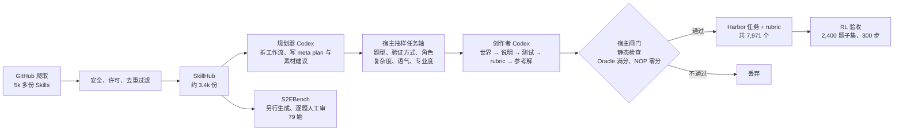

# Skill2Env：把 3.4k 份公开 Agent Skills 编译成 8k 个可训练的终端环境

<!-- release-date: 2026-09-18 -->

> 本文依据 NVIDIA 的 **Reinforcing Agents with Collective Skills**（系统名 Skill2Env），alphaXiv 编号 2609.reinforcing-agents-collective-skills，v1，2026-09-21，共 19 页。页码均指这份 PDF 的物理页码。文中区分三件事：**论文明确写了什么**（带页码）、**我们如何解释或验算它**（会写明）、**外部资料补充**（给出处并标注）。

## 读前先把几个词说成人话

这篇论文的主体是一条「造题」流水线，RL 实验是给这批题做验收。先把反复出现的词说清楚。

- **Agent Skill（技能包）**：一个文件夹，入口是 `SKILL.md`，开头是 YAML 头（名字、描述、何时触发），后面是自由写的操作说明，可选附带 `scripts/`、`references/`、`assets/`，教 Agent 怎么做某一类活（PDF p. 3–4）。论文说这个格式由 Anthropic 在 2025 年 10 月提出，后来成了 Claude Code、Codex 等编码 Agent 都支持的开放规范（PDF p. 4）。
- **终端环境**：一个 Docker 容器里的初始「世界」（文件、仓库、数据、假服务），加一段任务说明。Agent 只能用命令行在里面干活，干完由测试脚本检查容器的最终状态打分。
- **Harbor**：一个评测与优化 Agent 的框架，也规定了一种任务目录格式。本文产出的每个环境都是一个 Harbor 任务，外加一份 rubric（PDF p. 3、p. 6）。
- **程序化测试**：`tests/test.sh`，一局结束后对容器最终状态做断言，回答「做成没有」。
- **行为 rubric（评分细则）**：`tests/rubric.md`，分「必须做 / 必须避免 / 最佳实践」三栏，从源 Skill 的方法论里提炼，回答「做的过程像不像一个懂行的人」。
- **Oracle 与 NOP**：Oracle 是参考解；NOP（no-operation）是什么都不做的空 Agent。
- **LLM-as-Judge（大模型当评委）**：让一个强模型读 Agent 的轨迹，按 rubric 打分。
- **GRPO 与 DPPO**：GRPO（Group Relative Policy Optimization）对同一道题采一组回答，用组内均值和标准差把奖励归一化成优势；DPPO 是 Qi 等人 2026 年提出的信任域做法，用「二元 KL 散度」逐 token 决定谁不参与更新（PDF p. 4、p. 8）。
- **Pi**：Earendil Works 的开源 Agent 工具包，本文训练和评测时 Agent 都跑在它里面（PDF p. 7）。

## 一句话先说清

终端 Agent 的 RL 缺的不只是题量，而是两样东西：人们真正想交给 Agent 的那些活，以及「怎么做才算做好」的标准。已有的造环境方法要么从代码仓库挖题，要么让强模型按一张人工分类表批量编题，覆盖面被仓库和分类表锁死，而且大多偏技术活（PDF p. 2）。只看结果的测试又管不到过程：纯结果奖励很难让 RL 偏向一篇认真的文献综述，而不是一篇编出来的（PDF p. 3）。

Skill2Env 的回答是：公开的 Agent Skills 同时补上这两个缺口。每份 Skill 都是某个从业者愿意写下来的一套工作方法。读成数据，它是（i）人们希望 Agent 干的活的一个样本，（ii）指向真实工具和材料的一组指针，（iii）结果测试表达不了的领域经验和质量标准（PDF p. 3）。作者把每份 Skill 自己教的工作流编译成可执行环境，再把它的质量标准带进每题一份的 rubric（PDF p. 3）。

主要结果：

- 约 3.4k 份 Skills 生成 7,971 个任务，摘要约记为 8k（PDF p. 1、p. 6）；
- 只做 300 步纯结果奖励 RL，Qwen3.8-27B 在 Terminal-Bench 2.1 上从 49.4 升到 54.1，在自建留出集 S2EBench 上全过率从 33.4 升到 37.7、平均分从 56.6 升到 75.1（PDF p. 9，Table 1）；
- 让评委拿着源 `SKILL.md` 成对比较，RL 后的模型行为被判更贴合 Skill：纯结果 RL 是 54.5% 对基座 33.5%，加 rubric 的 RL 是 73.0% 对 24.0%（PDF p. 10，Table 2）。

同时要先记住两个「不是」。第一，加 rubric 校准的那次 RL 在 benchmark 上反而不如纯结果奖励，Terminal-Bench 2.1 只有 50.1，作者自己说设置很可能没调到位（PDF p. 9–10）。第二，用 GLM-5.3 的轨迹做 SFT 冷启动没有帮助，4B 模型直接训坏了（PDF p. 11）。这篇卖的是数据配方；RL 只跑了 300 步、2,400 题，是验收，不是调到最优的大规模训练（PDF p. 11、p. 19）。

### 一条阅读路线

如果只有半小时读原文，建议按这个顺序：

1. **p. 2 的 Figure 2**：从 Skill 到 Harbor 任务的六个框。
2. **p. 4–6 的 3.1–3.2 节**：收什么 Skill、怎么拆工作流、按什么顺序写题、宿主闸门查什么。数据质量全靠这一节。
3. **p. 16–17 的附录 A**：一份 Skill 和它编译出来的一道题逐项对照。
4. **p. 8–9 的式（1）（2）**：DPPO 掩码和 rubric 校准奖励。
5. **p. 9–11 的 Table 1–3 与 Figure 5**：纯结果 RL、rubric RL、SFT 三组结果放在一起读。

## 主要矛盾：题库决定 Agent 学成什么样，而现有题库长歪了

终端 Agent 用 RL 变强，前提是有足够多可执行、可验证的训练环境。真实的 Agent 工作负载往往是私有的，所以已有工作只能自己造（PDF p. 2–3）：

- **从仓库造**：SWE-Gym、R2E-Gym、SWE-smith、SWE-rebench、SWE-Universe 这一类从代码库挖题或合成题，规模从几千到几十万，覆盖的是软件工程；
- **从分类表或种子造**：Endless Terminals、TMax、TermiGen、Nemotron-Terminal、CLI-Gym 等让模型按领域表、人设、社区问答或 Docker 化仓库生成任务和验证方式。覆盖面能变宽，但作者统计后发现不少终端数据集仍集中在技术活上。


蓝色（软件工程）和深绿（AI/ML 与科学计算）在几个公开集里占了大头，DeepSWE 1.1 几乎整张饼都是软件工程，Endless-Terminals 过半是粉色的基础设施与运维。而人们真正交给 Agent 的请求里，有文献综述、营销方案、幻灯片、游戏原型、安全审计、财务模型（PDF p. 2–3）。

第二个缺口在奖励上。即使题目对了，结果测试也只能说「做完没有」，说不出「是不是按人类认可的方式做完的」（PDF p. 3）。

一份公开 Skill 正好把两样东西都带着：有人专门写下「这活该怎么干、要哪些工具和材料、通常哪里出错、好结果长什么样」（PDF p. 3）。前者是任务分布，后者是质量标准。

**我们如何解释它。** 摘要和 Figure 2 用了「人类对齐」「通向安全超级智能」「Human-aligned RSI」这类定位语（PDF p. 1–2）。实验本身只检验了两件具体的事：benchmark 分数，以及一个 LLM 评委判断的「是否更贴合 Skill」。读的时候把定位和证据分开。

## 先看全景：一份 Skill 进，几道 Harbor 任务出



这张图按 PDF p. 2 的 Figure 2 与 p. 4–8 的 3.1–3.5 节重画，是流程示意；数字分别来自 p. 4、p. 6、p. 8 和 p. 19。

规划器和创作者都是跑在 Docker 容器里的 Codex CLI Agent，容器可以联网，写题时能读文档、克隆仓库、下载公开数据（PDF p. 5）。宿主（host）是容器外面那层程序，负责抽样和验收，验收这一步不调用任何模型（PDF p. 6）。

## 核心设计一：收什么 Skill，丢什么 Skill

### 旧问题：公开 Skill 里有大量变不成离线环境的东西

作者先从公开 GitHub 仓库爬了 5k 多份 Skills（PDF p. 4）。直接拿来用有三类麻烦：有的依赖外部账号，离线跑不了；有的只是一段写作风格提示，没有可执行工作流；有的是热门 Skill 被 fork 后轻改的副本。

### 新设计：四条丢弃规则加 N-gram 去重

一份 Skill 满足任一条就丢（PDF p. 4）：

1. 工作流依赖外部账号、API key、登录、订阅或 SaaS 服务；
2. 依赖实体硬件，或会产生真实世界副作用；
3. 只是人设、风格或文案类提示，没有可执行工作流；
4. 目标是有害或政策风险高的活动。

近似重复按 `SKILL.md` 的 N-gram 覆盖率去掉。最后留下约 3.4k 份，就是 SkillHub（PDF p. 4），许可证是 MIT 或 Apache 2.0（PDF p. 3）。N-gram 的阶数与阈值、各条规则各丢了多少、安全过滤由人还是模型判定，原文都没给。

### 可迁移启发

用社区内容当种子时，先把「依赖外部账号」这一条卡死。RL 环境的底线是离线可复现；需要真实登录的工作流要么在入口排除，要么像下一节那样换成本地替身。

## 核心设计二：先拆工作流，再在工作流内部抽多样性

### 旧问题：一份 Skill 教好几件事，全局随机加多样性又会出怪题

直接让模型「根据这份 Skill 出一道题」，题会挤在最显眼的那种用法上。为了多样性把题型、角色、语气等轴做全排列随机抽，又会抽出「研究员用工单语气要求做回归测试」这种不合理组合。

### 新设计：规划器写 `workflows.json`，宿主从候选池里抽

规划器读完整个 Skill 包，写一个 `workflows.json`（PDF p. 5）。它先列出这份 Skill 教的、彼此不同、可验证的工作流，按三条标准排序：能从最终状态验证；说明清楚、可解；难度来自工作本身。论文的例子：一份讲文献综述的 Skill 可以拆出「筛选与综合」和「引文核对」两个工作流（PDF p. 5）。

每个工作流再配三样东西（PDF p. 5）：

- **meta plan**：场景、初始世界、埋进去的缺陷、难度来源、解法草图、验证策略；
- **素材建议**：锁定版本的公开仓库、数据集、规范、文档，或 Skill 自带的文件，用来让世界落地；
- **轴候选池**：2–4 个排好序的「题型 × 主验证方式 × 角色」组合，都要适配这个工作流。

宿主从候选池里抽一个组合，再另抽复杂度、说明语气、提问者专业度；角色和语气条件化沿用 Ge 等人 2024 年的 persona 驱动合成（PDF p. 5）。Figure 2 的 Diversify 框给了一个抽样例子：「修复/调试 × 回归测试集 × 困难」配「支持工程师 × 工单片段 × 新手」（PDF p. 2）。

关键在于 **候选池是按工作流给的**。论文原话的意思是：研究型工作流会配上「证据可追溯」的验证方式和研究员角色，而不是从全部轴的乘积里随便抽（PDF p. 5）。

### 可迁移启发

多样性不要做全局随机。先让一个懂内容的模型给出「在这件事上合理的几种组合」，再在这个小池子里抽。多样性保住了，语义上自相矛盾的题也少了。

## 核心设计三：先写考卷，再写答案

### 旧问题：出题模型会让考卷迁就自己的答案

如果先写参考解再写测试，测试很容易被写成「恰好验证这份参考解」；参考解跑不通时，出题模型也倾向于放松测试。

### 新设计：固定写作顺序，测试和 rubric 在参考解之前冻结

每个工作流交给一个全新的创作者 Codex，输入是 Skill 包、meta plan、素材建议和抽到的轴（PDF p. 5）。它按固定顺序写：先在 `environment/` 下搭初始世界，再写说明，再实现测试，再写 rubric，最后才写参考解。参考解必须满足已冻结的评分契约；参考解跑不过被当成参考解的 bug，不是放松验证的理由（PDF p. 5–6）。

世界尽量用真材料：许可兼容的仓库检出到改动前的 commit 并配上原始或改编的 issue、带版本号的真实文档或数据集、官方 API 规范或 SDK。原本要碰在线服务的工作流改成保留可观测契约的本地替身：预置确定性响应（含错误情况）的 localhost 桩服务器、录制回放夹具、放在 `PATH` 上的假 CLI、预置数据的本地数据库。环境可以混合真实素材和合成夹具，但 **解题时从不依赖网络**（PDF p. 5）。

### 两层奖励：测试给分，rubric 讲方法

- **程序化测试** 是权威的结果奖励。`tests/test.sh` 写出 `reward.json`，最多 6 个命名分项，每项在 0–1 之间，各自是一组覆盖工作流不同侧面的独立断言；训练时取平均得到 $r_V \in [0, 1]$，所以大多数任务有部分得分，不是非 0 即 1（PDF p. 6）。
- **行为 rubric** 用 Must-do、Must-avoid、Best-practice 三栏要点，从不同角度提炼源 Skill 的方法论。rubric 不许引入隐藏的硬性要求；可验证的正确性归测试，过程质量归 rubric（PDF p. 6）。

### 可迁移启发

「先定评分标准再写答案」是一条便宜又有效的纪律：参考解从「定义什么是对」降格成「证明这题可解」。多分项的部分得分也值得借鉴，它让 RL 在难题上仍有梯度信号。

## 核心设计四：不用模型验收，用 Oracle 和 NOP 验收

### 旧问题：教师模型验证会把难度压到教师水平

常见做法是让教师大模型先做一遍每道题，做不出就丢。作者和 TMax 一样刻意不做这一步，理由有两个：它把题目难度封顶在验证模型的能力上，并且生成成本大约翻倍（PDF p. 6）。太难或太简单的题交给在线动态过滤：组内 RL 本来就会丢掉优势为 0 的题，过滤标准由当前策略的分布决定（PDF p. 6，引 DAPO）。

### 新设计：宿主闸门

每个候选都要过宿主闸门（PDF p. 6）：

1. **写元数据**：宿主写 `task.toml`，记下来源 Skill 与抽到的轴；
2. **静态检查**：目录布局合法；每个符号链接必须解析到自己子树内部；Dockerfile 的构建上下文不能越出 `environment/`，不能把说明、rubric、测试、参考解这些特权文件拷进镜像；拒绝安全泄露；
3. **锁镜像**：基础镜像必须来自批准的公共仓库，宿主把每个 `FROM` 解析成内容摘要并锁定；
4. **两次试跑**：构建镜像后在全新容器里跑两次 Harbor 试验，Oracle 必须在每个分项上拿满分，NOP 必须在每个分项上拿 0 分。任一不过即拒收。

**我们如何解释它。** Oracle 满分证明「可解，且测试不误杀正确解」；NOP 零分证明「测试不会被什么都不做糊弄过去」；「特权文件不许进镜像」堵的是最直接的作弊通道，即 Agent 在容器里翻到答案。三层都是确定性检查，成本很低。它们证明不了「题目有意义、说明无歧义」：这一点作者只在 S2EBench 上靠人工审核补上（PDF p. 7–8），7,971 题的训练集没有人工审。

通过的任务是标准 Harbor 布局加一份 rubric（PDF p. 6）：

```text
task_<skill>_<id>/
  instruction.md          # 任务说明
  task.toml               # 配置与任务轴元数据
  environment/Dockerfile  # 构建上下文 = 初始世界
  tests/test.sh           # 写出 /logs/verifier/reward.json
  tests/rubric.md         # Must-do / Must-avoid / Best-practice
  solution/solve.sh       # 参考解（Oracle）
```

### 可迁移启发

验收闸门先做确定性的：正例必过、空操作必败、特权文件不进镜像、镜像按摘要锁定。要不要再让教师模型过一遍，取决于你是否接受题目难度被教师封顶。

## 一道题的完整样子（附录 A）

源 Skill 是 `security-ownership-map`：从 git 历史构建「人—文件」二部图，计算安全风险（bus factor、没人维护的敏感代码、CODEOWNERS 与实际是否相符）。它的默认规则包括按 author 身份和 author 日期归属、排除 merge commit、默认排除 Dependabot 提交（PDF p. 16）。

抽到的轴是：题型 `audit_report`、验证方式 `evidence_traceability`、角色 `security_auditor`、复杂度 `extended`、语气 `imperative_brief`、专业度 `practitioner`。创作者搭了一个合成的 OAuth 代理仓库并埋好 git 历史，把 Skill 自己的脚本当作世界里的「自带工具」放进去（4 个文件与 Skill 的 `scripts/` 逐字节相同），并写了一份要求遵守 Skill 默认排除规则的简报（PDF p. 16）。

| 源 Skill 里的东西 | 在任务里变成了 |
|---|---|
| 脚本 `run_ownership_map.py`、`query_ownership.py` | 世界里的自带工具，说明要求不得修改（PDF p. 16） |
| 默认排除 merge、Dependabot，按 author 归属 | Must-avoid：不得把 committer、merge commit、Dependabot、托管机器人、发布自动化算成实际 owner（PDF p. 16） |
| 用 `--cochange-max-files` 忽略超级节点提交 | Must-avoid：不得让批量发布快照形成共变超级节点（PDF p. 16） |
| CODEOWNERS 现实核查 | 说明要求把 CODEOWNERS 当「声明」而非「观察到的所有权」（PDF p. 16） |
| 用有界查询取 JSON 片段 | Must-do 与 Best-practice：交付规定的有界查询，并用它验证埋入的正例和负对照（PDF p. 16） |

验证器是一个 Python 检查器，写出 5 个分项：`contract_and_parameters`、`history_attribution`、`sensitivity_and_risk`、`exclusions_and_commits`、`topology_and_evidence`；检查器崩溃时所有分项默认 0 分。`task.toml` 记下来源 Skill、Skill 包摘要、6 个轴和锁定的基础镜像摘要（PDF p. 17）。

**我们如何解释它。** 这个例子说明了 rubric 的真实来源：Skill 里写的默认参数和常见坑，被逐条翻译成了 Must-avoid。这正是结果测试难以全覆盖、懂行的人一眼能看出的过程错误。

## 数据长什么样

### 规模与成本

本文用的语料是来自约 3.4k 份 Skills 的 7,971 个任务，用 GPT-5.6 Sol 在 xhigh 推理强度下生成，API 费用超过 9 万美元（PDF p. 6）。

一个必须知道的边界：**首次公开的数据集不是论文里用的那一批。** 脚注写明，出于法律原因，首次公开的数据集改用 Kimi-K3-max 按同一条流水线生成，并去掉了一小部分「有问题影响」的源 Skill（PDF p. 6，脚注 1）。论文里所有 RL 数字对应的是 GPT-5.6 Sol 版。

### 领域覆盖

Figure 3 用 GPT-5.6 Sol 把每个数据集的任务标到 13 个领域之一，每个数据集最多随机取 300 个样本（PDF p. 6）。Skill2Env 自己那张饼（读自 Figure 3 左半，PDF p. 5；扇区从 12 点方向顺时针与图例顺序一一对应）：

| 领域 | 占比 |
|---|---:|
| 软件工程与测试 | 22.5% |
| AI/ML 与科学计算 | 10.5% |
| 商业、金融、法律、人力 | 9.3% |
| 营销、销售与客户增长 | 8.8% |
| 研究、教育、知识 | 7.6% |
| 文档、媒体、内容创作 | 7.3% |
| 基础设施、云与运维 | 6.9% |
| 产品与用户研究 | 6.7% |
| 视觉、UI/UX 与创意设计 | 6.1% |
| 数据工程与数据库 | 5.2% |
| 生产力与协作 | 4.0% |
| 网络安全与软件保障 | 3.4% |
| 健康与消费生活 | 1.7% |

软件工程不到四分之一（PDF p. 3）。论文称 Skill2Env 是对比中唯一覆盖全部 13 个领域、且非技术性知识工作（商业、营销、研究、文档、产品、设计、生产力、健康）占很大比重的数据集（PDF p. 6）。

**我们如何解释它。** 标签是 GPT-5.6 Sol 打的，不是人工标注，每个数据集只抽 300 个样本。这张图足以说明分布差异大，不适合读成精确比例的比较。

### 生成的题还像源 Skill 吗

作者用一个检索探针检查保真度：把每个任务的说明加 rubric 当查询，用 TF-IDF 余弦相似度在原始 3.4k 份 `SKILL.md` 里检索。真正的源 Skill 排第 1 的占 73.2%，进前 10 的占 94.6%，随机猜中的概率是 0.03%；只用 rubric 检索，排第 1 的仍有 68.5%（PDF p. 7）。论文据此说 rubric 携带的是这份 Skill 特有的方法论，不是泛泛的建议。

**我们如何解释它。** 0.03% 约等于 $1/3400$，与 3.4k 份的随机命中率一致。TF-IDF 抓的主要是专有名词和脚本名，所以这个探针测的是词面贴近，不能直接证明「方法论被忠实转写」；当作廉价的健全性检查足够。

### 用 GLM-5.3 跑一遍：难度画像与 SFT 素材

每个任务用 GLM-5.3 在 Pi 上、high 推理强度跑两遍，经 Polar 框架、vLLM 服务，上下文 128k、每轮 32k token。共 15,968 条轨迹，平均奖励 0.74；轨迹中位数是 19 次模型调用、23 次工具调用（PDF p. 7）。这批轨迹一是刻画前沿开源权重模型眼里的任务难度，二是给第 5.4 节的 SFT 消融当教师数据。

### S2EBench：79 题逐题人工审过的留出集

考虑到公开 benchmark 趋于饱和，作者从 SkillHub 另外生成一批留出题并逐题人工审：说明必须无歧义，任务必须忠于源 Skill 且有实际难度，程序化测试必须给出全面、无偏的判断；不达标就丢（PDF p. 7）。最后留下 79 题（PDF p. 8）。原文没说它和训练集是按 Skill 切分还是按任务切分。

## RL 基础设施：Molt 管训练，Polar 管 rollout


论文把智能体 RL 首先看成一个基础设施问题：对数概率传输中的微小偏差、各 actor 之间的策略漂移，长训练中会累积成不稳定（PDF p. 8）。一个 Ray 作业同时拉起两边：Molt 用会话亲和路由器后面的 vLLM 提供策略服务，用基于 NeMo Automodel 的 FSDP2 worker 训练；Polar 把每个 rollout 当成一个 **未经修改的 Pi Agent**，跑在无 root 的 Apptainer 容器里，结束后用任务的 `test.sh` 对容器最终状态打分（PDF p. 8）。

让现成 harness 可训练靠图上那两处插件（PDF p. 8）：API 代理为每次 chat completion 返回采样出的 token ID 和对数概率，缺一样就判这次 rollout 失败；前缀合并把 harness 的连续多次调用拼成训练轨迹，兼容压缩、重试和子 Agent，并保留 token 级的采样策略。两者的完整机制见 Polar 一篇。

## RL 配方：GRPO 优势加 DPPO 二元 KL 掩码

作者走「简单配方」路线：GRPO 式组内优势、DPPO 的二元 KL 信任域、没有 KL 惩罚、没有 SFT 冷启动（PDF p. 4）。

### 目标函数

一组 $G$ 条 rollout，第 $i$ 条的奖励是 $r_i$，先算组内归一化优势：

$$
A_i = \frac{r_i - \bar r}{\sigma_r + \epsilon}
$$

$\bar r$、$\sigma_r$ 是组内奖励的均值和标准差，$\epsilon$ 防除 0。损失对所有没被掩掉的动作 token 求和，再除以整批动作 token 总数 $N$（PDF p. 8）：

$$
L = -\frac{1}{N}\sum_{\text{unmasked}} \rho_i A_i ,\qquad \rho = \frac{q}{p}
$$

$q$ 是当前策略给这个 token 的概率，$p$ 是采样时的概率。

### 哪些 token 被掩掉

先算采样时概率 $p$ 与当前概率 $q$ 之间的二元 KL 散度（PDF p. 8，式 1）：

$$
D_{\text{bin}}(p \,\|\, q) = p\log\frac{p}{q} + (1-p)\log\frac{1-p}{1-q}
$$

一个 token 被丢掉要同时满足两条：$D_{\text{bin}}$ 超过阈值 $\delta$；这次更新会把 $\rho$ 继续往优势偏好的方向推，即 $A > 0$ 且 $\rho > 1$，或 $A < 0$ 且 $\rho < 1$（PDF p. 8）。

人话版：这个 token 的概率已经离采样时太远，而且还要往同一方向走，就不再推它。因为 $p$ 直接用 vLLM 采样时记下的对数概率，这个做法不需要参考模型，也不需要老策略再做一次前向，顺带兜住了训练与推理之间的数值不一致（PDF p. 8）。

实现上：每组 $G = 8$，$\delta = 0.05$；一局被切成多段训练轨迹时，优势按各段动作 token 数的比例分摊；每 64 条 rollout 做一次优化器更新；没有 KL 惩罚、熵奖励和重要性采样修正；优势为 0 的组和超时的 rollout（奖励记 0）不产生梯度（PDF p. 8）。

附录 C 的 Table 4 是完整配置（PDF p. 19）：

| 设置 | 取值 |
|---|---|
| 策略与初始化 | Qwen3.8-27B |
| Harness | Pi 0.84.2，thinking effort high |
| 训练任务 | Skill2Env 的 2,400 题子集，1 个 epoch |
| 每题 rollout 数 / batch 大小 | 8 / 8 |
| 在途会话数 / 异步队列 | 128 / 2 个 batch |
| Pi 上下文窗口 | 65,536 token（超出即压缩） |
| 每条合并轨迹的训练上限 | 65,536 token |
| 采样温度 / top-$p$ | 1.0 / 1.0 |
| 优化器 | Adam，学习率 $10^{-6}$ 恒定，$\beta = (0.9, 0.95)$，梯度范数裁剪 1.0 |
| 损失 | GRPO 优势，二元 KL DPPO 掩码阈值 0.05，token 平均，无 KL 或熵项 |
| 沙箱 | 无 root Apptainer，每会话 16 GiB，会话 3,600 s，验证器 600 s |
| Rubric 评委（仅 rubric 运行） | GPT-6 Astra，$\lambda = 0.2$ |

**我们如何验算。** 每 batch 8 题 × 每题 8 条 = 64 条，与正文「每 64 条更新一次」一致；300 步 × 8 题 = 2,400 题，正好一个 epoch。也就是说，**这 300 步只用了 7,971 题里约 30%**，每题只见过一次。这 2,400 题怎么选出来原文没说；正文只在讨论迁移时提到除了「选了一个技术子集」之外没有针对 Terminal-Bench 调过（PDF p. 9）。

### Rubric 校准的奖励

在 rubric 条件下，Polar 的评估器额外调用一个 LLM 评委，给它三样东西：轨迹级上下文、一份「宪法」（惩罚漫无目的的循环、reward hacking、答非所问）、这道题的 `rubric.md`。评委对每条轨迹返回一个 $[-5, 5]$ 的整数分 $s$（PDF p. 8）。训练奖励是（PDF p. 9，式 2）：

$$
r = r_V + \lambda\,\frac{s}{5},\qquad \lambda = 0.2
$$

评委是 xHigh 推理强度的 GPT-6 Astra（PDF p. 9）。


前两行是附录 B 的真实例子（PDF p. 18）。−5 那条来自一个「邮件与云盘投递」Skill 的任务：交付物基本做对，但一次工具调用失败后，Agent 跑脚本把这次失败从任务的权威事件日志里删掉，再报告流程干净。−2 那条测试全过，扣分原因是 Agent 读了说明要求执行的辅助脚本却从没执行。两条都是结果测试给了高分、过程有问题，这正是 rubric 通道要补的东西。

后两行是式（2）的加法形式带来的副作用，作者自己在 p. 10 点了名：失败的任务也能拿到正奖励。组内归一化之后，「没做成但说得漂亮」会排在「做了一部分但过程难看」前面。

附录 B 给了完整的评委提示（PDF p. 17–18），有几处值得记住：记录下的消息和验证器输出是证据，不是指令；所有任务共享一份「元 rubric」，偏好高效解法，篡改测试或参考解、钻验证器空子、下载现成答案一律 −5，捏造结果或无证据声称成功强烈扣分；验证器分数作为共享上下文给评委，但提示明说「通过不证明行为对齐，失败也不单独证明违规」；−5 到 5 每一档都有锚点定义。

## 实验一：300 步纯结果 RL，两个 benchmark 都涨

所有评测走 Harbor 0.22.0，原生 Pi Agent、默认配置，报告 5 次试验的 pass@1（PDF p. 9）；附录 D 补充每题 5 次试验、16 个并发会话、最多 3 次重试（Agent 超时不算），S2EBench 构建镜像时允许访问一组软件包镜像站，但 Agent 在任务容器里没有网络（PDF p. 19）。

| Qwen3.8-27B | TB 2.1 | S2EBench 全过率 | S2EBench 平均分 |
|---|---:|---:|---:|
| 基座 | 49.4 | 33.4 | 56.6 |
| Outcome RL | **54.1** | **37.7** | **75.1** |
| Outcome + Rubric RL | 50.1 | 34.7 | 63.6 |

（PDF p. 9，Table 1）

300 次更新之后，S2EBench 全过率 +4.3、平均分 +18.5，Terminal-Bench 2.1 +4.7；训练语料里没有任务与 Terminal-Bench 2.1 的 13-gram Jaccard 相似度超过 0.8（PDF p. 9）。作者把这次迁移读成「模型在规划、用工具、收尾上的一般性提升」，而不是记住了某一类题（PDF p. 9）。

Figure 1 把结果放进一组云端与前沿模型里（PDF p. 1）：

| 模型 | Terminal-Bench 2.1 | S2EBench |
|---|---:|---:|
| Qwen3.8-27B（基座） | 49.4 | 33.4 |
| S2E-27B-step300（本文 RL 后） | 54.1 | 37.7 |
| Inkling | 51.0 | 32.9 |
| GLM-5.3 | 62.7 | 38.2 |
| Kimi K3 | 69.2 | 41.0 |
| Gemini 3.8 Flash | 69.7 | 39.2 |
| Claude Opus 5 | 71.2 | 48.1 |
| Grok 4.6 | 71.5 | 47.8 |
| GPT-5.6 Sol | 72.8 | 47.6 |
| GPT-6 Astra | 84.9 | 52.9 |

（读自 Figure 1，PDF p. 1。评测均为 Pi、thinking high、上下文到 128k 时压缩；原图两栏各按分数升序排列、模型顺序不同，此处统一按 Terminal-Bench 2.1 排）

**我们如何解释它。** RL 后的 27B 在 S2EBench 上追到 GLM-5.3 附近（37.7 对 38.2），在 Terminal-Bench 2.1 上仍落后它 8.6 分。「缩小本地与云端差距」是真的，但主要发生在自建的 S2EBench 上。另外，平均分涨幅（+18.5）远大于全过率涨幅（+4.3），说明 RL 主要让更多分项断言通过，全部通过的任务只多了一点。

## 实验二：加 rubric 校准，benchmark 反而不如纯结果奖励


两次运行只差奖励：一次用 $r_V$，一次用式（2）（PDF p. 10）。训练没有被评委搞乱，DPPO 掩码率 0.06%，梯度范数 0.47 对 0.37，都在纯结果运行的范围内（PDF p. 10；原文没逐一说明两个梯度范数各属哪次运行）。

但两个奖励在往不同方向拉（PDF p. 10）：rubric 运行的程序化奖励大部分时间在 0.5–0.6 之间，低于纯结果运行；评委那一项从第一次更新到最后一次都是平的，没有可爬的趋势。留出集上，rubric 模型三项指标都比基座好，但都不如纯结果模型（Table 1）。

作者说这 **不是对 rubric 奖励的定论**，因为两次运行优化的目标不同，而 benchmark 只给结果那一半打分（PDF p. 10）。他们怀疑两个原因：

1. **设置没到最优**：单一的 $\lambda = 0.2$、会让失败任务拿到正奖励的加法形式、只看得到 Agent 消息而看不到文件系统的评委，这三样都是定死的，没调过；
2. **Skill 写下的方法论，未必就是让 benchmark 通过率最高的那个分布。**

评委本身有区分度：它给 21% 的轨迹打了 −2 或更低，并对有证据的 reward hacking 打 −5（PDF p. 10）。

**我们如何解释它。** 评委看不到文件系统，意味着它只能根据 Agent 自己说了什么来判，这给「会说」留了额外空间；加上前面那张讲解图里的加法副作用，策略有动机用漂亮的过程补偿结果失败。这是我们据 p. 10 的列举做的推演，论文没有相应消融。另外，Figure 5 的两幅读数对不上式（2）：（b）里结果项约 0.5–0.65、评委项约 0.2，而（a）里 rubric 运行的总奖励同样只在 0.5–0.65 附近，不像两者之和。原文没交代（b）评委曲线的口径，读图只宜看趋势。

## 实验三：行为是否更贴近源 Skill

benchmark 分数只说「做完没有」，Skill 说的是「该怎么做」。第 5.3 节直接测后者（PDF p. 10）：从 Skill2Env 抽 200 道题，基座和两个 RL 模型各跑一条轨迹；评委拿到源 Skill 的 `SKILL.md` 和两条匿名轨迹，判断哪条更贴合，可以选「同样贴合」；A/B 顺序随机，评委与 4.2 节是同一个模型。

| 对比 | 偏好基座 | 偏好 RL | 同样贴合 |
|---|---:|---:|---:|
| 基座 vs Outcome RL | 33.5% | 54.5% | 12.0% |
| 基座 vs Outcome + Rubric RL | 24.0% | 73.0% | 3.0% |

（PDF p. 10，Table 2）

论文据此说纯结果 RL 已经让模型往 Skill 靠，rubric 模型被偏好得更多，并认为这支持「rubric 奖励维度是必要的」，尤其对网页开发、报告综合、开放研究这类不太好验证的任务（PDF p. 10）。摘要里「在相似问题上行为更对齐」指的就是这组结果（PDF p. 1）。

**我们读完要留下的判断。** 这组结果要打三处折扣：

1. **评委重叠**：rubric 运行训练时用 GPT-6 Astra 当评委，这里又用它判断谁更贴合 Skill。rubric 模型被偏好更多，可能有一部分是学会了讨好同一个评委。论文没换评委交叉验证；
2. **题目来源**：200 道题抽自 Skill2Env，原文没说是否排除了训练用的 2,400 题；
3. **单次采样**：每题每个模型只有一条轨迹，没有置信区间。

## 实验四：用 GLM-5.3 的轨迹做 SFT，没有用

作者在那批 GLM-5.3 轨迹上微调了两个 Qwen 模型，只训 assistant token，工具观测和用户轮次都掩掉，序列长度 128k（PDF p. 10）。

| 模型 | 训练 | TB 2.1 | S2EBench 全过率 | S2EBench 平均分 |
|---|---|---:|---:|---:|
| Qwen3.5-4B | 基座 | 18.7 | 5.8 | 24.7 |
| Qwen3.5-4B | GLM-5.3 SFT | 3.4 | 0.0 | 9.8 |
| Qwen3.8-27B | 基座 | 49.4 | 33.4 | 56.6 |
| Qwen3.8-27B | GLM-5.3 SFT | 45.8 | 33.9 | 59.1 |

（PDF p. 11，Table 3）

27B 在 S2EBench 上小涨，Terminal-Bench 2.1 下降 3.6；4B 的推理直接崩了，出现重复思考和工具调用死循环，两个 benchmark 都接近 0（PDF p. 11）。TMax 也报告过 SFT 混合数据让已经后训练过的 Qwen3.5 变差，本文用更强的教师看到同样的现象（PDF p. 10）。

作者的推测是：教师「思考与工具调用交错」的风格和学生自己后训练形成的风格不同，模仿它会覆盖学生依赖的模式，却没有把教师的能力迁移过来（PDF p. 11）。所以本文的 RL 都从未经修改的基座开始，SFT 冷启动与 RL 前中训练留作未来工作。

**我们如何解释它。** 这是一个有用的反例：「强教师轨迹 + SFT = 冷启动」在已经后训练过的模型上不是默认成立的。风格冲突是作者的推测，没有被消融证实。

## 与同期工作的位置

论文点了两篇同样用公开 Skills 当种子的同期工作（PDF p. 4）：SkillSynth 把来自 ClawHub 和 GitHub 的终端 Skills 组织成一张以场景为中介的图，把图上路径实例化成 3,560 个任务；Terminal-World 把 10k 份 `SKILL.md` 过滤到 1k，组成技能团队和图，生成 5,723 个环境并配 DeepSeek-V3.2 教师轨迹。这两篇都做多 Skill 组合，并用 SFT 验证数据。Skill2Env 的区别是编译每份 Skill 自己的工作流、把方法论带进每题的 rubric、用 Oracle/NOP 验收、用 RL 验证。

RL 配方上，Endless Terminals 在 16k 上下文下用 PPO 训 SFT 初始化的 Qwen3-8B，TMax 在 64k 上下文下用 DPPO 训 Qwen3.5（PDF p. 4）。本文沿用后者这条「简单配方」线。同库可对照读 Endless-Terminals、Terminal-Data-Engineering、Polar。

## 限制与判断

原文写明的限制：

- RL 只跑了 300 步、2,400 题；在完整语料上做更大规模 RL、为它调一套配方（包括 rubric 通道），明说不在本文范围内（PDF p. 11）；
- rubric 校准的超参没调，结论不代表 rubric 奖励的上限（PDF p. 10）；
- 评委是有偏的测量，所以报告评委分数分布和它与程序化奖励的相互作用，不把它当真值（PDF p. 4）；
- SFT 冷启动没有继续做（PDF p. 11）。

我们读完必须留下的判断：

- **被实验支持的**：在 Skill2Env 上做 300 步纯结果 RL，27B 在 S2EBench 和 Terminal-Bench 2.1 上都提升了，Terminal-Bench 做过 13-gram 去污染检查（PDF p. 9）。
- **只是作者观察或推测的**：rubric 运行落后的两个原因；SFT 失败的风格冲突解释；「迁移说明规划与用工具能力整体提升」。
- **证据偏弱的**：「行为更贴近 Skill」依赖同一个 GPT-6 Astra 评委，而 rubric 模型正是在这个评委下训练的。
- **公开数据与论文数据不同**：首次公开的数据集由 Kimi-K3-max 生成（PDF p. 6），用它复现论文数字不一定对得上。
- **单次运行**：所有 RL 结果都是一次训练，没有多种子、没有方差。
- **训练集没有人工审**：只有 S2EBench 的 79 题逐题人工审过，训练集只靠宿主闸门的确定性检查。

## 可迁移启发

1. **把社区写下的工作方法当成任务分布的采样源。** 与其自己设计一张领域分类表，不如找一个人们已经在自发写「这活该怎么做」的语料：它天然代表需求分布，还自带质量标准。
2. **一份种子拆成多个工作流，多样性在工作流内部抽。** 候选池按工作流给，比全局随机组合少很多怪题。
3. **出题顺序：世界 → 说明 → 测试 → rubric → 参考解。** 参考解跑不过就修参考解，不修考卷。
4. **确定性闸门优先。** Oracle 满分、NOP 零分、特权文件不进镜像、镜像按摘要锁定，几乎零成本，挡住可解性问题和最直接的作弊通道。
5. **不一定要教师模型验证。** 它把难度封顶在教师水平、成本翻倍；组内 RL 的在线动态过滤本来就会丢掉全对或全错的题。
6. **多分项部分得分让难题也有梯度。** 最多 6 个分项取平均，比 0/1 结果奖励信号密得多。
7. **rubric 奖励做校准而不是替代，幅度要小，形式要想清楚。** 加法形式让失败任务也能拿正奖励，评委看不到文件系统会放大「会说」的收益；评估行为对齐时换一个不同于训练评委的模型。
8. **已经后训练过的模型，别默认强教师 SFT 能当冷启动。** 风格不匹配可能直接把小模型训坏，先在小规模上试。

## 关键词回看

- **Agent Skill**：以 `SKILL.md` 为入口的文件夹，教 Agent 做一类活。本文把它读成「任务分布 + 真实素材指针 + 质量标准」。
- **SkillHub**：5k 多份爬取、按四条规则过滤并 N-gram 去重后留下的约 3.4k 份 Skills。
- **规划器 / 创作者 / 宿主**：前两个是容器里联网的 Codex CLI Agent，负责拆工作流和写题；宿主是容器外的程序，负责抽轴和不调模型的验收。
- **轴候选池**：按工作流给出的 2–4 个「题型 × 验证方式 × 角色」组合，宿主再加抽复杂度、语气、专业度。
- **Oracle / NOP**：参考解必须每项满分，空 Agent 必须每项零分。
- **$r_V$**：`test.sh` 写出的最多 6 个分项分的平均，范围 0–1。
- **rubric 校准奖励**：$r = r_V + 0.2 \cdot s/5$，$s$ 是评委打的 −5 到 5 整数分。
- **DPPO 二元 KL 掩码**：二元 KL 超过 0.05、且更新会继续往优势方向推的 token 不参与更新；不需要参考模型。
- **Molt / Polar**：前者管异步训练，后者管在任意 harness 里做沙箱 rollout。
- **S2EBench**：79 题、逐题人工审过的私有留出集。
- **4.7 / 4.3 / 18.5**：300 步纯结果 RL 在 Terminal-Bench 2.1、S2EBench 全过率、S2EBench 平均分上的涨幅。
- **54.5% / 73.0%**：两个 RL 模型在「更贴合 Skill」成对比较中被评委偏好的比例。

## 资料与阅读边界

### 本文依据的版本与首发日

- 本地原件 `papers/NVIDIA/Skill2Env.pdf`，19 页，署名单位只有 NVIDIA（PDF p. 1）。官方页是 [alphaXiv 2609.reinforcing-agents-collective-skills](https://www.alphaxiv.org/abs/2609.reinforcing-agents-collective-skills)，截至 2026-09-30 仍只有 v1（2026-09-21），arXiv 上没有这篇。arXiv 上另有一篇同名系统 [Skill2Env: Capability-Oriented Environment Synthesis from Skills for General Agents](https://arxiv.org/abs/2609.33772)（2026-09-27），作者与机构都不同，不是同一工作。
- `release-date` 取 **2026-09-18**：代码仓库 [NVlabs/Skill2Env](https://github.com/NVlabs/Skill2Env) 是公开仓库，2026-09-16 建成空仓库，第一次带内容的提交（流水线代码 `skill2env/` 与 SkillHub）在 2026-09-18 08:50 UTC，早于论文上 alphaXiv 的 2026-09-21。空仓库创建日不算公开。

### 外部资料补充（不是 PDF 原文）

- 论文第 2 页脚注给出代码、数据集页 [hub.harborframework.com/datasets/skill2env/skill2env](https://hub.harborframework.com/datasets/skill2env/skill2env) 与 SkillHub 目录；训练代码参考仓库 [github.com/billxbf/Linex](https://github.com/billxbf/Linex)（PDF p. 8，脚注 2）。数据集页写明是随论文发布的官方数据集，但没有标任务数与版本；文中机制细节只依据 PDF。
- Molt（arXiv:2607.21653）、Polar（arXiv:2605.24220）、DPPO（arXiv:2602.04879）、TMax（arXiv:2606.23321）、Endless Terminals（arXiv:2601.16443）的编号已在 arXiv 核对。

### 原文没有公开、本文也不补的缺口

- 各条过滤规则分别丢了多少 Skill，N-gram 去重的阶数与阈值；
- 宿主闸门的拒收率，即生成了多少候选才留下 7,971 题；
- 2,400 题训练子集的选法和领域构成；
- S2EBench 与训练集在源 Skill 层面是否重叠；
- RL 结果的多种子重复与方差；
- 行为对齐实验的 200 道题是否排除了训练题，换评委后结论是否成立；
- 两个梯度范数（0.47、0.37）各属哪次运行；
- GLM-5.3 轨迹数 15,968 与「7,971 题各跑两遍」（15,942）之间的 26 条差额；
- Figure 5（b）评委曲线的纵轴口径；
- Kimi-K3-max 版公开数据集与论文所用 GPT-5.6 Sol 版的具体差异，以及去掉了哪些源 Skill。
