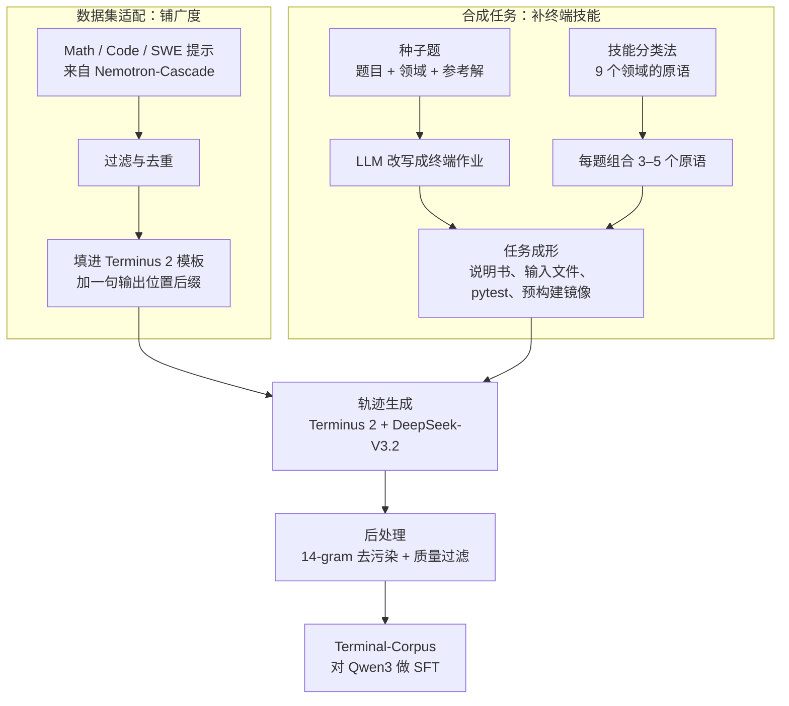

# Nemotron-Terminal：终端 Agent 缺的不是更大的脚手架，是能规模化的公开训练轨迹

<!-- release-date: 2026-02-24 -->

> 本文依据 **On Data Engineering for Scaling LLM Terminal Capabilities**，作者 Renjie Pi、Grace Lam（二人同等技术贡献）、Mohammad Shoeybi、Pooya Jannaty、Bryan Catanzaro、Wei Ping（牵头），全部来自 NVIDIA；arXiv:2602.21193v1，2026-02-24，共 24 页：正文与参考文献 p. 1–14，附录 p. 15–24。页码均指这份 PDF 自身的页码。封面右上角印的 2026-2-25 是内部日期。文中区分三件事：**论文明确写了什么**、**我们如何解释它**、**哪些是外部资料**。

## 读前先把几个词说成人话

- **终端 Agent**：模型待在一个 Linux 容器里，一轮看输出、一轮敲命令，直到文件、进程或配置变成题目要求的终态。命令会失败，它必须根据回显改主意，这不是「写一段 bash 交差」。
- **SFT（Supervised Fine-Tuning，监督微调）**：拿现成的「好轨迹」做模仿学习。本篇的轨迹不是人标的，是教师模型 DeepSeek-V3.2 在 Docker 里滚出来的。
- **脚手架（scaffold）**：包在模型外面、规定它怎么行动的那层程序。本篇全程固定用 **Terminus 2**：容器里只有一个交互式 tmux，模型按 JSON 吐击键（PDF p. 4）。
- **Terminal-Bench 2.0（下文写 TB2.0）**：89 道人工整理、人工核实的终端评测题，是评测集，不是训练集（PDF p. 3）。
- **数据集适配器（dataset adapter）**：把已有的数学、代码、SWE（软件工程）题改写成 Terminal-Bench 那种「说明书 + 容器」格式，不让大模型重新出题（PDF p. 5）。
- **Harbor / Daytona / veRL**：分别负责在集群上滚轨迹、在云沙箱里评测、做 SFT 训练（PDF p. 8）。

三个容易和这篇搞混的邻居，先摆正：

| 工作 | 它管的那一层 |
|---|---|
| Endless-Terminals | 程序化生成「任务 + 容器 + 可执行测试」，再用 vanilla PPO 训练 |
| SkyRL-Agent | 多轮轨迹的初始化、生成、判分怎么叠成流水线，不生产终端任务 |
| Polar | 把现成 harness 当黑盒，在模型 API 边界上截取训练数据 |
| 本篇 | 终端 SFT 数据怎么造、怎么滤、怎么混，训出 Nemotron-Terminal |

## 一句话先说清

Claude Code、Codex CLI 这类系统已经能在终端里干活，可它们背后的训练数据配方几乎不公开（PDF p. 1–2）。研究者只能昂贵地试错，卡在两条瓶颈上（PDF p. 2）：

1. **基础资源不够**：缺多样的任务提示、依赖文件和预配置环境。
2. **轨迹采集贵**：真人交互难抓；让 LLM Agent 合成，每道题都要起一份新环境、走多轮交互。

论文的回答不是换算法，而是一条「先粗后细」的数据流水线：用适配器把现成题库改成终端作业铺广度，再用 Terminal-Task-Gen 从种子题和技能分类法合成新题补终端特有技能；两边的题都交给 DeepSeek-V3.2 在 Terminus 2 里滚轨迹，去污染、过滤后得到 Terminal-Corpus，再对 Qwen3 做 SFT，得到 Nemotron-Terminal（PDF p. 1–2）。

主结果（PDF p. 8，Table 3；摘要把基座四舍五入写成 2.5、4.0、3.4，PDF p. 1）：

| 模型 | 基座 Qwen3 | Nemotron-Terminal |
|---|---|---|
| 8B | $2.47\pm 0.5$ | $13.0\pm 2.2$ |
| 14B | $4.04\pm 1.3$ | $20.2\pm 2.7$ |
| 32B | $3.37\pm 1.6$ | $27.4\pm 2.4$ |

你买到的是一套能把终端 SFT 语料造出来的工序，以及四个旋钮的实测：过滤、课程、长上下文、数据规模。你没有买到强化学习、新的 Agent 循环，也没有买到超过教师的学生：32B 的 27.4 仍低于教师 DeepSeek-V3.2 的 38.2（PDF p. 8）。

### 一条阅读路线

1. **p. 1 的 Figure 1**：两条出题路怎样汇进同一个滚轨迹环节。
2. **p. 5–7 的 §4**：适配器、种子生成、技能生成、预构建镜像。
3. **p. 8–9 的 Table 3、Table 4**：总分与分类别的涨幅。
4. **p. 10 的 Table 5–8**：数据成分、过滤、长上下文，全文最值钱的消融。
5. **p. 11 的 Table 9 与 Figure 4**：课程学习与数据规模。

附录 Figure 7–20 是提示词模板，只需要记住它们的约束，不必整页读。

## 主要矛盾：现成的路都在绕开数据

引言和相关工作把当时的做法分成三路（PDF p. 2–3）：

- **改脚手架**。Ante、II-Agent、Junie、Letta、Warp、Factory Droid 等都靠脚手架冲榜。论文的判断是，有效脚手架常常绑死特定模型，基座变强之后，复杂脚手架的边际收益会下降。
- **把现成题库包进命令行**。Hugging Face 上已有把竞赛编程和数学提示丢进终端滚出来的轨迹，Terminal-Bench 作者也提供了一仓库适配器。问题是这些适配器继承了源数据集的结构假设，那些题从来不是为多步环境交互设计的；而且没有人系统研究过「适配器的哪些特性影响下游训练」。
- **多智能体出题**。头脑风暴、写任务、设计 Docker、再校验，比如 LiteCoder-Terminal。论文认为协调阶段太多，算力随规模涨得不好。

于是矛盾是：

> 要让开源模型在终端里多轮干活，缺的是能规模化、能拿来模仿学习的轨迹。现成题库量大但不像终端作业；多智能体出题像终端作业，但每道题都要单独造环境、单独校验，贵到放不大。

本篇明确不探索脚手架的变体，把预算花在「定向 SFT」上（PDF p. 3）。

## 先看全景：两条出题路汇进同一个 Docker

这张图按 Figure 1（PDF p. 1）与 §4 正文重画，是流程示意，不是时间轴。整套系统分三段：**出题**（§4.1、§4.2）、**做题**（§4.3、§4.4）、**学题**（§5）。出题和过滤是这篇真正交付的东西；做题段几乎全部固定：脚手架是 Terminus 2，教师是 DeepSeek-V3.2，算法是 SFT。

名字有一处需要当场说清。摘要把 Terminal-Task-Gen 称为轻量的合成任务生成流水线（PDF p. 1）；Figure 1 的标题叫「Overview of Terminal-Task-Gen」，把适配器也画了进去；§4.2 又用它专指合成那一半（PDF p. 5）。读的时候按上下文区分即可。

### 评测对象：89 道人类题，脚手架只剩 tmux

TB2.0 覆盖科学计算、软件工程、机器学习、安全、系统管理和数据科学。它测的是端到端工作流，编译、训练模型、配置系统、排查环境，而不是孤立的函数（PDF p. 3）。每道题四件套：自然语言说明书、Docker 环境、程序化测试、一份 oracle 解答（PDF p. 4，Figure 2）。

Terminus 2 只提供沙箱里的一个 tmux。每一步，模型看到当前终端输出，按 JSON 回答：`analysis`（看到了什么）、`plan`（下一步打算）、`commands`（击键与等待秒数）、`task_complete`（可选）（PDF p. 4，Figure 3）。附录的系统提示还规定：击键原样打进终端，多数命令要以换行结尾；特殊键用 `C-c` 这类 tmux 写法；单次等待不超过 60 秒，宁可短等再 poll（PDF p. 17）。

**我们如何解释它。** 评测和滚轨迹用同一个脚手架，避免「训练时一种循环、评测时另一种循环」。代价是所有分数都是「模型乘 Terminus 2」的分数，换一个脚手架，排序可能变。

## 核心设计一：适配器，不用 LLM 就把旧题库改成终端作业

### 旧问题：量要大，但从零出题太贵

终端题从零写，每道都要说明书、环境和测试。可数学、代码、SWE 已经有大量高质量提示，只是不长成终端作业的样子。

### 新设计：填模板，加一句输出位置

三路提示都来自 Nemotron-Cascade 的 Stage-2 SFT 数据（PDF p. 5）：

| 域 | 来源与处理 | 提示规模 | 进入 SFT 的轨迹（Table 5） |
|---|---|---|---:|
| Math | OpenMathReasoning；Cascade 已丢掉 DeepSeek-R1 回答短于 2K token 的易题 | 163K | 162,692 |
| Code | OpenCodeReasoning 的 79K 条，再过滤去重 | 35K | 31,960 |
| SWE | SWE-Bench-Train、SWE-reBench、SWE-Smith、SWE-Fixer-Train 共 127K，再过滤去重 | 32K | 31,661 |

适配时把原提示填进 Terminus 2 系统提示的 `{instruction}` 占位符，再按域追加一句后缀，**不需要 LLM 在回路里**（PDF p. 5）。后缀在附录（PDF p. 18）：数学把答案写到 `/app/solution.txt`；代码把 Python 解写到 `/app/solution.py`；SWE 先定位 bug、生成 SEARCH/REPLACE 编辑，把 diff 存成 `/app/solution.patch`。SWE 提示里的每个代码文件，会在环境里实例化成对应文件。

### 代价与边界

Cascade 数据只有提示，没有测试，所以适配出来的任务只有「说明书 + 环境」，**没有测试用例**（PDF p. 5）。后面的过滤实验对适配器只能比「轨迹是否完整」，比不了「是否通过测试」。提示规模与进入 SFT 的条数之间的差额，论文没有解释。

**可迁移启发。** 想快速铺量，先问手里有没有已经去过易题的提示库。套模板本身廉价，昂贵的是让教师真的在容器里把题做一遍。

## 核心设计二：从技能分类法长出新题

### 旧问题：适配出来的题不像终端作业

适配器受源仓库格式限制：数学题只会让模型往文件里写一个答案，练不到装包、读文件、查进程这些终端技能（PDF p. 5）。

### 新设计：两条互补的生成路

**种子生成**不是把原题包一层，而是让 LLM 从种子题**合成一道新的终端作业**（PDF p. 5–6）。每条种子含问题描述、可选的领域标签、可选的参考解。LLM 当任务改写器，做三件事：给抽象题补上工程要求（装包、从指定路径读输入、写到指定输出）；生成含边界情况的输入文件；合成基于 pytest 的测试，检查输出存在、格式、数值精度（浮点带容差）和边角。参考解只用来设计测试期望，**永远不给 Agent 看**。

**技能生成**不改编任何题，从一份终端操作原语的分类法出发（PDF p. 6）。每个领域一份专用生成提示，原语跨六类：算法、系统、数据处理、数学、测试、Web 与安全。LLM 被要求每题组合 **3–5 个原语**，非平凡地组合，强调新颖；附录的用户消息写的是「CREATE A NOVEL TASK」，并附上该领域预设的 Dockerfile 内容（PDF p. 19）。

这里有一处论文内部对不齐。正文列的九个领域里有 dependency management、没有 system administration（PDF p. 6）；附录 Table 10 和九个领域模块里是 System Administration、没有单独的依赖管理（PDF p. 15、p. 20–24）。九份镜像这个数字两边一致（PDF p. 7）。

### 收益：技能题几乎撑起了合成那一半

Table 5（PDF p. 10）里，只用技能题（139,841 条）训 Qwen3-8B 就到 $12.4\pm 2.38$；只用种子题（124,366 条）是 $6.18\pm 1.91$；两者合起来仍是 12.4，均值不涨，论文说方差变小、更稳（PDF p. 9）。

### 代价与边界

种子数据从哪来、有多少条、生成时的采样参数，正文都没写。§4.3 说 DeepSeek-V3.2 同时用于生成任务和轨迹（PDF p. 7）。

**可迁移启发。** 适配器解决「题不够多」，技能分类法解决「题不够像终端」。两件事做成两个旋钮，再决定预算怎么分。按这篇的数据，钱优先花在技能题上。

## 核心设计三：环境按领域复用，测试真值不泄漏

### 旧问题：每题一个 Dockerfile，校验成本乘到每道题上

Austin 与 LiteCoder-Terminal 那类做法给每道题生成一份 Dockerfile（PDF p. 7）。环境会构建失败，需要多轮修复，失败率和修复成本都随题数线性放大。

### 新设计：九份预构建镜像

两条生成路产出同一套标准件：任务提示、带可配置权重（支持部分分）的 pytest、补充输入文件、领域专用 Docker 环境；文件布局与 Terminal-Bench 相同（PDF p. 7）。环境不按题生成，而是维护一组**按领域预先构建好的镜像**，把该领域常用包装进去，比如数据科学装 pandas 和 scikit-learn，安全装密码学库。论文给了三条理由（PDF p. 7）：

1. 去掉 Dockerfile 校验开销，出题一次通过，不必多轮修复；
2. 9 份共享镜像，而不是缓存成千上万个独立容器；
3. 环境与任务解耦，在稳定环境里长出多样场景；Agent 运行时仍可自己装额外依赖。

另外两条规矩（PDF p. 7）：**不生成 oracle 解**，因为没有人验时正确参考代码极难保证，改成「容易验证、难以求解」的题，用合成测试判对错；**说明书不许泄漏解法**，所有生成提示都要求任务提示不得透露算法、实现路径或代码，参考解只用于推导测试期望。

**我们如何解释它。** 这是和 Endless-Terminals 最容易被读成同一件事的地方。那边按题生成环境、构建失败就回灌修复；这边认为按题生成环境正是规模化的敌人，按领域复用。两边都要可执行测试，但对「环境从哪来」的回答相反。

**可迁移启发。** 主张是数据规模时，先问能不能把环境冻结成少数几个已知底座，让出题模型只填说明书和测试。冻结的是冷启动，不是世界。

## 教师、过滤与训练设定

**教师。** 选 DeepSeek-V3.2，因为它在 TB2.0 上够强（$38.2\pm 2.9$，PDF p. 8）。为了证明它也适合滚适配器轨迹，论文把几个标准基准改成 Terminal-Bench 格式、用 Terminus 2 评测（PDF p. 7，Table 2）：AIME 2024 与 2025 同列一行，为 93.33，LiveCodeBench v6 67.20，SWE-bench Verified 52.40（pass@1）。这些是「放进终端之后教师还做得好」的证据，不是这些基准的官方成绩。教师滚轨迹的温度、最大轮数、超时、每题采样数，正文都没写。

**过滤**分两层（PDF p. 8）。始终开着的质量层：去掉与 TB2.0 测试样本有 14-gram 重叠的提示；去掉身份泄漏；丢掉含中文字符的回答。拿来做消融的策略层：去掉教师没做完的轨迹，以免学生变得啰嗦；有测试时只留通过测试的轨迹。

**训练**（PDF p. 8）：

| 项目 | 取值 |
|---|---|
| 学习率 / 权重衰减 | $2\times 10^{-5}$ / $10^{-4}$ |
| epoch / 最大序列长度 | 2 / 32,768 token |
| 全局 batch / 每 GPU micro-batch | 128 / 1 |
| 优化器与调度 | AdamW（$\beta = 0.9, 0.95$），cosine，10% 预热，梯度裁剪 1.0 |
| 8B、14B 硬件 | 4 节点 × 8 GPU，序列并行 2 |
| 32B 硬件 | 16 节点，128 GPU |
| 共性 | 全部 CPU offloading |

滚轨迹用 Harbor，并扩展支持 Singularity 以便在 HPC 集群上运行，论文承认 fakeroot overlay 会带来偶发失败、对合成数据可以接受；评测用 Daytona 云沙箱；SFT 用 veRL（PDF p. 8）。veRL 即 HybridFlow 一篇讲的框架，这里只当 SFT 后端用。GPU 型号、评测温度、误差条来自几次运行、$\pm$ 是标准差还是置信区间，正文没写。

## 主结果：相对基座五到八倍，绝对分数仍在教师和闭源前沿之下

Table 3（PDF p. 8）的关键行：

| 模型 | 规模 | TB2.0 |
|---|---:|---|
| Qwen3-8B / 14B / 32B | 8B / 14B / 32B | $2.47\pm 0.5$ / $4.04\pm 1.3$ / $3.37\pm 1.6$ |
| GPT-OSS (high) | 20B / 120B | $3.10\pm 1.5$ / $18.7\pm 2.7$ |
| Qwen3-Coder | 480B | $23.9\pm 2.8$ |
| MiniMax M2 / M2.1 | 230B | $30.0\pm 2.7$ / $29.2\pm 2.9$ |
| Kimi K2 Thinking | 1T | $35.7\pm 2.8$ |
| DeepSeek-V3.2（教师） | 685B | $38.2\pm 2.9$ |
| Gemini 2.5 Flash | – | $16.9\pm 2.4$ |
| Claude Sonnet 4.5 | – | $42.8\pm 2.8$ |
| Claude Opus 4.5 / Gemini 3 Pro | – | $57.8\pm 2.5$ / $56.9\pm 2.5$ |
| **Nemotron-Terminal-8B / 14B / 32B** | 8B / 14B / 32B | $13.0\pm 2.2$ / $20.2\pm 2.7$ / $27.4\pm 2.4$ |

表里闭源部分还有 GPT-5 系列（7.90 到 54.0）、Grok、GLM 4.6、Gemini 2.5 Pro 与 3 Flash、Claude Haiku 4.5，完整数字以原表为准。引言的 Table 1 另有一个 Qwen3-Max-Thinking 22.5，没有进 Table 3（PDF p. 2）。

论文的读法：8B 相对基座是五倍；14B 超过 120B 的 GPT-OSS 和 Gemini 2.5 Flash；32B 超过 480B 的 Qwen3-Coder。高质量轨迹能填上小模型与大模型之间的沟（PDF p. 8）。

**我们如何解释它。** 按四层读：

1. **相对自己的基座**，这是同一套 Terminus 2 口径下最硬的结论。基座 32B（3.37）还略低于基座 14B（4.04），把 Qwen3 做大本身带不来终端能力。
2. **跨规模对照**，32B 对 Qwen3-Coder 的 27.4 对 23.9、14B 对 GPT-OSS 120B 的 20.2 对 18.7，都是点估计更高，误差条重叠，统计上不是干净的「显著超过」。
3. **离闭源前沿仍远**，32B 的 27.4 大约是 Claude Sonnet 4.5 的 42.8 的 64%（我们的计算）。
4. **学生没有超过老师**，DeepSeek-V3.2 的 38.2 是这条 SFT 路的可见天花板。

### 涨分集中在基座为零的类别

Table 4（PDF p. 9）按 TB2.0 的类别拆开，括号里是该类题数，各类相加正好 89（我们的计算）：

| 类别 | Qwen3-8B | Qwen3-14B | Qwen3-32B | NT-8B | NT-14B | NT-32B |
|---|---:|---:|---:|---:|---:|---:|
| Software Engineering (24) | 1.70 | 6.70 | 5.00 | 9.20 | 18.3 | 31.7 |
| System Administration (9) | 13.3 | 6.70 | 6.70 | 22.2 | 28.9 | 31.1 |
| Debugging (3) | 0.00 | 0.00 | 0.00 | 20.0 | 40.0 | 33.3 |
| Security (8) | 0.00 | 0.00 | 2.50 | 12.5 | 17.5 | 27.5 |
| File Operations (4) | 0.00 | 0.00 | 0.00 | 0.00 | 10.0 | 5.00 |
| Data Science (8) | 2.50 | 7.50 | 0.00 | 7.50 | 17.5 | 27.5 |
| Data Processing (4) | 0.00 | 5.00 | 5.00 | 35.0 | 40.0 | 50.0 |
| Data Querying (1) | 0.00 | 0.00 | 0.00 | 20.0 | 40.0 | 60.0 |
| Scientific Computing (7) | 0.00 | 0.00 | 2.90 | 0.00 | 2.90 | 0.00 |
| Mathematics (4) | 0.00 | 0.00 | 0.00 | 0.00 | 0.00 | 0.00 |
| Machine Learning (3) | 0.00 | 0.00 | 0.00 | 6.70 | 13.3 | 13.3 |
| Model Training (4) | 0.00 | 0.00 | 0.00 | 5.00 | 20.0 | 50.0 |
| Personal Assistant (1) | 0.00 | 0.00 | 0.00 | 80.0 | 80.0 | 100 |
| Games (1) | 0.00 | 0.00 | 0.00 | 0.00 | 0.00 | 0.00 |
| Video Processing (1) | 0.00 | 0.00 | 0.00 | 0.00 | 0.00 | 0.00 |
| Unknown (7) | 5.70 | 8.60 | 8.60 | 34.3 | 34.3 | 34.3 |
| **Overall** | **2.50** | **4.00** | **3.40** | **13.0** | **20.2** | **27.4** |

论文的结论是合成数据打开了基座「完全不会」的能力：Data Querying、Model Training 从 0 到 60 和 50，Debugging 从 0 到 33.3，Data Processing 从 5 到 50；更大参数本身不足以带来终端能力（PDF p. 9）。

表里还有几条论文没写成口号的：

- **Mathematics 全程是 0。** 训了 16 万条数学适配轨迹，TB2.0 的数学题仍然全挂。「把 AIME 塞进 `/app/solution.txt`」和 TB2.0 里的数学任务不是同一个分布。
- **Scientific Computing 不单调**：32B 基座 2.90，Nemotron-Terminal-32B 掉回 0。
- **File Operations** 在 32B 上只有 5.00，低于 14B 的 10.0；Games、Video Processing 三个规模全是 0。
- Data Querying 与 Personal Assistant 各只有 1 题，60 和 100 不能读成「该领域已解决」。Unknown 的 7 题上三个规模都是 34.3，没有随规模动。

## 数据成分：适配器要混着训，合成侧靠技能题

Table 5 全部是 Qwen3-8B 的子集 SFT（PDF p. 10）：

| 数据划分 | 样本数 | TB2.0 |
|---|---:|---|
| 适配器 · Math | 162,692 | $5.39\pm 1.65$ |
| 适配器 · Code | 31,960 | $6.29\pm 1.65$ |
| 适配器 · SWE | 31,661 | $7.02\pm 2.13$ |
| 适配器 · 全部 | 226,313 | $9.66\pm 2.11$ |
| 合成 · 种子 | 124,366 | $6.18\pm 1.91$ |
| 合成 · 技能 | 139,841 | $12.4\pm 2.38$ |
| 合成 · 全部 | 264,207 | $12.4\pm 2.29$ |

论文的读法（PDF p. 9）：适配器单路里 SWE 最好，三路合并跳到 9.66，混域强于任何单源；合成侧的主收益来自技能题。

**我们如何解释它。** 主结果 8B 的 13.0 高于合成全部的 12.4 和适配器全部的 9.66，所以主模型吃的是两者的混合；两者相加 490,520 条（我们的计算），论文没有把它写成一个官方总数。Math 的 16 万条只换来 5.39，不到技能题 14 万条的一半分数：条数不是价值，形状才是。

## 过滤：把失败轨迹扔掉，分数腰斩

论文的两句解释（PDF p. 9–10）：严格过滤有害，因为它丢掉了一半以上的训练数据；留下失败轨迹能提供有价值的监督，让模型见到真实的错误状态和恢复模式。只留成功保留了 31.6%，只留完整保留了 39.6%（均为我们的计算），和「一半以上被丢掉」一致。

图上要补一个论文没有拆开的点：**两种解释缠在一起。** 过滤越严，条数越少，失败轨迹也越少，这组实验分不开是哪一个在起作用。黄色两点给了一点旁证：条数相近的种子题和技能题分数差一倍，说明条数不是全部原因；但论文没有做「条数相同、只换过滤」的对照。

适配器没有测试，只能比「只留完整」与「不过滤」（PDF p. 10，Table 6）。分子集看：

| 子集 | 只留完整：条数 / TB2.0 | 不过滤：条数 / TB2.0 |
|---|---|---|
| Math | 147,718 / $7.19\pm 1.87$ | 162,692 / $5.39\pm 1.65$ |
| Code | 20,169 / $6.07\pm 1.73$ | 31,960 / $6.29\pm 1.65$ |
| SWE | 29,053 / $5.39\pm 1.68$ | 31,661 / $7.02\pm 2.13$ |

论文说各子集「没有显著差异」，最终按全量那一行采用不过滤（PDF p. 9）。Math 上只留完整的点估计其实更高，SWE 上反过来；正文没有给检验方法。

**可迁移启发。** Agent 的 SFT 语料不是竞赛满分卷。失败、卡住、改命令本身就是终端使用的一部分；只蒸馏满分轨迹，等于不让学生见过报错之后怎么办。这和「出题时丢掉无解题」是两件事：Endless-Terminals 滤的是任务，这里滤的是轨迹。

## 长上下文：窗口拉到 65K，分数略降

图上印着统计量（PDF p. 15）：适配器轨迹均值 17,507、中位数 13,861 token；合成轨迹均值 17,363、中位数 17,836 token。Figure 6 的轮数分布里，两者中位数都是 16 轮，均值 17.5 与 16.3（PDF p. 16）。

**读自 Figure 5 的估算**：30K token 以上的适配器轨迹约 3.7 万条，约占 16%；合成轨迹约 0.7 万条，不到 3%。超过默认窗口的长尾主要来自适配器。

正文说多数轨迹装得进 Qwen3 默认的 32,768，但有一小部分会被截断，所以拿 Qwen3-8B 试了长上下文（PDF p. 10，Table 8）：

| SFT 最大长度 | 评测最大长度 | SFT 用 YaRN | 评测用 YaRN | TB2.0 |
|---:|---:|:-:|:-:|---|
| 32,768 | 40,960 | | | $13.0\pm 2.2$ |
| 32,768 | 65,536 | | ✓ | $11.9\pm 2.0$ |
| 65,536 | 65,536 | | | $10.3\pm 2.0$ |
| 65,536 | 65,536 | ✓ | ✓ | $11.9\pm 2.1$ |

表里的 YaRN 引用 Peng 等人的位置编码外推方法，论文写作 YaRN2（PDF p. 10）。论文的观察是几档之间没有显著差异，默认设置反而最好；解释是高质量监督本来就落在标准窗口里，长尾轨迹更吵、信息量更低（PDF p. 10）。

**我们如何解释它。** 这不是「长上下文无用」的一般结论，而是「在这份语料上，把被截断的长尾硬塞进 65K，回报为负」。结合 Figure 5，那段长尾大多是适配器轨迹，而适配器的数学轨迹本身在 TB2.0 上回报就低。论文没有给被截断的比例，也没有按长度分段报分。

## 课程学习：先适配器后合成，不如一把混

两种混法（PDF p. 10–11）：两阶段课程，先训适配器、再训合成任务；单阶段，全部一起训。Table 9（PDF p. 11）：一把混 $13.03\pm 2.16$，课程 $10.39\pm 1.71$。其余实验全部用一把混。

**我们如何解释它。** 「先铺广度、再精修技能」听起来像先学走再学跑，实验没有支持。一种可能是先在离 TB2.0 较远的适配器分布上训满，会把模型推向错误的终端习惯，再切合成数据也拉不回来。论文没有做反向课程，这只是推测。

## 规模：数据越多越好，14B 涨得更快

论文的结论是两个模型都随数据量稳定上升，14B 不仅绝对水平更高，从额外数据里拿到的增益也更大，模型容量和数据规模都关键（PDF p. 11）。

**读自 Figure 4。** 0% 的点与各自基座一致，100% 的点与各自主结果（13.0、20.2）一致。正文把横轴写成「合成训练数据」的百分比，但 100% 的位置更像完整混合配方；论文没有说清。14B 只用 1% 的数据就从约 4 升到约 7.6。32B 没有进这张图。

## 结论与展望

§6 把贡献收成一句：精确的数据工程让 Nemotron-Terminal 显著超过 Qwen3 基座、在 TB2.0 上比肩更大的模型，**高质量、多样的轨迹比单纯参数规模更关键**（PDF p. 11）。展望是接强化学习，用可验证的执行反馈做长程任务的自我纠正和规划，这不是本篇的实验。论文发布模型和「大部分」合成数据，点名包括适配器与技能题子集（PDF p. 11）。

附录提示词只需记住约束（PDF p. 17–24）：技能出题的骨架要求题目难解、易验、自包含、贴近专业人士的真实工作；输出必须用 XML 标签分出提示、测试、权重、元信息、文件和测试依赖；硬规则是不泄漏解法、优先程序化可验证、不要照抄教程、规格写全。九个领域模块反复使用同一组要求。**我们如何解释它**：这些模板把题目故意做成规格写死、测试可判的样子，和真人含糊的请求不同；Endless-Terminals 把这一点写成了程序化出题的限制，本篇正文没有把它列为限制。

## 限制与边界

被实验撑住的：

- 同一套 Terminus 2 下，三个规模相对 Qwen3 基座从个位数涨到 13.0、20.2、27.4（PDF p. 8）；
- 技能题单独 12.4，适配器全部 9.66，种子题 6.18（PDF p. 10）；
- 合成侧不过滤 12.4，远好于只留成功的 5.06（PDF p. 10）；
- 一把混 13.03，好于先适配器后合成的 10.39（PDF p. 11）；
- 默认窗口好于拉到 65K（PDF p. 10）；
- 基座为零的 Data Querying、Model Training、Debugging、Data Processing 被打开（PDF p. 9）。

必须打折的：

- 32B 的 27.4 低于教师的 38.2 和 Claude Sonnet 4.5 的 42.8（PDF p. 8）；
- 超过 Qwen3-Coder 480B 与 GPT-OSS 120B 是点估计，误差条重叠（PDF p. 8）；
- TB2.0 数学、游戏、视频仍为 0，科学计算几乎不动（PDF p. 9）；
- 过滤实验里条数与失败轨迹两个因素没有拆开；
- 所有消融只在 Qwen3-8B 上做，只有规模实验加了 14B；
- 没有 RL 实验；九个任务域在正文与附录里对不齐（PDF p. 6、p. 15）。

## 可迁移启发

1. **配方不公开时，先造能训的轨迹，再问要不要换算法。** 终端 Agent 不涨分，先数手里有多少条能自动跑、又不是评测集本身的轨迹。粮食不够时换算法或换脚手架，多半是在空锅里搅拌。
2. **广度用适配器，技能用分类法。** 两件事做成两个旋钮；按这篇的数据，技能题的单位分数远高于适配题。
3. **环境按领域复用，不按题重建。** 九份镜像把「每题构建、每题修复」的成本从题数里拿掉。
4. **测试需要的真值不给策略看。** 参考解只写 pytest，不进 Agent 上下文。
5. **失败轨迹可能是监督，不是脏数据。** 从数学 SFT 搬来的「只留对的」习惯，搬到 Agent 上要重新做消融；做的时候把条数固定住。
6. **课程是一个假设，不是免费午餐。** 先适配器后合成在这里输给一把混。
7. **截断之前先看被截掉的是什么。** 这里的长尾主要来自回报本就低的适配器轨迹，加长窗口的训练税没有换来分数。
8. **分数是「模型乘脚手架」的分数。** 本篇全程 Terminus 2；Endless-Terminals 用的是另一套更瘦的循环和 PPO，两篇的 8B 分数不能合成「SFT 比 PPO 强」这种结论，只有同一个 Claude Sonnet 4.5 加 Terminus 2 的 42.8 这类闭源锚点可以对照。

## 关键词回看

- **Terminal-Task-Gen**：Figure 1 的总流水线；§4.2 又用它专指合成那一半。
- **Terminal-Corpus**：去污染和过滤之后的 SFT 轨迹集。
- **Nemotron-Terminal**：从 Qwen3-8B、14B、32B 做 SFT 得到的终端模型家族。
- **数据集适配器**：把 Cascade 的 Math、Code、SWE 提示填进 Terminus 2 模板，加一句输出位置后缀；没有测试。
- **种子生成 / 技能生成**：从已有题合成新终端作业；从原语分类法每题组合 3–5 个技能。
- **预构建领域镜像**：9 份共享 Docker 镜像，替代每题一份 Dockerfile。
- **Terminus 2**：只给 tmux 击键的参考脚手架，输出 JSON 的 analysis、plan、commands、task_complete。
- **14-gram 去污染**：去掉与 TB2.0 测试样本有 14-gram 重叠的提示。
- **只留完整 / 只留成功 / 不过滤**：三种轨迹过滤策略，合成侧不过滤最好。

## 资料与阅读边界

**版本与首发日。** arXiv 上只有 v1，提交于 2026-02-24 18:51:04 UTC（[arXiv:2602.21193](https://arxiv.org/abs/2602.21193)），即页头所列版本。`release-date` 取 2026-02-24：Hugging Face 上的权重与数据文件在 2026-02-17 至 02-19 已经上传，README 在 02-23 至 02-24 多次修改，属于发布前预置，没有证据表明早于 arXiv v1 对外公开；最早可核实的公开事件是 arXiv v1。

**覆盖范围。** 正文 §1–§6 全部，Table 1–9 与 Figure 1–4；附录 Table 10、A.1 的 Figure 5–6、A.2 的 Terminus 2 系统提示与三份适配器后缀（Figure 7–10）、A.3 的技能出题骨架与九个领域模块（Figure 11–20）。

**外部补充（不是论文内容）：**

- 官方集合 [nvidia/nemotron-terminal](https://huggingface.co/collections/nvidia/nemotron-terminal) 含三个模型与两个数据集。[Nemotron-Terminal-Corpus](https://huggingface.co/datasets/nvidia/Nemotron-Terminal-Corpus) 共 366,154 行，分为 `dataset_adapters` 226,313 行与技能题的 easy、medium、mixed 三档（44,809、89,343、5,689 行）；适配器 226,313 加技能题 139,841 正好等于这个数（我们的计算），不含种子题的 124,366 条，与论文「发布大部分、包括适配器与技能题子集」一致。easy、medium、mixed 的切分只出现在数据卡上，论文里没有。
- Terminal-Bench 的基准论文：[arXiv:2601.11868](https://arxiv.org/abs/2601.11868)；三路提示的来源 Nemotron-Cascade：[arXiv:2512.13607](https://arxiv.org/abs/2512.13607)；滚轨迹框架 [Harbor](https://github.com/laude-institute/harbor)。
- 站内邻居：Endless-Terminals（程序化出题加 PPO）、Polar（harness 黑盒上截取训练数据）、SkyRL-Agent；更晚的 Skill2Env 把本篇归入「从分类表或种子造任务」的一类。

**原文未公开的缺口：**

- 种子数据的来源、条数与生成参数；
- 教师滚轨迹的温度、最大轮数、超时、每题采样数；
- 提示规模与进入 SFT 条数之间的差额原因；
- 误差条的定义与重复次数、GPU 型号、评测温度；
- 被 32K 截断的轨迹比例与分长度的分数；
- Figure 4 横轴的 100% 究竟是全部语料还是只含合成数据；
- 32B 的数据规模曲线与任何 RL 实验。
