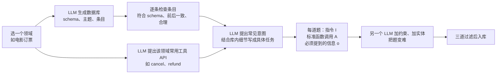

# ToolOrchestra：提示出来的编排器会偏心，8B 编排器要把「该不该花这笔钱」写进奖励

<!-- release-date: 2025-11-27 -->

> 本文依据 **ToolOrchestra: Elevating Intelligence via Efficient Model and Tool Orchestration**，arXiv:2511.21689v1，2025-11-26 提交，封面日期 2025-11-27，共 21 页（正文 p. 1–10，参考文献 p. 11–14，附录 A–L p. 15–21）。作者来自 NVIDIA 与香港大学，共同一作是 Hongjin Su 与 Shizhe Diao（PDF p. 1）。页码均指 PDF 自身的页码。文中区分三件事：**论文明确写了什么**、**我们怎么解释它**、**哪些是外部资料或本文推算**。

## 读前先把几个词说成人话

这篇论文假设读者大致知道「让语言模型调用外部工具」是怎么回事。先把会反复出现的词说清：

- **工具调用（tool calling）**：模型不直接给答案，而是输出一段结构化请求——「我要调用这个函数，参数是这些」。外部系统执行后把结果塞回对话。搜索、代码解释器、查航班状态都是工具。
- **单体系统（monolithic system）**：一个强模型包办所有步骤。可以给它配搜索和计算器，但想、调、答都是它自己（PDF p. 2）。
- **编排器（orchestrator）**：本文主角。它不一定自己解题，而是决定这一步该叫哪个工具、哪个模型、按什么顺序、花多少钱。可以先当成一个项目经理。库里的 Fugu 一篇也是编排器，那边主要在前沿模型之间调度，本篇把模型和搜索、代码解释器放进同一套工具接口。
- **智能工具（intelligent tools）**：论文的叫法，指被当成工具来调用的语言模型——从 7B 的数学模型到 GPT-5 都算，能力不同、价格不同（PDF p. 2）。
- **强化学习（Reinforcement Learning，RL）**：让模型自己生成完整的解题轨迹，按结果给奖励，强化得分高的行为。
- **GRPO（Group Relative Policy Optimization，组相对策略优化）**：对同一道题采样一组轨迹，用组内的相对好坏当优势，省掉单独的价值网络。出处见库里的 DeepSeekMath 一篇。
- **HLE（Humanity's Last Exam）**：一套跨学科的博士级难题。本文评测用的是其**纯文本子集**（PDF p. 7 表注、p. 15）。

## 一句话先说清

矛盾可以这样说：

> **给现成大模型一份工具清单，再写一句「又准又省」，它不会变成合格的调度员。它会偏心：要么总叫自家的小号，要么不管价钱总叫最强的那个。**

论文用一个试点把这件事量了出来（PDF p. 2 Figure 3，附录 A 在 p. 15）：同一套提示词、同一组候选模型、300 道 HLE 题，GPT-5 当编排器时 **98%** 的模型调用给了 GPT-5 或 GPT-5-mini；Qwen3-8B 当编排器时 **73%** 给了 GPT-5。

论文的回答不是再写更好的提示词，而是**训练**一个编排器。方法叫 **ToolOrchestra**，产物叫 **Orchestrator-8B**：以 Qwen3-8B 为骨干，用 RL 在多轮轨迹上同时优化答对、花钱与耗时、以及是否顺着用户对工具的偏好（PDF p. 2、p. 4、p. 7）。

主结果必须带着对照档读（PDF p. 7，Table 1）：

- **HLE 纯文本子集 37.1**，对照的 GPT-5 是**只配基础工具**那一档的 35.1；同一档里 FRAMES 76.3 对 74.0，$\tau^2$-Bench 80.2 对 77.7。
- 平均成本 **9.2 美分**、时延 **8.2 分钟**（HLE 与 FRAMES 的平均），那一档 GPT-5 是 30.2 美分、19.8 分钟。
- 最干净的一组对照是**同一个骨干、同一套工具箱**：只靠提示词的 Qwen3-8B 是 HLE 30.6、FRAMES 68.9、$\tau^2$-Bench 72.3、成本 27.6 美分；训练之后三项分别涨 6.5、7.4、7.9 分，成本降到三分之一。

它真正想让你记住的不是「8B 赢了 GPT-5」这句宣传，而是：

> **更强的模型应当被当成一种贵工具，而不是默认的大脑。「该不该花这笔钱」这种调度，提示词教不会，得写进奖励里训。**

### 一条阅读路线

1. **p. 2 的 Figure 2 与 Figure 3**：系统长什么样；提示词编排器偏心到什么程度。
2. **p. 4 的式 1–3**：三条奖励怎么收成一个标量，答错为什么整条归零。
3. **p. 5 的 Figure 4**：可验证的多轮训练题是怎么造出来的。
4. **p. 7 的 Table 1**：分三档读，别把两个 GPT-5 混成一个。
5. **p. 8 的 Figure 5、Figure 6，p. 21 的 Table 15**：钱流向了哪里。
6. **p. 9 的 Table 2、Table 3**：换一批没见过的模型会怎样；偏好分数是什么口径。

## 先看全景：一个 8B 指挥，三类工具，三条奖励

图注：引自原文 Figure 2（PDF p. 2）。钱袋个数是原图示意的相对贵贱，不是报价。

图上几件事要先对齐：

- **左边**是用户：一道题（Alon-Tarsi 数），外加一句偏好「如果可以，我想省钱」。
- **中间上排**是多轮循环：思考 → 调用工具 → 读返回，重复到给出答案。图里第一轮查了本地检索，第二轮把「估计上界」交给了 GPT-5。
- **中间下方**是三类工具：基础工具（本地检索、网页搜索、`get_flight_status` 这类领域函数、代码解释器），专家模型（Qwen2.5-Math-7B / 72B、Codestral-22B、查询改写器），通才模型（GPT-5、Llama-Nemotron-Ultra-253B、Claude Opus 4.1、Qwen3-235B）。
- **右边**是奖励：结果、效率、偏好三项，回流给编排器做 RL。

图里的模型名是示意。正式评测的工具箱是另一份固定名单（PDF p. 6），后面实验一节会列出。

和「给 GPT-5 配一套搜索」的差别在于（PDF p. 2）：**各种能力、各种价格的语言模型本身也是工具**；编排器的职责是为当前任务挑对工具、排对顺序，并尊重用户偏好、压低成本。论文押的注是：把大问题拆成窄子问题交给智能工具，整个系统有可能比其中任何一个工具、也比领先的单体方案更强。

## 主要矛盾：提示出来的编排器为什么靠不住

### 旧问题：工具用上了，调度还是默认习惯

已有的工具使用研究，主要是给**一个**强模型配上搜索、计算器（PDF p. 1）。论文认为这低估了工具：人在推理时会去请比自己更强的专家、更复杂的软件，而不是什么都自己扛（PDF p. 1）。

最省事的实现，是拿一个现成模型当编排器，只在它觉得必要时才叫更强的模型（PDF p. 2）。论文说这条路又脆、又有系统性偏差。

### 试点：同一套提示词，两种偏心

附录 A 写了实验设置（PDF p. 15）：提示词模板与正式评测相同，候选是 GPT-5、GPT-5-mini、Qwen3-32B、Qwen2.5-Coder-32B，并要求「成绩最好、成本最低」；300 道 HLE 题，`max_tokens=32,000`，温度 $T=0$。

Figure 3 的柱高如下（PDF p. 2，数字读自图上标注）：

| 谁在编排 | GPT-5 | GPT-5-mini | Qwen3-32B | Qwen2.5-Coder-32B |
|---|---:|---:|---:|---:|
| GPT-5（提示词） | 32% | 66% | 0% | 2% |
| Qwen3-8B（提示词） | 73% | 5% | 16% | 5% |
| Orchestrator-8B（RL 训练） | 33% | 33% | 27% | 6% |

GPT-5 那一行 32% + 66% = 98%，对上附录 A 的 98%；Qwen3-8B 的 73% 是正文与附录都写明的数字。

给这两种偏心起名时，论文前后不一致。引言把 GPT-5 偏爱 GPT-5-mini 叫**自我增强偏差（self-enhancement bias）**，即偏爱「与自己同源的变体」；把 Qwen3-8B 依赖 GPT-5 描述为「不管成本与相对效用，默认叫最强的」（PDF p. 2）。附录 A 却把 Qwen3-8B 那一行叫自我增强偏差，把 GPT-5 那一行另起名为**他人增强偏差（other-enhancement bias）**，定义是「不顾成本偏爱更强的模型」（PDF p. 15）。名字对不上，现象是清楚的：两种默认习惯，都把工具箱里其余选项变成了摆设。

论文据此下了判断（PDF p. 2）：当编排器既能调用比自己弱的工具、也能调用比自己强的模型时，这和普通的工具调用不是一类问题，需要专门的训练方法；工具使用智能体在**成本效率**和**用户偏好**两个方向上的可控性，也还少有人研究。

### 新设计：不提示一个编排器，训一个编排器

ToolOrchestra 的定位，是把一个小语言模型训成异构工具使用智能体的「大脑」（PDF p. 2）。选 8B，是基于一个假设：小模型只要学会有策略地协调更强的工具，就够用了（PDF p. 4）。论文还引了两篇工作佐证小模型在智能体系统里往往够强、也更省（PDF p. 3，引用 [14, 15]）。

后面的每个设计——统一工具接口、三条奖励、数据合成、训练时随机换工具与报价——都是在给这个 8B 大脑造一个能学的环境。

**可迁移启发。** 系统里已经有多个模型和工具时，先做一次「只改提示词」的对照，看调用分布。如果调用塌缩到某一个名字上，问题多半不在提示词写得不够好，而在模型把「自家人」或「最强者」当成默认动作。这种偏差要靠奖励去拆，加一句「请考虑成本」拆不掉。

## 问题怎么写成数学：一条多轮 MDP

论文把多轮工具使用写成马尔可夫决策过程（Markov Decision Process，MDP）（PDF p. 3）。只要抓住它在优化什么：

给定用户指令 $u$ 和用户对每个动作的偏好 $p_a\in[0,1]$，编排器在第 $k$ 步看到交互历史 $h_k$，按策略 $\pi_\theta(a_k\mid h_k)$ 选动作 $a_k$。每个动作有成本 $c_i$、时延 $l_i$ 和偏好对齐度 $p_{a_i}$。走完 $N$ 步得到轨迹 $\tau$，环境按正确性给出奖励 $r(\tau)\in[0,1]$。

目标同时有四项（PDF p. 3）：最大化 $r(\tau)$ 和 $\sum p_{a_i}$，最小化 $\sum c_i$ 和 $\sum l_i$。**这一段把「又准又省又听话」从一句口号变成了四个可以加总的量**，后面的奖励设计就是把它们收成一个标量。

一次 rollout 从系统提示词和题目开始，每一轮是「思考—动作—观察」（PDF p. 3）：先用思维链分析当前状态、计划下一步；再从可用工具里选一个并填参数；环境执行工具调用块，把输出以 user 角色追加进上下文。直到环境给出终止信号，或达到 **50** 轮上限。评测同样最多 50 轮、温度为 0（PDF p. 7）。

论文没有给系统提示词原文，也没有给工具调用块的具体标记格式。

## 设计一：模型和搜索走同一套 JSON 接口

### 旧问题

以往的工具使用智能体，工具箱通常是 API、搜索、解释器（PDF p. 4，对照 ToRL、Search-R1）。如果专家模型和通才模型不能以同样的方式被调用，编排器就没法在「搜一下」和「请 GPT-5 看一眼」之间做同一种决策。

### 新设计：所有工具都是带 schema 的 JSON 对象

ToolOrchestra 把工具集扩展到领域专家模型，并用**单一、统一的接口**暴露全部工具（PDF p. 4）。每个工具是一个 JSON 对象：名字、描述、带类型的参数 schema。

语言模型当工具时，描述不是人写的，而是这样生成的（PDF p. 4）：

1. 随机抽 10 个训练任务；
2. 让这个模型去做，记下轨迹；
3. 请另一个 LLM 根据任务指令、轨迹、以及有没有做完，写出描述。

附录 C 给了 Qwen3-32B 的样本：数学与定量推理强，科学知识尤其是生物学好，化学命名与 InChI 输出弱，人文知识中等且不均，编码与函数调用中等、时常填错参数（PDF p. 15）。编排器看到的不是「Qwen3-32B」这个品牌，而是一段**会什么、不会什么**。

训练用的完整工具目录在附录 D（PDF p. 15–16），每条 rollout 从中**随机抽一个子集**，模拟用户能用的工具各不相同（PDF p. 6、p. 15）：

| 类别 | 训练目录（PDF p. 15–16） |
|---|---|
| 查询改写 | GPT-5、GPT-5-mini、Llama-3.3-70B、Llama-3.1-8B、DeepSeek-R1、Llama-3.1-Nemotron-Ultra-253B、Phi-4-mini、Gemma-3-27B、Qwen3-32B |
| 网页搜索 | Tavily 搜索 API |
| 本地检索 | Faiss 索引 + Qwen3-Embedding-8B |
| 写代码 + 执行 | GPT-5、GPT-5-mini、StarCoder2-15B、Qwen2.5-Coder-32B 写代码，Python 沙箱执行 |
| 数学 | Qwen2.5-Math-72B、Qwen2.5-Math-7B |
| 通才 | GPT-5、GPT-5-mini、Llama-3.3-70B、Llama-3.1-8B、DeepSeek-R1、Llama-3.1-Nemotron-Ultra-253B、Phi-4-mini、Qwen3-32B |

评测时工具箱**固定**，以便公平比较（PDF p. 6）：基础工具是 Tavily 网页搜索、Python 沙箱、Qwen3-Embedding-8B 的 Faiss 本地检索，加上 `get_flight_status` 这类领域函数；专家模型是 GPT-5 与 GPT-5-mini（提示成写代码者）、Qwen2.5-Coder-32B、Qwen2.5-Math-72B 与 7B；通才是 GPT-5、GPT-5-mini、Llama-3.3-70B、Qwen3-32B。

**收益**：编排器的决策空间变成「下一个调用哪个 JSON 工具」，模型和确定性工具是同一类动作。

**代价与边界**：描述的质量取决于那 10 条轨迹和写描述的 LLM。论文没有消融「描述写得好坏影响多少调度」，也没公开那 10 个任务。

**可迁移启发**：要把异构后端收进同一个智能体，先统一接口，再谈策略。让编排器读「它会什么」的一段话，比读一个品牌名更接近真实决策；这段话可以从轨迹里自动总结出来。

## 设计二：三条奖励收成一个标量，答错整条归零

这是全文最值得慢慢看的一节。编排器要学的不是「会不会调工具」，而是「在对、省、听话之间怎么权衡」。论文把权衡写进了奖励。

### 三条原料

**结果奖励**是二元的（PDF p. 4，式 1）：

$$
r_{\mathrm{outcome}}(\tau)=\begin{cases}1 & \text{若 } \tau \text{ 解出了题}\\0 & \text{否则}\end{cases}
$$

判对错用 GPT-5 当裁判，以便处理名字、日期这类写法不一的答案（PDF p. 4）。ToolScale 题目另有三条判定规则，数据一节再讲。

**效率奖励**把钱和墙钟时间都取负（PDF p. 4）：

$$
r_{\mathrm{compute}}(\tau)=-\mathrm{Cost}(\tau),\qquad r_{\mathrm{latency}}(\tau)=-\mathrm{Clock}(\tau)
$$

开源模型和专有模型的算力统一折成钱：输入与输出 token 按第三方 API 报价计（PDF p. 4）。训练时用了 TogetherAI、Venice AI、Chutes、NEBIUS、Lambda、Hyperbolic、Cloudflare、Novita、AIML、Fireworks AI 十家的报价；评测统一用 Together AI 的价格，专有模型用官方价（PDF p. 6–7、p. 16）。论文没有列出单价表。

**偏好**用一个向量表达。设工具集为 $\{t_1,\ldots,t_n\}$，对轨迹 $\tau$ 先拼一个向量（PDF p. 4）：

$$
M^{\tau}=\bigl[m^{\tau}_{t_1},\ldots,m^{\tau}_{t_n},\ r_{\mathrm{outcome}}(\tau),\ r_{\mathrm{compute}}(\tau),\ r_{\mathrm{latency}}(\tau)\bigr]
$$

前 $n$ 维是每个工具在这条轨迹里被调用的次数，后三维是结果、负成本、负时延。用户偏好是同样长度的向量 $P=[p_{t_1},\ldots,p_{t_n},p_{\mathrm{outcome}},p_{\mathrm{compute}},p_{\mathrm{latency}}]$，每一维在 0 到 1 之间，表示用户多想优化这一项（PDF p. 4）。

### 怎么收成一个数

图注：讲解示意，规则据 PDF p. 4 式 1–3，数字是示意用的假设值，不是论文数据。

规则有三步（PDF p. 4）：

1. 在同一个 rollout 组 $\mathrm{T}$ 里，对 $M^{\tau}$ 的每一维做最小—最大归一化：

$$
M^{\tau}_{\mathrm{normalized}}[k]=\frac{M^{\tau}[k]-M^{\mathrm{T}}_{\min}[k]}{M^{\mathrm{T}}_{\max}[k]-M^{\mathrm{T}}_{\min}[k]}
$$

   如果这一维在组内是常数，就置 0，等于「大家都一样，这一维没信息」。

2. 与偏好向量点乘。
3. 答错就整条归零（PDF p. 4，式 2）：

$$
R(\tau)=\begin{cases}M^{\tau}_{\mathrm{normalized}}\cdot P & \text{若 } r_{\mathrm{outcome}}(\tau)=1\\0 & \text{否则}\end{cases}
$$

**最重要的不是点积，而是「否则为 0」。** 答错的轨迹，省下的钱和顺着偏好的调用全部作废。模型不能靠「很便宜但答错」混到正奖励，也不能靠「狂调用户喜欢的工具但没做对」混到正奖励。正确性是一道门，效率和偏好是门后的排序。

图里还能读出两件论文没有明说的事，属于**我们对公式的解读**：

- 偏好为 0 的工具，多调不扣分，只是拿不到分。附录 F 那位「尽量别调 API」的用户（下一小节），并没有让 API 调用被直接惩罚，只是让本地工具的调用被加分。
- 「答对」这一维会在全组都答对时被置 0。于是一组全对的题目里，奖励完全由效率与偏好决定；一组有对有错时，门本身就拉开了差距。

### 偏好从哪来

论文用 LLM 生成「偏好指令 $PI$ + 偏好向量 $P$」对，再用另一个 LLM 检查两者是否一致，然后分成训练集与评测集（PDF p. 6）。训练时把 $PI$ 拼在题目后面，用式 2 与 $P$ 算奖励；评测时换用附录 L 的式 6 算指标（PDF p. 6、p. 21）。

附录 F 的样本（PDF p. 16）：工具是网页搜索、本地检索、Qwen3-235B-A22B、Llama-3.3-70B、o3-mini、o3；用户说自己在公司、服务器上有机密信息、GPU 很多、希望尽量避免调 API；对应 $P=[0,1,1,1,0,0,0,0,0]$，只给本地检索与两个可自托管的开源模型打 1，最后三维（准确率、成本、时延）都是 0。

### GRPO：组内比好坏

Orchestrator 用 GRPO 训练（PDF p. 4）。对每道题，策略生成一组轨迹 $\mathrm{T}$，每条拿到标量 $R(\tau)$，在组内标准化成优势（PDF p. 4，式 3）：

$$
A(\tau)=\frac{R(\tau)-\mathrm{mean}_{\tau\in\mathrm{T}}R(\tau)}{\mathrm{std}_{\tau\in\mathrm{T}}R(\tau)}
$$

再最大化带裁剪的代理目标（PDF p. 5，式 4）：

$$
\mathcal{L}_{\mathrm{GRPO}}(\theta)=\mathbb{E}_{\tau\sim\pi_\theta}\Bigl[\min\bigl(\mathrm{ratio}_\theta(\tau)A(\tau),\ \mathrm{clip}(\mathrm{ratio}_\theta(\tau),1-\epsilon,1+\epsilon)A(\tau)\bigr)\Bigr]
$$

$\mathrm{ratio}_\theta(\tau)=\pi_\theta(\tau)/\pi_{\mathrm{old}}(\tau)$ 是新旧策略的似然比。$\epsilon$ 的取值论文没给。

为了稳住训练、避免这个智能体系统里 KL 损失爆炸，反向传播时丢掉三类样本（PDF p. 5）：

1. **同质过滤**：一组 rollout 的奖励标准差小于 0.1，说明行为太像、信号太弱；
2. **格式过滤**：输出不符合工具调用格式；
3. **无效输出过滤**：没给出有效答案或输出。

论文提到要避免 KL 爆炸，但没有写实际是否加了 KL 惩罚、系数多少。

### 收益、代价、边界

**收益**：一次点积就把「用了谁、对不对、贵不贵、慢不慢」收成同一个可反传的标量；答错归零堵住了「省钱刷分」；组内归一化让绝对价格不必在不同题目之间可比。

**代价**（我们的推断）：奖励的尺度完全取决于这一组里最贵与最便宜的那条。如果全组碰巧都贵，便宜的相对优势会被放大；如果一组只有一条答对，门后的比较几乎无从谈起。论文没有讨论这类组内动态。

**边界**：结果裁判是 GPT-5，而 GPT-5 也是工具箱里的一员。论文没有讨论「GPT-5 判对错、编排器又在决定要不要叫 GPT-5」会不会带来偏差。

**可迁移启发**：任何「既要对、又要省、还要听话」的调度问题——模型路由、级联推理、检索与生成的选择——都可以把正确性设成硬门，把其余目标放在门后比。把门和排序混成加权和，模型很容易学会用便宜的错误答案去换平均分。

## 设计三：没有可验证的多轮数据，就先造世界、再造题

### 旧问题

端到端 RL 需要「做完能自动打分」的多轮工具任务，论文说这类数据稀缺（PDF p. 5）。

### 新设计：ToolScale

流程见 Figure 4（PDF p. 5），下面按原图重画：

这张图据 PDF p. 5 Figure 4 与 p. 17 附录 I 重画，是流程示意；「逐条检查条目」一步只写在附录 I。

三道过滤（PDF p. 5）：

1. 执行标准函数调用就报错的，丢；
2. LLM 在 pass@8 下都做不出来的，丢；
3. 不需要任何动作就能做出来的，丢。

第 2 条去掉解不了的题，第 3 条去掉用不着工具的题。**论文没有对「太容易」设上限**：只要需要动手、而且 8 次里有一次能做对，就留下。

一条轨迹算「解出」，必须同时满足三条（PDF p. 5）：

1. **执行正确**：按标准调用 $A$ 执行和按轨迹 $\tau$ 执行之后，数据库内容一致；
2. **过程保真**：必须告诉用户的信息 $o$ 在 $\tau$ 里出现过；
3. **操作完整**：$A$ 动过的数据库条目，$\tau$ 也动过。

这比「最终答案字符串匹配」严，要求过程上真的走对了工具。

附录 J 的 Table 5 列出 10 个领域的规模（PDF p. 17；原表第一列印作 Finanace）：

| | Finance | Sport | E-commerce | Medicine | Entertainment | Railway | Restaurant | Education | Travel | Weather |
|---|---:|---:|---:|---:|---:|---:|---:|---:|---:|---:|
| 工具 | 22 | 19 | 15 | 19 | 24 | 25 | 23 | 21 | 15 | 14 |
| 库条目 | 686 | 423 | 577 | 920 | 852 | 790 | 683 | 816 | 752 | 549 |
| 任务 | 396 | 247 | 343 | 622 | 561 | 414 | 348 | 426 | 331 | 375 |

三行合计是 197 个工具、7048 条库记录、4063 道任务，这是本文的加总；论文正文只说「数千条」（PDF p. 2）。附录 K 原样列出了造数据的提示词（PDF p. 18–20 的 Table 6–13），Table 14 是一段电影库 schema 样本（PDF p. 20）。

### 训练时故意把工具箱弄乱

每个训练实例还做两件事防过拟合（PDF p. 6）：**随机抽可用工具的子集**，模拟不同用户手里的工具不同；**随机换报价表**，让同一套工具在不同实例上价格不同，逼编排器按价格重新权衡。评测时工具和报价都固定，§6.3 与附录 H 再分别换成没见过的模型和报价做压力测试。

### 训练配置

骨干 Qwen3-8B；数据是 GeneralThought-430K 加上 ToolScale（PDF p. 7）。学习率 $1\times 10^{-6}$，最长输入 24,000 token、最长生成 8,000 token，训练 batch 16、rollout batch 8，每题最多 50 轮，全程 16 张 NVIDIA H100（PDF p. 7）。

论文**没有写**训练步数与墙钟、是否先做 SFT、GeneralThought-430K 与 ToolScale 怎么混合、GeneralThought 这类没有工具环境的题在训练里怎么用。

**可迁移启发**：可验证的智能体数据不必先有真实用户。先规定一个带 schema 的世界和一套 API，再从世界里长出题目和标准动作，最后用「标准动作跑得通 / 8 次里能做对 / 不能不动手」三道过滤，就得到 RL 能吃的题。判定规则最好看过程，不只看终态。

## 实验：三个基准，三档对照

### 三个基准各测什么

附录 B（PDF p. 15）：

- **HLE**：博士级跨学科题，选择题或简答，大约 10–14% 需要看图；考的是迭代搜索与深度推理。本文只用纯文本子集。
- **FRAMES**：面向检索增强生成的端到端评测，824 道多跳题，每题需要 2–15 篇维基百科文章。
- **$\tau^2$-Bench**：在与用户的对话里用工具解决问题，领域是电信、零售、航空。没有工具就做不了，所以 Table 1「无工具」档这一列是空的（PDF p. 7）。

### Table 1：先分清三档

Table 1 按「手里有什么」把基线分成三档，外加一行厂商自报的成绩（PDF p. 7）：无工具；只有基础工具（领域函数、搜索、代码解释器）；基础工具 + 专家模型 + 通才模型——和 Orchestrator-8B 同一套扩大工具箱。后两档里，这些基线模型本身就是编排器，只不过是**提示出来的**（PDF p. 6）。

成本单位是**美分**、时延是**分钟**，都是 HLE 与 FRAMES 的平均；$\tau^2$-Bench 的成本与时延另见 Table 16（PDF p. 7、p. 21）。

| 工具档 | 模型 | HLE ↑ | FRAMES ↑ | $\tau^2$-Bench ↑ | 成本 ↓ | 时延 ↓ |
|---|---|---:|---:|---:|---:|---:|
| 厂商自报 | GPT-5 | 35.2 | — | 84.2 | — | — |
| | o3 | 24.3 | — | 68.4 | — | — |
| | GPT-4o | 5.3 | — | 43.8 | — | — |
| 无工具 | Qwen3-8B | 3.2 | 24.2 | — | 0.2 | 0.6 |
| | Llama-Nemotron-49B | 3.6 | 25.6 | — | 0.4 | 1.1 |
| | Llama-3.3-70B | 3.8 | 32.4 | — | 0.5 | 1.4 |
| | Qwen3-235B-A22B | 5.2 | 34.3 | — | 2.6 | 3.3 |
| | Claude Opus 4.1 | 11.7 | 58.2 | — | 27.4 | 8.2 |
| | GPT-5 | 23.4 | 66.3 | — | 6.2 | 4.1 |
| 基础工具 | Qwen3-8B | 4.7 | 26.5 | 40.7 | 1.3 | 2.2 |
| | Llama-Nemotron-49B | 6.8 | 28.2 | 23.2 | 2.5 | 3.5 |
| | Llama-3.3-70B | 4.6 | 42.3 | 17.6 | 2.8 | 4.3 |
| | Qwen3-235B-A22B | 14.0 | 39.5 | 52.9 | 12.3 | 10.2 |
| | Claude Opus 4.1 | 19.8 | 63.5 | 46.0 | 76.2 | 32.5 |
| | GPT-5 | 35.1 | 74.0 | 77.7 | 30.2 | 19.8 |
| 基础 + 专家 + 通才 | Qwen3-8B | 30.6 | 68.9 | 72.3 | 27.6 | 18.3 |
| | Llama-Nemotron-49B | 25.8 | 57.9 | 66.7 | 25.6 | 17.1 |
| | Llama-3.3-70B | 19.7 | 52.4 | 55.8 | 19.7 | 13.4 |
| | Qwen3-235B-A22B | 32.8 | 74.2 | 75.6 | 29.7 | 21.2 |
| | Claude Opus 4.1 | 34.6 | 72.8 | 76.8 | 52.5 | 25.6 |
| | GPT-5 | 21.2 | 57.5 | 62.3 | 17.8 | 13.6 |
| | **Orchestrator-8B** | **37.1** | **76.3** | **80.2** | **9.2** | **8.2** |

表注两条要记住（PDF p. 7）：厂商自报的 HLE 是全集，其余都是纯文本子集，两者不能直接相减；GPT-5 的 $\tau^2$-Bench 厂商报 84.2，作者因实现差异只复现到 77.7。Llama-Nemotron-49B 指 Llama-3.3-Nemotron-Super-49B-v1。

### 读这张表的五件事

**第一，无工具档说明题真的难。** GPT-5 无工具 HLE 23.4，Qwen3-235B-A22B 只有 5.2（PDF p. 7）。

**第二，只给基础工具，强模型会涨，但涨得贵。** Claude Opus 4.1 的 HLE 从 11.7 到 19.8、FRAMES 从 58.2 到 63.5，论文写成本约 2.8 倍、时延约 4 倍（PDF p. 7）。小模型配基础工具仍然不行：Qwen3-8B 只有 4.7。

**第三，把模型也塞进工具箱，结果分叉。** Qwen3-235B-A22B 的 HLE 从 14.0 涨到 32.8、FRAMES 从 39.5 涨到 74.2，成本和时延都翻了一倍多（PDF p. 7）。

**第四，GPT-5 拿到同一套扩大工具箱后三项全部下降**：HLE 35.1→21.2，FRAMES 74.0→57.5，$\tau^2$-Bench 77.7→62.3。论文归因于固有偏差，常常默认叫 GPT-5-mini（PDF p. 7，指向 §6.1）。

**第五，最干净的对照是同一骨干、同一工具箱。** 提示出来的 Qwen3-8B 与训练出来的 Orchestrator-8B 用的是同一个 8B 模型、同一套工具：HLE 30.6→37.1，FRAMES 68.9→76.3，$\tau^2$-Bench 72.3→80.2，成本 27.6→9.2 美分，时延 18.3→8.2 分钟。**这一行才是 ToolOrchestra 这套训练方法本身的净效应**，论文没有把它单独拎出来讲。

所以摘要里「HLE 37.1 超过 GPT-5 的 35.1」比的是**只配基础工具的 GPT-5**。同一套扩大工具箱里，GPT-5 只有 21.2；但那是它被自己的调用偏好拖下来的，不是 GPT-5 能力的上限。论文正文说的「相对 GPT-5 带工具（35.1）和 Qwen3-235B-A22B 带工具加模型（32.8）提升 2 到 4.3 分」，就是 37.1 分别减这两个数（PDF p. 8）。$\tau^2$-Bench 上比基础工具档 GPT-5 高 2.5 分，达不到厂商自报的 84.2。

### 「2.5 倍更高效」和「大约 30% 成本」

摘要写：HLE 上「效率高 2.5 倍」；$\tau^2$-Bench 与 FRAMES 上「大幅超过 GPT-5，成本只有大约 30%」（PDF p. 1）。论文**没有定义 2.5 倍的分母**。

用 Table 1 基础工具档 GPT-5 做分母，本文算得：成本 9.2 / 30.2 ≈ 30%，时延 19.8 / 8.2 ≈ 2.4 倍。$\tau^2$-Bench 单独的成本见 Table 16：10.3 对 31.3，约 33%（PDF p. 21）。**2.5 倍更接近时延比，30% 更接近成本比**，这是本文按表推算的读法。

还要注意：对基础工具档 GPT-5，FRAMES 领先 2.3 分、$\tau^2$-Bench 领先 2.5 分，说不上「大幅」；要说大幅，对照的是扩大工具箱档 GPT-5（57.5、62.3），而那一档的成本是 17.8 美分，9.2 约是它的 52%。摘要把「大幅领先」和「约 30% 成本」写进同一句，实际对应的是两个不同的 GPT-5 档。

## 钱流向哪里：8B 学到的是「别把篮子押在一个名字上」

图注：据 PDF p. 21 Table 15 的每题平均调用次数按类别加总重画；右侧 HLE 与成本取自 PDF p. 7 Table 1。原文 Figure 5（PDF p. 8）用四个饼图画的是其中四个模型的占比，两者数字一致。

Figure 5 的饼图是占比，Table 15 是次数；次数除以行和，就能对上饼图标注。例如 Orchestrator-8B 一行共 8.2 次：本地检索 1.8（22.0%）、GPT-5-mini 1.7（20.7%）、GPT-5 1.6（19.5%）、Qwen3-32B 1.3（15.9%）、代码解释器 0.8（9.8%）、网页搜索 0.7（8.5%）（PDF p. 8、p. 21）。Claude Opus 4.1 的 GPT-5 占比 6.2 / 10.9 ≈ 56.9%，GPT-5 的 GPT-5-mini 占比 5.6 / 10.7 ≈ 52.3%，也与饼图一致。

论文的读法是：Claude Opus 4.1 大多数时候依赖 GPT-5，GPT-5 偏爱 GPT-5-mini，而 Orchestrator-8B 更有策略地在各种工具间选择（PDF p. 8）。图上读得出、论文没展开的三件事：

- **Orchestrator-8B 并不是「不叫 GPT-5」**。它每题仍叫 1.6 次 GPT-5、1.7 次 GPT-5-mini，只是 GPT-5 次数是七行里最少的，总调用次数也最少。
- **多叫 GPT-5 既不充分也不必要。** 提示出来的 Qwen3-8B 每题叫 6.0 次 GPT-5，将近 Orchestrator-8B 的四倍，HLE 却只有 30.6。
- **数学专家几乎没被用上。** Orchestrator-8B 对 Math-72B 是 0.0、Math-7B 是 0.1（PDF p. 21）。工具箱里有的，训出来的策略可以学成「不用」。论文没有解释这一点。

论文在引言里另写了一个 $\tau^2$-Bench 上的比例：Orchestrator 只在大约 40% 的步骤里调用 GPT-5，其余交给更便宜的模型或工具，仍超过每一步都用大模型的智能体（PDF p. 3）。40% 是 $\tau^2$-Bench 的步骤占比，上面的次数是三个基准的平均，口径不同。

### 成本曲线

图注：引自原文 Figure 6（PDF p. 8）。每条曲线上的点对应允许的最大轮数 10、20、50、100。

轮数上限越大，成本越高，所有模型的分数都往上走；Orchestrator-8B 在每个预算下都高于 GPT-5、Claude Opus 4.1 和 Qwen3-235B-A22B，并能以明显更低的成本达到相近分数（PDF p. 8）。**读自 Figure 6 的约数**：Orchestrator-8B 在约 0.2 美元时已到 36% 左右，GPT-5 要到 0.45–0.6 美元才到相近水平。论文没有把这些点的坐标写成表；横轴是每道 HLE 题的美元成本还是别的口径，图注也没说。

Table 16 把 $\tau^2$-Bench 的成本与时延单独列出（PDF p. 21）：Orchestrator-8B 是 80.2 分、成本 10.3、时延 8.6；基础工具档 GPT-5 是 77.7 / 31.3 / 20.2；扩大工具箱档 GPT-5 是 62.3 / 18.2 / 14.5。

## 泛化：换一批没见过的模型，分数掉，排名还在

§6.3 把评测工具箱里的模型换成训练时没见过的一批，基础工具不变，模型描述仍按 §3.1 的三步自动生成（PDF p. 8–9）：

- 查询改写：Claude Opus 4.1、o3-mini、GPT-4o；
- 写代码：Claude Opus 4.1、Claude Sonnet 4.1（论文原文如此）、Codestral-22B-v0.1；
- 数学：OpenMath-Llama-2-70b、DeepSeek-Math-7b-Instruct；
- 通才：Claude Opus 4.1、Claude Sonnet 4.1、Gemma-3-27b-it。

Table 2（PDF p. 9）：

| 模型 | HLE ↑ | FRAMES ↑ | $\tau^2$-Bench ↑ | 成本 ↓ | 时延 ↓ |
|---|---:|---:|---:|---:|---:|
| Qwen3-8B | 12.6 | 34.9 | 38.3 | 37.9 | 10.6 |
| Llama-Nemotron-49B | 13.9 | 32.7 | 22.9 | 53.6 | 8.3 |
| Llama-3.3-70B | 13.2 | 49.3 | 12.8 | 63.3 | 10.1 |
| Qwen3-235B-A22B | 14.7 | 63.5 | 38.7 | 87.2 | 13.8 |
| Claude Opus 4.1 | 17.8 | 53.6 | 43.4 | 102.4 | 19.5 |
| GPT-5 | 16.4 | 54.8 | 44.8 | 81.3 | 14.6 |
| **Orchestrator-8B** | **22.0** | **73.8** | **48.8** | **34.8** | **8.2** |

论文的结论是：面对没见过的模型，Orchestrator-8B 能从描述里理解它们的长短处，三项分数都最高、成本最低（PDF p. 9）。这句成立。

但和 Table 1 的主设定比，Orchestrator-8B 的 HLE 从 37.1 掉到 22.0，$\tau^2$-Bench 从 80.2 掉到 48.8，成本从 9.2 升到 34.8 美分。**这一换，工具箱里没有了 GPT-5，绝对分数跟着掉。** 这个实验支持的是「没见过的模型，给一段描述，编排器还能用、还排第一」，不支持「换了工具箱成绩几乎不掉」。论文没有讨论这个落差。

附录 H 换的是报价而不是模型：同一套工具改用 DeepInfra 的价格（PDF p. 16–17）。Table 4（PDF p. 17）：

| 模型 | HLE ↑ | FRAMES ↑ | $\tau^2$-Bench ↑ | 成本 ↓ | 时延 ↓ |
|---|---:|---:|---:|---:|---:|
| Qwen3-8B | 29.7 | 68.2 | 71.9 | 27.4 | 17.9 |
| Nemotron-49B | 25.6 | 57.8 | 66.3 | 24.3 | 17.2 |
| Llama-3.3-70B | 19.6 | 52.2 | 55.4 | 17.9 | 12.0 |
| Qwen3-235B-A22B | 32.4 | 74.1 | 75.3 | 27.9 | 20.8 |
| Claude Opus 4.1 | 34.5 | 72.3 | 76.4 | 52.3 | 25.1 |
| GPT-5 | 20.8 | 57.3 | 61.9 | 17.5 | 13.2 |
| **Orchestrator-8B** | **36.9** | **76.6** | **80.4** | **7.5** | **7.8** |

分数和 Table 1 几乎同一水平，成本从 9.2 降到 7.5。**我们如何解释它**：训练时本来就在随机改价，测试时换一张价目表是同分布的扰动；换一批没见过的模型才是真的出了分布。

## 用户偏好：评测口径和训练口径不是一套公式

Table 3 的数字看起来像准确率，其实是附录 L 定义的**偏好感知奖励**（PDF p. 9、p. 21）。

评测时先跑一次起始 checkpoint（例如 Qwen3-8B），得到每道题的基线向量 $M_0$；再跑待测 checkpoint 得到 $M_s$；然后按方向归一化（PDF p. 21，式 5）：

$$
M_{\mathrm{normalized},s}[k]=\begin{cases}M_s[k]\,/\,\max(1,M_0[k]) & 1\le k\le n+1\\ M_0[k]\,/\,\max(1,M_s[k]) & \text{其余}\end{cases}
$$

前 $n+1$ 维（各工具调用次数与结果）比基线多就加分；后两维（成本与时延）比基线少才加分。再与 $P$ 点乘、答错归零（式 6），基准分是全部题目的 $R_e$ 之**和**（PDF p. 21）。

Table 3（PDF p. 9）：

| 模型 | HLE | FRAMES | $\tau^2$-Bench |
|---|---:|---:|---:|
| Qwen3-8B | 25.3 | 43.2 | 55.7 |
| Llama-Nemotron-49B | 27.6 | 50.1 | 56.9 |
| Llama-3.3-70B | 22.3 | 44.5 | 55.4 |
| Qwen3-235B-A22B | 37.9 | 54.5 | 68.2 |
| Claude Opus 4.1 | 40.2 | 63.4 | 73.5 |
| GPT-5 | 34.6 | 62.3 | 70.3 |
| **Orchestrator-8B** | **46.7** | **68.4** | **79.5** |

论文的判断是：即便 GPT-5 这样的强单体也难以忠实遵循用户偏好，Orchestrator-8B 明显更好（PDF p. 9）。数字方向支持这个判断，但读的时候要记住三点（**我们的解读**）：

- 这是相对 Qwen3-8B 基线、按 $P$ 加权、只在答对的题上计分的自定义指标，和 Table 1 的准确率不在一把尺子上；
- 按定义是求和，分数量级本应随题数变化，而表里的数字都落在 0–100 之间，论文没说明是否还做了别的归一；
- 论文没给「偏好指令被遵守的比例」「不该用的工具实际调用率」这类更直接的统计。

## 相关工作：它说自己比 OTC 多走了哪一步

§7 分两支（PDF p. 9）。第一支从工具学习走到通才智能体：早期用 SFT 在工具标注数据上训练（Toolformer、ToolLLM 等），后来把工具使用写成 RL 的序列决策（WebGPT、Search-R1、ToRL、StepTool、SWiRL、Nemotron-Research-Tool-N1、ToolRL），再到深度研究智能体与复合 AI 系统（compound AI systems），以及 SmolAgent、OWL 等开源框架。

第二支从「调对工具」走向「又省又可控」：提示词方法有 Self Divide-and-Conquer、Efficient Agents、SMART；RL 方法开始把长度、难度、人类反馈收进奖励。论文点名 **OTC** 是最相关的前作：它惩罚过多的工具调用来提效，同时保住准确率。论文说自己的不同在于解决的是更广的编排问题，用 RL 协调多样的工具与模型，在正确、效率、用户偏好之间做更细的对齐（PDF p. 9）。

结论段把贡献收成三句（PDF p. 10）：小编排模型统一工具与专家模型；端到端 RL 让策略同时受结果、效率和人类偏好引导；ToolScale 数据集。最后展望的「更复杂的递归编排器」，正文没有任何实验。

## 论文没有写的

- **没有消融。** 三条奖励各值多少？答错归零挡掉了多少「便宜的错答」？0.1 的同质过滤阈值敏感吗？随机抽工具子集是不是泛化的来源？自动生成的描述换成品牌名会怎样？这些都是论文自己的设计动机，都没有对照实验。
- **训练过程几乎是黑盒。** 已知骨干、学习率、batch、16 张 H100、50 轮上限（PDF p. 7）；不知道训练步数、墙钟、token 用量、是否先做 SFT、两份数据怎么混、GRPO 的 $\epsilon$、有没有 KL 项。
- **「2.5 倍更高效」没有定义**（PDF p. 1）。
- **摘要把两个 GPT-5 档混进同一句**：37.1 对 35.1 与「约 30% 成本」用的是基础工具档；「大幅领先」更像扩大工具箱档。
- **没有失败分析。** 编排器选错工具会怎样，工具超时或搜索失败怎么进奖励，GPT-5 裁判与 GPT-5 工具会不会互相强化，都没讨论。附录 F 的偏好例子涉及机密数据，但全文没有安全或隐私一节。
- **评测只有三个推理与对话工具基准**，没有代码生成、开放网页操作或长程软件工程任务。
- **数学专家几乎没被调用，没有解释**（PDF p. 21）。
- **偏好评测不能直接读成遵守率**（PDF p. 21）。

## 可迁移启发

按「拿来就能用」到「需要条件」排。

**1. 先测提示编排器的调用分布，再决定要不要训。** Figure 3 与附录 A 的方法很便宜：同一套提示词、同一组工具，看调用是不是塌缩到一个名字（PDF p. 2、p. 15）。已经 73% 或 98% 集中在一侧时，继续改提示词的回报通常很低。

**2. 正确性做成硬门，效率和偏好放在门后。** 式 2 的「否则为 0」（PDF p. 4）几乎零成本，却挡住了「用便宜的错答刷平均分」。路由、级联、调度系统都可以先抄这一刀。

**3. 更强的模型是贵工具，不是默认大脑。** GPT-5 拿到更大的工具箱反而三项全降（PDF p. 7），因为调用塌缩到了 GPT-5-mini。系统变强的路径不一定是「让最强模型看到更多工具」，也可能是「让另一个策略决定什么时候才配用最强模型」。

**4. 评估编排方法，要比同骨干、同工具箱。** Qwen3-8B 提示版与训练版的差（30.6→37.1、27.6→9.2 美分）才是方法的净效应；拿它和另一档的 GPT-5 比，混进了工具箱差异。

**5. 模型和确定性工具走同一套接口。** JSON schema 加一段从轨迹里总结的能力描述（PDF p. 4），新模型进池子时先跑 10 道题、让另一个 LLM 写描述，不必改编排器的接口层。

**6. 可验证的多轮数据可以先造世界再造题**，判定看过程不只看终态（PDF p. 5）。

**7. 训练时随机化你真正担心的那一维。** 随机改价之后，换报价几乎不掉分（Table 4）；换一批没见过的模型掉得多，但仍排第一（Table 2）。怕价格变就随机价格，怕模型换代就随机模型子集——后者本篇只在训练时抽子集，测试时的未见模型仍是一次单独的压力测试。

**8. 组内奖励方差太小就别更新。** 同质过滤（标准差小于 0.1 就丢，PDF p. 5）是一条具体的工程规则：一组轨迹全对或全错时，GRPO 的优势接近 0，硬更新只会搅乱策略。

**9. 读智能体榜单，先问工具箱是哪一档。** 同一个 GPT-5，无工具 23.4、基础工具 35.1、扩大工具箱 21.2（PDF p. 7）。差的不是模型，是它被允许调用什么、以及它会不会用。

## 关键词回看

- **编排器 / 智能工具**：决定下一步叫哪个工具或模型的策略模型；被当成工具调用的语言模型。
- **提示出来的偏心**：GPT-5 偏爱 GPT-5-mini，Qwen3-8B 偏爱 GPT-5；论文引言和附录对两者的命名不一致。
- **统一工具调用**：模型与搜索、代码解释器都是带 schema 的 JSON 工具；模型描述由另一个 LLM 从 10 条轨迹总结。
- **结果 / 效率 / 偏好奖励**：二元对错、负成本与负时延、工具调用次数；组内逐列 min–max 归一化、点乘偏好向量 $P$、答错归零。
- **GRPO 与三种过滤**：组内标准化优势；同质（标准差小于 0.1）、格式、无效输出三类样本不参与更新。
- **ToolScale**：10 个领域、4063 道带标准动作的合成任务（合计为本文加总），三道过滤、三条判定。
- **三档对照**：无工具、基础工具、基础 + 专家 + 通才；Orchestrator-8B 属于第三档。
- **偏好感知奖励**：评测时相对起始 checkpoint 归一化、按 $P$ 加权、答对才计分的求和指标。

## 最后的判断

这篇论文真正做对的，是把一个大家都见过、却很少被量化的失败写成了实验：**提示出来的编排器会偏心，而偏心会直接体现在成本和准确率上。** 同一套工具箱里，GPT-5 当编排器只有 21.2（PDF p. 7），因为它一半以上的调用给了 GPT-5-mini（PDF p. 8）。

支撑方法的技术并不花哨：统一 JSON 接口让模型与工具成为同一类动作；式 2 把正确性做成硬门；ToolScale 造出能自动判分的多轮世界；训练时随机换工具、换报价，让策略别背名单。

证据分三层：

- **有定量支撑的**：同一骨干、同一工具箱下训练带来的准确率提升与成本下降（Table 1）；调用分布更均衡（Figure 5、Table 15）；换报价几乎不掉分（Table 4）；换未见模型仍排第一但绝对分明显下降（Table 2）。
- **只有作者主张的**：「2.5 倍更高效」的具体口径；偏好遵循「明显更好」背后的遵守率。
- **没有公开的**：全部消融、训练步数与成本、SFT 与数据配比、GRPO 细节。

把摘要读成「8B 全面超越 GPT-5」，超出了表格的支撑范围；读成「训练过的调度策略，在同一套工具里比提示出来的调度又准又省」，是表格能撑住的。

如果只记一句：

> **「该不该花这笔钱」不能写在提示词里碰运气；它得写进奖励，而且答错的时候，省下的钱和顺着的偏好必须一起归零。**

## 资料与阅读边界

**原始依据与版本**

- 本地 `papers/NVIDIA/ToolOrchestra.pdf`，即 [arXiv:2511.21689](https://arxiv.org/abs/2511.21689) v1，21 页。arXiv 上只有这一版。

**首发日证据**

- `release-date` 取 **2025-11-27**：官方仓库 [NVlabs/ToolOrchestra](https://github.com/NVlabs/ToolOrchestra) 的 News 写明 2025/11/27 发布代码、训练数据与模型权重，代码与 README 也是当天（UTC 2025-11-27 03:57）提交到默认分支。权重仓库（现名 [nvidia/Nemotron-Orchestrator-8B](https://huggingface.co/nvidia/Nemotron-Orchestrator-8B)，旧名 `nvidia/Orchestrator-8B` 会重定向）的权重文件提交于 2025-11-26 23:03 UTC，无法确认当时已对外开放；仓库创建日与空提交不算公开。

**外部补充（不是论文内容）**

- 数据集 [nvidia/ToolScale](https://huggingface.co/datasets/nvidia/ToolScale) 的卡片写 `num_examples: 4063`，与本文对 Table 5 的加总一致。
- GeneralThought-430K 的地址来自论文脚注：<https://huggingface.co/datasets/natolambert/GeneralThought-430K-filtered>。

**本文推算与读图**

- 30%、约 2.4 倍、52%、33%、6.5 / 7.4 / 7.9 分的涨幅、类别加总的调用次数，都是本文按 Table 1、15、16 计算的；Figure 3 的百分比读自图上标注；Figure 6 的约数读自原图。

**原文里的小问题**

- 偏差命名在引言与附录 A 不一致（PDF p. 2、p. 15）；Table 5 的 Finanace（PDF p. 17）、附录 F 标题的 Humane（PDF p. 16）、Table 15 的 Nemontron（PDF p. 21）是拼写错误；p. 7 把 §3.3 印成了 S3.3。
