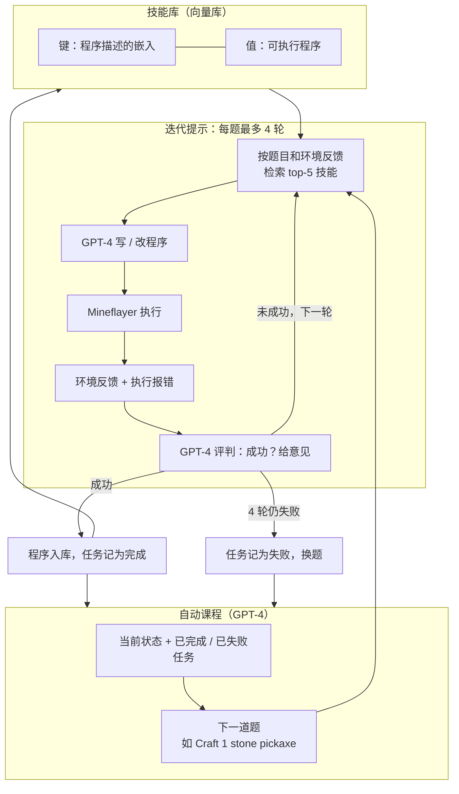
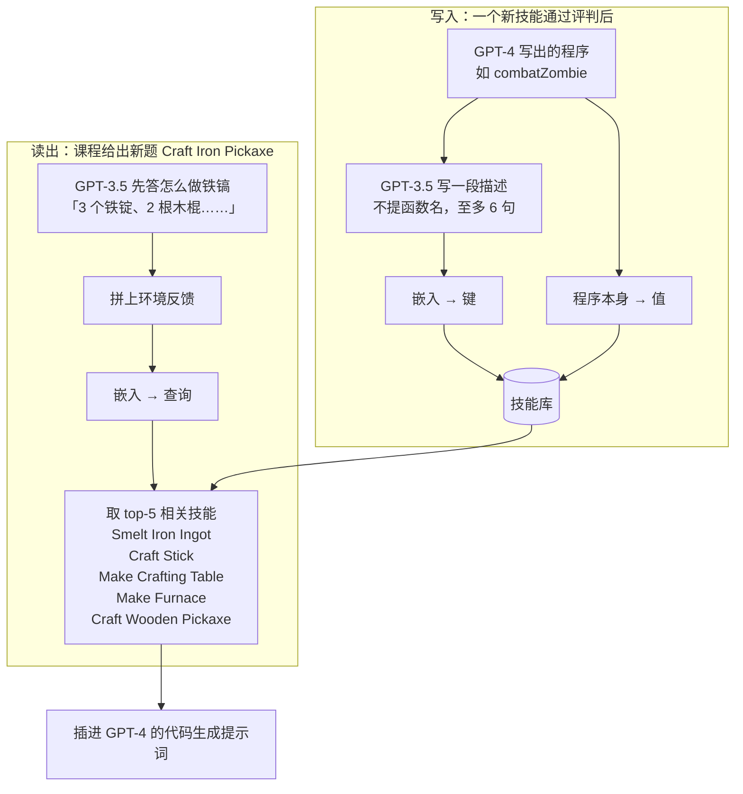

# Voyager：参数冻结，能力写进一份经环境验证的代码库

<!-- release-date: 2023-05-25 -->

> 本文依据本地 `papers/NVIDIA/Voyager.pdf`，即 **Voyager: An Open-Ended Embodied Agent with Large Language Models**，arXiv:2305.16291v2、2023-10-19 修订，共 42 页（正文 p. 1–11，参考文献 p. 11–18，附录 A 方法 p. 19–37，附录 B 实验 p. 38–42）。页码均指 PDF 文件页码，与页脚印刷页码一致。文中区分三件事：**论文明确写了什么**、**我们怎么解释它**、**哪些是外部资料或我们的推算与读图**。

## 读前先把几个词说成人话

这篇论文不训练任何网络。它难读的地方在于：「学习」「技能」「迭代」这些词都换了含义。先把它们说清楚。

- **具身智能体（embodied agent）**：不只聊天，还要在一个环境里移动、采集、合成、战斗，改变世界状态。本文的环境是 Minecraft。
- **科技树（tech tree）**：Minecraft 的工具进阶链，木器 → 石器 → 铁器 → 钻石。每一级都依赖上一级的工具和材料，论文拿它测「会不会组合技能」（PDF p. 7）。
- **上下文学习（in-context learning）**：不改权重，只把例子、状态、报错写进提示词，让模型当场改行为。
- **灾难性遗忘（catastrophic forgetting）**：神经网络学新东西时把旧能力覆盖掉，是持续学习的老问题。
- **Mineflayer**：一套用 JavaScript 控制 Minecraft 机器人的高层 API。Voyager 不看像素、不按键鼠，而是让 GPT-4 写调用这些 API 的程序。仿真环境搭在 MineDojo 上（PDF p. 6）。
- **提示迭代（prompting iteration）**：论文的时间单位，大致是一轮「生成或修改代码，再到环境里执行」。它不是墙钟时间，也不是游戏 tick。所有「快多少倍」都按这个单位算。

系统里有四个角色，都是对 OpenAI API 的不同提示，不是四个模型（PDF p. 4、p. 6、p. 19）：

- **课程智能体（curriculum agent）**：看当前状态，出下一道题。GPT-4。
- **动作智能体（action agent）**：把题目写成 Mineflayer 程序。GPT-4。
- **评判智能体（critic agent）**：看执行后的状态，判断题目做成没有。GPT-4。
- **技能管理器（skill manager）**：把做成的程序存进向量库，下次检索。描述和检索查询由 GPT-3.5 生成，向量用 `text-embedding-ada-002`。

## 一句话先说清

2023 年春天，LLM 智能体已经会用预训练里的世界知识出计划、写可执行策略。论文的批评是：它们**不是终身学习者**，不能在很长的时间跨度里逐步获取、更新、积累和迁移知识（PDF p. 2）。而传统的终身学习要改参数，参数一改就有遗忘。

Voyager 的回答是：参数冻结，把「学到的东西」换一个载体存。



这张图按 PDF p. 2 的 Figure 2 与 p. 19 的 Pseudocode 1 重画，是机制示意，不是实测时间轴。三个模块就是论文的三项贡献（PDF p. 1–2）：自动课程负责出题，技能库负责记住，迭代提示负责把一道题调到做成为止。

整条循环里没有一步改 GPT-4 的权重。会变的只有三样外存：课程手里的完成 / 失败清单，技能库里多出的函数，游戏世界本身。论文把这称为「上下文里的终身学习」，并写明它绕开了对模型参数的访问和任何基于梯度的训练或微调（PDF p. 2）。

摘要给了三个倍数（PDF p. 1）：独特物品多 $3.3\times$，走过的距离长 $2.3\times$，科技树关键节点最快 $15.3\times$。读它们之前要先知道分母：对照是作者自己改写到 Minecraft 里的 ReAct、Reflexion、AutoGPT 三个 **LLM 智能体**，不是 VPT、DreamerV3 这类看像素、出键鼠的方法（PDF p. 6）。物品数和科技树两个倍数的分母都是 AutoGPT，距离倍数没有公开底数，后面逐条拆。

### 一条阅读路线

只有半小时读原文，建议按这个顺序：

1. **p. 2 的 Figure 2 和 p. 19 的 Pseudocode 1**：先看清一道题怎么被出、被写、被判、被存。
2. **p. 3–6 第 2 节**：三个模块各自的提示词组成，以及 Figure 3–6 的真实例子。
3. **p. 7 Table 1、p. 8 Table 2**：科技树与零样本，倍数和成功率都从这两张表来。
4. **p. 9 Figure 9**：六个消融，哪个模块拿掉掉得最多。
5. **p. 10 第 4 节**：成本、不准、幻觉三条限制。

附录的完整提示词（p. 21–37）第一次可以跳过；想复现时再回来读 p. 21–22 的课程提示和 p. 26–31 的代码生成提示，里面有很多正文没写的硬约束。

## 主要矛盾：参数不能动，经验往哪里存

论文把「有效的终身学习智能体」拆成人类玩家会做的三件事（PDF p. 2）：按自己的水平和眼前的世界出题（在沙漠里先学采沙子和仙人掌，而不是先去找铁）；根据环境反馈改技能，并把掌握了的技能记下来留着复用（打僵尸和打蜘蛛相似）；自己去找新任务。

两条旧路都做不到这三件事，但卡的地方不同。

**强化学习与模仿学习**在原始动作上工作：按键、鼠标、离散控制。论文说这条路在系统探索、可解释性、泛化上都吃力（PDF p. 2）。学到的东西存在权重里，持续学习时还要面对灾难性遗忘（PDF p. 3）。

**当时的 LLM 智能体**已经能直接出可执行策略，但每次用完即弃。能力停在「这一次提示词里有什么」，没有地方积累。

于是矛盾变成：

> 想要能力随时间累积，旧办法是改参数，代价是遗忘和训练。GPT-4 只能黑盒调用，参数根本动不了。那么「学会了」这件事，必须落在参数之外的某个载体上，而且这个载体要能组合、能检索、不会被新知识覆盖。

Voyager 选的载体是**经环境验证过的可执行代码**。下面四节按「为什么是代码 → 谁出题 → 怎么存 → 怎么调通」展开。

附录 Table A.2 把这个选择放在当时的 Minecraft 智能体里对照（PDF p. 38）：

| | VPT | DreamerV3 | DECKARD | DEPS | Plan4MC | Voyager |
|---|---|---|---|---|---|---|
| 演示 | 视频 | 无 | 视频 | 无 | 无 | 无 |
| 奖励 | 稀疏 | 稠密 | 稀疏 | 无 | 稠密 | 无 |
| 观察 | 仅像素 | 像素 + 元信息 | 像素 + 背包 | 反馈 + 背包 | 像素 + 元信息 | 反馈 + 元信息 + 背包 |
| 动作 | 键鼠 | 离散 | 键鼠 | 键鼠 | 离散 | 代码 |
| 自动课程 | | | ✓ | | | ✓（GPT-4 上下文出题） |
| 迭代规划 | | | | ✓ | | ✓（三类反馈） |
| 技能库 | | | | | ✓（预定义） | ✓（自己生成） |
| 无梯度 | | | | | | ✓ |

这张表的读法是：Voyager 不是「Minecraft 打得最好」的那一列，而是唯一同时有自动课程、迭代规划和自生成技能库、并且完全不走梯度的那一列（PDF p. 37）。它的观察是背包、方块名、实体名这类元信息，不是像素。像素路线的代表可以对照 DreamerV3 一篇。

## 前提：动作空间换成代码

### 旧问题：原子动作组不起长程行为

论文选代码而不是底层电机指令，理由只有一句：程序天然能表示「持续一段时间、可组合」的动作，而 Minecraft 的长程任务正需要这个（PDF p. 2）。按键序列不能调用另一段按键序列；函数可以调用函数。

### 新设计：两层现成原语，再往上长技能

动作智能体手里的积木分两层（PDF p. 24–25）：

- **作者包好的控制原语**：`exploreUntil`、`mineBlock`、`craftItem`、`placeItem`、`smeltItem`、`killMob`、`getItemFromChest`、`depositItemIntoChest`。它们既示范 Mineflayer 怎么用，也能被 GPT-4 直接调用。
- **Mineflayer 自带的 API**：寻路目标（`GoalNear`、`GoalGetToBlock` 等）、`bot.equip`、`bot.fish`、`bot.lookAt`、`bot.activateItem` 等。

GPT-4 生成的每个技能，都是在这两层之上再写一层函数，并且可以调用技能库里已有的技能。附录给的五段真实技能代码把这种层次摊开了：

| 技能 | 它做什么 | 调用的其他技能 | 调用的原语与 Mineflayer API |
|---|---|---|---|
| `craftWoodenPlanks` | 7 种原木任取其一合成对应木板，背包里没有原木就先砍 | `mineWoodLog` | `craftItem` |
| `mineTenCobbledDeepslateBelowY0` | 装备铁镐，到 $y<0$ 处找深板岩，挖 10 块 | 无 | `exploreUntil`、`mineBlock`、`equip` |
| `smeltFiveRawIron` | 背包里没有熔炉就先造，找空位放下，用煤烧 5 个生铁 | `craftFurnace` | `placeItem`、`smeltItem` |
| `fillBucketWithWater` | 找到水，走到旁边，看向水面，装备桶并使用 | 无 | `exploreUntil`、`pathfinder.goto`、`lookAt`、`equip`、`activateItem` |
| `catchFiveFishSafely` | 没有鱼竿就先造，找水，钓 5 条，被打断就重试这一次 | `craftFishingRod` | `exploreUntil`、`pathfinder.goto`、`lookAt`、`equip`、`fish` |

表按 PDF p. 32–34 的五段技能代码与 p. 24–25 的原语清单整理。第三列的 `mineWoodLog`、`craftFurnace`、`craftFishingRod` 在代码里被调用却没有定义，也不在原语清单里；按提示词的组织方式（检索到的技能插在原语之后，PDF p. 29），它们应当来自技能库。这是我们的推断，论文没有给调用图。

几段代码里反复出现的写法是「缺什么补什么」：先查背包，缺材料就调用一个更低层的技能去弄。这不是巧合。代码生成提示词写死了：函数会被复用来构建更复杂的函数，所以要通用；不要对背包做强假设，用之前先检查，缺了就先收集（PDF p. 30）。

### 代价

代码动作空间的前提，是有人把游戏逻辑摊成了 API。论文明说不和像素输入、底层控制的方法比，因为那不是同一类比较；它的重点是把 GPT-4 的终身学习推到哪，而不是解决三维感知或感觉运动控制（PDF p. 6）。它还声称和 VPT 这类梯度方法正交，只要控制器提供代码 API 就能组合（PDF p. 6–7），但文中没有做这种组合。

## 核心设计一：自动课程，让 GPT-4 出「刚好难一点」的题

### 旧问题：写死的题表看不见现场

开放世界里目标的难度差几个数量级。写死一张「先砍树再挖矿」的表有两个毛病：它看不见现场，人在河边、手里有鱼竿时，下一题不该还是砍树；它要 Minecraft 专家来写，写完只有这一条路（PDF p. 8）。随机出题更糟，题目顺序乱了，会难到做不动（PDF p. 8）。

### 新设计：以「发现尽量多样的东西」为总目标，自下而上出题

课程提示词里的总目标是一句：发现尽可能多样的东西，完成尽可能多样的任务（PDF p. 21）。论文把这看成上下文形式的**新颖性搜索（novelty search）**（PDF p. 2）。它不是把一个总目标自上而下拆成子目标，而是看现场状态和探索进度，一题一题往上长（PDF p. 3）。

Figure 3 的五条真实出题（PDF p. 3）：

| 现场状态（论文节选） | GPT-4 出的下一题 |
|---|---|
| 背包里有木镐和 3 块石头 | Craft 1 stone pickaxe |
| 生物群系是河，背包有鱼竿 | Catch 1 fish |
| 饥饿 0/20，附近有猪 | Kill 1 pig |
| 有熔炉、4 个生铁和煤 | Smelt 4 raw iron |
| 夜晚，附近有僵尸，已装备石剑和盾 | Kill 1 zombie |

每一题都是「看见什么、缺什么，就做什么」。

### 工作机制：提示词里放什么，什么时候放

提示词有五部分（PDF p. 4、p. 20）：指令与约束；当前状态（背包、装备、32 格内的方块和实体、最近见过的方块、已知箱子、生物群系、时间、生命与饥饿、坐标）；已完成和已失败的任务；额外上下文；先推理再出题的思维链。

**额外上下文**由 GPT-3.5 生成：按当前状态自问 5–10 个问题，每个问题带一个「概念」，可选地用概念去 MineDojo 的 wiki 知识库取文档，再自答（PDF p. 20、p. 22）。论文说实践中 wiki 不是必须的，因为 GPT-3.5 已经懂 Minecraft；换到 GPT-3.5 没见过的领域，外部知识库才划算（PDF p. 20）。这些标准 NLP 活交给 GPT-3.5，理由是省钱（PDF p. 4）。

课程提示词里还有几条正文没写、但决定了课程形状的硬约束（PDF p. 21–22）：

- 题目必须是一个短语，格式如 `Mine / Craft / Smelt / Kill / Cook / Equip [数量] [对象]`；
- 不要太难，要新奇，不要反复做同一件事，除非为了攒材料；
- 夜里也不要造避难所；
- **需要看屏幕才能验证的题一律不出**：放置、建造、种植、交易类任务都避开。

最后一条很关键：评判只能看文字状态，所以课程从源头就不出评判验不了的题。这也解释了为什么后面造房子要靠人帮忙。

状态不是一开始就全塞进去的。Table A.1 的 **热身时间表（warm-up schedule）** 按已完成任务数逐步打开信息（PDF p. 21）：

| 提示词里的信息 | 完成多少个任务后加入 |
|---|---:|
| 核心背包（只含原木、木板、木棍、工作台、熔炉、泥土、煤、镐、剑、斧）、装备、附近方块、坐标 | 0 |
| 附近实体 | 5 |
| 完整背包 | 7 |
| 最近见过的其他方块、生物群系 | 10 |
| 生命、饥饿、时间、额外上下文 | 15 |

论文的理由是：提示词里的信息随探索进度变多，课程才会从基本技能走向更复杂、更多样的技能（PDF p. 20–21）。温度也分开设，课程用 0.1 鼓励多样，其余调用一律 0（PDF p. 6）。

### 收益、代价、可迁移启发

消融里，换成随机课程，发现的物品数掉 $93\%$；换成十步走到钻石的人工课程，也明显落后（PDF p. 8，Figure 9 左，图见后文消融一节）。

代价写在第 4 节：课程会幻觉出游戏里不存在的物品，比如「铜剑」「铜胸甲」（PDF p. 10）。它没有「这东西是否存在」的硬校验，只靠 GPT-4 的记忆。

可迁移的是两条更窄的原则。其一，出题器必须同时看见现场状态和失败历史；只看总目标的分解器，会把智能体按在一条与当前世界无关的路径上。其二，信息分档放进提示词本身就是一种廉价课程，先在信息少时学基本操作，再把世界打开。

## 核心设计二：技能库，记忆不写进权重，写进函数

### 旧问题：能跑的代码用完即弃

GPT-4 偶尔写出一段能跑的程序，如果用完就扔，下一次还得从头写。复杂行为组不起来，也谈不上积累。论文要的是：复杂技能由更简单的程序组合而成，能力随时间复利增长，同时缓解其他持续学习方法里的灾难性遗忘（PDF p. 3）。

### 新设计：键是描述的嵌入，值是程序



图按 PDF p. 4 的 Figure 4 重画，描述提示词的约束取自 PDF p. 31。

要点在读出一侧：查询不是拿题目名去精确匹配函数名，而是拿「GPT-3.5 给的解题思路 + 现场反馈」去做近邻搜索（PDF p. 4–5）。所以做铁镐时取回的是熔铁锭、做木棍、做工作台这些零件，而不是某个叫 `craftIronPickaxe` 的函数。

只有通过自我验证的程序才入库，失败的代码不进库（PDF p. 6、p. 19）。代码生成提示词还规定，上一轮的函数不会被保存或执行，不许复用（PDF p. 30）。这两条合起来，保证库里只有「在这个世界里真的跑通过」的东西。

检索质量单独测过（PDF p. 42，Table A.4，共 309 个样本）：

| Top-1 | Top-2 | Top-3 | Top-4 | Top-5 |
|---:|---:|---:|---:|---:|
| $80.2\pm 3.0$ | $89.3\pm 1.8$ | $93.2\pm 0.7$ | $95.2\pm 1.8$ | $96.5\pm 0.3$ |

因为提示词里放的正是 top-5，这个数的意思是：合成新技能时，该用的旧技能绝大多数时候会出现在那五条里。

### 收益、代价、可迁移启发

去掉技能库，探索曲线后期会走平（PDF p. 8）。科技树上，去掉技能库的版本在木器、石器上与完整系统相差无几（石器甚至略快），铁器从 21 次迭代变成 29 次，钻石从 $1/3$ 变成 $0/3$（PDF p. 7，Table 1）。技能库的价值在组合，不在入门。零样本实验里它还能插进 AutoGPT 用（后文详谈）。

代价有三条，前两条论文写了，第三条是我们的解释：

- 描述与查询走 GPT-3.5，检索质量绑在 3.5 的摘要能力上（PDF p. 4）。
- 没有视觉。技能是「看背包和方块名」的程序（PDF p. 9）。
- 组合是机制主张，论文没有报告库里有多少函数真的被后续技能调用过，也没有给库的最终规模。

**我们如何解释它。** 技能库和「把对话历史塞进向量库」的记忆不是一回事。它的写入标准是「在环境里验证成功」，读出标准是「语义上像当前任务」，存的东西本身可执行。这三条缺一条，库就会变成一份越来越长、不可信的备忘录。

## 核心设计三：迭代提示，三种失败走三条信道

### 旧问题：一次写对很难，失败原因又混在一起

论文引 Codex 那篇的老经验：LLM 很难一次写出正确的动作代码（PDF p. 3）。在开放世界里，一次失败至少有三种原因：代码根本跑不起来；代码跑了但世界不配合；代码跑完了，题目其实没达成。把它们混成一句「再试一次」，模型拿不到该改哪里的信息。

### 新设计：环境反馈、执行报错、自我验证分开折回

先看 Figure 5 右半的真实修改（PDF p. 5，节选，省略号为原图省略）：

```diff
-async function craftAcaciaAxe(bot) {
+async function craftWoodenAxe(bot) {
   ...
-  await craftItem(bot, "acacia_axe", 1);
+  await craftItem(bot, "wooden_axe", 1);
```

触发这次修改的是解释器报错 `No item named acacia_axe`。游戏里没有「金合欢斧」，只有木斧，用金合欢木板也能做。Figure 5 左半则是环境反馈：「做木棍还缺 2 块木板」「做石铲还缺 2 根木棍」，GPT-4 于是在函数里插入「木板不够就先砍金合欢原木、合成木板」的分支。

三类信号的来源各不相同（PDF p. 5）：

1. **环境反馈（environment feedback）**：作者在控制原语里大量插入 `bot.chat()`，执行时往聊天日志里打进度与失败原因，如「I cannot make an iron chestplate because I need: 7 more iron ingots」。GPT-4 也被要求在自己的代码里调用它。
2. **执行报错（execution errors）**：解释器抛出的非法操作或语法错误。
3. **自我验证（self-verification）**：另起一个 GPT-4 当评判，给它任务和执行后的状态，问程序是否完成了任务；没完成就给一条修改建议（critique）。论文说这比 Reflexion 的自我反思更完整，因为它既判成败，也反思错误（PDF p. 5）。开放课程不可能为每道新题手写成功判定器，所以评判只能是 LLM。

Figure 6 的四条评判例子（PDF p. 6）：

| 任务 | 背包里的关键证据 | 评判 |
|---|---|---|
| Mine 5 coal ores | 已有 5 个煤 | 成功：挖煤矿得到的就是煤 |
| Craft a spyglass | 3 个铜锭，没有紫水晶碎片 | 失败：去地下挖紫水晶碎片 |
| Kill 3 sheep | 2 个白羊毛、6 个羊肉 | 失败：推断只杀了 2 只，再杀一只 |
| Kill 1 zombie | 1 个腐肉 | 成功 |

评判看的是结果状态，不是代码。附录的评判提示词把这写成了规则（PDF p. 35–37）：挖矿和冶炼只看背包；吃东西看饥饿是否回到 20.0；种植看附近方块里有没有耕地和小麦；输出必须是能被 `json.loads` 解析的 `reasoning / success / critique` 三字段。评判提示词里的状态去掉了「最近见过的方块」和「附近实体」，因为它们对判断成败没用（PDF p. 35）。

### 工作机制：一轮里的固定顺序

Pseudocode 1 把每一轮写死了（PDF p. 19）：按题目和上一轮环境反馈检索技能 → 动作智能体生成代码（带上一轮代码、反馈、报错、评判意见、技能）→ 环境执行，得到新状态、反馈、报错 → 评判返回成败与意见 → 成功就跳出。**每题最多 4 轮**，4 轮仍失败就记为失败任务，向课程要下一题（PDF p. 6、p. 19）。

代码生成提示词要求 GPT-4 先解释上一轮为什么失败，再给分步计划，最后写代码（PDF p. 25、p. 30）。为了省 token，每次调用都是系统提示加用户提示拼成一次补全，不做多轮对话（PDF p. 20）。提示词里还有一串防作弊、防卡死的规定：`findBlock` 的搜索半径固定 32，「Do not cheat」；不许写无限循环和递归；不许注册事件监听（PDF p. 30）。

### 收益、代价、可迁移启发

三类反馈分别拿掉的结果在 Figure 9 右（PDF p. 9）。自我验证最关键，拿掉后发现的物品数掉 $73\%$。论文给的理由是：验证决定什么时候换新题、什么时候重试失败的题（PDF p. 9）。

**我们如何解释它。** 三类信号修的是三个不同位置：报错修「跑不起来」，环境反馈修「跑了但世界不答应」，验证修「以为做完了其实没做完」。前两类只影响这一道题调得快不快；验证同时是技能库的入库闸门和课程的推进信号，拿掉它，库和课程一起失去依据，所以掉得最多。

代价在第 4 节（PDF p. 10）：迭代之后仍会卡住写不出正确技能，课程可以以后再试这题；评判会漏判，例子是没认出蛛丝是打败蜘蛛的信号；GPT-4 会把圆石当燃料，会调用提示词里没有的函数。

## 实验约定：几条会影响读数的设置

模型是 `gpt-4-0314`、`gpt-3.5-turbo-0301` 与 `text-embedding-ada-002`（PDF p. 6）。每个方法跑三轮。探索上限 160 次提示迭代，零样本上限 50 次（PDF p. 7–8）。

附录 B.1 还有三条实现约定（PDF p. 38）：机器人死亡后在最近的地面复活，**背包保留**，探索不中断；每次程序执行完会回收工作台和熔炉；原语里加了大量条件检查和 try-catch，保证单次异常不让执行整段停掉。背包保留意味着死亡不是真正的进度回滚，这是实验便利，不是原版规则。

基线是作者改写的（PDF p. 6、p. 38）：

- **ReAct**：思维链 + 环境反馈 + 智能体状态。先从头生成一次代码，再改三次，如此循环直到迭代用完。
- **Reflexion**：在 ReAct 之上加执行报错和 Voyager 的自我验证模块，轮次结构相同。
- **AutoGPT**：GPT-4 把总目标拆成子目标，按 ReAct 风格执行。子目标没报错就算完成，否则最多改三轮；连续三个子目标都没拿到新物品就重新拆解。它没有技能库、没有自我验证、没有自动课程。

三者的总目标都是「explore the world and get as many items as possible」（PDF p. 38）。技能库和自动课程是 Voyager 独有的两项；自我验证 Reflexion 也有（PDF p. 39，Table A.3）。

## 探索：63 种物品，倍数对的是 AutoGPT


图为 PDF p. 1 的 Figure 1 原图裁切，阴影是三轮的波动，线上图标是新拿到的物品。

正文说：160 次迭代内发现 63 种独特物品，是对照方法的 $3.3\times$（PDF p. 7）。图上看得出分母只能是 AutoGPT，ReAct 和 Reflexion 太低了。附录列出了每一轮拿到的物品名单，我们清点如下（PDF p. 40）：

| 方法 | 第 1 轮 | 第 2 轮 | 第 3 轮 |
|---|---:|---:|---:|
| Voyager | 63 | 58 | 67 |
| AutoGPT | 11 | 22 | 25 |
| Reflexion | 5 | 5 | 5 |
| ReAct | 4 | 4 | 2 |

按这张表，Voyager 三轮均值约 62.7，AutoGPT 约 19.3，比值约 3.2；用正文的 63 去除是约 3.3。这些除法是我们算的，和正文的 $3.3\times$ 基本对得上。钻石（`diamond`、`diamond_sword`）只出现在 Voyager 第 3 轮（PDF p. 40），和下一节「钻石只解锁了一次」一致。

论文对 ReAct 和 Reflexion 停滞的解释是：「探索世界」这个总目标太抽象，没有合适的课程就无从下手（PDF p. 7）。

## 科技树：$15.3\times$ 只发生在木器这一级

Table 1（PDF p. 7）。分数是三轮里成功的轮数；数字是平均用了多少次提示迭代，越少越快；$0/3$ 记为 N/A，表示 160 次内没解锁。

| 方法 | 木器 | 石器 | 铁器 | 钻石 |
|---|---|---|---|---|
| ReAct | N/A（$0/3$） | N/A（$0/3$） | N/A（$0/3$） | N/A（$0/3$） |
| Reflexion | N/A（$0/3$） | N/A（$0/3$） | N/A（$0/3$） | N/A（$0/3$） |
| AutoGPT | $92\pm 72$（$3/3$） | $94\pm 72$（$3/3$） | $135\pm 103$（$3/3$） | N/A（$0/3$） |
| Voyager 去掉技能库 | $7\pm 2$（$3/3$） | $9\pm 4$（$3/3$） | $29\pm 11$（$3/3$） | N/A（$0/3$） |
| Voyager | $6\pm 2$（$3/3$） | $11\pm 2$（$3/3$） | $21\pm 7$（$3/3$） | $102$（$1/3$） |

正文的三个倍数是木器 $15.3\times$、石器 $8.5\times$、铁器 $6.4\times$（PDF p. 7），按表就是 AutoGPT 除以 Voyager：

$$
\frac{92}{6}\approx 15.3,\qquad \frac{94}{11}\approx 8.5,\qquad \frac{135}{21}\approx 6.4
$$

读这张表要记住三件事。第一，AutoGPT 的标准差和均值同量级，三轮之间快慢差很多，$15.3\times$ 是均值之比，不是每局都快十五倍。第二，摘要里的「最快 $15.3\times$」取的是三级里最大的那一个。第三，钻石只成功了一轮，用了 102 次迭代；论文可以说「唯一解锁钻石」，不能读成「稳定能拿到钻石」。去掉技能库的版本在钻石上也是 $0/3$，技能库在这一级不是锦上添花。

## 地图：$2.3\times$ 距离没有给出底数

Figure 7 是两张鸟瞰地图，给每个方法的轨迹画最小外接圆；轨迹本身在附录 Figure A.2，按智能体每次与 GPT-4 交互时的位置描点（PDF p. 7、p. 41）。橙色的 Voyager 圆明显最大。

正文说 Voyager 走过的距离是基线的 $2.3\times$，并穿过更多种地形（PDF p. 7）。论文没有给各方法的轨迹长度，这个倍数无法从图上独立复原。能核对的是附录列出的生物群系名单（PDF p. 41）：

| 方法 | 第 1 轮 | 第 2 轮 | 第 3 轮 |
|---|---:|---:|---:|
| Voyager | 8 | 5 | 12 |
| ReAct | 3 | 3 | 4 |
| Reflexion | 2 | 1 | 5 |
| AutoGPT | 4 | 1 | 4 |

表里是每轮走过的生物群系种数，由我们按名单清点。Voyager 第 3 轮从花林、草甸一路走到雪坡、冻峰、海洋和石岸；Reflexion 与 AutoGPT 都有一轮只待在雪原针叶林里。

**我们如何解释它。** 课程从没被要求「走远」，但总目标是发现新东西，附近的新东西用完了就只能换地形。地图覆盖是探索目标的副产品，不是一个单独优化的指标。

## 零样本：技能库能搬走，但不是唯一原因

零样本的设定是：清空背包，换一个新生成的世界，给四个没见过的任务，上限 50 次迭代。这里不再用自动课程，Voyager 和 AutoGPT 都改用 GPT-4 把任务拆成子目标（PDF p. 8）。

Table 2（PDF p. 8）：

| 方法 | 钻石镐 | 金剑 | 岩浆桶 | 指南针 |
|---|---|---|---|---|
| ReAct | N/A（$0/3$） | N/A（$0/3$） | N/A（$0/3$） | N/A（$0/3$） |
| Reflexion | N/A（$0/3$） | N/A（$0/3$） | N/A（$0/3$） | N/A（$0/3$） |
| AutoGPT | N/A（$0/3$） | N/A（$0/3$） | N/A（$0/3$） | N/A（$0/3$） |
| AutoGPT + Voyager 技能库 | $39$（$1/3$） | $30$（$1/3$） | N/A（$0/3$） | $30$（$2/3$） |
| Voyager 去掉技能库 | $36$（$2/3$） | $30\pm 9$（$3/3$） | $27\pm 9$（$3/3$） | $26\pm 3$（$3/3$） |
| Voyager | $19\pm 3$（$3/3$） | $18\pm 7$（$3/3$） | $21\pm 5$（$3/3$） | $18\pm 2$（$3/3$） |

这张表最有信息量的是中间两行。

- **只给 AutoGPT 插上技能库、不换它的循环**，四项里有三项从 $0/3$ 变成部分成功。论文据此称技能库是「即插即用的资产」（PDF p. 8）。
- **Voyager 去掉技能库，仍然全面强于插了技能库的 AutoGPT。** 迭代提示和自我验证不是技能库的附庸。

Figure 8 与附录 Figure A.3 画了四个任务的中间进度（PDF p. 8、p. 42）。图上补了表里看不到的一处：插了技能库的 AutoGPT 在岩浆桶任务上爬到了「岩浆源」这一级就停住，没拿到岩浆桶，和表里的 $0/3$ 对应；不插技能库的 AutoGPT 在四个任务上都停在工作台到熔炉这几级。ReAct 和 Reflexion 没画，因为没有任何有意义的进度（PDF p. 8）。

## 消融：课程顺序、技能积累、GPT-4 写代码、自我验证


图为 PDF p. 9 的 Figure 9 原图裁切。六个变体的定义在附录 B.3（PDF p. 39）：

- **人工课程**：十步走到挖钻石，从「Mine 3 wood log」到「Mine 1 diamond」。左图紫线后段为虚线，原文没有解释虚线的含义。
- **随机课程**：从 Voyager 拿到过的 101 种物品里随机抽一个当下一题。
- **去掉技能库 / 环境反馈 / 执行报错**：分别从代码生成提示词里删掉对应部分。
- **去掉自我验证**：每题固定改 3 轮（共 4 轮生成），不再由评判决定何时停。
- **GPT-3.5**：只把代码生成换成 GPT-3.5，课程和评判仍用 GPT-4。

正文给的相对值（PDF p. 8–9）：随机课程让物品数掉 $93\%$；去掉自我验证掉 $73\%$；GPT-4 写代码拿到的独特物品是 GPT-3.5 的 $5.7\times$。三个数都和图上终点的相对高度一致。

读图时有两点值得补。第一，人工课程的实线只画到四五十次迭代，之后是一条水平虚线；我们的解释是：十步题表只指向钻石这一个目标，走完或卡住之后就没有下一题可出。论文对它的评价是：需要 Minecraft 专门知识来设计，也不考虑智能体的现场状况（PDF p. 8）。第二，GPT-3.5 写代码的那条线，课程和评判仍是 GPT-4，所以 $5.7\times$ 衡量的只是代码生成这一环的差距。论文把它写成 GPT-4 在代码能力上的「量子跃迁」，并说当时的开源模型也给不了（PDF p. 9–10）。

## 两处附录补充：检索是否可靠，换模型版本是否稳定

检索准确率已在技能库一节给出（PDF p. 42，Table A.4）。另一处是模型版本：正文实验都用 `gpt-4-0314`，附录用 `gpt-4-0613` 重跑了探索，论文称表现「大致相同」（PDF p. 42，Figure A.4）。图上两条曲线全程贴得很近，160 次时都在 60 附近，0314 略高一点（读图）。这只说明换一个同代 GPT-4 快照结论不变，不说明换一个更弱的模型也成立，GPT-3.5 那条消融已经给了反例。

## 人在回路：看不见的地方由人补

当时的 GPT-4 API 只收文本，Voyager 没有视觉（PDF p. 9）。第 3.5 节演示了两种接入人类反馈的方式（PDF p. 9）：

1. **人当评判**，对应自我验证：人看画面，指出三维结构哪里摆错，Voyager 修改上一轮代码。
2. **人当课程**，对应自动课程：人把复杂建造拆成小步。

Figure 10 是下界传送门和房子两个建造序列的截图（PDF p. 9）。这是定性演示，没有成功率，也没说离开人类反馈能否完成。它和课程提示词里「不出建造类题目」（PDF p. 22）是同一件事的两面：凡是只有看画面才能验证的任务，自动闭环都做不了。

## 限制，以及不该补进去的东西

第 4 节三条（PDF p. 10）：

- **贵。** GPT-4 API 比 GPT-3.5 贵 $15\times$，但代码生成离不开 GPT-4。论文没有报告一局 160 次迭代的美元成本或 token 用量。
- **不准。** 迭代后仍会卡住；评判会漏判。
- **幻觉。** 课程会出不存在的物品；代码会把圆石当燃料，会调用提示词里没有的函数。

读完还要留下的判断：

- **观察是元信息，不是像素**，动作是高层 API，不是键鼠（PDF p. 6、p. 38）。和 VPT、DreamerV3 的数字不能放在同一张表里比。
- **死亡保留背包**（PDF p. 38）。这让「终身」少了一类真实的失败。
- **每组三轮。** 钻石 $1/3$，AutoGPT 的标准差与均值同量级，统计上很薄。
- **零样本的四个任务都是科技树附近的合成或采集题**，而且零样本里换成了 GPT-4 分解子目标，不是自动课程。
- **技能库的规模、复用率、评判的误判率都没有报告。** 组合与「缓解遗忘」是机制论证，没有逐项计数。
- **更广泛的影响一节只有一段**：研究在无害的游戏里做；搬到实体机器人需要人额外加安全约束（PDF p. 11）。没有机器人实验。

相关工作里，论文把自己放在「高层规划器」一侧：和 DEPS、Plan4MC 一样用 LLM 出计划，和 Volum 等人一样用 Mineflayer 当底层控制器；不同在于课程自下而上、由好奇心驱动，而前人按合成配方把总任务拆开，缺少完整的探索自由度（PDF p. 10）。对 ReAct、Reflexion、AutoGPT、Generative Agents、同期的 SPRING 等工作，论文的总评是：它们都缺一个用来发展更复杂行为的技能库（PDF p. 10）。

## 可迁移启发

这些原则不依赖 Minecraft，但依赖一个前提：动作能写成程序，程序能在环境里跑，跑的结果能被检查。

1. **能力可以累积在参数之外。** 权重冻结时，能积累的是失败历史和一份带检索的代码库。做持续学习前先问：这份经验必须写进梯度吗？
2. **动作空间选对了，组合是白送的。** 函数能调用函数，键鼠轨迹不能。任务长程、可分解时，先考虑程序级动作。
3. **入库闸门决定记忆质量。** 技能库只收「评判确认成功」的程序，上一轮的草稿不许复用。任何经验库都要先定写入标准，再谈检索。
4. **检索用「解法描述」而不是任务名。** 用 GPT-3.5 先写出「做这件事需要什么」，再去近邻搜，取回的是零件，不是同名函数。
5. **三类失败不要合成一种重试。** 解释器报错、环境拒绝、目标未达成，修法不同。至少分三条信道写回提示词。
6. **出题器只出能被验证的题。** Voyager 的课程主动回避了评判看不见的建造类任务。自动闭环的边界由验证器的边界决定。
7. **贵模型用在一错就污染状态的地方。** 出题、写代码、评判用 GPT-4；描述、问答、检索查询用 GPT-3.5。
8. **即插即用是检验外存的标准。** 技能库插进 AutoGPT 也能用，说明它不是和 Voyager 循环绑死的内部状态。

不能直接搬走的：Mineflayer 这种把游戏逻辑摊成 API 的控制器；死亡保留背包；2023 年那种「只有 GPT-4 写得出可用代码」的模型格局。

## 关键词回看

- **黑盒查询**：只调 API，不看内部、不微调。Voyager 的全部学习都建立在这上面。
- **以代码为动作空间**：一次动作是一段程序，能调用原语，也能调用技能库里的旧技能。
- **自动课程**：以「发现尽量多样的东西」为总目标，按现场状态和完成 / 失败历史自下而上出题；热身时间表分档打开状态信息。
- **技能库**：键是 GPT-3.5 写的程序描述的嵌入，值是程序本身；只收通过评判的程序；检索取 top-5。
- **迭代提示**：环境反馈、执行报错、自我验证三类信号折回代码生成，每题最多 4 轮。
- **自我验证**：另一个 GPT-4 看执行后的状态给出成败和修改意见，同时是入库闸门和换题信号；拿掉它物品数掉 $73\%$。
- **提示迭代**：论文的时间单位，所有倍数按它计。
- **$3.3\times$ / $15.3\times$ / $2.3\times$**：前两个的分母是改写到 Minecraft 里的 AutoGPT，$15.3\times$ 只在木器一级；$2.3\times$ 没有公开底数。

## 资料与阅读边界

- **版本**：[arXiv:2305.16291](https://arxiv.org/abs/2305.16291) 共两版，v1 提交于 2023-05-25 17:46:38 UTC，v2 于 2023-10-19 16:27:03 UTC；截至 2026-09-30 最新仍是 v2，与本地原件一致。v1 为 41 页，第 5 个单位写作 ASU；v2 改为 UW Madison，并新增附录 B.4.4 检索准确率与 B.4.5 的 `gpt-4-0613` 对照，摘要与正文的主要倍数两版相同。项目页 [voyager.minedojo.org](https://voyager.minedojo.org) 上的单位与 v1 一致。
- **作者与归属**：Guanzhi Wang、Yuqi Xie、Yunfan Jiang、Ajay Mandlekar、Chaowei Xiao、Yuke Zhu、Linxi「Jim」Fan、Anima Anandkumar；单位为 NVIDIA、Caltech、UT Austin、Stanford、UW Madison，NVIDIA 列第一（PDF p. 1）。致谢写明这项工作完成于第一作者在 NVIDIA 实习期间（PDF p. 11）。
- **首发日取 2023-05-25**：这项工作随论文开源了代码与提示词（arXiv 摘要页写明）。arXiv v1 提交于 2023-05-25 17:46 UTC；GitHub 仓库 [MineDojo/Voyager](https://github.com/MineDojo/Voyager) 的第一个提交「Voyager release」（`edeee8383a`）在 2023-05-26 00:59:59 UTC，即美国西部时间 5 月 25 日傍晚，最早的外部公开 fork（`Gogumee/Voyager`）创建于 2023-05-26 01:45:26 UTC，证明仓库当时已公开。论文、代码与项目页都在发布方当地的 5 月 25 日对外，所以取这一天。NVIDIA 博客发布于 2023-10-04，更晚。
- **外部补充**：以上版本、仓库、快照与博客信息均不来自 PDF。论文之后用开源模型重跑或改进 Voyager 的工作不在本篇范围，不拿它们的数字回写这里的结论。
- **我们的推算与读图**：三个科技树倍数的除法；附录物品名单与生物群系名单的逐轮清点，以及 62.7 / 19.3 的均值与比值；技能表里「未定义函数来自技能库」的推断；Figure A.4 两条曲线的相对位置。
- **原文没有公开、本文也不补的缺口**：一局探索的成本与 token 数；$2.3\times$ 距离的原始轨迹长度；技能库最终规模与函数复用率；自我验证的误判率；热身时间表各档的单独贡献；关掉「死亡保留背包」后曲线会掉多少；与 VPT、DreamerV3 在同一控制器下的对照。
