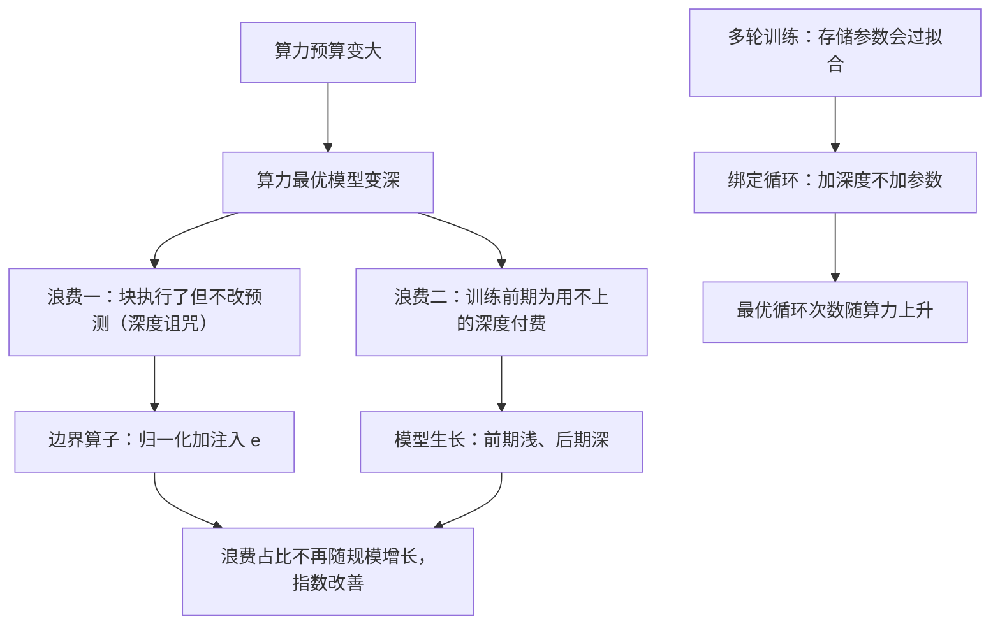

# 让模型边训边长深：模型生长与边界算子如何改写缩放指数

<!-- release-date: 2026-09-16 -->

> 本文依据 **How Model Growth, Recursion, and Boundary Operators Influence Scaling Exponents**，纽约大学（NYU）与 Q Labs，arXiv:2609.19107v2，2026-09-17，共 44 页。页码均指这份 PDF 的物理页码。文中会区分三件事：**论文明确写了什么**、**我们怎么解释或验算它**、**哪些是外部资料补充**。

## 读前先把几个词说成人话

这篇论文的网络结构很简单，难点在它比较的对象：不是某个规模上的分数，而是一条曲线的**斜率**。先把词分清。

- **缩放律（scaling law）**：训练算力越多，损失怎么下降的经验公式。在双对数坐标上它接近一条直线（PDF p. 3–4）。
- **算力最优（compute-optimal）**：给定算力，参数量和训练 Token 数怎么分，损失最低。
- **缩放指数与缩放常数**：幂律 $L(C) = E + A\,(C/C_0)^{-\gamma}$ 里，$\gamma$ 是**指数**，决定曲线多陡；$A$ 是**常数**，决定曲线整体上下平移；$E$ 是不可约损失（PDF p. 4，式 1）。
- **算力倍数（compute multiplier）**：标准 Transformer 要花几倍算力，才追得上某个变体的损失。倍数随规模不变，说明只改了常数；倍数随规模上升，说明改了指数（PDF p. 4、p. 9）。
- **循环 Transformer（looped transformer）**，也叫**递归深度（recursive depth）**：一次前向里把同一组层反复跑 $K$ 遍，每遍共享同一套权重（PDF p. 2）。
- **前导—核心—收尾（prelude–core–coda）**：Geiping 等人 2025 年的循环模型写法。前导把输入编码成表示 $e$，核心被跑 $K$ 遍，收尾给出预测（PDF p. 2、p. 6）。
- **执行深度与存储块数**：一个 Token 实际穿过几块叫执行深度；显存里真正存着几份权重叫存储块数。循环让前者大于后者（PDF p. 6）。
- **边界算子（boundary operator）**：进每一遍核心之前、进收尾之前，先把残差流归一化，再加回前导输出 $e$（PDF p. 6–7）。
- **模型生长（model growth）**：训练中途把模型变深。本文是把核心的遍数从 2 加到 4（PDF p. 7–8）。
- **绑定（tied）与解绑（untied）**：绑定是每遍核心用同一套权重；解绑是每遍一份权重，等于一个带边界算子的更深的普通 Transformer（PDF p. 7）。
- **TPP（tokens per parameter，每参数 Token 数）**：训练 Token 数除以存储参数量，是算力最优配方的核心旋钮（PDF p. 8、p. 26）。
- **深度诅咒（curse of depth）**：pre-norm Transformer 的残差流随深度变大，越靠后的块改动占比越小，深层块趋于「什么也没做」（PDF p. 6）。
- **KL 有效深度（KL effective depth）**：用 logit lens（把中间层残差流直接解码成预测）逐块看，从哪一块开始预测已经和最终输出差不多（PDF p. 6、p. 13–14）。
- **CORE**：DCLM 提出的 22 个下游任务合集，本文按 nanochat 的实现评测（PDF p. 34）。

## 一句话先说清

业内常识是：架构改动一般只改缩放常数，改不动缩放指数（PDF p. 1）。常数的收益是固定倍数；指数的收益是复利，规模越大省得越多。

这篇论文说，至少在它测到的 $10^{18}$–$10^{20}$ FLOPs 范围内，常识不对（PDF p. 1–2）：

1. **模型生长改指数，而且改得最多。** 核心在训练中途从 2 遍长到 4 遍、权重解绑（Untied-Grow），在 $10^{20}$ FLOPs 时比标准 Transformer 省 1.55 倍算力，而且这个倍数还在涨（PDF p. 2、p. 9）。
2. **循环是一种不加参数的生长。** 权重绑定的生长（Loop-Grow）参数量与标准 Transformer 相同，在 $10^{20}$ FLOPs 时倍数 1.36，只比解绑版差一个固定倍数（PDF p. 2）。
3. **只加一个边界算子也改指数。** 不循环、不生长，只在普通 Transformer 里「归一化再注入前导输出」，倍数从 $10^{18}$ 的 1.12 升到 $10^{20}$ 的 1.25（PDF p. 9）。
4. **外推站得住。** 在拟合范围最大算力的 8 倍上训了一个 7.4B 的 Untied-Grow，损失落在外推曲线上；CORE 0.3865，与 GPT-3 13B 的参考值 0.3852 持平，所用算力约少 20 倍（PDF p. 10–11）。
5. **数据不够、要重复多轮时，循环本身变成正则。** 1 亿 Token 训 10 轮，最优循环次数随算力上升；加循环比加参数省 2.2 倍算力（PDF p. 2、p. 12）。

作者把这些归到一个概念上：**计算深度（computational depth）**，即给定算力下真正影响预测的层数。边界算子让已经执行的层不白跑，生长让模型不在还用不上深度的训练前期为深度付钱（PDF p. 3、p. 13）。

同时先记住三个「不是」：

- 指数差的绝对值很小：标准 Transformer 0.111，最好的 Untied-Grow 0.117（PDF p. 9）。它值钱是因为复利，不是因为单点差得多。
- 20 倍对 GPT-3 那句不是受控对照：数据不同、评测管线不同，作者自己写的是「指示性的」（PDF p. 10）。
- 数据充足的单轮训练里，**单纯共享权重不改指数**，只改常数（PDF p. 5、p. 10）。循环的好处要么来自生长，要么来自多轮训练里的正则。

### 一条阅读路线

如果只有半小时读原文，建议按这个顺序：

1. **p. 3 Figure 1**：六个变体是同一个家族，按三条轴两两对照。
2. **p. 4 式 1 与算力倍数定义**：先弄清「倍数上升 = 指数改善」这条读图规则。
3. **p. 7–8 第 4.1 节与 Algorithm 1**：每个架构单独拟合配方，这是结论可信的前提。
4. **p. 9 Figure 3**：主结果。
5. **p. 10–11 Figure 4**：7.4B 外推与下游 CORE。
6. **p. 11–12 Figure 5**：多轮训练里循环为什么更划算。
7. **p. 13–14 Figure 6**：用 KL 有效深度解释以上现象。

附录 A（从 p. 20 起）是配方细节，附录 B（从 p. 32 起，图延续到 p. 36）是消融，附录 C（从 p. 34 起）是下游评测与外推方法，附录 D（从 p. 41 起）是多轮训练的补充。

## 主要矛盾：架构改动为什么总被认为「只值一个常数」

缩放律告诉我们：算力最优训练下，损失随算力按幂律下降。一个新架构若只是把整条曲线往下平移，它在每个规模上省的倍数都一样。这也有用：论文开头举 Muon 优化器的例子，正确的超参缩放下，它相对 AdamW 在各规模上都有约 40% 的算力效率收益（PDF p. 1）。

指数更值钱，因为曲线更陡，规模越大领先越多。论文背景里点了几个前例：Transformer 相对 LSTM 的参数指数更好；细粒度 MoE 的缩放律预测它相对稠密模型的优势随预算增长（PDF p. 5）。这些都是很大的结构变化，不是在 Transformer 里改一两处。

作者认为，「只改常数」的印象部分来自实验做法（PDF p. 2、p. 5）：

- 早期模型生长研究关心的是复用小模型的训练：Du 等人 2024 年发现层堆叠在同等损失下提速 50%；分阶段训练、MoE 检查点回收等工作，也只在一个或少数几个目标规模上报收益，没有看算力最优缩放律本身（PDF p. 5）。
- 循环 Transformer 主要用于推理时加算力或省参数，不是用来在固定训练预算下训得更好（PDF p. 2）。
- 受控对比结果是混杂的：Prairie 等人 2026 在固定参数和数据下看到循环更好，但没在参数与数据联合最优时证明优势；Schwethelm 等人 2026 发现同等计算深度、联合最优时，循环越多反而越差（PDF p. 5）。
- 最关键的是**超参缩放**。超参缩放不对，本身就会得到一条更差的算力最优曲线（PDF p. 5）。拿标准 Transformer 的配方直接套到新架构上，指数优势可能就被吃掉了。

于是问题被换成：

> 如果**每个架构都单独拟合一整套算力最优配方**，再把各自的缩放律放在一起比，差别是一条平行线，还是一条更陡的线？

第 4 节回答单轮、数据充足的情形，第 5 节回答多轮、数据受限的情形，第 6 节给解释。

## 先看全景：同一个三段式家族，三条轴各做一次对照

图上的执行深度、存储块数都是 d6 规模；沿缩放阶梯变大时，前导、核心、收尾三段一起按比例变大（PDF p. 7）。一次前向写成（PDF p. 6，式 2）：

$$
e = \mathcal{P}(s),\qquad
h_k = \mathcal{R}_{\theta_k}\big(\phi(h_{k-1}, e)\big),\ k = 1,\dots,K,\qquad
y = \mathcal{C}\big(\rho(h_K, e)\big)
$$

$\mathcal{P}$、$\mathcal{R}$、$\mathcal{C}$ 分别是前导、核心、收尾；$\phi$ 与 $\rho$ 是进核心前、进收尾前的边界算子；$\theta_k$ 是第 $k$ 遍的权重。前导 $P$ 块、核心 $C$ 块、收尾 $D$ 块时，执行深度是 $\ell = P + KC + D$。绑定时 $\theta_1 = \dots = \theta_K$；解绑时每遍一份（PDF p. 6–7）。其余在循环模型里常变的选择一律固定：初始状态 $h_0 = 0$，循环次数固定不随机，梯度穿过每一遍（PDF p. 7）。

命名规则：$d\ell$ 表示名义深度 $\ell$，宽度固定为 $128\ell$，所以 d8 宽 1024（PDF p. 7）。

## 核心设计一：边界算子，让深层块不再白跑

### 旧问题：pre-norm 的残差流越来越大

pre-norm Transformer 把归一化放在每块的输入上，不放在残差流本身上。残差流因此随深度变大，每块的更新只占越来越小的一部分，深层块逐渐什么也不做（PDF p. 6）。已有的缓解办法有三类：在残差分支里缩放归一化输出、直接归一化残差流、把前面的表示注入后面。它们都能在固定规模上降损失，但没人证明过能改缩放指数（PDF p. 6）。

### 新设计：归一化加注入，两处边界都做

边界算子定义为（PDF p. 6，式 3）：

$$
\mathrm{BO}(h, e) = \mathrm{Norm}(h) + \alpha\, e
$$

$h$ 是当前残差流，$e$ 是前导输出，$\alpha$ 是注入强度（配方里的 injection weight，初值 1，PDF p. 27 Table 3）。它有两个动作，各管一件事（PDF p. 7）：

1. **归一化**让每一遍都以满权重写入，不被越积越大的残差流稀释；
2. **加回 $e$** 让每一遍都重新看见输入，不在循环中漂走。

两件事单独看都不新：遍间归一化在循环模型里是标准做法，注入输入也见于 nanochat、modded-nanogpt 这类固定深度的 Transformer。本文的改动在一处细节：以往循环模型在收尾前只归一化、不注入 $e$；本文**收尾前也做完整的归一化加注入**，并发现这很重要（PDF p. 7）。

### 证据：基准规模消融与阶梯消融

Table 4（PDF p. 26）在 d8 上把每个变体单独调参，训 1B Token，宽 1024，执行深度 11：

| 架构 | 核心边界 $\phi$ | 收尾前 $\rho$ | 调好后损失 | 训练时间（分钟） |
|---|---|---|---:|---:|
| Deep Vanilla | $h$ | $h$ | 3.2772 | 6.49 |
| Loop-2 | BO | BO | 3.2704 | 6.54 |
| Loop-2 去掉收尾注入 | BO | Norm | 3.2912 | 6.45 |
| Untied-2 | BO | BO | 3.2563 | 6.54 |
| Untied-2 去掉收尾注入 | BO | Norm | 3.2731 | 6.53 |
| Deep Vanilla + 只归一化 | Norm | Norm | 3.2781 | 6.48 |
| Deep Vanilla + 只注入 | $h+\alpha e$ | $h+\alpha e$ | 3.2690 | 6.52 |

完整的边界算子最好，拆掉任何一个动作或拿掉收尾注入都会变差。训练时间几乎不变，因为它只多一个 RMSNorm 和几次向量加法（PDF p. 20、p. 26）。

单个规模上的差距只有千分之几。更要紧的是沿缩放阶梯看倍数，附录 B.1 与 Figure 15a（PDF p. 32–33）把几种拆法都跑成了阶梯：

| 相对 Vanilla，接近 $10^{20}$ FLOPs 处 | 算力倍数 |
|---|---:|
| Untied-2（完整边界算子） | 约 1.34 |
| 只归一化、只注入、或去掉收尾注入 | 约 1.17–1.19 |
| Deep Vanilla（同样深，没有边界算子） | 约 1.08 |

同一张图还有两条块分配消融：Loop-2 去掉收尾注入后再把前导、收尾固定在 2 块和 3 块、只放大核心，最大预算处倍数跌到 1 以下；Operator-1 固定成 1 块前导、2 块收尾时，早期优势先升后降（PDF p. 32）。所以三段要按比例一起放大。

### 可迁移启发

深的 pre-norm 模型里，**「归一化残差流 + 周期性注入早期表示」几乎零成本**，而且优势随深度变大。两个前提：收尾前也要注入；改完要给模型重新调超参（下一节会看到，不重调，指数优势会消失）。

## 核心设计二：模型生长，把深度留到需要时再买

### 旧问题：固定深度的模型在训练前期为用不上的深度付钱

神经网络训练早期先学简单模式，后期才学更复杂、更细的结构（PDF p. 2、p. 13，引 Nakkiran 等人 2019、Rahaman 等人 2019）。一个从头到尾固定深度的模型，前期也在为全部层付算力，而那时它可能根本用不上这么深（PDF p. 13）。

过去的生长研究动机是「别浪费小模型的训练」。本文明确放下这个动机，把生长当成**提高最终模型计算深度的手段**（PDF p. 5）。

### 新设计：训练中途把核心从 2 遍翻到 4 遍

- **绑定（Loop-Grow）**：已有核心直接多跑几遍，不加任何权重；
- **解绑（Untied-Grow）**：把训练好的核心复制一份，之后各自训练，就是 Du 等人 2024 年的纵向堆叠（PDF p. 7）。

Algorithm 1（PDF p. 8）用人话讲是：

1. 初始化前导、收尾和 $K_0$ 份独立核心；
2. 前 $g$ 步正常训：前导算出 $e$，$h$ 从 0 开始，每进一遍核心前做 $h \leftarrow \mathrm{RMSNorm}(h) + \alpha e$，跑完全部核心后在收尾前再做一次；
3. 第 $g+1$ 步把已有的 $K_0$ 份核心各复制 $m-1$ 次，$K$ 变成 $K_f = mK_0$；
4. 之后所有活跃参数一起更新，反向传播穿过全部 $K$ 遍。

本文用 $K_0 = 2$、$K_f = 4$（PDF p. 8）。

### 长到几遍、什么时候长、长完 Token 怎么分

- **长到几遍**：从 2 遍出发扫 3、4、6、8，4 遍在每个测试预算上损失都最低；更大的目标能提高 KL 有效深度，但损失不稳定改善（PDF p. 8、p. 22）。
- **什么时候长**：设 $\rho$ 为生长之后处理的 Token 占比，$\rho$ 越大越早长。三个小模型锚点上拟合的平均最优 $\rho$，Deep Vanilla Grow 0.544，Loop-Grow 0.170，Untied-Grow 0.271（PDF p. 29，Figure 13）。换成训练进度，就是在一半到五分之四之间生长（PDF p. 8）。
- **长完 Token 怎么分**：生长后每 Token 平均算力变高，最优 Token 分配要重拟合。生长偏好**更小的初始模型、训更多 Token**：按训练平均算力参数计的最优 TPP，绑定版从 6.39 升到 6.97，解绑版从 7.43 升到 8.97（PDF p. 23）。

最优点附近很平。Untied-Grow 的 TPP 从 8 换回 6，匹配损失所需算力变化小于约 5%；把逐规模拟合的 $\rho$ 换成常数 0.30，损失变化在 −0.0009 到 +0.0019 之间（PDF p. 23、p. 29）。所以作者推荐的简化配方是固定生长比例加取整的 TPP（PDF p. 29）。

### 各规模的块划分与参数量

Table 2（PDF p. 20）：

| 规模 | 前导 / 核心 / 收尾 | 执行深度（2 → 4 遍） | 宽度 | Vanilla | Loop-Grow | Untied-2 | Untied-Grow |
|---|---|---|---:|---:|---:|---:|---:|
| d6 | 2/2/2 | 8 → 12 | 768 | 120M | 120M | 130M | 160M |
| d8 | 2/3/3 | 11 → 17 | 1024 | 210M | 210M | 240M | 320M |
| d10 | 3/4/3 | 14 → 22 | 1280 | 330M | 330M | 410M | 580M |
| d12 | 4/4/4 | 16 → 24 | 1536 | 490M | 490M | 610M | 830M |
| d14 | 4/5/5 | 19 → 29 | 1792 | 730M | 730M | 920M | 1.3B |
| d16 | 5/6/5 | 22 → 34 | 2048 | 1.0B | 1.0B | 1.3B | 2.0B |
| d18 | 6/6/6 | 24 → 36 | 2304 | 1.4B | 1.4B | 1.8B | 2.5B |
| d20 | 6/7/7 | 27 → 41 | 2560 | 1.8B | 1.8B | 2.4B | 3.5B |
| d22 | 7/8/7 | 30 → 46 | 2816 | 2.4B | 2.4B | 3.2B | 4.7B |
| d24 | 8/8/8 | 32 → 48 | 3072 | 3.0B | 3.0B | 3.9B | 5.7B |
| d26 | 8/9/9 | 35 → 53 | 3328 | 3.8B | 3.8B | 5.0B | 7.4B |

参数量是存储参数。Untied-Grow 从一开始就为 4 份核心分配了存储（PDF p. 20 表注）；训练前段只有 2 份核心参与计算，所以正文把 d26 的 7.4B 模型描述成「从 5B 参数起步」（PDF p. 10）。Vanilla 的执行深度就等于名义深度。

### 可迁移启发

**深度不必从第一步就买齐。** 先浅后深、在训练后段把核心复制一遍，同样的训练算力能得到一个更深、更好的模型。拷贝权重本身很简单，难在配方：生长时机、生长后的 Token 分配、学习率缩放都要按新架构拟合。能直接带走的是「2 → 4、后段长、长之前用更小的模型训更多 Token」；具体的 $\rho$ 与 TPP 是在本文的数据、宽深比和优化器下拟合出来的。

## 核心设计三：每个架构单独拟合配方，否则比的是调参

这不是新架构，却是全文结论成立的前提。指数上的差距，只有在每个架构都调好时才有意义，否则可能只是调参差距（PDF p. 7）。

### 套用基线配方会低估新架构

把 Vanilla 调好的配方直接用在 Operator-1 上，d8 损失差 $7.8\times 10^{-3}$；沿阶梯看，Operator-1 的指数改善消失，退成常数改善（PDF p. 7，Figure 16b 见 p. 35）。Table 6（PDF p. 27）：

| 架构 | 用 Vanilla 配方 | 用自己配方 | 迁移代价（$10^{-3}$） |
|---|---:|---:|---:|
| Vanilla | 3.3275 | 3.3279 | −0.3 |
| Deep Vanilla | 3.2869 | 3.2772 | +9.8 |
| Operator-1 | 3.3135 | 3.3057 | +7.8 |
| Loop-2 | 3.2777 | 3.2704 | +7.2 |
| Untied-2 | 3.2697 | 3.2563 | +13.3 |

Vanilla 自己的 −0.3 低于采纳阈值，是噪声（PDF p. 27）。附录正文把代价写成「$7$–$26\times 10^{-3}$」（PDF p. 26），但 Table 6 最大值是 13.3，两处对不上；以表为准是 7.2 到 13.3。

### 不给基线缩放学习率会高估新架构

附录 B.2 给了另一面（PDF p. 32，Figure 15c）：所有架构都用基准规模调好的**常数配方**、不做学习率缩放时，循环与生长模型相对 Vanilla 的倍数反而更大，Loop-Grow 是常数配方下的最好（PDF p. 32），图上倍数最高约 2（读自 PDF p. 33 Figure 15c）。原因是 Vanilla 最需要随规模降学习率：常数配方下全局学习率的漂移指数 $\beta$，Vanilla −0.78，Operator-1 −0.62，Loop-2 −0.58，Untied-2 −0.66（PDF p. 31，Table 8）。不给 Vanilla 缩放学习率，就是拖它的后腿。

**我们的解释。** 两个方向的错都存在：套用基线配方**低估**新架构，不缩放基线学习率**高估**新架构。这篇论文可信的地方，是两边都堵上了，并把消融数字摆了出来。

### 配方怎么拟合

全家族共用三个选择，用绑定变体在 1B Token、匹配参数量下定下（PDF p. 8、p. 21–22）：块平均分到三段，余数先给核心再给收尾；固定变体跑 2 遍（数据充足时最优点在每个预算上都落在 1 到 2 遍之间）；生长到 4 遍。

然后每个架构各走四步（PDF p. 8、p. 26–31）：

| 步骤 | 做什么 | 结果 |
|---|---|---|
| 1 基础超参 | d8、1B Token 上逐个超参链式调参，2 轮，每轮 9 组扫描（Vanilla 8 组），每组 8 个并行 run | Table 5（PDF p. 27） |
| 2 每参数 Token 数 | 5 个算力预算上各训 5 个规模，拟合最优 TPP | 平均最优 Vanilla 5.33、Deep Vanilla 5.66、Operator-1 5.79、Loop-2 6.39、Untied-2 6.08；尺度漂移检验的 p 值都大于 0.05（PDF p. 28，Table 7） |
| 3 生长时机 | 只对生长变体，扫 $\rho$ | 见上一节（PDF p. 29） |
| 4 学习率缩放 | 在 d8–d10 上拟合 $\mathrm{GLR}(N) = \mathrm{GLR}_{d8}\,(N/N_{d8})^{\beta}$ | 见下表（PDF p. 29、p. 31） |

每个带边界算子的变体都比 Vanilla 偏好稍高的 TPP，作者读作参数效率更高（PDF p. 28）。第 4 步只缩放学习率就够了：再加输出乘子或权重衰减缩放，算力倍数最多变约 3%（PDF p. 8、p. 30）。阶梯实际用的配方是 Table 9（PDF p. 31）：

| 架构 | 学习率指数 $\beta$ | Token 分配 | 实测规模 |
|---|---:|---|---|
| Vanilla | −0.8 | TPP 5 | d6–d20 偶数 |
| Deep Vanilla | −0.7 | TPP 6 | d6–d18 偶数 |
| Operator-1 | −0.6 | TPP 6 | d6–d20 偶数 |
| Loop-2 | −0.6 | TPP 6 | d6–d18 偶数 |
| Untied-2 | −0.6 | TPP 6 | d6–d18 偶数 |
| Deep Vanilla Grow | −0.8 | 参考 TPP 6 | d6–d18 偶数 |
| Untied-Grow | −0.6 | 参考 TPP 8 | d6–d18 偶数 |
| Loop-Grow | −0.5 | 参考 TPP 7 | d6–d18 偶数 |

d8 基础学习率都是 0.04，只有 Deep Vanilla Grow 是 0.036（PDF p. 31）。

### 共同的训练设定

Table 1 与附录 A.1（PDF p. 20）：数据 FineWeb，GPT-2 分词器（词表 50257，补齐到 50304）；上下文 2048；全局 batch 524288 Token；pre-norm 解码器，RoPE、SwiGLU、QK 归一化，没有 bias 也没有可学习的归一化增益；注意力与 MLP 输出投影、LM head 初始化为 0；矩阵参数用 Muon，嵌入与 LM head 用 AdamW；大多数 run 用一个 8 卡 H100 节点，d26 外推用两个。

### 可迁移启发

**比较两个架构的缩放律，配方必须各自拟合。** 最低限度是各自调基础超参、各自拟合 TPP、各自拟合学习率随规模下降的指数。只做一个规模、或共用基线配方的对比，得到的「常数改善」或「没改善」都不可靠。「只缩放学习率就够」可以借用，前提是优化器与参数化和本文相近。

## 主结果：谁改了指数，谁只改了常数

### 怎么拟合、怎么读

先用 Huber 损失在 Vanilla 上拟合不可约损失 $E$，其余架构共用这个 $E$，在双对数空间做线性回归（PDF p. 9）：

$$
\log(L - E) = -\gamma \log(C / C_0) + \log A
$$

斜率给指数 $\gamma$，截距给常数 $\log A$，所有斜率的回归标准误都小于 $10^{-3}$。算力倍数用相邻两个测点在对数损失、对数算力空间线性插值，不外推（PDF p. 9）。

### 四条结论

**第一，边界算子改指数。** Operator-1 与 Vanilla 参数和 FLOPs 都相同，只差边界算子，倍数随规模上升；从 Deep Vanilla 到 Untied-2 也只差边界算子，同样成立（PDF p. 9）。

**第二，生长改指数，而且不依赖边界算子。** Untied-Grow 与 Untied-2 只差中途翻倍，两者相除，生长本身的倍数从 1.09 升到 1.16（PDF p. 9）。Deep Vanilla Grow 相对 Deep Vanilla 的提升，与 Untied-Grow 相对 Untied-2 的大致相同，两种改善是叠加的，不是一个成全另一个；绑定的 Loop-Grow 相对 Loop-2 的提升略小（PDF p. 10）。

**第三，解绑只改常数。** Untied-2 相对 Loop-2 是 1.08（$10^{18}$）和 1.06（$10^{20}$）；Untied-Grow 相对 Loop-Grow 是 1.16 和 1.14（PDF p. 10）。不升反略降，所以共享权重的代价是每个规模一个固定倍数。这也是绑定的 Loop-Grow 能在不加参数时保住生长指数收益的原因（PDF p. 10）。

**第四，更深的形状只改常数。** Deep Vanilla 与 Untied-2 执行一样多的块，但没有边界算子，它相对 Vanilla 一直在约 1.08，说明最优宽深比比 128 更小一些；再往深走（深宽比 1:64）并不能继续改善（PDF p. 10，Figure 16c 见 p. 35）。这与 Kaplan 等人 2020 的「形状不影响缩放律」相左（PDF p. 10）。

另外两条旁证：把横轴换成记录的优化时间，生长变体的时间节省同样随规模上升，Untied-Grow 最大，收益扛住了实现开销（PDF p. 32，Figure 15b）；下游也没有和验证损失分叉，58 个检查点上循环与生长变体在 answer NLL 与筛选后的 CORE 准确率上普遍更省算力，控制住验证损失后 Untied-Grow 的 CORE NLL 普遍低于合并拟合线，逐任务看 Dyck Languages 与几个阅读理解任务收益最明显（PDF p. 38，Figure 19）。作者提醒这些残差依赖所选的线性参考线。

### 我们如何解释：0.006 的指数差值多少钱

**我们的推导，不是原文。** 两个架构共用同一个 $E$ 时，要达到同样的损失需要 $A_A (C_A/C_0)^{-\gamma_A} = A_B (C_B/C_0)^{-\gamma_B}$。整理后，算力倍数 $C_A / C_B$ 随基线算力按下式增长：

$$
\frac{C_A}{C_B} \propto C_A^{\,1 - \gamma_A/\gamma_B}
$$

用 0.111 与 0.117，指数 $1 - 0.111/0.117 \approx 0.051$，意思是基线算力每涨 100 倍，倍数大约再乘 $100^{0.051} \approx 1.27$。

拿论文自己的外推核对。第 4.3 节用 FineWeb-Edu 上的指数 0.1095 与 0.1146（PDF p. 34），指数差给出 $1 - 0.1095/0.1146 \approx 0.045$。从 $10^{20}$ FLOPs 的 1.6 倍出发：到 $1.23\times 10^{21}$ 约 $1.6 \times 10^{1.09 \times 0.045} \approx 1.8$；到 $10^{25}$ 约 $1.6 \times 10^{5 \times 0.045} \approx 2.7$。两个结果与论文报告的 1.8 倍、2.7 倍一致（PDF p. 10）。论文的外推数字，本质就是「指数差 × 对数算力跨度」的复利，可信度完全取决于指数估计在 $10^{20}$ 之外是否还成立。

还有一点是我们的判断：非 Vanilla 架构都**共用 Vanilla 拟合的 $E$**（PDF p. 9）。这让比较口径统一，但各架构若真有不同的不可约损失，指数差的绝对值会跟着变。论文没有报告各自拟合 $E$ 的结果。

## 外推：8 倍算力上的 7.4B，和一次与 GPT-3 的非受控对照

### 做法

先在 FineWeb-Edu 上用同一套配方重跑 Vanilla 与 Untied-Grow 两条阶梯（PDF p. 10）。换数据后指数差大致保留：FineWeb 上 0.1168 对 0.1113，FineWeb-Edu 上 0.1146 对 0.1095；换数据本身带来一个常数倍的下游改善，要达到 GPT-3 参考分，FineWeb 约需 FineWeb-Edu 的 1.5–1.6 倍算力（PDF p. 34）。

再在 Llama 3 报告的下游缩放律方法上，搭一条「算力 → 每任务 answer NLL → 每任务准确率 → CORE 总分」的预测管线（PDF p. 38）：17 个任务各拟合一条算力到 NLL 的幂律；每个任务拟合一条 NLL 到准确率的 sigmoid；17 个任务的预测均分用一个无截距系数换算成 22 个任务的完整 CORE。17 个任务是只用 Vanilla 的 8 个检查点、按「比随机高至少 2 个百分点、且准确率随训练量单调（Kendall $\tau_b \ge 0.50$）」冻结选出的，之后所有架构共用（PDF p. 37）。

目标设为 GPT-3 13B 的 CORE 参考值。缩放律预测：d26 的 Untied-Grow（7.4B，从 5B 起步）用算力最优配方就能达到（PDF p. 10）。这个 run 不参与任何拟合。

### 结果

Figure 4（PDF p. 11）与附录 C.4（PDF p. 38）给出的核对：

| 指标 | 预测 | 实测 |
|---|---|---|
| FineWeb-Edu 验证损失 | 外推曲线 | 落在曲线上，比预测低 0.03 |
| answer NLL | 外推曲线 | 与预测相差 0.002 以内 |
| CORE 准确率 | 0.3837 | $0.3865 \pm 0.0015$（误差条是评测种子间一个标准差，不含外推不确定性） |

与 Vanilla 的倍数随规模变大，正是指数改善该有的样子（PDF p. 10）：

| 算力 | Untied-Grow 相对 Vanilla | 性质 |
|---|---:|---|
| $10^{20}$ FLOPs（阶梯终点） | 1.6 | 拟合区间内 |
| $1.23\times 10^{21}$（7.4B 这次 run） | 1.8 | 有实测点 |
| $10^{25}$（现代预训练规模） | 2.7 | 纯外推 |

CORE 曲线与 GPT-3 各规模参考线的交点，Vanilla 与 Untied-Grow 所需算力之比（读自 PDF p. 11 Figure 4 右图）：

| GPT-3 参考 | 2.7B | 6.7B | 13B | 175B |
|---|---:|---:|---:|---:|
| 算力比 | 2.5 | 2.7 | 3.0 | 3.5 |

对 GPT-3 13B：0.3865 对 0.3852，算力 $1.23\times 10^{21}$ 对 $2.31\times 10^{22}$ FLOPs（PDF p. 10）。我们算了一下，两者之比约 18.8，论文写作「约 20 倍」。

### 这组结果能说明什么、不能说明什么

**论文自己划的边界**：两个模型训练数据不同；GPT-3 的分数来自另一条评测管线的估计；所以约 20 倍是**指示性的**，不是受控对比（PDF p. 10）。与 GPT-3 各档的交点算力比，依赖小规模关系能一直外推下去（PDF p. 38）。

**我们的补充判断**：

- 外推只有一个点。它落在曲线上，是「指数差在 8 倍外仍成立」的一次成功检验；2.7 倍是再往外四个数量级的投射，没有实测。
- 这里比的是**训练算力**。7.4B 的 Untied-Grow 存储参数约是同名义规模 Vanilla（d26 为 3.8B）的 2 倍，执行深度 53 对 26，推理时每 Token 的计算与显存都更贵（PDF p. 20，Table 2）。论文没有讨论推理成本。

## 数据受限：多轮训练里，循环变成了正则

### 旧问题：数据要重复用，参数越多越过拟合

算力增长快于高质量文本的存量，预训练会越来越多地重复数据（PDF p. 6、p. 11）。重复的 Token 不如新 Token 值钱，模型会过拟合，而且越大越严重；标准疗法是权重衰减，但它要在每个规模上重调（PDF p. 6）。

循环提供另一种加容量的办法：**只加深度，不加可以过拟合的参数**（PDF p. 11）。

### 实验设定

固定 1 亿个不重复的 FineWeb Token，每个模型训 10 轮，共 10 亿 Token（PDF p. 11）。用第 4 节的 Operator-1 家族，除权重衰减外其余超参固定在调好的值。然后铺两个方向的网格：固定循环次数加参数，或固定参数加循环。从 Operator-1 到 Loop-12，参数 120M 到 1.4B，同一网格上扫权重衰减（PDF p. 12）。

### 结果

1. **最优循环次数随算力上升。** 每条固定循环次数的曲线最终都会过拟合、往上翘，但循环越多，拐点越晚、最低点越低。匹配算力时，最优循环次数从约 1.4 升到约 6.7，与 Operator-1 的损失差距从 0.00 拉大到 0.11（PDF p. 12，Figure 5 图注；正文写作「从约 1 到约 7」）。
2. **加循环比加规模省 2.2 倍算力，而且几乎不用调参。** 加规模、每个规模都重调权重衰减，要到 $7.5\times 10^{18}$ FLOPs 才到 3.40 的损失；固定规模、固定权重衰减、只加循环，少用 2.2 倍算力就追平；在加循环的基础上再调权重衰减，最多再降 0.02（PDF p. 12）。
3. **循环的边际收益与存储参数无关。** 同一深度下，循环 $K$ 次的损失减去 Operator-1 的损失，每条曲线都单调下降；从 d8 起，不同深度的曲线在每个循环次数上相差不超过 0.006（PDF p. 12）。
4. **最优权重衰减跟着存储参数走，不跟着执行深度走。** Figure 5 第四张图（PDF p. 12）：

| 最优权重衰减 | d6 | d8 | d10 | d12 | d14 |
|---|---:|---:|---:|---:|---:|
| Operator-1 | 0.4 | 0.8 | 0.8 | 1.2 | 1.2 |
| Loop-2 | 0.4 | 0.8 | 0.8 | 1.2 | 1.2 |
| Loop-3 | 0.4 | 0.8 | 0.8 | 1.2 | 1.2 |
| Loop-4 | 0.4 | 0.8 | 0.8 | 0.8 | 1.2 |
| Loop-6 | 0.4 | 0.8 | 0.8 | 0.8 | 1.2 |
| Loop-8 | — | 0.8 | 0.8 | 1.2 | 1.2 |
| Loop-12 | — | 0.8 | 0.8 | 1.2 | — |

   往右（更多存储参数）数值明显变大，往下（更多循环）几乎不变。附录给出更大的 d16–d18 是 1.6（PDF p. 42）。

5. **权重共享才是关键，不是深度本身。** 解绑的循环用更多参数加同样的深度，打不过 Operator-1；更细地看，解绑版在两个最小预算上略好，在三个较大预算上更差（PDF p. 12、p. 43–44，Figure 24）。

### 附录 D 补充的三点

- **重复程度决定偏好。** 同样约 10 亿 Token 的训练量，新数据与 2.5 亿 Token 重复 4 轮时，最优循环次数都停在 1–2 遍附近；只有 1 亿 Token 重复 10 轮时才随算力明显上升（PDF p. 41）。
- **权重衰减与循环互补。** 在 0.05、0.2、0.4、0.8、1.2、1.6 六档权重衰减上重复 10 轮实验：正则越弱越偏好多循环；加强正则会缓和这种偏好，但不会消除循环的收益（PDF p. 42）。
- **超参在循环次数之间的迁移。** 新数据下在 d8 对 $K = 2, 4, 8$ 扫 5 个超参：绑定模型的最优点大体稳定，解绑模型偏移更大，尤其偏向更小的学习率和残差乘子（PDF p. 42–43）。

### 作者的假说

模型过拟合的是**它存储的参数**，不是它执行的块（PDF p. 12）。预算小时模型受算力限制，新参数比复用的参数更有用，和新数据的情形一样；一旦存储的参数开始背语料，循环就成了更好的加容量方式，所以最优循环次数随算力上升。上面第 3、4 条直接支持这个假说（PDF p. 12）。

### 可迁移启发

**数据只够重复很多轮时，把「加循环次数」当作与「加参数、调权重衰减」并列的旋钮。** 本文里它更省算力，还几乎不用重调权重衰减：一个循环次数上调好的值可以直接用到更大的循环次数。适用边界要记住：只在 1 亿 Token 重复 10 轮这种强重复设定下看到了明显收益，重复 4 轮时优势并不明显（PDF p. 41）。

## 解释框架：计算深度

作者定义计算深度为真正显著影响预测分布的块数，并指出花在深度上的算力有两种浪费（PDF p. 13）：块执行了却不改变预测，也就是深度诅咒；块从头到尾都在消耗算力，网络却可能只在后期才需要它。

只有浪费的比例随规模增长时，它才会影响指数。作者的假说是：两种浪费都随深度占比变大，而算力最优模型会随预算变深，所以两种浪费都随规模增长（PDF p. 13）。下面按 PDF p. 13 的论证重画，是论证结构示意，不是实验数据：

### 证据：KL 有效深度

论文的三条读法（PDF p. 13–14）：

- **边界算子**：Untied-2 与 Deep Vanilla 执行同样的块，$10^{20}$ FLOPs 时 KL 有效深度 24 对 20。Operator-1 基本落在 Vanilla 的曲线上，浅的时候边界算子作用不大，越深差距越大，与假说一致。另一条旁证是只加宽度、不加深度时，边界算子的指数改善退成常数改善（PDF p. 13、p. 32，Figure 16e）。
- **生长**：Untied-Grow 36 对 Untied-2 的 24，大约是 Vanilla 的 2 倍；同组内绑定与解绑的曲线重合，权重共享不改变 KL 有效深度。另两条旁证：生长时机的扫描有内部最优点，太早太晚都亏；生长变体偏好更小的初始模型、更多 Token（PDF p. 13）。
- **多轮循环**：最大预算上，加循环的 KL 有效深度 18，加深度（重调权重衰减）14（PDF p. 13）。

### 这些证据有多硬

论文自己说得清楚：KL 有效深度**只是计算深度的代理**。落在阈值内不代表后面的块不再改变预测，网络中间没被用上的块也测不出来（PDF p. 13）。第 6 节每一条都以「我们假设」开头。

**我们的判断。** 把上图的执行深度与 KL 有效深度并排看，有一件论文没点破的事：带边界算子的模型，KL 有效深度几乎**等于**执行深度（24 对 24、36 对 36），也就是指标已经顶到上限。所以「生长把有效深度从 24 提到 36」，数值上就是「生长把执行深度从 24 提到 36」；它能说明生长后多出来的块都被用上了，但不能单独说明生长比「一开始就训 4 遍」更会用深度。真正由这个指标区分出来的，是边界算子一侧：没有它，最后 4 块左右几乎不改预测。

被实验直接支持的是：指数确实变了（Figure 3、Figure 4）；KL 有效深度与指数改善的排序一致（Figure 6）。「计算深度是原因」是与证据相容的解释，不是被证明的因果。另外，生长变体的有效深度约是 Vanilla 的 2 倍，指数只从 0.111 到 0.117，二者之间没有给出定量关系。

## 附录里值得知道的三个负面或边界结果

### 随机循环次数：训练不划算，只是让多跑几遍不亏

在 Loop-Grow 配方上，生长后每一步从 $\{2, 3, 4, 5, 6\}$ 里均匀采样循环次数（均值仍为 4），按实际次数计算力，评测用 4 遍。这条阶梯在匹配算力时比固定 4 遍略差（PDF p. 34，Figure 16d）。

它的好处在推理时多跑几遍：跑 8 遍时，随机训练版相对跑 4 遍的损失变化在 −0.0003 到 +0.0028 之间，固定训练版则增加 0.008 到 0.042。7 个随机训练检查点里有 5 个在 5 遍时有一个很浅的最低点，改善不到 0.001，再多跑也不继续变好（PDF p. 34、p. 36）。随机循环主要降低多跑几遍的惩罚，而不是带来持续的推理时收益。

### 块分配要按比例放大

见核心设计一的阶梯消融：固定前导与收尾、只放大核心，倍数会掉到 1 以下（PDF p. 32）。

### Muon 与 Adam：优化器也会影响指数

只放大宽度时，Muon 相对 Adam 是常数改善，与 Qiu 等人 2026 一致；宽度与深度一起放大时，Muon 的算力效率优势随规模缩小（PDF p. 34，Figure 16f）。作者据此说 Muon 在更深的网络上可能不如 Adam 有效，架构与优化器的交互值得研究。

**我们的提醒**：本文主实验的矩阵参数用的正是 Muon（PDF p. 20）。换成别的优化器时，各架构的指数是否保持原样，论文没有测。

## 作者的展望

第 7 节把结论推广成一个研究方向（PDF p. 14）：上下文长度、MoE 专家数、宽度都随算力增长，却都在训练开始前定死，按网络需要的节奏去**生长**它们，也可能改变指数；深度本身也可以分多段生长（2 遍、再 4 遍、再 6 遍）；更一般地，「常数改善还是指数改善」应当成为评估新架构和新训练配方的标准环节。这几条都是展望，论文里没有对应实验。

## 限制与没有公开的部分

论文自己写明的：

- 阶梯用固定 batch 和同一套硬件，配方没有处理 batch 与模型规模的联合最优（PDF p. 38）；
- 与 GPT-3 的约 20 倍对比不是受控实验（PDF p. 10）；
- 外推的 CORE 预测依赖逐任务 NLL 拟合与校准，并假设小规模关系持续成立（PDF p. 38）；
- KL 有效深度只是计算深度的代理，计算深度解释是假说（PDF p. 13）。

我们读完需要补上的判断：

- **拟合范围窄。** 缩放律拟合在 $10^{18}$–$10^{20}$ FLOPs 之间，外推验证只有一个 $1.23\times 10^{21}$ 的点。
- **设定单一。** 只有 FineWeb 与 FineWeb-Edu 两个语料、GPT-2 分词器、2048 上下文、稠密模型、Muon 优化器（PDF p. 7、p. 20）。
- **没有讨论推理成本。** 解绑生长的存储参数约是同名义规模 Vanilla 的 2 倍，执行深度也更大；绑定循环不加参数，但推理 FLOPs 同样变大。论文所有倍数都按训练算力计。
- **指数差的绝对值依赖共享 $E$**（PDF p. 9）。
- **附录内部有一处数字不一致**：正文写迁移代价 $7$–$26\times 10^{-3}$（PDF p. 26），Table 6 最大 $13.3\times 10^{-3}$（PDF p. 27）。

## 可迁移启发

1. **评估新架构时，把「倍数随规模怎么变」画出来。** 只在一个规模上报一个提升百分比，分不出常数还是指数。算力倍数曲线是很便宜的判别工具：平线是常数，上升是指数。
2. **配方要按架构拟合，至少拟合学习率缩放。** 套用基线配方可能吃掉新架构的指数优势；不给基线缩放学习率又会虚增新架构的优势。两个方向都要堵。
3. **边界算子几乎免费，越深越值。** 归一化残差流、周期性注入早期表示，并且在输出段之前也注入。
4. **深度可以后买。** 训练前段用浅模型、更多 Token，后段把核心复制一遍。关键是生长时机和 Token 分配。
5. **参数紧张时用绑定生长。** 绑定只比解绑差一个固定倍数，却保住了生长的指数收益，存储参数与标准 Transformer 相同。
6. **数据要重复很多轮时，循环是一种便宜的正则。** 加深度不加参数，最优次数随算力上升，权重衰减基本不用重调。
7. **训练算力和推理成本分开记账。** 本文省的是训练算力；落到部署时，解绑生长多出的参数和循环多出的执行深度都要另算。

## 关键词回看

- **缩放指数 $\gamma$ / 缩放常数 $A$**：前者决定斜率，后者决定平移。本文八个架构的 $\gamma$ 在 0.111 到 0.117 之间。
- **算力倍数**：基线要多花几倍算力才能追平。上升即指数改善。
- **前导—核心—收尾**：前导编码输入，核心跑 $K$ 遍，收尾输出。三段平均分块，按比例一起放大。
- **边界算子**：$\mathrm{Norm}(h) + \alpha e$，进核心前和进收尾前都做。单独使用就能改指数。
- **模型生长**：核心从 2 遍到 4 遍，在训练后段发生。解绑版复制核心，绑定版多跑几遍。
- **绑定 / 解绑**：只差一个固定倍数，不改指数。
- **执行深度 / 存储块数 / 计算深度**：跑了几块、存了几块、真正用上了几块。
- **KL 有效深度**：logit lens 下预测与最终输出相差 2 nats 以内的第一块，是计算深度的代理。
- **TPP**：每存储参数 Token 数。Vanilla 5，带边界算子 6，生长 7–8。
- **多轮训练里的循环**：最优次数随算力上升，比加参数省 2.2 倍算力。

## 资料与阅读边界

### 本文依据的版本

- 本地原件 `papers/NYU/Model-Growth-Scaling-Exponents.pdf`，即 [arXiv:2609.19107](https://arxiv.org/abs/2609.19107) 的 v2（2026-09-17），44 页，为 arXiv 上的最新版。作者为 Zixi Chen（纽约大学，工作完成于 Q Labs 实习期间）、Akshay Vegesna、Samip Dahal（Q Labs）、Andrew Gordon Wilson（纽约大学与 Q Labs）（PDF p. 1）。
- `release-date` 取 2026-09-16，即 arXiv v1 的提交日。代码仓库 [qlabs-eng/scaling-exponents](https://github.com/qlabs-eng/scaling-exponents) 的第一条提交在同日晚些时候，没有更早的官方公开事件。

### 外部资料补充（不是 PDF 原文）

- 论文首页给出的代码仓库现已公开（PDF p. 1）。README 写明：各阶梯的训练日志放在公开的 W&B 项目里，FineWeb 上七条阶梯共 51 个检查点、以及 FineWeb-Edu 上含 d26（7.42B）的 Vanilla 与 Untied-Grow 检查点放在 Hugging Face。本文的实现细节仍只依据 PDF。
- 致谢说工作部分受 Q Labs slowrun 项目里一次递归 LLM 记录的启发（PDF p. 15，参考文献 Gupta 2026）。
- 本站相关篇目：日常研读的 Kaplan-Scaling-Laws（本文在「形状只改常数」上与之结论相左）与 Chinchilla（算力最优的 Token 与参数分配）；报告解读的 Muon-is-Scalable-for-LLM-Training（本文用作「常数改善」的例子）与 Ouro（同属循环语言模型路线）。

### 原文没有公开、本文也不补的缺口

- 推理时延、推理显存与推理 FLOPs 的对比；
- 不同 batch 大小下结论是否保持；
- 超过 $1.23\times 10^{21}$ FLOPs 的实测点；
- 各架构各自拟合不可约损失 $E$ 时的指数；
- Muon、Adam 之外其他优化器下的结果；
- MoE、长上下文等展望中的生长方向，均无实验。
