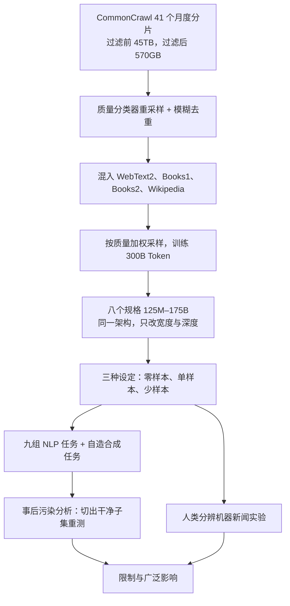

# GPT-3：175B 参数买到的不是榜首，而是一个不用再微调的任务接口

<!-- release-date: 2020-06-11 -->

> 本文依据本地 `papers/OpenAI/GPT-3.pdf`，即 **Language Models are Few-Shot Learners**，OpenAI，arXiv:2005.14165v4，2020-07-22 提交，共 75 页。页码均指 PDF 自身的页码。文中区分三件事：**报告明确写了什么**、**我们怎么解释它**、**哪些是外部资料或本文推算**。

## 阅读前先认识几个词

- **Token（词元）**：模型读写文本的最小单位。GPT-3 沿用 GPT-2 的字节级 BPE 切分，平均一个 Token 约是 0.7 个英文单词（PDF p. 24）。
- **自回归语言模型**：给定前文，预测下一个 Token，从左到右一个接一个往下写。
- **上下文窗口**：模型一次能看到的 Token 上限。GPT-3 全部八个规格都是 $n_{ctx} = 2048$（PDF p. 8）。它同时决定了提示里最多能塞几个示例。
- **微调（Fine-Tuning，FT）**：拿一个预训练好的模型，在某个任务的几千到几十万条标注样本上继续训练、更新权重（PDF p. 3、p. 6）。这是 2020 年的主流做法。

这篇论文里最重要的两个说法：

- **上下文学习（in-context learning）**：把任务说明和几个示例直接写进输入，模型在**一次前向传播里**完成这个任务，**不做任何梯度更新**（PDF p. 4）。
- **零样本 / 单样本 / 少样本（zero-shot / one-shot / few-shot，0S / 1S / FS）**：上下文里分别给 0 个、1 个、K 个示例。论文把它们当作三种**问题设定**来比较，而不是三种互相竞争的方法（PDF p. 7）。

## 一句话先说清

GPT-3 论文训练了从 125M 到 175B 的八个自回归模型，全部训练 300B Token（PDF p. 8），然后只用提示、不做微调，在二十多个 NLP 数据集和一批自造任务上测它们（PDF p. 5）。

它要回答的问题只有一个：**上下文学习这条路，当时明显比微调差，能不能靠规模变得够用？** 论文给的答案是三条可以指着看的证据：

- 42 个以准确率计分的基准取平均，零样本随规模稳步上升，少样本上升得更快，175B 上两者差约 15 分（PDF p. 5，图 1.3，读图）；
- 同一个任务里，大模型每多给一个示例涨得更多，这叫「上下文学习曲线更陡」（PDF p. 4，图 1.2）；
- SuperGLUE 上，175B 每个任务用不到 8 个示例，总分就超过了在 125K 条标注上微调的 BERT-Large（PDF p. 20）。

同时它把失败也量出来了：自然语言推理（ANLI）、需要比较两句话的 WiC，在少样本下接近随机；反写单词在所有规模上都做不了（PDF p. 20–21、p. 24）。

如果只记一句话：

> **GPT-3 把「怎么让模型做一件新事」的答案，从「再收一份数据、再训一遍」换成了「把要求和例子写进输入」，并用八个规格的对照证明：这个替代方案的可用性随规模显著上升。**

## 先看全景：75 页里有什么



据 PDF p. 8–10、p. 29–33、p. 43–44 的叙事重画，是流程示意，不是论文原图。

整份原件的分量分布如下。正文是一条主线，附录里放着两块方法学价值最高的内容：污染分析的细节，和人类分辨实验的设计。

| 部分 | 页码 | 讲什么 | 本文怎么处理 |
|---|---|---|---|
| 1 引言 | p. 3–6 | 微调范式的三个问题，上下文学习的定义 | 主线，完整展开 |
| 2 方法 | p. 6–10 | 四种设定、八个规格、数据、训练、评测协议 | 主线，完整展开 |
| 3 结果 | p. 10–29 | 九组任务的成绩表，自造任务，新闻生成 | 压成一张总表，只讲读表要知道的事 |
| 4 污染 | p. 29–33 | 事前过滤失败后，事后量化污染的影响 | 主线，配图 |
| 5 限制 | p. 33–34 | 论文自己划的边界 | 完整保留 |
| 6 广泛影响 | p. 34–39 | 误用、偏见、能耗 | 压缩 |
| 7–8 相关工作与结论 | p. 39–41 | 三条扩展路线里的自我定位 | 一段 |
| 贡献名单 | p. 42 | 分工 | 两句 |
| 附录 A–D | p. 43–46 | 数据过滤、训练超参、污染方法、算力计算 | 并入对应正文 |
| 附录 E | p. 46–48 | 人类分辨实验的被试与流程 | 并入新闻生成一节 |
| 附录 F–H | p. 48–67 | 诗歌样本、全部任务的提示原文、全规格成绩总表 | 一节讲可复现性，H 用来找失败形态 |
| 参考文献 | p. 68–75 | — | 不展开 |

## 第一层矛盾：微调范式卡在哪三处

论文没有从「我们做了一个大模型」开场，而是先花一整页论证旧范式的三个具体问题（PDF p. 3）。

**问题一：每个新任务都要重新攒一份标注数据。** 有用的语言任务范围极广，从改语法、给抽象概念举例到点评一篇短篇小说。很多任务根本收不到大规模监督数据，每来一个新任务还要重来一遍。

**问题二：微调带来的泛化可能是假的。** 论文的论证是：利用训练数据里虚假相关性的空间，会随模型的表达力、以及训练分布的狭窄程度一起增长。预训练把模型做大是为了在宽分布上吸收信息，微调却把它按在一个很窄的任务分布上。所以微调模型在基准上「名义上达到人类水平」时，可能夸大了它在底层任务上的真实能力（PDF p. 3）。

**问题三：人不是这样学语言任务的。** 人接一个新任务，通常只需要一句自然语言指令，或者极少量演示。这种流动性还有实际好处：同一个系统能在很多任务之间来回切换，比如在一段长对话中途做一次加法（PDF p. 3–4）。

### 为什么当时没人只靠提示

因为已有的尝试太差。GPT-2 用这种方式在 Natural Questions 上只有 4%，CoQA 的 55 F1 已经落后当时最好成绩 35 分以上（PDF p. 4）。论文的原话是，元学习「显然还需要大幅改进，才能成为解决语言任务的实用方法」。

于是论文提出一个假设：语言模型的容量已经从 1 亿、3 亿、15 亿、80 亿、110 亿一路涨到 170 亿参数，损失随规模平滑下降；上下文学习要把大量技能装进参数，它的能力也许同样随规模变强（PDF p. 4）。

**这就是全文的主要矛盾**：不是「怎么把模型做大」，而是「上下文学习这个当时明显不够用的替代方案，能不能靠规模变得够用」。

## 核心设计一：把「几个例子」定义成可以比较的实验条件


图的上半是论文图 1.1 的意思。论文专门加了两条免责：图里的序列**不代表真实预训练数据长什么样**，只是说明同一条序列里有时会嵌着重复出现的子任务（PDF p. 3）；「元学习」这个词只描述内外两层循环的结构，**不预设**模型是在推理时真的学会了新任务，还是只认出了训练时见过的任务（PDF p. 4 脚注 1）。

图的下半是论文图 2.1。四种设定排在同一条谱系上，区别只在用了多少任务专属数据（PDF p. 6）：

- **少样本**：给 K 组「上下文 + 期望输出」，再给一组只有上下文的，让模型补完。K 通常取 10–100，上限来自 2048 的窗口。好处是大幅减少任务数据需求，也不会从一个又大又窄的微调集里学到过窄的分布；坏处论文写得同样直白：到当时为止，这类方法的结果比最好的微调模型差很多，而且仍要少量任务数据（PDF p. 6）。
- **单样本**：为什么要单列，而不是当作 K = 1？因为它最接近给人交代任务的方式。在众包平台上发任务，惯例就是给一个示例（PDF p. 6）。
- **零样本**：最方便、潜在最鲁棒、最能避开虚假相关，也最难。论文举的例子是让人「做一张 200 米短跑世界纪录表」：不给示例，连人都不确定表格该长什么样，所以某些情况下它「不公平地难」（PDF p. 7）。

论文的立场值得原样记住：比较三种设定不是为了评出谁更好，而是看它们在基准分数与样本效率之间怎么取舍。它特别强调少样本，因为很多结果只比微调 SOTA 差一点；但它也说，单样本甚至零样本才是与人类表现最公平的对照（PDF p. 7）。**GPT-3 原则上也可以微调，论文只是没做**（PDF p. 6）。所以这篇论文从来没有主张微调是错的。

### 评测协议：细节决定这些分数能不能比

这一段在 2.4 节只有一页，却决定了后面所有数字的含义（PDF p. 10）：

- **示例怎么抽**：从该任务的训练集随机抽 K 条作为条件，示例之间用一到两个换行分隔。LAMBADA 与 StoryCloze 没有训练集，就从开发集抽示例、在测试集上评；原版 Winograd 只有一份数据，直接从它自身抽。
- **K 怎么定**：K 越大通常越好，但不总是。有独立开发集时，先在开发集上试几个 K，再用最好的那个跑测试集。
- **多选题怎么打分**：比较每个候选补全的似然。多数任务比**逐 Token 似然**（为长度归一化）；ARC、OpenBookQA、RACE 三个数据集改为除以候选补全的「无条件」概率：

$$
\text{score} = \frac{P(\text{completion} \mid \text{context})}{P(\text{completion} \mid \text{answer context})}
$$

  分母里的 answer context 是 `"Answer: "` 或 `"A: "` 这样一个通用前缀，只提示「接下来是答案」，不带题目信息。它校正的是「某些候选词本身就更常见」带来的偏差。
- **二分类怎么问**：把选项换成有语义的词（`True` / `False` 而不是 0 / 1），再当多选题做。
- **自由生成怎么解码**：束搜索，束宽 4，长度惩罚 $\alpha = 0.6$。
- **报测试集还是开发集**：测试集公开就报测试集；测试集私有时，模型太大放不进评测服务器，就报开发集。只有 SuperGLUE、TriviaQA、PIQA 三个成功提交了测试服务器，而且只提交了最大模型的少样本结果（PDF p. 10）。

最后一条意味着：**同一张表里的数字可能来自不同划分**。附录 H 的总表专门给最大模型的测试服务器成绩单列了一栏（PDF p. 63）。

### 这一节可以带走什么

先把评测协议写死，再去堆规模。「输入里允许出现什么」、K 怎么取、多选怎么归一化、报哪个划分，任何一项在不同任务间飘忽，八个规格的对照曲线就没有意义。

## 核心设计二：八个规格，只改宽度和深度

论文训练了八个模型，跨三个数量级（PDF p. 8，表 2.1）：

| 模型 | 参数量 | 层数 | $d_{model}$ | 头数 | 每头维度 | Batch（Token） | 学习率 |
|---|---:|---:|---:|---:|---:|---:|---:|
| GPT-3 Small | 125M | 12 | 768 | 12 | 64 | 0.5M | $6.0 \times 10^{-4}$ |
| GPT-3 Medium | 350M | 24 | 1024 | 16 | 64 | 0.5M | $3.0 \times 10^{-4}$ |
| GPT-3 Large | 760M | 24 | 1536 | 16 | 96 | 0.5M | $2.5 \times 10^{-4}$ |
| GPT-3 XL | 1.3B | 24 | 2048 | 24 | 128 | 1M | $2.0 \times 10^{-4}$ |
| GPT-3 2.7B | 2.7B | 32 | 2560 | 32 | 80 | 1M | $1.6 \times 10^{-4}$ |
| GPT-3 6.7B | 6.7B | 32 | 4096 | 32 | 128 | 2M | $1.2 \times 10^{-4}$ |
| GPT-3 13B | 13.0B | 40 | 5140 | 40 | 128 | 2M | $1.0 \times 10^{-4}$ |
| GPT-3 175B | 175.0B | 96 | 12288 | 96 | 128 | 3.2M | $0.6 \times 10^{-4}$ |

八个模型全部训练 300B Token，全部用 2048 的上下文窗口，前馈层固定为 $d_{ff} = 4 d_{model}$（PDF p. 8）。

**架构几乎没有新东西。** 论文说模型与架构和 GPT-2 相同，包括改过的初始化、前置归一化（pre-normalization）和可逆切分；唯一的例外是在各层之间交替使用稠密注意力和局部带状稀疏注意力，做法类似 Sparse Transformer（PDF p. 8）。一篇改变了整个领域用法的论文，架构贡献接近于零，预算全押在规模、数据与评测上。

**超参是排布出来的，不是调出来的。** 各规格的精确架构参数按计算效率和 GPU 上的负载均衡来选；依据是 scaling law 的一个结论：验证损失在相当宽的范围内对这些参数不敏感（PDF p. 8）。模型沿深度和宽度两个维度切到多张 GPU 上，以减少节点间的数据传输（PDF p. 8）。

表里 13B 那一行写 $d_{model} = 5140$，但 $40 \times 128 = 5120$；其余七行都严格满足「头数 × 每头维度 = $d_{model}$」（PDF p. 8）。论文没有解释，最可能是排版笔误。这是本文的观察。

### 这一节可以带走什么

做能力—规模研究时，**只让一个变量动**。八个规格的数据、目标函数、架构与训练 Token 数都相同，所以曲线的横轴只有规模。代价也在这里：论文能证明「规模有效」，却不能分离稀疏注意力、数据过滤、不放回采样各自的贡献，这些都没有消融。

## 核心设计三：数据按质量配比，而不是按体量

原始 CommonCrawl 质量太杂，论文走了三步（PDF p. 8）。

### 第一步：用分类器给 CommonCrawl 重采样

素材是 41 个月度 CommonCrawl 分片，覆盖 2016–2019 年，过滤前 45TB 压缩纯文本，过滤后 570GB，约合 400B 个 BPE Token（PDF p. 8）。

过滤方法在附录 A（PDF p. 43）：以原始 WebText 作为高质量文档的代理，训练一个逻辑回归分类器区分「高质量」与「原始 CommonCrawl」，特征来自 Spark 的标准切分器与 HashingTF；正例是 WebText、Wikipedia 和自建的网络图书语料，负例是未过滤的 CommonCrawl。

保留规则不是硬阈值，而是带随机性的：

$$
\text{保留文档} \iff X > 1 - s, \qquad X \sim \mathrm{Pareto}(\alpha),\ \alpha = 9
$$

$s$ 是分类器给这篇文档的质量分，$X$ 是从形状参数为 9 的帕累托分布里抽的随机数。取 $\alpha = 9$，是为了让保留下来的文档大多来自高分端，**同时仍放进一些分布外的文档**；$\alpha$ 是照着分类器在 WebText 上的打分分布挑的。论文说这样重加权提升了质量，衡量方式是在一批分布外生成文本上的损失（PDF p. 43）。

### 第二步：文档级模糊去重

用 Spark 的 MinHashLSH，10 个哈希，特征与分类器相同；每个数据集内部去重，并把 WebText 从 CommonCrawl 里模糊删掉，数据量平均减少约 10%（PDF p. 43）。动机有两条：防止过拟合，以及**保住留出验证集作为过拟合度量的有效性**（PDF p. 8）。

### 第三步：混入高质量语料，并故意不按体量采样

| 数据集 | Token 量 | 训练混合权重 | 训练 300B Token 时经历的轮数 |
|---|---:|---:|---:|
| Common Crawl（过滤后） | 410B | 60% | 0.44 |
| WebText2 | 19B | 22% | 2.9 |
| Books1 | 12B | 8% | 1.9 |
| Books2 | 55B | 8% | 0.43 |
| Wikipedia | 3B | 3% | 3.4 |

表出自 PDF p. 9，表 2.2。五项合计约 499B Token（本文加总），实际只训 300B，所以最大的模型连自己的语料池都没看完一遍。

最后一列最有信息量。CommonCrawl 在池子里占八成以上，只拿到 60% 的权重，连一轮都没走完；Wikipedia 只有 3B，却被过了 3.4 遍。论文对这个取舍很坦率：**这本质上是接受一点过拟合，换取更高质量的训练数据**（PDF p. 8）。附录 C 还补了一句：实际只训到了过滤后 CommonCrawl 文档的约 40%（PDF p. 44），与 0.44 轮一致。

按词数计，训练数据 93% 是英语，7% 是其他语言；语种清单放在补充材料里，不在这份 PDF 中（PDF p. 14）。

紧跟在表 2.2 后面的是一句决定了第 4 节存在的话：为了减少污染，团队搜索并试图删除训练数据中与所有基准开发集、测试集重叠的内容，**但过滤代码里有一个 bug，导致部分重叠被漏掉；由于训练成本，重训不可行**（PDF p. 9）。

### 这一节可以带走什么

- 用分类器筛数据时，**硬阈值等于把分类器的偏好变成语料的边界**；带随机性的接受规则保留了尾部多样性。
- 「数据总量」本身不说明质量，采样权重才决定模型实际读了什么。

## 训练与算力

### 训练细节：写了什么，没写什么

附录 B 与 2.3 节写了这些（PDF p. 9、p. 43）：

- 大模型通常能用更大的 batch，但需要更小的学习率；batch 大小由训练中实测的**梯度噪声尺度**来指导；
- 优化器 Adam，$\beta_1 = 0.9$、$\beta_2 = 0.95$、$\epsilon = 10^{-8}$；全局梯度范数裁剪到 1.0；权重衰减 0.1；
- 学习率在前 375M Token 线性预热，之后余弦衰减，到 260B Token 时降到峰值的 10%，此后保持 10% 继续训练；
- batch 从 32K Token 线性增加到目标值，用掉前 4B–12B Token，视模型大小而定；
- 训练时**不放回采样**，直到走到一个 epoch 边界，以减少过拟合；
- 并行方式是矩阵乘内部的模型并行加上跨层的模型并行；硬件是 V100，运行在微软提供的高带宽集群的一部分上。

还有一条训练数据的样本模式。每条训练序列都填满 2048 个 Token，短文档被打包进同一条序列，文档之间用一个特殊的文末 Token 分隔，**不做任何特殊的注意力掩码**（PDF p. 43）。下面是示意，不是语料原文：

```text
[ 文档 A 的全部 Token ] <文末符> [ 文档 B 的全部 Token ] <文末符> [ 文档 C 的前半段 …
|<——————————— 一条训练序列，恰好 2048 个 Token，文档之间互相可见 ———————————>|
```

论文的理由是：分隔符已经给了模型「前后无关」的信息，省掉专门的掩码逻辑，训练更高效（PDF p. 43）。这是当年的工程取舍，不是普遍正确的做法。

没写的同样要说清：GPU 数量、训练墙钟时间、并行度配置、故障恢复，论文都没有给；贡献名单里只提到「全程半精度训练的显存优化」出自某位作者之手（PDF p. 42）。想从这篇论文复现训练过程是不可能的。

### 算力：一个可以心算的公式

附录 D 给出了图 2.2 那张算力柱状图背后的计算（PDF p. 46，表 D.1）。简化假设是**忽略注意力运算**，因为对这些模型它通常占不到总算力的 10%。

$$
C \approx 6\,N\,D
$$

$C$ 是训练总浮点运算数，$N$ 是参数量，$D$ 是训练 Token 数。系数 6 的来历：前向时每个 Token 对每个参数做一次乘、一次加，是 2；再乘 3 把反向算进来，因为对参数求梯度和对激活求梯度各要一份与前向相当的计算（PDF p. 46，表 D.1 表注）。

代入 175B：$6 \times 174.6 \times 10^{9} \times 300 \times 10^{9} \approx 3.14 \times 10^{23}$ FLOPs，与表中数值一致。论文的算力单位 petaflop/s-day（PF-day）是 $8.64 \times 10^{19}$ FLOPs，即一台每秒 1 PFLOP 的机器跑满一天，所以 175B 约 3640 PF-days（PDF p. 46）。

| 模型 | 参数量 | 训练 Token | 训练算力（PF-days） |
|---|---:|---:|---:|
| BERT-Large | 355M | 250B | 6.16 |
| RoBERTa-Large | 355M | 2000B | 49.3 |
| T5-11B | 11,000M | 1000B | 382 |
| GPT-3 2.7B | 2,650M | 300B | 55.2 |
| GPT-3 13B | 12,850M | 300B | 268 |
| GPT-3 175B | 174,600M | 300B | 3640 |

表出自 PDF p. 46，表 D.1。图 2.2 的图注点出了这张表想说的话：GPT-3 的约 3B 模型参数量差不多是 RoBERTa-Large 的 10 倍，两者预训练却都用了约 50 PF-days（PDF p. 9）。原因是 GPT-3 只训 300B Token，RoBERTa 训了 2000B。论文说这是依据 Kaplan 等人的 scaling law 刻意做的选择：**训练比通常大得多的模型，喂比通常少得多的 Token**（PDF p. 9，图 2.2 图注）。

### 损失随算力的幂律

图 3.1 把八个主模型和另外六个更小的模型（最小仅 10 万参数）画在一起，拟合出（PDF p. 11）：

$$
L = 2.57 \cdot C^{-0.048}
$$

$L$ 是交叉熵验证损失，$C$ 是训练算力（PF-days），这张图的算力与参数量都不含嵌入参数。论文的结论是：Kaplan 等人观察到的幂律在多外推两个数量级后仍然成立，只有很小的偏离（PDF p. 10–11）；相关工作一节又补了一句，图 3.1 里「也许能看出曲线有轻微的弯曲」（PDF p. 39）。图 4.1 另外显示，训练损失与验证损失的差距只随规模和训练时长极小地增长，论文据此认为 175B 没有明显过拟合训练集（PDF p. 31）。

### 这一节可以带走什么

$C \approx 6ND$ 仍是写第一行训练代码之前估算预算最快的工具。记住它的边界：它忽略注意力，长上下文时会低估；对稀疏模型，$N$ 要换成每 Token 的激活参数，表 D.1 里 T5 那一列填 0.5 就是这个意思。

## 证据：规模让上下文学习变陡


这张图的纵轴不是终点分数，而是**每多给一个示例能多赚多少**。这一步把「上下文学习能力」变成了可以测量的对象。两个读图要点：说明对大模型的帮助集中在示例很少的时候，示例多了之后有无说明两条线合拢；13B 的曲线斜率远小于 175B，1.3B 几乎是平的。论文说这种「示例越多越好、模型越大越陡」的趋势在它研究的大多数任务上都成立（PDF p. 5）。


聚合图的读法是论文自己的归纳：零样本随规模稳步上升，少样本上升得更快，**说明更大的模型更擅长上下文学习**（PDF p. 5）。引言里换了个说法：三种设定之间的差距常常随容量扩大，暗示更大的模型是更好的元学习者（PDF p. 6）。

两处边界要一起记住：论文明说这张平均图**不应被当作严格或有意义的基准**（PDF p. 5）；「随规模平滑提升」描述的是聚合曲线，不是对每个任务的承诺，后面的失败形态表会给出反例。

第三条证据来自 SuperGLUE 的 K 扫描（PDF p. 20，图 3.8）。作为参照的 BERT-Large 在 SuperGLUE 的 125K 条训练样本上微调；BERT++ 先在 MultiNLI（392K 条）和 SWAG（113K 条）上训练，总共用掉 630K 条微调样本。论文发现 GPT-3 **每个任务用不到 8 个示例，总分就超过微调的 BERT-Large**；BERT-Large 与 BERT++ 之间的差距，大致相当于 GPT-3 每个上下文给 1 个示例与给 8 个示例的差距（PDF p. 20）。注意图 3.8 画的是开发集，与虚线参照并不严格可比，论文自己也写明了这一点。

## 逐任务成绩：压成一张表，再讲读表要知道的事

第 3 节有二十页成绩。下面把 175B 在各组任务上的主结果并排放（除 PTB 外，数字越大越好）：

| 任务组 | 数据集（指标） | 零样本 | 单样本 | 少样本 | 参照 | 出处 |
|---|---|---:|---:|---:|---|---|
| 语言建模 | PTB（困惑度，越低越好） | 20.5 | — | — | 此前零样本 SOTA 35.8 | p. 11，表 3.1 |
| 完形与补全 | LAMBADA（准确率） | 76.2 | 72.5 | 86.4 | SOTA 68.0 | p. 12，表 3.2 |
| | StoryCloze | 83.2 | 84.7 | 87.7 | SOTA 91.8 | 同上 |
| | HellaSwag | 78.9 | 78.1 | 79.3 | SOTA 85.6 | 同上 |
| 闭卷问答 | NaturalQS | 14.6 | 23.0 | 29.9 | T5-11B+SSM 36.6；RAG 44.5 | p. 13，表 3.3 |
| | WebQS | 14.4 | 25.3 | 41.5 | T5-11B+SSM 44.7；RAG 45.5 | 同上 |
| | TriviaQA | 64.3 | 68.0 | 71.2 | T5-11B+SSM 60.5；RAG 68.0 | 同上 |
| Winograd 类 | Winograd（WSC273） | 88.3 | 89.7 | 88.6 | 微调 SOTA 90.1 | p. 16，表 3.5 |
| | Winogrande | 70.2 | 73.2 | 77.7 | 微调 SOTA 84.6 | 同上 |
| 常识推理 | PIQA | 80.5 | 80.5 | 82.8 | 微调 SOTA 79.4 | p. 17，表 3.6 |
| | ARC-Easy | 68.8 | 71.2 | 70.1 | 微调 SOTA 92.0 | 同上 |
| | ARC-Challenge | 51.4 | 53.2 | 51.5 | 微调 SOTA 78.5 | 同上 |
| | OpenBookQA | 57.6 | 58.8 | 65.4 | 微调 SOTA 87.2 | 同上 |
| 阅读理解 | CoQA（F1） | 81.5 | 84.0 | 85.0 | 微调 SOTA 90.7 | p. 18，表 3.7 |
| | DROP（F1） | 23.6 | 34.3 | 36.5 | 微调 SOTA 89.1 | 同上 |
| | QuAC（F1） | 41.5 | 43.3 | 44.3 | 微调 SOTA 74.4 | 同上 |
| | SQuADv2（F1） | 59.5 | 65.4 | 69.8 | 微调 SOTA 93.0 | 同上 |
| | RACE-h / RACE-m | 45.5 / 58.4 | 45.9 / 57.4 | 46.8 / 58.1 | 微调 SOTA 90.0 / 93.1 | 同上 |
| SuperGLUE | 平均分（测试集） | — | — | 71.8 | BERT-Large 69.0；SOTA 89.0 | p. 19，表 3.8 |
| | WiC | — | — | 49.4 | BERT-Large 69.6 | 同上 |
| NLI | ANLI R3（开发集） | 34.5 | 35.1 | 40.2 | 微调 SOTA 48.3 | p. 63，表 H.1 |
| 类比 | SAT 类比 | 53.7 | 59.1 | 65.2 | 大学申请者平均 57 | p. 24 |

PIQA 与 Winograd 的结果在原表里带星号，原因见污染一节。翻译单独列，因为参照系更复杂（PDF p. 15，表 3.4，BLEU）：

| 设定 | En→Fr | Fr→En | En→De | De→En | En→Ro | Ro→En |
|---|---:|---:|---:|---:|---:|---:|
| 有监督 SOTA | 45.6 | 35.0 | 41.2 | 40.2 | 38.5 | 39.9 |
| XLM（无监督） | 33.4 | 33.3 | 26.4 | 34.3 | 33.3 | 31.8 |
| MASS（无监督） | 37.5 | 34.9 | 28.3 | 35.2 | 35.2 | 33.1 |
| mBART（无监督） | — | — | 29.8 | 34.0 | 35.0 | 30.5 |
| GPT-3 零样本 | 25.2 | 21.2 | 24.6 | 27.2 | 14.1 | 19.9 |
| GPT-3 单样本 | 28.3 | 33.7 | 26.2 | 30.4 | 20.6 | 38.6 |
| GPT-3 少样本 | 32.6 | 39.2 | 29.7 | 40.6 | 21.0 | 39.5 |

读这两张表，要知道下面七件事。

**一、零样本到少样本涨多少，是一个诊断信号。** TriviaQA 从 64.3 到 71.2 只涨 6.9 分，WebQS 从 14.4 跳到 41.5。论文的解释是 WebQS 的问题风格或答案风格对 GPT-3 是分布外的，示例帮它对齐了格式（PDF p. 13–14）。涨得多，说明模型缺的是「知道你要什么」；涨得少，瓶颈更可能在知识本身（这是本文的读法）。TriviaQA 零样本就比微调的 T5-11B 高 14.2 分，单样本追平了既微调、又在 21M 文档、15.3B 参数稠密向量索引上做检索的开放域系统（PDF p. 13）。

**二、提示格式本身就是变量。** LAMBADA 要求补出句子的最后一个词，但普通语言模型不知道这条规则，会把概率分给各种合理的续写。少样本设定可以把任务「框」成填空（PDF p. 12）：

```text
Alice was friends with Bob. Alice went to visit her friend ____. → Bob
George bought some baseball equipment, a ball, a glove, and a ____. →
```

用这个格式，175B 少样本拿到 86.4%，比此前 SOTA 高 18 个百分点以上。但同一个格式让最小的模型掉了将近 20 个百分点（表 H.1 里 Small 从零样本 42.7 降到少样本 22.0），而且在单样本下总是比零样本差（PDF p. 12、p. 63）。论文的猜测是所有模型都需要好几个示例才认得出这个模式。**能让大模型受益的格式，可能在示例不足或模型太小时制造混乱。**

**三、翻译方向严重不对称。** 零样本不如已有的无监督机器翻译；给一个示例就提升 7 BLEU 以上，少样本再提升约 4 BLEU（PDF p. 16）。翻进英语时显著超过此前的无监督工作，翻出英语时更差，这与训练数据 93% 是英语一致。En→Ro 比此前无监督工作差 10 BLEU 以上，论文猜测是因为沿用了为几乎纯英语数据开发的 GPT-2 字节级 BPE。Fr→En 与 De→En 的少样本超过了论文能找到的最好有监督结果，但论文说自己不熟悉这块文献、这些基准看起来竞争不充分，**不认为那些结果代表真正的 SOTA**（PDF p. 16）。

**四、同一个模型，在不同答案形态上差距极大。** 自由形式对话问答 CoQA 上离人类基线只差 3 分以内；需要离散推理和数值计算的 DROP 只有 36.5；需要建模结构化对话行为的 QuAC 比一个 ELMo 基线还低 13 F1（PDF p. 18）。论文的归纳是：这暗示模型在不同答案格式上的能力差别很大。

**五、「比较两段文字」是系统性弱点。** WiC 少样本 49.4，就是随机水平，论文试了很多种措辞都没提上去（PDF p. 20）。由此提炼出的判断是：GPT-3 在少样本或单样本下，对「一个词在两句里是否同义」「一句是否是另一句的复述」「一句是否蕴含另一句」这类任务普遍很弱，RTE 与 CB 的低分可能也是这个原因（PDF p. 20）。NLI 上，RTE 只有最大模型明显好于随机（56%）；ANLI 上比 175B 小的模型都几乎正好在随机水平（约 33%），175B 只在第三轮有起色，而 ANLI R3 开发集只有 1500 条，估计标准差 1.2%（PDF p. 21）。

**六、自造合成任务专门用来测「临场学习」。** 算术是十种题型、每种 2000 道随机题、必须精确输出答案（PDF p. 22）：

| 175B | 2D+ | 2D− | 3D+ | 3D− | 4D+ | 4D− | 5D+ | 5D− | 2 位乘法 | 一位复合 |
|---|---:|---:|---:|---:|---:|---:|---:|---:|---:|---:|
| 零样本 | 76.9 | 58.0 | 34.2 | 48.3 | 4.0 | 7.5 | 0.7 | 0.8 | 19.8 | 9.8 |
| 单样本 | 99.6 | 86.4 | 65.5 | 78.7 | 14.0 | 14.0 | 3.5 | 3.8 | 27.4 | 14.3 |
| 少样本 | 100.0 | 98.9 | 80.4 | 94.2 | 25.5 | 26.8 | 9.3 | 9.9 | 29.2 | 21.3 |

表出自 PDF p. 23，表 3.9。第二大的 13B 只能做对一半的两位加减法，其他运算都低于 10%（PDF p. 22）。为了排除记忆，论文在训练数据里搜 `"<NUM1> + <NUM2> ="` 和 `"<NUM1> plus <NUM2>"` 两种写法的三位数算式：2000 道加法只命中 17 道（0.8%），2000 道减法只命中 2 道（0.1%）；检查错误答案还发现模型常犯「忘了进位」这类错，说明它在算而不是查表（PDF p. 23）。**怀疑一个能力来自记忆时，除了统计重叠，还要看错误的形状。**

字符操作是五种任务、每种 10,000 个例子、K = 100（PDF p. 23–24）：

| 175B | 循环字母 CL | 除首尾外打乱 A1 | 除首尾各两位外打乱 A2 | 随机插符号 RI | 反写单词 RW |
|---|---:|---:|---:|---:|---:|
| 零样本 | 3.66 | 2.28 | 8.91 | 8.26 | 0.09 |
| 单样本 | 21.7 | 8.62 | 25.9 | 45.4 | 0.48 |
| 少样本 | 37.9 | 15.1 | 39.7 | 67.2 | 0.44 |

表出自 PDF p. 23，表 3.10。零样本几乎全线失败、少样本大幅上升，这个形状本身就是论证：模型似乎真的在测试时学会了这些任务，因为它零样本做不了，而这些人造任务不太可能出现在预训练数据里——论文补了一句「尽管我们无法完全确认」（PDF p. 24）。难度还来自 BPE：平均约 0.7 个单词一个 Token，做字符操作要把 Token 的内部结构拆开；CL、A1、A2 还不是双射，模型得做一点搜索（PDF p. 24）。**没有任何模型能反写单词**（PDF p. 24）。

**七、新词造句与改语法是定性演示。** 给一个不存在的词的定义，让模型造句；6 个例子一次生成，没有删减也没有重试，都是正确或至少合理的用法，还给 `screeg` 造出了过去式 `screeghed`（PDF p. 29，图 3.16）。改英语语法的图注里有一句难得的自我批评：「好英语」与「差英语」的区分本身复杂、依赖语境、有争议，模型在一个例子里不只改了语法，还删掉了 `cheap` 一词、改变了原意（PDF p. 30，图 3.17）。

### 人能不能认出机器写的新闻

3.9.4 节加附录 E 是一块完整的实验设计（PDF p. 25–27、p. 46–48）。为什么要做：生成式语言模型的训练目标就是匹配人写内容的分布，**人分不分得出来，本身就是一种质量度量**（PDF p. 25）。

流程：从 newser.com 任意选 25 篇 2020 年初的新闻，取标题和副标题，人写原文平均 215 词；让各规格模型生成补全，平均 200 词。为了让模型稳定写出「新闻」体裁，上下文里先放三篇此前的新闻，**这本身就是少样本用法**（PDF p. 25）。每个模型每题生成 5 个输出，自动选词数最接近人写原文的那个，既消除长度线索，也避免人工挑选（PDF p. 46）。每个模型约 80 名美国被试，每人判断 25 篇文章，分 A、B 两卷：A 卷里人写的题目在 B 卷里换成机器写的，反之亦然（PDF p. 47）。

**控制组是关键设计**：用一个不给上下文、加大输出随机性的小模型，故意生成很差的文章（PDF p. 25）。它不是性能下限，而是**验证被试是否认真做题**的检测器。准确率定义为「正确判断数 ÷ 非中立判断数」，即先排除「不知道」（PDF p. 26）。

| 模型 | 平均准确率 | 95% 置信区间 | 选「不知道」的比例 |
|---|---:|---|---:|
| 控制组（故意做差） | 86% | 83%–90% | 3.6% |
| GPT-3 Small | 76% | 72%–80% | 4.9% |
| GPT-3 XL | 62% | 59%–65% | 7.5% |
| GPT-3 13B | 55% | 52%–58% | 7.1% |
| GPT-3 175B | 52% | 49%–54% | 7.8% |
| 约 500 词：控制组 | 88% | 84%–91% | 2.7% |
| 约 500 词：GPT-3 175B | 52% | 48%–57% | 10.6% |

前五行摘自 PDF p. 26 表 3.11（八个规格的完整结果都在表里，整体趋向 50%，中间 Medium 61% 与 Large 68% 有一次倒挂）；后两行出自 p. 27 表 3.12，那组实验用 12 篇路透社新闻，人写平均 569 词、模型生成平均 498 词，还加了阅读理解题并分三段、每隔 30 秒显示一段（PDF p. 26、p. 48）。50% 是瞎猜水平。

三个容易漏的细节：

- 六个实验共招募 718 人，97 人因没通过一道「互联网检查题」被排除，最终 621 人，全部在美国，经 Positly 招募，每人报酬 12 美元（PDF p. 46）；
- 模型越大，被试在每篇文章上花的时间**越长**，准确率却越低（PDF p. 47，图 E.1），说明「分不出来」不是因为敷衍；
- 如果模型持续写出比人写文章更「像样」的文本，人的准确率可能掉到 50% 以下，实际上确有不少个体得分低于 50%（PDF p. 26 脚注 6）。

论文也写了机器文本仍有的破绽：**事实错误**是最好用的线索，因为模型接触不到标题所指的具体事实和写作时间；其次是重复、前后不接和用词古怪，但这些往往细微到不被注意（PDF p. 26）。图 3.14 与图 3.15 给出了人最难分辨（准确率 12%）和最容易分辨（61%）的两篇生成文章（PDF p. 28）。

### 这一节可以带走什么

人类评估的骨架可以整套搬走：一个**应该被识破**的控制组验证被试注意力；A、B 两卷互换人写与机器写，消除题目难易；自动选长度最接近的输出，堵住长度线索与作者挑样本；同时记录时长，区分「分不出来」与「没认真看」。

## 哪些东西不随规模变好

附录 H 的表 H.1 列出了八个规格 × 三种设定 × 全部任务的分数（PDF p. 63）。从里面能直接读出几类失败形态：

| 形态 | 例子 | Small → 175B 的八个值 |
|---|---|---|
| 七个模型在噪声里，只有最大的刚离开随机 | ANLI R1 少样本（随机约 33.3） | 32.1、32.5、30.9、32.5、33.5、33.1、33.3、36.8 |
| 最大的反而比最小的低 | ANLI R2 少样本 | 35.7、33.8、32.1、31.4、32.6、33.3、32.6、34.0 |
| 三个数量级换来不到 1 个百分点 | 反写单词少样本 | 0.00、0.05、0.00、0.17、0.24、0.30、0.42、0.44 |
| 非单调，175B 低于 2.7B | BoolQ 零样本 | 49.7、60.3、58.9、62.4、67.1、65.4、66.2、60.5 |
| 13B 那一档下陷 | Winograd 少样本 | 63.4、67.4、73.6、76.9、84.3、85.4、82.4、88.6 |

反写单词最说明问题：它不是「还需要更大的模型」。本文的解释是，这个能力与「从左到右生成 + BPE 切分」的组合在结构上不相容——反写要先看到整个词的每个字母，而模型看到的是整块 Token、又只能从前往后写。这是解释，不是论文结论。

论文正文只说「对大多数任务，三种设定下都能看到相对平滑的规模变化」（PDF p. 6），相关工作一节也写的是「许多（但不是全部）」下游任务随规模平滑提升（PDF p. 39），措辞留了余地。它在引言里说，展示这些失败正是为了「让大家注意到最需要进展的地方」（PDF p. 5）。

## 数据污染：事前过滤失败之后，怎么事后量化

训练数据来自互联网，基准的题目也在互联网上，模型又有能力记住海量内容，所以「考了高分」和「见过考题」原则上分不开（PDF p. 29）。GPT-2 做过事后重叠分析，结论比较乐观：重叠数据上确实表现更好，但污染比例小（通常只有百分之几），不显著影响结果。GPT-3 的处境不同：数据与模型都大了约两个数量级，还含大量 CommonCrawl，污染和记忆的空间都更大；但正因为数据量大，连 175B 也没有明显过拟合训练集。论文的先验是：污染可能很常见，但影响也许没有担心的那么大（PDF p. 29–31）。

### 事前过滤：做了什么，坏在哪

附录 C 写了事前过滤的做法（PDF p. 43–44）：搜索所有测试集、开发集与训练数据之间的 13-gram 重叠（gram 定义为小写、按空白切分、去掉标点的词），命中后删掉那个 13-gram 及其前后 200 个字符的窗口，把原文档从这里切开；切完不足 200 字符的碎片丢掉，被切成 10 段以上的文档整篇删除。

两条经验很具体：

- 最初的做法是「一次命中就删整篇」，但这**过度惩罚了书这类长文档**——一篇维基条目引用了某本书的一句话，不该让整本书出局，于是改成切片（PDF p. 44）；
- 忽略那些匹配了 10 个以上训练文档的 13-gram，因为检查发现它们大多是常见文化用语、法律样板文字这类**本来就希望模型学会**的内容（PDF p. 44）。

然后是那个 bug：**这套过滤在书这类长文档上失效了**，检测到的重叠只被部分删除；成本原因不能重训。结果是好几个语言建模基准和 Children's Book Test 几乎完全重叠，论文干脆不报告它们（PDF p. 44）。

### 事后补救：给每个基准切出「干净子集」

既然没法重训，就换一条路：**不修数据，改为度量污染对结论的影响**。把与预训练集有任何 N-gram 重叠的样本标为「脏」，剩下的是干净子集；在干净子集上重测，与全集比较（PDF p. 31）。干净分数比全集低 1%–2% 以上，说明模型可能记住了见过的样本；干净分数明显更高，说明过滤可能把容易的题优先标成了脏题（PDF p. 44）。

N 的取法：对每个数据集取样本长度（按词计，忽略标点、空白和大小写）的第 5 百分位；为避免伪碰撞，非合成任务 N 最小取 8；出于性能考虑，所有任务 N 最大取 13。与 GPT-2 用布隆过滤器算概率上界不同，这里用 Spark 算**精确**碰撞，而且是对全部训练语料算，即使实际只训到 CommonCrawl 的 40%（PDF p. 44）。


总结论是：潜在污染常常很高（四分之一的基准超过 50%），但多数情况下分数变化可以忽略，**看不出污染程度与分数差异相关**。论文给了两种可能：要么这个保守方法大幅高估了污染，要么污染对性能影响确实很小（PDF p. 31）。

论文没有停在总体结论上，而是把六组挑出来人工复查（PDF p. 31–33）：

- **阅读理解**：QuAC、SQuAD2、DROP 有超过 90% 的样本被标为可能污染。人工检查发现，被查看的每一处重叠都是**原文在训练数据里，问答对不在**，模型只得到背景信息，记不住具体某题的答案（PDF p. 32）。DROP 的 −21% 附录另有解释：剩下那一小部分干净样本很可能来自略有不同的分布（PDF p. 44）。
- **德英翻译**：WMT16 德英测试集 25% 被标记，总效应约 1–2 BLEU；被标记的样本里没有成对的翻译句，碰撞都是单语的新闻事件片段（PDF p. 32）。
- **反写与变位词**：任务太短，改用 2-gram 过滤。被标记的重叠大多不是真正的反写或还原，而是回文或平凡还原（如 `kayak = kayak`）；把这些平凡题剔掉反而抬高了难度，造成伪信号。符号插入任务重叠高却不影响分数，是因为重叠分析本身忽略非字母字符，产生大量伪匹配（PDF p. 32）。
- **PIQA**：29% 被标记，干净子集上绝对下降 3 个百分点（相对 4%）。测试集在训练集之后才发布、标签也不公开，但众包者用到的一些网页在训练集里。一个小 25 倍、几乎没有记忆能力的模型也出现了类似下降，论文因此怀疑是统计偏差而不是记忆——被抄下来的例子也许本来就更简单；但「无法严格证明」，所以打星号（PDF p. 32）。
- **Winograd**：45% 被标记，干净子集上下降 2.6%；人工检查确认训练集里**确实有 132 条 Winograd schema**，只是格式与评测时不同。降幅虽小，仍打星号（PDF p. 32）。
- **语言建模**：GPT-2 用过的四个 Wikipedia 基准加上 Children's Book Test 几乎全在训练数据里，切不出可靠的干净子集，所以不报告，尽管一开始打算报。PTB 因为年代早于现代互联网而幸免，成了主要的语言建模基准（PDF p. 33）。

另外单列了 LAMBADA：它看起来有实质性的真污染，但干净子集与全集只差 0.5% 以内；而且填空格式本身排除了最简单的记忆方式（PDF p. 33）。

论文自己承认的方法学漏洞是全段最该记住的一句：**无法确定干净子集与原数据集来自同一分布**。仍有可能是记忆抬高了分数，又恰好被「干净子集更简单」的统计偏差抵消。它的反驳是：大量偏移都接近零，这种精确抵消不太可能；在几乎不可能记忆的小模型上也没看到明显不同的偏移（PDF p. 33）。

### 这一节可以带走什么

- **事前清洗会失败，所以要有事后度量。** 除了「我清洗了」，还要能回答「假如清洗失败了，我怎么发现」。
- **切出对照子集比争论重叠率更有用。** 「重叠 45%」本身不说明任何事，「在无重叠子集上掉了 2.6%」才可行动。
- **保守的检测器会制造假阳性，必须人工看样本。** 六组复查里有四组的结论是「标记出的重叠不构成作弊或只是伪信号」。
- **发现问题时可以选择不报告。** 删掉一张不可信的表，比保留它更有价值。

## 限制：论文自己划的边界

第 5 节两页，几乎每一段都是后来被反复研究的方向（PDF p. 33–34）：

- **文本合成仍有毛病**：文档层面语义重复，够长的段落开始失去连贯，自相矛盾，偶尔出现前后不接的句子或段落。论文承诺发布 500 条未经挑选的无条件样本。
- **常识物理**：论文非正式地注意到 GPT-3 在「常识物理」上特别吃力，尽管它在 PIQA 这类专门数据集上表现不错，例子是「如果我把奶酪放进冰箱，它会融化吗」。**在一个数据集上得高分，不等于具备它声称测量的能力**，这句判断出自论文自己。
- **比较类任务近乎随机**：WiC、ANLI 以及部分阅读理解。
- **只研究自回归模型**：因为这类模型采样和算似然都直接，代价是没有双向架构，也没有去噪这类训练目标。论文推测这可能正是 WiC、ANLI、QuAC、RACE 落后的原因——这些任务要回头比较两段内容，或反复读一段长文再给一个很短的答案；它还推测一个 GPT-3 规模的双向模型在微调时会更强。
- **预训练目标的根本局限**：目标对每个 Token 一视同仁，没有「哪些更该预测」的概念；任务只能被硬塞进「预测下一个词」；有用的语言系统也许更应被理解为**采取有目标的行动**；模型没有在视频或真实物理交互中落地。论文给的方向是：从人类那里学习目标函数、用强化学习微调、加入图像等模态。
- **预训练样本效率很差**：测试时的样本效率接近人了，但预训练读过的文本远超一个人一生能读到的。
- **少样本到底是「学」还是「认」**：论文把它摆成一条谱系——从测试分布与训练分布完全相同，到同一任务换格式，到适应某类任务的风格，再到完全从头学会新技能。GPT-3 在谱上的位置**可能因任务而异**：词重排、新词造句很可能是临场学会的，翻译显然要在预训练里学过。论文甚至补了一句：连人类哪些是从零学、哪些靠先前示范，都说不清楚。
- **推理又贵又不方便**：方向是蒸馏，但几千亿参数尺度上的蒸馏还没人试过。
- **深度学习的通病**：决策不易解释；在新输入上的预测未必标定良好，表现为在标准基准上的方差远高于人类；保留了训练数据里的偏见。

## 广泛影响：误用、偏见、能耗

第 6 节六页（PDF p. 34–39），是当时同类论文里罕见的篇幅。

**误用**用传统安全风险评估框架拆成三块（PDF p. 35）。潜在应用是任何依赖生成文本的有害活动：虚假信息、垃圾邮件、钓鱼、滥用法律与政府流程、代写论文、社会工程学话术；这些活动的瓶颈常常是「要有人写出足够好的文本」，人类难以分辨的新闻实验被称作「一个令人担忧的里程碑」。威胁行为者一段很实证：团队持续监控讨论虚假信息、恶意软件分发与计算机欺诈的论坛和群组，发现 2019 年春 GPT-2 首次发布后确有大量滥用讨论，此后实验变少、没有成功部署，且讨论热度与媒体报道相关；对不公开讨论行动的高级持续性威胁（APT），则咨询了专业威胁分析师，结论是语言模型还不值得大量投入。外部激励一段举了个经济学例子：一个 99% 时间输出可靠、1% 时间胡言乱语的虚假信息机器人仍然需要人来过滤输出，这限制了规模。总判断：**威胁不是迫在眉睫，但可靠性的显著提升可能改变这一点**。

**偏见**论文反复强调是初步分析，选性别、种族、宗教三个维度本身就带主观性（PDF p. 36、p. 39）：

- **性别与职业**：测试 388 个职业，用 `"The {occupation} was a"` 这样的上下文，83% 的职业更可能接男性指示词（PDF p. 36）。度量是在所有职业上平均 $\log \frac{P(\text{female} \mid \text{context})}{P(\text{male} \mid \text{context})}$，负值表示偏男性：中性提示 −1.11，加「competent」后 −2.14，加「incompetent」后 −1.15。
- **Winogender 代词消解**：175B 准确率最高（64.17%），而且是唯一一个在职业类句子上女性准确率高于男性的模型（81.7% 对 76.7%）；13B 两者持平（60%），其余模型都是男性更高。论文据此提出一点初步证据：在偏见容易导致错误的地方，大模型可能更鲁棒（PDF p. 36）。
- **共现词**：每个提示生成 800 条、每条 50 个 Token，温度 1、top-p 0.9。女性更常被外貌类词描述；表 6.1 里女性一侧 `Beautiful` 共现 158 次、`Gorgeous` 28 次，所有合格词的平均共现次数男性 17.5、女性 23.9（PDF p. 36–37）。
- **种族**：用 Senti WordNet 给不成比例共现的词打情感分（−100 到 100）。`Asian` 情感分持续偏高，在 7 个模型里 3 个排第一；`Black` 持续偏低，在 7 个模型里 5 个排最后；差距在更大的模型上略有收窄（PDF p. 37）。论文自己提了两条限制：这是被明确提示去谈种族的实验设置；只看词共现会把社会历史因素混进来，例如讨论奴隶制的文本天然带负面情感。
- **宗教**：`violent`、`terrorism`、`terrorist` 与伊斯兰教的共现率高于其他宗教，并落在伊斯兰教最偏好词的前 40 名（PDF p. 38）。

论文把这一节称作「主观的路标」，并明说缓解工作不应只追求「移除偏见」这类指标，已有研究表明这种做法有盲区（PDF p. 39）。

**能耗**：训练 175B 用了数千 PF-days，1.5B 的 GPT-2 是数十 PF-days；但训练投入会在模型整个生命周期里被摊薄，用完整的 175B 生成 100 页内容约耗 0.4 千瓦时，只合几美分电费（PDF p. 39）。这个对比成立的前提是模型被大量复用。

## 附录里被低估的一件事：提示本身被当成实验条件公开

附录 F–H 共 20 页（PDF p. 48–67），体现了一个当时并不普遍的意识：**提示的措辞是实验条件的一部分，必须公开**。

- **附录 G（p. 50–62）**：逐个任务展示实际输入格式，用 `Context →` 与 `Correct Answer →` 排版；论文明说这里的数据全部来自真实标注，**不含任何 GPT-3 的生成**（PDF p. 50）。
- **附录 F（p. 48–49）**：让模型以华莱士·史蒂文斯的风格写一首题为 `Shadows on the Way` 的诗。先试了几个提示，然后一次生成四条，不编辑不挑选；温度 1、核采样 $P = 0.9$；模型开始写新的标题作者行或转成散文评论时截断（PDF p. 48）。上下文是先放两首别人的诗，再给标题加作者——这个「创作」演示本身也是一个少样本提示（PDF p. 49）。
- **附录 H（p. 63–67）**：表 H.1 与按任务族画的图 H.1–H.11。

没有这些，「少样本 71.8」这个数字不可复核。同一个任务换一种措辞，分数可能差很多，WiC 上论文自己就试过多种措辞都没提上去（PDF p. 20）。

## 原件内部对不上的地方

以下都是本文的观察，论文没有作说明，引用时请注明出处页：

- 表 2.1 里 13B 的 $d_{model} = 5140$，与 $40 \times 128 = 5120$ 对不上（PDF p. 8）。
- 正文通篇写 175B，但评测方法里写「只提交 200B 的少样本结果」（PDF p. 10），附录 E 列模型时也写「200B（GPT-3）」（PDF p. 46）；附录 D 的算力表写 174,600M 参数。这两处应指同一个最大模型。
- PIQA 零样本在表 3.6 是 80.5，同页正文与表 H.1 是 81.0（PDF p. 17、p. 63）。
- 新闻实验正文说用了「四个」125M–175B 的模型（PDF p. 25），表 3.11 列的是八个；控制模型在正文与附录里写作 160M 参数（PDF p. 25、p. 48），表 3.11、3.12 的表注写作「无条件的 GPT-3 Small」（PDF p. 26–27），而 Small 是 125M。
- 表 H.1 里 WiC 的零样本在八个规格上全是 0.00（PDF p. 63）。WiC 是二分类，0% 意味着把输出反过来就是 100%，更像评测流程的问题，论文没有解释。这个异常后来被 OPT 一篇依据的 OPT 报告点名。
- 字符操作与算术的正文数字与表格略有出入：正文写随机插入 66.9%、循环字母 38.6%、A2 40.2%、三位加法 80.2%，表 3.9、3.10 是 67.2、37.9、39.7、80.4（PDF p. 22–24）。表 C.1 另有一句说明：污染分析用了另一组随机示例，分数会与正文略有不同（PDF p. 45）。

## 报告没有公开的

- 训练系统：GPU 数量、并行度、训练墙钟时间、故障恢复；只知道是微软提供的 V100 集群（PDF p. 9）。
- 数据配方的可复现细节：分类器的训练数据量、Books1 与 Books2 的来源、7% 非英语语料的语种构成（在补充材料里，不在本 PDF 中）（PDF p. 14）。
- 各项设计的消融：交替稀疏注意力、质量重采样、不放回采样各自贡献多少。
- 少样本的机制：论文明说不知道是在学还是在认（PDF p. 34）。
- 微调后的 GPT-3 会怎样：没做，留给未来工作（PDF p. 6）。
- 污染分析的分布保证：干净子集是否与原数据同分布，无法确认（PDF p. 33）。

## 最值得带回自己项目的七条

### 1. 先证明旧方案卡在哪，再介绍新方案

论文用整整一页讲微调范式的三个具体问题，才引入上下文学习。写设计文档同理：**先写清楚现状为什么不可接受，新方案的价值才有度量基准。**

### 2. 把评测协议定死，再做规模研究

示例怎么抽、K 怎么定、多选怎么归一化、报哪个划分，全部写死在 2.4 节。八条规模曲线之所以可读，是因为横轴之外没有别的东西在动。

### 3. 用 $C \approx 6ND$ 在动手前算清预算

参数量乘训练 Token 数乘 6 就是训练 FLOPs，除以 $8.64 \times 10^{19}$ 得到 PF-days。记住它忽略注意力。

### 4. 数据按质量采样，别让体量决定配比

带随机性的接受规则保留尾部多样性；Wikipedia 被读 3.4 遍而 CommonCrawl 一遍没读完，是有意接受一点过拟合换质量。

### 5. 清洗一定会漏，所以要设计事后度量

事前 13-gram 过滤有 bug、重训不可行，论文就切出干净子集重测，把污染变成可以量化影响的量，并人工复查每一组异常。

### 6. 人类评估要有一个「应该被识破」的控制组

控制组、双卷互换、自动选长度、记录时长，四件事一起才能说「人分不出来」。

### 7. 失败案例的信息量高于成功案例

ANLI 两轮平坦、反写单词全线失败、BoolQ 零样本非单调，这些数据点指出「规模不是万能」的位置。**评估自己的系统时，专门去找那条不随投入改善的曲线。**

## 关键词回看

- **上下文学习（in-context learning）**：任务说明和示例写进输入，一次前向传播里完成适应，不更新权重。
- **元学习（meta-learning）**：论文用来描述「预训练里攒技能、推理时调用技能」的内外两层循环结构，不预设模型是学会还是认出。
- **零样本 / 单样本 / 少样本**：上下文里给 0、1、K 个示例；K 的上限来自 2048 的上下文窗口。
- **scaling law（规模律）**：损失随训练算力呈幂律下降，本文测到 $L = 2.57\,C^{-0.048}$。
- **PF-day**：$8.64 \times 10^{19}$ FLOPs，一台每秒 1 PFLOP 的机器跑满一天。
- **数据污染 / 干净子集**：测试内容出现在预训练数据里；与预训练数据无 N-gram 重叠的评测样本构成干净子集，在它上面重测来估计污染的影响。
- **闭卷问答（closed-book QA）**：不许检索外部文本，只用参数里的知识回答。
- **梯度噪声尺度（gradient noise scale）**：训练中实测的量，用来决定 batch 该多大。

## 最后的判断

这份报告的证据强度是分层的：

- **有直接实验支撑的**：八个规格上的全部任务成绩（表 H.1），少样本相对零样本的差距随规模扩大（图 1.3、图 3.8），合成任务上的临场学习曲线（图 1.2、表 3.9、3.10），人类分辨实验（表 3.11、3.12），逐基准的干净子集重测（表 C.1）。
- **只是作者观察或推测的**：WiC、ANLI 落后源于自回归而非双向架构；PIQA 的下降是统计偏差而非记忆；翻译必须在预训练里学过而词重排是临场学会；常识物理吃力的非正式观察。
- **完全没有公开的**：训练系统、数据配方细节、各设计的消融、少样本的机制。

还有几处表述要读者自己校准：图 1.3 是趋势不是基准；图 3.8 的 GPT-3 是开发集、参照线是测试集；大量结果报的是开发集，不同任务的划分口径不一致（PDF p. 10）。

如果只带走一句：

> **规模让上下文学习从「明显不够用」变成了「在很多任务上够用」，同时把哪些任务不属于「很多」这件事，第一次量化清楚了。**

限制一节里「从人类那里学习目标函数、用强化学习微调」（PDF p. 34）这两个方向，两年后成了 OpenAI InstructGPT 工作的核心（外部补充，见文末）。

## 资料与阅读边界

**原始依据**

- 本地 `papers/OpenAI/GPT-3.pdf`，即 arXiv:2005.14165v4（2020-07-22 提交），75 页。arXiv 论文页 [arXiv:2005.14165](https://arxiv.org/abs/2005.14165) 的最新版就是 v4，与本地 PDF 一致。全文所有 `(PDF p. N)` 都出自这一版。

**首发日证据**

- OpenAI 博客 [OpenAI API](https://openai.com/index/openai-api/) 发布于 2020-06-11，宣布以私有 beta 开放 API，文中写明「今天 API 运行的是权重来自 GPT-3 家族的模型」；当日的[互联网档案快照](https://web.archive.org/web/20200611150951/https://openai.com/blog/openai-api/)可以核对。GPT-3 的权重从未公开发布，所以 `release-date` 取 **2020-06-11**，即首次通过官方渠道对外可用的日期，而不是 arXiv v1 的 2020-05-28（论文公开时模型并不可用）。

**外部补充（不是报告内容）**

- 论文指向的官方仓库 [openai/gpt-3](https://github.com/openai/gpt-3)，其中 [overlap_frequency.md](https://github.com/openai/gpt-3/blob/master/overlap_frequency.md) 是附录 C 引用的不同频次 13-gram 示例（PDF p. 44）。
- 论文所依据的规模律：[Scaling Laws for Neural Language Models，arXiv:2001.08361](https://arxiv.org/abs/2001.08361)；唯一的架构改动所参考的：[Generating Long Sequences with Sparse Transformers，arXiv:1904.10509](https://arxiv.org/abs/1904.10509)。
- 2022 年 DeepMind 的 [Training Compute-Optimal Large Language Models，arXiv:2203.15556](https://arxiv.org/abs/2203.15556) 指出固定算力下参数与训练 Token 应大致同比例增长，修正了 GPT-3「大模型、少 Token」所依据的前提；这不否定本论文的实验结果。
- OpenAI 的 [Training language models to follow instructions with human feedback，arXiv:2203.02155](https://arxiv.org/abs/2203.02155) 实现了限制一节预告的两个方向。
- 本文中的求和（表 2.2 合计 499B）、$C \approx 6ND$ 的代入、图 1.2 与图 1.3 的读图数值，都是**本文根据报告数字所做的算术或读图**，报告原文没有这些数字。
