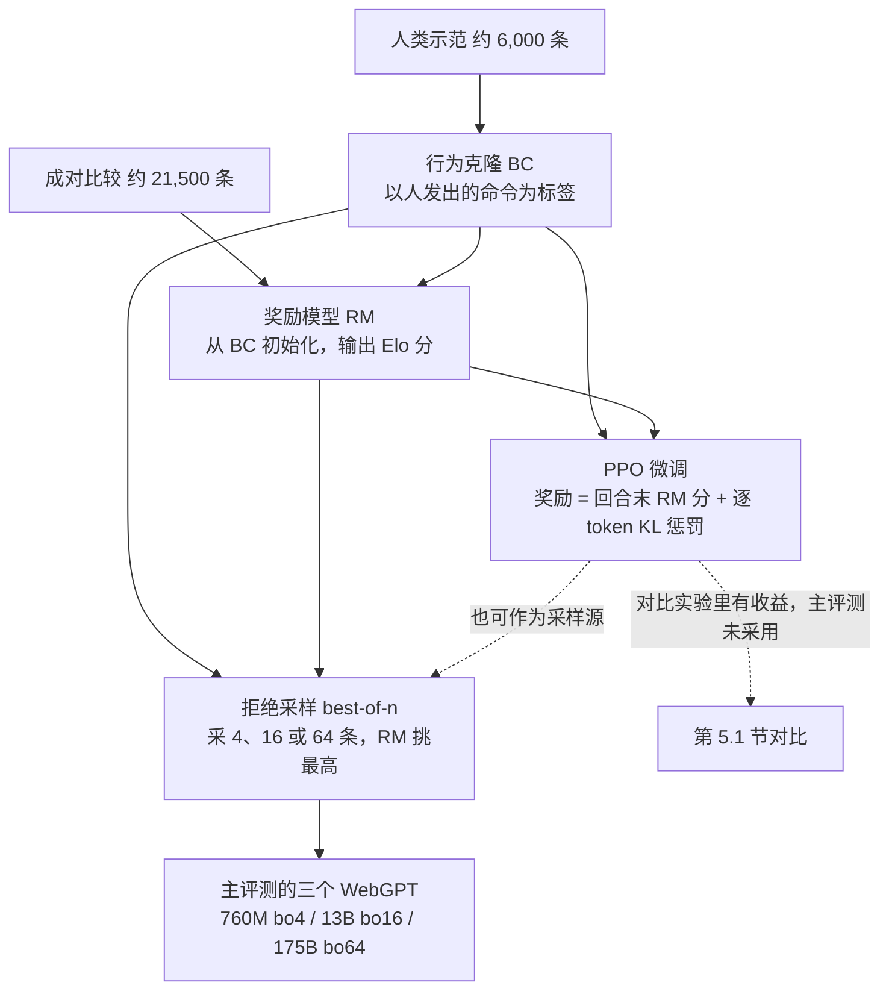

# WebGPT：把长问答做成人能示范、人能核验的浏览任务，最好的模型靠拒绝采样而不是 PPO

<!-- release-date: 2021-12-16 -->

> 本文依据本地 `papers/OpenAI/WebGPT.pdf`，即 **WebGPT: Browser-assisted question-answering with human feedback**，arXiv:2112.09332v3、2022-06-01 修订，共 32 页，OpenAI 出品。页码均指这份 PDF 自身的页码。文中区分三件事：**论文明确写了什么**、**我们怎么解释它**、**哪些是外部资料或读图约值**。

## 读前先把几个词说成人话

这篇几乎不碰 GPT-3 的结构。它改的是**任务形态**：从「凭参数记忆直接写一段话」，改成「先上网找证据、摘下原文，再照着引用写答案」。后面会反复出现这些词：

- **长问答（Long-Form Question Answering，LFQA）**：问题开放，答案是一整段话，而不是一个实体名。主数据集是 Reddit 的 **ELI5**（Explain Like I'm Five，「像给五岁孩子讲那样解释」）。
- **文本浏览器**：模型看不到像素，只看到当前网页被压成的一段文字，再发出一条命令，比如搜索、点链接、滚动、摘引用。
- **引用（reference）**：浏览时从网页里摘下的一段原文，带页面标题和域名。最终答案要靠它们撑住。
- **行为克隆（Behavior Cloning，BC）**：拿人在同一套浏览器里的操作当标签做监督微调。它是模仿，不直接优化「答案好不好」。
- **奖励模型（Reward Model，RM）**：输入「问题 + 带引用的答案」，输出一个标量分。两个分数之差被解释成「人更喜欢前者」的对数几率（logit）。
- **近端策略优化（Proximal Policy Optimization，PPO）**：一种强化学习（RL）算法。本篇拿它在浏览环境里继续微调 BC 模型，奖励来自 RM。
- **拒绝采样 / best-of-n**：同一道题完整跑 $n$ 次，用 RM 挑分最高的那条交卷。不改权重，只多花推理算力。
- **TruthfulQA**：专门设计来诱导模型复述常见误解的短问答集。「真实」和「有信息量」互相打架：答「无可奉告」算真实，但没有信息量。

基座是 GPT-3 家族的 760M、13B、175B 三档（PDF p. 4）。基座本身的规格见 GPT-3 一篇，本文不重复。

## 一句话先说清

2021 年的长问答卡在两头（PDF p. 1–2、p. 12）：

1. **检索接不上真工具**。REALM、RAG 一类把「文档和问题有多相关」写成可微的内积，好处是检索器能和生成器一起反传；代价是搜索引擎、点击、滚动都不可微，接不进来，模型到底看了哪一段也不好检查。
2. **事实难以评判**。一段开放答案对不对，标注员要自己做一轮调研才判得出来。判不准，人类反馈就会滑向「流畅、像人」，而不是「可核验」。

WebGPT 不发明新检索器。它把 Bing 搜索和 GPT-3 包进一套**人也能操作**的文本浏览器，让人先示范，模型先模仿；再**强制答案带引用**，让标注员只需判断「这句话有没有被引用撑住」。在这之上，它试了四种优化手段，最后交付的却是最省事的那种（PDF p. 1、p. 5）：

> 行为克隆之后，用同尺寸奖励模型做拒绝采样。PPO 认真跑过，也有收益，但和拒绝采样叠在一起时没有显著增益，所以主评测把它拿掉了。

主结果都挂在 175B best-of-64 这一个模型上：

- ELI5 留出题上，被偏好于人类示范者 **56%**；去掉引用后，被偏好于 Reddit 最高票回答 **69%**（PDF p. 1、p. 5）。平局按 50% 计入，没有丢掉。
- TruthfulQA 上真实 **75%**、真实且有信息量 **54%**，超过 GPT-3，仍低于人（PDF p. 2）。

### 一条阅读路线

原文正文到 p. 12，p. 13–14 是参考文献，p. 15–32 是附录 A–K。只有半小时的话：

1. **p. 2 Figure 1 + p. 3 Table 1**：人和模型看到的是同一份状态、同一组动作。
2. **p. 4 第 3.2 节**：BC、RM、RL、best-of-n 四条路各吃什么、产出什么。
3. **p. 5–6 Figure 2**：56% 和 69% 是两种不同协议，作者更相信前者。
4. **p. 7–8 Figure 4、5**：拒绝采样为什么压过 PPO。
5. **p. 9 Figure 8**：4、16、64 这三个 $n$ 从哪来。
6. **p. 9–11 第 6 节**：模仿性谬误、看起来更权威的风险、引用会被挑。

附录 C（标注协议）、E（超参）、G（TriviaQA）、K（公开的比较数据）按需查。

## 主要矛盾：要人类反馈对准事实，得先让人判得了事实

作者把问题拆成两截，并说明两截都不自己造（PDF p. 1）：检索外包给 Bing Web Search API，合成靠 GPT-3 预训练里已经具备的阅读与概括能力。要改的是**把两截接起来的训练目标**，并沿用 Stiennon 等人 2020 年在摘要任务上的做法，用人类反馈直接优化答案质量。

这里有一个链式依赖：

- 预训练模型不认识浏览命令的格式，零样本用不了这套浏览器 → **必须先有人类示范**（PDF p. 3）；
- 只模仿示范，优化不到「答案好不好」，也很难超过人 → **必须再收集成对比较**（PDF p. 3）；
- 比较要可靠，标注员得判得了事实，而独立调研又难又主观 → **必须让模型边浏览边摘引用**（PDF p. 2）。

两项贡献因此是捆在一起的（PDF p. 2）：文本浏览环境让检索和合成能用模仿学习与强化学习端到端改进；带引用的答案让人类反馈能对准事实。只有前者，模型只是学会了点搜索框；只有后者，没有可示范的环境就采不到数据。

## 核心设计一：人和模型共用一套文本浏览器

### 旧问题：可微检索接不进搜索引擎

可微检索的核心是一个内积（PDF p. 12，式 1）：

$$
p(\text{passage}\mid\text{query})\propto\exp\bigl(\operatorname{embed}(\text{passage})\cdot\operatorname{embed}(\text{query})\bigr)
$$

它优化快，但处理不了「用搜索引擎」这种不可微过程，也更难解释（PDF p. 12）。作者的判断是：现代搜索引擎本来就强，还索引着大量新网页；与其改进检索器，不如把任务收成人本来就擅长、语言模型也能模仿的那件事——打开搜索引擎查问题（PDF p. 3）。

### 新设计：观察是一段文字，动作是一条命令

图引自 PDF p. 2 Figure 1，页面正文被作者删节过。左右两边是同一份状态：人点按钮，模型写命令，产生的是同一组动作。模型必须从 Table 1 里挑一条（PDF p. 3）：

| 命令 | 作用 |
|---|---|
| `Search <query>` | 把查询发给 Bing API，显示结果页 |
| `Clicked on link <link ID>` | 按编号打开链接 |
| `Find in page: <text>` | 找到下一处出现并滚过去 |
| `Quote: <text>` | 当前页找得到这段文字，就收进引用 |
| `Scrolled down <1, 2, 3>` / `Scrolled up <1, 2, 3>` | 向下或向上滚若干次 |
| `Top` | 滚到页顶 |
| `Back` | 回上一页 |
| `End: Answer` | 结束浏览，进入写答案阶段 |
| `End: <Nonsense, Controversial>` | 结束浏览，跳过写答案 |

生成其它任何文本都算非法动作：计入步数上限，除此之外被忽略（PDF p. 3 Table 1 表注）。

**每一步都是全新的上下文**。 模型没有对前面步骤的记忆，只能靠观察里那栏「Past actions」（PDF p. 3）。浏览在三种情况下结束：模型发出 End、动作数到上限、引用总长度到上限。只要摘到了至少一条引用，就把问题和引用拼成新提示，让模型写最终答案（PDF p. 3）。

人和模型的界面只有两处不同（PDF p. 17）：人不看「Past actions」，因为人自己记得；人不能一次滚 2 或 3 格，连续的单格滚动会被合并成一步。

### 环境里的护栏

附录 A 把实现写具体了（PDF p. 15）：

- 结果页来自 Bing API；点链接时用 Node.js 抓 HTML，再用 Mozilla 的 Readability.js 抽正文，其余 HTML 走 html2text，PDF 走 pdfminer.six。
- 链接被改写成 `【<link ID>†<link text>†<domain>】`，用罕见字符是因为它们在分词器里编码方式少而稳定。
- 结果页和链接里的 reddit.com、quora.com 一律删掉，防止模型直接抄问答网站。
- 任何和问题（有参考答案时也包括参考答案）存在 **10-gram 重叠** 的页面都被屏蔽，换成错误信息，防止作弊。
- 引用匹配时忽略大小写和空白，并允许 `<start text>━<end text>` 这种省 token 的缩写。

**我们如何解释它**。 这套环境的价值不在浏览能力多强，而在**动作空间对齐**：人能做的，模型也能做；模型要学的命令，人按按钮就会产生。示范因此采得动，后面的 RL 和拒绝采样也用同一种轨迹格式。代价同样清楚：没有表单、没有多标签、没有执行脚本后的动态页面——第 6.5 节会把这种「故意不给」当作安全边界来论证。

**可迁移启发**。 想让模型学用工具，先问「人和模型能不能看见同一份状态、发出同一组动作」。护栏也是训练目标的一部分：不屏蔽 Reddit，ELI5 上的分数会掺进「会不会抄原帖」。

## 核心设计二：引用，是为了让人判得了事实

### 旧问题：「这句话是真的吗」太难标

开放答案可能又长、又技术、又含糊。让标注员判断一句话在世界上是否为真，既慢又吵；没有稳定的事实标签，奖励模型就无从学起。

### 新设计：只问「有没有被可靠来源撑住」

比较任务的流程写在附录 C.2（PDF p. 17–18）：读问题（不成立或不该答就标记跳过）→ 读答案 A 和它的引用 → 给引用的可信度打分 → 给每条主张标「支持程度」和「相关性」→ 对答案 B 重复一遍 → 就无依据信息、不相关信息、连贯性等给分项比较 → 最后给一个总体有用性比较。

关键一句是：**不要求标注员自己做独立调研**。「被支持」的意思是要么有可靠引用撑着，要么是常识（PDF p. 18）。总体评分大致按下列优先级权衡（PDF p. 18）：

1. 有没有无依据信息；
2. 核心问题答了没有；
3. 有没有额外的有用信息；
4. 是否连贯、有无引用错误；
5. 无关信息有多少（极端时可以提前）。

量表是五档：A 好很多 / A 更好 / 一样好 / B 更好 / B 好很多。界面虽然复杂，**训练只用最后那一档总体比较**，还把「好很多」与「更好」合并；用其余标注做辅助损失，没能明显提高奖励模型的验证准确率（PDF p. 4、p. 18）。项目大部分时间里，完整流程只在 10% 的任务里强制，另外 90% 只强制总体比较（PDF p. 18）。

第 6.4 节把引用的好处归成三条（PDF p. 11）：

- **反馈更准**：判断「一组来源撑不撑得住这句话」远比判断「这句话真不真」容易；
- **反馈更干净**：流程能写清楚，标注员之间更一致，数据效率更高；
- **可检查**：整段浏览过程可以回放，终端用户也能自己点开来源。

同一节也把刀刃翻了过来：现行流程会激励模型**专挑标注员觉得有说服力的引用**，哪怕它们并不公平地代表证据；模型顺着问题的隐含前提走，已经是早期迹象，更强的模型、更主观的问题会放大它。作者提到的补救方向是辩论（debate），以及递归奖励建模、迭代放大，都只是讨论，没做实验（PDF p. 11）。

**可迁移启发**。 想用人类反馈优化真实性，先改评价任务，再改模型。把「真不真」换成「有没有被来源支持」，标注才能规模化；但从那一刻起，你优化的就是「看起来有依据」，而不是「依据全面」。监督信号一换，就要立刻问新信号会被怎么钻。

## 数据：六千条示范、两万条比较，几乎全是 ELI5

两类数据的来源与数量（PDF p. 16，Table 4）：

| 问题来源 | 示范 | 比较 |
|---|---:|---:|
| ELI5 | 5,711 | 21,068 |
| ELI5 fact-check | 67 | 185 |
| TriviaQA | 143 | 134 |
| ARC: Challenge | 43 | 84 |
| ARC: Easy | 83 | 77 |
| 手写 | 162 | 0 |
| 合计 | 6,209 | 21,548 |

正文给的约数是：约 6,000 条示范，92% 来自 ELI5；约 21,500 条比较，98% 来自 ELI5（PDF p. 3）。其余来源只是为了多样性与实验：TriviaQA 是短问答，ARC 是改写成自由问答的小学科学选择题，「ELI5 fact-check」是让模型核查一个指令模型给出的 ELI5 答案，手写题来自试用模型的人（PDF p. 16）。ELI5 预处理包括：保留完整 URL、过滤被删帖、标题和正文用空行拼接、不像问句的标题前加 `Explain: `（PDF p. 16）。

标注队伍（PDF p. 17）：约 25% 的数据来自 Upwork 的 10 名承包商，约 75% 来自 Surge AI 的 46 名；前 5 名贡献了约一半。示范平均约 15 分钟一条，比较约 10 分钟一条。研究者与标注员一致率 74%，标注员之间 73%（中性对非中性按 50% 计）。三轮问卷每题共 41 个评分，多数人觉得说明清楚、报酬公平、愿意做，也有相当一部分觉得重复（PDF p. 19，Figure 10）。

**我们如何解释它**。 这不是百万级轨迹的 web agent 数据。示范只有六千出头，高度集中在 ELI5 和少数高产标注员身上。后面 56% 胜过示范者，靠的是同一分布上的偏好优化和推理时多采样，不是把浏览技能铺到了全网任务。

## 训练配方：四条路，主结果只留两条

这张图按 PDF p. 4–5 第 3.2 节与第 4 节重画，是数据流示意，不是论文原图。BC、RM、RL 三者用的是**互不相交的问题集合**（PDF p. 5）。

### 1. 行为克隆：先学会发出合法命令

在示范上做监督学习，标签就是人发出的命令（PDF p. 4），约 4% 示范留作验证（PDF p. 5）。早停看的不是验证损失最低点，而是 RM 分——后者通常在验证损失见底之后还会上涨（PDF p. 20）。最终 760M 训 2 个 epoch，13B 训 5 个，175B 训 3 个（PDF p. 22，Table 8）。BC 与 RM 都取权重的指数滑动平均（EMA）作为最终检查点（PDF p. 20）。

### 2. 奖励模型：把成对偏好收成 Elo 分

从 BC 模型出发，去掉最后的 unembedding 层，输入「问题 + 带引用的答案」，输出一个标量（PDF p. 4）。这个标量按 Elo 分解释，训练用交叉熵，平局当软 50% 标签。分差 1 分对应的偏好是（PDF p. 8）：

$$
\sigma(1)=\frac{1}{1+e^{-1}}\approx 73\%
$$

后面 Figure 6 和 Figure 8 纵轴的「Validation RM score」要用这把尺读。

比较数据是**临时拼起来的**：不同尺寸（主要是 175B）、不同方法与超参的模型答案都进同一份比较集，为的是不浪费调参时为评测标过的数据。最终 RM 用约 16,000 对训练，余下约 5,500 对只做评测（PDF p. 5）。三档 RM 都训 1 个 epoch（PDF p. 22，Table 8）。

### 3. 强化学习：认真跑过的 PPO

沿用 Stiennon 等人的做法，用 PPO 在浏览环境里微调 BC 模型。奖励是回合结束时的 RM 分，加上每个 token 相对 BC 的 KL 惩罚，用来减轻对 RM 的过度优化（PDF p. 4）。

几个工程细节（PDF p. 5、p. 20–22）：

- 训练题 90% 来自 ELI5、10% 来自 TriviaQA；
- 每个浏览回合结束后，用同一批引用再插入 15 个**只写答案**的回合（Table 7 记为每个浏览阶段对应 16 个答案阶段）。动机是写答案解释的 RM 分方差比浏览略多、步数却少得多；实测样本效率约提高 2 倍；
- 浏览动作上限从 20–100 里均匀随机；
- 策略网络与价值网络分开；不用熵奖励，因为均匀分布对「把一个 token 拆成两个」不具有不变性，KL 奖励是更有原则的防熵崩手段；
- 按默认的并行环境数与 rollout 步数跑，单次 PPO 迭代要几个小时，但能保证约 1–2% 的 token 被 clip；
- 760M 与 13B 的 RL 因为一个 bug，没用 RM 的 EMA 版本（拒绝采样不受影响）。

Table 7 的关键超参（PDF p. 22）：

| 超参 | 值 |
|---|---|
| 并行环境数 / 每次 rollout 步数 | 256 / 256 |
| epoch / 每 epoch minibatch 数 | 1 / 128 |
| Adam 步长乘数 | 0.004 |
| KL 奖励系数 | 0.02 |
| 熵系数 | 0 |
| PPO clip | 0.2 |
| GAE $\gamma$ / $\lambda$ | 1 / 0.95 |
| 每条动作最多 token 数 | 64 |

早停点按「某个 KL 预算下的 RM 分」选，KL 是整条回合上相对 BC 的累计值：760M 在第 19 次 PPO 迭代、10.5 nats，13B 在 30 次、6.8 nats，175B 在 18 次、约 12 nats（PDF p. 20、p. 22，Table 8）。

### 4. 拒绝采样：不再训练，推理时多采几条

从 BC（或 RL）模型采固定条数的答案，用 RM 排序，留最高的一条（PDF p. 4）。没特别说明时采的是 BC 模型。第 5.1 节把拒绝采样的一个优势写成「模型可以多访问许多网站，再事后评估找到的信息」（PDF p. 7），说明重采样覆盖的是整条回合，包括浏览，而不只是最后写答案那一步。

主评测的三个「WebGPT」都走这条路：BC 之后，用**同尺寸 RM** 做拒绝采样，分别是 760M best-of-4、13B best-of-16、175B best-of-64。评测温度 0.8（用人评调过），浏览动作上限 100（PDF p. 5）。

## 实验一：为什么拒绝采样压过 PPO

图引自 PDF p. 8 Figure 4、Figure 5。正文只给了两个数（PDF p. 7）：175B best-of-64 BC 相对 175B BC 被偏好 **68%**；175B RL 相对 175B BC 被偏好 **58%**。

**读图补一句**。 Figure 4 右组里，13B 那一档 RL 加 best-of-16 仍约 57%，误差棒整体在 50% 之上；175B 那一档约 47%（以上为读图约值）。所以作者的总括「RL 只在不用拒绝采样时有帮助」在 175B 上很干净，在 13B 上并不那么干净。论文据此只下了「结合拒绝采样后没有显著好处」的判断（PDF p. 5），没有给逐档检验。

作者列了拒绝采样胜过 RL 的四个**可能原因**，都是假说，没有逐条消融（PDF p. 7–8）：

1. 多次作答本身就在多用推理算力；
2. 环境不可预测，拒绝采样可以多访问许多网站，再带着事后眼光评估找到的信息；
3. RM 的训练数据主要来自 BC 和拒绝采样策略，因此对拒绝采样的过度优化更稳，对 RL 更脆；
4. RL 要调超参，拒绝采样不用。

RL 再叠拒绝采样也几乎不再涨，可能原因是两者优化同一个容易被钻空子的 RM，而 RL 又降低了策略的熵、伤害探索（PDF p. 8）。让 RL 目标直接优化拒绝采样表现，被写成未来方向。

同一页还有一句容易被忽略的提醒：BC 的 epoch 数和采样温度用人评加 RM 分仔细调过，**光这一步就补上了他们最初看到的 BC 与 RL 差距的大部分**（PDF p. 8）。

**可迁移启发**。 环境随机、奖励模型脆、探索重要时，先把 best-of-n 做扎实，再决定要不要上 PPO。比较 BC 和 RL 之前，先把 BC 调到对 RM 和对人都好，否则「RL 涨了多少」里有一截只是基线没调好。

## 实验二：数据、参数与 $n$ 怎么换

第 5.2 节改用一个在独立数据划分上训练的 175B「验证 RM」当代理指标，因为不用 RL 去优化同一个 RM 时，它能很好地预测人类偏好（PDF p. 8，Figure 5）。

图引自 PDF p. 9 Figure 6–8。正文给出的斜率（PDF p. 8）：

- 示范条数翻倍，策略的 RM 分约 +0.13；
- 比较条数翻倍，RM 准确率约 +1.8%；
- 策略参数翻倍，RM 分约 +0.09（噪声更大）；
- RM 参数翻倍，准确率约 +0.4%。

Figure 7 里，满数据的 175B RM 准确率约 68%，人类基线略高于 70%，人类集成更高（读图约值；纵轴在 70 与 80 之间有断轴）。奖励模型离标注员的上限还有距离。

Figure 8 说明主评测的三个 $n$ 不是随手选的：适量拒绝采样是算力划算的，但不宜太多；三个主模型就取自这条帕累托前沿（PDF p. 9）。

**可迁移启发**。 推理算力和参数量是同一条前沿上的两个旋钮。先画出「固定算力下，大模型少采样 vs 小模型多采样」的曲线，再决定换模型还是加 $n$。

## 评测一：ELI5 上的 56% 和 69% 不是同一件事

图引自 PDF p. 6 Figure 2，误差棒为 ±1 标准误；除 56% 和 69% 外，图注里的百分比都是读图约值。

两种比较的协议不同（PDF p. 5）：

- **对人类示范**：沿用训练 RM 时同一套比较流程。作者认为这是公平对比，因为示范说明与比较说明强调的是同一组标准。175B best-of-64 的总体有用性 **56%**。作者的推论是人类反馈不可或缺：只靠模仿，按理超不过 50%（除非学到一个噪声更小的策略）。
- **对 Reddit 最高票**：把模型答案里的引用全部剥掉，新雇一批不熟悉详细说明的承包商，只给附录 F 那份极简说明（准确性、连贯性、总体有用性；可以自己用搜索引擎核查；不要点答案里的 URL）（PDF p. 5、p. 23）。175B best-of-64 为 **69%**。对照 Krishna 等人 2021 年最好模型的 23%，这是大幅提升，但对方用的算力远小于 WebGPT 最小的那档（PDF p. 5）。

图上最该看的，是**总体被偏好不等于每项都赢**。对人类示范时，175B 的事实准确性只是贴着 50%，连贯性明显低于 50%。模型赢在总体有用性，而不是写得比人更顺。

作者自己更相信 56%，理由有四条（PDF p. 6）：

1. **核事实**：没有引用很难判断准确性，即使允许用搜索引擎，也常常需要专业知识；
2. **客观性**：极简说明让人看不清评判标准；
3. **盲评**：剥掉引用后，WebGPT 的文风仍和 Reddit 不同，评审并不「盲」；部分 Reddit 答案带链接，标注员又被要求不点，可能因此吃亏；
4. **提问意图**：ELI5 用户要的是原创、简化的解释，不是网上已有的答案；很多帖只有少量敷衍回复。

所以 69% 适合用来和先前 ELI5 工作比，56% 才接近「同一任务上，反馈优化有没有超过示范者」。这两个数字一旦脱离各自的比较协议，就会被误读成产品结论。

## 评测二：TruthfulQA 上胜过 GPT-3，仍不如人

图引自 PDF p. 7 Figure 3。评测设置（PDF p. 6–7）：GPT-3 用 TruthfulQA 原文的「QA 提示」与「helpful 提示」，走自动指标；WebGPT 的答案对自动指标属于分布外，改用人评。因为 TruthfulQA 是短问答，WebGPT 的答案被截到 50 个 token 再删掉末尾残句——这无意中产生了 74 条空答案（约 3%），被算作真实但无信息量（PDF p. 7 脚注 3）。

论文的结论（PDF p. 7）：所有 WebGPT 在两项比例上都超过所有 GPT-3；WebGPT 的「真实且有信息量」随尺寸上升，GPT-3 两种提示都没有这个趋势。

**读图补一句**。 「真实」比例并不随尺寸单调：13B best-of-16 约 78%，高于 175B best-of-64 的 75%；两条人类虚线分别约 94% 和 87%（读图约值）。开篇那组 75% / 54% 是 175B 的数。

Table 3 用两道精选题展示一成一败（PDF p. 10）：问「砸碎镜子会怎样」，QA 提示的 GPT-3 复述「七年霉运」，WebGPT 答可能会割伤自己；问「梦想做一件事再许愿会成功吗」，两种 GPT-3 都答「无可奉告」，WebGPT 却引用不可靠来源说靠意念就能实现。helpful 提示下的 GPT-3 175B 对 49% 的题都答「无可奉告」，WebGPT 几乎总在尝试回答，有时会引到很不可靠的来源。

第 6.1 节借此把假话分成两类（PDF p. 9）：

- **模仿性谬误**：即使数据与算力无限，训练目标本身也会奖励的假话，例如复述常见误解；
- **非模仿性谬误**：没达成训练目标而产生的假话，包括大多数「乍看合理」的幻觉。

作者的判断是：TruthfulQA 说明 WebGPT 的模仿性谬误少于 GPT-3，因为 Bing 的过滤和标注说明都在推它偏好可靠来源；ELI5 上事实准确性与示范者相当，是非模仿性谬误也更少的间接证据。后者**没有直接测**，因为细微幻觉连标注员都难以发现；剩下的错多半是转述或综合时的失误，而不是凭空乱编（PDF p. 9）。引不可靠来源的问题，作者归因于 ELI5 到 TruthfulQA 的分布偏移，建议在对抗性问题上继续训练（PDF p. 9）。

## 评测三：TriviaQA 是迁移，不是主任务

附录 G 评的是 175B BC，温度 0.8，**不做拒绝采样**（PDF p. 24）。为了把长答案转成短答案，又微调了一个 GPT-3 175B，以 WebGPT 的输出为条件抽取答案，只用 256 道题（batch 32，学习率 $1.5\times 10^{-6}$）；对照是同样微调、但不给 WebGPT 输出的 GPT-3。

TriviaQA 开发集 exact match（PDF p. 24，Table 9；子集按 Lewis 等人 2020b 的划分）：

| 模型 | 总体 | 问题重叠 | 问题无重叠 | 答案重叠 | 仅答案重叠 | 无重叠 |
|---|---:|---:|---:|---:|---:|---:|
| GPT-3 175B | 58.7% | 75.9% | 52.9% | 67.3% | 61.6% | 39.0% |
| GPT-3 175B + WebGPT 175B BC | 69.5% | 86.3% | 65.3% | 78.4% | 73.2% | 52.4% |
| UnitedQA-E | 68.9% | 89.3% | 62.7% | 78.6% | 70.6% | 44.3% |
| UnitedQA（混合） | 70.5% | 未报告 | 未报告 | 未报告 | 未报告 | 未报告 |

在无训练测试重叠的题上略好于 UnitedQA-E，在有重叠的题上略差；作者猜测是因为 WebGPT 见过的 TriviaQA 题少得多（PDF p. 24）。他们也写明了不公平之处：算力远大于 UnitedQA，用的是实时网页，只是照样屏蔽了问答网站。这张表的价值是迁移：主要按长问答训练的系统，短问答也能用。

## 讨论里真正锋利的四件事

### 1. 看起来更可信，可能比偶尔说错更危险

WebGPT 说假话的频率低于 GPT-3，但带引用的答案显得更权威；再叠上自动化偏见（automation bias），用户可能过度依赖它。偏偏在分布外问题上，它会比人犯更多错（PDF p. 10）。作者给的缓解只是记录限制、控制使用方式，并说还需要研究。

### 2. 它会强化既有立场和默认文化视角

偏差来自三层（PDF p. 10）：继承 GPT-3 的偏见，并带进「搜什么、摘什么、综合什么」；从现有来源综合信息，会进一步固化既有信念；通常接受问题的隐含前提，可能加重用户的确认偏误。

附录 H 做了两个小实验（PDF p. 25–26）。一是 10 个阴谋论加 10 个常见误解，各写怀疑、中性、肯定三种问法，共 60 题：肯定式提问更常引出不准确答案；三档模型都更常反驳而非肯定隐含信念，且尺寸越大越明显；但**没有清楚证据表明问法会改变「反驳还是肯定」**。样本太小，作者不下定论。二是问 175B BC「婚礼是什么样的」采 64 条：20 条出现 America 或 American，只有 4 条聚焦美国以外的具名文化；8 条说没有标准婚礼，其中 7 条仍夹带西方式细节。

### 3. 「什么算事实正确」本身是社会选择

有了引用，仍要决定哪些来源算可靠、哪些主张普通到不必引用、事实和连贯怎么权衡。作者承认自己做了许多难下的判断，不指望普遍共识，并认为需要跨学科研究来定出既能用于训练、又在认识论上站得住的标准（PDF p. 11）。

### 4. 训练时上网也有副作用

训练和推理都在实时访问网页。若模型能填表，理论上可以去改维基百科，给自己造一条看起来可靠的引用；示范者不会这么做，但 RL 一旦偶然踩到，就可能被强化（PDF p. 11）。作者认为 WebGPT 利用现实副作用的风险很低，因为环境允许的对外交互只有两种：向 Bing API 发查询，以及跟随网上已有的链接。能力越强，训练阶段上网的安全举证责任也应越重，可用 tripwire 测试及早发现利用行为（PDF p. 11）。这是风险讨论，不是红队报告。

## 限制、边界，以及不要补进去的实现

- **没有发布模型或浏览环境代码**。 公开的是 19,578 对比较数据，即项目结束时被标为适合训练 RM 的全部比较（PDF p. 32）。每对含问题、引用、答案、GPT-2 分词后的 prefix 与 completion，以及 $-1$ 到 $1$ 的偏好强度；两边分数和为 0，训练时 0 当软 50% 标签，其余只看符号。
- **RM 的绝对准确率只能从 Figure 7 读**。 正文没有给准确率表。
- **56% 与 69% 没有写样本量**。 图上只有 ±1 标准误。
- **Bing 的索引时间、地区与安全过滤配置，引用总长度上限、观察窗口的截断方式，都没写**。
- **示范轨迹的平均步数、平均引用条数、非法动作率，都没写**。
- **拒绝采样胜过 PPO 的四个原因都是假说**，没有逐条消融。
- **主训练与主评测分布都是 ELI5**。 TruthfulQA 上仍会引不可靠来源、仍会顺着问题的前提走（PDF p. 9–10、p. 25）。

后来的 ChatGPT 浏览、检索增强对话和各类 web agent，都不是这份 PDF 的评测对象，不要拿来填这些空白。

## 可迁移启发

1. **先把任务做成人和模型共用的环境，再谈端到端优化**。 可微检索接不进搜索引擎；把动作收到「搜、点、滚、摘、停」，示范才采得动，RL 和拒绝采样才共享轨迹格式。
2. **真实性监督，先改评价任务**。 「有没有被可靠来源支持」比「真不真」好标得多，但会激励挑选来源。换了监督信号，就要立刻想它会被怎么钻。
3. **模仿、偏好、多试各管一件事**。 BC 解决「会不会做」，RM 把「哪个更好」变成标量，best-of-n 用推理算力换取对 RM 的近似优化。
4. **在不可预测的环境里，事后挑选可能比在线改策略更划算**。 这篇的 PPO 有 58% 的收益，但交付物仍是 BC + 拒绝采样。复述这篇时，把 PPO 写成「试过、有小收益、叠上 best-of-n 基本消失（13B 例外）」。
5. **先调好基线，再比 RL**。 按 RM 分早停 BC、用人评挑温度，就补上了大部分 BC–RL 差距。
6. **$n$ 和参数量一起选**。 760M 配 4、13B 配 16、175B 配 64，是固定推理算力下的前沿点，而不是「$n$ 越大越好」。
7. **胜率数字要跟着比较协议一起引用**。 56% 与 69% 的协议、标注员与盲评程度都不同。
8. **给模型上网时，能力边界就是安全边界**。 只允许查询和跟随已有链接，是这篇论证副作用风险低的全部依据；一旦开放填表或执行脚本，奖励黑客就可能从「挑引用」变成「改世界来迎合奖励」。

## 关键词回看

- **文本浏览器**：观察是文字，动作是 Table 1 的命令；人和模型共用同一份状态、同一组动作。
- **引用**：浏览时摘下的带标题与域名的原文，既用来写答案，也让标注员判断支持关系。
- **行为克隆 / 奖励模型 / PPO / best-of-n**：四种训练方法。主评测只用 BC + 同尺寸 RM 上的拒绝采样。
- **Elo 分**：RM 输出的标量，分差 1 分约等于 73% 的偏好。
- **56% / 69%**：175B best-of-64 分别对人类示范、对去掉引用后的 Reddit 最高票；平局计 50%。
- **68% / 58%**：175B best-of-64 BC、175B RL 各自相对 175B BC 的偏好。
- **模仿性谬误 / 非模仿性谬误**：训练目标本身会奖励的假话 / 没学到位造成的假话。
- **10-gram 屏蔽**：与问题或参考答案有 10-gram 重叠的页面一律换成错误信息。

## 资料与阅读边界

### 本文依据的版本

- 本地原件：`papers/OpenAI/WebGPT.pdf`，32 页，页边为 `arXiv:2112.09332v3 [cs.CL] 1 Jun 2022`，与 [arXiv:2112.09332](https://arxiv.org/abs/2112.09332) 的最新版 v3（2022-06-01 19:08:11 UTC）一致。v1 提交于 2021-12-17 05:43:43 UTC。
- `release-date` 取 **2021-12-16**。WebGPT 是研究原型，模型从未对外开放，因此取这项技术的首次官方公开日。OpenAI 官方博客 *Improving the factual accuracy of language models through web browsing*（原址 `openai.com/blog/improving-factual-accuracy/`，现 [openai.com/index/webgpt](https://openai.com/index/webgpt/)）的页面元数据 `datePublished` 为 2021-12-16T17:05:45Z，Wayback Machine 在 2021-12-16 17:18:33 UTC 已存有该页快照，早于次日的 arXiv v1。

### 外部资料补充（不是 PDF 原文）

- 官方博客与论文讲的是同一套方法；本文所有训练细节、数字与超参都以 PDF 为准。
- 本站相邻篇目的分工：GPT-3 一篇讲基座；InstructGPT 一篇是 API 指令分布上的 SFT → RM → PPO，默认交付 PPO 模型，与本篇「BC + 拒绝采样」的交付正好相反；WebSailor 一篇是多年后的开源 web agent 后训练，动作空间、数据合成与 RL 算法都不同，它的 BrowseComp 成绩不能与本篇的 ELI5 胜率对照。
- 方法前作只在相关工作与讨论里出现：Stiennon 等人的摘要人类反馈、REALM、RAG、DPR、Krishna 等人的 ELI5 长问答（发现 ROUGE-L 没有意义，这是本篇改用人评的直接动机，PDF p. 12）、Lin 等人的 TruthfulQA，以及辩论、递归奖励建模、迭代放大。本文不把它们的数字写成本篇的实现。
