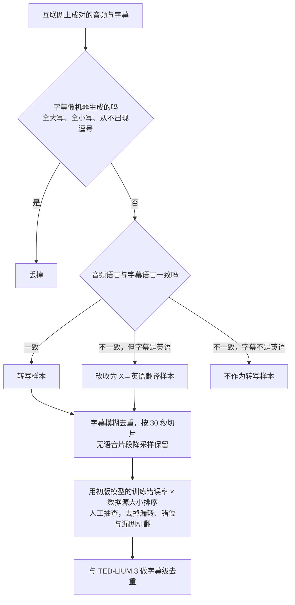
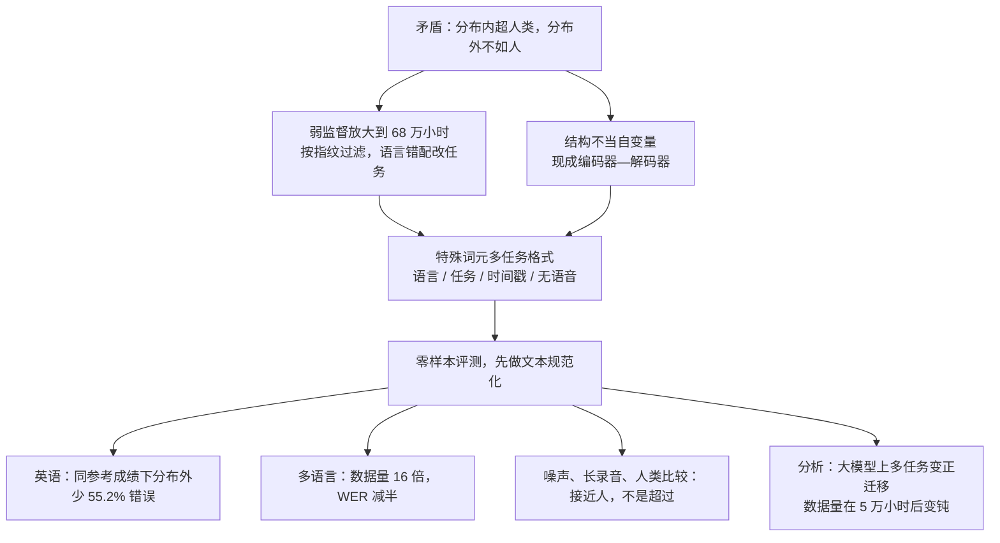

# Whisper：68 万小时弱监督，买到的不是 LibriSpeech 榜首，而是换个环境还能用

<!-- release-date: 2022-09-21 -->

> 本文依据 OpenAI 的 **Robust Speech Recognition via Large-Scale Weak Supervision**（系统名 Whisper），arXiv:2212.04356v1，2022-12-06 提交，共 28 页（正文 14 页，其后是参考文献与附录 A–F）。页码均指这份 PDF 自身的页码。文中区分三件事：**论文明确写了什么**、**我们怎么解释它**、**哪些是外部资料或本文推算**。

## 读前先认识几个词

这篇论文几乎没有发明新网络。它改的是两件事：训练数据从哪来，以及怎么考。先把会反复出现的词说成人话：

- **自动语音识别（Automatic Speech Recognition，ASR）**：把说话声转成文字。传统系统是一串模块：语音活动检测、声学模型、语言模型、逆文本规范化、时间对齐。
- **词错误率（Word Error Rate，WER）**：输出和参考转写之间的编辑距离（插入、删除、替换都算错）除以参考词数。它惩罚一切字面差异，包括标点、缩写和数字写法。
- **零样本迁移（zero-shot transfer）**：评测集的训练分割一条都不用，模型权重在见到这套数据之前就已经冻住。
- **弱监督（weak supervision）**：标签不是人工逐句校验的金标准，而是互联网上成对出现的「音频 + 字幕」。量大、杂、错得多，但声学环境和说话方式覆盖得更广。
- **对数梅尔频谱（log-Mel spectrogram）**：把波形切成短窗做成频谱，再按人耳敏感的梅尔刻度压成少量频带并取对数。Whisper 用 80 个频带（PDF p. 3）。
- **有效鲁棒性（effective robustness）**：Taori 等人提出的度量。先看模型在参考分布（这里是 LibriSpeech）上的成绩，再看它在别的分布上比「按参考成绩外推」好多少（PDF p. 6）。

论文里真正新的名字只有一个：

- **多任务训练格式（multitask training format）**：把「这是哪种语言、转写还是翻译、要不要时间戳、有没有人说话」全部写成解码器要预测的特殊词元，一个模型替掉整条传统流水线（PDF p. 3–4）。

脚注还给了一个可选缩写 WSPSR（Web-scale Supervised Pretraining for Speech Recognition），正文与开源仓库都只用 Whisper（PDF p. 2）。

## 一句话先说清

2022 年语音识别的主流做法是：用 wav2vec 2.0 这类**无监督预训练**把音频编码器做强，再在每个下游数据集上微调解码器。这样能在 LibriSpeech 上把 WER 压到远低于「人类水平」，可一换录音条件就垮（PDF p. 1、p. 5）。

Whisper 的回答是：

> **不再为每个部署分布微调。把弱监督放大到 68 万小时、覆盖多语言和多任务，用一个现成的编码器—解码器 Transformer 直接零样本工作。参考分布上它不抢眼；换到别的数据集、噪声和长录音上，它才把「看起来超人类、一换场景就垮」这条缝补上。**

这条主张落在几个具体数字上，不能读成「全面超过专用系统」：

- 训练数据摘要写 680,000 小时；附录图 11 的精确值是 **681,070 小时**：英语转写 65%、其他语言转写 17%、X→英语翻译 18%（PDF p. 1、p. 27）。
- LibriSpeech test-clean 上最好的零样本 WER 是 **2.5**，只相当于「现代监督基线或 2019 年中的 SOTA」，不是当时的 1.4（PDF p. 6）。
- 与 LibriSpeech 上成绩相当的 wav2vec 2.0 Large 相比，在其他 13 个集合上平均少 **55.2%** 的错误（PDF p. 6，Table 2）。
- 多语言、翻译、语言识别三条线，论文把成功和失败并排写：MLS 胜、VoxPopuli 败；CoVoST2 总体 29.1 BLEU 新高、高资源分组不胜；语言识别 64.5 落后专用系统（PDF p. 7–8）。

如果只记一句话：

> **语音识别真正该比的，不是同一套朗读语料上还能再降几个点，而是换麦克风、换口音、换噪声之后还剩多少能力。**

## 先看全景：一张图就是整篇论文

图引自原文 Figure 1（PDF p. 4）。左上是四类训练样本：英语转写、任意语言到英语的翻译、非英语转写、无语音。中间是模型：编码器吃频谱，解码器一边看自己写过的词元、一边通过交叉注意力看编码器输出。下半部分是全文最重要的一张「接口图」：解码器要写的每一段前缀都是一个开关，后文逐一展开。

五个规格只改深度、宽度和头数，编码器与解码器同宽同深（PDF p. 5，Table 1）：

| 规格 | 层数 | 宽度 | 头数 | 参数量 |
|---|---:|---:|---:|---:|
| Tiny | 4 | 384 | 6 | 39M |
| Base | 6 | 512 | 8 | 74M |
| Small | 12 | 768 | 12 | 244M |
| Medium | 24 | 1024 | 16 | 769M |
| Large | 32 | 1280 | 20 | 1550M |

Tiny 到 Medium 另有只训英语的 `.en` 版本，Large 只有多语言版（附录表 8 的行名，PDF p. 22）。正文成绩默认来自原始发布之后又训的 **Large V2**：同样 1550M，多训 2.5 倍 epoch，并加 SpecAugment、随机深度和 BPE Dropout（PDF p. 4 脚注 3）。读后面的表时，「Whisper」一般指 V2。

## 主要矛盾：榜首测的是分布内，人测的是分布外

### 旧问题一：编码器很强，解码器仍要每次微调

无监督方法直接从原始音频学，不需要人工标签，所以能堆到 1,000,000 小时，远大于学术监督数据常见的约 1,000 小时（PDF p. 1）。但它只练出编码器，没有一个同样强的预训练解码器把表示映射成可用的文字，于是每个下游分布都要再微调一次。论文认为，这既限制了「开箱即用」，也带来另一种风险（PDF p. 1）。

### 旧问题二：微调会把数据集的脾气学成能力

机器学习很擅长在训练集里找到能提高同分布留出成绩的模式，其中一部分是脆的、换数据集就失效。论文借自己的视觉工作打比方：在 ImageNet 上微调让分类准确率涨 9.2%，但同样的物体在另外七个自然图像数据集上平均准确率没有提高（PDF p. 1）。

语音里有一个更刺眼的数字：2015 年 Deep Speech 2 在 LibriSpeech test-clean 上做到 5.3%，接近他们报告的人类 5.8%，并据此认为干净朗读语音「几乎没有提升空间」。七年后同一分割的 SOTA 又降了 73%，到 1.4%；可这些模型一换场景，错误率仍远高于人（PDF p. 5）。

### 这对矛盾的真正含义

论文的解释是：人和机器虽然考同一张卷，**练法完全不同**（PDF p. 5）。人几乎没在「正在被考的那套录音」上专门练过，所以人的成绩测的是分布外泛化；机器先在同分布的大量监督上训练，测的是分布内泛化。Whisper 在很宽的分布上训练、再零样本去考现成基准，更接近人被比较时的条件。

所以全文要回答的不是「怎么把语音模型做大」，而是：**把弱监督再放大一个数量级，能不能在不微调的前提下，补上「分布内超人类、分布外不如人」这条缝。**

## 核心设计一：标签可以脏，但脏的方式必须被管住

### 为什么是弱监督，而不是更多金标准

把现成高质量数据集拼起来是对的方向，但总量有限：SpeechStew 合并 7 个集合，一共 5,140 小时。放松金标准的 GigaSpeech 和 People's Speech 到了 10,000 和 30,000 小时，仍只比高质量数据大几倍，离无监督的 100 万小时差一个数量级以上（PDF p. 1–2）。视觉领域已经证明，从 ImageNet 这类众包金标准走向更大更脏的弱监督，鲁棒性和泛化明显更好（PDF p. 2）。

| 路线 | 论文举的规模 | 标签从哪来 | 部署时还缺什么 |
|---|---|---|---|
| 无监督预训练再微调 | 最多约 1,000,000 小时 | 下游再要一份监督 | 每个分布微调解码器 |
| 多数据集合并监督 | SpeechStew 5,140 小时 | 现成高质量标注 | 总量上不去 |
| 放松金标准 | 10,000 / 30,000 小时 | 自动流水线 | 仍远小于无标签规模 |
| Whisper | 680,000 小时 | 互联网字幕，经过滤 | 零样本，不再微调 |

前三行是论文用来定位自己的背景，不是 Whisper 的训练量（PDF p. 1–2）。

### 过滤的目标：别学会「转写腔」

数据来自互联网上成对的音频与字幕，声学环境、设备、说话人和语言天然很杂。论文马上补了一句关键限制：**音频质量的多样性有助于鲁棒，转写质量的多样性没有同样的好处**（PDF p. 2）。

所以过滤不是把互联网洗成 LibriSpeech，而是按「脏的来源」分别处理（PDF p. 2–3）：

按 PDF p. 2–3 第 2.1 节重画的流程示意，不是论文原图。几个细节值得单独说：

1. **机器字幕的指纹是格式。** 现有 ASR 常常不输出复杂标点、段落和大小写；全大写或全小写的转写「极不可能是人写的」。翻译研究已经表明，人机混合数据会显著伤害翻译系统，论文把同样的风险搬到语音上（PDF p. 2）。
2. **语言对不上，不一定扔。** 语言检测器是用原型模型在 VoxLingua107 上微调得到的，拿它去比对字幕的 CLD2 语言。字幕是英语、声音不是英语时，样本改收为翻译监督（PDF p. 2）。
3. **静音也是监督。** 无语音片段不删光，而是降采样保留，用来学语音活动检测（PDF p. 2）；附录表 17 写明降采样倍数是 10 倍（PDF p. 28）。
4. **第二轮过滤靠初版模型。** 按「高错误率 × 数据源大小」排序人工检查，发现了大量只转写一部分、对不齐、以及启发式没抓到的机器字幕（PDF p. 3）。
5. **防污染只点名一个集合。** 训练集与评测集的字幕级去重只对「重叠风险较高」的 TED-LIUM 3 做了（PDF p. 3）。

另一个决定看似不起眼，后面所有「自然书面转写」都靠它：**模型直接预测原始字幕文本，不做显著标准化**，标点、大小写和格式留给序列到序列模型自己学，部署时就不必再接一层逆文本规范化（PDF p. 2）。

### 收益：规模与覆盖

图 11 把 681,070 小时拆成三块（PDF p. 27）：

| 任务 | 时长 | 占比 |
|---|---:|---:|
| 英语语音识别 | 438,218 小时 | 65% |
| 多语言语音识别 | 117,113 小时 | 17% |
| X→英语翻译 | 125,739 小时 | 18% |

三块相加正好是表 6 的 681,070（PDF p. 11）。多语言部分极度长尾：转写时长最多的是中文 23,446 小时、德语 13,344、西班牙语 11,100、俄语 9,761、法语 9,752；翻译时长最多的是韩语 19,938、中文 11,731、日语 8,860、威尔士语 8,263（PDF p. 27，图 11）。图 11 左栏在英语之外列了 74 种语言，加上英语正好是正文所说「语音识别训练数据覆盖 75 种语言」（PDF p. 7）。

几个计数口径并不统一：解码器有 99 个语言词元（PDF p. 3），引言说多语言转写「覆盖 96 种其他语言」（PDF p. 2），第 3.4 节说转写覆盖 75 种语言（PDF p. 7）。论文没有把这几个数放进同一张对照表。

### 代价：错误的任务标签会直接进训练集

「语言对不上就改收为翻译」这条规则，后面反咬了一口。威尔士语号称有约 9,000 小时翻译数据（图 11 标 8,263 小时），排翻译数据量第 4，超过法语、西班牙语、俄语；可它在 Fleurs 上只有 13 BLEU。检查发现，大部分「威尔士语翻译数据」其实是英语音频配英语字幕，被语言检测器误判成威尔士语，于是按规则进了翻译桶（PDF p. 8、p. 27）。

**我们怎么解释它。** 过滤启发式做的是任务分配，不是金标准标注。检测器的每一个错误都会变成一条错误的任务标签，而且是成千上万小时地错。

### 这一节可以带走什么

弱监督不是「脏一点没关系」，而是**先把脏的模式分类，再分别处理**。机器生成的目标会让模型学会源系统的脾气；标签和输入对不上，与其丢掉，不如看能不能改成另一种任务；无标签的静音也是一种监督。代价是每条路由规则的错误都会被规模放大，需要像威尔士语这样事后按离群点反查。

## 核心设计二：结构故意选现成的，变量只留给数据

### 为什么不换结构

研究问题是「大规模监督预训练对语音识别意味着什么」。如果同时换数据、换网络、换目标，鲁棒性提高了也说不清是哪一步起的作用。所以论文选了「已被验证能可靠放大」的编码器—解码器 Transformer（PDF p. 3）。

### 具体配置

- **前端**：音频统一重采样到 16 kHz，算 80 通道对数幅度梅尔频谱，窗长 25 毫秒、步长 10 毫秒；在整个预训练集上把输入全局缩放到 $[-1,1]$、近似零均值（PDF p. 3）。
- **编码器**：先过一个小「茎」：两层一维卷积，卷积核宽 3，GELU 激活，第二层步幅 2（时间分辨率减半）。茎的输出加正弦位置编码，再进预激活残差的 Transformer 块，出口做一次层归一化（PDF p. 3）。
- **解码器**：可学习的位置编码，输入输出词元表示绑定（PDF p. 3）。
- **分词**：英语专用模型直接用 GPT-2 的字节级 BPE；多语言模型保持词表大小不变、重新拟合，以免偏英语的 GPT-2 词表把其他语言切得过碎（PDF p. 3）。

按本文算术，10 毫秒步长意味着 30 秒对应 3000 帧频谱，第二层卷积步幅 2 之后编码器处理 1500 个位置；时间戳量化到 20 毫秒，正好是这一分辨率（论文只写了 20 毫秒「与模型原生时间分辨率一致」，PDF p. 3）。

### 代价与边界

归因干净的代价是：鲁棒性到底来自编码器、还是来自这个「音频条件语言模型」式的解码器，本工作没有拆开。论文在限制里自己建议，可以训一个无解码器的 CTC 模型，或者看现有编码器（如 wav2vec 2.0）接上语言模型后鲁棒性怎么变（PDF p. 14）。

> **如果研究问题是「这种数据协议行不行」，就别顺便换骨干。骨干一换，失败了说不清，成功了也说不清。**

## 核心设计三：特殊词元把整条语音流水线收成一次解码

### 旧问题：识别只是流水线中间那一截

完整的语音系统还要语音活动检测、说话人分离、逆文本规范化；同一段音频可以要转写、要翻译、要对齐、要判断语言（PDF p. 3）。一对多映射需要一个任务接口，否则只能每个任务一个模型。

### 新设计：任务说明本身也是要预测的词元

回到 Figure 1 下半部分，解码器序列按这个顺序写（PDF p. 3）：

1. 可选的「先前文本」：以一定概率把当前 30 秒之前的转写放进上下文，希望模型用更长的文本历史消解听不清的地方。附录表 17 给出的概率是 50%（PDF p. 28）。
2. `<|startoftranscript|>`：开始预测。
3. **语言词元**（共 99 个，标签来自 VoxLingua107 检测器）；若这段没有人声，改写 `<|nospeech|>`。
4. **任务词元**：`<|transcribe|>` 或 `<|translate|>`。
5. 不要时间戳时插入 `<|notimestamps|>`。
6. 正文。要时间戳时，时间相对当前 30 秒窗口、量化到最近的 20 毫秒，作为额外词元插在每句字幕的前后：开始时间 → 文本 → 结束时间。若最后一句只有一部分落在窗口里，时间戳模式下只预测它的开始时间，示意下一次解码应从这一刻对齐的窗口开始；非时间戳模式则把音频截断，不含这句。
7. `<|endoftranscript|>`。

训练损失只遮住「先前文本」那一段，其余词元（包括语言、任务、时间戳）都要预测（PDF p. 3）。

**我们怎么解释它。** 特殊词元同时是开关和分类目标：语言识别和语音活动检测不是另挂一个头，而是解码序列最前面的几个位置。Figure 1 的虚线还标了一条「纯文本转写」路径，注明「允许按数据集微调」，但论文本身没有做微调（PDF p. 4、p. 14）。

### 一个副作用：模型会编说话人名字

开发阶段发现，模型会写出看似合理、但几乎总是错误的说话人姓名。原因是很多字幕里写着「谁在说话」，而这个信息很少能从最近 30 秒音频里推出来。解决办法不是改结构，而是在不含说话人标注的字幕子集上短暂微调（PDF p. 4–5）。

这说明弱监督会把网页格式里的元数据也当成预测目标。模型分不清一段文字在页面上是不是「这段声音的内容」。

### 这一节可以带走什么

一个输入对应多种合法输出时，把任务说明写成输出序列的前缀，比做多个模型或多个头更省事：开关和答案共用一个语言模型，部署时一个权重文件覆盖转写、翻译和语音活动检测。代价是前缀一旦写错（语言、有无语音），后面整段都会走错任务，所以开关本身的准确率必须单独评测，语言识别那一节就是例子。

## 训练 recipe：只过两到三遍数据，原始版不加任何增强

论文用数据并行、FP16 加动态损失缩放、激活检查点；AdamW 加梯度范数裁剪，前 2048 步 warmup 后学习率线性衰减到零；批量 256 个 30 秒片段，训练 $2^{20}$ 次更新，约为数据集的两到三遍（PDF p. 4）。因为遍数少，过拟合不是主要担心，原始系列不用数据增强也不用正则，把鲁棒性押在数据多样性上（PDF p. 4）。

完整超参在附录 F（PDF p. 28，Table 17、Table 19）：

| 超参 | 取值 |
|---|---|
| 更新次数 | 1,048,576 |
| 批量 | 256 段 |
| Warmup | 2048 步 |
| 最大梯度范数 | 1.0 |
| 优化器 | AdamW，$\beta_1=0.9$，$\beta_2=0.98$，$\epsilon=10^{-6}$ |
| 权重衰减 | 0.1 |
| 初始化 | Gaussian Fan-In |
| 学习率日程 | 线性衰减 |
| 无语音片段降采样 | 10 倍 |
| 条件于先前文本的概率 | 50% |
| 最大学习率 | Tiny $1.5\times10^{-3}$、Base $1\times10^{-3}$、Small $5\times10^{-4}$、Medium $2.5\times10^{-4}$、Large $1.75\times10^{-4}$、Large V2 $2.0\times10^{-4}$ |

模型越大，最大学习率越小，逐档递减。

Large V2 改了五处（PDF p. 28，Table 18）：更新 655,360 次、批量 1024、BPE Dropout 0.1、随机深度 0.1、SpecAugment 用 LibriSpeech Basic 策略。按本文算术，$655{,}360 \times 1024$ 除以 $1{,}048{,}576 \times 256$ 正好等于 2.5，与脚注「多训 2.5 倍 epoch」一致。也就是说，V2 恰恰把原始版刻意不用的正则加了回来。

论文没有公开加速器型号与数量、训练墙钟时间和总 FLOPs。

## 评测协议：零样本，并先把无害的写法差异从 WER 里拿掉

### 零样本，而且对手全都见过 LibriSpeech

现成基准的训练分割一律不用，只拿测试分割测广义泛化（PDF p. 5）。附录 A 按短句英语、长录音英语、多语言三组列出全部评测集的来源与预处理，多语言一组是 MLS、Fleurs、VoxPopuli、Common Voice 9、CoVoST2（PDF p. 19–20）。对比用的 14 个开源模型都从 Hugging Face 下载（2022 年 9 月，`transformers` 4.21.0），论文写明它们「全部或部分在 LibriSpeech 上训练过」（PDF p. 20）。

### WER 对零样本模型特别不公平

WER 惩罚一切字面差异。对从没见过某数据集转写格式的零样本模型，这个问题最尖锐（PDF p. 5）。论文的处理是：算 WER 之前先做一次尽量只惩罚「真听错了」的文本规范化。规则是对着 Whisper 的常见「无害差异」人工迭代出来的；若干数据集上，规范化能让 WER 最多下降 50%，常见原因是参考转写把缩写和单词用空格隔开（PDF p. 5）。

附录 C 把英语规则写成 12 步：去掉方括号和圆括号里的内容，去掉 hmm、uh、um 等语气词，还原缩写，去掉数字间的逗号，把数字与货币写成阿拉伯数字（如「Ten thousand dollars」→「$10000」），英式拼写改美式，等等。非英语只做粗处理：去括号内容、把符号换成空格、转小写、合并空白；中文、日语、泰语、老挝语、缅甸语在字之间插空格，实际测的是字符错误率（PDF p. 21）。论文明说这不完美，也不声称规范化后的写法更「正确」，代码随模型发布。

「对着自家输出迭代规则」有过拟合风险，第 4.4 节专门查了这件事，后文再讲。读后面所有 WER 都要带着这个过滤器。

## 英语识别：参考分布上不出众，分布外才拉开

图引自原文 Figure 2（PDF p. 6）。虚线 $y=x$ 是「理想鲁棒」：在哪都一样好。蓝线和紫线的斜率差，就是有效鲁棒性的差。图注的读法是：监督 LibriSpeech 模型在横轴上能匹配甚至超过这位人类转写员，纵轴上却大约是他的两倍错误；零样本 Whisper 的估计鲁棒前沿包住了这个人的 95% 置信区间（PDF p. 6）。

Table 2 把「LibriSpeech 上与 Whisper 最接近」的监督模型拉出来逐集对照（PDF p. 6）：

| 数据集 | wav2vec 2.0 Large（无 LM） | Whisper Large V2 | 相对错误下降 |
|---|---:|---:|---:|
| LibriSpeech Clean | 2.7 | 2.7 | 0.0% |
| Artie | 24.5 | 6.2 | 74.7% |
| Common Voice | 29.9 | 9.0 | 69.9% |
| Fleurs En | 14.6 | 4.4 | 69.9% |
| TED-LIUM | 10.5 | 4.0 | 61.9% |
| CHiME-6 | 65.8 | 25.5 | 61.2% |
| VoxPopuli En | 17.9 | 7.3 | 59.2% |
| CORAAL | 35.6 | 16.2 | 54.5% |
| AMI IHM | 37.0 | 16.9 | 54.3% |
| Switchboard | 28.3 | 13.8 | 51.2% |
| CallHome | 34.8 | 17.6 | 49.4% |
| WSJ | 7.7 | 3.9 | 49.4% |
| AMI SDM1 | 67.6 | 36.4 | 46.2% |
| LibriSpeech Other | 6.2 | 5.2 | 16.1% |
| 平均 | 29.3 | 12.8 | 55.2% |

三个读表细节：

1. **表 2 的 Whisper 列就是附录表 8 的贪心解码结果**（Large V2 那一行逐格一致，PDF p. 22）。正文说「最好 2.5」用的是表 9 的束搜索加温度回退（PDF p. 22）。两种解码差 0.2，不是笔误。
2. **最小的 39M 模型**在 LibriSpeech test-clean 上 6.7 WER，放到其他数据集上已经和最好的监督 LibriSpeech 模型大致相当（PDF p. 6；6.7 即表 9 的 tiny 行）。
3. **离 LibriSpeech 越远，差距越大。** 最小的差距在 LibriSpeech Other（16.1%），最大的在 Artie 和 Common Voice 这类众包录音。

正确读法不是「Whisper 英语 ASR 全面第一」，而是：在参考分布上故意不拼榜，同样的参考成绩对应低得多的分布外错误。论文据此建议，与人类比较时应强调零样本和分布外评测，以免因误导性对比而高估机器（PDF p. 6）。

## 多语言：数据量几乎就是命运

Table 3 的两个低资源基准把故事劈成两半（PDF p. 7）：

| 模型 | MLS | VoxPopuli |
|---|---:|---:|
| VP-10K + FT | — | 15.3 |
| XLS-R（1B） | 10.9 | 10.6 |
| mSLAM-CTC（2B） | 9.7 | 9.1 |
| Maestro | — | 8.1 |
| 零样本 Whisper | 7.3 | 13.6 |

MLS 上 Whisper 最好，但论文立刻提醒：这里只用了简单的文本标准化，不能据此宣称 SOTA。VoxPopuli 上它明显落后，只赢了原论文的 VP-10K+FT 基线。作者怀疑两点：其他模型把 VoxPopuli 当作无监督预训练的主要来源；而且 VoxPopuli 每种语言的监督数据平均约是 MLS（每种语言 10 小时）的 10 倍，更利于微调（PDF p. 7）。

这两个基准只有 15 种语言，几乎都是印欧语系，不少还是高资源语言。要看更宽的覆盖，论文改用 Fleurs：

图引自原文 Figure 3（左）与 Figure 4（右），均在 PDF p. 7。左图是全文最实用的一条经验规律：WER 的对数与训练小时数的对数平方相关系数 0.83，对数线性拟合给出**训练数据每增加 16 倍，WER 大约减半**（PDF p. 7）。

偏离这条线最远的，多是文字系统独特、又离印欧语系较远的语言，论文点名希伯来语、泰卢固语、中文、韩语。给出的三个候选原因是语言距离导致迁移不足、字节级 BPE 与这些文字不匹配、数据质量波动，没有做归因（PDF p. 7）。中文尤其说明问题：转写训练数据有 23,446 小时，是英语之外最多的（PDF p. 27），Fleurs 上 Large V2 仍有 14.7 的错误率，而且这是按字计的（PDF p. 24、p. 21）。

## 翻译：低资源上很强，高资源上不取代专用系统

CoVoST2 的 X→英语子集（PDF p. 8，Table 4）：

| 系统 | 高资源 | 中资源 | 低资源 | 全部 |
|---|---:|---:|---:|---:|
| XMEF-X | 34.2 | 20.2 | 5.9 | 14.7 |
| XLS-R（2B） | 36.1 | 27.7 | 15.1 | 22.1 |
| mSLAM-CTC（2B） | 37.8 | 29.6 | 18.5 | 24.8 |
| Maestro | 38.2 | 31.3 | 18.4 | 25.2 |
| 零样本 Whisper | 36.2 | 32.6 | 25.2 | 29.1 |

论文把总体新高归因于：预训练里这些语言有约 68,000 小时 X→英语数据，虽然嘈杂，但远大于 CoVoST2 自己的 861 小时（PDF p. 8）。注意 68,000 是「这些 CoVoST2 语言」的翻译小时，不是全部 125,739 小时。低资源分组比 mSLAM 高 6.7 BLEU；高资源分组平均并不超过 Maestro 和 mSLAM（PDF p. 8）。

再看上面那张图的右半边。Fleurs 被改造成翻译集：同一句在各语言都有转写，英语转写当参考。翻译小时数与 BLEU 的平方相关只有 0.24，远低于转写的 0.83。论文怀疑部分原因是语言识别错误让翻译数据更嘈杂，威尔士语就是被抓到的那一例（PDF p. 8）。

**我们怎么解释它。** 相关弱不一定说明「翻译不跟数据量走」，也可能说明翻译标签比转写标签脏。威尔士语是写进正文的污染；没被发现的同类错误有多少，论文没法回答。

## 语言识别：论文明确写出的失败

| 模型 | Fleurs 语言识别准确率 |
|---|---:|
| w2v-bert-51（0.6B） | 71.4 |
| mSLAM-CTC（2B） | 77.7 |
| 零样本 Whisper | 64.5 |

表引自 Table 5（PDF p. 8）。正文说零样本 Whisper 比有监督 SOTA 低 13.6%；按表中两数相减是 13.2 个点，论文没有说明口径。更关键的一句是：Fleurs 有 102 种语言，Whisper 训练数据里有 20 种完全没有，准确率上限因此是 80.4%；在 82 种重叠语言上，最好的 Whisper 做到 80.3%（PDF p. 8）。

也就是说，见过的语言它几乎都认得出来，输给专用系统主要是覆盖不全。论文没有把语言识别包装成卖点。

## 加性噪声：安静时不占优，越吵越稳

图引自原文 Figure 5（PDF p. 8）。对比对象是 14 个模型：12 个在 LibriSpeech 上预训练或微调，2 个是 NVIDIA STT（训练数据类似 SpeechStew，含 LibriSpeech）；噪声来自 Audio Degradation Toolbox，按每条样本的信号功率算信噪比（PDF p. 9）。

图注给出的读法（PDF p. 8）：NVIDIA STT（绿色圆点）低噪声时最好，高噪声（10 dB 以下）被 Whisper 超过；低噪声第二好的模型（蓝色倒三角，按图例是 wav2vec2-large-960h-lv60-self）只在 LibriSpeech 上微调，掉得更快。论文强调酒吧噪声更接近自然分布偏移：有环境声，也有听不清的人声（PDF p. 9）。

## 长录音：30 秒窗口要靠时间戳接起来

Whisper 一次只能吃 30 秒。学术基准多是短句，真实应用却要转写几分钟到几小时。做法是连续转写 30 秒片段，按模型预测的时间戳滑动窗口；论文强调，**必须配束搜索和基于重复度、对数概率的温度调度**，长录音才稳（PDF p. 9）。这套启发式的细节见后文分析一节的图。

评测覆盖 7 个长录音集合：拼成整场演讲的 TED-LIUM 3（11 场）、Late Show 里术语密集的 64 段（Meanwhile）、博客里用过的播客和视频（Rev16、Kincaid46）、财报电话会（Earnings-21、Earnings-22）、CORAAL 的 231 场完整访谈（PDF p. 9、p. 19）。对手是 4 家商业 ASR（按 2022 年 9 月 1 日的默认英语转写设置调用）和开源里最好的 NVIDIA STT Conformer-CTC Large（PDF p. 10）。

图 6 是箱线图，每个箱子上标了该集合的合计 WER，读出来如下（PDF p. 9，Figure 6 标注）：

| 集合 | Whisper | 公司 A | 公司 B | 公司 C | 公司 D | NVIDIA STT |
|---|---:|---:|---:|---:|---:|---:|
| TED-LIUM3 | **3.52** | 3.61 | 3.78 | 4.81 | 4.02 | 4.00 |
| Meanwhile | **5.09** | 8.23 | 11.1 | 9.31 | 10.7 | 9.79 |
| Kincaid46 | **8.80** | 10.2 | 9.94 | 11.5 | 12.5 | 13.1 |
| Rev16 | 11.3 | 11.9 | **10.9** | 15.2 | 13.9 | 14.5 |
| Earnings-21 | 9.72 | **8.94** | 9.27 | 12.4 | 12.6 | 12.6 |
| Earnings-22 | **12.6** | 13.5 | 13.7 | 15.4 | 17.0 | 17.6 |
| CORAAL | 19.6 | 21.7 | **14.6** | 30.0 | 24.5 | 25.1 |

表中加粗为每行最低，是本文读图后标的。Whisper 的这一列与附录表 16 的 Large V2 长录音 WER（3.5、5.1、8.8、11.3、9.7、12.6、19.6）一致，NVIDIA 列也与表 16 一致（PDF p. 26）。

所以论文的结论要逐字读：Whisper 在全部 7 个集合上都超过最好的开源模型，「多数情况下」也超过商业系统（PDF p. 9 图注）。按上表，它在 4 个集合最好，在 Rev16、Earnings-21、CORAAL 上各输给一家商业系统；优势最大的是非常见词密集的 Meanwhile。论文同时提醒，部分商业系统可能在这些公开数据上训练过，这张图未必准确反映相对鲁棒性（PDF p. 10）。

## 和职业转写员比：接近，不是超过

每个数据集都有不可约误差（含混语音、标注错误），只看 ASR 分数说不清还剩多少空间。论文从 Kincaid46 里选了 25 段（念稿与即兴广播、电话与 VoIP、会议），请 5 家服务做职业转写：1 家计算机辅助，4 家纯人工（PDF p. 10）。图 7 标注的 25 段合计 WER（PDF p. 10，Figure 7）：

| 转写方 | 合计 WER |
|---|---:|
| Whisper | 8.81 |
| 商业 ASR A / B / C / D | 9.66 / 9.74 / 10.9 / 12.2 |
| 计算机辅助人工 E | 7.61 |
| 纯人工 F / G / H / I | 8.14 / 8.65 / 8.96 / 10.5 |

计算机辅助服务比 Whisper 低 1.15 个百分点；纯人工只好「一个百分点的零头」，其中两家还不如 Whisper。论文的结论是英语 ASR「并不完美，但非常接近人类水平」（PDF p. 10）。这是 25 段、一个来源、一种规范化下的比较，不能外推成「所有英语场景都达到人类」。

## 分析：模型规模、数据规模、多任务，三条曲线不要混读

### 模型变大：英语先饱和，其他任务还在涨

图 8 画了四条聚合曲线：12 个英语集合的平均 WER、Fleurs 67 种语言的平均 WER、CoVoST2 21 种语言的 BLEU、Fleurs 102 种语言的语言识别准确率；浅色细线是单个数据集或语言，比平均值起伏大得多（PDF p. 11）。除英语识别外，其余三项随参数量持续改善；英语的收益递减，论文猜是接近人类水平后的饱和（PDF p. 10）。

这一节开头还提了一个担心：弱监督数据远比金标准嘈杂，模型更大、训得更多之后，会不会开始利用数据集癖好、分布外反而变差？图 8 的平均曲线没有出现这种崩塌（PDF p. 10–11）。

### 数据变多：从 3,000 小时到 54,000 小时很值，再乘 12.5 倍就变钝

表 6 用 Medium 规格在全集的 0.5%、1%、2%、4%、8% 和 100% 上训练，按验证损失早停，并用平滑系数 0.9999 的参数指数滑动平均，减轻早停时学习率没降到零的影响（PDF p. 10–11）：

| 时长（小时） | 英语 WER ↓ | 多语言 WER ↓ | X→英语 BLEU ↑ |
|---:|---:|---:|---:|
| 3,405 | 30.5 | 92.4 | 0.2 |
| 6,811 | 19.6 | 72.7 | 1.7 |
| 13,621 | 14.4 | 56.6 | 7.9 |
| 27,243 | 12.3 | 45.0 | 13.9 |
| 54,486 | 10.9 | 36.4 | 19.2 |
| 681,070 | 9.9 | 29.2 | 24.8 |

表引自 Table 6（PDF p. 11）。英语从 3,000 到 13,000 小时降得很快，之后明显变慢；再乘 12.5 倍到全集只再降 1 个点。多语言到 54,000 小时之前近似幂律，之后偏离，只再降 7 点。翻译在 7,000 小时及以下几乎为零，然后近似对数线性，到后段也钝化（PDF p. 11）。

论文给了两种解释，没有判决：要么现在的 Whisper 相对数据量训练不足，更长训练加更大模型还能涨；要么语音识别的数据规模收益已接近尽头。它明说需要专门的语音识别 scaling law 才能分辨（PDF p. 11）。这组实验用的是 Medium，全集只再降 1 点不能直接外推到 1550M。

### 多任务：小模型上是负担，大模型上是正迁移

图引自原文 Figure 9（PDF p. 12）。横轴特意用「花在英语识别上的 FLOPs」，因为联合训练时只有 65% 的算力用在这项任务上，不对齐就会把「训练不足」误读成「负迁移」（PDF p. 11）。

结论是：小模型、中等算力下确实有负迁移，联合模型不如同等英语算力的纯英语模型；联合模型放大得更好，在最大的几组实验里反超，而且即使不按任务算力对齐也略强（PDF p. 12）。引言里「对足够大的模型，联合多语言多任务没有坏处甚至有好处」这句话，依据就是这张图（PDF p. 2）。

### 文本规范化：优势多数不是规则送的

规范化是和 Whisper 一起迭代出来的，可能只是在修自家怪癖。论文拿 FairSpeech 项目独立开发的规范化器做对照（PDF p. 12，Figure 10）：多数数据集上两套规则给 Whisper 和其他开源模型带来的降幅相近；但在 WSJ、CallHome、Switchboard 上，自家规则让 Whisper 的 WER 降得明显更多。原因是参考转写的格式：CallHome 和 Switchboard 有大量「you're / you are」式缩写，WSJ 有大量「sixty-eight million dollars / $68 million」式的数字写法（PDF p. 12）。

这不等于「规范化作弊、表 2 作废」。它说明零样本 WER 对格式极敏感；多数集合上优势经得起换规则，缩写和数字密集的集合上，规则选择本身就是分数的一部分。

### 长录音启发式：护栏，不是新算法

本文根据 PDF p. 9 与 p. 12–13 的文字手绘，是机制示意，图上时间戳是虚构示例。第 4.5 节的每一条都是在防一种具体失败（PDF p. 12–13）：束搜索防贪心解码更常见的重复循环；gzip 压缩率高说明文本在反复重复；单靠 `<|nospeech|>` 概率不足以判断无语音，要和对数概率阈值合用；首个时间戳限制在 0.0–1.0 秒，防止模型跳过开头几个词。

Table 7 按顺序叠加这些干预（PDF p. 13）：

| 设置 | TED-LIUM3 | Meanwhile | Kincaid46 | Rev16 | Earnings-21 | Earnings-22 | CORAAL | 平均 |
|---|---:|---:|---:|---:|---:|---:|---:|---:|
| 仅贪心 | 3.95 | 5.16 | 9.69 | 11.7 | 10.7 | 14.0 | 22.0 | 11.0 |
| + 束搜索 | 4.16 | 5.71 | 9.42 | 11.5 | 10.2 | 13.4 | 20.0 | 10.6 |
| + 温度回退 | 4.16 | 5.71 | 9.42 | 11.5 | 10.2 | 13.4 | 20.0 | 10.6 |
| + 语音活动检测 | 3.56 | 4.61 | 9.45 | 11.4 | 10.1 | 13.2 | 19.4 | 10.2 |
| + 先前文本 | 3.42 | 6.16 | 8.72 | 11.0 | 9.63 | 13.3 | 18.1 | 10.0 |
| + 首个时间戳约束 | 3.51 | 5.26 | 8.41 | 11.5 | 9.73 | 12.6 | 19.1 | 10.0 |

三个值得注意的地方：

1. **平均在降，逐集不单调。** 束搜索让 TED 和 Meanwhile 变差；加先前文本让 Meanwhile 从 4.61 升到 6.16。论文自己说这些启发式是「对嘈杂预测的权宜之计」，长录音可靠性还需要更多研究（PDF p. 13）。
2. **温度回退这一行与上一行完全相同。** 在这 7 个集合的合计上，它没有改变任何一格；它的作用可能在少数失败窗口里，合计 WER 看不出来。论文没有讨论。
3. **表 7 最后一行与表 16 的 Large V2 并不完全一致**（例如 Kincaid46 8.41 对 8.8、CORAAL 19.1 对 19.6，PDF p. 13、p. 26）。论文没有说明表 7 用的是哪个模型或哪套设置。

## 附录里的逐语种结果：平均值背后是什么

附录 D 把每个规格在每个数据集、每种语言上的原始成绩全列了出来（PDF p. 22–26），第一次读不必逐格看，但有几件事只有在这里才看得见：

- **高资源语言已经很好。** Fleurs 上 Large V2 的西班牙语 3.0、意大利语 4.0、英语 4.2、葡萄牙语 4.3、德语 4.5（PDF p. 24，Table 13）；MLS 上西班牙语 4.2、德语 5.5（PDF p. 23，Table 10）。
- **低资源语言大量超过 100%。** WER 超过 100 意味着插入的词比参考还多，也就是在胡写。Fleurs 上 Large V2 的信德语 156.5、阿姆哈拉语 140.3、绍纳语 121.0、缅甸语 115.7，老挝语、旁遮普语、孟加拉语都在 100 以上（PDF p. 24）。
- **更大不总是更好。** 阿姆哈拉语从 Tiny 的 122.9 到 Medium 的 229.3 再到 Large V2 的 140.3；Common Voice 9 的蒙古语在 Small 上是 225.8（PDF p. 23–24）。这正是图 8 里那些不单调浅线的来源。
- **翻译同样两极。** CoVoST2 上 Large V2 的葡萄牙语 51.6 BLEU、印尼语 48.1，蒙古语只有 0.1（PDF p. 26，Table 15）；Fleurs 翻译里威尔士语 13.0，对上了正文「只有 13 BLEU」（PDF p. 25，Table 14）。表 13 里 Large V2 的爪哇语一格是 nan，论文没有解释。

读平均曲线时要记住：「平均 WER 在降」和「某些语言仍在三位数」可以同时成立，论文在限制一节也正是这么说的。

## 相关工作里的自我定位

第 5 节把前作收成三堆（PDF p. 13）：**规模**（TIMIT 3 小时、Switchboard 2,000 小时、Deep Speech 2 的 12,000 小时、半监督的 162,000 小时，再到十亿参数和 1,000,000 小时）、**多任务**（从多语言 ASR 到用语言码共享编码器与解码器的机器翻译，再到 text-to-text 框架）、**鲁棒性**（跨数据集泛化差是老问题，多域训练提高鲁棒在 NLP 与视觉里被反复验证）。

它没有自称「第一个多语言语音模型」。它的主张更窄：简单地放大弱监督，这件事在语音识别里被低估了（PDF p. 2、p. 14）。

## 论文自己承认的限制

第 6 节每条都具体（PDF p. 14）：

- **解码仍会出错。** 模型越大，「听成近音词」这类感知错误越少；剩下的更像序列到序列模型、语言模型和音字对齐的失败：卡进重复循环、漏掉开头或结尾几个词、整段幻觉出与音频无关的转写。第 4.5 节的启发式有帮助，作者猜在高质量监督上微调，或用强化学习直接优化解码，能进一步压低这类错误。
- **低资源语言仍差。** 收集管道偏向英语互联网，多数语言不足 1,000 小时；按图 3 的规律，针对性补这些语言，总量只增加一点也能明显提高平均成绩。
- **只研究了零样本。** 有高质量监督的领域，微调几乎一定还能涨，也便于和前作直接比较，本文没做。
- **编码器和解码器的贡献没拆开。** 引言把鲁棒性部分归于「强解码器是音频条件语言模型」，这个判断没有消融支持。
- **没用无监督预训练或自训练。** 作者认为要得到好结果并不必须，但加上可能更好。

## 报告没有公开的

- **原始数据**：网址与来源、各站点时长、过滤阈值、丢掉的比例、去重算法。681,070 小时是过滤后的结果。
- **训练系统**：芯片类型与数量、并行方式、墙钟时间、总 FLOPs。
- **结构消融**：没有 CTC 对照，没有换前端，没有把解码器接到别的编码器上。
- **V2 各项改动的单独贡献**：只知道多训 2.5 倍 epoch 并加了三种正则，不知道每项各值多少；更小规格没有 V2。
- **污染检查**：只对 TED-LIUM 3 做了字幕级去重，其他评测集与训练字幕的重叠程度没有分析。
- **说话人分离、词级时间戳、流式识别**：格式里有句级时间戳和语音活动检测，这三件事没有评测。

## 论文之后发生了什么（外部补充）

以下不是本 PDF 的内容，只用来把材料放回时间线：

- 模型与推理代码在 2022-09-21 随官方博客 [Introducing Whisper](https://openai.com/index/whisper/) 与仓库 [openai/whisper](https://github.com/openai/whisper) 一起开放，许可证为 MIT，早于 arXiv v1。
- Large V2 权重于 2022-12 上传到同一仓库，已写进本 PDF（脚注 3 与附录表 8–19）。
- 官方 [model card](https://github.com/openai/whisper/blob/main/model-card.md) 记录的 large-v3（2023-11）与 turbo（2024-09）改了频带数、数据或解码器深度，不属于本论文，不得回填进上面的任何表。

## 最值得带回自己项目的八条

### 1. 先弄清人和机器在考哪一种泛化

LibriSpeech 从 5.3% 降到 1.4%，换个场景仍远不如人。评测协议若默认「先在同分布上训练再考」，就会系统性地高估机器。设计评测时先问：被比较的人是零样本来的，还是也在这个分布上练过？

### 2. 参考分布成绩要和分布外成绩画在同一张图上

表 2 的价值不在 2.7 对 2.7，而在参考点对齐之后其他集合少 55.2% 的错误。声称「更鲁棒」的系统，应该先报一个大家都报的参考集，再报一篮子留出分布。

### 3. 弱监督的过滤目标是「别学会源系统的脾气」

全大写、从无逗号、语言对不上，是另一种生成过程的指纹。过滤器要针对这些指纹，而不是把文本洗成基准的样子；每条路由规则的错误还会被规模放大，要按离群点反查。

### 4. 研究数据协议时，骨干保持无聊

选现成 Transformer，就是不让结构改动抢走因果。想比结构，就固定数据和目标。

### 5. 一对多任务用输出前缀，而不是多个模型

语言、任务、时间戳都是词元，一个权重覆盖整条流水线。但必须单独评测开关本身，语言识别那一节就是反例。

### 6. 小模型上的负迁移，可能只是「还不够大」

图 9 在小规格上联合训练伤英语，大规格上变成正迁移。看到小模型负迁移就放弃联合训练，可能太早；对比时还要按任务算力对齐。

### 7. 滑动窗口系统需要显式的失败检测与回退

平均对数概率、压缩率、无语音概率、首个时间戳范围，都在问「这一窗是不是又开始胡说」。局部失败会污染下一窗，与其只调束宽，不如给「不可信」一个可触发的信号和回退策略。

### 8. 字面匹配类指标要准备第二套规范化器

对着自家输出迭代规则一定会被怀疑。用一套独立规则复算，看结论在哪些集合上还站得住，这对 WER、EM、精确匹配都适用。

## 用一张图重新串起全文

## 关键词回看

- **弱监督**：互联网上成对的音频和字幕，经过按「脏的来源」分类的过滤。
- **零样本 ASR**：不用任何评测集的训练分割，测广义泛化。
- **有效鲁棒性**：参考分布成绩相同时，分布外好多少。
- **多任务格式**：语言、转写或翻译、时间戳、无语音全部是解码器要写的特殊词元。
- **30 秒窗口与 20 毫秒时间戳**：训练与推理的音频块大小，以及时间词元的量化精度；长录音靠时间戳滑窗拼接。
- **文本规范化**：算 WER 前去掉无害格式差异；英语 12 步，非英语粗处理，无空格语言按字计。
- **Large V2**：同结构 Large，多训 2.5 倍 epoch，加 SpecAugment、随机深度、BPE Dropout；正文默认成绩。
- **16 倍减半**：Fleurs 上某语言训练小时数每乘 16，WER 约减半（$r^2=0.83$）。

## 最后的判断

Whisper 这篇论文最值得学的，不是 1550M，也不是 LibriSpeech 上的 2.5，而是它**把「语音识别好不好」的问法换了**：从「干净朗读语料上还能再降几个点」，换成「换麦克风、换口音、换噪声、换一小时会议之后还剩多少」。为了让后一个问题可答，它宁愿在前一个问题上不出彩。

证据强度是分层的：

- **有直接实验支撑的**：表 2 的有效鲁棒性对照、图 5 的噪声曲线、图 6 与表 16 的长录音对比、图 7 的人类比较、表 6 的数据规模、图 9 的多任务迁移、图 10 的规范化交叉检查。
- **只有作者解释、没有消融的**：鲁棒性来自「强解码器」、数据规模收益变钝的两种解释、离群语言的三个候选原因、VoxPopuli 落后的原因。
- **完全没有公开的**：数据来源与过滤阈值、训练算力、V2 各项改动的单独贡献、除 TED-LIUM 3 以外的污染分析。

几处表述需要自己校准：「最好 2.5」和表 2 的 2.7 来自两种解码；长录音「多数情况下超过商业系统」按图 6 是 7 个集合里赢 4 个；语言识别落后主要是覆盖不全；长录音启发式平均有效，但逐集有升有降。

> **榜首测的是同一分布上的熟练程度，开箱即用测的是换了分布之后还在不在。Whisper 把预算从前者挪到了后者。**

## 资料与阅读边界

- **原始依据**：`papers/OpenAI/Whisper.pdf`，arXiv:2212.04356v1（2022-12-06 提交），28 页。[arXiv 论文页](https://arxiv.org/abs/2212.04356)只有 v1，即最新版。
- **首发日**：`release-date` 取 2022-09-21，即 Whisper 模型家族首次对外可用日。依据是官方博客 [Introducing Whisper](https://openai.com/index/whisper/)（2022-09-21）与 [openai/whisper](https://github.com/openai/whisper) 仓库的首条提交（2022-09-21 UTC，含模型下载与推理代码）；arXiv v1（2022-12-06）与 Large V2 权重上传（2022-12）都晚于此。
- **外部补充**：「论文之后」一节的 large-v3 与 turbo 日期来自官方 model card，不是本论文内容。
- **本文推算**：30 秒对应 1500 个编码器位置、V2 的 2.5 倍 epoch 验算、语言识别 13.2 个点的差、图 11 左栏 74 种语言的计数，都是本文按论文数字做的算术或计数；图 6 与图 7 的表格读自原图箱体标注。
- **没有做的事**：没有阅读 Whisper 推理源码，没有把源码里的实现细节写成论文结论。
