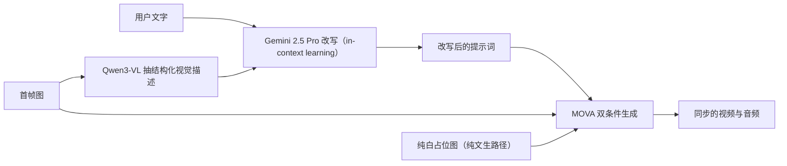
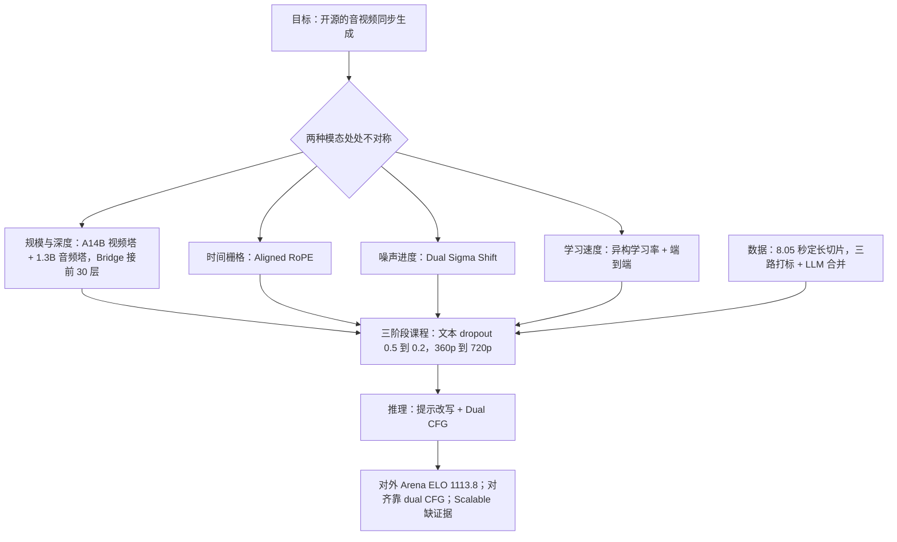

# MOVA：音视频同步生成，难的是两边处处不对称

<!-- release-date: 2026-01-29 -->

> 本文依据 SII-OpenMOSS 团队的 **MOVA: Towards Scalable and Synchronized Video–Audio Generation**，arXiv:2602.08794v2，2026-02-10，共 38 页。页码均指这份 PDF 的页码。文中区分三件事：**报告明确写了什么**、**我们如何解释或验算它**、**哪些是外部资料补充**（官方代码与权重配置）。

## 读前先认识几个词

- **级联（cascaded pipeline）**：先用视频模型生成画面，再用一个「看画面配音」的模型补声音，或者反过来。两个模型各跑各的，生成过程中互相看不见。
- **流匹配（flow matching）**：扩散模型的一种训练写法。从纯噪声出发走几十步到数据，网络每一步预测「往数据方向走的速度」。本报告的训练目标就是两个速度场的回归误差（PDF p. 3–4）。
- **潜变量与 VAE**：像素和波形都太大，先用自编码器（VAE）压成小张量再做扩散。压缩后时间轴上的每一格叫一个**潜帧**。MOVA 的音频侧是连续潜变量，没有码本、没有离散 token，这一点和音频理解类模型完全不同。
- **DiT 与 RoPE**：DiT 是把去噪网络做成 Transformer；RoPE（旋转位置编码）给每个位置乘一个旋转矩阵，使注意力只依赖两个位置的**差**。整段序列一起平移，注意力行为不变，这叫平移不变性。
- **CFG 与 NFE**：无分类器引导（Classifier-Free Guidance）在每一步把「带条件」和「不带条件」两次预测的差放大，让结果更贴条件。NFE（number of function evaluations）数的是每步要跑几次网络。
- **高噪专家与低噪专家**：视频塔来自 Wan2.2 的 A14B 版本，它的「MoE」不是按 token 路由，而是按噪声档位切：去噪前段（噪声大）走一套完整权重，后段走另一套（PDF p. 3，Figure 2 的 `high noise, t>δ` 与 `low noise, 0<t<δ` 标注）。
- **唇音同步与对齐指标**（PDF p. 13）：LSE-C 越高越好、LSE-D 越低越好，都由 SyncNet 算，量嘴型和声音是否对得上；DeSync 越低越好，是 Synchformer 预测的音画时间偏移；IB-Score 越高越好，是 ImageBind 联合嵌入上的语义对齐度；cpCER 越低越好，是多说话人场景下的最小置换字符错误率，同时考「说了什么」和「谁说的」。

## 一句话先说清

MOVA 是一个开源的「图 + 文 → 视频 + 音频」（IT2VA）生成模型，总参数 32B，推理时激活 18B（PDF p. 1）。它能生成带唇音同步的中英文多说话人语音、与画面事件对齐的音效和配乐，权重与训练、推理、LoRA 微调代码都公开（PDF p. 1–2）。

它要替代的是级联。报告对级联的批评有三条：成本更高、误差累积、质量下降（PDF p. 1）；根子在于顺序分解**忽略了双向影响**，采样过程中音频没法反过来影响画面，反之亦然（PDF p. 21）。能端到端联合生成的 Veo 3、Sora 2 以及后来的 Wan2.6、Kling Video 3.0、Seedance 2.0 全是闭源的（PDF p. 1–2），MOVA 的定位就落在这个空档里。

做法是把一个现成的强视频模型和一个自训的小音频模型并排放，中间加一座可训练的桥，让两边在每一步去噪里互相看。可两种模态在计算上几乎没有一处对称，报告的主体就是在每一处不对称上单独做一个决定：

| 不对称在哪 | 报告的处理 | 出处 |
|---|---|---|
| 规模与深度：视频塔 A14B、40 层，音频塔 1.3B、30 层 | 非对称双塔，2.6B 的 Bridge 只接前 30 层 | p. 3、p. 21 |
| 时间栅格：视频潜帧稀，音频潜帧密 | Aligned RoPE，把视频位置按帧率比换算到音频单位 | p. 4 |
| 噪声进度：两种模态对噪声调度的敏感度不同 | Dual Sigma Shift，两个独立时间步、两套 shift | p. 10 |
| 学习速度：新桥要快学，老塔要稳住 | 异构学习率，Bridge 用两倍 | p. 10 |
| 引导强度：文本条件与跨模态条件不是一回事 | Dual CFG，两个可以分开调的系数 | p. 11 |
| 损失权重：视频与音频两个速度场回归项 | 音频损失权重 0.2 | p. 30，Table 7 |

如果只记一句话：

> **把两个已经很强的单模态模型接起来，难点不在「接上」，而在接口两侧的量纲不一样。每一处量纲差都得有一个显式的旋钮，否则梯度会替你随便选一个。**

报告把联合生成比纯视频生成多出来的困难归成三条：需要细粒度的音视频联合打标流水线；两种模态**原生信息密度差异极大**，融合机制与效率都成问题；已有开源工作大多只在小架构、小数据上验证过，「联合模型能否随数据与规模持续变好」仍是开放问题（PDF p. 2）。这三条分别对应后文的数据、架构与训练，最后一条也是全文证据最薄的地方。

## 全景：两座现成的塔，中间焊一座桥

三个部件（PDF p. 3–4、p. 7）：

- **视频塔**：Wan2.2 I2V A14B，条件是「首帧图 + 文本」的预训练视频扩散模型；
- **音频塔**：自训的 1.3B 文生音频扩散模型，架构照搬 Wan2.1-1.3B，只把 $(f,h,w)$ 三维位置编码换成沿时间轴的一维位置编码，其余组件和深度都不动；
- **Bridge**：随机初始化，工作在两座 DiT 的隐状态层面。每个交互层加两块交叉注意力：一块把视频隐状态注入音频 DiT，一块把音频隐状态注入视频 DiT。

两个 VAE 拿来即用、**全程冻结**：视频侧用 Wan2.1 视频 VAE，音频侧用 HunyuanVideo-Foley 的 DAC 风格音频 VAE，音频是 48 kHz 单声道（PDF p. 3、p. 7）。报告给的设计目标是「用尽量小的额外代价，借两个强单模态模型实现同步生成」，塔的核心结构保持不动（PDF p. 4）。

### 32B 是怎么凑出来的

报告在摘要与结论里写 32B 总参数、18B 激活，并拆成 A14B 视频塔 + 1.3B 音频塔 + 2.6B Bridge（PDF p. 1、p. 21）；但同一页的相关工作里又自称「29B 双塔架构」（PDF p. 21）。

官方权重可以把账算清。MOVA-360p 仓库按目录存放 `video_dit`、`video_dit_2`（各 28.58 GB）、`dual_tower_bridge`（5.32 GB）、`audio_dit`（2.84 GB）等，按 bf16 每参数 2 字节折算，四个去噪部件是 14.29B、14.29B、2.66B、1.42B，合计约 32.7B；一步只跑一套视频专家，激活约 18.4B（外部补充，取自权重文件列表）。所以 **32B / 18B 自洽，「29B」是孤例**。顺带得到三个事实：两个噪声专家是**两份完整的独立权重**；Bridge 只有一份，两个专家共用；文本编码器 UMT5（11.36 GB，约 5.7B）与两个 VAE 都不在 32B 之内，实际显存占用比 32B 大。

2.6B 这个数本身也能从结构推出来。官方代码里 Bridge 的每块交叉注意力就是 $Q$、$K$、$V$、$O$ 四个线性层，$Q$ 与 $O$ 用本塔宽度，$K$、$V$ 从对面塔的宽度投影过来（外部补充）。一个交互层的两块合计：

$$
\underbrace{2\times5120^2 + 2\times1536\times5120}_{\text{音频注入视频}} + \underbrace{2\times1536^2 + 2\times5120\times1536}_{\text{视频注入音频}} \approx 8.9\times10^7
$$

乘以 30 个交互层约 2.66B，与权重文件一致（本文验算）。

### 深度不对称：多出来的 10 层

Figure 2 把视频塔画成两截：上面一段标 `30×`、带 Bridge CrossAttn，下面单独一段 `10×` 的 Video DiT Block，**没有** Bridge（PDF p. 3）。官方配置写明视频塔 40 层、音频塔 30 层，代码按「视频第 $i$ 层对音频第 $i$ 层」配对前 30 层（外部补充）。也就是说：前 30 层两边逐层互看，视频塔最后 10 层没有音频参与。

报告正文没有解释这个安排。我们的理解是：跨模态信息在前 30 层交换完，视频还剩 10 层把已经对齐好的内容渲染清楚，声音不必参与纯视觉的精修。代价是这 10 层的输出**无法再反过来影响音频**，如果嘴型细节在这里又变了，音频塔看不见。报告没有讨论这一点。

**可迁移的一条**：横向缝合两个深度不同的网络时，把多出来的层放在后面各自收尾，通常比放在前面各自预处理更稳——交互越早发生，后面越有层数去消化交互的结果。

## 第一处矛盾：两条时间轴的刻度不一样

**旧问题。** 两种模态过完各自的 VAE，落在两套完全不同的时间栅格上：视频 VAE 在时间轴上下采样，潜变量很稀；音频潜变量密得多（PDF p. 4）。直接拿各自的序号 0、1、2…… 编 RoPE，报告写得很具体：代表同一物理时刻的 token 会被分到不同位置，不同时刻反而可能拿到相邻位置，于是 query 与 key 的物理时间错位，造成**音画漂移**；这种错配还**破坏了交互过程的平移不变性**（PDF p. 4）。

后一句更要命。RoPE 的价值在于注意力只看位置差；可两边的「差 1」单位不同，视频差 1 是六分之一秒，音频差 1 是五十分之一秒。平移不变性一丢，模型就得为每个绝对位置分别学一遍对齐关系。

**新设计。** 设 $f_v$、$f_a$ 为两种模态过 VAE 之后的潜帧率，取比值 $s = f_a / f_v$，位置索引改为（PDF p. 4）：

$$
p_v(i) = s \cdot i, \qquad p_a(j) = j
$$

$i$ 是视频潜帧序号，$j$ 是音频潜帧序号。音频刻度不动，视频第 $i$ 帧改称「第 $s \cdot i$ 个音频时间单位」。报告说这个做法与 MMAudio、Ovi 类似（PDF p. 4），不是本篇原创。

**收益。** 交叉注意力里的位置差重新有了统一的物理含义，平移不变性恢复。

**代价与边界**（本文的判断）：

- 报告**没有给出 $f_v$、$f_a$ 或 $s$ 的任何数值**，也没给两个 VAE 的压缩比。官方配置补上了这一块：音频潜变量每秒 50 帧，视频 24 fps、VAE 时间步长 4，每秒 6 帧，$s \approx 8.33$（外部补充）。代码里这个 4 是写死的，注释标着 FIXME。
- $s$ 由 VAE 决定。换视频 VAE 或改帧率，Bridge 学到的位置关系就要重新适配。
- $s$ 一般不是整数，视频 token 的位置落在两个音频格点之间。RoPE 接受连续位置，原理上没问题。

**可迁移的一条**：任何要把两种采样率不同的序列放进同一个注意力的场景（多模态、多传感器、日志与指标联合建模），第一件事不是设计融合结构，而是**先把位置编码换算到同一个物理单位**。

## 第二处矛盾：两种模态该在哪个噪声档位使劲

**旧问题。** 常规联合扩散让视频和音频**共用同一个时间步**。报告认为这可能是次优的：两种模态的有效复杂度不同，音频每秒 token 少得多，可音色保真对噪声调度极其敏感；同一个噪声档位可能对一边太猛、对另一边太温和，造成**梯度失衡**（PDF p. 10）。

**新设计：Dual Sigma Shift。** 训练时两个时间步 $t_v$、$t_a$ 各自从 $\mathcal{U}(0,1)$ 独立抽取（PDF p. 10，公式 4）：

$$
z_v^{t_v} = (1-\sigma_v(t_v))\, z_v^0 + \sigma_v(t_v)\, \epsilon_v, \qquad
z_a^{t_a} = (1-\sigma_a(t_a))\, z_a^0 + \sigma_a(t_a)\, \epsilon_a
$$

$t$ 是均匀抽出来的「进度」，$\sigma(t)$ 是这一步实际的噪声比例，由一个 shift 参数控制。标准写法（也是官方代码的写法）是

$$
\sigma_m(t) = \frac{\mathrm{shift}_m \cdot t}{1 + (\mathrm{shift}_m - 1)\, t}, \qquad m \in \{v, a\}
$$

shift = 1 时 $\sigma = t$，不做重分配；shift > 1 时同一个进度对应更高的噪声，等于把更多训练样本推到高噪声一端。shift = 5 在 $t = 0.5$ 处 $\sigma = 2.5/3 \approx 0.83$。报告把 5 称为 aggressive、1 称为 gradual（PDF p. 10）。

报告 p. 10 印出的分母是 $\mathrm{shift}_m + t(1-\mathrm{shift}_m)$，这是笔误：照它算，shift = 5 时 $t > 5/9$ 就有 $\sigma > 1$，$t = 1$ 时 $\sigma = 5$。两种写法只在 $t = 0.5$ 处恰好相等。上图右半按标准式重算的 20 个采样点与原图 Figure 4(c) 的点位吻合，印出的写法则对不上（本文验算）。

报告给的好处有两条：每种模态走自己的去噪轨迹；推理时可以不重训就改调度（PDF p. 10）。实际怎么用：

| 阶段 | $\mathrm{shift}_v$ | $\mathrm{shift}_a$ | 报告给的理由 |
|---|---:|---:|---|
| Phase 1 | 5.0 | 1.0 | 视频激进去噪，音频过渡平缓，求稳 |
| Phase 2 | 5.0 | 5.0 | 高保真音色对噪声调度与步数敏感，把音频对齐到视频的激进调度 |
| Phase 3 | 5.0 | 5.0 | 沿用 |

（PDF p. 9、p. 30 Table 7。）报告特意点出，Phase 2 的改动不需要动架构，只改一个参数（PDF p. 9）。

**Figure 4(c) 与正文之间有一处张力。** 原图把两条曲线分别标成 `Disentangled, Balanced Denoise`（$v=5, a=1$）和 `Normal, Unbalance Denoise`（$v=a=5$），图顶写着 `Token: Video >> Audio`（PDF p. 8）。按图面读，作者的意思是视频 token 远多于音频，共用一套 shift 反而不平衡。可 Phase 2–3 实际采用的正是被标成 Unbalance 的对角线。报告没有调和这两处。一个不违背原文的读法是：图说明的是**机制上有了这个自由度**，Phase 2 的选择说明**这个自由度的最佳取值最后落回了对称**；这只是我们的读法。

**报告自己给的深层解释**（§7.1，PDF p. 19）。音视频同步在「谁条件谁」上本身就分裂：撞击、切镜、打击这类事件天然是视频 → 音频，画面决定声音什么时候响；语音驱动（配音、虚拟人、说话头像）则是音频 → 视频，音轨固定、画面去适配。扩散形式下 $\sigma_v$、$\sigma_a$ 是预定义、不可学习的先验，音频流的相对损坏程度被设计固定死了，而视觉流的有效不确定性会随目标在画面中的尺度大幅变化（这里引用 Stable Diffusion 3 的观察）。于是同一套全局调度会**隐式偏置条件方向**：唇部特写时视觉潜变量信息足，过程更像视频 → 音频；说话人只占一小块时视觉证据不确定，过程会滑向音频 → 视频，让语音当时间锚。

这一段把一个看似纯超参的东西解释成随画面内容自动切换的行为，是全篇最有启发的分析。但它**没有任何实验**，报告没做「特写对远景」的对照。

**可迁移的一条**：双向耦合的生成系统里，「谁给谁当条件」往往不是架构里显式写下的，而是由两侧的相对信噪比隐式决定的。想控制方向，可以先去调两侧的噪声水平。

## 第三处矛盾：新桥要快学，老塔要稳住

### 先把音频塔单独练出来

联合训练之前，音频塔先从零练成一个文生音频模型（PDF p. 7）：Wan2.1-1.3B 骨干、一维时间位置编码；数据三个域，通用音效来自 WavCaps 与 VGGSound，音乐来自 JamendoMaxCaps，语音来自自有 TTS 数据；定长片段训练，每段文本提示里带一个**显式的时长 token** 控制目标长度。照搬视频模型的架构去做音频，理由是**和视频塔对齐、最大化复用工程与训练实践**（PDF p. 7）：不追求音频侧最优，只求两边同构。

AudioCaps 上的成绩（PDF p. 9，Table 2）：

| 模型 | 参数 | NFE | FD openl3 ↓ | KL passt ↓ | CLAP ↑ | IS ↑ |
|---|---:|---:|---:|---:|---:|---:|
| TangoFLUX | 516M | 50 | 80.47 | 1.02 | 0.546 | 13.28 |
| AudioLDM2 | 346M | 200 | 72.04 | 1.66 | 0.409 | 7.79 |
| MOVA 音频塔 | 1.3B | 100 | 72.25 | 1.47 | 0.463 | 10.54 |

AudioBox 感知评测上它在 CU（5.56）与 PQ（6.20）两项最高，CE、PC 不领先（PDF p. 9，Table 3）。报告自己的措辞是 competitive（PDF p. 8），这个用词准确：参数是对手的 2.5–4 倍，FD 与 AudioLDM2 基本持平，CLAP 与 IS 都低于 516M 的 TangoFLUX（本文从表中读）。这也预告了 §7.3 承认的限制：音频塔容量是系统短板。另有一处小出入：正文把 CU 写成 Consistency（PDF p. 8），附录过滤表写的是 Content Usefulness（PDF p. 33）。

### 从第一步起就端到端，但给两组参数不同的学习率

把随机初始化的新模块接到两个预训练模型之间，常规做法是两段式暖启动：先冻住两塔只训 Bridge，再解冻整体微调。报告说他们早期试过，结果**早早撞上性能平台**，这才改成从第一步就端到端联合优化（PDF p. 10）。这条负面结果只有一句话，没有数据。

端到端之后矛盾换了形式：Bridge 要快速学会跨模态对应，两座大塔要稳住、别忘掉单模态先验。解法是**异构学习率**：Bridge $2\times10^{-5}$，两塔骨干 $1\times10^{-5}$（PDF p. 10、p. 30）。报告说统一学习率要么太高把塔训崩，要么太低让 Bridge 训不动（PDF p. 10），同样没有消融数字。

**可迁移的一条**：冻结等于把学习率设成 0，而 0 与 1 之间还有很大空间。往预训练模型上接新模块时，按「这组参数离收敛有多远」分学习率，比冻结再解冻的调度更平滑。

### MoE 遇上 FSDP：奇偶步交替

标准 FSDP 要求每一步的计算图一致。A14B 视频塔有两套按噪声档位切换的专家，同一个 batch 里若有的样本抽到高噪声、有的抽到低噪声，一步里就要走两条计算图。解法是按步交替：奇数步所有样本都抽高噪声时间步、只优化高噪声 DiT；偶数步都抽低噪声、只优化低噪声 DiT；共享的 Bridge 和音频塔**每一步都更新**（PDF p. 11）。

**可迁移的一条**：分布式框架对计算图一致性有硬要求时，把「样本级分支」改成「步级分支」往往最省事，代价是每个分支的有效步数减半。

### 三个阶段的课程

联合训练按数据与分辨率分三个阶段推进（PDF p. 9–10，p. 30 Table 7）：

| | Phase 1 | Phase 2 | Phase 3 |
|---|---|---|---|
| 分辨率 | 360×640 | 360×640 | 720×1280 |
| 帧数 | 193 | 193 | 193 |
| 数据 | 约 61,500 小时，来源多样 | 约 37,600 小时（16.8M 条），质量过滤 | 约 11,000 小时，720p 最高质量子集 |
| 批大小 / CP | 128 / 8 | 128 / 8 | 64 / 16 |
| 学习率（骨干 / Bridge） | 1e-5 / 2e-5 | 1e-5 / 2e-5 | 1e-5 / 2e-5 |
| 权重衰减 | 0.001 | 0.001 | 0.001 |
| $\mathrm{shift}_v$ / $\mathrm{shift}_a$ | 5.0 / 1.0 | 5.0 / 5.0 | 5.0 / 5.0 |
| 文本 dropout | 0.5 | 0.2 | 0.2 |
| 音频损失权重 | 0.2 | 0.2 | 0.2 |
| LUFS 响度归一化 | 否 | 是 | 是 |
| 时长 / checkpoint 间隔 | 15 天 / 5000 步 | 7 天 / 5000 步 | 20 天 / 2000 步 |

三个阶段都跑 1 个 epoch、都用 1024 张卡。表里有四个设计值得拆开：

**文本 dropout 从 0.5 降到 0.2。** Phase 1 一半样本看不到文字，报告给的目的是「逼模型依靠 Bridge 学对齐」（PDF p. 9）：要知道声音该配什么画面，只能去问对面那座塔。跨模态通路建起来之后，Phase 2 再降到 0.2，让文本回来精修语义，同时保住已学到的跨模态先验。**这是全篇最值得直接抄走的一招：想让一条新通路真正被用起来，最直接的办法是暂时关掉它的竞争通路。** 文本若一直都在，模型完全可以靠文本同时解释画面和声音，Bridge 就成了摆设。

**音频损失权重 0.2。** 训练目标是两个速度场的加权回归（PDF p. 4，公式 3）：

$$
\mathcal{L}_{\mathrm{FM}} = \mathbb{E}\left[\lambda_v \left\|\hat v^{v}_{\theta}(x^v_t, x^a_t, t, c) - v^v_t\right\|^2 + \lambda_a \left\|\hat v^{a}_{\theta}(x^v_t, x^a_t, t, c) - v^a_t\right\|^2\right]
$$

$v^v_t = \epsilon^v - x^v$、$v^a_t = \epsilon^a - x^a$ 是两条插值路径的目标速度（PDF p. 4，公式 2）。注意两个预测**都同时吃两种模态的含噪潜变量**，这就是「跨模态速度场」的形式化写法，也是它与级联的根本区别：级联里音频的预测函数根本没有 $x^v_t$ 这个自变量。Table 7 只给了 $\lambda_a = 0.2$（PDF p. 30），$\lambda_v$ 没写。另外，公式 (1)–(3) 用的是同一个 $t$，§4.4 的公式 (4) 用的是独立的 $t_v$、$t_a$，§2.1 没有随之修订，读的时候以 §4.4 为准。

**LUFS 归一化是为了灭火。** Phase 2 引入响度归一化，用来缓解 **CFG 引起的响度爆炸**（PDF p. 9）。CFG 把条件与无条件的差外推放大，在音频上直接表现为音量失控。同一个技巧在两种模态上副作用不同，这是一个干净的例子。

**Phase 3 只升分辨率。** 面积变成 4 倍，序列跟着变长，CP 从 8 提到 16，批大小从 128 降到 64；checkpoint 间隔收紧到 2000 步，报告的理由是「捕捉快速收敛」（PDF p. 10）。顺带一个算术：两段配置里 $1024 / \mathrm{CP}$ 恰好等于批大小（$1024/8 = 128$、$1024/16 = 64$），即每个 CP 组每步处理一条样本（本文验算）。

### 算力与效率

- 1024 张卡（128 节点 × 8 卡），总训练 42 天，约 43,000 GPU-days（PDF p. 10）。$15 + 7 + 20 = 42$，$1024 \times 42 = 43{,}008$，对得上（本文验算）。报告**没有说这 1024 张是什么卡**，总成本无法折算。
- FSDP 分片参数，USP 做序列并行，约 35% MFU（PDF p. 10、p. 21）。
- **VAE 只算一次再广播**：序列并行会让同一 CP 组里每张卡各跑一遍 VAE。沿用 Wan 的做法，每个 CP 组每步只做一次输入预处理，再从指定 rank 广播给组内其余 rank（PDF p. 10）。
- 手动内存管理，规避 OpenSora2 报告过的 Python 垃圾回收开销（PDF p. 10），结论里称作 scheduled garbage collection（PDF p. 21）。
- 训练栈移植到昇腾 NPU，对注意力、张量布局变换、旋转位置编码做了算子融合。8 卡 910A2（CP=4、DP-shard=2）实测每步 34.1 秒，FP16 算力 376 TFLOPs，单卡显存约 40 GB，主机内存不少于 128 GB；报告声明这个数依赖软件栈版本，**不应被当成规模化训练成本的完整陈述**（PDF p. 10、p. 30 Table 8）。

## 数据：从原始视频到 8.05 秒的带字幕片段

三阶段流水线（PDF p. 5，Figure 3；p. 5–7）：

| 阶段 | 做什么 | 关键工具 |
|---|---|---|
| Stage 1 视频预处理 | 去掉解码失败或无音轨的样本；裁黑边后居中、缩到 720p、补边到 9:16 或 16:9；重采样到 24 fps；按语音活动与场景切换切成 8.05 秒定长片段 | Ray、FFmpeg cropdetect、Silero VAD、PySceneDetect |
| Stage 2 质量评估 | 音频质量、视频质量、音画对齐三个维度过滤 | Audiobox-aesthetics、DOVER、SynchFormer、ImageBind、EAT |
| Stage 3 联合打标 | 视觉、语音、非语音各自打标，再用 LLM 合并成一段描述 | MiMo-VL-7B-RL、Qwen3-Omni-Instruct / Captioner、GPT-OSS-120B |

数据源是 VGGSound、AutoReCap、ChronoMagic-Pro、ACAV-100M、OpenHumanVid、SpeakerVid-5M、OpenVid-1M 的高质量子集，加上大量自有数据（PDF p. 6）。结论一节说总共整理了 **10 万小时以上**的细粒度音视频数据（PDF p. 21）。

### 漏斗与 8.05 秒

| 环节 | 相对原始视频的时长保留率 |
|---|---:|
| Stage 1（语音 + 非语音） | 84.57% |
| Stage 1（只保留语音） | 58.75% |
| Stage 2 之后 | 26.39% |

（PDF p. 5，Table 1。）正文说最终只有语音片段进入训练，占全部预处理片段的 69.47%（PDF p. 6）。$58.75\% / 84.57\% = 69.47\%$，所以这个比例是**相对 Stage 1 输出**而不是相对原始视频的（本文验算）。

片段一律 8.05 秒：24 fps 下是首帧加 8 秒，即 $1 + 8\times24 = 193$ 帧（PDF p. 6）。定长省掉了 padding 与变长注意力的麻烦；193 帧还让时间下采样 4 倍的视频 VAE 恰好得到 $1 + 192/4 = 49$ 个潜帧（VAE 步长是外部补充）。代价是模型只会生成 8 秒，更长内容报告没有讨论。

切窗有两套算法（PDF p. 30–32，Algorithm 1–2）。多镜头版沿着 VAD 找到的语音段推进，窗口起点的下界取三者最大值：上一段语音的结束、当前语音之前最近的场景切点、当前语音开始往前半个窗口；在这个区间里随机取起点，**只保留跨越至少一个场景切点的窗口**。单镜头版改为遍历场景区间，窗口不许越过场景边界。两者的共同约束是：不从别人话说到一半的地方开始，贴着场景边界走，起点随机等于免费的数据增强。分两套的用意报告没有明说；我们的理解是多镜头样本教模型切镜时保持声音连续，单镜头样本教模型在连续镜头里把嘴型跟准。

### 过滤阈值

| 维度 | 指标 | 阈值 |
|---|---|---|
| 音频质量 | 静音比例 / 带宽 | < 0.8 / > 1,000 Hz |
| | Audiobox PQ / CU / CE | > 5.0 / > 4.5 / > 2.5 |
| 视频质量 | DOVER 美学 / 技术 | > 0.85 / > 0.05 |
| 音画对齐 | IB-Score **或** DeSync | ≥ 0.2 或 ≤ 0.5 |

（PDF p. 33，Table 9。）阈值是人工查看不同截断下留下的视频后定的（PDF p. 6）。对齐一栏用的是**宽松的逻辑或**，目的是让语义相关的环境音和时间同步的语音与动作两类样本都能留下（PDF p. 33）。这条很值得记：语义对齐与时间对齐是两种不同的「对齐」，雨声和雨景语义相关却没有时间锚点，脚步声和迈步时间严丝合缝却未必被 ImageBind 认成一回事，用「与」会把两类都误杀。

语音子集用 EAT 分类模型构造，字面要求 Speech 与 Singing 两个标签**都为真**（PDF p. 33）。这与 §7.3 承认唱歌表现差（PDF p. 20）读起来有出入，报告没有解释这个条件的意图。

Phase 2 又在上面加了三道筛子（PDF p. 9）：OCR 判定无烧录字幕，留下约 9.5M 条，并**在这些样本的提示词后追加一句 This video has no subtitles.** 教模型区分两种情况；LSE-D ≤ 9.5 且 LSE-C ≥ 4.5，留下约 2.5M 条唇音对应好的；DOVER 技术分 > 0.15，留下约 2.4M 条视觉保真高的。最终 16.8M 条、约 37,600 小时。$16.8\text{M} \times 8.05\ \text{s} \approx 37{,}567$ 小时，与总时长对得上；但三个子集相加只有 14.4M，报告没说它们是并集、有交叠还是另有来源（本文验算）。Phase 3 的阈值是 DOVER 技术分 > 0.14（PDF p. 10），比 Phase 2 还低，报告没有解释。

加字幕标注那一招的价值在于：烧录字幕在训练数据里躲不掉，与其指望过滤干净，不如**把这个属性显式写进条件**，推理时用户就能用提示词要求不要字幕。无法根除的数据偏差，变成一个可控的条件变量。

### 打标：分头取证，集中合并

视觉用 MiMo-VL-7B-RL，提示里明确要求关注镜头转场；语音用 Qwen3-Omni-Instruct 逐字转写；非语音与音乐用 Qwen3-Omni-Captioner 描述；最后 GPT-OSS-120B 合并，并做一致性检查化解跨模态冲突（PDF p. 7）。附录 A.5 逐字给出了四条提示词和一个完整样例（PDF p. 33–37），合成一条训练字幕的分工是这样的：

| 字段 | 谁产出 | 提示词里的硬规则 | 样例里长什么样（据 PDF p. 36–37 样例节选改写，不是语料原文） |
|---|---|---|---|
| 视觉描述 | MiMo-VL | 三条 LAW：只写视觉上可验证的东西，不许凭音频或上下文推断；没有视觉变化就输出 null；检测所有出现、消失、移动的元素。另有一栏逐字抄画面文字 | 打印机墨盒仓特写，一只手把黑色墨盒推进空槽，屏幕提示关闭墨盒门；镜头在特写与办公室全景之间切换 |
| 语音转写 | Qwen3-Omni-Instruct | 三条 LAW：保留原语言、不翻译；换说话人或语气就另起一个事件；无语音输出 null；听不清写 `[inaudible]` | 一段英文旁白的逐字转写，最后一句被截断 |
| 音频描述 | Qwen3-Omni-Captioner | 只有一句「详细描述你听到的音频」 | 一位男声旁白、语气平稳，背景是低音量的电子配乐，录音棚干声 |
| 合并字幕 | GPT-OSS-120B | 先写画面叙事；台词只能取自语音转写、说话人特征取自音频描述、视觉锚点取自视觉描述；非语音声音另起一句「The audio includes…」；各段不重复 | 一段连贯叙述：画面动作在前，台词作为带引号的对白嵌进去并挂到画外男声上，最后一句交代背景音乐 |

两个打标提示词的输出格式里都带一个 `final_verification_audit` 字段，让模型自己声明幻觉检查通过（PDF p. 34–35）。

为什么拆成三路再合并，报告只说这样覆盖更全、减少信息损失（PDF p. 7）。我们的理解是：三种信息的错误模式完全不同，让一个全模态模型一次看完，它最容易用一种模态去补另一种的空白，看见嘴在动就编一句台词。拆开之后「只写看得见的」这种规则才可执行，合并阶段拿到的是三份互相独立的证据。**多模态标注要防的不是标得不够细，而是跨模态互相编。**

## 推理：Dual CFG 与提示词改写

### 联合生成里其实有两种条件

报告的切入点（PDF p. 11）：把一对音视频看成一个联合潜变量，唯一显式的条件是文本；但从单一模态的视角看，另一种模态也在给条件——预测视频时音频是条件，反之亦然。于是**文本引导的强度**和**跨模态引导的强度**可以分开调。

参照 InstructPix2Pix 的 dual CFG，把联合后验按贝叶斯规则分解，$c_T$ 是文本，$c_B$ 是 Bridge 交互带来的跨模态信息（PDF p. 11，公式 5）：

$$
P(z \mid c_T, c_B) = \frac{P(c_T \mid c_B, z)\, P(c_B \mid z)\, P(z)}{P(c_T, c_B)}
$$

取对数梯度再套 CFG 缩放，得到（公式 6）：

$$
\tilde v_\theta = v_\theta(z_t, \varnothing, \varnothing) + s_B\left[v_\theta(z_t, \varnothing, c_B) - v_\theta(z_t, \varnothing, \varnothing)\right] + s_T\left[v_\theta(z_t, c_T, c_B) - v_\theta(z_t, \varnothing, c_B)\right]
$$

第一项是两个条件都关掉的基线，其中「no-bridge」表示禁用跨模态注入；第二项是只打开 Bridge 带来的增量，乘 $s_B$，放大跨模态对齐；第三项是在 Bridge 开着的基础上再打开文本的增量，乘 $s_T$，放大文本遵循。三种用法（PDF p. 11）：

| 配置 | 参数 | NFE | 报告给的特点 |
|---|---|---:|---|
| Dual CFG（通式） | $s_B$、$s_T$ 各自取值 | 3 | 对齐与质量的取舍最灵活 |
| 纯文本 CFG | $s_B = 1$，$s_T = s$ | 2 | Bridge 在两个分支里都开着，语义保真高，时间同步弱 |
| 文本 + 模态 CFG | $s_B = s_T = s$ | 2 | 无条件分支关掉 Bridge，同步更强、唇音更准 |

把 $s_B = 1$ 代进公式 6，前两项合并成 $v_\theta(z_t, \varnothing, c_B)$，剩下的正是标准文本 CFG；$s_B = s_T$ 时中间那一项被消掉，只剩两次前向（本文代入验算，报告只给结论）。

**为什么选这个分解顺序**（§7.2，PDF p. 19–20）。后验也可以反过来分解成 $P(c_B \mid c_T, z)\,P(c_T \mid z)\,P(z)$。报告选现在的顺序是为了实用：它能干净地退化成纯文本 CFG，调 $(s_B, s_T)$ 就能在「纯文本 CFG」和「文本 + 模态 CFG」之间连续插值，采样流程不用改；反过来的分解里，没有任何一组权重能让 Bridge 在两个文本分支里行为一致、同时又产生标准的文本 CFG 差项。**推导有多种等价写法时，选能退化回熟悉特例的那一种**，新方法就成了旧方法的严格超集，上线可以从 $s_B = 1$ 起步逐步加大。

### 生成工作流：先改写提示词

按 PDF p. 12 Figure 5 重画，只表示数据流向。纯文生路径跳过 Qwen3-VL，用户文字直接进改写，首帧换成一张白图。

报告说这条流水线的**首要目标就是提示词增强**，因为用户原始输入往往缺少描述细节，而模型的表现与提示质量紧密相关（PDF p. 11–12）。第一步用 Qwen3-VL 从首帧抽结构化描述，限定四类：视觉风格（配色、光线）、摄影（景别、取景、构图）、视觉元素（主体与空间关系）、画面文字（原样保留）；第二步用 LLM（例如 Gemini 2.5 Pro）把用户文字与这份描述合成生成提示，原则是**保留描述里的静态属性、注入用户文字里的时间动态**，并用 in-context learning 让输出贴合训练数据的叙述风格；第三步 MOVA 用改写后的提示加首帧做双条件生成（PDF p. 12）。后面的内部 Arena 会显示，这一步在人评上的作用比很多模型侧改动都大。

## 实验：赢在哪、输在哪

### 基准与指标

- **Verse-Bench**：600 对图文提示，来自 UniVerse-1。它本不是为音视频联合生成设计的，报告用 GPT-5 把视觉描述与音频描述统一成一条提示（PDF p. 12）。
- **自建 benchmark**：从真实视频抽首帧与提示，分六类场景：多说话人、电影叙事、体育、游戏直播、镜头运动、动漫（PDF p. 13、p. 37–38）。Figure 6(a) 的类别占比是镜头运动 22.7%、多说话人 20.5%、动漫 / 体育 / 游戏各 15.2%、电影 9.1%、其他 2.3%；Figure 6(b) 的提示长度均值是英文 103.3 词、中文 134.4 字（PDF p. 13）。图注没说是哪个数据集的分布，但各比例乘以 132 都恰好得到整数（30、27、20、20、20、12、3），应当就是自建的那 132 条（本文验算）。
- 基线：联合生成的 LTX-2、Ovi，以及级联的 WAN2.1 + MMAudio，统一在 720p、用各自推荐配置（PDF p. 14）。

### 客观指标

| 模型 | $s_B$ | IS ↑ | DNSMOS ↑ | DeSync ↓ | IB-Score ↑ | LSE-D ↓ | LSE-C ↑ | cpCER ↓ |
|---|---:|---:|---:|---:|---:|---:|---:|---:|
| LTX-2 | – | 3.066 | 3.635 | 0.451 | 0.213 | 7.261 | 6.109 | 0.220 |
| Ovi | – | 3.680 | 3.516 | 0.515 | 0.190 | 7.468 | 6.378 | 0.436 |
| WAN2.1 + MMAudio | – | 4.036 | – | **0.260** | **0.317** | – | – | – |
| MOVA-360p | 1.0 | **4.269** | **3.797** | 0.475 | 0.286 | 8.098 | 6.278 | 0.177 |
| MOVA-360p w/ dual CFG | 3.5 | 4.169 | 3.674 | 0.351 | 0.315 | **7.004** | **7.800** | 0.247 |
| MOVA-720p | 1.0 | 3.936 | 3.671 | 0.485 | 0.277 | 8.048 | 6.593 | **0.149** |
| MOVA-720p w/ dual CFG | 3.5 | 3.814 | 3.751 | 0.370 | 0.297 | 7.094 | 7.452 | 0.218 |

（PDF p. 14，Table 4，粗体与原表一致。IS 与对齐指标在 Verse-Bench 全部子集上评，DNSMOS 与唇音指标在 set3 上评，cpCER 在多说话人子集上评。）

读表要知道五件事：

1. **音频质量**：MOVA-360p 的 IS 与 DNSMOS 全表最高。级联基线 IS 也有 4.036，但报告说它**不具备生成可懂语音的能力**（PDF p. 15），所以语音相关的四列是空的。这是级联路线最硬的短板：配音模型学的是给画面配音效，不是让人说话。
2. **对齐**：开 dual CFG 的 MOVA-360p DeSync 0.351、IB-Score 0.315，明显好过 LTX-2 与 Ovi；但级联基线在两项对齐上仍占先（0.260、0.317）。报告承认 DeSync 这一条，并说 MOVA「在时间和语义两个指标上都几乎追平」（PDF p. 15），数字支持这句话。
3. **对齐主要靠 dual CFG**：不开 dual CFG 时，MOVA 的 DeSync（0.475）输给 LTX-2（0.451），LSE-D（8.098）输给两个联合基线。报告「MOVA 变体，尤其是带 dual CFG 的，在这一类上占优」的说法字面没错，但容易被读成整个模型都占优。
4. **一处配对错位**：报告说 IB-Score 相对 Ovi 有「约 50% 的提升」，引的却是 0.315；$0.315/0.190 \approx 1.66$，50% 对应的是不开 dual CFG 的 0.286（本文验算）。
5. **dual CFG 的代价**：开了之后 cpCER 反而升高（360p 从 0.177 到 0.247，720p 从 0.149 到 0.218）。报告的解释是 dual CFG 把引导强度重新分配到多个分支上，**稀释了文本条件的相对权重**，模型对 `[S01]`、`[S02]` 这类说话人标签的遵循变差（PDF p. 15）。720p 的 cpCER 比 360p 低，报告归因于 720p 在 360p 基础上继续训练、见过更多多说话人样本（PDF p. 15）。

### $s_B$ 的消融：一条可以按场景挑点的取舍曲线

| $s_B$ | IS ↑ | DNSMOS ↑ | DeSync ↓ | IB-Score ↑ | LSE-D ↓ | LSE-C ↑ | cpCER ↓ |
|---:|---:|---:|---:|---:|---:|---:|---:|
| 1.0 | 4.269 | **3.797** | 0.475 | 0.286 | 8.098 | 6.278 | **0.177** |
| 2.0 | 4.222 | 3.748 | 0.421 | 0.305 | 7.323 | 7.331 | 0.185 |
| 3.0 | **4.319** | 3.686 | 0.388 | 0.312 | 7.014 | 7.774 | 0.188 |
| 3.5 | 4.169 | 3.674 | **0.351** | 0.315 | 7.004 | 7.800 | 0.247 |
| 4.0 | 4.225 | 3.631 | 0.365 | **0.316** | **6.957** | **7.891** | 0.264 |

（PDF p. 16，Table 5，基座 MOVA-360p，粗体与原表一致。）

逐列看：LSE-D、LSE-C、IB-Score 随 $s_B$ 单调变好；DNSMOS、cpCER 单调变差；DeSync 在 3.5 处最低，到 4.0 回升；IS 来回跳，没有趋势（本文逐列核对）。正文说「$s_B$ 到 4.0 时 LSE-C 达到峰值 7.891，DeSync 也被最小化到 0.365」，还说 DeSync「一致下降」（PDF p. 17）——LSE-C 那半句对，DeSync 的最小值却是 3.5 处的 0.351，同一张表就能看出来。

报告把这个取舍叫**条件干涉（conditional interference）**：$s_B$ 过高时同步的几何约束压过语音信号本身的生成保真，这种「过度正则化」降低了模型对文本指令的敏感度，于是更在意语音怎么和画面对齐，牺牲了说了什么、说得自然不自然（PDF p. 17）。这张表给的不是一个推荐值，而是一条曲线：做配音和虚拟人，同步优先，往 3.5 走；做多说话人对话，内容与身份优先，就往 1.0–2.0 退。

### 涌现的纯文生能力

| 模型 | IS ↑ | DNSMOS ↑ | DeSync ↓ | IB-Score ↑ | LSE-D ↓ | LSE-C ↑ | cpCER ↓ |
|---|---:|---:|---:|---:|---:|---:|---:|
| MOVA-360p | 4.269 | **3.797** | 0.475 | **0.286** | **8.098** | **6.278** | **0.177** |
| MOVA-360p-T2VA | **4.370** | 3.767 | **0.441** | 0.281 | 8.362 | 5.830 | 0.188 |

（PDF p. 18，Table 6。）模型只训过带首帧的任务，把参考图换成空占位之后仍能生成同步内容，而且 IS 更高、DeSync 更低（PDF p. 17）。报告的解释是：没有参考图的结构约束，模型能更自由地探索联合音视流形；唇形相关的 LSE-C、LSE-D 小幅下降，因为占位图不提供唇部几何（PDF p. 17）。**条件既是信息也是约束**，当条件与目标不完全一致时，去掉它可能在那个目标上反而更好。

### Arena 人评

评测设置（PDF p. 13–14、p. 17）：732 条样本，600 条来自 Verse-Bench、132 条来自自建 benchmark，其中 Verse-Bench 原本只有英文的语音数据有一半被人工译成中文；每次对比让人在提示遵循、音画同步、唇音准确、视频质量、音频与语音保真五个维度上选更好的一条；标准 ELO，初始 1000、K 因子 4、logistic scale 400、底数 10，1000 次 bootstrap；共收集 5,000 多张有效票；所有模型都用各自官方的提示改写方法。

| 模型 | ELO | 对 MOVA-720p 的战绩（MOVA 胜 / 平 / 负） |
|---|---:|---|
| MOVA-720p | 1113.8 | — |
| LTX-2 | 1074.1 | 51.5% / 11.4% / 37.1% |
| Ovi | 925.4 | 70.3% / 13.9% / 15.8% |
| WAN2.1 + MMAudio | 886.9 | 71.9% / 11.6% / 16.4% |

（PDF p. 18，Figure 8，数值读自图上标注。）对两个较弱的对手是压倒性的，对 LTX-2 赢但没有拉开。

图引自 PDF p. 16 Figure 7。报告从这张图读出两件事（PDF p. 17–18）：提示词改写至关重要（1025.3 对 982.9），以及 dual CFG 虽然改善了客观对齐指标，人评却略降（1025.3 到 1014.5），原因同样是文本引导的相对权重被稀释。

图里还有两件报告没提的事。其一，**不做改写时，360p（1004.0）排在 720p（982.9）前面**，与 §6.2.2「720p 缩放很成功」的调子有张力，报告没有讨论。其二，**五个配置的 95% 置信区间大量重叠**：最高那根的下沿约 994，最低那根的上沿约 1005（从误差棒读出）。这张图上的排序在统计上并不显著，包括「改写涨 42 分」这一条。这不等于改写没用，只说明这次内部 Arena 的票数不足以把五个配置分开；对外基线那组的 ELO 差距大得多，结论也稳得多。

### 唇音同步的训练进程，与缺席的规模实验

图引自 PDF p. 19 Figure 9，是全文唯一一张训练曲线。

§6.3 先把问题界定清楚：「切水果」「敲鼓」这类离散事件只需对准少数几个起始点，**语音却要求嘴型与音素在长时间跨度上连续、细粒度地对应**（PDF p. 18）。报告接着下了一个强判断：光有 Bridge 这类架构机制不够，模型必须从数据里学到音素到视素的映射，这需要更大的容量和更多样本（PDF p. 18）。

它对三个阶段的因果解释是（PDF p. 18–19）：Stage 1 的激进视频去噪、平缓音频去噪、高文本 dropout 逼模型靠跨模态桥接学对齐，基本同步模式很快建立；Stage 2 对齐两条噪声调度让跨模态注意力更稳，降 dropout 精修语义，加响度归一化，LSE-C 出现明显跃升；Stage 3 在同步结构已稳的前提下才把容量分给更高分辨率，不破坏已学到的同步。图上前约 7 万步有一次反向波动（LSE-C 先掉、LSE-D 先升），报告没有提。

**但支撑「规模」的实验并不存在。** 结论写「通过受控的缩放实验，我们发现增大视频模型容量与训练数据能显著改善唇音同步，小模型有明显的性能饱和」（PDF p. 21），可正文找不到任何一张跨模型容量的表或图；Figure 9 只是同一个模型三个阶段的进程，不是容量对比。这是全篇最大的证据缺口，偏偏对应着标题里的 Scalable。

## 报告承认的限制

§7.3 写得比多数报告坦诚（PDF p. 20）：

- **音频容量与覆盖**：沿用 Wan2.1-1.3B 骨干，可能限制对声学丰富或高度结构化信号的建模；在歌声、复杂音色纹理、音乐与器乐上表现较差。有些现象需要更强的物理推理，例如**闪电与雷声之间的传播延迟**，当前目标与数据都没有显式约束这一点。这是整个非对称设计最直接的代价：为了让视频塔足够强，音频塔被压到了一个便宜的尺寸。
- **多说话人同步与标注可靠性**：单说话人大多可靠，快速轮替、语音重叠、屏幕上归属不明都会导致嘴型与音频错配和时间漂移；说话人分离的错误与不完美的活跃说话人标签还会传播进训练。它把一个模型问题追溯回了数据问题。
- **序列长度与计算成本**：720p、8 秒、24 fps 的片段约是 $1.6\times10^5$ 量级的 token，训练吞吐受限、推理延迟增加，用 NFE = 3 的通式时尤其明显。按官方配置粗算：49 个潜帧 × $(720/16)\times(1280/16) = 3600$ 个空间位置 $= 176{,}400$，与报告的量级一致；音频一侧 8.05 秒只有约 403 个 token（本文按外部配置推算）。Figure 4(c) 顶上那句 `Token: Video >> Audio` 说的就是这个悬殊。

结论另补了两条：训练成本高，运动生成上仍有失败案例（PDF p. 21）。

## 报告没有写的

- **架构**：Bridge 交叉注意力的头数、归一化与内部维度；两个 VAE 的压缩比与 $f_v$、$f_a$、$s$；两塔的层数与宽度；高噪、低噪专家的切换阈值 $\delta$；$\lambda_v$；视频塔最后 10 层为什么不接 Bridge。前几项官方代码与配置能补上，后两项没有任何说明。
- **训练**：1024 张卡的型号；优化器、学习率调度、warmup、梯度裁剪；两段式暖启动「早早撞墙」的实验数据；异构学习率 2 倍的消融；音频塔预训练的数据量与步数；Phase 2 三个子集如何凑成 16.8M 条。
- **推理**：联合模型的默认采样步数、推理耗时与显存，全文都没有；$s_T$ 没有消融。
- **评测**：支撑 Scalable 的容量缩放实验；Arena 的评测员人数与每条样本的票数；内部 Arena 的显著性；自建 benchmark 的 132 条提示与首帧（论文里没有公开，Arena 用的 732 条样本官方在 2026-03-14 才放出）；与 Veo 3、Sora 2 等闭源系统的对比，引言拿它们立靶，评测里一个都没有。

报告内部几处对不上的地方，前文都已标出，这里汇总：

| 位置 | 内容 | 与什么冲突 |
|---|---|---|
| p. 21 相关工作 | 自称「29B 双塔架构」 | 同页结论的 32B，以及权重折算的 32.7B |
| p. 10 公式 (4) | $\sigma$ 的分母印成 $\mathrm{shift} + t(1-\mathrm{shift})$ | shift = 5 时 $\sigma$ 可以大于 1；Figure 4(c) 点位与代码都按标准式 |
| p. 3–4 公式 (1)(3) | 视频与音频共用同一个 $t$ | p. 10 公式 (4) 用独立的 $t_v$、$t_a$ |
| p. 8 Figure 4(c) | 把 $v=a=5$ 标成 Unbalance | Phase 2–3 实际用的正是 $v=a=5$ |
| p. 15 | IB-Score「约 50% 提升」 | 引的 0.315 对应约 66%，50% 对应 0.286 |
| p. 17 | 「DeSync 被最小化到 0.365」 | 同一张 Table 5 里 3.5 处的 0.351 更低 |
| p. 8 与 p. 33 | CU 一处写 Consistency，一处写 Content Usefulness | 同一个 Audiobox 指标 |
| p. 33 | 语音子集要求「包含唱歌」为真 | p. 20 承认唱歌表现差 |

这些多是笔误级问题，不改变主要结论；列出来是为了让自己核对原文的读者不至于以为看错了。

## 可以带回自己项目的几条

1. **先给每一处不对称配一个显式旋钮。** 位置刻度、噪声进度、学习率、引导强度、损失权重，凡是两侧量纲不同的地方都拿出一个可以单独调的参数，不要指望优化器自己找平衡。
2. **要让新通路被用起来，就先关掉它的竞争通路。** Phase 1 的文本 dropout 0.5 是全篇最便宜也最有效的一招，可以搬到任何「新加的模块没被用起来」的场景：不是加正则，是断掉捷径。
3. **接新模块时按离收敛多远分学习率，而不是冻结再解冻。** 报告用 2 倍就处理了「新模块要快、老模块要稳」，两段式暖启动反而提前撞墙。
4. **融合两条不同采样率的序列，先统一坐标系。** Aligned RoPE 只是一次乘法，保住的是注意力的平移不变性。
5. **推导有多种等价写法时，选能退化回熟悉特例的那种。** Dual CFG 的顺序让 $s_B = 1$ 就是标准 CFG，新方法因此是旧方法的超集，可以平滑上线。
6. **多模态标注防的是跨模态互相编。** 分头取证、集中合并，并把「只写看得见的」写成提示词里的硬规则。
7. **语义对齐与时间对齐是两件事，过滤时用「或」。**
8. **无法根除的数据偏差，写进条件变成旋钮。** 「This video has no subtitles.」这一句比试图把字幕过滤干净更现实。
9. **分布式框架卡住时，把样本级分支改成步级分支。**
10. **部署前先量提示词分布差。** 内部 Arena 上最大的一次提升来自提示改写，不是模型改动；模型在内部评测好、在用户手上差，先查用户写的东西和训练数据像不像。

## 用一张图串起全文

## 关键词回看

- **非对称双塔**：40 层、宽 5120 的视频 DiT 与 30 层、宽 1536 的音频 DiT 并列；非对称不只是参数量，还贯穿位置编码、噪声调度、学习率与引导系数。
- **Bridge**：2.6B 的双向交叉注意力，视频第 $i$ 层与音频第 $i$ 层配对，共 30 层，随机初始化，两个噪声专家共用。
- **Aligned RoPE**：视频位置乘以潜帧率比 $s = f_a/f_v$，与音频放在同一根时间轴上，恢复跨模态注意力的平移不变性。
- **Dual Sigma Shift**：视频与音频各抽一个时间步、各用一个 shift；Phase 1 为 5 / 1，Phase 2 起为 5 / 5。
- **隐式同步先验**：$\sigma$ 预定义、不可学习，两侧相对信噪比会隐式决定条件方向；特写偏视频 → 音频，远景偏音频 → 视频。只是分析，没有实验。
- **异构学习率**：Bridge $2\times10^{-5}$、骨干 $1\times10^{-5}$。
- **文本 dropout**：Phase 1 为 0.5，逼模型依赖 Bridge；Phase 2 起降到 0.2。
- **LUFS 归一化**：响度归一化，抑制 CFG 在音频上引起的响度爆炸。
- **奇偶步交替**：高噪、低噪专家分别在奇数步、偶数步更新，绕开 FSDP 对计算图一致性的要求。
- **Dual CFG**：文本条件 $c_T$ 与跨模态条件 $c_B$ 分开引导；$s_B$ 管同步、$s_T$ 管文本遵循；通式 NFE = 3，两个特例 NFE = 2。
- **条件干涉**：$s_B$ 过高时同步约束压过语音保真与指令遵循，DNSMOS 降、cpCER 升。
- **IT2VA 与 T2VA**：图 + 文到视频 + 音频；首帧换成白图占位就成了纯文生，是训练里没专门练过的涌现能力。

## 最后的判断

这份报告的贡献不在发明新范式。双塔加交叉注意力、RoPE 对齐、CFG 分解，前面都有人做过，报告在相关工作里也把 MMAudio、Ovi、LTX-2、UniVerse-1 一一点了名（PDF p. 20–21）。它值得读的地方是：**把「两种模态不对称」拆成了五六个可以分别下手的具体问题，每个都给了一个显式旋钮，并把大部分旋钮的取值写了出来。** 附录的训练超参表、昇腾基准、过滤阈值与四条打标提示词，让它在可复现性上比多数同类报告给得多。

有实验支撑的：

- 音频质量与唇音同步领先同类开源联合模型：Table 4 有两个联合基线、一个级联基线的同条件对照，Figure 8 有 5,000 多张票、1113.8 对 886.9 的 ELO 差距；
- dual CFG 是同步与文本遵循之间的真实取舍：Table 5 五行里两组指标一个单调变好、一个单调变差；
- 级联路线在语音上是硬伤：Table 4 里那四列空白；
- 三阶段课程在推进唇音同步：Figure 9 两条曲线跨越约 40 万步，方向一致。

只是作者观察或分析的：两段式暖启动提前撞墙、统一学习率要么崩要么训不动（都没有数据）；$\sigma$ 隐式决定条件方向（纯分析）；内部 Arena 上改写涨 42 分（置信区间重叠）。

没公开的：优化器与调度、GPU 型号、推理步数与耗时，以及最关键的跨容量缩放实验。标题里的 **Scalable** 没有被证明：这份报告扎实地证明了「这套架构能做出好的同步效果」，没有证明「它随规模持续变好」。

> **联合生成的难点不在把两个模型接起来，而在接口两侧的每一个量纲——时间刻度、噪声进度、学习速度、引导强度——都得有人来定，而且这些定值互相牵制。**

## 资料与阅读边界

**版本与首发日**

- 依据 arXiv:2602.08794 的 v2（2026-02-10）；提交历史只有 v1（2026-02-09）与 v2 两版，v2 即最新版（[arXiv 页](https://arxiv.org/abs/2602.08794)）。
- `release-date` 取 **2026-01-29**：官方仓库 [OpenMOSS/MOVA](https://github.com/OpenMOSS/MOVA) README 的 News 日志把模型发布记在 2026/01/29，技术报告记在 2026/02/10，API 记在 2026/03/09；仓库最早的公开提交也在 2026-01-29。两个权重仓库的首次上传提交在 2026-01-28（UTC），当天只有团队成员的提交与模型卡修订，按「官方发布日志取最早的官方公开事件」的口径取 01-29，01-28 视作发布前的上传预备。

**外部补充（不是报告内容）**

- 官方权重 [MOVA-360p](https://huggingface.co/OpenMOSS-Team/MOVA-360p) 的文件目录与大小，用于折算参数拆分；各部件 `config.json` 给出视频塔 40 层、宽 5120、patch $1\times2\times2$，音频塔 30 层、宽 1536，Bridge `audio_fps = 50`、`interaction_strategy = full`、`visual_layers = 40`、`audio_layers = 30`。
- 官方代码（仓库 commit `1591b25`）：Bridge 按「视频第 $i$ 层对音频第 $i$ 层」配对前 30 层；交叉注意力为 $Q$、$K$、$V$、$O$ 四个线性层；Aligned RoPE 的缩放为 `audio_fps / (video_fps / 4)`；sigma shift 用 $\mathrm{shift}\cdot t/(1+(\mathrm{shift}-1)t)$。
- Wan2.1 视频 VAE 的时间 4 倍、空间 8 倍下采样，用于重建 token 数量级。

**本文自行推算或从图中读取的**：参数与 Bridge 的折算、$s \approx 8.33$、token 数重建、各处「本文验算」的算术、Figure 6 与 132 条的对应、Figure 7 的误差棒区间、Figure 8 的战绩与 Figure 9 的曲线走势。

**报告引用的关键前作**：[Wan2.1 / Wan2.2](https://github.com/Wan-Video/Wan2.1)（视频塔、音频塔架构与视频 VAE）；[HunyuanVideo-Foley](https://arxiv.org/abs/2508.16930)（音频 VAE）；[MMAudio](https://arxiv.org/abs/2412.15322)（级联基线、RoPE 对齐参照）；[Ovi](https://arxiv.org/abs/2510.01284)、[LTX-2](https://arxiv.org/abs/2601.03233)（联合生成基线）；[UniVerse-1](https://arxiv.org/abs/2509.06155)（Verse-Bench 来源）；[InstructPix2Pix](https://arxiv.org/abs/2211.09800)（dual CFG 的来源）；[Stable Diffusion 3](https://arxiv.org/abs/2403.03206)（§7.1 引用的视觉不确定性观察，也是 shift 这一族调度的出处）。
