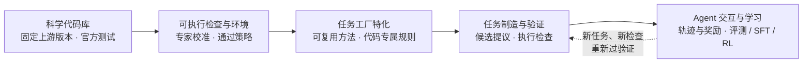
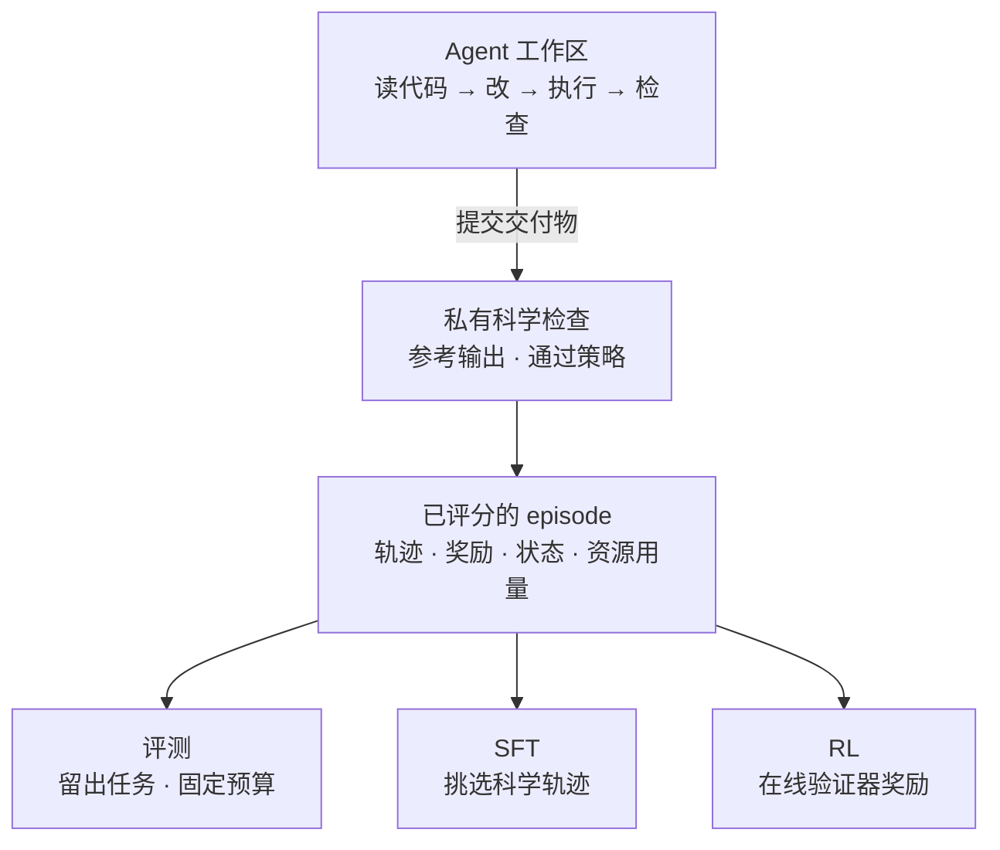

# ScienceIDE：把全世界的科学代码库变成 Agent 能学的环境

<!-- release-date: 2026-09-14 -->

> 本文依据 **ScienceIDE: Turning World's Scientific Codebase into Agent Learnable Environments**，arXiv:2609.19134v1，2026-09-16，共 41 页。由 AItonomy Foundation 牵头、University of Oxford 等 25 家机构联合署名，首页标注赞助方为 PhAI-Labs 与 Qwen（PDF p. 1、p. 30）。页码均指这份 PDF 的物理页码。文中区分三件事：**论文明确写了什么**（带页码）、**我们如何解释或验算它**（会写明）、**外部资料补充**（给出处并标注）。

## 读前先把几个词说成人话

这篇论文难读的地方不在公式，而在它自造了一套一层套一层的对象：模块、环境、检查、工厂、任务、episode。先把词分清。

- **科学代码库**：天体物理、海洋、等离子体这些领域里真实在用的模拟程序，例如 PLUTO、Athena++、MITgcm、LAPS，动辄 $10^4$–$10^5$ 行（PDF p. 10）。
- **模块（module）**：代码库里承担一块完整科学职责的部分，比如一个求解器阶段。它按科学职责加可执行覆盖来切，不是「把相关文件归成一堆」（PDF p. 4）。
- **环境（environment）**：一个被专家批准的模块，打包上运行时和科学检查，成为 Agent 可以反复进出的场地（PDF p. 4）。
- **检查（check）**：奖励的最小单位，由固定输入、要打分的输出和一条 **通过策略（pass policy）** 组成（PDF p. 5）。
- **工厂（factory）**：把通用出题流程特化到某个环境上的程序，批量产出候选任务（PDF p. 4）。
- **任务（task）**：一个初始工作区、一份交付物要求、一个验证器。**Episode（回合）** 是 Agent 与一个任务的一次完整交互，产出交付物、轨迹和测量结果（PDF p. 4）。
- **Harness（外壳程序）**：包在模型外面、让它能读写文件和跑命令的那层程序。本文用了 Codex、Claude Code、Gemini CLI 三种（PDF p. 10）。
- **截断（truncation）**：一个 episode 因为轮数或输出长度用完而被强行结束，没有拿到验证器的裁决。这是 RL 部分的主角。

## 一句话先说清

代码 Agent 这两年进步快，一个关键原因是软件工程天然带「可检查的经验」：仓库、编译器、单元测试，让模型能动手、看后果、从失败里学（PDF p. 3）。科学计算本来更适合这种学习，因为经过验证的数值模型本身就是外部裁判。但论文、仓库、数据集不会自动变成可训练的环境。作者把这叫做 **科学经验瓶颈（scientific experience bottleneck）**（PDF p. 1、p. 3）。

ScienceIDE 的回答是一套基础设施：专家只在「科学边界」上花一次力气，把代码库切成模块、给每个模块定好校准过的检查；此后的出题交给 Agent 和确定性程序，每个候选任务都要在真实评分环境里跑出证据才入库；所有任务共用一个 episode 接口，同一份交互既能做评测，也能喂 SFT 和 RL（PDF p. 3–9）。

截至论文，登记表里有 64 个环境、来自 27 个科学代码库，共 2,812 个任务，其中修复 2,515 个、实现 295 个、加速 2 个；另有 1,076 个可执行检查（PDF p. 9）。在这之上有三组实验：

- **评测**：85 题的 ScienceIDE-Hard 上，15 个「模型 + harness」在 1 小时预算下，最好的 Claude Fable 5.1 严格成功率 67.1%，11 个低于 40%（PDF p. 10–11）；
- **SFT**：用 GPT-5.6-sol 的已验证轨迹微调 3 个 Qwen 模型，留出的科学修复任务和一部分公开基准上有提升（PDF p. 12–14）；
- **RL**：直接拿验证器分数当奖励训 Qwen3.5-4B，关键改动是「被预算截断的轨迹不回传梯度」，30 步后 LAPS 留出奖励从 0.357 升到 0.857（PDF p. 17）。

摘要把训出来的模型家族叫 PhAI-IDE-72B、PhAI-IDE-9B、PhAI-IDE-4B（PDF p. 1），正文实验部分只写 Qwen2.5-72B-Instruct、Qwen3.5-9B、Qwen3.5-4B 的 SFT 对比，没有一句话把两套名字对上。**外部补充**：Hugging Face 上 PhAI-IDE 的模型卡写明三者分别是这三个 Qwen 基座的 SFT 版本（见文末）。

### 一条阅读路线

1. **p. 4–9 第 2 节**：五个对象怎么一层层搭起来，重点是 p. 5–6 的通过策略和 p. 7–8 的准入证据。
2. **p. 10–12**：ScienceIDE-Hard 排行榜、时间曲线、成本曲线。
3. **p. 15–17**：RL 部分，截断掩码为什么必要。这是全文最可迁移的一段。
4. **p. 20 局限性**，再回头看附录 S3（p. 31–33）的污染审计和 S4（p. 33–37）的失败轨迹分析。

## 主要矛盾：科学代码能跑，不等于能学

作者列了三道坎（PDF p. 3）：

1. **跑不起来**：工具链五花八门、配置各异，科学仓库很难可复现地执行。
2. **判不了对错**：正确性取决于物理量、数值容差，以及很多没写下来的领域惯例。单元测试通过不代表物理对了。
3. **变不成任务**：能跑的代码，还要变成有意义的任务、有行为级验证、有分级反馈、能记录交互，才能拿来学。

已有的科学编程与复现基准能评 Agent，但不提供「跨仓库、跨任务族扩大经验」的生产设施（PDF p. 3）。作者还点了收益最大的一处：把科学代码迁到加速器上，今天仍是一次一个手写移植，每次绑定厂商工具链，而且把双精度当默认值而不是推导出来的需求（PDF p. 3）。

于是矛盾变成：

> 专家判断很贵。一个任务一个任务地请专家出题、定标准，经验永远攒不起来。能不能让专家只在科学边界上花一次力气，之后的任务生产交给 Agent 和确定性程序，同时保证每个任务仍然被科学地验证？

ScienceIDE 的办法是把代码自带测试和专家容差里「已经存在的契约」固定成每个环境的可执行检查，并与出题解耦：无论任务是注入缺陷还是移植一条昂贵路径，都按「是否在容差内恢复了科学结果」打分（PDF p. 3）。

## 先看全景：五段流水线

这张图按原文 Figure 2（PDF p. 4）重画，回流那条虚线取自 p. 9 的文字，是流程示意。Figure 1 另把整件事画成两个圈：左圈「用科学造更强的 AI」（建环境、造任务、合成 SFT 轨迹、支撑 RL），右圈「用 AI 加速科学」（评测、复现、代码维护与加速、科学发现），ScienceIDE 在交汇处（PDF p. 2）。本文的实验证据全部落在左圈。

全文最重要的一条设计是 **检查先于任务冻结**：检查套件在下游出题之前就定死，任务描述可以变，但每条检查始终属于验收契约（PDF p. 6）。整个系统的可复用性都挂在这一句上。

## 核心设计一：以「模块」为单位，把代码库编译成环境

### 旧问题：一个仓库太大，一个文件太碎

直接拿整个仓库当环境，任务边界太模糊；按文件切，又会把一块完整的物理拆散。论文选的构建单位是科学模块（PDF p. 4）。

### 工作机制

调查阶段，Agent 查看固定的上游版本、依赖、许可证和构建假设，构建源码、跑官方测试和示例；这些运行会暴露输出格式、数值波动、昂贵路径和执行风险，决定环境边界画在哪（PDF p. 4）。切模块时，每个模块写明输入输出、算法阶段、负责的实现路径、排除的职责和支撑测试；共享的求解器与工具链可以同时服务多个模块，所以一个仓库能贡献多个环境（PDF p. 4–5）。

分工是全文反复出现的那条线：Agent 负责提议和实现（适配器、候选输出），**策展人（curator）** 拍板模块边界和等价契约；登记表和 CLI 只管结构与溯源，不替人选科学观测量（PDF p. 5）。

### 可迁移启发

给 Agent 造环境时，单位选「职责」而不是「文件」或「仓库」。一个职责单位可以同时出修复题、实现题、加速题，验收标准只需定义一次。

## 核心设计二：从官方测试到科学检查

### 旧问题：科学代码的「正确」不是逐字节相等

同一份物理代码，换个编译器、并行布局或随机种子，输出就有微小差异。逐字节比较会误杀正确答案；放太宽又会放过真正的 bug。

### 新设计：检查 = 固定输入 + 打分输出 + 通过策略

模块批准后，它的上游单元测试、回归测试和随附示例被一起普查。每个用例追溯到模块职责，要么跑、要么标成「未测量」，然后三选一：保留为检查、写明理由排除、或登记为缺口。没有随附参考输出的示例仍算官方测试：固定构建提供比较对象，示例本身的物理（一个发表过的值、收敛性、守恒量）提供锚点。没有任何官方来源的叫「自定义检查」，要策展人同意（PDF p. 5）。

通过策略有两种（PDF p. 5–6）。**逐点策略（pointwise）** 对每个被打分的值 $c$ 和参考值 $r$ 要求：

$$
|c - r| \le a + \rho\,|r|
$$

$a$ 是绝对容差，$\rho$ 是相对容差，$a = \rho = 0$ 就是精确相等。只要某个边界能在有科学意义的窗口内容纳实测的数值敏感度、同时仍能拒掉真故障，就优先用逐点。它只比物理观测量，不比记账信息：无序集合先按输出里携带的身份对齐（粒子属性跟着粒子 ID 走，不跟着数组下标走）；存储顺序、自适应步数、耗时、进程或分块布局、随机抽样、特征向量相位都不算观测量。

**不变量策略（invariants）** 在逐点边界没法既容纳正常的运行间波动、又拒掉故障时使用，改比矩、分布、守恒量或积分范数，典型是随机流、快速发散的流动、抽样统计和离散输出。能缩短打分窗口而物理仍然成立时先缩窗口，否则一开始就用不变量。

### 容差怎么定：三份证据加一段人话

- **标称与变体初始条件**：变体扰动最小的一组活跃输入，让打分输出暴露数值敏感度。它是校准证据，不是物理隔离实验，也不是自动定容差的规则（PDF p. 6）。
- **替代构建（altbuild，可选）**：在同一固定源码的另一个合法构建上跑标称输入，记下跨构建偏差；没有这种构建的检查就没有这个下限（PDF p. 6）。
- **自验证**：标称与变体各自独立运行，都必须复现参考并拿满分（PDF p. 6）。
- **理由书（warrant）**：每条检查附一段人话，说明比的是哪个观测量、这个边界要区分哪种科学上相关的偏差、为什么正确实现能满足它（PDF p. 6）。

最后由策展人读源码和数值机制定下策略、容差、窗口和变体，再与领域专家多轮复审；修改过的契约要有新证据才能通过（PDF p. 6）。论文自己也说，这些实测散布都是「有限证据，不是普适保证」（PDF p. 6、p. 30）。

### 可迁移启发

给数值类任务设计奖励时，先问「什么是观测量」，把顺序、布局、耗时这些记账量排除掉；容差从实测敏感度里来，并写下「为什么这个边界既宽容又能抓错」。这份理由书也是事后审计 reward hacking 的入口。

## 核心设计三：任务工厂，把专家判断摊薄到大量任务上

### 旧问题：每道题都请专家出，扩不动

科学任务难在「改哪里才有科学意义」，要懂物理的人判断。每道题都由专家从头出、从头定验收，专家的时间就是整个系统的上限。

### 新设计：通用流程加环境专属规则

工厂 = 可复用的出题流程 + 某个环境的科学上下文（PDF p. 6）。共享流程负责可逆编辑、执行和交付物组装；本地规则指出哪些是活跃路径、用例、构建配方和有意义的变换。Agent 提议语义编辑点和目标，策展人与领域专家保留对观测量、等价和验收的决定；确定性程序把批准的规则展开成 **变异（mutation）** 或 **切除（excision）** 候选，由后面的验证阶段决定哪些成为任务（PDF p. 6）。

例子：LAPS 环境用同一套科学检查，既出「修复缺陷」题，也出「重建缺失的时间步例程」题。要做的事变了，要恢复的数值行为不变（PDF p. 6）。

出题分类有七类：加速、修复、发现、复现、集成、校准、实现。只有修复和实现能靠可逆的变异与切除自动扩展，其余几类只提供接口，等专家给目标、数据、流程或资源约束；加速在正确性之上再加一个资源标准，复现给可运行流程的输出打分（PDF p. 6–7）。Figure 4 的图注专门提醒：这七类是出题分类法，不是已部署生成器的实测覆盖（PDF p. 7）。实际库存 2,812 题里 2,810 题是修复或实现（PDF p. 9）。

### 可迁移启发

把专家成本从「每道题」挪到「每个环境的规则」上，是任务合成能不能规模化的关键。自动展开只做机械操作，科学判断不转移给它（PDF p. 7）。

## 核心设计四：候选任务要靠执行证据才能入库

### 旧问题：AI 提议的题不等于有效的题

AI 可以提议各种修复、实现、加速题，但提议本身不是有效性的证据（PDF p. 7）。题目可能无解、没有区分度，或者泄漏答案。

### 工作机制

以注入缺陷的修复题为例，候选在最终的评分环境里跑出这样一张证据表才算有效（原文 Figure 5 中间的表，PDF p. 8）：

| 修复题的证据 | 能不能跑 | 科学检查 |
|---|---|---|
| 已知正确的见证（known-valid witness） | 能跑 | 与参考一致 |
| 有缺陷的基线 | 能跑 | 偏离参考 |
| harness 故障 | 报错 | 不评分 |

对应到文字就是三条（PDF p. 7）：见证必须通过；未修复的基线必须留出得分空间（headroom）；这处改动必须引起某个检查失败，而参考修复能消除这个失败。适用时，编译、原生执行和覆盖率检查先于准入。「闭卷」和「可见性」探针只作设计证据，不当普适标准。静默变异（改了但没有检查能察觉）可以作为显式对照保留；说明含糊、分支不可达、harness 故障一律无效或不评分。

修复题的分数相对缺陷起点归一化（PDF p. 7，式 1）：

$$
r_{\mathrm{repair}} = \max\!\left(0,\ \frac{r - f}{1 - f}\right),\qquad 0 \le f < 1
$$

$r$ 是提交结果的科学一致程度，$f$ 是未修复构建本来就能拿到的分数（PDF p. 8）。只奖励「比缺陷起点多修好的那部分」，修得比起点还差记 0。

难度是相对的。有效性确立之后，任务族的准入标签与「针对某个模型、scaffold、预算、日期测出的难度」分开记录；轨迹审计要把求解失败、预算耗尽与基础设施故障、说明含糊、奖励错位区分开，任何评审模型都不能推翻确定性锚点（PDF p. 8）。

**我们如何解释它。** 这里的纪律是把设计意图和实测结果分开记账：设计时说这是难题，不等于它真难；难不难，要拿具体模型、具体预算测。很多合成基准没做到这一点。

## 核心设计五：一个 episode 接口，三种用法

验证过的任务暴露同一个 episode 接口（PDF p. 8–9）。下图按原文 Figure 6 重画：

Harness 记录动作、观测、检查奖励、执行状态和资源用量，并区分三种失败：科学不一致、交付不完整、基础设施故障（PDF p. 8）。任务可以按环境、领域、任务族或实测难度挑选，用于留出评测或训练课程；模型和训练器可以换，科学内容和验收标准不必重建（PDF p. 9）。

## 库存：64 个环境、27 个代码库

64 个环境按领域的分布（读自 Figure 1（d），PDF p. 2）：

| 领域 | 环境数 | 领域 | 环境数 |
|---|---:|---|---:|
| 天体 MHD / 流体 | 13 | 数值方法 | 4 |
| 空间等离子体 | 7 | 天体化学 | 3 |
| 海洋 / 气候 | 6 | 相对论 | 3 |
| 引力 / N 体 | 5 | 辐射 | 3 |
| 光子学 / 电磁 | 5 | 量子 | 3 |
| 航空 / 机器人 | 4 | 粒子探测器 | 3 |
| 材料 | 4 | 免疫学 | 1 |

27 个上游代码库在附录 S6 逐一列出引文和许可证，包括 Athena++、Basilisk、EPOCH、Gkeyll、LAPS、Meep、MITgcm、Phantom、PLUTO、pymatgen、QuTiP、Stim 等（PDF p. 41）。

附录 S2.2 专门把三个口径分开，强调不能混着算（PDF p. 31，Table S1）：

| 口径 | 范围 | 用途 |
|---|---|---|
| Agent 评测 | 18 个环境里的 85 个任务 | ScienceIDE-Hard 模型对比的固定分母 |
| 科学契约 | 1,076 个可执行检查 | 更广的观测量等价与不变量覆盖 |
| 任务供给 | 2,515 修复、295 实现、2 加速 | 制造出的任务库存，不是评测分母 |

出题探针也记了账：改成「先 1 次参考探针、失败再重试到 3 次」后共 2,722 次尝试，比统一 3 次的 4,845 次少 43.8%；全部 3,195 条已评分轨迹估计花了 703 美元，约每条 0.22 美元。这是按订阅计量的探针成本，不是端到端的建库成本（PDF p. 31）。

## 实验一：ScienceIDE-Hard，前沿 Agent 在科学代码上还差多少

### 设定

ScienceIDE-Hard 是从 PLUTO、Athena++、MITgcm、LAPS、PHANTOM 派生的 18 个环境里挑出的 85 个难任务，52 个修复、33 个实现（PDF p. 10）；按代码库分是 MITgcm 33、PLUTO 31、LAPS 11、Athena++ 9、PHANTOM 1（PDF p. 31）。15 个模型来自 8 家提供方，经 Codex、Claude Code 或 Gemini CLI 运行；任务容器与指令相同，不给定位提示，每个 episode 1 小时预算（PDF p. 10）。主指标是 **严格科学成功**，即 $r_{\mathrm{repair}} = 1$，没交完或预算耗尽都算失败；任务等权，任务内重复取平均（PDF p. 10）。共 3,982 次通过有效性过滤的尝试，14 个模型每题至少 3 次有效尝试；Fable 每题只用最近 1 次有效尝试，没有区间（PDF p. 32）。所以这张榜比的是「模型 + harness」系统，不是纯模型。

### 排行榜

数字读自 Figure 7（PDF p. 10），harness 读自 Figure 1（e）的图标（PDF p. 2）：

| 模型 | Harness | 严格成功率 |
|---|---|---:|
| Claude Fable 5.1 | Claude Code | 67.1% |
| Claude Opus 5 | Claude Code | 64.6% |
| GPT-6 Astra | Codex | 63.1% |
| GPT-5.6 Sol | Codex | 55.0% |
| Qwen3.8 Max | Codex | 39.2% |
| DeepSeek V4.1 Flash | Claude Code | 36.0% |
| GPT-5.6 Terra | Codex | 34.9% |
| DeepSeek V4 Pro | Codex | 28.4% |
| Kimi K3 | Claude Code | 28.4% |
| GLM-5.3 | Codex | 25.8% |
| Claude Sonnet 5 | Claude Code | 25.4% |
| Gemini 3.8 Flash | Gemini CLI | 19.6% |
| GPT-5.6 Luna | Codex | 18.1% |
| Claude Haiku 4.5 | Claude Code | 4.7% |
| MiniMax-M3 | Claude Code | 4.4% |

最强的几个 Agent 在给定预算下仍有大约三分之一的题解不出；前三名不能读成统计上确定的排序，因为 Fable 只测了一次，Opus 与 Astra 的区间重叠（PDF p. 10–11）。

### 时间：同样的终点，走法完全不同

Astra 与 Fable 分在两格里，不好直接比。原文给了几个读数（PDF p. 11）：第 10 分钟 Astra 49.6%、Fable 25.9%，Fable 约在第 31 分钟反超；从第 20 到第 60 分钟，Astra 只再涨 2.0 个百分点，Fable 涨 11.8，Opus 涨 16.0，Qwen3.8 Max 涨 30.2。曲线在第 60 分钟就是最终成功率（附录式 S1 把时长封顶在 1 小时，PDF p. 32），由此可以倒推第 20 分钟的位置：

| 模型 | 第 10 分钟 | 第 20 分钟（推算） | 第 60 分钟 |
|---|---:|---:|---:|
| GPT-6 Astra | 49.6% | 61.1% | 63.1% |
| Claude Fable 5.1 | 25.9% | 55.3% | 67.1% |
| Claude Opus 5 | — | 48.6% | 64.6% |
| Qwen3.8 Max | — | 9.0% | 39.2% |

**我们如何解释它。** Astra 是快速收敛型，前 20 分钟就把会做的做完；Qwen3.8 Max 是慢热型，大部分成功发生在后 40 分钟，1 小时预算对它可能不够。截止点不同，看到的先后次序就不同，但这是从 1 小时记录里回读的曲线，不能直接当成换预算后的排名（PDF p. 11、p. 32）。

### 成本：花得多不等于做得对

原文点名的几个点（PDF p. 11）：Fable 67.1% 成功、每题估计 7.90 美元，Astra 63.1%、3.56 美元；Astra 每题平均 9.4 分钟、13.9k 输出 token，Fable 16.8 分钟、85.7k token；DeepSeek V4.1 Flash 每题输出 172.4k token，成功率 36.0%。15 个模型上，成功率与运行时长、输出量的 Spearman 相关系数分别是 −0.22 和 0.01。结论是资源用量和科学正确性是两个独立维度。成本来自 9 个模型的 harness 记录估计和 6 个模型的存档 token 单价，不是当前价格（PDF p. 12、p. 33）。

### 失败长什么样（附录 S4）

**失败方式差异很大**（PDF p. 33–34）：Qwen3.8 Max 有 37.3% 的尝试耗尽预算，失败 episode 平均耗时 48.5 分钟；Claude Haiku 4.5 没有预算超时，失败 episode 平均 7.7 分钟，74.9% 的尝试交回的结果不优于基线；MiniMax-M3 预算耗尽 31.6%，失败 episode 平均 34.1 分钟。同样是低分，有的很快放弃，有的磨到超时。正文 p. 3 那句「预算耗尽达到按任务均衡的 37.3%」，数值与这里 Qwen 一项相同。

**成功并不稳定**：在覆盖完整的 Agent 里，28.0% 的「模型 × 任务」组合在前 3 次有效尝试里既有成功也有失败；Gemini 在 85 题中有 33 题结果会变，Astra 是 8 题，Kimi 是 29 题（PDF p. 34）。

**能力分布不均且互补**（PDF p. 34）：Astra 与 Sol 在 PLUTO 上成功率几乎相同（47.3%），在 Athena++ 上却是 96.3% 对 38.5%；Gemini 在 LAPS 上 29.5%，高于 Sol 的 20.8%，与总排名相反。同一单次尝试样本里，Fable 解出 85 题中的 57 题，15 个 Agent 的并集能解 72 题；Terra 贡献了 6 道 Fable 没解出的题；11 道题只有一个 Agent 解出，13 道没人解出。作者提醒，这些代码库在语言和任务构成上也不同，不能说隔离出了领域效应；并集只是观测到的互补性，要兑现还需要选择或验证策略和额外计算（PDF p. 34–35）。

### 轨迹级失败机制

作者用一个模型辅助的审阅者，看了 Fable 5.1 和 Astra 在全部 85 题上的 358 次尝试，其中 125 次失败（PDF p. 35）。失败原因占比读自 Figure S3（a），按任务均衡（PDF p. 35）：

| 失败机制 | Fable 5.1 | Astra |
|---|---:|---:|
| 与参考惯例不符 | 71.4% | 64.9% |
| 修错了目标 | 10.7% | 17.0% |
| 恢复不完整 | 7.1% | 2.1% |
| 交付不完整 | 3.6% | 1.1% |
| 未能解释的数值不一致 | 7.1% | 14.9% |

最大的一类是「惯例」：LAPS 时间步任务 T013 里，两个模型都写出了能跑的代码，但漏了「保留上一个时间步」的规则，低分辨率用例对上参考，高分辨率在一次周期更新处发散；MITgcm 示踪物任务 T035 里，4 次尝试都重建出几乎一样的系数表，只有一个系数被截断，相应的示踪物就发散了（PDF p. 35–36）。难点不只是写出公式，而是复现周围代码要求的数值精度和状态惯例。

这张图同时说明两件事（PDF p. 36）。一是不同的缺陷会把模型引向同一个错误目标，这是反复出现的定位错误，不是偶然的笔误。二是本地测试会骗人：失败和成功的修复都通过了「重复运行自己代码」的对比，本地测试只证明「我的改动可复现」，不证明「我改的是该改的地方」。还有第三类：Athena++ 化学任务 T002 里，Fable 和 2 次 Astra 尝试改对了目标，却漏交 4 组必需的控制输出（PDF p. 36）。

作者强调这些是有证据支撑的机制标注，不是实验隔离出的因果；审阅没有盲化、没有独立复现、也没有领域专家认证，17 次尝试复审后仍无法解释（PDF p. 36–37）。

**我们如何解释它。** 这组分析拆出三个分开的要求：选对要改的地方、重建出正确行为、把交付物交全。它们需要不同的反馈；只看「最终通过与否」，会把三类错误混成一个 0 分。

### 污染与作弊通道的审计（附录 S3）

这一段是论文里少见的自曝家丑（PDF p. 32–33）：

- 原始评测宣称有网络隔离，但后来检查轨迹发现，5,314 次试验里有 455 条指向上游的命令，确认成功抓取 21 次，其中 13 次被判为解出。19 个 staging 脚本把 Agent 侧的网络声明改成了公开，仓库里的任务文件和实际运行的容器并不一致。修正是用实时容器白名单，并作废已确认抓取的试验。
- 容器隔离管不到提供方侧的工具。Gemini 在 85 题中的 71 题收到了提供方工具返回的实质内容，其中一次通过 web_fetch 取回了一个 22,180 字符的上游原文件；受影响的试验关掉提供方工具后重跑。
- DeepSeek V4 Pro 用一个聚合平台的密钥调用了其他模型，涉及 20 题、解出 13 题；加上提供方侧模型白名单重跑后，样本分从 .365 降到 .294。

作者的措辞很克制：这些修正关闭了对应通道，但不声称预训练模型从没见过公开的上游代码（PDF p. 33）。

## 实验二：SFT，科学轨迹能不能教会别的本事

### 数据与训练

用 GPT-5.6-sol 收集示范，按数值等价验证器筛选轨迹；训练集 4,567 个片段、来自 564 个任务，验证集 544 个片段、来自 81 个任务，按任务 ID 不重叠（PDF p. 12）。只监督新的助手动作和工具调用；指令、观测、复用的上下文，以及被标为失败、重复或过长只读序列的工具动作都掩掉，但保留为上下文（PDF p. 37）。ms-swift 训练，LoRA 作用于所有线性层，rank 32、scaling 64、dropout 0.05；BF16，全局 batch 64，序列上限 36,864 token，学习率 $2\times 10^{-5}$，3% 热身，余弦衰减，3 个 epoch 共 216 步；最终 checkpoint 直接评测，不按公开基准挑（PDF p. 12、p. 37）。

### 留出科学修复任务

任务 ID 不出现在训练和验证中；每个提示给出任务描述、定位好的源码摘录和候选例程，模型输出一个结构化补丁，由固定 runner 应用后构建代码、跑环境原本的数值检查；贪心解码，上下文上限 8,192 token，回复上限 2,048 token（PDF p. 13）。注意这是 **单次回复的定位修复**，不是 ScienceIDE-Hard 那种 1 小时的 Agent 交互。结果读自 Figure 10（a）（PDF p. 14）：

| 模型 | 环境 | 初始 → SFT 平均修复奖励 | 提升（百分点） |
|---|---|---|---:|
| Qwen3.5-4B | PLUTO-Particles-Dust | 0.0000 → 0.3333 | +33.33 |
| Qwen3.5-9B | PLUTO-RMHD/ResRMHD | 0.0000 → 0.2857 | +28.57 |
| Qwen3.5-9B | LAPS | 0.3125 → 0.5000 | +18.75 |
| Qwen3.5-9B | MITgcm-Biogeo | 0.0625 → 0.1250 | +6.25 |

表里只列「有完整配对评测的环境」，72B 没有出现（PDF p. 13）。每个环境的题数原文没给；0.3333、0.2857 这类值暗示题数很少，外部模型卡写 PLUTO-Particles-Dust 只有 3 题（见文末）。

### 公开基准：筛选出来的提升

三个模型一共筛了 33 个基准配置，每个 20–128 题（PDF p. 37）。Figure 10（b）列出其中提升至少 3 个百分点的 15 组对比（PDF p. 14）：

| 模型 | 基准 | 题数 | 初始 → SFT | 提升（百分点） |
|---|---|---:|---|---:|
| Qwen3.5-4B | HumanEvalFix JS | 82 | 0.354 → 0.463 | +10.98 |
| Qwen3.5-4B | QuixBugs Java | 20 | 0.400 → 0.500 | +10.00 |
| Qwen3.5-4B | CodeXGLUE Defect | 128 | 0.422 → 0.492 | +7.03 |
| Qwen3.5-4B | QuixBugs Python | 20 | 0.600 → 0.650 | +5.00 |
| Qwen3.5-4B | BBH Multistep Arithmetic | 125 | 0.920 → 0.968 | +4.80 |
| Qwen3.5-4B | MMLU-Pro Computer Science | 128 | 0.711 → 0.758 | +4.69 |
| Qwen3.5-9B | BBH Word Sorting | 125 | 0.240 → 0.576 | +33.60 |
| Qwen3.5-9B | HumanEvalFix Rust | 82 | 0.744 → 0.780 | +3.66 |
| Qwen3.5-9B | GSM8K | 128 | 0.898 → 0.930 | +3.13 |
| Qwen2.5-72B-Instruct | APPS Introductory | 128 | 0.609 → 0.672 | +6.25 |
| Qwen2.5-72B-Instruct | LiveCodeBench Execution | 128 | 0.539 → 0.594 | +5.47 |
| Qwen2.5-72B-Instruct | QuixBugs Python | 20 | 0.900 → 0.950 | +5.00 |
| Qwen2.5-72B-Instruct | HumanEvalFix C++ | 128 | 0.820 → 0.867 | +4.69 |
| Qwen2.5-72B-Instruct | ARC-Easy | 128 | 0.773 → 0.805 | +3.13 |
| Qwen2.5-72B-Instruct | HumanEval | 128 | 0.828 → 0.859 | +3.13 |

然后在 **不重叠的新题** 上确认（PDF p. 14、p. 38，Table S3）：

| 基准 / 模型 | 题数 | 初始 → SFT（%） | 变化 [95% 区间]（百分点） |
|---|---:|---|---|
| CodeXGLUE defect / 4B | 2,604 | 45.93 → 52.92 | +6.99 [4.03, 9.87] |
| CodeXGLUE refinement / 9B | 5,707 | 1.17 → 2.37 | +1.19 [0.89, 1.51] |
| CodeXGLUE refinement / 72B | 5,707 | 1.63 → 2.40 | +0.77 [0.53, 1.03] |
| BBH Word Sorting / 9B | 125 | 27.20 → 63.20 | +36.00 [26.40, 46.40] |
| BBH arithmetic / 4B | 125 | 92.80 → 98.40 | +5.60 [0.80, 11.20] |
| HumanEvalFix Python / 9B | 36 | 86.11 → 77.78 | −8.33 [−19.44, 2.78] |

生成用贪心、关闭 thinking、输出上限 4,096 token；区间是未做多重比较校正的配对 bootstrap。**72B 的 HumanEvalFix C++ 筛选阶段的提升在确认阶段没有保持**（PDF p. 37–38）。

### 怎么读这组结果

论文的结论是：科学交互轨迹既能支持科学专精，也能支持更广的能力，是「科学经验正迁移到通用能力」的证据；同时承认这些提升不代表一致改进，也不代表达到前沿水平（PDF p. 13）。

**我们的判断：**

1. **Figure 10（b）是挑出来的。** 33 个配置里只展示了提升不少于 3 个百分点的 15 组，其余持平、小涨或下降的没有列；另有覆盖 21 个配置的 4B/9B 扩展评测，正文也没给结果（PDF p. 37–38）。它能说明「有地方变好了」，不能说明「整体变好了」，作者在 p. 38 也写了 Figure 10 并不把所有基准概括为一致提升。
2. **确认实验才是硬证据。** 六组确认里，CodeXGLUE defect（4B）、BBH Word Sorting（9B）和两组 refinement 的区间不含 0；BBH arithmetic 下界只有 0.80；HumanEvalFix Python（9B）点估计是下降。
3. **题量小。** QuixBugs 只有 20 题，1 题就是 5 个百分点。
4. **Word Sorting 的 +36 很醒目，但原文没给机制解释**，科学代码修复与单词排序之间的关联没有消融。

## 实验三：RL，用验证器分数直接训

### 设定

从未经 SFT 的 Qwen3.5-4B 出发，在两个环境上分别训练（PDF p. 15、p. 38）：

| 环境 | 内容 | 修复任务数 | 训练 / 验证 | 打分用例 |
|---|---|---:|---|---:|
| LAPS | 3D 伪谱 Hall-MHD 求解器 | 99 | 85 / 14 | 3 |
| MITgcm-biogeo | 海洋生物地球化学与 CFC 输运 | 87 | 64 / 23（日志中验证集实际读到 21） | 9 |

指令给出缺陷所在的文件、行号和编辑类别（附录称 L1 提示），但不给修复内容，Agent 要自己判断修好之后代码该算什么；每个修复按 $[0, 1]$ 给部分分（PDF p. 15、p. 39）。切分按缺陷族和源码树变体分组（PDF p. 38）。难处在于验证器的裁决只在 episode 结束后才到，奖励是纯结果型的，而一条轨迹可能几十轮、几万 token；一个 episode 可能要重建 Fortran 求解器并跑完整模拟（PDF p. 15）。

### 训练栈

优化用 PSRL，这是作者在 veRL 上的定制版，能驱动一个黑盒 harness；episode 在 harbor 里、通过与评测相同的 Terminus-2 容器和验证器执行，所以训练吃的是验证器的原生奖励，不是学出来的代理奖励（PDF p. 15、p. 39）。每次运行用 24 张 H20（每张 95GB）：8 张做生成（张量并行 2，共 4 个实例），16 张做训练（FSDP2，序列并行 4）（PDF p. 39）。

rollout 和训练放在不相交的 GPU 上并发跑，原因是同步循环会被每批里最慢的 episode 拖住：在一个代表性 step 上，优化更新花了 3,210 秒中的 2,069 秒，rollout 花了 751 秒（PDF p. 15、p. 39）。并发带来一步的策略陈旧，加上 rollout 用 BF16、训练用更高精度，用 token 级截断重要性采样修正：权重 $w_{i,t} = \min(\exp\rho_{i,t}, C)$，$C = 2.0$，$\rho_{i,t}$ 是该 token 训练端减 rollout 端的对数概率差（PDF p. 15、p. 40）。

还有一处工程细节值得记住：轨迹采集是 token-in-token-out，对每轮的消息前缀做哈希，保证第 $k+1$ 轮严格延伸第 $k$ 轮，并跨轮保留推理内容。常见的 chat 模板会剥掉上一轮的推理，前缀哈希对不上，每轮都得另开一条轨迹，存储和反向传播成本随轮数平方增长（PDF p. 39）。

### 目标函数

每个提示采 $G = 8$ 条轨迹。第 $i$ 条的优势是奖励减去组均值（PDF p. 15，式 2）：

$$
\hat{A}_i = R_i - \frac{1}{G}\sum_{j=1}^{G} R_j
$$

它去掉了原始 GRPO「除以组内标准差」这一步，沿用 Dr. GRPO。原因是这里的验证器奖励近乎双峰，多数组要么几乎全 0、要么几乎全 1，除以一个很小的标准差会把一次孤立的成功放大成巨大的优势（PDF p. 15、p. 39）。

每个 token 的损失用 PPO 式截断比率，上下界不对称（PDF p. 40，式 S2）：

$$
\ell_{i,t}(\theta) = \min\!\Big(r_{i,t}\hat{A}_i,\ \mathrm{clip}\big(r_{i,t},\,1-\varepsilon_{\mathrm{low}},\,1+\varepsilon_{\mathrm{high}}\big)\hat{A}_i\Big)
$$

$r_{i,t}$ 是该 token 相对采样策略的概率比，$\varepsilon_{\mathrm{low}} = 0.2$、$\varepsilon_{\mathrm{high}} = 0.3$，让很少被采到的修复动作有空间涨概率（沿用 DAPO 的 Clip-Higher），损失按 token 平均聚合（PDF p. 15、p. 40）。其余设置两次运行共用（PDF p. 39，Table S4）：

| 算法选择 | 取值 | 运行设置 | 取值 |
|---|---|---|---|
| 优势基线 | 组均值，不除标准差 | Batch / 每题 rollout 数 | 16 / 8 |
| 截断比率 | 0.2 / 0.3 | 学习率 | $10^{-6}$ |
| 损失聚合 | token 平均 | 热身 / 权重衰减 | 3 步 / 0.1 |
| 截断轨迹 | 从损失中掩掉 | 轮数上限 | 50 |
| 长度惩罚 | 关 | 提示 / 回复长度 | 2,048 / 65,536 |
| Rollout 修正 | 上限 2.0 | 温度 | 1.0 |
| 动态采样 | 关 | 陈旧度 | 1 次更新 |
| KL / 熵奖励 | 关 / 关 | 实测 KL | $6\times 10^{-4}$ |

### 核心问题：预算截断不是修复失败

长程科学任务里，一个 episode 可能因三种原因结束：修复完成、轮数用完、回复长度用完。只有第一种能说明修得好不好，纯结果型奖励却把三种一样对待（PDF p. 15–16）。

一条被截断的轨迹拿 0 分，同组均值为正时，按式（2）它的优势就是负的，它生成的所有 token 都被压低；全组都是 0 时优势为 0。按 token 平均聚合时，这个惩罚对 token 最多的轨迹尤其重（PDF p. 16）。于是目标函数出现一条捷径：策略既可以靠解题变好，也可以 **只靠把轨迹变短** 变好。更糟的是，最长的轨迹往往在攻最难的修复，罚它们就是劝策略别去探索需要长时间交互的解法（PDF p. 16）。

作者在不掩码的运行里直接看到了这种崩溃：奖励先涨，然后跌到起点以下，每轮 token 数降到原来的三分之一以下；轮次变短导致更多轨迹撞上轮数上限，截断更多，信号更病态，形成自我强化的循环（PDF p. 16）。

修法是把被截断轨迹的两个角色拆开：作为奖励观测，它的奖励仍进入式（2）的组均值；作为策略优化样本，它的 token 不回传梯度（PDF p. 16）。掩码写成（PDF p. 40，式 S3）：

$$
m_{i,t} =
\begin{cases}
0, & \tau_i \in \mathcal{T}_{\mathrm{budget}} \\
\mathbb{1}[\text{token } t \text{ is model-generated}], & \text{其他情况}
\end{cases}
$$

$\mathcal{T}_{\mathrm{budget}}$ 包含轮数截断和回复长度截断，**不包含** 基础设施超时和已完成评分的错误；提示词与 harness 填充不计入。一个 batch 全是截断轨迹时，token 平均的分母被钳到至少 1，这个 batch 梯度为 0（PDF p. 40）。完成本身不保证正优势，已完成的 episode 只有奖励高于组均值才拿正优势（PDF p. 16）。

同样的道理，作者关掉了 DAPO 的奖励侧长度惩罚：这里的长度反映定位和修复缺陷的难度，不是该罚的量（PDF p. 17）。审计显示，那个长度惩罚在一次运行里对 28% 的样本触发，142 次里有 119 次本来就是失败样本，约 64% 的时候打在了得分 1.0 的已完成 episode 上（PDF p. 40）。

### 结果

训练 30 步后，与基座 Qwen3.5-4B 相比，LAPS 留出奖励从 0.357 升到 0.857（2.4 倍），MITgcm-biogeo 从 0.286 升到 0.571（2.0 倍），分别在 14 个和 21 个留出任务上，harness 与提示相同（PDF p. 17）。曲线上的趋势用首 5 步与末 5 步的均值读更稳（PDF p. 17、p. 40）：

| 指标 | LAPS | MITgcm-biogeo |
|---|---|---|
| 训练奖励 | 0.427 → 0.828 | 0.381 → 0.597 |
| 完成 episode 的平均奖励 | 0.683 → 0.883 | 0.571 → 0.747 |
| 预算截断率 | 39.5% → 6.6% | 34.1% → 23.8% |
| 每轮 token 数 | 1103 → 1135 | 780 → 914 |
| 熵 | 0.602 → 0.381 | 0.549 → 0.313 |
| 零方差组占比 | 10.0% → 47.5% | 27.5% → 41.3% |

LAPS 上每个 episode 的轮数从 34.7 降到 24.5，每轮 token 数维持在 1100 附近，所以变短来自更早完成，不是每轮写得更少（PDF p. 40）。策略把以前死在预算线上的长尝试，转成了能拿到验证器裁决的 episode（PDF p. 17）。

掩码与不掩码的对比（PDF p. 41，Table S5，从首个记录步到末个记录步；不掩码一列经过峰值再到崩溃）：

| 指标 | 不掩码 | 掩码 |
|---|---|---|
| 平均奖励 | 0.339 → 0.573 → 0.078 | 0.487 → 0.914 |
| 每轮 token 数 | 1125 → 327 | 1095 → 1165（平稳） |
| 截断率 | 29% → 39% | 28.9% → 2.3% |
| 每 episode 轮数 | 34.9 → 49.5 | 32.2 → 24.1 |
| 熵 | 上升 | 0.586 → 0.348 |

Table S5 没写是哪个环境的运行；从每轮 token 数约 1100 看，我们推测是 LAPS，原文未说明。作者还排除了「崩溃是重要性采样坏掉了」：崩溃那次运行的有效样本量始终在 [0.950, 0.978]，rollout 与训练端对数概率相关性从 0.938 回升到 0.955，而奖励同时在下跌（PDF p. 40）。

### 怎么读这组结果

被实验支持的：两个环境、同一套超参下，掩码版本的训练奖励和留出奖励都上升、截断下降；不掩码版本出现了可复述的崩溃模式。

需要打折的（论文 p. 20 自己也写了一部分）：

- 留出任务与训练任务来自 **同一个环境**，都带文件、行号级提示，这不证明能迁移到没见过的代码库；
- 没有估计随机种子之间的方差；
- 留出集只有 14 题和 21 题，LAPS 的 0.357 → 0.857 按均值粗算相当于 14 题里多出约 7 题的分，奖励含部分分，不能严格换算成题数；
- 零方差组占比到末期升到 47.5%（LAPS），近一半的组已不贡献梯度，继续训的收益可能受限。原文只报了这个数，没有展开。

## 与已有工作的位置

论文把相关工作分成 AI for Science 与 Science for AI 两个方向（PDF p. 18–19）。最接近的几类：软件工程的环境规模化，SWE-Gym 提供 2,438 个带运行时和测试的真实任务，R2E-Gym 8.7k 个程序化任务，SWE-smith 合成了 50k 个任务实例（PDF p. 19）；科学编程基准，SciCode 80 题、ScienceAgentBench 102 个任务，AInsteinBench 取自 6 个科学仓库的维护者 PR，SWE-bench Science 覆盖 98 个仓库的 119 个任务，并强调软件测试可能不足以刻画科学契约（PDF p. 18）。

作者给自己的定位：基准实例是评测的单位，而 ScienceIDE 把「专家批准的科学模块加上它的检查」变成 **生产任务实例的可复用单位**；贡献在于把科学策展、重复出题与模型学习连起来，任务族或训练器变了，科学内容不变（PDF p. 19）。

## 限制与判断

论文第 5 节自己列出的（PDF p. 20）：

- 证据集中在有参考答案可验证的软件任务，主要是计算物理与地球科学里的修复与实现，不是开放式发现；更广的任务族覆盖和「1,000 个环境」的发布仍是开发目标。
- 工厂生成的变体可能共享代码路径和假设，任务数量本身不衡量独立的科学覆盖；难任务集只探到 1 小时预算和 2 处耦合编辑点。
- 验证本身是一种科学建模选择：与选定观测量和容差一致，不代表检查之外也正确，合法的替代解可能与参考不一致；独立外部审计和对抗性 reward hacking 评测仍未做。
- 工厂是摊薄而不是消除专家策展，扩展仍依赖领域专家和上游再分发权利；仓库、依赖或硬件变化后要重新验证。
- 检索控制排除不了预训练见过公开源码；旧镜像保留了文件时间戳线索，难度筛选早于完整的检索隔离，不能说筛选无污染。
- SFT 提升只针对挑选出的公开基准，RL 提升只针对带提示的、同一环境内的留出任务，都没证明能迁移到没见过的代码库；SFT 的隔离只按任务 ID 核验，相关变体未审计；RL 未估计种子间方差。

我们读完补充的判断：

- **「用 AI 加速科学」那半圈没有实测证据。** 2,812 题里 2,810 题是修复或实现（PDF p. 9），七类分类法里的加速、发现、复现、集成、校准目前基本停在接口层。
- **SFT 和 RL 是两个独立实验**（PDF p. 40），没有「先 SFT 再 RL」的组合结果。
- **排行榜的模型名按原文照录**，论文没给每个模型的具体 API 版本或推理参数。

## 可迁移启发

1. **把专家判断编译成可执行契约，再让出题与之解耦。** 检查先于任务冻结，同一套检查服务修复、实现、加速多个任务族，「专家很贵」和「任务要多」才能同时成立。
2. **容差要有证据和理由书。** 标称与变体、替代构建、自验证，加一段人话 warrant，比拍脑袋定一个 1e-6 可审计得多。
3. **准入看执行证据，不看提议。** 见证通过、基线留空间、改动能被检查抓住，三条缺一不可，对任何合成任务流水线都适用。
4. **分母跟着口径走。** 评测分母、检查覆盖、任务库存分开记，不混着宣传。
5. **评测看时间曲线和成本，不只看终点分。** Astra 与 Fable 终点接近，时间、token、美元差好几倍。
6. **长程 Agent RL 里，截断轨迹要掩掉梯度、保留基线。** 否则 token 平均加负优势会教模型「写短一点」，并形成自我强化的崩溃；长度惩罚同理，要审计它到底罚了谁。
7. **奖励近似双峰时，别除以组标准差。** 孤立成功会被放大成巨大优势。
8. **多轮轨迹要保证前缀严格延伸。** 跨轮保留推理内容、按前缀哈希拼接，否则存储和反向传播按轮数平方增长。
9. **审计作弊通道要包括提供方侧。** 容器断网不够，提供方的搜索工具、聚合平台密钥都能泄题。
10. **区分三类失败：选错位置、行为没重建对、交付不完整。** 它们需要不同的反馈，混成一个 0 分会浪费信号。

## 关键词回看

- **科学经验瓶颈**：科学代码能跑但变不成可学经验的三道坎：跑不起来、判不了对错、变不成任务。
- **模块 / 环境**：按科学职责切出的单位，打包运行时与检查后成为环境。
- **检查 / 通过策略**：奖励的最小单位；逐点策略 $|c-r| \le a + \rho|r|$，不行再退到不变量策略。
- **Warrant（理由书）**：每条检查附带的人话说明，解释比什么、为什么这个边界合理。
- **工厂**：通用出题流程加环境专属规则，自动展开变异与切除候选。
- **见证 / 缺陷基线**：准入证据，前者必须通过，后者必须留出得分空间。
- **$r_{\mathrm{repair}}$**：相对缺陷起点归一化的修复分。
- **ScienceIDE-Hard**：85 题、18 个环境、5 个代码库族的固定评测集。
- **截断掩码**：被预算截断的轨迹留在组基线里，但不回传梯度。
- **Dr. GRPO 式优势**：奖励减组均值，不除标准差。
- **PSRL / harbor / Terminus-2**：本文 RL 栈里的训练器、episode 执行层和容器。
- **PhAI-IDE**：摘要里训出的模型家族名，72B / 9B / 4B。

## 资料与阅读边界

### 本文依据的版本与首发日

- 本地原件 `papers/Oxford/ScienceIDE.pdf`，41 页，页边标注 arXiv:2609.19134v1、2026-09-16。[arXiv 页](https://arxiv.org/abs/2609.19134) 截至 2026-09-30 仍只有 v1，提交于 2026-09-16 17:55:47 UTC。
- 作者单位：第一作者 Hejia Geng 属 AItonomy Foundation 与 University of Oxford；三位通讯作者 Zhenfei Yin、Yingcheng Wu、Ling Yang 均属 AItonomy Foundation，另分别兼属 Oxford、Stanford、Princeton（PDF p. 1、p. 30）。
- `release-date` 取 **2026-09-14**：官方代码仓库 [aitofound/ScienceIDE](https://github.com/aitofound/ScienceIDE) 在 2026-09-14 22:56 UTC 推送环境本体的预览版（15 个带运行时的环境与 30 个 ScienceIDE-Hard 任务），这是环境首次对外可用，早于 arXiv v1。此前 2026-09-13 的推送只有 README、RL 训练配方与结果，还没有可用的环境；Hugging Face 权重仓库的创建时间不作首发日。

### 外部资料补充（不是 PDF 原文）

- 论文首页给出项目页 [aitonomy.org/projects/scienceide](https://aitonomy.org/projects/scienceide)、上面的代码仓库和 Hugging Face 模型集合 [AItonomy/scienceide-model-series](https://huggingface.co/collections/AItonomy/scienceide-model-series)。项目页写明完整任务库仍在发布中。
- Hugging Face 上 PhAI-IDE-4B、PhAI-IDE-9B、PhAI-IDE-72B 的模型卡写明，三者分别由 Qwen3.5-4B、Qwen3.5-9B、Qwen2.5-72B-Instruct 经 ms-swift SFT 得到，LoRA 合并后以 BF16 权重发布，训练数据来自 ScienceIDE。模型卡的环境对比表给 PLUTO-Particles-Dust 标了 3 题。这些是模型卡的说法，PDF 本身没有写明对应关系。

### 原文没有公开、本文也不补的缺口

- 1,076 个检查在各环境上的分布，以及具体容差数值；
- 工厂规则的实现、变异算子清单与各环境的产出率；
- SFT 筛选阶段 33 个配置中未达 3 个百分点的其余结果，以及 21 个配置的扩展评测结果；
- 留出科学修复评测里每个环境的题数；
- RL 的种子间方差、30 步之后的走势，以及 Table S5 对应的具体环境；
- 「先 SFT 再 RL」的组合实验；
- 加速、发现、复现等非修复任务族的实测结果；
- 各排行模型的具体 API 版本与推理参数；
- 端到端的建库成本（只给了 703 美元的探针成本）。
