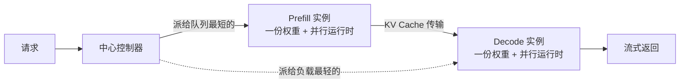

# DistServe：把 Prefill 和 Decode 拆开，才谈得上每卡 goodput

<!-- release-date: 2024-01-18 -->

> 本文依据 **DistServe: Disaggregating Prefill and Decoding for Goodput-optimized Large Language Model Serving**，OSDI 2024 会议论文集版（USENIX 页码 193–211，内容与 arXiv:2401.09670v3 相同），共 19 页，第 1 页是 USENIX 封面。页码均指这份 PDF 从 1 起数的页序。作者来自北京大学、StepFun 与 UC San Diego，一作 Yinmin Zhong，通讯作者 Xin Jin（PDF p. 2、p. 14）；封面带 USENIX 产物评审的三枚徽章。全文把三件事分开标注：**报告明确写了什么**、**我们如何解释或验算它**、**哪些是外部资料补充**。

## 读前先把几个词说成人话

- **Prefill（预填充）**：一次请求的第一段。整段提示词并行算完，生成第一个输出词元。
- **Decode（解码）**：之后逐步生成，每步只处理上一步生成的那一个词元。
- **KV Cache（键值缓存）**：每个位置算出的 Key、Value，后续解码每步都要回看，所以留在显存里。
- **TTFT（Time To First Token，首词延迟）**：Prefill 那一段的耗时，论文拿它衡量 Prefill 侧的服务等级目标（SLO）。
- **TPOT（Time Per Output Token，每词时间）**：除第一个词外，每个输出词元的**平均**耗时，论文拿它衡量 Decode 侧（PDF p. 2–3）。它和 Sarathi-Serve 一篇的 TBT 不是同一个口径：TBT 是逐个间隔，看 P99；TPOT 是一条请求内的平均。
- **SLO 达成率（SLO attainment）**：同时满足 TTFT 与 TPOT 目标的请求比例。论文主看 90%，附录再报 99%。
- **每卡 goodput（per-GPU goodput）**：在给定达成率下，**每张配置的 GPU** 能扛住的最大请求速率。论文把它直接等同于单次查询成本：每卡 goodput 越高，每次查询越便宜（PDF p. 3）。
- **共置（colocation）**：Prefill 和 Decode 跑在同一组 GPU 上，靠连续批处理把两种请求揉进同一步。当时的主流做法。
- **实例（instance）**：恰好持有一份完整模型权重的资源单元；开了模型并行，一个实例可以占多张卡。拆开之后就有 Prefill 实例和 Decode 实例，各持一份权重（PDF p. 5）。
- **算子内 / 算子间并行（intra-op / inter-op）**：前者切开矩阵乘分到多卡，降执行时间但通信多、要 NVLink 一类的高带宽；后者按层切成流水线，执行时间略增，但能近似线性地提高可承载速率（PDF p. 4）。

## 一句话先说清

在线服务有两条延迟线：TTFT 与 TPOT。当时的系统把 Prefill 和 Decode 放在同一组 GPU 上，拿「全系统每秒吐多少词元」当目标（PDF p. 3）。DistServe 认为这个目标在 SLO 面前是错的，共置带来两个毛病（PDF p. 2–3）：

1. **干扰**：长 Prefill 拖慢同批的 Decode，Decode 也拖慢 Prefill；分开排队也没用，两边仍抢同一张卡。
2. **耦合**：两阶段只能共用一套资源和并行方式，只好按更刁的那条 SLO 超配 GPU。

它的做法是把两阶段拆到不同的 GPU 上：Prefill 实例算完把 KV 交给 Decode 实例，两边各自选并行方式、各自定副本数；再按集群带宽决定怎么摆放，让 KV 传输不吃掉收益（PDF p. 3）。

摘要的结论（PDF p. 2）：相对当时最好的系统，同样保证 90% 以上请求达标时，最多能扛 **7.4 倍** 的请求速率，或守住 **12.6 倍** 更紧的 SLO。这两个数对上的基线不同，后文拆开。

它不是新的注意力算子，也不是新的显存分配器，而是一层编排：给定模型、负载、两条延迟目标和达成率，自动给出两类实例的并行方式、各部署几份、怎么放到物理集群上（PDF p. 7）。

### 一条阅读路线

1. **p. 2 Figure 1 与 p. 3 的一段算账**：1.6 对 3.3 是怎么来的。整篇的动机。
2. **p. 4–5 §2.3 与 Figure 2**：干扰与耦合，以及为什么切块混批不算解。
3. **p. 5–7 §3**：拆开后两类实例各自该怎么组批、怎么并行，M/D/1 排队模型。
4. **p. 7 §3.3 与 p. 8–9 §4.1–4.2**：KV 传得动吗，以及两种放置算法。
5. **p. 9 §4.3**：线上调度的三个补丁。
6. **p. 10–13 §6**：端到端、传输占比、模拟器精度、消融与搜索耗时。
7. **p. 13–14 §7** 与 **p. 18–19 附录**：什么时候别用它；模拟器的延迟模型；99% 达成率与实际选中的并行配置。

## 先看矛盾：同一张卡上，两条 SLO 在抢

整条请求的延迟约等于 TTFT 加上 TPOT 乘生成词元数（PDF p. 3 脚注 1）。不同应用对两条线的口味不同（PDF p. 3）：实时聊天要 TTFT 低，TPOT 只要快过人的阅读速度，论文写约每分钟 250 个词；文档摘要则更在乎 TPOT。

Figure 1 把「共置会超配」画成了一张图，是整篇的出发点：

设定是 13B 模型、一张 80 GB A100、输入 512 输出 64 的合成负载，模拟「给文章写一段短摘要」（PDF p. 2–3）。图上读出的因果：共置时 TTFT 本来还能扛到约每秒 2.9 个请求，是 TPOT 在 1.6 就先破了线，整张卡被更紧的那条线卡死。拆开后两条线各自由专门的卡负责，Prefill 卡按 TTFT 算、Decode 卡按 TPOT 算，理想情况下每卡 3.3，是共置的 2.1 倍（PDF p. 3）。

**我们如何解释它**：这张图不是在说「拆开就变快」，而是在说 **1.6 这个数是被耦合决定的**。同一张卡、同一套并行，必须同时伺候两条形状相反的曲线，只能按先破的那条定容量。拆开的价值在于让每条曲线由最适合它的资源去扛。

## 第二层：干扰、调度无效与资源耦合

§2.3 把共置的问题收成三条（PDF p. 4–5）。

**一、Prefill 与 Decode 互相干扰。** Figure 2 用 13B 模型，比较「纯 Decode 批」和「再塞进一个 Prefill」的单步耗时（PDF p. 5）。读图：输入 128 时，纯 Decode 批从批 1 到批 256 大约 7.5–18 毫秒，塞进一个 Prefill 后变成约 14–24 毫秒；输入 1024 时，纯 Decode 批约 10–40 毫秒，塞进一个 Prefill 后跳到约 120–150 毫秒。Decode 被拖长（TPOT 变差），Prefill 自己也因为多带了 Decode 而变慢（TTFT 变差），GPU 越满越明显。

**二、切块混批消不掉干扰。** 论文点名的是「切块 Prefill 捎带 Decode」（chunked-prefill with piggyback，出自 SARATHI 与 DeepSpeed-MII）。它承认这能缓解 Decode 被长 Prefill 堵住，但给了三条代价（PDF p. 5）：

- 块远小于打满 GPU 的拐点时，Prefill 块要和 Decode 抢同一步的资源，自己的执行时间变长；
- 块大到接近打满 GPU，留给 Decode 的位置就少了，能捎带的机会随之变少；
- 每一块都要把前面所有块的 KV 从显存重新读进片上 SRAM。切成 $N$ 块，总共要读 $N + (N-1) + \dots + 1 = O(N^2)$ 块 KV，不切只要 $O(N)$。上下文越长，这笔税越重。

§2.2 把它总结成一句：切块混批本质上是拿 TTFT 换 TPOT，消不掉干扰（PDF p. 4）。

**三、分开排队也不行，资源还被绑死。** 不混批、按阶段顺序调度，Decode 仍要排在正在跑的 Prefill 后面，反之亦然；给任何一边优先级，另一边的 SLO 就先破（PDF p. 5）。更深一层是耦合：Prefill 偏算力受限，TTFT 紧时想用更多算子内并行压执行时间；Decode 的最优并行则取决于当前批多大。共置时两边只能共用一套，按更刁的那条目标去配，另一条往往被超配（PDF p. 5）。

拆开后的机会（PDF p. 5）：每类实例一份权重；Prefill 实例算完把 KV（和第一个词元）交给 Decode 实例；Decode 利用率低，就可以让多份 Prefill 实例对一份 Decode 实例，把 Decode 批做大。

## 拆开之后，两类实例各自怎么配

§3 是全文的分析核心：拆开以后，两类实例可以分别分析、分别配置（PDF p. 5–7）。先看结论图：

### Prefill 实例：一条请求就够打满，就别再攒批

Figure 3(a) 显示，对 13B 模型，一条 512 词元的序列就已经能让 A100 接近算力受限；再往批里加请求，效率不再提升，只会让整批所有请求一起变慢（PDF p. 5–6）。所以要先对模型和 GPU 扫出一个临界长度 $L_m$：超过它 Prefill 就是算力受限，只有短于 $L_m$ 的请求才值得凑批。实际提示词平均几百个词元，Prefill 实例的批通常很小（PDF p. 6）。读图补一句：512 这条线在批 1 时约每秒 5,700 词元，到批 16 仍涨到约 7,200，「打满」是近似说法。

并行怎么选，论文把拆开后的 Prefill 实例近似成一个 **M/D/1 排队**：请求按泊松到达、先来先服务、不组批，每条执行时间恒为 $D$（因为输入统一），到达率 $R$ 且 $RD < 1$（PDF p. 6）。平均 TTFT 是：

$$
\mathrm{TTFT}_{\mathrm{avg}} = D + \frac{R D^{2}}{2(1 - R D)}
$$

第一项是执行时间，第二项是排队时间。两路算子间并行时，层间激活通信可以忽略，整条请求耗时仍约为 $D$，最慢一级约 $D/2$：

$$
\mathrm{TTFT}_{\mathrm{inter}} = D + \frac{R D^{2}}{4(2 - R D)}
$$

两路算子内并行引入加速系数 $K$（$1 < K < 2$，通信让加速不完美），执行时间变成 $D/K$：

$$
\mathrm{TTFT}_{\mathrm{intra}} = \frac{D}{K} + \frac{R D^{2}}{2K(K - R D)}
$$

读法（PDF p. 6）：负载低时第一项主导，算子内并行把执行时间压下去，更划算；负载高时排队项主导，算子间并行更划算。图中左栏是 66B 模型在两张 A100 上的实测，交叉点约在每秒 3 个请求。TTFT 目标越紧，越偏向算子内；$K$ 越小，算子内的优势越早消失，这是 Figure 4(b) 的内容。真实提示词长短不一，流水线会起泡，M/D/1 会偏，论文把这件事交给后面的搜索与调度（PDF p. 7）。

### Decode 实例：批要大，紧 TPOT 才上算子内并行

单个 Decode 严重受带宽限制，组批才是每卡 goodput 的来源（PDF p. 6，Figure 3(b)）。共置时到达率一高，Prefill 作业变多，Decode 批就做不大。拆开后，多份 Prefill 实例对一份 Decode 实例，Decode 在专用 GPU 上把批做大，不必拿 TPOT 去换（PDF p. 6–7）。批再大就撞上显存墙（要装下所有在途请求的 KV），PagedAttention、GQA 和模型并行是继续推大批的手段。

图中中、右两栏是 13B、批 128、输入 256 的 Decode（PDF p. 7，Figure 5）：算子内并行降延迟但收益递减，因为通信与切分后利用率下降；算子间并行几乎线性提高吞吐。结论是：**TPOT 很紧时必须上算子内并行；过了那条线，用算子间并行线性加吞吐**。模型单卡放得下时，复制一份也是选项：把请求平分到 $N$ 个副本，相当于排队公式里的 $R$ 换成 $R/N$，代价是多占一份权重显存（PDF p. 7）。

**我们如何解释它**：这一节是「耦合」那条毛病的定量版本。Prefill 的最优并行取决于到达率和 TTFT 目标，Decode 的最优并行取决于批大小和 TPOT 目标，两者没有理由相同。附录表 3 里 OPT-66B 实际选出的配置就是例证：Prefill 用 TP 4、PP 1，Decode 反而用 TP 2、PP 2（PDF p. 19）。

**对自己的项目有什么用**：拆开之后，先分别问两个问题：Prefill 这边到达率多高、TTFT 多紧；Decode 这边批能开多大、TPOT 多紧。两组答案各自决定一套并行，不要默认「Decode 就该把 TP 开大」。

## KV 传得动吗

拆开的代价是 KV 要从 Prefill 实例搬到 Decode 实例。论文算了一笔账（PDF p. 7）：OPT-66B 一条 512 词元请求的 KV 约 **1.13 GB**；平均每秒 10 个请求，就要每秒搬 **11.3 GB**，约 **90 Gbps**，才能让传输「看不见」。很多 LLM 集群有 InfiniBand（文中举例 800 Gbps），这笔账不成问题；跨节点带宽不够时，就依靠节点内 NVLink，A100 之间峰值 600 GB/s，开销同样可以忽略。

**我们如何解释它**：这笔账直接变成放置约束。跨节点带宽够，两类实例放哪都行；不够，就必须让 KV 只在节点内走。下一节的两种算法就是按这条分岔的。

## 放置：先看集群带宽，再选算法

目标是最大化每卡 goodput（PDF p. 7）。输出叫一份**放置方案（placement）**：两类实例各自的并行方式、各几份、放在哪些机器上。

真机逐个试 SLO 太慢，所以要一个模拟器。秒级的到达不可预测，但小时到天的负载模式往往可以拟合；DistServe 从历史轨迹拟合长度与到达的分布，重采样出轨迹喂给模拟器，再用二分查找找「刚好满足达成率」的最大速率（PDF p. 8）。模拟器按 Prefill、Decode 各自的运算量和访存量建延迟模型，细节在附录 A（PDF p. 8、p. 18）。

### 高节点亲和：跨节点带宽够，两边各自最优再复制

集群有 InfiniBand、跨节点传 KV 可以忽略时，用**算法 1**（PDF p. 8）：枚举 Prefill 所有可行的「算子间 × 算子内」组合，权重切完要装得下显存；每个组合用 `simu_prefill` 求出最大 goodput，保留每卡 goodput 最高的那个；Decode 同理用 `simu_decode`。最后按目标流量 $R$ 复制：

$$
n = \left\lceil \frac{R}{\mathrm{goodput}_{p}} \right\rceil,\qquad m = \left\lceil \frac{R}{\mathrm{goodput}_{d}} \right\rceil
$$

$n$、$m$ 分别是 Prefill、Decode 实例的份数，$\mathrm{goodput}_{p}$、$\mathrm{goodput}_{d}$ 是选中配置的单实例 goodput。复杂度 $O(NM^{2})$，$N$ 是单实例最多跨的节点数，$M$ 是每节点 GPU 数（常见 8）；论文写最大设定下求解不到 1.3 分钟（PDF p. 8）。

### 低节点亲和：KV 只能走 NVLink，就按流水级对齐

跨节点带宽差时，最直接的办法是让每对 Prefill、Decode 实例永远同机。大模型会装不下：175B 模型权重约 350 GB，一对实例是两份，8 张 80 GB 卡只有 640 GB（PDF p. 8–9）。

**算法 2** 的关键观察是：KV 只在两个实例的**对应层**之间传。用算子间并行把层切成若干级，实例也随之切成若干「实例段」；把同一级的 Prefill 段和 Decode 段放进同一台机器，KV 就只走 NVLink（PDF p. 9）。

节点内同一实例的各段用同一套并行；每节点卡数有限（通常 8），节点内的组合可以枚举完。算法 2 先枚举算子间并行度，对每个度数调用 `get_intra_node_configs` 列出节点内的所有配法，逐对模拟、选优，再按目标流量复制（PDF p. 8–9）。测试集群跨节点只有 25 Gbps，所以端到端实验用的是算法 2（PDF p. 10）。

**对自己的项目有什么用**：带宽不够时，拆开不等于「随便找两台机器」。对齐的单位是流水级，不是整份模型；跨机只传激活，KV 永远不出机器。

## 线上调度：先来先服务，再补三个补丁

Figure 6 是运行时架构（PDF p. 9），按原图转写：

策略本身是先来先服务（FCFS）：请求先派到队列最短的 Prefill 实例，再派到负载最轻的 Decode 实例（PDF p. 9）。针对真实负载加了三处（PDF p. 9）：

- **削流水线气泡。** 一批里新词元的数量是这批执行时间的可靠代理。Prefill 侧先扫出打满 GPU 所需的最短提示词长度 $L_m$，让每批总长度接近 $L_m$：短于 $L_m$ 的拼在一起，长于它的单独发；Decode 侧把 $L_m$ 设为最大批大小。
- **扛突发：拉取而不是推送。** 突发会让大量 KV 砸向 Decode 实例、撑爆显存。DistServe 让 Decode 实例按需去 Prefill 实例**拉取** KV，把 Prefill 实例的显存当排队缓冲；Prefill 实例算完只需把 KV 留在显存里，就能继续接下一个活，两边各按自己的节奏走。
- **重新规划。** 负载画像（平均输入输出长度、到达率等）明显变化时，按近期历史重跑放置算法。论文说算法几秒就能跑完、重载权重几分钟，都远短于真实负载按小时变化的尺度（PDF p. 9）。

明确没做的两件事（PDF p. 9）：抢占与容错。FCFS 在 Prefill 阶段会有「车队效应」，长请求堵住短请求；拆开后一个 Decode 实例对着多个 Prefill 实例，它一出故障可能拖垮整片服务。两件都留作未来工作。

## 实现

系统分四块：放置算法、兼容 OpenAI 接口的 RESTful 前端、编排层、并行执行引擎（PDF p. 9–10）。前三块共 6.5K 行 Python，执行引擎 8.1K 行 C++/CUDA。编排层负责派发请求、传 KV、回传结果：跨节点用 NCCL，节点内用异步 `CudaMemcpy`，避免传输阻塞计算。每个实例用 Ray actor 实现 GPU worker，分布式管理 KV；引擎集成了连续批处理、FlashAttention、PagedAttention，支持 OPT 与 LLaMA（PDF p. 10）。代码在封面脚注的 [LLMServe/DistServe](https://github.com/LLMServe/DistServe)（PDF p. 3）。

## 实验怎么证明

### 实验台与负载

4 个节点、32 张 SXM A100-80GB，节点内 NVLink，跨节点 **25 Gbps**（PDF p. 10）。模型用 OPT-13B / 66B / 175B，FP16。选 OPT 是因为它用经典多头注意力，KV 大，能给传输足够压力；论文认为 GQA、MQA 模型的 KV 更小，DistServe 只会更好看（PDF p. 10），这是方向性判断，没有测。

| 应用 | 模型 | 权重 | TTFT 目标 | TPOT 目标 | 数据集 | 平均输入 / 输出 |
|---|---|---|---:|---:|---|---|
| 聊天 | OPT-13B | 26 GB | 0.25 秒 | 0.1 秒 | ShareGPT | 755.5 / 200.3 |
| 聊天 | OPT-66B | 132 GB | 2.5 秒 | 0.15 秒 | ShareGPT | 同上 |
| 聊天 | OPT-175B | 350 GB | 4.0 秒 | 0.2 秒 | ShareGPT | 同上 |
| 代码补全 | OPT-66B | 132 GB | 0.125 秒 | 0.2 秒 | HumanEval | 171.3 / 98.2 |
| 摘要 | OPT-66B | 132 GB | 15 秒 | 0.15 秒 | LongBench | 1738.3 / 90.7 |

表 1 与 Figure 7（PDF p. 10）。SLO 是作者按应用经验定的，论文说当时没有公开的标准可循；到达时间按泊松合成，因为三个数据集都没有时间戳；LongBench 输入被截到 OPT 绝对位置编码的上限 2048（PDF p. 10）。聊天在三个规模上都测，另两个应用只测 66B。

**两个指标**（PDF p. 10–11）：一是 90% 达成率下的最大每卡速率；二是固定速率，把表 1 的两条目标同时乘一个 **SLO Scale**（越小越紧），看系统能守住的最紧一档。

**两个基线**（PDF p. 11）：

- **vLLM**：连续批处理加 PagedAttention，共置；只支持算子内并行，按 vLLM 原论文把三个模型设为 1、4、8。
- **DeepSpeed-MII**：切块 Prefill，把长提示词切块、和短提示词拼满固定词元预算。13B、66B 的并行度与 vLLM 对齐；**跑不了 175B**：它的内核要求 `vocab_size / intra_op` 是 8 的倍数，OPT 的 50272 在 8 路下不满足，改 4 路又显存不够。

### 端到端：每个倍数对上的基线不同

| 场景 | 相对 vLLM：速率 / SLO | 相对 DeepSpeed-MII：速率 / SLO | 页码 |
|---|---|---|---|
| 聊天（三个规模合计区间） | 2.0–4.6 倍 / 1.8–3.2 倍 | 1.6–7.4 倍 / 1.7–1.8 倍 | p. 11–12 |
| 代码补全，66B | 5.7 倍 / 1.4 倍 | 1.6 倍 / 1.4 倍 | p. 12 |
| 摘要，66B | 4.3 倍 / 12.6 倍 | 1.8 倍 / 2.6 倍 | p. 12 |

所以摘要的 **7.4 倍**来自聊天场景对 DeepSpeed-MII，**12.6 倍**来自摘要场景对 vLLM。结论页把 7.4 倍换算成「每次查询成本最多降到七分之一左右」的说法（PDF p. 14）。

论文对每个场景给了原因：

- **聊天**：vLLM 多数请求的 TTFT 能达标，是大量 TPOT 违规把达成率拖下来的。DeepSpeed-MII 在大模型上相对好一些，因为 Prefill 作业更大，切块多少缓解了干扰；但切块 Prefill 比整段慢，TTFT 先破（PDF p. 11–12）。175B 选出的配置是 Prefill 算子间 3、算子内 3，Decode 算子间 3、算子内 4，论文认为这种不对称很难手工调出来（PDF p. 11）。
- **代码补全**：作为实时助手，TTFT 目标最紧，两个基线最终都卡在 TTFT。DistServe 靠去掉 Decode 干扰、并让搜索自动给 Prefill 实例加算子内并行，压低了 Prefill 平均延迟（PDF p. 12）。
- **摘要**：输入长，但 TTFT 目标宽（15 秒），矛盾转到 TPOT。vLLM 共置时长 Prefill 把 Decode 拖慢，TPOT 守不住（PDF p. 12）。读 Figure 9(b) 的右图，vLLM 要把 SLO 放宽到约 10 倍才勉强达到 90%，这就是 12.6 倍的来历：基线本身离目标很远。

附录 C 把达成率目标提高到 99%（PDF p. 19）：相对 vLLM 仍有 3–8 倍速率、1.24–6.67 倍更紧的 SLO；相对 DeepSpeed-MII 是 1.32–8 倍速率、1.20–1.58 倍更紧的 SLO。附录表 3 列出实际选中的配置：

| 模型 | 数据集 | Prefill TP / PP | Decode TP / PP |
|---|---|---|---|
| OPT-13B | ShareGPT | 2 / 1 | 1 / 1 |
| OPT-66B | ShareGPT | 4 / 1 | 2 / 2 |
| OPT-66B | LongBench | 4 / 1 | 2 / 2 |
| OPT-66B | HumanEval | 4 / 1 | 2 / 2 |
| OPT-175B | ShareGPT | 3 / 3 | 4 / 3 |

这张表里 TP 对应算子内、PP 对应算子间（PDF p. 19）。

### KV 传输是不是暗税

Figure 10 把 OPT-175B、ShareGPT 上每条请求的生命周期拆成五段：Prefill 排队、Prefill 执行、传输、Decode 排队、Decode 执行（PDF p. 12）。即便是 KV 最大的 175B，传输也只占总时间**不到 0.1%**；看传输时间的累积分布，三个模型都有**超过 95%** 的请求传输延迟**低于 30 毫秒**，尽管跨节点只有 25 Gbps。原因正是算法 2 让同一级的两段同机、走 NVLink（PDF p. 12）。读图补一句：Decode 执行占了总时间的大头，约四分之三。

### 模拟器准不准

表 2 在真机和模拟器上分别测 SLO 达成率（PDF p. 13）：

| 速率（每秒） | vLLM 真机 | vLLM 模拟 | DistServe-Low 真机 | DistServe-Low 模拟 |
|---:|---:|---:|---:|---:|
| 1.0 | 97.0% | 96.8% | 100.0% | 100.0% |
| 1.5 | 65.5% | 65.1% | 100.0% | 100.0% |
| 2.0 | 52.8% | 51.0% | 99.3% | 99.3% |
| 2.5 | 44.9% | 46.1% | 87.3% | 88.3% |
| 3.0 | 36.7% | 38.3% | 83.0% | 84.1% |
| 3.5 | 27.8% | 28.0% | 77.3% | 77.0% |
| 4.0 | 23.6% | 24.1% | 70.0% | 68.9% |

所有格误差都在 2 个百分点以内（PDF p. 13）。

### 消融：拆开本身，比给 vLLM 搜并行更重要

Figure 11 在模拟里比较四个系统，OPT-66B、ShareGPT（PDF p. 13）。**vLLM++** 给 vLLM 枚举所有并行方式、挑最好的，结果和默认 vLLM 一样，因为默认的算子内 4 已经是每卡 goodput 最高的。论文据此说：共置下的干扰把「换并行」的空间吃掉了。**DistServe-High**（算法 1，假设跨节点带宽高、约束更少）还能比 **DistServe-Low**（算法 2）再好一截，因为它不要求同机的两段必须是同一级（PDF p. 13）。

**我们如何解释它**：这组消融把两件事分开了。vLLM++ 说明「搜并行」单独没用；Low 与 High 的差距说明「带宽约束」是真实代价。DistServe 的收益主要来自拆开本身，搜索是让拆开之后的配置不靠手调。

### 搜索要多久

Figure 12 在一台 96 核的 AWS m5d.metal 上测两种算法随单实例 GPU 数的耗时（PDF p. 13）。读图：32 张卡时 DistServe-Low 约 82 秒、DistServe-High 约 22 秒；GPU 少时两者都在几秒内。耗时与模型大小无关，因为模拟器只模拟离散事件；两种算法都容易并行，核越多越快。卡多时 Low 更慢，因为它要枚举同机两段的所有组合，但仍是分钟级，每次重新部署前跑一次可以接受（PDF p. 13）。

## 原文里几处要按结构读的笔误

- §6.1 说端到端用的是「低节点亲和放置算法（§2）」，按结构应是 §4.2（PDF p. 10）。
- §6.5 正文写「Alg. 1 (DistServe-Low) and Alg. 2 (DistServe-High)」，与 §4、§6.4 的定义相反（PDF p. 13）；按定义，**算法 1 是 High，算法 2 是 Low**；Figure 12 里卡多时 Low 更慢、正文解释为它要枚举同机两段的组合，也只和这个读法对得上。
- 正文两处把系统写成「DistLLM」（PDF p. 11、p. 13）。
- §4.3 说放置算法「几秒」跑完，§4.1 与 §6.5 说最大设定「不到 1.3 分钟」「分钟级」（PDF p. 8、p. 9、p. 13）。读 Figure 12，32 张卡时 Low 约 82 秒，略超 1.3 分钟；两处说法都只能当量级读。

## 论文自己划的边界

§7 写了三种「这时别用 DistServe」（PDF p. 13–14）：

- **吞吐优先的离线任务。** 不在乎延迟时，目标不再是 goodput，切块捎带能把每一步都填到算力墙，利用率更高。
- **资源很少，几张甚至一张 GPU。** 拆开的设计空间几乎没了，不拆的系统部署更简单。
- **超长上下文。** KV 随长度线性增长，传输量变大；但 Prefill 计算按平方增长，传输相对 Prefill 的占比反而下降，两阶段的差距也更大、干扰更狠。论文据此判断拆开在长上下文里「仍然有希望」，这是论证，没有 100 万词元级别的实验。

相关工作里（PDF p. 14），Orca、vLLM、SARATHI、FastServe 被归为共置、因而有干扰；同期的 Splitwise、TetriInfer、DéjàVu 用了相似的拆分思路，论文说自己更强调 goodput 与网络带宽；AlpaServe 用模型并行做统计复用，但只针对非自回归生成。论文自称是第一个为自回归 LLM 推理优化 goodput 的工作。这些是作者的定位，不是评测。

## 论文写了什么、没写什么

**被实验托住的：**

- 在 OPT 系列与三类负载上，拆开加搜索相对 vLLM、DeepSpeed-MII 都提高了每卡 goodput 与可承受的 SLO（Figure 8–9，附录 Figure 13–14）；
- 按流水级对齐后，即便跨节点只有 25 Gbps，KV 传输也不到总时间的 0.1%（Figure 10）；
- 模拟器与真机的达成率误差在 2 个百分点以内（表 2）；
- 共置时换并行方式没有收益（vLLM++，Figure 11）。

**只是分析或作者判断、没有单独验证的：**

- M/D/1 模型只在「输入统一 512」的受控实验里对照过（Figure 4），真实长度下论文自己承认会偏；
- GQA、MQA 模型上「只会更好」没有实验；
- 长上下文「仍然有希望」只有论证；
- 「每卡 goodput 越高、单次查询成本越低」是定义上的换算，论文没有给美元或能耗账。

**论文承认没做的：** 抢占、容错（PDF p. 9）；与 Splitwise、TetriInfer 等同期拆分系统的实测对比。

**完全没涉及的：** 前缀缓存与 KV 复用；过载时的拒绝与准入；Prefill、Decode 实例在运行中动态转换角色；异构硬件（不同阶段用不同型号的卡）；GQA 模型上的实测。

## 论文之后发生了什么（外部补充）

以下都不是这份 PDF 的内容。

- **作者团队的博客**：UCSD Hao AI Lab 在 2024-03-17 发布 [Throughput is Not All You Need](https://hao-ai-lab.github.io/blogs/distserve/)，用更通俗的方式讲同一套 goodput 与拆分论证。
- **拆分进入了主流引擎。** vLLM 文档现有一节 [Disaggregated Prefilling (experimental)](https://docs.vllm.ai/en/latest/features/disagg_prefill.html)，仍标为实验特性。本站开源解读与知识库 PD分离 一篇记录的是这些引擎今天的样子，不要读回这篇 2024 年的论文。
- **分离之后的下一站。** Mooncake 一篇把调度中心换成 KVCache，加上过载时的提前拒绝，这两件 DistServe 都没有做；Mooncake 也只让不必切块的短 Prefill 内联进 Decode 批，说明「拆开」和「切块」在后来的系统里常被组合使用，而不是这篇论文里那样的互斥选项。
- **同年的对照面。** Sarathi-Serve 一篇走共置加切块的路，并在自己的相关工作里承认拆分能彻底消除干扰、代价是 KV 迁移与 Prefill 侧显存闲置。两篇都没有和对方正面比过。

## 可迁移启发

1. **先问目标是 goodput 还是吞吐。** 有双 SLO 时，「全系统每秒多少词元」会骗人；没有延迟约束的离线任务，拆开反而可能亏利用率。论文自己把后者让给了切块混批。
2. **干扰和耦合是两件事。** 就算调度上把两阶段错开，只要还在同一组 GPU、同一套并行，更紧的那条 SLO 仍会逼你超配。Figure 1 的 1.6 就是耦合的价格。
3. **并行方式按阶段分开定。** Prefill 低负载、紧 TTFT 偏算子内，高负载偏算子间；Decode 先靠批，TPOT 紧再上算子内，其余交给算子间。66B 上 Prefill 用 TP 4、Decode 用 TP 2 加 PP 2，就是反直觉但成立的例子。
4. **KV 传输是放置问题。** 先按「每条请求的 KV 体积 × 到达率」算出需要多少带宽，再决定跨机还是按流水级对齐走 NVLink。25 Gbps 的集群上，对齐之后 175B 的传输也不到 0.1%。
5. **突发用拉取吸收。** 让下游按需去上游取，把上游的显存当队列，比把 KV 推爆下游稳。
6. **用模拟器换搜索空间。** 真机试 SLO 太贵；一个按运算量与访存量建模、误差 2 个百分点以内的模拟器，就能把放置变成可以自动重跑的搜索。
7. **看倍数先看基线离目标多远。** 12.6 倍来自一个要放宽约 10 倍 SLO 才能达标的基线；它说明共置在那个负载下很糟，不说明拆开在任何负载下都有十倍收益。

## 关键词回看

- **每卡 goodput**：给定达成率下，每张配置 GPU 能扛的最大请求速率，论文直接当作成本指标。
- **Prefill–Decode 干扰**：混在一批或抢同一张卡时，TTFT 与 TPOT 互相抬高。
- **资源与并行耦合**：共置迫使两阶段共用 GPU 数与并行方式。
- **$L_m$**：刚好打满 GPU 的提示词长度；Prefill 按它拼批，Decode 把它设成最大批。
- **M/D/1**：拆开后 Prefill 实例的排队近似，用来说明算子内与算子间并行何时各自占优。
- **高 / 低节点亲和**：跨节点带宽够时两类实例独立求最优（算法 1）；不够时按流水级让同级两段同机，KV 只走 NVLink（算法 2）。
- **拉取式传输**：Decode 实例按需取 KV，Prefill 实例的显存当排队缓冲。
- **SLO Scale**：把两条目标同时乘的系数，越小越紧。

## 资料与阅读边界

- **本文依据**：OSDI 2024 会议论文集版（[USENIX 页面](https://www.usenix.org/conference/osdi24/presentation/zhong-yinmin)），19 页，与 [arXiv:2401.09670](https://arxiv.org/abs/2401.09670) 的最新版 v3（2024-06-06）内容相同，只多了 USENIX 封面与页眉。
- **`release-date` 取 2024-01-18**：DistServe 是一套服务技术，没有单独上线的产品，按技术首次官方公开日记，即 arXiv v1 提交日（2024-01-18 01:03 UTC）。官方仓库最早一条提交记在 2024-01-17，但无从证明当时已公开，不采用；作者博客、会议日与后续修订都更晚，不回写。
- **图表**：Figure 1 与 Figure 4(a)、Figure 5 的讲解图按原图逐点读数重画，是读图近似；放置示意图依据 §4.2、算法 2 与表 3 画出，原文没有对应的图；Figure 6 转写为 Mermaid；表 1–3 按 PDF 转录；Figure 2、3、9、10、12 的数值读自原图，已在正文注明；Figure 8 与附录 Figure 13–14 只引正文给出的倍数。
- **未公开或无法核实**：模拟器的拟合常数 $C_1$ 到 $C_5$；重新规划的触发阈值；Figure 8–9 各系统的绝对速率（正文只给倍数）；搜索在更大集群上的耗时。
