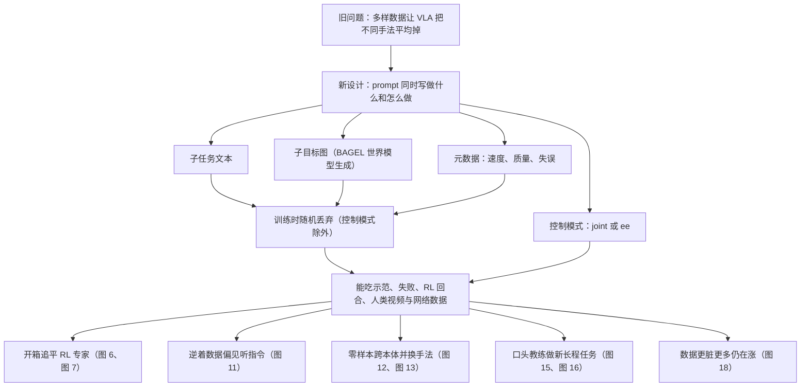

# π0.7：混杂数据会把机器人策略平均掉，所以他们把「怎么做」写进 prompt

<!-- release-date: 2026-04-16 -->

> 本文依据 Physical Intelligence 官网发布的论文 PDF，即 **π0.7: a Steerable Generalist Robotic Foundation Model with Emergent Capabilities**，与 arXiv:2604.15483 内容一致，共 25 页。页码均指 PDF 自身的页码。文中会区分三件事：**报告明确写了什么**、**我们怎么解释它**、**哪些是外部资料或本文从图上读出的数字**。

## 阅读前先认识几个词

这篇报告用的词大多不是它发明的，先各用一句话说清：

- **VLA（Vision-Language-Action model，视觉—语言—动作模型）**：从预训练的视觉—语言模型出发，改成直接输出机器人动作的策略。它看摄像头画面、读语言指令，吐出关节或末端的控制命令。
- **动作块（action chunk）**：VLA 一次不只出一步动作，而是出未来一小段，比如 50 步；真机只执行其中前面一部分，再推理下一块。
- **动作专家（action expert）**：挂在视觉—语言骨干旁边的一个较小的 Transformer，专门生成连续动作，推理比让整颗大模型逐步吐动作快。
- **流匹配（flow matching）**：一类生成模型的训练目标。它学的是怎样把噪声一步步「推」成真实动作。好处是能表达多峰：同一句指令可以对应好几种都合理的手法。
- **本体（embodiment）**：机器人的具体身体，臂长、自由度、夹爪形状、装在桌边哪里都算。「跨本体」就是在一台机器上学，在另一台上做。
- **无分类器引导（Classifier-Free Guidance，CFG）**：生成时同时算「带条件」和「不带条件」两个分支，再沿两者之差多走一点，让输出更贴近条件。前提是训练时见过「不带条件」的样本。

这篇报告自己的核心词只有一个：

- **多样上下文条件化（diverse context conditioning）**：训练时给每条轨迹配的 prompt 不只写「做什么」，还写「怎么做」——更细的子任务语言、一张「接下来画面该变成什么样」的子目标图、这段示范快不快好不好的元数据，以及用的是哪种控制模式。

## 一句话先说清

π0.7 不是一副新骨架。报告自己把贡献说得很克制：它不打算提出新架构，而是提出一套**让 VLA 吃得下更杂的数据**的方法，再给出实证（PDF p.3）。

它是一个约 5B 参数的 VLA：4B 的视觉—语言骨干（含 400M 视觉编码器）加 860M 的流匹配动作专家（PDF p.4）。不做任何任务专属微调，同一个模型在报告里做到了几件前代做不到的事：

- 叠衣服、做意式浓缩、折纸箱这些灵巧任务上，追平甚至在吞吐上超过前代用强化学习单独调出来的专家（PDF p.9，图 6）；
- 在一台从没采过叠衣服数据的双臂 UR5e 上叠 T 恤，带子目标图的变体做到任务进度 85.6%、成功率 80%，第一次上手这台机器的资深遥操作员是 90.9% 和 80.6%（PDF p.13、p.24）；
- 靠人一句一句口头指导，操作训练数据里没有的空气炸锅（PDF p.13–14）。

如果只记一句话：

> **机器人数据越多越杂，模仿学习越容易把不同手法平均掉。π0.7 的解法是在训练时把「怎么做」也写进条件里，让杂数据变成可区分的模式，而不是噪声。**

## 先讲矛盾：数据越杂，策略越容易被平均掉

语言模型这些年走通了一条路：数据足够多、足够杂，模型不仅记得住训练里见过的事，还能把能力重新组合。报告举的例子是：会英译法，又会按 JSON 格式输出，于是能「用 JSON 输出法语译文」。这叫**组合泛化**（compositional generalization），报告认为它是通才能力的基石，却在物理智能里一直没出现（PDF p.2）。

VLA 这几年参数和数据都在涨，但报告点出两个一直没解开的结（PDF p.2）：

- 做不了新任务，也很难把已有技能按新方式拼起来；
- 连训练里见过的指令，也常常要做任务专属微调才能做得流畅。

按语言模型的经验，下一步应该是灌更多、更杂的数据。机器人这边这么做会撞上一个具体问题（PDF p.2）：

- 不同操作员手法不同，有人又快又干净，有人慢、有失误；
- 最便宜的数据是旧模型自己跑出来的回合，里面有大量失败；
- 人类第一人称视频、互联网数据，根本不是这台机器人的动作。

如果训练时每条轨迹只配一句「叠衣服」，模型看到的就是同一句话对应一大堆完全不同的动作。朴素模仿会把这些模式平均掉，得到一条谁也不像的中间策略。于是业界的常规做法是精挑细选：只留高质量、手法一致的示范（PDF p.14）。代价是扔掉大量数据，也就拿不到组合泛化需要的多样性。

矛盾于是很清楚：

> 想要多样数据带来的泛化，就得先让模型分得清这些数据「是怎么做的」。分不清，多样性就是噪声。

π0.7 的回答是把 prompt 扩开。报告拿图像和视频生成里的 prompt 扩写（prompt expansion）作类比，但指出机器人这边只把文字写细不够：决定成败的细节有的很微妙（这一回合整体质量如何），有的根本说不出口（一件叠得整齐的 T 恤长什么样）（PDF p.2）。所以要加的不只是文字，还有元数据和图像。

## 先看全景：一个 VLA，两个帮手


上图引自原文图 2（PDF p.4）。三颗模型要先分开，后面才不会混：

1. **π0.7 本体**：约 5B 参数，唯一输出动作的模型。骨干从 Gemma3 4B 初始化，图上标的预训练来源是 SigLIP（400M）加 Gemma（4B）（PDF p.3–4）。
2. **高层策略**：和本体同架构，输入观测、总任务和已说过的子任务历史，只输出下一句子任务文本（PDF p.4）。它的位置也可以换成一个真人，在旁边口头指导。
3. **世界模型**：从 14B 的 BAGEL 初始化，只输出子目标图像，不输出动作（PDF p.4–5）。

这里的「世界模型」和库里 Cosmos、DreamDojo 两篇说的不是一回事。那两篇的世界模型是「给定动作，预测接下来的视频」，可以当仿真器用；π0.7 的世界模型只是**把一句子任务翻译成一张近未来画面**，给策略当视觉提示。报告没声称它能模拟物理。

报告没有给出这三颗模型的训练算力、步数和数据总量，这些本文不补。

## 核心设计：把 prompt 从一句话扩成四件套

前代 π0、π0.5、π0.6 的上下文基本就是一段短任务描述（PDF p.4）。形式上，VLA 的训练目标是在最近一段观测和上下文条件下，生成一段未来动作（PDF p.3，式 1）：

$$
\max_{\theta}\ \mathbb{E}_{\mathcal{D}}\bigl[\log\pi_{\theta}(\mathbf{a}_{t:t+H}\mid \mathbf{o}_{t-T:t},\,\mathcal{C}_t)\bigr]
$$

$\mathbf{o}_{t-T:t}$ 是最近 $T$ 步的观测（几路摄像头加关节状态），$\mathbf{a}_{t:t+H}$ 是长度为 $H$ 的动作块，$\mathcal{C}_t$ 是上下文。传统上 $\mathcal{C}_t$ 就是一句人写的指令 $\ell_t$。流匹配动作专家优化的是这个对数似然的近似下界，不是闭式似然（PDF p.3）。

π0.7 不改这个式子，只改 $\mathcal{C}_t$ 里装什么。下面四块，每一块都回答一个短指令回答不了的问题。

### 1. 子任务指令：现在该干哪一步

沿用 π0.5 的做法：除了总任务 $\ell_t$（「打扫厨房」），再给一句当前的语义子任务 $\hat{\ell}_t$（「打开冰箱门」）（PDF p.4）。训练时把轨迹切成片段、逐段标上详细描述。

新用法是**口头教练**。因为模型见过非常多样的语言，人可以像教另一个人一样，一步一步把它带过一个从没示范过的任务，比如把红薯装进空气炸锅。教过几次之后，把这些口头步骤拿去微调高层策略，之后它就能自己给自己喂子任务（PDF p.4）。

这一块只解决「现在做哪件事」，不解决「手该怎么摆」。

### 2. 子目标图像：语言说不清的空间细节

「打开冰箱门」没说夹爪该抓把手的哪一段。子目标图像 $\mathbf{g}_t = [G_t^1,\ldots,G_t^n]$ 给每路摄像头一张「成功往前走一步之后该看到的画面」（PDF p.4）。多视角有分工：基座视角更容易说清物体和场景变成什么样，腕部视角更容易说清手臂和夹爪该在哪（PDF p.4）。

测试时没人画这些图，要靠世界模型 $g_{\psi}$ 生成。它吃当前观测、子任务和元数据，用标准流匹配损失去拟合片段末帧（PDF p.5）：

$$
\max_{\psi}\ \mathbb{E}_{\mathcal{D}_g}\Bigl[\mathcal{L}_{\mathrm{CFM}}\bigl(\mathbf{g}_t^{\star},\,g_{\psi}(\mathbf{o}_t,\hat{\ell}_t,m)\bigr)\Bigr]
$$

$\mathbf{g}_t^{\star}$ 是真值子目标，取这一语义片段的最后一帧；$m$ 是下一节的回合元数据；$\mathcal{D}_g$ 是子任务标注特别干净的那部分片段（PDF p.5）。附录补了一句原因：标签质量，尤其是时间切分的质量，对子目标质量影响很大（PDF p.22）。

世界模型不从机器人数据冷启动。报告沿 SuSIE 的思路，从现成的图像生成与编辑模型出发，选的是 BAGEL：14B 的 mixture-of-transformers，能做图像理解、编辑和生成（PDF p.5）。训练时再混入互联网数据、第一人称人类视频和其他视频，想把「空气炸锅长什么样、把手在哪」这类知识从非机器人数据里搬进来，再经子目标图交给 π0.7（PDF p.5）。附录的实现细节（PDF p.22）：

- 每个样本是一句子任务、3 路当前摄像头、3 张片段末帧目标图；
- 按 BAGEL 的做法，图像同时走 ViT（管语义）和 VAE（管细节），ViT token 进 7B 的语言骨干，VAE token 进 7B 的生成骨干；
- ViT 输入 448×336，VAE 输入 512×384，差别来自两者 patch 大小不同（14 与 16）；
- 另混入若干开源图像编辑与视频数据集，保住模型原有的语义知识。

子目标图有一个训练陷阱。报告发现给了子目标，模型训得明显更快，因为动作预测退化成了**逆动力学**问题：看着当前帧和未来帧，推出中间那步动作（PDF p.5）。这很容易，但测试时没有真的未来帧。所以每个 batch 只有 25% 的样本带子目标图（PDF p.5）。

### 3. 回合元数据：给「做得不好」一个合法位置

这是标题里「怎么做」的主体，也是 π0.7 能吃下次优数据的关键。

目标是把训练集从「只留高质量示范」扩成「示范 + 失败 + 旧模型的自主回合」，但测试时仍希望模型发挥最好。所以要告诉它每段轨迹当时是怎么做的（PDF p.5）。元数据 $m$ 有三项：

- **总体速度**：整段回合的时间步数，按 500 步一档离散，比如 1750–2250 步都记成「2000 步」。报告说更快往往也意味着失误更少（PDF p.5）。
- **总体质量**：1–5 分，5 最好（PDF p.5）。
- **失误**：这个动作片段里有没有抓空、做错子任务，由人粗标（PDF p.5）。

速度是真值，质量和失误是人工标注（PDF p.5）。机制就是条件生成的老办法：同一任务、不同标签，对应不同动作模式；测试时把旋钮拧到想要的那一档。

报告没公开标注规范、标注量和标注一致性。还要注意「速度」其实是回合长度，不是末端的物理速度，prompt 里的 `Speed: 8000` 指 8000 步左右。

### 4. 控制模式：关节还是末端

训练数据里同时有关节空间动作和末端执行器动作，prompt 里用文本标识 $c\in\{\texttt{joint},\texttt{ee}\}$，测试时按任务选（PDF p.5）。和前三块不同，**控制模式不做随机丢弃**（PDF p.5）。

### 随机丢弃：训练时的丢法，就是测试时的旋钮

四块拼在一起，一条训练样本的 prompt 可以长这样（PDF p.5，原文示例）：

```text
<Multi-view observation><Multi-view subgoals>
Task: peel vegetables. Subtask: pick up the peeler.
Speed: 8000. Quality: 5. Mistake: false. Control Mode: joint.
<Proprioception>
```

但训练时每一块都会被随机丢掉一部分，这样测试时可以只给其中任意子集（PDF p.5）：

| 部件 | 训练时怎么丢 |
|---|---|
| 子目标图像 | 每个 batch 只有 25% 样本带图 |
| 子任务文本 | 在带图的样本里，再以 30% 丢掉，因为图往往能顶替等价的文字 |
| 回合元数据 | 整组丢 15%；速度、质量、失误再各自以 5% 单独丢 |
| 控制模式 | 不丢 |

原文图 3（PDF p.6）用两条真实任务示范了测试时的组合：「把食物端上桌」用子任务序列加质量、失误；UR5e 叠衬衫用子目标图加质量、速度、失误，并不需要四件套每次都齐。

这张表的意义在测试时才显出来。因为元数据被丢过，测试时就能对它做 CFG：同一步去噪算一遍带元数据、一遍不带，再沿差的方向多走（PDF p.7）：

$$
\nabla_{\mathbf{a}}\log\pi_{\theta}(\mathbf{a}\mid\mathbf{o}_t,\mathcal{C}_t)
+\beta\Bigl(\nabla_{\mathbf{a}}\log\pi_{\theta}(\mathbf{a}\mid\mathbf{o}_t,\mathcal{C}_t)-\nabla_{\mathbf{a}}\log\pi_{\theta}(\mathbf{a}\mid\mathbf{o}_t,\mathcal{C}_t^{\mathrm{uncond}})\Bigr)
$$

$\mathbf{a}$ 是正在去噪的动作块 $\mathbf{a}_{t:t+H}$，$\mathcal{C}_t^{\mathrm{uncond}}$ 是丢掉元数据后的上下文，$\beta$ 是引导强度。报告说原则上任何被丢过的部件都能做 CFG，实际只在灵巧任务上对元数据做，$\beta$ 取中等值 1.3、1.7 或 2.2（PDF p.7）。控制模式没丢过，也就没有这个旋钮。

可迁移的一句：**想在推理时拧某个条件，训练时就得让模型见过「没有这个条件」的样本。**

## 数据：故意把「不该用」的轨迹留在锅里

报告只描述了来源构成，没给总小时数、配比和过滤阈值（PDF p.5–6）：

- 多种机器人平台上的示范：固定与移动、单臂与双臂；实验室式、类家庭和真实家庭环境；
- 大量策略评估产生的自主数据，以及策略执行中的人工介入；
- 开源机器人数据集；
- 第一人称人类视频；
- 互联网辅助任务：物体定位与属性预测、视觉问答、纯文本预测，以及对自家机器人数据和网络视频做视频描述。

和经典 VLA 配方分道扬镳的是第二项。报告的原话是「显著偏离」：大量使用次优数据，包括失败回合、成功但失误很多的示范，以及前代模型在评估实验中跑出来的数据（PDF p.6）。一个具体来源是 π\*0.6 在强化学习训练中收集的数据（π\*0.6 是前代用 RL 在单个灵巧任务上后训练出的专家），相当于把专家的行为**蒸馏**进通才（PDF p.6）。

报告给了次优数据两个作用（PDF p.6）：一是配合元数据蒸馏专家；二是让同一任务里出现的状态更杂，提升鲁棒性，有时通才甚至因此超过单任务后训练的策略。第二条是作者的解释，后面的消融证明了「加评估数据更好」，但没把「状态更杂」和「蒸馏专家」两件事拆开。

一条科学边界要记住：任何以泛化为目的的评测任务上收集的自主数据，包括实验一节的那些，**都没有进训练集**（PDF p.6，脚注 1）。

## 模型与训练的其余细节

相对 π0.5、π0.6，架构上的主要改动是两处：用 MEM 的历史视觉编码器，以及上下文里的子目标图（PDF p.6）。MEM（Multi-scale Embodied Memory）是同一团队另一篇讲记忆的工作，π0.7 建在「π0.6 + MEM」的架构上（PDF p.3）。

**输入**（PDF p.6）：

- 至多 4 路摄像头：前视、两路腕部，移动机器人再加一路后视；
- 每路至多 6 帧历史，按 1 秒步长采样；历史帧经视觉编码器压缩到与单帧相同的 token 数，所以历史再长也是固定 token 数（PDF p.4、p.6）；
- 至多 3 张子目标图（不含后视），走同一个编码器；观测和子目标都先缩到 448×448；
- 整段历史以 0.3 的概率丢掉，后视画面也以 0.3 丢掉；
- 本体感受状态 $\mathbf{q}_t$（含历史）用线性投影直接映射到骨干维度，每个历史状态一个 token；π0.6 是把状态离散成文本 token，这里改掉了。历史帧被丢时，对应状态 token 一并屏蔽。

**注意力**是块因果的：观测 token 内部双向，子目标 token 内部双向且能看观测，后面的文本 token 用因果注意力（PDF p.6）。附录图 19 画了五种掩码（PDF p.22）：无子目标时沿用 π0.5 的模式；FAST token（只在训练时有）与流匹配动作互不注视；有子目标时它作为额外一块插在文本之后；推理时做元数据 CFG，把正负两个分支打包进同一条序列，搭成两枝互不相看的「注意力树」；世界模型那边也有类似技巧，只是要处理三组 CFG。

**知识绝缘（Knowledge Insulation，KI）**：骨干用 FAST 离散动作 token 的交叉熵监督；动作专家能看骨干的全部激活，但它的梯度**不回传骨干**（PDF p.3）。用意是让骨干只吃更稳定的离散损失。

**动作专家**是 860M 的 Transformer，用自适应 RMSNorm 注入流匹配的时间步；固定处理 50 个动作 token，即 50 步的动作块，这 50 个 token 彼此双向，并能看骨干激活（PDF p.6–7）。

**实时动作分块（Real-Time Chunking，RTC）**：用的是训练期版本。训练时模拟 0–12 个时间步的推理延迟，在 50 Hz 机器人上对应最多 240 毫秒（PDF p.7）。附录说训练期 RTC 不像测试期 RTC 那样在推理时多花时间（PDF p.22）。

**子目标图怎么喂**。训练如果只看真实未来帧、测试却吃世界模型的生成图，两边分布对不上。报告的采样（PDF p.7）：

- 真实图里，以 0.25 的概率取片段末帧（与世界模型的预测目标一致），以 0.75 的概率从当前时刻起 0–4 秒内均匀抽一帧；
- 另外用世界模型生成大量子目标，构造「上下文里放的是生成图」的额外训练样本。

这是工程补丁，不是新理论。「大量」到底多少、生成图和真图怎么混，报告没写。

## 推理：不微调，只换 prompt

第 VII 节写得很硬：测试时按想要的行为配置上下文，**不做任何任务专属后训练**（PDF p.7）。每个任务都给控制模式和元数据，元数据一律设成：

- 速度：该任务回合长度的第 15 百分位，也就是偏快；
- 质量：5；
- 失误：false。

子任务来自高层策略或人工教练。三条线的时间关系是这样的：


上图依据原文算法 1（PDF p.7）和附录 D 的延迟数字（PDF p.22–23）重画，是机制示意。要点（PDF p.7）：

- 子目标在子任务变化时重画，否则距上一张满 $\Delta = 4$ 秒才重画，这个间隔沿用 SuSIE（PDF p.22）；
- 子目标和子任务生成都在独立线程里跑，VLA 永远用最新到手的那一份；
- 所有实验用 5 步去噪生成 50 步动作块，只执行其中 $\hat{H}$ = 15 或 25 步。

延迟账在附录 D（PDF p.22–23）：

| 部件 | 硬件 | 延迟 |
|---|---|---|
| π0.7 最小变体（3 路摄像头、5 步去噪、训练期 RTC） | 单张 H100 | 38 毫秒 |
| π0.7 打开 MEM 视觉编码器并加子目标图 | 单张 H100 | 最坏 127 毫秒 |
| 世界模型出一张子目标（25 步去噪，每步含文本和图像 CFG，序列近 10000 token） | 4 张 H100，4 路张量并行，大矩阵乘 8-bit，改过的 SageAttention | 1.25 秒 |

高层策略同样基于 Gemma3 4B、单张 H100 推理（PDF p.22）。世界模型的 1.25 秒靠报告所说的「朴素异步」消化：生成下一张子目标时，π0.7 照常执行（PDF p.23）。

## 真机：四类平台，一个策略

原文图 4 画了四类平台（PDF p.7–8）：

| 平台 | 结构 | 控制频率 |
|---|---|---|
| 双臂移动操作器 | 两只 6 自由度臂，1 自由度夹爪，1–2 自由度升降，3 自由度全向底盘 | 50 Hz |
| 固定双臂「BiPi」 | 两只轻量 6 自由度臂 | 50 Hz |
| 双臂 UR5e + Robotiq 夹爪 | 工业臂，更长、更重 | 20 Hz |
| 单臂机器人 | 与 BiPi 同款手臂 | 50 Hz |

全部是平行夹爪。每台都有前视摄像头和每只臂一个腕部摄像头，移动机器人再加后视（PDF p.8）。动作经简单的 PD 控制器下发；末端命令先用数值逆运动学换成关节目标（PDF p.8）。

UR5e 是跨本体实验的主角。报告强调，训练数据很大一块来自类似 BiPi 的手臂，而 UR5e 臂更长、形态不同、重得多，装在桌子两侧而不是一端，夹爪和手指形状也不同，所以要换一套操作策略才行（PDF p.8）。

## 实验：五条线各证明什么

第 IX 节沿五条线展开（PDF p.8）。正文几乎只写比较关系，精确数字只有人类对照那一组；下面各表的数字是本文**从柱状图读出的约数**，只用来看相对大小，误差在几个百分点。附录 G 给了每个任务的逐步评分细则，比如换垃圾袋满分 12 分、翻 T 恤满分 7 分（PDF p.24–25）。

### 1. 开箱即用：一个通才对一群专家

即使做过通才预训练，灵巧任务上最好的结果通常仍来自任务专属微调（PDF p.8）。π0.7 问的是：同一个通用模型不做后训练，能不能追上它们。

第一组对手是 π\*0.6 的 RL 专家，指标是成功率和相对专家的归一化吞吐（吞吐原义是每小时成功次数）；第二组消融把 π0.7 训练里的两样东西分别拿掉（PDF p.9，图 6、图 7）：

| 任务 | 图 6：π0.7 吞吐（专家 = 1.0） | 图 6：成功率 π0.7 / 专家（%） | 图 7：吞吐 无元数据 / 无评估数据（π0.7 = 1.0） | 图 7：成功率 π0.7 / 无元数据 / 无评估数据（%） |
|---|---:|---:|---:|---:|
| 叠 T 恤和短裤 | 约 0.98 | 96 / 94 | 0.75 / 0.66 | 96 / 93 / 90 |
| 叠衣服（最难那件：纽扣衫） | 约 1.47 | 74 / 70 | 0.53 / 0.60 | 74 / 60 / 60 |
| 做意式浓缩 | 约 0.96 | 95 / 95 | 0.64 / 0.62 | 95 / 52 / 63 |
| 折纸箱 | 约 1.46 | 87 / 87 | 0.25 / 0.57 | 87 / 36 / 50 |

数字读自图 6 上排与图 7（PDF p.9）。「无评估数据」指训练时拿掉全部自主评估回合，因此蒸馏不到 RL 专家的行为；「无元数据」指上下文里不放回合元数据（PDF p.9）。

读表要知道三件事：

- **左半边**：成功率四项都追平专家；吞吐在叠纽扣衫和折纸箱上高出约一半，另两项基本持平。正文据此说「在多样叠衣服和折纸箱上吞吐超过 RL 专家」（PDF p.8–9）。
- **右半边是全文最直接的因果证据**。两个消融在四项上全面落后，差距在吞吐上最大（PDF p.9）。折纸箱最刺眼：不给元数据，吞吐只剩约四分之一，比不给评估数据还差。原因是同一份评估数据好坏参差，不给「好不好、快不快」的标签，模型就把快的慢的、成功的失败的一起学。
- **两个消融不是同一件事**。去掉评估数据是「没见过专家怎么做」，去掉元数据是「见过但分不清」。后者在折纸箱和做咖啡上掉得更多，说明混进来的杂数据如果不加标签，是会反过来伤人的。

图 6 下排是另一组对手：在 π0.6 上做监督微调的专家，指标是任务进度（PDF p.9）。读自图：三明治 75 对 82，翻 T 恤 74 对 64，开门进壁橱 91 对 95，切西葫芦 60 对 62，削果蔬 84 对 87，换垃圾袋 83 对 89。专家多数略高，差距最大的是做三明治；翻 T 恤反而是 π0.7 更高。报告的措辞是「紧密追平」（PDF p.8）。

需要记忆的任务另比了一次，对手是 MEM 论文里为这些任务微调过的 π0.6 记忆专家（PDF p.10，图 8）。读自图：换三个杯子 100 对 96，找藏起来的物体 76 对 65，舀咖啡豆 94 对 96，擦窗 58 对 54，报告结论是「相近或更好」。

### 2. 指令跟随：在没见过的屋子里真的去读指令

评测故意放在乱的环境里，桌上有很多件事都能做，模型必须真的读指令（PDF p.10）。报告分三步加难度：

| 测试 | 设置 | 读自图（π0.5 / π0.6 / π0.7 / π0.7 加子目标，%） |
|---|---|---|
| 没见过的厨房 | 4 间厨房与 2 间卧室共 14 个场景，每个 3–6 步开放指令，指标是被正确执行的指令比例（PDF p.10–11） | 28 / 55 / 87 / — |
| 没见过的卧室 | 同一组评测里的卧室部分 | 26 / 55 / 73 / — |
| 常规指代 | 「拿起勺子」这类与训练相近的说法 | 66 / 88 / 96 / 92 |
| 复杂指代 | 「拿起我喝汤会用的那个东西」「拿起最大那个盘子上的水果」 | 22 / 22 / 36 / 63 |
| 反向收拾 | 训练里垃圾进垃圾桶、餐具进餐具箱，测试要求反过来 | 52 / 32 / 84 / 80 |
| 反向冰箱—微波炉 | 训练只有「冰箱取食物放进微波炉」，测试要求从微波炉放回冰箱 | 0 / 5 / 0 / 73 |

数字分别读自图 9、图 10、图 11（PDF p.11），「加子目标」即报告里的 π0.7 (GC)。

最后两行最能说明「模型有没有在听」。数据偏见是指令跟随的大敌：一个场景里机器人总做同一件事，训出来的模型就会无视语言、照抄数据里的行为（PDF p.10）。反向收拾上 π0.7 光靠语言就压过了偏见；反向冰箱—微波炉上，不带子目标的 π0.7 和前代一样几乎是零，**带上子目标才做成**。报告的解释是世界模型有网络级图像生成预训练，能按文字把「食物进冰箱」画出来（PDF p.11）。这是子目标图最干净的一条因果证据：当语言和数据习惯冲突时，一张画好的终态把方向钉死。

复杂指代那一行也支持同一件事：子目标图把 π0.7 从 36 抬到 63，报告说这是把世界模型的语义理解「导入」了策略（PDF p.11）。

### 3. 跨本体：没叠过衣服的工业臂，换一种手法叠出来

零样本跨本体的意思是：目标机器人上**从没采过这个任务的数据**（PDF p.11）。报告按本体差距从小到大加难度（PDF p.11–12，图 12）：

| 任务 | 数据采集本体 → 测试本体 | 读自图（π0.5 / π0.6 / π0.7 / π0.7 加子目标，任务进度 %） |
|---|---|---|
| 摆餐具 | 移动、固定、单臂等多种 → 固定双臂 | 63 / 79 / 81 / — |
| 小包放进背包 | 双臂 UR5e → 更小的固定双臂 | 38 / 50 / 60 / — |
| 叠放保鲜盒 | 双臂 UR5e → 更小的固定双臂 | 46 / 77 / 86 / — |
| 衬衫装进纸袋 | 小固定双臂 → **单臂** UR5e | 57 / 66 / 93 / — |
| 叠毛巾 | 小固定双臂 → 双臂 UR5e | 6 / 44 / 59 / 77 |
| 叠 T 恤 | 小固定双臂 → 双臂 UR5e | 2 / 43 / 68 / 85 |

摆餐具的数据来自多种机器人，模型能从中归纳出共同结构，是最有利的设定，三代模型都不错。源本体越单一、差距越大，前代掉得越厉害（PDF p.11）。叠 T 恤那一栏里，图上标了一条人类水平虚线，约在 91（读自图 12）。

更有信息量的不是分数，是手法变了：


上图引自原文图 13（PDF p.12）。更矮的固定双臂装纸袋时，得一只手撑开袋口、另一只手往里塞；更高的 UR5e 单臂抓放就够了。叠衣服时，源本体上的操作员常把夹爪斜着压住布、贴着桌面再提起；π0.7 在 UR5e 上改成垂直抓取，更适合这台臂的运动学（PDF p.12）。报告的解读是：跨本体不是复现源机器人的动作，而是在新身体上找到更合适的做法。带上子目标图效果明显更好，因为世界模型能在两台机器人之间做「视觉类比」，预测什么样的抓法和布料形态对目标机器人才合理（PDF p.12）。

**人类对照**。10 名资深遥操作员，在全部机器人上的平均经验约 375 小时，都在操作员队伍经验的前 2%；他们在源本体上经验丰富，但从没在 UR5e 上叠过衬衫（PDF p.12，附录图 21 在 p.23）。每人 3 次共 30 次，没有练习，初始摆放、时限和评分与策略评测相同（PDF p.23）。结果（PDF p.13、p.24）：

| | 任务进度 | 成功率 |
|---|---:|---:|
| 人类遥操作员 | 90.9% | 80.6% |
| π0.7 | 85.6% | 80% |

正文这句只写「π0.7」，但附录图 22 的标签是 π0.7 (GC)，图 12 里不带子目标的 π0.7 在叠 T 恤上只有约 68，带子目标约 85（读自图 12、图 22）。所以 85.6% 应读作**带子目标图的变体**的成绩。

报告给了一个实际含义：精细技能可以先在便宜、好遥操作的轻量平台上采，再迁到难采数据的高负载工业臂上（PDF p.13）。附录还补了一张图：在之前的模型上，末端控制相对关节控制没有明显优势，所以跨本体实验一律用关节控制（PDF p.23，图 20）。

### 4. 组合泛化：短任务直接说，长任务一句句教

报告把「做新任务」称为机器人基模的一个大难题：以前的模型能泛化语义概念（去拿一个没见过名字的物体），很难真的做新任务（PDF p.13）。

**短程任务，开箱即用**。按法压壶的活塞、把米舀进电饭煲、用布擦办公用品、转动齿轮或台扇这类带关节的物体，都没有专门采过机器人数据（PDF p.13，图 17）。读自图 17（成功率，π0.5 / π0.6 / π0.7 / π0.7 加子目标）：压活塞 5 / 65 / 45 / 80，舀米 25 / 15 / 85 / 70，擦办公用品 37 / 25 / 53 / 64，转动物体 10 / 27 / 39 / 54。报告说语言与子目标两种条件「大致同样强」（PDF p.13）；从图上看两者互有高低，压活塞这一项不带子目标的 π0.7 还低于 π0.6。

**长程任务，靠口头教练**。只说「用空气炸锅烤红薯」不行，这类任务要交互到 5 分钟、分好几段（PDF p.14）。三个设置：装空气炸锅、从空气炸锅倒出薯条、烤贝果。机器人数据里没有这些任务的回合，只是在人类数据和外部数据集里以别的情境见过类似电器（PDF p.14）。人用「拿起红薯」「打开空气炸锅」这样一步一句把机器人带过去；原文图 14 把五句指令和对应画面排成一行（PDF p.13）。

| 任务（读自图 15，任务进度 %） | π0.5 | π0.6 | π0.7 | π0.7 加子目标 |
|---|---:|---:|---:|---:|
| 装空气炸锅 | 13 | 25 | 97 | 97 |
| 从空气炸锅倒出 | 14 | 23 | 77 | 80 |
| 烤贝果 | 28 | 48 | 48 | 80 |

前代跟不上逐步指令，基本做不成（PDF p.13）。

**教练数据可以变成全自动**。把教练时的逐步指令拿去训高层语言策略，之后由它给 π0.7 喂子任务，不再需要人在场，也不采任何新的低层动作数据（PDF p.14）。五个任务上全自动与现场教练对比，读自图 16（任务进度 %）：舀米 70 对 70，反向冰箱—微波炉 74 对 65，装空气炸锅 97 对 90，烤贝果 80 对 60，倒出 80 对 69。报告的措辞是「大致追平」（PDF p.14）；烤贝果掉得最多。

### 5. 消融：多样数据和详细上下文是一对

这是标题那对矛盾的直接实验。报告自己也承认这类问题很难给出定论，大数据集很难干净地切出「多样性」这个变量（PDF p.14）。


上图引自原文图 18（PDF p.14）。

**混杂质量（左）**。任务是叠 T 恤和短裤。按折叠质量和速度把人类数据分四桶：最好的 30%、50%、80% 和全部；每桶各训一个带元数据和一个不带元数据的 π0.7，共 8 个从零训的模型（PDF p.14）。横轴越往右，数据越多、平均质量越低。不带元数据的那条线在加入最差那 20% 后掉头向下；带元数据的继续涨，而且全程都在上方（读自图 18 左）。

报告据此给「可扩展」下了一个很实在的定义：配方要能从**更大但更脏**的数据里继续获益，而不是只能在精挑过的干净子集上涨（PDF p.15）。

**任务多样性（右）**。在图 17 的短程新任务上再切一刀（PDF p.15）：一个模型去掉任务多样性最高的 20% 数据，另一个随机去掉 20%，两者数据量相同。去掉最多样那部分后，三项任务全面大跌，旋转和擦拭跌到个位数；随机去掉 20% 的降幅小得多（读自图 18 右）。所以泛化提升来自**任务多样性本身**，不是多了 20% 的量。

一个读图时的提醒：右图里完整 π0.7 的成功率（舀米约 56）和图 17 的同名数字（约 85）对不上。报告没解释，合理的读法是这组消融在各自设定下另训，只能组内比较，不能和图 17 混读。

两张图合起来就是报告的因果链：详细上下文让模型吃得下脏数据；吃得下之后，多样性才变成组合泛化，而不是噪声（PDF p.2、p.15）。

## 报告承认的限制，和报告没说的事

### 报告自己承认的（PDF p.15）

- 见过的任务成功率常超过 90%，零样本的新任务或新的「任务—机器人」组合落在 60%–80%。可操控性把后训练从「必须」变成「可选」，没有取消它的价值；
- 数据这么大这么杂，几乎无法严格判定一个测试任务是否真的「没见过」。相关技能可能换了标签，或作为别的任务的一部分出现过。模型也许主要是在重组（remix）见过的片段；作者认为这正是组合泛化的本质；
- 未来方向是利用高可操控性，在测试任务上用更细的语言教练或自主强化学习高效补数据。

### 报告没有公开的

- 训练总小时数、各数据源配比、过滤与去重、元数据标注的规范与一致性；
- 预训练与后训练的算力、GPU 数、步数、学习率、batch 大小；
- 世界模型的微调超参，生成图与真图在 batch 里的比例；
- 高层策略的完整微调配方，以及每个任务具体用哪个 CFG 强度；
- 各柱状图的精确数值，正文只给比较关系；
- 权重、API、推理与训练代码。

系统边界也要自己算清：世界模型每张图 1.25 秒、要 4 张 H100；VLA 最坏 127 毫秒；UR5e 只有 20 Hz。报告没讨论这些延迟在接触丰富、需要毫秒级反应的任务上够不够。

## 最值得带回自己项目的六条

### 1. 多样数据的前提，是模式能被区分

失败、慢速、错误子任务和成功示范混在一起，如果没有「这段属于哪种模式」的条件，模仿学习就会平均。**凡是测试时想单独抽出来的行为模式，训练时就得能被上下文区分开。** 图 7 的折纸箱就是反例的量化。

### 2. 训练时的丢弃，就是测试时的旋钮

π0.7 能在测试时关掉子目标、只给部分元数据、对元数据做 CFG，全因为训练时对这些部件做过随机丢弃；控制模式没丢过，就没有对应的旋钮。给系统加推理期旋钮之前，先问训练有没有见过「没有这个条件」的样本。

### 3. 语言管「哪一步」，图像管「长什么样」

子任务文本把长程任务切开；子目标图补上抓取位姿和空间布局。反向冰箱—微波炉把分工演示得最清楚：语言写对了，模型仍被数据习惯拽走；画出终态，它才做对。做分层策略时，别让一条通道同时承担「选哪件事」和「身体怎么摆」。

### 4. 专家用来产数据，通才用来部署

π\*0.6 的 RL 回合没有被丢掉，而是带着质量、速度标签进了 π0.7。这和「每个任务留一个专家 checkpoint」是相反的路线。前提是标签跟得上，否则就是图 7 里的「无元数据」。

### 5. 新任务先教语言层，再考虑采动作

长程新任务的路径是：口头教练 → 用教练文本训高层策略 → 全自动执行，全程不采遥操作。前提是低层已经听得懂逐步指令；前代在图 15 里基本做不成，说明这条路的门槛在低层的语言跟随能力。

### 6. 「脏数据可扩展」要拿「平均质量下降时还涨不涨」来验

只在干净子集上涨分，说明配方还依赖人工过滤。图 18 左用四档质量桶给了一个可照搬的验收办法。

不能照搬的也要说清：14B 世界模型加 4 张 H100、多本体的大规模自有数据、人工元数据标注，都依赖他们的规模。但随机丢弃表、「质量分当条件」和训练期 RTC 这几样，小团队也用得上。

## 用一张图重新串起全文



## 关键词回看

- **多样上下文条件化**：训练时不只给任务名，还给子任务、子目标图、元数据和控制模式，让混杂数据可以被区分而不是被平均。
- **子任务指令**：当前这一步的语义描述；测试时由人或高层策略提供，也是口头教练的接口。
- **子目标图像**：近未来每路摄像头应看到的画面，由 BAGEL 世界模型生成，补语言说不清的空间细节。
- **回合元数据**：速度档、1–5 质量分、是否失误；测试时拧到「偏快、5 分、无失误」，并可对它做 CFG。
- **控制模式**：`joint` 或 `ee`，训练都见过，但不做丢弃。
- **动作专家**：860M 的流匹配 Transformer，一次出 50 步动作块。
- **知识绝缘**：动作专家看骨干的激活，但梯度不回传骨干，骨干只吃 FAST 离散损失。
- **训练期 RTC**：训练时模拟最多 240 毫秒的推理延迟，让动作块在真机延迟下仍能衔接，推理时不额外花时间。
- **CFG**：用带条件与不带条件两路去噪之差加强某个条件；本篇只用在元数据上。
- **零样本跨本体**：目标机器人上没有该任务数据，仍要做出来，而且允许换手法。

## 最后的判断

π0.7 最值得记住的，是它把机器人学习里一个默认做法反了过来。

默认做法是：数据要干净，策略要专，新任务要重新采。π0.7 的做法是：数据可以脏，但必须能被上下文分开；部署的是同一个通才，专家只负责产带标签的经验；新任务先试着说，说得通再考虑采。

证据强度是分层的：

- **有受控实验支撑的**：元数据与评估数据缺一不可（图 7）、带元数据时脏数据越多越好（图 18 左）、任务多样性而非数据量带来短程泛化（图 18 右）、子目标图在反向偏见任务上是必需的（图 11）；
- **有对照但不是受控实验的**：对 RL 与 SFT 专家的开箱对比、跨本体与人类遥操作员的对比、教练与全自动的对比；
- **作者的解释或观察**：次优数据让状态更杂从而更鲁棒、模型可能只是在重组见过的片段；
- **完全没有公开的**：数据配比、算力、超参、权重。

还有几处要自己校准：人类对照里的 85.6% 是带子目标图的变体；「语言与子目标大致同样强」在单个任务上并不成立；开箱对 SFT 专家，多数任务仍是专家略高。

如果只带走一句：

> **通才要吃多样数据，先得把「怎么做」从「做什么」里拆出来，变成训练和测试都能拧的旋钮。否则多样性只会把策略平均掉。**

## 资料与阅读边界

**原始依据**

- 本地 `papers/PhysicalIntelligence/pi0.7.pdf`，即官网论文 PDF（<https://www.pi.website/download/pi07.pdf>），25 页。arXiv 官方页 [arXiv:2604.15483](https://arxiv.org/abs/2604.15483) 目前最新为 v2（2026-04-24），与 v1（2026-04-16）及本地 PDF 正文逐字一致，只差 arXiv 页边标记，无需换版。全文页码都指这份 PDF。

**首发日证据**

- π0.7 没有通过 Web、App、API 或权重对外开放：官方博客只提供论文与演示视频，官方开源仓库 [openpi](https://github.com/Physical-Intelligence/openpi) 只有 π0、π0-FAST、π0.5 等前代 checkpoint。因此按技术首次官方公开日取值：官方博客 [π0.7: a Steerable Model with Emergent Capabilities](https://www.pi.website/blog/pi07) 标注 Published April 16, 2026，与 arXiv v1 的提交日同一天。`release-date` 取 **2026-04-16**。

**外部补充（不是报告内容）**

- 官方博客对空气炸锅任务的溯源：作者后来在数据集里找到两段家中机器人关上空气炸锅的回合，以及开源 DROID 数据集里 Franka 臂的相关数据，并认为这些片段和实验里的动作差别很大。PDF 只写「机器人数据里没有该任务，人类数据和外部数据集里见过类似电器」（PDF p.14）。来源：<https://www.pi.website/blog/pi07>。
- 各子系统的前作，便于对照，不属于本篇新结果：BAGEL（[arXiv:2505.14683](https://arxiv.org/abs/2505.14683)）、Gemma 3 技术报告、π0（arXiv:2410.24164）、π\*0.6（arXiv:2511.14759）、MEM（arXiv:2603.03596）、FAST（RSS 2025）、知识绝缘（NeurIPS 2025）、RTC（arXiv:2506.07339）与训练期 RTC（arXiv:2512.05964）、SuSIE（arXiv:2310.10639），编号均取自报告参考文献。
- 实验一节各表中的约数，是本文从原文柱状图读出的，报告正文没有写出这些值。
