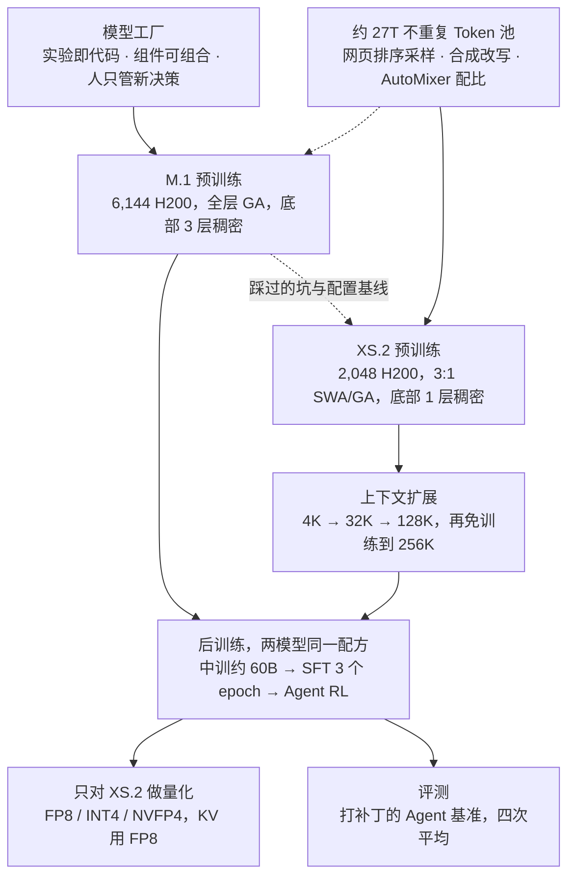

# Laguna M.1 / XS.2：先造模型工厂，再用五周交出第二个 Agent 编码模型

<!-- release-date: 2026-04-28 -->

> 本文依据本地 `papers/Poolside/Laguna-M1-XS2.pdf`，即 Poolside 的 **Laguna M.1/XS.2 Technical Report**，arXiv:2605.27605v1，2026-05-26 提交（封面日期 2026-05-28），共 37 页。页码均指 PDF 自身的页码。文中区分三件事：**报告明确写了什么**、**我们怎么解释或验算它**、**哪些是外部资料**。

## 阅读前先认识几个词

- **MoE（Mixture-of-Experts，混合专家）**：前馈网络拆成许多专家，每个 Token 只走其中几个；总参数大，每个 Token 真正用到的参数小。
- **Agent 编码（agentic coding）**：模型不是一次写完答案，而是在真实代码仓里反复调用工具（读文件、跑命令、改代码、跑测试），走几十上百步完成任务。
- **SWA 与 GA**：**滑动窗口注意力（Sliding Window Attention，SWA）** 只让当前 Token 看最近一小段；**全局注意力（Global Attention，GA）** 看整段历史。前者便宜，后者看得远。
- **KV Cache（键值缓存）**：生成时留在显存里的前文 Key、Value。GA 层的 KV 随上下文线性增长，SWA 层最多存一个窗口。
- **Muon**：把二维权重的更新方向做正交化的优化器。Laguna 从预训练到 RL 全程用它的 Moonlight 变体（PDF p. 6）。
- **WSD（Warmup-Stable-Decay）**：学习率先升到峰值、保持一段、最后衰减。稳定段的 checkpoint 可以换不同数据配比各跑一段短衰减。
- **可验证奖励**：RL 的奖励来自程序判定，比如仓库的单元测试过没过，而不是人或奖励模型打分。

报告给自家内部组件起的名字，读到对应章节再展开：**Titan**（训练库）、**Atlas**（推理库）、**Blender**（数据混合服务）、**Hive**（合成数据运行时）、**AutoMixer**（自动配比）。

## 一句话先说清

这份报告有两个主角，但重心不在模型本身，而在造模型的流程。Poolside 把数据、训练、评测、推理做成一套版本化、可组合的内部系统，叫 **Model Factory（模型工厂）**（PDF p. 1–3）。Laguna M.1 与 Laguna XS.2 是这套系统先后产出的两个 Agent 编码 MoE 模型：

- **M.1**：225.8B 总参数，每 Token 激活 23.4B，6,144 张 H200 预训练（PDF p. 1、6）；
- **XS.2**：33.4B 总参数，每 Token 激活 3B，2,048 张 H200 预训练，权重以 Apache 2.0 开放（PDF p. 1–2、6）。

报告最想让人记住的数字是时间：**XS.2 在 M.1 预训练刚结束时开工，从开始训练到发布只用了五周**（PDF p. 2）。它能这么快，是因为 M.1 踩过的坑、写好的数据管道、消融代理和评测 harness 都能原样接到新 run 上，剩下的只是「纯粹的模型设计问题」（PDF p. 5）。

两个模型在四个 Agent 编码基准上，报告自己的定位是「在各自重量级里与开源 SOTA 有竞争力」（PDF p. 1、27），不是新纪录：M.1 的 SWE-bench Verified 74.6，XS.2 是 69.9（PDF p. 26）。

如果只记一句：

> **模型规格是流水线的产物。拉开差距的，是能不能把上一代踩过的坑，变成下一代开工时已经打开的配置开关。**

## 两个模型放在一张表里

报告没给完整的 M.1 规格卡。下表只收 PDF 写明的数字，空格就是报告没写（PDF p. 1、5–6、9–10、23）：

| 项目 | Laguna M.1 | Laguna XS.2 |
|---|---|---|
| 总参数 / 每 Token 激活（含 embedding） | 225.8B / 23.4B | 33.4B / 3B |
| 注意力 | 每一层都是 GA | SWA 与 GA 按 3:1 交错，窗口 512 |
| 路由专家 / 激活 / 共享专家 | 未给 | 256 / 8 / 1，路由专家输出乘 2.5 再与共享专家相加 |
| 底部稠密层 | 3 层 | 1 层 |
| 层数 | 未给 | 40（量化一节提到） |
| 学习率日程 | cosine | WSD |
| 词表 | 100,352，BPE，两模型共用 | 同左 |
| 预训练 GPU | 6,144 × H200 | 2,048 × H200 |
| 预训练 Token | 从约 27T 不重复 Token 的池子采样，两模型都训了 30T 以上 | 同左 |
| 权重 | 报告未写开放 | Apache 2.0 |

两模型都是 pre-norm Transformer，归一化用 RMSNorm；第一层是稠密层，为了训练稳定（PDF p. 5）。

## 先看全景：工厂怎样把两代模型串起来

根据报告第 2–6 节的文字关系重画，是机制示意。虚线「踩过的坑与配置基线」对应报告原话：XS.2 的四处架构改动都先在更小的 MoE 代理上消融，再作为相对 M.1 基线的配置变更提上去（PDF p. 5）。M.1 那条数据虚线表示它也从同一个池子采样，但用的是更早、人工配比的管道（PDF p. 10）。

## 第一层矛盾：Agent 编码模型要同时满足三件互相拉扯的事

**第一件是长上下文。** Agent 轨迹是许多短的助手轮次夹着很长的工具输出，RL 窗口开到 131,072 Token，评测开到 256K（PDF p. 22、26）。M.1 每层都是 GA，KV Cache 随层数和长度一起涨。

**第二件是能部署到小设备上。** XS.2 的目标之一是跑在低显存设备上（PDF p. 23），这意味着 KV 要小、权重要能量化，而且量化后 Agent 任务不能坏。

**第三件是迭代速度。** 一家公司同时跑许多研究线，每条线的结论都要尽快并进大规模生产 run（PDF p. 3）。如果每次都要人手工拼数据、配置和评测，第二个模型不可能五周交货。

报告按这三件事给出答案：工厂解决第三件，XS.2 的注意力与量化解决前两件，数据与后训练则让一个小激活模型能在 Agent 编码上站住。

## 核心设计一：把模型研发从手作改成工厂

报告把工厂要回答的问题写成三句：怎样协调许多条独立的研究线；怎样持续提高研究速度；怎样把研究结果尽快并进大生产 run（PDF p. 3）。对应三条原则。

### 原则一：实验即代码

所有 run 的输入与配置（数据管道、消融、正式训练）都写成代码，提交进同一个仓库；每个 run 有唯一 ID；实验、输入和产物都登记成持久资产，互相记依赖（PDF p. 3）。控制平面用 Dagster 管这张资产有向图，研究者由此能回答两个问题：什么在跑、每个 run 依赖什么；启动实验就是登记一个配置资产，再用命令行或界面启动（PDF p. 3–4）。

血缘是双向的：预训练 shard 里的一个 Token，能回溯到去重、过滤、合成，直到源文档；每个 checkpoint、评测结果和推理部署，能回溯到产出它的训练 run（PDF p. 4）。

报告还写，这个控制平面也是内部 AI Agent 参与研究的入口：今天它们已经在设计并运行消融、监控 run、排查问题、汇总实验结果，作者预期它们会承担更多日常研究（PDF p. 4）。这是作者的陈述，报告没有单独评测它。

### 原则二：组件建一次，到处复用

研究与生产共用一个代码库，成功的创新理想情况下「翻一个配置开关」就能进生产（PDF p. 4）。后文会反复出现这些组件：

| 组件 | 做什么 | 页码 |
|---|---|---|
| Titan | 从 TorchTitan 改出来的 PyTorch 训练库，改动超过 2,200 处；预训练、后训练、RL 共用一个入口 | PDF p. 6 |
| Blender | 按配比与课程混合多源数据，用 gRPC 提供 batch | PDF p. 9 |
| Hive | 合成数据流水线运行时：编排器、生成器、裁判组成的循环 | PDF p. 13 |
| Atlas | 基于 vLLM、直接读 Titan 模型定义的推理库，同时服务评测、内部推理、线上流量与 RL rollout | PDF p. 22 |
| 代码执行平台 | 容器化环境，约一百万个仓库，同时供合成数据、评测和 RL 奖励使用 | PDF p. 20 |

### 原则三：把人的注意力留给新决策

重复、机械的活尽量自动化：训练故障恢复与事件升级在正常路径上不需要工程师，自动恢复走不动时才叫 on-call（PDF p. 4）。

最具体的例子是调度器。第一版基于 Volcano，两个限制后来成了硬约束：它按节点做驱逐与回收，高优先级任务一来整机被清空，无关的同居 pod 也得重新排队；集群拓扑存在 Kubernetes API 背后的 etcd 里，集群变动一频繁，放置时间被拖到几十分钟（PDF p. 4）。自研调度器改了三件事：按作业而不是按节点回收；拓扑由观察者同步进 FoundationDB，调度器不再直接查 etcd；pod 挂了优先在原节点拉起，缓存和网络拓扑都还在（PDF p. 4–5）。结果是放置时间稳定在一分钟以内，超参扫描、CI canary、被抢占后的回填都依赖这一点（PDF p. 5）。

后训练一节给了一个自助化的例子：XS.2 最初的模仿学习阶段由后训练核心组以外的人独立跑起来，不需要人同步（PDF p. 17）。

### 可靠性：跨副本哈希校验

规模上的硬件故障从变慢到整次 run 被静默污染都有。除了入场前压测每个节点、自动检测挂起与 NCCL 故障并从最新 checkpoint 恢复，报告特别强调**跨副本哈希校验**：数据并行的各副本应当逐位一致，定期对权重求哈希比对（PDF p. 8）。它主要抓 GPU 的静默数据损坏，尤其是没有 ECC 保护的算术逻辑与流水线寄存器。一次 run 里它抓到一台机器静默算错，全局梯度范数冲到约 $10^6$；同一台机器在更早的 run 里只造成轻微症状，因为那时激活更小（PDF p. 8）。它还抓到过 Muon 的 Newton–Schulz 迭代里几处非确定性（固定成确定性 kernel 解决），以及 checkpointer 在优化器状态路径上多插了一次类型转换、让 rank 0 的 $\beta$ 因子变成 FP64 而其它 rank 仍是 FP32 的漂移（PDF p. 8–9）。

### 代价与可迁移的部分

工厂是一家公司的内部系统：Dagster 的用法、FoundationDB 拓扑、自研调度器、Titan 那两千多处改动都没有开源。报告给的是原则与组件边界，不是可复现的仓库。能便宜迁移的是做法：把「数据、实验、checkpoint、评测」收成带 ID 的资产图；研究与生产共用一份代码；把调度器的快慢当成研究速度的一部分，而不是运维细节；给数据并行副本加哈希校验。

## 核心设计二：XS.2 相对 M.1 只改四件事

### 旧问题：M.1 的注意力每一层都付全价

M.1 每层都是 GA，这对长程 Agent 轨迹友好，但 KV Cache 与注意力算力都随层数和长度满额增长。XS.2 要上低显存设备，这笔账付不起（PDF p. 5、23）。

报告把 XS.2 相对 M.1 的架构与训练改动收成四条（PDF p. 5）：

1. 用 SWA 与 GA 交错替换 M.1 的全层 GA；
2. 学习率从 cosine 换成 WSD；
3. 给路由专家的输出加调制系数，做法类似 DeepSeek-V3 与 Nemotron 3；
4. 底部稠密层从 3 层减到 1 层。

每一条都先在更小的 MoE 代理上做针对性消融，再作为相对 M.1 基线的配置变更提上去（PDF p. 5）。

### 新设计：3 层窗口加 1 层全局，Query 头按层种分开给

图 (a) 的配置全部来自 PDF p. 5。要看清的是：**KV 头数两类层一样，变的是 Query 头**。这就是这篇报告「逐层 Query 头预算」的原文所在。

**我们的解释**：KV Cache 的大小由 KV 头数、头维度和缓存长度决定，不随 Query 头数增长。SWA 层的 KV 最多存 512 个 Token，多给 16 个 Query 头几乎不加缓存，却能让局部上下文被更多「视角」看；GA 层每个 Query 头都要对整段序列做注意力，把 Query 头从 64 收到 48，省的是全序列注意力的计算和 Q 投影，而不是缓存。报告没有把这笔账写成公式，附录消融的最后一步正是「48 GA / 64 SWA Q 头」。

图 (b) 是**我们的验算**：每层每 Token 的 K、V 共 $8 \times 128 \times 2 \times 2 = 4096$ 字节（8 个 KV 头、头维 128、K 和 V 两份、BF16 每元素 2 字节）。256K 上下文下一层 GA 约 1 GiB，一层 SWA 只存 512 个 Token、约 2 MiB。40 层若全是 GA 约 40 GiB；按 3:1 交错（10 层 GA + 30 层 SWA）约 10 GiB。这是数量级，不是报告给出的数字；「10 层 GA + 30 层 SWA」是按 40 层与 3:1 推出来的，报告没画逐层排法。

其余配置（PDF p. 5）：MoE 用 token-choice 路由，256 个路由专家里激活 8 个，另有一个每个 Token 都走的共享专家；路由函数是线性层加 sigmoid，Top-k 之后再归一化分数；路由专家的输出先乘 2.5 再与共享专家相加；负载均衡用 Qiu 等人的辅助损失，只在全局 batch 的非 padding Token 上计算。两类注意力层都带 softplus 的逐头门控。

### 消融怎么支持这些选择

附录 A.2 的代理是 16.6B 总参 / 2.3B 激活、22 层、128 个路由专家取 top-8 加 1 个共享专家（PDF p. 35，Table 8）。它在 4K 上预训练 335B Token，再各用 50B Token 扩到 32K 和 128K。4K 平均取自 10 个 base 基准，32K / 128K 平均各取自 4 个长上下文任务（APTBench、RULER QA、GSMInfinite、LongBenchV2-Academic）；基线重跑五次，4K 平均的标准差约 0.0026，差异小于约 0.005 视为噪声（PDF p. 34）。各行逐步叠加（PDF p. 35，Table 9）：

| 架构 | 4K 平均 | 32K 平均 | 128K 平均 |
|---|---:|---:|---:|
| 全层 GA，完整 RoPE，完整门控 | 0.5389 | **0.308** | 0.290 |
| + SWA 窗口 1024（3:1 交错） | 0.5292 | 0.274 | 0.267 |
| + 逐头门控，$\theta_{\mathrm{swa}} = 10{,}000$ | 0.5328 | 0.267 | 0.272 |
| + GA 部分 RoPE（50%） | 0.5425 | 0.266 | 0.284 |
| + SWA 窗口缩到 512 | 0.5449 | 0.285 | **0.304** |
| + GA 48 / SWA 64 个 Q 头，底部稠密层 1 层（最终） | **0.5455** | 0.305 | 0.296 |

读这张表分三步：

- **只插入窗口 1024 的 SWA，三列全掉**，32K 与 128K 掉得最多。窗口层不是免费的。
- **窗口从 1024 缩到 512 后，128K 反超全 GA**（0.304 对 0.290）。报告没有给注意力模式分析来解释为什么更小的窗口更好。
- **最后一行主要把 32K 拉回来**（0.285 到 0.305，几乎贴上全 GA 的 0.308），128K 略降到 0.296，仍高于全 GA。「逐层 Query 头预算」的直接证据就是这一行，但它和「底部稠密层减到 1 层」捆在同一步里，两者没有分开消融。

### 长上下文扩展只动 GA

预训练在 4K 上完成 WSD 衰减后，分两个各 100B Token 的子阶段扩展：先到 32K，再到 128K（PDF p. 6）。两个子阶段都**只对 GA 层用 YaRN**，全局 batch 仍是 24M Token，学习率用 cosine 从预训练峰值的 5%（$2.5 \times 10^{-5}$）降到 1%（$5 \times 10^{-6}$），不重新 warmup，因为他们发现直接续训比重新 warmup 迁移得更好。128K 阶段末对最近 10 个 checkpoint 做指数滑动平均，得到最终 base。**再到 256K 不做任何训练**，只把 GA 层的 RoPE scale 加倍（PDF p. 6）。

SWA 层的位置编码从头到尾不用改：窗口只有 512，基频 10,000 就够了。**我们的类比**：这和 DeepSeek-V2 只对解耦位置通道做 YaRN 是同一个思路，把「需要外推的那部分」隔离出来，扩展时只动它。

### 代价与边界

- 消融是 16.6B / 2.3B 的代理，不是 XS.2 本身，更不是 M.1；
- M.1 的层数与专家数报告没给，两代模型无法在同样的注意力配置上直接对照；
- 256K 是免训练的 RoPE 加倍，没有单独的 256K 长上下文消融；
- 路由调制 2.5 与底部稠密层 3 变 1，报告没有给单独的消融数字。

### 可迁移启发

KV 头数决定缓存形状，Query 头数决定这一层愿意花多少算力去看。两类层共用 KV 形状、只在 Query 头上分预算，比给整个网络换一套 GQA 配比更细。长上下文扩展只动看得远的那几层。

## 核心设计三：学习率从定律里来，稳定性的课记在 M.1 账上

### 配方

XS.2 预训练上下文 4K，WSD：线性 warmup 到峰值 $5 \times 10^{-4}$，稳定段保持峰值，最后 30% 的步数按 $1 - \sqrt{\cdot}$ 形状衰减到峰值的 5%（$2.5 \times 10^{-5}$）（PDF p. 6）。全程 BF16 混合精度，master 权重 FP32；例外是 RMSNorm 与 RoPE 的部分 FP32 运算，以及后面要讲的 LM head 输入梯度 all-reduce（PDF p. 6）。

### 峰值学习率从一条 WSD 专用的缩放定律来

WSD 的好处是一个稳定段 checkpoint 能拿去配不同数据、跑短衰减；坏处是最终 loss 的校准不如一次性 cosine 直接，按他们的消融，随手调的 WSD 有时在同等算力下输给调好的 cosine（PDF p. 6）。所以他们专门拟了一条 WSD 下的最优学习率定律：四档 MoE（2B–16B 总参 / 0.3B–2.2B 激活）× 六档学习率 × 五档 Token 预算，对每个 $(N, D)$ 在 $\log_{10}$ 学习率空间拟一条抛物线、取顶点，再对全局幂律做最小二乘（PDF p. 6，式 1）：

$$
\mathrm{lr}^{\star}(N, D) = 10^{4.488} \cdot N^{-0.4639} \cdot D^{-0.2661}
$$

$N$ 是激活参数量，$D$ 是含衰减段的总 Token 预算；换 batch 时按 $\sqrt{B/B_0}$ 缩放。XS.2 的 $N = 3.0\text{B}$、$B = 24\text{M}$ Token，定律给出约 $5.5 \times 10^{-4}$，实际用 $5 \times 10^{-4}$ 留一点安全边际（PDF p. 6）。**我们的验算**：取 $D = 30\text{T}$、$B_0 = 8\text{M}$，式 1 乘 $\sqrt{24/8}$ 正好约 $5.5 \times 10^{-4}$。

两处正文与附录不一致，读者自己留意：正文写扫描用的 batch 是 $B_0 = 8\text{M}$、Token 预算 30B–480B（PDF p. 6）；附录写 $B_0 = 8.4\text{M}$，拟合点取 $D \in \{60, 120, 240, 480, 960\}\text{B}$，其中 960B 是把 loss 曲线外推出来的（PDF p. 32–33）。附录还给了一个更严格曲率阈值下的稳健性拟合，指数变为 $-0.4393$ 与 $-0.2689$，$R^2 = 0.8865$（PDF p. 34）。

附录拿 Kimi K2 做了一次外推对照：$N = 32.6\text{B}$、$D = 15.5\text{T}$、$B = 67\text{M}$ 时定律预测约 $3.5 \times 10^{-4}$，K2 实际用 $2 \times 10^{-4}$，量级一致；作者自己说两边衰减比例、稀疏度、优化器（K2 用 MuonClip）、负载均衡和数据都不同，只能算提示性证据，不是定律在他们设定之外的验证（PDF p. 34）。

### M.1 暴露的三个稳定性坑，XS.2 开工前就补上

报告说 M.1 预训练暴露了几处稳定性问题，教训一开始就带进了 XS.2，XS.2 预训练没再遇到稳定性问题（PDF p. 9）。

**专家崩塌。** Muon 更新矩阵参数、AdamW 更新非矩阵参数，两者的有效 weight decay 差一个数量级。他们用 Moonlight 式的学习率缩放让 Muon 跑在 AdamW 量级的学习率上。初步实验里，不做这个缩放、再用常规 weight decay 系数，大约训到 450B Token 时出现专家崩塌，并沿前三个 MoE 层逐层扩散，直到发散（PDF p. 9）。

**LM head 输入梯度 all-reduce 的精度。** 默认混合精度下 LM head 输入梯度是 BF16，列切分张量并行时，这份梯度也按 BF16 做 all-reduce。他们没有 z-loss，RMSNorm 也不减均值，pre-softmax logit 没有任何约束会往回拉；M.1 上出现了明显的正向 logit 漂移。激活越大，这步 BF16 all-reduce 越成为主要数值误差源，并扩散到整个模型。处理是：LM head 仍张量并行，但这步 all-reduce 强制 FP32（PDF p. 9）。

**padding 被路由。** 即使做了 sequence packing，约 5% 的训练 Token 仍是 padding，而它们既被路由、又计入负载均衡损失。padding 上的语言模型损失被 mask，padding embedding 学不动；padding 在注意力里又不和周围 Token 混合，于是一个 batch 里所有 padding 以同一个表示到达路由器，被同时送到同一个专家，可能把它打满。XS.2 加了跳过 padding 路由与负载均衡的选项，后续消融确认这样对路由稳定更好（PDF p. 9）。

三个坑里，前两个是数值与优化器的相互作用，第三个是数据布局对 MoE 的副作用；没有一个是「再加一个稳定化损失」能盖住的。

### 分布式训练里和 MoE 相关的两处

**设备网格。** 非 MoE 层是 $(\mathrm{PP}, \mathrm{DDP}, \mathrm{FSDP}, \mathrm{TP})$，MoE 层是 $(\mathrm{PP}, \mathrm{DDP}, \mathrm{FSDP}, \mathrm{EGP}, \mathrm{ETP})$，EGP 按专家切、ETP 把单个专家再按张量维切，两者乘积等于 TP。两模型都设 $\mathrm{ETP} = 1$，因为单个专家的中间维太小，再切不划算（PDF p. 7）。分布式 Muon 把每个参数的 Newton–Schulz 正交化只交给分片它的 rank 之一，算完把正交化后的梯度分片发回；配合通信重叠，M.1 预训练时优化器开销不到训练步时的 1%（PDF p. 7）。

**把 MoE 的通信融进 grouped GEMM。**

图引自 PDF p. 8 Figure 2。专家并行把专家权重分到 8 张 NVLink 互连的 H200 上，每层要一次 dispatch 与一次 combine。H200 每卡 132 个 SM，dispatch 时专门拿出 8 个 SM 做拷贝（图上 SM 0–7），其余 SM 跑 grouped GEMM，tile 调度器等到所需专家的旗都立起再算（PDF p. 7）。combine 则改了 GEMM 的 epilogue：算完的 Token 不先写回本地 HBM，而是经共享内存整理后直接通过 NVLink 发回属主（PDF p. 7）。另留 5 个 SM 给数据并行的 NCCL（4 个做 FSDP 的 AllGather / ReduceScatter，1 个汇总辅助损失）；dispatch / combine 走机内网络，数据并行走机间网络，互不抢带宽（PDF p. 7–8）。

## 核心设计四：数据不再「只留精品」，而是排序后按配额采样

### 旧问题：30T 的训练量会把高精管道抽干

两模型都从约 27T 不重复 Token 的池子采样，各训 30T 以上（PDF p. 9–10）。M.1 用的是高精度、人工配比的管道，暴露两个瓶颈：高价值子集被过度重复；各来源之间的预算分配不优。报告的判断是，挑战从「数据稀缺时最大化精度」变成了「长训练下控制重复和多样性」（PDF p. 10）。XS.2 的回答是三件事：更高召回的网页管道、规模化的合成改写、用 AutoMixer 替换人工配比（PDF p. 10）。

### 网页：保守地丢纯噪声，其余按贡献分排序

管道从原始 HTML 吃 Common Crawl：自研解析器优先保召回，专门处理样板文字与技术内容；语言识别用 GlotLID、pycld2 兜底，筛英文；去重偏好 snapshot 级模糊去重，因为跨 snapshot 的相似页面在统计上更可能含有相关事实，对知识类基准更好（PDF p. 10）。全部处理跑在 Spark 上，稳态每天约 $2 \times 10^{13}$ Token（PDF p. 10）。

打标时把质量拆成两个轴：噪声轴 $N$ 和信息轴 $I$，各取 0–5 的整数，因为一张满是样板文字的页面仍可能有教育价值（PDF p. 10）。每个标注再映射到 Table 1 的六级贡献量表（0 无用、1 明确有害、2 偏负、3 偏正、4 确定有益、5 无瑕），并在 0–2 这段含糊区把 $N \times I$ 网格标得很密，把「真没用」和「有噪声但能用」分开（PDF p. 10–11）。

M.1 用规则过滤时遇到精度与覆盖的两难：规则宽了误删中等质量文档，规则严了只覆盖噪声尾巴的一小部分（PDF p. 11）。XS.2 的主拒绝路径因此改成模型打分，而且故意保守：只在确信是纯噪声时才删；其余文档按连续的贡献分排序，按排序去填配额。单一质量维度太粗、也不好预测，所以先用开源的多属性标注模型 Propella 打标，取经 PCA 去相关的一组维度合成复合分；有用的维度包括内容质量、教育价值、信息密度、内容完整性、内容比例、商业偏向（PDF p. 11）。复合分彻底删掉 25.8% 的网页样本，同时找回约 34% 此前被静态规则与词表分类器排除的高质量文档；通过过滤只代表有资格被采样（PDF p. 11）。最终网页 mix 约 13T Token（PDF p. 12，Figure 3）。

分桶边界用候选阈值附近的盲两两比较来定，让跨边界的文档确实能区分预训练价值（PDF p. 11）。Figure 4 是分桶前后的文档占比（PDF p. 12，数值读自图上标注）：

| 桶 | B0 | B1 | B2 | B3 | B4 | B5 | B6 | B7 |
|---|---:|---:|---:|---:|---:|---:|---:|---:|
| 质量档 | 低 | 低 | 低 | 低 | 中 | 中 | 高 | 高 |
| 过滤后原始占比 | 14.0% | 15.6% | 10.3% | 21.2% | 24.8% | 8.0% | 4.4% | 1.7% |
| 最终采样权重 | 0.006× | 0.012× | 0.018× | 0.03× | 0.15× | 1× | 1.5× | 2.4× |
| 加权后占比 | 0.4% | 0.8% | 0.8% | 2.7% | 15.8% | 34.1% | 28.1% | 17.4% |

低质量桶 B0–B3 原本合计 61.1%，加权后只剩 4.7%，但**没有被清零**；B5–B7 从 14.1% 升到 79.6%。这是有意设计：留一点中低质量的长尾，是为了保多样性（PDF p. 10、12）。

### 合成数据：约占 13%，来自约 4.4T 生成 Token

合成数据是补充而不是替代：规整呈现方式、补足少见格式、显式写出计划、理由与问答结构。XS.2 各阶段约 13% 的 mix 来自合成，生成池约 4.4T Token，一端是偏种子的形式改写，一端是昂贵的多阶段组合蒸馏（PDF p. 11）。

每条合成管道由六类零件组合：输入集 $\mathcal{S}$、元数据 $\mathcal{M}$、生成器 $G$、过滤 $f$、验证 $V$、前后处理（PDF p. 11–12）：

$$
P = \mathrm{post} \circ f_n \circ G_n \circ \cdots \circ f_1 \circ G_1 \circ \mathrm{pre}
$$

Hive 把它编译成一个「编排器 + 生成器 + 裁判」的交互循环，迭代一条合成管道只是改配置，不必重写代码（PDF p. 13）。两条原则：教师一次做不对的任务，要么拆开、要么换更强的教师；已经知道的关于输出的信息，全都作为元数据交给生成器（PDF p. 13）。Table 2 列了四种形状及其对预训练语料的贡献量级：形式改写约 $10^{12}$ Token，跨域转换（如数学与代码互转）约 $10^{10}$，多阶段级联（教材合成、按 diff 生成编码任务等）约 $10^{11}$，多轮 rollout 约 $10^{10}$（PDF p. 14）。

### AutoMixer：用一群小模型学「配比怎么影响能力」

人工调 50 多个数据组的配比不可行。AutoMixer 的流程（PDF p. 14–16，Figure 6）：

每次数据消融大约训 60 个代理，每个约 0.5B 参数（Figure 6 标 550M）、约 60B Token；探索的语料超过 50 个异构数据组（PDF p. 14）。能力分五类：代码、数学推理、STEM 知识、常识推理、一般知识（PDF p. 15）。回归器实际用的是非线性模型（PDF p. 15）。优化目标是加权能力分，加一项 KL 防止塌到少数几个高信号来源（PDF p. 16）：

$$
\mathcal{L}(x) = -\sum_{j} w_j f_j(x) + \lambda\, D_{\mathrm{KL}}(x \,\|\, x_0)
$$

$x$ 在单纯形上，$x_0$ 是人工先验配比，$f_j$ 是第 $j$ 类能力的回归器。

小规模验证是 3B 模型训 1.5T Token，优化后的配比相对人工先验（PDF p. 16，Table 3，均为相对变化）：

| 类别 | 基准与变化 |
|---|---|
| 优化目标 | HumanEval+ +43%，MBPP+ +15%，Crux-I +54%，Crux-O +48%，MultiPL-E +27%，GSM8K +41%，MMLU +5% |
| 未参与优化 | MATH +25%，LiveCodeBench +39%，APTBench-4k +35%，BigCodeBench +16% |
| 常识代价 | ARC-C −6.8%，WinoGrande −1.4%，PIQA −0.9%，HellaSwag −1.3% |

这是代理实验，不是 XS.2 本体的消融；作者认为增益泛化到了没直接优化的基准，常识小幅回撤在意料之中，因为目标本来就偏代码和数学（PDF p. 16）。

XS.2 最终的预训练配比（PDF p. 16，Table 4）：生代码 30.6%、网页 25.2%、合成与代码—文本 25.4%、数学 9.0%、知识 6.6%、指令风格 1.4%、学术论文 1.1%、书 0.7%。相对 M.1，配比明显转向更宽的网页覆盖、合成与代码—文本、数学向语料，同时保持以代码为主的底盘（PDF p. 17）。注意「合成约占 13%」和「合成与代码—文本 25.4%」不是同一个口径：后者把合成与代码—文本合成了一个数据组。

### 可迁移启发

- Token 预算变长之后，过滤策略要反过来：短训可以狠删噪声，长训要保多样性，否则高价值子集会被重复到过拟合；
- 质量是排序信号，不是二值门；
- 配比优化可以变成「先训一群小模型，再优化代理回归器」，代价是每次约 60 个 0.5B × 60B 的 run。不要把 Table 3 的 +43% 读成 XS.2 本体涨了 43%。

## 核心设计五：后训练在两代之间几乎原样复用

后训练接在预训练与上下文扩展之后，分三段（PDF p. 17）：

| 阶段 | 规模 | 重点 |
|---|---|---|
| 中训（mid-training） | 约 60B 不重复 Token，1 个 epoch | 聊天、推理、Agent 编码的宽混合 |
| SFT | 3 个 epoch，每个约 40B Token | 以 Agent 编码为主 |
| RL | 只用可验证奖励，在线 CISPO | 生产用的同一套 Agent harness |

M.1 先就绪，他们在它上面迭代数据、超参和部分架构选择；XS.2 因为预训练周转快随后就绪，两模型的后训练并行进行。除超参与少量数据修复外，两代配方相同（PDF p. 17）。中训有效 batch 128、最长序列 131,072、cosine 学习率（50 步 warmup，峰值 $1 \times 10^{-5}$，终值 $2 \times 10^{-7}$），Muon，短序列打包（PDF p. 18）；SFT 共用这套设置，按评测做 early stopping（PDF p. 19）。

### 特殊 Token：小模型随手初始化，大模型会炸

中训引入 XML 风格的特殊 Token：`<assistant>`、`</assistant>`、`<think>`、`</think>`、`<tool_call>`、`</tool_call>`。它们的 embedding 在预训练前随机初始化，一直不动，到中训才开始学（PDF p. 17）。XS.2 这样直接中训没问题；M.1 上，特殊 Token 与普通 Token 的 embedding 不匹配，导致梯度尖峰、死专家和更广的不稳定（PDF p. 17）。

处理分两步：先用子词平均初始化，例如 `<think>` 取 `<th`、`ink`、`>` 三个子词 embedding 的均值，让新 Token 起步就落在合理的位置；再跑 100 步 warmup，冻结除输入 embedding 与 LM head 之外的整个网络，让新 Token 先适应。作者说这是他们试过的最稳、工具调用格式错误率从一开始就最低的做法（PDF p. 17）。

### 格式与 TITO：训练时的 Token 和线上模板必须逐字符一致

推理块用 `<think>` 标签，工具调用用与 GLM 系列兼容的 XML 格式。模板上的 `enable_thinking` 打开时，生成前先放一个开标签，模型可以立刻合上也可以继续想；SFT 里始终省略空推理块，于是 flag 打开时模型就会写推理。训练时保留完整的历史思考块（PDF p. 17）。

接入开源工具解析器时，他们发现多 Token 的流式增量会让解析器吐出非法工具调用，于是向 vLLM 回馈了改进的推理与工具解析器（PR #35208）：推理是否结束只看当前这一轮而不是整个 prompt；一条增量跨越推理、正文、工具调用边界时不再把边界后的内容静默丢掉——投机解码和 vLLM 合并积压增量时都会产生这种多 Token 增量（PDF p. 18）。

RL 的执行器用 **TITO（Token-In, Token-Out）** 接口：多轮之间 Token ID 不变，免得重新分词导致 ID 漂移。代价是 RL 产生的轨迹可能与生产模板差一个换行或尾空格，这种细微差别在部署时会明显掉点。他们加了一个 `render_assistant_messages_raw` 开关：打开时模板把 rollout 的原始 Token 原样放进助手块；每步生成后用它渲染对话历史，断言结果字符串与 rollout 时存下的解码前缀完全一致（PDF p. 18）。

### 中训与 SFT 的配比完全不同

中训约 40% 逻辑与推理、30% 编码与 Agent、30% 通用聊天（PDF p. 19）。他们发现要仔细调的是：是否有工具调用、提供了多少种工具、每条轨迹平均调用几次；有无推理及其比例；推理长度与题目难度；每条轨迹的轮数和每轮 Token 数（PDF p. 18–19）。早期版本出现过「没提供工具时就省略推理或写出退化推理」这类与轨迹长度、工具是否在场绑定的故障，跨领域把这些特征配平后消失（PDF p. 19）。

SFT 约 85% 是 Agent 轨迹，分四块（PDF p. 19）：

| 部分 | 占比（按 Token） | 内容 |
|---|---:|---|
| 无推理的 Agent 编码 | 约 30% | 开源教师生成的单轮轨迹 |
| 带推理的 Agent 编码 | 约 45% | 样本数与来源同上，加了推理所以更长 |
| Agent 数学 | 约 3% | 只留数值答案可验证的题，去掉开源模型容易解的 |
| 非 Agent 样本 | 约 22% | 减轻非 Agent 能力的遗忘 |

表里前三块 Agent 相关部分合计约 78%，与同一页「约 85% 是 Agent 轨迹」的说法对不上，报告没有解释差在哪里。

另外加了 1.3B Token 的多 harness 轨迹，来自 OpenHands、OpenCode、Mini-SWE-Agent，并故意保留这些框架的原生行为：自定义子 Agent、上下文压缩、规划脚手架、提醒系统；作者说这些改善了内部评测上的泛化（PDF p. 20）。

### 合成代码环境：把真实 commit 变成可验证任务

内部管道把公开仓库的真实 git commit 变成训练任务：题目描述、仓库 checkout、隐藏的测试补丁都取自 commit，commit 的 diff 当标准解。双向正确性检查要求标准解能过测试、空解必须失败，以此去掉平凡测试和「测试其实没覆盖这次改动」的 commit；再按仓库热度与代码质量百分位过滤，可选每仓只留一个任务。约 236k 个原始 commit 留下 3–6 万个任务，同时供 SFT（教师轨迹）和 RL（仓库测试集当二元验证器）（PDF p. 19）。

### 指令遵循：不补这块，一半以上任务在写代码前就零分

没有显式的指令遵循监督时，RL 容易灾难性遗忘这些行为：超过一半的 Agent 任务拿不到奖励，因为模型在任何代码被评估之前就违反了 system 约束（PDF p. 19–20）。做法是用 EvolInstruct 风格的生成器为每个任务造一组行为要求，追加到 system message，让轨迹同时演示「把代码写对」和「守住约束」；再做一个专用裁判，把 system message 拆成独立要求逐条打分。内部评测集把同一管道套在 SWE-bench Verified 上，于是能同时看通过率和遵循率。消融调过要求数量、是否保留原 system message、教师选择、是否需要生成评分细则、过滤严格度，结果遵循率版和直接通过率都上升了（PDF p. 20）。报告没给具体数字。

## 核心设计六：Agent RL 用生产 harness 跑，正奖励只来自验证器

RL 阶段让策略自己驱动已经上线的 Agent harness，在真实代码仓、终端沙箱和带工具的数学题上产生多轮轨迹；工具 API、聊天模板、编排层都与客户用的是同一份，改线上 harness 就是改策略正在对着训练的东西（PDF p. 20）。每条 rollout 从代码执行平台起一个容器，验证器返回后销毁，任一时刻平台上有数千个容器在跑（PDF p. 20）。

### 算法：CISPO 加长度加权的留一基线

每个 prompt 采一组 $G$ 条轨迹，$r_i$ 是第 $i$ 条的终局奖励，$w_i$ 是它被计奖励的（助手生成的）Token 数。长度加权的留一基线与优势是（PDF p. 21，式 2）：

$$
b_i = \frac{\sum_{j \ne i} w_j r_j}{\sum_{j \ne i} w_j}, \qquad A_i = r_i - b_i
$$

然后对助手 Token 均匀施加 Token 级的 REINFORCE 代理损失，重要性比率被裁剪（PDF p. 21，式 3）：

$$
\mathcal{L}(\theta) = -\mathbb{E}\Big[\mathrm{clip}\big(\rho_t,\ 1 - c_{\mathrm{low}},\ 1 + c_{\mathrm{high}}\big)\, A_i \log \pi_\theta(y_t \mid x, y_{<t})\Big], \qquad \rho_t = \frac{\pi_\theta(y_t \mid x, y_{<t})}{\pi_{\theta_{\mathrm{old}}}(y_t \mid x, y_{<t})}
$$

非对称裁剪 $(c_{\mathrm{low}}, c_{\mathrm{high}}) = (1, 4)$，有效裁剪区间是 $[0, 5]$，只在严重偏离采样策略的 Token 上起作用。这个组合是和 GRPO、GSPO 对比消融后选的，标准是最终评测质量加训练稳定性（PDF p. 21）。Moonlight 缩放在 M.1 的 RL 里关掉，在 XS.2 的 RL 里打开（PDF p. 21）。

### 奖励：一串小负分，唯一的正分来自验证器

轨迹结束后按固定顺序过检查，**第一个失败的检查决定奖励**（PDF p. 21）：

| 顺序 | 检查 | 奖励 | 作用 |
|---|---|---:|---|
| 1 | 解析错误：畸形工具调用或违反聊天模板 | −0.1 | 只罚最后一轮，压住格式漂移又不盖过验证器 |
| 2 | 最少步数：工具调用不到 $n_{\min}$ 次就退出 | −0.1 | 挡住还没验证就放弃的短轨迹 |
| 3 | 超时或达到最大步数 | 0.0 | 不额外惩罚 |
| 4 | 任务验证器 | 1.0 / 0.0 | 唯一正分：SWE 是仓库单测，终端是 bash 断言，数学是数值精确匹配 |

另有一项逐步惩罚：某一步的工具调用执行出错，就只在那一步的 Token 上给 −0.05，把信用集中到出错的那一步（PDF p. 21）。长程信用分配完全靠终点的二元验证器，经 $A_i$ 传给轨迹里的每个 Token。

任务分三类、共用一套工具 API：代码仓任务（内部 SWE 集合加公开数据集）、shell 任务、必须用代码执行工具算出数值答案的数学题；后者的作用是在同一套工具 API 下保住中训建立的推理能力（PDF p. 21）。任务按初始 checkpoint 的历史通过率分桶，永远全对与永远全错的删掉，其余按 $(1 - \text{pass rate})$ 采样，让分布偏向「难但可解」（PDF p. 22）。

### 训练与推理之间的权重同步

训练 GPU 与推理 GPU 在物理上分开，中间是高带宽互连。权重用 NCCL 点对点、GPUDirect RDMA 直送，不经主机内存或对象存储；推理副本数 $m$ 保持在训练侧 $n$ 的 2–3 倍，用来平衡速度与 off-policy 程度；传输异步，训练不等（PDF p. 22）。

每 2 个优化步广播一次权重。两条同步规则保证安全：广播会触发推理侧 KV Cache 重置，缓存不会混入两个权重版本编码的 Token；权重更新会阻塞正在进行的 rollout 步，任何一步都不会跨越一次刷新。于是从每条 rollout 看，策略在时间上是分段不变的，这正是损失里 $\rho_t$ 隐含的假设（PDF p. 22）。轨迹陈旧上限设为 10 个优化步，但按他们的训练 / 推理 GPU 配比从来没碰到（PDF p. 22）。

发布用的 RL 只把推理侧 KV Cache 存成 FP8，覆盖 131,072 Token 的 Agent 窗口，单个推理副本能承载的并发轨迹约翻倍；推理侧权重始终是 BF16（PDF p. 22）。预发布消融里试过把推理权重也在线量化成 FP8：梯度范数和奖励曲线都贴着 BF16 基线，重要性比率也在裁剪范围内，唯一可见的是训练—推理不一致（逐 Token KL 与对数概率差）变大；因为说不准这在持续多天的 RL 里会怎样演变，发布 run 保守地用了 BF16 权重（PDF p. 22）。这是保守选择，不是「FP8 权重无害」的证明。

## 量化：只针对 XS.2，坏掉的地方先出现在 Agent 任务上

XS.2 用 BF16 预训练和微调，量化用 LLM Compressor，因为它与 vLLM 接得紧。量化对象是 MoE 层的权重（FP8、INT4、NVFP4 三种）和 KV Cache（FP8）（PDF p. 23）：

| 方案 | 做法 | 结果 |
|---|---|---|
| FP8 KV Cache | 基于绝对最大值缩放，用 128 条长上下文 Agent 轨迹校准，按张量一个 scale 以兼容各种 FP8 注意力实现 | — |
| FP8 权重（W8A8） | 先做 SpinQuant R1 旋转；权重每 128 × 128 块、激活每 1 × 128 组一个 scale，激活动态缩放、不需校准 | 相对 BF16 测不出质量下降 |
| INT4 权重（W4A16） | SpinQuant R1 旋转后用 AWQ，同一套 128 条轨迹校准；起初掉点不可忽略，改成混合精度 | 最终方案只有边际下降 |
| NVFP4 | 直接训练后量化即使混合精度也掉点，改用量化感知蒸馏（QAD），不做 SpinQuant | 最终方案只有边际下降 |

（PDF p. 23–24）

图引自 PDF p. 23 Figure 7，横轴层号 0–39，图注里的数值是读图估计。它解释了 INT4 为什么要混合精度：离群激活从大约第 30 层开始堆积，所以**前 30 层用 INT4、后 10 层用 INT8**（INT8 按 1 × 128 分组缩放）（PDF p. 23）。切分点跟着离群激活出现的位置走，而不是按整数比例拍的。

NVFP4 用标准的 microscaling：每 1 × 16 一组、FP8 的局部 scale，加一个 FP32 的整张量全局 scale。QAD 从高精度 checkpoint 出发，冻结其它参数，只优化 MLP 的 BF16 权重，前向时做量化—反量化，让学生在固定蒸馏集上匹配教师；全词表 KL 用 DeepSeek-V4 的做法降成本：缓存教师最后的隐状态，用冻结的输出头重建双方 logits（PDF p. 24）。

最有用的一条是失败经验：中间几版不成功的量化，掉点**主要出现在 Agent 编码基准上**，传统单轮基准受影响小得多；报告因此强调量化验证要覆盖对格式要求严格的 Agent 任务（PDF p. 24）。报告没有给 BF16 与各量化版本在 SWE-bench 上的对照数字。

## 评测

### Base 模型：只评了 XS.2

Table 5 把 XS.2 base 与同档开源 MoE base 对比，另放更大的 MiMo-V2-Flash-Base 作参照（PDF p. 24–25）。XS.2 的分数来自内部框架；† 表示引自 MiMo 或 Nemotron 3 Nano 的技术报告，其余用内部框架复现。

| 基准 | XS.2 | Qwen3.5-35B-A3B | Nemotron-3-Nano | Gemma-4-26B-A4B | MiMo-V2-Flash |
|---|---:|---:|---:|---:|---:|
| 总参 / 激活 | 33.4B / 3B | 35B / 2.6B | 31.6B / 3.6B | 25.2B / 3.8B | 309B / 15.1B |
| BBH | 80.9 | **86.3** | 79.1 | 76.4 | 88.5† |
| MMLU-STEM | 78.1 | **80.2** | 75.3 | 70.4 | 89.1 |
| MMLU-Pro | 53.0 | 62.5 | **65.1†** | 47.5 | 73.2† |
| GSM8K | 84.2 | 91.5 | **92.3†** | 75.4 | 92.3† |
| MATH | 58.8 | 60.0 | **82.9†** | 38.9 | 71.0† |
| LiveCodeBench v6 | **29.3** | 24.4 | 22.5 | 18.1 | 30.8† |
| MultiPL-E | **58.4** | 57.9 | 56.1 | 45.1 ∗ | 61.1 |
| BigCodeBench | **53.8** | 52.0 | 50.2 | 44.6 | 70.1† |
| CRUXEval-I (CoT) | 61.9 | **66.0** | 63.2 | 54.7 | 67.5† |
| CRUXEval-O (CoT) | 71.7 | **71.9** | 63.4 | 60.0 | 79.1† |

加粗是同档四个模型里的最高分（不含 MiMo）。∗ Gemma-4 的 MultiPL-E 用了略改的 prompt（末尾补两个空格缩进），否则 cpp、sh、ts 会大幅退化（PDF p. 25）。

报告的读法：同档里 XS.2 在多数编码任务上领先，LiveCodeBench v6 和 MultiPL-E 接近大得多的 MiMo-V2-Flash-Base（PDF p. 25）；表上也看得出知识与数学不是强项。报告把预训练基准当作这个阶段能拿到的最有用信号，但明确说真正优化的目标是后训练后的 Agent 评测（PDF p. 25）。M.1 没有 base 表。

### Agent 评测：报告口径

四个基准：SWE-bench Verified、SWE-bench Multilingual、SWE-Bench Pro、Terminal-Bench 2.0（PDF p. 25）。Laguna 用自家的终端编码 harness `pool`，每任务最多 500 步，温度 1.0、top_k 20、打开 thinking、上下文 256K；沙箱每任务 2 CPU / 8 GB 内存，Terminal-Bench 2.0 为 32 CPU / 48 GB；每个基准跑四次，报四次平均的 pass@1（PDF p. 26）。外部模型的分数只取官方发布材料，例外是 Gemma 4 31B（取 Qwen 团队公布的最高分）和 Claude Haiku 4.5 的 Pro 与 Terminal-Bench（取官方榜）（PDF p. 25）。

XS.2 对同档模型（PDF p. 26，Table 6；Figure 1 画的是同一组数字）：

| | XS.2 | Devstral Small 2 | Gemma 4 | Qwen3.5 | Qwen3.6 | Haiku 4.5 | GPT-5.4 Nano |
|---|---:|---:|---:|---:|---:|---:|---:|
| 总参 / 激活 | 33.4B / 3B | 24B / 24B | 31B / 31B | 35B / 3B | 35B / 3B | — | — |
| SWE-bench Verified | 69.9 | 68.0 | 52.0 | 69.2 | **73.4** | 73.3 | — |
| SWE-bench Multilingual | 57.7 | 55.7 | 51.7 | 60.3 | **67.2** | — | — |
| SWE-Bench Pro | 46.3 | — | 35.7 | 44.6 | 49.5 | 39.5 | **52.4** |
| Terminal-Bench 2.0 | 35.7 | 22.5 | 42.9 | 40.5 | **51.5** | 29.8 | 46.3 |

M.1 对同档模型（PDF p. 26，Table 7）：

| | M.1 | Devstral 2 | GLM-4.7 | DeepSeek-V4-Flash | Qwen3.5 | Sonnet 4.6 |
|---|---:|---:|---:|---:|---:|---:|
| 总参 / 激活 | 225B / 23B | 123B / 123B | 355B / 32B | 284B / 13B | 397B / 17B | — |
| SWE-bench Verified | 74.6 | 72.2 | 73.8 | 79.0 | 76.2 | **79.6** |
| SWE-bench Multilingual | 63.1 | 61.3 | 66.7 | **73.3** | 69.3 | — |
| SWE-Bench Pro | 49.2 | — | — | **52.6** | 50.9 | — |
| Terminal-Bench 2.0 | 45.8 | 32.6 | 41.0 | 56.9 | 52.5 | **59.1** |

表的形状很清楚：两个模型都能压过同档的 Devstral，XS.2 在 Verified 与 Pro 上略高于同为 3B 激活的 Qwen3.5-35B-A3B；但同档的 Qwen3.6-35B-A3B 四项全面更高，M.1 也在四项上都低于 DeepSeek-V4-Flash 与 Qwen3.5-397B。Terminal-Bench 2.0 是两个模型最弱的一项。报告自己的措辞是「有竞争力」（PDF p. 27），读者不要读成领先。

### Reward hacking：四个官方基准当时都能被钻空子

写报告时，他们发现四个 Agent 基准的官方版本都在某种程度上可以被钻空子：任务镜像里泄漏了 git 历史，或者可以联网搜到参考解；公开榜上也有被钻空子的证据（PDF p. 26）。他们给受影响基准的镜像打了补丁、去掉 git 历史泄漏，并向官方仓库提了 issue 和 PR；报告里所有分数都跑在打过补丁的镜像上。另做了一个专抓这类作弊的裁判，事后跑过 M.1 与 XS.2 的全部评测，裁判加人工复核没有发现显著的 reward hacking（PDF p. 27）。

附录 A.3 还列了一长串「不是作弊、是基础设施噪声」的修补（PDF p. 35–37）：Terminal-Bench 2.0 的第三方限流、依赖漂移、telnet 会话与过严断言；SWE-bench Verified 的 setuptools 版本、pytest 测试名不匹配、w3.org 返回 403、httpbin 瞬时 5xx；Multilingual 去掉未来的 git tag、沙箱内核 epoll 行为差异、线程饥饿死锁；Pro 去掉检出之后的 git 历史、修正测试名的尾标点与聚合后缀。这提醒读者：Agent 评测分数里有一部分是评测工程本身，不同团队的数字很难严格可比。

## 报告承认的限制，和报告没说的事

### 报告自己承认或明确限定的

- 两个模型在各自重量级里「有竞争力」，不是领先（PDF p. 1、27）；
- WSD 定律对 Kimi K2 的外推只是提示性证据（PDF p. 34）；
- 推理侧 FP8 权重的长期影响说不准，所以发布 run 没用（PDF p. 22）；
- 中间几版量化在 Agent 任务上明显掉点（PDF p. 24）。

### 报告没有公开的

- M.1 的层数、隐藏维、专家数、Query 头数，以及 XS.2 的逐层排法；
- 路由调制 2.5、底部稠密层 3 变 1 的单独消融；
- 预训练的确切 Token 数（只写 30T 以上）、WSD 稳定段长度、总算力与墙钟；
- 合成数据各管道用的教师模型；AutoMixer 回归器的形式与 $w_j$、$\lambda$ 取值；
- 中训与 SFT 的数据来源明细、教师模型；指令遵循消融的具体数字；
- RL 的组大小 $G$、$n_{\min}$、训练步数、墙钟；
- 量化前后的 Agent 基准对照表；
- Titan、Atlas、Hive、调度器的实现。

## 最值得带回自己项目的六条

### 1. 工厂的产出是可复用的 run，模型只是其中一个产物

XS.2 的四处改动能在五周内上车，是因为它们被表达成相对 M.1 基线的配置变更。实验即代码、双向血缘、研究与生产同一个仓库，比再写一个训练框架更接近这份报告真正做的事。

### 2. 注意力预算按层种分配

KV 头数锁定缓存形状，Query 头数按「这一层看多远」来给：窗口层便宜就多给，全局层贵就少给；RoPE 外推也只改全局层。

### 3. 长训练的数据问题是重复与多样性

保守删纯噪声、其余按分数排序采样，比把中低质量全删掉更能撑过 30T。配比用一群小代理加回归器来搜，并用 KL 拉住先验。

### 4. 稳定性问题要到数值与数据布局里去找

Muon 与 AdamW 的有效 weight decay 对齐、LM head 输入梯度 all-reduce 的精度、padding 被路由到同一个专家，这三个坑都不是加一个正则项能盖住的；跨副本哈希校验能把静默错误变成可见错误。

### 5. Agent RL 的正信号只来自可执行的验证器

格式、步数、工具错误都只给小负分，1.0 只从测试来；训练用的 harness 必须就是线上那一份，Token 与模板要逐字符对齐。大模型加新特殊 Token 时，先做子词平均初始化和短 warmup。

### 6. 量化好不好，要在 Agent 轨迹上看

中间失败的量化方案单轮基准几乎看不出来，Agent 编码已经坏了。混合精度的切分点跟着离群激活出现的层走。

## 关键词回看

- **Model Factory**：把数据、训练、评测、推理收成带血缘的版本化资产，让新模型只剩模型设计问题。
- **逐层 Query 头预算**：GA 层 48 个 Q 头、SWA 层 64 个，KV 都是 8 个头；变的是计算，不是缓存形状。
- **3:1 SWA / GA，窗口 512**：XS.2 相对 M.1 全层 GA 的主要效率改动；256K 靠 GA 层 RoPE scale 加倍，不再训练。
- **路由专家调制 2.5**：路由专家输出乘 2.5 再与共享专家相加。
- **WSD 学习率定律**：$\mathrm{lr}^{\star} = 10^{4.488} N^{-0.4639} D^{-0.2661}$，给生产规模定峰值学习率，不是通用定律。
- **排序而非过滤**：复合分只删 25.8% 的纯噪声，其余分桶按权重采样。
- **AutoMixer**：约 60 个 0.5B 代理拟合「配比 → 能力」回归器，再带 KL 约束优化配比。
- **Hive**：合成数据管道的编排运行时，改管道就是改配置。
- **TITO**：RL 多轮不重新分词，并与生产模板做字符串级断言。
- **CISPO**：Token 级 REINFORCE 加重要性比率裁剪，有效区间 $[0, 5]$，配长度加权留一基线。

## 最后的判断

这份报告最值得学的，不是 XS.2 的某个参数，而是它**把「造第二个模型有多快」当成要优化的目标**。M.1 的每一次失败（专家崩塌、logit 漂移、padding 路由、特殊 Token 炸训练、人工配比重复过多）都被写成 XS.2 开工时的默认配置；工厂让这些教训不依赖某个人的记忆。

证据强度分三层：

- **有数据支撑的**：代理模型上的注意力消融（Table 9）；AutoMixer 在 3B / 1.5T 代理上的相对增益（Table 3）；网页分桶前后的占比（Figure 4）；XS.2 base 的对比（Table 5）；两个模型在报告口径下的 Agent 分数（Table 6、7）；离群激活随层的分布（Figure 7）。
- **作者陈述或经验、没有数字的**：工厂带来的提速、AI Agent 参与研究、多 harness 数据改善泛化、指令遵循数据同时提高通过率、padding 跳过更稳、最终量化方案只有边际下降、FP8 推理权重的取舍。
- **完全没公开的**：M.1 的完整架构、预训练确切规模与算力、RL 超参、量化前后的 Agent 对照、各内部组件的实现。

还要自己校准几处：Agent 分数与各家官方口径不同，且跑在打过补丁的镜像上；同档里 Qwen3.6-35B-A3B 四项都更高；Table 3 的百分比是代理实验的相对变化，不是 XS.2 本体的提升。

## 资料与阅读边界

**原始依据**

- 本地 `papers/Poolside/Laguna-M1-XS2.pdf`，即 arXiv:2605.27605v1（2026-05-26 提交，封面日期 2026-05-28），37 页。文中所有 `(PDF p. N)` 都出自这一版。arXiv 论文页 [arXiv:2605.27605](https://arxiv.org/abs/2605.27605) 目前只有 v1，与本地一致。

**首发日证据**

- Poolside 官方博客 [Introducing Laguna XS.2 and Laguna M.1](https://poolside.ai/blog/introducing-laguna-xs2-m1) 发布于 2026-04-28，写明当天发布两个模型，XS.2 以开放权重发布，两者可通过 API 与 OpenRouter 使用；Hugging Face 上 [poolside/Laguna-XS.2](https://huggingface.co/poolside/Laguna-XS.2) 的权重上传提交也在 2026-04-28。`release-date` 取 **2026-04-28**，不取技术报告的 arXiv 日期（2026-05-26）。

**外部补充（不是报告内容）**

- 官方博客首发时公布的 Agent 分数用的是温度 0.7、top_k 20 的另一套协议，与报告 Table 6–7 的数字不同；本文一律用报告表。
- 博客后来的更新说明称模型改以 256K 上下文服务，并称 M.1 权重已在 Hugging Face 开放；而 [poolside/Laguna-M.1](https://huggingface.co/poolside/Laguna-M.1) 仓库的首次提交在 2026-06-18，本文不判断 M.1 权重的开放日。
- 公开权重的 `config.json` 能补上报告没写的几项，但都不是 PDF 原文：XS.2 为 40 层、第 0 层起每 4 层一个 GA（即 10 层 GA + 30 层 SWA）、隐藏维 2048、SWA 层用完整 RoPE；M.1 为 70 层、隐藏维 4096、256 个专家每 Token 激活 16 个、64 个 Q 头 / 8 个 KV 头、前 3 层稠密、无滑动窗口、路由缩放系数 1.0，与报告「全层 GA、底部 3 层稠密、调制是 XS.2 新加的」一致。
- 相关篇目：MiMo-V2-Flash 一篇（更激进的窗口层配比）、DeepSeek-V4 一篇（另一种长上下文分工）、Muon-is-Scalable-for-LLM-Training 一篇（Muon 与 Moonlight 缩放）。
- 文中 4096 字节 / Token / 层、1 GiB、2 MiB、10 GiB 与 40 GiB，以及学习率定律代入 $D = 30\text{T}$ 的验算，都是本文的算术，报告原文没有。
