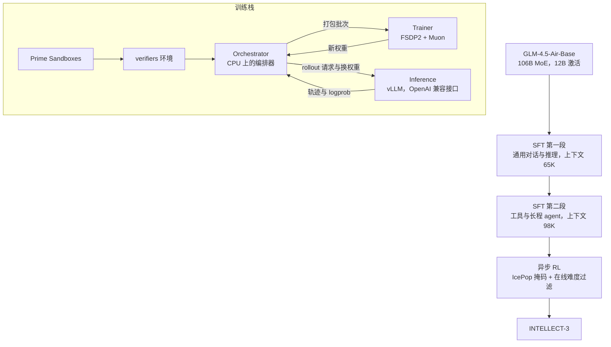
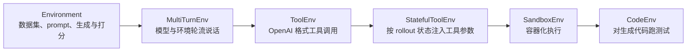
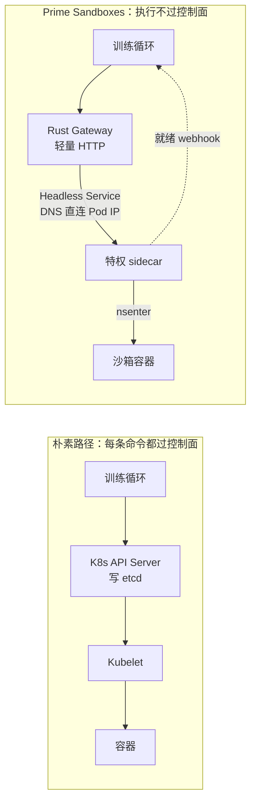

# INTELLECT-3：同一个 GLM-4.5-Air 基座，换一条全开源的异步 RL 栈重做后训练

<!-- release-date: 2025-11-26 -->

> 本文依据 Prime Intellect 的 **INTELLECT-3: Technical Report**，arXiv:2512.16144v1，2025-12-18 提交，共 27 页。页码均指 PDF 自身的页码。文中区分三件事：**报告明确写了什么**、**我们怎么解释或验算它**、**哪些是外部资料补充**。

## 阅读前先认识几个词

- **MoE（Mixture-of-Experts，混合专家）**：每个 Token 只让一小部分专家干活。INTELLECT-3 总参数 106B，每个 Token 激活约 12B（PDF p. 1）。
- **基座与后训练**：基座只会「预测下一个词」，后训练再把它变成会对话、会推理、会调工具的模型。INTELLECT-3 的起点是 GLM-4.5-Air 的**基座**，不是 Z.ai 已经后训练好的 GLM-4.5-Air（PDF p. 4、p. 13）。
- **RLVR（Reinforcement Learning with Verifiable Rewards，可验证奖励的强化学习）**：模型自己写答案，用程序判对错，据此更新参数。数学比对最终答案，代码跑测试，软件工程跑仓库测试套件。
- **Rollout（轨迹生成）**：模型按当前策略生成一整条回答，连同题目一起叫一条轨迹。
- **On-policy / off-policy（在策略 / 离策略）**：训练用的轨迹是不是**当前这份参数**自己生成的。生成侧还在用旧权重写、训练侧已经更新了新权重，数据就是离策略的。
- **重要性比（importance ratio）**：同一个 Token，当前训练策略给的概率除以生成它的那个策略给的概率。离 1 越远，这个样本越不可信。
- **FSDP（Fully Sharded Data Parallel，全分片数据并行）**：把参数、梯度、优化器状态切到多张卡上，用有限显存训大模型。
- **Muon**：一种矩阵级优化器，要对整张梯度矩阵做 Newton-Schulz 正交化，而不是像 Adam 那样逐元素更新。GLM-4.5 的预训练用的就是它（见 Muon-is-Scalable-for-LLM-Training 一篇）。

报告自己反复出现的四个名字：

- **prime-rl**：异步强化学习训练框架，训练和推理放在不同的 GPU 上；
- **verifiers**：把「环境」做成可安装 Python 模块的库；
- **Environments Hub**：这些环境的公开注册表，可以钉版本、单独评测；
- **Prime Sandboxes**：给代码与软件工程任务用的高并发隔离执行层。

## 一句话先说清

开源社区不缺「用强化学习训过的权重」，缺的是一条别人能拿去改、能在几百张卡上跑起来、还能把环境和评测一起复现的流水线（PDF p. 4）。

INTELLECT-3 把这条流水线整套开源，并用它做了一个近乎受控的实验：**拿 Z.ai 用过的同一份 GLM-4.5-Air 基座，从 SFT 到 RL 全部重做一遍后训练。** 结果在报告测的六个基准上全部超过 Z.ai 官方的 GLM-4.5-Air（PDF p. 18–19，Table 2）：AIME 2024 / 2025 为 90.8 / 88.0，比官方版高 6.2 / 6.0 分；LiveCodeBench v6 为 69.3，高 7.8 分。

所以这份报告的主体不是模型，而是系统。架构原样来自 GLM-4.5-Air，报告连架构表都没列；真正的贡献在四块：

1. **prime-rl**：训练与推理解耦、连续组批、飞行中换权重的异步 RL；
2. **verifiers 与 Environments Hub**：环境做成可版本化的包，训练和评测走同一个入口；
3. **Prime Sandboxes**：绕开 Kubernetes 控制面，支撑几千个并发代码沙箱；
4. **一份公开到环境级的配方**：两段 SFT 的数据表、RL 的批大小与学习率、IcePop 目标函数。

如果只记一句话：

> **同一个基座，后训练栈的差别就能值 6–8 分。而让异步 RL 在 100B 级 MoE 上稳住的，是两道闸：轨迹最多被几代策略写过，以及重要性比出界的 Token 直接丢掉。**

## 全景：四个组件，两段 SFT，一段 RL

这张图按 PDF p. 5 的 Figure 2 与第 2、3 节重画，是机制示意。

算力的账（PDF p. 13、p. 16–17）：

- 集群是 512 张 H200、64 个节点；两段 SFT 与 RL，连同多次消融，一共跑了两个月；
- SFT 第一段铺满 512 张卡；
- 主 RL 用 60 个节点，训练与推理约 1:3，即 16 个训练节点对 44 个推理节点，共 480 张卡。

摘要写「RL 训练扩到 512 张 H200」（PDF p. 1），正文给的主 RL 配置是 480 张。512 是集群规模，主 RL 没用满。

## 核心设计一：prime-rl，异步是默认

### 旧问题：最长的那条轨迹，会把整批 GPU 按在原地

推理模型和 agent 环境有个很具体的形状：同一批题里，有的回答几百 Token 就结束，有的要写几万 Token、中途还要调工具。传统系统一次发出 $n$ 个 rollout 请求，**等最慢那条写完**才放行一个训练批次（PDF p. 6）。先写完的槽只能空等。报告说，复杂 agent 环境里长度方差大是常态，这时推理算力会被严重浪费。

图的上半部分就是这个浪费。下半部分是 prime-rl 的两步改造，它们是向 AReaL 与 PipelineRL 学来的做法（PDF p. 6，引 [11]、[37]；AReaL 见 AReaL 一篇）。**报告不声称发明了异步，它把异步做成了这条开源栈的默认，并推到了 100B 级 MoE。**

### 三个角色，编排器必须轻

一次训练由三个抽象配合（PDF p. 5，Figure 2）：

| 角色 | 跑在哪 | 干什么 |
|---|---|---|
| Orchestrator（编排器） | CPU | 收轨迹、打包成批送给训练器；把新权重从训练侧转给推理侧；用 verifiers 抽象多轮生成与打分 |
| Trainer（训练器） | 一组 GPU，FSDP2 | 吃批次与优势，更新策略；兼容任意 Hugging Face 模型，借鉴 torchtitan |
| Inference（推理池） | 另一组 GPU，vLLM | 对外是 OpenAI 兼容接口；另加 `/update_weights` 换策略、`/reload_weights` 在实验之间打回基座 |

训练和推理放在不相交的 GPU 上，生成与更新才能重叠（PDF p. 5–6）。推理侧只是一组 OpenAI 兼容服务，报告说它因此可以接成多引擎的共享请求池，跨集群，或换成 SGLang、Tokasaurus（PDF p. 5）。正文没有展示这种多引擎部署的实测。

### 一步 off-policy 是起点

报告先用一个理想化时间轴建立直觉（PDF p. 6，Figure 3）。每一步用步号 $n$ 标记：训练侧有梯度 $g_n$ 与权重 $\theta_n$，推理侧有轨迹 $(x_n, y_n)$。第 0 步推理用 $\theta_0$ 生成 $(x_0, y_0)$，训练用它算 $g_0$，更新 $\theta_1 \leftarrow \theta_0 - g_0$。

严格在策略时，推理生成完 $(x_0, y_0)$ 就得停下等 $\theta_1$。一步 off-policy 让推理在训练算 $\theta_1$ 的同时，继续用 $\theta_0$ 生成 $(x_1, y_1)$。Figure 3 假设训练一步与推理一步等长。它的图注写「第 $n$ 步推理用的策略不旧于 $\theta_{\min(0,n-1)}$」；按正文语义这里应当是 $\max$，图注疑似笔误（我们的判断）。

真实训练比这个图乱得多：下面的飞行中更新会让**一条轨迹内部**都跨多个策略版本。

### 连续组批与飞行中更新

编排器上跑着两个异步循环（PDF p. 6）：

- **飞行中权重更新（in-flight weight updates）**：编排器不停问训练器有没有新策略，有了就让推理池暂停生成、灌入新权重，然后没写完的轨迹接着写。于是**一条轨迹可以由多个策略共同生成**。被超过 `max_off_policy_steps` 个策略写过的轨迹直接丢掉，防止策略漂移；
- **连续组批（continuous batching）**：编排器维持一个很大的并发 rollout 池，一个 rollout 组写完，它的槽立刻补上新请求，池子保持饱和，不再有「整批对齐」的同步边界。

主 RL 里 `max_off_policy_steps` 设为 8（PDF p. 17）。报告给了这套设计唯一的系统消融：65,536 长度下开着飞行中更新，每步约 1500 秒；**关掉它，步时增加超过 2 倍**，因为推理效率明显变差（PDF p. 17）。这个 2 倍没有拆成空转、重算与组批效率各占多少。

代价写在机制里：推理利用率是用「一条轨迹不再对应一份 $\theta$」换来的。算法必须能消化这件事，否则系统不敢这么换权重。后面的 IcePop 掩码就是这道闸。

### 多客户端编排：vLLM 自带的跨节点数据并行不够用

推理扩到几百张 GPU 时，他们发现 vLLM 标准的多节点数据并行拿不到预期的吞吐，节点一多就很快平台化（PDF p. 7）。

替换方案很直接：每个推理节点做成完全独立的服务，编排器给每个节点维持一个客户端，按 round-robin 分发组 rollout 请求，节点之间不做任何同步。报告说这样推理吞吐随节点数线性增长（PDF p. 7）。平台化出现在多少节点、线性段的吞吐数字，正文都没给。

### 在线难度过滤

报告认为有效的 RL 需要难度合适、逐步变难的课程，离线筛一遍不够（PDF p. 7）：

- 题目按观测到的解出率分进 easy、normal、hard 三个池，每一步从各池抽多少可调；
- 同时有一道在线过滤，丢掉「模型总是做错或总是做对」的 rollout，只留有学习信号的。

主 RL 里具体化为在线难度过滤，加上一个 easy 池，**解出率为 1 的题不再被采样**（PDF p. 17）。各池的抽样比例和入池阈值没给。

### 序列长度：上下文并行试过了，留下的是激活卸载

RL 过程中生成会越写越长（PDF p. 7，引 DeepSeek-R1）。在他们的设置里，FSDP 度数 32、激进的激活重计算加 FlashAttention 3，能训到 48K；更难的环境至少要 64K。两条路都试了（PDF p. 7–8）：

- **上下文并行（Context Parallelism，CP）**：把注意力计算切到 $N_{\text{cp}}$ 张卡上，常用实现是 Ring Attention，每张卡拿一段 Q、K、V 并轮转 K、V。用 $N_{\text{cp}}=2$ 能撑到 256K，但数据并行度数减半，还出现精度下降，**不适合生产训练**；当时 PyTorch 里面向 FlexAttention 的实现也还是实验性的；
- **激活卸载**：他们本来就用全量激活重计算，只保留每层 decoder 的输出与顶层激活。忽略顶层激活，48K 序列、隐藏维度 4096、46 层 decoder 的激活显存是（PDF p. 8）：

$$
\mathrm{Mem}_{\mathrm{act}} = 46 \times (48{,}000 \times 4{,}096) \times 2\ \text{bytes} \approx 18\ \text{GB}
$$

把这部分基于 torchtune 卸到 CPU，同样硬件下长度做到 72K，MFU 没有下降。异步卸载在 CUDA stream 上有内存泄漏，于是改用同步实现，MFU 约掉 0.1%，报告认为可以忽略（PDF p. 8）。

主 RL 的最大上下文 65,536（PDF p. 17）落在激活卸载这条路上。SFT 第二段又把 CP 请了回来，做到 98K（PDF p. 16）——那是监督微调，不是 RL 的生产路径。

公式里的 46 层与 4096 维对得上 GLM-4.5-Air：INTELLECT-3 权重的 `config.json` 写着 46 层、隐藏维度 4096，第 1 层稠密、其余是 128 个路由专家选 8 个加 1 个共享专家（外部补充；GLM-4.5-Air 的架构见 GLM-4.5 一篇）。

### 分布式 Muon：矩阵级更新撞上 FSDP 分片

报告引 [25] 的结论：预训练用 Muon 的模型，后训练继续用 Muon 效果最好（PDF p. 8）。可 Muon 的 Newton-Schulz 要看到完整梯度张量，FSDP 却把梯度切碎了；每张卡都 all-gather 全量梯度再重复算一遍，贵得不可接受。

他们试了两种分发（PDF p. 8）：

1. **重叠的 round-robin**：每个 rank 按编号 gather 一部分分片，本地做 Newton-Schulz，再 scatter 回去。计算并行、通信可藏，但多节点规模一大，大量重叠的 gather 会把 InfiniBand 堵死；
2. **all-to-all**：用一次集体通信把梯度分片重新洗牌，不再发许多独立的 gather。灵活性差一点、张量可能要 padding，但避开了拥塞。主训练用这个，实现来自开源的 Dion。

可迁移的一条：优化器的假设（「我能看到整张矩阵」）和并行的假设（「每张卡只拿一片」）会打架。补丁在规模上翻车时，该换的是集体通信原语，而不是把 gather 写得更勤。

### MoE：在这个尺度上，专家并行是负优化

训练侧的 MoE 层来自 torchtitan，用 grouped GEMM 内核，支持专家并行（EP）。他们开过 EP，吞吐反而更差，所以主训练没开（PDF p. 8）。Figure 5 是这个决定的证据。下表读自其右图（`torch._grouped_mm`，隐藏维度 4096、MoE 维度 1408、H200 SXM，假设 Token 在专家间完全均匀；数值为读图约数）：

| 每卡 Token 数 $N$ | 8 个专家 | 64 个专家 | 128 个专家 | 512 个专家 |
|---:|---:|---:|---:|---:|
| 65,536 | 约 575 TFLOP/s | 约 575 | 约 555 | 约 375 |
| 32,768 | 约 585 | 约 560 | 约 535 | 约 195 |
| 16,384 | 约 590 | 约 515 | 约 375 | 约 100 |
| 4,096 | 约 455 | 约 185 | 约 95 | 约 25 |

专家越多，每个专家分到的 Token 越少，工作量小到喂不饱内核时 TFLOPS 就掉下来。图注的结论是：$N$ 为 32,768 和 65,536 时，到 128 个专家 TFLOPS 仍在饱和区，所以按他们的训练参数，EP 换不来明显的吞吐（PDF p. 9）。

EP 的作用是减少每张卡上的专家数、让每个专家分到更多工作；已经饱和时，它只会多出 scatter 与 gather 的开销，grouped GEMM 的时间却不减（PDF p. 8）。GLM-4.5-Air 每层恰好是 128 个路由专家，而 RL 的每卡序列长度在 32K–65K，正落在表的上两行。报告也留了口子：序列更短、隐藏维度更小，或用了会摊薄单卡工作量的 CP、TP 时，EP 才可能划算。

两处工程细节：

- 训练侧 torchtitan 的 MoE 权重在广播给推理侧时，会**当场**转成 Hugging Face 的 MoE 布局，以便 vLLM 加载（PDF p. 8）。训练内核与推理内核不必同源，只要权重在路上能对上；
- 他们记录专家负载的 MaxViolation 指标：最忙专家的负载超出平均负载多少比例，用来衡量负载不均让 MoE 层比理想均衡慢了多少（PDF p. 9，引 DeepSeek 的无辅助损失负载均衡论文 [47]）。训练过程中这个指标的曲线没有给出。

## 核心设计二：verifiers，环境不该写进训练仓库

报告的类比是：环境之于 RL，就像数据集之于 SFT 或预训练（PDF p. 9）。把环境从训练基础设施里拆出来，才能独立开发、测试、版本化。

一个 verifiers 环境是可安装的 Python 模块，由四件东西组成（PDF p. 9）：

1. **数据集**：每行一个任务，带 prompt 与打分所需的元数据（标准答案、测试用例）；
2. **rollout 方法**：吃一行数据和一个 OpenAI 兼容的推理客户端，一直交互到终止条件，收集 token id、logprob 等训练要用的东西；
3. **Rubric**：一个或多个奖励函数，可按单条轨迹打，也可按组打；
4. **`load_environment`**：实例化入口，负责预处理与资源准备。

Rollout 用 asyncio 并发执行，推理请求、工具调用、奖励函数各自等待、互不阻塞；再用细粒度信号量节流，既让推理 worker 忙着，又少触发 KV 缓存驱逐（PDF p. 9–10）。Rubric 可以加权组合多个奖励，也可以嵌套（例如格式检查加 LLM 评判），还能改写成组内比较：投票、排序、相对打分（PDF p. 10）。

环境靠类继承逐层特化。Figure 6 画的是 `primeintellect/i3-code` 环境的类层次（PDF p. 10），按「谁继承谁」重画：

每一层只加一件事。自定义环境从合适的那一层继承，覆盖终止条件和环境回复即可（PDF p. 10）。

和 prime-rl 的接法（PDF p. 10–11）：

- 环境从 Environments Hub 安装，可以先对着本地或 API 模型单独调好，推上 Hub 后训练代码不用改；编排器按模块名加载，收回奖励、token id、vLLM 直接给出的 logprob 与 attention mask；
- 多环境训练靠 `EnvGroup`：多个环境合成一个对象，数据集拼接，用注入的任务 ID 列把 rollout 与打分路由到对应子环境，编排器里不需要任何多环境代码；
- 评测与训练共用同一套 rollout 与 Rubric 入口。在线评测时，编排器把评测请求与训练请求异步交错送进同一个推理池，把评测开销藏进训练里（PDF p. 11）。后面 Figure 9 的训练中曲线，就是这条通路的产物。

Hub 要解决的是「环境躺在训练仓库子目录里」带来的版本、消融与外部贡献摩擦（PDF p. 11）。

## 核心设计三：Prime Sandboxes，控制面扛不住每秒几千次 exec

Agent 编码环境要在几千条并发轨迹里执行不可信代码，需要亚秒级开通、毫秒级执行（PDF p. 11）。Kubernetes 有容器原语，但常规用法撑不住。

### 朴素路径为什么会到 2.5 秒

常规写法是训练循环用客户端库起临时 Pod，再用 `kubectl exec` 跑命令。这条路要把 HTTP 升级成 WebSocket，经 Kubelet 转给容器运行时；每条命令都是一次要记日志、写入 etcd 的认证 API 请求，而 etcd 的写操作必须串行加锁。并发沙箱到几千时，他们测到**单条命令延迟冲到 2.5 秒**，瓶颈是 API Server 饱和与 etcd 写锁争用（PDF p. 11）。

### 把执行路径从控制面上拆下来

按 PDF p. 11–12 的第 2.3.1–2.3.3 节重画。四个改动（PDF p. 12）：

1. Rust 写的 Gateway 用轻量 HTTP 接收执行请求，不走 Kubernetes 控制面；
2. 通过 Headless Service 用 DNS 直接解析 Pod IP，绕开 kube-proxy；成千上万个短命 Pod 会打满标准 CoreDNS，于是部署了针对高频记录更新优化的 CoreDNS；
3. Pod 里挂一个特权 sidecar 当执行代理，收到请求后用 `nsenter` 把命令注入目标命名空间。报告的说法是「本地起进程的速度，加完整的容器隔离」；
4. 就绪信号改成推送：sidecar 一可用就直接 webhook 给训练后端，而不是轮询 API 或让 Kopf 控制器排队消化事件（Kopf 只留给错误处理与资源回收）。从请求到任意用户镜像的沙箱可用，冷启动在任何集群负载下都**小于 10 秒**；预热好的标准运行时镜像则「几乎瞬时」。

注意口径：2.5 秒是朴素路径的**每条命令**延迟，小于 10 秒是**冷启动到可用**的端到端时间，两者不是同一个量。报告没有给出 Prime Sandboxes 单条 exec 的毫秒数。

### 镜像与密度

上千沙箱同时去公共仓库拉镜像，会撞速率限制、打满节点网卡，启动被拖到分钟级（PDF p. 12）。他们的两层分发：

- 私有高吞吐镜像仓库加镜像流式加载（lazy pulling）：先只拉入口进程要用的块，其余后台流式补齐；
- 静态运行时（例如标准 Python）维持预热池，训练循环拿沙箱时不再付拉镜像的账。

底下是自定义的 Cluster Autoscaler 与装箱调度，目标密度**每节点 256 个沙箱**，QoS 用 Burstable：保底一份 CPU，空闲时可以超卖。RL 里沙箱本来就是「短暂执行、长时间等待」，超卖吃的是等待窗口（PDF p. 13）。运行时是 gVisor（runsc），用户态内核隔离不可信代码，配可配置的网络策略；架构还支持暴露任意 TCP/UDP 端口、给需要自定义 GPU 内核的环境挂 GPU（PDF p. 13）。挂 GPU 的沙箱没有出现在本次训练里。

实际用量：代码环境训练时靠**超过 4000 个并发沙箱**做隔离执行（PDF p. 14）；软件工程环境在自建仓库里托管**超过 20,000 个预装好 GitHub 仓库的镜像**（PDF p. 15）。沙箱失败时，对应的模型输出被 mask 掉（PDF p. 14–15）。

可迁移的一条：RL 沙箱的瓶颈往往不在「能不能跑 Python」，而在控制面的 API 次数、DNS 更新速率和镜像分发。代价是不再完全活在 Kubernetes 的安全与可观测模型里，Gateway、sidecar 与推送就绪都要自己维护。

## 核心设计四：512 张 H200 先得活过硬件故障

报告把主要工程挑战写成：在容易出硬件故障的分布式系统上维持确定性与同步（PDF p. 13）。四块做法：

- **供给与网络**：严格的基础设施即代码，幂等的 Ansible 负责硬件发现与防火墙生成；AllReduce 的尾延迟决定分布式训练的速度，所以用 400 Gbps NDR InfiniBand（ConnectX-7），每次开跑前验证吞吐，目标 $\ge 160$ GB/s；掉速时自动二分查找，隔离收发器有问题的掉队节点；
- **编排**：Slurm 加 cgroup v2，作业结束时内核冻结并清掉整棵 cgroup，防止僵尸进程占着显存；
- **存储**：Lustre 走高吞吐（训练轨迹、数 TB 的 checkpoint），NVMe 上的 NFS 走元数据密集的用户环境与免密 SSH；
- **观测**：DCGM 遥测汇入 Prometheus，对 Xid 错误与过热降频告警，在坏件污染训练之前把节点摘掉。

这些是跑多周任务的运维清单，不是算法。两个月里摘了多少节点、checkpoint 写多快、160 GB/s 指的是哪一层的带宽，报告都没写。

## 训练：先定环境，再两段 SFT，最后 RL

### 六类环境

全部来自 Environments Hub 上的开源环境（PDF p. 13）。难度标注的办法几乎一样：找一个小的 Qwen3 模型每题生成 8 或 16 次，用平均解出率当难度，在后训练各阶段滤掉太简单的（PDF p. 14–15）：

| 环境 | 规模与来源 | 怎么判对错 | 难度标注 |
|---|---|---|---|
| 数学 `i3-math` | 21.2K 题，来自 Skywork-OR1、AceReason-Math、DAPO、ORZ-Hard | math-verify 抽答案比对；规则判错的再用 CompassVerifier-7B 复核 | Qwen3-4B-Thinking-2507，每题 8 次 |
| 代码 `i3-code` | 8.6K 题，单轮 Python，借鉴 DeepCoder，大量用自家 SYNTHETIC-2 | 沙箱里跑最多 15 个测试用例 | Qwen3-4B-Instruct-2507，每题 8 次 |
| 科学 `i3-science` | 29.3K 题，从 MegaScience 筛出 | math-verify 加 LLM 评判 | 同上，每题 16 次 |
| 逻辑 `i3-logic` | 11.6K 题，29 类任务，改编自 SynLogic | 随数据改编的验证器 | 同上，每题 16 次 |
| Deep Research `deepdive` | z-AI 的 DeepDive，1K 条用于合成 SFT 轨迹，2.2K 条用于 RL | 答对得 1、答错得 0 | — |
| 软件工程 `deepswe`、`mini-swe-agent-plus` | R2E-Gym、SWE-smith、Multi-SWE-bench 格式；最多 200 轮 | 提交后跑仓库测试，看该由失败变通过的测试是否通过 | — |

数学环境单独加 LLM 复核，是因为他们发现纯规则验证有不可忽略的假阴性（PDF p. 14）。

Deep Research 环境给模型四个工具：search（用 Serper 返回编号的搜索结果）、click（按编号取页面的 markdown 文本）、open（按 URL 取页面）、finish（交答案）；可选的重复搜索惩罚设为 0（PDF p. 14）。为了验证环境本身能训，他们在 Qwen3-4B-Instruct-2507 上先用公开 DeepDive 轨迹 SFT 26 步（batch 34，共 884 条），再 RL 122 步（组大小 16，总 batch 512）。读自 Figure 7，平均奖励从约 0.12 升到约 0.72（PDF p. 15）。这只证明环境能给 4B 模型提供可学的信号，不是 INTELLECT-3 自己的 Deep Research 成绩。

软件工程环境改了两个脚手架（PDF p. 15）：R2E-Gym 里把 `finish()` 换成 `submit()`，因为 `result` 参数内部没用、模型却会啰嗦地填；mini-swe-agent-plus 改了 prompt，用工具调用替换代码块解析，以适配原生推理与工具使用。

### 两段 SFT：先推理，再 agent

RL 之前先走两段互补的 SFT，给 RL 一个稳的行为先验（PDF p. 15）。

**第一段：通用推理 SFT。** 两个主数据源是 NVIDIA Nemotron-Post-Training-Dataset-v1 的数学、代码、科学、工具分片，和 AM-DeepSeek-R1-0528-Distilled 的对话与指令遵循分片，两者都含 DeepSeek-R1-0528 合成的推理轨迹；训练时保持数据集的自然比例。一整轮，每步约 33M Token，上下文 65K；Muon 优化器，weight decay 0.01，学习率 $5\times 10^{-5}$，从 $1\times 10^{-8}$ 线性 warmup 300 步；FSDP world size 64、数据并行副本 8，铺满 512 张卡（PDF p. 15–16）。

**第二段：agentic SFT。** 更小，针对工具使用、长程状态保持与超长序列。数据是 SWE-Swiss、Toucan Tool，以及用 DeepSeek-R1-0528 在 Hub 其他环境上合成的轨迹；统一工具调用格式、只留英文。这一段还要把有效上下文推过 65K，用上下文并行做到 98K。从第一段的最终 checkpoint 接着训两个 epoch，Muon 学习率从 $5\times 10^{-8}$ 在全部 800 步上线性衰减（PDF p. 16）。

SFT 数据表（PDF p. 16，Table 1）：

| 数据集 | 样本数 | Token 数 | 第一段 | 第二段 |
|---|---:|---:|:---:|:---:|
| OpenReasoning-Math | 2M | 78.1B | ✓ | ✓ |
| OpenReasoning-Code | 1.9M | 94.3B | ✓ | ✓ |
| OpenReasoning-Science | 310K | 32B | ✓ | ✓ |
| OpenReasoning-Tool | 800K | 3.8B | ✓ | ✓ |
| AM General Chat | 952K | 8.4B | ✓ | ✓ |
| AM Instruction Following | 54K | 400M | ✓ | ✓ |
| SWE Swiss | 10.3K | 700M |  | ✓ |
| Toucan Tool | 116K | 700M |  | ✓ |
| Environments Mix | 38.4K | 1.9B |  | ✓ |

这张表有两处对不上，报告都没解释：

- 正文说第一段主源是 Nemotron-Post-Training-Dataset-v1，表里却叫 OpenReasoning-*，两个名字怎么对应没说；
- 第一段各行 Token 加起来约 217B（本文加总）。按「每步约 33M Token」乘以 Figure 8(a) 画到的约 1500 步，只有约 50B（本文算术）。表可能是来源池规模而非实训量，也可能经过了过滤，报告没有对账。

Figure 8 的两条损失曲线，报告写的是「平滑、没有 loss spike」（PDF p. 16）。读图：第一段从约 0.38 降到约 0.33；第二段起点约 0.5（开头有一个到 0.6 的尖峰），在约 350 步和约 700 步各有一次陡降，最后停在约 0.2。起点高于第一段终点，符合换成 agent 数据与更长上下文后的分布变化；两次陡降报告没有解释。

**对话模板。** 写法参考 Qwen3 与 GLM 家族：角色用 `<|system|>`、`<|user|>`、`<|assistant|>`，轮次用 `<|im_start|>`、`<|im_end|>`，工具调用用 XML 风格标签（PDF p. 16）。模型**永远思考**，不对用户暴露推理强度开关：一方面 SFT 轨迹以带推理的为主，另一方面模板会补上 `<|think|>`。部署时要用 `qwen3_coder` 工具解析器与 `deepseek_r1` 推理解析器；多轮时模板自动解析 `reasoning_content`（PDF p. 17）。

### RL：256 题 × 16 条，目标函数换成 IcePop

主 RL 配置（PDF p. 17）：

- 每步 256 个 prompt，每个 16 条 rollout，最大上下文 65,536；
- 在线难度过滤，easy 池里解出率为 1 的题不再采样；
- `max_off_policy_steps = 8`；
- Muon，学习率 $1\times 10^{-6}$；
- 各领域的数据配比「仔细调过」，**具体比例没给**；
- 60 个节点，训练 16、推理 44；65,536 长度下每步约 1500 秒。

Figure 9 的横轴画到约 600 步（PDF p. 18）。按 600 步乘每步 1500 秒，主 RL 约 250 小时、十天出头；每步 $256 \times 16 = 4096$ 条轨迹，合计约 250 万条（都是本文用图上步数乘正文参数的估算，报告没写总步数与总墙钟）。

**目标函数。** 采用带掩码的 Token 级重要性采样，引用 IcePop（PDF p. 17，引 [55]，即蚂蚁团队的《Small Leak Can Sink a Great Ship—Boost RL Training on MoE with IcePop!》）。先说它要算什么：对每个 Token，拿「训练策略概率 / 生成策略概率」这个比值给优势加权，但比值出界的 Token 直接不算。对一批 $N$ 条 rollout：

$$
\mathcal{J}_{\mathrm{IcePop}}(\theta)
=
\mathbb{E}_{x\sim\mathcal{D},\,\{y_i\}_{i=1}^{N}\sim\pi_{\mathrm{infer}}}
\left[
\frac{1}{\sum_{i=1}^{N}|y_i|}
\sum_{i=1}^{N}
\sum_{t=1}^{|y_i|}
\mathcal{M}\!\left(
\frac{\pi_{\mathrm{train}}(y_{i,t}\mid x,y_{i,<t};\theta)}
{\pi_{\mathrm{infer}}(y_{i,t}\mid x,y_{i,<t};\theta_{\mathrm{old}})};
\alpha,\beta
\right)
\hat A_{i,t}
\right]
$$

掩码是硬切，不是裁剪：

$$
\mathcal{M}(k)=\begin{cases}
k & k\in[\alpha,\beta]\\
0 & \text{其他}
\end{cases}
$$

$\pi_{\mathrm{infer}}$ 是生成这条轨迹的策略，$\pi_{\mathrm{train}}$ 是当前训练策略；默认 $\alpha=0.5$、$\beta=5$。Token 级优势是同题组内减均值、不除标准差（PDF p. 17，引 [28]，即 Dr. GRPO 那篇《Understanding R1-Zero-Like Training》）：

$$
\hat A_{i,t}=S_i-\mathrm{mean}\left(\{S_i\}_{i=1}^{G}\right)
$$

$S_i$ 是第 $i$ 条的奖励，$G$ 是同一题的 rollout 数，这里是 16。另有一道更狠的闸：一条轨迹里只要有**任何一个** Token 的重要性比低于 $10^{-5}$，整条轨迹都被 mask 掉（PDF p. 17）。

公式里没有 PPO 式的 clip，也没写 stop-gradient，梯度是否穿过这个比值正文没说。

**为什么要双侧掩码。** 报告说这是在打「训练—推理不一致」：即使 $\pi_{\mathrm{infer}}$ 与 $\pi_{\mathrm{train}}$ 共享同一份 $\theta$，两边也可能给出差很多的 Token 概率，不专门处理的话，分布偏移会让实验在跑了好几天之后突然崩掉（PDF p. 17）。思路与 CISPO 同类（MiniMax-M1，见 MiniMax-M1 一篇），但他们用掩码而不是裁剪，理由是避免过大重要性比带来的噪声更新。

用人话说：裁剪是把离谱的比值**夹到边界上继续用**，掩码是把离谱的 Token **直接开除**。这是我们顺着公式的解释，报告只写了「avoid noisy updates」。同一思路在后来的 GLM-5 里也用了，取 $\beta=2$（见 GLM-5 一篇）；INTELLECT-3 的 $[0.5, 5]$ 上沿宽得多，两个端点报告没有消融。

**序列级方法在高离策略下崩了。**

这是 PDF p. 18 的 Figure 10，原图裁切。它是早期消融：当时他们的算法还是 CISPO，用 async-8（最多 8 步离策略）当压力测试，看哪个算法扛得住高离策略。GSPO 在 300 步之后出现「奇怪的奖励（以及所有其他指标）崩溃」，报告指出 [19]、[38] 也报告过同样的现象（GSPO 见 GSPO 一篇，[38] 见 FP16-Training-Inference-Mismatch 一篇）。

这张图支持的是「序列级方法在高离策略下不自动更稳」。它**不是** IcePop 对 CISPO 的对照：主训练后来换成了 IcePop，但 106B 主跑没有画 IcePop 与 CISPO 的对比。

**RL 过程中的在线评测。** Figure 9 每 15 步评一次（PDF p. 17–18），下表读自原图：

| 基准（指标） | 第 0 步 | 约第 600 步 | 过程中最高 |
|---|---:|---:|---:|
| AIME 25（avg@32） | 约 0.85 | 约 0.88 | 约 0.89 |
| AIME 24（avg@32） | 约 0.85 | 约 0.90 | 约 0.91 |
| HLE（avg@1） | 约 0.12 | 约 0.145 | 约 0.146 |
| LiveCodeBench（avg@2） | 约 0.66 | 约 0.73 | 约 0.73 |
| GPQA（avg@4） | 约 0.74 | 约 0.75 | 约 0.77 |

报告的判断是分数整体向上、还没到平台（PDF p. 17–18）。按表看，数学、代码与 HLE 的上升是清楚的；GPQA 起止只差约 0.01，中间在 0.72–0.77 之间大幅抖动，谈不上趋势。

读这张表还要知道一件事：**RL 不是从弱模型起步的。** AIME 在第 0 步已经约 0.85，两段 SFT 已经把基座推得很高，RL 是在高位继续涨。这些在线分与 Table 2 的最终评测也不是同一张表：LiveCodeBench 在线终点约 0.73，Table 2 写 69.3，报告没有对账。

## 评测：对同基座全胜，对更大模型要逐项看

评测覆盖 AIME 2024、AIME 2025、LiveCodeBench v6、GPQA Diamond、HLE、MMLU-Pro；对照模型用完全相同的环境实现打 API（PDF p. 18）。Table 2（PDF p. 19）：

| 模型 | AIME24 | AIME25 | LCB v6 | GPQA | HLE | MMLU-Pro |
|---|---:|---:|---:|---:|---:|---:|
| INTELLECT-3 | 90.8 | 88.0 | 69.3 | 74.4 | 14.6 | 81.9 |
| GLM-4.5-Air | 84.6 | 82.0 | 61.5 | 73.3 | 13.3 | 73.9 |
| GLM-4.5 | 85.8 | 83.3 | 64.5 | 77.0 | 14.8 | 83.5* |
| GLM-4.6 | 92.0 | 90.3 | 73.0 | 78.8 | 13.3* | 83.1 |
| DeepSeek R1 0528 | 83.2 | 73.4 | 62.5 | 77.5 | 15.9 | 75.3 |
| DeepSeek v3.2 | 88.1 | 84.7 | 71.6 | 81.4 | 17.9 | 84.6 |
| GPT-OSS 120B | 75.8 | 77.7 | 69.9 | 77.3 | 10.6 | 67.1 |

带 * 的格子取自 Artificial Analysis Index，不是他们自己跑的（PDF p. 19 脚注）。

分三层读：

- **对同基座的官方后训练 GLM-4.5-Air：六项全胜。** 这是报告最干净的结论，因为基座相同，差别全在后训练（PDF p. 18–19）。GPQA 只高 1.1 分，差距主要在数学、代码与 MMLU-Pro；
- **对约 3 倍大的 GLM-4.5：三胜三负。** 赢 AIME 两项与 LiveCodeBench，输 GPQA（74.4 对 77.0）、HLE（14.6 对 14.8）、MMLU-Pro（81.9 对 83.5*）。报告写的是「在许多基准上」超过，点的正是赢的三项（PDF p. 19）。引言说「匹配 GLM-4.6」，对的是 AIME：90.8 对 92.0、88.0 对 90.3；LiveCodeBench 与 GPQA 仍有明显差距（PDF p. 4）；
- **对 6 倍以上大的 DeepSeek 模型：只在部分列领先。** 对 R1 0528，AIME、LiveCodeBench、MMLU-Pro 领先，GPQA、HLE 落后；对 v3.2，只有 AIME 两项更高。

引言还说它在「推理与 **agentic** 基准上」超过 6 倍以上大的前沿开源模型（PDF p. 4），但 Table 2 里没有一个 agent 类基准：软件工程与 Deep Research 环境写进了训练配方，SWE-bench、BrowseComp 这类成绩一项都没报。倍数的口径表里也没给：GLM-4.5 / 4.6 与 DeepSeek 两个模型的总参数（外部补充：355B 与 671B）分别约是 106B 的 3.3 倍与 6.3 倍，和引言的「over 3×」「over 6×」对得上。

RL 结束时奖励仍在涨、基准没有平台，他们说会继续训练，并往 agent 环境上加权重（PDF p. 19）。这是作者观察，Figure 9 的趋势支持它，但没有「再训同样步数会涨多少」的对照。

### 附录 A：评测口径比分数本身更值得留下

不看这一页，Table 2 没法复现（PDF p. 27）：

| 基准 | 怎么判 | 采样次数 |
|---|---|---|
| AIME 2024 / 2025 | 各 30 题；抽最后一个 `\boxed{}`，math-verify 比对；**不用 LLM 评判**，所以比 Artificial Analysis Index 的数字更保守 | Avg@32 |
| GPQA Diamond | 198 题；选项字母放进 box，精确匹配 | Avg@4 |
| LiveCodeBench v6 | 454 道 2024 年 8 月到 2025 年 5 月的题；验证逻辑拷自官方仓库，接到自家沙箱 | Avg@2 |
| MMLU-Pro | 12K 道选择题，字母放进 box，精确匹配 | Avg@1 |
| HLE | 纯文本子集 2,158 题，不给工具 | 全体平均解出率 |
| MATH-500 | 500 题，同 AIME 的判法 | 每题 2 次 |

MATH-500 只出现在附录的评测说明里，Table 2 没有它的分数。

对照模型怎么打 API（PDF p. 27）：

- GLM-4.5-Air、GLM-4.5、GLM-4.6 走 OpenRouter，并强制路由到 z-AI 官方 API，采样参数按 z-AI 推荐（例如温度 0.6）；
- DeepSeek R1 0528 同样强制官方 API。DeepSeek v3.2 的 Thinking 版在 OpenRouter 上大多被托管成 chat 版（官方 provider 也是），于是改打官方 API 的 `deepseek-reasoner`；
- GPT-OSS 120B（High）在 OpenRouter 上从平均回复长度看推理强度不够，改走 TogetherAI 并确认是 high 档；分数与 OpenAI 模型卡略有差别，归因于同一 harness 里格式与打分逻辑的差异。

这几条排查记录的价值在于：**评测时「打 API」不等于打到了你以为的那个模型**，Thinking 被静默换成 chat、High 被静默降档，都真实发生过。

## 报告写下的三个方向

报告把交付物收成三样：模型权重、环境、完整训练框架，希望缩小私有 RL 流水线与独立研究者能搭起来的东西之间的差距（PDF p. 19）。未来工作三条（PDF p. 19–20）：

1. **继续放大 agentic RL**：奖励与评测曲线还没平，训练仍然稳定，他们认为还处在「再加 RL 算力仍有高回报」的区间；
2. **更丰富的环境**：Hub 上已有 500 多个环境，覆盖自主科研、计算机使用、定理证明、浏览器自动化与法律、金融、税务等，INTELLECT-3 只用了一小片；
3. **长程 agent**：让模型自己管理上下文——切掉上下文、在隔离的子分支里自我提示、跨轮维护外部记忆，并通过 RL 端到端学会。理由是长上下文模型的「context rot」：有效推理窗口远小于标称上下文（PDF p. 20，引 [23]）。

第三条是路线，不是这次训练用过的机制。

## 哪些有证据，哪些只是观察，哪些没公开

**有实验或测量支撑的：**

- 对同基座的官方 GLM-4.5-Air，六项基准全胜（Table 2）；
- 飞行中更新：65K 长度下每步约 1500 秒，关掉慢 2 倍以上（PDF p. 17）；
- async-8 压力测试里 GSPO 崩溃、当时的 CISPO 没有（Figure 10）；
- 朴素 Kubernetes exec 在数千并发下单条命令 2.5 秒（PDF p. 11）；
- 激活卸载把长度从 48K 推到 72K 而 MFU 不降（PDF p. 8）；
- 在他们的每卡 Token 数与隐藏维度下，128 个专家仍能喂饱 grouped GEMM（Figure 5）；
- 4B 模型能在 DeepDive 环境上用 RL 学起来（Figure 7）。

**作者观察，证据是曲线形态或一句话，没有对照：**

- RL 还没到平台、继续训还会涨（Figure 9）；
- 多客户端独立服务让推理吞吐随节点数线性增长（PDF p. 7，无图无数）；
- 双侧掩码对防止多日后崩溃「至关重要」（PDF p. 17，没有去掉掩码的对照）；
- 后训练继续用 Muon 最好——引的是 [25] 的结论，不是自己的消融。

**没有公开的：**

- RL 各领域的配比、难度池阈值、总步数、总 Token、总墙钟与成本；
- IcePop 与 CISPO 在 106B 主跑上的对照，$\alpha$、$\beta$ 的消融；
- 重要性比的分布、实际离策略步数的分布、MaxViolation 曲线；
- 权重广播的带宽、换权重时 KV 缓存如何处理、打包批次的具体策略；
- 专家并行开关的吞吐表、vLLM 多节点数据并行在多少节点平台化；
- 任何 agent 类基准的主模型成绩；
- 模型架构超参（要到 GLM-4.5 报告或权重配置里找）；
- SFT 数据表与每步 Token 数之间的对账。

## 最值得带回自己项目的六条

### 1. 先把生成和训练解耦，再谈算法

prime-rl 的默认不是「同步 PPO 加一点重叠」，而是推理池持续饱和、权重一到就灌进去。系统敢这么做，是因为后面有 `max_off_policy_steps` 和 IcePop 掩码兜住版本混乱。**系统上的激进要由算法上的闸门来买单。**

### 2. 训推不一致要当一等故障，不是数值噪声

同一份权重，vLLM 与训练器给出的 Token 概率仍可能差很多，在 MoE 上会让跑了几天的实验崩掉。INTELLECT-3 的选择是 Token 级双侧掩码，加上整条轨迹的极小比阈值。**长跑 RL 时，把重要性比的监控和截断从第一天就加上。**

### 3. 并行策略跟着工作量走，不跟着名字走

专家并行、上下文并行在教科书里都是「更大更长就该开」。他们先量了 grouped GEMM 的饱和区，发现 EP 是负优化；CP 能到 256K 但伤精度。留下的是最朴素的激活卸载。**先量饱和区，再决定切哪一维。**

### 4. 环境做成包，训练做成框架

环境能独立版本化，才能做受控消融和接受外部贡献。`EnvGroup` 让多环境训练变成数据拼接，而不是编排器里的 `if task_id`。**评测与训练共用同一个 rollout 入口，训练中的在线评测几乎免费。**

### 5. 控制面和数据面要分开

Kubernetes 适合声明式生命周期，不适合 RL 里每秒几千次 exec。执行走直连，就绪用推送，镜像用流式加载与预热池。**写系统报告时，单条命令延迟和冷启动延迟要分开报。**

### 6. 用同一个基座做对照，是最有说服力的后训练实验

INTELLECT-3 最硬的结论来自「同一份 GLM-4.5-Air 基座，两套后训练」。**想证明自己的后训练栈，找一个公开了基座、也公开了官方后训练版的模型，比和一堆不同基座的模型比分数更有信息量。**

## 关键词回看

- **解耦的异步 RL**：训练 GPU 与推理 GPU 各干各的，编排器在中间交换轨迹与权重。
- **一步 off-policy**：训练在算 $\theta_{n+1}$ 时，推理仍用 $\theta_n$ 生成下一批。
- **连续组批**：一条 rollout 写完立刻补新请求，推理池保持饱和。
- **飞行中权重更新**：新策略一到就暂停生成、灌权重、让没写完的轨迹接着写。
- **`max_off_policy_steps`**：一条轨迹最多被几代策略写过，超过就丢；主跑取 8。
- **IcePop 掩码**：重要性比落在 $[\alpha, \beta]$ 之外的 Token 直接置零，而不是裁到边界。
- **训练—推理不一致**：同一份权重，推理引擎与训练器给出的 Token 概率不同。
- **verifiers / Environments Hub**：环境是可钉版本的 Python 包，不是训练仓库的子目录。
- **Prime Sandboxes**：绕开 Kubernetes 控制面的高并发不可信代码执行。
- **分布式 Muon**：在 FSDP 分片上用 all-to-all 重排梯度，才能做矩阵级的 Newton-Schulz。
- **激活卸载**：把每层 decoder 的输出卸到 CPU，从 48K 推到 72K。

## 最后的判断

INTELLECT-3 这份报告最值得学的，不是某一个分数，而是**它把「开源一个 RL 模型」重新定义成「开源能造出这个模型的整条流水线」**，并且用同基座对照给出了这条流水线的价值：6–8 分。

它的证据强度是分层的：

- **有直接对照的**：同基座六项全胜、飞行中更新的 2 倍步时、GSPO 在 async-8 下崩溃、激活卸载不掉 MFU、Figure 5 的饱和区；
- **只有作者观察的**：RL 还没到平台、多客户端线性扩展、双侧掩码的必要性；
- **完全没公开的**：RL 配比、总算力、IcePop 端点的消融、任何 agent 基准成绩。

还有几处要自己校准：「扩到 512 张 H200」是集群规模，主 RL 用的是 480 张；引言说在 agentic 基准上超过更大模型，表里却没有 agent 基准；GPQA 在 RL 过程中几乎没涨；SFT 数据表的 217B 与每步 Token 数对不上。

如果只带走一句：

> **异步 RL 的收益在系统，风险在算法。把推理池塞满之前，先想好离策略的上限和出界 Token 的处理。**

## 资料与阅读边界

**原始依据**

- 本地 `papers/PrimeIntellect/INTELLECT-3.pdf`，即 arXiv:2512.16144v1（2025-12-18 提交），27 页。全文带「PDF p. N」页码的数字都出自这一版。

**版本核查**

- arXiv [2512.16144](https://arxiv.org/abs/2512.16144) 截至 2026-09-30 只有 v1，与本地一致，无需替换。
- 官方博客与 Hugging Face 模型卡链接的是一份更早的 PDF（Google Cloud Storage 上的 `INTELLECT_3_Technical_Report.pdf`，2025-11-30 生成，27 页）。它与 arXiv v1 的正文只差一格：Table 2 里 GPT-OSS 120B 的 GPQA 在旧版是 70.0，arXiv v1 改为 77.3。模型卡的评测表沿用了旧版数字，本文以 arXiv v1 为准。

**首发日证据**

- 官方博客 [INTELLECT-3: A 100B+ MoE trained with large-scale RL](https://www.primeintellect.ai/blog/intellect-3) 标注 2025-11-26，文中写「Today, we release INTELLECT-3」；
- 官方权重仓库 [PrimeIntellect/INTELLECT-3](https://huggingface.co/PrimeIntellect/INTELLECT-3) 的权重文件于 2025-11-26 上传。
- 因此 `release-date` 取 2025-11-26，而不是 arXiv 提交日 2025-12-18。

**外部补充（不是报告内容）**

- 官方博客把 prime-rl 定位为「async-only」，并说从 INTELLECT-2 起就认定「RL 的未来是异步的，即总是偏几步 off-policy」。PDF 正文没有这句口号。
- INTELLECT-3 权重的 `config.json`：46 层、隐藏维度 4096、每层 128 个路由专家选 8 个加 1 个共享专家、MoE 中间维度 1408、第 1 层稠密。报告本身没列架构表。
- Hugging Face 模型卡另给了一列 MATH-500（INTELLECT-3 为 98.1），并写明 BF16 版可在 2 张 H200 上服务、FP8 版可在 1 张 H200 上服务。这些不是 PDF 的内容。
- GLM-4.5 / 4.6 的 355B 与 DeepSeek R1 0528 / v3.2 的 671B 总参数，用于核对引言里的倍数，来自各自的官方报告。
- 训练框架 [prime-rl](https://github.com/PrimeIntellect-ai/prime-rl)、环境库 [verifiers](https://github.com/PrimeIntellect-ai/verifiers)、环境注册表 [Environments Hub](https://hub.primeintellect.ai)。
- 文中形如「600 步 × 1500 秒 ≈ 250 小时」「217B」「约 50B」「3.3 倍 / 6.3 倍」的数字，都是本文根据报告参数或读图做的算术；Figure 5、7、8、9、10 的数值都是读图约数。
