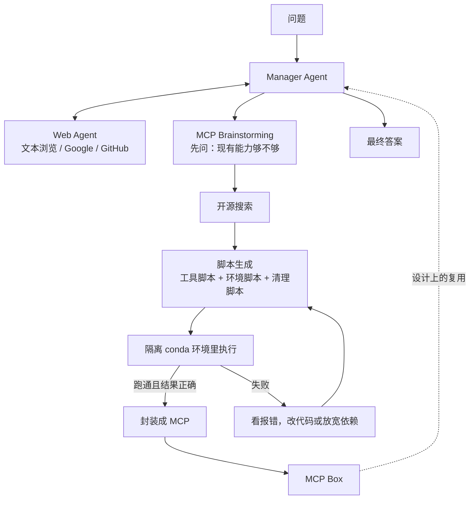

# Alita：不预装解题工具，让 agent 当场造 MCP 并攒成技能库

<!-- release-date: 2025-05-26 -->

> 本文依据 **Alita: Generalist Agent Enabling Scalable Agentic Reasoning with Minimal Predefinition and Maximal Self-Evolution**，arXiv:2505.20286v1，2025-05-26 提交，共 12 页。页码均指 PDF 自身的页码。作者来自普林斯顿大学 AI Lab（第一作者与末位作者 Mengdi Wang 所在）、清华大学交叉信息研究院、上海交通大学、密歇根大学、天桥脑科学研究院（Tianqiao and Chrissy Chen Institute）与香港中文大学，三位共同一作分属前三家（PDF p. 1）。文中区分三件事：**论文明确写了什么**、**我们怎么解释它**、**哪些是外部资料补充**。

## 读前先把几个词说成人话

这篇论文只问一件事：通用 agent 要不要预先装好一大箱「解题工具」。

- **通用 agent（generalist agent）**：不按任务各写一套流程，而是用同一套系统去应付旅行规划、操作电脑、多步调研这类开放任务。论文举的产品级例子是 OpenAI Deep Research 和 Manus（PDF p. 2）。
- **预定义工具**：人先写好一批工具（网页正文抽取、图片配文、YouTube 字幕爬虫……），再让模型在这些接口里挑。工具越多，看起来越全能；论文反对的正是这个方向。
- **MCP（Model Context Protocol，模型上下文协议）**：Anthropic 提出的开放协议，统一「外部系统怎么把上下文和工具交给大模型」（PDF p. 2 脚注 1、p. 3）。在这篇里，MCP 不是接入现成服务的插头，而是 **agent 自己写出来、再包一层标准外壳的可复用工具**。
- **MCP Box**：包好的 MCP 存放的地方，即系统的工具注册表（PDF p. 4）。
- **自进化（self-evolution）**：本篇改的是 **工具库**，不是模型权重。跑 Alita 的 Claude 和 GPT-4o 都是现成模型，论文没有训练它们。
- **GAIA**：评测通用 AI 助手的基准，共 466 道贴近真实场景的题，覆盖日常任务、科学推理、网页浏览和工具使用；对人概念上简单，对当时的 AI 系统很难（PDF p. 6）。按难度分 Level 1–3。论文的主数字全部报在 **验证集** 上。
- **pass@k**：论文的定义是把 Alita 独立跑 1、2、3 次，取最好的那次答案计分（PDF p. 7，Table 1 表注）。它就是 best-of-k，不是「k 次采样至少对一次」的无偏估计。

本站「自进化系统」这一组，可以按「哪个部件在进化」来对照读：Darwin-Godel-Machine 改的是 agent 自己的代码，GEPA 改的是 prompt，AIDE2 改的是包在模型外面的 harness，Absolute-Zero 改的是题库与课程，SEAL 改的是权重。**Alita 改的是工具库。** 读任何「自进化」的数字之前，先问它在改哪一层。

## 一句话先说清

论文的主结果：Claude-Sonnet-4 加 GPT-4o 驱动的 Alita，在 GAIA 验证集上 75.15% pass@1、87.27% pass@3；Claude 3.7 Sonnet 加 GPT-4o 的版本是 72.73% pass@1，在 Mathvista 与 PathVQA 的各 100 题随机抽样上是 74% 与 52%（PDF p. 1 摘要，p. 7 Table 1）。

这些分数不是靠预装更多工具堆出来的。设计判断是反方向的：


*图：引自原文 Figure 2（PDF p. 2）。*

上半是当时通用 agent 的默认画法：Manager 周围挂满面向具体任务的工具，右侧是论文认定的三个后果。下半是 Alita：解题侧只剩一个 Web Agent，其余能力走「MCP 创建 → MCP Box → 自进化」这条环。

所以「最小预定义」不是零工具。Manager 仍有 MCP Brainstorming、ScriptGeneratingTool、CodeRunningTool 三件元工具；Web Agent 仍有文本浏览器、翻页、Google 搜索和 GitHub 搜索；环境管理还用 TextInspectorTool 和 conda（PDF p. 5）。论文自己的说法是「一个直接解题的核心能力（web agent），加一小套支持自我扩展的通用模块」（PDF p. 2）。被拿掉的，是 YouTube 字幕爬虫、图片配文这类 **面向具体任务的解题工具**。

**我们如何解释它。** 可以把工具分成两类：浏览、搜索、写脚本、隔离执行，是「造工具的工具」；字幕、配文、PPT 抽页，是「解题工具」。论文没有用这对词，但 Figure 2 的上下对照和第 3 节的工具清单就是这个切分。Alita 的赌注是：前一类够强时，后一类可以在任务出现之后现场长出来。

## 旧方法卡在哪：工具的形状在任务出现之前就被钉死了

论文的观察是：为了应付开放任务，通用 agent 越来越依赖大规模手工工程——繁琐的工作流、大量预定义工具、硬编码组件（PDF p. 2）。它指出三个限制（PDF p. 2）：

1. **覆盖不全（incomplete coverage）**：真实任务要的工具是开放集合，不可能预先写完。
2. **创造力与灵活性受限（limited creativity and flexibility）**：复杂任务常常要新造工具、或把旧工具用出没设计过的用法；预设工作流和硬编码组件把这种组合空间压扁了。
3. **接口不匹配（mismatch）**：很多有用的工具不是 Python 写的，要预先接进以 Python 为主的 agent 框架，不是不可能，但成本很高。

三者合起来伤的是可扩展性、适应性和跨域泛化（PDF p. 2）。

一个具体场景能把问题说死。GAIA 里有一类题要看 YouTube 视频。预先写一个「字幕爬虫」，题目的关键信息刚好在旁白里时就够用；关键信息只在画面里时，同一个工具会静悄悄地答错。人很难为每种难度各写一个视频工具。病根是：**工具的形状在任务出现之前就定死了。**

## 两条原则：最小预定义，最大自进化

对着这三个限制，论文只提两条原则（PDF p. 2）：

1. **最小预定义（Minimal Predefinition）**：只给最少的核心能力，不为特定任务或模态手工工程化组件。
2. **最大自进化（Maximal Self-Evolution）**：让 agent 按需要自己创建、打磨、复用外部能力。

落地方式是：按每个任务的需要动态生成、改造、复用 MCP，而不是依赖静态的预定义工具（PDF p. 2）。

有一条边界必须先钉死：**权重不动。** 论文没有 SFT、没有 RL。进化的对象是 MCP Box 里按任务长出来的外部能力；跑通的脚本被包成 MCP 存起来，设计上可供自己和其他 agent 再用（PDF p. 3–4）。

代价也立刻清楚：造工具这件事，完全押在底层模型会不会写代码、会不会按报错改代码上。附录 B 的全部限制只有两句话：Alita 高度依赖 LLM 的编码能力，编码能力很差时会弱于传统通用 agent（PDF p. 12）。

## 系统怎么转：一个 CodeReAct 环里当场造 MCP



这张图按原文 Figure 3（PDF p. 4）与第 3 节文字重画，是机制示意，不是实测时间轴。原图把「开源搜索、脚本生成、虚拟环境执行」画成一叠卡片，再经「Encapsulate」进 MCP Box，一条「Self Evolving」箭头从 MCP Box 回到 Manager；失败分支是按 3.4.3 与 3.4.4 的文字补上的。

一次任务的流水线（PDF p. 4，3.1 节）：用原问题构造增强 prompt；Manager 做多步推理，途中可以问 Web Agent、规划并合成新工具、在隔离环境里执行；**工具生成成功并且结果正确**，对应脚本转成 MCP 存进内部工具注册表；推理步骤、中间代码和最终输出全部记日志。

下面按部件走一遍。

### Manager：不直接解题，只调度「要不要造工具」

Manager 拿到任务，先调 MCP Brainstorming 判断要不要额外工具、要哪些；再把任务拆成子任务，派给 Web Agent，或自己生成所需的外部工具及其环境配置；最后汇总中间结果作答（PDF p. 4）。它手里只有三件元工具（PDF p. 5）：

| 元工具 | 干什么 |
|---|---|
| MCP Brainstorming | 发现能力缺口，指出缺哪些工具，给出工具规格大纲 |
| ScriptGeneratingTool | 按规格大纲生成贴合任务的工具代码 |
| CodeRunningTool | 在隔离环境里执行生成的代码，缓存输出，供后续生成 MCP server |

三件都不是「帮你抽 YouTube 字幕」这种解题工具，而是「决定造什么、造出来、跑一下」的元能力。

### Web Agent：唯一直接碰外部世界的解题部件

内部知识不够时，Web Agent 去外部找，尤其擅长找领域相关的代码或文档（PDF p. 5）。接口是轻量的文本浏览器 SimpleTextBrowser，加上 VisitTool、PageUpTool、PageDownTool 翻页；检索靠 GoogleSearchTool 做开放搜索、GithubSearchTool 找可复用的开源工具（PDF p. 5）。

**我们如何解释它。** 这只 Web Agent 的职责不是把网页摘要写漂亮，而是给下一步「写脚本」送去 README、代码片段和仓库地址。它是纯文本的：不看视频画面、不点复杂 UI。附录 A 的案例里，它没有去「看」那段视频，而是在 GitHub 上找到 `youtube-transcript-api`（PDF p. 12）。「最小预定义」能成立，前提是「读网页、搜代码」被当作通用动作保留了下来。

### MCP Brainstorming：先压住模型的过度自信

论文引用的观察是：LLM 常常高估自己的能力（PDF p. 5，参考文献 [22]）。跳过这一步，模型会倾向「我直接答」，该造的工具造不出来。

MCP Brainstorming 把任务和当前框架的能力描述一起交给模型，用专门设计的 prompt 让它做一次能力自评（PDF p. 5）。判定能力不够时，它给出工具生成的参考，作为后续选工具与规划的先验。

收益是少在「其实不会」的地方硬答。代价是它只是一个 prompt 模块：prompt 原文没有公开，也没有「去掉 Brainstorming 掉几分」的消融。

### ScriptGeneratingTool：一次写三种脚本

它接收 Manager 给的子任务描述与代码构造建议，以及 Web Agent 找回的 GitHub 链接（从中读 README 或代码片段），生成三样东西（PDF p. 5）：

- **工具脚本**：真正干活的代码；
- **环境脚本**：为代码准备运行环境；
- **清理脚本**：跑完之后删掉多余的文件和环境。

目标是生成的脚本有效、自包含、可执行，既能用于当前任务，也能将来复用（PDF p. 5）。

**我们如何解释它。** 只写工具函数、不写环境，执行就会卡在缺包和版本冲突上；只写环境、不写清理，本机 conda 环境会越积越多。把安装和回收也当成生成对象，是这篇里最容易被直接抄走的细节。

### CodeRunningTool：跑出预期结果，才有资格进 MCP Box

生成的脚本在隔离环境里执行；产出预期结果，这个工具才被注册成可复用 MCP；失败则看报错、重新生成、再跑（PDF p. 5）。

所以 MCP Box 至少在设计上有一道执行门，不是「模型说写好了就收」。但「预期结果」由谁判定，论文没有写：是脚本不报错就算，还是任务答对才算？3.1 节的措辞是「工具生成成功并且结果正确」（PDF p. 4），没有给出判定方法。门如果只是「能跑」，盒子会收进很多无关脚本；门如果是「答对」，评测时就要知道答案。这层判据是空的。

### 环境管理：不用容器，用按任务新建的 conda

候选工具出现后，环境规划模块用 TextInspectorTool 解析 `README.md`、`requirements.txt` 与 shell 脚本，抽出依赖与安装步骤，形成一份隔离执行配置；然后建一个名字唯一的 conda 环境（通常取自任务 ID 或仓库路径的哈希），用 `conda install` 或 `pip install` 装依赖（PDF p. 5）。

论文写明的实现选择（PDF p. 5–6）：

- 所有运行环境在本地并行初始化，**不需要管理员权限，也不用容器技术**；
- 执行前显式激活环境，保证隔离与可复现；
- 初始化失败（缺包、安装脚本语法错、依赖不可得）时自动恢复：放宽版本约束，或找能跑起来的最小依赖集；
- 恢复仍失败就丢弃这个工具，记日志供离线分析。

收益是跨任务兼容与可移植（PDF p. 5–6）。代价论文没写：不用容器，隔离粒度就停在 conda 环境；生成的脚本若乱写路径、乱访问网络，12 页里没有白名单、没有系统调用限制、没有费用上限。

五个部件连起来，论文的原话是：借助 MCP，Alita 能生成越来越强、越来越多样、越来越复杂的 MCP，形成自我强化的循环（PDF p. 4）。**这是设计主张。** 主实验没有「MCP 数量随任务增加、分数随之上升」的曲线。被实验托住的是另一件事：造好的 MCP 交给别的框架或更小的模型，分数会涨——见后文第 5 节。

## 为什么要包成 MCP，而不是「再写一个函数」

相关工作一节把 Alita 和三类前作错开（PDF p. 3）：

- **通用 agent**（OWL、Omne、OpenAI Deep Research、A-World、Magentic-One）：Alita 尽量少用预定义工具和工作流去直接解题。
- **自动生成 agent 或工作流**（AutoAgents、OpenHands、AFlow、AutoAgent）：Alita 生成的是任务专用的 MCP，并留给以后的执行。
- **造工具**（CRAFT、TroVE、CREATOR，以及 AutoAgent、OpenHands 里的造工具能力）：Alita 造的是 MCP 而不是裸工具，额外好处是更好复用、更好管理环境。

与 MCP 相关的前作只点了 RAG-MCP：它在一个由 MCP 描述组成的库里按任务检索最相关的工具，缓解 prompt 膨胀（PDF p. 3，参考文献 [21]）。Alita 是先生成有效工具，再包成 MCP，供自己和其他 agent 后续使用（PDF p. 3）。

**我们如何解释它。** MCP 在这里同时是接口标准和存档格式。接口标准让别的框架能直接接走；存档格式让试错得到的技能不只活在一次 ReAct 轨迹里。第 5 节的复用实验，测的正是这层外壳能不能把能力送出去。相关工作只做定位，没有「Alita 对 CREATOR」这类组件级对照实验。

## 实验：验证集上的数字，以及 Figure 1 该怎么读

### 评什么、跟谁比

| 基准 | 用法 | 论文写下的限制 |
|---|---|---|
| GAIA | 主战场，报验证集，分 Level 1–3 | 全集 466 题（PDF p. 6） |
| Mathvista | 视觉情境里的数学推理 | 资源有限，随机抽 100 题（PDF p. 6） |
| PathVQA | 医学病理图像问答 | 同样随机抽 100 题（PDF p. 6） |

GAIA 的基线是 Octotools、Open Deep Research-smolagents（下称 ODR-smolagents）、AutoAgent、OWL、A-World、OpenAI Deep Research（PDF p. 6–7）。封面 Figure 1 另画了 manus.ai，Table 1 里没有它。

有一条实现事实必须先记住：**Alita 的开发很大程度上基于 ODR-smolagents 的框架**，作者去掉了许多预定义工具，加上了 MCP 创建组件（PDF p. 6）。所以它不是从零搭的新运行时，而是在 Hugging Face 的开源 deep research agent 上做减法、再加「造 MCP」。Table 1 里 ODR-smolagents 的 55.15%，是同一条家族线上还没做这两步的对照。

Octotools 被描述为带 10 多张标准化 tool card 的多工具工作流框架（PDF p. 6），GAIA 只有 18.40%（PDF p. 7）。论文没写各基线用的基座模型，也没写这些数字是自测还是转引自排行榜，所以这一列只能读成「作者报的系统级数字」。

### Figure 1：封面把 pass@3 放在别人的 pass@1 旁边

Figure 1 是三组横向柱：Alita、manus.ai、OpenAI DeepResearch，按 GAIA Level 1–3 与平均分排列（PDF p. 1）。柱端印着数值：

| | Alita | manus.ai | OpenAI DeepResearch |
|---|---:|---:|---:|
| Level 1 | 88.7% | 86.5% | 74.3% |
| Level 2 | 89.5% | 70.1% | 69.1% |
| Level 3 | 76.9% | 57.7% | 47.6% |
| Average | 87.3% | 73.3% | 67.4% |

图注只写「Performance of Alita, manus.ai, and OpenAI DeepResearch」，没说是 pass@1 还是 pass@3。对一下 Table 1 就清楚了：

1. Alita 这四根柱，就是 Table 1 里 **Claude-Sonnet-4 + GPT-4o 的 pass@3**（88.68 / 89.53 / 76.92 / 87.27），四舍五入到一位小数。
2. OpenAI DeepResearch 这四根柱，就是 Table 1 的 OpenAI-DR 一行（74.29 / 69.06 / 47.60 / 67.36）；贡献列表里明确把 67.36% 称作 OpenAI Deep Research 的 **pass@1**（PDF p. 3）。

所以封面上 87.3% 对 67.4% 的差距，是 pass@3 对 pass@1。同一口径下是 75.15% 对 67.36%，差 7.79 个点。Manus 那组柱既不在表里，论文也没写口径。

### Table 1：主数字，以及 Level 1 并没有全面领先

Table 1（PDF p. 7）：

| 配置 | L1 | L2 | L3 | GAIA 总分 | Mathvista | PathVQA |
|---|---:|---:|---:|---:|---:|---:|
| Alita（Claude 3.7 Sonnet + GPT-4o）pass@1 | 81.13 | 75.58 | 46.15 | 72.73 | 74 | 52 |
| 同上 pass@2 | 88.68 | 80.23 | 53.85 | 78.79 | — | — |
| 同上 pass@3 | 96.23 | 86.04 | 65.38 | 86.06 | — | — |
| Alita（Claude-Sonnet-4 + GPT-4o）pass@1 | 77.36 | 76.74 | 65.38 | 75.15 | — | — |
| 同上 pass@3 | 88.68 | 89.53 | 76.92 | 87.27 | — | — |
| Octotools | — | — | — | 18.40 | 68 | 47 |
| ODR-smolagents | 67.92 | 53.49 | 34.62 | 55.15 | 65 | 42 |
| AutoAgent | 71.70 | 53.49 | 26.92 | 55.15 | — | — |
| OWL | 84.91 | 67.44 | 42.31 | 69.09 | — | — |
| A-World | 86.79 | 69.77 | 34.62 | 69.70 | — | — |
| OpenAI-DR | 74.29 | 69.06 | 47.60 | 67.36 | — | — |

读这张表要知道四件事。

**一、宣传数字和视觉基准数字来自两套配置。** 75.15% / 87.27% 是 Claude-Sonnet-4 配 GPT-4o；Mathvista 74、PathVQA 52 是 Claude 3.7 Sonnet 配 GPT-4o，各 100 题随机抽样，没有随机种子，也没有 Sonnet-4 的视觉基准数字。两个模型怎么分工（谁当 Manager、谁写代码），全文没写。

**二、表注说「Alita outperforms all baseline agents across the GAIA levels」（PDF p. 7），Level 1 的 pass@1 撑不住这句。** Sonnet-4 版 L1 pass@1 是 77.36，Claude 3.7 版是 81.13，都低于 OWL 的 84.91 和 A-World 的 86.79。Alita 拉开差距的是 Level 2、Level 3 和总分：Sonnet-4 版 L3 pass@1 到 65.38，OpenAI-DR 是 47.60，A-World 是 34.62。**越难的题，当场造工具的收益越明显**——这是表能支撑的判断。

**三、换到 Sonnet-4 之后，L1 pass@1 从 81.13 掉到 77.36，pass@3 从 96.23 掉到 88.68；L3 pass@1 却从 46.15 涨到 65.38，总分因此更高。** 论文正文没有讨论这个交换。

**四、验证集的题量。** 论文只写 GAIA 共 466 题，没写验证集有几题。Alita 各层的百分数恰好能被 53、86、26 题整除（如 81.13% = 43/53，46.15% = 12/26），合计 165 题，与 GAIA 公开验证集的题量一致（外部资料）——这是我们的推算，不是论文原文。按此换算，75.15% 约是 124 题，87.27% 约是 144 题。

Mathvista 与 PathVQA 上，Claude 3.7 版比 Octotools 高 6 和 5 个点，比 ODR-smolagents 高 9 和 10 个点（PDF p. 7）。方向与 GAIA 一致，强度有限：各 100 题、单次抽样、没有误差条。

正文还写「跑了三轮 GAIA，在 GAIA leaderboard 上取得最佳」（PDF p. 7）。结合 pass@3 的定义，这句指的是验证集上的 best-of-3。**PDF 里没有任何 GAIA 测试集数字。**

## MCP 复用：能力可以送走，但送不走「造下一个」的能力

第 5 节是全文唯一把「自进化」变成对照实验的地方。作者把 Claude 3.7 Sonnet + GPT-4o 版 Alita 跑 GAIA 时造出的 MCP 收集起来，做了两件事：交给 **别的 agent 框架**，以及交给 **更小模型驱动的 agent**（PDF p. 7）。论文把后者称为一种新的蒸馏：传统蒸馏是拿大模型生成的数据微调小模型，这里是把大模型 agent 试错得到的 MCP 直接交给小模型 agent，「更容易、更便宜、更快」（PDF p. 7）。这是作者的类比，12 页里没有美元、token 或墙钟的对比。


*图：本文根据原文 Table 1–4（PDF p. 7–9）重画，柱长为 GAIA 验证集总分。三组实验的基座设置并不相同，同组内才可直接比较。*

### 借给别的框架：各层都涨，涨幅约 6 个点

Table 2（PDF p. 8）：GPT-4o 驱动的 ODR-smolagents，外挂 MCP 前后分别是 L1 33.96% → 39.62%、L2 29.07% → 36.05%、L3 11.54% → 15.38%，总分 27.88% → 33.94%。论文的解读是：三层一致上涨，说明这些 MCP 提供的是可泛化的效用，而不只是修补数据集里的边角案例（PDF p. 8）。

要并排看 Table 1：那里的 ODR-smolagents 总分是 55.15%，这里不带 MCP 的 GPT-4o 版只有 27.88%。两行不是同一个设置，论文没写 Table 1 那行用的什么模型。所以 Table 2 只支持「GPT-4o 版 ODR 外挂这些 MCP 会涨」。

### 借给小模型：Level 3 从 3.85% 到 11.54%

Table 3（PDF p. 8）：基座是 ODR-smolagents（不带 MCP 创建组件，并保留了 ODR 的一些额外预定义工具），模型换成 GPT-4o-mini。外挂 MCP 前后：L1 32.08% → 39.62%、L2 20.93% → 27.91%、L3 3.85% → 11.54%，平均 21.82% → 29.09%。

论文强调 L3 翻了三倍，认为这些 MCP 封装了小模型自己走不完的复杂推理（PDF p. 8）。方向是表能支撑的；但 L3 只有 26 题（按上面的推算），3.85% 到 11.54% 是 1 题到 3 题。

### 小模型自己当 Alita：比借工具强，比大模型弱得多

Table 4（PDF p. 9）不再给现成 MCP，GPT-4o-mini 必须自己走完整条 MCP 创建流程。结果是 L1 54.72%、L2 44.19%、L3 19.23%，总分 43.64%；同表的 Claude 3.7 Sonnet + GPT-4o 版是 72.73%。

论文从这张表读出两层（PDF p. 8）：换小模型显著变差，说明底层模型的编码能力是关键；反过来，Alita 的表现随底层模型变强而快速上升，未来的通用 agent 可能根本不需要为直接解题预定义工具和工作流，开发者只需设计激发 agent 创造与进化的模块。后半句是展望，不是实验结果。

**我们如何解释它。** 把上图三组放在一起看，还有一层论文没点破：同是 GPT-4o-mini，**自己造 MCP 的完整 Alita（43.64%）明显高于外挂借来的 MCP（29.09%），更高于不用 MCP 的 ODR 基座（21.82%）。** 也就是说，至少在 4o-mini 这一档，「会造」比「有现成的」更值钱，Alita 也没有弱于表 3 那条带预定义工具的传统基座。附录 B 说的「编码能力很差时会弱于传统 agent」，在论文自己的表里没有出现对应的数据点。两处要打折扣：表 3 与表 4 的基座并不完全相同（表 3 保留了 ODR 的部分预定义工具，表 4 只说把 Claude 3.7 Sonnet 换成 GPT-4o-mini，没说 GPT-4o 是否仍在）；两组也都只有一次运行。

**对自己的项目有什么用。** 技能库蒸馏和权重蒸馏不是替代关系。大 agent 试错得到的工具可以给小 agent 当起跑线，但借来的工具只覆盖见过的题型；面对新任务时，小 agent 仍然得会写代码。Alita 把「会写代码」从加分项变成了系统前提。

## 案例：一只当场长出来的字幕爬虫

附录 A 给了一道 GAIA Level 3 题，题号 `0512426f-4d28-49f0-be77-06d05daec096`（PDF p. 12）：2018 年 3 月那段由《指环王》咕噜配音演员旁白的 YouTube 360 VR 视频里，恐龙第一次出现之后，旁白紧接着说出的数字是多少。Alita 答 `100000000`，与标准答案一致。流程（PDF p. 12）：

1. **MCP Brainstorming** 提出造一个「YouTube Video Subtitle Crawler」MCP：抓字幕，再在「恐龙出现之后」那段文本里找数字。
2. **Web Agent** 在开源仓库里找到 `youtube-transcript-api`（`https://github.com/jdepoix/youtube-transcript-api`）。
3. **Manager** 综合仓库信息，写出调用该库取字幕的 Python 函数，以及环境步骤：

```text
conda create -n youtube_transcript
conda activate youtube_transcript
pip install youtube-transcript-api
```

附录给出的代码只是用 `YouTubeTranscriptApi` 按视频 ID 列出字幕的片段，中间用省略号略去，不是完整可运行脚本。

4. Manager 把代码与环境打包成 MCP，抓取字幕，从恐龙场景之后的文本里取出数字。
5. 输出 `100000000`。

**我们如何解释它。** 这个案例几乎是 Figure 2 的镜像：传统 agent 那一半里，「Youtube Caption Crawler」是预先挂在 Manager 旁边的现成工具；Alita 把它变成了这道题出现之后才长出来的 MCP。工具的样子很像，来路完全不同。但要注意，**这个案例造出的仍然是字幕爬虫**，并没有展示「题更难时改去逐帧读画面」这种预定义工具做不到的事。论文对案例的结论只有一句：Alita 能针对任务做结构化的 MCP brainstorming，找到相关资源，实现一个有助于完成任务的 MCP（PDF p. 9）。全文只有这一条成功轨迹，没有失败案例。

## 论文写了的限制，和 12 页没有写的东西

写了的：

- 高度依赖 LLM 的编码能力，编码很差时会弱于传统通用 agent（PDF p. 12，附录 B，全文唯一的限制一节，共两句）；
- Mathvista、PathVQA 因资源只抽 100 题（PDF p. 6）；
- 换成 GPT-4o-mini 自己造 MCP，GAIA 总分从 72.73% 掉到 43.64%（PDF p. 9，Table 4）。

没写的——不是「写了但不够细」，而是 12 页里没有：

- **GAIA 测试集数字。** 主结果全部是验证集。
- **主评测时 MCP Box 是否跨题累积。** 3.1 节说成功就入库；报 75.15% 时没说每道题是从空盒子开始，还是边跑边攒。两种协议含义差很远。
- **两个模型的分工。** 主配置一直是 Claude 与 GPT-4o 并列，谁做什么没写。
- **消融。** 没有「去掉 Brainstorming / 去掉 GitHub 搜索 / 不包 MCP 只留裸脚本」的对照；「最小预定义好在哪」只靠系统级对比。
- **MCP Box 的规模与命中率。** 第 5 节用了「收集到的 MCP」，没给一共多少个、每题平均造几个、复用时命中多少。
- **MCP 的封装细节。** 「封装成 MCP server」只有一句话，没有 schema、工具描述怎么写、如何避免重名与重叠。
- **费用、token、墙钟、硬件。** 搜仓库、装环境、多轮改代码显然不便宜，论文零数字。
- **安全边界。** 隔离写到 conda 为止，没有容器、系统调用限制、网络白名单。
- **执行门的判据。** 「结果正确」由谁判定没写。
- **prompt、采样温度、超时等超参。**

## 可迁移启发

1. **先分清元工具和解题工具。** 浏览、搜索、写脚本、隔离执行是元能力；字幕、配文、PPT 抽页是解题能力。后者预装得越多，越像在赌未来任务的分布。
2. **覆盖面可以用「生成」补，不只能用「检索」补。** RAG-MCP 在现成库里找；Alita 库里没有就去开源世界写一个再入库。两步可以叠。
3. **工具入库要有执行门，并且要想清楚门的判据。** 只靠模型自评「我写好了」，盒子会脏得很快；门设成「答对」，又要回答评测时答案从哪来。
4. **环境脚本和清理脚本是工具的一部分。** 缺了这两段，自进化会把本机变成环境垃圾场。
5. **技能库可以当蒸馏物，但替代不了「会造」。** 以表 3 的无 MCP 基座为起点，借来的 MCP 让 4o-mini 涨了约 7 个点，自己跑完整 Alita 则高出约 22 个点（两者基座不完全相同，见上文）。
6. **读 agent 论文先问口径。** pass@k 的 k、验证集还是测试集、有没有跨题记忆。同一张封面可以把 pass@3 画在别人的 pass@1 旁边。

## 关键词回看

- **最小预定义**：不为具体任务预装解题工具；保留 Web Agent 和造工具用的通用模块。
- **最大自进化**：按任务生成、打磨、复用 MCP。改的是工具库，不是权重。
- **MCP Box**：跑通且结果正确的脚本包成 MCP 后存放的工具注册表。
- **MCP Brainstorming**：用专门 prompt 做能力自评，压住过度自信，并给出缺什么工具。
- **ScriptGeneratingTool / CodeRunningTool**：前者写工具、环境、清理三种脚本；后者在隔离 conda 环境里执行并决定能否入库。
- **Web Agent**：文本浏览器、翻页、Google 与 GitHub 搜索，是唯一直接解题的核心能力。
- **pass@k（本文口径）**：独立跑 k 次取最好的一次。
- **技能蒸馏**：把大模型 agent 造出的 MCP 交给小模型 agent，作者称之为比微调更轻的蒸馏。

## 资料与阅读边界

- 原件：arXiv:2505.20286（<https://arxiv.org/abs/2505.20286>），只有 v1，2025-05-26 17:58:53 UTC 提交，12 页，与本地 `papers/Princeton/Alita.pdf` 一致。
- `release-date` 取 2025-05-26，即 arXiv v1 提交日。Alita 没有对外可用的服务或代码，按「技术首次官方公开日」取值。论文写明的仓库 <https://github.com/CharlesQ9/Alita> 虽然在 2025-04-30 已建立，但 2025-05-26 之前 README 只有标题与「Details will come soon」，第一条带论文链接的 README 提交在 2025-05-27（UTC），不早于 arXiv。
- 目录归属：第一作者与末位作者都在普林斯顿大学 AI Lab，放在 Princeton 目录；清华交叉信息研究院与上海交通大学各有一位共同一作（PDF p. 1）。
- 论文脚注里的外部链接：MCP 介绍 <https://www.anthropic.com/news/model-context-protocol>（PDF p. 2）；GAIA 排行榜 <https://huggingface.co/spaces/gaia-benchmark/leaderboard> 与 Open Deep Research 博客 <https://huggingface.co/blog/open-deep-research>（PDF p. 6）。

### 外部补充：GitHub README 后来写了、PDF 没有的话

以下来自 2026-09-30 访问的 CharlesQ9/Alita README，**不是论文正文**。仓库仍只有 README 和 `Figures/` 目录，没有放出代码；README 的 Comment 20 写过「计划一个月内公开代码」。

- 页首营销句「The GAIA game is over, and Alita is the final answer.」，PDF 没有这句。
- 页首写 GAIA 验证集 75.15% pass@1、87.27% pass@3（与 PDF 一致），另写 **GAIA 测试集 75.42% pass@1**；而 Comment 13 写测试集 **64.12% pass@1**，比验证集低约 10 个点，随后升级 web agent 到 66.78%，5 月 29 日到 68.11%，并说明这次没有接入验证集上造出的 MCP。两组测试集数字在同一份 README 里并存，都不在 PDF 里。
- Comment 8：作者认为 GAIA 测试集更偏网页浏览、更少工具使用，而他们的 web agent 很简单、动作很少；MCP 创建组件在测试集上带来约 15% 的 pass@1 提升，验证集上的提升更高。PDF 没有这组消融。
- Comment 11：作者确认封面 Figure 1 画的是 pass@3，并说是因为有公司宣传时不标 pass@N，才「aggressively and shamelessly」这样画。他还澄清：pass@1 与 pass@3 都是在 **没有任何预置 MCP** 的设置下算的，不是做完一题就把 MCP 留给下一题；MCP Box 是全部实验结束、分数算完之后才构建，再接回 Alita 让 pass@1 逼近 pass@N。这补上了 PDF 缺的评测协议，但只是作者事后的说明。
- Comment 5：作者承认没完全理解 Sonnet-4 替换 3.7 后 Level 1 pass@3 从 96.23% 降到 88.68%、总分却上升的现象。
- Comment 14：作者举例说 Alita 在更难的视频题上造出过逐帧读视频的 MCP，并被 HistAgent（arXiv:2505.20246）复用。这是 PDF 没有展示的案例。
- Comment 15、16、18、19 讨论 MCP 抽象层次的取舍：抽象太低会过拟合 GAIA，太高会让 MCP 彼此重叠（作者称 MCP Overload）。
- README 还链接了后续工作 AgentDistill（arXiv:2506.14728）与一篇自进化 agent 综述（arXiv:2507.21046），都不是本篇原件。

读这篇论文，以 PDF 的验证集表格为准；用 GitHub 理解作者事后想强调什么，以及测试集数字曾出现过互相冲突的写法。两者不要合成一个「Alita 得了百分之多少」。
