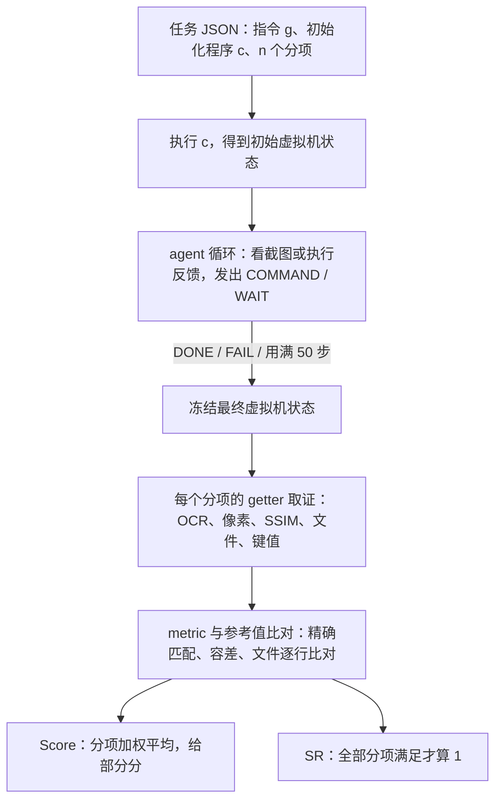

# 通用桌面上的高分，搬不进材料实验室的软件：MatToolBench

<!-- release-date: 2026-09-29 -->

> 本文依据本地 `papers/SJTU/MatToolBench.pdf`，即 **MatToolBench: Benchmarking Multimodal Agents in Real-World Materials Science Workflows**，上海交通大学 X-LANCE Lab、苏州实验室、上海人工智能实验室等机构署名，arXiv:2609.37053v1、2026-09-29 提交，共 25 页。页码均指 PDF 自身的页码。文中区分三件事：**报告明确写了什么**、**我们怎么解释它**、**哪些是外部资料或本文推算**。

## 读前先把几个词说成人话

这篇论文不训练模型，也不提出新的 agent。它造了一套考场：把材料科学研究生每天要用的 10 个专业软件装进一台 Windows 11 虚拟机，让多模态大模型像人一样看截图、点鼠标、写脚本，然后逐项检查它到底把活干到了哪一步（PDF p. 1–4）。

先把会反复出现的词说清楚：

- **GUI agent（图形界面智能体）**：只看屏幕截图、用鼠标键盘操作软件的模型。它没有软件内部的接口可调，只能「看见什么点什么」。
- **专业科学软件**：本文覆盖的 10 个工具。表征类有 XRD（X 射线衍射）分析软件 JADE、XPS（X 射线光电子能谱）处理软件 Avantage、透射电镜图像软件 DigitalMicrograph（简称 DM）；建模与可视化类有 Materials Studio（MS）和晶体结构查看器 VESTA；作图类有 OriginPro；数据库与代码类有 Materials Project（MP）、OQMD、OPTIMADE 三个材料数据库接口和 Python 库 Pymatgen（PDF p. 24，Table 15）。
- **三种模态**：GUI 操作（纯鼠标键盘）、OriginPro 脚本（在 Origin 里一边点界面、一边往内置编辑器 Code Builder 里贴 Python 脚本）、基于代码的数据库查询（只写 Python，不看屏幕）（PDF p. 1–3）。
- **分项（sub-criterion，pts）**：专家把每道题拆成若干个可以独立验证的中间状态或最终状态，例如「文件已导入」「对话框里的常数填成 3333」「结果已存到指定路径」。每个分项单独打分（PDF p. 3–4）。
- **Score 与 SR**：Score 是满足的分项占比，给部分分；SR（success rate，成功率）只在全部分项都满足时才算成功（PDF p. 4）。
- **getter / metric**：评测分两步。getter 从任务结束时的虚拟机里取证（OCR 识字、看像素、读文件），metric 把取到的东西和参考答案比，得出 0 或 1 或部分分（PDF p. 4、p. 17）。
- **FTR（false termination rate，错误收工率）**：agent 自己宣布「完成」的那些回合里，实际上没做成的比例（PDF p. 4）。
- **hint（工作流提示）**：系统提示里给每个软件写的操作要点，比如「JADE 启动时会弹一个只能读参考谱的对话框，先关掉」（PDF p. 22）。消融就是把它拿掉看会怎样。

## 一句话先说清

多模态 GUI agent 在通用桌面 benchmark 上已经拿到不错的成绩，但那些考题多是浏览器、办公软件、系统设置。专业科学软件的网页资料稀少、界面高度专门化、很多操作惯例只在实验室里口耳相传，这些都是通用预训练难以覆盖的盲区（PDF p. 1）。

MatToolBench 把这件事做成了可量的考场：10 个材料科学工具、204 个任务、三种模态，全部在 Windows 11 虚拟机里真机执行（PDF p. 1）。摘要给出的结论（PDF p. 1）：

- 最好的模型在 GUI 任务上 SR 只有 25%，代码任务 45%；
- 差距不只是「看不准、点不准」，还来自领域操作知识缺失、预训练对科学软件覆盖稀疏、跨工具交接产物薄弱，以及关键状态只在画面上体现；
- GUI 部分的自动评测器平均 F1 为 0.98；Origin 作图任务另做了人类与大模型评审的一致性研究，用来支撑一个次要的美观分。

**我们如何解释它。** 这篇的价值不在排行榜，而在两处工程选择：一是把每道题拆成专家定义的分项，让「做了一半」和「完全没做」能分开；二是对评测器本身做了可靠性审计。前者让失败可以定位，后者让分数可信。对任何要给 agent 搭领域考场的人，这两条都比 25% 这个数字更值得带走。

### 一条阅读路线

如果只有半小时读原文，建议按这个顺序：

1. **p. 3 的 Figure 3**：整套框架一张图，三类 agent、三类评测器。
2. **p. 4 的 Table 1**：204 个任务怎么分，每类平均几个分项。
3. **p. 5 的 Table 2**：7 个模型在各工具上的 Score 和 SR。全文的主表。
4. **p. 6–7 的 Table 3、Figure 4、Figure 5**：拿掉工作流提示之后掉多少。
5. **p. 7 的 Table 4 与 p. 18–19 的 Table 12、Table 14**：评测器自己可不可靠。
6. **p. 19 的 Table 13**：步数与错误收工率，看出「提前喊完成」这个失败模式。
7. **p. 23–25 的附录 P**：四类失败模式的真实轨迹截图。

## 主要矛盾：通用的 GUI 能力，碰上只在实验室里流传的操作惯例

论文先承认 GUI agent 在网页浏览、桌面操作、合成环境里进步很快，然后指出这些研究几乎都停留在日常通用软件上（PDF p. 1）。专业科学软件的网页数据稀少，大模型在这一垂直领域的预训练知识天然有限；它们能否在真实科学工作流里同样表现出色，是个没被回答的问题（PDF p. 1）。

作者认为材料化学工具是检验这件事的好平台，因为它有三处和通用软件不同的复杂性（PDF p. 1–2）：

1. **工具生态高度碎片化**。作者调查了 25 名材料方向研究生：不同子方向、不同需求对应大量异构工具，分属不同操作环境和交互界面（PDF p. 1，Figure 1）。
2. **跨工具交接产物**。一次完整的分析可能要在工具之间切换，还要保住中间文件、路径和科学含义。
3. **可访问性接口极度有限**。界面信息密集、菜单层层嵌套，关键操作状态往往只以隐含的视觉反馈呈现，没有统一、标准的可访问性接口（accessibility interface，即软件对外暴露控件树、让程序读到界面结构的那套接口）。

第 2 条最好用一张图说明：

图引自原文 Figure 2（PDF p. 2）。上排 3 张截图都在 JADE 里完成，下排转到 OriginPro，第 5 张是在 Code Builder 里贴脚本。图上没有画出两排之间交接的是什么；按引言与附录 F 的说法，靠的是 JADE 导出的中间文件，路径、扩展名、科学含义只要有一项没保住，下游就接不上（PDF p. 1、p. 15）。

于是矛盾变成：

> 通用 GUI benchmark 上的高分，测的是「在常见软件里看得准、点得准」。专业软件额外要求三件事：知道这个软件的规矩（启动弹窗要先关、哪个菜单藏着哪项功能），从只有像素的界面里读出关键状态，以及在工具之间把产物完整地交下去。只有成功/失败两个结果的评测，分不清模型卡在了哪一件上。

## 先看全景：一个调度器，三类 agent，三类评测器

图引自原文 Figure 3（PDF p. 3）。三列从左到右是三种模态，每列下方是各自的评测器：GUI 里 JADE、MS、Avantage 以 OCR 为主，VESTA 和 DM 另加视觉检查；代码里 Pymatgen、MP、OQMD 用键值对或文件比对，OPTIMADE 只看请求是否成功并存下结果；Origin 先查输出文件是否存在，再交给大模型给图打分。调度器既可以在本地单机跑，也可以在 Azure ML 上并行开多台虚拟机。

任务分布见 Table 1（PDF p. 4）：

| 类别 | 工具 | 任务数 | 易/中/难 | 平均分项数 | 分项总数 |
|---|---|---:|---|---:|---:|
| GUI | Avantage | 20 | 14/2/4 | 3.25 | 65 |
| GUI | DM | 20 | 13/5/2 | 3.35 | 67 |
| GUI | JADE | 20 | 15/5/0 | 2.95 | 59 |
| GUI | MS | 20 | 6/11/3 | 4.10 | 82 |
| GUI | VESTA | 20 | 13/2/5 | 3.45 | 69 |
| Origin | Origin | 16 | 0/7/9 | 2.00 | 32 |
| 代码 | MP / OQMD / OPTIMADE / Pymatgen | 80 | 37/41/2 | 1.00 | 80 |
| 跨工具 | Mixed | 8 | 3/4/1 | 3.75 | 30 |
| 合计 | | 204 | | | 484 |

读表要知道三件事。

第一，单工具任务是 196 个，另有 8 个跨工具任务单独作为诊断行，不进主排名；分项总数 484 = 单工具 454 + 跨工具 30（PDF p. 4、p. 12）。

第二，代码任务平均只有 1.00 个分项（PDF p. 4）。所以代码任务的 Score 和 SR 几乎等价，只有用键值对部分给分的 MP、OQMD 两者才会拉开（后文主表能看到这一点）。

第三，难度分档的口径不统一。GUI 任务按分项数分：易 1–3 个、中 4 个、难 5–7 个；Origin 与代码任务的分项数比较标准化，易中难按工作流复杂度由专家标注（PDF p. 4）。

## 核心设计一：真机环境，而不是模拟器或结构化状态

### 旧问题：多数科学 benchmark 看的是结构化状态

相关工作一节把已有科学 benchmark 排成一条线：从文本推理（SciBench、MatSciBench、ChemLLMBench），到可执行代码与工具调用（ScienceAgentBench、SciCode、MatTools、ChemCrow、Coscientist），再到多步科学工作流（Spider2-V、ScienceBoard、LabBench）（PDF p. 2）。作者指出，多数已有 benchmark 评测的是结构化状态、脚本或日志；MatToolBench 瞄准的是状态往往**只在画面上**可见的软件（PDF p. 2）。GUI 侧的 ProSoftArena 覆盖了广义专业软件，但没有针对材料科学工作流、专门的科学界面和领域评分标准（PDF p. 2）。

### 新设计：两层容器，一台虚拟机装齐整套软件

环境分两层：外层是 Linux Docker 容器，放 agent 逻辑、截图和评测服务；内层是 1920×1080 的 Windows 11 虚拟机，预装全部目标软件，并为每个领域准备隔离的 Python 虚拟环境（PDF p. 4）。虚拟机里的 Flask 服务是唯一的控制接口，外部 API 调用走 tinyproxy 代理（PDF p. 4）。大规模实验跑在 Azure ML 的 Standard_D8_v3 实例上，每台 8 个 vCPU、28 GiB 内存，内层虚拟机基于 QEMU（PDF p. 12）。

任务执行被形式化成部分可观测马尔可夫决策过程（POMDP）：每一步 $t$，agent 拿到观测 $o_t$（截图或执行反馈），做出动作 $a_t$，环境转到下一状态；策略以完整历史 $m_t = \{g, o_0, a_0, \dots, o_t\}$ 为条件，$g$ 是固定的自然语言指令（PDF p. 2）。回合在三种情况下结束：agent 宣布成功（DONE）、宣布做不了（FAIL）、步数预算耗尽，默认 50 步；软件响应慢时可以发 WAIT（PDF p. 3）。

三种模态拿到的东西不一样（PDF p. 3–4）：

| 模态 | 观测 | 动作 |
|---|---|---|
| GUI | 指令、1920×1080 全桌面截图、前台窗口元数据、剪贴板内容 | 层级化的 `Computer` 接口：鼠标、键盘、剪贴板、启动程序、窗口切换五个子模块，动作是一段 Python 字符串，在虚拟机里 `exec()` 执行 |
| 代码 | 只有文本执行反馈（stdout、stderr、返回码），没有任何视觉信号 | 每一步写一份完整的 Python 脚本，在该领域的隔离环境里运行，按反馈自我修正 |
| Origin | 和 GUI 一样看全桌面截图，既用来操作界面，也用来检查画出的图对不对 | 通过剪贴板把脚本贴进 Code Builder、按 F5 运行，同时配合界面导航 |

所有报告的实验都只用截图作观测。作者的理由是：老旧科学软件的可访问性元数据常常不全或干脆没有，截图是最通用的接口（PDF p. 3）。附录 C 的动作表里留了按元素编号点击（`move_id`）和 SoM（Set-of-Mark，给截图上的可点元素标号）的接口，但主实验没有启用（PDF p. 11–12，Table 6–7）。

### 工作机制：每一回合都从同一个确定的起点出发

每道题自带一段初始化序列：启动应用、传入文件、在软件里做预配置、等待界面就绪，保证每个回合从可复现的初始状态开始（PDF p. 3）。虚拟机里预装了真实的实验数据文件，例如 XPS 能谱、TEM 图像、XRD 图谱、晶体结构文件，并保留各软件的原生格式（`.VGD`、`.dm3`、`.xrdml`、`.xsd`、`.cif`、POSCAR、`vasprun.xml` 等）（PDF p. 4、p. 15–16）。任务流程上线前，作者对照了厂商教程、公开操作视频和领域文档做过交叉核对（PDF p. 4）。

并行时每个 worker 用一份写时复制（copy-on-write）的虚拟机存储，互不共享应用状态和输出文件；所有成败判定都在回合结束后进行，中途不给奖励信号，不会影响 agent 的行为（PDF p. 5、p. 12）。

### 收益与边界

收益是把「环境差异」从失败原因里尽量剔除：输入文件、屏幕分辨率、初始化脚本、步数上限、解码参数、动作后等待时间全部固定（PDF p. 5、p. 12）。主实验的解码设置是温度 1.0、top-p 0.9，最大输出 8000 token，每次动作后等 3 秒再截图（PDF p. 12，Table 7）。

边界也清楚。温度 1.0 意味着采样有随机性，但正文没有报告重复运行次数或方差；每个工具 20 道题，一道题就是 5 个百分点的 SR（这是我们按任务数推算的）。所以单个工具上 5–10 个点的差别，不宜读成稳定的模型差距。

### 可迁移启发

给 agent 搭领域考场，先把「起点」做成可复现的：固定镜像、固定输入文件、每题自带初始化脚本、并行用写时复制隔离。否则同一个模型两次运行的差异，会和模型之间的差异混在一起。

## 核心设计二：把每道题拆成分项，按最终状态打分

### 旧问题：只有成败两个结果，看不出卡在哪

多步工作流里，一次失败可能是文件没打开，也可能是做完了只差最后一步没保存。只记成功/失败，这两种情况在分数上没有区别（PDF p. 3）。

### 新设计：getter 取证，metric 判分，分项加权

评测流程如下（按 PDF p. 3–4、p. 17、p. 20 的 Algorithm 1 重画，是机制示意，不是原文图）：

形式化写法（PDF p. 17，式 1–2）：一道题 $x$ 由指令 $g$、初始化程序 $c$ 和 $n$ 个分项 $\mathcal{C}(x)=\{(g_i, m_i, w_i)\}_{i=1}^{n}$ 定义，$g_i$ 是取证函数，$m_i$ 是判分函数，$w_i$ 是权重。回合结束、虚拟机停在最终状态 $v_T$ 后，每个分项的得分是

$$
r_i = m_i\bigl(g_i(v_T),\, y_i\bigr),\qquad r_i \in [0, 1]
$$

$y_i$ 是参考值或判定条件。整道题的两个分数是

$$
\mathrm{Score}(x) = \frac{\sum_{i=1}^{n} w_i r_i}{\sum_{i=1}^{n} w_i},
\qquad
\mathrm{SR}(x) = \mathbb{I}\bigl[\forall i,\ r_i = 1\bigr]
$$

前一个是加权平均，后一个是「全对才算」。这个定义对 GUI、Origin、代码三类任务通用，只有 getter 和 metric 的实现不同（PDF p. 17）。

### 工作机制：一道 7 分题怎么打分

附录 L 用 Avantage 的一道难题（编号 8ebfc15b，7 分）走了一遍（PDF p. 20–21）。指令是：打开 Avantage 导入 `C1s Scan.VGD`；把能谱复制到窗口 B；对窗口 B 的能谱做 Add Constant，常数 3333；把窗口 A、B 竖直并排对比；把当前文档存为 `stacked_3333.vgp`。七个分项如下（PDF p. 20）：

| 分值 | 分项 | 取证方式 |
|---:|---|---|
| 1 | Avantage 导入了 `C1s Scan.VGD` | 标题栏 OCR |
| 1 | 窗口 A 和窗口 B 都含有 C1s 能谱 | 窗口状态 |
| 1 | 为窗口 B 打开了 Add Constant 对话框 | 对话框 OCR |
| 1 | 常数值等于 3333 | 参数 getter |
| 1 | 变换后的能谱出现在窗口 B | 像素或 OCR 状态 |
| 1 | 两个窗口竖直排列以便对比 | 布局 getter |
| 1 | `stacked_3333.vgp` 存到了目标路径 | 文件检查 |

作者特意把「界面证据」和「产物证据」混在一起（PDF p. 21）。这样做堵住了一条捷径：直接把未改动的工程另存一份，拿不到满分；只存文件、不做变换，中间的科学状态都不满足，也拿不到高分。反过来，导入、开对话框、填对常数、保存都做了，只差窗口没竖排，拿 6/7 的部分分，而不是被记成一次彻底失败（PDF p. 21）。

因为只看最终状态，评测与动作序列无关：用工具栏按钮、菜单、快捷键还是脚本到达同一状态，得分一样（PDF p. 17、p. 21）。

### 状态只在画面上时：像素检测

不少关键状态没有文字标签。VESTA 当前的渲染风格只体现为某个单选按钮被涂成蓝色；DM 里画完一个形状只体现为出现了绿色的控制柄（PDF p. 21）。

图引自原文 Figure 11（PDF p. 22）。这些方法直接读截图里的原始像素，不依赖软件的可访问性树或任何结构化界面元数据，最后都输出一个二值信号交给 `exact_match`（PDF p. 21–22）。（d）格的判据是 SSIM（结构相似度）不低于 0.9（PDF p. 22）；JADE 的背景扣除则以最大强度下降至少 20% 为判据（PDF p. 17，Table 10）。

各工具用的判分函数（PDF p. 18，Table 11）：

| 工具 | 判分函数 |
|---|---|
| Avantage、DM、JADE、MS、VESTA、Origin | 全部用 `exact_match`（0 或 1） |
| MP | 20 题里 14 题用 `detect_kv_match`，6 题用 `detect_file_match` |
| OQMD | 全部用 `detect_kv_match`：解析键值对，数值在 0.1% 相对容差内算对，给部分分 |
| OPTIMADE | 全部用 `exact_match`，判的是「发出了合法查询并存下了合法结果」，因为不同数据提供方返回的记录会变 |
| Pymatgen | 全部用 `detect_file_match`：与标准答案文件逐行比对，0 或 1 |

### 代价与边界

分项设计依赖专家逐题定义 getter 和阈值，这是人力活。作者也承认 GUI 评测器的残余误差集中在视觉边界情况：小字 OCR 认错相近字符、最终截图里残留临时对话框或选中高亮、像素与 SSIM 阈值对抗锯齿和渲染差异敏感（PDF p. 18–19）。限制一节特别点了晶体结构可视化任务，SSIM 阈值可能受 GPU 抗锯齿差异影响（PDF p. 25）。

### 可迁移启发

1. **分项里要同时有过程证据和产物证据。** 只查产物会被「另存一份」骗过，只查过程又不知道最后有没有交付。
2. **只看最终状态，不看动作路径。** 这样换了菜单、快捷键或脚本都公平，评测器也不用跟着 agent 的策略改。
3. **界面没有文字时，去读像素。** 单选按钮的位置、图标高亮、控制柄个数都是可以写成规则的视觉信号；但每一条都要配阈值审计。

## 核心设计三：评测器自己也要过一遍考试

### GUI 评测器：n×n 交叉评测

验证方法是：每个 GUI 工具收集 20 个轨迹最终状态，把每个最终状态拿去和同一工具下全部 20 道题的评测配置逐一比对，组成 20×20 的矩阵（PDF p. 7、p. 18）。这样既测「该判对的判对了」，也测「不相干的题会不会误判成对」。Score 一致性在分项标签上算，SR 一致性在题目级成功标签上算（PDF p. 7）。

| 工具 | Score 准确率 | Score 精确率 | Score 召回率 | Score F1 | SR 准确率 | SR 精确率 | SR 召回率 | SR F1 |
|---|---:|---:|---:|---:|---:|---:|---:|---:|
| JADE | 1.00 | 1.00 | 0.99 | 0.99 | 1.00 | 1.00 | 1.00 | 1.00 |
| MS | 1.00 | 0.99 | 1.00 | 0.99 | 1.00 | 1.00 | 1.00 | 1.00 |
| Avantage | 0.99 | 0.98 | 0.98 | 0.98 | 1.00 | 0.98 | 1.00 | 0.99 |
| VESTA | 0.98 | 0.94 | 0.99 | 0.97 | 0.99 | 0.94 | 1.00 | 0.97 |
| DM | 0.99 | 0.99 | 0.94 | 0.96 | 1.00 | 0.98 | 1.00 | 0.99 |

表引自 Table 4（PDF p. 7）。五个 Score F1 的平均约 0.98，与摘要一致（这个平均是我们算的）。

DM 一行要多读一句。Table 4 的表注写明 DM 用的是附录 I 描述的「过滤后审计」：几类在交叉评测下本来就不具区分度的线索被剔除了，比如显微图像里到处都有的短 OCR 词（nm、scale、rotate）、多个画图任务共用的几何检查、主干名相同而扩展名不同的文件（PDF p. 7、p. 18）。作者说这一过滤只影响可靠性审计，不改变 benchmark 的评测器或任务分数（PDF p. 18）。附录的逐题表 Table 12 给出的 DM 平均 Score F1 是 0.936，其余四个工具是 JADE 0.991、MS 0.994、Avantage 0.980、VESTA 0.979（PDF p. 18）。两张表口径不同：附录 I 说 Table 4 是按工具汇总的结果，Table 12 是 20 道题的宏平均（PDF p. 18），所以数字本来就不必相等，VESTA 也是 0.97 对 0.979。DM 的差距更大（0.96 对 0.936），而 Table 12 的表注没有说明 DM 一列是否也做了过滤，原文没有交代这一差距从哪来。

### Origin 的美观评审：选了一个「更保守」的评审

Origin 任务的 SR 只看一件事：指定路径下有没有导出预期的 `.png`（PDF p. 6）。画得对不对、全不全、好不好看，交给 Gemini-3.1-pro 给一个**次要**的质量分，不进 SR。作者明说这是为了让 SR 保持确定、可复现（PDF p. 6）。

质量分 $s$ 由三个 1–5 分的子分组成：视觉正确性 $C$、美观 $A$、任务完成度 $T$（PDF p. 19）：

$$
s = \frac{C + A + T}{3 \times 5}
$$

没生成图片时 $\mathrm{SR}=0$ 且 $s=0$。

选哪个模型当评审，作者用 20 个人工评分条件、43 张生成的 Origin 图做了验证（PDF p. 7）。Table 14（PDF p. 19）：

| 评审 | 平均 C/A/T | 解析成功 | Pearson | 95% 置信区间 | Spearman |
|---|---|---:|---:|---|---:|
| GPT-5.4 | 4.33 / 4.15 / 4.38 | 43/43 | 0.513 | [−0.180, 0.826] | 0.348 |
| Doubao-seed-1-8 | 4.61 / 4.43 / 4.80 | 43/43 | 0.677 | [−0.017, 0.896] | 0.402 |
| Gemini-3.1-pro | 4.60 / 4.25 / 4.68 | 43/43 | 0.694 | [0.033, 0.891] | 0.346 |
| Qwen3-VL-235B | 4.81 / 4.46 / 4.92 | 43/43 | 0.737 | [0.104, 0.928] | 0.518 |

Qwen3-VL-235B 的相关性最高，但它的原始分更饱和、更宽松。Williams 相关性检验显示它与 Gemini-3.1-pro 的差异不显著：$\Delta r = 0.043$，$t = 0.582$，$p = 0.569$（PDF p. 7、p. 18）。作者于是选了更保守的 Gemini-3.1-pro，以减少分数虚高，并强调这个选择不影响任何 SR（PDF p. 7）。

**我们如何解释它。** 这张表的置信区间比点估计更有信息量：四个评审的 Pearson 95% 区间都很宽，GPT-5.4 和 Doubao 的区间跨过了 0。样本只有 20 个条件，「与人类一致」在这里只能读成弱支持。作者把美观分放在 SR 之外，是与这个证据强度相称的做法。

原文 Figure 6（PDF p. 7）是一张四个子图的雷达图，图注说坐标轴是 C、A、T 三项、虚线是 9 名人类评分者的均值、实线是 4 个大模型评审。但图上实际画的是五个轴（Ours、B1–B4），图例里的评审写成 GPT-4.5，与 Table 14 的 GPT-5.4 对不上。这张图的轴与图注不一致，本文不从中读数。

### 代码评测器

Pymatgen 用参考文件比对，MP 与 OQMD 用带容差的键值匹配，OPTIMADE 要求发出受约束的查询并存下解析后的合法值；评测器还会检查输出是否可解析、有效、针对本题，格式错误或无关数值不给分（PDF p. 6–7）。代码评测器没有像 GUI 那样报告单独的可靠性数字。

### 可迁移启发

评测器是 benchmark 的一部分，也要有自己的测试集。n×n 交叉评测是一个便宜的做法：拿已有轨迹的最终状态去套别的题的判据，能同时看到漏判和误判。大模型评审只放在不决定成败的次要分上，选评审时看置信区间，不只看点估计。

## 结果：最好的 GUI 成功率 25%，代码 45%

### 模型与设置

评测了 7 个多模态模型：Doubao-seed-1-8（字节跳动）、Kimi-k2.5（月之暗面）、Claude-sonnet-4.6（Anthropic）、GPT-5.4（OpenAI）、Qwen3-VL-235B、Qwen3-VL-32B、Qwen3-VL-8B（阿里巴巴），全部经 API 调用（PDF p. 4）。GUI 与 Origin 任务把模型套进 NaviAgent 框架，只给原始截图作视觉输入，按 agent 类型配系统提示；代码任务不给视觉输入。步数上限一律 50（PDF p. 4）。

### 主表

Table 2（PDF p. 5），每格是 Score / SR，单位 %：

| 类别 | 工具 | Doubao-seed-1-8 | Kimi-k2.5 | Claude-sonnet-4.6 | GPT-5.4 | Qwen3-VL-235B | Qwen3-VL-32B | Qwen3-VL-8B |
|---|---|---|---|---|---|---|---|---|
| GUI | Avantage | 44.6 / 35.0 | 32.3 / 20.0 | 41.3 / 35.0 | 32.3 / 15.0 | 30.8 / 10.0 | 26.2 / 15.0 | 18.5 / 15.0 |
| GUI | JADE | 54.2 / 25.0 | 50.8 / 25.0 | 57.6 / 25.0 | 50.8 / 20.0 | 45.8 / 10.0 | 37.3 / 10.0 | 37.3 / 5.0 |
| GUI | DM | 56.7 / 20.0 | 52.2 / 20.0 | 40.3 / 20.0 | 50.7 / 20.0 | 52.2 / 10.0 | 6.0 / 0.0 | 38.8 / 10.0 |
| GUI | MS | 47.6 / 15.0 | 35.4 / 10.0 | 52.4 / 20.0 | 56.1 / 30.0 | 43.9 / 0.0 | 26.8 / 0.0 | 20.7 / 0.0 |
| GUI | VESTA | 52.2 / 20.0 | 59.4 / 25.0 | 58.0 / 25.0 | 65.2 / 20.0 | 52.2 / 10.0 | 29.0 / 10.0 | 30.4 / 10.0 |
| GUI | 平均 | **52.1** / 24.0 | 46.0 / 20.0 | 49.9 / **25.0** | 51.0 / 21.0 | 45.0 / 8.0 | 25.1 / 7.0 | 29.1 / 8.0 |
| Origin | OriginPro | 11.7 / 12.5 | 22.5 / 25.0 | 53.1 / 56.3 | **63.8** / **68.8** | 6.3 / 6.3 | 5.3 / 6.3 | 0.0 / 0.0 |
| 代码 | Pymatgen | 30.0 / 30.0 | 15.0 / 15.0 | 25.0 / 25.0 | 35.0 / 35.0 | 35.0 / 35.0 | 29.4 / 29.4 | 15.0 / 15.0 |
| 代码 | MP | 25.0 / 25.0 | 22.5 / 20.0 | 21.9 / 15.0 | 17.5 / 15.0 | 25.0 / 25.0 | 10.0 / 10.0 | 10.0 / 10.0 |
| 代码 | OQMD | 33.2 / 10.0 | 50.3 / 30.0 | 60.8 / 50.0 | 58.2 / 45.0 | 26.2 / 10.0 | 11.5 / 0.0 | 18.4 / 0.0 |
| 代码 | OPTIMADE | 70.0 / 70.0 | 80.0 / 80.0 | 75.0 / 75.0 | 85.0 / 85.0 | 20.0 / 20.0 | 30.0 / 30.0 | 10.0 / 10.0 |
| 代码 | 平均 | 39.6 / 33.8 | 42.0 / 36.2 | 45.7 / 41.3 | **48.9** / **45.0** | 26.6 / 22.5 | 20.2 / 17.4 | 13.4 / 8.8 |
| 跨工具 | Mixed | 50.0 / 12.5 | **60.0** / **37.5** | 56.7 / 25.0 | 50.0 / 25.0 | 50.0 / 25.0 | 33.3 / 25.0 | 53.3 / **37.5** |
| 总体 | 总平均 | 43.4 / 26.0 | 43.1 / 27.5 | 48.8 / 33.8 | **51.2** / **34.3** | 34.9 / 14.2 | 21.9 / 11.7 | 21.6 / 8.8 |

加粗沿用原表：类别内最佳的平均值，以及总体最佳。总平均是按任务数加权的：用 GPT-5.4 一列按 100、16、80、8 个任务加权复算 SR，得 34.3，与表中一致；除 Doubao-seed-1-8 外的另外 5 列也都能在 0.1 内复现（复算是我们做的）。

Doubao-seed-1-8 的 GUI 平均一格对不上：表中写 52.1 / 24.0，正文也引用这两个数（PDF p. 5），但它五个工具的 Score 平均是 51.1、SR 平均是 23.0（这是我们按表中各行算的）。用逐行平均（Score 51.06、SR 23.0）按 100、16、80、8 个任务加权，恰好得到表中的总平均 43.4 / 26.0；用 52.1 / 24.0 则得 43.9 / 26.5，所以出错的更可能是 GUI 平均那一格。按 51.1 算，它仍以 0.1 的差距领先 GPT-5.4 的 51.0，「GUI 平均 Score 最高」这句话不受影响；GUI 平均 SR 则应是 23.0，不是 24.0。

下面只讲读表要知道的五件事。

**一、Score 和 SR 之间隔着一道墙。** GUI 各工具上，模型常常能完成大约一半的分项（Score 约 50%），却很少把全部分项同时做对（SR 约 20%）（PDF p. 5）。作者把这当成分项计分有用的证据：模型在复杂任务上确实有进展，只是走不到终点（PDF p. 5）。

**二、难点不均匀，而且和界面给不给反馈有关。** DM 上没有一个模型的 SR 超过 20%；MS 的平均 SR 最低；VESTA 和 JADE 相对好些（PDF p. 5）。作者的解释是：DM 与 MS 菜单嵌套深、操作后反馈隐含，而 VESTA 和 JADE 对状态变化给出了更明确的视觉确认（PDF p. 5）。这是作者的推断，原文用的词是 likely。

**三、代码任务整体更高，但数据库之间差得很远。** GPT-5.4 代码平均 SR 45.0%，Claude-sonnet-4.6 41.3%（PDF p. 5）。OPTIMADE 的 SR 区间是 20–85%，部分原因是它的题目允许多个合法结果；MP 只有 10–25%，因为要准确使用 API 约定仍在演变的 mp-api 客户端；OQMD 在 0–50% 之间，前沿模型（Claude 50%、GPT 45%）与小模型（Qwen3-VL-8B 0%）拉开很大（PDF p. 5–6）。Pymatgen 与 OPTIMADE 的 Score 和 SR 完全相等，MP 和 OQMD 才有差别，这正对应 Table 1 里代码题平均只有 1 个分项、只有键值匹配才给部分分（PDF p. 4、p. 18）。

**四、Origin 是分化最大的一类。** GPT-5.4 的 SR 是 68.8%，Claude-sonnet-4.6 是 56.3%，其余模型都低于 25%，Qwen 系列最多 6.3%，Qwen3-VL-8B 是 0%（PDF p. 6）。要拿分，模型必须用上 Code Builder、生成能跑的 Python 脚本并存下文件，否则两个分数都是 0。Kimi-k2.5（25.0%）和 Doubao-seed-1-8（12.5%）这类中档模型的结果大多是二值的，作者据此认为失败集中在脚本执行，而不在视觉评分（PDF p. 6）。

**五、GUI 能力和代码能力不同步。** Qwen3-VL-32B 与 8B 的 GUI 分数尚可，代码任务却明显落后。作者的推断是：可靠地调用科学 API 需要更深的领域知识，它与通用 GUI 交互的扩展规律不同（PDF p. 6）。

Origin 一行还有一个细节：Origin 的 Score 有时低于 SR（GPT-5.4 是 63.8 对 68.8）。附录 A 的样例配置里，Origin 题的两个分项正是 `file_exists` 和 `origin_aesthetic_score`（PDF p. 10），Table 1 也记 Origin 平均每题 2.00 个分项（PDF p. 4）。所以 Origin 的 Score 应当把美观分一并算了进去，图存下了但画得不够好，Score 就会低于 SR。这是我们的推断，原文没有写明 Origin 的 Score 怎么合成。

Mixed 一行只有 8 道题，作者明说不拿它做排名（PDF p. 6）。它的 Score 相对高，是因为先写代码的工作流能靠产出可验证的中间文件拿部分分；SR 低，是因为 GUI 导出的产物经常无法被下游工具定位、解析或复用（PDF p. 6）。8 道题时 SR 的最小单位是 12.5%，表里 37.5% 就是 3 道（这是我们按题数换算的）。

## 效率：步数用得满，「完成」喊得早

Table 13（PDF p. 19）报告了三项效率指标。Steps 是全部回合的平均步数，Steps* 只在成功回合上平均，FTR 是 agent 自己收工的回合里实际失败的比例（PDF p. 19，式 3–4）：

$$
\mathrm{Steps} = \frac{1}{|\mathcal{E}|}\sum_{e\in\mathcal{E}} T_e,
\qquad
\mathrm{FTR} = \frac{\sum_{e\in\mathcal{E}} d_e\,\mathbb{I}[s_e = 0]}{\sum_{e\in\mathcal{E}} d_e}
$$

$T_e$ 是回合 $e$ 的步数，$s_e$ 是最终是否成功，$d_e$ 表示该回合是否以 agent 发出 DONE 结束。

摘出 GUI 与代码两类的平均（PDF p. 19）：

| 模型 | GUI Steps | GUI Steps* | GUI FTR | 代码 Steps | 代码 FTR |
|---|---:|---:|---:|---:|---:|
| Doubao-seed-1-8 | 39.1 | 27.2 | 43.6 | 2.0 | 66.3 |
| Kimi-k2.5 | 42.1 | 31.6 | 50.3 | 4.9 | 50.0 |
| Claude-sonnet-4.6 | 41.7 | 29.7 | 35.3 | 2.1 | 58.8 |
| GPT-5.4 | 35.9 | 23.9 | 62.7 | 2.7 | 58.3 |
| Qwen3-VL-235B | 40.6 | 14.1 | 79.1 | 2.1 | 77.5 |
| Qwen3-VL-32B | 46.7 | 16.7 | 59.7 | 5.1 | 82.2 |
| Qwen3-VL-8B | 48.7 | 原表空缺 | 原表空缺 | 4.9 | 90.3 |

GUI 任务平均要 35–42 步，因为要大量试探：找控件、读对话框；代码任务只要 1–4 步，每一步就是一次完整的脚本执行（PDF p. 6、p. 19）。GUI 上 40–70% 的 FTR 说明，所有模型都有一个持续的失败模式：**提前收工**，分不清任务真的完成了还是流程里的暂时停顿（PDF p. 6、p. 19）。

作者特意把 Steps* 和 FTR 分开报，理由是：原始步数低可能是假象，agent 也许只是在做完必需的科学操作之前就宣布了完成（PDF p. 19）。GPT-5.4 的 GUI 平均步数最少，FTR 却是前四个模型里最高的 62.7%，正是这句话的例子。

**我们如何解释它。** FTR 高说明模型的「自我验收」不可靠，这与第二节分项计分是一体两面：只看 agent 自报的 DONE，会系统性高估完成率。自建 agent 流水线时，DONE 之后必须有一个独立的状态检查，不能把模型的自我声明当结果。

## 消融：拿掉工作流提示，掉的是领域知识

消融只改提示里有没有领域工作流说明（Table 3，PDF p. 6）：

| 类型 | 条件 | 模板脚本 | 提示 | 预先打开 Code Builder | 注入内容 |
|---|---|---|---|---|---|
| GUI | hint（完整） | — | 有 | — | GUI 工作流说明 |
| GUI | no_hint（基线） | — | 无 | — | 只有通用准则 |
| 代码 | hint（完整） | — | 有 | — | API 示例与文档 |
| 代码 | no_hint（基线） | — | 无 | — | 只有通用准则 |
| Origin | script+hint（完整） | 有 | 有 | 有 | 模板加工作流 |
| Origin | no_script+hint（部分） | 无 | 有 | 有 | 只有工作流 |
| Origin | no_script+no_hint（基线） | 无 | 无 | 无 | 只有通用准则 |

GUI 与代码的消融只在 Doubao-seed-1-8 和 GPT-5.4 上做；Origin 的三档消融只在 Claude Sonnet 4.6 上做（PDF p. 6–7）。

### GUI 与代码：提示管用的地方，是软件规矩冷门的地方

Figure 4 的数值（PDF p. 6–7；Doubao 的 JADE、DM，两个模型的 OPTIMADE，以及 GPT-5.4 的 MP 在正文里写了，其余读自 Figure 4 折线图），单位为 SR %，格式是「有提示 → 无提示」：

| 任务 | Doubao-seed-1-8 | GPT-5.4 |
|---|---|---|
| JADE | 25 → 5 | 20 → 5 |
| DM | 20 → 0 | 20 → 10 |
| MS | 15 → 15 | 30 → 10 |
| MP | 25 → 20 | 15 → 0 |
| OQMD | 10 → 0 | 45 → 45 |
| OPTIMADE | 70 → 70 | 85 → 75 |
| Pymatgen | 30 → 20 | 35 → 35 |

GUI 侧，拿掉提示后普遍下降。主要的失败是各软件特有的启动陷阱：JADE 启动时弹出一个只能读参考谱的对话框，挡住了加载任务文件；DM 启动时左侧有个浮动面板，会遮住标题栏里的文件名，干扰文件导入的检查（PDF p. 6）。Avantage 和 VESTA 没进消融，作者的理由是这两个软件的流程从界面上一看就懂（PDF p. 6）。

附录 N 的系统提示把 JADE 和 DM 标成「ablation-critical」，JADE 那条写的是：先关掉预先打开的「Read Pattern Files」对话框，否则在这里加载任务文件会导致无法恢复的卡死（PDF p. 22）。DM 那条还点明：不关面板会直接干扰评测器的文件导入检查，造成错误评分（PDF p. 22）。

**我们如何解释它。** DM 那条说明，无提示时的部分掉分可能来自评测器看不到标题栏，而不全是 agent 没做到。这不推翻结论，但说明「状态只在画面上」这件事同时卡住了 agent 和评测器。

代码侧情况更细。OPTIMADE 有无提示几乎一样（Doubao 70% → 70%，GPT-5.4 85% → 75%），作者认为它标准化的查询语法已被预训练充分覆盖；MP 和 OQMD 掉得更多，因为代码 agent 的提示里带了一次性 API 用法示例，拿掉后模型得凭记忆重建库的约定，对演变中或冷门的 API 不可靠（PDF p. 7）。作者的结论是：提示主要在工具约定冷门或不稳定时起作用，对广泛标准化的接口作用有限（PDF p. 7）。

读 Figure 4 时要注意，「MP 和 OQMD 都掉得更多」并不对每个模型都成立：GPT-5.4 的 OQMD 有无提示都是 45%，掉的是 Doubao（10 → 0）。每格 20 道题，5 个点就是 1 道题，这张图的单格差异只能当方向看。

### Origin：先丢美观，再丢文件

Figure 5 的数值（PDF p. 7；中间一档读自 Figure 5 的柱状图标注），Claude Sonnet 4.6，SR 分与美观分各满分 16：

| 条件 | SR 分 | 美观分 | 合计（满分 32） |
|---|---:|---:|---|
| script+hint（完整） | 9 | 8 | 17.0（53%） |
| no_script+hint（部分） | 8 | 5 | 13.0（41%） |
| no_script+no_hint（基线） | 3 | 2.2 | 5.2（16%） |

只拿掉模板脚本，主要伤画质，因为 agent 仍然知道要用 Code Builder；连提示一起拿掉，agent 常常转去纯 GUI 摸索，文件生成和画质一起掉（PDF p. 7）。确定性成功从 9 降到 8、再降到 3，降幅 67%（PDF p. 7）。完整条件下的 9/16 = 56.3%，与主表 Claude 的 Origin SR 一致（这是我们对的数）。

图引自原文 Figure 9（PDF p. 20）。下排的问题就是作者列的那几类：坐标轴不对、缺标注、格式粗糙，或者执行失败（PDF p. 19）。这也是作者坚持用 SR 量「交没交付」、用 $s$ 量「科学呈现质量」的原因：文件存在不等于图是对的，图上可能有反向的坐标轴、漏掉的标注或不一致的样式（PDF p. 19）。

### 可迁移启发

领域 agent 的提示里，最值钱的不是通用的「仔细一点」，而是那几条冷门软件的启动规矩和 API 示例。值得写进提示的，恰恰是预训练语料里最稀少的那部分；对已经高度标准化的接口（这里是 OPTIMADE），加提示收益很小。

## 四类失败模式：从轨迹里看见的

作者人工检查了 Doubao-seed-1-8 在各类任务上的轨迹，归出四类反复出现的失败（PDF p. 6、p. 23–25）：

1. **GUI 定位错误**。高层动作是对的（「点 Display Modes 选项卡」），坐标却落在了别的控件上。Avantage 上最常见，因为几排工具栏的图标长得很像。一条轨迹里，到第 40 步时连续误点已经开出 19 个独立数据表，却始终没有选中两条能谱、也没有调出叠放布局，最后耗尽步数（PDF p. 23，Figure 12）。在检查过的 GUI 轨迹里，约 30% 至少出现一次定位错误，其中一半能自我纠正，另一半就此偏离、无法恢复（PDF p. 23）。
2. **提前收工**。一道 Avantage 任务要求导入 `O1s Scan.VGD` 并开启叠放显示。agent 只走了 6 步，看到「Display Modes」选项卡是高亮的（它默认就高亮），就发出 DONE，画布上什么数据都没有（PDF p. 24，Figure 13）。作者说这种模式在 8 步以上的长任务里更明显，并与缺乏显式状态记忆有关（PDF p. 24）。
3. **死循环**。一道 Materials Studio 文件导入题，agent 在桌面目录里每一步都在左栏快捷方式和相邻文件夹之间来回点，始终没有进入目标子目录；第 45 步和第 49 步的界面完全相同，步数用尽时对话框还开着（PDF p. 24，Figure 14）。
4. **领域知识缺口**。一道 JADE 任务要做峰形拟合、再把报告打印成 PDF。第 45 步拟合已经收敛、参数表正确；第 49 步 agent 走「打印」菜单，得到「JADE 5.5 -- No Installed Printers」的报错，因为评测虚拟机里没有配置虚拟 PDF 打印机（PDF p. 24–25，Figure 15）。代码任务里也有同类问题：脚本语法正确，却用错单位（晶格参数写成 nm 而不是 Å）或用了过时的 API 端点，运行不报错，结果却是错的、得 0 分（PDF p. 25）。

**我们如何解释它。** 第 4 类里的 JADE 例子，失败的直接原因是评测环境没装虚拟打印机。作者把它归为 agent 不知道环境里没有打印机。读者也可以把它看成任务与环境之间的一处不匹配。这类边界情况说明，在真机考场里「agent 的知识缺口」和「环境配置缺口」有时难以分开。

前三类失败都指向同一件事：agent 缺一个可靠的进度模型。定位错了自己不知道，没做完以为做完了，原地打转意识不到。这和上一节 40–70% 的 FTR 是同一个现象的两个侧面。

## 跨工具任务：产物交接是一道单独的瓶颈

8 道跨工具任务被设计成诊断用例，不另算一个领域分数（PDF p. 15）。每道题拆成有序的几个阶段，上游环境产出一个中间产物，交给另一个工具消费（PDF p. 15）。正文把交接方向列为代码→代码、代码→GUI、GUI→Origin、GUI→GUI 四种（PDF p. 6）；附录 F 只展开了其中两种代表模式：代码到 GUI（Pymatgen 或数据库 API 生成结构文件，再在可视化或建模软件里打开），以及 GUI 到 Origin（JADE 或 Avantage 处理能谱、导出表格，再到 Origin 重新作图）（PDF p. 15）。

把附录 F 列出的 8 道题按交接方向归类（任务原文见 PDF p. 14–15，归类是我们做的）：

| 交接方向 | 难度 | 任务 |
|---|---|---|
| 代码 → GUI | 易 | 经 Materials Project 下载 mp-149 Si 的 CIF，在 VESTA 里删掉一个 Si 位点后保存 |
| 代码 → GUI | 易 | 下载 SrTiO3（mp-5229），用 Pymatgen 取惯用晶胞，在 VESTA 里切到 Ball-and-Stick 后保存 |
| 代码 → GUI | 中 | 用 Pymatgen 搭双层 MoS2、导出 CIF，在 Materials Studio 里建表面并保存 |
| 代码 → 代码 | 易 | 经 OPTIMADE 查单质 Si、导出 POSCAR，再用 Pymatgen 判定空间群与晶系 |
| 代码 → 代码 | 难 | 取 LiCoO2，生成 3 种 Li 含量的结构，分别建 VASP 输入目录 |
| GUI → GUI | 中 | 在 Materials Studio 里建聚乙烯晶体、导出 CIF，再在 VESTA 里设标准朝向与分数坐标范围 |
| GUI → Origin | 中 | 在 Avantage 里处理 C1s XPS 数据、导出报告，再在 Origin 里画导出的能谱 |
| GUI → Origin | 中 | 在 JADE 里分析 WRT-ZSX-5 的 XRD、导出匹配的 PDF 卡片，再在 Origin 里画带标注的匹配图 |

难度合计 3 易、4 中、1 难，与 Table 1 的 Mixed 一行一致（PDF p. 4）。8 道里有 5 道以代码开头，这与作者对 Mixed 一行「Score 相对高、SR 低」的解释对得上：代码阶段先产出可验证的中间文件拿部分分，GUI 导出的产物则常常让下游找不到、读不了或用不上（PDF p. 6）。

作者把这里暴露的问题叫作产物边界瓶颈：agent 不但要把第一个工具的操作做完，还要用正确的路径、扩展名和语义内容把结果存下来，留给下一个软件（PDF p. 15）。

## 与通用 GUI benchmark 的对照：只当诊断背景，不当排行榜

正文说，通用桌面 benchmark（如 OSWorld）上报告的成功率在 70% 以上，而 MatToolBench GUI 最佳 SR 只有 25.0%（PDF p. 5）。附录 Q 把这件事讲得更谨慎（PDF p. 25，Table 16）：

| 对照 benchmark | 公开报告的设置与结果 | MatToolBench 对应数字 | 作用 |
|---|---|---|---|
| OSWorld-Verified | 相匹配或最接近的模型家族，100 步下 SR 41.6–72.1% | GUI SR 7.0–25.0% | 广义桌面对照 |
| WindowsAgentArena | GPT-5 与 Qwen3-VL-32B 家族，50 步下 SR 63.5% 与 45.3% | GUI SR 21.0% 与 7.0% | 同步数预算的 Windows 对照 |
| MMBench-GUI | 50 步下 L3 / L4 最佳平均 SR 26.6% / 8.8% | GUI 最佳 SR 25.0% | 自动化难度背景 |

表注写明，这些数字取自公开报告，不是受控的排行榜比较（PDF p. 25）。各 benchmark 的任务分布、agent 外壳、观测、动作空间和评测器都不同（PDF p. 25）。MMBench-GUI 那一行还说明，即使不碰科学软件，50 步内的长程单应用自动化平均 SR 也低于 30%，跨应用协作最佳方法低于 10%（PDF p. 25）。

**我们如何解释它。** 正文那句「70% 以上」对应的是 100 步预算下的 OSWorld 区间上沿，MatToolBench 是 50 步。真正同口径的是 WindowsAgentArena 那一行：同样 50 步、同样 Windows，GPT-5 家族 63.5% 对 GPT-5.4 的 21.0%，Qwen3-VL-32B 家族 45.3% 对 7.0%。这一行最能支撑「迁移鸿沟」的说法，但模型版本也不完全相同，所以仍然只是诊断。

## 限制、边界，以及不要补进去的东西

作者自己写下的限制（PDF p. 25）：

- 只选了 10 个工具，遗漏了 LabView 仪器控制、实验规划笔记本、专有模拟程序等重要平台；
- 任务限定在单次会话、最多 50 步之内，更长的多会话或多 agent 流水线不在范围内；
- 自动评分与人工标注平均一致率超过 97%，但仍有边界情况，尤其是 SSIM 阈值对 GPU 抗锯齿差异敏感；
- 只评测英文提示，换语言表现可能不同。

读完必须留下的判断：

- **每个工具 20 道题，统计力度有限。** 一道题就是 5 个百分点的 SR，正文没有报告多次运行或置信区间；单格差距要谨慎读。
- **失败模式只看了一个模型。** 附录 P 的四类失败和「约 30% 出现定位错误」都来自 Doubao-seed-1-8 的轨迹（PDF p. 23），没有跨模型统计。
- **美观评审的证据偏弱。** 20 个条件、43 张图，Pearson 置信区间很宽；作者把它放在 SR 之外是对的，美观分的模型间比较不宜过度解读。
- **消融覆盖的模型少。** GUI 与代码只测了 2 个模型，Origin 只测了 1 个。
- **原文有几处前后对不上**，见文末缺口一节。

## 可迁移启发

1. **领域考场的难点在「规矩」，不在「看见」。** 作者的核心主张是：差距不只是视觉定位问题，还来自领域操作知识、预训练覆盖、跨工具交接和只在画面上可见的状态。消融里几条启动规矩就能让 SR 从 0 回到 20%，正说明知识缺口占了大头。
2. **分项计分要混入产物证据。** 只查最终文件会被投机取巧，只查过程又无法确认交付。Avantage 那道 7 分题是很好的模板。
3. **只看最终状态，评测与动作路径解耦。** 评测器不必预测 agent 走哪条菜单，换策略、换模型都不用改评测。
4. **给评测器建测试集。** n×n 交叉评测几乎零成本，能同时量漏判和误判；大模型评审只放在不决定成败的次要分上。
5. **不要相信 agent 的 DONE。** 40–70% 的错误收工率意味着，DONE 之后必须有独立的状态检查。
6. **提示里写冷门知识，不写通用叮嘱。** 对标准化接口（OPTIMADE）提示几乎没用，对冷门或不稳定的 API（MP）和有启动陷阱的软件（JADE、DM）提示决定成败。
7. **跨工具时，交接物要被当成一等公民。** 路径、扩展名、语义内容三样都要对；评测时单独给交接产物设分项。

## 关键词回看

- **MatToolBench**：10 个材料科学工具、204 个任务、三种模态的真机 benchmark，全部跑在 Windows 11 虚拟机里。
- **三种模态**：GUI 操作、OriginPro 脚本（GUI 加代码）、数据库代码查询。三类 agent 各配一套评测器。
- **分项计分**：专家把每题拆成可独立验证的状态；Score 给部分分，SR 全对才算成功。
- **getter / metric**：先从最终虚拟机状态取证，再与参考值比对。评测与动作序列无关。
- **像素检测**：单选按钮位置、图标高亮、控制柄个数、SSIM，用来读没有文字标签的界面状态。
- **n×n 交叉评测**：用 20 个最终状态套 20 道题的判据，同时测漏判与误判；GUI 评测器平均 F1 约 0.98。
- **Origin 美观分**：Gemini-3.1-pro 给 C/A/T 三项打分，只作次要质量分，不进 SR。
- **FTR**：自己宣布完成却实际失败的比例；GUI 上 40–70%，对应「提前收工」这一失败模式。
- **工作流提示**：系统提示里的软件专属规矩与 API 示例；冷门软件和不稳定 API 上作用最大。
- **产物边界瓶颈**：跨工具时，上游产物的路径、扩展名、语义内容必须让下游接得住。

## 资料与阅读边界

### 本文依据的版本

- 本地原件：`papers/SJTU/MatToolBench.pdf`，25 页，页边标注 `arXiv:2609.37053v1 [cs.AI] 29 Sep 2026`。
- 官方页：[arXiv:2609.37053](https://arxiv.org/abs/2609.37053)。截至核验只有 v1，提交于 2026-09-29 08:58:51 UTC；arXiv 备注写明 25 页、15 张图，项目页与代码仓库地址见下。
- `release-date` 取 **2026-09-29**。这是一篇 benchmark 论文，不发布模型；取其首次官方公开日，即 arXiv v1 提交日。
- 署名机构：上海交通大学计算机学院 X-LANCE Lab、苏州实验室、上海人工智能实验室、北京通用人工智能研究院（BIGAI）通用人工智能全国重点实验室、Shanghai Innovation Institution、江苏省语言计算重点实验室；通讯作者为 Bo Chen 与 Lu Chen（PDF p. 1）。归入 SJTU 目录依据的是第一作者与通讯作者 Lu Chen 所属的 X-LANCE Lab。

### 报告明确写了、本文覆盖了的部分

摘要与 Figure 1；引言的三处复杂性与 Figure 2；相关工作的定位；环境一节的任务定义、初始化、分项计分、观测与动作空间、执行环境与 Figure 3；benchmark 一节的 Table 1、计分方式、难度分档与评测协议；实验设置、Table 2 主表与各类任务分析；Table 3 消融条件、Figure 4 与 Figure 5；评测器可靠性一节的 Table 4 与 Origin 评审选择；结论；附录 A 的任务 JSON 结构；附录 B 的 Figure 7（只指出其标签问题）；附录 C 的动作接口；附录 D 的运行环境与 Table 7；附录 E–F 的任务清单与跨工具任务；附录 G 的内置文件；附录 H 的评测细节、Table 10–11 与式 1–2；附录 I 的 Table 12 与 Table 14；附录 J 的 Table 13 与式 3–4；附录 K 的 Figure 9 与质量分公式；附录 L 的 Algorithm 1 与 Avantage 7 分题；附录 M 的 Figure 11；附录 N 的系统提示；附录 O 的 Table 15；附录 P 的四类失败模式；附录 Q 的 Table 16；附录 R 的限制与影响。

### 外部资料补充（不是 PDF 原文）

- 项目页 <https://mattoolbench.github.io/> 与代码仓库 <https://github.com/meiwu5/MatToolBench> 的地址取自 PDF（PDF p. 1、p. 8），仓库内容本文未能核实。附录 D 与附录 R 说发布包含任务 JSON、输入文件、标准答案、评测器定义与 Origin 参考脚本，采用宽松的开源许可（PDF p. 12、p. 25），具体许可证名称原文没写。
- 被评测模型中，本站另有 Qwen3-VL 与 Kimi-K2.5 两篇报告解读，可以对照这些模型自报的 GUI 能力。
- OSWorld、WindowsAgentArena、MMBench-GUI、ProSoftArena、ScienceBoard、Spider2-V 等只在 PDF 的相关工作与附录 Q 里点名（PDF p. 2、p. 25），它们的具体设置不在本 PDF 中。

### 原文没有公开、本文也不补的缺口

- 每个模型的重复运行次数、方差与置信区间；
- NaviAgent 框架的具体实现与各模型 API 的版本日期；
- 代码评测器的独立可靠性数字；
- 25 名研究生问卷（Figure 1）的问卷内容与统计口径；
- Origin 任务 Score 的合成方式（本文根据附录 A 样例推断它包含美观分）。

原文内部有几处对不上，读原件时留意：

- **Table 2 的 Doubao-seed-1-8 GUI 平均**：表中 52.1 / 24.0，五个工具逐行平均是 51.1 / 23.0；后者才与同列的总平均 43.4 / 26.0 自洽（PDF p. 5，平均与加权是我们算的）。
- **Table 4 与 Table 12 的 DM**：两表一个是按工具汇总、一个是逐题宏平均，口径本不同；但 DM 的差距（0.96 对 0.936）明显大于其他工具，Table 12 也没说明 DM 是否用了过滤后审计（PDF p. 7、p. 18）。这一条是交代不清，不是确定的矛盾。
- **Figure 6 的雷达图**：图注说轴是 C/A/T 三项，图上是 Ours、B1–B4 五个轴；图例写 GPT-4.5，Table 14 是 GPT-5.4（PDF p. 7、p. 19）。
- **Figure 7 的分布环图**：图上有一块标为「Vasp（9.8%）」，没有 OQMD，而 Table 1 与 Table 15 的 10 个工具里是 OQMD、没有 VASP（PDF p. 4、p. 10、p. 24）。
- **Table 13 的 Doubao-seed-1-8 Origin 一格**：Steps* 记为 NaN（即没有成功回合），但 Table 2 中它的 Origin SR 是 12.5%（PDF p. 5、p. 19）。
- **正文与附录 Q 的对照口径**：正文写通用桌面 benchmark 成功率「70% 以上」（PDF p. 5），附录 Q 给的 OSWorld-Verified 区间是 100 步下 41.6–72.1%（PDF p. 25）。
