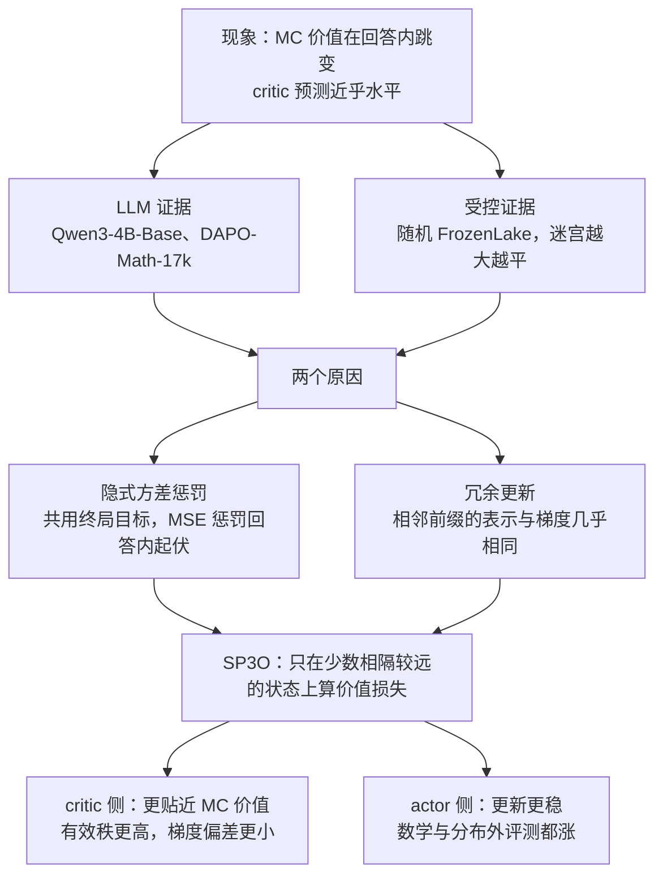

# PPO 的 critic 为什么把价值曲线压平：Value Flattening 与只监督三个点的 SP3O

<!-- release-date: 2026-09-15 -->

> 本文依据 **Rethinking Critic Learning in PPO: Understanding and Mitigating Value Flattening**，Yizhuo Li、Jianhao Yan 等 12 位作者，上海交通大学与上海人工智能实验室主导，arXiv:2609.18708v1，2026-09-16 提交，共 17 页。页码均指这份 PDF。全文把三件事分开标注：**报告明确写了什么**、**我们如何解释或验算它**、**哪些是外部资料补充**。

## 读前先把几个词说成人话

这篇论文讨论的是强化学习里一个很小、却决定 PPO 值不值得用的部件：critic。下面几个词会反复出现。

- **策略（policy，也叫 actor）**：正在被训练的大模型本身，它一个 token 一个 token 地写回答。
- **状态（state）**：写到第 $t$ 个 token 时，「题目加上已经写出的前缀」就是状态 $s_t$。相邻两个状态只差一个 token。
- **状态价值（state value）**：从某个前缀出发，让同一个策略接着写完，最后答对的概率。论文记为 $V^\pi(s_t)$，强调它是「策略条件下」的价值（PDF p. 3–4）。
- **critic（价值模型）**：另一个网络，任务是在每个前缀上猜出这个状态价值，记为 $V_\phi(s_t)$。
- **优势（advantage）**：这一步比「预期」好多少。PPO 拿 critic 的预测当预期，所以 critic 猜得准不准，直接决定每个 token 得到多少功劳或多少责备。
- **PPO（Proximal Policy Optimization，近端策略优化）** 与 **GAE（Generalized Advantage Estimation，广义优势估计）**：前者是带 critic 的经典策略梯度算法，后者是它把末尾奖励摊成逐 token 优势的方法。来历见 PPO 一篇。
- **GRPO（Group Relative Policy Optimization，组相对策略优化）**：不训 critic、用同一道题多条回答的组内平均当基线。它只给整条回答一个优势，分不出回答内部哪一步关键（PDF p. 3）。出处见 DeepSeekMath 一篇。
- **MC 价值（Monte Carlo value，蒙特卡洛价值）**：把某个前缀固定住，让策略从这里独立续写很多次，数答对的比例。它是真实状态价值的低方差估计，论文拿它当「标准答案」给 critic 体检（PDF p. 4）。

## 一句话先说清

用 PPO 训推理题时，奖励通常只在回答末尾给一次：答对 1，答错 0。于是 critic 在一条回答的每个 token 上拿到的回归目标，都是同一个数——这条回答最终的对错。论文发现，这样训出来的 critic 几乎画不出回答内部的起伏：真实状态价值一段就能跳 0.45–0.84，critic 的预测却近乎一条平线（PDF p. 2，读自 Figure 1 各格标注）。作者把这个现象叫做 **Value Flattening（价值压平）**（PDF p. 1–2）。

他们给了两个原因（PDF p. 2、p. 5–6）：

1. **隐式方差惩罚**：所有位置共用同一个目标时，逐 token 的均方误差可以拆成「平均值猜得对不对」加「回答内部起伏有多大」，后一项直接惩罚起伏。
2. **时间相关带来的冗余更新**：相邻前缀几乎一模一样，critic 的表示和梯度也几乎一样，逐 token 监督等于把同一个方向的更新叠加几千次。

上图是按 PDF p. 4–6、p. 8 的公式与设置重画的机制示意，灰线的形状是编的，不是实测。它要让人一眼看到两件事：上排红点铺满整条回答、高度都是 R，而真实价值在中间上下跳；下排只剩几个相隔很远的绿点。

对策 **SP3O（SParse Proximal Policy Optimization，稀疏近端策略优化）** 只改了一件事：价值损失不再算在每个 token 上，只算在每条回答相对位置 0.3、0.6、0.9 的 3 个状态上；回答不短于 6144 个 token 时再加一个 0.95（PDF p. 8）。actor 目标、采样流程和回报目标都不变（PDF p. 6）。在 Qwen3-4B-Base 上，数学 7 项平均从 PPO 的 37.60 提到 45.57（PDF p. 8）。

### 一条阅读路线

1. p. 2 的 Figure 1 与 p. 5 的 Figure 2：先亲眼看到「平」是什么样子。
2. p. 4 式 2–3 与 p. 5 式 5：终局奖励下 critic 的目标为什么处处相同，以及那一行拆分等式。
3. p. 6 的 Figure 3：相邻状态的表示与梯度有多像。
4. p. 6 式 6：SP3O 的全部改动就是这一个求和范围。
5. p. 7 的 Figure 4、Figure 5：critic 真的变「不平」了吗。
6. p. 8 的 Table 1–2，p. 9 的 Figure 6–7 与 Table 3，p. 17 的 Table 5 与 Figure 9：效果、点数、位置和尾部锚点。
7. 附录 A.2（p. 15–17）：基线不改变期望梯度，为什么 critic 不准仍会伤训练。

## 主要矛盾：花钱养 critic，买的是回答内部的分辨率

PPO 比 GRPO 多养一个和策略差不多大的 critic，图的就是逐 token 的信用分配：哪一步让成功率变高，哪一步把题做坏。这要求 critic 能跟上价值在回答内部的变化（PDF p. 1）。

可在论文的设置下，critic 拿到的监督本身就不含这部分信息。GAE 的写法是（PDF p. 4，式 2）：

$$
\delta_t = r_t + \gamma V_{\phi_{\text{old}}}(s_{t+1}) - V_{\phi_{\text{old}}}(s_t),\qquad
\hat A_t = \sum_{\ell=0}^{T-t} (\gamma\lambda)^{\ell}\,\delta_{t+\ell},\qquad
\hat G_t = \hat A_t + V_{\phi_{\text{old}}}(s_t)
$$

$\hat A_t$ 是给 actor 的优势，$\hat G_t$ 是给 critic 的回归目标。critic 的标准损失把每条回答的每个 token 都算进去（PDF p. 4，式 3）：

$$
L_V(\phi) = \frac{1}{\sum_{\tau\in\mathcal B} T_\tau}\sum_{\tau\in\mathcal B}\sum_{t=1}^{T_\tau}\bigl(V_\phi(s_t) - \hat G_t\bigr)^2
$$

论文的实验里 KL 系数为 0，奖励只在末尾，而且 $\gamma = \lambda = 1$。于是 $\delta$ 逐项相消，$\hat G_t = G_t = R(\tau)$ 对 $t = 1,\dots,T$ 都成立（PDF p. 4）。一条 5000 token 的回答，critic 在 5000 个位置上收到的都是同一个 0 或 1。

作者特意补了一句：这个等式只说明「观察到的目标」处处相同，不说明真实状态价值 $V^\pi(s_t)$ 在回答内部是常数（PDF p. 4）。矛盾就在这里：

> critic 的职责是分辨回答内部哪一步让成功率变了，可它拿到的每一条监督都只告诉它「这整条回答最后对没对」。

**我们如何解释它。** 在 $\gamma=\lambda=1$ 下，actor 的优势就是 $\hat A_t = R - V_{\phi_{\text{old}}}(s_t)$。如果 critic 在一条回答里输出常数 $c$，所有 token 的优势都是 $R - c$，PPO 就退化成「整条回答同一个优势」，在回答内部和 GRPO 没有区别。压平等于把养 critic 的钱白花了。

## 先看全景

这张图按 PDF p. 2–9 的论证顺序重画，是结构示意，不是论文原图。全文就是这条链：先证明现象存在，再找原因，由原因推出改法，最后分别在 critic 和 actor 两侧验收。

## 现象一：在 LLM 推理里，critic 画不出价值的台阶

每格左下角的两个数，是红色那一段 MC 价值的变化 $\Delta V_{\text{MC}}$ 与同一段 critic 预测的变化 $\Delta V_{\text{pred}}$。16 格里，$|\Delta V_{\text{pred}}|$ 最大只有 0.13，$|\Delta V_{\text{MC}}|$ 全都不低于 0.45（PDF p. 2，读自 Figure 1）。有几格方向甚至相反，例如 checkpoint 150 一条答对的回答，MC 价值一步跳 +0.84，critic 同段反而是 −0.03。

论文据此说，压平在 50 到 350 各个 checkpoint 都有，答对与答错两类回答里都有，是学出来的 critic 的性质，不是某条轨迹的偶然（PDF p. 1）。但图注也写明，这 16 条是「按局部 MC 价值变化大」挑出来的（PDF p. 2），所以 Figure 1 是示例，不是统计。统计在下一节的（a）幅。

MC 价值怎么算，附录写得很具体（PDF p. 14）：固定 64 条回答，每条取 20 个点，即相对位置 0.05、0.10……0.95 共 19 个中间状态，加上终点 1.0。每个中间状态先续写 128 次，之后每批加 64 次，最多 256 次；成功率的 95% Wilson 置信区间半宽不超过 0.04 就提前停。续写温度 1.0、top-p 0.95、最长 8192 token。终点直接用这条回答的真实奖励。

**我们如何验算它。** 64 条回答乘 19 个中间点再乘至少 128 次续写，至少是 155,648 次续写。这笔开销只用来做诊断标尺，SP3O 训练时一次续写都不需要（PDF p. 6）。

## 现象二：在 FrozenLake 里，状态空间越大越平

**（a）幅** 是 Figure 1 的统计版：如果 critic 跟得上，点应该落在对角虚线上；实际横向铺开，纵向全挤在 0 附近，深色的大跳变点也一样。论文的判断是：critic 既抓不住局部变化的幅度，也常常抓不住方向（PDF p. 4）。

**（b）（c）幅** 换到一个能算出真值的环境。随机 FrozenLake 是 OpenAI Gym 里的格子迷宫：从起点走到终点，途中有冰洞，动作带随机性；到终点回报 1，掉进冰洞或超过 8192 步回报 0（PDF p. 5、p. 14）。于是每个格子的价值就是「从这里出发最终到达终点的概率」，能直接画成热力图。作者固定训练配置，只把迷宫边长 $n$ 从 32 加到 128（PDF p. 5）。

图上的趋势一目了然：真实价值图越来越碎，critic 预测图越来越成一片同色。（c）幅里「预测落差 / 真实落差」这条线从约 0.28 降到约 0.11，MAE 从约 0.08 升到约 0.16（PDF p. 5，读自 Figure 2c）。

读这幅图要知道三个缺口：第三条线 Visits 正文没有定义，从形状看像是每格平均访问次数，这是我们的猜测；「预测落差 / 真实落差」正文只称作 local-contrast 指标，没给公式；FrozenLake 用什么网络、什么算法、训多少步，论文都没写，只说「训练配置固定」（PDF p. 5）。

论文由此得出两条结论：压平不是 LLM 特有的，受控 MDP 里也有；状态空间变大时它更严重（PDF p. 5）。LLM 的状态空间是所有可能的前缀，比任何格子迷宫都大得多，这条趋势对 LLM 是坏消息。

## 原因一：共用终局目标，MSE 自带一项「别起伏」

对一条长度为 $T$ 的回答，记 $v_t = V_\phi(s_t)$，回答内平均 $\bar v = \frac{1}{T}\sum_t v_t$。所有位置的目标都是同一个 $R$，逐 token 的均方误差可以一字不差地拆成两项（PDF p. 5，式 5）：

$$
\frac{1}{T}\sum_{t=1}^{T}(v_t - R)^2 = (\bar v - R)^2 + \frac{1}{T}\sum_{t=1}^{T}(v_t - \bar v)^2
$$

- 第一项让「这条回答的平均预测」去贴这条回答的结局。
- 第二项是回答内预测值的经验方差，它只会把各位置往平均值拉。

作者的原话是：这项方差惩罚之所以出现，是因为每个位置都用同一个终局目标；稠密监督下它覆盖全部 $T$ 个位置（PDF p. 5）。附录把它推广到整个 batch 和参数梯度（PDF p. 16，式 16–17）：

$$
\nabla_\phi L^{\text{sample}}_{V,\text{dense}} = \frac{2}{N}\sum_{i=1}^{N}(\bar v_i - R_i)\,\bar J_i + \frac{2}{N}\sum_{i=1}^{N}\frac{1}{m_i}\sum_{t=1}^{m_i}(v_{i,t} - \bar v_i)(J_{i,t} - \bar J_i)
$$

$J_{i,t} = \nabla_\phi V_\phi(s_{i,t})$ 是 critic 在该状态上的雅可比，$\bar J_i$ 是它在回答内的平均。第二项就是「回答内方差」的梯度，把每个偏离平均的预测往回推。论文强调：共享的回报对回答内各状态之间的价值差没有提供任何直接信息，却因为被复用到每个状态上，引入了这项压平压力（PDF p. 16）。

作为对照，附录写出了「假如能拿真值 $q_{i,t} = V^\pi(s_{i,t})$ 来回归」时，修正回答内误差所需的梯度（PDF p. 16，式 18）：

$$
\nabla_\phi E_{\text{within}} = \frac{2}{N}\sum_{i=1}^{N}\frac{1}{m_i}\sum_{t=1}^{m_i} e^{\circ}_{i,t}\,J_{i,t}
$$

$e^{\circ}_{i,t}$ 是去掉回答平均后的误差，在一条回答内加起来为 0，所以所有状态共有的那部分雅可比被精确抵消。论文的读法是：要纠正回答内的误差，各状态的雅可比必须真的不同（PDF p. 16）。这句话正好接上原因二。

**我们如何解释它。** 式 5 是对单条样本的恒等式。把无穷多条经过同一前缀的回答平均起来，均方误差的最优解仍是条件期望，也就是真实的 $V^\pi(s_t)$；方差项本身不改变这个理论最优点。所以「隐式方差惩罚」讲的是有限样本、有限容量、梯度下降下的优化压力：每条回答只给一个 0/1，critic 又能在相邻前缀之间高度泛化，最省力的下降方向就是把整条回答一起往 $R$ 推。论文给的是分解式加实验，没有「稀疏监督会改变最优解」这类收敛性定理。

## 原因二：相邻前缀太像，逐 token 监督是在重复同一次更新

经典强化学习的状态往往是紧凑的马尔可夫状态。LLM 不一样：状态就是已写出的全部 token，相邻两个状态只差 1 个 token，几乎整段输入重叠（PDF p. 5–6）。

（a）幅里，actor 的隐表示在回答内铺得很开，critic 的即使放大 2 倍画也缩成中心一小团——critic 的输入在回答内几乎分不开。（b）幅左边三条线全在 99.2% 以上，而且从早期到后期还在往上走；右边梯度余弦随间隔增大而下降，但即便两位置相隔接近整条回答，也仍在约 98% 一带（PDF p. 6，读自 Figure 3b）。

「更新能量」的定义在附录（PDF p. 14，式 7）：

$$
E_i = \frac{T_i\,\overline{\Delta v}_i^{\,2}}{\sum_t \Delta v_{i,t}^2},\qquad \overline{\Delta v}_i = \frac{1}{T_i}\sum_t \Delta v_{i,t}
$$

$\Delta v_{i,t}$ 是一次更新后第 $t$ 个状态预测值的变化。$E_i$ 衡量这次变化里有多大比例是「整条回答一起平移」。它接近 100%，意思是 critic 每更新一次，同一条回答里所有位置几乎被同样地抬高或压低——这正是「平」的动力学来源。

表示像为什么就等于更新像？论文用一个线性价值头说明（PDF p. 6）：若 $V_\phi(s_t) = w^\top h_t$，位置 $t$ 对 $w$ 的梯度是

$$
g^{(w)}_t = 2\bigl(V_\phi(s_t) - R\bigr)\,h_t
$$

回答内所有位置的 $R$ 相同，只要残差同号、表示 $h_t$ 相近，梯度就几乎同向。稠密监督于是把几千个几乎一样的梯度叠在一起。论文引 DQN（Mnih 等，2015）说明：相关样本提供的信号比数量看上去的少（PDF p. 6）。

**我们如何解释它。** 两个原因是同一件事的两面：原因一说「目标里没有回答内的差异」，原因二说「输入和梯度里也几乎没有回答内的差异」。目标不给差异、输入又难以区分，critic 自然学成一条平线。

## 核心设计：SP3O 只改价值损失的求和范围

### 旧问题

两个原因都出在「监督点太多、太密」上：点多，方差惩罚就覆盖全部位置；点密，相邻点的梯度就大量同向叠加。

### 新设计

两个原因各自给出一个操作方向（PDF p. 6）：

- **选得少**：只在少数位置算损失，方差惩罚就只作用在这几个预测上，不再覆盖每个 token。
- **隔得远**：选中的位置彼此相隔较远，前缀重叠少，梯度就不那么同向。

SP3O 的全部改动，是把式 3 的内层求和从「每个 token」换成一个小集合 $\mathcal I(\tau)$（PDF p. 6，式 6）：

$$
L^{\text{SP3O}}_V(\phi) = \frac{1}{\sum_{\tau\in\mathcal B}|\mathcal I(\tau)|}\sum_{\tau\in\mathcal B}\sum_{t\in\mathcal I(\tau)}\bigl(V_\phi(s_t) - \hat G_t\bigr)^2
$$

分母同步换成被监督状态的总数，所以单个位置的损失尺度和原来一致。

### 工作机制

开篇那张示意图的下排就是这一步。要点有三个（PDF p. 6、p. 8）：

1. critic 仍然在每个生成状态上输出价值，GAE 照常用它们算逐 token 优势。稀疏的只是「哪些位置回传价值损失」。
2. actor 目标、采样流程、回报目标都不变。
3. 默认锚点是相对位置 0.3、0.6、0.9；回答不短于 6144 token 时再加 0.95 的尾部锚点。论文把「稀疏监督加显式尾部覆盖」这个组合称为 SP3O。

论文没写相对位置如何取整到具体 token，也没写监督点变少之后 critic 学习率要不要重调；超参表里 critic 学习率是 $4\times 10^{-6}$，另有 20 个 batch 的「只训 critic」预热（PDF p. 14）。

**外部补充（官方仓库，不是 PDF 原文）。** 论文首页给出的代码仓库 [Dodojordi/SP3O](https://github.com/Dodojordi/SP3O) 基于 THUDM/slime v0.2.4。其中 `slime/utils/sp3o.py` 把相对位置映射到有效回答 token 的第 $\mathrm{round}((n-1)\cdot r)$ 个，非终点锚点避开最后一个 token；示例启动脚本在前 20 个 rollout 的只训 critic 预热里用稠密价值损失，之后才切到稀疏锚点，另外默认打开了截断重要性采样（`--use-tis`）。预热期仍用稠密监督、以及 TIS，PDF 都没有提；示例脚本也未必就是论文实验的逐项配置。

### 收益

收益在后面几节用实验讲：critic 侧更贴近 MC 价值，actor 侧 4B 数学平均涨 7.97 个点（PDF p. 8）。

### 代价与边界

论文没有给训练时间或显存对比。**我们如何解释它。** critic 的前向仍要算每个位置，反向的损失项从几千个变成 3–4 个，计算量几乎不变。真正的代价在信号量：每条回答只贡献 3–4 个监督点，其余位置的价值要靠跨回答的泛化来填。消融显示 3 个点并不「太少」（见后文）。

边界也很清楚：式 5 的前提是「所有位置目标相同」，只在终局奖励、KL 系数为 0、$\gamma=\lambda=1$ 时成立（PDF p. 4）。有中间奖励、KL 惩罚或 $\lambda<1$ 时，各位置目标本来就不同，这套推理要重新论证；论文没有测这些设置。

### 可迁移启发

若 PPO 在你的任务上并不比 GRPO 强，先怀疑 critic 被压平了。SP3O 不加采样、不加网络、不改 actor，只把价值损失换成三点监督，是验证这个怀疑成本最低的实验。

## critic 侧：它确实变得不平了

曲线都是「回答内去均值」后的值，比的是形状，不是绝对高低。还要注意，左右两列的黑线不一样：图例写的是 own-policy MC state value，每个 critic 对照的是它自己那条训练线的策略，所以这不是「同一条回答上两个 critic 对打」。

- Prompt A：PPO critic 的形状误差 MSE 是 0.0467，SP3O 是 0.0064（PDF p. 7）。
- Prompt B：PPO 是 0.0902，SP3O 是 0.0336（PDF p. 7）。

Prompt B 的蓝线在前 20% 几乎是平的，完全没跟上黑线从谷底爬回来的那一段。SP3O 也不是处处都准：Prompt B 右列在约 80% 处有一个黑线里没有的下探（PDF p. 7，读自 Figure 4a）。

（b）幅的汇总：SP3O 在 30%、60%、90% 位置分别把 MSE 降低 36%、11%、21%（PDF p. 6）。附录 Figure 8 又补了 4 个 prompt（PDF p. 17），连同上面两个一起：

| 去均值 MSE | Prompt A | Prompt B | Prompt C | Prompt D | Prompt E | Prompt F |
|---|---:|---:|---:|---:|---:|---:|
| PPO critic | 0.0467 | 0.0902 | 0.5301 | 0.0566 | 0.1090 | 0.1704 |
| SP3O critic | 0.0064 | 0.0336 | 0.0254 | 0.0286 | 0.0870 | 0.1535 |

A、B 两列来自 Figure 4（PDF p. 7），C–F 来自 Figure 8（PDF p. 17）。6 个 prompt 全部是 SP3O 更低，但 E、F 的差距只有约 0.02，改善幅度因题而异。

**我们如何解释它。** 30%、60%、90% 正好就是 SP3O 自己被训练的锚点位置。论文没有单独报告非锚点位置（比如 10%、45%）的汇总误差；Figure 4a 与 Figure 8 的逐点曲线覆盖了其他位置，但只是 6 个 prompt 的示例。

这张图看的是 critic 的优化行为，三幅各回答一个问题。

**（a）分辨力与回答内变化。** 横轴是回答级 AUC：拿每条回答 critic 预测的平均值去区分它对还是错。纵轴是回答内变化比例（PDF p. 14，式 8）：

$$
\frac{\sum_i\sum_t (v_{i,t} - \bar v_i)^2}{\sum_i\sum_t (v_{i,t} - \bar v)^2}
$$

它是 critic 预测的总方差里来自回答内部的那一份，越低越平。图上 PPO 从早到晚往右下走，SP3O 往右上走。论文的读法是：PPO 以回答内分辨率为代价换回答间分辨力，SP3O 两者都提高（PDF p. 7）。相关工作一节的那句话由此落地：PPO critic 保留了回答之间的差异，却跟不上回答内部的变化（PDF p. 3）。

**（b）有效秩。** 把每条回答里价值头的输入向量单位化、减去回答均值，堆成矩阵后算特征值熵的指数，得到有效秩（PDF p. 14）。它衡量价值头看到的输入在回答内有多少个「独立方向」。中位数从 PPO 的 4.33 升到 SP3O 的 5.63（PDF p. 7）。

**（c）梯度偏差。** 同一批状态，分别用终局奖励和 MC 价值当目标算价值头梯度，取差的 RMS（PDF p. 15，式 9）。SP3O 在整条回答上都略低（PDF p. 7，读自 Figure 5c）。

论文把这三幅合起来说成「与稀疏监督保留更丰富的表示、减少冗余或扭曲的更新一致」（PDF p. 7）。

**我们如何解释它。** （b）最耐琢磨：SP3O 没改 critic 的网络结构，却让 critic 内部表示在回答内更分散。这说明稠密监督不只在输出层抹平，而是把整个 critic 主干的表示也往「回答内都一样」的方向拉。论文用的措辞是 consistent with，是相关证据，不是因果证明。

## 为什么 critic 不准会伤 actor：附录 A.2 的有限 batch 论证

读到这里会有一个自然的反驳：策略梯度里的基线不改变期望梯度，critic 平一点有什么关系？论文正面回答了这个问题（PDF p. 15–17）。

先承认经典结论：对任何只依赖状态、不依赖动作的基线 $b(s_t)$（PDF p. 16，式 19）：

$$
\mathbb E_{a_t\sim\pi(\cdot\mid s_t)}\bigl[\nabla_\theta\log\pi_\theta(a_t\mid s_t)\,b(s_t)\mid s_t\bigr] = 0
$$

所以在期望意义下，critic 准不准都不影响梯度方向。但训练用的是有限 batch。论文把 critic 误差 $e_{i,t} = v_{i,t} - q_{i,t}$ 拆成回答均值误差 $\bar e_i$ 与回答内去均值误差 $e^{\circ}_{i,t}$，再把「用 critic 当基线」和「用真值当基线」两种 actor 梯度之差精确拆成两项（PDF p. 15，式 14）：

$$
\Delta g = -\frac{1}{N}\sum_{i=1}^{N}\bar z_i\,\bar e_i \;-\; \frac{1}{N}\sum_{i=1}^{N}\frac{1}{m_i}\sum_{t=1}^{m_i}(z_{i,t} - \bar z_i)\,e^{\circ}_{i,t}
$$

$z_{i,t}$ 是 log 概率的梯度，$\bar z_i$ 是它的回答内平均。第一项来自「回答平均值猜错」，第二项来自「回答内的形状猜错」，也就是压平造成的误差。两项各自可以被对应误差的均方根乘以对应梯度的均方根所界定（PDF p. 16，式 15）；论文特意说明这是范数上界，不代表误差大小由方向对齐决定（PDF p. 16）。

另外，PPO 一批数据要跑多个 epoch，价值误差会改变优势的符号、大小，以及裁剪目标里哪一支生效，所以「基线不变性」不意味着裁剪后的实际更新相同（PDF p. 16）。

附录最后收成三条（PDF p. 16–17）：

1. 每个状态都复用同一个终局回报，会在回答内引入对 critic 预测的隐式方差惩罚。
2. 回答内的 critic 误差会通过与去中心化策略梯度的交互，改变有限 batch 的 actor 更新。
3. 期望梯度不变，不等于有限 batch 上的 PPO 实际更新相同。

**我们如何解释它。** 这一节把「critic 平不平」和「actor 学得好不好」接上了。它没有证明压平一定让 actor 变差，只证明了回答内形状误差会以一个明确的项进入实际更新。真正的因果证据要看下面的训练实验。

## actor 侧与主实验

### 设置

两个基座：Qwen3-4B-Base 与 Qwen3-8B-Base，都在 DAPO-Math-17k 上训练（PDF p. 8）；数据集来历见 DAPO 一篇。对照是基座本身、标准 PPO、GRPO 与 SP3O。关键超参在附录 Table 4（PDF p. 14）：

| 设置 | 取值 |
|---|---|
| 训练数据 | DAPO-Math-17k |
| rollout batch | 64 × 8 = 512 |
| actor 更新 batch | 每步 256，每个 rollout 2 步 |
| 回答长度 / 温度 | 8,192 / 1.0 |
| actor 学习率 | $1\times 10^{-6}$ |
| critic 学习率 | $4\times 10^{-6}$ |
| 优化器 | Adam，$\beta = (0.9, 0.98)$，权重衰减 0.1 |
| PPO 裁剪 / KL 系数 | 0.2 / 0 |
| 只训 critic 的预热 | 20 个 batch |

评测用论文所说的「24K 评测设置」（PDF p. 8）。数学 7 项每题采样 32 次取平均（avg@32）；分布外 6 项采样 4 次取平均（avg@4），其中 AGIEval、BBH、ZebraLogic 三项由 gpt-oss-120b 通过 xVerify 判分（PDF p. 8）。

### 数学推理（PDF p. 8，Table 1，avg@32，%）

| 模型 | 方法 | AIME24 | AIME25 | AIME26 | AMC23 | MATH500 | Minerva | Olympiad | 平均 |
|---|---|---:|---:|---:|---:|---:|---:|---:|---:|
| Qwen3-4B-Base | Base | 4.58 | 3.75 | 4.38 | 25.08 | 42.78 | 22.71 | 22.35 | 17.95 |
| | PPO | 17.50 | 19.90 | 14.69 | 61.80 | 70.15 | 42.82 | 36.35 | 37.60 |
| | GRPO | 17.19 | 16.19 | 10.10 | 63.83 | 78.21 | 45.71 | 43.62 | 39.26 |
| | SP3O | 23.02 | 23.54 | 22.08 | 69.92 | 83.79 | 47.93 | 48.68 | 45.57 |
| Qwen3-8B-Base | Base | 7.40 | 7.92 | 5.94 | 37.66 | 54.08 | 24.69 | 27.36 | 23.58 |
| | PPO | 30.21 | 25.10 | 23.33 | 72.19 | 86.33 | 48.81 | 53.56 | 48.50 |
| | GRPO | 28.50 | 22.04 | 22.70 | 73.82 | 85.26 | 52.06 | 50.98 | 47.91 |
| | SP3O | 33.91 | 28.02 | 27.39 | 75.00 | 87.33 | 47.40 | 54.50 | 50.51 |

### 分布外推理（PDF p. 8，Table 2，avg@4，%）

| 模型 | 方法 | ARC-C | MMLU-Pro | GPQA | AGIEval | BBH | ZebraLogic | 平均 |
|---|---|---:|---:|---:|---:|---:|---:|---:|
| Qwen3-4B-Base | Base | 34.98 | 16.17 | 14.02 | 27.93 | 21.11 | 1.35 | 19.26 |
| | PPO | 89.19 | 54.39 | 34.85 | 65.87 | 57.50 | 9.90 | 51.95 |
| | GRPO | 90.96 | 56.87 | 38.89 | 68.18 | 71.17 | 12.58 | 56.44 |
| | SP3O | 91.02 | 61.75 | 38.89 | 71.44 | 73.35 | 19.20 | 59.28 |
| Qwen3-8B-Base | Base | 61.82 | 36.22 | 27.02 | 48.59 | 50.71 | 4.90 | 38.21 |
| | PPO | 93.84 | 64.19 | 47.22 | 74.52 | 79.27 | 27.25 | 64.38 |
| | GRPO | 93.04 | 66.27 | 49.49 | 75.15 | 78.10 | 27.40 | 64.91 |
| | SP3O | 93.13 | 65.83 | 49.94 | 76.95 | 80.89 | 31.45 | 66.37 |

### 读表要知道的四件事

1. **4B 上幅度很大。** 相对 PPO，数学平均涨 7.97 个点，分布外平均涨 7.33 个点（PDF p. 8）。AIME26 从 14.69 到 22.08，ZebraLogic 从 9.90 到 19.20，几乎翻倍。
2. **8B 上幅度小很多。** 按表算，数学平均 50.51 − 48.50 = 2.01，分布外 66.37 − 64.38 = 1.99。论文只说 8B 上「也观察到正向提升」（PDF p. 8）。
3. **「全面领先」要打折读。** 正文说 SP3O 在两个尺寸、两类评测上都稳定超过 PPO 和 GRPO（PDF p. 8），这对平均分成立。逐项看，8B 的 Minerva 上 SP3O（47.40）低于 GRPO（52.06）也低于 PPO（48.81），ARC-C 低于 PPO，MMLU-Pro 低于 GRPO。
4. **PPO 和 GRPO 在这里不分高下。** 4B 上 GRPO 数学平均高于 PPO（39.26 对 37.60），8B 上略低（47.91 对 48.50）（PDF p. 8）。**我们如何解释它。** 这和本文论点吻合：critic 被压平时，PPO 的逐 token 优势近似退化成回答级优势，本来就不该稳定强过 GRPO；修好 critic 之后 PPO 才拉开差距。

论文没有报告主表的多随机种子方差，也没有报告训练耗时或 GPU 数。

### 在线训练动态

论文从这张图读出两件事：SP3O 的迭代内 actor 更新更小、波动也更小，训练更稳；验证准确率和 rollout 奖励在早期之后一直高于 PPO（PDF p. 9）。（b）幅的分叉从 100 步前后开始，比（c）幅明显，说明训练集上的奖励差距比验证集小。（a）幅这个「更新幅度」指标，附录没有给定义。

（d）幅是最该停下来看的一格：SP3O 的回答长度在 100–200 步之间迅速拉长，PPO 缓慢增长，到训练末尾仍明显更短（PDF p. 9，读自 Figure 6d）。论文把它列为观察（PDF p. 9）。

**我们如何解释它。** 回答变长本身就可能提高推理题准确率。论文没做长度对齐的对照，所以「critic 更准 → actor 更好」与「critic 更准 → 更愿意写长 → actor 更好」这两条路径在本文里没有被拆开。

## 消融：几个点、放哪里、要不要尾巴

### 监督点数 $K$

$K=3$ 最高，$K=4$、$K=8$ 相当，$K=16$、$K=64$ 掉回逐 token PPO 的水平（PDF p. 9，读自 Figure 7）。论文承认运行间方差不可忽略，但整体趋势是「监督点越多并不越好」（PDF p. 9）。$K=4$ 用的锚点是 0.3/0.5/0.7/0.9（PDF p. 14）。每个配置跑了几次，论文没写；纵轴是训练奖励，不是验证集准确率。

**我们如何解释它。** 横轴把两件事绑在了一起：点数变多，相邻点的间隔也变小。$K=64$ 时两点之间只差约 1.6% 的回答长度，前缀重叠又回来了。所以这张图同时支持「选得少」和「隔得远」，但分不出哪一个更关键。

### 锚点位置（PDF p. 9，Table 3，Qwen3-4B-Base，$K=3$）

| 主锚点 | 准确率（%） |
|---|---:|
| PPO 基线 | 37.60 |
| 随机 | 36.59 |
| 0.2/0.5/0.8 | 44.65 |
| 0.3/0.6/0.9 | 45.57 |

固定位置的两种方案都远好于随机位置；随机选 3 个点甚至略低于逐 token 的 PPO（PDF p. 9）。论文把这读成时间相关性在起作用：固定且相隔较远的锚点覆盖整条轨迹，又避免在前缀几乎相同的邻近状态上重复更新（PDF p. 9）。

**我们如何解释它。** 「随机 3 点」和「固定 3 点」的点数相同，方差惩罚的覆盖范围也相同，差别只在间隔与覆盖是否均匀。这一行是全文里最能单独支撑原因二的对照。另外，0.3/0.6/0.9 一行的 45.57 与主表 SP3O 数学平均完全相同，说明它就是带条件尾部锚点的完整 SP3O，表里的「准确率」也就是数学 7 项平均——这是我们对照两表得出的推断。

Figure 9 比 Table 3 多出两个 $K=4$ 的方案。图上最清楚的分界是「固定分散」对「随机」：随机 3 点始终和 PPO 基线缠在一起。四种固定方案之间，0.3/0.5/0.7/0.9 在约 100–250 步明显领先，此后四条线缠在 42%–46% 一带（PDF p. 17，读自 Figure 9）。附录的文字是：后段有覆盖的方案普遍更好，单纯多加锚点并不稳定地带来提升（PDF p. 17）。

**我们如何解释它。** 按验证曲线，4 点方案并不比 3 点差，甚至早期更好；最终选 $K=3$ 的依据是 Figure 7 的训练奖励和 Table 3，而不是 Figure 9。想在自己的任务上复用，3 点与 4 点都值得试。

### 尾部锚点（PDF p. 17，Table 5）

| 变体 | 准确率（%） | 重复率（%） |
|---|---:|---:|
| SP3O 去掉尾部锚点 | 44.10 | 18.33 |
| SP3O | 45.57 | 1.12 |

保留其他锚点、只去掉最后的尾部锚点，准确率从 45.57 降到 44.10，重复率从 1.12% 升到 18.33%（PDF p. 9–10、p. 17）。论文据此强调，显式覆盖回答尾部对策略表现和生成稳定性都重要（PDF p. 10）。「重复率」怎么算，论文没有定义。

**我们如何解释它。** 长回答的尾部正是「绕圈重复、迟迟不收尾」最常出现的地方。若 critic 在尾部没有监督，它对「开始重复」这类状态的估价可能偏高，actor 就拿不到足够的负优势。这是合理的机制猜测，论文只给了数字，没有分析重复发生在哪里。

## 这篇论文站在哪里

相关工作一节把自己放在两条线之间（PDF p. 3）：

- **无 critic 的方法**（RLOO、GRPO、DAPO）不训价值模型，优势来自整条回答，回答内部几乎没有区分；VIMPO 推导隐式价值函数来找回更细的信用，同样不另训 critic。
- **带 critic 的方法**（PPO 及其改进，如改 critic 初始化与优化、适配异步与结构化轨迹的工作）很少分析 critic 预测是否跟上回答内的价值变化。
- **细粒度信用分配**：分段、树结构、过程监督能给更细的反馈，但不直接估计策略条件下的状态价值；VinePPO 用额外续写估这个量，效果好，但每个被评估状态都要额外采样，回答越长越贵（PDF p. 3）。VinePPO 的做法见 VinePPO 一篇。

SP3O 的定位因此很清楚：不加续写、不换算法，只在 critic 的监督结构上做文章，把 PPO critic 本该提供的回答内分辨率找回来。MC 价值只用来诊断，训练时不需要（PDF p. 6）。

## 实验支持了什么，没支持什么

被实验支持的：

- critic 在回答内明显比真实价值平，LLM（Figure 1–2a）与 FrozenLake（Figure 2b–c）都能看到（PDF p. 2、p. 5）。
- 稠密监督下 critic 的隐表示和梯度在回答内高度一致（Figure 3，PDF p. 6）。
- 只在少数分散位置监督，critic 更贴近 MC 价值，回答内变化比例与有效秩上升（Figure 4–5，PDF p. 7）。
- 4B 上 actor 大幅变好，8B 上平均分小幅变好（Table 1–2，PDF p. 8）。
- 随机选点不行，固定分散选点行；尾部锚点明显压低重复（Table 3、Table 5，PDF p. 9、p. 17）。

只是作者的解释或相关证据：

- 「隐式方差惩罚」与「冗余更新」是压平的原因：论文用分解式和相关性测量支撑，措辞是 relate 与 contribute，没有做把两个因素单独关掉的干预实验。
- critic 表示更丰富、梯度更少扭曲「导致」actor 更好：论文用的是 consistent with。
- actor 变好与回答变长没有被拆开。

适用范围的边界：实验只有 Qwen3 两个基座、一个训练集、终局 0/1 奖励与 $\gamma=\lambda=1$；主表与消融都没有报告种子数与方差。

## 可迁移启发

1. **先用 MC 续写给 critic 做体检。** 固定几十条回答、每条取十几个位置、每个位置续写上百次，就能画出真实价值曲线，和 critic 叠在一起看。回答级 AUC 高不代表 critic 有用，要同时看回答内变化比例。这套诊断在附录里写得足够具体，可以照搬。
2. **监督目标里没有的信息，别指望模型自己学出来。** 所有位置共用一个标签时，逐位置回归的均方误差会自带一项「别起伏」。任何「把序列级标签广播到每个 token 上做回归」的场景——逐 token 奖励模型、序列级打分头——都值得先检查这个结构。
3. **高度相关的样本不是更多的数据。** 相邻前缀只差 1 个 token，逐 token 监督是在同一个方向上重复更新。稀疏、分散地取样本，几乎零成本；这和 DQN 用经验回放打散相关样本是同一个思路。
4. **随机抽点不等于稀疏。** 同样 3 个点，随机放还不如逐 token，固定分散才有效。要稀疏，就要连间隔一起设计。
5. **别忘了尾巴。** 长回答要单独给尾部一个监督点；论文里去掉它，重复率从 1.12% 升到 18.33%。
6. **注意规模边界。** 4B 上涨近 8 个点，8B 上约 2 个点。更大模型上收益会不会继续收窄，论文没有测。

## 关键词回看

- **Value Flattening（价值压平）**：真实状态价值在回答内剧烈变化，critic 预测却近乎水平。
- **MC 价值**：固定前缀后多次续写的成功率，本文的诊断标尺，不参与 SP3O 训练。
- **隐式方差惩罚**：共用终局目标时，逐 token MSE = 均值误差 + 回答内方差，后一项把预测往平均值压。
- **冗余更新**：相邻前缀的表示与梯度几乎相同，逐 token 监督把同向梯度叠加上千次。
- **更新能量**：一次更新里「整条回答一起平移」所占的比例，接近 100% 就是压平的动力学表现。
- **回答内变化比例 / 回答级 AUC**：前者量回答内分辨率，后者量回答间分辨力；PPO 前者降、后者升。
- **有效秩**：回答内价值头输入的独立方向数，SP3O 把中位数从 4.33 提到 5.63。
- **SP3O**：价值损失只算在 0.3/0.6/0.9（长回答再加 0.95）几个状态上，其余不变。
- **尾部锚点**：长回答的 0.95 监督点，去掉后重复率升到 18.33%。
- **有限 batch 论证**：基线不改变期望梯度，但回答内的 critic 误差会以明确的一项进入实际 PPO 更新。

## 资料与阅读边界

### 版本与首发日

- 官方页 [arXiv:2609.18708](https://arxiv.org/abs/2609.18708) 截至 2026-09-29 仍只有 v1（2026-09-16 提交），本文即依据 v1。
- `release-date` 取 2026-09-15。SP3O 没有发布模型，按技术首次官方公开日取值：官方仓库 [Dodojordi/SP3O](https://github.com/Dodojordi/SP3O) 于 2026-09-15 以公开仓库创建，同日推送 [Initial release of SP3O](https://github.com/Dodojordi/SP3O/commit/8b8b26eb) 这一提交，README 已写明是这篇论文的官方实现，早于 arXiv v1 一天。
- 归属：第一作者 Yizhuo Li 同时署名上海交通大学与上海人工智能实验室；项目负责人与多位作者来自上海人工智能实验室，致谢写明由其支持；通讯作者之一 Peilin Zhao 署名上海交通大学；其余作者来自西湖大学、南京大学、清华大学、香港中文大学、南洋理工大学（PDF p. 1、p. 10）。

### 报告明确写了、本文覆盖了的部分

摘要与第 1 节的现象、两个原因与三项贡献；第 2 节相关工作；第 3 节 PPO、GAE 与 MC 价值的定义（式 1–4）；第 4.1 节 LLM 与 FrozenLake 的压平现象（Figure 1–2）；第 4.2 节隐式方差惩罚（式 5）与时间相关冗余（Figure 3）；第 4.3 节 SP3O（式 6）及其对 critic 预测、critic 优化、actor 优化的影响（Figure 4–5）；第 5 节实验设置、Table 1–2、Figure 6–7、Table 3；第 6 节结论；附录 A.1 超参 Table 4、MC 估计与诊断指标（式 7–9）；附录 A.2 误差分解、有限 batch 论证与基线不变性（式 10–19）；附录 A.3 Figure 8；附录 A.4 Table 5 与 Figure 9。

### 外部资料补充（不是 PDF 原文）

- 官方仓库 [Dodojordi/SP3O](https://github.com/Dodojordi/SP3O)：基于 [THUDM/slime v0.2.4](https://github.com/THUDM/slime/tree/v0.2.4)；锚点到 token 的映射、预热期稠密监督与默认打开的 TIS 见 SP3O 一节的外部补充段。
- 相关篇目：PPO、VinePPO（readings 库），DAPO、DeepSeekMath（reports 库）。VinePPO 是本文 MC 价值估计的直接来源（PDF p. 1、p. 3）。

### 原文没有公开的缺口

- FrozenLake 实验的 critic 网络、RL 算法、训练步数与超参；Figure 2c 中 Visits 曲线与局部对比指标的精确定义；
- Figure 6a「迭代内更新幅度」与 Table 5「重复率」的计算方式；
- critic 模型的初始化方式与规模；训练框架、GPU 数量与耗时；
- 主表与 Figure 7 的随机种子数和方差；
- 在中间奖励、KL 惩罚、$\lambda<1$ 或更大模型上的结果；
- 单独关掉「方差惩罚」或「冗余更新」其中一个因素的干预实验；控制回答长度后的对照。
