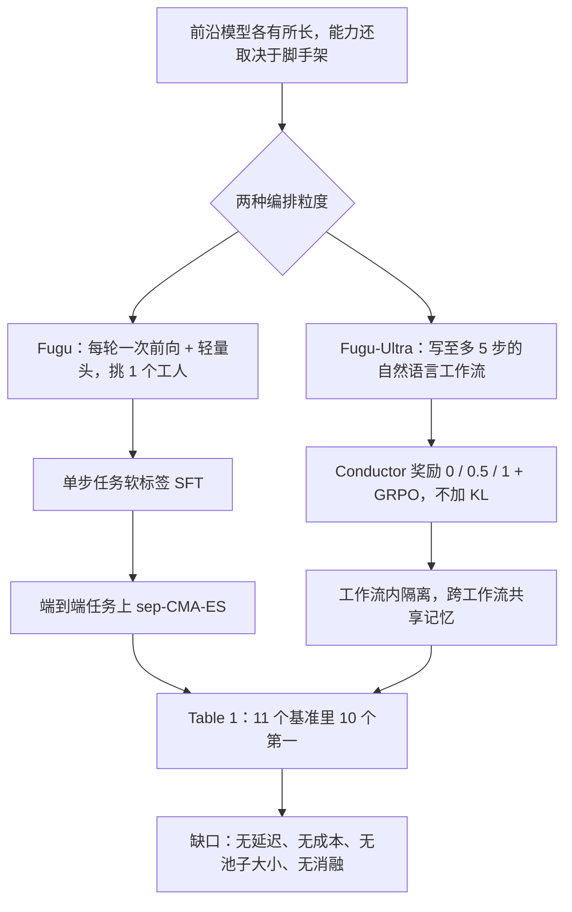

# Sakana Fugu：不再训一个更强的模型，而是训一个会调兵的模型

<!-- release-date: 2026-06-22 -->

> 本文依据 Sakana AI 的 **Sakana Fugu Technical Report**，arXiv:2606.21228v2，2026-06-23 提交，封面日期 2026-6-24，共 31 页。页码均指 PDF 自身的页码。文中会区分三件事：**报告明确写了什么**、**我们怎么解释它**、**哪些是外部资料或本文推算**。

## 阅读前先认识几个词

这篇报告的主角不是一个会解题的模型，而是一个「派活」的模型。先把会反复出现的词说成人话：

- **智能体（agent）**：不只输出文字、还会调用工具（跑命令、读写文件、调接口）并读回结果的大语言模型。
- **脚手架（agentic scaffold / harness）**：包在模型外面的那层程序，决定模型看到什么上下文、能用哪些工具、出错怎么重试。Claude Code、Codex 都是脚手架。同一个模型换一个脚手架，成绩可以差很多。
- **编排器（orchestrator）**：本文主角。它自己不答题，只决定「这一步交给哪个模型、怎么拆、谁能看到谁的结果」。
- **工人（worker）**：被编排器调用、真正干活的前沿模型。报告点名的是 Gemini-3.1-Pro、Claude-Opus-4.8、GPT-5.5。
- **工作流（workflow）**：一张由多个步骤组成的分工表，每一步写明子任务、由谁做、能看前面哪几步的结果。

这篇报告里最重要的两个新名字是：

- **Fugu**：快档。每一轮只挑一个工人，编排器不生成文字，只输出一组打分。
- **Fugu-Ultra**：慢档。每道题先用自然语言写一张多步工作流，再按图调动多个工人。

后文还会用到三种训练方法，出现时再展开：带温度的软标签监督、演化策略 sep-CMA-ES、强化学习 GRPO。

## 一句话先说清

Fugu 不是一个更强的基座模型。它是一个**被训练出来的调度员**：本身是语言模型，但输出的不是答案，而是「谁去做、怎么做」。真正干活的是别家的前沿模型（PDF p.2、p.4）。

报告要证明的核心论点只有一句：模型编排是一条和「训更大的模型」互补的**扩展轴**（PDF p.2）。能力可以来自把已有模型组合得更好，而不只是来自下一次更大的训练。

用报告自己的数字看，这条轴确实有东西。在 11 个基准的模型卡上，Fugu 系在 10 个基准上拿到最高分（PDF p.11，Table 1）；SWE Bench Pro 上 Fugu-Ultra 是 73.7，它池子里最强的单个工人 Claude Opus 4.8 是 69.2。

但这份报告有一个结构性的空洞：摘要承诺讲「把这些方法变成生产系统的基础设施」（PDF p.1），正文却没有 infra 章节，没有延迟、成本、池子大小和任何训练超参。所以它证明了「编排能提高质量」，**没有证明编排更便宜**。

如果只记一句话：

> **当下游组件各有所长又互相不可替代时，最值钱的模块往往不是其中任何一个，而是知道什么时候该用谁、以及谁能看到什么的那个决策器。**

## 先看全景：两个变体，两套机制

两个变体不是同一方法的大小号，而是两条技术路线，各有前作（PDF p.5、p.7）：

| | Fugu | Fugu-Ultra |
|---|---|---|
| 前作 | Trinity（Xu et al., 2025） | Conductor（Nielsen et al., 2025） |
| 一次决策产出 | 一个工人编号 | 一整张自然语言工作流 |
| 编排器要不要生成文字 | 不要，只取隐状态过轻量头（PDF p.6） | 要，工作流就是它写的文本（PDF p.8） |
| 训练 | 软标签监督微调，再用演化策略（PDF p.6–7） | GRPO 强化学习，不加 KL（PDF p.8–9） |
| 工人池 | 未说明 | 「更大的工人池」（PDF p.5） |
| 定位 | 日常交互，延迟接近直接调一次前沿模型（PDF p.2） | 最难的任务，用延迟换质量（PDF p.2） |

有一处容易读错。报告说 Fugu「每个输入只选一个工人」（PDF p.2），但在多轮任务里，「每个输入」指的是每一轮：Fugu 每一轮都会重新选（PDF p.7 的形式化，p.11 的 Terminal Bench 分析）。所以两者的真正区别不是「一个模型对多个模型」，而是：**Fugu 在时间上串行换人，Fugu-Ultra 在一次决策里就把几个人组织成一张图。**

## 第一层矛盾：能力分散在不同模型和不同脚手架里

### 前沿模型正在分化，而且分得很细

报告的开场是一组观察（PDF p.2）。领域粒度上，GPT 系列长期在数学推理上领先，Opus 系列在软件工程与网络安全上领先。领域内部分得更细：同样是竞赛编程，Gemini-3.1-Pro 更擅长直接实现已知算法，GPT 系列更擅长规划、把多个算法思路组合起来啃最难的题。

### 能力不只属于模型，也属于脚手架

同一个模型套上 Claude Code 这类成熟脚手架，交互轨迹、环境反馈、迭代方式都变了，成绩也跟着变。报告因此把能力理解为模型与脚手架的联合属性（PDF p.2）。

### 于是矛盾出现了

用户要用满这些互补的长处，得自己管几个供应商的接口、自己判断这道题该给谁、自己设计多模型怎么协作。而「谁更强」往往不是按领域划分，是按具体问题划分的，这个颗粒度人手工做不来。

已有的多智能体系统也没解决它。报告点了两类（PDF p.3）：一类用固定的讨论轮次和交互结构（Du 等人、Wang 等人）；另一类学一个路由器，但只做单步的「选一个最匹配的模型」（Chen 等人的 RouterDC）。Fugu 的差异是两条：把整个团队藏在一个模型接口后面，而不是把工作流交给用户去调；编排器本身是训练出来的，能逐题决定怎么用这个池子（PDF p.3）。

### 报告的类比：宏观版的模型融合

报告把 Fugu 类比成模型融合（model merging）的宏观版本（PDF p.4）。参数层面的融合（权重平均、model soup、演化式融合配方）必须拿到权重，还要求架构兼容，所以基本只能玩开源 checkpoint。Fugu 在**行为层面**融合：把前沿模型当黑盒，学怎么路由、协调、验证、综合它们的输出。

这个类比同时说明了这条路的上界和下界。收益是闭源模型、异构供应商、用户自己的约束（偏好某供应商、排除某模型、数据合规）都能纳入，新模型出来可以直接进池子而不必重训（PDF p.3）。代价是永远拿不到工人的内部激活，能优化的只有「派给谁、给什么上下文」。

报告还顺带提了一句商业论点：Fugu 在多个基准上与不公开的 Fable 5、Mythos Preview 并肩，同时「没有出口管制的风险」（PDF p.2）。这是定位陈述，报告没有展开。

## 核心设计一：Fugu 把编排压缩成一次分类

### 旧问题：编排器自己就是延迟

如果编排器用生成文字的方式说出「我决定叫 GPT-5.5」，那在真正干活之前就先付了一次自回归解码的钱。对一个主打「延迟接近直接调用前沿模型」的产品，这笔钱付不起。

### 新设计：不解码，只取一个隐状态

图引自 PDF p.5 的 Figure 2。编排器是一个预训练语言模型骨干。在最后一层隐层之后、与原本的 LM head 并列，挂一个轻量预测头。给定隐状态 $h \in \mathbb{R}^d$，这个头输出 $L$ 个 logit，$L$ 是工人池大小，每个 logit 给一个候选工人打分（PDF p.5）。

关键选择是：Fugu 用的是**编排器的 logit，而不是它生成的文本**（PDF p.6）。写提示词和执行任务都外包给被选中的工人，编排器只需要吐出一个选择。于是系统在某个位置算出隐状态、过一下选择头，就能立刻派发，完全跳过自回归解码。报告说这个「只做决策」的参数化是 Fugu 延迟画像的核心，也让后面的演化优化变得可行（PDF p.6）。

图上有两处细节要看清：

- 图里那串解码文字只是示意位置。图注明说轻量头吃的是 `<Head Input>` 位置的内部隐状态，不是解码出来的文本（PDF p.5）。
- 图右下角写着轻量头可以是 Linear、Low-rank、Sparse、Block-diagonal 四种形态之一。报告正文没说最终用了哪一种，也没给对比。

### 砍掉角色分配

前作 Trinity 的协调器除了选模型，还要给它指派一个角色。Fugu 把这一层去掉了：被选中的模型永远以工人身份调用。理由是协调空间从「模型 × 角色」缩成「只有模型」，决策更简单、延迟开销更小（PDF p.5–6）。

这是一次明确的能力换延迟。报告没有消融这一刀砍掉了多少质量，只能把它记成设计选择，不是被证明无损的优化。

### 骨干怎么调：只训奇异值的尺度

只训一个头，表示能力可能不够；全量微调骨干又太贵。Fugu 的折中是**奇异值微调**，出自同一团队的 Transformer²（Sun et al., 2025）：把骨干里选定的权重矩阵做奇异值分解，只训练奇异值的缩放系数，正交分量冻住（PDF p.6）。

用人话说：任何矩阵都可以拆成「往哪些方向拉伸」（正交分量）和「每个方向拉多少」（奇异值）。只训奇异值，等于保留模型原有的表示方向，只重新分配每个方向的权重。收益是可训练参数极少，报告的原话是「极小的可训练参数集」（PDF p.6）；代价是它造不出骨干本来没有的方向。

### 第一阶段：用实测分数做软标签

**旧问题**：路由是分类，但「正确答案」是什么？只标「最强的是谁」会丢掉大量信息：第二名差 1 分还是差 40 分，训练信号一模一样。

**新设计**（PDF p.6）：先花钱造标签。收集一大批单步任务，覆盖代码、数学、推理、语言理解和大量 agent 场景，每道题 $q_i$ 都可验证、有标准答案 $s_i$。池里每个工人 $\mathcal{M}_j$ 在同一道题上跑 $n$ 次，与标准答案比对得到 $n$ 个奖励，取平均：

$$
\bar r_{i,j} = \frac{1}{n} \sum_{k=1}^{n} r_k^{\mathcal{M}_j}
$$

然后不压成硬排名，而是用带温度 $\tau$ 的 softmax 变成一个软分布（PDF p.6，式 1）：

$$
p_i(j) = \frac{\exp(\bar r_{i,j} / \tau)}{\sum_{j'=1}^{K} \exp(\bar r_{i,j'} / \tau)}
$$

$\tau$ 越小，分布越尖，越接近「只认第一名」；越大越平，越像「这几个都行」。最后让编排器的选择分布 $\pi_\theta(\cdot \mid q_i)$ 去贴这个分布，最小化 KL 散度（PDF p.6，式 2）：

$$
\mathcal{L}_{\mathrm{SFT}}(\theta) = \frac{1}{|\mathcal{D}|} \sum_{i=1}^{|\mathcal{D}|} \mathbb{D}_{\mathrm{KL}}\big( p_i(\cdot) \,\|\, \pi_\theta(\cdot \mid q_i) \big)
$$

训练对象只有两样：轻量头和骨干的奇异值尺度。

**收益**（PDF p.6）：信号比单一最优标签更丰富；几个工人能力相近时选择更稳；监督完全来自实测表现，不需要编排器自己生成，所以又快又稳，给后面的演化搜索一个好起点。

**代价**：标签是真金白银的前沿模型调用，规模是「题数 × 工人数 × 重复次数」。报告没有给 $|\mathcal{D}|$、$K$、$n$、$\tau$ 中任何一个数，也没给这一阶段的成本。

**可迁移启发**：要训一个「从若干可离线评测的选项里选一个」的选择器时，用实测分数做软标签几乎总比 argmax 硬标签好，因为它保留了「差多少」。这条和模型大小、和是不是 LLM 都无关。

### 第二阶段：为什么改用演化策略

**旧问题**：单步任务信号干净，但不像真实用法。真实的编码助手是多轮的，有仓库上下文、反复编辑、工具调用和执行反馈（PDF p.7）。报告还观察到一个现象：有的模型高层推理强、方案写得漂亮，一到操作工具、改文件、对反馈做反应就不可靠；有的模型在独立推理基准上不起眼，塞进交互式编码脚手架反而更稳（PDF p.7）。**单步基准测的是会不会做，端到端轨迹测的是在脚手架里做不做得成。**

**新设计**：从 Claude Code、Codex、OpenCode 等编码助手环境里收集真实多轮轨迹，构造端到端任务集 $\mathcal{E}$（PDF p.7）。形式化是：设 $s_t$ 为第 $t$ 轮的交互状态（任务加此前全部记录、工具调用与执行反馈）。每一轮 Fugu 算出隐状态 $h(s_t)$，按

$$
\pi_\theta(a \mid s) \propto \exp f_\theta\big(h(s)\big)_a
$$

采样一个工人 $a_t$，滚出长度 $T \le B$ 的轨迹，$B$ 是固定的轮次预算。终局奖励 $R \in \{0, 1\}$ 只记任务最后有没有完成。目标就是期望终局奖励 $J(\theta) = \mathbb{E}_{\tau \sim \pi_\theta}[R(\tau)]$（PDF p.7，式 3）。

优化器用 sep-CMA-ES，沿用 Trinity 的做法（PDF p.7）。它维护父代参数 $\theta_t$、步长 $\sigma_t$ 和一个**对角**协方差 $D_t$。每一代采样 $\lambda$ 个候选（式 4）：

$$
\theta^{(k)} = \theta_t + \sigma_t D_t z^{(k)}, \qquad z^{(k)} \sim \mathcal{N}(0, I)
$$

每个候选的适应度靠重复跑多次端到端任务、把终局奖励平均来估计。然后取最好的 $\mu$ 个，按适应度加权重组成下一代父代（式 5）：

$$
\theta_{t+1} = \theta_t + \sigma_t D_t \sum_{j=1}^{\mu} w_j \, z_{j:\lambda}
$$

$z_{j:\lambda}$ 是排名第 $j$ 的候选用的扰动。「sep」指协方差限制成对角阵：只学每个参数各自的步长，不学参数之间的相关性，存储和计算因此随参数量线性增长（这句是对 sep-CMA-ES 的一般说明，不是报告原话）。

报告给了三条选演化策略的理由（PDF p.7）：SFT 已经把参数放在搜索空间里一块不错的区域，演化只需细调路由；能直接优化稀疏、带噪的端到端成败信号，不必为多轮轨迹构造排名标签；实证上比在同一批端到端任务上继续做 SFT「稳定得多」。第三条没有对应的曲线或数字，是作者观察。

**这条因果链的关键在前面。** 演化策略最大的软肋是维度，参数一多，随机撒点就找不到方向。Fugu 敢用它，是因为轻量头加奇异值尺度已经把可训练参数压得极小。报告在 p.6 末尾就把这两件事连在一起写了。

**代价**：每评一个候选都要真跑一遍端到端任务，也就是真实的多轮工具调用和真实的前沿模型账单。$\lambda$、$\mu$、重复次数、$B$、代数，报告一个都没给。

**可迁移启发**：目标函数只能通过「跑一遍真实系统」来测、噪声大又不可导时，先把可训练参数压到很小，再上无梯度优化。顺序不能反。

## 核心设计二：Fugu-Ultra 把编排写成自然语言

Fugu 的路子是少想一点、快点派活；Fugu-Ultra 走相反的极端。

### 一个工作流步骤长什么样

Fugu-Ultra 建立在 Conductor 框架上：用强化学习训练一个语言模型去给别的 LLM 写提示词并协调它们，输出用自然语言写的完整工作流（PDF p.8）。每个工作流步骤是三样东西：

| 字段 | 类型 | 含义 |
|---|---|---|
| 子任务 | 字符串 | 用自然语言描述这一步做什么 |
| 工人编号 | 整数 | 指派给池里哪个工人 |
| access list | 一组索引 | 把前面哪几步的子任务与回答放进这个工人的上下文 |

最后一步的输出就是对外回答 $o_i$。靠这个三元组序列，就能表达从 best-of-N、顺序链，到任意可并行的树状结构（PDF p.8）。

**拓扑不是枚举出来的选项，而是 access list 的副产品。** 不需要为「要不要辩论」「要不要投票」「几层树」各定义一个开关，只要能自由写 access list，这些形态都在表达范围内。Conductor 还允许把编排器自己列进工人池，让拓扑可以递归展开（PDF p.8）；报告没有给这种用法的实验。

### 奖励：中间那一档为什么是 0.5

工作流写完会被真的执行，奖励由两个递进条件决定（PDF p.8）：解析不出子任务、工人、access list 三张列表的，$r_i = 0$；格式合法的工作流执行完，最终输出与标准答案匹配记 1，否则记 0.5。

0.5 把「格式对但答错」和「格式就不对」分成两档。含义很直白：先学会写出能跑的工作流，再学会写出能答对的工作流。两档都记 0 的话，模型早期几乎收不到有效信号。

**可迁移启发**：凡是模型要产出会被机器执行的结构化输出（工作流、SQL、配置、代码），都值得把奖励拆成「可解析」和「结果对」两级。这是一条几乎零成本的课程学习。

### 训练：GRPO，而且不带 KL

Fugu-Ultra 用 GRPO 训练（PDF p.8，式 6）。它对同一个查询采样 $G$ 个工作流，跑完拿到 $G$ 个奖励，用组内标准化当优势（式 7）：

$$
A_i = \frac{r_i - \mathrm{mean}(\{r_1, \dots, r_G\})}{\mathrm{std}(\{r_1, \dots, r_G\})}
$$

意思是「这张工作流比同组平均好多少」，用同组均值当基线，省掉一个价值网络。式 6 里写着裁剪项和 KL 惩罚 $\beta \mathbb{D}_{\mathrm{KL}}(\pi_\theta \| \pi_{\mathrm{ref}})$，但训练设置一节明确写了「with GRPO and without any KL divergence penalty」（PDF p.9），即实际 $\beta = 0$。

**我们的解释**：KL 惩罚的作用是别让模型离原始语言分布太远。关掉它说得通，因为编排器的输出是给机器执行的调度指令，不是给人读的散文。常见风险是训练不稳、输出坍缩到少数几种模板；报告没有讨论，也没给训练曲线。

训练设置的全部信息是（PDF p.9）：从一个普通语言模型的预训练 checkpoint 起步（没说是哪个）；被要求设计至多 5 步的工作流；工人池「包括」Gemini-3.1-Pro、Claude-Opus-4.8、GPT-5.5；多轮任务里任何工人可以无限次与用户环境交互；数据是公开数据与专家设计的端到端环境的混合，后者与 Fugu 第二阶段用的是同一批。报告说训练后涌现出问题分解、针对不同工人长处写提示词、按需在独立工作与协作之间切换的拓扑（PDF p.8），这是定性描述，没有统计量。

### 多智能体里的函数调用：编排坍缩

这是全篇最有原创性的一节（PDF p.8–9），因为它描述的是只有多 agent 场景才会出现的新问题。

**旧问题**：单 agent 的函数调用循环不需要额外的持久记忆。消息记录本身就承载了全部上下文，而且只有一个接收者。

**新问题**：Fugu-Ultra 里任何一个工人都可能在任何时刻发起函数调用。系统必须记住每个调用是谁发的、那个工人在整张工作流里坐在哪，否则返回值路由不回正确的工人，工人之间的通信拓扑也维持不住。编排器因此要在整个交互过程中追踪工作流状态：选了哪些模型、拓扑长什么样、谁分到什么子任务（PDF p.9）。

然后是两条方向相反的约束。

**约束一：工作流之内隔离。** 报告给了一个新名词：**编排坍缩（orchestration collapse）**，即第一个与环境交互的工人把轨迹定死，后面的工人都被带着沿它开的路走，贡献变成冗余（PDF p.9）。请了三个专家，拿到一个专家和两个复读机。所以每个工人的函数调用轨迹彼此隔离：一个工人只能经由 access list 看到另一个工人的动作和输出，否则它的记录里只保留自己的动作（PDF p.9）。

**约束二：工作流之间共享。** 完全隔离也不对。多轮对话里，工人需要记得自己和环境交互过什么，否则会反复调同一批工具、重新发现同一批东西，也攒不下背景。所以允许跨工作流的共享记忆：工人可以看到以前工作流里的工具调用（PDF p.9）。

图上那两条红线和那条灰色的共享层，就是这两条约束的全部内容。边界不是按工人划，而是按「本轮之内」和「本轮之外」划。

**代价**：跨工作流记忆随对话变长单调增长，是典型的上下文膨胀。这块记忆怎么存、怎么裁剪、上限多少，报告都没说。

**可迁移启发**：让多个模型协作时，「谁能看到什么」必须是被显式设计的变量，而不是把所有上下文拼给所有人的默认行为。共享上下文看起来更聪明，实际会让协作退化成串行复读。

## 实验：基准上确实强，但对照不是同一条流水线

### 评测设置里的两个选择

报告用 11 个训练时没见过的基准测泛化（PDF p.10）：agent 化编码用 SWE Bench Pro 与 Terminal Bench 2.1；科学知识用 GPQA Diamond；跨学科推理用 Humanity's Last Exam（含多模态样本、不给工具）；竞赛编程用 LiveCodeBench v6（1055 题，2023 年 5 月至 2025 年 4 月）与 LiveCodeBench Pro（2025 年第二季度切片）；带背景的科学编码用 SciCode；图表理解用 CharXiv Reasoning；对话用 $\tau^3$ Banking；长上下文用 MRCRv2 与 Long Context Reasoning（PDF p.10、p.26）。

第一个选择值得肯定：agent 化编码两项刻意用 Mini-SWE-agent、Terminus 2 这类**最简脚手架**，理由是最大限度暴露 Fugu 本身的能力（PDF p.10）。既然能力是模型与脚手架的联合属性，用厚脚手架测出的分就分不清是谁强。代价是这些分不能直接翻译成「配上你自己那套厚脚手架能拿多少」。

第二个选择是对照对象：报告拿池里的三个工人本人来比，并给它们配同样的最大推理强度（PDF p.10）。要衡量编排有没有「放大」工人，这是对的对照。

### 模型卡：11 行里 10 行第一是 Fugu 系

Table 1（PDF p.11），加粗为该行最高：

| 基准 | Fugu-Ultra | Fugu | Claude Opus 4.8 | Gemini 3.1 | GPT-5.5 |
|---|---:|---:|---:|---:|---:|
| SWE Bench Pro | **73.7** | 59.0 | 69.2 | 54.2 | 58.6 |
| Terminal Bench 2.1 | **82.1** | 80.2 | 74.6 | 70.3 | 78.2 |
| LiveCodeBench | **93.2** | 92.9 | 87.8 | 88.5 | 85.3 |
| LiveCodeBench Pro | **90.8** | 87.8 | 84.8 | 82.9 | 88.4 |
| Humanity's Last Exam | **50.0** | 47.2 | 49.8 | 44.4 | 41.4 |
| CharXiv Reasoning | **86.6** | 85.1 | 84.2 | 83.3 | 84.1 |
| GPQA Diamond | **95.5** | **95.5** | 92.0 | 94.3 | 93.6 |
| SciCode | 58.7 | **60.1** | 53.5 | 58.9 | 56.1 |
| $\tau^3$ Banking | 20.6 | **21.7** | 20.6 | 8.4 | 20.6 |
| Long Context Reasoning | 73.3 | **74.7** | 67.7 | 72.7 | 74.3 |
| MRCRv2 | 93.6 | 86.6 | 87.9 | 84.9 | **94.8** |

读这张表要知道五件事：

1. **唯一的例外是 MRCRv2**，GPT-5.5 的 94.8 高于 Fugu-Ultra 的 93.6。报告正文没有评论这一行。
2. **Ultra 不是 Fugu 的严格超集。** SciCode、$\tau^3$ Banking、Long Context Reasoning 三行快档反而更高，GPQA 并列。报告同样没有评论。
3. **快档 Fugu 在 SWE Bench Pro 上只有 59.0**，比 Opus 4.8 低 10 分以上，却在同属 agent 编码的 Terminal Bench 上以 80.2 超过 Opus（74.6）和 GPT-5.5（78.2）。同一个策略在两个同类基准上表现相反，报告没有解释。
4. **$\tau^3$ Banking 的绝对值都很低**，最高 21.7，口径是 pass@4，用户模拟器是 GPT-5.2（low）（PDF p.26）。1 分的差距能读出多少信息要打折。
5. **基线分数来源不统一。** 表注写「尽可能采用厂商自报」（PDF p.11）。附录 A 逐项交代（PDF p.26–27）：LiveCodeBench 基线取自 vals.ai；HLE 取厂商或 Artificial Analysis；SciCode、Long Context Reasoning 取 Artificial Analysis 榜；Terminal Bench 取厂商（若有 Terminus 2 成绩）或 tbench.ai 榜；$\tau^3$ Banking 取官方 τ-bench 榜；CharXiv 里 Opus 4.8 那格是自测。Fugu 自己的分全是自测。所以这是一张拼起来的表，不是同一条流水线的同台比赛。

附录 A 还有几条影响读数的配置（PDF p.26）：SWE Bench Pro 把最大轮数设到 1000，等于不设上限；Terminal Bench 最大 500 轮；SciCode 为了让合法解答不被旧版本依赖误判，升级了 numpy、scipy、sympy。

### 「5–6% 的领先」要自己算一遍

报告说 SWE Bench Pro 和 Terminal Bench 上的领先「都在相对次优者 5–6% 的范围」，并说这与前沿厂商一整代升级的幅度相当（PDF p.10）。

自己算：SWE Bench Pro 是 73.7 对 69.2，绝对差 4.5 分，相对 6.5%；Terminal Bench 是 82.1 对 78.2，绝对差 3.9 分，相对 5.0%。两种读法都对不上「5–6%」：按绝对分差是 3.9–4.5，按相对提升是 5.0–6.5。相对提升更接近报告的说法，但 SWE Bench Pro 那一项已经出了范围。（算术为本文所做。）

「相当于一整代升级」的证据是 Figure 3：

图引自 PDF p.12 的 Figure 3。它说明的是「4.5 分的跃升在历史上确实相当于一次版本升级的幅度」，不能说明 Fugu-Ultra 等价于下一代 Opus。这是类比，不是因果论证。

### Figure 1：把不公开的 Fable 5 和 Mythos Preview 也放进来

摘要页的 Figure 1 多放了两个不对公众开放、因此也不在 Fugu 工人池里的模型：Fable 5 与 Mythos Preview。图注说两者都有分时取其大者（PDF p.1）。把这张图转成表（数值读自 PDF p.1 各柱标注，加粗为该列最高）：

| 基准 | Fugu-Ultra | Fugu | Fable 5 或 Mythos Preview | Gemini 3.1 Pro | GPT-5.5 | Opus 4.8 |
|---|---:|---:|---:|---:|---:|---:|
| Terminal Bench 2.1 | **82.1** | 80.2 | 80.4（标 Fable 5） | 70.3 | 78.2 | 74.6 |
| CharXiv Reasoning | **86.6** | 85.1 | 86.1（Mythos Preview） | 83.3 | 84.1 | 84.2 |
| GPQA-D | **95.5** | **95.5** | 94.6（Mythos Preview） | 94.3 | 93.6 | 92.0 |
| LiveCodeBench | **93.2** | 92.9 | 89.8（Fable 5） | 88.5 | 85.3 | 87.8 |
| SciCode | 58.7 | 60.1 | **60.2**（Fable 5） | 58.9 | 56.1 | 53.5 |
| SWEBench Pro | 73.7 | 59.0 | **80.0**（Fable 5） | 54.2 | 58.6 | 69.2 |
| HLE（text） | 50.0 | 48.5 | **53.3**（Fable 5） | 44.7 | 44.3 | 45.7 |
| CTI-REALM | 69.4 | 67.5 | 68.5（Mythos Preview） | 56.0 | 67.3 | **69.6** |

这张表比正文措辞更诚实：8 个面板里 Fugu 系拿到 4 个第一，Fable 5 拿走 SciCode、SWE Bench Pro、HLE（text）三项，CTI-REALM 是 Opus 4.8 小胜。正文说 Fugu 与 Fable 5、Mythos Preview「并肩」（PDF p.2），这句话站得住；但 Figure 4 的图注说 Fugu「纯靠智能编排就超过了 Mythos Preview 与 Fable 5 这一模型级别」（PDF p.12），而 Figure 4 只画了 GPQA、CharXiv、Terminal Bench 三个 Fugu 领先的基准。把 8 个面板放在一起看，「超过那一整个级别」不成立。

还有三处口径要留意：

- **同一根柱子两个名字。** Terminal Bench 上 80.4 那根，Figure 1 标作 Fable 5，Figure 4 标作 Mythos Preview（PDF p.1、p.12）。按「取其大者」的图注，标签本应指出胜出的是哪一个，两处必有一处标错。
- **HLE 口径不同。** Figure 1 是 HLE（text），Fugu-Ultra / Fugu / Opus 4.8 为 50.0 / 48.5 / 45.7；Table 1 用含多模态的全部 2500 题，为 50.0 / 47.2 / 49.8（PDF p.1、p.11、p.26）。Opus 两处差了 4 分多，有解释，但没有醒目说明。
- **CTI-REALM 只出现在 Figure 1。** 它不在 Table 1、不在 §4.1 的评测设置、也不在附录 A 的配置说明里，是全报告唯一没交代评测配置的基准。另外 Figure 1 图注说「除 Fugu 外所有分数都由模型提供方报告」，与附录 A 里多处取自第三方榜单的说法不一致。

### 路由分布：唯一直接量化「编排行为」的证据

Figure 5（PDF p.13）给出三个基准上，两个变体把任务分给三个工人的比例。它不量最终成绩，量的是编排器到底怎么派活（数值读自图上柱标）：

| 基准 | 编排器 | Gemini 3.1 Pro | Claude Opus 4.8 | GPT-5.5 |
|---|---|---:|---:|---:|
| HLE | Fugu-Ultra | 0.34 | 0.31 | 0.35 |
| HLE | Fugu | 0.10 | 0.38 | 0.52 |
| Terminal Bench | Fugu-Ultra | 0.02 | 0.34 | 0.64 |
| Terminal Bench | Fugu | 0.00 | 0.14 | 0.86 |
| GPQA-Diamond | Fugu-Ultra | 0.56 | 0.25 | 0.19 |
| GPQA-Diamond | Fugu | 0.46 | 0.06 | 0.48 |

它确实支撑「分布随领域变化」：Terminal Bench 上 GPT-5.5 拿走 0.64 / 0.86，Gemini 几乎弃用；到 GPQA-Diamond，Gemini 升到 0.56 / 0.46。HLE 上 Fugu-Ultra 近乎三等分，报告说按类别拆开看，数学题主要给 GPT-5.5，化学与生物主要给 Gemini（PDF p.12），这个细分只有文字，没有图。

但正文与图有一处对不上。正文说在 GPQA-Diamond 上「两个 Fugu 模型都把编排集中在 Gemini 周围」（PDF p.12），而图上快档 Fugu 给 Gemini 0.46、给 GPT-5.5 0.48，GPT 反而略高。Fugu-Ultra 那半句成立，Fugu 那半句不成立。

同一节还有一句值得记：报告说两个 Fugu 在科学推理里识别出 GPT 在数学与物理上的优势，专门在需要数学计算的地方调用 GPT（PDF p.11）。这和 Figure 5 里 Fugu 在 GPQA 上给 GPT 0.48 的读数方向一致。

## 基准之外：小样本实验，设置干净但样本很少

§4.3 与附录 B 都有真数字，但样本量都小。报告把三个前沿基线（Gemini 3.1 Pro high、Opus 4.8 max、GPT 5.5 xhigh）匿名成 Model A、B、C，而且**刻意在不同例子之间打乱映射**（PDF p.13）。所以不同表里的 Model A 不一定是同一个模型，跨表比较无效。

### AutoResearch：最接近受控实验的一个

任务取自 Karpathy 的 AutoResearch：agent 反复改一条小型 GPT 训练流水线，每次改动都真跑，只保留能降低验证 bits-per-byte（BPB，越低越好）的修改（PDF p.13）。所有系统共用同一套脚手架、数据、评估协议和单张 H100 上的每次实验算力预算；每个 agent 做 123 次自主实验（每个种子约 14 小时），每个系统 3 个种子。唯一区别是后端（PDF p.13）。

图引自 PDF p.14 的 Figure 6。虚线上标的六次改动是 Fugu-Ultra 最佳种子找到的：batch 从 $2^{19}$ 降到 $2^{18}$、深度 8 层加到 9 层、标量学习率 0.5 到 0.25、矩阵学习率 0.04 到 0.03、Adam $\beta_2$ 0.95 到 0.90、矩阵学习率 0.03 到 0.032。终点数字见 Table 2（PDF p.14）：

| Agent | 均值最佳验证 BPB | 最佳单种子 |
|---|---|---|
| Fugu-Ultra | 0.9774 ± 0.0019 | 0.9748 |
| Model C | 0.9781 ± 0.0011 | 0.9766 |
| Model B | 0.9793 ± 0.0025 | 0.9758 |
| Model A | 0.9822 ± 0.0017 | 0.9799 |

报告自己的评价很克制（PDF p.14）：最佳单种子的领先分别只有 0.0018、0.0010、0.0051 BPB，「绝对量级不大，符合一条已高度优化的流水线」，但在均值与最佳两个口径上一致，而且贯穿整个过程。它还提炼两个模式：Fugu-Ultra 早期只是有竞争力，训练中段之后才拉开，作者推测编排的价值在搜索从粗配置转向优化器与调度的细调之后才显现；Model B 最佳种子不错但跨种子方差更大。

**我们的判断**：同脚手架、同预算、同硬件、多种子、报方差，做法是对的。但均值上 Fugu-Ultra 对 Model C 的差距只有 0.0007，小于它自己的标准差 0.0019，种子也只有 3 个。报告用「初步展示」这个措辞是准确的；读成「编排显著优于单模型」就过头了。

### 古典假名书信的阅读顺序：没有数据时让模型写程序

假名消息（kana-shōsoku）用「散らし書き」（散写）写成：字刻意以不同大小散布在纸面各处，受过训练的古典日语读者都觉得吃力。这个任务没有既有方法、没有公开基准，据作者所知也没有数据集；他们请领域专家手工标注了 25 页（PDF p.15）。报告的说法是：这正是数据驱动学习用不上的地方，不是因为学出来的模型会弱，而是训练数据不存在、也造不出来。

图引自 PDF p.15 的 Figure 7，书信原件由 Keio Institute of Oriental Classics 收藏。专家能说出规则：字按相对大小分组，分成不同的竖直块。难点是把这套只可意会的规则变成能跑的算法。所以不训模型，而是让模型写一个「阅读顺序预测器」：吃字符检测框，吐出顺序；再用束搜索做推理时扩展，每一轮提出若干新版本，逐个执行打分，最好的几个继续变异。目标是与标注顺序的归一化编辑距离得分 NED（越高越好）（PDF p.15–16）。

Table 3，25 页平均 NED（PDF p.16）：

| 模型 | 平均 NED |
|---|---|
| Fugu-Ultra | 0.776 |
| Model A | 0.642 |
| Fugu | 0.473 |
| Model B | 0.449 |
| Model C | 在高推理强度下没有跑完 |
| 种子启发式 | 0.116 |

同一套束搜索驱动所有模型，所以结果反映的是驱动搜索的那个模型（PDF p.16）。边界也清楚：25 页、团队自建自评；Model C 那格是空，不是 0 分；Figure 7 的单页只是演示，Table 3 才是证据。小瑕疵：Table 3 图注写「Models A and B are anonymized frontier baselines」，表里却有 A、B、C 三个；Figure 7 下栏的标签是「Best of Models A, B, C」，而 Model C 并没有完成搜索（PDF p.15–16）。

**可迁移启发**：任务缺数据、但规则能被专家口述时，让模型合成程序、再用搜索按客观指标筛选变异，往往比想办法凑数据训模型更现实。模型的价值体现在提出好的候选程序上。

### CAD 光圈：纯定性

让各模型从文字指令生成一个机械光圈的 CAD：多片叶片、外销、旋转环，以及开合过程中几何保持自洽的中心孔。各模型在 Codex 里用 CAD skill 生成，团队定性评估 STEP 文件，并用按叶片销位置驱动的规则动画检查动态行为（PDF p.16）。结论是 Fugu-Ultra 的叶片绕外销旋转、中心孔平滑开合，其他模型叶片盖不满中心、外连杆太弱或孔闭不拢（PDF p.16–17）。没有任何指标或评审人数，报告也承认结果随提示词和试次变化。它是演示，不是实验。

### 附录 B：魔方、盲棋、股票

**B.1 魔方求解器**（PDF p.27）：每个模型一次性写出 `solve(facelet)`，只能用 Python 标准库，在冻结的 300 个打乱魔方上执行，由独立引擎检验。

| 模型 | 求解率 | 平均步数（HTM） | 每个魔方耗时 |
|---|---|---|---|
| Fugu-Ultra | 300/300 | 19.72 | 72.6 s |
| Model A | 300/300 | 19.76 | 67.2 s |
| Fugu | 300/300 | 21.15 | 1.9 s |
| Model B | 0/300 | — | — |
| Model C | 0/300 | — | — |

报告强调的不是步数而是可靠性：三个前沿基线里两个交出的求解器在解出第一个魔方之前就崩了。步数上 Fugu-Ultra 逐例对 Model A 是 7 胜 293 平 0 负，比平均值更有力。快档 Fugu 多走约一步，换来约 35 倍的速度（1.9 秒对约 70 秒）。边界：每个模型只有一次尝试，「崩溃」是单次采样的结果。

**B.2 盲棋**（PDF p.28–29）：模型只拿到开局着法，之后每轮只收到对手一步坐标记号，不给棋盘、不给合法着法、不维护外部记录。这里下棋的是快档 Fugu。它 4 局全胜：对三个前沿基线各一局，外加一局对限制到约 2100 Elo 的 Stockfish 18。平均每步损失（ACPL）Fugu 约 18–30，对手约 46–72；Fugu 没有 blunder 或 mistake，每个对手至少各有一次（PDF p.29）。报告自己把边界写死了：这些是「精选的示例对局，不是胜率」（PDF p.28 图注）。任务不用任何脚手架，各模型经裸 API 在同一提示下对局，两个提示模板和四局完整棋谱都附在 Listing 1 与附录 C（PDF p.29–31）。4 局棋能支持的只有一句：Fugu 在这四局里确实记住了整盘棋，而且下得准。

**B.3 在线股票交易**（PDF p.29–30）：从 1 万美元起，走 50 周，每周只看当周及以前的数据（价格、成交量、多档收益与均线、波动率、回撤），选方向（买、持、卖）和仓位（25%、50%、100%），下一周价格才揭晓；每个 agent 自己维护一份记忆日志。5 次运行里 Fugu-Ultra 涨到 11,943.22 ± 633.86 美元（平均 +19.43%）；Figure 10 的卡片上其余三个是 +14.48%、+14.44%、+5.12%（PDF p.30）。

报告在脚注里把边界写得比正文还清楚：单只匿名股票、单个 50 周历史窗口，用于比较不看未来的序贯决策，**不是**为了证明可泛化的交易表现（PDF p.29 脚注 3）。另有一处值得知道：正文写明实验建立在 Kaggle 上的 Apple 公司股价数据集上（PDF p.29），对模型匿名成 STOCK_X、关掉网页搜索并归一化，所以「匿名」是对被测模型而言的。单只股票、单个窗口、5 次运行，测的是长序列决策的一致性，不是会不会投资。

## 只有演示支撑的部分：§4.4 的六段轨迹

§4.4「最优策略与拓扑」（PDF p.16–18）由六段轨迹叙事构成，全部是单个案例，全部是成功案例：

| 策略 | 案例 | 观察到的行为 |
|---|---|---|
| 辩论与聚合 | HLE 里一道《英雄无敌 3》游戏机制题（PDF p.17） | 树状拓扑，Gemini 在根做汇总，Gemini 与 GPT 在两片叶子上独立作答，两边各对一部分，根节点综合出全对答案 |
| 辩论与聚合 | 某 Calabi–Yau link 的 Crowley–Nordström 不变量（PDF p.17） | 树状拓扑，GPT 在根，Gemini 与 Opus 在叶；GPT 重新推导谱数，解决了两片叶子在一个整数上的分歧 |
| 建造与调试 | Terminal Bench 里搭一个托管 vectorops 包的 PyPI 服务器（PDF p.18，Ultra） | GPT-5.5 先建；Opus 列风险，指出用了普通 `http.server` 而非 pypiserver、wheel 是用 zipfile 手搓的、Debian-slim 环境没管好，并发现 GPT 的可达性检查来自一个孤儿进程 |
| 建造与调试 | Terminal Bench 的 merge-diff-arc-agi-task（PDF p.18，快档 Fugu） | GPT 搭脚手架并合并，一收到合并冲突就换 Opus；Opus 发现所需映射不来自任何一个分支，从第一性原理推出解 |
| 建造与调试 | SWE Bench Pro 里添加第二个 OTP 设备时的校验错误（PDF p.18，Ultra） | Opus 一路查进 TOTP 库走进死胡同；换 GPT 从头看，发现是客户端并发 bug；交回 Opus，引入一个共享的 ContextReader 修掉 |
| 请专家 | Terminal Bench 的 feal-differential-cryptanalysis（PDF p.18） | 先让 Opus 搭出选择明文攻击，再让 GPT 以数学专家身份逐比特重推，推出攻击所需的差分常数 |

前两则引出一个真正有用的论点（PDF p.17）：现有多智能体系统（报告点名 OpenRouter 的 Fusion 与 Mixture-of-Agents）必须固定一个模型永远当最终汇总者，于是被那个汇总者的能力卡住，在它专长之外很难超过它。Fugu-Ultra 能逐题更换汇总者：知识题用 Gemini 当根，数学题用 GPT 当根。**「谁来汇总」本身应当是被选择的变量**，这是这一节最值得带走的设计洞见。

但要把话说清：六段全是单例，没有「树状拓扑出现频率」「换汇总者的比例」「建造与调试交替几次」这类统计；也没有展示任何一次编排失败的轨迹。Table 1 的分数和 Figure 5 的分布是证据，这六段故事是插图。

## 报告没写的：缺口集中在「效率」这一边

**1. 没有基础设施章节。** 摘要明确承诺要讲把这些方法变成生产系统的基础设施与设计原则（PDF p.1），正文从头到尾没有这一节。作者名单里有三位挂着「Core Contributors（infrastructure）」的成员（PDF p.19），说明这部分工作存在，只是没写进来。

**2. 编排器是什么模型、多大，没有。** Fugu 是「一个预训练语言模型骨干」（PDF p.5），Fugu-Ultra 是「一个普通语言模型的预训练 checkpoint」（PDF p.9）。没有参数量、没有型号、没有上下文长度。

**3. 一个延迟数字都没有。** Fugu 的全部设计动机是延迟：跳过解码、砍掉角色、只出 logit。报告说它的延迟与直接调用一次前沿模型相当（PDF p.2），却没有毫秒数、没有延迟曲线，也没有两个变体的延迟比。

**4. 没有成本核算。** Fugu-Ultra 一次至多 5 步工作流（PDF p.9），每个工人在多轮任务里还能无限次与环境交互。报告没有 token 消耗、单查询成本，或与「直接调一次 Opus」的成本对比。核心论点说编排能让前沿能力「更高效」（PDF p.2），这个效率从未被成本量化。

**5. 工人池到底有多大，没说。** 参数化一节写「$L$ 个工人」（PDF p.5），SFT 一节写「$j = 1 \cdots K$」（PDF p.6），都没赋值；评测一节说池子「大而多样，包括」三个具名模型（PDF p.10）；Figure 5 上只有三个。池里有没有开源模型、小模型，无从得知。

**6. 训练超参几乎全无。** $\tau$、$n$、$|\mathcal{D}|$、$|\mathcal{E}|$、$\lambda$、$\mu$、$B$、GRPO 组大小 $G$、裁剪 $\epsilon$、学习率、步数、算力都没有。唯一明确的是 GRPO 不加 KL（PDF p.9）。

**7. 没有消融。** 砍掉角色分配值多少？软标签比硬标签好多少？演化策略比继续 SFT 好多少？工作流内隔离真的防住了编排坍缩吗？这四个都是报告自己提出的设计动机，都没有对照实验。

**8. 没有安全、隐私与失败模式讨论。** 一个把用户查询转发给多家第三方供应商的系统，天然带着数据流向与合规问题。报告只在 p.3 提了一句池子可以配置成遵守数据、隐私与合规约束，没有机制描述；选错工人、工作流写崩、某家供应商宕机怎么兜底，也没有讨论。

另有两处符号问题：$\tau$ 在 p.6 是 softmax 温度，到 p.7 又成了轨迹；池子大小在 p.5 叫 $L$、在 p.6 叫 $K$。

## 最值得带回自己项目的七条

### 1. 先测，再用测出来的分数当软标签

Fugu 的 SFT 没有人工标注「这题该给谁」，而是让每个候选真跑 $n$ 遍，把平均分过带温度的 softmax 当监督（PDF p.6）。任何「从若干可离线评测的方案里选一个」的问题都适用。

### 2. 想让一个模块变快，先问它需不需要说话

Fugu 最大的延迟优化不是换小骨干，而是取消生成：一次前向、一个轻量头、直接派发（PDF p.6）。当语言模型在系统里只承担「做一个有限选择」时，让它输出 logit 而不是文字。

### 3. 想上无梯度优化，先把参数压小

sep-CMA-ES 能用，是因为可训练参数只剩一个轻量头加一批奇异值尺度。顺序是先减参数、再谈演化。

### 4. 结构化输出的奖励拆成两级

Conductor 的 0 / 0.5 / 1 三档（PDF p.8）让模型先学会写出能执行的工作流，再学会写出对的。

### 5. 多智能体里，「谁能看到什么」必须显式设计

默认把全部上下文共享给所有 agent，会导致编排坍缩（PDF p.9）。边界按「本轮之内」和「本轮之外」切：本轮内默认隔离、只留 access list 一条缝，跨轮的工具调用记忆全开。这条不依赖任何规模或硬件，今天就能用。

### 6. 汇总者不应被写死

固定一个模型永远做最终综合，会让整个系统被它的上限卡住（PDF p.17）。把「谁来汇总」变成逐任务的决策变量，是从固定多智能体框架升级到自适应编排的最小改动。

### 7. 行为层组合换来热插拔，也换来天花板

Fugu 在行为层面而非参数层面组合模型，新模型出现可以直接进池子、用户约束不必重训（PDF p.3、p.19）。代价是永远拿不到工人的内部状态，能优化的只有「派给谁、给什么上下文」。决定走这条路之前，先想清楚这个取舍。

## 用一张图重新串起全文

## 关键词回看

- **编排器（orchestrator）**：决定谁做、怎么拆、谁看谁的模型，本身不解题。
- **能力是模型与脚手架的联合属性**：报告的出发点之一（PDF p.2）。
- **Trinity**：Fugu 的前作，会给选中的模型分配角色；Fugu 砍掉了这一层（PDF p.5）。
- **Conductor**：Fugu-Ultra 的前作，用强化学习训模型写自然语言工作流（PDF p.7–8）。
- **轻量选择头**：与 LM head 并列、吃隐状态、输出 $L$ 个工人 logit 的小网络（PDF p.5）。
- **奇异值微调**：只训权重矩阵奇异值的缩放、冻住正交分量（PDF p.6）。
- **软标签 SFT**：工人实测平均分过带温度的 softmax 当监督，最小化 KL（PDF p.6）。
- **sep-CMA-ES**：协方差限制为对角阵的演化策略，直接优化端到端终局奖励（PDF p.7）。
- **access list**：工作流步骤里指明「前面哪几步的结果放进本步上下文」的索引表，同时定义拓扑和信息边界（PDF p.8）。
- **编排坍缩（orchestration collapse）**：第一个与环境交互的工人把轨迹定死，后面的工人沦为冗余（PDF p.9）。
- **工作流内隔离 / 跨工作流共享记忆**：本轮之内互不可见（access list 除外），以前各轮的工具调用对所有工人可见（PDF p.9）。
- **NED**：假名阅读顺序实验的归一化编辑距离得分，越高越好（PDF p.16）。

## 最后的判断

这份报告最强的地方，是把「让 AI 自动调度多个模型」这个含糊的产品概念，变成了两个可描述的技术对象：一条把编排压缩成一次不解码的分类（快），一条把编排展开成一段可执行的自然语言工作流（准）。两条路各有前作、各有训练方法、各有明确的取舍。

§3.2.2 是全篇最有原创性的贡献。编排坍缩这个失败模式，以及「工作流内隔离、跨工作流共享」的解法，是真把多 agent 系统跑进生产才会撞上的问题，而且不依赖 Fugu 的任何实现细节。

证据强度是分层的：

- **有数字支撑的**：Table 1 的 11 个基准、Figure 5 的路由分布。但基线大多来自厂商自报或第三方榜单，Fugu 的分是自测，不是同一条流水线同台。
- **有小样本数字的**：AutoResearch（3 个种子，均值差小于自身标准差）、假名（25 页）、魔方（300 例单次尝试）、盲棋（4 局精选）、股票（单股单窗口 5 次）。
- **只有演示的**：§4.4 的六段轨迹、CAD 光圈、Figure 7 的单页。

还有几处表述需要读者自己校准：「5–6%」的领先按任何一种口径都对不上两项实测；Figure 4 图注说超越 Fable 5 与 Mythos Preview 那一级别，Figure 1 的 8 个面板不支持；GPQA 上「两个 Fugu 都围着 Gemini」对快档不成立。

缺口集中在一个方向：所有关于「效率」的主张都没有被量化。没有延迟、没有成本、没有 infra 章节（尽管摘要承诺了）、没有池子大小、没有超参、没有消融。所以准确的读法是：

> **把 Fugu 当作「编排能提高质量」的设计文档来读，它是扎实的；当作「编排比训大模型更划算」的证明来读，它缺了最关键的那半边账。**

## 资料与阅读边界

**原始依据**

- 本地 `papers/Sakana/Fugu.pdf`，即 *Sakana Fugu Technical Report*，[arXiv:2606.21228v2](https://arxiv.org/abs/2606.21228)，2026-06-23 提交，封面日期 2026-6-24，31 页。arXiv 上 v2 即最新版，与本地件一致。

**首发日证据**

- `release-date` 取 **2026-06-22**：官方发布博客 [Sakana Fugu: One Model to Command Them All](https://sakana.ai/fugu-release/) 当天写明 Fugu 与 Fugu Ultra「generally available today」，经同一个 API 对外提供。更早的 [2026-04-24 官方公告](https://sakana.ai/fugu-beta/) 是填表申请、由官方邀请的 beta，当时的两个变体名为 Fugu Mini 与 Fugu Ultra，不算向公众开放使用。arXiv v1（2026-06-19）是论文首次公开，不是模型可用日。

**外部补充（不是报告内容）**

- 两篇前作：Trinity 即 [arXiv:2512.04695](https://arxiv.org/abs/2512.04695)（*TRINITY: An Evolved LLM Coordinator*），Conductor 即 [arXiv:2512.04388](https://arxiv.org/abs/2512.04388)（*Learning to Orchestrate Agents in Natural Language with the Conductor*）。本文只依据本报告对它们的描述，没有用那两篇补写细节。
- 奇异值微调出自 Transformer²，[arXiv:2501.06252](https://arxiv.org/abs/2501.06252)，报告引作 ICLR 2025（PDF p.23）。对奇异值分解的通俗解释、sep-CMA-ES 对角协方差的复杂度说明、「5–6%」的两种口径算术，都是本文所写，不是报告原话。
- 官方产品页 [sakana.ai/fugu](https://sakana.ai/fugu) 与发布博客只用于首发日取证，正文技术内容一律依据 PDF。

**配图说明**

- `fugu-two-variants.svg` 与 `ultra-memory-boundary.svg` 是本文按 PDF p.5–9 的文字与 Figure 2 重画的机制示意，不代表实测时序或数据；后者在原文里没有对应的图。
- Figure 2、3、6、7 从 PDF 原页裁切；Figure 1、Table 1、Figure 5 转成了表格，数值读自原图柱标。
