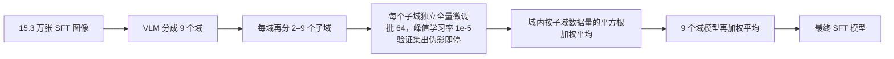
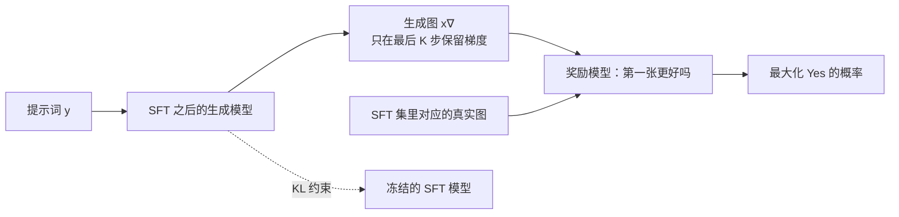
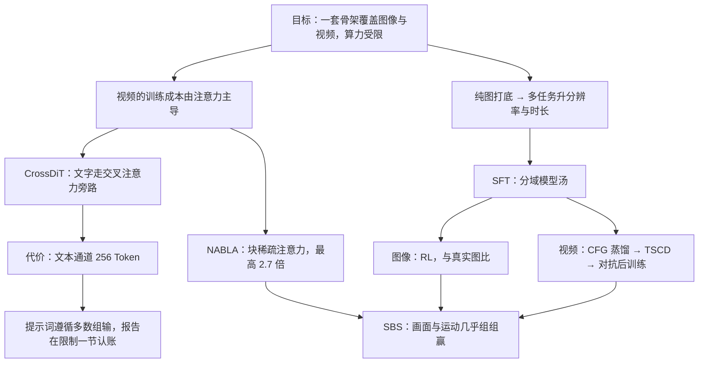

# Kandinsky 5.0：一副骨架养六个模型，账记在文本通道上

<!-- release-date: 2025-09-29 -->

> 本文依据 Kandinsky Lab（Sber）的 **Kandinsky 5.0: A Family of Foundation Models for Image and Video Generation**，arXiv:2511.14993v3，2026-05-26 修订，共 80 页（正文 68 页，其后是参考文献）。页码均指 PDF 页码，与页脚一致。文中区分三件事：**报告明确写了什么**、**我们怎么解释它**、**哪些是外部资料或本文推算**。

## 阅读前先认识几个词

- **潜变量（latent）与 VAE**：直接在像素上生成太贵。先用一个自编码器（VAE，Variational Auto-Encoder）把图像或视频压成小得多的张量，生成在这个压缩空间里做，最后再解码回像素。
- **DiT（Diffusion Transformer，扩散 Transformer）**：去噪网络用 Transformer。潜变量切成小块、摊成一条 Token 序列，注意力在这条序列上算。所以**注意力的平方代价直接压在「分辨率 × 时长」上**。
- **流匹配（flow matching）**：扩散模型的一种训练目标，学一个把噪声推向数据的速度场。报告说 5.0 是这个家族第一代用流匹配的模型（PDF p. 8），但全文没有写出它的损失函数。
- **NFE（Number of Function Evaluations）与 CFG**：NFE 是生成一个样本要跑几次网络，报告拿它当速度单位。CFG（Classifier-Free Guidance，无分类器引导）每步要跑两次网络，一次带提示词、一次不带，再外推。
- **SBS（Side-by-Side）**：把两个模型对同一条提示的输出并排给标注员，选谁更好或打平。本报告的实验结论全部来自这种人工评测。
- **模型汤（model soup）**：在几份数据上各微调一个模型，再把权重直接平均。

报告自己的两个新名字：**CrossDiT**（文字只通过交叉注意力进来的 DiT）和 **NABLA**（Neighborhood-Adaptive Block-Level Attention，邻域自适应块级稀疏注意力）。

## 一句话先说清

Kandinsky 5.0 不是一个模型，是三条产品线、六个模型（PDF p. 4–5，Figure 1）：

| 产品线 | 参数量 | 两个模型 | 用途 |
|---|---:|---|---|
| Image Lite | 6B | T2I Lite、Image Editing | 文生图、指令式图像编辑 |
| Video Lite | 2B | T2V Lite、I2V Lite | 轻量文生视频、图生视频，最长 10 秒 |
| Video Pro | 19B | T2V Pro、I2V Pro | 高质量文生视频、图生视频，最长 10 秒 |

六个模型共用同一套 CrossDiT 架构、同一个 Qwen2.5-VL 文本编码器、同一条数据流水线和同一个训练模板，只在宽度、深度和「在哪一站下车」上不同（PDF p. 6、p. 22）。

这份报告最值得读的，是一条从架构走到评测的代价链：

1. 为了让一套权重能吃长短不一的视频、还能套上稀疏注意力，他们放弃了上一代用的 MMDiT，改成**文字只从交叉注意力这条旁路进来**（PDF p. 24）；
2. 这条旁路接的是 Qwen2.5-VL，最大上下文只有 **256 个 Token**（PDF p. 23）；
3. 于是十三组 SBS 里，画面和运动几乎组组赢，**提示词遵循多数组输**（PDF p. 46–51）；
4. 报告在限制一节把这笔账认了，归因就是那 256 个 Token（PDF p. 64）。

> **每一层都选了「省」的那一边，省下的算力砸在画面和运动上；账单最后集中记在一处——模型听不全长指令。**

## 先看全景：六个模型长在三棵树上


三棵树是同一个模板：纯图打底 → 多任务混训并逐级升分辨率 → 升时长 → SFT → 特化或压缩。图上读不出、但值得先记住的有四点。

**第一，差别只有五个超参数**（PDF p. 24，Table 3）：

| 模型 | CrossDiT 块数 | LTF 块数 | 前馈维度 | 模型维度 | 时间嵌入维度 |
|---|---:|---:|---:|---:|---:|
| Image Lite | 50 | 2 | 10240 | 2560 | 512 |
| Video Lite | 32 | 2 | 7168 | 1792 | 512 |
| Video Pro | 60 | 4 | 16384 | 4096 | 1024 |

报告没有拆参数量，但它的显存公式（PDF p. 41，式 2）里写出了每块参数的形状：$9 d_t d + 8 d^2 + 2 d_f d$，即自注意力与交叉注意力各 $4d^2$、前馈 $2 d_f d$、三组调制 $9 d_t d$。代入 Table 3，三条线分别约 6.01B、2.00B、19.28B（本文算术，LTF 按去掉交叉注意力计），和标称的 6B / 2B / 19B 吻合。这说明**标称参数量只算 CrossDiT 本身**，不含 7B 的 Qwen2.5-VL、CLIP 和两个 VAE。

**第二，视觉编码器不共享。** 图像用 FLUX.1-dev 的 VAE，视频用 HunyuanVideo VAE 的编码器（PDF p. 22）。两个都是外部现成件，报告没给压缩比、通道数和重建指标。「共享骨架」只覆盖 Transformer。

**第三，两条视频线的大部分样本是静态图。** 把 Table 4 的步数乘批大小（本文算术，前提是批大小指全局批）：Video Lite 的纯图阶段约 18.0 亿个样本，全部视频阶段约 1.0 亿；Video Pro 分别约 32.8 亿与 6.1 亿。T2V 数据集有超过 2.5 亿个场景（PDF p. 15），Video Lite 的视频阶段连半个 epoch 都没跑完。**「长什么样」主要从便宜的图片里学，视频阶段负责「怎么动」。** 这是本文的解读，报告没有这样总结。

**第四，后训练不对称。** 图像线 SFT 之后接 RL，视频线 SFT 之后接蒸馏、没有 RL（PDF p. 29）。报告没解释原因。

多任务阶段的配比（PDF p. 31）：Video Lite 的 T2I / T2V / I2V 是 1% / 79% / 20%，Video Pro 是 2% / 77% / 21%；Image Editing 在编辑的三个阶段都是编辑 80%、文生图 20%。两边都留了一小条「回头看原任务」的通道，报告没说理由，常见的解释是防遗忘。

## 第一层矛盾：视频的账单压在注意力上

报告给了一条别处很少见的东西：训练步时长的解析公式（PDF p. 40，式 1）。

$$
\text{Step} = \frac{d}{d_0}\cdot\frac{S}{S_0}\cdot\left(9 + 14\cdot\frac{S}{S_0} + 6\cdot\frac{d}{d_0}\right)\cdot L\cdot B
$$

$d$ 是隐层维度，$S$ 是视频「分辨率」（Token 规模），$L$ 是块数，$B$ 是批大小；参考点 $d_0 = 1792$（Video Lite 的宽度），$S_0 = 256\times384\times31$。报告说它与实测步时长、显存「拟合得很好」，他们用它规划实验、选批大小与并行方案（PDF p. 41）。

把括号乘开，三项里只有中间那项随 $S$ 平方增长，那就是注意力。代入几个工作点，算它占多少（本文算术；$S_0$ 里的 31 对应 121 帧经 4 倍时间压缩后的潜变量帧数，这个压缩比是 HunyuanVideo VAE 的外部常识，与 Table 5 的帧数自洽）：

| 配置 | $d/d_0$ | $S/S_0$ | 注意力项占比 |
|---|---:|---:|---:|
| Video Lite，256×384，5 秒 | 1.00 | 1.00 | 48% |
| Video Lite，512×768，5 秒 | 1.00 | 4.00 | 79% |
| Video Lite，512×768，10 秒 | 1.00 | 7.87 | 88% |
| Video Pro，768×1280，10 秒 | 2.29 | 19.68 | **92%** |

最小一档注意力约占一半，Video Pro 最高一档占九成以上。想训高分辨率长视频，**绕不开注意力**。报告的两处核心设计都围着它转：CrossDiT 让视觉序列里只剩视觉 Token、方便稀疏化；NABLA 把注意力本身稀疏掉。

## 核心设计一：CrossDiT，文字只从旁边进来


### 旧问题：拼接在变长批次里很贵

Kandinsky 4.0 用的是 MMDiT 式架构：文字与视觉 Token 拼成一条序列，在同一次自注意力里互相看。报告对它的评价只有一句：它「需要一次拼接操作，显著拖慢了训练」，5.0 消除了这一步（PDF p. 24）。同一段给了换架构的理由：交叉注意力「与处理同一批内不同长度视频所需的稀疏注意力机制兼容性更好」。

为什么会这样，图左栏是我们的展开：这份报告的数据加载器本来就把长短不一的视频拼进一个批（PDF p. 27）。如果文字也要插进序列，样本边界和模态边界交错，块稀疏掩码得同时避开两种边界。把文字挪到旁路，视觉序列就是干净的一段段视频。

### 新设计：四路输入各管一件事

按 Figure 10（PDF p. 23），CrossDiT 吃四路输入：

| 输入 | 通路 | 作用 |
|---|---|---|
| 文字 | Qwen2.5-VL → Linear + LayerNorm，配 1D RoPE → LTF → 每层交叉注意力 | 语义条件的主通道 |
| 扩散时间步 | 正弦编码 + MLP | 当前噪声有多重 |
| CLIP 文本嵌入 | ViT-L/14 句向量 → Linear + LayerNorm，与时间嵌入逐元素相加 | 送进调制与最终的 AdaLayerNorm，给全局粗粒度条件 |
| 视觉潜变量 | Conv3d 切块 + 3D RoPE | 被去噪的主体 |

两个细节：

- **LTF（Linguistic Token Refiner）** 是去掉交叉注意力的 CrossDiT 块，报告说它用来增强文本表示，并**消除预训练文本编码器带来的位置偏置**（PDF p. 23）。Qwen2.5-VL 是自回归解码器，越靠后的 Token 看过的上下文越多；扩散模型要的是一束平权的条件 Token。
- 块内三个子块（自注意力、交叉注意力、MLP）都是「LayerNorm → Shift & Scale → 计算 → Gate → 残差」，调制系数由时间嵌入经 SiLU + Linear 生成；Q、K 上挂 RMSNorm（PDF p. 24，Figure 11）。交叉注意力的 Q 来自视觉，K、V 来自文本。

### 代价：文本通道只有 256 个 Token 宽

报告在相隔 40 页的两处各说了一半。架构一节：Qwen2.5-VL 的最大上下文是 **256**，CLIP 是 77（PDF p. 23）。限制一节：SBS 显示提示理解略落后于部分竞品，「主要归因于 Qwen2.5-VL 7B 文本编码器有限的上下文长度（256 token）」，下一步要换上下文更长的编码器（PDF p. 64）。

我们补一层结构上的理由（报告没讨论）：MMDiT 里文字 Token 参与联合自注意力，每层都会被视觉内容更新；CrossDiT 里文字经 LTF 算一次就固定了，每层只是反复查询同一份表示。**旁路的宽度就是全模型理解提示词的上限，后面没有补救的机会。**

报告的用例一节给了提示词写法模板（PDF p. 59）：文生视频按「主体定义 + 动作或运动向量 + 环境 + 电影与镜头参数」，图生视频按「主要动作 + 时间特征 + 镜头运动」。把提示词压成固定槽位，正是在窄通道上多塞信息的办法；这层因果是我们连起来的。

**对自己的项目有什么用**：把某个模态改成只读旁路，能换来主干的简洁和可稀疏化；但那条旁路的容量要单独审计，不能因为主干够大就以为条件通道也够用。

## 核心设计二：NABLA，先画地图再决定在哪真算


NABLA 是团队自己的独立工作，报告只给机制概述，完整算法与消融指向另一篇论文（PDF p. 26，引用 [36]）。图上三步对应 §5.4 的三条编号说明（PDF p. 25），下面只补图上读不出的判断。

**CDF 截断而不是 Top-k。** 报告的说法是这「确保每个头保留针对输入内容的独特注意力模式」（PDF p. 25）。我们的解释：Top-k 让每个头都看一样多的块；CDF 截断让每个头看到「凑够 $1-thr$ 的概率质量」为止，集中的头自动更稀疏，分散的头自动多留。报告用 Figure 13 与 Figure 14 对照说明：真实注意力图形状五花八门，STA 这类固定窗口只有一种形状（PDF p. 26）。

**决策粒度等于访存粒度。** $P^2 = N = 64$：空间 patch 的面积、池化的组大小、块稀疏的块大小是同一个数（PDF p. 25–26）。分形展平把「空间相邻」对齐成「内存相邻」，重排在 DiT 输入处做一次、输出处逆排一次。稀疏方案理论上省九成却跑不快，常见病因就是这两者没对齐。

**收益与边界。** 报告说 NABLA 在训练和推理上最高提速 **2.7 倍**，质量与全注意力相当，由 CLIP、VBench 与人工评测验证（PDF p. 26）；贡献列表写的是 **90% 稀疏率下 2.7 倍**（PDF p. 5）。这里的 VBench、CLIP 数值本报告没给，都在 [36] 里。

按上一节的占比表，注意力占 92% 时把它砍到十分之一，理论上限约 $1/(0.92\times0.1+0.08)\approx 5.8$ 倍（本文算术）。实测 2.7 倍，差额可能来自造掩码的开销、块稀疏 kernel 的效率和逐头块数不均，报告没给拆分。

**什么时候开。** SD 分辨率且不超过 5 秒时用 FlashAttention 或 SageAttention，超过 5 秒或 HD 分辨率才用 NABLA（PDF p. 40）。Image Lite 和 5 秒的 Video Lite 不走这条路。$thr$ 取值、STA 并集是否实际启用，报告都没写。

**一个工程选择。** NABLA 跑在 PyTorch FlexAttention 上，「不需要自定义 CUDA kernel，也不需要额外的损失函数」（PDF p. 26）。用一点表达力换零 kernel 维护成本：换一代 GPU、换一个 PyTorch 版本都不用重写。

## 数据：五个数据集，一条以数据库为中心的流水线

数据是报告写得最厚的部分（PDF p. 9–22）。

| 数据集 | 规模 | 用途 | 页码 |
|---|---|---|---|
| Kandinsky T2I | 超过 5 亿张图像 | 图像预训练 | p. 9 |
| Kandinsky T2V | 超过 2.5 亿个视频场景 | 视频预训练 | p. 15 |
| Kandinsky I2I | 约 1.5 亿对图像 + 指令 | 图像编辑 | p. 13 |
| Kandinsky RCC | 229,504 个视频场景 + 768,555 张图像 | 俄罗斯文化相关内容 | p. 16 |
| Kandinsky SFT | v1：2,833 个视频 + 45,000 张图；v2：12,461 个视频 + 153,000 张图 | 各阶段 SFT | p. 20 |

**基础设施**（PDF p. 9）：核心是一个数据库，同时充当元数据仓库和任务分发器；带向量索引，用来按训练阶段取数和去重；表分区与负载均衡让数千个数据处理器同时访问，处理器按任务用 CPU 或 GPU。每条素材是一行记录，每个过滤模型是一个领任务、写回分数的 worker。加一个新过滤器只需给旧记录补一列，不必重跑全量。

**T2I 与 T2V 的过滤**（PDF p. 9–11、p. 15–16）两边结构相同：短边小于 256 像素的丢；感知哈希去重；水印（分类器 + YOLO 检测器）；质量（图像用 TOPIQ 与 Q-Align，视频用 DOVER 与 Q-Align）；CRAFT 文字检测去掉字幕过多的；YOLOv8 与 CLIP 分类器打标签。各自多出的：

- 图像：SAM 2 分割加 Sobel 边缘，滤掉纯背景这类过于简单的图；InternVL2-26B 写英文描述、InternLM3-8B 出精炼与缩短版，Qwen2.5-VL-32B 给高分辨率图写俄语描述。英文描述里含西里尔或中文字符的句子直接删，因为 InternVL2 读西里尔字母很差（PDF p. 11）。**打标模型的已知弱点，用下游一条规则堵住。**
- 视频：PySceneDetect 切场景，每段 2–60 秒；按 2 FPS 采样算相邻帧 MS-SSIM，**过静和过动的都丢**；一个基于 VideoMAE 的模型预测镜头运动、物体运动和光色变化；Tarsier2-7B 写描述；InternVideo2-1B 嵌入后 K-Means 聚成 10,000 簇，用于均衡采样（PDF p. 16）。

阈值只给了名字没给数值；按短边 256、512、1024 分目录存 Parquet，正好对应预训练的三档分辨率。

### 图像编辑数据：从存量图片里「挖」编辑对

这是全报告最有迁移价值的一段（PDF p. 11–15）。训练指令式编辑需要「原图 + 指令 + 目标图」，天然稀缺。报告不用生成模型合成，而是去约 **2.4 亿**张存量图片里找天然存在的「同一场景、改了点什么」的对：

1. 三路相似度：CLIP（语义）、DINOv2（视觉）、人脸识别（只处理单人脸图）；
2. 自适应阈值：图片聚成 10,000 簇，按簇内最高相似度定阈值，最终判据 $\text{clip\_sim} > (1-T)\cdot\text{clip\_thr} + T$，$T = 0.15$；
3. 几何验证：LoFTR 找匹配点，RANSAC 估基础矩阵与欧氏变换，迭代找内点组（每组至少 20 点），累加成总内点数；
4. 双边卡死：DINO 路要 $\text{dino\_sim} > 0.8$ 且内点 > 300，CLIP 路要 $\text{clip\_sim} > 0.8$ 且内点 > 200；人脸 $> 0.7$；**排除** $\text{dino\_sim} > 0.97$、对齐后 DINO $> 0.97$、或人脸相似度在 0 与 0.5 之间的；
5. 对齐 DINO：按 RANSAC 的变换裁到重叠区域再算一次；重叠比例过高的丢，那只是裁剪；
6. 写指令：先 SBS 比 GPT-4o、带推理的 GPT-4 Mini、Gemini 2.5 Pro、Qwen2.5-VL-32B，Gemini 2.5 Pro 第一、GLM 4.5 接近；按性价比选了**不开推理的 GLM 4.5**，再用 LoRA 在精选数据上微调（PDF p. 13）。

结果约 1.5 亿对（PDF p. 13）。关键在于 **「太像」和「不够像」两端都有明确阈值**：0.97 以上是同一张图，0.8 以下是两张无关的图，重叠过多是裁剪，编辑对落在中间那条窄带。编辑的 SFT 再只看目标图：Q-Align 分 > 4、审美分 > 2，得到约 60 万候选，人工挑出最终集（PDF p. 13）。

### SFT 数据与俄罗斯文化数据

SFT 初始池是 93,296 个高分辨率视频场景和约 1000 万张图（PDF p. 18），过两级人工评审：普通标注员做技术筛查（主体、取景、纵深、伪影），再由有电影摄影和视觉艺术背景的专家按问卷评审，图像 11 项、视频 13 项，含「不像 AI 生成」「是否适合剪辑」这类条目；带文字的图另有一套字形标准（PDF p. 19–20）。v1 要求评审一致，约选出 3% 的视频与 5% 的图像（PDF p. 20）；训练时两版按校准概率混采。

所有 SFT 数据用 Qwen2.5-VL-32B 分进 9 个域（动物、建筑、艺术、卡通、食物、室内、自然、人物、科技，另有 other），图像再细分子域（PDF p. 20–21）。图像描述先由 Qwen2.5-VL-32B 写长描述，再由 Qwen3-32B 改写成五种长度，并同时给出英、俄两种语言（PDF p. 18）。

RCC 数据集由标注员按与俄罗斯文化的相关性人工挑选，描述人工用俄语写再机翻成英文，预训练和专门微调都用（PDF p. 17）。相对 2.5 亿视频场景不到千分之一，却是通用网络数据里天然稀缺的那个分布。

## 训练：从存储到 RL 的几处实在工程

### 基础设施：存潜变量不存像素，文本嵌入反而现算

集群是标准 NVIDIA 多节点，每节点 8 卡 NVLink，节点间 InfiniBand；数据量级 $O(10)$ PB，所以用 S3 而不是 NFS（PDF p. 26）。S3 走 100 Gbit/s 链路、只允许 $O(10^3)$ 并发连接，设计目标变成「打开的对象少、每条连接吞吐高」（PDF p. 27）：

- 图像与视频**预先编成 VAE 潜变量**再存，打成大小相近的 tar；每往上一档分辨率，每个 tar 的条数除以 4（图像 1024 / 256 / 64，视频 16 / 4 / 1）。
- **文本嵌入不预存，训练时现算**。理由：一个文本嵌入约是低分辨率（如 256×256）图像潜变量的 50 倍大，预存会压垮 S3 的带宽和连接数（PDF p. 27）。

同样是「用存储换计算」，方向要看谁大。视觉潜变量小而编码贵，值得存；文本嵌入大而 Qwen 前向不算贵，不值得。

**数据加载器**（PDF p. 27–28）：一个 worker 流式拉 tar、解包、按宽高比（1:1、16:9、4:3……）推进不同的内存队列；主进程从一个队列里连续弹出视频，直到时长和 $\sum_i t_i \approx t_{\max}$。形状对齐不靠 padding，长度不齐靠拼。**图像当作长度为 1 的视频，但总是单独成批**，因为「混合批里图像比例过高，经验上会拖累视频收敛」。所以 1% / 79% / 20% 的任务配比是在「步」的粒度上实现的（这层连接是我们读出来的）。Figure 16b 显示多数视频接近最大长度，少量短片不可忽略，动态成批因此有价值。

**并行**（PDF p. 28）：全程 HSDP；从中分辨率阶段起加 Sequence Parallel。DiT 权重切在 64 卡上，文本编码器切在 32 卡上。**选序列并行而不是张量并行**，理由是它每块只要两次集合通信（自注意力前后），而块本身不大，没必要切块内权重。HD 10 秒序列最多切 8 卡，保证通信不出一个 NVLink 岛。Checkpoint 由 64 个进程各写各的分片，不在任何节点拼完整 state_dict。

**激活卸载只给 RL 用**（PDF p. 29）：预训练用经典的块级激活重算；RL 阶段要保留整条生成轨迹的激活，于是把每块的输入在前向与反向之间异步搬到主机内存，与计算重叠。Figure 17 的两条显存曲线里，普通重算的峰值越过了图上约 80 GB 的 OOM 线，卸载后峰值约 60 GB（读自图）。

### 预训练：四种任务，同一副骨架


文字一侧，报告给了送进 Qwen2.5-VL 的两个模板（PDF p. 31–33），原样如下（`promt` 是原文拼写）：

```text
caption 模板（文生图、文生视频、图生视频）
<|im_start|>system\nYou are a promt engineer. Describe the image by detailing the color, shape, size, texture, quantity, text, spatial relationships of the objects and background:<|im_end|>
<|im_start|>user\n{描述}<|im_end|>

instruct 模板（指令编辑，原图也一并送进 Qwen2.5-VL）
<|im_start|>system\nYou are a promt engineer. Based on the provided source image (first image) and target image (second image), create an interesting text prompt that can be used together with the source image to create the target image:<|im_end|>
<|im_start|>user\n{描述}
```

报告的理由是：Qwen2.5-VL 是按指令训练的，这种格式更适合它（PDF p. 31）。文生视频在 1024 分辨率、或 512 分辨率长达 10 秒时启用 NABLA，其余用全注意力（PDF p. 33）。

**超参**（PDF p. 33–34）：AdamW，$\beta = (0.9, 0.95)$，eps $10^{-8}$；所有阶段 warmup，梯度裁剪 1.0，EMA 0.9999；10% 的样本去掉条件（常见用途是支撑 CFG）。各阶段步数与批大小已画在前面的阶段树里；学习率从低分辨率的 $10^{-4}$ 降到高分辨率的 $2\times10^{-5}$ 到 $3\times10^{-5}$；权重衰减在纯图阶段为 0，多数视频与编辑阶段为 0.001。Table 4 还给了每档分辨率与宽高比的采样概率。学习率调度的形状没写。

一处报告没解释的差异：Video Lite 的低分辨率视频阶段只有 10k 步，Video Pro 是 200k 步（PDF p. 34）。

### SFT：分开练，再平均回来

**旧问题**：在整个 SFT 集上直接全量微调「效果不理想」——保持非写实风格、文本对齐变差、图中文字渲染变差（PDF p. 33）。

**图像侧做法**（PDF p. 22、p. 33）：



停止条件不是步数或验证损失，而是**验证集上出现几何畸变或色彩偏差**。报告还比较了三种分解（VLM 域、CLIP 嵌入 K-Means 9 类、层次化 VLM 域）和三种合并权重（等权、按数据量、按数据量平方根）：层次化域在 SBS 里最好，等权或平方根权最好（PDF p. 22）。没有给 SBS 数值。

**视频侧**（PDF p. 35）：SFT 数据约 2.8 千个视频加 4.5 万张图。标准微调约 1 万步后过拟合，5 秒模型的最好结果来自 1 万步时的 EMA checkpoint。模型汤按 9 个域各训一个、再**等权**平均：单个域模型容易过拟合和出伪影，平均之后画质和稳定性都高。内部 SBS 里模型汤在视觉质量、运动一致性、无伪影上胜过标准 SFT，**文本对齐持平**。

为什么平均能救回来，报告只给现象和引用。我们的理解：各子域模型从同一个预训练点出发、走得不远，还在同一个损失盆地里；各自跑偏的方向不同，平均后共同的「更好看」留下，偏差互相抵消。注意「文本对齐持平」：**模型汤改善画面，不改善听懂指令**，这与主线一致。

### 蒸馏：100 → 50 → 16，再用对抗训练补回画质

只做视频（PDF p. 35–36）：

1. **CFG 蒸馏**：从 100 NFE 的基础模型出发，空提示词、CFG 系数 5.0，蒸出 50 NFE 的模型，2 倍加速；内部 SBS 说语义构图、纹理、运动和提示对齐都没有可察觉的退化。
2. **TSCD**（Trajectory Segmented Consistency Distillation，轨迹分段一致性蒸馏）：在 CFG 蒸馏模型上再蒸到 16 NFE。
3. **对抗后训练**：第 2 步「速度很高，但视觉保真度有亏空」。受 LADD 启发加一段对抗训练：Hinge 损失，生成器与判别器都用 RMSprop，学习率 $10^{-6}$ 与 $10^{-4}$，梯度裁剪 1.0。

第 3 步的关键是**给真图和生成图都加高斯噪声再喂判别器**，噪声水平从 Logit-Normal(−4, 1) 的时间步分布采样。报告说这个「再加噪」显著提升稳定性，而且**不再需要 R1 梯度惩罚**（PDF p. 36）。外部背景：判别器太容易分开真假时梯度会消失，加噪让两个分布重叠，和 R1 解决的是同一个问题，但只是一行数据增强，不必多算一次梯度的梯度。

产物是 Video Lite Flash 与 Video Pro Flash。判别器的架构、初始化、训练时长报告都没写。

### RL 后训练：让生成图去和真照片比

只做图像（PDF p. 36–39）。

**奖励数据不要人标。** 报告的启发式：按设计，预训练 checkpoint 的生成图 < SFT checkpoint 的生成图 < SFT 集里的真实图，于是 $(x_w, x_l, y)$ 三元组由数据来源直接决定（PDF p. 37）。**流水线里天然的质量序列就是免费的偏好标签**；代价是它只教「哪一档更好」，不教同一档内部的好坏（我们的判断）。

**奖励模型是个回答 Yes/No 的 VLM。** 按 RewardDance 的做法，从 Qwen2.5-VL-7B 初始化，输入两张图和一段描述，问「第一张更好吗」，反馈值取 Yes 的概率（PDF p. 37）：

$$
R(x_1, x_2, y) = P(\text{Yes} \mid x_1, x_2, y)
$$

过拟合的信号不是验证损失：Figure 23 里训练步数越多，验证集分数分布越像一个 delta 函数。他们监控这个分布和核密度估计的标准差 $\sigma$，**选了训练 1300 步的奖励模型**（PDF p. 38）。一个把什么都打成高分的奖励模型，损失可以很低，但已经没有区分度。

**RL 用 DRaFT-K**，梯度只从最后 $K$ 步回传（PDF p. 38）：



损失是 $\mathcal{L} = \mathcal{L}_{RL} + \beta_{KL}\cdot \mathrm{KL}$，其中 $\mathcal{L}_{RL} = 1 - R(x_\nabla, x_{\text{real}}, y)$。流匹配模型没有显式的输出分布，所以「KL」写成两个模型在同一批中间状态上预测的速度差：

$$
\mathrm{KL}(p_{RL}\,\|\,p_{SFT}) = \sum_t \left\| v_{RL}(x_t, t) - v_{SFT}(x_t, t) \right\|^2
$$

求和只跑过回传了梯度的那几步。文生图的最优设置是 $\beta_{KL} = 2\times10^{-2}$、$K = 10$（PDF p. 38–39）。严格说它不是 KL 散度，而是起同样作用的正则项（我们的说明）。

**试过但没选的**（PDF p. 39）：可微的绝对奖励；两张生成图做相对奖励（带或不带梯度）；从 N 张生成图里挑最好的当参照。结论是**拿 SFT 集的真实图当参照最好**。我们的推测：参照物是另一张生成图时，它会随策略一起进步，信号越来越弱；真实图是固定且更高的标准，梯度方向稳定。

## 推理与成本：Table 5 能读出什么

推理侧的优化（PDF p. 39–40）：HunyuanVideo VAE 编码器经代码优化与算子替换**平均提速 2.5 倍**，不需要额外训练；因为只支持有限几种分辨率，可以为每种定死最优 tile 尺寸，并且发现时间维 tile 融合会伤质量、tile 越少损失越小。DiT 侧：剖析与重构消除 GPU 空闲并配合 `torch.compile`；MagCache 缓存扩散步，**提速 46%，没有可见质量下降**；再加前面那条注意力开关规则。

全部实测都在**单张 80 GB H100** 上（PDF p. 40，Table 5）：

| 模型 | 帧数 | 分辨率 | NFE | 生成时间（秒） | 显存（GB，带 offloading） |
|---|---:|---|---:|---:|---:|
| Video Lite 5s | 121 | 512×768 | 100 | 139 | 21 |
| Video Lite 10s | 241 | 512×768 | 100 | 224 | 21 |
| Video Lite 5s Flash | 121 | 512×768 | 16 | 35 | 21 |
| Video Lite 10s Flash | 241 | 512×768 | 16 | 61 | 21 |
| Video Pro 5s | 121 | 512×768 | 100 | 560 | 47 |
| Video Pro 10s | 241 | 512×768 | 100 | 1158 | 51 |
| Video Pro 5s Flash | 121 | 512×768 | 16 | 123 | 47 |
| Video Pro 10s Flash | 241 | 512×768 | 16 | 242 | 51 |
| Video Pro 5s | 121 | 768×1280 | 100 | 1241 | 53 |
| Video Pro 10s | 241 | 768×1280 | 100 | 3218\* | 68 |
| Video Pro 5s Flash | 121 | 768×1280 | 16 | 235 | 53 |
| Video Pro 10s Flash | 241 | 768×1280 | 16 | 576\* | 68 |
| Image Lite | 1 | 1024×1024 | 100 | 13 | 17 |

\* 报告注明启用了 offloading。帧率是 24 fps（PDF p. 59），$(121-1)/5 = (241-1)/10 = 24$。

表里有四件报告没明说的事（本文算术）：

- **Flash 实际加速 3.7–5.6 倍，不到 NFE 之比 6.25 倍。** 假设每步成本不变，把每行拆成「固定开销 + 每步成本 × NFE」，固定开销（文本编码、VAE 解码等）在 15–73 秒。它在 Video Lite Flash 的总时长里占四到五成，在 Video Pro HD Flash 里只占一到两成。对轻模型，蒸馏之后的下一个瓶颈已经不在 DiT。
- **Video Lite 从 5 秒到 10 秒只慢 1.61 倍**（139 → 224 秒），帧数却翻倍。10 秒走 NABLA、5 秒走全注意力，稀疏注意力把「时长 → 成本」的斜率压了下来。
- **19B 只比 2B 慢约 5.2 倍**（1158 / 224），参数量比是 9.5 倍。长序列下注意力代价由 Token 数主导，只随宽度线性增长。
- **标称 2B 的模型开着 offloading 也要 21 GB。** 多出来的主要是 7B 的 Qwen2.5-VL 与两个 VAE；报告在表下补了一句「用量化的文本编码器可以降低显存」（PDF p. 40）。

显存公式（PDF p. 41，式 2）：

$$
\text{Memory} = 12L\,\frac{9 d_t d + 8 d^2 + 2 d_f d}{N} + \max\left(4L\,\frac{9 d_t d + 8 d^2 + 2 d_f d}{N},\; 2S\left(L d\, o + 18 d + 2 d_f\right)\right)
$$

$N$ 是 GPU 数，$S$ 是序列长度，$o = 0$ 表示激活卸载。第一项是参数与优化器状态，第二项在通信缓冲与激活之间取大。开了卸载，激活里随块数 $L$ 增长的那部分直接归零——这就是 RL 阶段非卸载不可的原因。

## 实验：赢在画面，输在指令

### 评测怎么做

全部实验是 SBS，在 Elementary 平台上做，一个项目通常约 20 名非新手标注员（PDF p. 41）。**先评视觉质量，这时不给标注员看提示词**；再评提示词遵循（PDF p. 41）。左右随机，每条 5 人重叠；视频大多用 MovieGen 的 1003 条提示词（PDF p. 43）。

维度与聚合公式都列了（PDF p. 44–45）：提示词遵循 6 项（物体出现、数量、属性、位置、动作出现、动作属性）；视觉质量 11 项，其中构图、光线、色彩、前后景区分、帧间平滑、整体印象、伪影数量合成「视觉质量」，动感、运动真实性、人脸一致性、语义断裂合成「动态与运动质量」。

「看画面时不给提示词」把两个维度彻底拆开，代价是视觉质量分完全不惩罚「画得很美但答非所问」。

### 十三组对比的总图


读这张图要知道的几件事：

- **对 Sora 那组规模最大**：约 6.5 万条成对判断、44 名受训标注员、239 人时、1,002 条提示词，标注员一致性约 71%（PDF p. 46）。但报告没说是哪个 Sora：引言引的 [23] 是 2024 年的 Sora 技术博客，[24] 是 2025 年的「Sora 2 is here」（PDF p. 70），§8.2.3 只写「Sora」，也没给分辨率与生成配置。Figure 28c 的分项里「运动动态」是 **0.42 对 0.42 打平**，总分 0.67 对 0.33 是由物体真实感（0.62 对 0.17）、人脸稳定性（0.51 对 0.16）等拉起来的。
- **提示词遵循的落后随对手变强而扩大**：对 Wan 2.2 5B 是 0.14 对 0.14，对 Wan 2.1 14B 是 0.15 对 0.27，对 Wan 2.2 A14B 是 0.13 对 0.29。报告自己也写 Wan 系列在提示词遵循上更强，「暗示语义保真与视觉流畅之间存在取舍」（PDF p. 45）。
- **对 Wan 2.2 A14B，Video Lite 的画面优势已经很薄**：0.24 对 0.20，打平过半。
- **对上一代 Kandinsky 4.1 Video，提示词遵循是 0.50 对 0.50**（PDF p. 48，Figure 31c），画面 0.59 对 0.41、动态 0.73 对 0.27。Figure 30 的细项里，5.0 赢在动作与位置，4.1 反而在物体出现、数量、属性上略优（PDF p. 47）。**一代之间画面、运动、伪影全面改善，听懂提示词一步没走。**
- **对 Veo 3 fast，Video Pro 的画面与运动都是打平**（0.20 对 0.20、0.21 对 0.20），只有对完整版 Veo 3 才有 0.24 对 0.21、0.33 对 0.19 的优势（PDF p. 49）。
- **图生视频模式下提示词遵循不再输**：Video Pro 对 Wan 2.2 A14B，文生视频 0.20 对 0.34，图生视频 0.19 对 0.16（PDF p. 50）。我们的解释：参考图已经给定了「画面里有什么」，文字只要描述「怎么动」，256 Token 不再是瓶颈。
- 图像侧用基于 PartiPrompts、再由 Giga Max 大模型扩写的提示集，编辑用 Kontext Bench，都是只评两个维度的「简化版」SBS（PDF p. 50）。

### 蒸馏的代价

Video Lite 对 Video Lite Flash（PDF p. 52，Figure 36）：提示词遵循 0.13 / 0.78 / 0.09，视觉质量 0.18 / 0.73 / 0.09，运动 0.15 / 0.76 / 0.09（Lite 胜 / 打平 / Flash 胜）。打平占七成以上，报告的描述是「可测量但总体温和的下降」，轻提示与短时长几乎看不出差别。

但 Figure 36 的 (a) 5 秒模型和 (b) 10 秒模型**六根柱子数值完全相同**。两个模型各自评测不太可能全部吻合到小数点后两位，更可能是同一张图用了两次，其中一组数据实际缺失。蒸馏对长视频伤害是否更大，这份报告回答不了。

## 家族四年：参数量不是一路变大

报告用两页写了演进史（PDF p. 7–8，Figure 2），名字来自画家瓦西里·康定斯基。

| 时间 | 型号 | 参数量 | 关键变化 |
|---|---|---:|---|
| 2021-11 | Malevich（ruDALL-E XL） | 1.3B | 自回归，256×256 |
| 2022-06 | Kandinsky 1.0 | 12B | 仍是自回归，1.2 亿图文对 |
| 2022-11 | Kandinsky 2.0 | 2B | 家族第一个扩散模型，支持 101 种语言，512×512 |
| 2023-04 | Kandinsky 2.1 | 3.3B | 加 image prior 与 MoVQ，768×768 |
| 2023-07 | Kandinsky 2.2 | 4.8B | 1024 像素，ControlNet，4 秒动画 |
| 2023-11 | Kandinsky 3.0 / Video 1.0 | 11.9B / 17.5B | FLAN-UL2 编码器；视频先生关键帧再插帧，只用 22 万条文本-视频对 |
| 2024-04 | Kandinsky Flash / 3.1 | 11.9B / 15.5B | ADD 蒸馏把 50 步压到 4 步；Flash 作精修器 |
| 2024-05 | Kandinsky Video 1.1 | — | 460 万条文本-视频对，5.5 秒 |
| 2024-12 | Kandinsky 4.0 | 17.5B | 家族第一个 DiT（MMDiT 式），12 秒视频，还能从视频生成音频 |
| 2025-06 | Kandinsky 4.1 | 14B | 图像改用 DiT，艺术家团队手选 SFT 数据 |
| 2025-09 / 11 | Kandinsky 5.0 | 2B / 6B / 19B | 第一次用流匹配，六个模型 |

三处值得停一下（本文的观察）：Video Lite 的 2B 回到了 2022 年 2.0 的量级；4.0 能做 12 秒视频和视频配音，5.0 的上限是 10 秒且没有音频，报告没解释这两处收缩；视频数据从 22 万条涨到 2.5 亿个场景，两年一千倍。**4.0 用 MMDiT，5.0 明确放弃它并说了理由**——一个团队在两代之间推翻自己的核心架构选择，这种写法很少见。

## 报告承认的限制，和它没写的

### 报告自己承认的（PDF p. 64）

- **文本-视觉对齐**：提示理解略落后于部分竞品，归因于 256 Token 的文本编码器；计划换更长上下文的编码器，并试用 RL 改善提示理解。
- **复杂动态**：流体、布料这类长程物理交互仍难，**超过 10 秒的序列偶尔出伪影**。
- **泛化**：各风格、物体、场景上表现不均，源于数据的类别不平衡与偏差。
- **统一模型**：现在是一族专用模型，长期目标是合并成一个多媒体生成基础模型。
- **效率**：消费级硬件上高分辨率实时生成（24+ FPS）仍是挑战。

伦理一节（PDF p. 64–66）：代码与 checkpoint 以 **MIT 许可**发布，**刻意不做内置内容过滤**，责任在用户。报告自己贴了刻板印象样例：「一位教师」「一个聪明的人」「一个英俊的男人」这类简单提示常给出雷同结果（Figure 43），「A doctor」则呈现了性别与种族多样性（Figure 44）；建议用明确要求多样性的描述性提示。只有定性样例，没有偏见的量化评测。

### 报告没有公开的

- **架构**：两个 VAE 的压缩比与通道数、Conv3d 的 patch 尺寸、注意力头数与每头维度、3D RoPE 的形式；NABLA 的 $thr$ 与 STA 设置。
- **目标函数**：流匹配、CFG 蒸馏、TSCD、对抗损失都只有名字，写出公式的只有 RL 那两个。
- **数据**：T2I 与 T2V 各道过滤的阈值（只有编辑数据给全了，PDF p. 15，Table 1）；数据集之间的重叠；来源只写到「LAION、COYO 等开放数据集与大型在线图库」「开放数据集与大型视频平台」这一层。
- **训练**：总算力、GPU 总数、训练时长、成本；学习率调度形状；SFT 步数与两版 SFT 集的采样概率；判别器；视频为什么不做 RL。
- **评测**：没有一个公开基准分数；对手的分辨率、时长、步数、API 版本都没给；除 Sora 那组外标注员人数只有「约 20 名」的总述；RL、模型汤、NABLA 开关都没有量化对照，只有定性描述或样例图（Figure 26、27，PDF p. 42–43）。

## 原件里核出的问题

不影响主要结论，但会影响照着它复现或引用的人。

| 位置 | 问题 |
|---|---|
| p. 52，Figure 36 | 5 秒与 10 秒两个子图数值完全相同，至少一组数据缺失 |
| p. 48 正文 vs Figure 31c | 正文说对 4.1「所有指标显著改善、提示保真度更高」，图上提示词遵循是 0.50 对 0.50 |
| p. 48，Figure 31 | (a) 图例里「Kandinsky 4.1 Video」出现两次；(c) 图例把对手写成「Wan 14B」，而这组比的是 4.1 |
| p. 49 图注 vs Figure 32b | 图注说 Video Pro 在视觉质量和运动上「表现出色」，对 Veo 3 fast 这两项实际打平 |
| p. 31，Video Pro 段 | 在 19B 的段落里写「为 Kandinsky 5.0 I2V Lite 做图生视频专门微调」，按 Figure 18 应是 I2V Pro |
| p. 20 | 「最低 $\frac{3}{2}$ 的一致」——比例不可能大于 1，应是 $\frac{2}{3}$ |
| p. 18 与 p. 20 | 约 1000 万张图中选出「约 5%」，但 v1 只有 45,000 张，即 0.45%；视频 2,833 / 93,296 ≈ 3% 对得上 |
| p. 22 与 p. 34 | SFT 消融说预训练批大小是 4096，Table 4 里 Image Lite 三个阶段是 8000 / 4000 / 2000 |
| p. 43 与 p. 46 | MovieGen 提示词一处写 1003 条，一处写 1,002 对 |
| p. 1、p. 5 vs p. 33 | 摘要与贡献列表把 SFT 写成 self-supervised fine-tuning，正文是 supervised fine-tuning |
| p. 71 与 p. 73 | Movie Gen 同一篇论文以 [31] 和 [45] 收录两次 |
| p. 74 [55]、p. 78 [118] [119] | [55] 的 arXiv:2406.12345 指向一篇政府知识管理论文，该 recaption 论文实为 2406.08478；[118] 是占位符 `arXiv:2402.XXXXX`；[119] 的 arXiv:2212.04403 指向 DeeProb-kit |

## 最值得带回自己项目的几条

1. **先给成本写一条解析式，再决定优化谁。** 式 1 展开成「线性项 + 平方项」，立刻能看出注意力在哪个工作点开始主导。这比先写稀疏 kernel 再测快不快便宜得多。
2. **把某个模态改成只读旁路，旁路的容量就成了硬上限。** CrossDiT 的整条评测结论就是这笔账的兑现；后训练、模型汤都没把提示词遵循拉回来。
3. **稀疏决策的粒度必须等于访存粒度。** $P^2 = N = 64$ 加分形展平，是「省九成算力」能真的变成「快 2.7 倍」的前提。
4. **能用框架已有抽象表达的方案，值得付一点性能溢价。** NABLA 不写自定义 kernel，换来零维护成本。
5. **能力放在学得起的模态上学。** 两条视频线的大头样本是静态图，「长什么样」用图片学，「怎么动」才用视频学。
6. **从存量数据里挖监督信号，并把两端都卡死。** 编辑对来自天然存在的相似图片，「太像」和「不够像」都有阈值。
7. **流水线里天然的质量序列就是免费的偏好标签；参照物选固定的高标准。** 预训练 < SFT < 真实图，RL 拿真实图当参照。
8. **奖励模型的过拟合看输出分布是否塌缩，不看验证损失。**
9. **小数据微调，分开练再平均往往比合起来练稳**；停在「肉眼可见的伪影」出现时，合并时别按数据量线性加权。
10. **不同训练阶段的显存策略不该共用一个开关。** 预训练重算，RL 卸载。
11. **「用存储换计算」逐项算账。** 视觉潜变量值得预存，比它大 50 倍的文本嵌入不值得；只支持有限几种分辨率，VAE 的 tile 尺寸就能逐个调到最优。

## 用一张图重新串起全文



## 关键词回看

- **CrossDiT**：视觉 Token 走自注意力，文字经 LTF 精炼一次后通过交叉注意力注入。对变长批次和稀疏注意力友好，代价是文本表示不被视觉更新、容量受限于文本编码器。
- **LTF（Linguistic Token Refiner）**：去掉交叉注意力的 CrossDiT 块，消除自回归文本编码器的位置偏置。
- **NABLA**：64 个一组池化出缩小图，逐头按 CDF 截断成块掩码，可选并入 STA 窗口；配分形展平；跑在 FlexAttention 上。
- **模型汤**：各子域独立微调再加权平均；图像按平方根权，视频等权。
- **CFG 蒸馏 / TSCD / 对抗后训练**：100 → 50 → 16 NFE，最后一步靠「给真假图都加噪」稳住判别器、省掉 R1。
- **相对奖励与 DRaFT-K**：VLM 判断「第一张更好吗」，取 Yes 的概率；只在最后 $K$ 步回传梯度，参照是真实图。
- **HSDP + 序列并行**：块不大、序列极长时，序列并行每块只需两次集合通信；HD 10 秒最多切 8 卡，留在一个 NVLink 岛内。
- **RCC**：人工策划的俄罗斯文化数据集，俄语手写描述再机翻。

## 最后的判断

这份报告不提出新范式。流匹配、DiT、交叉注意力、模型汤、一致性蒸馏、DRaFT 都是已有框架，唯一的原创算法 NABLA 细节在另一篇论文里。它值得读，是因为**把一个团队在受限预算下的取舍链从架构一路摊到评测**，而且在限制一节自己认了账。

证据强度分三层：

- **有实验支撑的**：Video Lite 在画面与运动上确实强，对 Sora 那组规模大、一致性 71%；提示词遵循偏弱，而且十三组里模式一致；蒸馏的代价不大，打平占七成以上；两条成本公式自洽，能反推出注意力占比。
- **只有作者观察、没有数值的**：模型汤优于标准 SFT；层次化域分解最好；再加噪显著稳住对抗训练；MagCache 提速 46% 无可见损失；NABLA 质量与全注意力相当（数值在 [36]）。
- **与自己的图对不上的**：见上面的问题表，其中对 4.1 与对 Veo 3 fast 两处是正文或图注的结论与条形图不符。**图注是作者的总结，条形图才是数据。**

如果只带走一句：

> **共用骨架省的是研发成本，不是能力上限。把一个模态改成只读旁路，那条旁路有多宽，模型在那个方向上就只能走多远。**

## 资料与阅读边界

- **原件**：[arXiv:2511.14993](https://arxiv.org/abs/2511.14993) v3（2026-05-26），80 页。arXiv 提交历史为 v1（2025-11-19）、v2（2025-11-20）、v3，v3 为最新版；封面日期写的是 2025-11-20。
- **首发日**：官方仓库 [kandinskylab/kandinsky-5](https://github.com/kandinskylab/kandinsky-5) 的更新日志首条是 2025/09/29 开源 Kandinsky 5.0 T2V Lite；对应的 Hugging Face 仓库 [Kandinsky-5.0-T2V-Lite-sft-5s](https://huggingface.co/kandinskylab/Kandinsky-5.0-T2V-Lite-sft-5s) 的模型卡与示例资产在同日提交（权重文件在此前三天就已上传到预建仓库，不作为公开日）。报告 Figure 2 也把 Video Lite 标在 2025 年 9 月。之后日志记 2025/11/15 开源 Lite I2V 与 Image Lite，2025/11/20 开源 Video Pro。按「家族首次对外可用」取 **2025-09-29**。
- **外部补充（不是报告内容）**：HunyuanVideo VAE 的 4 倍时间、8 倍空间压缩比（只用于解释式 1 里的 31 与注意力占比）；对抗训练中加噪与 R1 的关系；MMDiT 把两种模态拼成一条序列的机制。
- **本文推算**：三条线的参数量重算、注意力项占比与 5.8 倍理论上限、Table 4 样本数、Table 5 的固定开销拆分，都是按报告给的公式与数字做的算术。各组 SBS 数值是从 PDF p. 46–52 的堆叠条读出的，精度是图上标注的两位小数。参考文献编号 [55]、[119] 的问题按 arXiv 官方页回查标题确认。
- **报告引用、本文未读的**：NABLA 独立论文（[arXiv:2507.13546](https://arxiv.org/abs/2507.13546)），RewardDance、DRaFT、TSCD（Hyper-SD）、LADD、MagCache 各自的原文。本文不对它们的细节做断言。
