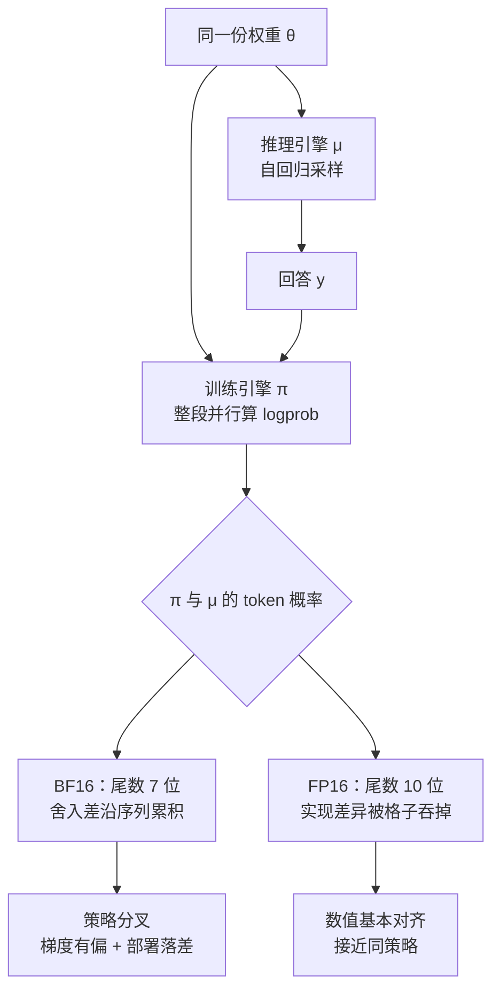

# FP16：训推不一致的根因是 BF16 舍入，换精度就够

<!-- release-date: 2025-10-30 -->

> 本文依据 **Defeating the Training-Inference Mismatch via FP16**，Sea AI Lab 与新加坡国立大学（NUS）；作者 Penghui Qi、Zichen Liu、Xiangxin Zhou（三位核心贡献者，Qi 为 Project Lead）、Tianyu Pang、Chao Du、Wee Sun Lee、Min Lin；arXiv:2510.26788v1，2025-10-30，共 16 页，封面标注 Preprint、Work in process。页码均指这份 PDF 的文件页码。文中区分三件事：**论文明确写了什么**、**我们如何解释它**、**哪些是外部资料补充**；只在图里出现的数字一律注明读自哪张图。

## 一句话先说清

LLM 强化学习常常训着训着就崩了。很大一部分原因，不是算法写错，也不是超参没调好，而是**训练引擎和推理引擎对同一份权重算出了两套概率**（PDF p. 2）。

此前的修法分两路：一路用重要性采样给梯度纠偏，一路手工对齐两边的实现。作者认为两路都没打到根上。他们的主张是：根因在浮点精度本身。现在的默认格式 BF16 尾数只有 7 位，两边实现上一点不同，舍入误差就沿自回归序列累积，最后两套概率分叉（PDF p. 1–2、p. 6）。

修法出奇地小：

> 强化学习阶段把 BF16 换成 FP16。模型结构不动，学习算法不动，现代框架改几行配置就行（PDF p. 1–2）。

作者反复强调一件容易读反的事：他们**不是**在说 FP16 预训练更好。BF16 的宽动态范围对预训练很出色；到了 RL 微调，权重和激活的数值范围已在预训练里定下来，BF16 牺牲掉的精度才变成主要缺陷（PDF p. 2、p. 6）。

这是一篇技术论文，没有新模型、没有架构、没有预训练 recipe。它要回答的问题很窄：训推不一致从哪来，最小的修法是什么。

## 读前需要的最少背景

语言模型做强化学习，不是在同一个程序里又采样又算梯度。为了快，框架把活拆开：

- **推理引擎**负责 rollout：自回归地一个 token 一个 token 往外吐，写出整条回答。常用 vLLM。
- **训练引擎**负责算梯度：把整条回答一次喂进去，并行算出每个位置的对数概率，再反传。常用 FSDP、DeepSpeed、Megatron。

两边用**同一份权重**，数学上给出的「下一个词的概率」应当完全相同。论文把推理引擎给出的分布记作 $\mu$，训练引擎的记作 $\pi$，本应 $\mu=\pi$（PDF p. 2）。实际对不齐，这就是 **训练-推理不一致（training-inference mismatch）**。

还要先认两个词：

- **重要性采样（importance sampling）**：样本是推理引擎采的，却想估计训练引擎分布下的期望，就给样本乘一个比值 $\pi/\mu$。人话：训练引擎有多愿意写这条回答，除以推理引擎有多愿意写它。
- **部署落差（deployment gap）**：真正拿去上线、拿去评测的是推理引擎 $\mu$，真正在优化的却是训练引擎 $\pi$。两边对不齐，训完的权重对部署引擎就不是最优的（PDF p. 3）。

最后预告一个贯穿全文的硬件事实：BF16 和 FP16 都是 16 位浮点，比特分配相反。BF16 给指数 8 位、尾数 7 位，范围大、格子粗；FP16 给指数 5 位、尾数 10 位，范围窄、格子密（PDF p. 5，Table 1）。**预训练喜欢范围，这篇论文说强化学习更需要格子密。**

GRPO 的组内优势见 DeepSeekMath 一篇；序列级重要性比见 GSPO 一篇；实验里的 verl 框架见 HybridFlow 一篇。

## 全景：同一份权重，两条计算路径

机制示意图，按 PDF p. 2–7 的正文重画，不含实测数据。图里唯一的分叉就是全文主张的位置：**权重没换，换的是这条路径上用多密的格子去算。**

分叉之后的伤害有两件（PDF p. 2–3）。第一件是**有偏梯度**。策略梯度本该按训练引擎 $\pi$ 采样来估：

$$
\nabla_\theta J(x,\theta)
=
\mathbb{E}_{y\sim\pi(\cdot\mid x,\theta)}
\bigl[\nabla_\theta\log\pi(y\mid x,\theta)\cdot R(x,y)\bigr]
$$

实践里 $y$ 来自 $\mu$；假装 $\mu=\pi$，估出来的就不是这条梯度（PDF p. 3，式 3）。第二件是**部署落差**：按 $\pi$ 优化出的参数，放到 $\mu$ 下不一定最优（PDF p. 3，式 4）：

$$
\arg\max_\theta\,\mathbb{E}_{y\sim\mu}[R]
\;\neq\;
\arg\max_\theta\,\mathbb{E}_{y\sim\pi}[R]
$$

算法补丁能修第一件，**天生修不了第二件**：它们只在训练时纠偏，最终权重仍按训练引擎的分布优化（PDF p. 3）。这是作者坚持「从源头消掉不一致」、而不是「训练时补偿」的理由。

## 旧方案卡在哪

### 算法补丁：用重要性采样把梯度掰回来

原则很清楚：样本来自 $\mu$，要估 $\pi$ 下的期望，就乘整条序列的比值 $\pi(y\mid x,\theta)/\mu(y\mid x,\theta')$，其中 $\theta'$ 是采样时的参数，离策略时可以不同于 $\theta$（PDF p. 3，式 5）。

理论上无偏，实践上很吵：回答一长，序列级比值就会极端化。于是有人用偏差换方差（PDF p. 3，式 6–7）：

- **截断重要性采样（Truncated Importance Sampling，TIS）**：比值超过阈值 $C$ 就砍平；
- **掩码重要性采样（Masked Importance Sampling，MIS）**：比值超过 $C$ 的样本整条丢掉。

论文点名的两个近期实现，都不是从式 5 的纯策略梯度出发，而是贴在 GRPO 上的补丁（PDF p. 3–4）：Yao 等人给每个 token 乘一个 token 级 TIS 系数（式 9）；Liu 等人改成整条序列一个 MIS 系数，超了 $C$ 就整条不更新（式 10）。本篇的 GRPO 基线是 Dr. GRPO 变体，去掉了原版按长度和难度归一的偏置（PDF p. 4 脚注 1）。

这两类补丁有两个共同问题（PDF p. 2、p. 4）：

1. **算力贵。** 为算 $\pi(\cdot\mid\theta')$ 要多做一次前向；按「反向约为前向的两倍」估，训练成本多约 25%。
2. **部署落差还在。** 它们修的是训练时的梯度。

论文还指出，verl 这类框架是以 GRPO 为中心的，并不原生提供式 5–7 那种标准重要性加权估计器（PDF p. 4）。

### 工程对齐：对 kernel、对实现、对确定性

另一路从系统下手，作者认为成果有限（PDF p. 4）：MiniMax-M1 把语言模型头改成 FP32，后来被证明挡不住崩溃；Ling 团队手工对齐训练与推理实现，效果不错，但要很深的领域知识和大量工程，能否跨框架、跨模型泛化不清楚；Thinking Machines 演示了如何让推理确定，但效率代价大，也不能直接消掉训推之间的差异。

为什么难对齐？论文列了几条结构性差异（PDF p. 4）：推理逐步生成、训练整段并行；两边并行策略不同；MoE 的 top-k 选专家对精度敏感。这些不是改一个算子就能抹平的。

**我们如何解释它。** 算法补丁接受「两边就是两个分布」，用比值补偿；工程对齐想让两边变成同一个分布，但实现路径天然不同，比特级对齐极贵。作者选的是第三条路：不改算法、不对齐实现，换一套更密的格子，让实现差异落到舍入误差下面去。

## 根因：BF16 的尾数太短

### 16 位只有一份比特预算

浮点数把比特分给两处：指数管范围（能表示多大、多小），尾数管精度（相邻两个数隔多远）。Table 1（PDF p. 5）：

| 性质 | FP16 | BF16 |
|---|---|---|
| 指数位数 | 5 | 8 |
| 尾数位数 | 10 | 7 |
| 最小正规格化数 | $\approx 6.1\times 10^{-5}$ | $\approx 1.2\times 10^{-38}$ |
| 最大有限值 | $\approx 6.6\times 10^{4}$ | $\approx 3.4\times 10^{38}$ |
| 大于 1 的下一个可表示数 | $1+2^{-10}\approx 1.000977$ | $1+2^{-7}\approx 1.007812$ |

FP16 是 IEEE 754 半精度；BF16 由 Google 提出，指数位数与 FP32 相同，所以动态范围与 FP32 相当，换来的是更粗的格子（PDF p. 5）。

上图的格距来自 Table 1，那对中间值是示意。论文的原话是：FP16 有 10 位尾数，精度是 BF16 的 8 倍（$2^{10}$ 对 $2^7$），训练与推理引擎的输出因此更可能在数值上一致；多出的精度像一块缓冲，吸收两边引擎的实现差异，不让舍入误差累积成策略分叉（PDF p. 6）。

**我们如何解释它。** 重要性比值就活在 1 附近。格子粗时，两边引擎一个轻微不同的累加顺序，就可能让中间结果跳到相邻的可表示数上；回答一长，这些跳跃连乘起来，序列级比值会指数地跑掉。这和 GSPO 一篇讨论的「token 比连乘会爆」是同一类数值现象，但这篇把原因归到浮点格式，而不是目标函数的粒度。

### 范围不够时，用损失缩放把梯度抬起来

FP16 的老问题是梯度下溢，小数被圆成 0。混合精度训练很早就用 **损失缩放（loss scaling）** 处理（PDF p. 5）：反传前把损失乘一个大系数 $S$，梯度整体离开下溢区；更新权重前再除回 $S$。动态版本会自己调 $S$：连续若干步梯度里没出现 Inf 就调大，一旦溢出立即调小（PDF p. 5）。PyTorch、Megatron、DeepSpeed 都把它做成了标准件，打开通常只改一行配置（PDF p. 6）。

### BF16 为什么成了预训练默认

损失缩放在分布式里并不免费：优化器步进前要全局同步一次，检查溢出、让所有 worker 用同一个 $S$（PDF p. 6）。BF16 在 Google TPU 和 NVIDIA Ampere 起的 GPU 上出现后，范围与 FP32 相当，几乎可以当 FP32 的即插替换，省掉仔细的损失缩放，对溢出下溢不敏感，于是迅速成为混合精度训练的事实标准（PDF p. 6）。

### 为什么到 RL 阶段该换回来

即使训练和推理都标成 BF16，CUDA kernel 优化、并行策略这些实现差异仍会在 BF16 上留下不同的舍入；这些差异沿自回归采样逐 token 累积，$\pi$ 和 $\mu$ 的分布就会显著分叉，这正是有偏梯度与部署落差的来源（PDF p. 6）。

关键的适用边界也在这一节：

> RL 微调时，权重和激活的动态范围已在预训练中建立。BF16 那种极端范围变得不那么关键，它牺牲掉的精度反而成了主要缺陷（PDF p. 6）。

所以配方是分阶段的：预训练继续用 BF16 合理；**到了 RL，用范围换精度**。

**可迁移启发。** 默认值是为上一个阶段选的，不该被下一个阶段自动继承。阶段变了，要重新问「这一阶段最怕的是什么误差」。

## 离线分析：先证明不一致真的是精度造成的

作者先不做 RL，只换推理精度，看分数会不会自己涨。用 DeepSeek-R1-Distill-Qwen-1.5B，AMC 与 AIME 每题采 32 条，解码按该模型推荐的 temperature 0.6、top-p 0.95（PDF p. 6 脚注 2），总 token 预算 8K 与 32K（PDF p. 6，Table 2）：

| dtype | AMC23（8K） | AIME24（8K） | AMC23（32K） | AIME24（32K） |
|---|---:|---:|---:|---:|
| BF16 | 50.38 | 22.60 | 62.35 | 29.90 |
| FP16 | 50.60 | 20.10 | 63.10 | 30.94 |
| FP32 | 51.54 | 22.30 | 62.42 | 28.44 |

三档互有胜负，FP16 在 AIME24（8K）上甚至低于 BF16。作者的结论是：表现大体相当，**只提高推理精度，并不必然带来提升**（PDF p. 6）。这一步排除了「FP16 推理本身更准」这种解释，后面的收益只能来自两边对齐。

接着作者改用 temperature 1.0、关掉 top-p，让 $\mu$ 能直接和 $\pi$ 比，再把同一份权重放进 DeepSpeed 训练引擎重算 token 对数概率（PDF p. 7）。

图引自原文 Figure 2（PDF p. 7）。论文的读法：FP16 显著缩小了 token 级的不一致；序列级比值 $\pi(y\mid x)/\mu(y\mid x)$ 是整条回答重要性权重的无偏估计，BF16 下它的不一致随长度指数恶化，因为自回归误差会累积，FP16 则把它压在温和得多的水平，**大约小 24 倍**（PDF p. 7）。$7.64/0.32\approx 23.9$，与这个约数一致（我们的计算）。

**我们如何解释它。** 这是全文最硬的机制证据。不一致不是「偶尔差一点」，而是回答一长就被放大到重要性权重没法用的程度；右侧 BF16 的斜率接近 $-1$，意味着长思维链 RL 会把这个问题从「偶尔」变成「默认」。同时要注意，FP16 那一格的 KL 是 0.32 而不是 0，散点也并非全部落在对角线上：它是大幅缩小，不是消灭。

## 健全性测试：先问算法能不能把会做的题做满

标准基准里混着对初始模型太简单和根本做不出来的题：太简单的浪费算力，做不出来的让人分不清是算法坏了还是模型不会。作者造了一个 **可完善数据集（perfectible dataset）**：每道题对初始模型既不是送分题，也不是死题；在上面，可靠的 RL 算法理论上应能把训练准确率做到 100%（PDF p. 7）。

做法：对 MATH 每题展开 40 条回答，只保留初始准确率在 20% 到 80% 之间的题，为 DeepSeek-R1-Distill-Qwen-1.5B 筛出 1,460 道（PDF p. 7）。通过线是训练准确率收敛到高阈值之上，例如 95%；过不了关就被认为不可靠或设计有根本缺陷。通过不是万能保证，失败却是很强的诊断信号（PDF p. 7）。

| 项目 | 设置（PDF p. 7–8） |
|---|---|
| 初始模型 | DeepSeek-R1-Distill-Qwen-1.5B |
| 上下文长度 | 8,000 |
| 硬件 | 8 张 NVIDIA A100 80G |
| 每次策略迭代 | 64 道题 × 每题 8 条 rollout，做 4 次梯度更新 |
| GRPO 族 `clip_higher` | 默认 0.28（引 DAPO） |
| TIS / MIS 阈值 $C$ | 3 |

每次迭代做 4 次梯度更新，意味着这个设定本身带有策略陈旧度；后文说 FP16 让优化「接近同策略」，指的是训推这一段，而不是说没有陈旧度。

对照算法（PDF p. 8）：原版 GRPO（即 Dr. GRPO）、GRPO + token 级 TIS、GRPO + 序列级 MIS、带重要性采样的标准策略梯度（式 5，记作 PG-Seq-IS），以及 GSPO。论文注明 GSPO 主要是为 MoE 引入的不一致设计的，这里只作对照。为排除实现伪影，同一套实验在 verl 和 Sea AI Lab 自己的研究型框架 Oat 上各跑一遍（PDF p. 8）；作者还修过 verl 里 Dr. GRPO 的一个实现错误（PDF p. 8 脚注 3）。

### 和算法纠偏对照：FP16 上最朴素的估计器赢了 BF16 上所有补丁

图引自原文 Figure 3（PDF p. 8）。第三列在两个代码库里实现不同（verl 是平均绝对差，Oat 是 KL），作者说语义相近、不影响结论。正文给出的数字（PDF p. 8–9）：

| 方法 | verl 训练准确率峰值 | Oat 训练准确率峰值 | 结局 |
|---|---|---|---|
| BF16 GRPO | 73% | 84% | 崩溃 |
| BF16 GRPO-Token-TIS | 82% | 88% | 崩溃 |
| BF16 GSPO | 比 Token-TIS 更稳、奖励更高 | — | verl 上约 1,200 步后梯度范数变成 NaN，更新停住（PDF p. 8 脚注 4） |
| BF16 GRPO-Seq-MIS | 95% | — | 不崩但收敛慢；AIME 2024 峰值 34% |
| FP16 PG-Seq-IS | 99% | — | AIME 2024 峰值 39% |

几条判断值得拆开：

- **Token 级 TIS 只能拖一点时间**，挡不住最后的崩溃，与 Liu 等人先前的观察一致（PDF p. 8）。
- **GSPO 在 BF16 下比 Token-TIS 更稳，尽管它完全不用 $\mu$。** 作者的措辞是「出乎意料」（PDF p. 8）。它在这里只说明：即使不看推理引擎概率的算法，也仍受 BF16 数值分叉拖累。
- **BF16 下唯一不崩的是序列级 MIS**，代价是序列级比值方差高、收敛慢；到峰值也只有 95% 与 34%，对 FP16 的 99% 与 39%，部署落差仍在（PDF p. 9）。
- **最意外的发现是 FP16 让序列级比值变得能用。** 这个量在 BF16 下以高方差出名，换了 FP16 它变得集中而稳定，于是可以回到式 5 那种无偏、不加补丁的策略梯度（PDF p. 9）。

**训练动态有一个可当预警的现象**：最终会崩的算法，崩溃前训推不一致会持续变大；同时 $\pi-\mu$ 的极值被推到一个策略概率趋近 1、另一个趋近 0，尽管用的是同一份权重。作者怀疑这由某种优化偏置驱动，并写明需要进一步验证（PDF p. 9）。稳定的算法把不一致维持在有界范围，FP16 的水平低于任何一种 BF16 方法。

**两个框架方向一致、细节有差**：Oat 一开始的不一致略小于 verl，例如初始 $\pi-\mu$ 的最小值在 Oat 接近 $-0.9$、在 verl 接近 $-1.0$；即便都用 FP16，verl 也更容易冒出偶发数值尖峰。作者归因于分布式后端不同（DeepSpeed ZeRO 对 PyTorch FSDP），并认为这解释了 Oat 训练奖励略高，尤其是那些最终会崩的算法（PDF p. 9）。

### FP16 下再看各算法：差别几乎消失

把同一批算法全部改成 FP16 再跑：

图引自原文 Figure 4（PDF p. 9）。作者的结论：算法之间的差异几乎无法区分，因为 FP16 显著缩小了训推不一致，优化问题变成近乎同策略，各算法复杂的纠偏几乎不再提供额外好处（PDF p. 9）。唯一的小例外是原版 GRPO 在 AIME 2024 上略低、在 AIME 2025 上略高，作者认为不足以下结论（PDF p. 9）。

**我们如何解释它。** 这是对「换算法还是换精度」最清楚的回答：BF16 下算法选择决定你会不会崩、崩得多快；FP16 下它几乎不再是稳定性的一等变量。

### 精度消融：不是「推理越精越好」那么简单

为把训练精度和推理精度拆开，作者在 verl 上做了组合消融：推理用 vLLM，训练用 PyTorch FSDP（PDF p. 10）。

图引自原文 Figure 5（PDF p. 10），图例里 `fp32vllm-bf16fsdp` 就是 FP32 推理配 BF16 训练，其余同理。论文写明（PDF p. 10）：训练用 BF16 时，提高推理精度能一致地延长稳定时间、提高表现；配 FP32 推理，训练完全不崩。代价是 FP32 推理比 FP16、BF16 慢近三倍，大规模实验不实用。两端都用 FP16 得到最低的不一致、最稳的动态，在可完善数据集上做到接近 100% 训练准确率，而且不损失速度。

**我们如何解释它。** 第四列里 FP32 推理配 BF16 训练的 $\pi-\mu$ 极值并不小，上沿大约在 0.25–0.75、下沿大约在 $-0.3$ 到 $-1.0$（读自 Figure 5），却没有崩。这说明「不崩」不要求两边逐比特一致，它要的是不一致有界、不随训练持续放大，与前面那条「崩前不一致先抬头」的预警对得上。「推理改 FP32」能治标但太慢；治本且能用的是两边一起改 FP16。

## 推广：MoE、LoRA、更大的稠密模型、别的家族

健全性测试把算法对照做干净了；第 5 节把同一句话拿到更杂的设置上（PDF p. 10）。封面 Figure 1 是训练奖励，附录 Figure 6 是用这些检查点做的评测（PDF p. 16）。

图引自原文 Figure 1（PDF p. 1）。正文只给了两个崩溃步数和定性结论，下面单独标出；**面板上的形状与横轴长度读自图**。

- **MoE。** MoE 的 RL 以不稳定出名；两边通常用不同的并行策略，又有 top-k 选专家这种对精度敏感的操作，训推不一致通常比稠密模型更大（PDF p. 10）。实验用 Qwen3-30B-A3B-Base，三种算法 GRPO-Seq-MIS、GRPO-Token-TIS、PG-Seq-TIS，数据 DAPO-Math-17k，在线评测 AIME 2024 的 avg@32（PDF p. 10、p. 15）。FP16 在三种算法上都更稳、训练准确率与验证奖励都更高（PDF p. 10）。这三个面板横轴只到约 150–225 步（读自 Figure 1）。
- **LoRA。** 用 Qwen2.5-Math-1.5B 在 MATH 上跑 GRPO-Token-TIS，LoRA 加到所有层，rank 32，$\alpha=64$，学习率按 Thinking Machines 的建议略大于全参微调，取 $4\times 10^{-5}$；BF16 约 600 步后崩溃，FP16 全程稳定（PDF p. 10–11）。
- **更大的稠密模型。** 按 DAPO 的算法训一个 14B 稠密模型，FP16 的训练奖励涨得比 BF16 快，AIME 2024 验证准确率也更高（PDF p. 11）。面板横轴只到约 80 步（读自 Figure 1）。
- **别的家族。** OctoThinker-3B 由 Llama3.2-3B 在推理密集数据上中训而来，用 GRPO 训练；BF16 约 150 步后因数值不一致失稳，FP16 平滑训练不崩（PDF p. 11）。基座既决定探索范围，也决定参数和激活对舍入有多敏感，换家族是为了排除「只对 Qwen 的数值范围成立」（PDF p. 11）。

**14B 实验的模型名，原文前后不一致**，照原文摊开：正文 5.3 节写 Qwen3-14B-Base，并说细节见 A.1（PDF p. 11）；A.1 其实是 MoE 一节，稠密模型在 A.2，写的是 Qwen2.5-14B-Base（PDF p. 15）；Table 3 的 `model.path` 又写 Qwen3-14B-Base（PDF p. 15）。从原件无法判定实际加载的是哪一个。能确定的是：14B 量级稠密模型、DAPO 算法、5.44 万条去重过滤后的数学训练样本、在线评测 AIME 2024 的 avg@8（PDF p. 15）。

附录 Table 3（PDF p. 15）里与论文主张直接相关的超参：两组实验都是 8 节点 × 8 卡、vLLM 0.10.0、训练 batch 512 题、每题 16 条 rollout、最大回答 20,480、学习率 $1\times 10^{-6}$、不用 KL、裁剪上 0.28 下 0.2；MoE 组 $C=3$，损失聚合用作者修正过的 `seq-mean-token-sum-norm`。作者特别说明开源 verl 没有正确实现 Dr. GRPO 的常数归一化（PDF p. 15）。

**我们如何解释它。** 推广实验方向一致，但成色要分开看：LoRA 与 OctoThinker 给了清楚的「BF16 崩、FP16 不崩」；MoE 与 14B 只是「FP16 更高一些」，而且 run 都很短（几十到两百多步），远不到健全性测试的两千多步。Figure 6 的评测纵轴（健全性测试几格大约在 0.20–0.40）与 Figure 1 的训练奖励不是同一量纲，两张图不能直接比高度。

## 讨论：精度取舍，以及 BF16 下的偏差与方差

**精度取舍**（PDF p. 11）。BF16 长期同时统治预训练与后训练，因为范围大、好用。作者认为这个默认值在 RL 微调阶段值得重想：这一阶段训推不一致是不稳定的关键来源，BF16 的低精度会加剧它。他们随即加了边界：不声称 FP16 普遍最优；追求效率可能走向 FP8 这类更低精度；极大模型用 FP16 可能碰到范围不足、溢出这类工程问题；他们认为这些可解，依据是近年大规模 FP8 训练的成功。

**BF16 下的偏差-方差权衡**（PDF p. 11）。第 4.2 节暴露了一组对照：方差低、偏差高的方法（GRPO、token 级 TIS、GSPO）一开始收敛快，但不稳、最终崩溃；偏差小、对不一致纠得更准的方法（PG-Seq-IS、GRPO-Seq-MIS）能稳住，但方差高、收敛慢。换成 FP16，这个权衡远没那么关键：不一致本身被压下去，同时降低了不一致带来的偏差和重要性修正的方差，最朴素的策略梯度也能高效收敛。

**我们如何解释它。** BF16 下你以为在选算法，其实是在偏差与方差之间被迫二选一；FP16 拆掉了那个被迫选择的前提。所以「GSPO 比 GRPO 稳」「序列级 MIS 比 token 级 TIS 稳」这些对照在 BF16 世界成立，到 FP16 世界差距会收成 Figure 4 那种几乎重叠。

## 与同一方向其他几篇的关系

**与 Stabilizing-RL-with-LLMs。** Qwen 团队那篇把 token 级目标论证为序列级目标的一阶近似，条件是训推差异与策略陈旧度都小；它在 FP8 推理 + BF16 训练的压力测试下发现，同策略时去掉训推重要性修正训练很快崩溃。两篇的交集是同一个事实：**不管训推差异，低精度 RL 迟早崩**。分工是一个在目标函数里显式修正这段差异（MoE 上再加路由重放），一个从精度上把它压小。压小之后剩下的陈旧度与路由问题，仍要靠那一篇的裁剪与 Routing Replay 来管。

**与 GSPO。** 这篇只把 GSPO 当对照，不评价它的目标函数。GSPO 处理的是奖励粒度与 MoE 路由造成的算法层离策略；这篇处理的是同一份权重被两套引擎算出两套概率。两件事可以同时存在。

**与 Score-Centering。** Together AI 那篇引用了这一篇，把它归为「从 BF16 换成 FP16 能大幅缩小差距，但不能完全消除」的一类，出发点是「不一致消不干净，那就让训练在不一致下也稳」。这个归类与本篇自己的数据一致：Figure 2 里 FP16 的序列级 KL 是 0.32 而不是 0，Figure 3 里 FP16 的 $\pi-\mu$ 极值也不为零。需要留意的只是措辞差别：本篇摘要写的是「有效消除（effectively eliminates）」，结论写「几乎消除（virtually eliminate）」，比它的图更强；Score-Centering 那边的转述更贴近图上的事实，没有错。

## 外部补充：论文之后，verl 把 FP16 收进了框架

**这一节全部是外部资料，不是论文内容。**

官方代码在 [sail-sg/Precision-RL](https://github.com/sail-sg/Precision-RL)，含 Oat 侧的复现代码、给 verl 的最小补丁 `verl_fp16.patch` 与子模块 `Precision-RL-verl`；健全性测试数据另发在 Hugging Face 的 [`sail/Sanity-Test-R1D-1.5B`](https://huggingface.co/datasets/sail/Sanity-Test-R1D-1.5B)。README 的更新记录写了两条：

- 2025-10-31：Oat 已支持 FP16 训练，见 [sail-sg/oat](https://github.com/sail-sg/oat)；
- 2025-11-14：verl 已为 FSDP 与 Megatron 提供 FP16 训练支持（README 注明 Megatron 仅限稠密模型），并称 Megatron 原生的 MoE FP16 支持见 [NVIDIA/Megatron-LM#2102](https://github.com/NVIDIA/Megatron-LM/issues/2102)。

对应的合入记录：FSDP 路径是 [verl#4036](https://github.com/verl-project/verl/pull/4036)，2025-11-13 合入，给 actor、ref 与 vLLM rollout 都加上 `float16`，默认仍是 BF16；Megatron 路径是 [verl#4086](https://github.com/verl-project/verl/pull/4086)，同日合入；其后 [verl#4158](https://github.com/verl-project/verl/pull/4158)（2025-11-21 合入）专门处理 Megatron 上 MoE 的 FP16。这些是论文之后的工程演进，**不能拿来补写论文没做的 MoE-Megatron 实验**。今天 verl 里 FP16 怎么配，归开源解读模块，与这里的时间轴不同。

## 限制与缺口

论文自己承认的（PDF p. 1、p. 9、p. 11）：不声称 FP16 普遍最优；极大模型可能碰到范围与溢出；FP8 仍可能是效率方向；$\pi-\mu$ 被推向 0 与 1 的机制只是怀疑；全文是 Preprint、Work in process。

对照原文整理出来的：

- **没有墙钟时间与端到端吞吐。** 25% 是按「反向约为前向两倍」估的额外前向成本，不是实测；FP32 推理「近三倍慢」是 Figure 5 的 rollout 时间，不是整步迭代。
- **没有 Figure 1 与 Figure 6 的终点分数表。** 十二个设置「高多少」只能读图；唯一有对照数字的评测峰值是健全性测试里的 34% 对 39%（PDF p. 9）。
- **Figure 1 里有一个正文没列的算法。** 面板 (f) 是 PG-Seq-MIS，而 4.1 节的对照清单里没有它（PDF p. 1、p. 8）。
- **14B 实验的模型名在正文、附录与表之间不一致**，见上文。
- **覆盖面偏窄。** 健全性测试只有一个 1.5B 蒸馏模型和一个 1,460 题的 MATH 子集；推广实验覆盖 MoE、LoRA、14B 稠密与 OctoThinker，但任务几乎都是数学，没有代码、工具或多轮 Agent；MoE 与 14B 的 run 很短。
- **没有与手工对齐 kernel 的同场对照**，也没有量化「FP16 还吸收不掉的实现差异还剩多少」。
- **没有讨论极长上下文、极宽 MoE、FP8 权重或量化推理下的行为。** 部署若改成 FP8 或 INT4 服务，训推精度会再次分叉。
- **Oat 与 verl 的差异只归因到 ZeRO 对 FSDP**，没有消融通信、算子融合或采样 kernel。

## 可以带回自己项目的原则

1. **先分清「两个分布」是算法造成的，还是算术造成的。** 切 mini-batch、异步 rollout、旧策略采样是算法层的离策略，该用重要性采样；同一份权重、两个引擎、本应 $\mu=\pi$，那是算术层的假离策略。用算法补丁修后者，是把舍入误差写进梯度。
2. **阶段变了，精度的最优解会跟着变。** 预训练需要 BF16 的范围，RL 需要 FP16 的尾数。
3. **补丁的成本要算上「它没修掉的那一半」。** Token 级 TIS 多撑一会儿，序列级 MIS 不崩但慢，两者都关不掉部署落差，还要多约 25% 前向。评估一个纠偏，要问它修的是训练曲线还是上线分布。
4. **长度是舍入的放大器。** BF16 的序列级偏差斜率接近 $-1$，长思维链 RL 会把偶发问题变成默认问题。
5. **不一致要有界，不必为零。** FP32 推理配 BF16 训练的极值并不小却没崩；崩溃前不一致会先抬头，值得设成预警。
6. **换框架就是换舍入路径。** 同一算法，Oat 与 verl 的初始 $\pi-\mu$ 就不一样。

## 关键词回看

- **训练-推理不一致**：同一份权重，推理引擎 $\mu$ 与训练引擎 $\pi$ 算出的 token 概率不同；数学上应有 $\mu=\pi$。
- **部署落差**：参数按 $\pi$ 优化，上线按 $\mu$ 评测，两边的最优参数不是同一个。
- **重要性比 $\pi/\mu$**：用推理引擎采的样本估训练引擎下的期望时乘的权重；token 级每个位置一个，序列级整条回答一个。
- **TIS / MIS**：截断或掩码重要性采样。前者把过大的比值砍平，后者把过大的比值整条丢掉，用偏差换方差。
- **BF16 / FP16**：都是 16 位。BF16 指数 8、尾数 7，范围大、格子粗；FP16 指数 5、尾数 10，范围窄、格子密。
- **损失缩放**：反传前把损失乘 $S$，把小梯度抬出 FP16 下溢区，更新前再除回；动态版本按是否溢出自动调 $S$。
- **可完善数据集**：筛掉对初始模型太简单和做不出来的题，诊断 RL 算法能否把「会做的题」做满；通过线是训练准确率 95%。
- **PG-Seq-IS**：带序列级重要性比、不加任何截断或掩码的标准策略梯度（式 5）；BF16 下以高方差出名，FP16 下成了表现最好的那一个。
- **Dr. GRPO**：去掉原版 GRPO 按长度和难度归一的变体；本篇的 GRPO 基线用它。

## 最后的判断

这篇论文的技术含量不在新公式。它做的是一次**归因的下沉**：社区当成算法问题、系统问题来打的训推不一致，被指认为浮点格式选错了。

证据要分档看：

- **确定的**：BF16 与 FP16 的比特分配与格距是浮点标准；同一权重下 BF16 的序列级 KL 是 7.64、FP16 是 0.32（PDF p. 5、p. 7）；离线换推理精度几乎不涨分（Table 2），所以收益不来自「FP16 推理本身更准」。
- **有实验支持、覆盖仍有限的**：健全性测试里 BF16 的 GRPO 与 Token-TIS 崩溃，Seq-MIS 不崩但封顶 95% 与 34%，FP16 的朴素策略梯度到 99% 与 39%；FP16 下各算法几乎重叠；两端 FP16 优于又慢又治标的「FP32 推理 + BF16 训练」；MoE、LoRA、14B、Llama 中训家族上方向一致，其中 MoE 与 14B 的 run 很短。
- **只是观察或边界声明的**：崩溃前不一致抬头可作预警；0 与 1 极化的优化偏置机制未验证；极大模型上 FP16 的溢出是「可解」而不是「已解」。

如果只记一句：

> **预训练选范围，强化学习选精度。训推不一致如果来自舍入而不是来自策略，换格子比换目标函数便宜得多。**

## 资料与阅读边界

**版本与首发日。** [arXiv:2510.26788](https://arxiv.org/abs/2510.26788) 只有 v1，2025-10-30 提交，即开头所依据的版本。这是一项训练精度技术，不涉及对外可用的模型，按技术首次官方公开日取 2025-10-30：官方仓库 [sail-sg/Precision-RL](https://github.com/sail-sg/Precision-RL) 同日建立，但当天只有许可证文件，代码与说明在 2025-10-31 才提交，不早于 arXiv v1。

**覆盖了原文哪些部分。** 摘要与 Figure 1；第 1 节两条问题与主张；第 2 节有偏梯度、部署落差、式 1–10 与工程对齐；第 3 节 Table 1、损失缩放、BF16 的兴起、为什么 RL 该用 FP16、Table 2 与 Figure 2；第 4 节可完善数据集、实验设定、Figure 3、训练动态与框架差异、Figure 4、Figure 5 精度消融；第 5 节 MoE、LoRA、14B 稠密与 OctoThinker；第 6 节两段讨论；第 7 节结论；附录 A 的设定与 Table 3；附录 B 的 Figure 6。

**外部补充**（均在正文里标明）：Precision-RL 的 README 更新记录与补丁；健全性数据集 [`sail/Sanity-Test-R1D-1.5B`](https://huggingface.co/datasets/sail/Sanity-Test-R1D-1.5B)；verl 的 [#4036](https://github.com/verl-project/verl/pull/4036)、[#4086](https://github.com/verl-project/verl/pull/4086)、[#4158](https://github.com/verl-project/verl/pull/4158) 与 Megatron-LM 议题 [#2102](https://github.com/NVIDIA/Megatron-LM/issues/2102)。与 Stabilizing-RL-with-LLMs、GSPO、Score-Centering 的对照是库内交叉阅读。

**原文没有公开或无法核实的缺口。** Figure 1 与 Figure 6 的终点分数表；14B 实验到底用的哪个基座；FP32 推理的整步迭代时间；与手工对齐 kernel 的同场对照；极长上下文与量化部署下的测量；Oat 与 verl 差异的算子级消融。
