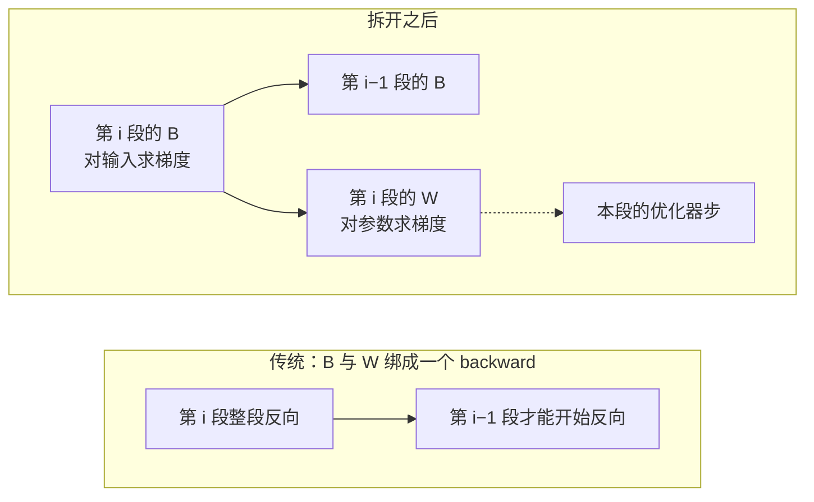
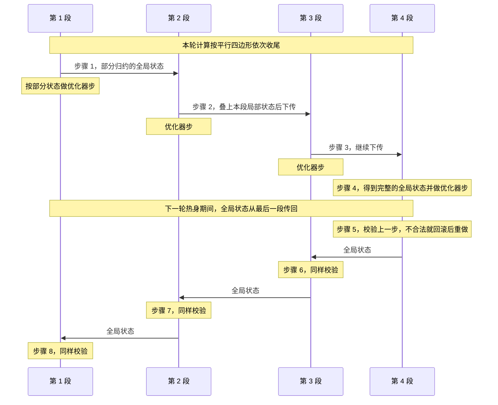

# Zero Bubble：气泡不是同步训练的宿命，把反向拆开就能填平

<!-- release-date: 2023-10-13 -->

> 本文依据 Sea AI Lab 的 **Zero Bubble Pipeline Parallelism**，arXiv:2401.10241v1（2023-11-30 提交），共 19 页，作者 Penghui Qi、Xinyi Wan（并列一作）、Guangxing Huang、Min Lin。页码 `(PDF p. N)` 指这份 PDF 自身的页码。文中会区分三件事：**论文明确写了什么**、**我们怎么解释或验算它**、**哪些是外部资料**。

## 读前先把几个词说成人话

流水线并行、微批、气泡这三个基本概念，见 GPipe 一篇：按层把模型切成几段放到不同卡上，把一个 batch 切成微批依次灌进去，灌满与排空时卡在空等的时间就是气泡。本篇在这之上再加几个词：

- **stage（段）**：流水线里的一段，本文里一段对应一张 GPU。段数记作 $p$，微批数记作 $m$。
- **同步训练语义（synchronous training semantics）**：这一步所有段用的都是上一步更新完的同一版权重。异步流水线可以不要气泡，但各卡看到的权重版本会分叉。
- **1F1B（one-forward-one-backward）**：灌满之后，每张卡交替做一次前向、一次反向。和 GPipe 相比气泡差不多大，好处是激活能更早释放、峰值显存更低（PDF p. 2）。
- **交错 1F1B（1F1B interleaved，下文记作 1F1B-I）**：每张卡拿多块不相邻的层，气泡更小，代价是更多通信和更高峰值显存（PDF p. 2）。
- **F / B / W**：论文把一层的计算拆成三块。**F** 是前向；**B** 是对输入求梯度，要尽快传给上一段；**W** 是对参数求梯度，只服务本段的优化器（PDF p. 2）。
- **$M_B$、$M_W$**：一次 B、一次 W 需要存着的激活显存。**$T_F$、$T_B$、$T_W$、$T_{\mathrm{comm}}$**：一次 F、B、W 的耗时，以及段间传一次激活或梯度的耗时（PDF p. 4–5）。
- **后验证（post-validation）与原地回滚（in-place rollback）**：优化器步先按「部分归约」的全局状态迈出去，下一轮再核对；不合法就把优化器步代数地倒回去重做（PDF p. 6、p. 16）。

## 一句话先说清

同步流水线里，气泡长期被当成不可避免的税。异步方案能免税，但要放弃「所有卡用同一版权重」。

这篇论文的判断是：税不是物理定律，是调度粒度太粗。它做了四件事（PDF p. 1、p. 3）：

1. 把反向拆成 B 和 W，W 离开关键路径，拿去填气泡；
2. 在「三段耗时相等」的理想假设下手搓两份日程：ZB-H1 与 1F1B 同显存、气泡降到三分之一；ZB-H2 多占显存、气泡为零；
3. 丢掉理想假设，按真实耗时和显存上限自动搜日程（ZB-1p、ZB-2p）；
4. 用后验证绕开优化器步前的跨段同步，否则平行四边形会被一刀切开，零气泡只是纸面形状。

第 6 节再加一份 **ZB-V** 日程，在与 1F1B 相同的激活显存下把气泡压到很低。摘要的两个数字是：相近显存下吞吐最多比 1F1B 高 23%，放松显存最多高 31%（PDF p. 1）。

它明确不做的事也先说清：不探索 DP、TP、PP 的混合策略，只把流水线这一维换成更好的日程；方法与 DP、TP、ZeRO 正交（PDF p. 3）。

### 一条阅读路线

1. **p. 2 的图 1 与正文**：为什么 B 和 W 能拆，为什么绑在一起对流水线有害。
2. **p. 3 的图 2、图 3，p. 4–5 的表 1、表 2**：三份日程的逐格对比。下文的第一张图就是它们的重画。
3. **p. 5 的 §3.1 与 p. 6 的 §4**：启发式搜索，以及优化器步的后验证。
4. **p. 7–8 的表 4、表 5**：吞吐、显存与理论气泡率。
5. **p. 9–11 的图 8 与表 6–8**：ZB-V。
6. **附录 B、D、E**：显存与气泡的拐点、真实的三段耗时、后验证值多少。

## 主要矛盾：同步流水线为什么总在空转

大模型一张卡放不下，就要上模型并行：张量并行（TP）把一层里的矩阵乘切到多卡，流水线并行（PP）把整网切成多段（PDF p. 1）。节点内有 NVLink 时，DP、TP、ZeRO 的混合就够用；跨服务器、尤其到几千张卡时，多项工作表明 PP 更适合吃跨机连接（PDF p. 1）。所以这篇只打磨 PP。

PP 的效率几乎全看气泡。论文把已有修法分成三路（PDF p. 1–2）：

- **GPipe** 靠增加同时在管里的微批去摊薄气泡，峰值显存跟着涨；它用重计算压显存，转引 Fan 等人的估计，计算开销约 20%。
- **异步 PP**（PipeDream、PipeMare）理论上没有气泡，代价是放弃精确的优化语义。
- **同步 1F1B** 更早调度反向、更早释放显存；同样多微批下气泡比例与 GPipe 相近，优势在峰值显存。1F1B-I 用更多通信和显存再换小一点气泡。

同步语义下，剩下的气泡仍是 PP 最大的问题（PDF p. 2）。作者要的是第三条路：语义不动，空转接近零。

## 关键一招：反向其实是两件依赖不同的事

传统框架把网络看成一层层堆起来的对象，每层只暴露前向和反向两个函数（PDF p. 2）。前向把输入 $x$ 经参数化映射 $f(x,W)$ 变成输出 $y$。反向其实是两笔账：

$$
\nabla_x f(x,W)^{\top}\frac{\mathrm{d}\ell}{\mathrm{d}y}
\qquad\text{和}\qquad
\nabla_W f(x,W)^{\top}\frac{\mathrm{d}\ell}{\mathrm{d}y}
$$

左边对输入求梯度，就是 B；右边对参数求梯度，就是 W（PDF p. 2）。图 1 用一层 MLP 画出来：B 一路用 $W^{\top}$ 把梯度传回输入，W 用输入与梯度的外积得到 $\nabla_W L$，两者共享中间梯度 $\nabla_z L$（PDF p. 2）。

框架把 B 和 W 打包成一个 backward，对数据并行恰好合适：第 $i$ 层权重梯度的通信，可以和第 $i-1$ 层的反向重叠。对流水线，这却凭空拉长了依赖链：**第 $i-1$ 层的 B 要等第 $i$ 层的 W 做完**（PDF p. 2），而上游段根本不需要这份 W。

这张图按 PDF p. 2 的正文与图 1 重画，是依赖示意。虚线表示 W 不再挡住上游段，只挡住本卡什么时候能更新权重。

拆开之后，调度约束只剩两条（PDF p. 3）：同一微批的 F 与 B 跨段仍须按顺序；W 只要排在同一段、同一微批的 B 之后，放在哪里都行。

**三段的相对耗时。** 只数矩阵乘时，前向里的每一次矩阵乘，反向里都对应两次同等 FLOPs 的矩阵乘，一次归 B、一次归 W（PDF p. 4）。在 GPT-3 式设定下（前馈中间维 $4h$，头维 $h/a$），每层的近似账是（PDF p. 4 表 1）：

| 块 | FLOPs | 需要存着的激活 |
|---|---|---|
| F | $sbh(24h+4s)$ | 0 |
| B | $sbh(24h+8s)$ | $sb(34h+5as)$ |
| W | $sbh(24h)$ | $32sbh$ |

$s$ 是序列长度，$b$ 是微批大小，$h$ 是隐藏维，$a$ 是头数。由此得到两条后文反复用的关系（PDF p. 4）：

$$
T_W < T_F < T_B,\qquad T_B + T_W = 2T_F
$$

B 做完会释放一部分不再需要的激活，但要给 W 留下额外的梯度，所以 W 需要的显存小于 B（PDF p. 4）。

**我们如何解释它。** 自动微分把两次矩阵乘收进一个 API，调度器就看不见那次「可以挪走的矩阵乘」。粒度选对了，搜索空间才用得上。

## 手搓两份日程：一份保显存，一份把梯形拉成平行四边形

上图是原文图 2（1F1B）与图 3（ZB-H1、ZB-H2）的逐格重画，前提是 $T_F=T_B=T_W$，这是 GPipe 与 Megatron-LM 论文里也用过的理想化（PDF p. 3）。图上的格子数已经讲清了三份日程的差别，这里只补图上读不出的东西。

**1F1B 的三个阶段**（PDF p. 3）：热身期各段做数量不等的前向，每段通常比下一段多做一个；稳态交替一前一反；收尾做完在飞微批的反向，然后四卡一起做优化器步。

**ZB-H1**（PDF p. 4）大体跟着 1F1B 走，但按热身微批数调整 W 的起点，让各卡在飞的微批数相同。B 在所有卡上都比 1F1B 更早开始，尾巴上的空档交给晚到的 W。因为 W 的显存比 B 小，峰值仍落在第一张卡，与 1F1B 相同。

**ZB-H2**（PDF p. 4）在允许比 1F1B 多占显存、且微批足够多时，热身期多塞 F，填掉第一个 B 之前的空洞；再把尾巴上的 W 重排，布局从梯形变成平行四边形，管里的气泡全部消掉。论文在这里特意点了一句：**优化器步之间的同步在这里被拿掉了**，怎么安全地拿掉放在第 4 节（PDF p. 4）。图上 ZB-H2 四张卡的优化器步错开排列，就是这个意思。

不假设三段等长时，表 2 给出一般公式（PDF p. 5）：

| 日程 | 气泡大小 | 峰值激活显存 |
|---|---|---|
| 1F1B | $(p-1)(T_F+T_B+T_W)$ | $pM_B$ |
| ZB-H1 | $(p-1)(T_F+T_B-T_W)$ | $pM_B$ |
| ZB-H2 | $(p-1)(T_F+T_B-2T_W)$ | $(2p-1)M_B$ |

第 $i$ 张卡的激活，ZB-H1 是 $(p-i+1)M_B+(i-1)M_W$，ZB-H2 是 $(2p-2i+1)M_B+(2i-2)M_W$；因为 $M_W<M_B$，峰值都在第一张卡（PDF p. 4）。

**我们的验算。** 三段等长时，ZB-H1 的气泡 $(p-1)T$ 恰是 1F1B 的 $3(p-1)T$ 的三分之一，ZB-H2 为 0，和图上的 9、3、0 格一致。三段不等长时，把 $T_B+T_W=2T_F$ 代进 ZB-H2 的公式，剩余气泡是 $3(p-1)(T_F-T_W)$：**W 比 F 越短，纸面上的「零气泡」离零越远。** 这就是手搓图不能直接上生产、必须进入自动调度的原因。

## 自动调度：按真实耗时和显存上限搜日程

手搓日程在实践中有三处对不上（PDF p. 4–5）：三段耗时不等时会多出气泡；忽略了段间通信时间 $T_{\mathrm{comm}}$；显存不够撑起零气泡所需的在飞微批时，要在气泡与显存之间取舍。

于是输入变成：段数 $p$、微批数 $m$、激活显存上限 $M_{\mathrm{limit}}$，以及估出的 $T_F$、$T_B$、$T_W$、$T_{\mathrm{comm}}$（PDF p. 5）。论文给了两套求解器，可以串起来用：启发式在 $m$ 足够大时给出最优或接近最优的解；也可以写成整数线性规划（ILP），规模不大时交给现成求解器，并用启发式解做初值（PDF p. 5）。

启发式按时间往前填（PDF p. 5）：

1. **热身**：显存上限之内尽量多排 F，压缩第一个 B 之前的空洞。没顶到上限时，第一个 B 前可能还剩一条小于 $T_F$ 的缝，再塞一个 F 又可能推迟 B；塞不塞由一个二元超参决定。
2. **稳态**：一个 F、一个 B 交替排。空隙大于 $T_W$ 就插一个 W；空隙小于 $T_W$、但放任不管会让「所有段累计气泡的最大值」变大时，也插 W；顶到显存上限时插 W 回收显存。典型稳态是 **1F-1B-1W**。
3. **跨段约束**：F 用完之前，第 $i$ 段任何时刻都至少比第 $i+1$ 段多排一个 F；多出不止一个时，另一个二元超参决定是否在不增加气泡的前提下跳过一个 F。两个超参网格搜索。
4. **收尾**：F 与 B 用完后，剩下的 W 依次排完。

ILP 的写法在附录 G（PDF p. 17）：每一块计算用（段、微批、F/B/W）三元组索引，决策变量是同一段上两块计算谁先谁后；目标是让最慢那一段从第一个 F 到最后一个 W 的时间最短；约束是相邻段上同一微批的 F 顺着走、B 逆着走，以及任一时刻的激活不超过 $M_{\mathrm{limit}}$。论文没有报告求解时间，也没有说主实验里启发式与 ILP 各用了多少。

实验用的两个自动日程，就是这套启发式配不同的显存上限（PDF p. 6）：

- **ZB-1p**：$M_{\mathrm{limit}}=pM_B$，理论峰值与 1F1B 相同；
- **ZB-2p**：$M_{\mathrm{limit}}=2pM_B$，经验上达到接近零气泡所需的最少显存。

名字里的 1p、2p 是激活显存按 $pM_B$ 的倍数来卡，不是参数份数。

### 显存与气泡的拐点

图 7 扫 $M_{\mathrm{limit}}$ 从 $1.0pM_B$ 到 $3.0pM_B$（PDF p. 9）：气泡率起初随显存近乎线性下降，然后在一个平台上停住。理论平台大约在

$$
\frac{(p-1)(T_B+2T_{\mathrm{comm}})+pT_F}{T_F}\,M_B
$$

经验上，$T_F\approx T_B$ 且通信较小时，$2pM_B$ 是接近零气泡的好阈值；过了拐点再加显存虽然理论上能到真零，一般得不偿失（PDF p. 9）。

附录 B 解释了拐点从哪来（PDF p. 15）。第一个微批必须从第 1 段走到第 $p$ 段再走回来，最少要 $p(T_F+T_B)+2(p-1)T_{\mathrm{comm}}$，这条依赖链压不短。设第一段在第一个 B 之前排了 $k$ 个 F、留下的缝为 $\beta$，则

$$
M_{\mathrm{limit}}\ge kM_B,\qquad
\beta \ge (p-1)(T_B+2T_{\mathrm{comm}})+(p-k)T_F
$$

$k$ 每加 1，显存下限多一份 $M_B$，缝线性变短；$k$ 到上面那个分数的下取整时，缝已小于 $T_F$。再往下，每一段都还剩一条小于 $T_F$ 的细缝，要彻底填平得在第一段再多排 $p-1$ 个 F，激活至少到 $\lfloor[(p-1)(T_B+2T_{\mathrm{comm}})+(2p-1)T_F]/T_F\rfloor M_B$（PDF p. 15）。图 11 画的就是 1.5B、32 微批时的这种真零日程（PDF p. 15）。

## 真正的零气泡，还要处理优化器步

把 F/B/W 排成平行四边形还不够。多数实现里，优化器步之前要跨所有段同步一次，理由是数值稳健：梯度裁剪要全局梯度范数，混合精度要全局检查 NaN 与 INF，两者都是一次跨段的 all-reduce（PDF p. 5）。一旦同步，平行四边形就被齐齐切一刀，零气泡不可能成立（PDF p. 5）。

论文的观察是：这些全局状态大多数时候不起作用。稳健的训练里 NaN、INF 很少触发，梯度被裁剪的比例也低，不值得每步都为它同步一次（PDF p. 6）。于是把「先同步、再更新」换成 **更新后验证**：

这张时序图按 PDF p. 6 的正文与图 4 重画。原图里 1–4 号橙块是逐段下传的部分归约，5–8 号橙块是全局值逐段传回，每个 5–8 号块后面紧跟一个红色窄块，表示校验失败时的回滚。它是机制示意，不是实测时长。

具体规则（PDF p. 6）：每段在优化器步之前，从上一段收到部分归约的全局状态，叠上本段的局部状态再传下去；本段的优化器步由这份部分状态控制，比如看到 NaN、或部分归约的梯度范数已经超过裁剪阈值，就跳过这次更新；下一轮热身时，完整的全局状态从最后一段传回每一段，各段据此判断上一步是否合法；需要修正梯度就回滚，再按完整全局状态重做优化器步。

**我们如何解释它。** 部分范数是累加途中的中间量，不会大于最终范数。所以「部分范数已超阈值就跳过」是保守的；真正要靠回滚兜底的，是「部分看起来没事、全局其实该裁」的那一步。论文依赖的经验前提是：这种需要改写的迭代很少。

### 原地回滚：不存历史权重

常规回滚要存一份历史参数与优化器状态，既费显存又要大量拷贝（PDF p. 16）。论文观察到多数优化器的一步在算术上可逆，于是原地回滚：平时不占额外显存，只在真的回滚时多算一次。算法 1 给出 AdamW 的一对互逆操作（PDF p. 16）。正向一步用当前梯度 $g$：

$$
\begin{aligned}
t &\leftarrow t+1,\quad
m \leftarrow \beta_1 m+(1-\beta_1)g,\quad
v \leftarrow \beta_2 v+(1-\beta_2)g^{2},\\
m' &= m/(1-\beta_1^{t}),\quad
v' = v/(1-\beta_2^{t}),\\
\theta &\leftarrow \theta-\gamma\lambda\theta-\gamma m'/(\sqrt{v'}+\epsilon)
\end{aligned}
$$

回滚把它倒过来：先用当前的 $t$ 算出 $m'$、$v'$，把参数恢复为 $\theta\leftarrow(\theta+\gamma m'/(\sqrt{v'}+\epsilon))/(1-\gamma\lambda)$，再把两个矩恢复为 $m\leftarrow(m-(1-\beta_1)g)/\beta_1$、$v\leftarrow(v-(1-\beta_2)g^2)/\beta_2$，最后 $t\leftarrow t-1$（PDF p. 16）。论文只给了 AdamW；「多数优化器可逆」是作者观察，没有列清单。

### 后验证值多少

附录 E 把 ZB-2p 的后验证与「优化器步前做 all-reduce 同步」对着测（PDF p. 17）：

| 模型 | $p$ | $m$ | 后验证 | 同步 | 同步版少了 |
|---|---:|---:|---:|---:|---:|
| 1.5B | 8 | 24 | 14.5 | 13.11 | 9.6% |
| 6.2B | 8 | 24 | 4.32 | 4.00 | 7.4% |
| 14.6B | 16 | 48 | 1.81 | 1.68 | 7.2% |
| 28.3B | 32 | 96 | 0.99 | 0.91 | 8.1% |

单位是每 GPU 每秒样本数；最后一列是我们算的，论文概括为约 8%（PDF p. 17）。附录正文把对照表误写成「Table 7」，实际是表 10。

**我们如何解释它。** 这 8% 量的是「平行四边形被优化器那一刀切开」的代价，不是拆 B/W 本身的收益。只改日程、保留每步同步，零气泡会退回「几乎为零」。论文没有报告回滚实际触发的频率与每次回滚的耗时。

## 实验：Megatron-LM、A100、四档 GPT-3 式模型

实现基于开源的 Megatron-LM，模型规格见表 3（PDF p. 6）：

| 模型 | 层数 | 注意力头 | 隐藏维 | 序列长度 | 流水线段数（GPU） | 微批大小 | 微批个数 |
|---|---:|---:|---:|---:|---:|---:|---|
| 1.5B | 22 | 24 | 2304 | 1024 | 8 | 6 | 24 / 32 / 64 |
| 6.2B | 30 | 32 | 4096 | 1024 | 8 | 3 | 24 / 32 / 64 |
| 14.6B | 46 | 40 | 5120 | 1024 | 16 | 1 | 48 / 64 / 128 |
| 28.3B | 62 | 48 | 6144 | 1024 | 32 | 1 | 96 / 128 / 256 |

流程是先跑若干迭代做 profile，量出四段耗时，再喂给自动调度（PDF p. 6）。首尾两段各少放一层 Transformer，用来补偿 embedding 查表与 loss 的计算，免得它们成为瓶颈、把气泡传给别的段（PDF p. 6）。对照是 Megatron-LM 自带的 1F1B 与 1F1B-I；1F1B-I 一律用最多的块数，每层 Transformer 就是一块，好让它的气泡尽量小（PDF p. 7）。

硬件是最多 32 张 A100 SXM 80G，分布在 4 个节点，节点间 RoCE RDMA；记录的是若干热身迭代之后的单步时间（PDF p. 7）。

**正确性不靠训到收敛。** Megatron-LM 可复现：固定随机种子初始化，逐步记录 ZB-1p、ZB-2p 与 1F1B 的 loss，确认 bit 级相同（PDF p. 7）。没有下游分数，也没有长训曲线。

### 主结果：ZB-2p 贴着上界，ZB-1p 在跨节点时更占优

图 5 是柱状图，表 4 给出精确值（PDF p. 7）。吞吐单位是每 GPU 每秒样本数，显存单位 GB。

| 模型（GPU） | 微批数 | ZB-2p | ZB-1p | 1F1B | 1F1B-I |
|---|---:|---:|---:|---:|---:|
| 1.5B（8） | 24 / 32 / 64 | 14.5 / 14.8 / 14.9 | 12.9 / 13.4 / 14.2 | 11.8 / 12.5 / 13.6 | 13.1 / 13.4 / 13.9 |
| 6.2B（8） | 24 / 32 / 64 | 4.32 / 4.35 / 4.39 | 3.88 / 4.00 / 4.20 | 3.50 / 3.70 / 4.03 | 4.01 / 4.08 / 4.19 |
| 14.6B（16） | 48 / 64 / 128 | 1.81 / 1.83 / 1.85 | 1.61 / 1.67 / 1.76 | 1.40 / 1.49 / 1.64 | 1.54 / 1.59 / 1.66 |
| 28.3B（32） | 96 / 128 / 256 | 0.99 / 1.00 / 1.00 | 0.87 / 0.90 / 0.96 | 0.76 / 0.80 / 0.88 | 0.82 / 0.85 / 0.90 |
| 显存 GB | — | 59 / 70 / 51 / 74 | 32 / 42 / 33 / 44 | 30 / 39 / 32 / 43 | 40 / 48 / 39 / 58 |

显存一行按 1.5B、6.2B、14.6B、28.3B 的顺序排列，同一模型不同微批数显存相同（PDF p. 7）。

论文的读法（PDF p. 7–8）：

- **ZB-2p 在所有设置里最快，而且微批少时也不掉速**；1F1B、1F1B-I、ZB-1p 的吞吐都明显随微批数上升。原因在下面的表 5：ZB-2p 的气泡率已接近零，吞吐贴着上界。上界的估法是把 1F1B 的吞吐乘以 $1/(1-\text{1F1B 的气泡率})$，是用理论气泡率做的粗算。
- **ZB-2p 的代价是显存**：59 对 30、70 对 39、51 对 32、74 对 43，是 1F1B 的约 1.6–2.0 倍（比值是我们算的）。附录 F 在同一显存下比了一次，见后文。
- **ZB-1p 的显存与 1F1B 几乎相同**。单机 8 卡时它与 1F1B-I 差不多；多节点、带宽更紧时它明显超过 1F1B-I，因为它减气泡却不增加通信。

**摘要里的两个数怎么来。** 按表 4 算，ZB-2p 对 1F1B 最高约 +30%（28.3B、96 微批，$0.99/0.76$），ZB-1p 对 1F1B 最高约 +15%（14.6B、48 微批，$1.61/1.40$）。摘要的 23% 对得上第 6 节表 6 里 ZB-V 对 1F1B 的最大比值（28.3B、$m=96$，$1.01/0.82\approx 1.23$）；31% 在各表里找不到恰好对应的一格，表 4 最接近的是 30.3%。**我们的推断**是摘要按未取整的原始数据算，或另有取整口径。

### 自动调度比手搓更贴近真实耗时

表 5 的气泡率不是墙钟测出来的，而是用 profile 得到的四段耗时做理论计算（PDF p. 8）：

$$
\text{气泡率}=\frac{\mathrm{cost}-m(T_F+T_B+T_W)}{\mathrm{cost}}
$$

$\mathrm{cost}$ 是所有段里最长的执行时间；$m(T_F+T_B+T_W)$ 是通信全部被计算盖住、管里没有空洞时的最优时间。

| 模型 | $p$ | $m$ | 1F1B | 1F1B-I | ZB-H1 | ZB-H2 | ZB-1p | ZB-2p |
|---|---:|---:|---:|---:|---:|---:|---:|---:|
| 1.5B | 8 | 24 | 0.2431 | 0.1055 | 0.1585 | 0.1083 | 0.1585 | 0.0433 |
| | | 32 | 0.1985 | 0.0818 | 0.1242 | 0.0837 | 0.1242 | 0.0039 |
| | | 64 | 0.1240 | 0.0443 | 0.0674 | 0.0444 | 0.0674 | 0.0026 |
| 6.2B | 8 | 24 | 0.2347 | 0.0808 | 0.1323 | 0.0698 | 0.1323 | 0.0029 |
| | | 32 | 0.1898 | 0.0628 | 0.1045 | 0.0559 | 0.1045 | 0.0022 |
| | | 64 | 0.1091 | 0.0320 | 0.0554 | 0.0294 | 0.0554 | 0.0010 |
| 14.6B | 16 | 48 | 0.2552 | 0.1104 | 0.1397 | 0.0672 | 0.1397 | 0.0066 |
| | | 64 | 0.2082 | 0.0852 | 0.1088 | 0.0516 | 0.1088 | 0.0054 |
| | | 128 | 0.1251 | 0.0445 | 0.0576 | 0.0266 | 0.0576 | 0.0028 |
| 28.3B | 32 | 96 | 0.2646 | 0.1493 | 0.1421 | 0.0641 | 0.1421 | 0.0038 |
| | | 128 | 0.2168 | 0.1164 | 0.1106 | 0.0490 | 0.1106 | 0.0029 |
| | | 256 | 0.1352 | 0.0624 | 0.0594 | 0.0257 | 0.0594 | 0.0018 |

三件事（PDF p. 8）：

- 多数设置里 ZB-2p 的气泡率低于 1%，1.5B、24 微批是例外（4.33%）。
- ZB-H2 始终不如 ZB-2p：自动调度用了真实耗时，手搓还停在理想假设里。
- ZB-1p 相对 ZB-H1 没有这层优势。表里两列 **逐格相同**，论文的假设是显存上限成了主导因素，把搜索空间卡死了。

图 6 把 16 卡上 ZB-2p 的生成日程与实际 profile 上下叠在一起（PDF p. 9）：生成日程几乎没有空洞，实测多出一些碎缝，但整体对齐。论文把它当作「这确实是零气泡日程」的直接视觉证据。

### 真实的三段耗时离「相等」有多远

附录 D 的表 9 记录了 ZB-2p 实验里 profile 出的四段耗时，供上面算气泡率用（PDF p. 16）。PDF 没有写单位。

| 模型 | $p$ | $m$ | $T_F$ | $T_B$ | $T_W$ | $T_{\mathrm{comm}}$ |
|---|---:|---:|---:|---:|---:|---:|
| 1.5B | 8 | 24 | 18.522 | 18.086 | 9.337 | 0.601 |
| 6.2B | 8 | 24 | 29.718 | 29.444 | 19.927 | 0.527 |
| 14.6B | 16 | 48 | 11.347 | 11.248 | 8.132 | 0.377 |
| 28.3B | 32 | 96 | 10.419 | 10.207 | 7.715 | 0.408 |

同一模型换微批数，四个值几乎不动（完整 12 行见原表）。按表算，$T_W$ 在 1.5B 上约是 $T_F$ 的一半，在 28.3B 上约 74%；$T_B$ 始终与 $T_F$ 接近；通信比计算小一个数量级。这正是 1.5B 的 ZB-H2 填不干净（24 微批时 0.1083）、而 ZB-2p 能降到 0.0433 的原因：手搓图低估了「W 太短」留下的缝。

### 同一显存下比：半个微批的 ZB-2p 仍然更快

ZB-2p 多占显存，公平起见，附录 F 把 1F1B 与 ZB-1p 的微批大小加倍，让三者显存相当再比（PDF p. 17–18）。每档取最少微批那一行：

| 模型 | $p$ | $m$ | 日程 | 微批大小 | 吞吐 | 显存 GB |
|---|---:|---:|---|---:|---:|---:|
| 1.5B | 8 | 24 | 1F1B / ZB-1p / ZB-2p | 12 / 12 / 6 | 12.0 / 13.0 / 14.5 | 57 / 61 / 59 |
| 6.2B | 8 | 24 | 1F1B / ZB-1p / ZB-2p | 6 / 6 / 3 | 3.56 / 3.95 / 4.32 | 66 / 71 / 70 |
| 14.6B | 16 | 48 | 1F1B / ZB-1p / ZB-2p | 2 / 2 / 1 | 1.53 / 1.73 / 1.81 | 50 / 51 / 51 |
| 28.3B | 32 | 96 | 1F1B / ZB-1p / ZB-2p | 2 / 2 / 1 | 0.81 / 0.93 / 0.99 | 72 / 74 / 74 |

用一半的微批，ZB-2p 仍快过加倍后的 1F1B（PDF p. 17）。作者的解释：更大的 batch 能提高 GPU 利用率，但大模型的隐藏维已足以喂饱设备，这条收益变弱，所以他们更倾向 ZB-2p 而不是加大 1F1B 的 batch。例外也写了：设备没喂饱、$m/p$ 又较大时，加倍微批的 ZB-1p 可能略胜 ZB-2p，比如 14.6B、128 微批（1.89 对 1.85）与 28.3B、256 微批（1.02 对 1.00）（PDF p. 17–18）。表 11 里 14.6B 与 28.3B 的中间一档微批数都印成了 32，与表 3 的 64、128 对不上，疑为排版错误。

### 微批比段数还少时，拆开仍值 20%–30%

$m\le p$ 时气泡天生很大，但拆 B/W 仍能把吞吐抬高约 20%–30%，显存与 1F1B 相近；这种情形下 ZB-1p 与 ZB-2p 本质上是同一份日程（PDF p. 18）。忽略通信、假设 $m\le p$ 且 $T_W<T_B$ 的粗算是：1F1B 一次迭代 $(m+p-1)(T_F+T_B+T_W)$，ZB 一次迭代 $(m+p-1)(T_F+T_B)+T_W$（PDF p. 18）。

| 模型 | $p$ | $m$ | 1F1B 吞吐 | ZB-2p 吞吐 | 提升 | 显存 GB（1F1B / ZB-2p） |
|---|---:|---:|---:|---:|---:|---|
| 1.5B | 8 | 2 / 4 / 8 | 3.56 / 5.74 / 8.26 | 4.25 / 6.92 / 9.90 | 19% / 21% / 20% | 11/12、18/19、29/34 |
| 6.2B | 8 | 2 / 4 / 8 | 1.04 / 1.69 / 2.45 | 1.33 / 2.16 / 3.07 | 28% / 28% / 25% | 21/21、28/29、39/44 |
| 14.6B | 16 | 4 / 8 / 16 | 0.39 / 0.65 / 0.95 | 0.52 / 0.85 / 1.25 | 33% / 31% / 32% | 19/20、24/24、32/33 |

吞吐与显存取自表 12（PDF p. 19），「提升」一列是我们算的。14.6B 三档略高于正文说的 20%–30%。

## ZB-V：与 1F1B 同显存，也把空转压下去

ZB-2p 接近零气泡，但激活显存约要翻倍，实际不好用（PDF p. 10）。ZB-V 的目标是在与 1F1B 相同的显存约束下，把空转压到最小。

**放置。** 受交错 1F1B 启发，但分法相反（PDF p. 10）：整网均匀切成恰好 $2p$ 块，每张卡拿两块。交错 1F1B 是循环分配；ZB-V 从第一张卡分到最后一张，再倒着分回第一张，前向和反向的依赖都成 V 字。上图左侧就是论文举的例子：16 层、4 段时，设备 1 拿第 1–2 层与第 15–16 层，设备 2 拿第 3–4 层与第 13–14 层，以此类推。

**为什么是 V。** 1F1B 与交错 1F1B 里，前向从第一张卡出发，反向从最后一张卡出发；ZB-V 让同一微批的前向和反向都从同一张卡起步（PDF p. 10）。好处有两条：

1. 第一张卡不必等反向从最后一张卡传回来，能立刻开始 B，激活清得更快。三段等长时，ZB-V 用 $pM_B$ 的峰值激活就能零气泡，与 1F1B 的峰值相同，几乎是 ZB-H2 的 $(2p-1)M_B$ 的一半。
2. 每块的计算量与显存都一样，所以峰值显存在各卡上天然均衡。

**三个阶段**（PDF p. 10）：热身时第 $i$ 张卡共做 $2p-1$ 个 F，第一块 $2p-i$ 个、第二块 $i-1$ 个；稳态重复 1F-1B-1W，按块成组，第 $i$ 张卡先为第二块做 $p-i$ 组，再在两块之间交替，直到 F 用完；收尾做剩下的 B 和 W，B 优先、W 填缝。自动搜索沿用第 3.1 节的启发式；因为热身与稳态里各卡显存已经均衡，可以在显存约束内把所有 W 往右推，用多出来的 W 填尾巴上的缝，那些缝主要来自 $T_W$ 比 $T_F$、$T_B$ 短（PDF p. 10）。

### 同显存对照：ZB-V 稳赢 1F1B 与 ZB-1p

表 6 把四种日程放在同一显存量级上比（PDF p. 11）。为了公平，ZB-2p 把微批大小减半、微批数加倍，全局 batch 不变，记作 ZB-2p\*。

| 设置 | 6.2B，16 卡，$b=6$ | | | 14.6B，24 卡，$b=2$ | | | 28.3B，32 卡，$b=2$ | | |
|---|---:|---:|---:|---:|---:|---:|---:|---:|---:|
| $m$ | 48 | 64 | 128 | 72 | 96 | 192 | 96 | 128 | 256 |
| ZB-V 吞吐 | 4.15 | 4.21 | 4.35 | 1.85 | 1.88 | 1.93 | 1.01 | 1.02 | 1.06 |
| ZB-2p\* 吞吐 | 4.36 | 4.37 | 4.45 | 1.84 | 1.84 | 1.85 | 1.00 | 1.00 | 1.01 |
| ZB-1p 吞吐 | 3.87 | 4.00 | 4.29 | 1.72 | 1.78 | 1.89 | 0.94 | 0.97 | 1.03 |
| 1F1B 吞吐 | 3.38 | 3.57 | 3.91 | 1.52 | 1.61 | 1.76 | 0.82 | 0.87 | 0.95 |
| ZB-V 显存 GB | 64 | 64 | 64 | 45 | 45 | 45 | 71 | 71 | 71 |
| ZB-2p\* 显存 GB | 63 | 64 | 65 | 46 | 46 | 46 | 72 | 72 | 72 |
| ZB-1p 显存 GB | 62 | 62 | 62 | 46 | 46 | 46 | 73 | 73 | 73 |
| 1F1B 显存 GB | 61 | 61 | 61 | 44 | 44 | 44 | 69 | 69 | 69 |

ZB-V 在所有设置里都高于 1F1B 与 ZB-1p，与 ZB-2p\* 同一档（PDF p. 10）。ZB-2p\* 在 6.2B 上更快，在两个大模型上略慢。表 7 解释了为什么（PDF p. 11）：把微批大小加倍，14.6B 与 28.3B 还能多挖出约 8% 吞吐，6.2B 不到 3%，因为 6.2B 的微批本来就够大；ZB-2p\* 减半微批去换气泡，在 6.2B 上几乎不吃亏，在大模型上就吃亏。论文把权衡写成一句：更大的微批与更小的气泡之间有取舍，减气泡的收益更大时，牺牲微批大小是合理选择（PDF p. 11）。

表 7 有一处自相矛盾：28.3B 一栏 ZB-V 从 0.95 到 1.02、ZB-1p 从 0.90 到 0.97，印出的增幅却是 6.32% 与 5.56%；按表中数值应约为 7.4% 与 7.8%。其余各格的增幅与数值一致。

**摘要的 23%** 就落在这张表里：28.3B、$m=96$，ZB-V 对 1F1B 是 $1.01/0.82\approx 1.23$。同一张表里 ZB-2p\* 在 6.2B、$m=48$ 上对 1F1B 是 $4.36/3.38\approx 1.29$，比 23% 还高；论文没有把这一格写进摘要。

表 8 用 ZB-V 实验里的 profile 值算理论气泡率（PDF p. 11）。每档举最少微批那一行：

| 模型 | $p$ | $m$ | 1F1B | 1F1B-I | ZB-H1 | ZB-H2 | ZB-V |
|---|---:|---:|---:|---:|---:|---:|---:|
| 6.2B | 16 | 48 | 0.2668 | 0.1499 | 0.1536 | 0.0823 | 0.0697 |
| 14.6B | 24 | 72 | 0.2699 | 0.1519 | 0.1439 | 0.0628 | 0.0638 |
| 28.3B | 32 | 96 | 0.2676 | 0.1509 | 0.1429 | 0.0629 | 0.0593 |

ZB-V 明显低于 1F1B、1F1B-I、ZB-H1，与 ZB-H2 同一量级，但只要一半显存；1F1B、ZB-H1、ZB-V 显存相近，1F1B-I 与 ZB-H2 更高（PDF p. 11–12）。这里 ZB-H2 的气泡也不是 0，又一次说明三段等长的假设不成立。

图 9 把 ZB-V 与不用 V 字形的启发式（图例写作 ZB）对着扫显存上限（PDF p. 12）：形状仍是先线性下降、再到平台；显存上限低于 $2pM_B$ 时 ZB-V 明显更低。同样的显存预算，V 字形能换到更少的气泡。

## 附录 A：W 还能按参数重排，去盖数据并行的通信

同时开数据并行时，优化器步之前还要 all-reduce 梯度，这次通信通常很难和计算重叠（PDF p. 15）。日程尾巴上本来就堆着许多 W，而每个 W 又由若干对不同参数的独立梯度计算组成。把这些计算按参数聚在一起，同一个参数的梯度一算完就发 all-reduce，重叠才最充分；图 10 上下两行对比了「按 W 分组」与「按参数分组」两种排法（PDF p. 15）。这一条论文只给了机制示意，没有加速比。

## 结论里的一条可扩展性主张

第 7 节把贡献收成三句：拆开激活梯度与参数梯度；自动调度按显存预算最小化气泡；ZB-V 在三段等长时以 1F1B 的显存达到零气泡。另有一句常被略过：**通常大约 $3p$ 个微批就能达到最优效率**，多出来的微批可以划给数据并行，大模型因此更好扩（PDF p. 12）。

这句话没有单独实验。主实验里最少的微批数恰好都是 $3p$（24 对 8、48 对 16、96 对 32），ZB-2p 在这些格子里已贴着上界。它是作者从这些格子读出的观察，不是一次数据并行扩展实测。

## 论文写了什么、没写什么

- **没有训到收敛的质量对比。** 正确性靠同种子下与 1F1B 的 loss bit 级一致。
- **没有混合并行的网格搜索。** 作者明确只替换 PP 这一维（PDF p. 3）；数据并行重叠只在附录 A 给了机制。
- **后验证的触发率与回滚耗时没有报告**；8% 是「每步都同步」对「后验证」的吞吐差。
- **表 9 没有单位**；ILP 的求解开销没有报；主实验里启发式与 ILP 如何分工没有写。
- **ZB-V 的通信量没有定量。** V 字形让激活沿着各卡走下去再走回来，**我们推断** 段间传递次数多于单向的 1F1B，但论文没给数字。
- **重计算、CPU offload、与张量并行的细节交互** 不在这份 PDF 里。

## 论文之后

以下是外部资料，不是本文原件的内容，数字不得混进上文各表。

- **会议版是删节版。** 论文以 *Zero Bubble (Almost) Pipeline Parallelism* 为题发表于 ICLR 2024（[OpenReview](https://openreview.net/forum?id=tuzTN0eIO5)，[会议录 PDF](https://proceedings.iclr.cc/paper_files/paper/2024/file/d5a8e37f38a08c68162452dcba89ae9c-Paper-Conference.pdf)）。会议正式版 16 页，没有第 6 节 ZB-V，摘要写的是相近显存最多 +15%、放松显存最多 +30%；按上文表 4 算，恰好是 ZB-1p 与 ZB-2p 对 1F1B 的最大提升。
- **同一组作者的后续** *Pipeline Parallelism with Controllable Memory*（[arXiv:2405.15362](https://arxiv.org/abs/2405.15362)，NeurIPS 2024）把日程抽象成可重复的积木，用积木的寿命解释峰值激活，给出更省显存的 V 形日程家族。
- **DeepSeek-V3 的 DualPipe** 明确说「把反向拆成对输入的梯度与对权重的梯度」来自 ZeroBubble，又叠加从流水线两端同时喂微批、把 MoE 的 all-to-all 藏进配对的前向与反向。那是另一套日程，气泡公式与显存账见 DeepSeek-V3 一篇，代码在 [deepseek-ai/DualPipe](https://github.com/deepseek-ai/DualPipe)。
- **开源实现** 在 [sail-sg/zero-bubble-pipeline-parallelism](https://github.com/sail-sg/zero-bubble-pipeline-parallelism)，基于 Megatron-LM。仓库后来加入的功能属于论文之后的工程演化，本文不据此补写论文。

## 可迁移启发

1. **先按依赖切开，再谈日程。** 自动微分把「对输入」和「对参数」收成一个 backward，对 DP 友好、对 PP 有害。任何流水线优化先问：哪一段是下游的阻塞项，哪一段只服务本卡。能挪走的那段才是填气泡的材料。
2. **零气泡是显存换来的。** 热身多塞 F，第一个 B 才不必等，激活就得多留。$2pM_B$ 是「接近零」的经验甜点，真零还要再付 $p-1$ 份。显存只够 $pM_B$ 时，先用 ZB-1p 或 ZB-V 这一档。
3. **不要假设三段等长。** 1.5B 上 W 只有 F 的一半。先 profile 再搜日程；拿理想图当生产配置，会把剩余气泡低估成零。
4. **全局同步能单独吃掉一份加速。** 附录 E 的约 8% 与表 4 的 +15% 到 +30% 不是同一笔账。后验证的前提是裁剪与 NaN 很少触发；训练经常爆范数时，回滚会变成热路径，这条捷径就不成立。
5. **可逆的优化器步比存检查点便宜。** AdamW 一步可以代数地倒回去，回滚变成一次额外计算，而不是一份参数副本。优化器里有随机噪声或外部状态时，别假装能原地回滚。
6. **同显存比较要把微批大小和个数一起动。** 大模型上加大微批仍有约 8% 收益，与减气泡互相打架。先看隐藏维是否已喂饱 GPU，再决定牺牲哪一边。
7. **切层时把非 Transformer 的计算算进负载。** 首尾两段各少一层，是在补偿 embedding 与 loss。
8. **约 $3p$ 个微批就够时，多出来的给数据并行。** 这是作者观察，不是扩展实验；用来做容量规划前，要在自己的互联上复测。

## 关键词回看

- **F / B / W**：前向、对输入求梯度、对参数求梯度。B 在关键路径上，W 是可移动的填充物。
- **ZB-H1 / ZB-H2**：三段等长假设下的手搓日程，一份保 $pM_B$、气泡为 1F1B 的三分之一；一份用 $(2p-1)M_B$ 换零气泡。
- **ZB-1p / ZB-2p**：自动调度的两个显存档位，$pM_B$ 与 $2pM_B$。
- **ZB-V**：每卡两块、V 字依赖，前向与反向从同一张卡起步；1F1B 的显存，接近 ZB-H2 的气泡。
- **后验证 / 原地回滚**：零气泡在优化器步上的那一半；没有它，平行四边形只存在于计算块层面。
- **$M_{\mathrm{limit}}$ 与 $2pM_B$**：显存与气泡的交换曲线，过了拐点收益变薄。
- **约 $3p$ 个微批**：作者认为达到最优效率通常够用的微批数。

## 资料与阅读边界

- **本文依据**：[arXiv:2401.10241v1](https://arxiv.org/abs/2401.10241)，截至 2026-09 仍只有这一版。它比 ICLR 2024 会议正式版多出第 6 节 ZB-V，是这项工作最完整的一版，所以本文以它为准。
- **首发日**：`release-date` 取 2023-10-13。这项技术最早以 ICLR 2024 投稿的形式在 OpenReview 上公开，论坛记录的公开时间是 2023-10-13（UTC）；arXiv v1 提交于 2023-11-30，晚于前者。该工作没有对外可用的模型产品。
- **外部资料**：ICLR 2024 会议版、后续可控显存流水线论文、DeepSeek-V3 的 DualPipe 与开源仓库，均只出现在「论文之后」一节。
- **原文没有公开的**：表 9 的时间单位；ILP 求解开销；后验证回滚的触发率与耗时；ZB-V 的通信量；训到收敛的质量对比。
