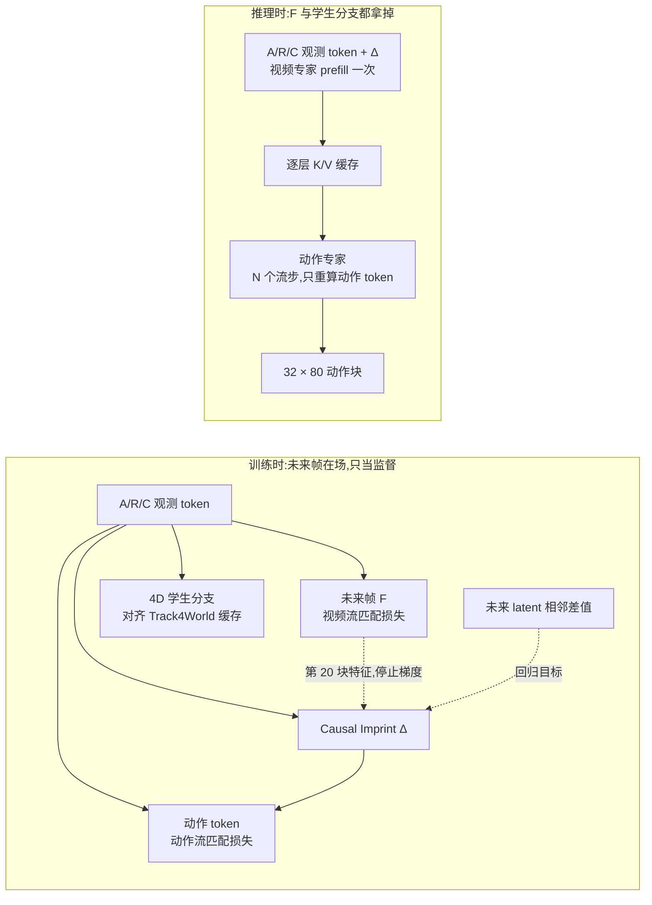
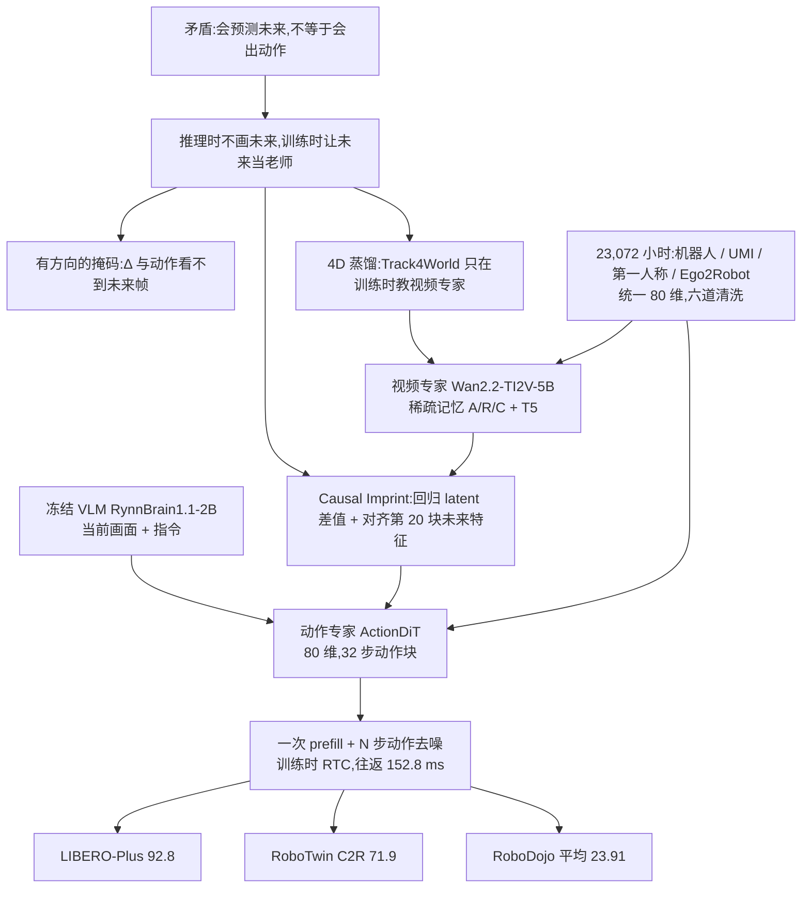

# InternW0-Δ：未来只当老师，不当输入

<!-- release-date: 2026-09-25 -->

> 本文依据本地 `papers/ShanghaiAILab/InternW0-Delta.pdf`，即 **InternW0-Δ: A World Action Model Bridging Predictive Dynamics and Actions with 20K+ Hours of Open Data**，arXiv:2609.31394v1，2026-09-25 提交，共 49 页，署名为上海人工智能实验室 Physical Intelligence Team。页码均指 PDF 的物理页码。文中会区分三件事：**报告明确写了什么**、**我们怎么解释它**、**哪些是外部资料或本文推算**。

## 读前先把几个词说成人话

这份报告和前作 InternW0 一样讲机器人「世界–动作模型」，但换了一条路。先把反复出现的词说清楚：

- **WAM（World Action Model，世界–动作模型）**：把「预测画面接下来怎么变」和「生成机器人动作」放进同一个模型联合学习。直觉是：大规模视频预训练学到的「世界怎么动」，应该能帮机器人决定怎么动（PDF p. 2）。
- **VLA（Vision-Language-Action，视觉–语言–动作模型）**：看图、读指令、直接出动作的策略模型，π0、π0.5 属于这一类。它不显式预测未来画面（PDF p. 3–4）。
- **MoT（Mixture-of-Transformers，混合 Transformer）**：每种模态有自己的一套参数，只在注意力里互相看。本文里是一个视频专家和一个动作专家（PDF p. 5）。
- **流匹配（flow matching）**：把干净样本和高斯噪声按比例混合，让网络学「从噪声走回样本的速度」。视频和动作都用它生成（PDF p. 10）。
- **动作块（action chunk）**：策略一次吐出的一段连续动作。本文是 32 步（PDF p. 12）。
- **prefill 与 K/V 缓存**：先把不变的上下文跑一遍，把每层注意力的 Key 和 Value 存下来；之后反复生成时只读缓存，不再重算这部分网络。
- **Causal Imprint（因果印记）**：本文的新名词。一组插在视频专家里的可学习 token，训练时用「未来画面发生了什么变化」来监督它，但它自己**看不到**未来（PDF p. 7）。名字取自电影《星际穿越》里信息跨时间留痕的设定（PDF p. 7 脚注）。
- **UMI（Universal Manipulation Interface）**：人手持一个带相机的夹爪去做任务、记录夹爪位姿的数据采集方式，采到的数据天然是「夹爪视角 + 夹爪动作」（PDF p. 12、p. 20）。
- **Ego2Robot**：把第一人称人手视频里的人手抹掉、换成渲染出来的机器人手臂，同时把人手轨迹换算成机器人能执行的关节轨迹（PDF p. 18–20）。
- **RTC（Real-Time Chunking，实时分块）**：机器人执行当前动作块的同时，后台已在算下一块；新块必须和「已经下发、来不及改」的那几步动作接得上（PDF p. 25、p. 28）。

## 一句话先说清

WAM 路线一直卡在一个矛盾上：**会预测未来，不等于会出动作**。视频模型能把接下来几秒的画面画得很像，但动作需要的是「哪些东西会动、朝哪动、和当前指令有什么关系」（PDF p. 2）。而如果在线控制时真的去画未来，控制节拍又会被视频生成拖慢。

上图裁自原文第 1 页总览图（PDF p. 1）。InternW0-Δ 的回答分三层：

1. **推理时完全不画未来**。视频专家只对「开头一帧、上一块之前一帧、当前一帧」做一次 prefill，动作专家读它的 K/V 缓存去噪出 32 步动作（PDF p. 11–12）。
2. **未来只在训练时出现，而且只当监督**。Causal Imprint token 被训练去预测未来视频 latent 的逐段变化，并和视频专家对未来帧的中间特征对齐；注意力掩码保证它和动作 token 都摸不到真实未来（PDF p. 7–10）。
3. **再补两路先验**：冻结的视觉语言模型给动作专家提供「这句指令在当前画面里指什么」，冻结的 4D 模型 Track4World 只在训练时把几何与运动知识蒸馏进视频专家（PDF p. 6–8）。

围绕模型，报告另一半篇幅是数据：把 15 个机器人数据集、1 个 UMI 数据集和 2 个第一人称数据集清洗、统一到 80 维状态–动作表示，总计 23,072 小时（PDF p. 1、p. 15、p. 20）。

如果只记一句：

> **未来画面不必在推理时生成出来，也能塑造策略。把它当成训练时的「老师信号」，让模型学会从现在的画面里读出「接下来会变什么」。**

## 相对 InternW0，变了什么

InternW0-Δ 的报告**没有引用** InternW0 那份技术报告，也没有自称它的升级版；它只在脚注里说自己对齐「InternW 系列」连接感知、物理预测与动作的目标，并引用了系列的世界模型定义与路线图一文（PDF p. 2、p. 41）。两者同出上海 AI 实验室 Physical Intelligence Team，名字一脉相承，但**架构路线几乎是反过来的**。下表是本文对照两份报告整理的，InternW0 一侧的内容见 InternW0 一篇：

| 维度 | InternW0 | InternW0-Δ |
|---|---|---|
| 推理时是否生成未来视频 | 生成，但放到后台慢速刷新 | **不生成**，只做一次视频侧 prefill（PDF p. 11–12） |
| 未来信息怎么进入动作 | 视频专家的 K/V 由 K/V 编辑器按当前画面改写后给动作专家 | Causal Imprint token 在训练时被未来监督，推理时直接读它（PDF p. 7–10） |
| 语言与场景语义 | 预计算文本嵌入，没有 VLM；当前画面由冻结 DINOv3 编码，用来改写视频 K/V | T5 给视频专家，冻结 VLM（RynnBrain1.1-2B）给动作专家（PDF p. 6–7、p. 22） |
| 时间上下文 | 首帧因果 + 块起点帧 | 稀疏记忆：开头帧 A、近期帧 R、当前帧 C（PDF p. 7） |
| 几何与运动先验 | 框架层提到 3D，实例没有 | Track4World 仅训练时蒸馏（PDF p. 8） |
| 动作与状态接口 | 37 维，两臂 + 底座 | **80 维**，加入灵巧手、躯干、升降、头部与预留槽（PDF p. 13） |
| 预训练数据 | 约 7,200 小时，含自采 EgoLab | 23,072 小时，**主要来自公开数据集**（PDF p. 2、p. 15、p. 20） |
| 骨干与规模 | 未公开 | 视频专家 Wan2.2-TI2V-5B，30 个 MoT 块，视频流 3,072 维、动作流 1,024 维（PDF p. 5、p. 27） |
| 预训练算力 | 未公开 | 256 张 A800，245K 步，约 14 天（PDF p. 22–23） |
| 力与触觉 | 后训练时接入并预测未来力 | 报告中没有力或触觉通道 |
| 「异步」指什么 | 视频慢、动作快两个节拍 | 动作块层面的训练时 RTC（PDF p. 25、p. 28） |
| 延迟口径 | 模型侧关键路径 60.73 ms | 控制器观测到的往返 152.8 ms（PDF p. 3、p. 29） |

最值得注意的是第一行。InternW0 的立场是「测试时需要想象未来，但不能挡在关键路径上」；InternW0-Δ 则明确站到 Fast-WAM 那一边：沿用「把未来视频监督从动作推理路径里拿掉」的分离，同时保留可训练的视频专家和视频生成监督（PDF p. 4）。它的新东西在于**怎样在不画未来的前提下，把未来的信息更有效地灌进动作专家**。

两份报告都做了 RoboTwin 2.0 的 Clean2Random 设定。InternW0 报的是干净 83.20、随机化 68.0、平均 75.60（见 InternW0 一篇）；InternW0-Δ 报的是 90.0、71.9、81.0（PDF p. 31）。**这不是受控对比**：InternW0-Δ 的表里没有列 InternW0；两份表里同名基线 π0.5 的数字也不一样（InternW0 表里是 70.7 / 46.0 / 58.4，Δ 表里是 73.1 / 47.9 / 60.5，PDF p. 31），说明两边的基线来源或评测细节不完全一致。只能说方向上 Δ 更高，不能把差值当成架构收益。

## 先看全景：一个视频专家、一个动作专家、两路语言

上图是原文 Figure 1（PDF p. 5）。把它拆成输入、骨干、输出三段看。

**输入**（PDF p. 6–7）：

- **画面**：每个时刻最多 $K$ 个相机视角。有效视角先按本体相关的排布拼成一张画布，再用冻结的 Wan VAE 编码成视频 latent（PDF p. 6，式 1–2）。
- **本体状态**：当前关节位置、末端绝对位姿、夹爪或手的构型，放进 80 维规范表示的固定槽位；用**两个各自独立的单层线性层**分别投影给视频专家和动作专家（PDF p. 6，式 3）。
- **动作**：80 维规范动作块经单层线性层编码，另有一个有效性掩码 $M_A$ 标出这个本体哪些维度、哪些时间步有效（PDF p. 6，式 4–5）。
- **语言**：视频专家沿用 Wan2.2-TI2V-5B 自带的 T5 文本通路，上下文是 $C^v_t = [E_{T5}(\ell); e^v_t]$（PDF p. 6，式 6）；动作专家另走一条冻结 VLM 通路，VLM 同时看所有有效视角和指令，上下文是 $C^a_t = [H^{VLM}_t; e^a_t]$（PDF p. 7，式 7–8）。

**骨干**：30 个 World–Action MoT 块，视频专家由 Wan2.2-TI2V-5B 初始化，动作专家 ActionDiT 随机初始化（PDF p. 5、p. 22）。

**输出**：最后一个 MoT 块之后，一个单层线性解码器把动作专家的特征映射成 80 维的流速度预测（PDF p. 9）。训练时视频专家还输出未来视频 latent 和 Causal Imprint 预测，推理时这两样都不要。

报告**没有给**动作专家与整体的参数量；只能从视频专家的来源（5B 级视频模型）和两条流的宽度（3,072 与 1,024，PDF p. 27）判断视频侧是大头。

## 核心设计一：有方向的注意力掩码

### 旧问题：联合注意力很容易「偷看答案」

WAM 训练时手上有真实未来帧。如果动作 token 能直接注意到未来帧 token，训练损失会很好看，但推理时没有未来帧可看，模型就学到了一条推理时不存在的捷径。反过来，如果完全不让未来帧参与，视频专家又学不到「世界怎么变」。

### 新设计：一次联合注意力，一张有方向的掩码

每个 MoT 块里，两个专家各自算 Q、K、V，拼起来做**一次**带掩码的注意力，再拆回各自的流，接各自的交叉注意力、前馈和残差（PDF p. 9，式 11）：

$$
Y = \mathrm{Attn}\left(\begin{bmatrix} Q^v \\ Q^a \end{bmatrix}, \begin{bmatrix} K^v \\ K^a \end{bmatrix}, \begin{bmatrix} V^v \\ V^a \end{bmatrix}; M\right),
\qquad
(Y^v, Y^a) = \mathrm{Split}(Y)
$$

视频流里有五种 token：开头帧 A、近期帧 R、当前帧 C、未来帧 F、Causal Imprint Δ；动作流里是动作 token Act（PDF p. 9，Figure 3a）。原文 Figure 3(c) 的掩码转写如下，行是查询、列是被看的键，✓ 表示可见（PDF p. 9）：

| 查询 \ 键 | A | R | C | F | Δ | Act |
|---|:---:|:---:|:---:|:---:|:---:|:---:|
| A | ✓ | | | | | |
| R | ✓ | ✓ | | | | |
| C | ✓ | ✓ | ✓ | | | |
| F | ✓ | ✓ | ✓ | ✓ | | |
| Δ | | ✓ | ✓ | | ✓ | |
| Act | ✓ | ✓ | ✓ | | ✓ | ✓ |

读这张表只要抓三点：

- **F 能看全部已观测帧**，负责「根据现在预测未来」（PDF p. 9）；
- **Δ 和 Act 都看不到 F**。报告的说法是：没有任何前向激活路径把真实未来暴露给动作策略（PDF p. 9）；
- **观测帧和 Δ 看不到 Act**。这让视频侧的 K/V 与正在去噪的动作无关，推理时可以缓存复用（PDF p. 12）。

另一个细节：Δ 只看 R、C 和自己，不看开头帧 A（PDF p. 9，Figure 3c）。报告没有解释这个选择。**我们的理解是**：Causal Imprint 要编码的是「接下来的变化」，近期和当前两帧已经给出运动方向，开头帧主要提供任务全局参照，这份参照由动作 token 直接去看 A 获得。

### 可迁移启发

多任务模型里，「辅助任务用的特权信息」和「主任务在推理时能拿到的信息」要在**结构上**隔开，而不是靠自觉。一张有方向的注意力掩码就是最便宜的隔离层：特权信息可以当监督目标，但不能出现在主任务的前向路径上。

## 核心设计二：稀疏记忆与双路语言

### 稀疏记忆：只留三帧

动作预测既要知道「刚才发生了什么」，也要知道「整件事做到哪了」，但保留稠密历史又太贵。报告的观察是：近期历史对短期运动与交互连续性最有用，远处历史主要当粗略的全局参照（PDF p. 7）。于是只保留三帧（PDF p. 7，式 9）：

$$
X_t = \{x_a,\; x_{t-H_c},\; x_t\}
$$

$x_a$ 是整条 episode 开头的多视角画面，$x_{t-H_c}$ 是上一个动作块之前的画面，$x_t$ 是当前画面。预训练里近期帧落后当前帧 32 个动作步（PDF p. 21–22）。

消融里加上稀疏记忆把 LIBERO-Plus 成功率从 49.59% 提到 53.47%，增 3.88 个百分点（PDF p. 34–35）。

### 双路语言：T5 管视频，VLM 管动作

T5 只编码指令文字，看不到当前场景。同一句「把杯子拿起来」，在不同画面下对应不同动作：桌上有几个杯子、哪个离手近、任务进行到哪一步，T5 都不知道（PDF p. 6、p. 22）。

报告的做法是两路并存（PDF p. 7、p. 22）：

- **T5 留给视频专家**，保住 Wan2.2 预训练时学好的「文字–视频」接口；
- **冻结的 VLM 给动作专家**：把有效的当前视角、各自的视角编号和指令一起送进 RynnBrain1.1-2B，取稠密隐状态，再拼上一个本体状态 token，作为动作专家交叉注意力的上下文。

消融很说明问题（PDF p. 35，Table 14）：在稀疏记忆的基础上接 Qwen3.5-2B，成功率从 53.47% 升到 60.37%；换成同为 2B 级的 RynnBrain1.1-2B，再升到 69.08%，多出 8.71 个百分点。报告据此说 VLM 提供的表示对下游操作影响很大（PDF p. 35）。

**我们如何解释它。** Qwen3.5-2B 与 RynnBrain1.1-2B 的差距比「加不加 VLM」还大，说明起作用的不是「有个语言模型」，而是这个模型的视觉表示里有多少具身相关的空间与物体信息。报告没有介绍 RynnBrain1.1-2B 的训练数据，这个解释只是推测。

报告还提到 VLM 通路给未来的智能体能力留了接口，比如接入子任务描述、中间目标、持久记忆与执行反馈（PDF p. 7），但本报告没有实验用到这些。

### 可迁移启发

复用一个预训练大模型时，**保留它原有的条件接口**（这里是 T5），再给下游任务**另开一条**更合适的条件通路（这里是 VLM），比强行把新条件塞进旧接口更稳。两条通路各服务一个专家，互不干扰。

## 核心设计三：Causal Imprint，把未来变成监督信号

### 旧问题：不画未来，未来的信息从哪来

Fast-WAM 已经证明，把视频预测只当训练监督、推理时不画未来，也能让策略受益（PDF p. 4）。**我们的理解是**：这样做时，未来信息只能间接地通过共享参数影响动作专家（这是本文的概括，报告没有这样评价 Fast-WAM）。有没有办法让动作专家**直接**读到一份「关于未来变化」的表示，同时又不违反「推理时看不到未来」？

### 新设计：一组只看现在、却被未来监督的 token

上图是原文 Figure 4（PDF p. 10）。Causal Imprint 是一组插在视频专家自注意力层里的可学习 token，空间排布和当前帧的视频 latent 一致，每个 Δ token 对应当前画面的一个空间位置（PDF p. 7）。它从近期帧和当前帧聚合信息，目标是编码「运动、交互和状态转移」，与观测特征里的外观信息互补（PDF p. 7）。

它有两个训练目标。

**目标一：直接回归未来 latent 的相邻差值。** 先在加噪之前取干净的视频 latent，定义相邻差（PDF p. 7，式 10）：

$$
\Delta z_{t,i} = z_{t+i\rho_v} - z_{t+(i-1)\rho_v},
\qquad i = 1, \dots, T_v
$$

其中 $z_{t+0\rho_v} = z_t$，$\rho_v$ 是相邻未来切片的间隔，$T_v$ 是切片数。把它们沿时间堆起来得到目标 $\Delta Z_t$，最后一层的 Causal Imprint 表示 $h^\Delta_t$ 去回归它（PDF p. 8，p. 10 式 15）：

$$
\mathcal{L}_\Delta = \left\| h^\Delta_t - \Delta Z_t \right\|_2^2
$$

Figure 4 右半画的是 $t$、$t+16$、$t+32$ 三个时刻（PDF p. 10），正文没有写 $\rho_v$ 与 $T_v$ 的具体取值。

**目标二：和视频专家对未来的中间特征对齐。** 视频扩散 Transformer 的中间层被认为有丰富的语义、时间和物理表示（PDF p. 10）。于是让第 8 块的每个 Δ token，去对齐第 20 块里**末段未来切片**在同一空间位置的特征，用余弦距离，未来一侧停止梯度（PDF p. 10，式 16）：

$$
\mathcal{L}_{\mathrm{align}} = 1 - \cos\left( h^{\Delta, \ell_s}_{b,p},\; \mathrm{sg}\left[ h^{F, \ell_t}_{b,p} \right] \right),
\qquad \ell_s = 8,\; \ell_t = 20
$$

$b$ 是样本，$p$ 是空间位置，$\mathrm{sg}[\cdot]$ 是停止梯度。关键在于：未来特征只是**摘下来的训练目标**，它和 Δ token 之间没有前向注意力连接（PDF p. 10）。

### 为什么两个目标都要

消融给了一个很清楚的分解（PDF p. 35–36，Table 14）：

- 只加 Causal Imprint 与 $\mathcal{L}_\Delta$：69.08% → 70.80%，增 1.72 个百分点；
- 再加 $\mathcal{L}_{\mathrm{align}}$：70.80% → 76.45%，增 5.65 个百分点。

报告的解读是：$\mathcal{L}_\Delta$ 直接描述未来轨迹上的低层变化，$\mathcal{L}_{\mathrm{align}}$ 把视频专家学到的更丰富的语义与时间表示搬过来（PDF p. 36）。

**我们如何解释它。** 只回归 latent 差值，学到的是「像素级哪里会变」；对齐中间层特征，学到的是「视频模型自己怎样理解接下来的场景」。后者的增益是前者的 3 倍多，说明对动作更有用的是**抽象层面的预测**，而不是 latent 空间里的逐点差值。这和 InternW0 让动作梯度回流视频专家的思路方向一致：都在让视频表示变得「对动作有用」，只是 Δ 用的是反方向的蒸馏，从视频专家的未来特征蒸到一组只看现在的 token 上。

### 代价与边界

- $\ell_s = 8$、$\ell_t = 20$ 这两个层号是给定的，报告**没有做层号扫描**；
- Causal Imprint token 的数量与空间分辨率，报告只说「与当前帧 latent 的空间排布一致」（PDF p. 7），没有给具体数字；
- 这组消融是在 LIBERO-Plus 上逐行从头训练的单次运行，**按我们的推断**没有经过大规模预训练（依据见后文消融一节）；在全量预训练之后各项贡献多少，报告没有给。

### 可迁移启发

当你手上有一个「训练时有、推理时没有」的信号，比如未来、真值标签、昂贵传感器，别只把它当输出目标。可以专门开一组 token 去**预测它的抽象表示**，再让主任务读这组 token。推理时这组 token 只看现在，但它的参数已经被未来塑造过。

## 核心设计四：4D 感知蒸馏，只在训练时请老师

上图是原文 Figure 2（PDF p. 8）。

### 旧问题：视频模型未必懂几何

视频生成模型擅长画得像，但物体在三维里怎么放、相机怎么动、哪里被遮挡，未必显式学到。而这些对抓取和放置是关键信息。

### 新设计：离线教师，训练时学生，推理时两者都扔

- **教师**：冻结的 Track4World 处理一段与动作窗口对齐的**真实**视频，把几何、2D/3D 运动、相机运动和可见性统计聚合成一个片段级 4D 描述子 $r^T_t \in \mathbb{R}^{1430}$，每组分量先各自 L2 归一化再拼接（PDF p. 8）。五组维度相加 $1024 + 128 + 256 + 18 + 4 = 1430$（维度读自 Figure 2，加法为本文算术）。描述子离线预计算并缓存，训练时不跑教师（PDF p. 8）。
- **学生**：只用推理时也能拿到的观测。从第 15 个 VideoDiT 块取 A、R、C 三帧的干净条件 token，线性投影后由 16 个可学习查询经两层 Transformer 解码器聚合，均值池化再投影成学生描述子 $r^S_t$（PDF p. 8）。
- **损失**：按维度平均的均方误差，教师一侧停止梯度（PDF p. 11，式 17）：

$$
\mathcal{L}_{4D} = \frac{1}{D} \left\| r^S_t - \mathrm{sg}\left[ r^T_t \right] \right\|_2^2,
\qquad D = 1430
$$

梯度穿过学生分支流回视频专家被选中的隐 token，几何与运动先验由此进入视频表示（PDF p. 11）。推理时教师和学生分支都不需要，**零额外推理开销**（PDF p. 8）。

### 老师选谁、要不要喂给动作专家

原文 Table 15（PDF p. 36），所有变体都已包含稀疏记忆、RynnBrain1.1-2B、Causal Imprint 与 $\mathcal{L}_{\mathrm{align}}$：

| 教师 | 学生描述子是否注入动作专家 | LIBERO-Plus 成功率（%） |
|---|---|---:|
| 无 | 否 | 76.45 |
| CoWTracker | 否 | 76.15 |
| Pi3X | 否 | 73.63 |
| Track4World | 是 | 77.78 |
| **Track4World** | **否** | **78.37** |

两个值得注意的结果：

- **老师选错会倒扣**。Pi3X 当老师比不蒸馏低 2.82 个百分点，CoWTracker 也略低（本文算术，数字来自 PDF p. 36）。
- **把学生描述子直接喂给动作专家反而更差**（77.78% 对 78.37%）。报告据此只做辅助蒸馏、不注入，这样推理时可以把学生分支整个拿掉（PDF p. 36）。

**我们如何解释它。** 「注入」相当于让动作专家依赖一个近似出来的几何特征，近似误差会直接进入动作；「只蒸馏」则让几何知识留在视频表示内部，由 MoT 注意力按需取用。0.59 个百分点的差距不大，单次运行也看不出方差，但它支持一个常见经验：**辅助监督优先放在表示上，而不是作为额外输入**。

### 训练中的投放方式

蒸馏不是从头开：先不带蒸馏预训练 235K 步，再加上蒸馏继续训 10K 步；这一段里每张卡每个 16 样本的 mini-batch 只有 1 个样本带离线缓存的 Track4World 描述子，蒸馏损失只作用在这 1 个样本上（PDF p. 21–22）。报告没有解释为何这么稀疏，**我们推测**是离线跑 Track4World 的成本限制了能覆盖的样本量。

## 推理：一次 prefill，N 步只算动作

上图按原文 Figure 3、Figure 5 与第 3.7–3.8 节（PDF p. 9–12）重画，是机制示意：左边训练时的未来帧 F、两条 Causal Imprint 监督与 4D 学生分支，到右边推理时全部消失，只剩一次视频侧 prefill 加 $N$ 步动作去噪。虚线只表示「当训练目标」，不是前向注意力连接。原文 Figure 5 把推理画成四步（PDF p. 11–12）：

1. 用冻结的 Wan VAE 编码 A、R、C 三帧；
2. 视频专家带着 Causal Imprint token 跑一遍，**不实例化未来视频 token**，缓存每个 MoT 层里 A/R/C/Δ 的自注意力 K/V（PDF p. 11，式 19）：

$$
\mathcal{C}^{KV}_t = \left\{ \left( K^{v,l}_t,\; V^{v,l}_t \right) \right\}_{l=1}^{L}
$$

3. 从 $A^1_t \sim \mathcal{N}(0, I)$ 出发，形状是 $32 \times 80$；每个流步只重算动作流，读缓存的视觉 K/V 和动作上下文 $C^a_t$（PDF p. 12，式 20）：

$$
v^\sigma_t = f^a_\theta\left( A^\sigma_t,\, \sigma;\; \mathcal{C}^{KV}_t,\; C^a_t \right)
$$

从 $\sigma = 1$ 积分到 $\sigma = 0$ 共 $N$ 步，得到动作块 $\hat{A}_t$；
4. 执行，新观测到来后更新稀疏记忆和缓存，进入下一轮（PDF p. 12）。

能缓存的前提是前面那张掩码：观测与 Δ token 看不到动作 token，所以它们的 K/V 与正在变化的动作无关（PDF p. 12）。

报告**没有写** $N$ 取多少。

**和 InternW0 对照。** InternW0 也缓存视频专家的 K/V，但它缓存的是一份**生成出来的未来视频计划**，需要 K/V 编辑器按当前画面改写；InternW0-Δ 缓存的是**当前观测**的 K/V，本来就是新的，所以不需要改写层，每次新观测直接重算一次 prefill。前者把贵的计算挪到后台，后者把贵的计算整个删掉，只在训练时付费。

## 统一表示：80 维状态–动作

### 为什么要统一

不同数据源的机器人形态、自由度、控制接口、坐标约定、动作维度都不一样。直接混用原始表示，同一个维度在不同数据里物理含义不同，跨本体学习会被拖累（PDF p. 12）。

### 80 维布局

原文 Table 1（PDF p. 13），槽位是从 0 开始的左闭右开区间，成对的手臂槽按左、右列出：

| 部件 | 槽位 | 维度 |
|---|---|---:|
| 手臂关节 | [0, 7)、[40, 47) | 2 × 7 |
| 末端 | [7, 16)、[47, 56) | 2 × 9 |
| 夹爪 | [16, 17)、[56, 57) | 2 × 1 |
| 灵巧手 | [17, 29)、[57, 69) | 2 × 12 |
| 躯干关节 | [29, 34) | 5 |
| 独立升降 | [39, 40) | 1 |
| 头部 | [74, 77) | 3 |
| 移动底座 | [77, 80) | 3 |
| 预留 | [34, 39)、[69, 74) | 2 × 5 |
| **合计** | [0, 80) | 80 |

语义约定（PDF p. 12）：

- **状态**存绝对量：当前关节位置、末端绝对位姿（3 维位置 + 连续 6D 旋转，共 9 维）、夹爪开度或灵巧手关节构型；所有末端位姿先转到一致的坐标约定。
- **动作**分关节空间和任务空间：关节动作是下一步或未来某步的绝对目标位置；末端动作是 3 维平移增量加 3 维旋转向量，旋转在当前末端的局部坐标系里表示。
- 所以末端在状态里是 9 维绝对位姿，在动作里是 6 维相对运动，再嵌入规范格式。

两处原文没交代清楚的地方：

- 末端动作只有 6 维，却要放进 9 维的末端槽，**剩下 3 维怎么处理报告没写**。
- 灵巧手槽每只手 12 维，而真机里 Wuji Hand 的手部动作是 20 维（PDF p. 33）。20 维如何放进 12 维槽位、还是由后训练的动作适配器另行处理，**报告没写**。它只说 4 个真机平台「需要不同的后训练动作适配器」（PDF p. 33）。

和 InternW0 的 37 维相比，80 维最大的变化是**把灵巧手、躯干、升降和头部纳入了监督空间**，InternW0 明确把头部和腰部排除在外。代价是对只有单臂夹爪的数据，80 维里绝大部分是被掩掉的无效槽。

## 数据：23,072 小时从哪来

### 四类来源与混合比例

预训练混合的采样比例是：真机演示 80%、Ego2Robot 10%、UMI 8%、第一人称 2%（PDF p. 21）。各数据流按有效起始帧数加权，另有一个轨迹级平衡机制，防止少数很长的片段主导数据流（PDF p. 21）。

原文 Table 2，过滤前后的数据集级统计（PDF p. 15）：

| 数据集 | FPS | 过滤前小时 | 过滤前条数 | 过滤后小时 | 过滤后条数 | 帧数（百万） |
|---|---|---:|---:|---:|---:|---:|
| InternData-A1 | 30 | 3,528.27 | 573,389 | 3,375.51 | 559,062 | 364.555 |
| AgiBotWorld | 30 | 2,358.63 | 141,563 | 1,698.21 | 105,227 | 183.407 |
| Galaxea | 15, 62 | 681.22 | 29,994 | 327.42 | 17,703 | 17.684 |
| RoboMIND | 30 | 777.01 | 215,240 | 625.79 | 195,869 | 67.586 |
| ABC-130K | 30 | 3,533.30 | 128,996 | 2,587.94 | 94,727 | 279.497 |
| RoboSet | ≈5.12 | 21.64 | 9,500 | 20.05 | 9,382 | 0.370 |
| MolmoAct2 | 30 | 68.68 | 3,331 | 33.28 | 1,927 | 3.594 |
| RoboCOIN | 30, 50 | 533.17 | 77,843 | 485.77 | 77,102 | 53.095 |
| RDT-1B | 25 | 35.66 | 6,110 | 33.10 | 6,110 | 2.979 |
| RH20T | 10 | 1,132.10 | 82,894 | 1,130.92 | 82,823 | 40.713 |
| ActionNet | 30 | 157.72 | 32,121 | 157.22 | 32,120 | 16.980 |
| Dexora | 20 | 26.30 | 7,867 | 26.30 | 7,867 | 1.894 |
| HABIT | 10 | 165.18 | 10,623 | 122.71 | 8,389 | 4.417 |
| RealSource | 30 | 345.46 | 26,671 | 177.92 | 25,504 | 19.216 |
| RWRL | 15, 30 | 503.37 | 23,861 | 500.06 | 23,844 | 45.060 |
| **机器人合计** | – | 13,867.71 | 1,370,003 | 11,302.20 | 1,247,656 | 1,101.047 |
| Hy-UMI-10K（UMI） | 30 | 2,161.74 | 250,135 | 2,075.42 | 416,053 | 224.146 |
| EgoDex（第一人称） | 30 | 821.48 | 333,682 | 772.16 | 310,418 | 83.393 |
| EgoVerse（第一人称） | 30 | 3,818.56 | 1,484,714 | 3,289.19 | 1,312,338 | 355.233 |
| **第一人称合计** | – | 4,640.04 | 1,818,396 | 4,061.35 | 1,622,756 | 438.626 |

读表要知道的几件事：

- **InternData-A1 与 ABC-130K 两个就占了机器人数据的一半以上**：3,375.51 + 2,587.94 = 5,963.45 小时，约占 11,302.20 小时的 52.8%（本文算术，数字来自 PDF p. 15）。
- **AgiBotWorld 被砍得最多之一**：从 2,358.63 小时降到 1,698.21 小时，约去掉 28%；Galaxea 和 MolmoAct2 更是去掉约一半（本文算术，数字来自 PDF p. 15）。说明公开数据集里「能直接用」的比例并不高。
- **UMI 的条数不降反升**，从 250,135 升到 416,053，因为保留下来的轨迹被切成多个训练片段（PDF p. 21）。
- 正文数据源介绍里还写到 RoboMIND 2.0（PDF p. 13），但 Table 2 只有 RoboMIND 一行，二者如何合并报告没说。
- InternW0 预训练里的自采 EgoLab 第一人称实验室视频，这里**没有出现**；第一人称数据全部换成了公开的 EgoDex 与 EgoVerse（PDF p. 15、p. 18）。

### 「20K+ 小时」是怎么数出来的

封面的 23,072 小时是四类相加：机器人 11,302、UMI 2,075、第一人称 4,061、Ego2Robot 5,634（PDF p. 1）。**这四类不是互不重叠的原始素材**：

- Ego2Robot 的 5,633.77「机器人小时」是由 EgoDex 与 EgoVerse 这 4,061.35 小时第一人称视频**转出来的**，实际成功转换的唯一源视频只有 1,101.55 小时（PDF p. 20–21）；
- 这 5,633.77 机器人小时是**跨多个目标本体相加**的，而且统计在「慢放 2 倍」之前（PDF p. 21），所以一段源视频可以被数成好几段机器人数据。

**我们的算术**：不把 Ego2Robot 这类派生数据重复计入，过滤后的源素材（机器人、UMI、第一人称三类）合计约 17,439 小时（11,302.20 + 2,075.42 + 4,061.35，数字来自 PDF p. 15）。报告自己的措辞是「超过 20K 小时的**处理后训练数据**」（PDF p. 2），即训练数据量口径，不是独立素材时长口径。这不影响它确实是一份很大的公开混合语料，报告自称是就其所知同类最大的开源语料（PDF p. 2）。

### 机器人数据的六道工序

处理顺序是固定的，思路借鉴了 Qwen-RobotManip（PDF p. 16–18）：

1. **信号异常与一致性过滤**：去掉含非有限值或突变离群点的帧，保留连续有效段；对物理上可比、变化充分的状态–动作维度，局部互相关对齐后检查方向一致性，默认阈值 0.65，任一必需维度低于阈值、或状态系统性地**先于**动作变化，整条丢弃（PDF p. 16）。
2. **静止边界裁剪**：用归一化的帧间状态差估计运动，按每条 episode 自己的运动分布定自适应阈值，保留第一个到最后一个可靠活动段，两端各留一点余量；中间停顿保留，以维持任务的时间结构（PDF p. 16）。
3. **视觉质量过滤**：检测黑帧、模糊、压缩伪影与时间突变。模糊检测先用 Sobel 找边缘，只在边缘足够多的区域算拉普拉斯响应，避免把无纹理的操作场景误判为模糊；压缩伪影通过比较 8 × 8 块边界与非边界处的相邻像素差来量化（PDF p. 16）。
4. **动作幅度护栏**：有些数据集在 episode 边界有复位动作，比如快速收臂，它们平滑、和状态一致，能躲过前面的过滤，却会扭曲按 1% 与 99% 分位数做的归一化统计。所以按物理单位再卡一道：末端单步平移超过 0.2 m 或单步旋转超过 0.5 rad 的样本丢弃（PDF p. 16）。
5. **指令正确性与视频–指令一致性**：先用 LLM 过滤空、乱码、残缺或缺少明确动作、物体、目标的指令；再用夹爪开合事件把 episode 切成以动作为中心的短片段，让 VLM 逐段描述，最后结合稀疏采样的全局帧和原指令，判断行为是否与指令一致、任务是否完成（PDF p. 16–17）。报告没写用的是哪个 LLM 与 VLM。
6. **人工语义校验**：对每个「数据集–本体」组合抽样，用对应的 URDF 回放解码出的关节轨迹，把末端位姿和所有视角的录像并排看，重点核对夹爪开合定义和坐标系约定（PDF p. 17）。

报告称会把完整过滤流水线开源（PDF p. 16）。

**我们如何解释它。** 第 1 条里「状态系统性地先于动作」这一判据很有意思：正常情况下是先发指令、后有运动，如果状态总是先变，说明这份数据的动作标签其实是「事后记录的实际位置」，或者时间戳错位了。拿这种数据学策略，模型会学到一个「预知未来」的因果倒置。这条检查成本很低，任何混用公开机器人数据的项目都可以直接借。

### 第一人称与 Ego2Robot

上图是原文 Figure 6（PDF p. 17）。第一人称数据只走第 1 段和「动作速度对齐」；Ego2Robot 数据走全部三段（PDF p. 17–18）。

**动作对齐**（PDF p. 18–19）：

- 把每只手的腕部位姿当成末端位姿，用相机外参转到当前相机坐标系（PDF p. 18，式 21）；
- **夹爪开度从指尖几何估计**：取拇指指尖到食指与中指指尖中点的距离 $d_t$（PDF p. 18，式 22）：

$$
g_t = \mathrm{clip}\left( \frac{d_t - 0.05}{0.02},\; 0,\; 1 \right)
$$

即 5 cm 以下算全闭，7 cm 以上算全开（PDF p. 18）；
- 动作沿用机器人数据的参数化：相机坐标系下的位置增量、末端局部的旋转增量、下一帧的绝对夹爪目标（PDF p. 18，式 23）；
- 过滤：至少一只手有超过 1 s、覆盖超过 70% 时长的有效位姿才保留；两只手的位置方差都低于 $5 \times 10^{-4}\ \mathrm{m}^2$、旋转方差都低于 $0.1\ \mathrm{rad}^2$ 视为静止并丢弃；相机位移超过 1 m 的丢弃，以限制大幅走动的影响（PDF p. 18–19）。

**运动学对齐**：外层搜索机器人底座放在哪，内层固定底座求整条轨迹的 IK。和 Ego2Robot、Qwen-RobotManip 只在代表性关键帧上检查不同，这里在搜索中就做「粗到细」的整轨验证，用来发现跟踪失败和 IK 解支之间的跳变（PDF p. 19，Algorithm 1）。机器人模型在 MuJoCo 里加载（PDF p. 19）。IK 单步更新由位置与接近方向跟踪、接触点与朝向细化、投影后的关节空间正则三项组成，细节在附录 A（PDF p. 49，式 26–29）。

**视觉对齐**：SAM3 分割人手，ProPainter 抹掉人手，再按选中的底座与关节轨迹从原相机视角渲染机器人并合成；合成时用度量尺度的手部关键点校准估计深度，用物体掩码决定遮挡，用时间滞回减少可见性闪烁（PDF p. 19–20）。

**动作速度对齐**：人手比机器人快，所以把 EgoVerse 与 EgoDex 的轨迹慢放 2 倍，空间路径不变（PDF p. 20）。

原文 Table 3，Ego2Robot 转换统计（PDF p. 20）：

| 数据集 | 源视频小时 | 源条数 | 成功覆盖小时 | 覆盖条数 | 机器人小时 | 训练条数 | 帧数（百万） |
|---|---:|---:|---:|---:|---:|---:|---:|
| EgoDex | 772.16 | 310,418 | 310.03 | 149,753 | 1,702.33 | 1,041,346 | 183.852 |
| EgoVerse | 3,289.19 | 1,312,338 | 791.51 | 133,697 | 3,931.43 | 2,689,167 | 424.410 |
| **合计** | 4,061.35 | 1,622,756 | 1,101.55 | 283,450 | 5,633.77 | 3,730,513 | 608.262 |

成功覆盖只占源视频的约 27%（1,101.55 / 4,061.35，本文算术）。报告说明失败不全是运动学不可行，视觉对齐等后续阶段失败同样会被计为未覆盖（PDF p. 21）。每个训练片段至少 32 个动作步（PDF p. 21）。

### UMI 数据

Hy-UMI-10K 公开版约 250K 条、2,162 小时双手操作，含头部与腕部相机、6 自由度夹爪位姿、开度和任务描述（PDF p. 20）。过滤很简洁：四元数范数不超过 $10^{-8}$ 的片段剔除；两手都静止的片段剔除（阈值与第一人称相同）；再走机器人数据的轨迹异常过滤，外加过快速度和相邻帧位姿跳变检查（PDF p. 20）。

### 训练样本长什么样

按原文给出的格式（PDF p. 21–23）：

- 一个样本是 33 帧的视频窗口加一个 32 步的动作块；视频流与动作流的采样频率比固定为 4（PDF p. 21）。后训练一节的写法是「33 步轨迹窗口、每 4 个动作步取一次视觉观测、一个样本 9 帧观测」（PDF p. 23），和预训练「33 个视频帧」的说法口径不同，报告没有把两处对齐；
- 近期帧落后当前帧 32 个动作步，开头帧取自 episode 起点（PDF p. 21）；
- 多视角画面打包进一张 384 × 256 的画布（PDF p. 21）；
- 用固定时间窗口，不用整条片段（PDF p. 21）。

报告**没有**像 InternW0 那样给出统一的模型时间帧率与相位采样规则；各数据集的 FPS 从 5.12 到 62 不等（PDF p. 15），如何对齐到固定的视频–动作频率比，正文只说「时间对齐」（PDF p. 2），没有展开。

## 训练 recipe：两阶段

### 预训练

原文 Table 4（PDF p. 22）：

| 设置 | 取值 |
|---|---|
| 规范状态/动作维度 | 80 |
| 视频分辨率 | 384 × 256 |
| 视频帧数 | 33 |
| 动作长度 | 32 |
| 视频–动作频率比 | 4 |
| 近期帧偏移 | 32 个动作步 |
| 每卡 batch | 16 |
| 梯度累积 | 1 |
| 优化器 | AdamW |
| 学习率 | $5 \times 10^{-5}$ |
| 权重衰减 | $1 \times 10^{-2}$ |
| 学习率调度 | 5% warm-up 后余弦衰减 |
| 混合精度 | bfloat16 |
| 视频专家 | Wan2.2-TI2V-5B |
| 动作专家 | ActionDiT，随机初始化 |
| VLM | RynnBrain1.1-2B（冻结） |
| 视频流匹配损失权重 | 0.5 |
| 动作损失权重（机器人 / UMI / Ego2Robot / 第一人称） | 1.0 / 0.5 / 0.1 / 0.1 |
| Causal Imprint 损失权重 | 0.5 |
| 未来特征对齐损失权重 | 0.1 |
| 蒸馏损失权重 | 0.1 |

总目标是五项加权和（PDF p. 11，式 18）：

$$
\mathcal{L} = \lambda_v \mathcal{L}_{\mathrm{video}} + \lambda_a \mathcal{L}_{\mathrm{action}} + \lambda_\Delta \mathcal{L}_\Delta + \lambda_{\mathrm{align}} \mathcal{L}_{\mathrm{align}} + \lambda_{4D} \mathcal{L}_{4D}
$$

视频和动作都用同一种流匹配损失：$y^\sigma = (1 - \sigma) y + \sigma \epsilon$，网络预测速度 $\epsilon - y$（PDF p. 10，式 12–14）。

几个要点：

- **动作损失按数据来源加权**：机器人 1.0、UMI 0.5、Ego2Robot 与第一人称都是 0.1，每个权重只缩放对应类别样本的动作损失（PDF p. 22）。**我们如何解释它**：离机器人越「远」的数据，动作标签越不可信，于是只让它主要贡献视频侧的监督。这和数据来源消融的结论一致（见后文）。
- **规模**：256 张 NVIDIA A800，每卡 batch 16，全局 batch 4,096；先 235K 步不带蒸馏，再 10K 步加上蒸馏，共 245K 步，约 14 天（PDF p. 22–23）。折合约 86,000 GPU 小时（256 × 14 × 24，本文算术），约见过 10 亿个样本（245K × 4,096，本文算术）。
- **一处前后不一致**：正文写「视频、Causal Imprint 与未来特征对齐损失的权重分别设为 0.5、1.0、0.5 和 0.1」（PDF p. 22），三个名字配了四个数；Table 4 给的是视频 0.5、Causal Imprint 0.5、对齐 0.1（PDF p. 22），真机后训练的 Table 7 也一样（PDF p. 25）。以表为准。

### 仿真后训练

四个仿真基准各自从同一个预训练 checkpoint 出发，用基准专属的数据适配器把原生接口映射进 80 维，未定义的维度掩掉；默认 batch 16、学习率 $5 \times 10^{-5}$、bfloat16（PDF p. 23）。原文 Table 5（PDF p. 23）：

| 基准 | 训练集 | 视角数 | 分辨率 | 归一化 | Epoch |
|---|---|---:|---|---|---:|
| EBench | EBench train | 3 | 384 × 256 | Z-score | 10 |
| RoboDojo | RoboDojo train | 3 | 384 × 256 | Z-score | 10 |
| LIBERO-Plus | LIBERO train | 2 | 384 × 256 | Min–max | 15 |
| RoboTwin 2.0 | Clean | 3 | 384 × 256 | Z-score | 10 |

注意两点：LIBERO-Plus **只用于评测**，训练用的是标准 LIBERO；RoboTwin 2.0 只在干净环境的演示上训练（PDF p. 23）。也就是说，两个主要仿真结果都是在考**训练分布之外的泛化**。

### 真机后训练

4 个平台共 11 个任务，原文 Table 6（PDF p. 24）：

| 平台 | 任务 | 条数 | 帧数 | 时长（分钟） | Epoch |
|---|---|---:|---:|---:|---:|
| AC-One（夹爪） | 鲁米诺反应 | 162 | 433,715 | 240.95 | 10 |
| AC-One（夹爪） | 接一杯饮料 | 137 | 244,440 | 135.80 | 10 |
| AC-One（夹爪） | 烤面包 | 304 | 311,631 | 173.13 | 10 |
| AC-One（夹爪） | MOF 实验 | 350 | 1,173,626 | 652.02 | 10 |
| Arx5（夹爪） | 磁力搅拌 | 202 | 66,353 | 36.86 | 10 |
| Arx5（夹爪） | 放试管 | 2,664 | 555,702 | 308.72 | 10 |
| Franka+XHand（灵巧手） | 倒水 | 50 | 44,704 | 24.84 | 100 |
| Franka+XHand（灵巧手） | 把水果放进盒子 | 48 | 39,253 | 21.81 | 100 |
| Franka+XHand（灵巧手） | 叠杯子 | 54 | 48,264 | 26.81 | 100 |
| TianJi Marvin+Wuji Hand（灵巧手） | 用滴管 | 101 | 107,703 | 59.84 | 50 |
| TianJi Marvin+Wuji Hand（灵巧手） | 做三明治 | 101 | 106,731 | 59.30 | 50 |

所有真机后训练共用同一套设置、从同一个预训练 checkpoint 出发，超参与预训练基本相同，只是动作损失权重统一为 1.0（PDF p. 25，Table 7）。灵巧手任务的 epoch 明显更多：Franka+XHand 每个任务约 50 条演示、训 100 个 epoch，Wuji Hand 每个任务 101 条、训 50 个 epoch，夹爪任务都是 10 个 epoch（PDF p. 24）；报告没有解释 epoch 怎么定。

**训练时 RTC**：后训练时对每个完整样本采样一个「已提交前缀长度」$d \sim U\{0, \dots, 16\}$，前 $d$ 步真值动作保持干净、流时间设为 0，其余加噪，损失只算在有效的后缀上。这样策略学会「在已知前缀的条件下续写动作」（PDF p. 25）。这是为下面的异步部署准备的。

## 基础设施：让实验跑得起、让机器人等得起

### 训练侧：缓存冻结编码器，逐层编译骨干

模型迭代时的两大开销是：每个 epoch 重复提取视觉特征，以及 MoT 骨干本身的计算与激活显存（PDF p. 25）。

**特征缓存**（PDF p. 26–27）。VAE latent 和 VLM 上下文都来自冻结网络，同一样本每次算出来都一样，所以缓存。缓存管理器基于 LiteGen，每个缓存条目用「来源」唯一标识（PDF p. 26，式 25）：

$$
\mathrm{key} = \mathrm{hash}(D, e, k, v, P, M)
$$

$D$、$e$、$k$、$v$ 分别是数据集版本、episode、时间块和相机视角，$P$、$M$ 是预处理版本和模型版本；VLM 条目还要额外计入会影响输出的提示词与状态输入（PDF p. 26）。元数据校验会拒绝不兼容或损坏的条目，在线模式下未命中就回退去现算，**不会悄悄吃进一个错的特征**（PDF p. 26）。支持两种物化方式：在线缓存边训边填，离线缓存先批量生成持久分片，并用清单记录键、覆盖范围、张量形状、预处理版本与模型指纹（PDF p. 26–27）。

**逐层编译**（PDF p. 27–28）。每个 MoT 层编成独立的 PyTorch Inductor 图，由一个 eager 编排器依次调用。这样重编译被限制在层内，可以逐层分析性能，也保留了 ZeRO 通信与计算重叠的机会。混合注意力用 FlexAttention，块大小 64 token；块掩码在编译层之外构造，保证不同执行模式下路由规则一致。为了让动作层的形状固定，VLM 上下文和有效性掩码统一填充到 640 token，当前 LIBERO 缓存加上本体 token 是 614 个，超长的上下文直接拒绝而不是截断（PDF p. 27）。

吞吐优先时用 CUDA Graph 捕获；显存紧张时把相邻 3 层包进一个外部非重入的激活检查点。报告特意记了一条：在检查点路径上关闭 CUDA Graph，因为它和 AOTAutograd、非重入检查点的交互**在验证中产生了错误梯度**（PDF p. 28）。

效果（PDF p. 28）：在 LIBERO 和 RoboTwin 上，特征缓存加逐层配置，端到端训练吞吐分别是未优化基线的 3.02 倍和 2.11 倍；输入有随机性、无法复用特征时，单开逐层优化也能提升 20%–30%。

### 部署侧：异步执行与 RTC

**部署设定**：单张 32 GiB 的 NVIDIA RTX 5090 本地推理，控制频率 30 Hz（PDF p. 28）。

**异步执行**：控制器保持 32 步的预测长度，每执行 16 步就在后台发起一次推理请求，当前计划剩下的动作照常执行。推理进程拿到最新观测和上一份计划里时间对齐的前缀，前缀在采样全程保持干净、流时间为 0，并在每步被重新钳回给定值。前缀长度按最近几次推理延迟保守估计，上限是训练时的 16 步（PDF p. 28）。

**时间预算**：发出重规划请求后，必须在剩下的 16 步动作用完之前拿到新块。30 Hz 下这个窗口是 533 ms，观测传输、策略推理、前缀对齐、控制端下发都要在里面完成，还要扣掉机器人侧调度抖动（PDF p. 28）。所以要满足的是**往返延迟**，不是名义吞吐。

**为什么选训练时 RTC。** 现有做法有三类：动作混合、推理时引导、训练时前缀条件（PDF p. 28）。

上图是原文 Figure 12（PDF p. 35）。报告的读法是（PDF p. 34）：VJP 引导在块边界处指令突变；硬前缀保住了块边界，却在「前缀转自由生成」处出现一次猛冲；训练时前缀条件把这一处的变化压到和计划内正常变化相当。比值越接近 1 越平滑。

这组证据要打折扣：VJP 画的是**单条**轨迹，硬前缀和训练时 RTC 是均值曲线（PDF p. 35）；报告自己也称之为「诊断性轨迹」（PDF p. 34），没有给出不同方式下的任务成功率。

**推理优化**：先把策略推理隔离到一个不依赖 rclpy 的独立进程，避免 ROS 回调、定时器和 Python GIL 干扰 CUDA 启动；再利用两条不变量：一次动作调用内条件特征及其注意力 K/V 固定，可跨扩散步复用；给定部署配置下动作热路径张量形状固定，可以打包跨层 K/V、把连续几层动作层编成定形可调用对象，用 CUDA Graph Trees 回放（PDF p. 28–29）。报告强调这些优化不改模型输入、扩散调度、注意力语义、动作接口和 RTC 前缀约定（PDF p. 29）。

原文 Table 8，灵巧手部署上的累积延迟消融（PDF p. 29）：

| 配置 | 往返时间（ms） | 加速比 | LIBERO-Plus 成功率（%） |
|---|---:|---:|---:|
| 标准运行时 | 780.5 | 1.00× | 92.78 |
| + 进程隔离 | 374.1 | 2.09× | 92.67 |
| + 特征缓存与编译 | 249.8 | 3.12× | 92.46 |
| + 上下文缓存 | 217.3 | 3.59× | 92.41 |
| + 分组动作执行 | 186.2 | 4.19× | 92.33 |
| + CUDA Graph 回放 | 152.8 | 5.11× | 92.23 |

往返时间从控制器发出重规划请求算到拿到动作块，包含请求处理、进程间传输、观测预处理、状态归一化、近期帧与前缀对齐、条件构建、动作推理、动作映射和输出后处理；丢弃 3 次预热，平均后续 50 次（PDF p. 29）。成功率一列来自另外单独跑的 LIBERO-Plus 仿真（PDF p. 29）。

三点观察：

- **最大的一刀是进程隔离**，单这一步就从 780.5 ms 降到 374.1 ms（PDF p. 29）。**我们如何解释它**：机器人软件栈里的 Python 调度噪声，可能比模型本身的计算更贵。
- 标准运行时的 780.5 ms 已经**超出** 533 ms 的预算，优化后的 152.8 ms 才留下充足余量（本文对照 PDF p. 28、p. 29）。
- 报告说这些优化不改变模型语义，但成功率随优化逐级从 92.78% 降到 92.23%，共 0.55 个百分点（PDF p. 29）。**报告没有讨论这个下降**，可能是编译带来的数值差异，也可能只是评测波动，单次数字无法判断。

**和 InternW0 的延迟数字不能直接比**：InternW0 的 60.73 ms 是 RTX 5090D 上的模型侧关键路径，不含通信与传感（见 InternW0 一篇）；这里的 152.8 ms 是 RTX 5090 上控制器观测到的完整往返（PDF p. 29）。

## 实验一：仿真基准

评测遵循各基准官方的模拟器、任务定义和成功判据，不在评测环境上做额外适配；**基线结果取自对应论文或公开榜单**，而不是本文统一重跑（PDF p. 29）。读下面所有表格都要带着这一条。

### LIBERO-Plus：七种扰动下的零样本鲁棒性

LIBERO-Plus 保持 LIBERO 的任务语义，在物体布局、相机视角、机器人初始状态、语言指令、光照、背景外观和传感噪声七个维度上施加受控的分布偏移（PDF p. 24）。模型只在标准 LIBERO 训练集上后训练（PDF p. 29）。原文 Table 9（PDF p. 30），单位为成功率（%）：

| 方法 | 类别 | 相机 | 机器人 | 语言 | 光照 | 背景 | 噪声 | 布局 | 总计 |
|---|---|---:|---:|---:|---:|---:|---:|---:|---:|
| π0 | VLA | 13.8 | 6.0 | 58.8 | 85.0 | 81.4 | 79.0 | 68.9 | 53.6 |
| π0-FAST | VLA | 65.1 | 21.6 | 61.0 | 73.2 | 73.2 | 74.4 | 68.8 | 61.6 |
| RIPT-VLA | VLA | 55.2 | 31.2 | 77.6 | 88.4 | 91.6 | 73.5 | 74.2 | 68.4 |
| OpenVLA-OFT | VLA | 56.4 | 31.9 | 79.5 | 88.7 | 93.3 | 75.8 | 74.2 | 69.6 |
| StarVLA | VLA | 52.5 | 49.8 | 88.5 | 95.7 | 95.7 | 73.0 | 76.9 | 74.1 |
| VLA-JEPA | VLA | 63.3 | 67.1 | 85.4 | 95.6 | 93.6 | 66.3 | 85.1 | 79.5 |
| VLAct | VLA | 73.9 | 68.4 | 81.5 | 96.7 | 96.7 | 86.0 | 83.3 | 82.6 |
| π0.5 | VLA | 78.4 | 73.6 | 80.8 | 96.2 | 94.1 | 89.0 | 84.5 | 84.4 |
| InternVLA-A1.5 | VLA | 83.1 | 55.1 | 86.9 | 96.4 | 98.2 | 95.6 | 85.2 | 84.8 |
| Qwen-RobotManip-Context | VLA | 89.9 | 83.9 | 86.5 | **98.6** | **99.9** | **97.9** | 87.5 | 91.4 |
| Fast-WAM | WAM | 16.4 | 44.5 | 68.9 | 78.2 | 53.7 | 37.7 | 60.7 | 51.5 |
| OpenWAM-α | WAM | 33.8 | 76.1 | 88.0 | 97.0 | 87.1 | 39.8 | 77.5 | 69.2 |
| 4D-WAM | WAM | 45.2 | 64.3 | 90.6 | 94.3 | 57.7 | 69.1 | 79.2 | 71.0 |
| ST-WAM | WAM | 55.4 | 60.1 | 79.3 | 93.0 | 74.2 | 79.5 | 74.3 | 72.8 |
| Faster-WAM | WAM | 67.9 | 49.0 | 92.1 | 94.3 | 57.0 | 82.3 | 82.7 | 75.0 |
| JEPA-WAM | WAM | 79.2 | 59.2 | 68.2 | 93.3 | 94.6 | 83.6 | 76.1 | 79.2 |
| Cosmos-Policy | WAM | 75.8 | 63.3 | 81.7 | 96.5 | 88.9 | 92.7 | 82.2 | 82.2 |
| ImageWAM | WAM | 80.8 | 50.3 | 91.4 | 98.1 | 85.5 | 93.8 | 80.5 | 83.1 |
| ABot-M0.5 | WAM | 70.5 | 87.4 | 88.6 | 94.0 | 89.7 | 75.5 | 85.2 | 83.4 |
| Being-H0.7 | WAM | 82.0 | 59.0 | 82.8 | 97.8 | 90.0 | 93.5 | **88.5** | 84.8 |
| **InternW0-Δ** | WAM | **90.6** | **91.1** | **92.9** | 95.8 | 99.4 | 94.0 | 88.4 | **92.8** |

总计 92.8%，比最强 VLA 基线 Qwen-RobotManip-Context 高 1.4 个百分点，比此前最强 WAM Being-H0.7 高 8.0 个百分点（PDF p. 29）。最大增益在机器人初始状态扰动，91.1% 对此前最好的 87.4%（PDF p. 29）。

但七个维度里它只赢了三个：相机、机器人、语言。光照、背景、噪声三项都是 Qwen-RobotManip-Context 最高，布局一项 Being-H0.7 以 88.5% 略高于它的 88.4%（PDF p. 30）。**我们如何解释它**：InternW0-Δ 的优势集中在「几何与指令」相关的扰动上（相机、机器人初始位姿、语言），这正好对应 4D 蒸馏、稀疏记忆与 VLM 语义三条设计；在纯外观类扰动上，它和最强 VLA 相当或略逊。

另一个值得记住的对比：Fast-WAM 在这里只有 51.5%，相机扰动下 16.4%（PDF p. 30）。同样是「推理时不画未来」，两者总计相差 41.3 个百分点（本文算术）；这张表的基线数字取自各自论文或榜单，差距里各有多少来自预训练、VLM 与 Causal Imprint，报告没有做受控拆分。

### RoboTwin 2.0：只用干净数据训练

RoboTwin 2.0 有 50 个双臂任务，本体是 ALOHA-AgileX；只在干净环境演示上后训练，在干净和逐级随机化的环境上评测，随机化包括背景、光照、杂物和桌面高度（PDF p. 24）。原文 Table 10（PDF p. 31）：

| 方法 | 类别 | Clean2Clean | Clean2Random | 总计 |
|---|---|---:|---:|---:|
| GR00T-N1.7 | VLA | 43.6 | 20.7 | 32.2 |
| StarVLA | VLA | 58.1 | 10.6 | 34.4 |
| X-VLA | VLA | 68.0 | 20.9 | 44.5 |
| Spatial Forcing | VLA | 77.2 | 26.7 | 52.0 |
| ABot-M0 | VLA | 70.7 | 36.0 | 53.4 |
| π0.5 | VLA | 73.1 | 47.9 | 60.5 |
| GigaBrain-0.7 | VLA | 66.8 | 67.9 | 67.4 |
| Qwen-RobotManip-Context | VLA | 84.7 | 69.4 | 77.1 |
| AHA-WAM | WAM | 64.3 | 3.2 | 33.8 |
| Fast-WAM | WAM | 77.8 | 1.9 | 39.9 |
| X-WAM | WAM | 70.0 | 25.8 | 47.9 |
| 4D-WAM | WAM | 81.5 | 41.8 | 61.7 |
| OpenWAM-α | WAM | 89.4 | 48.7 | 69.0 |
| **InternW0-Δ** | WAM | **90.0** | **71.9** | **81.0** |

两列都是第一（PDF p. 30）。相对 Qwen-RobotManip-Context，Clean2Random 高 2.5 个百分点、总计高 3.9 个百分点；相对 OpenWAM-α，Clean2Random 从 48.7% 提到 71.9%，Clean2Clean 也略升（PDF p. 30）。

**我们如何解释它。** 这张表把 WAM 分成两类：AHA-WAM、Fast-WAM 在干净场景尚可，一换环境就跌到个位数；InternW0-Δ 的随机化成绩和最强 VLA 同档。注意 AHA-WAM 正是 InternW0 的 K/V 路由思路来源，它在这里的 Clean2Random 只有 3.2%（PDF p. 31）。换句话说，**WAM 的泛化短板主要不在「要不要画未来」，而在视觉表示是否足够鲁棒**；InternW0-Δ 靠 VLM 语义与大规模预训练把这块补上了。自己的干净与随机化之间仍差 18.1 个百分点（本文算术）。

### EBench：移动双臂操作

EBench 有 26 个任务，覆盖桌面操作、抓放与长程交互，需要双臂协同与底座运动；用 1 个外部视角加 2 个腕部视角，动作包括双臂末端目标、夹爪和 3 维底座运动（PDF p. 23）。原文 Table 11（PDF p. 31），SR 为成功率，Score 为基准的分数指标：

| 方法 | 类别 | 桌面 SR | 桌面 Score | 简单抓放 SR | 简单抓放 Score | 长程 SR | 长程 Score | 总 SR | 总 Score |
|---|---|---:|---:|---:|---:|---:|---:|---:|---:|
| StarVLA-OFT | VLA | – | – | – | – | – | – | 0.0 | 0.2 |
| π0 | VLA | 15.7 | 30.0 | 35.0 | 39.0 | 17.0 | 41.0 | 23.6 | 37.0 |
| X-VLA | VLA | 8.6 | 24.0 | 50.0 | 54.0 | 6.2 | 25.0 | 23.7 | 36.0 |
| InternVLA-A1 | VLA | 4.3 | 11.0 | 43.0 | 47.0 | 17.9 | 46.0 | 23.9 | 36.0 |
| π0.5 | VLA | 12.9 | 32.0 | 45.0 | 50.0 | 18.1 | 39.0 | 27.1 | 41.0 |
| GigaBrain-0.7 | VLA | – | – | – | – | – | – | 33.3 | 46.0 |
| Qwen-RobotManip | VLA | **50.0** | **70.0** | 56.5 | 60.0 | 29.9 | 55.0 | 45.6 | 60.0 |
| Fast-WAM | WAM | – | – | – | – | – | – | 4.7 | 7.6 |
| OpenWAM-α | WAM | 30.0 | 44.2 | **67.5** | **72.0** | 44.3 | 72.6 | **49.4** | 64.7 |
| **InternW0-Δ** | WAM | 33.6 | 55.2 | 60.0 | 64.3 | **49.4** | **76.5** | 49.2 | **66.0** |

报告强调它拿到最高总分 66.0，长程任务的成功率 49.4% 和分数 76.5 都最高（PDF p. 30）。但表里也能读出另外三件事：

- **总成功率不是第一**：49.2% 略低于 OpenWAM-α 的 49.4%（PDF p. 31）；
- **桌面任务明显落后**于 Qwen-RobotManip，33.6% 对 50.0%（PDF p. 31）；
- 正文说「简单抓放上表现也很强」（PDF p. 30），但它在这一项低于 OpenWAM-α（60.0% 对 67.5%）。

所以 EBench 上准确的说法是：长程最好，总分略领先，桌面精细操作仍是短板。

### RoboDojo：记忆、精度与长程

RoboDojo 有 42 个双臂仿真任务，按泛化、记忆、精度、长程与开放词汇指令五个能力维度组织，用 14 维关节接口（PDF p. 23）。原文 Table 12 有六个类别，每类报成功率和分数（PDF p. 32）。下表保留各类成功率与平均的两项，只列 InternW0-Δ 与各类最强的几个对手；全部 14 个基线见原表：

| 方法 | 类别 | 泛化-标准 SR | 泛化-随机 SR | 精度 SR | 长程 SR | 长程 Score | 记忆 SR | 开放 SR | 平均 SR | 平均 Score |
|---|---|---:|---:|---:|---:|---:|---:|---:|---:|---:|
| Xiaomi-Robotics-1 | VLA | 28.00 | 6.00 | 18.83 | 23.67 | 38.39 | 6.56 | 3.58 | 13.93 | 20.07 |
| Galaxea G0.5 | VLA | 20.00 | 6.00 | 20.42 | **32.25** | 44.12 | 7.33 | 1.58 | 14.88 | 20.23 |
| DM0.5 | VLA | 18.00 | 4.00 | 16.75 | 19.50 | 33.70 | **47.44** | 2.08 | 19.34 | 24.90 |
| GPT-6 Astra | LLM 当策略 | 32.67 | **28.33** | 4.00 | 8.25 | 21.45 | 38.67 | **31.00** | 22.48 | 28.97 |
| Fast-WAM | WAM | 2.00 | 0.00 | 0.00 | 5.17 | 9.14 | 3.44 | 0.42 | 2.03 | 3.48 |
| AHA-WAM | WAM | 6.00 | 0.00 | 2.42 | 2.67 | 8.61 | 2.78 | 0.83 | 2.39 | 4.82 |
| OpenWAM-α | WAM | 25.56 | 4.11 | 9.25 | 25.33 | 34.93 | 9.11 | 1.08 | 11.92 | 17.18 |
| **InternW0-Δ** | WAM | **33.78** | 11.78 | **23.25** | 29.33 | **46.29** | 34.00 | 10.17 | **23.91** | **30.77** |

平均成功率 23.91%、平均分 30.77，都是全表最高；比 DM0.5 分别高 4.57 和 5.87，比最强 WAM OpenWAM-α 的 11.92% 翻了一倍（PDF p. 31）。报告也承认，泛化-随机与开放词汇两类是 GPT-6 Astra 更强（PDF p. 31）。

**这张表最值得看的是绝对值**：最好的方法平均也只有约 24% 的成功率。报告自己的说法是记忆、精度和长程任务对所有方法仍然很难（PDF p. 3）。另外，记忆一类 DM0.5 以 47.44% 领先，InternW0-Δ 的 34.00% 靠的只是三帧稀疏记忆，**长期记忆仍是短板**，这和它只保留开头帧与近期帧的设计相符。

## 实验二：真机

### 任务与协议

4 个平台 11 个任务（PDF p. 32）：

- **AC-One（夹爪）**：接一杯饮料（把杯子放到饮水机下、接到标线再移到右侧）；烤面包（依次放两片面包进烤面包机并按开关）；鲁米诺反应（依次加入 NaOH、鲁米诺、过氧化氢、铁氰化钾并混合）；MOF 实验（经漏斗把定量溶液倒进烧瓶、放回漏斗、把烧瓶放上搅拌器并封口）。
- **Franka+XHand（灵巧手）**：倒水进纸杯、按语言指定把水果放进盒子、叠一次性杯子。
- **Arx5（夹爪）**：把磁力搅拌子放进烧杯再把烧杯放上搅拌器；把试管放上木制试管架。
- **TianJi Marvin+Wuji Hand（灵巧手）**：用胶头滴管从试剂瓶吸液转移到试管；做三明治（面包、奶酪、鸡蛋、生菜、面包依次叠放）。

每次试验从机器人初始位姿与文本指令开始，在异步训练时 RTC 下实时运行（PDF p. 32）。原文 Figure 10 给了其中 8 个任务的执行序列帧（PDF p. 33）。

### 定量结果只有一张表

原文 Table 13（PDF p. 33），同样做任务专属后训练，比较有无预训练，每项 20 次试验：

| 任务 | 无预训练 | 有预训练 |
|---|---:|---:|
| 烤面包 | 4/20（20%） | 19/20（95%） |
| 鲁米诺反应 | 0/20（0%） | 19/20（95%） |

预训练的作用非常明显：鲁米诺反应从完全做不了到 20 次成功 19 次（PDF p. 32–33）。

但要看清这张表**没回答**什么：

- 11 个真机任务里，**只有这 2 个给了成功率**；其余 9 个只有定性的执行序列（PDF p. 32–33）。
- **没有任何外部基线**。InternW0 的真机实验还和 π0.5、Fast-WAM 并排比较，这里只有「自己有无预训练」的对照。
- 两个任务都在 AC-One 夹爪平台上，灵巧手平台没有定量结果。

### 两个定性观察

- **水位泛化**：「接一杯饮料」的 137 条后训练演示全部用同一条标线，部署时策略能按不同标线接到不同水位，原文 Figure 11 给了 3 次成功执行和训练标线的对照照片（PDF p. 32–34）。报告的措辞是「定性的泛化能力」，没有给成功率。
- **跨本体适配**：同一预训练 checkpoint 分别后训练到 4 种接口：AC-One 是 14 维双臂绝对关节目标，Arx5 是 6 维末端位姿加 1 维夹爪，Franka+XHand 是每臂 6 维末端指令加每手 12 维，Wuji 是 7 维臂关节加 20 维手（PDF p. 33）。

## 实验三：消融

### 组件消融

原文 Table 14（PDF p. 35），在 LIBERO-Plus 上逐项累加，每一行都是**从头独立训练**的一次运行，而不是在上一行基础上接着训（PDF p. 34）：

| 配置 | 成功率（%） | 增量 |
|---|---:|---:|
| 基线 | 49.59 | – |
| + 稀疏记忆 | 53.47 | +3.88 |
| + Qwen3.5-2B | 60.37 | +6.90 |
| 改用 RynnBrain1.1-2B | 69.08 | +8.71 |
| + Causal Imprint（$\mathcal{L}_\Delta$） | 70.80 | +1.72 |
| + $\mathcal{L}_{\mathrm{align}}$ | 76.45 | +5.65 |
| + $\mathcal{L}_{4D}$ | 78.37 | +1.92 |

（增量为本文算术，数字来自 PDF p. 35。）

**读这张表要知道的事。** 全套配置在这里是 78.37%，远低于主结果的 92.8%（PDF p. 30）；而数据来源消融里「不预训练」的基线是 78.59%（PDF p. 37）。两者几乎相等，**我们据此推断**：组件消融是在不做大规模预训练的设定下跑的，报告只说「从头训练、相同训练数据」（PDF p. 34），没有明说。因此这张表回答的是「在同等少量数据下，每个组件值多少」，而不是「在 23,072 小时预训练之后每个组件值多少」。

按增量排序，贡献最大的依次是 VLM 的选择（Qwen 换 RynnBrain 的 8.71 与引入 VLM 的 6.90）、Causal Imprint 的对齐目标（5.65）、稀疏记忆（3.88）、4D 蒸馏（1.92）和 Causal Imprint 的差值目标（1.72）。**VLM 一项就占了总提升 28.78 个百分点的一半以上**（本文算术）。报告没有给多次运行的方差，1–2 个百分点量级的增量在单次运行里有多稳，无法判断。

### 数据来源消融

同一架构，只用某一类数据预训练，后续训练与评测完全相同（PDF p. 36）。原文 Table 16，LIBERO-Plus（PDF p. 37）：

| 预训练数据 | 相机 | 机器人 | 语言 | 光照 | 背景 | 噪声 | 布局 | 总计 |
|---|---:|---:|---:|---:|---:|---:|---:|---:|
| 不预训练 | 60.10 | 76.77 | 88.68 | 95.01 | 81.23 | 75.58 | 78.69 | 78.59 |
| 只用机器人 | **74.36** | 68.39 | 93.69 | 96.67 | 81.97 | **93.07** | 80.85 | **83.73** |
| 只用第一人称 | 65.60 | 74.26 | 91.93 | 94.83 | **84.20** | 79.01 | 78.82 | 80.45 |
| 只用 Ego2Robot | 63.10 | 79.81 | 93.69 | 96.76 | 82.62 | 82.70 | 79.15 | 81.86 |
| 只用 UMI | 65.92 | **80.26** | **96.49** | **97.20** | 79.83 | 84.82 | **81.38** | 83.24 |

原文 Table 17，RoboTwin 2.0（PDF p. 37）。关节空间和末端空间各有一个不预训练的基线：

| 预训练数据 | 动作空间 | Clean2Clean | Clean2Random | 总计 |
|---|---|---:|---:|---:|
| 不预训练 | 关节 | 78.20 | 4.38 | 41.29 |
| 只用机器人 | 关节 | 81.36 | **32.34** | **56.85** |
| 只用 Ego2Robot | 关节 | 76.92 | 6.66 | 41.79 |
| 不预训练 | 末端 | 61.58 | 2.80 | 32.08 |
| 只用第一人称 | 末端 | 61.49 | 3.13 | 32.31 |
| 只用 UMI | 末端 | 66.05 | 13.90 | 39.98 |

报告的结论是：机器人数据收益最大、最稳定；原始第一人称视频在当前基准上只带来小幅提升；Ego2Robot 更好一些；UMI 更好。据此认为「人类数据的观测与动作空间越接近机器人，就越有效」（PDF p. 36–37）。

报告同时给自己留了余地（PDF p. 37）：两个基准都以夹爪操作为主；第一人称数据在更大规模或更接近手–物交互的任务上可能更有用，尤其是灵巧手；而且只看成功率，不能说明第一人称数据没有改善表示。

**我们补充三点。**

- **Ego2Robot 在 RoboTwin 上几乎无效**：C2R 只从 4.38% 到 6.66%，总计 41.79% 对 41.29%（PDF p. 37）。大费周章的人手抹除与机器人渲染，在这个评测里没有换来明显的泛化收益。
- **只用机器人数据会让「机器人初始状态」扰动变差**：76.77% 降到 68.39%（PDF p. 37）。报告没有讨论。可能的原因是公开机器人数据的初始姿态分布较窄，而 UMI 与 Ego2Robot 都在这一项上高于基线。
- **每类数据量不同**：只用机器人是 11,302 小时，只用 UMI 是 2,075 小时（PDF p. 15），UMI 以约五分之一的量拿到了接近的 LIBERO-Plus 总分（83.24% 对 83.73%）。按单位小时算，UMI 的性价比最高（本文判断）。数据来源消融**没有**一行是「全部混合」，所以混合配比 80/10/8/2 本身没有被消融验证过。

这与动作损失权重的设定（机器人 1.0、UMI 0.5、另两类 0.1）互相呼应：报告在训练里就已经按「离机器人越远越不信任」来处理各类数据。

## 实验四：让 GPT-6 Astra 当现场纠偏员

这是一个小规模探索。已有工作让 GPT-6 Astra 监看 π0.5 的执行、必要时给出纠正动作，在 RoboDojo 上有效；报告想看同样的机制能不能补 WAM 的短板（PDF p. 37）。挑了 5 个 InternW0-Δ 在种子 0 下表现较差的 RoboDojo 任务，GPT-6 Astra 观察交互、必要时给末端纠正（PDF p. 37）。原文 Table 18（PDF p. 38），只列成功率：

| 任务 | InternW0-Δ | InternW0-Δ + Astra |
|---|---:|---:|
| 按语言分类物体 | 14.00 | 80.00 |
| 按数字按键 | 4.00 | 20.00 |
| 解方程 | 0.00 | 20.00 |
| 通用抓取 | 36.00 | 76.00 |
| 摆出最大的数 | 0.00 | 40.00 |
| **平均** | 10.80 | 47.20 |

平均成功率提升 36.40 个百分点，平均分从 13.92 升到 52.00（PDF p. 37–38）。报告还观察到，Astra 的推理强度设置影响明显：在「按语言分类物体」上，xhigh 推理设置配 InternW0-Δ 完成了评测的全部 5 条 episode，medium 设置一条也没完整完成（PDF p. 38）。

**这组证据的边界很清楚**：任务是**挑出来的弱项**，且涉及解方程、比数字大小这类语义推理，本就是纯策略模型的短板；推理强度对比只有 5 条 episode（PDF p. 38）。它说明「外部大模型纠偏 + WAM」可以组合，不说明 WAM 本身在这些任务上变强了。报告也把它列为局限：只考虑了有限的纠偏设定，没研究何时调用智能体、长程规划与分层决策（PDF p. 38–39）。

## 报告承认的限制，和报告没说的事

### 报告自己承认的（PDF p. 38–39）

- 第一人称人类数据虽然是预训练混合的重要部分，但对其贡献的研究有限：不同来源、转换策略、配比和监督形式如何影响下游，还没有系统研究；
- 智能体辅助控制的研究是初步的，只做了有限的纠偏设定。

### 报告没有公开或没有交代清楚的

- **模型规模**：动作专家与整体参数量；
- **推理细节**：动作去噪步数 $N$；Causal Imprint token 的数量；$\rho_v$ 与 $T_v$ 的取值；
- **数据细节**：各数据集 FPS 如何对齐到固定的视频–动作频率比；指令过滤用的 LLM 与一致性检查用的 VLM；RoboMIND 与 RoboMIND 2.0 如何合并；
- **接口细节**：6 维末端动作放进 9 维末端槽的方式；20 维 Wuji Hand 动作与每手 12 维槽位的对应关系；
- **消融**：$\ell_s = 8$、$\ell_t = 20$ 的层号选择；全量预训练之后的组件消融；数据混合配比本身；多次运行的方差；
- **真机**：11 个任务里 9 个没有成功率；没有外部基线；灵巧手平台没有定量结果；
- **部署**：Table 8 里成功率随优化下降 0.55 个百分点的原因；
- **一处数字不一致**：正文与 Table 4 的损失权重（PDF p. 22）。

## 最值得带回自己项目的七条

### 1. 训练时的特权信号，用掩码隔开再当老师

未来帧只进监督，不进动作的前向路径。一张有方向的注意力掩码就能在结构上保证这件事，还顺带让视频侧 K/V 可以缓存。

### 2. 预测抽象表示比预测像素差更有用

Causal Imprint 的两个目标里，对齐视频专家中间层特征的收益是回归 latent 差值的 3 倍多。想让辅助任务帮主任务，优先对齐「老师的理解」而不是「原始信号」。

### 3. 保留旧接口，另开新通路

T5 留给视频专家保住预训练先验，VLM 另给动作专家补场景语义。复用大模型时不要急着替换它原有的条件接口。

### 4. 辅助蒸馏优先作用在表示上

Track4World 的描述子直接喂给动作专家反而更差，只做辅助蒸馏更好，而且推理时零开销。老师也要挑，挑错会倒扣。

### 5. 公开数据清洗要从因果关系查起

「状态系统性地先于动作」这种检查，能揪出时间戳错位或标签倒置；复位动作要用物理单位卡死，不能只靠分位数归一化。

### 6. 数据可信度写进损失权重

机器人 1.0、UMI 0.5、第一人称与 Ego2Robot 0.1。离目标本体越远的数据，越多地让它贡献视觉侧监督、越少地让它决定动作。

### 7. 部署延迟先查软件栈

最大的一刀是把推理进程从 ROS 里隔离出来，780.5 ms 直接砍到 374.1 ms。模型再快，也架不住 Python 调度和回调抢占。

## 用一张图重新串起全文

图中数字分别来自 PDF p. 29、p. 30–31、p. 31。

## 关键词回看

- **WAM（世界–动作模型）**：联合学习视觉动态与动作的模型；InternW0-Δ 属于其中「推理时不生成未来视频」的一支。
- **World–Action MoT**：30 个块，视频专家与动作专家各有参数，只在一次带掩码的联合注意力里交换信息。
- **有方向的注意力掩码**：未来帧能看观测，Causal Imprint 与动作看不到未来帧，观测与 Causal Imprint 看不到动作。
- **稀疏记忆**：只保留开头帧、上一块之前的近期帧和当前帧。
- **双路语言**：T5 给视频专家，冻结 VLM 给动作专家。
- **Causal Imprint**：只看现在、被未来监督的一组 token，两个目标是回归未来 latent 相邻差值与对齐未来帧中间特征。
- **4D 感知蒸馏**：冻结 Track4World 离线生成 1430 维描述子，学生分支从第 15 块学它，推理时整个拿掉。
- **一次 prefill、N 步动作去噪**：视频侧 K/V 每次观测只算一次，扩散循环里只重算动作流。
- **80 维规范表示**：两臂关节、末端、夹爪、灵巧手，加躯干、升降、头部、底座与预留槽。
- **Ego2Robot**：人手视频经动作对齐、运动学对齐、视觉对齐变成机器人训练数据。
- **训练时 RTC**：后训练时随机保留 0–16 步干净前缀，让模型学会在已提交动作之后续写。

## 最后的判断

InternW0-Δ 最值得学的，不是某一个模块，而是它对「未来信息」的处理方式：**未来在训练时是最有价值的老师，在推理时是最昂贵的负担，那就只让它当老师**。有方向的掩码、Causal Imprint 的两个目标、只在训练时出现的 4D 教师，都是这同一句话的不同落点。和 InternW0 把预测挪到后台不同，这一版干脆把推理时的预测整个删掉，把代价全部转移到训练里。

它的另一半贡献是工程：23,072 小时公开数据的统一与清洗、可复用的特征缓存与逐层编译、以及为 30 Hz 控制压到 152.8 ms 的部署栈。这些细节写得比大多数机器人基模报告都具体。

证据强度要分层看：

- **有直接实验支撑的**：LIBERO-Plus 与 RoboTwin Clean2Random 上的领先；RoboDojo 平均成功率约为此前最强 WAM 的 2 倍；真机上预训练把两个任务从 20% 和 0% 提到 95%；逐级延迟消融；少量数据设定下各组件的累积增益。
- **有实验但要打折扣的**：基线数字取自原论文或榜单而非统一重跑；EBench 总成功率并非第一、桌面任务明显落后；组件消融疑似在无大规模预训练设定下完成、且无方差；RTC 对比只是诊断轨迹；GPT-6 Astra 的提升建立在挑出来的 5 个弱项任务上。
- **只有定性展示的**：9 个真机任务的执行、水位泛化。
- **没有公开的**：动作专家规模、去噪步数、Causal Imprint 的若干关键超参、数据混合配比的消融。

如果只带走一句：

> **不必在推理时想象未来，也能让策略受益于未来。关键是把未来放在正确的位置上：当监督，不当输入。**

## 资料与阅读边界

**原始依据**

- 本地 `papers/ShanghaiAILab/InternW0-Delta.pdf`，即 arXiv:2609.31394v1，49 页，12 张编号图（另有第 1 页的封面总览图）、18 张表、1 个算法和附录 A。全文所有带 `(PDF p. N)` 的数字都出自这一版。
- 版本核验：arXiv 论文页截至 2026-09-30 只有 v1（2026-09-25），与本地 PDF 一致。

**首发日依据**

- `release-date` 取 arXiv v1 提交日 **2026-09-25**。官方代码仓库 [InternRobotics/InternW0-Delta](https://github.com/InternRobotics/InternW0-Delta) 的首次提交在 2026-09-28，晚于 arXiv；仓库文档列出的 Hugging Face 权重（InternW0-Delta-Base、-Libero、-RoboTwin、-RoboDojo）未能核实文件提交时间，项目页也未能核实更早的对外可用日，因此没有采用更早的日期。

**外部补充（不是报告内容）**

- 官方代码仓库的模型说明列出了上述 4 个 Hugging Face 权重仓库，并写明 RynnBrain1.1-2B 的 Hugging Face 链接「即将提供」、暂经 ModelScope 获取；报告正文只说「将开源」（PDF p. 2–3）。
- InternW0 一侧的全部对照内容（37 维接口、K/V 编辑器、60.73 ms、RoboTwin C2R 83.20 / 68.0 / 75.60、π0.5 基线数字等）来自 InternW0 一篇及其原文，不是本报告内容。
- 文中标注「本文算术」的数字：InternData-A1 与 ABC-130K 合计占比约 52.8%、各数据集过滤比例、去重后约 17,439 小时、Ego2Robot 覆盖率约 27%、4D 描述子维度加和、约 86,000 GPU 小时与约 10 亿样本、Table 14 的逐行增量与 VLM 占比、Table 15 的差值、RoboTwin 干净与随机化之差 18.1 个百分点。

**原文没有公开、本文也不补的缺口**

见上文「报告没有公开或没有交代清楚的」一节。本文没有阅读 InternW0-Δ 的代码实现或 checkpoint，没有把其中的实现细节当成报告结论。
