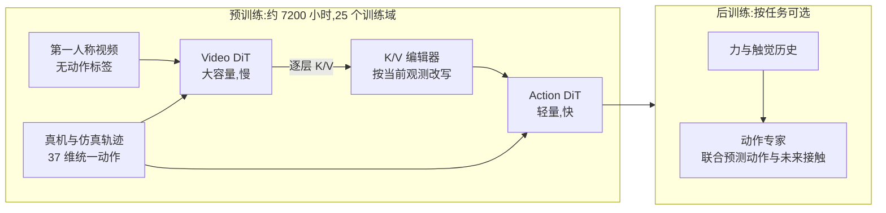
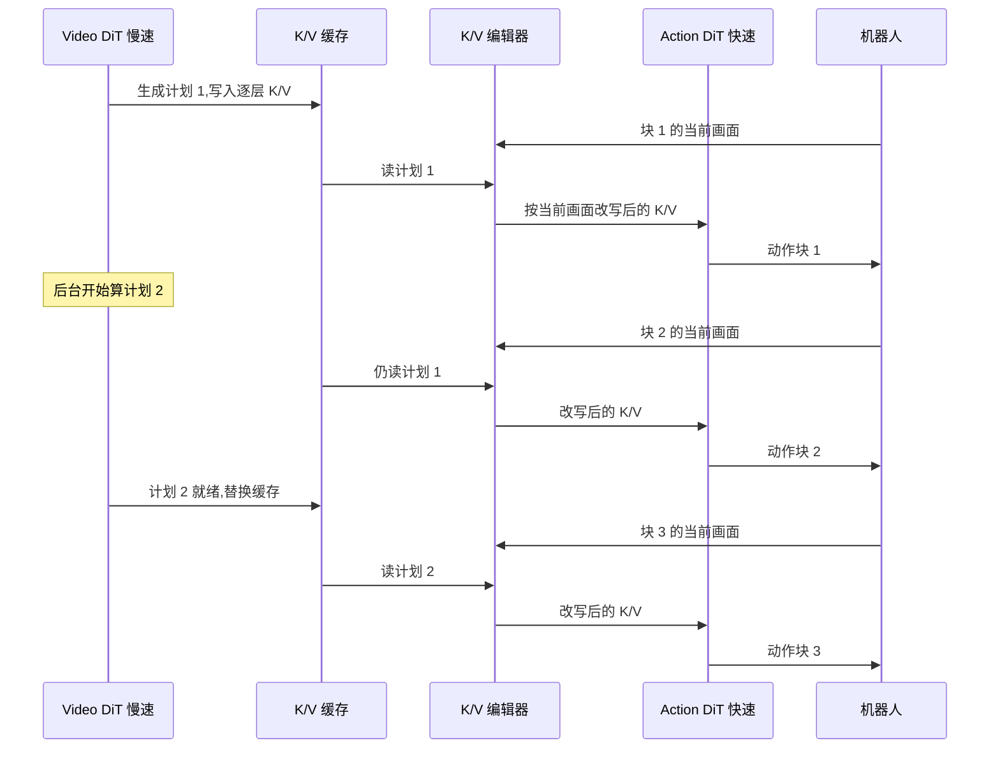
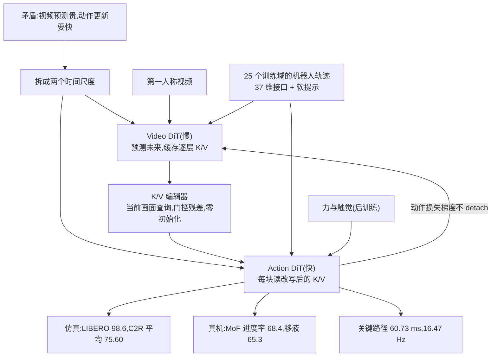

# InternW0：预测可以慢，动作不能等

<!-- release-date: 2026-09-23 -->

> 本文依据本地 `papers/ShanghaiAILab/InternW0.pdf`，即 **InternW0: A Foundational Physical World Model for Efficient Real-World Interactions**，arXiv:2609.27656v1，2026-09-23 提交，共 24 页，署名为上海人工智能实验室 Physical Intelligence Team。页码均指 PDF 的物理页码。文中会区分三件事：**报告明确写了什么**、**我们怎么解释它**、**哪些是外部资料或本文推算**。

## 读前先把几个词说成人话

这份报告讲的是机器人，但它的核心矛盾是一个「计算节拍」问题。先把会反复出现的词说清楚：

- **世界模型（world model）**：一个能回答「如果我这样做，世界接下来会变成什么样」的模型。报告把它定义成在有限感知和有限算力下，对物理状态转移的紧凑近似（PDF p. 2）。
- **VLA（Vision-Language-Action，视觉–语言–动作模型）**：看图、读指令、直接输出机器人动作的策略模型，π0、π0.5 属于这一类。它不显式预测未来画面。
- **WAM（World Action Model，世界–动作模型）**：把「预测未来画面」和「生成机器人动作」放进同一个模型里联合学习的做法，是 2026 年机器人基模的一条主线（PDF p. 2）。WAM 为什么能当零样本策略，见 DreamZero 一篇。
- **动作块（action chunk）**：策略一次吐出的一小段连续动作，比如 16 步。机器人执行完一块再要下一块。
- **流匹配（flow matching）**：一种生成模型的训练法。把干净样本和噪声按比例混合，让网络学「从噪声往干净样本走的速度」。本文里视频和动作都用它生成。
- **DiT（Diffusion Transformer）**：用 Transformer 做去噪主干的生成模型。报告里的 Video DiT 和 Action DiT 就是两个这样的专家。
- **MoT（Mixture-of-Transformers，混合 Transformer）**：每种模态用自己的一套参数（注意力投影、前馈层），但在注意力里互相看得见。报告借用的是它「按模态分配专属参数」的原则（PDF p. 2）；和 MoE 不同，它按模态固定分派，不做路由。
- **K/V（Key/Value）**：注意力层里被「查」的那两份表示。把某层的 K/V 存下来复用，别的 token 就能反复读它而不必重算产生它的网络。
- **力旋量（wrench）**：三个力分量加三个力矩分量，共 6 维，描述接触时物体受到的推和扭（PDF p. 3）。

## 一句话先说清

WAM 这条路线有一个没解决好的矛盾：**画面预测很贵，动作更新要快**。

如果每出一个动作块都重新预测一遍未来视频，控制频率就被视频生成拖死；如果只预测一次、之后一直按这份旧预测执行，世界一旦偏离想象，策略就在看一份越来越过时的「计划」（PDF p. 4）。

上图裁自原文第 1 页的总览图（PDF p. 1），略去了右侧与下方的结果柱状图（数字见后文各表）。InternW0 的回答是把两件事拆到两个时间尺度上：

1. **大的视频专家慢慢地预测未来**，把每一层的 K/V 缓存下来当「预测上下文」；
2. **小的动作专家快速地出动作**，每出一块动作之前，先用当前这一帧的观测把缓存的 K/V **改一改**再读，而不是重新生成未来（PDF p. 1、p. 5–6）。

报告把这句话写成口号：Predict slowly, act quickly（PDF p. 1）。落到数字上，动作关键路径的单次延迟是 60.73 ms，对应最高 16.47 Hz 的模型侧更新频率，是 Fast-WAM 的 3.13 倍（PDF p. 18）。

围绕这个骨架，报告又加了三样东西：用软提示和统一的 37 维动作接口吃下 25 个训练域的异构机器人数据（PDF p. 8–10），用无动作标签的第一人称实验室视频只训视频专家（PDF p. 6），以及在接触密集任务上把力和触觉接进动作专家、顺便预测未来的力（PDF p. 7）。

如果只记一句：

> **预测的价值不只在于准不准，还在于它能不能在过时之前被用上。InternW0 让贵的预测离开控制的关键路径，再用一个轻量的「按当前观测改写缓存」把它拉回现实。**

## 一条阅读路线

只有半小时读原文的话，建议按这个顺序：

1. **p. 1 封面总览图、p. 3 Figure 1 与 p. 5 Figure 2**：先分清系列框架和 InternW0 实例，再看清两个专家、中间那块 Context routing，以及哪些输入是预训练必需、哪些是后训练可选。
2. **p. 5–7 第 2.1 节**：异步双工推理、K/V 编辑器（式 2–4）、IDM 条件流、接触感知后训练（式 7）。这是全文的机制核心。
3. **p. 8–11 第 3 节**：数据配方。37 维统一接口、15 fps 时间约定、平方根采样、清洗规则。做机器人数据的人会觉得这一节最实用。
4. **p. 12–14 第 4 节**：LIBERO、RoboTwin 2.0 的两种设定，以及 EgoLab 的小数据消融。
5. **p. 15–17 第 5 节**：五个真机任务，重点看 MoF 与移液的分步表（Table 6、Table 7）。
6. **p. 18 第 6 节 Figure 7**：关键路径延迟，以及它**不包含**什么。

第 1 节的框架讨论（p. 2–4）和第 7 节的未来工作（p. 19–20）是系列级的愿景，读的时候要和 InternW0 实际做到的部分分开。

## 先看全景：一个系列框架，一个具体实例

报告分两层写。第一层是 **InternW 系列**的设计原则，第二层是 **InternW0** 这一个实例做到了什么。两者经常在同一段里出现，读的时候要分清。

上图是原文 Figure 1（PDF p. 3），画的是**系列层**的目标形态，不是 InternW0 的结构。系列层提了三条要求（PDF p. 2）：

- **全模态接口**：语言、视觉、几何、接触、身体动作，各有自己的参数通道，共享一个物理表示；
- **异步、多频率处理**：不同传感器和不同计算模块按各自的频率更新；
- **局部环境建模**：只从部分观测估计局部物理状态，把外部扰动当成不确定性的一部分，新证据到来就更新。

报告用一个概念式把世界模型的角色写下来（PDF p. 2，式 1）：

$$
z_t = F_\theta(H_t),
\qquad
p_\theta\left(z_{t+\Delta} \mid z_t,\, u_{t:t+\Delta},\, \Delta\right)
$$

$H_t$ 是到时刻 $t$ 为止带时间戳的观测和已执行动作，$z_t$ 是对局部状态及其不确定性的紧凑表示，$u_{t:t+\Delta}$ 是一段候选动作，$\Delta$ 是预测跨度。报告明说这只是「规定角色，不规定具体概率实现」（PDF p. 3）。它由此引出三条设计准则：**预测准确、与决策相关、及时**（PDF p. 3）。第三条是这份报告真正的主角。

实例层的 InternW0 只实现了其中一部分：视频、语言、本体状态、动作是预训练的主通道；力和触觉只在后训练时接到动作侧；几何（3D）预测、任务规划在框架图里出现（PDF p. 3，Figure 1），但 InternW0 的实验里没有 3D 预测头。下面这张图按 PDF p. 1、p. 5 的内容重画，是机制示意，不是原图：

## 第一层矛盾：为什么「预测一次、执行到底」和「每步都预测」都不行

### 旧问题：WAM 把两种节拍焊在了一起

WAM 的卖点是用视频预测给动作提供「前瞻」：模型先想象接下来几秒的画面，再据此出动作。问题在于两件事的成本差了一个量级。视频预测要对一大片时空 token 去噪；动作块只有十几步、几十维。

报告在 p. 4 把两难说得很直接：

- **每次控制更新都重算完整预测**，代价太高；
- **对着不变的计划上下文执行**，策略会以一份越来越过时的世界视图为条件。

后果可以从 Figure 7 读出来：同样按「一次动作生成」计时，Motus 要 1866.10 ms，只有 0.54 Hz（PDF p. 18）。报告没有说 Motus 的这 1.8 秒里有多少花在视频上，但它显示了「预测与动作同步」时控制频率可以低到什么程度。

另一个极端是 Fast-WAM。它的标题就是在问「WAM 测试时需要想象未来吗」（PDF p. 24 参考文献）。InternW0 的立场是：需要，但不能挡在关键路径上。

### 新设计：双工交互，异步多频率

报告区分了两个词（PDF p. 3）：

- **双工交互（duplex interaction）**：模型在生成预测、执行动作的同时，持续接收新观测。说的是输入和输出同时流动；
- **异步、多频率处理**：决定每路传感器、每个计算模块**什么时候**更新。

放到 InternW0 里，就是视频专家按慢节拍更新预测，动作专家按快节拍从「最新可用的计划 + 当前传感反馈」里生成短动作块。初始计划生成后，下一次视频预测在后台算，动作推理照常继续（PDF p. 5）。

下面这张时间线是按 PDF p. 5、p. 18–19 的文字画的机制示意，**不是实测时序**；报告没有给出视频计划的刷新周期，也没有给视频专家本身的推理耗时。

关键在第 2 块：计划还是旧的，但动作专家读到的不是原封不动的旧计划，而是**被当前画面改过的旧计划**。这一步由下一节的 K/V 编辑器完成。

## 核心设计一：两个不对称的专家

上图是原文 Figure 2（PDF p. 5）。图上有三处值得对着文字看。

**第一，两个专家各有一套参数，但在每一层里耦合。** 骨干是 MoT：每个联合层里，视频 block 和动作 block 有独立的参数和 token 流，通过一个以观测为条件的视频上下文接口相连（PDF p. 4）。视频侧是 Self Attention，动作侧是 Joint Attention，各自再接 Cross Attention 和 FFN（PDF p. 5，Figure 2）。

**第二，不对称是故意的。** 视频专家只看视觉观测和语言，**不读机器人专属的动作 token，也不读域身份**；动作专家读视频上下文、最新观测、本体状态、语言和各本体专属接口（PDF p. 4）。图中左上角的 IDM-mask 把这件事画成一个 3×3 的注意力掩码：第一帧 $f_0$ 只看自己，未来帧 $f_1$ 看 $f_0$ 和自己，动作 $a_1$ 看全部（PDF p. 5）。

为什么要这样？报告的理由是「让物理预测保持广泛共享，同时让控制在异构本体之间特化」（PDF p. 4）。我们的解释是：只要视频专家不看动作，它学到的就是一份与机器人无关的「世界会怎么变」，第一人称人手视频、25 个训练域的机器人视频都能喂进来；本体差异全部压在动作侧。

**第三，视觉编码器冻结，文本嵌入预先算好。** 视频帧用冻结的 Wan VAE 编码，动作块对齐的当前画面用冻结的 DINOv3 编码，语言指令用预计算的文本嵌入，各自经可训练投影接到对应专家（PDF p. 5）。

报告**没有写**两个专家的参数量、层数、隐藏维度，也没有写 Video DiT 是从哪个预训练视频模型初始化的。只能从第 7 节读到一个旁证：未来的 InternW 模型要做到「约 4B 参数，最终小于 1B」（PDF p. 20）。这暗示 InternW0 本身比 4B 大，但具体多大，报告没有给。

## 核心设计二：K/V 编辑器，不重新想象，只改写想象

### 旧问题：缓存复用会让上下文过时

缓存视频专家的 K/V 让动作专家反复读，是省算力最直接的办法。但缓存是在某个时刻按当时的画面算的。机器人一动，手的位置、物体的位置就和当时想象的不一样了。直接读旧缓存，等于「看着几秒前的梦出动作」。

### 新设计：两次注意力，加一个门控残差

InternW0 沿用 AHA-WAM 的「观测引导的视频上下文路由」（PDF p. 5），在每一层插一个**块级 K/V 编辑器（chunk K/V editor）**。对第 $n$ 个动作块，流程是（PDF p. 5–6）：

1. 把与该块对齐的 RGB 画面送进 DINOv3，投影成视觉上下文；
2. 一个可学习的查询编码器把它压成少量**路由查询** $q_n$；
3. 在第 $\ell$ 层，先让查询去视频 K/V 里取信息：

$$
R_{\ell,n} = \mathrm{Attn}\left(W^q_\ell\, q_n,\; K_\ell,\; V_\ell\right)
$$

$R_{\ell,n}$ 是「当前画面觉得视频预测里哪些内容相关」的摘要（PDF p. 6，式 2）。

4. 再反过来，让原来每个视频 token 的位置去读这份摘要，把信息路由回原位：

$$
D_{\ell,n} = \mathrm{Attn}\left(K_\ell,\; R_{\ell,n},\; R_{\ell,n}\right)
$$

（PDF p. 6，式 3）。注意这里视频的 $K_\ell$ 当查询，摘要当键和值。

5. 用一个轻量投影从 $D_{\ell,n}$ 预测残差 $(\Delta K_{\ell,n}, \Delta V_{\ell,n})$，门控后加回去：

$$
\tilde{K}_{\ell,n} = K_\ell + \sigma(\gamma_\ell)\,\Delta K_{\ell,n},
\qquad
\tilde{V}_{\ell,n} = V_\ell + \sigma(\gamma_\ell)\,\Delta V_{\ell,n}
$$

$\gamma_\ell$ 是每层一个可学习的门，$\sigma$ 是 sigmoid（PDF p. 6，式 4）。

两个细节决定了它能稳稳地训起来：

- **最后的残差投影零初始化**，编辑器一开始就是恒等映射，训练中逐步学会按观测做修正（PDF p. 6）；
- **底层缓存永远不改**。每个动作块从同一份预测上下文出发，各自造一份「编辑后的视图」（PDF p. 6）。于是长程的预测结构保留下来，局部的控制上下文跟着执行偏差走。

### 为什么是「先聚合、再散回」

**我们如何解释它。** 编辑器的两步注意力像一个瓶颈：几十上百个视频 token 先被少量查询读成摘要，再由每个视频 token 从摘要里取自己需要的修正。直接让每个视频 token 去看当前画面的全部 DINOv3 特征也能做修正，但成本随两边 token 数相乘；先压到少量查询，成本就只随视频 token 数线性增长。报告没有给查询数量，也没有做「不用编辑器、直接读旧缓存」或「每块都重生成视频」的消融，所以这个设计相对替代方案的收益，在这份报告里没有被单独量出来。

### 代价与边界

- 编辑器能修正的是「缓存怎样呈现给动作专家」，**不能凭空生成新的未来**。世界偏离太远时，仍然要等下一份视频计划。报告没有讨论偏离多大时编辑器会失效。
- 每层一个编辑器，动作关键路径上多了两次注意力和一个投影。Figure 7 的 60.73 ms 已经包含了这部分（PDF p. 18）。

### 可迁移启发

任何「慢模型给快模型提供上下文」的系统都有同一个问题：慢模型的输出在被消费时已经过时。与其把慢模型提速，不如在消费端加一个**便宜的、以最新观测为条件的改写层**，并且让它零初始化、从恒等出发。推荐系统里的长期兴趣向量、检索增强里的缓存文档表示、自动驾驶里的低频规划器，都可以用同一思路。

## 核心设计三：让动作的梯度流进视频专家

### 旧问题：视频预测的目标不等于动作的需要

只用视频重建损失训练视频专家，它会把力气花在画面上最显眼的东西上，比如背景纹理、光照。而动作真正需要的可能是夹爪和物体之间几毫米的相对位置。

### 新设计：IDM 条件流

在有动作监督的样本上，InternW0 同时跑**两路视频流**（PDF p. 7）：

- **主视频流**：正常的视频流匹配，有重建损失；
- **条件流（IDM conditioning stream）**：与主流共享全部 Video DiT 参数，但噪声和流时间独立采样。它**没有单独的重建损失**，它的逐层 K/V 被 K/V 编辑器读走、再交给动作专家。

条件流以 0.5 的概率保持干净，否则用独立采样的流时间加噪；第一帧始终干净（PDF p. 7）。IDM 在正文里对应的是「independent-denoising condition stream」，即**独立去噪**的条件流（PDF p. 7），名字说的正是它的噪声与流时间和主流各自独立采样；Figure 2 的 IDM-mask 画的是这条流里帧与动作 token 的可见关系（PDF p. 5）。

最关键的一句是：**条件 K/V 没有从视频网络上 detach**（PDF p. 7）。动作流匹配损失的梯度会穿过 K/V 编辑器流进共享的视频专家。于是视频专家学到的表示同时被两件事塑造：能预测未来画面，以及对出动作有用。

推理时，真值条件流换成模型自己生成的视频上下文，它的逐层 K/V 被缓存，经同一个接口交给动作专家（PDF p. 7）。

### 我们如何解释它

训练时条件流一半是干净真值、一半是加噪版本，推理时换成模型生成的视频。这相当于让动作专家在训练里就见过「不完美的预测」，缓解训练用真值、推理用生成品的分布差。这和报告里下游后训练「条件视频流以 0.5 的概率独立加噪，Video DiT 保持可训练」的设置一致（PDF p. 13）。报告没有做「detach 与不 detach」或「加噪概率」的消融，所以这两个选择的效果没有被单独验证。

### 可迁移启发

多任务模型里，如果辅助任务的表示要给主任务用，**别急着 detach**。让主任务的梯度回流，表示就会向「对主任务有用」的方向偏。反过来，若担心主任务把表示带偏，就保留辅助任务自己的损失当锚，InternW0 的主视频流就是这个锚。

## 核心设计四：一个目标函数，吃下有标签和没标签的数据

### 统一的流匹配

两个专家都用连续流匹配。对干净目标 $x_0$（视频 latent 或一个连续动作块）、高斯噪声 $\epsilon$、流时间 $\tau \in [0, 1]$（PDF p. 6，式 5）：

$$
x_\tau = (1 - \tau)\,x_0 + \tau\,\epsilon,
\qquad
v^{*} = \epsilon - x_0
$$

网络学的是速度 $v^{*}$。流时间用平移后的连续调度采样：每个视频样本一个流时间，每个动作块各自独立一个（PDF p. 6）。

视频注意力用**首帧因果掩码**：已观测的第一帧不能看未来视频 token，未来帧可以看第一帧、彼此之间双向可见。第一帧保持干净当时间锚点，不计入视频损失（PDF p. 6）。

### 混合监督

预训练目标把两个损失加起来（PDF p. 6，式 6）：

$$
\mathcal{L}_{\mathrm{pre}} = \mathbb{E}_{\xi \sim \mathcal{D}_{\mathrm{mix}}}\left[\lambda_v\, \mathcal{L}_{\mathrm{video}}(\xi) + \lambda_a\, \mathbb{I}_{\mathrm{act}}(\xi)\, \mathcal{L}_{\mathrm{joint}}(\xi)\right]
$$

$\mathbb{I}_{\mathrm{act}}$ 是指示量：样本有动作标签才算动作损失。两项都是按调度加权、带掩码的速度平方误差；时间填充、干净的当前帧、缺失的动作维度都不计入（PDF p. 6）。

于是三类数据各走各的路（PDF p. 6）：

| 数据 | 视频专家 | 动作专家 |
|---|---|---|
| 真机轨迹 | 有监督 | 有监督 |
| 仿真轨迹 | 有监督 | 有监督 |
| 第一人称人手视频 | 有监督 | 不参与 |

$\lambda_v$、$\lambda_a$ 的取值报告没有给。

### 可迁移启发

无标签数据能不能用，取决于模型里有没有一个**只需要观测**的子任务。InternW0 把「预测世界」和「决定动作」拆成两个专家，无动作视频就有了明确的去处。任何标签稀缺的多模态系统，都可以先找一个不需要标签的预测子任务，把它做成独立专家。

## 核心设计五：异构本体的统一接口

### 37 维动作与状态

所有机器人数据的动作和状态都映射到固定的 37 维（PDF p. 10）：

| 分段 | 维度 | 内容 |
|---|---:|---|
| 左臂 | 17 | 7 维关节，3 维末端平移增量，6 维旋转（rotation-6D），1 维夹爪 |
| 右臂 | 17 | 同上 |
| 移动底座 | 3 | $\Delta x$、$\Delta y$、$\Delta \mathrm{yaw}$ |

缺失通道补零，并用**逐维有效性掩码**标出，不计入动作损失。头部和腰部自由度不在监督空间内（PDF p. 10）。

动作语义按通道类型区分（PDF p. 10）：

- 关节动作沿用各数据源的约定，是下一个路点的绝对目标；
- 末端动作编码从当前控制步观测到下一路点的平移增量和相对旋转；
- 底座动作编码对应区间内的平面位移和偏航变化；
- 状态里的末端位置与朝向保持绝对值，朝向用旋转矩阵的前两列表示。

归一化也分开做：关节、夹爪、底座各自归一化；末端 6D 只归一化动作里的平移增量，绝对状态和动作的 rotation-6D 保持原值（PDF p. 10）。

**我们如何解释它。** 掩码区分了「这个维度没数据」和「这个维度的值恰好是 0」（PDF p. 6）。夹爪全闭可能就编码成 0，若把缺失也填 0 且算损失，模型会学到大量错误的「闭合」信号。这是跨本体混训最容易踩的坑之一。

### 软提示与域接口

跨机器人共享交互知识，又不能抹掉它们在动作语义和传感配置上的差异。InternW0 借鉴 X-VLA 的本体专属提示，给每个训练域 $d$ 学一组软提示 $P^{(d)}$，拼在每个动作块前面（PDF p. 6）。另外每个域有自己的输入输出投影，把动作和传感表示映射到共享 token 空间（PDF p. 6）。

「域」按数据来源、机器人形态和子集身份划分，**不和机器人形态一一对应**（PDF p. 8）。这一轮一共 25 个训练域、24 个统计组，两种 Franka 夹爪变体共用一组；其中 23 组提供机器人状态/动作归一化统计，剩下一组是只贡献视频监督的 EgoLab（PDF p. 8）。

因为每个域有自己的动作接口，**每个 GPU batch 只装一个域的样本**；相邻 batch 可以换域，不同 GPU 也可以采不同的域（PDF p. 10）。

### 可迁移启发

异构数据混训有两种做法：硬把所有本体对齐成一套语义，或者保留差异、在接口层吸收。InternW0 走的是后者，并且把「共享」和「特化」放在网络的不同位置：视频专家全共享，动作专家的主体共享，只有软提示和薄薄一层投影按域特化。窄接口复制、主体分片，在并行策略上也好处理（见后文训练栈一节）。

## 核心设计六：接触感知后训练

### 旧问题：看得见不等于摸得准

移液枪插吸头、拧瓶盖、插塞子，成败取决于接触力。画面上「对准了」和「压稳了」可能看起来一样。报告的判断是：仅靠视觉观测未必能完全分辨决定操作成败的接触条件（PDF p. 7）。

### 新设计：把未来的力当成动作的一部分去生成

预训练阶段不需要任何力或触觉标注。只有下游接触密集的任务，才在动作侧加两样东西（PDF p. 7）：

1. **条件**：接上已有的力和触觉历史；
2. **目标**：把每个物理时间步 $i$ 的预测目标扩成（PDF p. 7，式 7）

$$
y_i = \left[a_i^{\top},\; f_i^{\top},\; h_i^{\top}\right]^{\top}
$$

$a_i$ 是动作，$f_i$ 是力/力矩信号，$h_i$ 是触觉表示。

对每个动作块，只把**生成它之前**已有的接触历史当条件；未来的接触通道和动作通道一起加噪、一起去噪。执行时只解码动作通道，接触通道代表「预测的反馈」（PDF p. 7）。在 p. 3 的描述里，InternW0 融合的是交互力的时间历史，同时联合预测末端位姿和 6 维力旋量（PDF p. 3）。

整个扩展只动动作侧接口，共享的视频预测主干不变（PDF p. 5、p. 7）。

### 我们如何解释它

让模型同时生成「我要怎么动」和「动了之后手上会感到多大的力」，相当于给动作加了一个物理一致性约束：动作和它预期的力必须一起说得通。这和人插吸头时「预期会有一个阻力，阻力到了就停」是同一种控制直觉。报告把它和经典的**位置–力混合控制**联系起来（PDF p. 4）。

报告**没有写**：力/触觉传感器的型号与频率、后训练用了多少条演示、接触通道的维度，以及「只加力的条件、不预测未来力」的消融。所以「预测未来力」这一项本身贡献多少，报告没有单独给证据。

### 可迁移启发

当一个模态对决策关键、但只在少数任务里有，就不要把它塞进预训练的公共接口，而是在后训练时从动作侧「插」进去。更进一步，可以让模型**预测这个模态的未来**而不只是读它的过去，把它从输入升级成一个辅助目标。

## 数据配方：7200 小时，七个来源

### 组成

预训练语料约 7200 小时，来自七个数据集，覆盖真机、仿真和人类第一人称实验室活动（PDF p. 8）。原文 Table 1（PDF p. 9）：

| 数据集 | 类型 | 子集 | 域数 | 小时 | 条数 |
|---|---|---|---:|---:|---:|
| InternData-A1 | 仿真 | Franka（Panda / Robotiq85）、Genie1、Lift2、Split ALOHA、AC-One | 6 | 3,494.3 | 568,194 |
| AgibotWorld | 真机 | 夹爪与触觉子集 | 2 | 2,620.0 | 158,380 |
| RoboCOIN | 真机 | AgiBot G1（2 个子集）、Cobot Magic（5 个子集）、Galbot G1、R1 Lite、RMC-AIDA-L、Split ALOHA（2 个子集）、Tianqin A2 | 13 | 438.1 | 59,952 |
| Galaxea | 真机 | R1 Lite | 1 | 314.9 | 15,362 |
| EgoLab | 第一人称 | 只走视频通路 | 1 | 275.4 | 3,192 |
| MolmoAct | 真机 | YAM 双臂 | 1 | 70.3 | 3,424 |
| RoboDojo | 仿真 | 双臂 ARX X5 | 1 | 20.5 | 3,465 |
| **合计** | | | 25 | 7,233.5 | 811,969 |

几个读表要知道的事：

- **仿真占近一半**。InternData-A1 与 RoboDojo 合计 3514.8 小时，约占 48.6%（本文算术，数字来自 PDF p. 9）。
- **灵巧手数据被排除在预训练之外**，格式转换没完成的数据集副本也被排除（PDF p. 8）。这意味着后面真机的 20 自由度灵巧手移液任务，在预训练里没有见过同类本体。
- 机器人数据覆盖单臂、双臂和移动操作（PDF p. 8）。
- 语言条件优先用子任务指令，没有就退回任务级指令（PDF p. 8）。

### EgoLab：275 小时湿实验室第一人称视频

这是团队自采的数据集，目标是把实验室特有的操作知识灌进 WAM：仪器怎么拿、样品和容器怎么处理、操作按什么顺序（PDF p. 9）。

- **采集**：参与者头戴 DJI Action 系列相机，用腕带控制录制，按任务描述用指定器材做实验；视频 2.5K 分辨率、50 fps，覆盖移液、称样、滴定、过滤、研磨、搅拌、润洗玻璃器皿等（PDF p. 9）。
- **三维重建**：以原生 50 fps 重建相机运动和双手轨迹，常规情况用 HaWoR，困难情况用另一种重建方法（报告没有写是哪种）。重建轨迹只作为过滤用的辅助标注，预训练时 EgoLab 只走视频通路（PDF p. 9）。
- **子任务切分**：用一个经公开 API 访问的视觉语言模型（报告没写是哪个），以 0.5 fps 采帧，生成全局活动描述和 10 s 片段内的手–物交互描述；指向同一实验操作、同一主样品或容器、同一实验循环、同一预期结果的相邻描述合并成一个子任务（PDF p. 9）。

原文 Figure 3 右侧的活动类别分布（PDF p. 9，读自饼图标注）：

| 类别 | 占比 |
|---|---:|
| 容器准备（Vessels） | 25.7% |
| 液体处理（Liquids） | 25.1% |
| 混合与研磨（Mixing） | 20.0% |
| 设备操作（Equipment） | 11.9% |
| 固体处理（Solids） | 8.0% |
| 清洗（Cleaning） | 6.1% |
| 准备与记录（Prep & records） | 3.3% |

### 时间约定与样本构造

所有数据统一到 **15 fps 的模型时间**（PDF p. 10）：

- 60/50 fps 的流步长取 4，30/25 fps 取 2，15 fps 保持原样；
- 为此 50 fps 按 60 fps 处理、25 fps 按 30 fps 处理，但视频帧仍从原生帧位读取；
- 步长为 4 时，从第 0、1、2、3 帧起步定义四个相位；有效锚点只在相位 0 上计数，采样时再对选中锚点均匀随机选一个合法相位。

每个机器人训练样本包含（PDF p. 10）：

- **13 帧多视角图像**，拼成一张 384 × 320 的画布；
- 相邻视频帧隔 8 个控制步，13 帧跨 96 个控制步；
- **64 步动作**，切成 4 个 16 步的动作块，每块以该块起点的图像和机器人状态为条件；
- 动作窗口随机偏移 0–15 步，不用历史图像。

按 15 fps 换算，视频窗口约 6.4 秒，动作窗口约 4.3 秒（本文算术）。EgoLab 用同样的视频窗口和时间采样方案（PDF p. 10）。

**我们如何解释它。** 「每块以该块起点的画面为条件」正好对应 K/V 编辑器的推理用法：训练时每个 16 步动作块都拿自己起点的画面去改写同一份视频上下文，推理时也是。训练和推理的接口是一致的。

### 平方根采样

大数据集自然会淹没小数据集。报告沿用 RDT-1B（按数据集大小的平方根初始化权重）和 π0（按 $m^{0.43}$ 加权）的亚线性重加权思路（PDF p. 10），在**域级别**用固定的平方根权重。设 $N_d$ 为域 $d$ 的相位 0 有效锚点数（PDF p. 10，式 8）：

$$
p_d = \frac{\sqrt{N_d}}{\sum_j \sqrt{N_j}}
$$

大域仍被更频繁地采到，但比「按大小成比例」温和。数据源层面的目标比例是其下各域权重之和，训练中持续监控实际消费比例（PDF p. 10）。第 3 节开头的表述是「按数据集」做平方根采样（PDF p. 8），后文细化为按域（PDF p. 10），以后者为准。

### 离线清洗：按监督信号找缺陷

数值预处理、过滤和采样索引全部离线完成；训练时只读产物和预计算的归一化统计（PDF p. 8）。清洗针对的是会污染监督信号的四类缺陷（PDF p. 11）：

- **静止轨迹**：用原始运动信号判断有没有有效运动，整条都没有有效动作的 episode 删掉；只有夹爪或底座运动的保留。判断不用降采样序列，也不用归一化值。
- **头部与腰部运动**：受影响的区间、以及与之相交的任何动作窗口排除；同一 episode 的其他合法部分保留，**动作序列绝不跨排除区间拼接**。
- **夹爪短脉冲**：在原生序列上检测「开–合–开」「合–开–合」的往返，用归一化值 ≥ 0.6 和 ≤ −0.6 判定高低电平；再逐相位检查降采样是否恰好漏掉了中间那次反转，漏掉的话包含该事件的动作块排除出有效监督。
- **缺失通道与边界**：缺失维度和时间填充用掩码标出；补零的缺失通道不计损失，真正有效的零照常监督；窗口边界和动作有效性逐相位单独检查，相位 0 的结论不默认对其他相位成立。

归一化统计按统计组分别计算，只用训练集中可被采到的值，覆盖所有合法相位，排除缺失通道、填充和验证数据。夹爪脉冲检测先用训练集的参考统计；过滤完成后，再从保留下来的有效监督上重算最终统计（PDF p. 11）。

**我们如何解释它。** 夹爪短脉冲这一条最能说明这份数据配方的细致程度。60 fps 下一次 3 帧的开合，降到 15 fps 后可能整个消失，模型看到的监督是「夹爪一直闭着」，而画面里夹爪其实动过。这种不一致只在降采样之后出现，所以要逐相位检查。任何做时间降采样的机器人数据管线都可以直接借这一条。

### 可迁移启发

- 缺陷的定义要**从监督信号出发**，而不是从「数据看起来脏不脏」出发。
- 降采样会制造原始数据里没有的缺陷，检查必须在降采样之后、逐相位做。
- 归一化统计要在过滤之后重算，否则被删掉的坏数据仍在影响尺度。

## 训练栈：三层解耦

训练管线分三层，严格分开数据采样、分布式执行和模型优化（PDF p. 7）：

| 层 | 基础 | 职责 |
|---|---|---|
| 数据面 | 自研数据引擎 | 把异构机器人 episode 语料整理成训练就绪的样本流 |
| 执行面 | Ray | 管理全部集群进程，在显式资源与内存预算下把数据物化与 GPU 训练放在一起 |
| 优化面 | 自研分布式训练框架 | 梯度训练器负责训练循环，并行策略交给可插拔后端，InternW0 在其中装入分片、检查点和编译策略 |

**流式数据管线**（PDF p. 7–8）：

- 元数据与样本载荷解耦。采样时只重排紧凑连续的描述符，载荷按下游需要才物化；
- 按域级混合权重防止某个语料仅凭体量主导训练流；
- 数据流切给各训练节点时保持块顺序，使每个节点本地处理的 batch 在域分布上相对同质；
- 样本级的随机选择由样本身份确定性地生成，而不是由执行或调度顺序决定，**断点续训能复现完全相同的数据流**；
- 节点内共享视频缓存：一个 worker 取过并解码过的样本，同节点其他 worker 可复用。

**并行、精度与编译**（PDF p. 8）：

- 可组合的 FSDP2，分片单位跟随模型结构：每个 MoT 联合层、每个专家阶段各自分片，窄的逐域接口在各 rank 上复制；
- 单机用扁平分片网格；多机时同一配置自动升级为分层的「复制 + 分片」网格，模型与检查点格式不变；
- 混合精度：FP32 主参数与优化器状态，BF16 计算，**梯度归约用 FP32** 以提高数值稳定性；
- 每个联合层先编译成固定形状的整图单元，再套激活检查点和分片包装；选择性激活检查点只重算可配置的前若干层；
- 训练状态通过分布式检查点事务式持久化，可以在 epoch 中途精确恢复。

报告**没有给**：预训练用了多少 GPU、什么型号、多少步、多大 batch、学习率、总算力或墙钟时间。

## 实验一：仿真基准

报告用两个仿真基准分别回答两个问题：后训练后能不能在下游任务上打得好，以及下游分布变化时预训练表示还能不能用（PDF p. 11）。

### LIBERO：单臂，40 个任务

LIBERO 覆盖空间推理、物体交互、目标条件控制和长程执行四个子集，共 40 个任务（PDF p. 12）。后训练从预训练 checkpoint 出发，训 50 个 epoch，学习率 $5 \times 10^{-5}$；保留 37 维接口，LIBERO 的绝对末端动作映射到左臂槽位，其余维度补零并掩掉（PDF p. 12）。每个任务 50 次 rollout，报告各子集平均成功率和四个子集的宏平均（PDF p. 12）。

原文 Table 2（PDF p. 12）：

| 方法 | Spatial | Object | Goal | Long | 平均 |
|---|---:|---:|---:|---:|---:|
| π0 | 98.0 | 96.8 | 94.4 | 88.4 | 94.4 |
| InternVLA-M1 | 98.0 | 99.0 | 93.8 | 92.6 | 95.9 |
| π0.5 | 98.8 | 98.2 | 98.0 | 92.4 | 96.9 |
| GR00T-N1.7 | 97.7 | 98.5 | 97.5 | 94.4 | 97.0 |
| OpenVLA-OFT | 97.6 | 98.4 | 97.9 | 94.5 | 97.1 |
| Fast-WAM | 98.2 | **100.0** | 97.0 | 95.2 | 97.6 |
| Motus | 96.8 | 99.8 | 96.6 | 97.6 | 97.7 |
| LingBot-VA | 98.5 | 99.6 | 97.2 | **98.5** | 98.5 |
| **InternW0** | **99.4** | 99.4 | **98.6** | 97.0 | **98.6** |

InternW0 平均 98.6%，比 LingBot-VA 高 0.1 个百分点，比 Fast-WAM 高 1.0 个百分点（PDF p. 12）。Spatial 99.4% 是最好，Goal 98.6% 也是最好（PDF p. 12 正文说 Goal 比最佳低 0.2 点，但表里没有比 98.6 更高的 Goal 值，正文和表对不上，以表为准）。Long 97.0% 低于 LingBot-VA 的 98.5% 和 Motus 的 97.6%，Object 99.4% 低于 Fast-WAM 的 100.0%。

读这张表要知道两件事：

- LIBERO 已经接近饱和，头部方法都在 97–99% 之间，0.1 个百分点的差距在 2000 次 rollout 里只相当于 2 次成功（本文算术：40 任务 × 50 次）。
- 正文列出的对比方法里有 Xiaomi-Robotics-0（PDF p. 12），但 Table 2 里没有这一行。

### RoboTwin 2.0：双臂，50 个任务，两种数据设定

RoboTwin 2.0 有两种下游设定（PDF p. 11–12）：

- **Full**：后训练时干净和随机化演示都有，测域内多任务表现；
- **Clean2Random（C2R）**：后训练只用干净演示，随机化只在评测时出现，测域外泛化。

两种设定共用同一套后训练：64 步动作切成 4 个 16 步块，随机偏移 0–15 步；块观测用冻结的 DINOv3 编码；ALOHA 原生 14 维关节动作映射到 37 维的对应槽位；条件视频流以 0.5 的概率独立加噪，Video DiT 保持可训练；都训 5 个 epoch，学习率 $2 \times 10^{-5}$（PDF p. 12–13）。

原文 Table 3，Full 设定（PDF p. 13）：

| 方法 | Clean | Randomized | 平均 |
|---|---:|---:|---:|
| π0 | 65.92 | 58.40 | 62.16 |
| π0.5 | 82.74 | 76.76 | 79.75 |
| ABot-M0 | 81.20 | 80.40 | 80.80 |
| Motus | 88.66 | 87.02 | 87.84 |
| Fast-WAM | 91.88 | 91.78 | 91.83 |
| LingBot-VA | 92.90 | 91.50 | 92.20 |
| AHA-WAM | 93.40 | 92.20 | 92.80 |
| OpenWAM-α | 93.74 | 93.46 | 93.60 |
| **ABot-M0.5** | **94.00** | **94.20** | **94.10** |
| InternW0 | 93.20 | 93.04 | 93.12 |

Full 设定下 InternW0 **不是第一**：平均 93.12%，低于 ABot-M0.5 的 94.10% 和 OpenWAM-α 的 93.60%（PDF p. 13）。报告自己也写了差距是 0.98 和 0.48 个百分点。值得注意的是它相对 AHA-WAM 只高 0.32 点（PDF p. 13），而 AHA-WAM 正是 K/V 路由设计的来源（PDF p. 5）。干净与随机化之间只差 0.16 个百分点（PDF p. 13）。

原文 Table 4，C2R 设定（PDF p. 14）：

| 方法 | Clean | Randomized | 平均 |
|---|---:|---:|---:|
| Fast-WAM | 77.8 | 1.9 | 39.9 |
| X-VLA | 68.0 | 20.9 | 44.5 |
| X-WAM | 70.0 | 25.8 | 47.9 |
| Spatial Forcing | 77.2 | 26.7 | 52.0 |
| π0.5 | 70.7 | 46.0 | 58.4 |
| 4D-WAM | 81.5 | 41.8 | 61.6 |
| GigaBrain-0.7 | 66.8 | 67.9 | 67.3 |
| **InternW0** | **83.20** | **68.0** | **75.60** |

C2R 是 InternW0 在仿真里最有说服力的一张表。平均 75.60%，比第二名 GigaBrain-0.7 高 8.30 个百分点（PDF p. 14）。它的优势来自**两头都不差**：干净场景 83.20% 最高，随机化 68.0% 也最高，但随机化只比 GigaBrain-0.7 高 0.1 个百分点（PDF p. 14）。

**我们如何解释它。** 这张表把对比方法分成了两类。Fast-WAM、4D-WAM、Spatial Forcing 在干净场景很强，一换场景就崩，Fast-WAM 从 77.8% 掉到 1.9%；GigaBrain-0.7 两边差不多，但干净场景只有 66.8%。InternW0 是唯一两边都在高位的。它自己干净与随机化之间仍差 15.2 个百分点（PDF p. 14），报告也承认没见过的场景变化仍有挑战。

### EgoLab 消融：第一人称视频帮的是泛化

原文 Figure 4 画的是一组受限数据下的预训练消融，评测走 RoboTwin 2.0 的 C2R 协议（PDF p. 14）。设定是：约 50 小时机器人数据；联合变体再加约 50 小时 EgoLab 视频；三种变体都在干净演示上后训练，在干净和随机化场景评测。转写为表：

| 预训练 | Clean | Randomized |
|---|---:|---:|
| 不预训练 | 55.20 | 6.73 |
| 只用机器人数据 | 72.13 | 13.73 |
| 机器人 + EgoLab | 76.40 | 21.97 |

加 EgoLab 后干净场景 +4.27 个百分点，随机化场景 +8.24 个百分点（PDF p. 14）。报告的解读是：随机化上的增益更大，说明第一人称视频特别有助于泛化到干净后训练分布之外（PDF p. 14）。

这组证据有两处要保留：

- **数据量没有对齐**。联合变体的预训练数据约 100 小时，只用机器人数据的变体约 50 小时（PDF p. 14）。增益里有多少来自「多了 50 小时视频」，有多少来自「这 50 小时是第一人称实验室视频」，这组实验分不开。一个对照可以是「机器人 50 小时 + 其他 50 小时机器人视频（去掉动作）」，报告没有做。
- 这是受限数据设定（PDF p. 14），主结果 Table 4 用的是全量语料。全量 7200 小时里 EgoLab 只占约 3.8%（本文算术，275.4 / 7,233.5），它在全量设定下贡献多少，报告没有消融。

## 实验二：真机与湿实验室

原文 Figure 5 是五个任务的现场照片（PDF p. 15）。五个任务分两类（PDF p. 15）：

- **双臂操作**（两条平行夹爪臂）：
  - **做三明治**：拿两片面包和一片肉按顺序叠好，是一个简单的长程任务；
  - **分拣工业零件**：识别每个零件，放进对应的盒子；
  - **分拣试管**：按语言指令指定的手臂和试管颜色，把对应试管放进对应一侧的盒子；
  - **MoF 实验**：复现金属有机框架合成的溶液配制阶段，用量筒经漏斗往烧瓶里倒液、取下漏斗、把烧瓶移到搅拌器上、塞塞子、开搅拌器，共 15 个连续子任务，要求精确插入，还要在外观相似的阶段之间跟踪进度。
- **灵巧手操作**：
  - **定量移液**：20 自由度灵巧手装在 7 自由度机械臂上，带位置–力混合控制。5 个连续子任务：拿起并在手内调整移液枪朝向、装吸头、吸取定量液体、打到指定试管、退吸头并放回原位。

**评测协议**（PDF p. 15）：每个任务 15 次试验，物体初始位置和朝向随机。三种指标对应任务结构：

- 做三明治报 episode 级成功率，所有动作都做对才算成功；
- 分拣零件和分拣试管一次试验里有多个目标，报**物体级**成功率，即所有试验中被正确拿放的目标占比；
- MoF 和移液报**进度率**，即按规定顺序正确完成的子任务比例，在所有试验上平均。这两个多阶段任务里，所有方法共用同一个视觉语言模型做子任务生成（报告没写是哪个）。

### 总表

原文 Table 5（PDF p. 16）：

| 方法 | 做三明治 | 分拣零件 | 分拣试管 | MoF 实验 | 定量移液 |
|---|---:|---:|---:|---:|---:|
| 指标 | 成功率 | 物体级成功率 | 物体级成功率 | 进度率 | 进度率 |
| π0.5 | 73.3 | 53.1 | 86.7 | 50.2 | 46.7 |
| Fast-WAM | 40.0 | 50.6 | 66.7 | 10.7 | 18.7 |
| **InternW0** | **73.3** | **82.7** | **88.9** | **68.4** | **65.3** |

报告的逐项解读（PDF p. 15–16）：

- **做三明治**两个预训练策略打平在 73.3%，报告认为基础的拿放叠放已经被预训练充分覆盖；
- **分拣零件**从 53.1% 提到 82.7%。π0.5 的失败多是识别错误，零件放错盒子；报告把 InternW0 的优势归因于 WAM 主干的视觉预训练带来更强的零件级辨别力；
- **分拣试管**两个预训练模型都能可靠遵循指令（88.9% 对 86.7%），Fast-WAM 常在细试管上方就合上夹爪，报告认为是它从零训练的视觉表示定位不到正确抓取点。

读表时要记住样本量：每个任务 15 次试验（PDF p. 15）。做三明治的 73.3% 就是 15 次里成功 11 次（本文算术），一次试验的差别就是 6.7 个百分点。分拣试管的 88.9% 对 86.7% 属于这个量级以内的差距。

### MoF 实验：差距出现在后半程

原文 Table 6，MoF 实验逐子任务成功率（PDF p. 16）：

| # | 子任务 | π0.5 | Fast-WAM | InternW0 |
|---:|---|---:|---:|---:|
| 1 | 从架上拿漏斗 | 100.0 | 100.0 | 100.0 |
| 2 | 漏斗插进烧瓶 | 100.0 | 46.7 | 100.0 |
| 3 | 拿起量筒 | 100.0 | 13.3 | 93.3 |
| 4 | 经漏斗往烧瓶里倒液 | 73.3 | 0.0 | 80.0 |
| 5 | 量筒放回 | 73.3 | 0.0 | 80.0 |
| 6 | 扶稳平台上的烧瓶 | 73.3 | 0.0 | 80.0 |
| 7 | 从烧瓶上取下漏斗 | 73.3 | 0.0 | 80.0 |
| 8 | 漏斗插回架孔 | 46.7 | 0.0 | 66.7 |
| 9 | 回到初始位置 | 46.7 | 0.0 | 66.7 |
| 10 | 烧瓶放上搅拌器 | 33.3 | 0.0 | 66.7 |
| 11 | 从架上拿塞子 | 6.7 | 0.0 | 66.7 |
| 12 | 塞子塞进烧瓶 | 6.7 | 0.0 | 66.7 |
| 13 | 按搅拌器左键 | 6.7 | 0.0 | 26.7 |
| 14 | 按搅拌器右键 | 6.7 | 0.0 | 26.7 |
| 15 | 回到初始位置 | 6.7 | 0.0 | 26.7 |
| | **进度率** | 50.2 | 10.7 | **68.4** |

报告说「预测的收益在 MoF 上最清楚」，进度率从 50.2% 提到 68.4%（PDF p. 16）。它从表里读出 π0.5 的两种失败（PDF p. 16）：

1. **倒液**（子任务 4）：π0.5 量筒和漏斗没对准，液体洒出；
2. **后半程小透明件**：从子任务 8 起，π0.5 从 46.7% 到 33.3% 再到 6.7% 急剧下滑，这一段要精确抓取、插入小而透明的漏斗、烧瓶和塞子；InternW0 在子任务 12 之前一直保持 66.7%，只在需要毫米级精度的按按钮阶段掉到 26.7%。

Fast-WAM 在这个任务上几乎做不动，从来没越过前三个子任务。报告的解释是：没有预训练，它在外观相似的阶段之间严重混淆状态，反复重做或跳过步骤（PDF p. 16）。

**我们如何解释它。** 表里的数字是**累积**的：进度率要求按顺序完成，前一步失败，后面全记 0。所以 InternW0 在子任务 10–12 的 66.7% 意味着 15 次里有 10 次一路做到了塞塞子（本文算术），π0.5 只有 1 次。这个差距比总进度率的 18.2 个百分点更能说明长程任务里的差别。

### 失败案例

上图是原文 Figure 6（PDF p. 17）。图上能直接看到 MoF 倒液时三者量筒与漏斗的相对位置；下排圆框里能看到插入处的对齐差别。图上读不出的是**过程中的力**，报告用文字补充（PDF p. 17）：

- 装吸头时，InternW0 面对一开始就没对准的移液枪，通过力感知的位置–力混合交互，**根据接触力在线调整位姿、顺着外力柔顺让步**，把吸头对准目标开口后成功提起移液枪；
- π0.5 在插入时持续向下施力，直到移液枪从手里滑脱；
- Fast-WAM 在插入处有很大的位置误差，把移液枪枪身压弯变形。

### 定量移液：接触密集的子任务才拉开差距

原文 Table 7（PDF p. 17）：

| # | 子任务 | π0.5 | Fast-WAM | InternW0 |
|---:|---|---:|---:|---:|
| 1 | 拿起并调整朝向 | **93.3** | 46.7 | 86.7 |
| 2 | 装吸头 | 40.0 | 13.3 | **66.7** |
| 3 | 吸液 | 33.3 | 13.3 | **66.7** |
| 4 | 打液 | 33.3 | 13.3 | **60.0** |
| 5 | 退吸头并放回 | 33.3 | 6.7 | **46.7** |
| | **进度率** | 46.7 | 18.7 | **65.3** |

InternW0 在五个子任务里赢四个，进度率 65.3%（PDF p. 17）。唯一输的是第一步拿起调整朝向：π0.5 93.3% 对 86.7%。报告的读法是：优势集中在接触和力敏感的子任务上，也就是装吸头、吸液、打液、退吸头；可靠的定量移液受益于高自由度灵巧操作和主动位置–力混合交互的结合（PDF p. 17）。

**这张表支撑不了多强的结论。** 报告没有说明 π0.5 和 Fast-WAM 在这个任务上**有没有接入力信号**。如果基线只看画面、InternW0 额外有力输入并预测未来力，那么「接触子任务上赢」同时混着「多了一个模态」和「InternW0 的架构」两个因素。报告也没有做「InternW0 去掉力」的消融。能下的结论是：在这套平台上，带力的 InternW0 比两个基线更能完成移液全流程。

### 真机结论的边界

报告写 InternW0「在全部五个任务上持平或超过 π0.5」（PDF p. 15）。这个说法在任务级进度率上成立；在子任务级上，移液第一步 π0.5 更好。

报告还写：Fast-WAM 在每个任务上都大幅落后，这「证实了 InternW0 的收益来自预训练和预测目标，而不只是架构」（PDF p. 16）。这个推理要打折扣。Fast-WAM 在这里是**不带预训练**的（PDF p. 16），它和 InternW0 同时差在「有没有预训练」「有没有测试时的未来预测」「架构」三处。要单独证明「预测目标」有用，需要一个「同架构、同预训练、关掉视频预测」的对照，报告没有做。

此外，报告**没有写**：每个真机任务用了多少条演示做后训练，π0.5 与 Fast-WAM 在真机上怎么微调，真机推理时视频计划多久刷新一次。

封面总览图里 MoF 一栏 π0.5 的柱子标的是 51.6（PDF p. 1），而 Table 5 与 Table 6 都是 50.2（PDF p. 16），按 Table 6 的子任务均值复算也是 50.2（本文算术）。以表为准。

## 实验三：效率，以及它量的是什么

### 关键路径

报告把「及时」上升为模型级要求，而不只是系统层面的考量：预测必须在还能影响交互的时候拿到手（PDF p. 18）。它的测法是区分两条路径（PDF p. 18）：

- **关键动作路径**：当前观测编码 + 以观测为条件的上下文路由 + 用最新可用预测上下文做 Action DiT 去噪；
- **慢预测路径**：视频计划生成。异步调度，**不计入关键路径**。

所有方法按同一个动作生成协议测，硬件统一为 RTX 5090D，数值精度一致（PDF p. 18）。原文 Figure 7 转写为表（PDF p. 18）：

| 方法 | 单次更新延迟 | 更新频率 | 相对 Fast-WAM |
|---|---:|---:|---:|
| Motus | 1866.10 ms | 0.54 Hz | 0.10× |
| Fast-WAM | 190.00 ms | 5.26 Hz | 1.00× |
| **InternW0** | **60.73 ms** | **16.47 Hz** | **3.13×** |

更新频率就是延迟的倒数（PDF p. 18）。16.47 Hz 是**模型侧**最高策略更新频率（PDF p. 18），不含通信、传感器读取和机器人执行。

### 这张表的口径

- **InternW0 的数字不含视频生成。** 这是异步设计的全部意义，也是它和 Motus 不在同一口径上的原因。Motus 与 Fast-WAM 的数字里各包含什么，报告只说「按同一个动作生成协议」测（PDF p. 18），没有拆。从 Fast-WAM 的论文标题看（PDF p. 24 参考文献），它探讨的是测试时不做未来想象的 WAM，我们据此推断它的 190.00 ms 大体也是纯动作路径。若这一推断成立，**更接近同口径的比较是 InternW0 对 Fast-WAM**：两者都只跑动作路径，InternW0 快 3.13 倍，同时还能读到视频预测的上下文。
- **视频计划本身多快，报告没给。** 视频计划的刷新频率决定了「预测上下文」最多会过时多久，这对闭环质量同样关键，但 Figure 7 只量了快路径。
- 报告另外列了几条部署侧加速（PDF p. 19）：对 Action DiT 和上下文处理模块做图级加速，减少 kernel 启动和执行开销；对 Video DiT 的 prefill 路径做选择性编译；把去噪步之间不变的计算提到内层采样循环外；去掉冗余的张量搬运和重复的状态遍历。报告强调这些**不改模型结构，也不改推理精度**（PDF p. 19）。但 60.73 ms 里有多少来自架构、多少来自这些工程优化，报告没有拆开。Action DiT 的去噪步数也没写。

### 异步不等于计划固定

报告在 6.2 节专门澄清一点（PDF p. 19）：异步执行**不意味着**两次更新之间计划是固定的。以观测为条件的 K/V 路由在每个动作块上持续改变缓存计划的呈现方式。系统复用昂贵的预测计算，同时对「预测的未来」与「实际展开的状态」之间的差异保持敏感。

Video DiT 决定长程预测上下文能多久刷新一次，Action DiT 决定新观测能多快影响控制（PDF p. 19）。两个频率服务于不同目的：前者维持长程物理上下文，后者维持对真实环境的响应。

### 可迁移启发

- **报延迟先报路径。** 异步系统的延迟必须说明量的是哪条路径、哪些被移到了后台。一个「16 Hz」的数字，若不说明视频计划多久刷新一次，读者就无法判断闭环里的上下文有多新。
- **「及时」可以是模型设计目标，而不只是部署时的优化。** InternW0 从结构上就把贵的模块移出关键路径，工程优化只是在此之上再压一层。

## 与科研平台的连接

报告把 InternW0 放在上海 AI 实验室的 InkStone 科学发现平台里：平台把 Intern-S2-Preview 的科学推理与工具调用能力，通过 InternW0 连接到物理实验；执行记录和测得的结果可以支撑后续的评估和模型改进（PDF p. 4）。在双工交互一节，报告把这个闭环描述为「实验操作与测得结果相连，为后续模型改进提供证据」（PDF p. 3）。

报告里与科研直接相关的实证只有两项：MoF 溶液配制的 15 步流程和定量移液的 5 步流程（PDF p. 15–17）。平台如何调度 InternW0、Intern-S2-Preview 如何给 InternW0 下达子任务、执行记录怎样回流到训练，报告都没有展开。

## 报告承认的限制，和报告没说的事

### 报告自己承认或规划的（PDF p. 19–20）

第 7 节列了六个未来方向，反过来读就是 InternW0 当前没做到的：

- **从观测到干预理解**：要加入更多物理模态（触觉、力矩、本体感知、接触信号），学会区分被动演化和动作引起的变化，并在新反馈到来时更新隐状态估计；
- **更多模态与专家**：深度、3D 几何、音频等，经各自的编码器和解码器接入共享物理表示，这需要可靠时间戳与空间标定的多模态数据；
- **跨尺度与跨时域预测**：用层级表示、记忆和自适应时间分辨率连接快的局部动力学与慢的多阶段变化，并处理部分可观测、误差累积、依赖干预的动力学；
- **一个物理基座服务多种环境**：跨机器人、仪器、实验室迁移，用参数高效适配和少量演示快速特化；
- **真实世界闭环运行**：用真实预测误差做持续改进同时不遗忘，评测要覆盖持续成功率、扰动恢复、迁移、延迟和动作修正；
- **轻量化**：目标约 4B 参数，最终小于 1B，面向嵌入式设备，手段包括蒸馏、量化、紧凑 latent、高效动作头与硬件感知推理。

其中「从被动演化中分出动作引起的变化」这一条值得注意：当前的视频专家**不读动作 token**（PDF p. 4），它预测的未来本身就不以候选动作为条件。式 1 里的 $p_\theta(z_{t+\Delta} \mid z_t, u_{t:t+\Delta}, \Delta)$ 是系列层的目标，InternW0 的视频专家并没有实现「给定动作序列预测未来」。这是本文从架构描述与式 1 的对照中读出的差距，报告没有直接这样说。

### 报告没有公开的

- 模型规模：两个专家的参数量、层数、宽度，Video DiT 的初始化来源；
- 预训练算力：GPU 数量与型号、步数、batch、学习率、总训练时长；
- 损失权重 $\lambda_v$、$\lambda_a$，路由查询数量，平移流时间调度的具体参数；
- 推理时视频计划的刷新周期、Video DiT 的推理延迟、Action DiT 的去噪步数；
- 关键机制的消融：K/V 编辑器（对比直接读旧缓存、对比每块重生成）、条件 K/V 不 detach、软提示、力预测；
- 真机后训练的演示数量，基线在真机上的训练方式，移液任务里基线有没有力输入；
- 子任务生成所用的视觉语言模型，EgoLab 困难情况用的重建方法与子任务切分用的 API 模型；
- 力/触觉传感器的型号、采样频率与接触通道维度。

## 最值得带回自己项目的六条

### 1. 贵的预测挪出关键路径

当一个模块贵、另一个模块要快，别把它们串在一起。让贵的模块在后台按自己的节拍刷新，快模块只读它最近一次的结果。

### 2. 在消费端用最新观测改写旧上下文

缓存会过时。与其提高刷新频率，不如在读取时加一个轻量的、以当前观测为条件的改写层。零初始化残差 + 可学习门控，让它从恒等映射出发，训练稳。

### 3. 辅助表示别急着 detach

InternW0 让动作损失的梯度穿过编辑器流进视频专家，视频表示因此向「对动作有用」偏。同时保留视频自己的重建损失当锚。

### 4. 无标签数据需要一个只看观测的去处

把模型拆成「预测世界」和「决定动作」两个专家，无动作标签的视频就只训前者。任何标签稀缺的系统都可以先找这样一个子任务。

### 5. 异构数据用掩码区分「没有」和「是零」

统一接口 + 逐维有效性掩码 + 按域软提示。缺失通道不计损失，真正的零照常监督。这条规则简单，却决定了跨本体混训能不能正确学到夹爪这类离散信号。

### 6. 清洗要在降采样之后逐相位做

降采样会制造原始数据里没有的不一致，比如夹爪短脉冲被跳过。缺陷定义从监督信号出发，检查在最终训练所见的时间分辨率上做，归一化统计在过滤之后重算。

## 用一张图重新串起全文

图中数字分别来自 PDF p. 12、p. 14、p. 16、p. 18。

## 关键词回看

- **WAM（世界–动作模型）**：把未来画面预测和动作生成联合学习的模型。InternW0 属于这一类，但把两者放到不同的时间尺度上。
- **非对称双专家**：大容量 Video DiT 不读动作，轻量 Action DiT 读视频上下文、观测、本体和域接口。
- **异步双工推理**：视频慢刷新、动作快更新；动作推理在下一份视频计划计算期间照常继续。
- **块级 K/V 编辑器**：以当前块画面为查询，两次注意力「取出再散回」，门控残差改写缓存的视频 K/V；底层缓存不变。
- **IDM 条件流**：与主视频流共享参数、独立加噪的第二路视频流，K/V 交给动作专家，不 detach，让动作梯度回流。
- **混合监督**：第一人称视频只训视频专家，机器人轨迹两个专家都训，由指示量 $\mathbb{I}_{\mathrm{act}}$ 控制。
- **37 维统一接口**：两臂各 17 维加底座 3 维，缺失通道用掩码。
- **软提示**：每个训练域一组可学习前缀，和域专属投影一起吸收本体差异。
- **平方根采样**：域采样概率正比于有效锚点数的平方根。
- **接触感知后训练**：动作侧接入力与触觉历史，并把未来的力、触觉和动作一起去噪。
- **关键路径延迟**：只量观测编码、路由和动作去噪，不含视频生成。

## 最后的判断

InternW0 最值得学的，不是某一个模块，而是它**把「及时」当成世界模型的设计目标**。WAM 路线里，视频预测一直被当成「越准越好」的东西；这份报告提醒，预测如果来得太晚，准也没用。它的解法是一套完整的配合：结构上双专家不对称，推理上异步加 K/V 改写，训练上让动作梯度塑造视频表示。

证据强度要分层看：

- **有直接实验支撑的**：RoboTwin C2R 上的领先（平均高 8.30 个百分点），MoF 与移液的分步提升，关键路径 3.13 倍于 Fast-WAM 的延迟优势，受限数据下 EgoLab 对随机化场景的增益。
- **有实验但需要打折扣的**：LIBERO 上 0.1 个百分点的领先（基准已饱和）；RoboTwin Full 上并非第一；EgoLab 消融没有对齐数据量；真机每任务 15 次试验，小差距落在单次试验的量级内；移液对比没有说明基线是否有力输入；「收益来自预训练与预测目标」这一归因缺少同架构对照。
- **只有机制描述、没有消融的**：K/V 编辑器、条件 K/V 不 detach、软提示、预测未来力各自的贡献。
- **完全没有公开的**：模型规模、预训练算力、视频计划刷新周期与视频侧延迟。

如果只带走一句：

> **世界模型的预测要在过时之前送到决策者手里。与其让预测变快，不如让决策不必等它，再在决策那一刻用最新观测把旧预测改一改。**

## 资料与阅读边界

**原始依据**

- 本地 `papers/ShanghaiAILab/InternW0.pdf`，即 arXiv:2609.27656v1，24 页，7 张编号图（另有第 1 页的封面总览图）、7 张表。全文所有带 `(PDF p. N)` 的数字都出自这一版。
- 版本核验：[arXiv:2609.27656](https://arxiv.org/abs/2609.27656) 的提交历史截至 2026-09-27 只有 v1（2026-09-23），与本地 PDF 一致。

**首发日依据**

- `release-date` 取 arXiv v1 提交日 **2026-09-23**。Hugging Face 上 InternRobotics 名下有 InternW0-Delta 系列 checkpoint 仓库，项目页源码仓库 [InternRobotics/internw0](https://github.com/InternRobotics/internw0) 建于 2026-09-23；另有媒体报道称「书生」物理世界模型 W0 已于 2026-09-13 前后随书生·端砚平台升级对外发布，但未能核实该日是否已对外可用，也未能核实权重文件的提交时间，因此没有采用更早的日期。

**外部补充（不是报告内容）**

- 「WAM 为什么能当零样本策略」的背景指向本站 DreamZero 一篇，即 PDF p. 2 引用的 Ye et al. 2026。
- 文中标注「本文算术」的数字：仿真数据占比约 48.6%、EgoLab 占全量约 3.8%、视频窗口约 6.4 秒与动作窗口约 4.3 秒、LIBERO 总 rollout 数 2000、15 次试验的成功次数，以及 Table 6、Table 7 进度率的复算。

**原文没有公开、本文也不补的缺口**

见上文「报告没有公开的」一节。本文没有阅读 InternW0 的任何代码或 checkpoint，没有把其中的实现细节当成报告结论。
