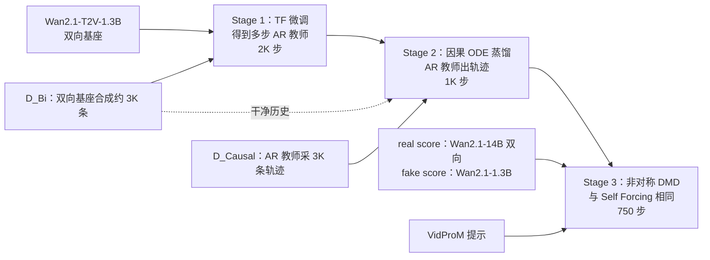

# Causal Forcing：双向教师不能拿来初始化自回归学生

<!-- release-date: 2026-02-02 -->

> 本文依据 **Causal Forcing: Autoregressive Diffusion Distillation Done Right for High-Quality Real-Time Interactive Video Generation**，arXiv:2602.02214v5，2026-06-01，ICML 2026，共 20 页。页码均指 PDF 自身页码。文中始终区分三件事：**报告写了什么**、**我们如何解释**、**哪些是外部补充或本文推算**。

## 读前先把几个词说成人话

这篇论文的公式不多，难的是它把「蒸馏」拆成了两件性质完全不同的事，并指出现行流水线在其中一件上用错了老师。先把会反复出现的词说清楚：

- **双向视频扩散**：一次把整段视频的所有帧一起去噪，每一帧都能看见未来帧。画质高，但整段生成完才能看，没法用在「下一帧还没发生」的直播、游戏里（PDF p. 1–2）。
- **自回归（autoregressive，AR）视频扩散**：一帧一帧（实际多是一块一块）往前生成，每帧内部仍走扩散；生成第 $i$ 帧时只能看过去。报告脚注说明实践里按 chunk 生成，正文为简洁按帧写（PDF p. 2）。
- **少步蒸馏**：预训练扩散要走几十步，实时交互要求每帧只走几步。当前做法分两段：先 **ODE 蒸馏** 给少步学生一个初始化，再做 **DMD** 进一步提质（PDF p. 1）。
- **PF-ODE（probability flow ODE，概率流常微分方程）与流映射（flow map）**：把去噪写成从噪声到数据的一条确定轨迹，给定起点终点唯一。「带噪样本沿教师的轨迹走到底会变成哪张干净图」这个映射记作 $\phi$（PDF p. 2–3，式（1））。
- **ODE 蒸馏**：让教师沿 PF-ODE 采样，存下（带噪中间态，干净终点）配对，学生用平方损失直接回归终点。报告把它看作一致性蒸馏（Consistency Distillation，CD）的简化版（PDF p. 3）。
- **DMD（Distribution Matching Distillation，分布匹配蒸馏）**：不要求学生复现教师轨迹，只要求学生生成样本的分布贴近数据分布。梯度由一个冻结的「真分布打分网络」$s_{\mathrm{real}}$ 和一个在线训练的「学生分布打分网络」$s_{\mathrm{fake}}$ 之差给出（PDF p. 3，式（2））。
- **Teacher Forcing（TF，教师强制）与 Diffusion Forcing（DF，扩散强制）**：训 AR 扩散时，过去帧用干净真值（TF），还是用各帧独立加噪后的版本（DF）（PDF p. 3）。
- **Self Forcing**：直接前作，也是本文要超越的对象。它训练时让学生按推理方式自回归滚动（self-rollout）再做 DMD，但它的 ODE 初始化用的是双向教师（PDF p. 4）。本站有 Self-Forcing 一篇。

## 一句话先说清

把双向视频扩散蒸成少步自回归模型，要跨两道缝：一道是 **采样步数缝**（几十步变几步），一道是 **架构缝**（全注意力变因果注意力，看不见未来）（PDF p. 1、p. 3）。

报告的判断是：架构缝不能交给 DMD，只能在 ODE 初始化里解决；而现行的 ODE 初始化让看得见未来的双向教师去给看不见未来的学生出标签。同一张带噪帧因此会对上多张干净帧，平方损失的最优解退化成它们的平均，也就是糊（PDF p. 4–5）。

Causal Forcing 的改法是三段：先用 TF 把双向基座微调成多步 AR 教师，再用这个 AR 教师采轨迹做 **因果 ODE 蒸馏**，最后接上和 Self Forcing 完全相同的 DMD（PDF p. 5–6）。在同样 17.0 FPS、0.69 秒延迟下，相对 Self Forcing 的 Dynamic Degree、VisionReward、Instruction Following 分别高 **19.3%**、**8.7%**、**16.7%**（PDF p. 1、p. 8，Table 1）。

> 逐步回归的蒸馏要学的是一个函数。教师看得见学生看不见的东西，标签就不再是函数，学生只能学到平均。

### 一条阅读路线

1. **p. 2 Figure 1、p. 3 Figure 2**：现象与隔离实验，先确认问题出在架构缝、且 DMD 补不回来。
2. **p. 4 Figure 3、式（3）–（4），p. 5 式（5）–（7）**：帧级单射的定义，以及它被破坏时为什么得到条件期望。
3. **p. 5–6 Stage 1–3、式（8）**：TF 训教师、因果 ODE、同一套 DMD。
4. **p. 8 Table 1、p. 9 Table 2**：主结果与消融。
5. **附录 C（p. 17–19）**：为什么不能跳过因果 ODE，以及「瓶颈在教师，不在学生起点」。

附录 B 的证明（p. 14–16）第一次读只需要记住结论。

## 主要矛盾：两道缝，DMD 只合得上一道

实时交互视频要的是少步 AR 生成：当前帧一出来就能给用户，后续帧还能根据用户反馈改条件。报告点名的应用有世界模型、游戏模拟、具身智能和交互内容创作（PDF p. 1）。多步扩散的采样开销直接卡死这些场景。

CausVid 与 Self Forcing 的主流做法叫 **非对称蒸馏**：拿强的双向视频扩散当老师，蒸出少步 AR 学生，流程是「ODE 初始化 + DMD」（PDF p. 3）。报告先摆出现象，再做隔离：

| 设定 | Dynamic Degree | Instruction Following | 出处 |
|---|---:|---:|---|
| 标准 DMD（双向教师蒸双向学生） | 约 67 | 约 56 | Figure 1、Figure 2 读图 |
| Self Forcing（双向教师蒸 AR 学生） | 57 | 48 | Table 1 |
| 只剩架构缝：用标准 DMD 蒸好的双向少步模型初始化 AR 学生 | 约 10 | 约 17 | Figure 2 读图 |

（Figure 1 在 PDF p. 2，Figure 2 在 PDF p. 3。两图的柱没有印数值，「约」字行是本文按坐标轴读出的近似值；Self Forcing 一行的数值与 Table 1 一致。）

第一行和第二行是现象：从同一个双向基座出发，最好的 AR 蒸馏仍明显落后于双向蒸双向（PDF p. 2）。第三行是隔离实验：先用标准 DMD 把步数缝合上，只留下架构缝，结果仍显著差于标准 DMD（PDF p. 3–4）。报告由此下结论：初始化时留下的大架构缝 **不能被后续 DMD 修复**，Self Forcing 两段式里真正该跨过架构缝的是 ODE 那一段（PDF p. 4）。

**我们如何解释它。** DMD 问的是「你滚出来的整段视频像不像真视频」。它能惩罚结果，但它从一个坏的生成器出发做局部修正；如果初始化时学的那个函数本来就不是推理时能用的函数，DMD 没有机制把它掰回来。所以矛盾变成：

> ODE 初始化该学什么函数？谁有资格给它出标签？

## 先看全景：三段后训练，每段各有自己的老师

这张图按 §3.3、§4.1 与附录 D（PDF p. 5–7、p. 19）重画，只表示阶段顺序、数据和老师从哪来，不含实测时间。

值得先看清的一点：**三段用了两种老师**。Stage 2 的轨迹必须来自 AR 教师；Stage 3 的 real score 仍是双向的 14B 大模型（PDF p. 19）。报告并不是说「所有老师都要改成因果的」，而是说逐步回归那一段必须如此。后面四节分别讲为什么。

## 核心设计一：帧级单射——ODE 初始化要的是函数，不是平均

### 旧问题：Self Forcing 的第一段在回归什么

Self Forcing 的 ODE 初始化是：双向教师沿自己的 PF-ODE 采样，AR 学生 $G_{\theta}$ 把带噪中间态回归到干净视频（PDF p. 4，式（3））：

$$
\theta^{*}=\min_{\theta}\ \mathbb{E}_{t,\,x_{t}^{1:N},\,i}\Bigl[\bigl\|G_{\theta}(x_{t}^{i},x_{t}^{<i},t)-x_{0}^{i}\bigr\|^{2}\Bigr]
$$

$i$ 在 $1$ 到 $N$ 里均匀抽，$(x_{t}^{1:N},x_{0}^{1:N})$ 落在双向教师的同一条 PF-ODE 上，$t$ 取自少步采样的预设时间点集合 $\mathcal{S}$。学生看见过去和当前带噪帧，预测当前干净帧。问题在于这个干净帧是谁标的。

### 新判据：单射要从整段降到每一帧

平方损失回归要学出一个良定义的函数，配对数据必须是单射：任一时刻，一个带噪样本只对应一个干净样本（PDF p. 4，报告引 Liu 等人 2022）。

- 双向蒸双向时，这个条件在视频级天然成立，因为 PF-ODE 本身是单射：整段带噪视频只对应唯一的整段干净视频（PDF p. 4，Figure 3a）。
- AR 学生一次只出一帧，要学的映射变成 $\phi^{\mathrm{AR}}:(x_{t}^{i},t)\mapsto x_{0}^{i}$。报告的定义 3.1 叫 **帧级单射**：两段带噪视频只要第 $i$ 帧相同，流映射给出的第 $i$ 张干净帧也必须相同（PDF p. 4，式（4））。

### 工作机制：一对多时，最优解是条件期望

式（4）一旦被打破，按式（3）训练的学生恢复不了教师的流映射，而是塌到条件均值（PDF p. 5，式（5））：

$$
G_{\theta}^{*}(x_{t}^{i},x_{t}^{<i},t)=\mathbb{E}\bigl[x_{0}^{i}\mid x_{t}^{i},x_{t}^{<i},t\bigr]
$$

报告的直觉解释是：学条件均值就是在多帧之间取平均，视觉上就是糊（PDF p. 5）。

双向教师为什么会给出一对多？因为它去噪第 $i$ 帧时用到了全部帧，固定 $x_{t}^{i}$、换一组未来帧 $x_{t}^{>i}$，得到的 $x_{0}^{i}$ 就可能不同；而 AR 学生训练时看不到这些未来帧，信息丢了，同一输入就对上多个目标（PDF p. 5）。报告把这写成两条：

- **Lemma 3.2**：只要双向流映射的第 $i$ 帧输出对「其余帧」不是几乎处处常数，就总能找到第 $i$ 帧相同、输出却不同的另一段带噪视频；而且这种碰撞发生在非零测度集上，即条件方差大于 0 的概率大于 0（PDF p. 5，式（6））。
- **命题 3.3**：此时回归的最优解 $\mathbb{E}[x_{0}^{i}\mid x_{t}^{i},t]$ **不服从数据分布**（PDF p. 5，式（7））。

附录的证明思路很短：平方损失的最优解是条件期望；由 $L^{2}$ 正交分解，$\mathbb{E}\|Y\|^{2}=\mathbb{E}\|\hat Y\|^{2}+\mathbb{E}[\mathrm{Var}(Y\mid U,t)]$，条件方差为正就有 $\mathbb{E}\|Y\|^{2}>\mathbb{E}\|\hat Y\|^{2}$，二阶矩不同的两个量不可能同分布（PDF p. 15，式（16）–（20））。附录还把「帧」推广到任意维度小于整段的「块」（Lemma B.1，PDF p. 14–15）。主实验恰好按 chunk 生成、每块 3 个潜变量帧（PDF p. 7），所以这个推广正好覆盖实际设定。

### 代价与边界

- 引理有一个前提：双向 DiT 的输出对其他帧不是几乎处处常数。报告用前人的注意力图实验作为依据，没有在本文里新测（PDF p. 15）。
- 帧级单射约束的是 **MSE 回归式** 的 ODE 蒸馏和一致性蒸馏。DMD 匹配的是分布，不要求逐步复现轨迹，所以 Stage 3 仍可用双向大模型当 real score。报告没有把「DMD 不需要帧级单射」单列成命题，这是我们从 §2.4 与 Stage 3 的分工读出来的。

### 可迁移启发

**回归式蒸馏里，教师的信息集不能大于学生推理时实际拥有的信息集。** 教师多看见的变量，会把同一个学生输入变成多个合法标签，平方损失随之改学平均。任何「教师能看未来、学生是因果的」的轨迹蒸馏，动手前都可以先画一张 Figure 3：同一个学生输入，教师会不会给出多个终点。

## 核心设计二：先用干净前缀训出一个 AR 教师

### 旧问题：训 AR 扩散，DF 真的更好吗

要让 ODE 的教师是因果的，先得有一个多步 AR 扩散模型。常见的两种训法里，CausVid 以及 LiveAvatar 等后续工作采用了「以带噪前缀为条件」的 DF 式训练（PDF p. 17）。直觉是 DF 覆盖了「过去干净或很吵」的整张噪声网格，推理时的情形自然被盖到。

报告说，在 AR 扩散上这个直觉不成立。

### 新设计与机制：训练条件要和推理条件是同一类东西

TF 学的是 $p_{\mathrm{data}}(x_{0}^{i}\mid x_{0}^{<i})$：实现上把干净视频和带噪视频拼在一起，用因果掩码让 $x_{t}^{i}$ 只看干净前缀 $x_{0}^{<i}$（PDF p. 3）。DF 学的是以独立加噪前缀 $x_{t}^{<i}$ 为条件的分布；可推理时，AR 模型看到的是已经生成好的干净前缀（PDF p. 5–6）。

**命题 3.4** 把这道缝形式化：在附录 B.2 的正则条件下，把 DF 学到的条件分布放到干净前缀上，它与真实条件分布的 KL 散度期望严格大于 0（PDF p. 6）。证明依赖三条假设：DF 训练达到最优；同一视频里不同帧不独立；加噪后验非退化（PDF p. 16）。TF 训练和推理都以干净前缀为条件，这道缝不存在。

报告同时划了边界：DF 最初是给双向模型做视频续写的，那里推理时本来就是「干净尾帧 + 噪声」，和训练一致，不在这条命题的反驳范围内；「各帧不同噪声水平」本身也不是问题。它反驳的只有一件事：**AR 训练时以带噪前缀为条件**（PDF p. 17）。

### 实验怎么证明

Table 2 第一组（PDF p. 9；附录 D 说明这一组 TF 与 DF 各训 3K 步，PDF p. 20）：

| AR 训练方式 | Total | Quality | Semantic | Dynamic | VisionReward | Instruction |
|---|---:|---:|---:|---:|---:|---:|
| Diffusion Forcing | 81.76 | 82.52 | 78.71 | 60 | 1.583 | 30 |
| Teacher Forcing | 82.12 | 82.73 | 79.67 | 50 | 3.343 | 32 |

VisionReward 从 1.583 到 3.343，报告写作提高 111.2%（PDF p. 8）。DF 的 Dynamic Degree 更高，但报告明确说这主要来自视频崩溃把运动指标病态抬高（PDF p. 8），Figure 4 的样例就是 DF 画面塌掉、TF 更稳（PDF p. 5）。

附录 C.1 又试了三种更新的 AR 训练法（PDF p. 17，Table 3）：

| 方法 | Dynamic Degree | VisionReward | Instruction Following |
|---|---:|---:|---:|
| Teacher Forcing | 50 | 3.343 | 32 |
| PFVG | 61 | 2.857 | 32 |
| BAgger | 53 | 2.715 | 28 |
| Resampling Forcing | 51 | 3.336 | 22 |

报告的结论是它们相对 TF 没有显著提升，并主动限定：这些方法多为长视频设计，5 秒设定里收益有限可以理解（PDF p. 17）。表里没有 VBench 总分，不能据此说 TF 在所有指标上都赢过长视频方法。

### 代价与边界

TF 把暴露偏差留到了后面：Stage 1 和 Stage 2 都在干净历史上训练，推理时的自生成历史要等 Stage 3 的 self-rollout 才出现。报告也用斜体强调，这个多步 AR 模型直接当 DMD 初始化已经好很多，但仍有突变伪影（PDF p. 6）；那是下一节的起点。

### 可迁移启发

**覆盖推理会出现的噪声水平，不等于对齐推理会看到的条件。** DF 覆盖了更密的噪声网格，却把条件从「干净过去」换成了「带噪过去」。凡是「训练时把条件弄得更丰富」的设计，都要单独问：丰富之后的条件，推理时到底会不会出现。另一条：运动类指标会站在崩溃一边，DF 的动态分就是例子，生成失稳时要有第二套读数。

## 核心设计三：因果 ODE——用 AR 教师出轨迹

### 为什么不能停在多步 AR 教师

最直接的想法是：既然 TF 训出的多步 AR 模型已经是因果的，直接拿它初始化 DMD 不行吗？附录 C.2 回答了这件事（PDF p. 17–18）：

| DMD 的初始化 | Total | Quality | Semantic | Dynamic | VisionReward | Instruction |
|---|---:|---:|---:|---:|---:|---:|
| Self Forcing 的 ODE | 82.00 | 82.18 | 81.29 | 24 | 3.330 | 38 |
| 多步 AR 扩散（TF） | 84.02 | 84.72 | 81.23 | 66 | 5.863 | 48 |
| 因果 ODE | 84.04 | 84.59 | 81.84 | 68 | 6.326 | 56 |

（PDF p. 18，Table 4。）

多步 AR 已经把大部分差距拉回来；因果 ODE 再把 VisionReward 和指令跟随抬上一截，Quality 一列略低于多步 AR。表注的说法是因果 ODE 取得最好的总体质量（Total）与 VisionReward（PDF p. 18）。

原因在少步。多步 AR 只在多步采样（如 50 步）下缩小了架构缝；换成 4 步时，第 $i$ 帧的条件是前面几帧低步数生成的结果，质量下降，而训练时条件是高质量真值前缀，这个错位沿自回归逐块累积（PDF p. 17）。Figure 7 在进入 DMD 之前直接比 4 步生成：多步 AR 扩散块间突变，因果 ODE 蒸出的模型更稳（PDF p. 18）。Figure 8 再比三种初始化接 DMD 后的样例，多步 AR 初始化仍会出现「两朵红花变成一朵」这类突变（PDF p. 18）。所以报告的结论是：先把多步 AR 转成少步模型，再拿去初始化 DMD（PDF p. 17）。

### 新设计：让 AR 教师出轨迹，学生在同一段历史上回归

Stage 2 先从数据集里取干净历史 $x_{\mathrm{gt}}^{<i}$，让 AR 教师从高斯噪声出发、以这段历史为条件用 ODE 求解器生成当前帧，并存下所需时间点 $\mathcal{S}\cup\{0\}$ 上的轨迹；学生以同一段干净历史为条件，把中间带噪态回归到干净目标（PDF p. 6，式（8））：

$$
\theta^{*}=\min_{\theta}\ \mathbb{E}_{x_{\mathrm{gt}}^{<i},\,t\in\mathcal{S},\,i,\,x_{t}^{i}}\Bigl[\bigl\|G_{\theta}(x_{t}^{i},x_{\mathrm{gt}}^{<i},t)-x_{0}^{i}\bigr\|^{2}\Bigr]
$$

教师本身是自回归的，它的 PF-ODE 按构造满足式（4），学生学到的就是真正的帧级流映射（PDF p. 6）。实现上，干净历史来自 $D_{\mathrm{Bi}}$，所以 $D_{\mathrm{Causal}}$ 的每条轨迹都记下了它在 $D_{\mathrm{Bi}}$ 里对应的那条；学生从 AR 教师初始化（PDF p. 19）。

这里历史用的是 **数据集的干净前缀**，不是学生自己滚出来的。这一段只负责学对「给定过去时当前帧的流映射」，训推历史的错位留给 Stage 3 的 self-rollout。两段各管一道缝。

### 关键 figure：差距来自教师，不来自学生起点

因果 ODE 和 Self Forcing 的 ODE 其实差两处：配对数据由谁生成，学生从谁初始化。附录 C.3 把两者拆开，用 $D_{\mathrm{Causal}}$ 做因果 ODE，但学生改从双向模型初始化（PDF p. 19）：

（引自 PDF p. 19，Figure 9。）

报告的结论：ODE 阶段的差距主要来自蒸馏设定本身，即教师应当是 AR 模型，而不是学生从哪里起步（PDF p. 19）。左组的糊，就是上面那张单射示意图 (c) 幅在真实画面上的样子。

### 可迁移启发

**结构不对称时，先造一个信息集和学生一致的教师，再对轨迹。** 学生起点可以沿用更强的预训练权重，Figure 9 说明这不是瓶颈；该换的是出标签的那一方。

## 核心设计四：同一套 DMD，接在正确的初始化后面

### 新设计：什么都不改

Stage 3 就是 Self Forcing 的非对称 DMD，报告原文写「Exactly as in Self Forcing's DMD」：学生以自己生成的前缀为条件做 self-rollout，缩小训推差距（PDF p. 6）。$s_{\mathrm{real}}$ 是 Wan2.1-14B，$s_{\mathrm{fake}}$ 是 Wan2.1-1.3B，严格沿用 Self Forcing 的设置（PDF p. 19）；提示用 VidProM，训 750 步至收敛（PDF p. 7）。

### 工作机制：为什么这里又允许双向老师

ODE 与一致性蒸馏要学生逐步复现教师轨迹，教师不能看见学生看不见的未来。DMD 只要求学生最终样本的分布靠近数据分布，双向 14B 提供的是「这段视频像不像真的」的评分场，而不是「第 $i$ 帧沿哪条轨迹走」。这是我们根据 §2.4 与 Stage 3 的设定做的解释，报告正文没有单开一节论证。

### 收益：动态从 24 回到 68

Table 2 把同一套 DMD 接在两种 ODE 初始化后面（PDF p. 9）：

| 方法 | Total | Quality | Semantic | Dynamic | VisionReward | Instruction |
|---|---:|---:|---:|---:|---:|---:|
| Self Forcing 的 ODE + DMD（chunk-wise） | 82.00 | 82.18 | 81.29 | 24 | 3.330 | 38 |
| 因果 ODE + DMD（chunk-wise） | 84.04 | 84.59 | 81.84 | 68 | 6.326 | 56 |
| Self Forcing 的 ODE + DMD（frame-wise） | 81.83 | 82.66 | 78.50 | 2 | 1.951 | −4 |
| 因果 ODE + DMD（frame-wise） | 83.75 | 84.35 | 81.37 | 64 | 6.204 | 42 |

chunk-wise 下，因果 ODE 让 VisionReward、Dynamic Degree、Instruction Following 分别提高 90.0%、183.3%、47.4%；frame-wise 下 Dynamic Degree 提高 3100%、VisionReward 提高 218.0%（PDF p. 8）。3100% 来自分母极小：Self Forcing 式初始化在逐帧设定下动态只剩 2，几乎不动。逐帧时自回归展开的次数更多，帧级非单射的伤害也更大，这和单射分析的方向一致。

注意这组消融里，Self Forcing 式 ODE 用 $D_{\mathrm{Bi}}$、因果 ODE 用 $D_{\mathrm{Causal}}$，两者都是同一批提示下内部合成的数据，报告据此认为数据质量对齐（PDF p. 8、p. 19）；更新步数上，Self Forcing 式 ODE 从双向模型训 3K 步，因果路径是 TF 2K 步加因果 ODE 1K 步，总数都是 3K（PDF p. 20）。

### 可迁移启发

**同一套匹配损失，初始化决定你匹配的是哪一座城。** DMD 的名字和超参都没变，Total 从 82.00 到 84.04、动态从 24 到 68，全来自起点。后训练很短、看起来「再训一截就好」的时候，更要先检查初始化学的是不是该学的函数。

## 延伸：因果一致性蒸馏，原则相同，实现还很粗

ODE 蒸馏是 CD 的简化，同一条单射原则自然适用于 CD（PDF p. 6）。报告给出的因果 CD 目标是：学生在干净前缀 $x_{\mathrm{gt}}^{<i}$ 上，让 $t$ 时刻的输出贴近停梯度网络在 $t-\Delta t$ 的输出，其中 $\hat x_{t-\Delta t}^{i}$ 由 AR 教师在同一干净前缀上解一步 ODE 得到（PDF p. 6，式（9））。用双向教师的非对称 CD 同样违反帧级单射，会塌（PDF p. 6）。

实现直接套 LCM：48 个离散时间点、UniPC 求解器、EMA 0.99，在 $D_{\mathrm{Bi}}$ 上训 3K 步，推理 4 步（PDF p. 19）。因为用的是流匹配的速度预测，$x_{0}$ 预测形式自动满足边界条件 $G_{\theta}(x,0)\equiv x$，不需要再包 $c_{\mathrm{skip}}$、$c_{\mathrm{out}}$（PDF p. 19–20，式（30）–（31））：

$$
G_{\theta}(x^{i},x_{\mathrm{gt}}^{<i},t)=x^{i}-t\,v_{\theta}(x^{i},x_{\mathrm{gt}}^{<i},t)
$$

结果（PDF p. 9，Table 2）：

| 方法 | Total | Quality | Semantic | Dynamic | VisionReward | Instruction |
|---|---:|---:|---:|---:|---:|---:|
| 非对称 CD | 79.07 | 79.99 | 75.37 | 59 | −7.983 | −42 |
| 因果 CD | 81.48 | 82.13 | 78.88 | 51 | 1.798 | 18 |

VisionReward 提高 9.781、指令跟随提高 60，报告写的是绝对差（PDF p. 8）。Figure 10 的样例里非对称 CD 严重发糊、有突变（PDF p. 20）。但因果 CD 的总分 81.48 仍低于因果 ODE + DMD 的 84.04；报告承认这是直接套 vanilla LCM 的粗糙实例，弱于 score distillation，并把「用因果 CD 替代因果 ODE 给 DMD 当初始化」留作未来工作（PDF p. 6、p. 8、p. 20）。

## 实验：同速度下拉开动态与指令跟随

### 设定

基座 Wan2.1-T2V-1.3B，生成 81 帧、$832\times 480$ 的视频（PDF p. 7）。全部方法按 chunk 实现，每块 3 个潜变量帧；所有结果按 chunk-wise 报告，ODE 初始化与 DMD 另报 frame-wise（PDF p. 7–8）。所有训练阶段 batch 64，Adam，学习率 $2\times 10^{-6}$，$\beta_{1}=0$，$\beta_{2}=0.999$，其余与 Self Forcing 相同（PDF p. 19）。推理 4 步，因果 ODE 与 DMD 共用时间点（PDF p. 19）：

$$
t\in\{1,\ 0.9375,\ 0.8333,\ 0.625\}
$$

**本文推算。** 这 4 个点恰好是 Self Forcing 均匀 4 步 $[1000,750,500,250]$ 经 Wan2.1 的时间步 shift（$k=5$）后归一化的结果：例如 $t=750$ 时 $\frac{5\times 0.75}{1+4\times 0.75}=0.9375$。Self Forcing 的日程与 shift 公式见 Self-Forcing 一篇；本报告只给了这 4 个数。

评测分两套提示，不能混（PDF p. 7、p. 20）：

- **VBench 的 Total、Quality、Semantic**：官方 VBench 提示；其中 Dynamic Degree 这一项在总分里仍按官方提示算。
- **表中单列的 Dynamic Degree、VisionReward、Instruction Following**：另编的 100 条动作丰富的提示，列表在补充材料里；分数都乘了 100。VisionReward 各子分在 $[-1,1]$，按官方权重加权，可以为负，越大越好；Instruction Following 是 VisionReward 的提示对齐子分。
- **用户研究**：10 人、10 条提示，对全部方法排序，Rating 越低越好（PDF p. 7）。
- **速度**：单卡 H100 上的 FPS 与秒；基线的吞吐与延迟直接取自 Self Forcing 论文（PDF p. 7、p. 20）。

### 主表

| 模型 | 吞吐（FPS） | 延迟（s） | Total | Quality | Semantic | Dynamic | VisionReward | Instruct | Rating↓ |
|---|---:|---:|---:|---:|---:|---:|---:|---:|---:|
| LTX-1.9B（双向） | 8.98 | 13.5 | 79.83 | 81.88 | 71.62 | 46 | −6.218 | −38 | 6.40 |
| Wan2.1-1.3B（双向） | 0.78 | 103 | 83.37 | 84.30 | 79.65 | 61 | 5.275 | 42 | 2.29 |
| NOVA（AR） | 0.88 | 4.1 | 80.31 | 80.66 | 78.92 | 46 | −7.381 | −16 | 8.41 |
| Pyramid Flow（AR） | 6.70 | 2.5 | 80.75 | 83.41 | 70.11 | 16 | 4.055 | −2 | 6.11 |
| SkyReels-V2-1.3B（AR） | 0.49 | 112 | 81.97 | 83.96 | 74.01 | 37 | 3.584 | 32 | 6.57 |
| MAGI-1-4.5B（AR） | 0.19 | 282 | 78.88 | 81.67 | 67.72 | 42 | 0.773 | 8 | 6.44 |
| CausVid（蒸馏 AR） | 17.0 | 0.69 | 81.33 | 83.98 | 70.72 | 62 | 5.741 | 12 | 4.27 |
| Self Forcing（蒸馏 AR） | 17.0 | 0.69 | 83.74 | 84.48 | 80.77 | 57 | 5.820 | 48 | 2.87 |
| **Causal Forcing** | 17.0 | 0.69 | 84.04 | 84.59 | 81.84 | 68 | 6.326 | 56 | 1.64 |

（PDF p. 8，Table 1。）

读表要分开的几件事：

- **速度不是新贡献。** 三个蒸馏模型都是 17.0 FPS、0.69 秒。本文比的是同延迟下的质量、动态与跟随。
- **三个头条百分比的分母是 Self Forcing。** $(68-57)/57\approx 19.3\%$，$(6.326-5.820)/5.820\approx 8.7\%$，$(56-48)/48\approx 16.7\%$（PDF p. 8）。
- **相对未蒸馏 AR 模型的三个百分比，分母不是同一行。** 报告写「相对最好的基线」动态高 47.8%、VisionReward 高 56.0%、指令跟随高 75.0%（PDF p. 8）。按表验算，分母分别是该组各列的最高值：动态对 NOVA 的 46，VisionReward 对 Pyramid Flow 的 4.055，指令跟随对 SkyReels-V2 的 32。
- **相对双向基座。** Total 84.04 对 Wan2.1 的 83.37，Quality 84.59 对 84.30，是同一档并略高，对应报告「匹配甚至超过」的说法；吞吐高 2079%，即 $17.0/0.78-1\approx 20.79$（PDF p. 8）。这个百分比只对 Wan2.1 一行有意义。
- **本表的 Self Forcing 数字是本报告重测的。** 它和 Self Forcing 原文 Table 1 的 VBench 分数不是同一次评测，两篇的绝对分不要加减。
- **训练预算对齐。** 两个蒸馏基线在 DMD 前都至少做了 3K 步 ODE 初始化，与本方法的 2K + 1K 相同，报告据此称训练预算完全相同（PDF p. 8）。这里的「相同」是更新步数，报告没有给墙钟或 GPU 小时。
- **用户研究是排序。** 1.64 全表最低（最好），样本 10 人乘 10 条提示，没有给置信区间。

Figure 6 的定性对比显示，CausVid、Self Forcing 的动作更弱，本方法的动态更接近甚至超过 Wan2.1（PDF p. 7）；更多视频在补充材料里。

## 边界：长视频与 APT2

**长视频不归这篇管。** 报告说 AR 并不天然等于能生成长视频：Causal Forcing 和 Self Forcing 一样在 5 秒视频、最多 5 秒注意力上训练，直接外推会造成新的训推错位与质量下降；解法是与之正交的长视频适配，训练类如 LongLive、Rolling Forcing，免训练类如 Infinity-RoPE、Deep Forcing（PDF p. 9）。本报告没有长视频定量结果。

**和 APT2 的分界。** 另一条少步 AR 路线是 GAN 蒸馏，代表是 APT2，本站以 AAPT 一篇收录。报告承认 APT2 用 teacher-forcing CD 做初始化，理论目标与因果 ODE 一致，然后列出三点区别（PDF p. 9）：

1. Causal Forcing 首次从理论上说明前向 KL 类蒸馏（ODE、CD）应当用 AR 教师训 AR 学生，APT2 没有理论分析；
2. 算法和架构不同：这边走非对称 DMD、用双向模型当 DMD 教师、支持时间维 KV 缓存推理；APT2 基于 GAN、没有双向教师、不用时间维 KV 缓存，而是把噪声和条件拼接；
3. Causal Forcing 开源了首个由因果 ODE 初始化的少步 AR 模型；APT2 未开源，本文不与其比较。

「首个」是作者的定位声明，不是实验结论。

## 报告没有写的部分

- **系统**：没有训练 GPU 数、墙钟、训练曲线；没有 Wan2.1 的层数、VAE 压缩比，也没写 81 帧对应多少潜变量帧；速度只有 H100 一种硬件，且基线数字取自前作。
- **方法**：没有「Stage 2 改用 self-rollout 历史」的对照；因果 CD 只有 vanilla LCM 一个实例。
- **评测**：100 条动作提示不在这 20 页里；VBench 总分里的 Dynamic Degree 与单列的 Dynamic Degree 用的不是同一套提示；没有 FVD、多样性指标；DF 动态分虚高的「崩溃」解释没有配第二套运动指标。
- **一处前后不一致**：§3.4 说非对称 CD 用双向模型当教师（PDF p. 6），附录 D 的消融说明却写两个 CD 变体都以 TF 训出的 AR 模型为教师（PDF p. 20）。按正文与 Figure 10 的叙事，非对称 CD 应是双向教师，附录那句很可能是笔误，但报告没有更正。

## 可迁移启发

1. **逐步回归的蒸馏，教师与学生必须看见同一个世界。** 教师多看见的条件会把同一输入变成多个标签，平方损失把它们平均掉。语言模型里「看得见后文的教师蒸因果学生」是同构问题，只是离散空间里的平均不叫糊，叫含糊的续写。
2. **匹配终点分布的工具，和匹配逐步轨迹的工具，对教师的要求不同。** DMD 可以请更强的双向 14B 打分；ODE 不行。不要因为都叫「蒸馏」就选同一个老师。
3. **后一段损失补不回前一段学错的函数。** Figure 2 合上步数缝后架构缝仍在；Table 2 里同一套 DMD 接在错误初始化后面，动态塌到 24，逐帧时塌到 2。
4. **先对齐条件，再谈覆盖。** AR 训练里 DF 覆盖更密却条件错位，TF 朴素却与推理一致。
5. **拆开混杂变量再下结论。** 附录 C.3 把「谁出标签」和「学生从哪起步」拆开，才把功劳归到教师身上；自己做对照时同样要一次只动一个变量。
6. **5 秒训出来的因果模型不能直接当长视频基线。** 外推本身就是新的训推错位，报告明确把它推给正交方法。

## 关键词回看

- **采样步数缝 / 架构缝**：多步变少步，与全注意力变因果注意力。标准 DMD 只跨前一道。
- **帧级单射**：同一张带噪帧必须对应唯一干净帧，ODE 回归才能恢复流映射；双向 PF-ODE 只在整段视频上单射。
- **条件期望解**：一对多时平方损失的最优解，不服从数据分布，视觉上表现为糊。
- **TF / DF**：干净前缀与带噪前缀。AR 教师选 TF，因为推理时的前缀是干净的。
- **因果 ODE 蒸馏**：AR 教师在干净历史上出轨迹，学生在同一段历史上回归。
- **非对称 DMD**：AR 少步学生，双向 14B 当 real score；Stage 3 原样沿用 Self Forcing。
- **因果 CD**：同一原则在一致性蒸馏上的实例，目前弱于 score distillation。
- **19.3% / 8.7% / 16.7%**：同速度下相对 Self Forcing 的动态、VisionReward、指令跟随提升。

## 资料与阅读边界

**原件与署名。** arXiv:2602.02214 最新版为 v5（2026-06-01），本文据此写作；首页标注 ICML 2026（PMLR 306）。作者 Hongzhou Zhu、Min Zhao（并列一作）与 Jun Zhu 署清华大学与生数，Hang Su 署清华大学，Guande He 署 UT Austin，Chongxuan Li 署中国人民大学；通讯作者 Jun Zhu（PDF p. 1）。

**首发日。** `release-date` 取 2026-02-02：官方仓库 [thu-ml/Causal-Forcing](https://github.com/thu-ml/Causal-Forcing) 的 News 写明论文、项目页与代码于 2026-02-02 发布，arXiv v1 同日提交；Hugging Face 权重仓库虽在 2026-01-30 已上传文件，但当时没有公开说明，不能证明已对外可用。

**外部补充，不是本报告内容。**

- 项目页 <https://thu-ml.github.io/CausalForcing.github.io/> 与代码仓在论文之后持续更新，包括 I2V、接入 Rolling Forcing 的分钟级长视频、更大基座上的版本。
- 后续工作 Causal Forcing++（[arXiv:2605.15141](https://arxiv.org/abs/2605.15141)）用因果一致性蒸馏替代 ODE 数据制备，那是另一篇论文，不要读回本报告的「未来工作」一句。
- 与本站相关篇目：Self-Forcing（直接前作，Stage 3 的来源）、AAPT（即文中的 APT2）。

**原文没有公开、本文也不补的缺口**：训练算力与墙钟、100 条动作提示的列表、H100 以外的速度、长视频定量结果、DMD 阶段的训练曲线。
