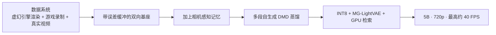
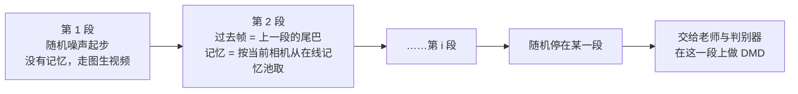
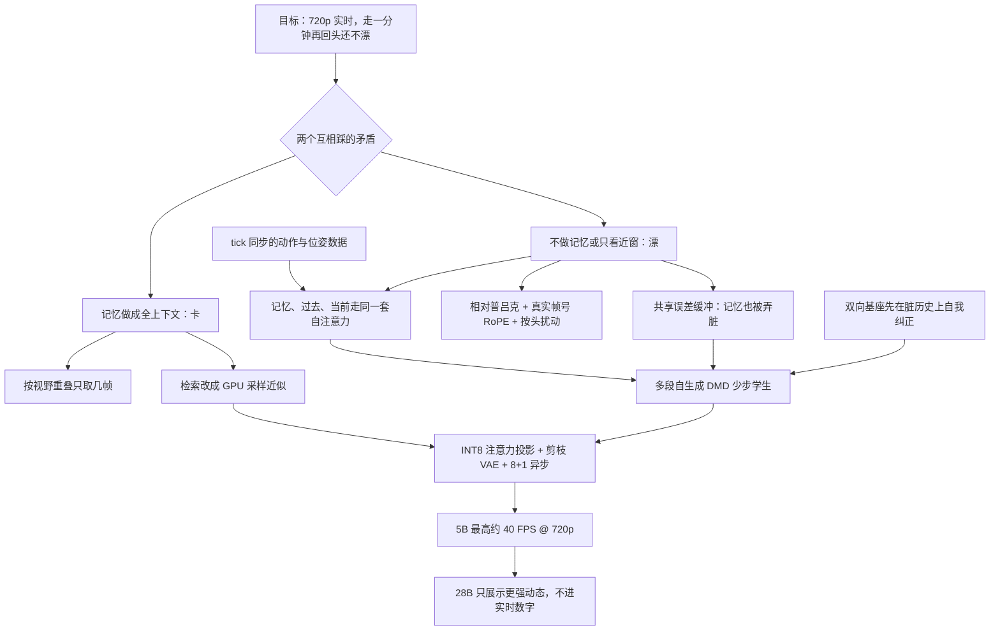

# Matrix-Game 3.0：记得太全会卡，记不住会漂，只取当前视角看得见的那几帧

<!-- release-date: 2026-03-27 -->

> 本文依据 Skywork AI 的 **Matrix-Game 3.0: Real-Time and Streaming Interactive World Model with Long-Horizon Memory**，即 arXiv:2604.08995v3（2026-09-29 修订），共 20 页。页码均指 PDF 自身的页码。文中会区分三件事：**报告明确写了什么**、**我们怎么解释它**、**哪些是外部资料或本文推算**。

## 阅读前先认识几个词

这篇报告的行话大多不是它发明的，是读懂它的前置背景：

- **世界模型（world model）**：给定已经看到的画面和这一步的动作，预测世界接下来长什么样。它和普通视频生成的差别只有一条：生成途中能不能被按键打断、改变走向。
- **扩散 Transformer（Diffusion Transformer，DiT）**：先给画面加噪声，再让 Transformer 一步步去噪。本篇的主干就是这种网络。
- **潜帧（latent）**：画面先被变分自编码器（VAE）压成一小块特征，模型在这些特征上工作，最后再由 VAE 解码回像素。
- **流匹配（flow matching）**：训练时让网络预测「从噪声走到干净画面」的速度方向，而不是一次猜出成品。
- **曝光偏差（exposure bias）**：训练时模型看的是干净的真实历史，推理时看的是自己刚生成、带着瑕疵的历史。误差会一段一段叠上去。
- **分布匹配蒸馏（Distribution Matching Distillation，DMD）**：不让学生逐步模仿老师的去噪轨迹，而是让学生产出的分布去贴真实数据分布，从而把几十步采样压成几步。
- **视锥（frustum）**：一台相机能看见的那一块锥形空间。两台相机的视锥重叠越多，它们拍到的东西越相同。
- **普吕克坐标（Plücker coordinates）**：用一组数描述三维空间里一条射线的方向与位置。本篇拿它告诉模型「当前相机相对某帧记忆，几何上差在哪」。

这篇报告里最重要的三个新名字是：

- **误差缓冲（error buffer）**：把模型自己的预测残差存起来，训练时再故意加回历史和记忆里，模拟推理时的「脏上下文」。
- **相机感知记忆检索（camera-aware memory retrieval）**：按当前相机和历史帧的视野重叠，只挑几帧历史进模型。
- **MG-LightVAE**：把 VAE 解码器剪窄后的轻量版本，专为 720p 流式解码提速。

## 一句话先说清

交互式世界模型走到 2026 年初，开源这边卡在一个两难上。报告在摘要里把它写成：已有方法很难**同时**做到带记忆的长时一致和高分辨率实时生成（PDF p.1）。

两条已经走过的路各缺一半（PDF p.2）：

- Matrix-Game 2.0 和 HY-Gamecraft-2 用因果自回归加少步扩散，能流式实时交互，但没有撑得住分钟级一致性的记忆机制；
- LingBot-World 把扩散模型的上下文拉长，长程几何一致性好了，但这样的容量很难和稳健的实时部署同时成立。

Matrix-Game 3.0 的回答是：**不拉长窗口，也不放弃记忆，而是按当前相机去检索少数几帧历史，再让它们和眼前的画面走同一套注意力。** 其余设计都是为了让这件事训得出来、跑得起来。

报告给出的结果（PDF p.1）：

- 5B 模型在 720p 上最高约 **40 FPS**；
- 分钟级序列上保持稳定的记忆一致性；
- 放大到 2×14B（正文也叫 MoE-28B）进一步改善画质、动态和泛化。

如果只记一句话，可以记这一句：

> **长记忆不等于把过去全部留下来一起算。先挑出这一眼看得见的那几帧，训练时就假设它们已经脏了，记忆才既撑得住、又跑得动。**

## 先看全景：数据、模型、部署三处一起改

报告把系统拆成四个部件（PDF p.5）：误差感知的交互基座、相机感知的长程记忆、训练与推理对齐的少步蒸馏、实时推理加速。再往前加一层数据，就是 Figure 2 的三栏流水线（PDF p.3）。

这张图按 Figure 2 与第 3 节的顺序重画，表示阶段依赖，不是实测耗时。

两档规模要分开看（PDF p.1、p.10、p.13）：

| | 5B | 2×14B / MoE-28B |
|---|---|---|
| 底座 | Wan2.2-TI2V-5B | 报告只写 MoE-28B 骨干，未点名底座 |
| 报告给了什么 | 训练配方、加速消融、VAE 重建表、定性图 | 训练分工的文字描述与 Figure 10 两行定性图 |
| 40 FPS 属于谁 | 属于这一档 | 没有 FPS、步数与显存 |

最容易读错的一点是：摘要把「40 FPS」和「分钟级记忆」写在同一句里，看起来像一个 5B 模型顺手同时得到的。往下读会发现是两条因果链。记忆先在多步基座上学会，再被蒸馏学生继承；40 FPS 是蒸馏之后，再靠量化、剪枝和 GPU 检索一刀一刀叠出来的。下文按这两条链分开讲。

## 第一笔账：动作、相机和画面要落在同一拍上

### 旧问题

报告引 Genie 3 说明：交互可控性和记忆能力，可以从标注精确的大规模视频里学出来（PDF p.3）。难点在数据：要同时拿到同步的动作、相机位姿，还要覆盖足够多的场景，单一数据源做不到（PDF p.3）。网上的视频没有「当时按了什么键」，一个模拟器或一款游戏又覆盖不了需要的分布。

没有这种成对的监督，后面的「按相机检索记忆」根本无从谈起——检索要用的就是每帧的相机位姿。

### 新设计：三条互补的数据源

报告把数据系统写成三条源，外加统一的标注与过滤（PDF p.3、p.11–13）。

**1. 虚幻引擎渲染（Unreal-Gen）。** 用 1000 多个 UE5 场景出视频。核心原则是 **tick 级同步**：每渲染一帧 $t$，在同一次引擎回调里同时记下（PDF p.11，式 12）

$$
\mathcal{D}_t = (I_t,\ p_t,\ r_t,\ c_t,\ \theta_t,\ a_t)
$$

- $I_t$：这一帧的 RGB 图；
- $(p_t, r_t)$：角色在世界里的位置和朝向；
- $(c_t, \theta_t)$：相机的六自由度位姿；
- $a_t \in \{0,1\}^6$：六维离散动作向量。

所有量在同一个引擎 tick 里采样，所以视频和状态在 tick 级对齐（PDF p.11）。

探索不是人来玩。高层强化学习策略按覆盖率与场景丰富度选导航目标，底层 NavMesh 规划无碰撞路径；另有多级兜底策略和三重卡住检测（位置增量、路径超时、包围盒）（PDF p.11）。相机在导航同时随机转动偏航和俯仰，支持第一人称和第三人称；角色拆成上衣、裤子、鞋、头发、外套、帽子、配饰分别抽取，组合数超过 $10^8$（PDF p.11）。渲染、云同步、自动质检都自动化，一个人靠 webhook 看几十台采集机（PDF p.11–12）。

**2. 游戏环境录制。** 一套四层解耦架构（PDF p.12）：

| 层 | 做什么 |
|---|---|
| 游戏进程层 | 每款游戏是独立进程，注入该游戏专用的 agent 插件，控制角色、读取状态 |
| Agent 层 | NavMesh 自主探索、多状态机协调、八方向视角切换；每帧状态经 JSON 文件进程间通信导出，轮询不到 1 毫秒 |
| 录制协调层 | OBS 按 60 秒分段录制；由位移反推 WSAD 键位 |
| 数据集输出层 | MP4 视频配逐帧 CSV：六维动作、相机参数、完整位姿 |

WSAD 不是人标的。把位移 $\Delta p_t$ 投影到相机的前向 $f$ 与右向 $r$（PDF p.12，式 13）：

$$
f = (\cos\theta_{\mathrm{yaw}},\ \sin\theta_{\mathrm{yaw}}),\qquad
r = (\sin\theta_{\mathrm{yaw}},\ -\cos\theta_{\mathrm{yaw}})
$$

再按 $\langle \Delta p_t, f\rangle$ 与 $\langle \Delta p_t, r\rangle$ 的正负分进八个方向。报告写整体数据准确率超过 99%（PDF p.12）。摘要把这条源称作「从 AAA 游戏大规模自动采集」（PDF p.1），正文只写「受支持的游戏」，没有列出具体作品。

**3. 真实视频。** 补光照变化和自然的相机轨迹：DL3DV-10K（1 万多条 4K 序列、65 类兴趣点）、RealEstate10K（室内静态、轨迹干净）、OmniWorld-CityWalk（YouTube 第一人称城市步行）、SpatialVid-HD（行人、驾车、航拍，报告称是最大子集）。不管原数据集自带什么位姿，一律用 ViPE 重新标注，统一坐标约定（PDF p.12）。

**标注与过滤。** 每条 clip 用 InternVL3.5-8B 写结构化描述，沿用 LingBot-World 的四层框架：叙事描述、静态场景描述、稠密时间描述、0–10 分的五维感知质量分（PDF p.12）。轨迹再过三道滤镜：深度重投影误差看局部几何，最大与中位位移比看全局异常，中位速度去掉过慢和过快的 clip；阈值在虚幻引擎真值上标定。连同质量过滤，一共去掉 20% 原始数据（PDF p.12–13）。

### 收益与边界

收益是：记忆检索依赖的相机几何、动作控制依赖的键位，都变成了能规模化生产的监督，而不是事后从网络视频里猜。

边界也要写清。报告**没有**给三类数据各占多少小时、过滤后总时长多少；训练规模只出现一处，记忆基座用了约 480 万条 clip（PDF p.13）。这是一套采集系统的架构描述，没有随附数据集或采集脚本。Figure 7 是数据样例拼图，其中两格被模糊处理（PDF p.11），不是配比图。

### 对自己项目的启发

需要「动作和观测成对出现」时，先保证**同一个时钟**采样，而不是录完再对齐。游戏录制那一条则给了另一种便宜监督：键位不必人标，可以由位移在相机坐标系上的投影反推。

## 第二笔账：基座先学会在脏历史上自我纠正

### 旧问题

后面一定要蒸馏成少步模型。已有的世界模型和视频生成方法大多用「双向老师、因果学生」的异构配对，而 Causal Forcing 的理论分析指出，这种异构会导致映射不匹配、训练不稳（PDF p.5；详见 Causal-Forcing 一篇）。

还有第二个坑：推理时模型看到的历史是自己生成的、带误差的。老师如果只在干净真历史上训过，它给学生的蒸馏目标本身就不准。

### 新设计：两条原则加一个误差缓冲

两条原则（PDF p.5）：

1. **结构一致**：多步基座和少步学生都用双向架构，避开异构带来的不稳，也降低基于常微分方程（ODE）蒸馏的成本；
2. **对不完美上下文鲁棒**：基座也要在被污染的历史上训练。

Figure 3 的做法是把一段潜帧 $x^{1:N}$ 切成两组：前 $k$ 帧是「过去帧」，当条件；后 $N-k$ 帧是「当前帧」，加噪后要预测。两组拼起来进双向 DiT，流匹配损失只算在当前帧上（PDF p.5–6）。

动作分两路注入，沿用 Matrix-Game 2.0 与 GameFactory（PDF p.6）：

- **离散键盘**：单独一个交叉注意力模块，管「往哪走、跳不跳、攻不攻击」这类交互行为；
- **连续鼠标**：直接进自注意力，影响当前视觉状态。

自我纠正沿用 Stable Video Infinity（SVI）的误差回收。训练时维护一个误差缓冲 $\mathcal{E}$。先把网络输出换算成干净估计 $\hat x^{i}$（即由预测的流推出的 $x_0$），残差是（PDF p.6，式 1）

$$
\delta = \hat x^{i} - x^{i}
$$

所有残差进 $\mathcal{E}$。注入时从缓冲里均匀抽一个 $\delta$，加到历史上（PDF p.6，式 2）

$$
\tilde x^{i} = x^{i} + \gamma\delta
$$

$\gamma$ 控制污染强度。训练目标就是在被污染的历史 $\tilde x^{1:k}$ 和动作 $c$ 条件下做流匹配（PDF p.6，式 3）。模型因此要学会：历史已经脏了，仍要给出对的当前帧。

训练设置（PDF p.13）：动作模块加在前 15 个 DiT 块；以 0.8 的概率用 4 帧过去潜帧加 10 帧当前噪声潜帧训练，否则把过去和记忆都掩掉，退化为带动作的图生视频，输入是参考潜帧加 14 帧当前噪声，对应流式推理的第一段；学习率 $2\times 10^{-5}$，微调 50K 步。

### 收益与边界

这一步还不是记忆。它只是把「推理时会看到自己的错」提前放进训练分布。Figure 8 是 1 到 5 秒的定性图：角色听键盘，背景没有明显漂移，镜头推拉与相机运动大致一致（PDF p.13–14）。它证明的是短时可控，不是分钟级记忆。

报告没有给 $\gamma$ 的取值，也没有「只训干净历史」对「加误差注入」的对照实验。

### 对自己项目的启发

下游一定要蒸馏时，别让老师活在学生永远进不去的干净世界里。先把师生结构对齐，再把学生推理时会遇到的脏上下文喂给老师，比事后加大蒸馏损失更对症。

## 第三笔账：记忆检索怎么让回头时不漂

这是全文最重要的一条因果链。

### 旧问题：两条现成路都不理想

流式生成时，当前预测不能只看最近几帧；走远再回头，空间布局、物体状态、外观都得对得上（PDF p.6）。报告先试了两个方向（PDF p.6–7）：

1. **隐式稀疏长上下文**（如 Mixture of Contexts）：在稀疏路由的长上下文里按相似度检索 top-k 块。高噪声阶段相似度估不准，记忆选择会抖，少步设定下难以收敛；训练时维持长上下文本身也很贵。
2. **相机感知的外挂分支**：按相机检索记忆帧，再用交叉注意力注入。检索稳了，但多出来的记忆分支和主干特征对不齐，加上逐层重复注入，收敛慢；即便加上更早记忆世界模型的几何线索，收益仍然有限。

一句话：全看太贵且不稳，外挂一条记忆通路又学不进去。

### 新设计：四件事绑在同一个 DiT 里

这张讲解图据 Figure 4、式 4–7（PDF p.7–8）与训练设置（PDF p.13）重画。下面逐项补图上读不出的「为什么」。

**第一，联合自注意力，不外挂分支。** 检索来的记忆潜帧、时间上对齐的近期过去帧、当前带噪帧放进**同一个注意力空间**，模型只预测当前帧（PDF p.7）。分工是：近期历史管短时连续，检索记忆管更远的锚点——场景布局、物体状态、视觉身份。报告的理由是：记忆特征和预测特征在同一个主干里一起演化，比单独养一条记忆通路更适合流式生成（PDF p.7）。

**第二，按相机与视野重叠检索，再加相对普吕克编码。** 长滚动里视角频繁变化，不是所有历史都有用，所以只按相机位姿和视野重叠挑相关的历史（PDF p.8）。检索之后，用普吕克式的线索显式编码当前目标与被选记忆之间的相对相机几何，帮模型推理「同一块场景换个角度该怎么对齐」，减少把历史用错视角（PDF p.8）。推理时还可以选择保留序列第一个潜帧当 **sink latent**（常驻锚点）：它不对应某个具体视角，而是为整段滚动提供粗粒度的风格与外观统计，补检索帧偏重「当前能看见什么」的不足（PDF p.8）。

**第三，误差注入覆盖记忆，而不只是最近历史。** 训练时记忆与历史取自真实视频，推理时却来自已生成的帧，一定带累积误差。如果只在干净记忆上训，检索通路在推理时会失效。于是误差缓冲改成共享的：记忆、近期历史、当前预测三组的残差都进同一个 $\mathcal{E}$，注入时分别加到历史与记忆上（PDF p.8，式 4–5）：

$$
\tilde x^{1:k} = x^{1:k} + \gamma_h\delta,\qquad
\tilde m^{1:r} = m^{1:r} + \gamma_m\delta
$$

$\gamma_h$、$\gamma_m$ 分别控制历史和记忆的污染强度。对应的训练目标同时以被污染的历史、被污染的记忆、动作 $c$ 和几何条件 $g$ 为条件（PDF p.8，式 6）。模型要学的是：从已经脏了的记忆里，把有用的布局和外观抠出来。

**第四，旋转位置编码（RoPE）写入真实帧号，并按头扰动基频。** 普通 RoPE 只给当前片段内的相对位移。本篇把每个记忆、历史、预测潜帧在整条序列里的**原始帧号**写进时间维的 RoPE，让模型分得清「刚才」和「很久以前」（PDF p.8）。但 RoPE 是周期函数，很久以前的记忆和当前帧可能恰好相位对上，模型会误以为它们时间上很近，进而原样照抄。于是训练时给每个注意力头一个不同的有效基频（PDF p.8，式 7）：

$$
\hat\theta_h = \theta_{\mathrm{base}}\,(1 + \sigma_{\theta}\,\epsilon_h)
$$

$\epsilon_h$ 是随头变化的系数，$\sigma_{\theta}$ 控制幅度。不同头的周期不再同步，偶然的位置混叠被打散。实现上 $\epsilon_h$ 在各头之间线性排开，$\sigma_{\theta}$ 固定为 0.8，训练与推理都开；这个想法来自 LoL 的多头 RoPE 抖动（PDF p.13）。

记忆基座从同一个带动作的基座初始化，训练时拼接 5 帧记忆、4 帧过去、10 帧噪声潜帧，训练集约 480 万条 clip（PDF p.13）。

### 远距记忆真的被用上了吗

改了时间编码之后，要担心的是反方向：远距记忆会不会因为相位差太大而被注意力压没。Figure 5 是报告的回答。

图引自原文 Figure 5（PDF p.7）。报告说明这张图把所有 DiT 块、所有去噪步、帧内所有 token 的自注意力平均后聚合成帧级权重（PDF p.8），图题标的是第 5 个头。读图：预测帧帧号标为 111 到 124，记忆列在色标上大约 0.05 上下，对角线在 0.2–0.3 之间（读自 Figure 5）；图下标出的记忆帧号只印出「1,5,6,1」四个数，和 5 列对不上。报告的结论是：即使记忆在时间上离得很远、旋转相位差很大，它仍拿到不可忽略的注意力，部分记忆格与预测帧之间近旁的非对角交互相当（PDF p.8）。

这是一张注意力可视化，只说明「记忆没有被压没」，不直接证明画面一致。直接的证据在下一张图。

### 回访实验：后半段动作取反，逼模型回到旧视点

图引自原文 Figure 9（PDF p.15）。设计很关键：每行第一帧是输入图，**后半段的动作是前半段的逆**，相机被迫回到走过的区域（PDF p.13）。回访时能重建出来的东西，不能用「短时连续」解释，必须靠长程记忆。报告点名找回的是局部几何、物体摆放、立面图案和纹理，都用红框标出（PDF p.13）。蒸馏模型的 Figure 11 用同一思路，故意设计会回访若干视点的动作序列：先出现、后被遮挡的内容能复现，后段风格与内容没有明显漂移（PDF p.14、p.16）。

### 这条链为什么能让回头不漂

把四件事收成一句因果：**当前这一步只被允许看几何上相关的过去；这些过去和眼前画面在同一套注意力里对齐；时间编码让它分得清远近又不误抄；训练时这些过去还被故意弄脏。** 所以走一圈再回来，模型不是靠短时平滑「猜一个像的」，而是把当时看见的那几帧找回来用。

### 代价与没写清的地方

- **检索粒度是整帧**：一次取回的是整帧潜变量。推理时从不断变长的候选集中怎样维护训练时的 5 个槽位，报告只给了逐查询视角取最高分那一帧的式 9（PDF p.10），没有完整流程。
- **没有定量消融**：没有「去掉检索 / 去掉普吕克 / 去掉误差注入 / 去掉 RoPE 扰动」的数字，证据是一张注意力热力图和两组回访定性图。
- **$\gamma_h$、$\gamma_m$ 没给**，sink latent 的开关对结果的影响也没给。
- **没有随时间变化的一致性曲线**：摘要与结论说「分钟级序列上稳定」（PDF p.1、p.16），但 Figure 1 的时间轴画到 60 秒，Figure 9 与 Figure 11 的抽样只到 30 秒，没有回访误差、轨迹误差之类的定量曲线。

### 对自己项目的启发

任何「既要长期记、又要当前快」的系统都可以问三个问题：这一步真正需要哪些历史？这些历史能不能和当前状态走同一套计算，而不是另开一条对不齐的通路？训练时喂的历史，是不是推理时那种已经脏了的历史？长视频、带地图的机器人、带长期记忆的 agent，问法一样。另外，**只要把很老的状态和当前状态放进同一个周期性位置编码，就要检查会不会因为相位碰巧对上而误抄**。

## 第四笔账：双向学生怎么蒸馏成少步

### 旧问题

现成的蒸馏方法（Self-Forcing 等）多用因果学生，按块推理，学生天然能在老师窗口的长度内自己往下滚（PDF p.9；Self-Forcing 的做法见 Self-Forcing 一篇）。本篇的学生是双向的，一次看整个窗口，不再按块推。单窗推理给不出自回归所需的「有偏但干净」的历史帧；如果直接拿真帧当历史，训练和推理又错位，曝光偏差回来了（PDF p.9）。

### 新设计：让学生在训练里自己滚多段

Figure 6 把学生训练画成多段滚动（PDF p.9）：

这张图按 Figure 6 与第 3.3 节文字重画，是流程示意。

DMD 在采样时刻 $t$ 上最小化学生分布与数据分布之间的反向 KL 散度，梯度用两个分数函数之差近似（PDF p.9，式 8）：一个是数据分数 $s_{\mathrm{data}}$，由老师提供；一个是学生分布的分数 $s_{\mathrm{gen},\xi}$，由判别器（critic）估计。两者都以当前段的噪声样本、上一段尾巴 $x^{\mathrm{past}}$、动作 $c$ 和记忆 $M$ 为条件。

结果是：学生在训练里就已经在「自己生成的历史 + 自己检索的记忆」上走少步，而不是在真帧上抄近道。

配方（PDF p.13）：

| 阶段 | 设置 |
|---|---|
| 初始化 | 老师、判别器、学生都从记忆增强基座初始化 |
| 冷启动 | 前 600 步单段推理，过去帧用真值，防止少步学生一上来在多段上崩掉；学生学习率 $5\times 10^{-7}$、判别器 $1\times 10^{-7}$，每轮学生更新 5 次 |
| 多段 | 段数 $k$ 每轮在 1–6 之间均匀抽取；两者学习率都是 $1\times 10^{-7}$，每轮学生更新 3 次，共 2400 步 |
| 掩码 | 与基座一致，过去帧与记忆以 0.2 的概率被掩掉 |

### 边界

报告通篇只写「few-step」，**没有写具体步数**。官方仓库推理脚本里蒸馏模型用 3 步（外部补充，见文末），这不是报告原文。也没有「单段蒸馏对多段蒸馏」的对照实验；多段方案的必要性是论证出来的，证据是 Figure 11 的定性回访。

### 对自己项目的启发

双向模型要流式部署，不能只蒸馏单窗。把真实推理的滚动过程搬进训练，让学生在自己的输出上被纠正，是 Self-Forcing 一系的核心思想；本篇把它推广到了双向学生加外部记忆的设定。冷启动那 600 步也值得记：少步学生一开始太弱，直接上多段会崩，先在单段真值上站稳再放开。

## 第五笔账：40 FPS 是三刀叠出来的，检索是最大那一刀

### 旧问题

蒸馏到少步之后，720p 流式还剩三处硬开销：DiT 本身、VAE 解码、以及每一步都要做的记忆检索（PDF p.9–10）。而且候选记忆会随迭代越积越多，检索成本跟着涨（PDF p.10）。

### 新设计：部署方式加三刀

部署是异步的：**8 张 GPU 跑 DiT，1 张 GPU 专门做 VAE 解码**（PDF p.10）。H 系列用 FlashAttention 3，A 系列用 FlashAttention 2（PDF p.14）。报告在脚注里致谢 Reactor 提供的加速基础设施（PDF p.9）。

**DiT 的 INT8 量化。** 只量化注意力的投影层，FFN、VAE、文本编码器保持原精度；算子改编自 LightX2V（PDF p.10）。不是全模型量化。

**VAE 剪枝：MG-LightVAE。** DiT 快了以后，解码成了主瓶颈。沿用 LightX2V 的同构解码器设计：结构不变，只减小解码器的隐藏维度。训练流程改编自 Turbo-VAED，数据是 70 万条 17 帧 clip，来自游戏环境与真实场景的混合。训了 50% 与 75% 两个剪枝比，报告写解码加速分别为 ×2.6 和 ×5.2；另外第一次迭代后对解码器做 `torch.compile`，降低后续延迟（PDF p.10）。

**GPU 上的记忆检索。**

这张讲解图据式 9–11（PDF p.10）画，是机制示意。第 $k$ 次迭代时，每个查询视角 $i$ 从候选集 $C_k$ 里挑几何重叠最大的那一帧（式 9）：

$$
j_i^{\star} = \arg\max_{j \in C_k} s(i, j)
$$

CPU 版用精确的视锥重叠分（式 10）：

$$
s_{\mathrm{exact}}(i,j)=\frac{\mathrm{Vol}\bigl(\mathcal{F}(E_i)\cap\mathcal{F}(E_j)\bigr)}{\mathrm{Vol}\bigl(\mathcal{F}(E_i)\bigr)}
$$

$\mathcal{F}(E_i)$ 是相机 $E_i$ 的视锥。准，但要做三维求交，贵。GPU 版改成基于采样的近似（式 11）：$s_{\mathrm{approx}}(i,j) = \frac{1}{N}\sum_{n=1}^{N} \mathbb{1}^{(j)}_n$，即 $N$ 个采样里满足条件的比例，避开显式的三维求交（PDF p.10）。报告没写点撒在哪；按式 10 以查询视锥体积做分母，最自然的读法是在查询视锥里撒点、判断是否落进候选视锥——这是本文的推断。报告强调的是：近似**保住了按几何重叠的排序**，而检索只需要排序（PDF p.10）。

### 实测：Table 1

Table 1 的设定是**用 75% 剪枝 VAE 的完整推理**，每次拿掉一个组件看帧率掉多少（PDF p.16）：

| 配置 | FPS | 掉了多少 |
|---|---:|---:|
| 完整配置 | 约 40 | — |
| 去掉 INT8 量化 | 27.38 | 12.62 |
| 去掉 MG-LightVAE | 25.79 | 14.21 |
| 去掉 GPU 检索 | 6.60 | 33.40 |

读这张表的关键一行是最后一行：**检索退回 CPU 精确求交，帧率从约 40 掉到 6.60。** 比去掉量化、去掉轻量 VAE 惨得多，报告自己也把 GPU 检索称为最关键的组件（PDF p.15）。换句话说，第三笔账里那套「按相机检索记忆」如果实现得笨，记忆这个功能本身就会把实时打回个位数帧率。

另外三点口径（PDF p.14–15）：表里的「约 40」没有给小数，也没有拆成 H 系列与 A 系列两行，报告只说同一并行设置下 H 系列吞吐一致高于 A 系列；单机 7+1 配置「稍慢」，没给数；表格没标所用 GPU 型号。

### 实测：Table 2

VAE 在一个小测试集上比重建质量，17 帧、720×1280（PDF p.15、p.17）：

| 模型 | PSNR ↑ | SSIM ↑ | 编码 + 解码（秒）↓ | 仅解码（秒）↓ |
|---|---:|---:|---:|---:|
| Wan2.2 VAE | 33.79 | 0.99 | 0.99 | 0.76 |
| MG-LightVAE（剪 50%） | 31.84 | 0.99 | 0.52 | 0.30 |
| MG-LightVAE（剪 75%） | 31.14 | 0.99 | 0.35 | 0.13 |

三行 SSIM 都是 0.99，区分度只在 PSNR 与耗时上。按表内解码耗时算，50% 与 75% 的加速约为 2.5 倍与 5.8 倍（本文除法），与正文写的 ×2.6、×5.2 不完全一致，正文没说那两个数的测法。Figure 12 的定性对比只展示 50% 版本（PDF p.17），而 Table 1 的 40 FPS 用的是画质代价更大的 75% 版本——**报告没有展示 75% 版本的重建样例**。

### 对自己项目的启发

- **新能力的代价要单独消融到吞吐。** 加记忆、加重排、加工具调用，都该有「去掉它掉多少帧率或 QPS」这一行，而不是只报完整系统的峰值。
- **代价随时间线性增长的模块，先问近似能否保住相对名次。** 检索只要排序对，分数不必精确。
- **报「实时」要连并行宽度一起报。** 这里的 40 FPS 是 8+1 张卡的异步流水线，不是单卡。

## 第六笔账：28B 回答「更大是否更像世界」，不回答实时

报告说受 LingBot-World 启发，在 MoE-28B 骨干上放大，以改善泛化、动态建模和长程一致（PDF p.10）。它和 LingBot-World 的做法有一处不同：报告观察到**只在高噪声模型上训练动作模块就足以实现精确控制**，低噪声模型可以不接动作，专心修细节（PDF p.10）。于是：

- 高噪声模型用动作准确的数据训，噪声区间窄，动作控制收敛快；
- 低噪声模型用互联网视频训，提升泛化，把无标注数据的潜力用起来；
- 第一人称和第三人称的动态难以一起建模，所以训两个高噪声模型（各管一种视角），共享一个低噪声模型；
- 训练中逐步加大分辨率和 clip 长度，加快收敛、稳定长程行为（PDF p.10–11）。

Figure 10 是 28B 第三人称生成的定性图，只有两行：城市里骑摩托、户外探索，在 0 到 30 秒的抽样里布局、角色身份、物体关系看起来稳定，动作也更活（PDF p.14–15）。

这里必须停住：报告没有给 28B 的 FPS、采样步数、显存，也没有和 5B 的并排分数。**不能把 40 FPS 安到 28B 头上，也不能把 Figure 10 的观感安到 5B 头上。**

对自己项目的启发：当带标签的动作数据远少于无标签视频时，把「控制」交给高噪声段、把「画质」交给低噪声段，让两类数据各喂一段，比混在一起全量微调更省。

## 实验实际证明了什么

被实验直接撑住的范围其实很窄：

| 结论 | 证据 | 强度 |
|---|---|---|
| 5B 短时可控、背景不漂 | Figure 8，1–5 秒（PDF p.14） | 定性 |
| 回访旧视点时细节能找回 | Figure 9 基座、Figure 11 蒸馏（PDF p.15–16） | 定性，但实验设计排除了短时连续的解释 |
| 远距记忆仍拿到注意力 | Figure 5（PDF p.7） | 可视化，单个头 |
| 约 40 FPS 由三刀叠成，检索最关键 | Table 1（PDF p.16） | 定量 |
| 剪枝 VAE 换速度、掉 PSNR | Table 2、Figure 12（PDF p.17） | 定量 + 定性 |

写进结论、但没有被定量撑住的：

- 「分钟级序列上稳定的时空一致性」（PDF p.1、p.16）：没有随时长变化的曲线；
- 「放大到更大模型改善画质、动态和泛化」（PDF p.1、p.16）：只有 Figure 10 两行；
- 与 Genie 3、LingBot-World、RELIC、WorldPlay 的比较：只在相关工作里用文字定位（PDF p.4–5），实验部分没有与任何外部系统的对表。

## 限制与未公开信息

报告没有单独的局限性一节。结论里的未来方向把缺口写在明处：继续放大模型与数据、为更高分辨率与更长序列设计更高效的结构、探索更强的记忆机制以建模长期依赖与复杂交互（PDF p.16–17）。

读完必须留下的边界：

- **40 FPS 的前提**：5B、蒸馏后、INT8、75% 剪枝 VAE、GPU 检索、8+1 异步部署。换任何一项，报告都没给数；
- **少步的步数没写**，外部仓库写 3 步；
- **没有和外部系统的定量对比**，画质与一致性主张主要靠定性图；
- **没有记忆机制各组件的消融**；
- **数据不可复现**：场景数、组合数、准确率 99%、过滤 20% 都有，三类数据的配比与总时长没有，数据集也未发布；
- **28B 只是能力展示**：没有速度、没有分数；
- **训练算力、GPU 小时、总 token 数都没给**。

## 最值得带回自己项目的七条

### 1. 记忆带宽按当前查询切，不按历史长度切

当前相机只需要和自己视野重叠的那几帧。先问「这一步看得见什么」，再决定取哪几条记忆。

### 2. 记忆和当前状态最好走同一套计算

外挂的交叉注意力分支看起来解耦，报告的教训是对不齐、收敛慢。能放进同一个自注意力空间时，先试联合建模。

### 3. 检索来的记忆也要按「已经脏了」来训

训练用真帧记忆、推理用生成帧记忆，是一条新的训练与推理裂缝。把误差缓冲接到记忆通路上，比只污染最近窗口更对症。

### 4. 周期性位置编码会让远距记忆假对齐

写入真实时间戳，再按头扰动基频，是便宜的防误抄手段。

### 5. 师生结构先对齐，再谈少步

宁可学生也保持双向、用多段滚动模拟流式，也不让双向老师配因果学生。

### 6. 新功能的代价要单独消融到吞吐

Table 1 把 GPU 检索证明成最大的一刀。任何随时间增长的附加模块，都该有「去掉它掉多少」这一行，并先检查近似实现能否保住排序。

### 7. 控制和画质可以拆给不同噪声段、不同数据

动作交给高噪声段、互联网视频交给低噪声段，再按视角拆高噪声专家，让稀缺的标注数据只用在它不可替代的地方。

## 用一张图重新串起全文

## 关键词回看

- **tick 级同步**：虚幻引擎同一次回调里记下画面、角色、相机和动作，监督天然对齐。
- **误差缓冲**：存下预测残差，再随机加回历史与记忆，模拟推理时的脏上下文。
- **相机感知检索**：按位姿与视野重叠挑历史帧，不按像素相似度，也不留下全部历史。
- **联合自注意力**：记忆、近期历史、当前噪声帧共用一个 DiT 的注意力。
- **sink latent**：可选的首帧常驻锚点，管全局风格与外观统计。
- **相对普吕克编码**：告诉模型当前相机相对每帧记忆差在哪。
- **按头扰动 RoPE**：每个头的旋转基频不同，打破周期性假对齐。
- **多段自生成 DMD**：双向学生在训练里自己滚多段，在自生成历史与在线记忆上做分布匹配。
- **MG-LightVAE**：只剪解码器隐藏维的轻量 VAE；40 FPS 那张表用的是 75% 剪枝版。
- **GPU 采样检索**：用采样比例近似视锥体积交，保住排序，避免检索把帧率打到个位数。

## 最后的判断

Matrix-Game 3.0 最值得学的，不是某个分数，而是它**拒绝在「加长上下文」和「丢掉记忆」之间做单选题**：按当前视角只检索几帧，让它们和眼前画面走同一条注意力，训练时假设它们已经脏了，再把检索本身做成 GPU 上的近似排序。

证据强度是分层的：

- **有直接实验支撑的**：加速来源的分解（Table 1）、剪枝 VAE 的代价（Table 2）；
- **有精心设计但只是定性的**：回访实验（Figure 9、Figure 11），动作取反这一设计让它比普通样例更有说服力；
- **只有作者主张的**：分钟级一致性的定量证明、28B 的全面提升、与其他世界模型的高下。

它也把工程边界写得很硬：记忆如果用 CPU 精确几何来算，实时就不存在；VAE 要剪到 75% 才进得了那张 40 FPS 的表；更大的 MoE 只作为画质上限出现。正因为这些限制都看得见，这份报告更适合当作「记忆和实时怎样共同设计」的材料，而不是一场帧率竞赛的终点。

## 资料与阅读边界

**原始依据**

- arXiv:2604.08995v3（2026-09-29 修订），20 页。全文带 `(PDF p. N)` 的数字都出自这一版。v3 相对前两版删去了具体游戏作品名、「零对齐误差」「零人工值守」等措辞，并模糊处理了部分图片；本文按 v3 写。

**版本与首发日**

- [arXiv:2604.08995](https://arxiv.org/abs/2604.08995) 的提交历史为 v1（2026-04-10）、v2（2026-04-13）、v3（2026-09-29），v3 为最新版。
- `release-date` 取 **2026-03-27**，即模型首次对外可用日：官方仓库 [SkyworkAI/Matrix-Game](https://github.com/SkyworkAI/Matrix-Game) 的 README 新闻栏写明 2026-03-27 发布 Matrix-Game-3.0，3.0 推理代码的首个提交在同日 04:49 UTC，技术报告 PDF 同日放进仓库；[Hugging Face 权重仓库](https://huggingface.co/Skywork/Matrix-Game-3.0) 的 5B 基座与 5B 蒸馏权重文件均在同日 05:57–05:59 UTC 提交（仓库 `createdAt` 不作为依据）。arXiv v1 晚于这一天，不回写。

**外部补充（不是报告内容）**

- 官方仓库 `Matrix-Game-3/` 的 README：放出的是 5B 基座与 5B 蒸馏两份权重，面向虚幻场景的第一人称生成；「虚幻 + 真实数据」版本与 28B 模型写作即将发布；推理示例对蒸馏模型用 `--num_inference_steps 3`，对基座用 50 步。
- 底座 [Wan2.2](https://github.com/Wan-Video/Wan2.2) 的 TI2V-5B；加速算子来源 [LightX2V](https://github.com/ModelTC/lightx2v)。
- 报告点名的前作与对照：Matrix-Game 2.0（[arXiv:2508.13009](https://arxiv.org/abs/2508.13009)）、RELIC（[arXiv:2512.04040](https://arxiv.org/abs/2512.04040)）、Stable Video Infinity（[arXiv:2510.09212](https://arxiv.org/abs/2510.09212)）。本站相关篇目：LingBot-World、Genie、Self-Forcing、Causal-Forcing。
- 论文之后另有 Matrix-Game 3.5（[arXiv:2608.29910](https://arxiv.org/abs/2608.29910)，题为 Patch Memory），那是后作，不计入本文的机制与数字。
