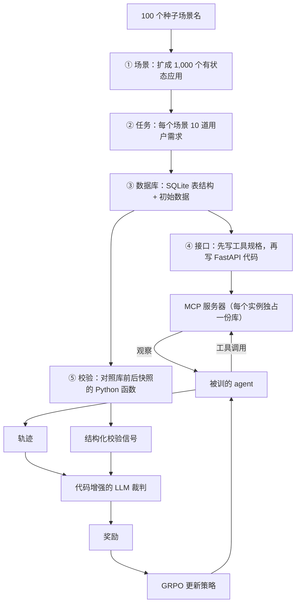

# Agent World Model：真实 API 撑不起 agentic RL，所以用代码和数据库造一千个可执行世界

<!-- release-date: 2026-02-10 -->

> 本文依据 **Agent World Model: Infinity Synthetic Environments for Agentic Reinforcement Learning**，arXiv:2602.10090v3，2026-05-22，共 43 页，ICML 2026 录用稿（PDF p. 1 页脚）。作者来自 UNC Chapel Hill 与 Snowflake，通讯作者 Canwen Xu，第一作者的工作完成于 Snowflake 实习期间（PDF p. 1）。页码均指 PDF 自身页码。文中区分三件事：**论文明确写了什么**、**我们怎么解释它**、**哪些是外部资料或本文推算**。
>
> 别和 ByteDance 那篇 Agent-World 搞混。那篇是字节 Seed 与人大的「规模化合成真实环境、让 agent 自我演化」；本篇是 Snowflake 与 UNC 的 **Agent World Model（AWM）**：从场景名出发，用代码和 SQLite 合成一千个 MCP 工具环境，专给多轮工具使用的强化学习当训练场。

## 读前先把几个词说成人话

- **工具使用（tool-use）**：模型按约定格式发出一次函数调用，环境执行后把结果送回来。多轮任务里要先查、再改、再确认，每一步都依赖上一步看到的东西。
- **MCP（Model Context Protocol，模型上下文协议）**：Anthropic 2024 年提出的工具接口约定。AWM 把每个合成环境做成一个 MCP 服务器，agent 只能通过工具调用读写数据库（PDF p. 2、4）。
- **POMDP（部分可观察马尔可夫决策过程）**：强化学习对环境的标准写法。AWM 让每个环境 $E_i$ 各有五件套：状态空间（数据库里有什么）、动作空间（能调哪些工具）、观察空间（工具返回什么）、转移函数（一次调用怎样改库、回什么观察）、每道任务的奖励 $R_\tau$（PDF p. 3）。
- **CRUD**：增删改查。AWM 只收「状态会变」的应用，如电商、CRM、订票，不收新闻站、百科这类只读场景（PDF p. 3、15）。
- **GRPO（组相对策略优化）**：同一道题采一组轨迹，用组内相对分数当优势，不另训价值模型。出处见 DeepSeekMath 一篇。
- **LLM-as-a-Judge（大模型当裁判）**：任务结束后让一个模型看轨迹打分。AWM 不让它空手判，而是先跑一段对照数据库前后快照的校验代码，把结构化证据交给它（PDF p. 4）。

## 一句话先说清

想用强化学习把语言模型练成会多轮用工具的 agent，**训练场本身比算法更稀缺**。

真实 API 刷不起：很多场景根本不开放接口，RL 又要和同一套规则稳定地交互成千上万次（PDF p. 1）。人写的环境太少：$\tau^2$-bench 只有 3 个，TheMCPCompany 只有 5 个（PDF p. 1）。让大模型扮演环境，每一步都要再调一次模型，贵，而且会在状态转移上幻觉（PDF p. 1、3）。

AWM 的答案是把环境当软件来合成：

> **先写用户会做什么，再为这些事设计数据库，再为数据库暴露工具，最后用库的前后差分给奖励。状态不在模型脑子里，在 SQLite 里**。

流水线产出 1,000 个可执行环境、35,062 个工具、10,000 道带校验代码的任务（PDF p. 3）。训练只发生在合成环境里，评测放到三个分布外基准：BFCLv3、$\tau^2$-bench、MCP-Universe。在 Qwen3 的 4B、8B、14B 上，AWM 是唯一一个在三个基准上都超过未训练底座的方法（PDF p. 7）。

它没有证明「合成环境等于真实世界」：MCP-Universe 的绝对分仍只有 6–12 分，$\tau^2$ 上输给同期的 EnvScaler，BFCLv3 的抗幻觉项还被格式奖励伤过。这三条边界后面逐一交代。

### 一条阅读路线

1. **p. 3 Figure 2**：五步合成加在线 RL 的全貌。
2. **p. 4 第 3.3.1 节**：为什么最终判定交给「代码加裁判」，而不是纯代码。
3. **p. 5 Table 1–3**：流水线的成功率、成本与规模。
4. **p. 5–6 第 4 节**：混合奖励与历史感知训练，两处公式。
5. **p. 7 Table 4**：主结果，要连着「谁在哪项掉分」一起读。
6. **p. 8–9 Table 6–11 与 Figure 4**：环境质量、裁判策略、历史窗口、环境数量四组分析。

附录 A 是实现细节（p. 15–17），B.4 与 Figure 28–30 是三个校验案例（p. 19、42–43），剩下的附录大多是提示词。

## 主要矛盾：三种现成训练场，没有一种撑得起大规模多轮 RL

论文第 1、2 节把现有做法拆成三条路，每条都卡在 RL 真正需要的东西上（PDF p. 1–3）。

**真实环境：稳，但刷不起**。 RL 要并行、要重置、要成千上万次交互。接口常常不公开，调用有配额，状态会被别人改，失败还可能有真实损失。人工搭的评测环境数量级也不对：Table 3 里 $\tau$-bench 2 个，$\tau^2$-bench 3 个，MCP-Universe 11 个真实 MCP 服务器（PDF p. 5）。它们适合当考场，不适合当训练场。

**只合成任务和轨迹，环境当成已经存在**。 Self-Instruct、ToolLLM 一类工作能做出很多示范轨迹，但工具返回要么写死、要么让模型编。agent 没法探索「换个参数会怎样」，也收不到由状态变化给出的反馈，适合监督微调，难做在线 RL（PDF p. 2）。

**让大模型扮演环境：能扩，但不一致**。 每一步提示一个推理模型生成下一个状态和观察。状态转移会幻觉，每步还要付一次推理成本（PDF p. 3）。

同期的代码合成路线也没有补上这个缺口。DeepSeek-V3.2 做了数千个可执行环境，Qwen Tongyi 的环境合成用于 SFT 而非 RL，两者都没公开流水线或环境（PDF p. 2）；AutoEnv 做的是 36 个偏游戏的环境，EnvScaler 在已有任务集上合成 191 个，AutoForge 依赖工具文档且未公开代码（PDF p. 3、5）。AWM 给自己划了三条差别（PDF p. 3）：只要场景名、不假设已有任务或 API 文档；用数据库管状态，才能做代码校验；规模到 1,000 个环境。

于是矛盾变成：

> 训练场要同时满足三件事：**可执行**（状态真的会变）、**一致**（同一个动作每次得到同样的转移）、**便宜到能并行**（每步 1,024 个隔离实例）。真实 API 缺第三条，模型模拟缺前两条。

## 先看全景：五步合成，一个训练循环

这张图按 PDF p. 3 的 Figure 2 重画，是流程示意，不是时间轴。论文把这条链类比为 model-based RL 里学出来的世界模型，只是动力学由代码实现，不是神经网络（PDF p. 2）。

五步不是五个平行模块，而是一条因果链：**任务决定库里必须有哪些实体，库决定工具能改什么，工具执行才产生可对照的状态差，状态差才让奖励不靠模型猜**。 缺任何一环，RL 拿到的都是错信号。

## 核心设计一：按软件依赖的顺序合成，不让模型一次写完

### 旧问题：一个环境两千行，一次生成必然自相矛盾

预实验里，一个环境可能超过 3,000 行代码；对三十多个工具直接生成实现，接口很容易前后不一致（PDF p. 4、15）。论文说 AWM 镜像的是真实软件的做法（PDF p. 2）：先有需求，再有数据模型，再有接口，最后有测试。每一步只写一层，写完就跑。

### 五步各做什么

**① 场景**。 从 SimilarWeb 热门站点里取 100 个种子名，用 Self-Instruct 式扩展生成新场景（PDF p. 15 与脚注 1）。三道过滤：分类器只留适合 CRUD 的有状态应用；嵌入余弦相似度 0.85 去重；热门类目（如电商）封顶，防止一千个环境塌成同一种店（PDF p. 15）。附录 Figure 6 的类目标签分布最高的 Analytics 与 Workflow 各 8.6%，E-commerce 8.2%，Other 16.8%，1,000 个场景共 6,715 个标签（PDF p. 20，读自 Figure 6）。

**② 任务**。 每个场景生成 $k=10$ 道任务，共 10,000 道。数量故意不大，好让后面的库和工具仍在模型能写的范围里（PDF p. 15）。两条硬约束：任务必须能靠 API 完成，不靠点击翻页；默认已登录，不把注册、权限当任务（PDF p. 4）。每道任务要带具体参数，如商品 ID、用户名，执行时不必再追问（PDF p. 15）。附录 Table 17 的例子读起来像产品需求：给 Daft Punk 最热的 10 首歌建播放列表、把某件 Instant Pot 退货原路退款、在罗马和佛罗伦萨连订两段酒店（PDF p. 36）。

任务写在库和工具之前，所以库不是「先有个通用 Spotify 再找事做」，而是「这些用户意图必须能被满足」。论文称之为需求驱动，目的是让库和工具既不漏项、也不过度设计（PDF p. 15）。

**③ 数据库**。 后端固定为 SQLite，而不是同期工作里常用的 NoSQL 或键值存储（PDF p. 4）。模型从任务推出最少需要的实体与关系，输出 DDL：表、列、类型、主键、外键、索引；认证字段排除在外（PDF p. 15）。空表不够，很多任务要改已有记录，所以还要合成初始状态：分析每道任务的前置条件，生成 INSERT 并按外键顺序执行。例子很直白：任务是「更新库存」，初始数据里就得有一件库存不为零的商品（PDF p. 15）。Table 2 给出规模：平均 18.5 张表、129.3 条样本记录（PDF p. 5）。

**④ 接口**。 再拆两段（PDF p. 4、15–16）。先写规格：让每道任务都可执行所需的最少端点，每个带名字、方法、路径、摘要、带类型的参数和响应 schema；这份规格同时是推理时给 agent 看的工具文档（Table 16，PDF p. 21）。再写实现：一个 Python 文件，里面是 SQLAlchemy ORM、Pydantic 模型和 FastAPI 处理器，每个端点变成一个 MCP 工具，工具执行就是在库上读写，也就是转移函数（PDF p. 16）。先规格后代码，是因为直接为 30 多个工具生成代码常常产出不一致的接口（PDF p. 15）。

**⑤ 校验**。 每道任务生成一个 Python 函数：输入初始库和最终库两个路径，跑只读 SQL，返回结构化字典（改了哪些记录、期望结果、诊断信号），外加一段给裁判看的自然语言成败标准（PDF p. 16）。Figure 26–27 的 Spotify 例子，是把 The Weeknd 的 *Blinding Lights* 加进名为 Driving Vibes 的播放列表：代码分别查出播放列表、歌曲、列表曲目在执行前后的差，输出 `blinding_lights_added_to_playlist` 这样的布尔信号（PDF p. 40–41）。

### 跑得通就留，跑不通就改，允许 10% 的脏

每个组件生成后都在隔离环境里真跑一遍。失败就把 traceback 交给另一次模型调用，压成 200–500 token 的错误摘要，贴回原提示重生成，最多 5 轮（PDF p. 16）。表结构与样本数据容许 10% 的表或插入失败；环境启动必须零错误，健康检查和 `list_tools` 都要过；5 轮都不达标就挑错误率最低的那份继续（PDF p. 15–16）。

Table 1 与 Table 2 是这条流水线的账本（PDF p. 5）：

| 阶段 | 成功率 | 平均尝试 | 费用（美元） |
|---|---:|---:|---:|
| 场景 | — | — | 0.43 |
| 任务 | — | — | 0.56 |
| 数据库 | 88.3% | 1.12 | 3.59 |
| 样本数据 | 88.2% | 1.12 | 13.75 |
| 工具规格 | — | — | 23.74 |
| 环境代码 | 86.8% | 1.13 | 12.81 |
| 校验 | — | — | 2.21 |
| 合计 | — | — | 57.09 |

| 单个环境的复杂度（Table 2） | 均值 | 中位数 | 前 90% 分位 |
|---|---:|---:|---:|
| 数据库表 | 18.5 | 18.0 | 25.0 |
| 样本记录 | 129.3 | 121.0 | 192.0 |
| 暴露工具 | 35.1 | 35.0 | 45.0 |
| 环境代码行数 | 1,984.7 | 1,944.0 | 2,586.0 |
| 每道任务的 agent 步数 | 8.5 | 6.0 | 20.0 |
| 每道任务用到的不同工具 | 7.1 | 6.0 | 12.0 |

Table 1 用 GPT-5 生成，图注写费用是「per 100 samples 的平均」；最自然的读法是每生成 100 份该阶段产物的开销，而不是单个环境的价格。论文没有把它换算成「一个环境多少钱」，这里也不替它换算。首次尝试成功率超过 85%，失败的平均只要 1.13 轮就修好，论文据此判断多数失败是小改即可的运行时问题（PDF p. 5、16）。Table 2 的后两行是用 Claude-4.5-Sonnet 当 agent、步数上限 20 测的：完成率 62.6%，另有 13.7% 的任务用完 20 步也没做完（PDF p. 5）。它说明合成任务不是玩具，不是训练后的成绩。

论文也承认，更严的阈值或换成 Claude Code 这类编码 agent 还能抬质量，只是纠正轮次更多（PDF p. 5）。**脏不是被忽略，是被定价了**。 后面奖励里的 `Environment Error` 这一类，就是为这部分脏准备的出口。

Table 3 把 AWM 放进现有集合里（PDF p. 5）：

| 方法 | 是否合成 | 依赖什么 | SQL 状态 | 环境数 | 平均工具数 | 平均代码行 |
|---|---|---|---|---:|---:|---:|
| $\tau$-bench | 否 | 人工 | 否 | 2 | 12.5 | — |
| $\tau^2$-bench | 否 | 人工 | 否 | 3 | 22.7 | — |
| MCP-Universe | 否 | 真实 API | — | 11 | 12.1 | — |
| AutoForge | 是 | 工具文档 | 否 | 10 | — | — |
| EnvScaler | 是 | 已有任务集 | 否 | 191 | 18.6 | 662.1 |
| AWM | 是 | 只要场景名 | 是 | 1,000 | 35.1 | 1,984.7 |

环境数约是 EnvScaler 的 5 倍，代码量约 3 倍（PDF p. 5、7）。

### agent 这一侧：两个元工具走遍一千个环境

平均 35 个工具不直接塞进系统提示。agent 只见两个元工具（PDF p. 16，Figure 9 在 p. 22）：`list_tools` 向当前 MCP 服务器查询本环境的全部工具与 schema；`call_tool` 按名字调用其中一个，参数是 JSON 字符串。协议要求 `list_tools` 必须第一个调、整条轨迹只调一次。

这样同一个策略能走进 1,000 个工具集完全不同的环境，而不用为每个环境改提示。评测时再用格式转换器把这套接口映射到三个基准各自的原生调用格式；BFCLv3 那边会把多轮轨迹聚合成它期望的单轮或并行调用，跳过 `list_tools`（PDF p. 17）。

### 可迁移启发

让模型写可执行系统时，先生成最小可运行的契约，再生成实现，每层写完就跑。任务 → 表结构 → 接口规格 → 代码 → 测试，每一步的输出是下一步的约束。一次生成三千行，接口会先崩。

## 核心设计二：奖励从库的前后差分里来，但最后由裁判拍板

### 旧问题：纯代码校验和纯 LLM 裁判，以不同方式说谎

既然状态在数据库里，最直接的奖励就是「跑一段代码看库对不对」。论文专门回答了为什么不这么做（PDF p. 4）：纯代码校验假定「任务成败能完全从状态里观察出来」，这个假定很脆。真实服务也有瞬时故障、部分执行和基础设施问题，WebArena、$\tau^2$-bench、SWE-Bench 都因误判后来改过规则；合成环境只会更不完美。反过来，只看轨迹的 LLM 裁判没有状态证据，会被「工具调用看起来成功了」骗过去。

### 新设计：代码举证，裁判解释

每道任务的校验代码先在最终库上跑，和初始库对照，把「改了哪些记录、成败标准」交给 GPT-5；裁判结合整条轨迹输出四类之一：`Completed`、`Partially Completed`、`Agent Error`、`Environment Error`（PDF p. 4、17）。两种实现都随环境发布，实验用的是代码增强版（PDF p. 4–5）。

附录 B.4 的三个案例把分工讲得最清楚（PDF p. 19、42–43）：

| 案例 | 发生了什么 | 只看代码 | 只看轨迹的裁判 | 代码增强裁判 |
|---|---|---|---|---|
| Figure 28：查拍品出价历史 | 工具返回与库一致 | 完成 | 完成 | 完成 |
| Figure 29：创建一条已存在的自动化例程 | 创建接口报 500，但例程本来就在，前后快照完全相同 | 判失败（假阴性） | — | 判完成（幂等成功） |
| Figure 30：给活动加一个场次 | 查活动报 422，agent 另建了一个重复活动并把场次挂在错的 ID 上，工具调用都「成功」 | — | 判完成（假阳性） | 判 agent 失败：真活动没被改过 |

Figure 29 图里裁判的理由写成了 Case 1 的「出价历史与数据库完全一致」，是排版串行；以 B.4 正文为准（PDF p. 19、42）。

### 证据：三种校验接到同一套训练上

Table 9 用同样的训练配方只换校验方式（PDF p. 9）。纯代码版本只输出 Completed（奖励 1）或其他（奖励 0）。

| 规模 | 校验 | BFCLv3 | $\tau^2$ Pass@1 | $\tau^2$ Pass@4 | MCP-Universe |
|---|---|---:|---:|---:|---:|
| 4B | 只用 LLM | 51.92 | 15.65 | 35.97 | 6.70 |
| 4B | 只用代码 | 55.66 | 14.93 | 32.01 | 6.15 |
| 4B | 代码增强 | **64.50** | **22.57** | **43.89** | 6.70 |
| 8B | 只用 LLM | 55.46 | 26.44 | 52.52 | 10.62 |
| 8B | 只用代码 | 60.00 | 29.59 | 52.88 | 5.59 |
| 8B | 代码增强 | **65.94** | **33.45** | **55.40** | **11.17** |
| 14B | 只用 LLM | 65.44 | 31.03 | 55.76 | 10.62 |
| 14B | 只用代码 | 65.04 | 29.50 | 53.60 | 8.38 |
| 14B | 代码增强 | **70.18** | **39.03** | **57.19** | **12.29** |

只用 LLM 在 BFCLv3 上最弱，因为它不看状态；只用代码好一些，但在有缺陷的环境里会假阴性。8B 与 14B 的 MCP-Universe 上，纯代码甚至低于纯 LLM。**这张表支持的是「证据加判断」，不是「代码可以取代判断」**。 GPT-5 当裁判每个训练步大约多花 1.80 美元（最多 1,024 条样本），异步执行，几乎不加墙钟（PDF p. 9、17）。

裁判本身稳不稳？作者从 8B 训练中抽 100 条轨迹，每个裁判判 5 次（PDF p. 9、18–19，Table 10 与 Table 13）：

| 二分类（真正进 RL 的信号） | GPT-5.1 | Claude-4.5-Sonnet | Qwen3.5-122B-A10B |
|---|---:|---:|---:|
| 5 次全一致的轨迹占比 | 90.8% | 82.0% | 76.3% |
| 两两一致率 | 95.5% | 91.8% | 88.1% |
| Fleiss' $\kappa$ | 0.891 | 0.826 | 0.728 |
| 奖励翻转率 | 9.2% | 18.0% | 23.7% |

奖励翻转率的定义是「至少一次判定与多数票不同」的轨迹占比（PDF p. 18）。四分类更严，GPT-5.1 两两一致仍有 91.2%，开源 Qwen3.5 为 82.7%（PDF p. 18–19）。翻转率不是零，奖励仍然带噪声，只是比纯 LLM 可训练得多。

### 可迁移启发

做可验证奖励时，先收集一批假阳性和假阴性案例，再决定证据与判断怎么分工。要有一份 agent 改得了、裁判读得到的权威状态；代码负责把状态差变成证据，模型负责用轨迹上下文解释证据。

## 核心设计三：格式错了当场 −1 并停，不让坏轨迹浪费算力

### 旧问题：多轮工具环境里，只给结果奖励不够

纯结果奖励在数学推理里够用，在多轮工具环境里不够（PDF p. 5）。轨迹又长又夹着观察，一次格式错误之后的探索全是噪声，还白白占 rollout 时间。

### 新设计：步级格式分加任务级结果分

任务级结果由上一节的裁判给出（PDF p. 5，式 1）：

$$
R_\tau=
\begin{cases}
1.0, & \text{任务 }\tau\text{ 为 Completed},\\
0.1, & \text{任务 }\tau\text{ 为 Partially Completed},\\
0.0, & \text{其他}.
\end{cases}
$$

步级奖励 $r_t$ 的规则是（PDF p. 5–6）：第 $t$ 步因格式错误被提前终止，$r_t=-1.0$；正常结束，把 $R_\tau$ 广播到每一个动作步；其他情况 $r_t=0$。

「格式错误」写死成五条（PDF p. 16）：思考必须包在非空的 think 标签里；不能调用 `list_tools` 没返回过的工具名；参数必须是合法 JSON 且符合 schema；`list_tools` 必须是第一个、也是唯一一次元工具调用；多轮交互里除了这次列举，至少要成功调用一次真正的工具。第六条是服务器超时或内部错误，记为环境错误、奖励为 0，不算 agent 的错。两类错误都会立即终止 rollout（PDF p. 16）。

上图裁自 PDF p. 18 的 Figure 5，三种规模各一对曲线。论文的读法是：加上格式奖励后格式错误率很快收敛，平均 rollout 时间约少 27%；去掉它，50 步之后格式错误率仍高于 20%，完成率饱和在 40% 以下（PDF p. 17）。

**我们如何解释它**。 格式错误的代价不是这一分，而是后面所有步都在噪声里走。−1 并停，本质上是把「不可恢复的协议错误」从「任务没做成」里拆出来，并且省下这部分算力。它也有副作用：第 4、5 条要求先调 `list_tools`、多轮时至少成功调用一次真正的工具，直接拒绝就会被判格式错。论文正是把 BFCLv3 幻觉项的掉分归到这里：格式奖励始终鼓励调用、惩罚拒绝（PDF p. 6）。

## 核心设计四：训练时看到的历史，必须和推理时一样短

### 旧问题：训练用全历史，部署用截断历史

部署时，框架往往会截断长交互，避免注意力沉到早期无关轮次（PDF p. 6）。很多 RL 框架为了效率，却把整条 rollout 放进一次前向，用掩码只在动作 token 上算损失（PDF p. 6，式 2）。于是训练条件是完整历史 $h_t=(o_1,a_1,\ldots,o_t)$，推理条件是窗口 $w$ 内的截断历史：

$$
h_t^{\mathrm{trunc}}=\bigl(o_{\max(1,t-w+1)},\,a_{\max(1,t-w+1)},\,\ldots,\,o_t\bigr)
$$

这是一次训练与推理之间的分布偏移。

### 新设计：优化时用同一套截断

对每道任务采 $G$ 条轨迹，每个动作都条件在自己的截断历史上（PDF p. 6，式 3）：

$$
\mathcal{L}_{\mathrm{GRPO}}
=\mathbb{E}\Biggl[\frac{1}{G}\sum_{k=1}^{G}A^{(k)}\sum_{t=1}^{T_k}
\log\pi_\theta\bigl(a_t^{(k)}\bigm|h_t^{\mathrm{trunc},(k)}\bigr)\Biggr],
\qquad A^{(k)}=\frac{R^{(k)}-\bar R}{\sigma_R}
$$

$A^{(k)}$ 是组相对优势：第 $k$ 条轨迹的回报减去组均值，再除以组内标准差。上图就是这个式子的实现（PDF p. 17）：训练取 $w=3$、最多 20 轮；评测长上下文任务时把窗口放宽到 $w=10$（PDF p. 6、17）。

### 证据：Table 11 把「对齐」和「故意错位」交叉一遍

4B 模型，「有历史限制」即按窗口训练（PDF p. 9）：

| 设置 | 方法 | BFCLv3 | $\tau^2$ Pass@1 | $\tau^2$ Pass@4 | MCP-Universe |
|---|---|---:|---:|---:|---:|
| 训推对齐 | 有历史限制 | **64.50** | **22.57** | **43.89** | **6.70** |
| 训推对齐 | 无历史限制 | 55.35 | 15.92 | 36.33 | 6.15 |
| 训推错位 | 有历史限制 | 61.85 | 9.35 | 15.11 | 5.03 |
| 训推错位 | 无历史限制 | 56.80 | 16.10 | 33.09 | 6.15 |

对齐时按窗口训练最好；拿它去跑全历史推理，$\tau^2$ Pass@1 从 22.57 掉到 9.35。全历史训练的那一版对错位不敏感，推理时截断反而在 $\tau^2$ 上略升，论文解释为截断压住了无关轮次的干扰（PDF p. 9）。**结论不是「窗口 3 是魔法数字」，而是历史怎么管应当进策略优化，不能只当推理期的启发式**。

### 可迁移启发

若推理期本来就做滑动窗口或工具结果压缩，RL 目标就该在同样的窗口上算。代价是前向次数乘上轮数；换来的是训练见过的条件分布与线上一致。

## 训练配方

生成器与裁判都用 GPT-5；被训的是 Qwen3 thinking 的 4B、8B、14B（PDF p. 6）。算力有限，只在 526 个环境、3,315 道任务上做在线 RL，不是全部 1,000 个（PDF p. 6）。框架是 AgentFly 加 verl（PDF p. 6、17）。Table 12 的超参（PDF p. 18）：

| 项 | 值 |
|---|---|
| 学习率 | $7\times 10^{-7}$ |
| batch / mini-batch | 64 / 16 |
| 每题 rollout 数 $G$ | 16 |
| 每步并行环境实例 | 1,024 |
| 最多优化步 | 96 |
| KL 系数 / 熵系数 | 0.001 / 0.0 |
| 裁剪上界 | 0.28（沿用 DAPO 的建议） |
| rollout 温度 | 1.0 |
| 单次回复 / 模型上下文 | 2,048 / 32,000 token |
| 最大交互轮 / 历史窗口 | 20 / 3 |

另用序列级重要性采样缓解 rollout 引擎与训练引擎之间的分布偏移（PDF p. 17）。每个实例是一个独立 MCP 服务器加一份自己的 SQLite 副本，结束后把库恢复成初始快照；拉起服务器、拷库是在线 RL 的瓶颈，所以用预取：当前 batch 算梯度时，后台线程已在准备下一批环境（PDF p. 17）。评测解码按 Qwen3 推荐：温度 0.6、top-$k$ 20、top-$p$ 0.95，上下文用 RoPE scaling 扩到 131,072（PDF p. 17）。

## 实验：只在合成环境里训，能不能泛化

### 三个考场都故意选得「不像训练集」

论文自己把错位写在前面（PDF p. 6）：$\tau^2$-bench 考多轮对话，AWM 不针对对话；BFCLv3 强调抗幻觉、拒绝不该调的工具，AWM 的格式奖励一直在鼓励调用；MCP-Universe 的核心是浏览器自动化与信息检索，AWM 把这类场景排除在合成之外。MCP-Universe 还去掉了要 GUI 的 3D 设计与要登录 GitHub、Notion 的仓库管理；$\tau^2$-bench 用的是修订后的 verified 版（PDF p. 6）。

三个对照（PDF p. 6）：**Base** 是原版 Qwen3；**Simulator** 用同样的任务和工具，但由 GPT-5 模拟环境转移；**EnvScaler** 是同期的 191 个代码合成环境，做 SFT 加 RL，没有放出 14B（PDF p. 7）。

### 主表 Table 4

按 PDF p. 7 逐格转录。BFCLv3 的「幻觉」是该基准的 hallucination 类；$\tau^2$ 的 Pass@1 是 4 次运行的均值；MCP-Universe 报任务成功率。

**BFCLv3**

| 规模 | 方法 | Non-Live | Live | Multi-Turn | 幻觉 | 总分 |
|---|---|---:|---:|---:|---:|---:|
| 4B | Base | 61.44 | 63.95 | 39.38 | 73.93 | 54.92 |
| 4B | Simulator | 66.10 | 62.69 | 37.75 | 75.48 | 55.52 |
| 4B | EnvScaler | 60.31 | 64.25 | 37.63 | 85.25 | 54.06 |
| 4B | AWM | 78.60 | 76.91 | 37.99 | 73.70 | **64.50** |
| 8B | Base | 59.58 | 58.03 | 43.88 | 76.42 | 53.83 |
| 8B | Simulator | 56.35 | 59.36 | 41.88 | 74.06 | 52.53 |
| 8B | EnvScaler | 33.67 | 31.83 | 45.00 | 90.30 | 36.83 |
| 8B | AWM | 80.44 | 72.39 | 45.00 | 70.80 | **65.94** |
| 14B | Base | 69.48 | 67.28 | 47.00 | 77.94 | 61.25 |
| 14B | Simulator | 77.23 | 73.43 | 52.38 | 76.91 | 67.68 |
| 14B | AWM | 81.46 | 77.20 | 51.88 | 78.37 | **70.18** |

**$\tau^2$-bench**

| 规模 | 方法 | Airline | Retail | Telecom | Pass@1 | Pass@4 |
|---|---|---:|---:|---:|---:|---:|
| 4B | Base | 21.00 | 19.96 | 9.43 | 15.83 | 34.89 |
| 4B | Simulator | 15.50 | 18.64 | 7.90 | 13.67 | 35.25 |
| 4B | EnvScaler | 31.50 | 44.30 | 12.50 | **28.96** | **51.80** |
| 4B | AWM | 19.00 | 30.26 | 16.45 | 22.57 | 43.89 |
| 8B | Base | 26.50 | 34.43 | 18.42 | 26.44 | 50.72 |
| 8B | Simulator | 34.00 | 32.24 | 29.17 | 31.30 | 54.32 |
| 8B | EnvScaler | 31.50 | 49.56 | 32.68 | **39.39** | **63.31** |
| 8B | AWM | 38.50 | 41.23 | 23.47 | 33.45 | 55.40 |
| 14B | Base | 27.00 | 65.35 | 12.28 | 36.69 | 55.40 |
| 14B | Simulator | 21.50 | 48.90 | 18.20 | 31.39 | 55.40 |
| 14B | AWM | 31.50 | 63.60 | 17.76 | **39.03** | **57.19** |

**MCP-Universe**

| 规模 | 方法 | Location | Financial | Browser | Web | Multi | 总分 |
|---|---|---:|---:|---:|---:|---:|---:|
| 4B | Base | 2.86 | 25.00 | 0.00 | 0.00 | 0.00 | 6.15 |
| 4B | Simulator | 0.00 | 15.00 | 5.88 | 2.00 | 0.00 | 6.15 |
| 4B | EnvScaler | 0.00 | 17.50 | 2.94 | 0.00 | 0.00 | 4.47 |
| 4B | AWM | 0.00 | 22.50 | 2.94 | 2.00 | 5.00 | **6.70** |
| 8B | Base | 0.00 | 22.50 | 5.88 | 2.00 | 0.00 | 6.70 |
| 8B | Simulator | 5.71 | 10.00 | 8.82 | 4.00 | 0.00 | 6.15 |
| 8B | EnvScaler | 0.00 | 17.50 | 5.88 | 2.00 | 0.00 | 5.59 |
| 8B | AWM | 8.57 | 35.00 | 8.82 | 0.00 | 5.00 | **11.17** |
| 14B | Base | 0.00 | 27.50 | 5.88 | 2.00 | 5.00 | 8.38 |
| 14B | Simulator | 2.86 | 30.00 | 8.82 | 6.00 | 0.00 | 10.62 |
| 14B | AWM | 8.57 | 32.50 | 11.77 | 4.00 | 0.00 | **12.29** |

三张表叠起来，站得住的有三条（PDF p. 6–7）：

1. **AWM 是唯一在三个基准总分上都超过 Base 的方法**。 Simulator 与 EnvScaler 都至少在一项上掉到 Base 以下。
2. **EnvScaler 在 $\tau^2$ 上更高，但在另两个基准上平均掉分**：BFCLv3 −8.93、MCP-Universe −1.39，8B 的 BFCLv3 从 53.83 跌到 36.83。论文的解释是 EnvScaler 从已有任务集合成，可能与 $\tau^2$ 重叠；这是作者的推测，没有重叠度的实测。
3. **同样的任务和工具，可执行环境优于 GPT-5 模拟的环境**。 8B 的 Simulator 在 BFCLv3 和 MCP 上都低于 Base。论文归因于程序化状态一致性给出更稳的学习信号，并且模拟器每步都要调一次大模型；两者的墙钟对比没有给数字。

必须一起记住的边界：

- **抗幻觉换来了调用积极性**。 8B 的幻觉项从 76.42 降到 70.80，论文把它归到格式奖励鼓励调用、惩罚拒绝（PDF p. 6）。Non-Live、Live 的大涨，部分是拿这一项换的。
- **MCP-Universe 的绝对水平仍很低**。 14B 最高 12.29。会用合成 CRUD 工具，离会开浏览器、会检索还差一截。
- **$\tau^2$ 上 AWM 对 EnvScaler 没有赢**。 论文的措辞是「有竞争力」（PDF p. 7）。

Table 5 按难度给 8B 分层（PDF p. 7）：BFCLv3 按所需工具调用数，简单 / 中等 / 困难的增益是 +26.7 / +15.3 / +1.1；$\tau^2$ 按标准答案动作数，是 +9.3 / +6.2 / +4.5。难题的绝对增益变小，论文的读法是难题更多吃模型自身的能力。

### 环境数量：Figure 4

Figure 4 在 4B 上改变训练环境数，EnvScaler 的 191 个环境画成斜线柱（PDF p. 9）。数值读自图上的柱顶标注：

| 训练环境数 | BFCLv3 | $\tau^2$ | MCP-Universe |
|---|---:|---:|---:|
| AWM 10 个 | 48.0 | 14.2 | 3.9 |
| AWM 100 个 | 57.0 | 16.6 | 6.1 |
| AWM 191 个 | 57.6 | 16.4 | 6.1 |
| EnvScaler 191 个 | 54.1 | **29.0** | 4.5 |
| AWM 526 个 | **64.5** | 22.6 | **6.7** |

只用 10 个环境严重掉分，低于 Table 4 的 4B Base，论文归因于对有限分布过拟合；100 个已有明显收益；在同为 191 个环境时，AWM 在 BFCLv3 与 MCP 上高于 EnvScaler；扩到 526 个继续涨（PDF p. 9）。$\tau^2$ 这一列在 191 个时 AWM 仍远低于 EnvScaler，和主表一致。**环境数的单调收益在 BFCLv3 上最清楚；它不支持「多造环境就能压过任务重叠的方法」**。

## 合成质量：能跑、够难、不够干净

第 6.1 节按质量、难度、多样性三条轴检查环境，这是 RL 能不能用的真正条件（PDF p. 7）。

### 质量：比 EnvScaler 更连贯，但大多数环境仍有缺陷

Table 6 抽 100 个环境，GPT-5.1 与 Claude-4.5-Sonnet 两个裁判打 1–5 分并做缺陷分析；图注特别提醒缺陷可能只影响少数工具和边角输入（PDF p. 7）。

| 指标 | GPT-5.1 判 AWM | GPT-5.1 判 EnvScaler | Claude 判 AWM | Claude 判 EnvScaler |
|---|---:|---:|---:|---:|
| 任务可执行性 | 3.68±1.02 | 2.94±1.25 | 3.99±0.81 | 3.14±1.29 |
| 数据对齐 | 4.04±0.91 | 3.73±0.89 | 4.84±0.50 | 4.11±1.02 |
| 工具集完整 | 3.65±0.87 | 2.89±0.79 | 4.98±0.14 | 4.06±0.87 |
| 含缺陷的环境 | 74% | 88% | 83% | 83% |
| 每个环境缺陷数 | 4.13 | 1.82 | 2.70 | 2.21 |
| 被堵住的任务 | 14.0% | 57.1% | 11.5% | 46.8% |

代码量约是 EnvScaler 的 3 倍，缺陷数只温和上升，被堵住的任务却少得多（PDF p. 7–8）。对 RL 后者更要命：堵住的任务会截断探索，还系统性地灌进错误的负信号。人工抽查把 AWM 的缺陷 44% 归到没处理的边角输入（缺空值或边界校验），14% 归到违反外键或唯一性约束；训练期间环境错误率约 4%，多数由特定 agent 行为触发（PDF p. 8）。

换生成器，流水线大体仍能用。Table 7 仍是 100 个环境（PDF p. 8）：

| | GPT-5 | Claude-4.5 | Qwen3.5-122B-A10B |
|---|---:|---:|---:|
| 数据库 / 样本数据 / 环境代码成功率 | 88.3% / 88.2% / 86.8% | 100.0% / 100.0% / 99.0% | 79.0% / 97.0% / 77.0% |
| 任务可执行性 / 数据对齐 / 工具完整 | 3.99 / 4.84 / 4.98 | 3.84 / 4.92 / 4.97 | 3.15 / 4.32 / 4.30 |
| 含缺陷环境 / 每环境缺陷数 | 83% / 2.70 | 89% / 2.11 | 100% / 3.82 |
| 平均成对距离 | 0.34 | 0.31 | 0.35 |

论文据此说多样性来自流水线设计而不是某个模型（PDF p. 8）。表里 GPT-5 一列的质量分与缺陷数，和 Table 6 里 Claude 裁判给 AWM 的那一列逐项相同，可见 Table 7 用的是 Claude 当裁判；这是我们对两表的比对，论文没有写明。

### 难度：强模型也做不完

Table 8 按所需工具调用数分档（PDF p. 8）：

| | 1–3 次 | 4–6 次 | 7–10 次 | 11 次以上 |
|---|---:|---:|---:|---:|
| 任务占比 | 35.1% | 31.5% | 15.7% | 17.7% |
| 平均步数 | 3.3 | 5.8 | 9.1 | 17.9 |
| GPT-5.1 Pass@1 | 61.7 | 27.0 | 11.9 | 3.0 |
| Sonnet-4.5 Pass@1 | 68.4 | 71.8 | 63.3 | 31.0 |
| 两者都过 | 45.3 | 24.9 | 11.5 | 3.0 |
| 两者都不过 | 15.2 | 26.2 | 36.3 | 69.0 |

两个强模型总体 Pass@1 只有 36.1% 和 62.6%，最难一档 69% 谁都没做成；GPT-5.1 偏低，论文怀疑部分因为它偶尔不遵守系统提示（PDF p. 8）。训练日志更硬：Qwen3-4B、8B、14B 在整个训练中分别有 27.1%、23.7%、28.2% 的任务一次都没做成，其中 14B 只优化了 32 步（PDF p. 8）。

### 多样性：规模变大没有塌成近重复

Figure 3 显示池子从 10 涨到 1,000 个环境，场景描述、表结构、工具 schema 的平均余弦距离几乎持平在 0.34 左右；类目覆盖从 500 个环境时的 2,123 涨到 1,000 个时的 3,619（PDF p. 8，读自 Figure 3）。代码层再查一遍（Table 14，PDF p. 19）：1,000 个环境两两之间，TSED 阈值 0.5 下 AST 函数体重复率 0.0%，端点名 Jaccard 0.004，类名 Jaccard 0.009，token Jaccard 均值 0.183、最高 0.324；论文认为残余相似多半来自共享的 Python 与 FastAPI 关键字。

## 论文自己划的边界

Limitations 写了四块（PDF p. 10）：

- **不会自我演化**。 流水线是一次性生成，训好的 agent 不能回头造新环境。
- **自纠正只修运行时错误**。 逻辑不一致、语义漏洞，运行时检查抓不到；跨场景、跨环境的任务也还没有。
- **训练没覆盖全部环境和模型族**。 只训了 526 / 1,000 个环境，主要是 Qwen3 的三个规模。作者强调核心贡献是流水线本身。
- **稳健性与安全几乎没测**。 agent 只见过合成缺陷带来的噪声（74% 的环境至少有一处缺陷，约 4% 的 rollout 碰到运行时错误），没见过被污染的库行、恶意工具输出或观察里的提示注入。任务默认已登录，访问控制没被训练，过激的 agent 原则上可以越权改状态或做不可逆操作。部分场景触及金融与医疗。论文把对抗评测、访问控制训练和领域内人工把关写成上线前提。

Impact Statement 补了一句：合成环境不能完整反映真实世界，把 AWM 训出的 agent 用到真实场景要加防护（PDF p. 10）。

## 可迁移启发

1. **先问训练场能不能拷贝、回滚、并行，再问算法**。 AWM 的第一刀不是新的损失，而是承认真实 API 与人写环境都供不上每步 1,024 个隔离实例。
2. **状态放进数据库，奖励才能从差分里来**。 转移变成一次事务，校验变成两次快照的对比，比「让另一个模型回忆世界现在怎样」可审计得多。
3. **合成顺序跟着软件依赖走**。 任务 → 表 → 规格 → 代码 → 校验，每步输出是下一步的约束，每步都真跑一遍。
4. **代码举证、模型判断**。 纯代码在幂等与超时上制造假阴性，纯 LLM 在「看起来成功」时制造假阳性。Table 9 在三个规模上都支持两者结合。
5. **给环境过错留出口**。 `Environment Error` 记 0 分、不当作 agent 的错，允许 10% 的脏数据才有意义。
6. **格式奖励是在买探索预算，但会伤拒绝能力**。 −1 并停换来约 27% 的 rollout 时间；若目标任务需要「不调用」，要单独补这类样本或改规则。
7. **训练时的上下文必须长得像推理时**。 若线上做滑动窗口，就按窗口拆样本训练。
8. **环境多样性的规模曲线比单个环境是否完美更值钱**，前提是评测任务与训练任务真的不重叠；$\tau^2$ 那一列提醒，任务重叠可以压过数量优势。

## 关键词回看

- **Agent World Model（AWM）**：用代码和数据库合成可执行工具环境的流水线，类比 model-based RL 的世界模型，动力学是程序不是网络。
- **需求驱动合成**：先写用户任务，再倒推表和接口。
- **SQL 托底的状态一致性**：SQLite 保存权威状态，工具只能通过接口改它。
- **执行反馈自纠正**：真跑、把报错摘要贴回提示、最多 5 轮，允许 10% 失败。
- **两个元工具**：`list_tools` 与 `call_tool`，同一策略走进工具集不同的环境。
- **代码增强的 LLM 裁判**：校验代码从库差里取证据，裁判结合轨迹输出四分类。
- **混合奖励**：格式错 −1 并停；正常结束按 1.0 / 0.1 / 0.0 广播。
- **历史感知训练**：按推理时的滑动窗口拆样本，只在当前轮算损失。
- **526 / 1,000**：实际参与 RL 的环境数与合成总数。

## 资料与阅读边界

### 本文依据的版本与首发日

- 原件：`papers/Snowflake/Agent-World-Model.pdf`，arXiv:2602.10090v3，43 页。[arXiv 页面](https://arxiv.org/abs/2602.10090) 的提交历史为 v1 2026-02-10 18:55:41 UTC、v2 2026-02-11、v3 2026-05-22 21:39:46 UTC，本地文件即最新的 v3；Comments 写 Accepted to ICML 2026。
- `release-date` 取 2026-02-10。官方仓库 [Snowflake-Labs/agent-world-model](https://github.com/Snowflake-Labs/agent-world-model) 的 README News 写 2026-02-10 开源流水线、1,000 个环境与 RL 训好的 agent；仓库最早的带代码提交 `5fba6e0`（25 个文件）时间为 2026-02-11 02:34:10 UTC，即美西 2 月 10 日；arXiv v1 同日。Hugging Face 上三个权重仓库的文件在 2026-02-08 已上传，但当时是否公开无法核实，README 在 2026-02-11 02:43 UTC 才改成发布说明，按预置处理，不据此提前。

### 外部资料补充（不是 PDF 原文）

- 环境数据包 [Snowflake/AgentWorldModel-1K](https://huggingface.co/datasets/Snowflake/AgentWorldModel-1K)，三个权重 [Arctic-AWM-4B](https://huggingface.co/Snowflake/Arctic-AWM-4B)、[Arctic-AWM-8B](https://huggingface.co/Snowflake/Arctic-AWM-8B)、[Arctic-AWM-14B](https://huggingface.co/Snowflake/Arctic-AWM-14B)。
- README News 另记：2026-03-16 加了校验演示；2026-05-01 宣布 ICML 录用，环境基础设施并入 [meta-pytorch/OpenEnv](https://github.com/meta-pytorch/OpenEnv)。这些晚于首发日，与论文结论无关。
- 本文没有读仓库源码，不拿今天的实现补写论文。

### 原文没有公开或无法核实的缺口

- Simulator 与可执行环境的墙钟对比，论文只定性说模拟器每步要调一次大模型；
- EnvScaler 与 $\tau^2$ 的任务重叠度，只有作者推测；
- 全部 1,000 个环境拿去训练会怎样；
- 格式奖励对 BFCLv3 幻觉项的单独消融；
- Table 1 费用的确切计量单位；
- Figure 5 里 14B 的曲线画到约 55 步，而 p. 8 说 14B 只优化了 32 步，论文没有说明两者是否同一次运行。

### 跨篇参考

GRPO 出处见 DeepSeekMath；verl 框架见 HybridFlow；裁剪上界 0.28 见 DAPO；被训底座见 Qwen3；论文点名的同期环境合成见 DeepSeek-V3.2。ByteDance 的环境合成工作见 Agent-World 一篇，与本篇不是同一件事。
