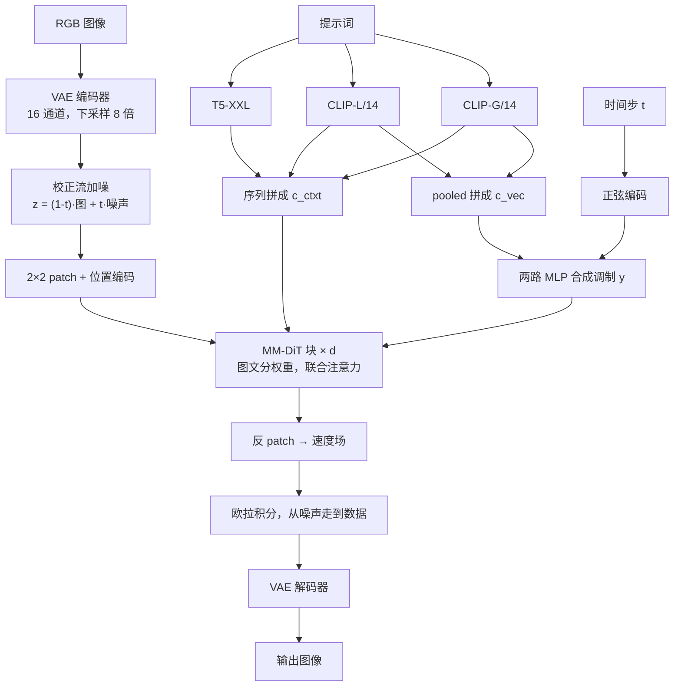

# 校正流、感知相关采样与 MMDiT：Stable Diffusion 3 怎样把去噪走直、把文字写进图里

<!-- release-date: 2024-04-17 -->

> 本文依据 Stability AI 的 **Scaling Rectified Flow Transformers for High-Resolution Image Synthesis**，arXiv:2403.03206（2024-03-05 首次公开）的 ICML 2024 正式版（PMLR 235），共 28 页。页码均指这份 PDF 自身的页码。文中区分三件事：**报告明确写了什么**、**我们怎么解释它**、**哪些是外部资料或本文推算**。凡是从图里读出来的数、或由报告数字算出来的结果，都会明说。

## 读之前：只熟悉 UNet 版 Stable Diffusion 的人，先对齐这几个词

UNet 版 SD（SD 1.x / 2.x / SDXL）可以压成三句话：一张图先被压进潜空间；网络在潜空间里反复「猜噪声、减噪声」；文字是冻住的 CLIP 向量，靠交叉注意力从旁边注入。这篇报告改的就是这三句话里的每一句。

- **潜空间与 VAE**：直接在像素上做生成太贵。先用自编码器把 RGB 图压成更小的张量，再在这个张量上训练生成模型。压缩倍数叫下采样因子，通道数叫潜空间维度。这篇把通道从常见的 4 加到 16，下采样仍是 8 倍（PDF p. 7，Table 3）。
- **扩散（diffusion）**：训练时沿一条从数据到噪声的路给图加噪，推理时把路倒着走回来。倒走的每一步都要跑一次网络。路越弯，步数越多，误差越容易攒起来。
- **校正流（rectified flow，RF）**：把「数据」和「噪声」用直线连起来。网络不再预测「该减掉多少噪声」，而是预测这条直线上的**速度**（velocity）：现在该朝哪个方向走。这篇的记号是 $t=0$ 为数据、$t=1$ 为噪声（PDF p. 2–3）。不少后续流匹配文章把两端对调，读公式时先对一下两端——这句是我们的提醒，不是报告原文。
- **DiT（Diffusion Transformer）**：把 UNet 换成 Transformer。潜变量切成小方块（patch），摊平成一条序列，用自注意力做去噪。这篇的骨干从 DiT 改起（PDF p. 4）。
- **交叉注意力**：图像走主网络，用 query 去查文字的 key / value。文字自己不会因为「看见了当前这张半成品图」而改口。这是 SD 1/2/XL 的默认接法。
- **MMDiT（Multimodal Diffusion Transformer，多模态扩散 Transformer）**：图和文变成两条并行的 token 流，各用一套权重，只在注意力里拼在一起互相看（PDF p. 2、p. 5）。
- **CLIP 与 T5**：CLIP 用「图—文是否配对」练出来，偏视觉语义；T5-XXL 是纯语言模型的编码器，偏字面精度。这篇用两个 CLIP 加一个 T5 拼成条件（PDF p. 18）。
- **CFG（Classifier-Free Guidance，无分类器引导）**：推理时同一步跑两遍网络，一遍带提示词、一遍不带，再把两者的差放大，让图更贴字。训练时要随机丢掉文字条件，推理才能这样做。

## 一句话先说清

UNet 版 Stable Diffusion 把两件事绑在一起，这篇报告认为两件都不是最优解。

第一件：噪声到图像走的是弯路。弯路训练好写，采样贵，少步就糊。

第二件：文字是冻住的旁路。图像可以去读它，它不能反过来看图。

报告同时换掉这两件事，再把组合放大（PDF p. 2）：

1. 扩散目标换成**校正流**，训练时间步从均匀抽样改成偏向中间噪声档；
2. UNet 交叉注意力换成 **MM-DiT**：图文分权重、双向信息流；
3. 把这套组合从小模型一路放到 8B 参数、$5\times 10^{22}$ 训练 FLOPs（PDF p. 9），并证明验证损失能预测 GenEval、人类偏好和 T2I-CompBench（PDF p. 8）。

如果只记一句：

> **生成路径要直，训练力气要花在难的噪声档上；图和文要能互相改对方，而不是文当说明书、图单方面执行。**

同一条技术线上，Flow-GRPO 一篇的实验底板 SD3.5-M 就沿用这套校正流加 MMDiT；Kandinsky-5.0 一篇则记录了反方向的选择——上一代 Kandinsky 4.0 用 MMDiT 式拼接，5.0 以拼接拖慢训练为由改用交叉注意力。那是两份各自报告里的事，这里只讲 2024 年这份 PDF。

### 一条阅读路线

28 页里正文到 p. 9，p. 10–13 是影响声明与参考文献，p. 14–16 是不带图号的样例墙，p. 17 起才是密集的附录。只有一小时的话：

1. **p. 2 引言**：弯路与单向文字这两条裂缝；
2. **p. 3–4 §2–§3.1**：校正流公式、logit-normal 与 mode 两种时间步抽样；
3. **p. 5 Figure 2**：三个文本编码器与 MM-DiT 块；
4. **p. 6 Table 1–2、p. 7 Figure 3**：61 种配方的对照，全文最干净的实验；
5. **p. 7–8 Table 3–4、Figure 4**：16 通道 VAE、合成字幕、四种骨干；
6. **p. 8–9 Figure 5–6、Table 5–6**：缩放、GenEval、人评、少步效率；
7. **附录 C（p. 19–25）**：预计算、QK-Norm、分辨率相关的时间步平移、DPO、拔掉 T5、指令编辑；附录 D（p. 25–28）是去重与记忆化检测。

三件事先知道：

1. **摘要和引言对「开源」的口气不一致。** 摘要写 Stability AI *is considering* 公开实验数据、代码和权重（PDF p. 1）；引言末尾写成 *We make results, code, and model weights publicly available*（PDF p. 2）。
2. **训练数据的体量和来源几乎没写。** 附录只给过滤类别和去重算法（PDF p. 19、p. 25），没有张数、没有来源名单。
3. **视频是预实验。** Figure 5 右两列是视频，FLOPs 不含图像预训练（PDF p. 8），也没有视频模型的正式评测。

## 旧方案卡在哪：两条互相独立的裂缝

### 裂缝一：弯路逼你付很多步

指定一条从数据到噪声的前向路，训练会很高效；但这条路的形状决定了倒走有多贵（PDF p. 2）。弯路需要很多积分步才能模拟，每一步都是一次网络前向；直路理论上一步就能走完，也更不容易把误差攒大。报告还点了一个具体失败模式：前向过程没把噪声加干净，训练和测试分布就对不上，会画出灰图（PDF p. 2，引 Lin et al., 2024）。

UNet 版 SD 用的 LDM-Linear 日程，是 DDPM 方差保持日程的一种改写（PDF p. 4）。它能出好图，但采样路径是弯的。

### 裂缝二：文字是冻住的说明书

文生图的主流接法，是把一份固定的文本表示直接喂进网络，常见就是交叉注意力（PDF p. 2）。报告的判断是：这不理想。它提出的替代是让图和文各有一条可学习的流，信息双向走（PDF p. 2）。

**我们如何解释它。** 拼写差、多物体绑错、空间关系执行不稳，不一定是「CLIP 不够大」，可能是信息只准单向流。两条裂缝互相独立：把 UNet 换成 DiT、文字仍走交叉注意力，只修了骨干；把目标换成校正流、文字仍冻住，只修了路径。这篇两条一起修。

## 全景：潜空间里的直线，加上一个双向的图文 Transformer

下图按 Figure 2a（PDF p. 5）重画，属于机制示意。

抓住四件事：

- 生成发生在 VAE 潜空间，不在像素上（PDF p. 4、p. 18）；
- 网络输出的是速度 $v_\Theta$，不是噪声 $\epsilon$（PDF p. 3）；
- 两个 CLIP 的 pooled 向量和时间步一起变成调制 $y$；真正带词序的是那条长序列 $c_{\text{ctxt}}$（PDF p. 4）；
- MM-DiT 块里图和文各有一套 Linear、MLP 与调制，只在注意力处把序列拼起来（PDF p. 5，Figure 2b）。

规模用深度 $d$ 一个数参数化：隐藏维 $64\cdot d$，MLP 扩到 $4\cdot 64\cdot d$，注意力头数等于 $d$（PDF p. 5）。报告里 $d=24$ 标为 2B，$d=38$ 标为 8B（PDF p. 21、p. 23）。

## 设计一：把弯路拉直——扩散换成校正流

### 旧问题

扩散模型训练好写：沿一条前向日程加噪，让网络预测噪声或 $v$。麻烦在倒走。前向路一弯，反向 ODE 也弯，弯的积分要用很多小步，少步时误差沿曲率放大。报告把它当成一个选择问题：前向过程既可以弯也可以直，这个选择直接打到采样效率上（PDF p. 2）。

### 新设计

校正流把数据和标准正态噪声用直线连起来（PDF p. 3，式 13）：

$$
z_t = (1-t)\,x_0 + t\,\epsilon,\qquad \epsilon\sim\mathcal{N}(0,I)
$$

$t=0$ 时是干净数据，$t=1$ 时是纯噪声。对 $t$ 求导，这条路的真速度是常数：

$$
\frac{dz_t}{dt} = \epsilon - x_0
$$

「直」不是修辞。速度不随 $t$ 变，路径就是线段。网络要学的，是从一个既不像图也不像噪声的 $z_t$ 里把这个常向量估出来。

训练用条件流匹配：让网络速度 $v_\Theta(z,t)$ 去回归条件速度 $u_t(z\mid\epsilon)$（PDF p. 3，式 8）。直接回归边际速度要对所有噪声求期望，算不出；条件版本算得出，而且两者的最优解相同（PDF p. 3，推导在 p. 17–18）。报告还把各种目标统一写成「带时间权重 $w_t$ 的噪声预测损失」，这样 EDM、Cosine、LDM-Linear 和校正流能放进同一张表比（PDF p. 3）；校正流对应的权重是 $w_t^{\mathrm{RF}}=t/(1-t)$，网络输出直接就是速度（PDF p. 3）。

### 工作机制：训练往噪声走，推理沿同一条直线往回走

生成被写成一条 ODE（PDF p. 2，式 1）：

$$
\mathrm{d}y_t = v_\Theta(y_t, t)\,\mathrm{d}t
$$

推理从 $t=1$ 的高斯噪声出发，用欧拉法积到 $t=0$（PDF p. 19）。欧拉法就是「当前位置 + 步长 × 当前速度」，没有高阶求解器。路越直，每步的方向越稳定，少步时越不容易走歪。

### 收益：少步仍然能用

§5.1 在 ImageNet（标题改成「a photo of a 〈类别名〉」）和 CC12M 上训了 61 种配方，架构、优化器、数据、采样器都控制住，只换前向过程、参数化和时间步分布，用 CLIP 分数、FID 和验证损失比（PDF p. 5–6、p. 18–19）。

图引自 PDF p. 7 Figure 3，绿线是校正流一族。报告的结论是：校正流在少步时优于其他写法；到 25 步以上，只有 `rf/lognorm(0.00, 1.00)` 还能与 `eps/linear`（即 LDM-Linear）打平（PDF p. 7）。所以校正流的第一笔收益不是「同样 50 步更漂亮」，而是**少步仍然能用**。

### 代价与边界

- **直不等于最优传输。** 附录自己写：校正流不给出最优传输解，已有工作还在进一步压曲率（PDF p. 17）。这篇没有做 reflow 蒸馏。
- **均匀抽样的校正流并不赢。** Table 1 里普通 `rf` 的平均名次是 5.67，差于 `eps/linear` 的 2.88（PDF p. 6）。只把路拉直、时间步仍均匀，不够。
- **61 种配方是在中小规模上比的**，骨干也不是后面的 MM-DiT 8B。它证明的是「哪种目标值得拿去放大」，不是「8B 上重扫一遍」。

### 可迁移启发

如果生成过程是在积一条 ODE，先问路径弯不弯。弯，付出的是步数和误差积累；直，模型不必花容量去纠正曲率。换目标往往比加层便宜。但换完之后，时间步怎么抽样变成新的主超参——下一节就是这件事。

## 设计二：不要均匀地走完这条直线——logit-normal 与 mode 抽样

### 旧问题

校正流的默认损失在 $t\in[0,1]$ 上均匀抽样（PDF p. 4）。两端其实容易：$t=0$ 附近，最优预测接近噪声分布的均值；$t=1$ 附近，最优预测接近数据分布的均值（PDF p. 4）。难的是中间——回归目标 $\epsilon-x_0$ 在那里最难估。报告的原意是：给中间时间步更高的权重，办法是更频繁地抽到它们（PDF p. 4）。

### 新设计

把 $t$ 的密度从均匀换成 $\pi(t)$，等价于给损失乘一组权重（PDF p. 4，式 18）：

$$
w_t^{\pi} = \frac{t}{1-t}\,\pi(t)
$$

报告试了三类偏中间的抽样（PDF p. 4）：

- **Logit-normal**：先抽 $u\sim\mathcal{N}(m,s)$，再过 logistic 函数映到 $(0,1)$。密度是（式 19）

$$
\pi_{\ln}(t;m,s)=\frac{1}{s\sqrt{2\pi}\,t(1-t)}\exp\left(-\frac{(\mathrm{logit}(t)-m)^2}{2s^2}\right),\qquad \mathrm{logit}(t)=\log\frac{t}{1-t}
$$

  $m$ 把峰推向数据端（负）或噪声端（正），$s$ 控制峰有多宽。
- **Mode sampling with heavy tails**：logit-normal 在 0 和 1 两端密度为 0。为了看端点「饿死」有没有副作用，他们又构造了一个在 $[0,1]$ 上处处为正的密度，用尺度 $s$ 在偏中点（$s$ 为正）和偏两端（$s$ 为负）之间调；$s=0$ 退回均匀，也就是经典校正流（式 20）。
- **CosMap**：把 Cosine 日程的 log-SNR 搬到校正流的 $t$ 上（式 21–22）。

曲线按式 19 算出，名次来自 Table 1（PDF p. 6）。抽样改变的是**每一档噪声被看见的次数**，不改路径形状。报告自己也把这个做法类比成噪声预测扩散模型里的重加权（PDF p. 2）。

### 收益

Table 1 的排名方法是：对 24 组设定（两种数据 × 是否 EMA × 六种采样设置），每组用非支配排序按 CLIP 与 FID 给所有配方排名，再把名次平均（PDF p. 6）。六种采样设置是：50 步配 CFG 1.0、2.5、5.0，以及 5、10、25 步配 CFG 5.0，全部用欧拉法（PDF p. 19）。下表是 Table 1 全部 16 行（PDF p. 6）：

| 配方 | 全部设置 | 只看 5 步 | 只看 50 步 |
|---|---:|---:|---:|
| `rf/lognorm(0.00, 1.00)` | **1.54** | **1.25** | 1.50 |
| `rf/lognorm(1.00, 0.60)` | 2.08 | 3.50 | 2.00 |
| `rf/lognorm(0.50, 0.60)` | 2.71 | 8.50 | **1.00** |
| `rf/mode(1.29)` | 2.75 | 3.25 | 3.00 |
| `rf/lognorm(0.50, 1.00)` | 2.83 | 1.50 | 2.50 |
| `eps/linear`（旧 LDM-Linear） | 2.88 | 4.25 | 2.75 |
| `rf/mode(1.75)` | 3.33 | 2.75 | 2.75 |
| `rf/cosmap` | 4.13 | 3.75 | 4.00 |
| `edm(0.00, 0.60)` | 5.63 | 13.25 | 3.25 |
| `rf`（均匀校正流） | 5.67 | 6.50 | 5.75 |
| `v/linear` | 6.83 | 5.75 | 7.75 |
| `edm(0.60, 1.20)` | 9.00 | 13.00 | 9.00 |
| `v/cos` | 9.17 | 12.25 | 8.75 |
| `edm/cos` | 11.04 | 14.25 | 11.25 |
| `edm/rf` | 13.04 | 15.25 | 13.25 |
| `edm(-1.20, 1.20)`（EDM 原配参数） | 15.58 | 20.25 | 15.00 |

表上凡是排在 `eps/linear` 前面的，全是「校正流 + 改过的时间步抽样」；均匀 `rf` 明显更差（PDF p. 6）。这支持报告的假设：中间时间步更重要。

Table 2 说明为什么不选某一格的冠军（PDF p. 6，25 步，摘 5 行）：

| 配方 | ImageNet CLIP | ImageNet FID | CC12M CLIP | CC12M FID |
|---|---:|---:|---:|---:|
| `rf` 均匀 | 0.247 | 49.70 | 0.217 | 94.90 |
| `eps/linear` | 0.245 | 48.42 | 0.222 | 90.34 |
| `rf/lognorm(0.50, 0.60)` | 0.256 | 80.41 | 0.233 | 120.84 |
| `rf/mode(1.75)` | 0.253 | 44.39 | 0.218 | 94.06 |
| `rf/lognorm(0.00, 1.00)` | 0.250 | 45.78 | 0.224 | 89.91 |

`lognorm(0.50, 0.60)` 的 ImageNet CLIP 最高，FID 却垮到 80.41；`mode(1.75)` 的 ImageNet FID 最好，CC12M 上就不突出。`lognorm(0.00, 1.00)` 在四格里两次第三、一次第二（PDF p. 6），没有短板。报告带着它去放大。

### 代价与边界

- **$m=0,s=1$ 是跨设置的稳健点，不是单格最优。** 只优化 CLIP 或只看 50 步，表上有更尖的选择，但会在别的格子翻车。
- **logit-normal 端点密度为 0**，极干净和极吵的时间步几乎训不到。mode 抽样正是为这个担心准备的；实测 logit-normal 仍更稳，说明在这组实验里「饿死端点」不是主要问题。
- 这套结论绑在「校正流 + 欧拉采样 + CLIP / FID」上，换求解器或度量，峰该放哪要重扫。

### 可迁移启发

目标写直之后，**训练分布仍然可以是弯的**——不是路径弯，而是你在路径上停留的时间不均匀。任何按时间或噪声档积分的损失都该问：均匀档位是不是把梯度浪费在模型不难、人也不在乎的区域？先改抽样，再谈加数据、加参数。选超参时，优先跨指标、跨步数都靠前的点。

## 设计三：MM-DiT——图文分权重，注意力里双向流

### 旧问题

交叉注意力里文字只当 key / value，图像读文字，文字不读图像。DiT 原版只做类别条件，用调制注入时间步和类别标签，根本没有「一长串词」（PDF p. 4）。而 pooled 文字向量只保留粗粒度信息，网络还需要逐词的序列表示 $c_{\text{ctxt}}$（PDF p. 4）。

### 新设计

图按 Figure 2b（PDF p. 5）重画。图像潜变量先切成 $2\times 2$ 的 patch，加位置编码，序列长度 $\frac12 h\cdot\frac12 w$（PDF p. 4）；文字序列与图像 patch 投到同一维度后拼接（PDF p. 4–5）。报告的说法是：因为图文 embedding 概念上差别很大，两种模态用两套权重，等价于每种模态一个独立 Transformer，只在注意力这一步把两条序列连起来，「两种表示都能在自己的空间里工作，同时顾及对方」（PDF p. 5）。Q、K 前可选的 RMSNorm 用来稳住高分辨率训练，后面单独讲（PDF p. 5、p. 20）。

**我们如何解释「分权重」和「拼接」为什么缺一不可。** 图像 token 是连续潜空间里的局部块，文字 token 是语言编码器吐出的词向量，均值、尺度、该被调制的方式都不同，硬共用一套 Linear，等于让一方迁就另一方的统计。拼进同一次注意力，则是双向流的物理实现：去噪中途图像流已有模糊布局，文字流看得见这个布局，就能把「left」「red」「要写的那个单词」收成对当前画布的约束。交叉注意力做不到，文字表示进去之前就冻死了。

对照里的两个近亲，报告写得很明确（PDF p. 8）：

| 骨干 | 文字怎么进 | 文字表示在块里会不会被更新 | 图文权重 |
|---|---|---|---|
| CrossDiT | DiT 加对文字的交叉注意力 | 不会，只当 K、V | 文字不走主干 |
| DiT（拼接） | 和图像 token 拼成一条序列 | 会 | 共用一套，是 MM-DiT 的一套权重特例 |
| UViT | UNet 与 Transformer 的混合骨干 | —— | —— |
| MM-DiT | 拼接进联合注意力 | 会 | 两套（或给 CLIP、T5 各一套，共三套） |

UViT 一行的两格报告没展开，留空。

### 收益

图引自 PDF p. 7 Figure 4。报告的读法（PDF p. 8）：普通 DiT 不如 UViT；CrossDiT 最终好于 UViT，尽管 UViT 起初学得快得多；MM-DiT 明显超过交叉注意力版和普通拼接版；三套权重只比两套略好，却更吃参数和显存，所以后面只用两套。

### 代价与边界

- **联合注意力的序列更长。** 文字 154 个 token 加上全部图像 patch，每层自注意力都是二次复杂度。报告没有给这部分的算力账。
- **三套权重是量变不是质变**（PDF p. 8），CLIP 与 T5 还不值得各开一套完整块。
- **Figure 4 只在 CC12M、中等规模上比**，没有在 8B 上重复骨干对照。

### 可迁移启发

两种模态要不要共用权重，先看它们的统计是不是一类东西。不是一类，就分开投影，只在需要交换信息的算子上会合。交叉注意力是「查询方更新、被查询方不更新」；如果被查询的一侧也应该根据当前生成状态改口，就不要把它冻成 K / V。

## 设计四：三个文本编码器，以及「拔掉大的仍然能用」

### 新设计

图按附录 B.2（PDF p. 18）与 Figure 2a（PDF p. 5）重画，是布局示意。三个编码器全部冻住（PDF p. 4、p. 18）。

**我们如何解释这个分工。** CLIP 擅长「这句和这张图配不配」，pooled 向量适合当全局风格旋钮，所以进调制；T5 擅长把句子读准，包括要写进画面的单词，所以进那条长序列。三个编码器的训练 dropout 是各自独立的，推理时就可以把任意子集换成零向量（PDF p. 24）。

训练时三路各以 46.4% 的概率置零，约 10% 的步完全无条件，供 CFG 使用（PDF p. 19）；附录后段又写成 46.3%（PDF p. 24），差 0.1 个百分点，应是同一设定。$0.464^3\approx 0.0999$，与「约 10%」对得上，这个乘法是我们做的。

### 收益：去掉 T5 伤的主要是排版

附录给了三个人评胜率，口径是去掉 T5 的版本对完整三编码器版本（PDF p. 24）：

| 维度 | 去掉 T5 一方的胜率 |
|---|---:|
| 视觉美学 | 50%（无影响） |
| 提示遵循 | 46%（略降） |
| 排版 / 画面内文字 | 38%（明显降） |

Figure 13 的定性对照与此一致（PDF p. 24）：汉堡上用芥末写 `COFFEE`、猴子举的长标语、细节很多的场景描述，有 T5 明显更稳；多数普通提示去掉 T5 仍有竞争力。

Table 7 解释了为什么有人愿意拔掉它（PDF p. 20）。表里「变慢」一列的意思是：如果不预计算、把这个编码器放回 2B MMDiT 的训练循环（568 ms/it），每步会变慢多少：

| 模块 | 显存（GB） | 单样本前向（ms，每卡 batch 32） | 单条存储（kB） | 放回训练循环的变慢 |
|---|---:|---:|---:|---:|
| VAE 编码器 | 0.14 | 2.45 | 65.5 | 13.8% |
| CLIP-L | 0.49 | 0.45 | 121.3 | 2.6% |
| CLIP-G | 2.78 | 2.77 | 202.2 | 15.6% |
| T5 | 19.05 | 17.46 | 630.7 | 98.3% |

T5 一项就让训练步几乎翻倍，显存 19 GB，单条特征 630.7 kB；T5-XXL 本身 4.7B 参数（PDF p. 24）。所以报告把所有编码器输出**预计算一次**存下来：编码器不必驻留 GPU，也省掉每个 epoch 的前向（PDF p. 20）。代价是两条：每个 epoch 不能再做随机增广，图像只能预先做正方形中心裁剪（高分辨率微调时改成先按长宽比分桶、再裁剪、再预计算）；文本特征很大，存储与加载变贵，他们用半精度存语言模型特征，没观察到效果变差（PDF p. 20）。

### 代价与边界

- **「有竞争力」不是「没有损失」。** 美学持平，遵循略降，排版明显降。要写复杂的字、执行很长的描述，T5 不是可选项。
- **77 + 77 仍是短上下文。** 报告没有讨论更长的提示如何处理。
- **编码器全冻。** 图文对齐的改进全部来自 MM-DiT 怎么用这些特征，不来自微调编码器。

### 可迁移启发

条件不要做成一根管子。把「粗语义」和「必须对的字面」拆成两路，让贵的那一路能在推理时卸掉；训练时按编码器独立 dropout，等于提前把每个子集都训成一等公民，比训完再蒸馏一个无 T5 学生干净。冻住的大编码器，预计算是先手，但要接受「不能每 epoch 重新增广」这个代价。

## 放大之前，先把表示本身修好

### 16 通道 VAE：重建上限先抬起来

潜扩散的重建质量是生成质量的上限（PDF p. 7）。通道从 4 加到 8 再到 16，下采样保持 $f=8$（PDF p. 7，Table 3）：

| 指标 | 4 通道 | 8 通道 | 16 通道 |
|---|---:|---:|---:|
| FID ↓ | 2.41 | 1.56 | **1.06** |
| 感知相似度 ↓ | 0.85 | 0.68 | **0.45** |
| SSIM ↑ | 0.75 | 0.79 | **0.86** |
| PSNR ↑ | 25.12 | 26.40 | **28.62** |

报告的推理是：通道越多，扩散模型要预测的潜变量越难，所以需要更大的模型才能吃下（PDF p. 7）。Figure 7 在深度 12、16、20、22 上比三种 VAE：16 通道在小模型上并不占优，到 $d=22$ 时与 8 通道的差距可以忽略；他们仍选 16 通道，因为目标是扩到大得多的模型（PDF p. 19）。

**我们如何解释它。** 压缩瓶颈的通道数要和下游生成器的容量一起选。小模型配宽潜空间是在给自己出难题；大模型配窄潜空间是提前把细节扔掉。

### 50/50 合成字幕：人写的标题太偷懒

大规模数据自带的人写标题往往只写主体，背景、构图、画面里的字常常缺（PDF p. 7）。他们用现成的视觉语言模型 CogVLM 生成合成标题；又因为合成标题可能让模型忘掉 VLM 知识库里没有的概念，按 50% 原标题、50% 合成标题混用（PDF p. 7）。

对照：两个 $d=15$ 的 MM-DiT 各训 250k 步，一个只用原标题，一个用 50/50 混合，用 GenEval 评（PDF p. 7，Table 4）：

| 分项（成功率 %） | 原标题 | 50/50 |
|---|---:|---:|
| 颜色归属 | 11.75 | 24.75 |
| 颜色 | 71.54 | 68.09 |
| 位置 | 6.50 | 18.00 |
| 计数 | 33.44 | 41.56 |
| 单物体 | 95.00 | 93.75 |
| 双物体 | 41.41 | 52.53 |
| 总分 | 43.27 | 49.78 |

涨得最多的是颜色归属和位置——正是人写标题常常不写的那类结构。颜色和单物体略降，报告没有讨论。之后全文都用 50/50（PDF p. 7）。报告没有公开合成标题的提示词或样例。

## 设计五：验证损失当真的预测器——把 MM-DiT 校正流放大

### 旧问题

文生图长期缺少类似语言模型的缩放图：验证损失降了，提示遵循、人类偏好会不会一起好？没有这张图，就只能靠 GenEval 或人评决定一个 run 要不要继续，两者都贵、都滞后。

### 新设计

图像：不同深度的 MM-DiT，$256^2$ 分辨率、batch 4096、$2\times 2$ patch、预计算特征，训 500k 步；每 50k 步在 COCO 上算验证损失。为了压低损失噪声，他们在 $t\in(0,1)$ 上等间距取若干档，逐档算损失，再对除 $t=1$ 以外的各档取平均（PDF p. 8）。$d=38$ 那条在 $3\times 10^5$ 步时调过学习率，否则会发散（PDF p. 8，Figure 5 图注）。

视频：从图像权重出发，加 2 倍时间 patch；把时间维并进 batch 喂给预训练模型，每个注意力层在空间注意力之后、FFN 之前，再对全部时空 token 做一次全注意力；16 帧、$256^2$、batch 512，训 140k 步，每 5k 步在 Kinetics 上记验证损失。视频的 FLOPs 只算视频训练本身（PDF p. 8）。

### 收益

图引自 PDF p. 8 Figure 5，$r$ 值印在图上。报告的结论：图像和视频的验证损失都随模型变大、步数变多平滑下降，没有饱和迹象（PDF p. 9）；验证损失与综合指标和人类偏好高度相关，可以当作简单通用的性能度量（PDF p. 9）。

**我们如何解释它。** 相关为负，是因为损失越低分数越高。$r=-0.982$ 意味着在这组设定里，盯验证损失做选型与早停，几乎就是在盯人评。这里的验证损失按时间档分层、丢掉 $t=1$ 那一档，所以对「中间难档学会了没有」更敏感——这是它能和观感一起动的前提。

Table 5 是完整的 GenEval（PDF p. 9，摘 9 行）：

| 模型 | 总分 | 单物体 | 双物体 | 计数 | 颜色 | 位置 | 颜色归属 |
|---|---:|---:|---:|---:|---:|---:|---:|
| SD v1.5 | 0.43 | 0.97 | 0.38 | 0.35 | 0.76 | 0.04 | 0.06 |
| SDXL | 0.55 | 0.98 | 0.74 | 0.39 | 0.85 | 0.15 | 0.23 |
| DALL-E 3 | 0.67 | 0.96 | 0.87 | 0.47 | 0.83 | 0.43 | 0.45 |
| 本文 $d=18$，$512^2$ | 0.58 | 0.97 | 0.72 | 0.52 | 0.78 | 0.16 | 0.34 |
| 本文 $d=24$，$512^2$ | 0.62 | 0.98 | 0.74 | 0.63 | 0.67 | 0.34 | 0.36 |
| 本文 $d=30$，$512^2$ | 0.64 | 0.96 | 0.80 | 0.65 | 0.73 | 0.33 | 0.37 |
| 本文 $d=38$，$512^2$ | 0.68 | 0.98 | 0.84 | 0.66 | 0.74 | 0.40 | 0.43 |
| 本文 $d=38$，$512^2$ + DPO | 0.71 | 0.98 | 0.89 | 0.73 | 0.83 | 0.34 | 0.47 |
| 本文 $d=38$，$1024^2$ + DPO | **0.74** | 0.99 | **0.94** | 0.72 | **0.89** | 0.33 | **0.60** |

总分随深度单调上升，$d=38$ 的 $512^2$ 底模（0.68）已经高于 DALL-E 3 的 0.67。位置分项从 $d=18$ 的 0.16 升到 $d=38$ 的 0.40，但 DPO 之后掉到 0.34，$1024^2$ 再到 0.33；DALL-E 3 的 0.43 在这一列上始终最高。**读 GenEval 一定要看分项。**

人类偏好在 PartiPrompts 上做成对比较，评审回答三个问题：哪张更贴提示词、哪张更好看、哪张把指定文字写得更准（PDF p. 9）。

柱高读自 PDF p. 9 Figure 6。报告的表述是 8B 在三项上都「优于」当时的闭源与开源 SOTA（PDF p. 9）。读柱子要打两个折扣：美学对 Ideogram-V1.0 在 50% 线附近略低，对 DALL-E 3 只高几个点；排版对 Ideogram-V1.0 也只有约 54%。大幅领先主要在排版对其余对手、以及对 SDXL 一系的全部三项上。

Table 6 是一个容易被忽略的结果：更大的模型不但更好，而且**更少步就接近自己的 50 步水平**（PDF p. 9）。数字是相对 50 步 CLIP 分数的下降：

| 深度 | 5 / 50 步 | 10 / 50 步 | 20 / 50 步 | 路径长度 |
|---|---:|---:|---:|---:|
| $d=15$ | 4.30% | 0.86% | 0.21% | 191.13 |
| $d=30$ | 3.59% | 0.70% | 0.24% | 187.96 |
| $d=38$ | 2.71% | 0.14% | 0.08% | 185.96 |

路径长度是 50 步上 $\lVert v_\theta\cdot dt\rVert$ 之和（PDF p. 9）。报告的解释是：大模型更鲁棒、更好地拟合了校正流的直线目标，所以路径更短（PDF p. 9）。$d=30$ 在 20 步一格（0.24%）略差于 $d=15$（0.21%），不是处处单调，但 5 步、10 步和路径长度都是大模型占优。

### 代价与边界

- **$d=38$ 调过学习率。** 「平滑缩放」不是零调参，最大那条曾经要发散（PDF p. 8）。
- **图像缩放用的深度是 15、18、21、30、38**，视频是 18、24、30（读自 Figure 5 图例）；8B 以上没有点。
- **视频证据弱于图像**：只有损失曲线和一项人评相关，没有视频版的正式评测。
- **相关性成立在「同一配方、只变深度和步数」时。** 换 VAE、换字幕、换 CFG 后是否仍成立，报告没做。

### 可迁移启发

先找一个便宜、分层、且与人一致的标量，再决定要不要烧人工评。若你的生成目标也按时间或噪声档积分，值得抄的是「按档求损失、丢掉最没信息的一档、再平均」。

## 高分辨率不是把 256 的权重拿来插值

放大之后还要处理更高分辨率、可变长宽比和混合精度。这些写在附录 C.2，没有它们就没有 Table 5 最后两行。

### QK-Norm：失稳发生在最后几层

所有模型先在 $256^2$ 上预训练，再到高分辨率、混合长宽比上微调；这时混合精度训练会失稳、损失发散。换全精度能救，但约慢 2 倍（PDF p. 20）。他们借用判别式 ViT 文献的办法：注意力之前用带可学缩放的 RMSNorm 归一化 Q 和 K，两条流都加，配合 AdamW 的 $\epsilon=10^{-15}$，就能在 bf16 混合精度下继续训（PDF p. 20）。

Figure 9 画的是 2B（$d=24$）最后 5 个块的平均（PDF p. 21）：不加 QK-Norm 时，最大注意力 logit 从几十涨到 $10^3$ 量级，约 6k 步处标出 NaN，注意力熵同步塌下去；加上之后两条曲线都平稳。与 ViT 文献不同，他们观察到的失稳发生在网络的**最后几个块**（PDF p. 21）。没加 QK-Norm 预训练的模型，微调时再加，也能很快适应（PDF p. 21）。报告自己划了边界：这不是万能药，换设定可能要改（PDF p. 21）。

### 位置编码：扩展网格再插值，不直接缩放

可变长宽比下，把二维频率位置编码直接插值会把边长关系弄错（PDF p. 21）。他们按目标像素数 $S^2$ 分桶，使每个 batch 内图像尺寸相同且 $H\cdot W\approx S^2$；按训练会遇到的最大高与宽构造一张扩展网格，按 $256/S$ 缩放后中心裁剪，再做频率嵌入（PDF p. 21）。

### 分辨率相关的时间步平移：像素越多，越需要更吵的噪声

报告用一个「常数图」思想实验说明（PDF p. 21）：假设每个像素都是同一个值 $c$，加噪后的每个像素就是对 $c$ 的一次带噪观测。像素数为 $n$ 时，对 $c$ 的估计误差标准差是

$$
\sigma(t,n)=\frac{t}{1-t}\sqrt{\frac{1}{n}}
$$

宽和高都翻倍，同一个 $t$ 下的不确定性减半。要让分辨率 $m$ 上的不确定性和分辨率 $n$ 上一样，就要把时间步往噪声端推。令两边 $\sigma$ 相等，得到（PDF p. 21，式 34）：

$$
t_m=\frac{\sqrt{m/n}\,t_n}{1+\bigl(\sqrt{m/n}-1\bigr)t_n}
$$

记 $\alpha=\sqrt{m/n}$。等价地，这是把 log-SNR 平移 $\log\frac{n}{m}$（PDF p. 22，式 35–36）。

图引自 PDF p. 22 Figure 10 上排。常数图的假设并不现实，所以 $\alpha$ 最终靠人评定：在 $1024\times 1024$ 训练的模型上换不同 $\alpha$ 采样，$\alpha>1.5$ 明显更受偏好，更高的几个值之间差别变小；之后 $1024^2$ 的训练与采样都用 $\alpha=3.0$（PDF p. 22）。按柱高读，$\alpha=3.0$ 与 $6.0$ 约 1060，$\alpha=1.0$ 不到 900。Figure 10 下排是一个 $512^2$ 模型分别用 $\alpha=1.0$ 与 $3.0$ 训练和采样的样例，后者对比度与结构明显更好（PDF p. 22）。

**可迁移启发：** 分辨率一变，噪声档的物理含义就变了。把这件事写成一个可计算的 $\alpha$，比在每个分辨率上重扫日程便宜；$\alpha=3$ 是这篇在 1024 上的选择，不是常数。

## DPO 与指令编辑：骨干还能被后训练推动

### DPO：更好看、字写得更准，但会改分项

$1024^2$ 平移训练之后，他们用 Diffusion-DPO（Wallace et al., 2023）对齐 2B 和 8B 底模：不训全参，给所有线性层加 rank 128 的 LoRA；2B 训 4k 步，8B 训 2k 步（PDF p. 22、p. 24）。评测用 PartiPrompts 里的 128 条提示，每条提示、每组对比大约 3 位评审（PDF p. 24）。

Figure 12 显示两个规模上，评审在提示遵循和整体质量两项都更偏好 DPO 版（PDF p. 23）；按柱高读，2B 质量一项约 66% 对 34%，8B 约 62% 对 38%。Figure 11 的样例是更干净的风景和拼写更准的 `DON'T PANIC`（PDF p. 23）。GenEval 上 8B 加 DPO 从 0.68 到 0.71（PDF p. 9）。

但同一张表里，DPO 让位置分项从 0.40 掉到 0.34（PDF p. 9）。**我们如何解释它：** 偏好对往往奖励「好看、字能读」，不一定奖励「A 在 B 左边」。后训练会重写能力剖面，不是在总分上加一个正数。

### 指令编辑：条件图在通道上拼进去

UNet 编辑模型的常见做法，是把输入图的潜变量和加噪目标在通道维拼接后送进网络（PDF p. 24）。他们在 patch 之前做同样的拼接，用 2B 底模微调；数据类似 InstructPix2Pix 的编辑任务，外加修复、分割、上色、去模糊和 ControlNet 类任务（PDF p. 24–25）。

Figure 15 展示了一个训练数据里没有的能力：2B 编辑模型能改写或插入画面里的字，例如把黑板上的 `GO BIG OR GO UNET` 改成 `go small go home`、把一个词改成 `UNOT`、让牌子写 `MMDIT rules`（PDF p. 26）。同样的数据训练 SDXL 编辑模型，他们没能复现类似效果（PDF p. 25）。

这是定性观察，没有对照表。它支持「MM-DiT 对画面内文字的内部表示更可操作」这种方向性判断，不支持「这个编辑模型已经是最好的」。

## 数据：写了过滤和 SSCD 去重，没写数据从哪来

### 写了的

放大前的过滤分三类（PDF p. 19）：用 NSFW 检测模型去掉色情内容；按内部美学评分去掉低分图；用基于聚类的去重去掉感知与语义重复，防止模型「反刍」训练图（细节在附录 D）。

去重的特征骨干是近重复检测模型 SSCD（PDF p. 25）。簇数 $N=16{,}000$，用 autofaiss / FAISS 训练指定质心数的索引；Algorithm 1 在每个簇内做范围检索，距离低于阈值的都标成重复（PDF p. 25、p. 27）。他们先在 1000 个随机簇上扫了一串阈值（Figure 16b），再选四个阈值跑全量（Figure 16a）（PDF p. 25、p. 27）。按 Figure 16a 柱高读，四个阈值在全量上去掉的数据约为：SSCD_85 约 25%，SSCD_75 约 32%，SSCD_65 约 38%，SSCD_50 约 48%（读自 PDF p. 27，正文没有给数）。

记忆化检测沿用 Carlini 等人的两阶段抽取攻击（PDF p. 25–26，Algorithm 2 在 p. 28）：用已知提示词大量生成，把彼此过于相似的生成图连成图，团的大小达到阈值就标成「可能是背出来的」。设定：按 SSCD 阈值 0.5 选出重复最多的 35 万条样本，每条提示词生成 500 张候选；距离不用整图 $L_2$（很多生成图都是灰背景，会误判），而是把图切成 16 块 $128\times 128$ 的不重叠块，取块对之间 $L_2$ 的最大值（PDF p. 26）；相似阈值 $\epsilon=0.15$（PDF p. 28）。

对照双方是「只做精确去重的 SD-2.1」与「同样的 SD-2.1 架构、再加 SSCD 近重复去除」，都是专门为这个实验训练的小模型（PDF p. 25）。Figure 17 在团大小 10 处标了两个数：基线 540 个团，SSCD50 为 95 个团（PDF p. 28）；报告据此写「潜在记忆样本约减少 5 倍」（PDF p. 26、p. 28），而且各个团大小阈值下都明显下降。

### 没写的

没有训练集张数，没有来源名称，没有各级过滤去掉的绝对数量，没有美学模型与 NSFW 模型的身份。SSCD 的 5 倍下降测在 SD-2.1 架构的小模型上，不是 8B MM-DiT 自己的记忆化数字。

## 实验怎么读：哪些结论被撑住，哪些是展示

**被多组控制撑住的：**

- 校正流 + 非均匀时间步，少步下优于旧扩散配方：61 种配方、24 组设定、两种数据（PDF p. 5–7）。这是全文最干净的对照。
- `rf/lognorm(0.00, 1.00)` 是稳健点不是单格冠军：Table 1 与 Table 2 一起读才成立（PDF p. 6）。
- MM-DiT 在 CC12M 上优于 DiT、CrossDiT、UViT（PDF p. 7–8）。
- 16 通道重建更好，小模型一时吃不消、大模型吃得消（PDF p. 7、p. 19）。
- 50/50 合成字幕提升 GenEval 的结构类分项：只有 $d=15$、250k 步这一档（PDF p. 7）。
- 验证损失随深度和步数下降，并与 GenEval、人评、CompBench 强相关（PDF p. 8）。相关是观察，不是因果。
- 去掉 T5：美学不变、遵循略降、排版明显降（PDF p. 24）。

**要打折的：**

- **「超过 DALL-E 3」只在 GenEval 总分与 Figure 6 的人评设置下成立。** 位置分项上 DALL-E 3 的 0.43 仍最高；人评美学对 DALL-E 3 与 Ideogram-V1.0 接近打平（PDF p. 9）。
- **Figure 1、Figure 14、Figure 15 与 p. 14–16 的样例墙是展示。** 精选提示、精选样本，不构成统计。Figure 14 展示「更深、训更久更清晰」（PDF p. 25），方向与缩放曲线一致，但不是独立证据。
- **DPO 的人评样本小**：128 条提示、每组约 3 票（PDF p. 24）。足以说「接得上」，不足以报一个稳定的分数。
- **8B 系统结果没有拆开归因。** 0.74 同时叠了 MM-DiT、16 通道 VAE、合成字幕、$1024^2$、$\alpha=3$ 与 DPO，没有逐项消融。

## 报告没有写的事

- **数据**：无总量、无来源、无各级过滤的绝对数量；合成字幕以外的字幕策略、语言与分辨率分布都没有。
- **大规模训练配方**：8B 的学习率只在 $d=38$ 发散时提了一句「调整过」（PDF p. 8），没有数值。完整超参只给了 §5.1 小实验的那套：batch 1024、AdamW、学习率 $10^{-4}$、1000 步线性 warmup、每 100 个 batch 更新一次 EMA、衰减 0.99（PDF p. 19）。没有 GPU 数、并行策略和墙钟时间；$5\times 10^{22}$ FLOPs 没有拆成预训练、高分辨率微调与 DPO。
- **推理**：小实验写了欧拉法与六组 CFG 设置（PDF p. 19）；8B 主模型的默认步数与 CFG，报告没有一张推理配置表。
- **负结果**：61 种配方只展示了 Table 1 的 16 行和 Table 2 的 9 行，mode、CosMap、EDM 的完整网格没有展开。
- **安全**：影响声明只说「没有必须单独强调的社会影响」，把一般讨论指向 Po et al., 2023（PDF p. 10）。过滤和去重是工程缓解，不是安全评测。

## 可以带回自己项目的几条

1. **路径形状就是采样预算。** 少步掉点先别怪采样器，先看训练走的是不是弯路。
2. **直线仍要重新分配训练注意力。** 均匀 $t$ 会把梯度浪费在端点；改 $\pi(t)$ 往往比改网络便宜。选跨指标、跨步数都靠前的点，不选某一格第一。
3. **被查询的模态如果也该改口，就不要冻成交叉注意力。** 拼写、空间关系、把字写进画面，都依赖文字表示在生成过程中被更新。
4. **统计不同的两种模态，线性层分开，只在交换信息的算子上会合。** 再拆第三套之前，先算一笔增益对显存的账。
5. **贵的条件编码器要能卸，冻住的编码器先预计算。** 独立 dropout 把「无 T5」训成一等公民；预计算省显存省时间，代价是失去每 epoch 的增广。
6. **压缩通道数和生成器容量一起选。** 宽潜空间抬重建上限，也抬预测难度。
7. **人写标题的盲区用合成分布补，但留一半真数据。** 涨的是原标题不写的结构，不是所有分项。
8. **把验证损失做成与人一致的标量，再决定要不要烧人评。** 按时间档分层、丢掉最没信息的一档，是这套相关成立的前提。
9. **分辨率一变，噪声档的含义就变。** 用 $\alpha=\sqrt{m/n}$ 平移时间步，再用人评定具体值。
10. **近重复比精确哈希更接近「会不会背出来」。** SSCD 加分块 $L_2$ 加团检测，测的是生成一致性；5 倍下降来自专门的小模型实验，迁移时要自己复测。

## 关键词回看

| 词 | 在这篇报告里指什么 |
|---|---|
| **校正流** | $z_t=(1-t)x_0+t\epsilon$，数据与噪声间的直线；网络预测速度 $v_\Theta$（PDF p. 3） |
| **条件流匹配** | 用可计算的条件速度当回归目标，最优解与边际流匹配相同（PDF p. 3、p. 17–18） |
| **logit-normal 抽样** | $t$ 为 $u\sim\mathcal{N}(m,s)$ 过 logistic 函数；选定 $m=0,s=1$（PDF p. 4、p. 6） |
| **mode 抽样** | 端点密度不为 0 的偏中间抽样；$s=0$ 退回均匀（PDF p. 4） |
| **MM-DiT** | 图文两套权重，只在注意力里拼接，双向信息流（PDF p. 5） |
| **CrossDiT** | DiT 加对文字的交叉注意力，单向，作对照（PDF p. 8） |
| **$c_{\mathrm{vec}}$ / $c_{\mathrm{ctxt}}$** | 2048 维 pooled CLIP 进调制；$154\times 4096$ 序列进联合注意力（PDF p. 18） |
| **深度 $d$** | 块数；隐藏维 $64d$，头数 $d$；$d=24$ 为 2B，$d=38$ 为 8B（PDF p. 5、p. 21、p. 23） |
| **16 通道 VAE** | $f=8$ 不变，通道 4 → 16，重建 FID 2.41 → 1.06（PDF p. 7） |
| **QK-Norm** | 对 Q、K 做 RMSNorm，压住高分辨率下最后几个块的 logit 增长（PDF p. 20–21） |
| **时间步平移 $\alpha$** | $\alpha=\sqrt{m/n}$；$1024^2$ 上训练与采样取 3.0（PDF p. 21–22） |
| **SSCD 去重** | 近重复图像嵌入；1.6 万簇、多阈值去重，用来压记忆化（PDF p. 25–28） |
| **GenEval** | 文生图结构遵循基准；8B + $1024^2$ + DPO 总分 0.74（PDF p. 9） |

## 最后的判断

**这份报告最有价值的部分是 §3.1、§4 和 Figure 5。** 时间步抽样的网格实验把「直线还要重新分配注意力」做成了可核对的表；MM-DiT 把双向流做成了可消融的块；验证损失与人评 $r=-0.982$，让文生图的缩放第一次有了一个便宜的代理指标。

**写得最完整的对照是 61 种配方那一组**，不是 8B 对 DALL-E 3 的那一行。前者控制了架构和数据，后者是系统对系统。读传播口径时，要把「少步更稳的校正流」和「一个 8B 系统在 GenEval 上到了 0.74」分开：前一句有消融，后一句叠了六件事。

**被实验支持的：** 在 ImageNet 与 CC12M 的受控比较里，校正流加 logit-normal 在跨步数、跨指标上优于均匀校正流和当时的 LDM / EDM 代表；MM-DiT 在 CC12M 上优于单向和共享权重的骨干；验证损失随深度和步数下降且与多项质量指标强相关；去掉 T5 主要伤排版。

**属于作者观察、没有单独拆开的：** 双向注意力是排版变好的原因；16 通道在 8B 上的边际贡献；DPO 对位置分项的伤害能否避免；编辑模型的零样本改字。

**没有公开的：** 训练数据体量与来源、8B 的完整超参与 infra、主模型的推理配置、视频模型的正式评测。

回到开头的两条裂缝：UNet 版 SD 把「弯的生成路径」和「单向的文字」当成默认底座。这份报告把两块都换掉，并给出了换的理由、公式和对照——路径拉直，训练力气移到中间噪声档；文字不再当说明书，而是和图像在同一次注意力里互相改对方。

## 资料与阅读边界

- **原件**：arXiv:2403.03206 的 ICML 2024 正式版（PMLR 235），28 页；arXiv 上只有 v1，与这份正式版分页不同，页码以本文所依据的正式版为准。附录开头仍指向 arXiv 版作为「未压缩版本」（PDF p. 17）。
- **首发日 2024-04-17**：官方新闻 <https://stability.ai/news-updates/stable-diffusion-3-api> 宣布 Stable Diffusion 3 与 SD3 Turbo 登上 Developer Platform API，这是家族首次可被公众调用。更早的 2024-02-22 公告（<https://stability.ai/news-updates/stable-diffusion-3>）只开放预览排队，原文写明模型尚未广泛可用；2024-03-05 只发论文；SD3 Medium 权重晚于 API 开放。
- **外部补充**：官方 2 月 22 日公告写家族「目前从 800M 到 8B」，这不是本 PDF 的数字；Flow-GRPO 与 Kandinsky-5.0 两篇的相关内容只作同方向对照。
- **本文从图里读出或算出的**：Figure 6、Figure 10、Figure 12、Figure 16a 的柱高；Figure 5 的深度图例；$0.464^3\approx 0.0999$；时间步密度图按式 19 计算。
