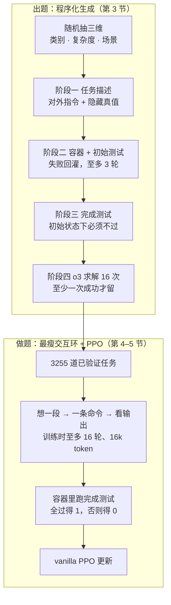

# Endless Terminals：终端 Agent 缺的是能自动判分的题库，不是新算法

<!-- release-date: 2026-01-23 -->

> 本文依据 **Endless Terminals: Scaling RL Environments for Terminal Agents**，作者 Kanishk Gandhi（Stanford，部分工作在微软研究院暑期实习期间完成）、Shivam Garg（Microsoft Research）、Noah D. Goodman（Stanford）、Dimitris Papailiopoulos（Microsoft Research、UW-Madison），arXiv:2601.16443v3，2026-02-14 修订，共 11 页（正文与致谢在 p. 1–9，其余为参考文献）。页码均指这份 PDF 自身的页码。文中区分三件事：**论文明确写了什么**、**我们如何解释它**、**哪些是外部资料或我们的计算**。

## 读前先把几个词说成人话

这篇论文的技术词不多，难点在于它把研究对象从「算法」挪到了「题库」。先把会反复出现的词说清楚：

- **终端 Agent（terminal agent）**：模型待在一个 Linux 容器里，一轮看输出、一轮敲命令，直到文件、进程或配置变成题目要求的样子。它不是写一段 bash 交差，而是多轮试错：命令会失败，要看 stdout / stderr 改主意。
- **Rollout（轨迹生成）**：让当前模型在一道题上完整跑一局。跑出来的一局叫一条 **episode（回合）** 或 **trajectory（轨迹）**。
- **二值回合奖励（binary episode-level reward）**：整局只给一个分，题目的完成测试全过为 1，否则为 0，中间步骤不打分。
- **PPO（Proximal Policy Optimization，近端策略优化）**：最常用的策略梯度算法之一，用裁剪限制每次更新别离旧策略太远。论文称自己用的是 vanilla（原味）PPO。
- **pass@k**：同一道题独立试 $k$ 次，至少成功一次就算过。本篇出题时用 pass@16，失败分析用 pass@5。
- **脚手架（scaffold）**：包在模型外面、规定它怎么行动的那层程序，包括系统提示、工具、上下文怎么拼、何时停。SWE-agent、OpenHands、Terminus 都是脚手架。
- **SFT（Supervised Fine-Tuning，监督微调）与蒸馏**：拿现成的好轨迹做模仿学习；轨迹由更强的教师模型跑出来时就叫蒸馏。
- **Apptainer 与 PTY**：Apptainer（原名 Singularity）是高性能计算集群上常用的容器；**PTY（pseudo-terminal，伪终端）** 是给程序一块假的终端屏幕，好在里面维持一个活着的交互式 shell。
- **TerminalBench 2.0**：人工策展的终端评测集，本篇拿它测「训练时从没见过的人类题目」。

## 一句话先说清

数学和代码上的强化学习能涨分，前提是有大量多样、能自动判对错的题。终端 Agent 没有这样的题库：现成的终端 benchmark 最多几百道，是为评测造的，拿来训练会记住窄分布；蒸馏更强的模型要付 API 钱，还继承教师的天花板；人工标注又贵又慢（PDF p. 2）。

论文开篇的判断很硬：环境才是自我改进 Agent 的瓶颈；强化学习要的是一条能扩展的流水线，不是又一个数据集（PDF p. 1）。

它给出的就是这样一条流水线。四个阶段依次生成任务描述、搭容器并自测、写完成测试、用 o3 做可解性过滤，全程不用人标、不蒸馏出题，最终留下 **3255** 道已验证任务（PDF p. 1、p. 4–5）。训练侧故意朴素：vanilla PPO、二值回合奖励、最瘦的交互环，没有检索、多智能体或专用工具（PDF p. 1）。

结果分两层记，不要混在一起（PDF p. 1、p. 2、p. 6–7）：

| 模型（摘要写法） | 自建 held-out dev：训练前 → 后 | TerminalBench 2.0：训练前 → 后 |
|---|---|---|
| Llama-3.2-3B | 4.0% → 18.2% | 0.0% → 2.2% |
| Qwen2.5-7B | 10.7% → 53.3% | 2.2% → 3.4% |
| Qwen3-8B-openthinker-sft | 42.6% → 59.0% | 1.1% → 6.7% |

自建 dev 和训练题同分布，涨幅大；TerminalBench 2.0 是人类题，有迁移但绝对值很低。论文自己把 Claude Sonnet 4.5 配 Terminus-2、200 轮上限的 **42.8%** 放在旁边（PDF p. 7）。

所以这篇卖的是一件事：**先把能自动判分、还能源源不断长出来的题库造出来，朴素的 PPO 就有东西可吃。** 它没有声称终端 Agent 已经够用。

### 一条阅读路线

原文 11 页，半小时能读完。建议顺序：

1. **p. 2 引言与 p. 3 相关工作**：三条「绕开环境」的旧路，以及它和 OpenThoughts-Agent 的区别。
2. **p. 3 的 Figure 2 与 p. 4 第 3 节**：四个阶段各自挡掉什么样的坏题。
3. **p. 4–5 第 4 节**：一次只许一条命令的交互环。
4. **p. 5–7 第 5 节**：训练设定与 Figure 3；尤其看 Figure 3 下排那组带 Terminus-2 的对照柱。
5. **p. 7–8 的失败分析与 Figure 5、Figure 7**：6.7% 之外的 77 道题卡在哪。
6. **p. 8–9 Discussion**：作者自己承认的四条限制。

## 主要矛盾：RL 要的是题库工厂，终端只有几百道评测题

### 数学 RL 有工厂，终端 RL 没有

数学题有标准答案，代码题有单元测试。题库可以很大，判分不用人。强化学习因此能让模型反复撞题、撞完立刻知道对错。

终端任务难在三处（PDF p. 2）：要跨多轮推理；要从错误里恢复；执行的命令会改变系统状态，顺序也有讲究。人工策展这类环境很贵，现有 benchmark 只有几百道（PDF p. 2）。

**我们如何解释它**：几百道够回答「这个模型行不行」，不够拿来做 RL。RL 要的是能反复撞、撞完能自动打分、分布又不能太窄的题。评测集一旦拿去训练，分布就被记死了。

### 三条绕路，论文各点一条代价

前人基本没有正面造环境，而是绕开它（PDF p. 2）：

| 绕路 | 代价 |
|---|---|
| 把评测集拿来训练 | 任务分布窄，有过拟合风险 |
| 从更强的专有模型蒸馏再 SFT（OpenThoughts） | 学生继承教师天花板，还要付昂贵的 API 费 |
| 人工整理的编程或 shell 任务（NL2Bash 等） | 标注成本限制规模与多样性 |

缺的是一条能生成「初始环境 + 任务说明 + 验证测试」、几乎不用人盯的流水线（PDF p. 2）。

论文点名最接近的工作是 **OpenThoughts-Agent**：它也为终端提供 SFT 与 RL 任务，但 RL 数据里有来自 NL2Bash 的人类查询与命令，而且论文说它没有在 TerminalBench 2.0 或本篇自建 dev 上带来提升（PDF p. 3–4）。SWEGym 有 2438 道带可执行测试的 Python 任务，但依赖现成的 GitHub issue，不是程序化生成（PDF p. 3）。

论文对 SFT 的态度不是对立而是互补：SFT 可以给 RL 一个热启动（PDF p. 3）。后面最强的那个 8B 起点，正是先 SFT 过的。

**我们如何解释它**：三条绕路是同一种退让。环境不够用，就去借评测集、借教师、借人。这篇把退让收回来，代价是必须先发明一套「题怎么自己长、长完怎么自己判」的工序。

## 先看全景：出题和做题是两段，前一段才是贡献

这张图按 PDF p. 1 的 Figure 1、p. 3 的 Figure 2 和第 3–5 节正文重画，是流程示意，不是实测时间轴。每个阶段失败的题直接丢弃，整条流水可以并行（PDF p. 4）。

两段的分工要分开看：

| 段 | 解决什么 | 本篇做了多少创新 |
|---|---|---|
| **出题** | 不靠人、不蒸馏，怎样源源不断造出「容器 + 说明 + 能跑的测试」 | 全部贡献在这里 |
| **做题** | 模型怎样跟终端说话、怎样拿一个 0/1 分数去更新 | 刻意不创新：最瘦脚手架加 vanilla PPO |

**我们如何解释它**：做题段写得越朴素，涨分就越难归功于别的东西。论文要证明的是「环境规模化」，所以把算法和脚手架先固定成最小可用。

## 核心设计一：四个阶段，每个挡掉一种会让奖励说谎的坏题

图上的提示词是节选，不是全文。下面按阶段讲每一步挡住的是哪种坏题。

### 阶段一：对外一份用户口吻，对内一份只给测试看的真值

**旧问题**：让模型直接「出一道终端题」，出来的题要么不够具体、测试没法判，要么把答案写进题面。

**新设计**：一次生成两样东西（PDF p. 4）：

- **任务指令**：写成「有人可能会这样问 AI 助手」的口吻。
- **特权真值（privileged ground truth）**：精确的文件内容、路径和期望终态，只给自动测试用，**永远不给正在交互的 Agent 看**（PDF p. 4）。

Figure 2 把输出格式定成两段 XML：`<task>` 只写终态规格（文件、端口、目录、格式），不给命令，要 Agent 自己推出解法；`<truth>` 放隐藏真值（PDF p. 3）。提示词还要求把测试会检查的输出格式写具体。

**工作机制**：为了多样，每条提示从三个维度随机抽样（PDF p. 4）。类别如文件管理、文本处理、日志分析、git 操作、数据库查询、安全扫描；复杂度从单条命令到多步序列；场景如开发者整理文件、DevOps 查日志、数据分析师处理 CSV。Figure 2 上的三道样例分别是：临时设置时区与 locale 并写日志证明；解析应用日志按服务统计错误数并输出 CSV；给日志包生成严格格式的 SHA-256 校验文件（PDF p. 3）。

**收益**：真值让测试知道「正确答案长什么样」，又不泄漏给策略，模型只能靠在终端里探索拿分。

**代价与边界**：为了可验证，规格必须写死；写死之后题目就更像竞赛题，不像真人含糊的请求。这正是 Discussion 第一条限制（PDF p. 9）。另外，阶段一到三用的是哪个生成模型，正文只写 a language model（PDF p. 4），没有点名。

### 阶段二：容器要建得起来，初始测试要先过

**旧问题**：出题模型可能把世界搭错。日志文件根本不在镜像里，后面 Agent 再努力，完成测试也没有意义。

**新设计**：拿到描述与真值后，模型写两个文件（PDF p. 4）：一个**初始状态测试**，检查前置条件（特定文件、目录、在跑的进程、已克隆的仓库）；一个 **Apptainer 定义文件或 Dockerfile**，把这些前置条件装进容器。

**工作机制**：构建容器，在里面跑初始测试；不过就把失败输出回灌给模型让它改。最多 $k=3$ 轮，仍拿不出合法容器的题丢掉（PDF p. 4）。

**收益与代价**：初始测试考的不是 Agent，是出题模型有没有把世界搭对。$k=3$ 是在「让模型修自己的错」和「别在坏题上反复烧构建」之间切了一刀。论文没有报告第一轮就过的比例，也没有报告这一步丢了多少题。

### 阶段三：完成测试在初始状态下必须是红的

**旧问题**：如果出题模型顺手把终态写进了镜像，完成测试一开始就是绿的，Agent 什么都不做也拿 1 分。

**新设计**：第二份测试在任务结束后跑，检查期望终态：新文件的内容、改过的配置、算出的结果；路径和数据取自特权真值（PDF p. 4）。关键校验是**这份测试在初始状态下不能通过**，保证它确实在判「做没做成」，而不是平凡地成功（PDF p. 4）。

**我们如何解释它**：这一步防的是最便宜的作弊：奖励免费送。它和「什么都不做的空 Agent 必须零分」是同一个检查的两种说法。论文没写这一步淘汰了多少题。

### 阶段四：o3 试 16 次，一次都不成就丢

**旧问题**：前三关挡不住「规格不够、根本无解」的题。这种题的奖励永远是 0，混进训练集只贡献零梯度。

**新设计**：用 o3 在他们的 Agent 框架里交互求解 $n=16$ 次，每次都真跑命令、看输出，直到宣布完成或用尽动作预算。至少一次成功（pass@16 > 0）才保留（PDF p. 4）。

**收益**：留下的题确认强模型做得到；规格不足或无效的题被清掉。正文说这一步丢掉了大约一半候选（PDF p. 5）。按「留下 3255、丢掉约一半」反推，过滤前大约有六千多道候选；这是我们的估算，论文只说 roughly half。

**读 Figure 6 右图要知道的三件事**：

- 最左一格对应 1/16 而不是 0。0/16 的题已经在这一关被扔掉了。
- 图标题写 O3 Pass@1 Distribution，图注写的是「16 次尝试的通过比例」。两者是同一个量：16 次里的成功比例，就是 pass@1 的估计。
- 正文说大约一半的题 16 次全过，其余铺开在各种难度上（PDF p. 5）。

**我们如何解释它**：一半题 o3 次次都过，意味着对 o3 来说题库偏简单；但对 3B–8B 的学生仍然很难，dev 起点只有 4.0%–42.6%。题库难度是按教师标定的，不是按学生标定的。

**代价与边界**：这一关同时是天花板。流水线造不出超过 o3 能力的题（PDF p. 9）。Discussion 把它列为第二条限制，下文再讲。

### 题库长什么样

Figure 4 的饼图（PDF p. 5）改写成表。图上只给五个扇区印了百分比：

| 类别 | 占比 |
|---|---:|
| File Operations（文件操作） | 18.8% |
| Log Mgmt.（日志管理） | 16.5% |
| Data Proc.（数据处理） | 13.0% |
| Text Proc.（文本处理） | 4.8% |
| Scripting、Archiving、Database、Network & API | 有标签、未印百分比，合计 7.7% |
| Other（其他） | 39.2% |

百分比读自 Figure 4 扇区上的标注；7.7% 是 100% 减去五个已印数字之和，是我们的计算。正文说文件操作是最大的一类（PDF p. 5），指的是有名字的类别里最大；「Other」这一块其实更大。图注写着「Left:」，但这一页只有一张饼图。

Figure 6 左图给的是解答长度：多数任务需要 1,000–4,000 字符的交互，长尾超过 10,000（PDF p. 5、p. 7）。另外，3255 道都是 Apptainer 格式，其中约 2500 道也转成了 Harbor 格式；全部实验只用 Apptainer 这一路（PDF p. 5）。

### 可迁移启发

自动出题至少要过四种检查：规格写清、环境建得起来、测试非平凡、强模型做得到。少了「初始必须为红」，奖励会变成免费午餐；少了可解性过滤，训练集会混进永远得 0 的题。**检查用什么模型可以换，检查的种类很难省。**

## 核心设计二：最瘦的交互环，把脚手架从变量里拿掉

### 每一轮只许吐一条命令

**旧问题**：如果训练时同时换了一套复杂工具，涨分就说不清是环境的功劳还是工具的功劳。

**新设计**：每一轮，模型看到完整对话史（自己之前的推理、之前的命令、shell 的输出），然后要么再给一条命令，要么宣布完成（PDF p. 4–5）。格式只有最小 XML：`<command>...</command>` 包住一条 shell 命令，`<command>done</command>` 表示结束。命令前可以写任意推理，这些推理会留在后续轮的上下文里，模型可以回看、改错、在半成品上继续（PDF p. 5）。

系统提示只有三条：每轮一条命令、用非交互标志、宣布完成前先自己验证。所以 vim、htop 这类交互式工具用不了（PDF p. 5）。

相关工作一节把它放在脚手架谱系的最瘦一端：SWE-agent 有专用的代码导航与编辑命令；OpenHands 捆了 bash、文件编辑和浏览器；Terminus 只给一个用击键控制的 tmux；本篇比 Terminus 还瘦（PDF p. 2）。

### 容器里有一个活着的 shell

Docker 路径用 Harbor 框架；Apptainer 路径用 PTY 维持一个持久的交互式 shell（PDF p. 5）。Agent 连上的容器实例在整局里一直活着：文件系统、环境变量、在跑的进程，命令之间都保留。每条命令的 stdout、stderr 和退出码被捕获，拼成一条结构化观察（先说成功还是失败，再给输出），作为下一条用户消息接回对话（PDF p. 5）。

### 一局何时结束，分数何时出现

训练时，模型说 done、到 16 轮、或到 16k token，三者任一发生就停；然后在容器里跑事先留出的完成测试决定成败（PDF p. 5）。奖励只在这一刻出现：全过为 1，否则为 0（PDF p. 6）。

推理时放宽到 64 轮；上下文到上限时，把之前的命令历史折进第一条用户消息（PDF p. 6）。失败分析里把这叫作滑动窗口（PDF p. 8）。

### 收益、代价与启发

**收益**：对照更干净。涨分只能来自题库和 RL，不能来自工具。

**代价**：真实运维里人会开 vim、看 htop；这里的 Agent 被设计成不会。而且训练 16 轮、评测 64 轮，训练与评测的交互长度并不一致。

**可迁移启发**：想证明「环境、奖励、脚手架」里的某一项，就把另外两项先固定成最小可用。否则读者会把涨分记在工具头上。

## 核心设计三：vanilla PPO 到底有多 vanilla

实现基于 SkyRL 训练框架（Griggs et al., 2025）（PDF p. 6）。设定如下（PDF p. 6）：

| 项目 | 取值 |
|---|---|
| 每道题的 rollout | 16 条 |
| 每条最多 | 16 轮；每轮至多生成 2048 token；整段上下文 16k |
| 温度 | 训练与评测都是 0.6 |
| 奖励 | 回合级 0/1，无中间奖励 |
| PPO 裁剪 | $\varepsilon_{\text{low}}=0.2$，$\varepsilon_{\text{high}}=0.28$（引自 DAPO） |
| 损失聚合 | 序列级平均（sequence level loss averaging） |
| KL 惩罚 | 不用，理由只有一句「anecdotally we found that this hurt performance」 |
| 环境超时 | 5 分钟，为了缩短收集 rollout 的时间 |

三个起点和算力（PDF p. 6）：

| 起点 | 带着什么 | 硬件与墙钟 |
|---|---|---|
| Llama-3.2-3B-Instruct | 通用指令模型 | 4 张 A100，约 2 天 |
| Qwen2.5-7B-Instruct | 通用指令模型 | 4 张 A100，约 2 天 |
| Qwen3-8B-openthinker-sft | 已在 15,000 条蒸馏轨迹上 SFT | 8 张 B200，约 8 小时 |

这 15,000 条轨迹来自两个来源：基于 NL2Bash 的 shell 命令格式化合成任务，以及把 InferredBugs 里的 C# / Java bug 改造成的交互任务；轨迹由 GLM-4.6 蒸馏（PDF p. 6）。p. 8 再次写成「来自 NL2Bash 和 InferredBugs 的 15,000 条蒸馏轨迹」，与「两个来源」一致。

同一个 8B 检查点在 PDF 里有好几种写法：Qwen3-8B-openthinker-sft、Qwen-3-8B-Open-Thoughts、qwen3-8b-openthoughts-sft，Figure 3 柱下写作 Qwen3-8B + OT-SFT（PDF p. 1–2、p. 6–7）。它们指同一个模型。

**我们如何解释它**：「vanilla」是相对 Agent 脚手架和奖励塑造而言的，算法上并不完全是 2017 年的 PPO。裁剪上下界借了 DAPO 的 clip-higher（0.28 大于 0.2）；损失却用序列级平均，而 DAPO 一篇主张的是 token 级平均，认为句级平均会让长回答里的每个 token 变轻。本篇没有解释为什么这样组合。去掉 KL 与不少近期配方一致，但本篇给的证据只是一句「anecdotally」。

**原文没写的**：学习率、batch size、PPO epoch 数、value model 与 GAE 的设定、参考策略多久同步，正文都没有给。

## 实验：同分布大涨，人类题上涨得小，绝对值仍低

### 训练曲线：三个起点都在涨

正文的结论是：无论模型大小与起点能力，奖励都在训练中上升（PDF p. 6）。训练步数正文没写，只能从横轴读出。Qwen2.5-7B 的曲线在最后几十步明显回落，正文没有讨论，也没有说最终评测用的是哪一步的检查点。

### 三个评测集放在一张表里

Figure 3 下排三张柱状图（PDF p. 6）改写成表。第四行「+ Terminus-2」是一组外部对照：同一个 Qwen3-8B + OT-SFT 基座放进 Terminus-2 脚手架里评测，以及 OpenThoughts-Agent 自己的 RL 模型，同样用 Terminus-2 评测。

| 起点 | 自建 dev：基座 / +RL（本篇） / +RL（OpenThinker） | OpenThinker dev：同上 | TerminalBench 2.0：同上 |
|---|---|---|---|
| Llama-3.2-3B | 4.0 / 18.2 / — | 0.0 / 1.0 / — | 0.0 / 2.2 / — |
| Qwen2.5-7B | 10.7 / 53.3 / — | 3.9 / 8.5 / — | 2.2 / 3.4 / — |
| Qwen3-8B + OT-SFT | 42.6 / 59.0 / — | 9.7 / 10.2 / — | 1.1 / 6.7 / — |
| Qwen3-8B + OT-SFT + Terminus-2 | 48.0 / — / 41.3 | 16.2 / — / 17.1 | 4.7 / — / 4.7 |

单位是 pass@1 百分比。前三行在正文里都写过（PDF p. 6–7）；第四行的 48.0、41.3、16.2、17.1、4.7 只在 Figure 3 的柱顶标注里出现，读自该图。TerminalBench 2.0 上本篇方法的数字是 5 次运行的平均（PDF p. 6，Figure 3 图注）。

### 读这张表要看的三件事

**第一，同分布的大涨是真的，但它是同分布。** 7B 从 10.7% 到 53.3%，绝对涨幅最大（PDF p. 6）。8B 起点已是 42.6%，还能涨到 59.0%，说明热启动之后仍有 RL 可吃的信号。论文把这读成流水线提供了可靠的训练信号（PDF p. 7）。

**第二，一换分布，涨幅就缩。** OpenThinker dev 上三个模型只涨 1.0、4.6、0.5 个点（我们的计算）。论文给的原因是这个集合含有 issue 修复这类一般软件工程任务，不全是纯终端任务（PDF p. 7）。

**第三，图注的说法比柱子更满。** Figure 3 图注写本篇 RL 模型「在所有评测上」都超过基座与其他微调变体（PDF p. 6）。但在 OpenThinker dev 上，Terminus-2 那组的 16.2 和 17.1 都高于本篇 8B 的 10.2。正文把「超过其他版本」的说法限定在 TerminalBench 2.0 这一栏（PDF p. 7，指向 Figure 3 右下），那一栏确实成立：6.7 高于 4.7。

**我们如何解释它**：Terminus-2 这组对照混了两个变量。在 TerminalBench 2.0 上，同一个 8B 基座光换成 Terminus-2 就从 1.1 到 4.7，涨 3.6 个点；本篇 RL 在最瘦脚手架上把它推到 6.7，涨 5.6 个点（两个差值都是我们的计算）。本篇 RL 模型放进 Terminus-2 会怎样，论文没有测。所以「更瘦的脚手架加本篇环境胜过更复杂的脚手架加别人的 RL」成立，但「脚手架不重要」推不出来。

### TerminalBench 2.0：有迁移，但把 6.7% 和 42.8% 一起记

TerminalBench 2.0 是人类策展的题，训练时从未见过；论文说任务生成早于这个基准发布，以此排除数据泄漏（PDF p. 7）。

论文自己给了对照：他们最好的模型是 6.7%，用 64 轮、没有 Agent 脚手架；Claude Sonnet 4.5 配 Terminus-2、200 轮上限是 42.8%（PDF p. 7）。摘要里的「substantial gains」指的是相对提升，不是绝对水平。

pass@5 按难度下降（PDF p. 8，Figure 7 右）：

| 难度 | pass@5 |
|---|---|
| easy | 25%（1/4） |
| medium | 14.5%（8/55） |
| hard | 10%（3/30） |

三档题数相加是 89 道，五次里至少做成一次的是 12 道（都是我们的计算）。Figure 7 的图注把左右写反了：图注说右边是按类别、左边是按难度，实际图上左边是按类别、右边是按难度（PDF p. 8）。

按类别的 pass@5（PDF p. 8，Figure 7 左）：

| 类别 | pass@5 | 类别 | pass@5 |
|---|---|---|---|
| software-engineering | 6/26 | security | 1/8 |
| data-science | 1/8 | optimization | 1/2 |
| scientific-computing | 1/8 | mathematics | 0/4 |
| system-administration | 1/9 | machine-learning | 0/3 |
| data-processing | 1/4 | model-training | 0/4 |

十类的分子相加是 12，和难度那张对得上；分母相加却是 76，比 89 少 13 道（我们的计算），论文没解释少掉的题归在哪。Discussion 把软件工程写成 23%（PDF p. 8–9），就是 6/26。

## 失败分析：卡住的 77 道题里，一半在原地打转

失败分析的对象是最好的 8B 模型在 TerminalBench 2.0 上零成功的那些题（PDF p. 7）。原文 Figure 5 画了三根柱：循环失败 39%、轮次耗尽 26%、过早结束 49%，相加超过 100%，因为前两类有 11 道题重叠（PDF p. 7–8）。正文给了前两类的题数：30 道和 20 道（PDF p. 8）。

这组数字自洽：30 道占 39%、20 道占 26%，都对应约 77 道失败题；$30+20-11=39$，剩下 $77-39=38$，占 49%。这些推算都是我们的计算，和上一节「89 道里做成 12 道」严丝合缝。

三类失败各是什么（PDF p. 8）：

- **循环失败**：模型反复执行同一串命令，出不来。论文引了一篇专门研究推理模型为什么会循环的工作（Pipis et al., 2025）。
- **轮次耗尽**：撞上轮数上限。训练只有 16 轮，评测给 64 轮加滑动窗口。
- **过早交卷**：带着错误答案提前结束，常见于密码分析、机器学习模型提取、生物信息这类模型缺领域知识的题。

为了解释循环，论文定义了 **命令多样性（command diversity）**：第一次出错之后，不重复的命令数除以总命令数。成功的题平均 0.49，循环失败的题平均 0.18（PDF p. 8）。成功的跑法出错后会换路，失败的跑法在重复。

**我们如何解释它**：二值回合奖励看不见循环。循环的每一步看起来都像「还在干活」，只有终局测试红了才知道整局是 0。0.49 对 0.18 是事后统计，没有进入训练目标。论文在 Discussion 里说「探索替代路径」很关键（PDF p. 8），但训练目标没有为此加任何项；另外，论文没有给这两个平均值的样本量或显著性检验。

### SFT 和 RL 是互补的，但两件事要分开记

先 SFT 过的 Qwen3-8B-openthinker-sft，RL 后在 TerminalBench 2.0 上拿到 6.7%，是三个模型里最高的。论文的读法是：更强的起点放大 RL 的收益，SFT 提供热启动（PDF p. 8）。

要分开两笔账。**出题**不从更强模型蒸馏（PDF p. 1、p. 8）；**8B 这个起点**是从 GLM-4.6 蒸馏来的（PDF p. 6）。「环境不蒸馏」不等于「整条配方零蒸馏」。另外，Llama 与 Qwen2.5 两个起点既换了模型族又没有 SFT，这个比较不是只差「有没有 SFT」一个变量。

## 作者自己承认的限制

Discussion（PDF p. 8–9）先复述贡献，再列四条限制与后续方向。按原文顺序：

1. **题目不像真人会问的。** 程序化生成的题更像竞赛编程，不像用户真正丢给 AI 助手的那种含糊、欠规格的请求。真实终端使用常常目标模糊、上下文隐含，可能需要追问。这些很难在自动生成的规格里保留，同时又保住可验证性（PDF p. 9）。
2. **可解性过滤自带能力天花板。** o3 的 pass@16 留下可解的题，也丢掉了超出 o3 能力的题，所以流水线造不出超过前沿验证器的任务。论文指向 self-play：让模型生成刚好超出自己能力的题，难度可以自适应地涨（PDF p. 9，引用 Poesia et al., 2024 与 Absolute Zero）。
3. **人进回路会更好，也更贵。** 让人验证生成的题或提供更自然的描述，质量与多样性可能更好，但流水线更难规模化（PDF p. 9）。
4. **脚手架、奖励和世界模型都还没试。** 更丰富的脚手架（检索、多智能体、工具）；按通过的测试数给部分奖励，让信号更密；学习终端动态的世界模型，在想象的 rollout 里先规划再执行（PDF p. 9）。

另外，软件工程之外的领域覆盖不足：数学、机器学习、模型训练三类都是零。论文说这**可能**反映流水线对这些领域覆盖不够（PDF p. 8–9）。这是作者的推测，没有消融。

论文最后把自己定位为更大努力里的「一个齿轮」，希望社区在算法、脚手架、训练目标之外，也投入自动出题流水线（PDF p. 9）。

## 读完要留下的判断

**被实验撑住的：**

- 同分布 held-out dev 上，3B、7B、8B 三个起点都涨，7B 从 10.7% 到 53.3%（PDF p. 6）。
- 没训练过的 TerminalBench 2.0 也涨，最瘦脚手架下的 6.7% 高于图上 Terminus-2 那组的 4.7%（PDF p. 7；4.7 读自 Figure 3）。

**只是作者观察或推测的：**

- 数学、机器学习、模型训练为零是因为题库覆盖不足（PDF p. 8–9）。
- 命令多样性高是成功的原因，而不只是成功的伴随现象。
- 不加 KL 更好（「anecdotally」，PDF p. 6）。

**没有公开的：** 出题模型、PPO 的大部分超参、各阶段的淘汰数、dev 集的题数与抽样方式、TerminalBench 5 次运行的方差。

**撑不住、也没被论文声称的：** 终端 Agent 已经够用。6.7% 对 42.8% 的差距摆在同一页上（PDF p. 7）。

## 可迁移启发

1. **Agent 不涨分，先数题库。** 数一数有多少道能自动判分、而且不是评测集本身的题。题不够时换 PPO 变体，多半是在空锅里搅。
2. **自动出题至少四种检查。** 规格、环境能建、测试非平凡、强模型做得到。「初始必须为红」和「空 Agent 必须零分」是同一件事，最便宜也最容易漏。
3. **真值给测试，不给策略。** 测试需要精确终态，策略不能看见精确终态。泄漏的那一刻，模型学的就是读答案。
4. **主张环境，就先把脚手架瘦下来。** 本篇禁掉 vim、htop 不是因为它们没用，而是为了对照干净。
5. **训练分布和迁移要分开报。** 自建 dev 的 53.3% 与 TerminalBench 的 3.4% 是同一个 7B。自己做 Agent RL 时，至少留一个生成流程碰不到的人类基准。
6. **过滤器会变成天花板。** 用更强模型筛题，训练集就不可能比它难。要超越，得换成 self-play 或人。
7. **终局 0/1 看不见原地打转。** 失败日志里大量重复命令时，先加过程信号或多样性相关的约束，再考虑换算法家族。
8. **题库来源和起点来源是两笔账。** 8B 的最好成绩建立在蒸馏 SFT 上；题目本身没有蒸馏。

## 关键词回看

- **Endless Terminals**：全自动、程序化生成终端任务的四阶段流水线，产出 3255 道已验证题，再用 vanilla PPO 训练终端 Agent（PDF p. 1）。
- **特权真值**：只给测试看的精确路径、内容与终态，不给 Agent（PDF p. 4）。
- **初始测试 / 完成测试**：前者确认世界搭对了；后者确认终态对了，且在初始状态下必须失败（PDF p. 4）。
- **$k=3$ 容器迭代**：构建或初始测试失败就回灌日志，最多三轮（PDF p. 4）。
- **pass@16 可解性过滤**：o3 交互求解 16 次，一次不成就丢，约丢一半候选（PDF p. 4–5）。
- **最瘦交互环**：`<command>` 包一条命令，`<command>done</command>` 结束，历史全留在上下文（PDF p. 5）。
- **二值回合奖励**：完成测试全过为 1，否则为 0（PDF p. 6）。
- **clip-higher**：$\varepsilon_{\text{low}}=0.2$、$\varepsilon_{\text{high}}=0.28$，引自 DAPO，本篇仍称 vanilla PPO（PDF p. 6）。
- **命令多样性**：第一次出错后的不重复命令占比，成功 0.49，循环失败 0.18（PDF p. 8）。
- **42.8%**：Claude Sonnet 4.5 配 Terminus-2、200 轮在 TerminalBench 2.0 上的成绩，本篇最好模型是 6.7%（PDF p. 7）。

## 资料与阅读边界

### 版本与首发日

- 依据版本是 arXiv:2601.16443 的 v3（2026-02-14）。arXiv 提交历史为 v1 2026-01-23、v2 2026-01-27、v3 2026-02-14，核验时 v3 仍是最新版：[arXiv:2601.16443](https://arxiv.org/abs/2601.16443)。
- `release-date` 取 **2026-01-23**，即 arXiv v1 提交日。论文只给出代码地址，正文没有提到发布模型；Hugging Face 合集 [obiwan96/endless-terminals](https://huggingface.co/collections/obiwan96/endless-terminals) 里的两个 RL 模型权重分别在 2025-12-17 与 2025-12-29 提交，但在 arXiv v1 之前没有找到任何公开指向它们的官方记录，按预置处理，不作首发证据；数据集在 2026-01-24 上传，官方仓库 [kanishkg/endless-terminals](https://github.com/kanishkg/endless-terminals) 首次提交在 2026-01-25，都晚于 v1。

### 覆盖了原文哪些部分

摘要与 Figure 1；第 1 节引言；第 2 节相关工作（脚手架、SFT 与蒸馏、benchmark、合成环境）；第 3 节四阶段流水线与 Figure 2；第 4 节交互环、shell 环境、最瘦脚手架、回合终止；第 5 节题库统计与 Figure 4、Figure 6，训练设定，Figure 3 全部三个评测，TerminalBench 迁移，失败分析与 Figure 5、Figure 7，SFT 与 RL 互补；第 6 节 Discussion 的四条限制与后续方向；致谢。

### 外部资料补充（不是 PDF 原文）

- 官方仓库 [kanishkg/endless-terminals](https://github.com/kanishkg/endless-terminals)（PDF p. 1 脚注给出地址）。README 的示例命令用 `Qwen/Qwen3-32B` 跑出题与求解脚本，训练脚本需先安装 SkyRL，评测走 Harbor；三份训练配置分别对应 Llama-3.2-3B、Qwen2.5-7B、Qwen3-8B。这些是仓库的示例配置，论文没有点名出题模型，可解性过滤写的是 o3，两者不能互相替代。
- Hugging Face 合集 [obiwan96/endless-terminals](https://huggingface.co/collections/obiwan96/endless-terminals) 放出了数据集和 7B、8B 两个 RL 后的模型；论文正文没有提到权重公开。
- TerminalBench 2.0 的官方任务仓库 [harbor-framework/terminal-bench-2](https://github.com/harbor-framework/terminal-bench-2) 在核验时有 89 个任务目录，与 Figure 7 三档难度相加的 89 一致。
- Harbor 框架仓库 [laude-institute/harbor](https://github.com/laude-institute/harbor)（PDF p. 5 引用）。
- 站内相关篇目：DAPO（clip-higher 与 token 级平均的原始论证）；Terminal-Data-Engineering（同样造终端题，但按领域复用环境、走 SFT，与本篇按题生成环境、走 PPO 形成对照）；Skill2Env（把本篇归入「从分类表或种子造任务」一类，并主张不必让教师先做一遍再丢题）；SkyRL-Agent（与本篇所用 SkyRL 训练框架同属一个团队的 Agent 层论文；本篇只说实现基于 SkyRL，没有提到那篇的 Agent 层与调度器）；Absolute-Zero（Discussion 指向的 self-play 路线）。

### 原文没有公开的缺口

- 阶段一到三用的生成模型、温度与完整提示词（Figure 2 只是节选）；
- 各阶段各淘汰了多少题，过滤前的精确候选数（只有「约一半」）；
- PPO 的学习率、batch size、epoch、value model 与 GAE 设定，训练步数与最终评测所用检查点；
- 自建 dev 与 OpenThinker dev 的题数和抽样方式；
- TerminalBench 2.0 五次运行的方差或置信区间；
- Figure 7 类别分母 76 与难度分母 89 之间差的 13 道题；
- 命令多样性 0.49 与 0.18 的样本量与显著性；
- 约 2500 道 Harbor 格式任务有没有跑过任何训练或评测。
