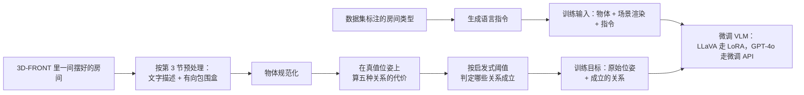

# LayoutVLM：无标签资产加一句话，怎么摆成既不穿模又像那么回事

<!-- release-date: 2024-12-03 -->

> 本文依据 **LayoutVLM: Differentiable Optimization of 3D Layout via Vision-Language Models**，arXiv:2412.02193v3，2025-03-11，共 19 页；CVPR 2025。作者来自斯坦福大学（Fan-Yun Sun 与 Weiyu Liu 为共同一作）与 Google Research（Goutam Bhat、Federico Tombari）。页码均指 PDF 自身页码：正文 p. 1–9，参考文献 p. 10–11，p. 12 起是附录（附录页脚从 1 重新编号，本文仍按 PDF 页码引）。文中区分三件事：**论文明确写了什么**、**我们怎么解释它**、**哪些是外部资料或本文推算**。

## 读前先把几个词说成人话

- **VLM（Vision-Language Model，视觉语言模型）**：能看图、再写文字或代码的模型。本文推理主路径用现成的 GPT-4o（PDF p. 3），微调实验另用开源的 LLaVA-NeXT-Interleave（PDF p. 6、p. 9）。和只吃文字的 LLM 相比，差别就在它真的看了渲染图。
- **开放宇宙布局（open-universe layout generation）**：资产没有事先定好的类别表，指令是随便一句话，房间也不限于卧室客厅。输入是一堆无标签的 3D 网格加一句话，输出是每件东西的摆放位姿（PDF p. 2–3）。
- **位姿 $p_i=(x_i,y_i,z_i,\theta_i)$**：三维位置，加上绕竖直 $z$ 轴的一个转角。物体被假定已经直立，没有侧倾和俯仰（PDF p. 3），所以这不是完整的 6 自由度。
- **包围盒**：罩住整件物体的盒子。预处理时先把物体转到正面朝 $+x$，再量它的轴对齐盒子尺寸 $b_i$（PDF p. 3）；优化防碰撞时用的是物体当前朝向下的 **有向包围盒（oriented bounding box，OBB）**（PDF p. 5）。盒子不是网格：两个凹形家具的盒子相交，网格未必真撞上。
- **视觉标记（visual marks）**：把坐标点、坐标轴、朝前箭头画进渲染图，再交给 VLM 看。思路来自 Set-of-Mark 一类视觉提示工作（PDF p. 3、p. 5）。
- **可微空间关系**：每条关系（「椅子离桌子 1–3 米」「台灯朝向床」）都对应一个能对位姿求导的损失。优化器沿梯度推物体，而不是像约束求解那样判「满足 / 不满足」再搜索（PDF p. 2–4）。
- **自洽解码（self-consistent decoding）**：VLM 一次写出两样东西，数值初值和关系；只保留那些在初值上已经成立的关系（PDF p. 5）。它不是 Self-Consistency 那种「多条推理路径投票」。
- **Distance-IoU（DIoU）**：检测文献里把盒子重叠程度和中心距离合在一起的量。本文把它用在成对的 3D 有向包围盒上，作为防碰撞项（PDF p. 5）。
- **3D-FRONT 与 Objaverse**：前者是带家具布局的合成住宅场景库，本文从中抽出约 9000 间房做微调监督（PDF p. 5）；后者是开放的 3D 资产库，测试用的网格从这里检索（PDF p. 7）。

## 一句话先说清

往房间里摆一堆没有标签的 3D 资产，要同时满足两件事：物理上站得住（不互相穿插、不伸出墙外），语义上像指令说的那样（「中央阅读区」「椅子两两相对」）。直接让模型写坐标，语义常对、物理常垮；先写关系再交给约束求解，物理有了、语义常丢（PDF p. 1–2）。

LayoutVLM 的做法是 **让 VLM 看打了标记的图，一次写出两套会互相检查的东西：每件物体的数值初值，和一组可微的空间关系；只把「初值上已经成立」的关系留下，再和防碰撞项一起做可微优化，隔一段把物体投影回房间里**（PDF p. 1–5）。同一套表示还能从 3D-FRONT 自动抽出来，拿去微调 VLM（PDF p. 5）。

实验结论（PDF p. 6–9）：11 类房间上，物理与语义合在一起的 PSA 分平均 58.8，比最好的基线 I-Design（18.0）高 40.8；消融里去掉关系与优化，PSA 掉到 6.7；用这套表示微调开源 LLaVA，住宅三类房间上 PSA 从 0.7 升到 39.5，而只教它回归数字只到 6.8。

### 一条阅读路线

1. **p. 1 Figure 1**：三种方法摆同一间阅读室，一眼看清「物理 vs 语义」两种失败。
2. **p. 3 Figure 2、p. 4 Figure 3**：VLM 写出的那段 Python 长什么样，以及整条流水线。
3. **p. 4–5 §4.1–4.3、式 (1)–(2)**：两套表示、视觉标记、自洽解码、可微优化，全文的方法都在这两页。
4. **p. 6 Table 2、p. 8 Table 5**：11 类房间主表，和四组消融。
5. **p. 9 Table 6**：微调对照，尤其是「只教数字」那两行。
6. 附录 **p. 13–15**：五种关系的公式、优化器数字、VLM 写约束的提示词，以及自洽解码在实现里的两条简化。

## 主要矛盾：语义常识在大模型里，物理可行性在优化器里


图上三栏就是论文要解决的两道裂缝（PDF p. 1–2）。

**直接写坐标。** LayoutGPT 这类方法让语言模型直接给出每个物体的位置和朝向。它借到了语言里的空间常识，但物体一多就会互相穿插、伸出房间（PDF p. 2）。

**先写关系、再搜可行解。** Holodeck 先预测资产之间的空间关系，再把它们当约束去求解。物理上更讲究，可物体一多就找不到可行解；刚性的约束也装不下语言里那些细的意思（PDF p. 2、p. 8）。

两边各守住一半。论文的判断是：数值位姿和空间关系本来是互补的——前者携带模型对「大概放哪」的常识，后者在后续修正物理时还能继续说话。把两者放进同一个可微优化里，才可能两头都要（PDF p. 2、p. 4）。

「开放宇宙」还给这件事加了一层难度：资产来自开放资产库，书店、花店、机房都可能出现，没法像 3D-FRONT 上训练的布局模型那样靠闭集类别和学到的摆放模式（PDF p. 2）。常识只能从大模型借。

## 先看全景：分组看图 → 写两套代码 → 过滤关系 → 一起推

![Figure 3 原图：指令和一组资产（地毯、桌子、扶手椅、落地灯）连同带 2 米坐标点的当前场景斜视图与顶视图一起送进 VLM；VLM 输出数值位姿（如把桌子和地毯放在房间中心 [4.0, 2.5]）和空间关系（每把扶手椅 distance_constraint 与 point_towards 桌子）；随后经过自洽解码、从 t1 到 t200 的可微优化和渲染，得到新的 3D 场景。](/reports/LayoutVLM/figure3-pipeline.png)

问题的形式化只有几行（PDF p. 3）：给一句布局准则 $\ell_{\mathrm{layout}}$、沿东南西北四个方向的四面墙 $\{w_1,\dots,w_4\}$、$N$ 个 3D 网格；目标是给每个网格一个位姿 $p_i$。优化目标写成（PDF p. 4）：

$$
\arg\min_{\{p_i\}_{i=1}^{N}}\bigl(\mathcal{L}_{\mathrm{semantic}}+\mathcal{L}_{\mathrm{physics}}\bigr),\qquad \text{从初值 }\{\hat p_i\}_{i=1}^{N}\text{ 出发}
$$

$\mathcal{L}_{\mathrm{semantic}}$ 来自 VLM 写出、再经过自洽解码筛过的空间关系；$\mathcal{L}_{\mathrm{physics}}$ 负责不穿模。$\hat p_i$ 是 VLM 写的初值。

图上看不出的几件事：

- **资产先分组。** 物体多了，一次调用塞不下全部描述和图，所以先用 LLM 按功能和语义把资产聚成组，一组一组放；每放一组之前重新渲染场景，让 VLM 看见哪里已经被占（PDF p. 5）。附录的分组提示把「床 + 床头柜 + 台灯」当一组，也允许「沙发 + 几米外的电视柜」成组，并要求按先后顺序排好组，焦点件先放（PDF p. 12–13）。
- **资产标注是预处理，不是本文贡献。** 沿用 Holodeck 的做法：GPT-4o 看物体在 0°、90°、180°、270° 四个视角的图，给出类别、变量名、哪一面是正面、描述、材质，以及放在地上 / 墙上 / 天花板 / 物体上的属性（PDF p. 15）。
- **VLM 写的是代码，不是自然语言。** 输出是一段 Python DSL，写死了坐标系约定：右手系，XY 是地板、Z 向上，原点在房间一角；资产正面沿 $+x$（PDF p. 14）。
- **开销。** 40 个资产的场景，单卡优化 1–5 分钟，GPT-4o 调用 5–10 次（一组一次），随 VLM 定义的优化问题变化（PDF p. 14）。没有给端到端墙钟和 API 花费。

## 核心设计一：两套表示绑在一起——初值给起点，关系管「修物理时别跑偏」

### 旧问题：只给数字没护栏，只给关系会无解

论文对理想表示提了两条要求：对开放语言足够有表达力，对物理足够精确（PDF p. 4）。只预测数字，优化时没有东西告诉你「椅子本该围着桌子」，推开重叠就可能把语义推没了。只预测关系、再当硬约束求解，物体一多就无解。

### 新设计：同一段 DSL 里交两份作业

Figure 2 是论文给的卧室例子（PDF p. 3），照原图转写如下。这是论文的示例输出，不是训练语料：

```python
bed[0].position = [1.5, 3.1, 0.0]
bed[0].rotation = [0, 0, -1.57]
side_table[0].position = [0.3, 4.1, 0.0]
side_table[0].rotation = [0, 0, -1.57]
side_table[1].position = [2.7, 4.1, 0.0]
side_table[1].rotation = [0, 0, -1.57]
table_lamp[0].position = [0.3, 4.1, 0.5]
table_lamp[0].rotation = [0, 0, 1.57]
table_lamp[1].position = [2.7, 4.1, 0.5]
table_lamp[1].rotation = [0, 0, 1.5707]

for i in range(0, 2):
    solver.against_wall(side_table[i], walls[2])
    solver.distance(side_table[i],
                    bed[0],
                    min_distance=1.0,
                    max_distance=3.0)
for i in range(0, 2):
    solver.align_with(side_table[i], bed[0])
    solver.point_towards(table_lamp[i], bed[0])
for i in range(0, 2):
    solver.on_top_of(table_lamp[i], side_table[i])
```

前十行是 **数值初值**：床在 $(1.5, 3.1)$，两个床头柜分列两侧、都在 $y=4.1$，台灯在床头柜上 0.5 米高。后面是 **空间关系**：床头柜靠墙、离床 1–3 米、与床对齐，台灯朝向床、叠在床头柜上。两份作业由同一个模型、在同一次调用里交出。

示例和附录提示有两处对不上：Figure 2 的转角写成 $\pm 1.57$，看起来是弧度，而附录 DSL 把 `rotation` 定义为「逆时针的度数」，并说 `[90]` 表示朝 $+y$（PDF p. 14）；Figure 2 用 `solver.distance`，Figure 3 和附录 DSL 用 `distance_constraint`（PDF p. 4、p. 14）。论文没说明，按 DSL 定义以附录为准。

### 五种关系，全部相对、全部可导

Table 1 列出五种关系（PDF p. 2），附录 A.2 给公式（PDF p. 13–14）：

| 类型 | 记号 | 人话 | 损失怎么算 |
|---|---|---|---|
| 位置 | $\mathcal{L}_{\mathrm{distance}}(p_i,p_j,d_{\min},d_{\max})$ | 两件东西的平面距离落在区间里 | 对平面距离做截断，见下 |
| 位置 | $\mathcal{L}_{\mathrm{on\_top\_of}}(p_i,p_j,b_i,b_j)$ | 一件叠在另一件上 | 取 $-\mathcal{L}_{\mathrm{DIoU}}$ 把两盒拉到重叠；$z_i$ 不走损失，直接设到 $j$ 的顶面 |
| 朝向 | $\mathcal{L}_{\mathrm{align\_with}}(p_i,p_j,\phi)$ | 两件按指定角度对齐 | 朝向向量的余弦距离 |
| 朝向 | $\mathcal{L}_{\mathrm{point\_towards}}(p_i,p_j,\phi)$ | 一件朝向另一件，可带偏角 | 已朝向则为 0，否则为余弦距离 |
| 混合 | $\mathcal{L}_{\mathrm{against\_wall}}(p_i,w_j,b_i)$ | 靠墙，且背对墙 | 四角到墙段的截断距离之和，加背朝墙法向的余弦项 |

朝向统一写成平面单位方向 $v_i=(\cos\theta_i,\sin\theta_i)$。以「朝向另一件」为例（PDF p. 13，式 5）：

$$
\mathcal{L}_{\mathrm{point\_towards}}(p_i,p_j,\phi)=
\begin{cases}
0, & v_i\cdot d_{ij}>0\\[2pt]
1-\dfrac{v_i\cdot d_{ij}}{\lVert v_i\rVert\,\lVert d_{ij}\rVert}, & \text{否则}
\end{cases}
$$

$d_{ij}$ 是从 $i$ 指向 $j$、再绕 $z$ 轴转 $\phi$ 度的方向。意思是：只要大致朝着对方（夹角小于 90°）就不罚，背过去了才按偏离程度罚。

这些关系 **不依赖固定参考系**。经典的「在前面」「在左边」要先定义谁的前、谁的左；这里只用两件东西之间的相对位姿（PDF p. 2、p. 4）。VLM 可以为关系选参数，比如距离的上下界（PDF p. 5）。

距离项有一处要小心。正文说「超出指定区间损失更高」（PDF p. 5）；附录式 3 印的是 $\mathrm{clamp}\bigl(\min(\lVert p_i-p_j\rVert-d_{\min},\ d_{\max}-\lVert pos_i-pos_j\rVert),0,1\bigr)$（PDF p. 13），按字面在区间内为正、区间外被截成 0，方向和正文相反。原文没有更正，这里按正文意图理解，不替它改写公式。

### 收益、代价与边界

Table 5 把两块拆开（PDF p. 8）：去掉数值初值，PSA 从 58.8 掉到 41.0，位置与朝向连贯性也掉；去掉空间关系（等于不做优化、直接按 VLM 的数字放），IB 从 94.9 掉到 14.1，PSA 掉到 6.7。论文的读法是：空间关系对物理可行、尤其防重叠最关键，好的初值对语义分贡献更大（PDF p. 9）。

代价是关系词表只有五个。「沿对角线摆」「围成一圈」「留出走道」都没有专门的关系，只能靠初值和几条距离、朝向凑。附录提示还写死了几条规矩：每个新资产至少一条平面约束和一条朝向约束、不给已有资产和墙写约束（PDF p. 15）。

### 可迁移启发

生成器既要常识、又要满足硬物理时，别逼它一次吐出最终数字。让它同时交一个可优化的起点，和一组在优化过程中仍有意义的可导关系。关系词表要小到模型写得出、优化器推得动，并且尽量用相对关系，不绑坐标系。

## 核心设计二：视觉标记与分组——让 2D 模型估得出米和朝向

### 旧问题：普通渲染图里没有尺子

布局要估尺度、估空位、估哪面朝前。一张普通俯视图对 VLM 来说只是室内照片，「两米」「正对 $+x$」没有锚。资产一多，把全部描述和图塞进一次调用也放不下（PDF p. 5）。

### 新设计：坐标点、坐标轴、朝前箭头；分组放、每组重渲染

正文写了两类标注（PDF p. 5）：三维空间里每隔 2 米一个坐标点，帮模型估尺寸；坐标轴可视化，保持参照一致。另外给每件物体画朝前箭头，这是写 `align_with`、`point_towards` 的前提。Figure 2 与 Figure 3 上的红色标记正是 $(0,0)$、$(2,0)$、$(4,0)$ 这样 2 米一格（PDF p. 3–4）。

附录里给 VLM 的提示把输入列成六项（PDF p. 14–15）：高层设计目标；已有资产；新资产的尺寸与朝向；带全局坐标架、网格、资产标签和朝前箭头的顶视图（墙也标了朝向）；带坐标架和网格的侧视图；每个新资产单独放在空场景里、正对 $+x$ 的顶视图。这里写的是「1 米网格」，和正文、两张图上的 2 米对不上，原文没有解释。

### 收益、代价与边界

Table 5 的视觉消融（PDF p. 8）：

| 去掉什么 | CF | IB | Pos. | Rot. | PSA |
|---|---:|---:|---:|---:|---:|
| 完整 LayoutVLM | $81.8\pm 2.5$ | $94.9\pm 2.2$ | $77.5\pm 0.9$ | $73.1\pm 1.1$ | $58.8\pm 3.4$ |
| 不看图（VLM 换成 LLM） | $67.2\pm 1.1$ | $94.9\pm 0.8$ | $79.1\pm 1.3$ | $74.0\pm 1.2$ | $48.2\pm 1.5$ |
| 去掉资产标记 | $79.8\pm 0.6$ | $87.9\pm 3.9$ | $77.7\pm 0.6$ | $72.2\pm 0.8$ | $52.2\pm 5.0$ |
| 去掉坐标标记 | $77.2\pm 2.0$ | $88.9\pm 1.7$ | $74.3\pm 1.0$ | $68.9\pm 1.3$ | $46.0\pm 2.7$ |
| 标记全去掉 | $74.2\pm 6.4$ | $84.9\pm 3.1$ | $74.5\pm 0.8$ | $69.2\pm 0.3$ | $43.0\pm 2.2$ |

CF 是无碰撞分，IB 是在边界内分，Pos. / Rot. 是 GPT-4o 打的位置 / 朝向连贯分，PSA 是物理加权后的语义分，定义见实验一节。

论文的读法：换成纯 LLM 后，同一套优化仍把东西留在房间里（IB 不变），但空间规划变差，比如没法把成组物体安排到不同区域（PDF p. 9）。坐标标记比资产标记更要紧（PSA 46.0 对 52.2）。

**我们如何解释它。** 不看图那一行的 Pos. 和 Rot. 反而略高于完整模型（79.1 / 74.0 对 77.5 / 73.1），差距在误差量级；它输在 CF 和 PSA。所以这组消融支持的是「看图帮的是物理规划、少撞」，不能说明「看图让位置和朝向更合指令」。

代价在调用次数和错误传递。一组一次调用；分组分错了（该成对的两把椅子分进两组），后面那次调用就看不到它们该成对。每组只看上一组摆完后的渲染，上一组出了界，下一组看到的空位就是错的。论文没有回退或重排组的机制。

### 可迁移启发

用 2D 基础模型做 3D 规划，先把「米」和「朝前」画进像素，比先训一个 3D 编码器便宜得多。上下文装不下时，按语义切块、每块看一次更新后的占用图；切块顺序本身就是规划，先放焦点，再填配角。

## 核心设计三：自洽解码——只保住初值已经认账的关系

### 旧问题：成对关系写得对，整屋合起来打架

论文对 VLM 空间规划弱点的描述很具体：一对物体之间的关系常常写对，整局的连贯性却顾不上（PDF p. 5）。三条关系分开看都合理，合在一起可能互相冲突，或者和模型自己刚写的数字冲突。把它们全当约束，优化就会被自相矛盾的目标拉扯。

### 新设计：用初值去筛关系


论文的假设是：**在数值初值上已经成立的那些关系，才是修物理时最该保住的语义**（PDF p. 5）。筛完之后，语义项写成（PDF p. 5，式 1）：

$$
\mathcal{L}_{\mathrm{semantic}}=\sum_{\mathcal{L}\in\mathcal{R}}\mathbb{1}\bigl[\mathcal{L}_i(\hat p_i,\hat p_j,\lambda)\le\epsilon\bigr]\cdot\mathcal{L}_i(p_i,p_j,\lambda)
$$

$\mathcal{R}$ 是 VLM 写出的全部关系，$\hat p$ 是初值，$p$ 是正在优化的位姿，$\lambda$ 是距离上下界、偏角这类参数，$\epsilon$ 是「算不算成立」的阈值。指示函数先在初值上判一次，不成立的关系乘成 0，从此不进优化。$\epsilon$ 的数值原文没给。

附录 A.3 还有两条正文没写的实现简化（PDF p. 15）：每个资产至多保留一条朝向关系，`point_towards` 和 `align_with` 二选一；`on_top_of` 不参与筛选，因为作者经验上观察到这条几乎总是写得准。后一条是观察，没有单独的消融。

它和标准 Self-Consistency 不同（PDF p. 5）：那边是同一问题采样多条同格式的推理路径、选最一致的答案；这边只采样一次，要求 **同一次输出里的两种不同表示** 互相一致。没有温度，没有多候选投票。

### 证据


Figure 6 只有图注「有 / 无自洽解码的对比」，没有逐物体分析（PDF p. 8）。定量证据在 Table 5：去掉自洽解码后 CF 71.2、IB 92.9、PSA 46.4，PSA 比完整模型低 12.4（PDF p. 8）。

### 收益、代价与边界

收益是：进入优化的关系，都是模型和自己的数字已经对上的那部分常识，优化不会被互相矛盾的约束拉成无解。这和「关系一旦写出就是硬约束」的思路正相反——允许模型多写，再用它自己的初值筛。

代价就在同一处。初值错了，对的关系也会被筛掉：指令要「椅子在桌子同一侧」，初值已经把椅子分到两侧，「同侧」那条关系在初值上不成立，就不会进优化，优化只在错的布局上修穿模。论文在结论里把偶发失败归于 VLM 初值不佳（PDF p. 9）；p. 4 也拿「桌子把房间劈成两半、椅子分坐两侧」举过坏初值的例子。

### 可迁移启发

模型同时输出「答案」和「约束」时，用答案去筛约束，往往比把约束全当硬条件更稳。筛选规则要落在可计算的判据上（初值上损失是否低于阈值），而不是模型说话的自信程度。代价是初值的错会连累约束，所以初值仍值得单独投资——视觉标记那一节就是在投资初值。

## 核心设计四：可微优化——语义项加包围盒 DIoU，隔一段投影回房间

### 旧问题：搜索在物体多、指令杂时会塌

论文把 Holodeck 的问题归结为「带搜索的约束满足」：物体一多找不到可行解，刚性约束也跟不上多样的语言（PDF p. 3、p. 8）。只信 VLM 的数字也不行：Table 5 里不做优化、直接按预测位姿摆，IB 只剩 14.1（PDF p. 8）。

### 新设计

在筛过的关系之外，对每一对物体的 3D 有向包围盒加 Distance-IoU 损失，用来避撞（PDF p. 5，式 2）：

$$
\mathcal{L}_{\mathrm{physics}}=\sum_{i=1}^{N}\sum_{\substack{j=1\\ j\neq i}}^{N}\mathcal{L}_{\mathrm{DIoU}}(p_i,p_j,b_i,b_j)
$$

式 1 和式 2 相加就是最终目标。所有物体一起优化；正文说用 **投影梯度下降（projected gradient descent，PGD）**，每隔固定步数把资产投影回物理边界内（PDF p. 5）。附录给的实现数字是：Adam 优化器，指数学习率衰减、因子 0.96，每次优化 400 步，每 100 步投影一次（PDF p. 14）。Figure 3 画的 $t_1\to t_{200}$ 是机制示意，不是附录的步数。

分工很清楚：房间边界靠投影，物体之间靠 DIoU，「靠墙」这种语义走 $\mathcal{L}_{\mathrm{against\_wall}}$。

**我们如何解释 DIoU 的方向。** 检测里的 DIoU 损失是 $1-\mathrm{IoU}$ 加中心距离项，最小化它会把两个盒子往一起拉，正好和「避撞」相反。原文没写 $\mathcal{L}_{\mathrm{DIoU}}$ 的闭式，但叠放关系定义成 $-\mathcal{L}_{\mathrm{DIoU}}$、用来拉重叠（PDF p. 13，式 4），可见本文的 $\mathcal{L}_{\mathrm{DIoU}}$ 是一个随重叠增大的量：物理项里取正号推开，叠放里取负号拉拢。确切形式无法从 PDF 核实。

### 收益、代价与边界

主表上完整方法的平均 IB 是 94.9，三个基线是 24.2、8.1、34.3（PDF p. 6）。去掉优化后 IB 与 PSA 双双崩掉，是这一步最硬的证据。

代价至少三条：

- **碰撞是盒子级的。** L 形柜台的包围盒可能早相交、网格还没碰到；细腿桌的桌面盒子也可能和椅背「假撞」。论文没写网格级检测。
- **规模只给了一个点。** 40 个资产 1–5 分钟（PDF p. 14），而测试协议允许每间房最多 80 个资产（PDF p. 7）。
- **梯度修不了坏拓扑。** 椅子已经分坐两侧，连续推挤很难把整组翻到同一侧。这又回到自洽解码和初值。

### 可迁移启发

物理用连续可导项修，语义用一组仍可导的关系钉住，比「模型直接回归坐标」和「全部变成硬约束去搜」都更不容易在物体变多时突然无解。边界这种可行集，投影回去往往比写进损失更干净。碰撞定义在什么几何上要单独说清，否则「不穿模」只对你选的近似成立。

## 核心设计五：同一套表示直接当微调监督

### 旧问题：开源 VLM 零样本几乎不会摆房间

Table 6 里，不微调的 LLaVA 在住宅三类房间上 IB 只有 3.7，PSA 只有 0.7（PDF p. 9）。要教它，就得有「场景 → 这套 DSL」的监督，而人工标注「这把椅子朝向那张桌子」太贵。

### 新设计：从现成布局里程序化抽出「位姿 + 已满足的关系」



按 PDF p. 5 §4.4 与 p. 9 §5.5 的叙述画。一条训练样本的目标就是 Figure 2 那种 DSL：数值位姿，加上在真值布局上成立的关系。原文没有给出具体样本、阈值和每间房抽出多少条关系，这里只画流程。

实现上从 3D-FRONT 抽了约 9000 间房（PDF p. 5）。论文说这样能学到「桌边椅子数可变」「床头柜在床边」「电视、茶几、沙发成一组」这类模式（PDF p. 5–6）。开源的 LLaVA-NeXT-Interleave 用 LoRA 微调，GPT-4o 用公开的微调 API（PDF p. 9）。LoRA 秩、学习率、轮数、阈值都没写。

对照组是「微调成直接预测数值位姿」。因为 3D-FRONT 只有住宅，评测只在卧室、客厅、餐厅三类上做；测试资产仍来自 Objaverse、没见过，甚至有新类别（PDF p. 9）。

### 结果

Table 6（PDF p. 9）：

| 设定 | CF | IB | Pos. | Rot. | PSA |
|---|---:|---:|---:|---:|---:|
| GPT-4o | $66.7\pm 5.2$ | $92.6\pm 3.0$ | $71.4\pm 3.1$ | $62.1\pm 2.4$ | $43.2\pm 7.0$ |
| GPT-4o，微调数值位姿 | $77.8\pm 5.2$ | $29.6\pm 3.0$ | $73.8\pm 4.2$ | $68.5\pm 1.9$ | $11.9\pm 0.9$ |
| GPT-4o，微调本文表示 | $77.8\pm 3.0$ | $96.3\pm 1.7$ | $68.2\pm 0.9$ | $62.5\pm 0.8$ | $48.1\pm 1.8$ |
| LLaVA，不微调 | $66.7\pm 0.0$ | $3.7\pm 3.0$ | $55.6\pm 1.7$ | $47.5\pm 3.0$ | $0.7\pm 0.6$ |
| LLaVA，微调数值位姿 | $77.8\pm 5.2$ | $18.5\pm 3.0$ | $68.4\pm 0.8$ | $66.0\pm 1.3$ | $6.8\pm 2.2$ |
| LLaVA，微调本文表示 | $85.2\pm 6.0$ | $70.4\pm 8.0$ | $73.8\pm 1.0$ | $66.4\pm 0.5$ | $39.5\pm 5.7$ |

论文的两条结论（PDF p. 9）：用这套表示微调比直接微调数值更有效；开源模型提升很大。闭源模型提升有限，作者推测是 GPT-4o 已经能靠提示用好这套表示。

**我们如何解释它。** 表里最醒目的是「只教数字」那两行：GPT-4o 微调数值后 IB 从 92.6 掉到 29.6、PSA 掉到 11.9。数字回归没有关系可筛、优化时也就没有语义项可保，微调把初值学得更像 3D-FRONT，物理却更差。这是读表得出的，论文正文没有把它单独拿出来讲。

边界：Table 6 只覆盖三类住宅房间，它的 PSA 不能和 Table 2 的 11 类平均直接比；花店、机房、教室不在这条监督里。

### 可迁移启发

推理时一旦设计出「模型写得出、优化器吃得下」的中间表示，训练监督就可以从现成布局里程序化抽取，不必人标约束。别把监督退化成纯数字回归。闭源模型已经会按提示写这种 DSL 时，微调预算优先给不会写的开源模型。

## 实验：证明了什么，没证明什么

§5 开头提了三个问题（PDF p. 6–7）：Q1 是否强过现有开放宇宙方法；Q2 这套表示和 VLM 框架是否必要；Q3 有限数据能否提升预训练 VLM。Q2、Q3 已在前面的消融和微调里讲过，这里讲协议、主表和人评。

### 评测怎么做

- **测例**：11 类房间，每类 3 间，每间最多 80 个资产（PDF p. 7）。资产来自 Objaverse，经人工核对和预处理；指令由 GPT-4 生成；平面图给出房间尺寸；所有方法用同一批预处理好的资产。
- **测例怎么来**（附录 B.1，PDF p. 15–17）：GPT-4o 按房间类型写一句布局准则，再按房间尺寸列出要放的物体和数量；用 CLIP 编码物体描述去 Objaverse 检索网格；再让 GPT-4o 看图判断检索到的东西该不该出现在这间房；最后人工剔除明显离谱的，例如室内场景里检索到一整座城市。
- **物理分**：无碰撞分 CF、在边界内分 IB。所有资产都必须被放下；方法失败时剩下的资产随机放（PDF p. 7）。原文没给 CF 与 IB 的计算式。
- **语义分**：位置连贯 Pos. 与朝向连贯 Rot.，由 GPT-4o 看顶视图、侧视图和指令打 1–100 分；附录给了分档提示（PDF p. 17）。没有真值布局。
- **PSA**（Physically-Grounded Semantic Alignment）：资产放不下可行位置记 0，否则是 GPT-4o 的指令符合度评分按物理可行性加权（PDF p. 7、p. 18）。加权式没写。所有分数都是 0–100、越高越好。
- **基线**：LayoutGPT、Holodeck、I-Design（PDF p. 7）。

**我们如何解释它。** 单个房间类型上的 CF 与 IB 几乎都是 11.1 的整数倍，像是 9 个样本上的通过比例，而不是按物体计的比例；但 Holodeck 花店一格 CF 是 63.9，不合这个规律。口径以原文为准，原文没说。

### 主表：平均 PSA 高 40.8，但不是每间都赢

Table 2 的 11 类平均（PDF p. 6）：

| 方法 | CF | IB | Pos. | Rot. | PSA |
|---|---:|---:|---:|---:|---:|
| LayoutGPT | 83.8 | 24.2 | 80.8 | 78.0 | 16.6 |
| Holodeck | 77.8 | 8.1 | 62.8 | 55.6 | 5.6 |
| I-Design | 76.8 | 34.3 | 68.3 | 62.8 | 18.0 |
| LayoutVLM | 81.8 | 94.9 | 77.5 | 73.2 | 58.8 |

$58.8-18.0=40.8$，与正文一致（PDF p. 8）。LayoutGPT 的 Pos. / Rot. 最高、CF 也最高，但 IB 只有 24.2——正是 Figure 1 左栏「语义行、物理不行」。LayoutVLM 真正拉开的是 IB 和 PSA。同一行 Rot. 在 Table 2 印作 73.2、在 Table 5 印作 73.1，原文未解释。

逐房间的 PSA 与 IB（PDF p. 6，Table 2）：

| 房间 | LayoutGPT PSA / IB | Holodeck PSA / IB | I-Design PSA / IB | LayoutVLM PSA / IB | LayoutVLM CF |
|---|---:|---:|---:|---:|---:|
| 卧室 | 52.2 / 66.7 | 14.1 / 22.2 | 51.5 / 77.8 | 68.8 / 100.0 | 88.9 |
| 客厅 | 9.6 / 11.1 | 0.0 / 0.0 | 0.0 / 11.1 | 9.6 / 77.8 | 22.2 |
| 餐厅 | 14.8 / 22.2 | 0.0 / 0.0 | 34.8 / 66.7 | 51.1 / 100.0 | 88.9 |
| 书店 | 35.9 / 55.6 | 0.0 / 0.0 | 5.2 / 11.1 | 49.8 / 100.0 | 55.6 |
| 自助餐厅 | 26.9 / 33.3 | 7.4 / 11.1 | 35.2 / 55.6 | 51.5 / 88.9 | 88.9 |
| 儿童房 | 0.0 / 0.0 | 18.7 / 22.2 | 34.8 / 55.6 | 88.5 / 100.0 | 100.0 |
| 教室 | 0.0 / 0.0 | 0.0 / 0.0 | 0.0 / 11.1 | 48.3 / 100.0 | 77.8 |
| 机房 | 17.8 / 22.2 | 0.0 / 0.0 | 8.9 / 22.2 | 77.0 / 88.9 | 100.0 |
| 熟食店 | 0.0 / 0.0 | 24.4 / 33.3 | 10.4 / 22.2 | 74.6 / 88.9 | 100.0 |
| 花店 | 18.3 / 33.3 | 0.0 / 0.0 | 0.0 / 0.0 | 68.3 / 100.0 | 88.9 |
| 游戏室 | 6.7 / 22.2 | 0.0 / 22.2 | 17.0 / 44.4 | 59.5 / 100.0 | 88.9 |

读这张表要知道两件事。第一，IB 为 0 的格子 PSA 也几乎都是 0：失败后随机补放会把「放得进去」变成 PSA 的主导因素，基线的低分很大一部分来自这里。第二，客厅是反例：LayoutVLM 的 CF 只有 22.2，是四家最低，PSA 9.6 与 LayoutGPT 打平；书店的 CF 55.6 也和 Holodeck 并列最低。**平均 40.8 的领先主要来自 IB，视觉加优化并不保证每间房都少撞。** 这是读表观察，正文没有讨论客厅。

定性上，Figure 4（PDF p. 6）比较花店、自助餐厅、机房、餐厅、教室。论文举例：花店里它按指令把 10 多盆植物放上中央桌；自助餐厅里只有它把桌子分开、椅子围桌、盘子放上桌面；LayoutGPT 在餐厅里钢琴撞椅子、教室里书柜出界；Holodeck 在资产多时找不到合理摆法（PDF p. 8）。Figure 5 用同一套自助餐厅资产跟四句不同指令，后两句故意反常规：一张桌子居中放满餐具、其余桌子推到角落并把椅子摆到桌上，以及把桌子竖着叠起来（PDF p. 7）。附录 Figure 7 再补卧室、客厅、游戏室、儿童房、熟食店（PDF p. 19）。这些都是定性图。

### 人评：排名与 GPT-4o 同向，一致性中等

五名研究生按位置、朝向、整体表现给四个方法排名，拿到的说明和 GPT-4o 评测提示相同（PDF p. 8）。Table 3 是平均名次，**越小越好**：

| 方法 | 人：位置 | 人：朝向 | 人：整体 | GPT-4o：位置 | GPT-4o：朝向 | GPT-4o：PSA |
|---|---:|---:|---:|---:|---:|---:|
| LayoutGPT | 1.91 | 1.86 | 2.77 | 2.00 | 1.82 | 2.83 |
| Holodeck | 3.44 | 3.50 | 3.10 | 3.20 | 3.43 | 3.10 |
| I-Design | 2.86 | 2.91 | 2.64 | 2.89 | 2.86 | 2.62 |
| LayoutVLM | 1.79 | 1.73 | 1.50 | 1.91 | 1.89 | 1.45 |

人评三项 LayoutVLM 都第一；GPT-4o 的朝向名次上 LayoutGPT 以 1.82 略好于 1.89，与 Table 2 里 LayoutGPT 的 Rot. 更高一致。Table 4 的 Kendall $\tau$：评分人之间 0.51 / 0.57 / 0.50，评分人与 GPT-4o 之间 0.49 / 0.61 / 0.46（PDF p. 8）。论文称之为 strong agreement；按常见读法这是中等程度的秩相关，够说明 GPT-4o 打分方向可信，不够说明两者可以互换。

原文说「每个方法–指标组合收集了 495 条评分」。按 33 个测例、5 名评分人算，每个组合是 165 条；$5\times 33\times 3=495$ 恰好是每个方法三项指标的合计。**这是本文推算**，原文口径不清。

## 限制、边界与不要补进去的实现

- **原文自己写的限制只有一句**：偶发失败来自 VLM 初值不佳，希望后续做更复杂的场景（PDF p. 9）。
- **形式化里的简化没被写成限制**：四面沿正方向的墙、物体直立、只绕 $z$ 轴转、盒子级碰撞（PDF p. 3、p. 5）。不规则户型、多层、需要侧倾的物体都不在设定里。
- **评测依赖 GPT-4o 两头**：它既是布局器的底座，又是 Pos. / Rot. / PSA 的裁判；人评一致性是中等水平。
- **原文前后不一的几处**：坐标网格正文 2 米、附录提示 1 米；Figure 2 的转角像弧度、DSL 定义是角度；附录式 3 的距离项方向和正文叙述相反；同一数值 Rot. 在两张表里差 0.1。
- **原文没公开的**：阈值 $\epsilon$ 与从 3D-FRONT 抽关系的启发式阈值；DIoU 的闭式与 PSA 的加权式；CF 与 IB 的计算口径；优化学习率；LoRA 秩、微调轮数与 GPT-4o 微调设置；分组出错或朝向标错时有没有回退。

## 可迁移启发

1. **常识和物理分给不同的部件。** 大模型出语义初值和关系，连续优化修穿模和出界；只走一边，另一边就塌——Figure 1 和 Table 2 说的是同一件事。
2. **让模型同时交「起点」和「优化时仍要听的话」，再用起点去筛那些话。** 两种表示互相检查，靠的不是多次采样投票。
3. **2D 模型做 3D 规划，先把尺度和朝向画进图。** 坐标点、坐标轴、朝前箭头的收益在消融里是实打实的；分组加重渲染是上下文不够时的规划手段。
4. **中间表示稳定后，监督可以从现成数据里程序化抽。** 别退化成纯数字回归，Table 6 说明那条路会把物理学坏。
5. **读这类表先看失败怎么计分。** 失败即随机补放时，IB 会主导 PSA；平均分的领先可能主要来自「放得进去」。

依赖本设定、不能直接搬的：四面正方向的墙、物体直立、GPT-4o 既当布局器又当裁判、每间最多 80 个室内资产、3D-FRONT 的住宅先验。

## 关键词回看

- **开放宇宙布局**：无标签 3D 资产加一句话，输出每件物体的 $(x,y,z,\theta)$。
- **两套表示**：数值位姿初值给优化起点；五种可微空间关系在修物理时保住语义。
- **视觉标记**：2 米坐标点、坐标轴、朝前箭头；附录提示词另写 1 米网格。
- **语义资产组**：按功能与语义切块，一组一次 VLM 调用，每组前重新渲染。
- **自洽解码**：只保留在初值上成立的关系；`on_top_of` 免筛，每个资产至多一条朝向关系。
- **$\mathcal{L}_{\mathrm{semantic}}+\mathcal{L}_{\mathrm{physics}}$**：筛过的关系损失，加成对有向包围盒上的 DIoU；每 100 步投影回房间。
- **PSA**：GPT-4o 语义分按物理可行性加权，放不下即为 0。
- **从 3D-FRONT 抽出的 DSL**：约 9000 间房，位姿加成立的关系，用来 LoRA / API 微调。

## 资料与阅读边界

**版本与首发日。** arXiv:2412.02193 共三版，v1 提交于 2024-12-03，v3（2025-03-11）为最新，本文据 v3。`release-date` 取 2024-12-03，即 arXiv v1 的提交日：LayoutVLM 没有对外提供的模型或服务；官方代码仓在 2024-11 只放了一行 README，代码到 2025-06-17 才公开，晚于 arXiv v1。

**外部资料补充（不是 PDF 原文）：**

- arXiv 摘要页：<https://arxiv.org/abs/2412.02193>，Comments 标注 CVPR 2025 与项目页。
- 项目页：<https://ai.stanford.edu/~sunfanyun/layoutvlm/>
- 官方代码仓：<https://github.com/sunfanyunn/LayoutVLM>，推理侧代码于论文首发约半年后公开；PDF 里的微调与评测实现不以它为准。
- CVPR 2025 会议录收录的是 10 页的会议版（[CVPR Open Access](https://openaccess.thecvf.com/content/CVPR2025/html/Sun_LayoutVLM_Differentiable_Optimization_of_3D_Layout_via_Vision-Language_Models_CVPR_2025_paper.html)），本文页码与附录内容以 19 页的 arXiv 版为准。

**同方向已发布、只对照问题粒度的几篇**：FirePlace 往已建好的 USD 场景里按一句话插入单件物体，把约束落到抽出的交互表面上；Global-Local-Tree-Search 用树搜索逐步生成整间房的布局；CAST 从单张照片重建分件场景。它们的实验不以 LayoutVLM 为基线，数字不要互相串读。
