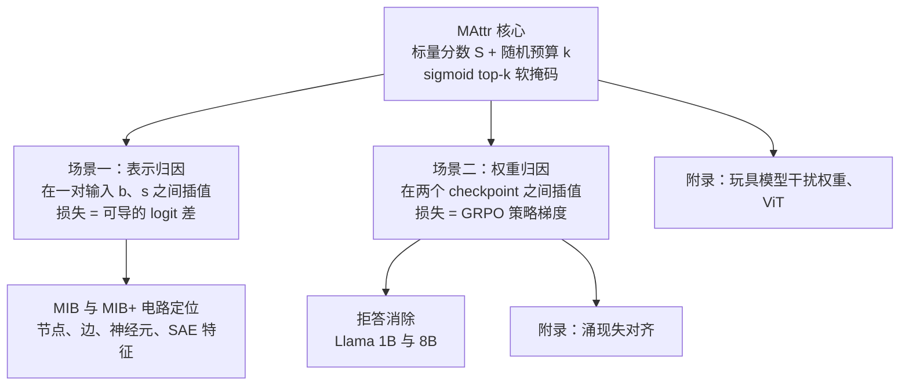

# Matryoshka Attribution：把归因改写成按预算套娃的掩码学习，一次训出整条组件排序

<!-- release-date: 2026-09-22 -->

> 本文依据本地 `papers/Stanford/Matryoshka-Attribution.pdf`，即 **Matryoshka Attribution: Learning to attribute language model outputs to representations and weights**，arXiv:2609.25518v1，页边标注 2026-09-22，共 58 页（正文 10 页，其后是参考文献与 A–L 共 12 个附录）。作者 Aryaman Arora、Kirill Acharya、Nathan Hu、Yanzhe Zhang、Noah Goodman、Dan Jurafsky、Christopher Potts，均署 Stanford University（PDF p. 1）。页码均指 PDF 自身页码。文中区分三件事：论文明确写了什么、我们怎么解释它、哪些是外部补充。

## 读前先把几个词说成人话

这篇论文属于机制可解释性（mechanistic interpretability）。它要回答的问题很朴素：模型给出一个答案，是内部哪些零件在起作用？难点是零件动辄几千到几百万个，而且零件之间不是简单相加。

先把后面反复出现的词说清楚：

- **归因（attribution）**：给模型内部每个零件打一个分，分越高，说明它对某个输出越重要。零件可以是注意力头、MLP 神经元、SAE 特征，也可以是一行权重。论文把「对哪些零件打分」叫做 basis（基），下文译作「粒度」。
- **电路（circuit）**：完成某个任务所需的那一小撮零件。按归因分从高到低取前 $k$ 个，就得到一个大小为 $k$ 的候选电路。
- **交换干预（interchange intervention）**：准备一对输入，base 输入 $b$ 和反事实的 source 输入 $s$。先在 $s$ 上跑一遍记下某个零件的值，再在 $b$ 上跑时把这个零件的值换成 $s$ 上的那份，看输出变了多少。这是因果意义上最直接的检验，代价是每测一个零件就要多跑一次前向。
- **I×G（input-times-gradient，输入乘梯度）**：用「零件在 $b$ 与 $s$ 上的差」乘「损失对该零件的梯度」，一次反向就能给所有零件打分。它是交换干预的一阶泰勒近似，在可解释性圈子里又叫 attribution patching（PDF p. 27）。
- **IG（Integrated Gradients，积分梯度）**：沿 $s$ 到 $b$ 的直线取 $m$ 个点，把 I×G 在这些点上的梯度取平均（PDF p. 5–6）。比 I×G 准，代价是 $m$ 倍的反向。
- **掩码学习（mask learning）**：给每个零件配一个可学习的开关，用梯度下降训练「关掉尽量多的零件、同时保住任务表现」。一般要额外加一项稀疏惩罚，并用直通估计器（straight-through estimator）或 Gumbel 技巧绕过硬开关不可导的问题（PDF p. 2–3）。
- **MIB（Mechanistic Interpretability Benchmark）**：一个公开的电路定位基准，有官方排行榜和保密测试集（PDF p. 4）。

## 一句话先说清

归因方法长期卡在三选二里：交换干预是真因果，但一次只能测一个零件；梯度法一次反向测完全部零件，但测出来的常常不是真正起因果作用的那批；掩码学习两头都占一点，却要调稀疏系数、训练不稳，而且换一个稀疏度就要重训一次（PDF p. 1–3）。

Matryoshka Attribution（下称 MAttr）的做法是：**不训练一个固定大小的掩码，而是训练一组标量分数**。每一步随机抽一个预算 $k$，用可导的 sigmoid top-k 把分数变成「总和恰为 $k$」的软掩码，对掩码外的零件做软交换干预，最小化损失。因为 $k$ 在训练中不断变化，训出来的分数必须在所有预算下都好用；排序本身就是结果，评测时想取多大的电路都不用再训（PDF p. 1–4）。

论文给出的硬结果（PDF p. 1–2、p. 4、p. 9）：

- 边级别（edge-level）MAttr 在 MIB 官方排行榜的保密测试集上排第一，平均分 5.6，第二名 1.95；在各个模型与任务组合上，相对第二名的提升在 45.9% 到 343.0% 之间（PDF p. 2、p. 4）。
- 把同一套方法搬到权重上，用强化学习训分数：Llama-3.1-8B-Instruct 只要把 1% 的参数单元退回 Base 模型的值，拒答就基本消失，能力基本保住；Llama-3.2-1B-Instruct 需要 2%（PDF p. 1、p. 9）。
- 在理论上，MAttr 的第一步梯度等于掩码状态下的中心化 I×G，SGD 下第一步的期望等于一种按预算分布加权的中心化 IG（PDF p. 4、p. 21–22）。

### 一条阅读路线

如果只有半小时读原文，建议按这个顺序：

1. **p. 2 Figure 1**：一步训练的四格图，先把「分数、预算、软干预、面积」四件事对上号。
2. **p. 3 Algorithm 1 与 p. 3–4 定义 1、定义 2、式 (3)**：全部方法就这三个式子。
3. **p. 5 Figure 2、Figure 3**：MIB 上的成绩单和 CPR 对 Compactness 的二维图。
4. **p. 7 Algorithm 2 与 p. 8 Figure 5**：从表示换到权重、从可导损失换到奖励。
5. **p. 21–24 附录 A**：和 I×G、IG 的数学关系，以及 Adam 的 $\epsilon$ 为什么要调大。

附录 D 的消融、E 的显著性与种子方差、I 的拒答权重分布，第一次读可以当对照尺。

## 主要矛盾：三类归因各缺一块

论文开头把现有工具箱分成三类，并逐一说它们卡在哪（PDF p. 1–3）：

| 类别 | 好处 | 卡在哪 |
|---|---|---|
| 因果干预 | 直接测到因果效应 | 每个零件一次前向；零件之间不线性组合，要完整刻画得干预全部子集，代价是 $2^n$ 次前向（PDF p. 2） |
| 梯度归因 | 一次反向覆盖全部零件，可并行 | 只是因果干预的近似，实际上可能找不到真正起作用的计算，也不直接优化下游的可解释性指标（PDF p. 2–3） |
| 掩码学习 | 可并行，能用梯度下降直接优化任务 | 稀疏惩罚与梯度估计器带来大量调参和训练不稳；每个稀疏度要单独训一个掩码（PDF p. 3） |

作者要的是三者的优点合在一起：因果、可并行、简单（PDF p. 1）。

这里的核心矛盾可以说得更直白。掩码学习本来最接近「直接优化我们关心的指标」，但它把「多稀疏」写成损失里的一个惩罚项，于是出了两个问题：惩罚项只是 $L_0$ 的不精确替身，系数要反复试；而且一次训练只回答「这个系数下保留哪些零件」，不回答「零件的先后顺序」。梯度法反过来，天然给出一条排序，任何稀疏度都能免费截取，但排序本身没有经过优化。

MAttr 的思路是：把稀疏度从损失里拿出来，变成每一步随机抽的预算；把「保留哪些」换成「谁排在前面」。这样既保留了掩码学习的「直接优化」，又得到了梯度法那样可以随意截取的排序。

## 先看全景：一步训练只做四件事

这张图引自原文 Figure 1（PDF p. 2），从左到右正好是 Algorithm 1 的一次循环（PDF p. 3）：

1. 每个零件一个标量分数 $s_H$，初始化全为 0；
2. 按均匀分布抽预算 $k \sim \mathrm{Uniform}(1, |S|-1)$，用二分法求一个偏移 $c_k$，让 $\sigma(S + c_k)$ 的总和恰好等于 $k$；
3. 以这个软掩码为权重，把「没被保留」的那部分零件往 source 输入上的值拉；
4. 在干预后的输出上算损失，反向传播只更新分数 $S$，模型本身冻结。

第 2 格里那几行颜色逐行变深，就是论文名字的来源：预算越大，每个零件的掩码值都只增不减，小预算下被保留的集合总被包含在大预算的集合里，像俄罗斯套娃（PDF p. 4）。

论文把同一台机器用在两个场景上，只换了两处：

这张图按 PDF p. 3、p. 7、p. 10 的叙事重画，是结构示意，不是论文原图。

## 核心设计一：软交换干预，把「换零件」变成可导的旋钮

### 旧问题

交换干预只有两个状态：这个零件用 base 的值，或者用 source 的值。这是离散的，无法对「换不换」求梯度。

### 新设计

论文先借用因果抽象（causal abstraction）的写法：模型是一张有向无环图，每个内部变量 $H$ 由它的父节点经一个机制 $F_H$ 算出（PDF p. 3）。然后把机制换成一个带权重的混合（PDF p. 3，定义 1）：

$$
F^{*}_{H}(u) = \alpha_H \, F_H(u) + (1-\alpha_H)\, h(s)
$$

$u$ 是 $H$ 的父节点在干预后模型里的取值，$h(s)$ 是 $H$ 在 source 输入上的原值，$\alpha_H \in [0,1]$ 是掩码权重。$\alpha_H = 1$ 就是不动，$\alpha_H = 0$ 就是完整的交换干预，中间是按比例混合。

有一个细节后面推导会用到：$F_H(u)$ 是用「已经被干预过的父节点」重新算的，而不是在干净的 base 前向里取的值（PDF p. 21）。所以上游零件被换掉时，下游零件的 base 侧取值也会跟着变。

### 可迁移启发

凡是想用梯度优化「换或不换」的地方，先问能不能把二值开关写成线性混合。混合权重可导，端点又和原来的离散操作完全一致，训练时用软的，评测时用硬的。

## 核心设计二：sigmoid top-k，用预算代替稀疏惩罚

### 旧问题

以往的掩码学习大多用 hard concrete 参数化，再加一项估计 $L_0$ 的稀疏损失（PDF p. 3、p. 29）。论文把 Edge Pruning 的完整配方列了出来：带噪声的 hard concrete 掩码、两个用梯度上升更新的拉格朗日乘子、前 83% 训练里线性预热稀疏项、前 7% 预热学习率（PDF p. 29）。这套东西能用，但每一个旋钮都要调。

### 新设计

MAttr 不加任何稀疏损失。它直接规定「这一步必须恰好保留 $k$ 个零件的量」，用 sigmoid top-k 算子实现（PDF p. 3–4，定义 2，引自 Wijk 等人 2025）：

$$
\mathrm{SigTopK}_k(S) = \sigma(S + c_k), \qquad \text{其中 } c_k \text{ 使 } \sum_H \sigma(s_H + c_k) = k
$$

$c_k$ 是一个标量偏移，用二分法解出来。直观上，它像一条水位线：把所有分数一起往上或往下平移，直到恰好有「$k$ 份」的掩码值露出水面。分数最高的那些零件掩码接近 1，最低的接近 0，靠近水位线的零件在 0 和 1 之间。

整个运算处处可导，所以不需要直通估计器，也不需要 Gumbel 技巧（PDF p. 2）。

### 附录消融：软的前向和软的反向缺一不可

附录 D.2 把这个设计拆开测了一遍（PDF p. 31，Figure 7），数字是 MIB 节点级验证集上的平均：

| 变体（优化器） | 改了什么 | CPR | Compactness |
|---|---|---:|---:|
| MAttr（Adam） | 默认 | 2.06 | 0.48 |
| +hard（Adam） | 前向用硬 top-k，反向用 sigmoid top-k 当直通估计 | 1.96 | 0.47 |
| +log k（Adam） | 预算改成对数均匀分布 | 1.85 | 0.50 |
| −$c_k$（Adam） | 对 $c_k$ 停梯度 | 1.39 | 0.31 |
| +hard bwd（Adam） | 反向换成 hard concrete | 0.57 | 0.16 |
| MAttr（SGD） | 默认 | 2.00 | 0.48 |
| +id-STE（SGD） | 前向硬 top-k，反向恒等直通 | 1.70 | 0.34 |
| +id-STE, Gum.（SGD） | 再在前向加 Gumbel 噪声 | 1.46 | 0.47 |

表中数字读自 Figure 7 的柱顶标注（PDF p. 31）。两个结论最有用：

- **对 $c_k$ 停梯度会掉很多**（2.06 到 1.39）。$c_k$ 对分数的依赖正是「大家一起分这 $k$ 份」的约束，梯度要经过它才知道提高一个零件的分数等于压低别的零件（PDF p. 21，式 11）。
- **硬前向在个别任务上会出病态排序**。论文单独标出了 Qwen 上的 IOI 任务：硬 top-k 前向和恒等直通估计都在这里找出病态的排序（PDF p. 31）。从 Figure 7 的横线读，「+log k, +hard」与「+id-STE」在该任务上的 CPR 只有约 0.25（读图估值）。

### 可迁移启发

「必须恰好选 $k$ 个」是一个比「惩罚选太多」更好管的约束：没有系数要调，约束总是被精确满足。只要约束能写成「单调函数之和等于常数」，就可以用一维二分法求偏移，把它变成一个可导的层。

## 核心设计三：随机预算，一次训练得到整条排序

### 新设计

每一步重新抽 $k$，训练目标就变成了所有预算下损失的期望（PDF p. 4，式 3）：

$$
\min_{S} \; \mathbb{E}_{k \sim p(k)} \Big[ \mathcal{L}\big(M_{H \leftarrow H^{*}}(b, s, \sigma(S + c_k)),\, y_b,\, y_s\big) \Big]
$$

$M_{H \leftarrow H^{*}}(b, s, \alpha)$ 表示按掩码 $\alpha$ 做完软交换干预后的模型输出。Figure 1 第 4 格画的就是这个期望：横轴是 $k$，纵轴是 $\ell_k$，要最小化的是曲线下的面积（PDF p. 2）。

这个「在训练中随机化一个参数，从而最小化它分布上的期望损失」的做法，论文说思路取自 Matryoshka 表征学习（Kusupati 等人 2022），脚注里还点了另外两篇同类做法（PDF p. 1、p. 4）。

### 工作机制：为什么结果天然是套娃

sigmoid top-k 对每个零件的掩码值都随 $k$ 单调增加（PDF p. 4）。所以不论抽到哪个 $k$，同一组分数给出的都是同一条排序，只是水位线高低不同。训练完成后，排序本身就是交付物；评测时对任意 $k$ 取前 $k$ 个，不需要再训练。

对照组在这件事上付出的代价很具体。DBM 与 Node Pruning 为了在多个稀疏度上都有结果，要在每个稀疏度上各训一次，再在每个评测点选 $L_0$ 不超预算的那一次，成本约是 MAttr 的 50 倍（PDF p. 6）。即便如此，这些分别训出来的掩码也不一定互相包含：论文测了「低 $L_0$ 那次保留的零件，有多大比例也出现在高 $L_0$ 那次里」，DBM 平均 0.97，Node Pruning 平均 0.90（PDF p. 35，附录表 1）。MAttr 的嵌套是构造保证的，恒为 1。

### 预算分布是一个旋钮

默认用均匀分布抽 $k$。换成对数均匀分布，会把更多训练步花在小预算上。结果在节点级 MIB 上 Compactness 略升、CPR 略降（PDF p. 7、p. 31）。附录 A.2 从理论上说明了原因：预算分布直接决定了 MAttr 等价于哪一种路径加权的 IG（PDF p. 22），下一节展开。

### 可迁移启发

当你需要「一个在所有尺度上都好用的结果」而不是「某个尺度下的最优结果」，把尺度当成随机变量在训练里采样，往往比分别训练再拼接便宜，而且自带一致性。

## 它和梯度归因其实是一家

这一节是论文的理论部分（PDF p. 4、附录 A，p. 21–24），它回答一个很自然的疑问：MAttr 看上去是掩码学习，为什么在一张基准上能把梯度法甩开这么多？

### 第一步梯度：掩码状态下的中心化 I×G

记 $\mathrm{IxG}_H$ 为「损失对 $H$ 的梯度」乘「$H$ 在当前父节点下算出的值减去 source 值」，两个因子都在带掩码的前向上算。对 sigmoid top-k 求导后，分数的梯度是（PDF p. 21，式 14–15）：

$$
\frac{\partial \ell}{\partial s_H} = \sigma'_H \Big( \mathrm{IxG}_H - \overline{\mathrm{IxG}} \Big),
\qquad
\overline{\mathrm{IxG}} = \frac{\sum_j \sigma'_j \, \mathrm{IxG}_j}{\sum_j \sigma'_j}
$$

$\sigma'_H = \sigma(s_H + c_k)\,(1 - \sigma(s_H + c_k))$，它在水位线附近最大、远离水位线趋近于 0。所以这个梯度做了两件事：

- 只重点更新那些「正好卡在进与不进之间」的零件，排名稳定在头部或尾部的零件几乎不动；
- 减去加权平均，只看一个零件是否比平均水平更有用。

论文的读法是：MAttr 在反复累积「掩码下、中心化的 I×G 效应」（PDF p. 21）。和普通 I×G 的根本差别在于，普通 I×G 只在完全不干预的 base 前向上算一次，MAttr 则在各种程度的软干预下反复算（PDF p. 21）。附录还补了一句：如果把 sigmoid top-k 换成恒等直通估计器，梯度就精确退化为 I×G（PDF p. 21–22，式 16–19）。

### 第一步的期望：按预算分布加权的 IG

在分数全为 0 的初始化下，对 $k$ 取期望，SGD 第一步之后的分数是（PDF p. 22，定理 1）：

$$
\mathbb{E}_k[\Delta s_H] = -\frac{\eta}{6}\Big( \mathrm{IG}^{\rho}_H - \frac{1}{N}\sum_j \mathrm{IG}^{\rho}_j \Big) + O(1/N),
\qquad \rho(t) = 6\,t\,(1-t)
$$

$\mathrm{IG}^{\rho}_H$ 是一种路径加权的积分梯度：从「全部用 source 值」（$t=0$）走到「全部用 base 值」（$t=1$），在每一点上取 I×G，再按 $\rho(t)$ 加权积分。均匀预算对应的权重 $6t(1-t)$ 是一个两头低、中间高的钟形，重点看「保留一半左右」的那段路径。

换预算分布就是换路径权重（PDF p. 22–23）：

| 预算分布 | SGD 第一步的路径权重 $\rho(t)$ | 含义 |
|---|---|---|
| 均匀 | $6t(1-t)$ | 偏重路径中段 |
| 对数均匀 | $2(1-t)$ | 偏重靠近 source 的稀疏端 |
| logit 分布 | $1$ | 恰好是标准 IG |

有一个脚注值得留意：这条路径是掩码空间里的直线，不是激活空间里的直线；因为下游零件的 base 侧取值会随上游被干预而变化（PDF p. 22，脚注 7）。

**我们如何解释它。** 这组推导把 MAttr 放在一条光谱上：训练 0 步，它就是 IG 家族的一员；继续训练，它离开 IG，朝着「直接最小化干预后损失」的方向走。这解释了为什么它在弱训练时不会比 IG 差，也解释了为什么多训几步还能继续变好。附录 E.3 里，默认版本对比训练 10 倍步数的版本，在节点级 12 个子任务上一个都没赢，平均 CPR 低 0.24（PDF p. 36，附录表 2）。

### Adam 的 $\epsilon$ 不是可以无视的小数

Adam 的更新会除以梯度的均方根。第一步时 $\hat m_1 = g$、$\hat v_1 = g^2$，所以更新近似 $g / (|g| + \epsilon)$（PDF p. 23，式 30）。两种极端（PDF p. 23）：

- $\epsilon$ 远大于梯度：退化为学习率 $\eta/\epsilon$ 的 SGD，即上面那个路径加权 IG；
- $\epsilon$ 远小于梯度：只剩梯度的符号，幅度信息全丢，分数变成「沿路径有多少比例的位置上，恢复这个零件比平均更能降损失」。

在节点级这不太要紧；但在 MLP 神经元、SAE 特征这类更细的粒度上，默认 $\epsilon = 10^{-8}$ 的 Adam 反而不如 SGD（PDF p. 32）。作者按 Choi 等人 2020 的建议把 $\epsilon$ 和学习率一起调，最后细粒度实验统一用 $\epsilon = 10^{-2}$（PDF p. 6、p. 32）。附录 H.2 给出了最直接的证据：在 Feucht 等人 2026 已用因果干预确认过的第 18 层关键 MLP 神经元上，$\epsilon = 10^{-2}$ 的 Adam 或 SGD 能把这些神经元排得很靠前，召回与 IG 持平或更好；$\epsilon = 10^{-8}$ 的 Adam 则停留在随机水平，和其他掩码学习方法一样（PDF p. 49）。

附录 D.1 还给了一个实际理由去考虑 SGD：Adam 要为每个可学习参数额外保存一阶和二阶矩，内存是 SGD 的 3 倍，在权重级别的归因里这很贵；而节点级 MIB 上两者成绩相当，只是最优学习率不同（PDF p. 30）。

### 为什么 Bilodeau 等人的「不可能定理」不适用

Bilodeau 等人 2024 证明：同时满足「完备」和「线性」两条公理的归因方法，在推断模型局部反事实行为时可能不比随机猜好（PDF p. 4）。论文说 MAttr 不受这个结论约束，理由有两条（PDF p. 4、p. 24）：

1. **它既不完备也不线性。** sigmoid top-k 只比较分数之间的相对大小，把所有分数同时加一个常数，掩码不变。所以分数总和是一个自由常数；在梯度下降下它其实恒为 0，因为所有分数的梯度之和为 0（PDF p. 24）。
2. **它正是 Bilodeau 等人自己建议的出路**：一个直接优化任务的方法，让使用者自己定义损失，而不是由公理决定结果（PDF p. 4）。

### 可迁移启发

如果你已经在用 I×G 或 IG 做归因，MAttr 可以看作「在它们上面继续做梯度下降」，而不是另起一套方法。在细粒度（神经元、权重行）上用 Adam 时，把 $\epsilon$ 调大，否则优化器会把梯度幅度这条关键信息抹掉。

## 实验一：在 MIB 上做电路定位

### 基准怎么打分

MIB 的每条数据是 $\langle b, s, y_b, y_s \rangle$：base 输入、反事实输入和各自的正确下一个 token（PDF p. 4）。评测时，按归因分保留前 $k$ 个零件，其余零件用硬掩码做交换干预，然后看 logit 差 $[\hat y]_{y_b} - [\hat y]_{y_s}$ 恢复了多少（PDF p. 4，式 4–5）：

$$
\mathrm{Faith}(k) = \mathbb{E}\left[ \frac{\mathcal{L}_{\mathrm{MIB}}(\hat y^{(k)}) - \mathcal{L}_{\mathrm{MIB}}(\hat y^{(0)})}{\mathcal{L}_{\mathrm{MIB}}(\hat y^{(|H|)}) - \mathcal{L}_{\mathrm{MIB}}(\hat y^{(0)})} \right]
$$

主指标 CPR 是 Faith 曲线在保留比例 0.1%、0.2%、0.5%、1%、2%、5%、10%、20%、50%、100% 这 10 个点上的梯形面积（PDF p. 4）。

MIB 共有 12 个任务与模型组合：4 个 base 模型（gpt2-small、Qwen2.5-0.5B、gemma-2-2b、Llama-3.1-8B），任务包括 IOI（间接宾语识别）、加减法算术、多选问答 MCQA、ARC-E 与 ARC-C（PDF p. 5）。粒度方面，MIB 原本只有节点（每个注意力头、MLP 块和输入）和边（节点之间每一条残差项）两种（PDF p. 4）。

### 论文补了一个指标：Compactness

作者指出 CPR 有两个毛病（PDF p. 6）：

1. logit 差没有上界，Faith 可以在某些稀疏度远大于 1，把其他稀疏度上的不足平均掉；
2. 评测网格按对数取点，却按线性面积算，大电路那一段占了大部分面积。随机排序单靠 50% 到 100% 那一段就能白拿约 0.25 的 CPR（PDF p. 6，脚注 3）。

所以他们补了 Compactness：用交换干预准确率 IIA（干预后 base 答案的 logit 是否仍高于 source 答案）代替 logit 差，再按 $\log k$ 做面积并归一化（PDF p. 6，式 8–9）。它奖励的是「很小的电路就能保住输出」。

### 扩展基准：MIB+

作者在三个方向上加宽了基准，称为 MIB+（PDF p. 4–5）：

- 三种新粒度：逐 token 的 MLP 神经元、MLP 神经元加注意力头、MLP 输出上的 SAE 特征（用 Llama Scope 的 SAE，SAE 误差项当成一个叶子节点单独打分）；
- 新任务：Marks 等人 2025a 的 4 个主谓一致任务，Feucht 等人 2026 的 4 个算术任务；
- 只在 Llama 上做。

### 成绩单：节点级与边级

Figure 2 是正文的主结果（PDF p. 5）。下表把柱顶数字与训练成本转成表格，成本是每个任务的反向次数（交换干预是前向次数）：

| 方法 | 类别 | 节点级 CPR | 成本 |
|---|---|---:|---|
| Random | 随机对照 | 0.27 | 0 |
| I×G | 梯度 | 0.46 | 0.1k–1k |
| RelP | 梯度 | 0.73 | 0.1k–1k |
| IG（$m$=5） | 梯度 | 0.82 | 0.5k–5k（按附录 B.1 推算） |
| RelP+QK | 梯度 | 0.85 | 0.1k–1k |
| IntInv（交换干预） | 因果 | 1.14 | 63k–423k 次前向 |
| IG（$m$=30） | 梯度 | 1.28 | 3k–30k（按附录 B.1 推算） |
| IG（$m$=10） | 梯度 | 1.29 | 1k–10k（按附录 B.1 推算） |
| GIM | 梯度 | 1.30 | 0.1k–1k |
| EG（Expected Gradients） | 梯度 | 1.30 | 0.1k–1k |
| AttnLRP | 梯度 | 1.31 | 0.1k–1k |
| DBM | 掩码 | 1.47 | 3k |
| NP（Node Pruning） | 掩码 | 1.62 | 3k |
| DBM（多稀疏度） | 掩码 | 1.85 | 图上约 24k（读图） |
| NP（多稀疏度） | 掩码 | 1.85 | 图上约 27k（读图） |
| MAttr | 本文 | 2.06 | 0.5k |
| MAttr（10 倍步数） | 本文 | 2.30 | 5k（图上未标数字，按附录 B.1 的 5,000 步推算） |

| 方法 | 边级 CPR |
|---|---:|
| IG（$m$=5） | 1.56 |
| EG | 1.60 |
| IG（$m$=10） | 1.61 |
| Edge Pruning | 2.49 |
| MAttr | 6.44 |

CPR 与标注成本读自 Figure 2（PDF p. 5）；IG 各档成本按附录 B.1 的「每任务 100–1,000 条数据 × 每条 $m$ 次反向」推算（PDF p. 25），多稀疏度两行的成本 Figure 2 没有标数字，只能读柱高；10 倍步数一行同样没标数字，按附录 B.1 的步数推算（PDF p. 25）。MAttr 节点级默认训练 500 步、每步 1 次反向，边级 5,000 步（PDF p. 25）。

读这两张表要知道三件事：

1. **便宜的方法里没有赢家。** 节点级 MAttr 只花 500 次反向，和 I×G、EG 同一个数量级，CPR 却是 EG 的约 1.6 倍（2.06 对 1.30）。交换干预作为「真因果」基线，花了几十万次前向，只有 1.14：一次只换一个零件，看不到零件之间的相互作用。
2. **掩码学习把钱砸够了也追不上。** 两种掩码方法做多稀疏度扫描、花约 50 倍成本，最高到 1.85（PDF p. 6）。
3. **边级差距最大。** 边的数量远多于节点，MAttr 的 6.44 是 Edge Pruning 的约 2.6 倍。

这些对照都是作者自己重新调参、重新评测的，不是照搬 MIB 原论文的数字（PDF p. 5）。统计上，作者对每个 MIB 子任务和每个基线做双侧配对 Wilcoxon 符号秩检验，并做 Holm–Bonferroni 校正：节点级和边级的所有基线都在 $p < 0.05$ 下显著输给 MAttr（PDF p. 6）。附录表 2 的细节是：节点级 MAttr 对几乎所有基线都是 12 个子任务全胜、校正后 $p = 0.009$，唯一例外是多稀疏度 Node Pruning，10 胜 2 负、校正后 $p = 0.027$；边级对 Edge Pruning 平均高 3.95，12 个全胜，校正后 $p = 0.002$（PDF p. 36）。

种子方差很小：节点级默认配置用 3 个种子训练，测试集平均 CPR 2.03、标准差 0.038，Compactness 0.48、标准差 0.001（PDF p. 36，附录表 3）。

### CPR 之外：在小电路上也要赢

这张图引自原文 Figure 3（PDF p. 5）。论文的读法是：在所有粒度上 MAttr 的 CPR 都最高；Compactness 上它或者领先、或者只略落后于 IG（PDF p. 7）。如果更看重小电路，把预算改成对数均匀分布（图中实心圆「+log k」），就能在 Compactness 上超过 IG，代价是 CPR 下降一些（PDF p. 7）。

两种掩码学习基线在这张图里的位置很说明问题：它们在固定稀疏度下把 CPR 优化得不错，Compactness 却比 I×G 还低（PDF p. 7）。附录 E.1 的稀疏系数扫描显示，加大稀疏系数能提高 Compactness 但伤 CPR，在所有测过的超参下 Compactness 都远低于 MAttr（PDF p. 7、p. 34）。换句话说，稀疏惩罚这条路本身就在两个指标之间拉锯；MAttr 把稀疏度交给预算采样之后，这条拉锯线被绕开了。

### 分歧出在哪：MLP 块

作者把各方法在节点级 MIB 上给出的组件排名做 Spearman 相关（PDF p. 6–7，Figure 4a）。原图是两张热力图，下表只转录其中与 MAttr 对照的那一行（对 MIB 各任务取平均）：

| 与 MAttr 的 Spearman ρ | IntInv | I×G | IG（$m$=5） | EG | AttnLRP | DBM | Node Pruning |
|---|---:|---:|---:|---:|---:|---:|---:|
| 注意力头 | 0.46 | 0.48 | 0.47 | 0.46 | 0.48 | 0.60 | 0.62 |
| MLP 块 | 0.48 | −0.19 | 0.09 | 0.68 | 0.54 | 0.61 | 0.43 |

数字读自 Figure 4a 的格内标注（PDF p. 6）。论文的读法是：MAttr 与表现差的梯度方法在 MLP 块上明显不一致、在注意力头上则没有；强基线（交换干预、EG、AttnLRP 和两种掩码方法）与 MAttr 聚在一起（PDF p. 7）。表里看得最清楚的是 I×G 与 IG（$m$=5）：注意力头上它们和其他方法一样在 0.5 左右，到了 MLP 块上掉到 −0.19 与 0.09。

**我们如何解释它。** 注意力头的作用常常集中在少数几个头上，梯度的一阶近似够用；MLP 块内部非线性更强，一阶泰勒展开最容易失准。这与论文在相关工作里「梯度法可能找不到真正起因果作用的计算」的判断一致，但论文没有单独做实验证明这个机制。

### 迁移：一个任务上学到的排序能不能用在另一个任务上

这张图引自原文 Figure 4b 与 4c（PDF p. 6）。作者在 Llama 节点级上，拿源任务的 MAttr 排序去评测目标任务（PDF p. 7）。左图呈块状：同类任务之间（主谓一致的 Simple 与 Noun PP，算术类的 Arith.、Addition、Months）迁移得好，跨类几乎迁移不过去。例如 MIB 的减法任务和 Feucht 等人 2026 的加法、月份任务，都把注意力头 a15.h13 与 a16.h21 排得很高，这与 Nikankin 等人 2025 的分析相互印证（PDF p. 7）。右图说明两任务的分数越相关，迁移越成功（PDF p. 7）；我们的引申是：先看分数相关性，就能粗略预判两个任务是否共用电路，论文没有把它当作方法提出。

附录 H 把各方法对「文献里已发表过的电路」的排名逐个列了出来（PDF p. 48）。在 GPT-2 的 IOI 电路上，各方法（I×G 在 MLP 上除外）对关键节点的排名大体一致。一个有意思的例外是 a9.h6：MAttr、AttnLRP 和掩码方法都给它高分，EG、IG 甚至交换干预却把它排在最后几名。还有各方法共同与已发表分析不一致的情况：备用名字搬运头 a11.h2 在所有方法下都被判为对 IOI 电路很不利（PDF p. 48）。

### 其余几项附录消融

- **训练损失**：在 MIB 与 MIB+ 的一组节点级任务上，logit 差作为训练损失平均 CPR 1.67，交叉熵 1.26，软准确率 1.19；Compactness 各损失几乎一样，都在 0.52 到 0.53（PDF p. 45，附录表 8）。
- **干预方向**：默认是「干预前 $k$ 个之外的零件、优化 base 行为」，与 MIB 的评测方式一致。反过来「干预前 $k$ 个、优化 source 行为」会在默认指标上变差，但在对应的反向指标上更好（PDF p. 46）。训练目标要和评测方式对齐。
- **零消融**：把 source 值换成 0 之后，MAttr 仍然整体表现好；而在交换干预下表现强的梯度方法，在零消融下远没有那么好，其中 AttnLRP 明显好于 EG（PDF p. 47）。

## 实验二：把归因搬到权重上，用强化学习训分数

### 从输入对换成 checkpoint 对

第 5 节只改了两处（PDF p. 7）：

1. 插值的对象从「一对输入上的激活」换成「一对 checkpoint 的权重」：

$$
\theta^{*}(\theta_b, \theta_s, \alpha) = \theta_b + \alpha \odot (\theta_s - \theta_b)
$$

2. 损失从可导的 logit 差换成 GRPO（Group Relative Policy Optimization）的策略梯度，这样就能对一个不可导的奖励做归因。

Algorithm 2 的一步是：抽预算 $k$，算掩码，按上式合成一份干预后的权重；用这份权重对每个 prompt 采样一组回答；奖励模型打分，组内归一化成优势；按回答长度归一化对数似然，乘优势得到策略梯度；梯度经过掩码回到分数（PDF p. 7）。论文说明不做裁剪（PDF p. 8）。只有奖励方差不为零的组参与计算（PDF p. 7，Algorithm 2 第 11 行）。

评测时换成硬掩码，把权重差里排名前 $k$ 的部分「嫁接」过去（PDF p. 8）。

### 为什么选拒答

指令微调过的开源模型会拒答有害请求，对应的 base 模型不拒答，但指令遵循很差（PDF p. 8）。作者想借此证明两件事：MAttr 能在不看留出数据的情况下，把目标行为从无关能力里分出来；可解释性技术可以用来审计开源权重的抗篡改性。论文特别指出，这组结果揭示了「同时发布未加防护的 base 模型与安全微调 checkpoint」的风险（PDF p. 8）。

### 实验设置

- 模型：Llama-3.2-1B-Instruct 与 Llama-3.1-8B-Instruct，在各自的 Instruct 与 Base 之间做归因（PDF p. 8）。
- 粒度：每个权重矩阵中形状为 $d_{\mathrm{model}}$ 的行（例如一个 MLP 神经元对应的 gate、up、down 投影向量），加上各层归一化的向量。作者说选行是因为它们通常是一组「特权基」（PDF p. 8，脚注 5）。
- 奖励：StrongREJECT 自带的打分器，一个基于 gemma-2b 微调的 LLM 评委，输出 1 到 5 分的概率分布（PDF p. 9）。训练 prompt 用 StrongREJECT 除评测小子集之外的部分（PDF p. 9）。
- 训练量：1B 上 MAttr 训 100 步，每步 6 个 prompt、每组 8 个回答，共 4,800 次反向；8B 上 300 步，每步 4 个 prompt，共 9,600 次反向（PDF p. 26）。
- 对照：四种可以任意改权重的去拒答方法（不带 KL 的 GRPO、带 KL 的 GRPO、Abliteration、GRP-Oblit）、一种归因方法 EG，以及直接用 URIAL 模板提示的 Base 模型（PDF p. 8–9）。GRPO 类方法在 1B 上用 LoRA（秩 32、$\alpha$ 64、学习率 $10^{-5}$），GRP-Oblit 在 1B 上全参数训练、在 8B 上用 LoRA（PDF p. 9）。Abliteration 就是在残差流上找出「拒答方向」再把权重正交化掉，用 128 对样本求方向、32 条验证 prompt 选层与位置（PDF p. 8、p. 26）；这个方法的来龙去脉见 Refusal Direction 一篇。

### 结果：1% 到 2% 的参数单元就够了

Figure 5a（PDF p. 8）原本就是一张表，转录如下。SR 是 StrongREJECT 得分，SORRY 是 SORRY-Bench（训练时没见过），两者越高越有害；GSM8K、IFEval、MMLU 是能力。$\|\Delta\theta\|_0$ 是被改动的参数比例。原图用蓝色标出「与 Instruct 无显著差异」的能力格，用橙色标出有显著差异的格，下表把橙色格标为「显著下降」。

| 模型 | 方法 | 改动参数（%） | SR | SORRY | GSM8K | IFEval | MMLU |
|---|---|---:|---:|---:|---:|---:|---:|
| 1B | Instruct | – | 4.3 | 24.7 | 29.5 | 48.6 | 43.6 |
| 1B | GRPO | 45.2 | 86.4 | 100.0 | 13.5 显著下降 | 49.4 | 43.9 |
| 1B | GRPO+KL | 45.1 | 89.3 | 99.8 | 27.5 | 50.8 | 43.2 |
| 1B | Abliteration | 38.9 | 70.2 | 95.8 | 32.0 | 49.4 | 43.4 |
| 1B | GRP-Oblit | 100.0 | 78.7 | 99.8 | 24.5 | 36.6 显著下降 | 41.6 |
| 1B | EG | 2.0 | 67.3 | 98.4 | 10.5 显著下降 | 35.1 显著下降 | 32.6 显著下降 |
| 1B | MAttr | 2.0 | 75.8 | 99.6 | 28.5 | 46.2 | 43.6 |
| 1B | Base（URIAL） | – | 58.9 | 92.7 | 5.0 显著下降 | 11.6 显著下降 | 29.1 显著下降 |
| 8B | Instruct | – | 2.6 | 27.1 | 81.0 | 74.7 | 69.1 |
| 8B | Abliteration | 27.6 | 68.6 | 96.4 | 81.5 | 76.2 | 68.6 |
| 8B | GRP-Oblit | 50.6 | 71.5 | 92.9 | 83.5 | 71.5 | 67.8 |
| 8B | EG | 1.0 | 59.5 | 95.8 | 76.5 | 47.5 显著下降 | 67.8 |
| 8B | MAttr | 1.0 | 84.0 | 99.3 | 79.5 | 71.7 | 69.5 |
| 8B | Base（URIAL） | – | 52.7 | 86.2 | 4.0 显著下降 | 27.5 显著下降 | 67.6 |

表中省去了原图每格的误差范围（如 Instruct 1B 的 SR 为 4.3 ± 2.1），全部数字见 PDF p. 8。8B 没有跑 GRPO 与 GRPO+KL。

这张表要这样读：

1. **对照方法都要改一大片参数。** 四种去拒答基线改动的参数比例都在 27.6% 以上（PDF p. 9），因为它们本来就被允许自由改权重。
2. **MAttr 只挑 1% 到 2%，效果和它们同档。** 8B 上 SR 84.0 是 8B 各方法中最高；1B 上 75.8，高于 Abliteration，低于 GRP-Oblit 与两种 GRPO。能力三项全部与 Instruct 无显著差异（PDF p. 8–9）。
3. **同样的预算，EG 挑错了。** EG 用和 MAttr 完全相同的损失，也只改 1% 或 2%，拒答同样被去掉了，但能力掉了：1B 上三项能力全部显著下降，8B 上 IFEval 从 74.7 掉到 47.5（PDF p. 8–9）。这正是论文要证明的点：去掉拒答不难，难的是只动与拒答有关的那一小部分。
4. **Base 模型本身不能替代。** URIAL 提示下的 Base 模型同样不太拒答，但 GSM8K 几乎归零（1B 5.0、8B 4.0），IFEval 也大跌（1B 11.6、8B 27.5）；只有 8B 的 MMLU 67.6 与 Instruct 无显著差异（PDF p. 8）。

论文由此说 MAttr 找到了权重差里一块「真正起因果作用、并且局部化」的、专属于拒答的部分（PDF p. 9）。

### 扫一遍预算：能力在一个悬崖前都很平

这张图引自原文 Figure 5b（PDF p. 8）。论文的读法是：相当大范围的参数比例都能保住 GSM8K，直到撞上一个性能悬崖（PDF p. 9）。

**我们如何解释它。** 因为 MAttr 的排序是嵌套的，这条曲线是「同一条排序、只调水位线」得到的，不是 N 个独立模型拼出来的。这对实际使用很关键：你可以先训一次，再按对有害度与能力的容忍度在曲线上选点。从图上读，1B 表里报告的 2%（圈出的点）正好在悬崖边，再往前 GSM8K 就跌到 15 以下；8B 的 1% 离悬崖还远，GSM8K 一直平到约 10% 才掉到约 60（读图估值）。

### 被选中的权重在哪里

这张图引自原文附录 Figure 22（PDF p. 50）。富集倍数的意思是：某一层或某一类单元在被选中的前 $k$ 里占的比例，除以它在全部参数里的占比（PDF p. 50）。

论文的观察（PDF p. 50）：1B 上看不出有意思的局部化，只是略微避开浅层；8B 上，第二个四分之一的层被大量选中，注意力块的 v 投影也被偏好，embedding 向量则被极度压低。

**我们如何解释它。** 这可以和 Refusal Direction 一篇对照着看：那篇在 Llama-3 8B 上选出的拒答方向取自第 12 层（共 32 层），也落在第二个四分之一。但模型版本不同，对象也不同，一个是激活上的方向，一个是权重差里的单元；本论文没有把两者联系起来，这只是位置上的巧合或呼应，不能当作直接佐证。

附录 I.2 列出了沿预算扫描的真实生成样本（PDF p. 51–52）：随着嫁接比例增加，有害请求从「我不能帮你」渐变为带免责声明的顺从，再到直接顺从；与此同时，那道数学样题从 0 一直到 20% 都答对。到 100%（也就是 Base 模型本身）时，模型只会复述 prompt，数学题也答错了。

### 可迁移启发

对「微调到底改了什么」这类问题，MAttr 给了一个很实用的框架：把两个 checkpoint 之间的权重差当成候选集合，用任意奖励（哪怕不可导）去学一条排序。这和 LoRA、剪枝都不同，它不改变任何权重的取值，只决定「哪些差值保留、哪些回退」。

## 附录里的三个延伸

正文最后说附录还有涌现失对齐、玩具模型干扰权重和 ViT 三组实验（PDF p. 10）。它们都是小规模的初步探索，下面只讲它们各自说明了什么。

### 涌现失对齐：有用的那一小块权重不一定带出副作用

涌现失对齐（emergent misalignment）是指：在一个窄领域上微调，比如用「带误导性的医疗建议」做监督微调，模型在无关的普通对话里也变得失对齐（PDF p. 53）。作者除了复用医疗、金融两个失对齐数据集，还自己造了几个不需要 LLM 评委的简化版本：法语 prompt 配德语、俄语或中文回答（在英语 prompt 上检验是否也换语言），全小写或全大写，海盗腔，英式拼写（PDF p. 53）。每个任务训练 7,200 条、测试 800 条，用 LoRA 微调（PDF p. 54）。Figure 24c 的模型是 Qwen2.5 14B、Gemma-2 9B 与 OLMo-3 7B，共 16 个设定（PDF p. 53）。

MAttr 在这里用训练集损失学分数（PDF p. 54）。结果是（PDF p. 54）：

- 0.1% 的参数差就能恢复几乎全部留出集损失，训练集损失则恢复得少一些；领域内行为用不到 1% 的参数差就能恢复，领域外的副作用通常要更多单元。
- 在部分数据集上，只取极小的一块参数差（通常不到 0.1%）就能保住领域内行为，同时几乎完全去掉领域外副作用。论文据此说：最有用的那部分权重更新，不足以产生领域外副作用。
- 但这不是普遍规律。在 Qwen2.5 14B 的医疗失对齐任务、Gemma-2 9B 的大小写任务上，领域内和领域外效应随参数比例一起出现，分不开（PDF p. 54）。

### 玩具模型：干扰权重

Olah 等人 2025 设计了一个玩具模型，展示叠加（superposition）会让一部分权重只是「干扰」，而不是真在做任务（PDF p. 55）。作者尽量按原描述复现，只有一处偏离：把降维矩阵冻结，因为这样才能在各种超参下稳定复现原现象（PDF p. 55，脚注 8）。他们训练 3,000 步、批大小 1，比较了原文的几种基线和 EG、MAttr+SGD、MAttr+Adam（PDF p. 56）。

结论是：EG 和 MAttr 在原文自己的评测上都远好于原文的方法；在「保留前 $k$ 个、测真实损失」这个更贴近本文口径的评测上，MAttr+Adam 的曲线最干净，甚至能把干扰权重按有用程度排好，得到比真实模型还低的损失（PDF p. 56）。

### ViT：方法与模态无关

作者在 ViT-B/16（ImageNet-1k 权重）上复现了 AttnLRP 论文 Figure 1 那张狗和猫的例子，以 196 个图像块为粒度，把每个块换成它的平均颜色当反事实图像（PDF p. 57）。MAttr 用对数预算训练 2,000 步，单卡约 30 秒；KernelSHAP 用 65,536 个联盟约 55 秒（PDF p. 57）。MAttr 的 Faith log-AUC 为 5.2，论文说它最高，但正文没给其他方法的具体数值（PDF p. 57）。保留分数最高的 2% 图像块，模型的最高类别就变成了 basenji（一种狗）（PDF p. 57–58，Figure 28）。

作者自己对这组结果的定性很克制：它只说明算法能迁移到 ViT，并且在单张图上训练也没有明显过拟合（PDF p. 57）。

## 限制、边界，以及论文没有给的东西

论文自己承认的，或我们读完应当留下的判断：

- **分数是数据集级的标量。** 每个零件一个分数，对整个数据集求期望。它不回答「这一条输入上哪些零件起作用」。作者把「训练一个把表示映射成逐样本归因分数的元模型」列为未来工作（PDF p. 9）。
- **评测与训练用的是同一种干预。** MIB 评测干预前 $k$ 之外的零件，MAttr 默认也这么训。附录 G.2 显示，训练方向与评测方向不一致时成绩会掉（PDF p. 46）。所以 MIB 上的领先部分来自「直接优化评测口径」，这是论文的主张本身，但也意味着换一个评测口径就要换训练目标。
- **细粒度要调优化器。** 神经元与 SAE 粒度下，Adam 必须把 $\epsilon$ 调到 $10^{-2}$，否则不如 SGD（PDF p. 32）。节点级则只需调学习率，且大范围的学习率都能成功（PDF p. 6）。
- **拒答实验的奖励来自一个 LLM 评委。** 奖励是 gemma-2b 微调的 StrongREJECT 打分器（PDF p. 9），MAttr 优化的是这个评委的判断。论文在留出的 SORRY-Bench 上也做了检验（PDF p. 9），但没有讨论评委本身的偏差。
- **理论只覆盖第一步。** 与 IG 的等价关系只针对零初始化下的第一步更新（PDF p. 22–23），训练之后分数会离开 IG，论文没有给出训练终点的刻画。
- **成本以反向次数计。** 论文用每个任务的反向次数比较成本（PDF p. 5），没有给墙钟时间与显存；只有 ViT 例子给了墙钟，MAttr 约 30 秒、KernelSHAP 约 55 秒（PDF p. 57）。
- **附录的三个延伸都是初步的。** 涌现失对齐、玩具模型、ViT 都是小规模实验，ViT 只有一张图。
- **代码仓库未能核实。** 论文首页给出了 GitHub 仓库 `aryamanarora/matryoshka-attribution`（PDF p. 1），本文没有核对其中的实现。

## 可迁移启发

1. **把「多稀疏」从损失里拿出来，变成约束。** sigmoid top-k 让「恰好保留 $k$ 份」成为一个可导的层，没有稀疏系数要调，约束总是精确满足。任何需要「可导地选 $k$ 个」的场景都可以借用：剪枝、专家选择、特征选择。
2. **随机化预算，换来一条排序。** 与其在 $N$ 个稀疏度上各训一次，不如每步抽一个预算、训一组分数。结果天然嵌套，评测时任意截取，成本约是分别训练的 1/50（PDF p. 6）。
3. **把归因当作一个训练问题，而不是一次计算。** I×G 和 IG 是 MAttr 训练零步或一步时的特例（PDF p. 21–22）。已有的梯度归因流水线可以直接往前多走几步梯度下降。
4. **细粒度优化时，别让 Adam 抹掉幅度信息。** 参数量大、梯度量级差异大时，小 $\epsilon$ 的 Adam 近似只看符号。调大 $\epsilon$ 或改用 SGD；论文还提醒 Adam 的内存开销是 SGD 的 3 倍（PDF p. 30）。
5. **审计微调差异时，把 checkpoint 差当候选集。** 用任意奖励去学「哪些差值必须保留」，就能回答「这个行为是哪一小块微调改出来的」。拒答的结果说明，这一小块可能只占 1% 到 2%（PDF p. 9）。
6. **同时发布 base 与安全微调权重是有代价的。** 论文的拒答实验本身就是一次攻击演示：拿到两份权重，训几百步，就能只动 1% 的参数去掉拒答、保住能力（PDF p. 8–9、p. 26）。做开源发布决策时，这是需要评估的风险。

## 关键词回看

- **MAttr（Matryoshka Attribution）**：学一组标量分数，按随机预算生成嵌套软掩码，最小化所有预算下干预后损失的期望。
- **软交换干预**：$\alpha_H F_H(u) + (1-\alpha_H) h(s)$。端点就是「不动」与「完整交换」。
- **sigmoid top-k**：$\sigma(S + c_k)$，$c_k$ 由二分法求出，使掩码之和恰为 $k$。对 $c_k$ 停梯度会让 CPR 从 2.06 掉到 1.39（PDF p. 31）。
- **套娃性质**：掩码值随 $k$ 单调增加，小预算的保留集总被大预算的包含。
- **CPR 与 Compactness**：前者是 logit 差恢复度在线性面积上的积分，偏大电路；后者是交换干预准确率在对数面积上的积分，偏小电路。
- **中心化 I×G 与路径加权 IG**：MAttr 的第一步梯度与第一步期望更新。预算分布决定路径权重。
- **Adam 的 $\epsilon$**：大 $\epsilon$ 近似 SGD，保留幅度；小 $\epsilon$ 只剩符号。细粒度用 $10^{-2}$。
- **MIB 与 MIB+**：公开电路定位基准及本文加宽的版本；边级官方保密测试集 5.6 对第二名 1.95（PDF p. 4）。
- **权重归因**：$\theta_b + \alpha \odot (\theta_s - \theta_b)$，配合 GRPO 做不可导奖励的归因。
- **1% 与 2%**：Llama 8B 与 1B 上去掉拒答、保住能力所需的参数单元比例（PDF p. 9）。

## 资料与阅读边界

### 本文依据的版本

- 本地原件 `papers/Stanford/Matryoshka-Attribution.pdf`，58 页，页边印 `arXiv:2609.25518v1 [cs.CL] 22 Sep 2026`。
- 官方页 [arXiv:2609.25518](https://arxiv.org/abs/2609.25518) 截至 2026-09-29 只有 v1，提交于 2026-09-22 UTC。这篇是方法论文，没有需要对外上线的模型，`release-date` 取技术首次官方公开日，即 arXiv v1 提交日 2026-09-22。

### 报告明确写了、本文覆盖了的部分

摘要与 Figure 1；第 1 节三类方法的取舍；第 2 节相关工作；第 3 节定义 1、定义 2、Algorithm 1、式 (3)，以及与 I×G、IG 和 Bilodeau 等人不可能定理的关系；第 4 节 MIB 设置、CPR 与 Compactness、Figure 2–4 与三条结果；第 5 节 Algorithm 2、拒答实验与 Figure 5；第 6 节讨论与未来工作；附录 A 的全部推导，B 的超参，C 中 Edge Pruning 等基线定义，D 的优化器与消融（Figure 6–9），E 的多稀疏度、嵌套度、显著性与种子方差，G 的损失、方向与零消融，H 的已知电路与神经元召回，I 的拒答单元分布与生成样本，J、K、L 三个延伸实验。附录 E.5、E.6 与 F 的逐任务明细表和曲线只作对照，没有逐格转录。

### 外部补充（不是 PDF 原文）

- Abliteration 与残差流拒答方向的来历，站内另有 Refusal Direction 一篇。
- SAE 与单义特征的背景，站内见 Towards-Monosemanticity 与 Scaling Monosemanticity 两篇。
- 富集图与拒答方向所在层的对照（层号取自 Refusal Direction 一篇），以及 MLP 块是分歧来源的机制解释，都是本文的推断，论文没有做对应实验。

### 原文没有公开、本文也不补的缺口

- 墙钟时间、显存占用与所用硬件，除 ViT 一例外均未给出；
- 训练终点分数的理论刻画；
- 拒答奖励评委本身偏差的分析；
- ViT 例子里其他方法的 Faith log-AUC 具体数值；
- 代码仓库中的实现细节。
