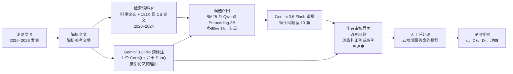
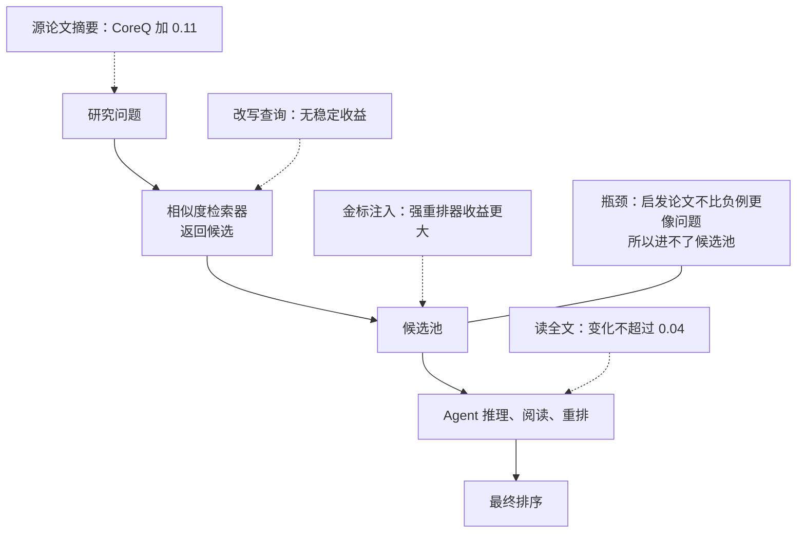

# ScholarCatalyst：让作者亲口说哪篇旧论文点亮了项目，再看检索系统能找回几篇

<!-- release-date: 2026-10-01 -->

> 本文依据本地 `papers/Stanford/ScholarCatalyst.pdf`，即 Stanford University 牵头，Seoul National University、University of Washington、Carnegie Mellon University、Allen Institute for AI 与 MIT 作者合写的 **ScholarCatalyst: A Benchmark for Retrieving Papers That Inspire New Research**，arXiv:2610.02202v1、2026-10-01 提交，共 57 页。页码均指 PDF 自身的页码。文中会区分三件事：**论文明确写了什么**、**我们怎么解释它**、**哪些是外部资料或本文推算**。

## 读前先把几个词说成人话

这篇论文不提出新模型，它提出一把新尺子。尺子量的是一件以前没法量的事：给一个还没想清楚的研究问题，系统能不能找到「真正能推动它」的那几篇旧论文。后面所有表格都踩在这把尺子上。

先把会反复出现的词说清楚：

- **催化论文（catalyst paper）**：论文的核心概念。指那些「确实推动了、或本来可以推动」某个项目的前人论文（PDF p. 2）。它不等于「主题相近的论文」，也不等于「被引用的论文」。
- **源论文（source paper，记作 $S$）**：一篇已经完成、发表在 2025–2026 年的计算机论文。每个评测实例都锚定在一篇源论文上（PDF p. 5）。
- **研究问题（query，记作 $q$）**：一小段文字，复原项目刚起步时的局面：已知什么、没解决什么、想问什么，但不透露最终答案（PDF p. 4）。
- **CoreQ / SubQ**：核心研究问题（Core Research Query）问项目的中心问题；子领域问题（Subfield-specific Query）从某个子方向切入同一个问题（PDF p. 4）。
- **正例 $D_q^+$ 与困难负例 $D_q^-$**：正例是作者认定「有启发」的论文；困难负例是作者看过、主题相关、但判定「没启发」的论文（PDF p. 4）。
- **检索器（retriever）**：给问题、在语料库里排出前 $N$ 篇的系统。**稀疏检索**（如 BM25）按词重叠打分；**稠密检索**（embedding）把问题和论文都变成向量、按余弦相似度排；**多向量检索**（如 ColBERT 式的 LateOn）每个词留一个向量再做细粒度匹配。
- **检索 Agent（agentic search）**：让大模型自己多轮改写查询、调用检索工具、读摘要、再排序。本文测了三种：grep Agent、工具调用 Agent、深度研究 Agent（PDF p. 6）。
- **Recall@N（召回率）**：前 $N$ 个结果里，覆盖了多少比例的正例。**nDCG@N** 在召回之外，还奖励把正例排得更靠前（PDF p. 4）。
- **知识截止（knowledge cutoff）**：模型训练数据的截止时间。截止晚于源论文的模型，可能在训练中见过答案。
- **时间截断语料（$P_{<S}$）**：只保留源论文之前发表的论文，模拟项目开始时研究者能读到的文献（PDF p. 4）。

## 一句话先说清

AI 已经能解不少「题目给好了」的科研子问题。但真正的研究起步时，更难的一步是：**这个模糊的新问题，该站在哪篇旧论文的肩膀上？** 论文把这叫做研究品味（research taste）的关键部分（PDF p. 2）。

图引自原文 Figure 1（PDF p. 1）。左边那篇主题相近，评测对象却不同；右边那篇来自另一个研究领域，却教会了作者「怎么评测需要深度推理的检索任务」。这张图本身就是这篇论文的论点：**启发未必长得像问题**。

要量这件事，最难的是标准答案。已发表的论文只记录结果，不记录构思过程；参考文献也不区分「给了关键启发的那篇」和「顺手引用的那堆」（PDF p. 2）。作者的解法是直接问当事人：

- 184 位研究者为自己主导的 207 个近期计算机项目，核对了 894 个「项目起步时」的研究问题，标出哪些前作确实或本可以推动项目，并写下理由，其中包括他们当时没读过的论文（PDF p. 2）；
- 系统要在一个只含项目之前文献、约 19.1 万篇的语料库里，把这些论文排到前面（PDF p. 2）；
- 主实验里 Agent 的底座模型，知识截止都早于全部源论文（PDF p. 2、p. 7）。

结果很冷（PDF p. 1–2、p. 7）：

- 最强系统在前 20 里只找回 **48%** 的作者认可论文；
- 检索 Agent 明明把检索器当工具用，成绩反而更低（**0.42 对 0.48** Recall@20）；
- 拿一个可能在训练中见过源论文的新模型 Claude Fable 5.1 搭 Agent，也只到 **0.51**。

论文给的诊断是：卡点在「候选覆盖」。不管模型推理得多好，它只能通过检索器返回的候选接触语料；而检索器按相似度排序，催化论文偏偏不比被作者否掉的相关论文更像问题（PDF p. 2、p. 7–9）。

### 一条阅读路线

如果只有半小时读原文，建议按这个顺序：

1. **p. 1 Figure 1，p. 2 Table 1**：先看清「启发」和「相关」的差别，以及它和已有文献检索基准差在哪三格。
2. **p. 4 Figure 2，p. 5 Table 2**：一个实例长什么样，CoreQ 与 SubQ 的正例有多少是没被引用的。
3. **p. 7 Table 3**：主结果。注意横线下的 Fable 5.1 只作对照。
4. **p. 7–8 Figure 4–5，p. 25–26 D.6**：Agent 为什么没赢，覆盖、排序、识别三层各丢了多少。
5. **p. 8 第 4.3 节，p. 36 Table 11**：困难负例和正例一样像问题，这是全文最要紧的一张小表。
6. **p. 8–9 第 4.4 节与 Table 4–5、Figure 6**：重排、源论文上下文、读全文、改写查询，四个旋钮各有多大用。
7. **p. 9–10 局限与展望**：天花板到底在哪。

附录 C 的 Agent 配置、D.3 的泄漏分析、E 的流水线细节，第一次可以只当对照尺。

## 主要矛盾：标准答案不在公开记录里

已有的科学文献检索基准，衡量的是「相似」或「相关」：某篇论文能不能支撑一个论断、是否匹配某个侧面、是否满足一个写明的信息需求（PDF p. 2–3）。这些信号回答不了一个问题：**某篇论文能不能启发一个刚起步的项目，尤其是当它最后根本没被引用的时候**（PDF p. 2）。

论文用 Table 1 把差别压成三格（PDF p. 2）：

| 基准 | 相关性定义 | 问题在发现之前 | 作者标注 | 公开记录之外的相关性 | 问题数 | 语料规模 |
|---|---|:---:|:---:|:---:|---:|---:|
| SciFact | 支撑论断 | 否 | 否 | 否 | 1.4K | 5.2K |
| DORIS-MAE | 多侧面相关 | 否 | 否 | 否 | 100 | 100 |
| ScholarQABench | 支撑论断 | 否 | 否 | 否 | 2,967 | 45M |
| LitSearch | 引用关系 | 否 | 是 | 否 | 597 | 64K |
| MIR | 方法学引用意图 | 是 | 否 | 否 | 139 | 4.7K |
| ScholarCatalyst | 作者判定的启发 | 是 | 是 | 是 | 894 | 191K |

LitSearch 那一格「作者标注」打勾，是因为它 597 个问题里有 246 个由作者为检索自己的论文而写（PDF p. 2 表注）。最接近的是 MIR：它的问题也藏起了最终方法，但正例来自「方法学影响」这类引用意图标注，仍然是从已发表的记录里推断（PDF p. 3）。

于是矛盾变成：

> 「哪篇旧论文启发了这个项目」只存在于作者脑子里。不去问作者，就只能拿引用、拿相似度当代理；而这正是这篇论文要证明不够用的那两个代理。

论文后面的分析会用数据把两个代理分别否掉（见下文「作者标注揭示了什么」）。

## 先看全景：一条只要 arXiv 编号的流水线，加一道作者人工门

这张图按 PDF p. 5 的 Figure 3 与附录 E（PDF p. 26–29）重画，是流程示意。机器负责把材料备齐，作者负责最终判断；论文强调流水线**只需要源论文的 arXiv 编号**（PDF p. 5）。

规模摘要见 Table 2（PDF p. 5）：

| 问题类型 | 问题数 | 平均正例数 | 正例中已引 / 未引（%） | 平均困难负例数 | 平均长度（token） |
|---|---:|---:|---:|---:|---:|
| CoreQ | 207 | 3.19 | 95.5 / 4.5 | 10.01 | 131.8 |
| SubQ | 687 | 6.09 | 56.4 / 43.6 | 6.88 | 63.5 |

两行差别很大，后面读结果时要一直记着：**CoreQ 正例少、几乎全是已引用的论文、问题更长；SubQ 正例多，近一半是源论文没引用的。**

## 核心设计一：把「启发」定义成一道可评分的检索题

### 旧问题：启发关系没法自动打分

如果任务是「给一个想法，生成新点子」，结果只能靠真做实验来验；如果任务是「找相关论文」，打分容易，但量不到启发。论文选了中间一条路：**答案落在已存在的论文上**。已发表的论文自带「什么管用、为什么、哪里不够」的记录，作者也能拿它对照「到底是什么推动了我的项目」（PDF p. 3）。

### 新设计：一个实例由四样东西组成

图引自原文 Figure 2（PDF p. 4）。读这张图要看三件事。

第一，**问题不透露答案**。CoreQ 写的是「多数投票标签能否当监督信号、能容忍多少噪声」，没写源论文最后发现了什么。

第二，**正例和负例都主题相关**。正例 Self-Consistency Preference Optimization 和三篇负例都在讲大模型推理的强化学习；区别只在作者的判断：前者让作者意识到「弱监督也能接近真值标签」，后者「研究了推理 RL，但没考虑弱信号」。

第三，**每个判断都附理由**。理由不参与打分，但它让后面的定性分析成为可能。

形式上，任务是：给定作者给出的问题 $q$，从时间截断语料 $P_{<S}$ 里检索出正例集 $D_q^+$（PDF p. 4）。困难负例 $D_q^- \subseteq P_{<S} \setminus D_q^+$ 一律主题相关，因为它们要么被源论文引用过，要么被某个检索器排得很高（PDF p. 4）。

### 工作机制：时间截断加禁网，堵住「事后诸葛亮」

三道防线（PDF p. 4、p. 6–7、p. 40）：

1. **语料按源论文发表日截断**。每个问题只能搜到不晚于其源论文的论文。截断后的可搜语料中位数仍有 190,574 篇（PDF p. 40，Table 18）。
2. **禁止联网**。防止 Agent 搜到后来介绍这个项目或源论文的文字。
3. **主实验的 Agent 底座知识截止早于全部源论文**。GPT-4.1 与 o3 的截止都是 2024 年 6 月（PDF p. 6、p. 40），源论文全部发表于 2025 年及以后（PDF p. 7）。

语料本身也有讲究。190,896 篇论文里，189,296 篇（99.2%）直接来自 arXiv，其余 1,600 篇（0.8%）只在被引论文不在 arXiv 上时才从 Semantic Scholar 与 OpenAlex 补（PDF p. 18）。额外的约 181K 篇来自 cs.CL、cs.CV、cs.LG、cs.RO、cs.AI 五个类别，2020–2024 年发表，且至少被引 1 次；年份与类别分布按近期 ICML、ICLR、NeurIPS 口头报告与亮点论文的引用分布来定（PDF p. 28）。

| 语料主类别 | 篇数 | 占比 |
|---|---:|---:|
| cs.CV | 64,919 | 34.0% |
| cs.LG | 57,151 | 29.9% |
| cs.CL | 33,255 | 17.4% |
| cs.RO | 18,922 | 9.9% |
| cs.AI | 10,933 | 5.7% |
| 其他 arXiv 类别 | 4,116 | 2.2% |
| 非 arXiv（S2、OA） | 1,600 | 0.8% |

上表引自 Table 9（PDF p. 36）。按年份看，2024 年最多（47,029 篇，24.6%），2025 年及以后只有 2,573 篇（1.3%），是源论文引用的少量新论文；评测时按问题截断，不构成泄漏（PDF p. 18–19、p. 36，Table 10）。

### 两类问题：中心问题与子方向问题

一个项目从宽泛的中心问题起步，再分到几个具体子方向，每一步都可能被某篇论文推一把（PDF p. 4）。附录 Table 7 用 Hi Robot（一篇机器人分层视觉-语言-动作模型的论文）给了一组完整问题（PDF p. 35）：

- **CoreQ**：机器人收到的语言远比「拿起可乐罐」复杂，带约束、偏好与中途纠正；端到端策略听不懂复杂语言，调用预定义技能的 LLM 规划器又缺灵巧度。灵巧的学习型策略如何理解开放指令与实时反馈？
- **SubQ 1**：端到端 VLA 的语言跟随能力，在指令偏离训练里的字面命令时会在哪里崩？
- **SubQ 2**：现成的基础模型当高层推理器，限制在哪里？
- **SubQ 3**：能在执行中吸收纠正的系统，能吸收的范围由什么决定？

论文指出，中心问题和子方向问题不一定指向同一批前作；两者的重叠与分歧，正好反映一个项目里互补的启发来源（PDF p. 18）。

### 评分：Recall@k 与 nDCG@20

主表报告 nDCG@20 与 Recall@5、@20、@100（PDF p. 6）。Agent 返回的列表长短不一，论文统一补到 100 篇：先放 Agent 自己的排序，再按发现顺序加入至多 25 篇「看过但没排」的论文，最后用原始问题的检索结果补齐（PDF p. 20）。

**我们如何解释它。** 这个补齐规则意味着 Agent 的 R@100 很大程度上来自检索器本身，所以主表里 Agent 的 R@100 带 † 号，不宜直接与纯检索器比（PDF p. 7 表注）。R@5 与 R@20 基本来自 Agent 自己的排序；例外是 grep Agent，它在 894 个问题中有 440 个排出的论文不足 20 篇（PDF p. 20）。

### 可迁移启发

想评测「判断力」而不是「匹配力」，关键是**让负例和正例在表面上一样像**。这里的困难负例全部主题相关、全部被作者亲眼否掉，相似度这条捷径就被堵死了。自己搭检索评测时，负例如果只是随机采样，测出来的多半还是相似度。

## 核心设计二：机器备料、作者裁决，让作者标注可以规模化

### 旧问题：让作者从零写标注，没人有空

要拿到「当事人视角」的标准答案，最朴素的做法是让作者从空白开始写问题、列论文、写理由。这样成本太高，也很难滚动扩充。

### 新设计：先自动生成草稿，作者只做改与判

流水线分三步（PDF p. 5、p. 26–28）：

1. **源论文处理**。用 arXiv API 取元数据与源文件，优先用 arXiv 的 HTML 版，否则用 LaTeXML 转 LaTeX 源码，比 PDF 解析更能保住结构与引用；参考文献逐条解析到 arXiv、Semantic Scholar、OpenAlex 的规范记录；**参考文献解析率低于 70% 的源论文直接丢弃**（PDF p. 26、p. 28）。
2. **预标注**。Gemini 3.1 Pro 读全文加参考文献，生成 1 个 CoreQ、若干 SubQ，以及被引论文的相关性理由（PDF p. 5）。提示词明确要求「不透露答案、不使用论文自创的术语」，并要求每个 cite key 必须逐字匹配参考文献（PDF p. 32–34）。子方向的数量由另一个提示词限定在 3–5 个（PDF p. 54）。
3. **候选召回**。用 BM25 和 Qwen3-Embedding-8B 各取前 15 篇，去重后交给 Gemini 3.6 Flash 按「科学相关性而非主题相似」重排，留 10 篇给作者审（PDF p. 28）。这一步专门为了找回**没被引用**的潜在启发论文。

作者端是一个网页界面，分四步：改写中心问题、选出关键前作、改写每个子方向问题、逐篇判定候选（PDF p. 49–53，Figure 13–17）。招募页写明每篇论文大约需要 20 分钟（PDF p. 48）。

招募有两条路：邀请 2025–2026 年主要 AI 会议口头报告、亮点与获奖论文的一作，以及公开招募 2025 年以来主要 AI 会议论文的一作、共同一作与通讯作者（PDF p. 6）。207 篇源论文中有 100 多篇拿过口头报告、亮点或奖项（PDF p. 6）。会议包括 ICLR 2026、ICML 2026、NeurIPS 2025、ACL 2026、CVPR 2026、CoLM 2025 与 CoRL 2025（PDF p. 6 脚注）。

最后一道人工后处理：894 个问题里 764 个（85.5%）原样通过；其余只改掉泄露答案或「把工作当已完成」的措辞，不改作者的意思（PDF p. 6）。

### 收益：作者认为草稿大体对，而且候选池真的捞到了新东西

作者校验的结果在 Table 32（PDF p. 47）：

| 环节 | 指标 | 数值 |
|---|---|---:|
| 复原问题 | CoreQ 完全准确 | 60.9% |
| | CoreQ 准确或大体准确 | 98.1% |
| | SubQ 完全准确 | 64.9% |
| | SubQ 准确或大体准确 | 95.9% |
| 候选池 | 原始引用被保留为正例 | 85.1% |
| | 非引用候选被提升为正例 | 35.1% |
| 关键前作提名 | 精确率 | 58.2% |
| | 召回率 | 26.0% |
| | 提名集合与作者完全一致 | 9.2% |

两件事值得分开看。

**问题复原**基本靠得住：作者觉得机器写的问题「准确或大体准确」的比例在 95% 以上（PDF p. 28）。

**挑关键前作**却很差：机器提名的关键前作只有 26.0% 的召回，完全一致只有 9.2%（PDF p. 47）。这和后文「读完整篇论文的 LLM 也认不出催化论文」是同一个现象（PDF p. 8）。

SubQ 的非引用候选里有 35.1% 被作者认作真正的启发（PDF p. 29）。如果只用参考文献当正例来源，这部分就全丢了。

论文还把流水线跑在另外 250 篇论文上，得到一个纯机器复原的集合（250 个中心问题、863 个子方向问题）（PDF p. 29）。正文的主实验没有使用这个集合，论文也没有报告它上面的检索结果。

### 代价与边界

- **作者看到的是机器准备的 10 个候选**。招募页写明作者也可以补充遗漏的启发论文（PDF p. 48），但候选池本身来自 BM25 与 Qwen3-Embedding-8B 的召回加重排。这意味着正例集合部分依赖于相似度检索器先捞上来，评测里的「检索器偏好」可能被轻微放大。论文没有单独量化这一点，属于我们的推测。
- **标签是回顾性的**。作者在项目完成后回忆当初，受事后偏差影响，论文在局限里承认了这一点（PDF p. 9）。

### 可迁移启发

需要专家判断的数据集，**让机器写初稿、让专家只做改与判**，能把每份 20 分钟的专家时间用在刀刃上。另一个可借的细节是流水线的「保鲜」设计：任何新发表的论文都能变成新实例，基准就能一直走在模型训练截止之前（PDF p. 2、p. 5）。

## 主结果：最强系统前 20 只找回一半

论文评测了 1 个稀疏检索器、1 个多向量检索器、7 个稠密检索器，以及 3 种检索 Agent（PDF p. 6）。稠密检索器分三类：通用模型（Qwen3-Embedding-4B、8B，Gemini Embedding 2）、科学文献专用模型（SPECTER2、OpenScholar）、为推理密集检索优化的模型（ReasonEmbed、Inf-Retriever-v1-Pro）（PDF p. 6）。

三种 Agent 的配置（PDF p. 6、p. 20–21）：

| Agent | 底座 | 怎么搜 | 预算 | 怎么排序 |
|---|---|---|---|---|
| grep Agent | GPT-4.1 | 对按月切分的语料文件写正则 | 1 个 shell 工具、20 轮，输出截到 4,000 字符 | 模型直接输出 id 列表 |
| 工具调用 Agent | GPT-4.1 | 调用 Gemini Embedding 2，每次返回前 10 | 至多 5 轮，候选池至多 60 篇 | 每篇单独打 0–10 分 |
| 深度研究 Agent | o3 | 同上 | 拆成至多 6 个子问题，至多 20 次搜索、10 次阅读、池 150 篇，每 5 次调用反思一次 | 最后一次综合调用排至多 50 篇 |

Table 3 是全文的主表（PDF p. 7）：

| 模型 | CoreQ nDCG@20 | CoreQ R@5 | CoreQ R@20 | CoreQ R@100 | SubQ nDCG@20 | SubQ R@5 | SubQ R@20 | SubQ R@100 |
|---|---:|---:|---:|---:|---:|---:|---:|---:|
| BM25 | 0.16 | 0.12 | 0.23 | 0.39 | 0.21 | 0.12 | 0.26 | 0.45 |
| LateOn 0.1B | 0.16 | 0.12 | 0.24 | 0.37 | 0.27 | 0.16 | 0.33 | 0.55 |
| SPECTER2 | 0.13 | 0.10 | 0.20 | 0.38 | 0.18 | 0.11 | 0.23 | 0.42 |
| OpenScholar | 0.16 | 0.13 | 0.23 | 0.40 | 0.19 | 0.12 | 0.24 | 0.46 |
| Qwen3-Emb-4B | 0.25 | 0.18 | **0.39** | 0.59 | 0.35 | 0.21 | 0.44 | 0.69 |
| Qwen3-Emb-8B | 0.26 | **0.21** | 0.37 | 0.58 | **0.41** | **0.25** | **0.51** | **0.73** |
| Gemini-Emb-2 | **0.27** | **0.21** | 0.38 | **0.62** | 0.38 | 0.24 | 0.46 | 0.70 |
| ReasonEmbed | 0.23 | 0.18 | 0.33 | 0.53 | 0.33 | 0.19 | 0.40 | 0.65 |
| Inf-Retriever-v1-Pro | 0.26 | 0.20 | 0.37 | 0.53 | 0.31 | 0.19 | 0.38 | 0.63 |
| GPT-4.1 + grep Agent | 0.05 | 0.04 | 0.06 | 0.56† | 0.09 | 0.07 | 0.09 | 0.66† |
| GPT-4.1 + 工具调用 Agent | 0.25 | 0.19 | 0.37 | 0.60† | 0.37 | 0.24 | 0.43 | 0.70† |
| o3 + 深度研究 Agent | 0.24 | **0.21** | 0.33 | 0.59† | 0.33 | 0.22 | 0.38 | 0.69† |
| Fable 5.1 + grep Agent ‡ | 0.41 | 0.36 | 0.52 | 0.67† | 0.42 | 0.28 | 0.48 | 0.74† |
| Fable 5.1 + 工具调用 Agent ‡ | 0.36 | 0.29 | 0.51 | 0.68† | 0.41 | 0.27 | 0.49 | 0.71† |
| Fable 5.1 + 深度研究 Agent ‡ | 0.40 | 0.35 | 0.53 | 0.69† | 0.42 | 0.28 | 0.50 | 0.73† |

† 表示 Agent 的排序用搜索中见过的论文与 Gemini-Emb-2 结果补到 100 篇；‡ 表示 Claude Fable 5.1 的知识截止为 2026 年 6 月，晚于大部分源论文，只作对照（PDF p. 7 表注）。加粗是我们按原文规则标的：只在横线上方、知识截止合规的行里比较，并列时都加粗。

论文自己读出四条（PDF p. 7）：

1. **所有系统都找不全**。表现最好的通用稠密检索器，前 20 里也只放进 CoreQ 的 39% 与 SubQ 的 51%。
2. **科学文献专用的检索器反而更差**。SPECTER2、OpenScholar 在 R@20 上比通用模型落后至少 16 个百分点（CoreQ）与 27 个百分点（SubQ）。论文的结论是：在引用信号上做领域训练，本身解决不了这个任务。
3. **BM25 与 LateOn 也落后**，CoreQ 落后 15–16 个百分点，SubQ 落后 18–25 个百分点。
4. **CoreQ 比 SubQ 难**，和它问题更长、正例更少且几乎全是已引用论文一致。

附录 D.1 把推理优化型检索器扩到 4 个（再加 NV-Embed-Reasoning-3B、Diver-Retriever-4B），没有一个超过最强的通用模型（PDF p. 22、p. 41，Table 19）。论文据此认为，现有「推理密集检索」的训练目标没抓住「一篇旧论文为什么能推动一个项目」的关系（PDF p. 22）。

### 摘要里的 0.42、0.48、0.51 从哪来

0.42 与 0.48 在 Table 3 对应系统的任何一列里都找不到；0.51 虽然恰好等于 Fable 5.1 工具调用 Agent 的 CoreQ R@20，但按与前两个数相同的口径，它对应的是 Fable 5.1 深度研究 Agent。三个数应是 CoreQ 与 SubQ 合并后的数，原文没写合并方法。**以下是本文按问题数加权（207 与 687）推算**：

- Qwen3-Emb-8B 合并 R@20：$(207 \times 0.37 + 687 \times 0.51) / 894 \approx 0.48$，对应摘要的 0.48 与引言的「48%」（PDF p. 1–2）；
- GPT-4.1 工具调用 Agent 合并 R@20：$(207 \times 0.37 + 687 \times 0.43) / 894 \approx 0.42$；
- Fable 5.1 深度研究 Agent 合并 R@20：$(207 \times 0.53 + 687 \times 0.50) / 894 \approx 0.51$；
- Qwen3-Emb-8B 合并 R@5 约 0.24，对应结论里「最好系统整体 R@5 为 0.24」（PDF p. 9）。

四个数全部对上，而且 Qwen3-Emb-8B 的合并 R@20 在横线上方各行里最高（Gemini-Emb-2 约 0.44、Qwen3-Emb-4B 约 0.43），与引言「最强系统前 20 只找回 48%」一致。换成按正例数加权（207 × 3.19 与 687 × 6.09，合计约 4,844，与 Table 26 的 4,845 个正例吻合，PDF p. 45），Qwen3-Emb-8B 会得到约 0.49、Fable 5.1 深度研究 Agent 约 0.50，对不上摘要。两种常见口径里，只有「按问题数平均」能同时吻合四个数；但这仍是推算，不是原文说明。

有一处措辞要留意。摘要说 Agent 「把同一个检索器当工具」却不如它（PDF p. 1），但工具调用 Agent 调用的是 Gemini Embedding 2（PDF p. 6），按同样方法推算它的合并 R@20 约为 0.44，而 0.48 是 Qwen3-Emb-8B 的数；正文第 4.2 节也写明是拿 Agent 和「最强的嵌入模型」比（PDF p. 7）。即使换成同一个检索器比，0.42 仍低于 0.44，结论方向不变，只是差距没有摘要写得那么大。

## Agent 为什么没赢：卡在候选覆盖，不在推理

### 旧问题：多搜几轮、让大模型想一想，按理应该更好

检索 Agent 的卖点是自适应：看了结果再改查询，读了摘要再判断。近来也有工作主张让 Agent 直接用 grep 读原始语料，绕开向量检索（PDF p. 3）。

### 实测：grep 几乎碰不到正例，工具调用也只是追平

Figure 4 是一张两行的柱图（PDF p. 8），改写成表：

| GPT-4.1 Agent | 搜索中见过的正例 | 最终进入前 20 的正例 |
|---|---:|---:|
| grep Agent | 8% | 7% |
| 工具调用 Agent | 46% | 41% |

grep Agent 在搜索过程中只碰到 8% 的正例，工具调用 Agent 是 46%（PDF p. 7）。论文的解释是候选覆盖：不论模型怎么推理，Agent 只能通过自己的搜索查询接触语料；语料越大，它能看的比例越小（PDF p. 7）。

图引自原文 Figure 5（PDF p. 8）。横轴是 Artificial Analysis 的通用能力分数。论文的判断：Agent 召回随底座变强而上升，但即使最强的底座也只是贴近检索器本身（PDF p. 7）。

**我们如何解释它。** Figure 5 的图注没写用的是哪组问题。附录 Figure 9 画的是同样 7 个底座在 203 题截止切分上的召回，分 46 个 CoreQ 与 157 个 SubQ 两行（PDF p. 23）。从 Figure 9 读出分值、按 46 与 157 加权，GPT-4.1 约 42.3%、GPT-5.6 Luna 约 39.9%、Gemini 3.7 Flash 约 44.9%、Fable 5.1 约 43.9%，与 Figure 5 的点逐个吻合；Gemini 3.7 Flash 在 Figure 9 上约 39% 与 47%，也和 Table 4 同一切分的 0.39 与 0.47 一致（PDF p. 8）。反过来，若用全部 894 题，GPT-4.1 工具调用 Agent 按 Table 3 合并约为 41.6%，Fable 5.1 约为 49.5%，都对不上。因此 Figure 5 很可能是 203 题截止切分上 CoreQ 与 SubQ 的合并召回。这是本文读图推算，不是原文说明。

### 拆成三层：覆盖、排序、识别

附录 D.6 把 Agent 的失败拆成三层（PDF p. 25–26）。

**覆盖：Agent 很少找到检索器池子外的正例。** Table 26 把全部 4,845 个正例按两个结果交叉（PDF p. 45）：

| Agent | 检索器前 100 内且进 Agent 前 20 | 检索器前 100 内但漏掉 | 检索器前 100 外但进前 20 | 检索器前 100 外且漏掉 | 检索器前 100 内的进前 20 率 | 检索器前 100 外的进前 20 率 |
|---|---:|---:|---:|---:|---:|---:|
| 工具调用（GPT-4.1） | 40% | 30% | 1% | 29% | 57% | 4% |
| 深度研究（o3） | 34% | 36% | 2% | 28% | 48% | 6% |
| grep（GPT-4.1） | 6% | 64% | 1% | 29% | 8% | 4% |

检索器前 100 覆盖了 70% 的正例，剩下 30% Agent 几乎一篇都捞不回来（PDF p. 25）。约一半正例在 Agent 整个运行过程中没被任何一次搜索返回；第一次搜索（直接用原问题）贡献了 Agent 见到的正例的约三分之二，后续搜索加得很少（PDF p. 25）。

**排序：找到了也会丢。** 检索器前 100 内的正例，工具调用 Agent 与深度研究 Agent 分别只留下 57% 与 48% 在前 20（PDF p. 25–26）。附录用三个案例演示（PDF p. 26–27）：

- **案例 A，排序失败**：检索器把两篇正例排在第 1 与第 5，两个 Agent 第一次搜索都拿到了；工具调用 Agent 只留下一篇，深度研究 Agent 一篇都没留。
- **案例 B，后续搜索找回**：两个 Agent 的后续搜索都找到一篇检索器排在 100 名外的正例，深度研究 Agent 把它排到第 2。
- **案例 C，查询漂移**：检索器前 30 里有 4 篇正例中的 3 篇，工具调用 Agent 的后续查询却漂到「泛泛的迁移学习」，一篇都没见到。

**识别：排进前 20 的，Agent 大多讲得出为什么。** 对工具调用 Agent 前 20 里的 238 篇 CoreQ 正例，让 GPT-4.1 解释它为何有用，再用 GPT-4.1 当裁判对比作者理由；219 对可比的里，76% 描述的是同一种关系，其余几乎都是「不同但成立」（PDF p. 26）。

论文自己给了两条保留：同一个模型既写又判，76% 是上估；而且这只说明模型「拿到论文后能解释」，不说明这种理解就是它把论文排进来的原因（PDF p. 26）。

### 可迁移启发

给检索 Agent 加推理轮数之前，先量一下**轨迹召回**：Agent 整个过程中见过多少正例。如果见过的就很少，问题在入口；继续加强推理和重排，只是在一个漏了大半的池子里精挑细选。本文的数据显示第一次搜索贡献了约三分之二，这意味着「第一次查询怎么写、检索器返回什么」比后续多轮更决定成败。

## 作者标注揭示了什么：相似与引用都不是好代理

### 启发关系五花八门，而且和相似度无关

论文让 LLM 裁判把 663 条 CoreQ 关键启发理由按九类打多标签（PDF p. 8、p. 19）。Figure 7 是一张横向柱图，改写成表（PDF p. 19）：

| 启发类型 | 定义（Table 13） | 占比 |
|---|---|---:|
| 方法（Method） | 采用或改造了前作的某个方法、机制、组件或原则 | 40.3% |
| 证据（Evidence） | 前作的发现支持了新方向的可行性，但没被直接搬用 | 39.1% |
| 推广（Generalization） | 把前作的想法推到新领域、新模态或新任务 | 31.5% |
| 局限（Limitation） | 前作的失败模式或未解决问题促成新工作 | 21.7% |
| 重新框定（Reframing） | 前作提供了看待问题的新视角或新抽象 | 10.7% |
| 框架（Framework） | 在前作的整体框架或系统上搭建 | 10.0% |
| 动机（Motivation） | 前作促成了研究问题本身 | 7.7% |
| 现象（Phenomenon） | 前作观察到的现象促使新工作去解释或形式化 | 6.6% |
| 其他 | — | 1.8% |

定义引自 Table 13（PDF p. 37）。每条理由平均 1.69 个标签，55.8% 有两个以上，12.7% 有三个以上（PDF p. 19）。也就是说，一篇论文常常同时以几种方式影响一个项目。

最要紧的是 Table 11（PDF p. 36）：

| 问题类型 | BM25 相似度：正例 | BM25 相似度：困难负例 | 嵌入相似度：正例 | 嵌入相似度：困难负例 |
|---|---:|---:|---:|---:|
| CoreQ | 28.7 | 29.2 | 64.5 | 66.2 |
| SubQ | 34.5 | 34.4 | 65.1 | 64.2 |

不论用词重叠还是 Qwen3-Embedding-8B 的余弦相似度，**困难负例至少和正例一样像问题**（PDF p. 8）。CoreQ 上负例甚至更像。

**我们如何解释它。** 这张小表是全文因果链的中轴。所有检索器都按相似度排序；所有 Agent 都通过检索器或 grep 拿候选；而作者认定的启发论文在相似度上并不突出。于是推理再强的 Agent，也只能在一个由相似度挑出来的池子里打转。论文把这个推论写成「这也限制了 Agent 搜索」（PDF p. 8）。

### 已发表的记录也指不出启发

引用是另一个常用代理，论文用三组数否掉它（PDF p. 8、p. 19）：

- SubQ 正例里 43.6% 没被源论文引用；这些未引用的正例里，67.8% 和源论文没有任何共同参考文献；
- 已引用的正例里，只有 46.2%（CoreQ）与 34.0%（SubQ）带有「使用」或「扩展」这类引用意图标签；
- 把完整源论文和参考文献都交给 Gemini 3.1 Pro，它提名的候选平均只覆盖 32.2% 的 CoreQ 正例，28.0% 的实例里一篇关键启发都没提名。

Table 12 给了一个双向错位的例子（PDF p. 36）：一个关于「强化学习如何利用脉冲神经网络时间动态」的 CoreQ，4 个正例里有 2 个没被引用（Jump-Start Reinforcement Learning 与 Revisiting the Minimalist Approach to Offline RL），同时有 2 篇被引用的论文被作者判为困难负例。作者的理由是：前者提示用一个辅助控制器渡过热身期，后者支持把辅助控制器的示范和脉冲网络自己的 TD3 轨迹结合。

### 启发常常跨领域，而且同一篇论文对不同项目作用不同

两个附录案例：

- **跨领域**（Table 14，PDF p. 38）：一篇研究扩散模型无分类器引导（CFG）机制的 NeurIPS 2025 亮点论文，关键启发是 2018 年发表在 Nature Communications 的对比主成分分析（contrastive PCA）。作者在推导中发现引导项涉及两个协方差矩阵之差，于是去找研究「协方差之差」的前作，才找到对比 PCA。
- **同一篇论文、三种角色**（Table 15，PDF p. 39）：Self-Consistency 被三篇无关的源论文选为 CoreQ 正例，分别当作朴素基线、向视觉模态的推广、以及并行测试时扩展这一结构前提。

论文在展望里给了一个总量：作者认可的论文里，近一半（49.5%）来自项目所在学科之外（PDF p. 10）。

### 可迁移启发

做文献推荐或研究助手时，**不要把「被引用」当成「有用」的标注**，也不要把「最像」当成「最该读」。本文的数据显示，一个项目真正借力的论文里，有相当比例连引用都没进，而且和问题在字面与语义上都不突出。

## 拆因素：四个旋钮各有多大用

第 4.4 节和附录 D 换着法子回答同一个问题：瓶颈到底在找、在认，还是在问法（PDF p. 8–9、p. 22–26）。

### 旋钮一：重排，以及「把正例塞进候选池」

做法：取 Gemini-Embedding-2 的前 $K$ 个候选，让 LLM 重排；对照组做「金标注入」，把池子里缺的正例替换进去、保持池子大小不变（PDF p. 8–9）。评测用随机抽样的 50 个 CoreQ 与 50 个 SubQ（PDF p. 8）。

$K=20$ 时的 Recall@5 引自 Table 20（PDF p. 41）：

| 重排底座 | CoreQ 普通 | CoreQ 注入 | SubQ 普通 | SubQ 注入 |
|---|---:|---:|---:|---:|
| GPT-4.1 | 0.27 | 0.38 | 0.18 | 0.26 |
| Gemini 2.5 Flash | 0.22 | 0.36 | 0.14 | 0.26 |
| Gemini 3.1 Pro | 0.31 | 0.47 | 0.18 | 0.30 |
| Gemini 3.7 Flash | 0.33 | 0.51 | 0.20 | 0.32 |
| GPT-5.6 Sol | 0.26 | 0.47 | 0.19 | 0.33 |
| Claude Fable | 0.31 | 0.60 | 0.22 | 0.40 |

正文 Figure 6 是同一实验的哑铃图（PDF p. 8）；按我们核对，图上的点位与上表两类问题取平均后的值吻合，例如 Claude Fable 从约 27% 升到约 50%。论文的读法是：**越强的重排器，从金标注入里得到的提升越大**；候选覆盖限制了强重排器能发挥多少，它挑论文的本事只在论文进了池子之后才算数（PDF p. 9）。

附录 Figure 8 还把池子放大到 40、80、160：普通重排随池子变大变化不大，注入后的优势随池子变大而收窄（PDF p. 22、p. 41）。较弱的底座在 SubQ 上甚至可能不如只用检索器（PDF p. 22）。

### 旋钮二：给 Agent 源论文的上下文

这一组放宽了主实验的限制，只用于分析（PDF p. 9、p. 21）。底座是 Gemini 3.7 Flash（知识截止 2026 年 3 月），在 203 题的截止切分上跑工具调用 Agent。Table 4 引自 PDF p. 8：

| 设定 | CoreQ R@20 | SubQ R@20 |
|---|---:|---:|
| Agent，只搜本地语料 | 0.39 | 0.47 |
| Agent，加联网搜索 | 0.38 | 0.47 |
| Agent，加源论文标题与摘要 | 0.50 | 0.49 |
| Agent，加源论文参考文献 | 0.74 | 0.57 |
| 闭卷（不给语料，凭记忆） | 0.31 | 0.24 |

读法（PDF p. 9、p. 24）：

- 源论文标题与摘要让 CoreQ 涨 0.11、SubQ 涨 0.02；
- 联网几乎没用，变化不超过 0.01，尽管 203 个问题里有 85 个的联网结果里直接出现了源论文；
- 参考文献让 CoreQ 涨 0.35，因为它包含了 95% 的 CoreQ 正例；单靠参考文献、不用模型，R@100 就超过 0.9；
- 给了标题与摘要却没有搜索工具，CoreQ 只到 0.31，低于只搜语料的 0.39。论文据此认为，源论文上下文的作用是**引导搜索，而不是唤起记忆**。

图引自原文 Figure 10（PDF p. 23）。这组实验固定 GPT-5.6 家族的同一个知识截止（2026 年 2 月），只变能力：左图变 Luna 的推理强度，右图变型号档位。虚线是 Gemini-Emb-2 的 0.38。论文的读法：给了源论文摘要后，Luna 不开推理时 Agent 比凭记忆高 0.25，到较强的配置时差距缩到噪声以内；提高 Luna 的推理强度有利于记忆、却拖累只给问题的 Agent，换更强的型号则两者都受益（PDF p. 24）。

### 旋钮三：让 Agent 读得更多

主实验里 Agent 只看标题和摘要。附录 D.5 让 GPT-4.1 工具调用 Agent 在 180,399 篇有全文的子集上读更多内容：引言、方法、参考文献、全文，或者让它自己挑章节，每次阅读最多 12,000 字符（PDF p. 25）。

Table 25 的 R@20（PDF p. 45），各取 50 个问题：

| 阅读策略 | CoreQ R@20 | SubQ R@20 |
|---|---:|---:|
| 只用检索器 | 0.35 | 0.55 |
| 只看摘要（无阅读工具） | 0.35 | 0.46 |
| 摘要 + 引言 | 0.34 | 0.48 |
| 摘要 + 方法 | 0.32 | 0.47 |
| 摘要 + 参考文献 | 0.34 | 0.48 |
| 摘要 + 引言 + 参考文献 | 0.34 | 0.49 |
| 全文 | 0.34 | 0.49 |
| Agent 自选章节 | 0.35 | 0.50 |

变化最多 0.04，最好的 SubQ 策略仍落后检索器（0.50 对 0.55）（PDF p. 9）。论文的结论：**瓶颈在「知道该搜什么」，不在「看懂已经找到的论文」**（PDF p. 9）。

### 旋钮四：让 LLM 改写查询

如果检索器漏掉正例只是因为措辞，一个读懂问题的 LLM 改写一下应该能找回一些。Table 5 用 GPT-4.1 改写、Gemini-Embedding-2 检索，各 50 个问题（PDF p. 8–9）：

| 方法 | CoreQ R@20 | SubQ R@20 |
|---|---:|---:|
| 原始问题 | 0.40 | 0.42 |
| 单查询扩展 | 0.44（+0.04） | 0.37（−0.05） |
| 多查询生成 | 0.37（−0.03） | 0.41（−0.01） |
| HyDE（均值池化） | 0.23（−0.17） | 0.22（−0.20） |
| HyDE（多查询） | 0.18（−0.22） | 0.20（−0.22） |

HyDE（Hypothetical Document Embeddings）是先让模型写几篇「假想的前作摘要」，再拿假想摘要去检索。在这里它让召回大幅下降。论文的结论：没有一种改写能稳定找回漏掉的论文，说明**嵌入空间本身就没把启发论文放在问题附近**，与相似度分析一致（PDF p. 9）。附录 Table 23–24 给了一个 CoreQ 实例的生成结果：原始问题能召回的一篇正例，所有生成查询在前 100 里都没召回（PDF p. 24）。

### 把四个旋钮串起来

这张图按第 4.4 节与附录 D 的结论（PDF p. 8–9、p. 22–26）重画，是论证结构示意，不是原文图。四个旋钮里，**只有直接改变「池子里有什么」的两项**（给源论文上下文、金标注入）带来明显提升；作用在池子之后的阅读与推理，和作用在问法上的改写，都没有稳定收益。

## 泄漏检验：见过答案的模型占了多少便宜

主表横线下的 Fable 5.1 行不符合知识截止规则：它的截止（2026 年 6 月）晚于 207 篇源论文中除 6 篇以外的全部（PDF p. 21）。附录 D.3 专门检验「见过源论文」到底帮了多少（PDF p. 23–24）。

做法是两个按 arXiv 主类别配对的切片：截止前切片是 2025-02-12 到 2025-12-23 发表的 23 篇源论文，截止后切片是 2026-05-08 到 2026-08-14 发表的 23 篇；知识截止落在两者之间的底座，只可能见过前者（PDF p. 24）。两片难度不同（检索器 CoreQ R@100 为 0.49 对 0.63），所以只比较同一切片内相对检索器的差距（PDF p. 24）。

Table 21 的 CoreQ R@20（PDF p. 42）：

| 系统（知识截止） | 截止前切片 | 截止后切片 |
|---|---:|---:|
| Gemini-Emb-2 检索器 | 0.35 | 0.41 |
| 工具调用 Agent，GPT-4.1（2024-06） | 0.32 | 0.39 |
| 工具调用 Agent，Gemini 3.1 Pro（2025-01） | 0.36 | 0.37 |
| 工具调用 Agent，GPT-5.6 Sol（2026-02） | 0.42 | 0.47 |
| 工具调用 Agent，Gemini 3.7 Flash（2026-03） | 0.37 | 0.41 |
| 工具调用 Agent，Claude Fable 5.1（2026-06） | 0.42 | 0.47 |
| 闭卷，GPT-5.6 Sol | 0.40 | 0.48 |
| 闭卷，Claude Fable 5.1 | 0.55 | 0.54 |

论文的判断（PDF p. 24）：

- GPT-5.6 Sol 的截止落在两片之间，它领先检索器的幅度在两片上几乎一样（0.07 与 0.06），**看不出见过前一片的论文带来了好处**；
- Fable 5.1 的截止落在截止后切片内部，没法这样检验；
- 闭卷召回随能力上升，但这既符合「记住了」也符合「能力强」，定不了案；
- SubQ 层面，没有任何 Agent 或闭卷行在任一切片上超过检索器。

**我们如何解释它。** 闭卷的 Fable 5.1 在两个切片上的 CoreQ R@20 为 0.55 与 0.54，高于同一模型搭 Agent 的 0.42 与 0.47（PDF p. 42）。闭卷行是给了源论文标题与摘要的，条件比 Agent 行宽松，所以不能直接比；但它至少提示，对足够新的模型，「记忆」这条路径不可忽视。这也是论文把 Fable 5.1 行标成「仅作对照」、并强调靠流水线不断用新论文刷新基准的原因（PDF p. 5、p. 7）。

附带一个实操细节：Fable 5.1 的安全分类器有时会拒绝调用，论文按空回复处理。工具调用、深度研究、grep 三种 Agent 分别在 894 个问题中的 47、95、33 个上出现拒绝（PDF p. 21）。

## 成本：贵的 Agent 没有更好

Table 31（PDF p. 47）：

| Agent | 底座 | 每题工具调用 | 每题底座调用 | 每题成本（美元） | 全部 894 题成本（美元） | 中位耗时（秒） |
|---|---|---:|---:|---:|---:|---:|
| grep | GPT-4.1 | 20.3 | 18.5 | 0.37 | 332 | 22 |
| 工具调用 | GPT-4.1 | 5.8 | 44.3 | 0.05 | 42 | 25 |
| 深度研究 | o3 | 14.3 | 18.3 | 0.39 | 345 | 60 |
| grep | Claude Fable 5.1 | 19.3 | 20.2 | 1.14 | 1,016 | 139 |
| 工具调用 | Claude Fable 5.1 | 13.9 | 63.2 | 1.32 | 1,178 | 88 |
| 深度研究 | Claude Fable 5.1 | 22.7 | 12.4 | 1.39 | 1,240 | 146 |

用 GPT-4.1 与 o3 时，grep 与深度研究 Agent 带着不断增长的上下文跑 14–20 次工具调用，成本约是工具调用 Agent 的 8 倍（PDF p. 26）；而 Table 3 里它们的召回都不如工具调用 Agent。工具调用 Agent 便宜，是因为它搜得少，而且每篇候选用一个短小、独立的调用打分（PDF p. 26）。

## 天花板在哪

论文在局限里认真讨论了「这个任务的上限是多少」（PDF p. 9）。

它先拿 ImageNet 作类比：人类参考准确率（top-5 94.9%）后来被模型超过，重标注研究发现之后的提升越来越多地反映的是原标签的偏差（PDF p. 9）。催化论文检索更难这样审计，因为让作者以外的人重标，既昂贵又测的是另一件事：一个懂行的外人能推断出什么（PDF p. 9）。

论文给出一个初步对照：一篇论文有三位作者参与标注，合作者每个子方向只标约 7 篇正例，就找回了一作标签的 43%–60%，精确率 84%–88%（PDF p. 9）。论文拿它和最好系统的整体 R@5（0.24）比，认为还有很大提升空间（PDF p. 9）。

**我们如何解释它。** 这个对照只有一篇论文，且合作者与系统的「预算」不完全对等（约 7 篇对 5 篇），只能当量级参考。它更像在说明：同一个项目的当事人之间也只有部分一致，这个任务的天花板未必接近 100%。

## 限制、边界，以及不要补进去的结论

论文自己写明的（PDF p. 9）：

- **领域窄**：只覆盖 2025–2026 年的计算机论文，各子领域分布不均。源论文主类别里 cs.LG 占 31.9%、cs.CV 占 22.2%、cs.CL 占 18.4%（PDF p. 36，Table 8），结论未必能迁移到其他学科。
- **事后偏差**：标签是作者完成项目后的回顾性判断。
- **天花板未知**：见上一节。

我们读完必须留下的判断：

- **语料比真实世界小得多**。19.1 万篇对比 arXiv 的 300 万篇以上、Semantic Scholar 的 2.25 亿篇以上（PDF p. 6、p. 10）。论文据此认为本基准是真实问题的简化版；真实场景里覆盖问题只会更严重。
- **正例集合不是穷尽的**。作者在机器备好的 10 个候选上做判断，再加上自己补充的论文；语料里可能还有作者没看到、但同样有启发的论文。这会让所有系统的召回被低估，但不改变系统之间的相对排序。论文没有单独讨论这一点。
- **Agent 设计是复现版**。工具调用 Agent 借鉴 PaSa 与 PaperScout 的结构，但没跑它们的原版，因为原版要联网、PaperScout 没放出训练好的策略；grep Agent 是 DCI-Agent-Lite 的简化重实现，预算从 300 轮降到 20 轮（PDF p. 20–21）。结论是「这三种常见设计没赢」，不等于「所有 Agent 都赢不了」。
- **「Agent 不如检索器」的幅度要看对谁比**。见上文对摘要 0.42 与 0.48 的拆解。
- **识别实验的 76% 是上估**，且不说明因果（PDF p. 26）。
- **论文没有训练任何模型**。它呼吁「新的训练配方，让模型具备专家式的搜索直觉」（PDF p. 1），但没给出任何训练方法或实验。

## 可迁移启发

1. **评测判断力，先堵相似度的捷径。** 负例必须和正例一样像问题，而且由懂行的人判定。否则测出来的永远是匹配能力。
2. **入口决定上限。** Agent 见到的正例约三分之二来自第一次搜索，检索器前 100 外的正例几乎捞不回来。做检索增强系统时，先量轨迹召回，再决定把预算花在检索器还是推理上。
3. **重排器越强，越需要好的候选池。** 金标注入的收益随重排器变强而增大。只升级重排模型、不改召回，会遇到天花板。
4. **读得更多、改写查询都不是万能药。** 读全文最多变化 0.04，HyDE 反而大幅掉点。如果嵌入空间本身没把目标放近，换措辞救不回来。
5. **引用不是「有用」的好标签。** SubQ 正例近一半没被引用，已引用的正例也只有 34%–46% 带「使用」或「扩展」标签。拿引用图做文献推荐训练信号时要清楚它漏掉了什么。
6. **专家标注可以「机器备料、人做裁决」。** 问题复原的准确率在 95% 以上，作者只花约 20 分钟一篇；但「挑关键前作」这种判断仍得留给人，机器的召回只有 26.0%。
7. **用新数据对抗泄漏。** 能自动把新论文变成新实例的流水线，比任何一次性的泄漏检测都可靠。

## 关键词回看

- **催化论文**：确实或本可以推动项目的前作。本文的标准答案，由源论文作者亲自判定。
- **CoreQ / SubQ**：中心问题与子方向问题。前者正例少且几乎都被引用，后者近一半正例未被引用。
- **困难负例**：作者看过、主题相关、判为没启发的论文。和正例一样像问题，是本文最关键的设计。
- **时间截断语料**：每个问题只能搜到源论文之前的论文，可搜规模中位数 190,574 篇。
- **候选覆盖**：检索器返回的池子里有没有正例。本文认为它是 Agent 没赢的主因。
- **轨迹召回**：Agent 整个运行过程中见过的正例比例。
- **金标注入**：把缺的正例换进候选池，用来把「找」和「认」分开。
- **0.48 / 0.42 / 0.51**：最强检索器、GPT-4.1 工具调用 Agent、Fable 5.1 深度研究 Agent 的合并 R@20（本文按问题数加权推算）。
- **九类启发**：方法、证据、推广、局限最常见，过半理由同时属于多类。
- **天花板**：一篇论文的初步对照里，合作者找回一作标签的 43%–60%。

## 资料与阅读边界

### 本文依据的版本

- 本地原件：`papers/Stanford/ScholarCatalyst.pdf`，57 页，页边标注 `arXiv:2610.02202v1 [cs.AI] 1 Oct 2026`。
- 官方页：[arXiv:2610.02202](https://arxiv.org/abs/2610.02202)。核验时只有 v1，提交时间 2026-10-01 17:59:47 UTC。
- `release-date` 取 **2026-10-01**。这是一篇只公开基准与评测的论文，没有模型发布，按 arXiv v1 提交日计。

### 原文给出、本文未核对内容的外部链接

论文首页给出项目页 `ohmyksh.github.io/project/ScholarCatalyst`、数据集 `huggingface.co/ScholarCatalyst` 与代码 `github.com/stanford-iris-lab/ScholarCatalyst`（PDF p. 1）。招募页写明数据集会公开发布，既作为评测基准，也作为未来模型的训练信号（PDF p. 48）。这些链接的实际内容、许可证与是否包含作者理由全文，本文未核对。

### 报告明确写了、本文覆盖了的部分

摘要与 Figure 1；第 1 节动机与 Table 1；第 2 节相关工作；第 3 节任务定义、Figure 2–3、Table 2、流水线与作者收集；第 4 节实验设置、Table 3–5、Figure 4–6、启发关系分析、四个因素；第 5 节结论、局限与展望；附录 B 的实例组成、语料统计、Table 7–15、Figure 7；附录 C 的模型配置、评测设置、三种 Agent 与分析条件；附录 D 的扩展检索器、重排、泄漏分析、查询改写、全文阅读、失败分析与成本（Table 19–31、Figure 8–11）；附录 E 的流水线与作者校验（Table 32）；附录 F 的招募与界面（Figure 12–17）；附录 G 的提示词。

### 外部资料补充（不是 PDF 原文）

- 本文没有引入 PDF 之外的事实资料。上文所有标「本文推算」的数字，都是用 PDF 里的表格或图中读数按问题数加权或相减得到的。

### 原文没有公开、本文也不补的缺口

- 894 个问题、正例与理由的具体内容（需从数据集链接获取，PDF 只给了少数示例）；
- 纯机器复原的 250 篇集合上的检索结果；
- 天花板对照只做了一篇论文，没有更大规模的作者间一致性统计；
- 候选池依赖 BM25 与 Qwen3-Embedding-8B 召回，这一选择对评测是否有偏，论文没有量化；
- 任何训练方法：论文只提出需要「新的训练配方」，没有给出实现或实验。
