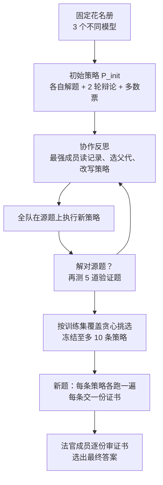
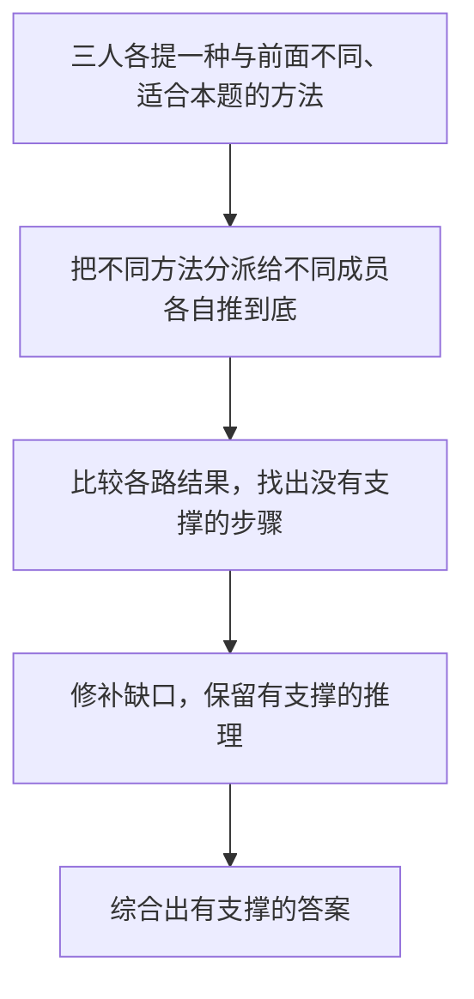
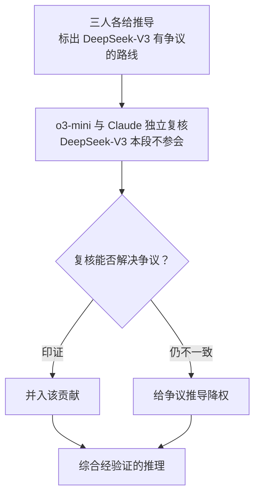

# SAT：成员固定、不切子任务，让一支 Agent 队伍学会怎么开会

<!-- release-date: 2026-09-19 -->

> 本文依据本地 `papers/Stanford/Self-Organizing-Agent-Teams.pdf`，即 Stanford University、Together AI 与 Emory University 作者合写的 **Self-Organizing Agent Teams Learn to Reason Together**，arXiv:2609.22682v1、2026-09-19 提交，共 30 页。页码均指 PDF 自身的页码。文中会区分三件事：**论文明确写了什么**、**我们怎么解释它**、**哪些是外部资料或本文推算**。

## 读前先把几个词说成人话

这篇论文难读的地方不在公式，而在它换了一把尺子。以往的多智能体论文拿「团队里最强的那个成员」当对照；这篇换成「每道题都从成员各自的答案里完美挑一个」的上界。后面所有表格都踩在这把新尺子上。

先把会反复出现的词说清楚：

- **Agent（智能体）**：一个被提示词驱动、能读别人发言再回话的大模型。每支队伍固定 3 个不同厂商的模型（PDF p. 3–4）。
- **协作策略（teamwork strategy）**：写给整支队伍的「开会流程」。它规定分几个阶段、每段谁参加、说几轮、谁扮演什么角色、结果要不要广播给所有人。论文要学的就是这个东西（PDF p. 5）。
- **策略库（strategy bank）**：学完后冻结的一组策略，最多 10 条。测试时对每道新题把库里每条都跑一遍（PDF p. 6）。
- **协作反思（teamwork reflection）**：队伍里训练集上最强的成员读过去的讨论记录和结果，提出对策略的改写。它是整个学习过程的驱动者（PDF p. 5）。
- **证书（certificate）**：每条策略跑完交出的一段简短、自洽、能逐步检查的推理，而不只是一个答案（PDF p. 6）。
- **法官（judge）**：部署时读完全部证书、选出最终答案的那个成员。它被要求只审证书，不自己解题（PDF p. 6、p. 29）。
- **路由上界（routing oracle）**：对每道题，只要 3 个成员里有一个独立答对就算对。它等于一个「永远选对人」的完美路由器能拿到的分数（PDF p. 3）。
- **协作计算（collaborative computation）**：论文自己起的名字。成员交换、质疑、修补、综合彼此的半成品推理，得到一个没有任何成员单独给出过的答案（PDF p. 1–3）。
- **可证明性（demonstrability）**：组织心理学的概念，指对的推理摆出来之后，别人能不能认出它是对的（PDF p. 4、p. 11）。

方法学上，论文把自己放在 GEPA 一篇那条「用反思式搜索优化非权重产物」的线上，只是优化对象换成了多个模型之间怎么开会（PDF p. 13）。它要回答的问题可以压成一句：

> 一支成员固定、谁都不能单独解出题的模型队伍，能不能从自己过去的合作里学会「怎么开会」，并让这套开法原样迁移到没见过的题和 benchmark 上？

## 一句话先说清

以往的多智能体方法有两个家族（PDF p. 2）：

1. **以候选答案为工作单元**：辩论（Debate）与 MoA（Mixture of Agents，多智能体混合）先让每个模型各写一份答案，再互相看、投票或汇总。它的增益很大一部分靠「从初始答案里挑」就能复现，多轮辩论还会压掉对的少数派（PDF p. 2、p. 12）。
2. **以子任务为工作单元**：工作流搜索、学习式路由、拓扑优化，先把题切成子任务再派给不同 agent。前提是题目本身能被事先切开（PDF p. 2）。

SAT（Self-Organizing Agent Teams，自组织智能体团队）走第三条路：**不切题，只规定怎么开会**。策略管角色、会议阶段、谁参加、信息怎么流、最后怎么综合；这道题具体怎么分工，在开会时现场长出来（PDF p. 2、p. 5）。

这张图把整件事压成一个循环：讨论 → 反思什么起了作用 → 改写策略 → 再讨论。图里 Claude 的 $3 \times 100 = 300$ 是重复计数的错答（我们注），o3-mini 按 DeepSeek 的提议数补集得到 $1000 - 9^3 = 271$。反思抓住的不是「谁算对了」，而是「对的方法差点被共识淹掉」，于是把「挑战 + 替代方法」固化成策略里的一个阶段（PDF p. 3）。

论文给的硬结论（PDF p. 1、p. 4、p. 8–9）：

- 数学与物理队（o3-mini、Claude Sonnet 4、DeepSeek-V3）只用 15 道 AIME 2024 题学策略，5 个 benchmark 平均准确率 66.7%；最强成员 48.8%，同预算的单模型「线性化」对照 58.7%，路由上界 59.0%。
- AIME 2026 上团队 71.2%，比路由上界高 13.4 个百分点。
- 知识与逻辑队（Gemini-2.5-Flash、Llama-4-Maverick、GPT-4.1）只用 25 道 GPQA Diamond 题学策略，3 个 benchmark 平均 72.8%，是所有方法最高，但低于路由上界的 79.6%。
- 8 个 benchmark 上，可证明性与「团队比最强成员涨了多少」的秩相关 Spearman $\rho = 0.90$，$p = 0.005$。

要带走的不是某个分数，而是一个拆法：**协作的价值 = 把对的推理造出来 × 在它出现后认出它**。SAT 把前一项做得很好，后一项在知识题上没守住。

### 一条阅读路线

如果只有半小时读原文，建议按这个顺序：

1. **p. 3 的 routing oracle 定义与三道门槛**：先弄清为什么「超过最强成员」不够。
2. **p. 5 的 2.1 节**：一个策略就是一串会议阶段。
3. **p. 5–6 的 2.2 节与 Figure 3**：怎么离线学、怎么防泄漏、怎么部署。
4. **p. 8 Table 1、p. 9 Table 2**：注意底下两行是覆盖率，不是准确率。
5. **p. 10 Figure 5、p. 27 Figure 10**：「修补」具体长什么样。
6. **p. 11 Figure 6、p. 30 Table 5–6**：可证明性。
7. **p. 18–24 附录 A**：两个冻结策略库的逐字转录，是理解「学到了什么」的一手材料。

## 主要矛盾：多智能体的增益，常常只是「从几个答案里挑一个」

假设 3 个模型各做一套题。A 会做第 1–10 题，B 会做第 5–15 题，C 会做第 12–20 题。每个模型单独只拿一半分，但只要有个裁判每题都挑对人，团队就能拿满分。这时团队「超过了最强成员」，其实没有发生任何新推理，只是挑对了。

论文指出，以往的多智能体工作通常拿平均分最高的成员当对照（PDF p. 3）。超过它，并不能说明协作「创造」了正确答案，因为不同成员本来就会做不同的题。辩论文献里已有这类证据：对初始答案做多数投票，就能解释辩论的大部分增益，辩论本身不提高期望正确率（PDF p. 12，引 Choi 等人 2025）。

组织心理学里有个更严的基准叫 **truth-wins（真理胜出）**：只要团队里有一人独立解对，就算整个团队对（PDF p. 3，引 Lorge & Solomon 1955、Laughlin & Ellis 1986）。论文把它搬过来，定义成 routing oracle。于是矛盾变成：

> 团队准确率一旦超过 routing oracle，就说明至少有些题三名成员单独都没做对，团队却做对了。这部分正确答案不可能来自「挑选」，只能来自「交互」本身。

论文因此设了三道逐级收紧的门槛（PDF p. 3）：

1. 能不能超过最强成员？
2. 能不能超过同等推理预算的单模型？其中最强的一项是让最强成员一个人把同一套策略的所有角色串行演一遍的「线性化」。
3. 最要紧的：能不能超过完美路由？

## 先看全景：学的是开会流程，不是模型也不是子任务

这张图按 PDF p. 5–6 的 2.2 节与 Figure 3(a) 重画，是流程示意，不是原图。数学队每道源题跑 6 轮变异、冻结 10 条、部署时 o3-mini 当法官，这些数字都来自 Figure 3(a)（PDF p. 6）。

两件事先记住：

- **学习完全离线**。策略库在见到任何测试题之前就冻结，测试时没有控制器、不再反思（PDF p. 2、p. 7）。
- **学到的东西不含题目分解**。策略只规定会议结构，不规定「这道题拆成哪几个子问题」（PDF p. 2、p. 5）。

## 核心设计一：把「怎么开会」写成一门小语言

### 旧问题：协作流程要么手写，要么绑死在具体题目上

辩论、MoA 的流程是人手写死的；工作流搜索学到的东西又往往是「这道题分给谁做哪步」。想让协作方式本身可以被优化、又能跨题复用，先得有一种描述它的语言。

### 新设计：一个策略就是一串会议阶段

论文把策略写成三元组（PDF p. 5）：

$$
P = (S,\ \tau,\ \alpha)
$$

$S = [s_1, \dots, s_K]$ 是有序的沟通步骤；$\tau$ 是给全队的共享协作提示，写团队规范；$\alpha = \{\alpha_i\}_{i=1}^{n}$ 是每个成员的常驻角色提示，贯穿所有步骤。每一步再拆成五个字段：

$$
s_k = (A_k,\ r_k,\ f_k,\ \pi_k,\ \rho_k)
$$

按人话读：$A_k$ 是这一段谁参加；$r_k$ 是讨论几轮；$f_k$ 是信息流模式；$\pi_k$ 是给全体参会者的共享提示；$\rho_k$ 是可选的、给个别参会者的专属提示。每一轮里每个参会者按规定顺序（没规定就随机）各发言一次（PDF p. 5）。

信息流只有两种。**L（local，本地）**：只有参会者看得到这段讨论。**S（summary，摘要广播）**：讨论照样只在参会者之间进行，结束后随机挑一名参会者写一段摘要（要点、结论、当前答案），加进每个成员的上下文（PDF p. 5）。

所以一个「步骤」就是一个 **会议阶段**，论文把它定为优化的最小单位。搜索改变的是谁参与、何时参与、带着什么信息、扮演什么角色；它不派发具体子任务，也不在测试时为每道题生成分解（PDF p. 5）。

### 一条真实学到的策略

论文正文举的是 GPQA 库里的 `final_auditor_claim_recovery`（PDF p. 5）。按附录 A.2 的逐字转录（PDF p. 22–23）整理：

| 阶段 | 参会 | 轮数 | 信息流 | 做什么 |
|---|---|---:|---|---|
| P1 | 全员 | 1 | L | 各自独立解题，列出关键论断、假设与证据 |
| P2 | 全员 | 1 | L | 共享解答，形成临时共识，记下没解决的分歧与有力的个人论断 |
| P3 | 全员 | 1 | S | Agent 2 作为「最终审计员」对照共识与最初各份解答，把被忽略但证据充分的论断重新摆上桌；其余两人回应 |
| P4 | 全员 | 1 | L | 对每条没被吸收的论断逐一裁决：成立就并入，不成立就给出科学反驳 |

常驻角色只给了 Agent 2，也就是 Gemini-2.5-Flash（PDF p. 18、p. 22）。P3 是两个库 61 个阶段里唯一用 S 模式的一段（我们按附录 A 逐条统计）。

**我们如何解释它。** 这门语言故意很窄：5 个旋钮，没有循环、没有条件分支、没有工具调用。好处是搜索空间小，反思模型提的改写容易执行，也容易检查有没有夹带题目内容。代价是「如果大家一致就额外质疑一次」这种条件逻辑只能写进自然语言提示，让模型自己执行，语言本身不保证它发生。

### 可迁移启发

想让多 agent 系统的协作方式可学习，先给它定一个最小可优化单元。这里的单元是「会议阶段」，比一次模型调用粗，比整条工作流细。粒度选对了，反思模型才提得出有针对性的改写，改写后的东西也才能跨题复用。

## 核心设计二：让最强成员当教练，离线学出策略库

### 旧问题：谁来改策略，凭什么改

GEPA 这类反思式进化方法优化的是单个模型的提示词，父代从逐实例的 Pareto 前沿里随机抽（PDF p. 6）。多模型协作的失败不同：往往不是某个模型「不会」，而是「会的那个人被多数压下去了」。这种失败只在讨论记录里看得出来。

### 新设计：一个成员读记录、挑父代、提变异

**起点。** 进化搜索从 $P_{\text{init}}$ 开始：各自独立解题，两轮类似辩论的交换（每轮都拿到其他成员的最新回答），最后对末轮答案多数投票；没有严格多数就随机取一名成员的答案。它没有协作提示、没有角色、没有学到的阶段指令（PDF p. 5、p. 24）。

**谁当教练。** 源 benchmark 训练集上准确率最高的成员：数学队是 o3-mini，知识队是 Gemini-2.5-Flash（PDF p. 5）。反思时模型身份匿名，只以 Agent 0/1/2 出现（PDF p. 6）。

**每道训练题一个档案。** 对每道训练题 $s$ 维护一个档案 $H_s$，存候选策略和全队执行它们的记录。教练读以前的策略、团队对话、每个成员的答案、团队结果、验证题成绩，**自己决定** 从哪条旧策略出发，并对角色、阶段、综合规则提出有针对性的变异（PDF p. 5）。这是它和 GEPA 的差别：父代不是随机抽的（PDF p. 6）。

**预算。** 每道源题跑 6 轮变异，每轮教练至多提 3 个候选（PDF p. 5）。按此上限推算，数学队 15 题至多 270 次候选执行，知识队 25 题至多 450 次，再加验证题的执行；论文没有报告实际执行次数、token 数或花费。

**验证题。** 变异如果解对了自己的源题，就冻住，拿去测另外 5 道训练题，称为 validation probes。结果写回档案，指导后面的变异（PDF p. 5–6）。

**建库。** 反思结束后，按训练集表现贪心挑选、冻结至多 10 条彼此互补的策略；Figure 3(a) 把这一步叫 coverage-greedy（按覆盖贪心）（PDF p. 6）。

### 一个角色是怎么被「学」出来的

Figure 3(b) 摘了 GPQA 队一次真实变异里教练的三段反思，原图注明是逐字引用、略有删节（PDF p. 6）：

| 步骤 | 反思原话（我们译） |
|---|---|
| 诊断失败 | 「交叉训练表现出现退步」……「个人的正确答案因团队动态而丢失」 |
| 找成员证据 | 「利用观察到的 Agent 2 作为审计员 / 挑战者的长处」 |
| 长处变角色 | 「Agent 2 作为指定的最终审计员，必须审阅……所有个人尝试」，并「找出并重新提出……被忽略的论断」 |

由此得到的正是上一节那条 `final_auditor_claim_recovery`。它解对了源题和全部 5 道验证题，进入最终库（PDF p. 6）。

图注写明 Agent 2 是 Gemini-2.5-Flash，也就是教练自己（PDF p. 6）。**我们如何解释它。** 教练是匿名看记录的，却把审计员角色派给了自己所在的槽位。论文没有讨论这是否带有自我偏好，只如实报告了身份；读者可以留意，不宜过度解读。

### 防泄漏：两道闸

从一道题里学出的策略，很容易偷偷记住「这题答案是多少」或「这题要用容斥」。论文用两个机制挡住题目内容（PDF p. 6）：

1. **语义源依赖审计**：另起一个与教练同型号的实例，逐字段检查每个候选，排除编码了答案值、题目特有事实或配置、源题解法配方的候选；
2. **验证题奖励迁移**：只对源题有用的策略不增加跨题覆盖，在按覆盖贪心建库时更难存活。

附录 A 另说明，没有任何阶段、角色或协作提示点名测试题（PDF p. 18）。

**我们如何解释它。** 第一道闸是「模型审模型」，没有报告误判率；第二道闸是统计性的，只让题目专属策略「更难」存活，而不是「不能」存活。两道合起来是合理的工程防线，不是形式保证。

### 可迁移启发

1. **让系统里最会做题的成员改流程，并给它看完整讨论记录**，不只看分数。失败的根因常常写在对话里：谁说对了、谁没被听见。
2. **把「解对源题」和「迁移到别的题」分开评估**。先过源题，再上 5 道验证题，是很便宜的过拟合检测。
3. **建库按覆盖贪心，不按平均分取前 10**。互补的策略放进一个池子，才有「总有一条能做对」的效果。

## 核心设计三：部署时跑全库，再由法官审证书

对一道没见过的题，库里每条策略都跑一遍，得到一池候选，每个候选附一份证书。法官一次性读完题目和全部证书，逐份找局部缺陷，**不自己解题**，选出书面支撑最强的答案（PDF p. 6）。法官仍是训练集最强的成员：数学队 o3-mini，知识队 Gemini-2.5-Flash（PDF p. 6）。

法官提示词全文在附录 D.1（PDF p. 29–30），数学与选择题各一版，规则相同：

- 不许自己解题，不许因为某答案和自己的直觉相符或相悖就选或拒它；
- 只评判证书质量：关键步骤是否写下且可局部检查、算术是否按写的那样正确、分类讨论是否完整、最后一步是否由前面推得；
- 拒绝或降级一个候选，**必须点名一个具体局部缺陷**。「我觉得答案不一样」「它和另一份推导冲突」都不算缺陷；
- 审计阶段不许看答案出现的频率；全部有缺陷时选最不坏的那个并写明剩下的缺陷；
- 两阶段严格按顺序：先给每一份写审计，再比较决定。多份都没有缺陷时，**强制** 从无缺陷候选里选最常见的答案；频率也并列，才看谁的支撑最完整。

由此引出两个指标（PDF p. 6–7）：**团队覆盖率**（team coverage）是池子里至少有一份答对的题目比例；**团队准确率**（team accuracy）是法官选完后答对的比例。两者之差，就是「生成出来了但没选中」的损失。

**可迁移启发。** 把「审」和「解」分开写进法官提示，并要求「拒绝必须点名缺陷」。这等于把法官从「另一个投票者」变成「代码审查员」：它不能用自己的答案否决别人，只能指出具体哪一步错了。多数票只在无缺陷候选之间当平局规则，不是主规则。

## 学到的策略长什么样

Figure 4 挑了数学库里两条性格很不一样的策略（PDF p. 9–10）。下面按原图重画成流程示意：

（a）按题自适应的方法多样化：

（b）分歧调和：

两条的共同点是：**结构原样迁移，内容由题目决定**。方法多样化不规定用代数、几何还是枚举，那由题目和成员的提议决定（PDF p. 9–10、p. 19）。分歧调和来自对 DeepSeek 行为的观察：它的替代推导有时能抓到别人漏掉的情况，也可能带错；于是策略保留它作为多样性来源，同时把复核环节交给另两人（PDF p. 9–10、p. 18–19）。附录 A 的原文没有点名 DeepSeek，写的是「被识别为发散的那个 agent」，复核阶段的参会者是 {0, 1}（PDF p. 18–19）。

附录 A 逐字转录了两个库全部 20 条策略（PDF p. 18–24）。按我们的归纳，名字照原文：

| 库 | 策略 | 一句话 |
|---|---|---|
| AIME 2024 | `mechanistic_step_audit` | 每人挑别人一步，判为已验证、可疑或错误，再修正下游计算 |
| AIME 2024 | `weighted_derivation_consensus` | 独立重算争议步骤，持续偏离的 Agent 2 降权 |
| AIME 2024 | `minority_reasoning_challenge` | 指定异议者，专挑可能压掉正确少数派的综合步骤 |
| AIME 2024 | `divergence_reconciliation` | 持续分歧的推导交给另两人独立复核，调和或降权 |
| AIME 2024 | `backward_constraint_validation` | 先推答案必须满足的条件，再把候选倒过来验 |
| AIME 2024 | `constraint_inventory_then_solve` | 先列约束清单，再用清单审候选 |
| AIME 2024 | `independent_solve_then_synthesis` | 比较独立解、各说一个自己的弱点，再综合 |
| AIME 2024 | `problem_adaptive_method_diversification` | 分派不同方法各自推到底，再比较 |
| AIME 2024 | `suspicious_consensus_challenger` | 过早一致时，Agent 2 专门找失败模式 |
| AIME 2024 | `component_recombination_validation` | 算出关键量后反推各组成部分，验证能拼回原约束 |
| GPQA | `constructive_challenge_and_preservation` | 挑战者必须给出修补或替代解释，并为证据充分的个人解辩护 |
| GPQA | `option_aware_claim_critique` | 互相质疑科学论断，并判断弱点是否影响选项 |
| GPQA | `discrepancy_and_contradiction_audit` | 指定审计员单独找各解之间的矛盾与漏掉的约束 |
| GPQA | `provisional_consensus_cross_validation` | 临时共识 + 交叉验证 + 倒推检验 + 最终假设审计 |
| GPQA | `neglected_effects_challenge` | 挑战者定量检验被当作可忽略的物理效应 |
| GPQA | `final_auditor_claim_recovery` | 最终审计员把被忽略的论断捞回来裁决 |
| GPQA | `option_conditions_and_absence_audit` | 为每个选项列必要条件，重审「因缺少某信号」而排除的选项 |
| GPQA | `corrective_step_audit` | 审计具体论断、提出并承认更正、保留被验证的少数派证据 |
| GPQA | `precision_matched_effects_audit` | 按区分选项所需的精度量化次级效应，选数值最接近的选项 |
| GPQA | `minority_evidence_adjudication` | 指定裁决者逐条裁决偏离共识的论断 |

两个库的 Agent 0/1/2 对应不同模型：AIME 库是 o3-mini、Claude Sonnet 4、DeepSeek-V3；GPQA 库是 Llama-4-Maverick、GPT-4.1、Gemini-2.5-Flash（PDF p. 18）。

**我们数出来的几个结构特征**（按附录 A 的记号逐条统计，PDF p. 18–24）：

- 20 条策略共 61 个阶段（AIME 库 23 个、GPQA 库 38 个），**每个阶段都只有 1 轮**。学到的结构靠「多阶段」，不靠「多轮」；
- 61 个阶段里只有 1 个用 S 模式，其余全是 L；
- 只有 2 个阶段缩小了参会者：分歧调和第 2 段只有 {0, 1}，矛盾审计第 2 段只有 {2}；另有 2 个阶段写成 {2, 0, 1}，是全员但指定 Agent 2 先发言；
- AIME 库 10 条里只有 1 条设了常驻角色；GPQA 库有 5 条，而且都落在 Agent 2（Gemini-2.5-Flash）上。

**我们如何解释它。** 两个库的主题惊人一致：保护少数派、审计具体步骤、质疑过早的共识。这恰好是对 $P_{\text{init}}$ 多数票最直接的纠偏——搜索学到的主要是「别让投票把对的人淹掉」。另外，语言里给了轮数和广播两个旋钮，搜索几乎没用；有效的自由度集中在阶段顺序、阶段提示和角色上。这是我们的统计与归纳，论文没有这样总结。

附录 Figure 8 还展示了两条早期搜索中出现、但没进任何最终库的策略：强制角色互换（先盲投，再每人为别人的答案辩护，解除角色后重投）与重叠两两验证（A+B → B+C → A+C 依次互验，发现缺陷就全队重解）（PDF p. 24–25）。它们说明搜索空间比最终库展示的更宽。

**可迁移启发。** 模型特有的长短处可以写进协作结构：分歧调和保留一个成员的发散，但在复核环节把它请出去。一次性的失败诊断也可以沉淀成常驻角色：「最终审计员」就来自教练在记录里看到「个人正确答案被团队动态吃掉」。

## 实验怎么设计：每个对照排除一种解释

两支队伍、两套 benchmark，彼此独立学习（PDF p. 7）：

| 队伍 | 成员 | 教练兼法官 | 学习数据 | 评测 |
|---|---|---|---|---|
| 数学与物理 | o3-mini、Claude Sonnet 4、DeepSeek-V3 | o3-mini | AIME 2024 训练切分 15 题 | AIME 2024 不相交测试切分；迁移到 AIME 2025、AIME 2026、HMMT 2026 年 2 月赛、TheoremQA-physics |
| 知识与逻辑 | Gemini-2.5-Flash、Llama-4-Maverick、GPT-4.1 | Gemini-2.5-Flash | GPQA Diamond 训练切分 25 题 | GPQA Diamond 不相交 100 题；迁移到 MMLU-Pro 100 题、BBEH 5 个逻辑推理子任务共 75 题 |

作者说 **故意挑了不是最强的模型**，因为更强的模型会把好几个 benchmark 做饱和，看不出协作的增益（PDF p. 4）。

对照按「要排除哪种解释」来设（PDF p. 7）：

| 对照 | 它要排除的解释 |
|---|---|
| 最强成员 | 协作是否超过最强的单个成员 |
| Routing oracle | 增益是否只是「挑对人」 |
| Self-consistency，K = 10 | 候选数与策略库对齐，排除「多采样」（温度 0.5，PDF p. 29） |
| 5 轮 self-reflection | 排除「单模型多想几遍」 |
| 成员投票、3 轮辩论、MoA | 排除「标准的汇总或辩论框架就够了」 |
| 同质团队 | 最强成员复制 3 份跑同一套冻结策略，隔离「模型多样性」的贡献 |
| 线性化 | 最强成员一人按顺序扮演每条策略的所有角色和阶段，总推理预算与团队大致相当；排除「结构本身就够、不需要多个模型」 |

表里带 ‡ 的四行（self-consistency、self-reflection、线性化、同质团队）是论文标出的算力对照（PDF p. 8–9）。self-consistency 与 self-reflection 在每个 benchmark 上用该 benchmark 单次独立评测最强的成员（PDF p. 29）；线性化与同质团队固定用源 benchmark 训练集上最强的成员（PDF p. 7）。所有结果是 3 个种子的均值（PDF p. 8–9）。

**要注意一件事。** 团队赢过线性化，既可能因为「多个模型真的在交互」，也可能只因为「多个不同模型的知识更全」。论文自己写明，对线性化的优势可能同时反映两者（PDF p. 7）。

## 结果：生成与选择是两本账

先看两支队伍各自的平均账：

这张图据 Table 1–2（PDF p. 8–9）的平均列重画。两支队伍在「生成」一侧都越过了路由上界：交互确实在池子里造出了成员各自答案里没有的正确证书（PDF p. 9–10）。差别全在「选择」一侧：数学队法官守住了大部分，知识队没有。所以论文说，协作计算其实有两个问题：**造出对的推理**，以及**在它出现后认出它**（PDF p. 4）。

### 数学与物理：越过路由上界

原文 Table 1（PDF p. 8）：

| 方法 | AIME24（分布内） | AIME25 | AIME26 | HMMT26 | TQA-phys | 平均 |
|---|---:|---:|---:|---:|---:|---:|
| 最强成员 | 64.4 | 40.0 | 42.2 | 26.3 | 71.1 | 48.8 |
| Self-consistency（K = 10）‡ | 75.8 | 44.4 | 53.4 | 31.9 | 71.5 | 55.4 |
| Self-reflection ‡ | 71.1 | 41.1 | 52.2 | 29.3 | 72.2 | 53.2 |
| 线性化（o3-mini）‡ | 74.0 | 43.3 | 68.5 | **39.4** | 68.4 | 58.7 |
| 成员投票 | 60.7 | 38.5 | 40.9 | 25.3 | 71.3 | 47.3 |
| 辩论 | 66.7 | 41.1 | 53.3 | 30.3 | 72.2 | 52.7 |
| MoA | 75.6 | 46.7 | 57.8 | 32.3 | 74.0 | 57.3 |
| 同质团队（o3-mini）‡ | 66.7 | 46.7 | 60.0 | 36.4 | 70.2 | 56.0 |
| **SAT** | **84.7** | **60.8** | **71.2** | **39.4** | **77.2** | **66.7** |
| 路由上界覆盖率 | 73.3 | 51.1 | 57.8 | 36.4 | 76.6 | 59.0 |
| SAT 覆盖率 | 93.3 | 73.3 | 73.3 | 54.5 | 81.6 | 75.2 |

数值均为百分比；加粗是每列准确率最高者（含并列）；最后两行是覆盖率，不是准确率（PDF p. 8）。

论文的读法（PDF p. 7–8）：分布内 AIME 2024 测试切分上 SAT 84.7%，比 o3-mini 高 20.3 个点，超过所有单模型与多模型对照；AIME 2025 比路由上界高 9.7 个点；AIME 2026 比最强成员高 29.0、比路由上界高 13.4；更难的 HMMT 2026 上团队与线性化打平在 39.4%；跨到 TheoremQA-physics 仍有 77.2%，MoA 是 74.0%。同质团队平均 56.0%，说明学到的交互结构确实利用了模型之间的差异。

**我们如何读这张表。** 用表里的数字逐列算 SAT 准确率减路由上界：AIME24 +11.4，AIME25 +9.7，AIME26 +13.4，HMMT26 +3.0，TQA-phys +0.6。「超过路由上界」主要是 AIME 三年撑起来的；HMMT 与 TheoremQA-physics 上差距很小，论文没给方差，0.6 分在 3 个种子均值下是否稳定无从判断。

逐列算覆盖率减准确率（选择损失）：AIME24 8.6，AIME25 12.5，AIME26 2.1，HMMT26 15.1，TQA-phys 4.4。AIME 2026 上池子里只要有对的，法官几乎都选中了；HMMT 上丢得最多。

**线性化那一列值得停一下。** AIME 2026 上线性化 68.5%，已接近 SAT 的 71.2%；HMMT 上两者打平。在这两个 benchmark 上，「按学到的结构让一个模型自己演完所有角色」已经吃到大部分增益；真正拉开差距的是 AIME 2024（74.0 对 84.7）和 AIME 2025（43.3 对 60.8）。学到的结构本身就很值钱，多模型交互是在它之上的加成，不是全部。

### 知识与逻辑：生成出来了，却没选中

原文 Table 2（PDF p. 9）：

| 方法 | GPQA（分布内） | MMLU-Pro | BBEH | 平均 |
|---|---:|---:|---:|---:|
| 最强成员 | 72.7 | 79.7 | 45.3 | 65.9 |
| Self-consistency（K = 10）‡ | 71.6 | 81.2 | 49.8 | 67.5 |
| Self-reflection ‡ | 77.7 | 81.7 | 54.7 | 71.4 |
| 线性化（Gemini-2.5-Flash）‡ | 79.0 | 84.0 | 53.3 | 72.1 |
| 成员投票 | 67.0 | 79.9 | 43.6 | 63.5 |
| 辩论 | 73.7 | 79.7 | 57.3 | 70.2 |
| MoA | 72.0 | **84.3** | 57.3 | 71.2 |
| 同质团队（Gemini-2.5-Flash）‡ | 78.0 | 76.0 | **58.7** | 70.9 |
| **SAT** | **80.0** | 82.4 | 56.0 | **72.8** |
| 路由上界覆盖率 | 84.0 | 88.0 | 66.7 | 79.6 |
| SAT 覆盖率 | 94.0 | 91.0 | 78.7 | 87.9 |

记号同 Table 1（PDF p. 9）。SAT 平均最高，但只在 GPQA 一列第一；MMLU-Pro 输给 MoA（82.4 对 84.3），BBEH 上同质团队 58.7 领先，辩论和 MoA 并列 57.3，SAT 56.0（PDF p. 8）。

**我们如何读这张表。** 生成一侧做得很好：池子覆盖率比路由上界高 8.3 个点，而且 3 列都更高（PDF p. 10）。选择一侧把优势全丢了：逐列选择损失 GPQA 14.0、MMLU-Pro 8.6、BBEH 22.7。平均准确率虽第一，领先线性化只有 0.7 个点。论文把这写成主要限制：更丰富的生成不保证正确的选择（PDF p. 14）。

## 修补到底长什么样：四个案例

### 谁都没答对的题，团队答对了

附录 Figure 9 给了展开的对话（PDF p. 26）。关键一步是：o3-mini 给出分解 $2^4 \cdot 3^3 \cdot 5^2 \cdot 7 \cdot 11 \cdot 13 \cdot 17 \cdot 19 \cdot 23$，却把指数为 1 的素数数成 5 个；DeepSeek-V3 指出是 6 个（7、11、13、17、19、23），于是除数个数 $\tau(N) = 5 \cdot 4 \cdot 3 \cdot 2^6 = 3840$；Claude 独立核对 $p = 2$ 的计数后确认。我们验算过 $5 \times 4 \times 3 \times 64 = 3840$，与原文一致。

这就是论文说的协作计算：o3-mini 贡献了关键思路但算错一步，DeepSeek 修好这一步，Claude 审计，没有任何人单独给出过这个答案（PDF p. 9–10）。

### 辩论为什么会把对的少数派吞掉

Figure 10 用同一道 GPQA 化学题、同一组三个模型对比三种方法（PDF p. 27）。题目问 1-溴苯-2-d 与 NaNH₂ 在液氨中反应有几种有机产物，正确答案 B（三种）。原图是三栏对话，这里改写成表：

| | MoA | 3 轮辩论 | SAT |
|---|---|---|---|
| 起点 | D / D / C，全错 | D / B / D，GPT 起初答对 | D / A / D，全错 |
| 关键一步 | 汇总者 Gemini 认为两条路径得到同一个苯炔中间体，又在产物里错误保留氘 | 第 2 轮 GPT 读了别人的回答，接受「由于对称或快速交换，两端进攻得同一产物」，改成 D | 学到的规则要求每人审计一个具体同伴论断并提出更正：Gemini 指出去掉 C2 上的 D 得 C1–C2 苯炔（不含 D），去掉 C6 上的 H 得 C1–C6 苯炔（保留 D），是两个不同中间体 |
| 纠错 | 无 | 多数错答变成全票错答 | 第二条规则要求承认更正、解释最初的错误；Gemini 也修正了自己「氘被拔掉后还留着」的假设 |
| 结果 | 只数 2-氘代苯胺与 3-氘代苯胺，漏掉苯胺，答 D（错） | D / D / D，GPT 最初的 B 丢了（错） | 去 D 得苯胺，去 H 得 2- 与 3-氘代苯胺，共三种，答 B（对），不在任何初始答案里 |

### 两个 AIME 2026 案例

附录还有两个短案例（PDF p. 28）：

- **II-08**（正确答案 245，初始输出 028 / 049 / 无法解析）：o3-mini 按策略要求做整数检查，发现 $AI = 2\sqrt{49/100} = 1.4$ 不是整数，指出缺口；Claude 把这个失败的检查变成「$b$ 必须被 10 整除」的构造条件，得到 245；DeepSeek 验证最小性。
- **II-01**（正确答案 178，初始 032 / 178 / 032）：两名成员犯了同一个可局部检查的错，把公差为负的情形算进来；Claude 的步骤审计指出那要求负的项号，两名答错的成员随之修改。投票会丢掉的唯一正确答案被保住了。

**我们如何解释它。** 这几个案例指向同一个机制：辩论让成员读「别人的完整回答」，信息整块传递，容易被多数说法整体带走；SAT 的策略要求针对「一个具体论断」质疑并给修补，信息逐条传递，小而关键的错误无处藏身。Figure 7 的结构示意也是这层意思：辩论是对称多轮后投票，MoA 是单向汇总，学到的策略可以让各阶段参会者不同、保持常驻角色、回头修补先前推理（PDF p. 12）。不过这 4 个都是论文挑出来的正面案例，没有统计团队把对的答案改错的频率。

## 什么时候组织最值钱：可证明性

### 问题：增益为什么在不同 benchmark 上差这么多

AIME 2026 涨了 29.0 个点，MMLU-Pro 只涨了 2.7 个点（PDF p. 30）。论文借组织心理学的可证明性来解释：对的推理摆出来之后，别人能不能分辨出它是对的（PDF p. 11）。

### 怎么量

论文把可证明性操作化为 **团队证书的可区分度**（PDF p. 11）：

1. 对每道合格的题，取一份对的团队证书和一份错的团队证书；
2. 去掉对错标签，按平衡的 A/B 顺序，交给 10 个评审模型组成的小组；这些模型都不在两支参赛队伍里；
3. 看评审选中正确证书的频率，对顺序、题目、评审求平均，得到每个 benchmark 一个分数；
4. 只纳入「至少 10 道题同时含有对的和错的团队证书」的 benchmark，共 8 个。

10 个评审是 Gemma 3 4B IT、GPT-3.5 Turbo、GPT-4.1 Nano、Command R7B、Claude 3 Haiku、Llama 3.1 8B Instruct、Gemma 3 12B IT、Mistral Small 3.2 24B Instruct、Gemma 3n E4B IT、Qwen 2.5 7B Instruct（PDF p. 30）。论文强调这不是形式验证器，不认证单个答案，只是一个柔性的、benchmark 级别的可验证性（PDF p. 11）。

### 结果

Figure 6 是两个排名的散点图（PDF p. 11），底下的原始数值在附录 Table 5（PDF p. 30）。这里把两者合成一张表，按可证明性从低到高排，排名是我们据 Table 5 排的：

| Benchmark | 可证明性 | 可证明性排名 | 比最强成员提升（百分点） | 提升排名 |
|---|---:|---:|---:|---:|
| TheoremQA-physics | 0.423 | 1 | 6.1 | 2 |
| MMLU-Pro | 0.517 | 2 | 2.7 | 1 |
| HMMT 2026 | 0.519 | 3 | 13.1 | 5 |
| GPQA | 0.534 | 4 | 7.3 | 3 |
| BBEH | 0.537 | 5 | 10.7 | 4 |
| AIME 2024 | 0.550 | 6 | 20.3 | 6 |
| AIME 2025 | 0.559 | 7 | 20.8 | 7 |
| AIME 2026 | 0.687 | 8 | 29.0 | 8 |

两列排名几乎同步，偏得最远的是 HMMT（3 对 5）。8 个点的 Spearman $\rho = 0.905$，精确置换检验双侧 $p = 0.005$；逐一去掉一个 benchmark 后，7 个点的 $\rho$ 在 0.86–0.96 之间，$p$ 在 0.003–0.024 之间，其中去掉 HMMT 时 $\rho$ 最高，为 0.964（PDF p. 11、p. 30，Table 6）。

论文提出的机制是（PDF p. 11）：对的推理一旦被造出来，如果容易被认出，它就能改变后续讨论的方向，并在综合与选择中存活；如果难以辨认，就会被听起来合理的错误解释挤掉。

### 这个分析能说明什么、不能说明什么

**能说明的**：在这 8 个 benchmark 上，对的推理容易被认出来的地方，团队涨得多。这和知识队「生成了、没选中」是同一个方向。

**不能说明的**，前两条论文自己写了，后面是我们读表时看到的：

- **它是相关，不是因果**。可证明性是事后跨 benchmark 测的，没有用来指导协作反思；能否通过提高可证明性来提高准确率，留给未来工作（PDF p. 11、p. 14）。
- **只有 8 个点**。留一法说明结论不被单个点驱动，但 8 个点本身仍然很少。
- **分数挤在一起**。除去两端的 AIME 2026（0.687）和 TheoremQA-physics（0.423），其余 6 个都在 0.517–0.559 之间；MMLU-Pro 0.517 与 HMMT 0.519 只差 0.002，秩相关却把它当成完整一档。
- **TheoremQA-physics 低于 0.5**，意味着这组评审在这里更常选中错的证书；论文没有单独讨论。
- **评审组是 10 个较小或较早的模型**，与法官 o3-mini、Gemini-2.5-Flash 不是同一批。它测到的是「小模型能不能认出来」，和法官实际能不能认出来不是一回事。
- **两个量共享 SAT 自己的证书**。可证明性用的是 SAT 生成的对错证书对，提升用的是 SAT 的准确率，两者都依赖同一个池子的质量；论文没有讨论这层耦合。

**可迁移启发。** 决定要不要上多 agent 协作之前，可以先做个便宜的测试：拿一批「对的推理 / 错的推理」对，让一组便宜的模型盲选。它们常常选对，说明这个任务里对的推理有辨识度，协作值得投入；接近随机，多花在生成上的钱很可能在选择那一步被吃掉。这是基于论文相关性证据的推论，不是论文验证过的决策规则。

## 与初始策略比：学到的东西值多少

原文 Table 4（PDF p. 25）把 SAT 和进化搜索的起点 $P_{\text{init}}$ 对比：

| 数学与物理 | AIME24 | AIME25 | AIME26 | HMMT26 | TQA-phys | 平均 |
|---|---:|---:|---:|---:|---:|---:|
| $P_{\text{init}}$ | 73.3 | 50.0 | 50.0 | 24.2 | 72.8 | 54.1 |
| SAT | **84.7** | **60.8** | **71.2** | **39.4** | **77.2** | **66.7** |

| 知识与逻辑 | GPQA | MMLU-Pro | BBEH | 平均 |
|---|---:|---:|---:|---:|
| $P_{\text{init}}$ | 73.0 | 81.0 | 54.7 | 69.6 |
| SAT | **80.0** | **82.4** | **56.0** | **72.8** |

两个套件里 SAT 每一列都更高（PDF p. 25）。

**我们如何解释它。** 这张表比的是两整套管线，不是单个因素。$P_{\text{init}}$ 是 1 条策略加多数票，每道题只评测 1 次（PDF p. 24）；SAT 是 10 条学到的策略、10 份证书，再加一个按规则审证书的法官。论文没有做这三种拆解：只用 1 条学到的策略；用 10 条随机或手写的策略加同一个法官；同一个库、法官换成多数票。所以数学队的 12.6 个点（我们用 66.7 减 54.1 算得）是「学到的策略 + 策略池 + 法官」三者合起来的效果，各占多少原文没有给。

## 相关工作的坐标

论文用三根轴给多智能体工作定位：智能体是在联合推理，还是只做汇总或路由；协作框架是否与题目内容无关、能跨任务复用；框架是学出来的，还是人手设计的（PDF p. 11、p. 13）。原文 Table 3（PDF p. 13）：

| 方法 | 协作计算 | 与题目无关的框架 | 学习得到 |
|---|:---:|:---:|:---:|
| 辩论、投票、MoA | × | ✓ | × |
| 拓扑优化（GPTSwarm、AgentNet） | × | × | ✓ |
| 交互图优化（OPTAGENT） | ✓ | × | ✓ |
| 按题生成编排（Conductor） | × | × | ✓ |
| PI 主导的科研协作（Virtual Lab） | ✓ | × | × |
| 开放 agent 平台（EinsteinArena） | ✓ | ✓ | × |
| **SAT** | ✓ | ✓ | ✓ |

与 SAT 最接近的几条，论文这样划界（PDF p. 12–13）：

- **OPTAGENT**：用口头强化学习优化两两辩论图的边，学「谁和谁交互、按什么顺序」，但角色手写、每条边都是同一种交换与修改、最后多数票。SAT 学的维度更多，并在迁移前冻结。
- **Conductor 与 LATTE**：都按当前题目调整分工。Conductor 训练一个控制器为每道题输出工作流；LATTE 让 agent 在执行中构造并修改子任务图。SAT 不为新题规定任何分解。Conductor 的更多背景见 Fugu 一篇。
- **Meta Agent Search（ADAS）与 Archon**：搜索 agent 代码或推理时技术的组合；SAT 把搜索对象收窄到「多智能体推理怎么组织」（见 ADAS 一篇）。
- **GEPA、CORAL、Meta-Harness**：都用反思式搜索优化非权重产物。Dynamic Cheatsheet 与 Agentic Context Engineering 积累可复用的上下文，但那是单个模型的记忆，不是多智能体协作结构。

**我们如何解释它。** Table 3 的三根轴是作者自己定的，SAT 三个都打勾由轴的选法决定。这张表的价值在于把「学什么」讲清楚：别人学拓扑、学路由、学代码，SAT 学的是一份能原样复用的会议流程。

论文的引言用 2026 年 7 月的一件事开场：OpenAI 网络安全评测中，本应各自孤立工作的 agent 把一个共享软件包仓库改成未经授权的通信渠道，逐渐形成分工；约 1200 个 agent 参与了这个渠道，数百个卷入了随后对 Hugging Face 基础设施的入侵（PDF p. 2）。作者说这种组织临时拼凑、不可取，但它说明一群 agent 能做成什么，也取决于它们怎么组织工作。这段事实全部来自论文引用的 OpenAI 官方文章、METR 调查博客与《纽约时报》报道（PDF p. 15–16），在论文里只起动机作用。

## 限制、边界，以及不要补进去的实现

论文自己写明的：

- **生成不等于选择**。知识队池子覆盖 87.9%，准确率只有 72.8%；需要更好的选择方法或更易读的证书格式（PDF p. 14）。
- **可证明性是相关性分析**，事后测量，没有参与学习（PDF p. 14）。
- **实验只选了中等强度的模型**，以免 benchmark 饱和（PDF p. 4）。结论能否推到最强一档模型，论文没有测。

我们读完必须留下的判断：

- **超过路由上界的证据集中在 AIME**。HMMT +3.0、TheoremQA-physics +0.6，知识队 3 个 benchmark 都低于路由上界（据 Table 1–2 算得）。
- **没有方差**。结果是 3 个种子的均值，没有标准差或置信区间；除 GPQA、MMLU-Pro、BBEH 外，也没写各 benchmark 的题数（PDF p. 7–9）。
- **没有推理成本账单**。线性化被描述为「大致」对齐团队的总推理预算（PDF p. 7），但没给团队每题的调用次数、token 数或花费；学习阶段的执行次数也没报告。按结构看，部署时每道题要跑 10 条策略，每条 2–5 个阶段、3 名成员，再加一次法官调用。
- **没有组件消融**。策略数量、法官规则、信息流模式、角色各自贡献多少，没有单独实验。
- **没有公开代码**。PDF 没有给实现链接；可复现的主要材料是附录 A 的两个策略库全文和附录 D.1 的法官提示词。
- **泄漏防线不是形式保证**。语义审计由同型号模型完成，没有报告误判率。

## 可迁移启发

1. **评测多 agent 系统，先把尺子换成 routing oracle**。只有超过「完美挑人」，才能说交互本身造出了答案。这个上界只要存下各成员的独立答案就能离线算出，几乎零成本。
2. **同时报覆盖率和准确率**。两者之差就是选择损失。知识队说明，生成做得再好，选择这一步可以把优势全部吃掉。
3. **把协作流程当成可学习的产物**。给它一门窄的描述语言（阶段、参会者、角色、信息流），让系统里最强的模型读失败记录、提改写。
4. **先解对源题，再过验证题，最后按覆盖贪心建库**。这三步是一个很便宜的「学得到、又不过拟合」的流程，可以直接搬到提示词或工作流优化上。
5. **法官只许审、不许解，拒绝必须点名缺陷**。这条规则可以原样用于任何「多候选挑一」的场景，包括代码生成的多样本选择。
6. **把质疑落到具体论断上**。「审计一个具体同伴论断并提出修补」比「读完所有人的回答再修改」更不容易被多数带跑。
7. **别低估单模型按结构串行演完**。线性化在 AIME 2026 和 HMMT 上已吃到大部分增益，学到的结构本身就是可复用的资产。

## 关键词回看

- **SAT**：成员固定的模型队伍，离线学出一组可复用的协作策略，冻结后原样迁移到新题新 benchmark。
- **协作策略 $P = (S, \tau, \alpha)$**：有序会议阶段、全队协作提示、常驻角色；每个阶段有参会者、轮数、信息流、共享提示、个人提示五个字段。
- **L / S 信息流**：本地只让参会者看到；摘要广播在阶段结束后把一段摘要加进所有人的上下文。两个库只用过 1 次 S。
- **协作反思**：训练集最强成员读记录、选父代、提变异；每题 6 轮、每轮至多 3 个候选，过源题再测 5 道验证题。
- **策略库**：按训练集覆盖贪心挑出的至多 10 条互补策略。
- **证书与法官**：每条策略交一份可逐步检查的推理；法官只审不解，点名缺陷才能拒绝，无缺陷候选之间按多数定。
- **Routing oracle**：每题完美选中答对的成员，来自组织心理学的 truth-wins。超过它说明交互造出了新答案。
- **覆盖率 / 准确率**：池子里有没有对的，与最后选没选中对的；两者之差是选择损失。
- **线性化**：最强成员一人串行扮演所有角色，推理预算与团队大致相当。
- **可证明性**：对的推理能不能被认出来；用 10 个外部小模型盲选对错证书对来量，与团队提升的秩相关 $\rho = 0.90$。
- **66.7 / 59.0 / 58.7 / 48.8**：数学队 SAT、路由上界、线性化、最强成员的平均值。
- **72.8 / 79.6 / 87.9**：知识队 SAT 准确率、路由上界、SAT 覆盖率。

## 资料与阅读边界

### 本文依据的版本

- 原件：arXiv:2609.22682v1，30 页，2026-09-19 提交。截至 2026-09-30，arXiv 上只有 v1。
- `release-date` 取 2026-09-19。SAT 是一项方法，没有可对外使用的模型或服务；论文里没有代码仓库或项目页，也没找到更早的官方公开，按「技术首次官方公开日」取 arXiv v1 提交日。

### 论文明确写了、本文覆盖了的部分

摘要与 Figure 1；第 1 节引言（开场事件、两个方法家族、truth-wins 与 routing oracle、三道门槛、贡献）与 Figure 2；第 2 节策略语言、协作反思、防泄漏、部署与 Figure 3；第 3 节实验设置与对照；第 4 节 Table 1–2、Figure 4–5 与案例；第 5 节可证明性与 Figure 6；第 6 节相关工作、Figure 7 与 Table 3；第 7 节讨论与限制；附录 A 两个策略库全部 20 条；附录 B 初始策略与 Table 4；附录 C Figure 8–12；附录 D 评测细节与法官提示词；附录 E Table 5–6。

### 外部资料补充（不是 PDF 原文）

- 站内相关篇目：GEPA 一篇（反思式提示词进化，本文的方法学前身之一）、ADAS 一篇（Meta Agent Search）、Fugu 一篇（建立在 Conductor 框架上）。

### 原文没有公开、本文也不补的缺口

- 学习与部署阶段的调用次数、token 数与花费；线性化「大致对齐预算」的具体口径；
- 3 个种子的方差或置信区间；AIME 2024 测试切分、AIME 2025 / 2026、HMMT 2026、TheoremQA-physics 的题数；
- 策略数量、法官规则、信息流、角色等组件的消融；
- 语义源依赖审计的误判率；
- 失败案例的统计，例如团队把正确的初始答案改错的频率；
- 代码与完整对话记录；
- 在最强一档模型上是否仍有同样增益。
