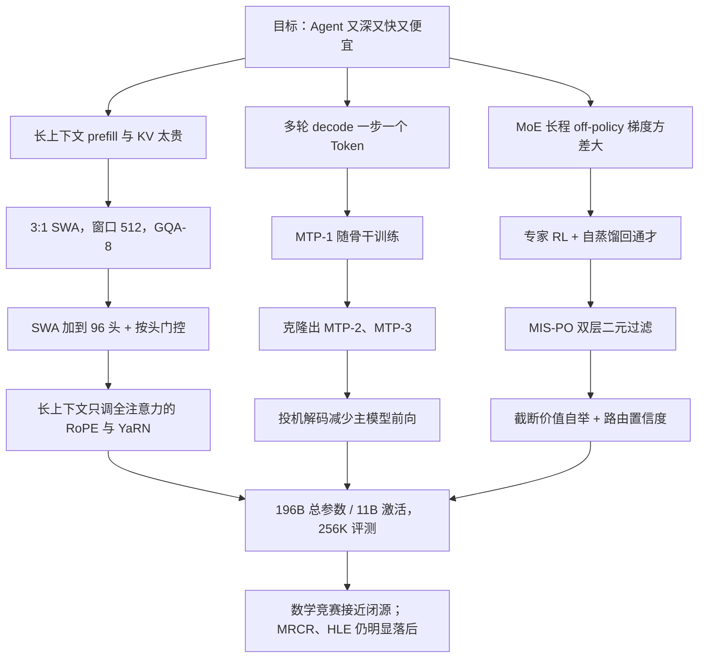

# Step 3.5 Flash：Agent 既要深想，也要多轮工具调用够快够便宜

<!-- release-date: 2026-02-01 -->

> 本文依据 **Step 3.5 Flash: Open Frontier-Level Intelligence with 11B Active Parameters**（StepFun Team），arXiv:2602.10604v2，2026-02-23 修订版，共 67 页。页码均指 PDF 自身的页码。文中区分三件事：**报告明确写了什么**、**我们怎么解释或验算它**、**哪些是外部资料补充**。

## 阅读前先认识几个词

- **Token（词元）**：模型读写文本的最小单位。一个汉字、一个英文词或一个标点，都可能是一个或几个 Token。
- **KV Cache（Key-Value Cache，键值缓存）**：生成下一个 Token 时，前面每个 Token 留在显存里的 Key 和 Value。上下文越长，这块显存越大。
- **MoE（Mixture-of-Experts，混合专家）**：把前馈网络拆成很多「专家」，每个 Token 只走其中几个。总参数很大，每个 Token 真正算到的很小。
- **全注意力与滑动窗口注意力**：**全注意力（Full Attention）** 让当前 Token 看整段历史；**滑动窗口注意力（Sliding Window Attention，SWA）** 只让它看最近固定长度的一段。前者能看远，后者便宜。
- **投机解码（speculative decoding）**：先用便宜的草稿器连猜几个 Token，主模型一次前向把它们一起验证，猜对就省下几次昂贵的主模型前向。
- **MTP（Multi-Token Prediction，多 Token 预测）**：在主模型后面挂几个小模块，训练时让它们预测「再往后」的 Token；推理时它们正好当投机解码的草稿器。
- **Off-policy RL（离策略强化学习）**：用不是当前策略刚采出来的轨迹更新模型。快，但训练侧和推理侧的概率一旦对不上，梯度会被放大成噪声。

这篇报告自造或重用的三个名字，到相应章节再展开：**按头门控注意力（Head-wise Gated Attention）**、**MIS-PO（Metropolis Independence Sampling-Filtered Policy Optimization）**、**元 Token（Meta Token）**。

## 一句话先说清

Step 3.5 Flash 要解决的矛盾很具体：**Agent 既要有前沿模型的推理深度，又要在很长的上下文里多轮调用工具，还得够快、够便宜。**

聊天机器人可以慢慢想，Agent 不行。报告把 Agent 的负载形状描述为「先做很长的 prefill，再做很长、多轮的交互式 decode」，并把推理延迟抬成和智能、成本并列的第三条硬约束：延迟直接变成任务完成的墙钟时间；反过来，同样的时间预算里，更快的模型可以用测试时扩展多想几步（PDF p. 5）。

它的回答是三件互相咬合的事（PDF p. 4–7）：

1. **容量与计算脱钩**：196B 总参数，每个 Token 只激活 11B。
2. **注意力按层分工**：三层 512 窗口的 SWA 接一层全注意力（记作 $S_3F_1$），再给 SWA 层加 Query 头、给每个头加输出门，把便宜布局掉的分补回来。
3. **解码一次猜多个 Token**：挂三个轻量 MTP 模块（MTP-3），给投机解码供草稿。

后训练侧是另一件事：MoE 做长程 off-policy RL 时，训练引擎和推理引擎之间 Token 级的一点概率差，乘上很长的轨迹会变成高方差梯度，而专家路由让这种偏移更大（PDF p. 4）。报告的 **MIS-PO** 不再用概率比给梯度加权，只用它决定一个样本「留不留」（PDF p. 16–17）。

如果只记一句话：

> **给 Agent 省计算，不要平均地省：看远只交给约四分之一的层，打草稿交给三个小模块，off-policy 的风险用「这条样本留不留」而不是「乘多大的权重」来管。**

## 先看全景：模型怎么连起来

图上能读出两件事：看得远的层只占少数；MTP 模块挂在骨干之后，只用 SWA 和稠密 FFN，不走专家。关键配置放在一起（除另注外来自 Table 6，PDF p. 27）：

| 配置 | 数值 | 页码 |
|---|---:|---|
| 总参数 / 每 Token 激活参数（骨干） | 196B / 11B | PDF p. 6、27 |
| 含 MTP-3 的总参数 / 激活参数 | 198B / 13B | PDF p. 27 |
| Transformer 层 | 45（3 层稠密 + 42 层 MoE） | PDF p. 6、27 |
| 层排布 | 先导 1 层全注意力 + 11 个混合块（每块 3 层 SWA 接 1 层全注意力） | PDF p. 6 |
| 滑动窗口 | 512 | PDF p. 5、27 |
| Query 头（全注意力 / SWA） | 64 / 96 | PDF p. 27 |
| KV 头 | 8（GQA-8） | PDF p. 5、27 |
| 每头维度 | 128 | PDF p. 27 |
| RoPE 作用维度（全注意力 / SWA） | 64 / 128 | PDF p. 27 |
| 输出门 | 每个头一个标量门，作用在头输出上 | PDF p. 27 |
| 隐藏维度 / 词表 | 4096 / 128,896 | PDF p. 27 |
| MoE 专家 | 288 路由 + 1 共享，Top-8 | PDF p. 6、27 |
| 稠密 FFN / 专家中间维度 | 11,264 / 1,280 | PDF p. 27 |
| MTP | 3 个模块（SWA + 稠密 FFN），合计约 0.81B | PDF p. 7 |
| 预训练 / 中训练 Token | 约 17.6T / 750B | PDF p. 13 |
| 上下文 | 中训练扩到 128K；评测用 YaRN 扩到 256K | PDF p. 14、23 |

有三个数字值得一开始就看清楚。

**第一，全注意力一共 12 层。** 先导 1 层加 11 个混合块各 1 层，SWA 共 33 层（PDF p. 6）。12 / 45 = 26.7%，略多于「四分之一」（本文算术）。长序列上的 KV Cache 主要由这 12 层决定，因为 SWA 层只需留最近 512 个 Token。

**第二，11B 激活参数几乎全在专家和注意力上。** Table 6 注明激活参数按 Token 计、不含 embedding 与输出矩阵（PDF p. 27）。我们用 Table 6 的形状粗算：每个专家三套 4096 × 1,280 矩阵约 15.7M，42 层 ×（8 路由 + 1 共享）约 5.9B；注意力按 12 层 64 头、33 层 96 头、8 个 KV 头、头维 128 估，约 4.5B；3 层稠密 FFN 约 0.4B；合计约 10.8B，与报告的 11B 对得上。

**第三，MTP 的参数账在报告里对不齐。** 正文说三个 MTP 模块只加 0.81B、约占 0.41%（PDF p. 7）；Table 6 却写含 MTP-3 为 198B 总参数、13B 激活（PDF p. 27）。196 + 0.81 与 198 差了一截，报告没有说明口径。官方权重仓库 README 写的是「196.81B（196B 骨干 + 0.81B 头）」（外部补充），与正文一致。下文讲 MTP 以正文的 0.81B 为准。

## 第一层矛盾：Agent 的账和聊天不一样

报告开篇把差距定在两处：开源模型在复杂推理上仍落后闭源前沿；更麻烦的是，长上下文 Agent 任务的效率瓶颈让它们很难真用起来，更不必说放到边缘或资源受限的机器上（PDF p. 4）。

把 Agent 的一次任务拆开，是三笔账叠在一起：

- **注意力随长度平方增长。** 全注意力里每个 Token 都要和前面所有 Token 比一次；SWA 把可看范围固定在 $W$ 个，单层代价从 $L^2$ 量级变成 $L \times W$。工具返回的网页、终端输出、代码 diff 不断追加进上下文，超长是常态。
- **KV Cache 随长度线性增长。** 全注意力层要缓存全部历史；SWA 层只留最近 $W$ 个 Token，上下文再长也不涨。多会话并发时，显存被历史迅速吃光。
- **解码受带宽限制。** 自回归解码一次前向只出一个 Token，算术强度很低。报告的判断是：在带宽受限的硬件上，**验证效率**才是解码侧的主导杠杆，所以架构必须和投机解码合得来（PDF p. 5）。

报告据此在三条相互耦合的轴上做协同设计：注意力（加速长上下文，并与 MTP 合得来）、稀疏 MoE（防止分布式部署里出现拖慢吞吐的掉队者）、MTP（通过投机解码加速生成）（PDF p. 5）。它还把整模规模压在 200B 以下，好在高端工作站 128GB 内存里跑（PDF p. 6）。

## 核心设计一：选滑动窗口，不选线性注意力

### 旧问题：长上下文要线性代价，草稿树还要能并行验证

线性注意力和 SWA 都能把复杂度降到线性。区别在推理侧。线性注意力把历史压进一个固定大小的状态，每来一个 Token 就更新一次；投机解码需要生成一棵草稿树并**并行**验证，状态更新式的机制让这件事变得别扭。SWA 保留标准注意力的语义，并行验证只要对 KV 做掩码即可（PDF p. 5）。

报告的原话式判断是：在缺少「线性注意力对 Agent 长上下文建模更好」的有力证据时，他们选 SWA，并认为窗口 $W = 512$ 在 kernel 效率和捕捉局部依赖之间比较均衡（PDF p. 5）。

**这是工程判断，不是消融结论。** 报告没有拿线性注意力做对照表；消融里窗口固定为 512，没有扫描别的窗口大小（PDF p. 8）。

### GQA-8：把硬件拓扑写进架构

所有注意力层都用 8 个 KV 头，为的是让 KV Cache 的切分对齐 8 卡服务器上的 8 路张量并行（PDF p. 5）。报告还点出一个副作用：GQA-8 让注意力更吃显存带宽，也就留出了计算上的空档，可以吸收投机解码的草稿与验证开销，而不按比例增加延迟（PDF p. 5）。

我们的解释是：这是故意把注意力推向带宽瓶颈，让「一次验证多个 Token」变得相对划算。报告没有给出开 / 关投机解码的端到端延迟对照，所以「不按比例增加延迟」是设计意图，不是本文能核实的实测。

### 可迁移启发

- **选稀疏注意力时，先问它能不能和投机解码一起工作。** 线性复杂度不是唯一目标。
- **KV 头数可以按硬件拓扑定。** 8 个 KV 头对齐 8 卡，是把部署形态写进了架构。

## 核心设计二：朴素 3:1 会掉分，加头和按头门控把它补回来

### 旧问题：窗口层一多，质量就掉

报告承认，最初的实验里朴素交错布局在各类基准上一致地不如全注意力基线（PDF p. 7）。验证在一个 30B 总参数、3B 激活的 MoE 上完成：约 1.4T Token 预训练（30B warmup + 1T 主训练 + 300B cooldown + 100B 长上下文），再做 SFT；窗口固定 512、关掉 MTP，只改注意力布局（PDF p. 8、29）。

Table 1（PDF p. 8）：

| 布局 | SWA 头数 | 相对 FLOPs（decode / prefill） | 预训练均分 | Reasoning | Math | Code | Sci | General | LongCtx | 下游均分 |
|---|---:|---:|---:|---:|---:|---:|---:|---:|---:|---:|
| 全注意力 $FFFF$ | 32 | ≈ 2.68 / 2.90 | 54.1 | 40.8 | 40.9 | 19.6 | 42.7 | 26.5 | 28.8 | 33.2 |
| $S_1F_1$ | 32 | ≈ 1.58 / 1.65 | 54.6 | 42.1 | 42.3 | 19.3 | 44.5 | 26.8 | 29.6 | 34.1 |
| $S_3F_1$ | 32 | 1.00 / 1.00 | 53.6 | 40.2 | 40.4 | 18.9 | 42.4 | 25.4 | 27.5 | 32.5 |
| $S_3F_1$ + 加头 | 48 | ≈ 1.01 / 1.02 | 55.7 | 40.6 | 40.3 | 18.3 | 44.0 | 26.0 | 28.2 | 32.9 |

相对 FLOPs 以 $S_3F_1$ 为 1，对 64K 和 256K 取平均（PDF p. 8 表注，数值见 p. 28 Table 8 的 30B-A3B 部分）。

读这张表要跟着报告的逻辑走：

- **朴素 $S_3F_1$ 最便宜，也最差。** LongCtx 从 28.8 掉到 27.5，下游均分从 33.2 掉到 32.5（PDF p. 8）。附录 Table 10 把预训练拆开：BBH 从 66.0 掉到 61.7，MMLU-Pro 从 35.7 掉到 33.7（PDF p. 31）。
- **$S_1F_1$ 质量最好**，下游均分 34.1、LongCtx 29.6，但注意力侧开销比 $S_3F_1$ + 加头高约 60%（PDF p. 8）。
- **正式选择是 $S_3F_1$ + 加头。** 预训练均分 55.7，已超过全注意力的 54.1；下游 LongCtx 回到 28.2，Sci 从 42.4 升到 44.0；剩下的缺口集中在 Code，18.3 对全注意力的 19.6（PDF p. 8）。

也就是说，**报告明确选择了「便宜很多、长上下文略逊于 $S_1F_1$」的一侧**，理由是 Agent 负载的 prefill / decode 成本（PDF p. 8）。这是写出来的取舍，不是全面更好。

正式模型规模下的相对 FLOPs 见 Table 8（PDF p. 28），以 64 个 SWA 头的 $S_3F_1$ 为 1：

| 布局 | SWA 头 | decode 64K / 256K | prefill 64K / 256K |
|---|---:|---|---|
| $S_3F_1$ | 64 | 1.00 / 1.00 | 1.00 / 1.00 |
| $S_3F_1$ + 加头 | 96 | 1.02 / 1.01 | 1.08 / 1.04 |
| $S_1F_1$ | 64 | 1.18 / 1.47 | 1.38 / 1.71 |
| 全注意力 | 64 | 1.51 / 2.33 | 2.07 / 3.00 |

序列越长，3:1 相对全注意力越划算：256K prefill 上全注意力是 3 倍，而加到 96 头只让 $S_3F_1$ 变成 1.04 倍。报告称加头「几乎是免费的午餐」（PDF p. 7）。

### 为什么加 Query 头几乎不贵

SWA 层 Query 头从 64 加到 96，KV 头仍是 8 个，Query 对 KV 的比例变成 12。附录 A.2 说，即便算上 MTP-3，这个比例仍让 SWA 停在 IO 瓶颈区，所以 FLOPs 略涨、延迟几乎不涨（PDF p. 28）。

Table 7 是带 MTP-3 的模拟结果（PDF p. 28）。正式模型 256K decode 的相对延迟：96 头无门控 1.00，96 头加门控 1.00；256K prefill 的相对延迟：1.03（只加头）与 1.05（加头加门控）。

我们的解释：窗口被卡死后，多出来的 Query 头只增加固定大小的局部计算，不随上下文膨胀；全注意力层不敢这么加，因为它的计算随 $L$ 增长。表征力被加在了便宜的那一侧。

### 按头门控：给窗口一个「这一头什么都不看」的出口

softmax 有个老问题：窗口里没有一个 Token 对当前 Query 有用时，权重仍得加起来等于 1，噪声被强行灌进输出。全注意力层常把无处可放的注意力堆到序列开头的 Token 上，即文献里的 attention sink；窗口层看不到序列开头，连这个「垃圾桶」都没有（PDF p. 7）。

前人的办法是在窗口里放一个可学习、与输入无关的 sink token（PDF p. 7）。Step 3.5 Flash 换成**按头门控注意力**：每个头一个随输入变化的标量门，乘在该头的输出上，报告把它看成「数据相关的 sink token」（PDF p. 7、27–28）。

先按普通注意力算出第 $i$ 个位置某个头的输出 $\mathbf{y}_i$，再乘门。为避免原文式 5 与式 6 里 $g_i$ 一会儿指门值、一会儿指门的 logit，下面把 logit 单独记作 $\ell_i$：

$$
\ell_i = \mathbf{w}_{\text{gate}}^{\top} \mathbf{x}_i,
\qquad
\mathbf{o}_i = \sigma(\ell_i)\, \mathbf{y}_i
$$

$\mathbf{x}_i$ 是该位置的输入表示，$\sigma$ 是 sigmoid，$\mathbf{w}_{\text{gate}}$ 是这个头可学习的门控向量（PDF p. 28，式 5）。把 $\sigma(\ell) = 1 / (1 + e^{-\ell})$ 代进去，输出等价于（PDF p. 28，式 6）：

$$
\mathbf{o}_i = \sum_j \frac{\exp(s_{i,j})}{Z_i + e^{-\ell_i} Z_i}\, \mathbf{v}_j
$$

$s_{i,j}$ 是注意力打分，$Z_i$ 是普通 softmax 的分母。多出来的 $e^{-\ell_i} Z_i$ 就是一份「吸走注意力、但不对应任何 Value」的 sink 质量。$\ell_i$ 很负时它很大，这个头几乎不发言；$\ell_i$ 很大时它趋于 0，退回普通注意力。和固定 sink token 的区别是：固定 sink 对所有输入一视同仁，这里每个头、每个位置按当前输入自己决定丢掉多少。

对照在 100B 总参数、10B 激活的 MoE 上做，布局固定为 $S_3F_1$、$W = 512$，预训练约 250B Token，只换 sink token 还是按头门控（PDF p. 8–9、29）。Table 2（PDF p. 9）：

| 方法 | BBH | MMLU | GPQA | MBPP | C-EVAL | CMMLU | 均分 |
|---|---:|---:|---:|---:|---:|---:|---:|
| Sink Token | 70.6 | 65.1 | 27.2 | 61.2 | 76.2 | 74.6 | 62.5 |
| 按头门控 | 73.7 | 67.0 | 28.1 | 62.6 | 77.9 | 77.1 | 64.4 |

六项全部上升，正文写作 62.46 → 64.43（+1.97）（PDF p. 9）。门控在 FLOPs 和延迟上几乎没有增量（Table 7，PDF p. 28）。

### 代价与边界

- **代理模型不是正式模型。** 布局结论来自 30B-A3B、1.4T Token；门控结论来自 100B-A10B、约 250B Token，且只做了预训练评测，没有走 SFT（PDF p. 9、29）。
- **$S_1F_1$ 的质量更好。** 如果任务更吃长上下文检索而不是吞吐，这张表其实支持更密的全注意力。
- **门控「可以看成 sink」是公式等价，不是注意力图分析。** 报告没有给出门值分布或它实际吸收了多少注意力。

### 可迁移启发

- **混合注意力的质量缺口，可以用只加在窗口层上的容量去补**，不必回到全注意力。
- **截断候选集合时，给模型一个输入相关的「不选」。** 固定 sink 能用，按头门控在 100B 实验里更好，而且几乎不花钱。
- **层比例是产品决策。** 同一张表里 $S_1F_1$ 更准、$S_3F_1$ + 加头更便宜，报告为 Agent 的账单选了后者。

## 核心设计三：MTP-3，一次前向覆盖四个位置

### 旧问题：自回归一步只走一个 Token

Agent 的多轮工具调用把解码步数乘了起来。投机解码需要一个分布接近主模型、又足够便宜的草稿器；外挂的独立草稿模型要单独训练、单独对齐。

### 新设计：三个轻量模块，主训练只负担一个

每个 MTP 模块是一层门控 SWA 加一个稠密 FFN，三个合计约 0.81B（PDF p. 7）。按预测偏移编号：主 LM 头预测 $x_{t+1}$，MTP-$h$（$h \in \{1,2,3\}$）预测 $x_{t+1+h}$，一次前向因此覆盖接下来四个位置（PDF p. 7）。

训练开销靠两件事压住（PDF p. 6–7）：

1. **大部分阶段只激活并优化 MTP-1。** 骨干训好后，再把 MTP-2、MTP-3 从 MTP-1 初始化，在一段轻量后训练里联合训练。
2. **按预测距离重加权损失**（借鉴 Fast-MTP），避免把力气花在越远越难、也越不值的预测上。

MTP 损失权重在预训练第一阶段是 0.3，此后（预训练第二阶段、中训练、SFT）都是 0.1（PDF p. 15–16）。

### 收益：报告只给了服务速度，没给接受长度

引言说，这套架构在 OpenRouter 上线第一周于 Hopper GPU 上维持约 170 tokens/s（PDF p. 4）。正文没有给出投机解码的平均接受长度，也没有「关掉 MTP」的对照；附录的速度表是在假定 MTP-3 开着的前提下做的理论 FLOPs 与模拟延迟（PDF p. 28）。

外部补充：官方博客写「典型用量 100–300 tok/s，单流代码任务峰值 350 tok/s」（[官方博客](https://static.stepfun.com/blog/step-3.5-flash/)），这是产品页的说法，不是 PDF 里的实验。

### 可迁移启发

- **草稿器可以就是训练目标的一部分。** 先用 MTP-1 付训练成本，上线前再克隆出更长的草稿链。
- **越远的 Token 越不值得同等加权。** 位置相关的重加权承认了 MTP 的价值主要在近处几个位置。

## 稀疏 MoE：容量留下，掉队者不要出现

每层 288 个路由专家加 1 个共享专家，每个 Token 走 Top-8（PDF p. 6）。

专家并行（Expert Parallelism，EP）把专家拆到不同 GPU 上。路由一偏斜，少数专家所在的卡就成了掉队者，同步点上所有人等它（PDF p. 6）。报告用两层均衡（PDF p. 7）：

- **无辅助损失的负载均衡（loss-free load balancing）**：用偏置调节全局 Token 分配，不往损失里加一项抢梯度。它保证全局均衡，但不保证每个 EP rank 在微批次级别均衡。
- **EP 组均衡损失**：把专家按 EP rank 分成 $G$ 组，只要求「每张卡上的专家总负载」接近。

记 $p_e$ 为专家 $e$ 的平均路由概率、$f_e$ 为它被 Top-$K$ 选中的归一化频率，按组求和得到 $p_g$、$f_g$，损失是（PDF p. 7，式 1）：

$$
\mathcal{L}_{\text{EP}} = G \sum_{g=1}^{G} f_g\, p_g
$$

它的形状和经典的专家级均衡损失一样，只是粒度从单个专家换成了一张卡。

预训练中，loss-free 的偏置更新率在前 14.6T Token 是 0.001，退火阶段衰减到 0；EP 组损失系数全程 0.001（PDF p. 15）。中训练起冻结路由器权重、关掉 EP 组损失，SFT 同样如此（PDF p. 15–16）。我们的解释：专家分工定型之后，再强行拉平会破坏已学到的路由。

## 基础设施：4096 张 H800 上的 Steptron

集群是 4,096 张 NVIDIA H800；节点内 8 卡走 NVLink 与 NVSwitch，节点间是 8 × 200 Gbps RoCE（PDF p. 9）。训练框架 Steptron 基于 PyTorch 与 Megatron-LM，预训练、后训练与 RL 共用一套栈（PDF p. 9）。

并行方式：8 路流水线并行（带虚拟流水线阶段）、8 路专家并行、ZeRO-1 数据并行；注意力与 MoE 使用各自独立的并行组，梯度在各自的数据并行组里归约（PDF p. 9）。报告给出的几项工程收益（PDF p. 9–10）：

- **通信调度**：把数据并行通信拆成节点内 NVLink 与节点间 RoCE 两段流水起来，再按作业级通信画像摆放 rank、避开交换机热点，两项合计让迭代时间最多降约 5%。
- **Muon 与 ZeRO-1 的冲突**：Muon 需要完整、未切分的梯度做正交化，ZeRO-1 却把梯度切到各 rank。Megatron-LM 现有实现是全量 all-reduce FP32 梯度，通信近乎翻倍。Steptron 只对专家参数做「整个参数归一个 rank」的重排，非专家参数仍用 all-reduce；相对朴素做法，迭代时间约降 5%，多占不到 4 GB 显存。
- **算子融合**：注意力里 QK 归一化与 RoPE 融合；MoE 里融合小算子，并把 gather / scatter 与 grouped GEMM 打在一起，做法类似 SonicMoE。
- **细粒度选择性重计算**：可以按层、按子模块开关。

监控是下一节稳定性的前提。4,096 卡的作业每个 iteration 产生近 600 万条指标消息，在主循环里做同步规约会多出数秒，相当于把 iteration 时间翻倍。报告的做法是每个 rank 通过自研异步通信框架 StepRPC 把指标丢给独立的 Metrics Server，开销降到每 iteration 约 100 毫秒；服务端收齐所有 rank 的 iteration 结束信号后才规约、落库（PDF p. 10）。

Steptron、StepRPC 都未开源，报告也没有给出端到端 MFU。能迁移的是「微批次级的专家指标必须离开训练主路径」这条原则。

## 预训练稳定性：损失曲线平滑，不等于专家内部没在炸

引自原文 Figure 3（PDF p. 11）。曲线未平滑、未抽稀；①–③ 是全局 batch 加到 8,192、12,288、16,384，④ 是开始对元 Token 做损失掩码。图只画到学习率冷却之前，横轴约 14T，不是全部 17.6T。④ 处损失向上跳了一小截，读自原图；我们的解释是容易预测的元数据不再计入损失均值，均值自然抬高。

报告说整段预训练只有一次瞬时尖峰（PDF p. 4、11）。它总结了三种主导失稳，都要靠微批次级日志才能早发现（PDF p. 11）。

### 失稳一：Muon 的数值过敏

Muon 用 Newton–Schulz 迭代把二维权重的更新方向近似正交化。报告改用收敛更快的 Polar Express，固定 $T = 6$ 步（PDF p. 11）。即便用了推荐的安全缩放，仍偶发不可恢复的尖峰；它们不确定，从邻近检查点恢复常常就避开了，说明是数值病理而不是数据或学习率问题。模拟显示，bfloat16 的 Polar Express 在某些更新统计下会因累加误差冒出极端中间值。处理办法是**只把 Polar Express 迭代（状态与中间量）改成 float16**，其余仍用混合精度；改完尖峰不再出现（PDF p. 11–12）。

报告没有给出改精度前后的质量对照。可迁移的是：优化器里对精度最敏感的那一小段可以单独隔离处理，不必整体升精度。

### 失稳二：专家死亡，不一定是路由死亡

前作 Step-3 把「死专家」主要理解成长期分不到 Token。这次报告指出另一种形态：路由分发统计看起来健康，专家激活却在消失、参数范数停滞或衰减（PDF p. 12）。两个因素特别重要（PDF p. 12）：

1. **有共享专家时，路由专家的聚合要显式缩放。** 小模型也许能自己学会共享与路由的相对贡献，大模型不可靠；比例不对，即使路由频率正常，路由专家的有效贡献也会被压掉。
2. **细粒度稀疏下，微批次级负载均衡可能过严。** Switch 式的微批次均衡会在专家之间制造过度竞争、妨碍分化；报告更倾向全局 batch 统计或按观测负载调偏置。

建议的监控是专家侧信号：MoE FFN 中间激活的 RMS / 均值范数、专家投影矩阵的 Frobenius 范数；部分专家滑向近零而中位数稳定（min-to-median 下降）就是预警（PDF p. 12）。这一节是作者经验与建议，没有「死专家数量随时间变化」的数据。

### 失稳三：局部激活爆炸，损失上完全看不出来

引自原文 Figure 4（PDF p. 13）。实线是最大专家输出范数，虚线是中位数。

专家开始分化后，深层 MoE 会出现另一种病：一层里通常只有一两个专家的激活范数迅速变大，中位数不动，最大值爆炸，数值溢出风险上升（PDF p. 12）。图 (a) 说明这件事被训练损失完全掩盖；图 (c) 说明它集中在最后几层。报告因此把「每专家激活范数的 max-to-median 比」定为必要的稳定性指标（PDF p. 13）。

两种干预（PDF p. 12）：

- **权重裁剪**：对专家投影矩阵 $W$，若 $\max_x \|W x\|$ 超过阈值 $\tau$，就把 $W$ 乘以 $\tau / \max_x \|W x\|$。类似注意力里的 MuonClip，但在检查点上离线做。
- **激活裁剪**：在输出投影之前，对 MoE FFN 的中间激活逐元素裁剪。

图 (c) 上权重裁剪之后范数很快重新爬升，激活裁剪则把它钉住，报告因此选激活裁剪（PDF p. 13）。

附录 B 给了一条机制解释，属于作者分析，不是单独的因果实验（PDF p. 30–32）：

1. 高频 bigram 让某个细粒度专家专职预测「第二个 Token」，负载均衡管不到这么窄的分工，这成了一条捷径。
2. Pre-norm 结构下最终表示是各层输出之和再过 RMSNorm；一个专家只要把输出无限放大，归一化后预测就只由它决定（PDF p. 31，式 9–10）。
3. SwiGLU 里 gate 与 up 两支若高度对齐、能量集中在极少维度，逐元素乘积会造出极端幅度；权重衰减压不住，因为幅度来自对齐而不是权重变大。这也是报告偏好激活裁剪的原因（PDF p. 31）。
4. 这类专家的梯度低秩且方向稳定。Muon 丢掉梯度幅度、持续正交化，使更新更激进；Adam 的 $\epsilon$ 反而会滤掉过小的梯度（PDF p. 32）。

报告用一个检查支持第 1 条：把路由器 embedding 直接喂给异常专家，其输出分布与真实数据、与整网行为一致（PDF p. 32）。

### 元 Token：先让模型读标签，再停止预测标签

附录 A.3 给每个训练样本前面拼一段人读得懂的元数据：内容类型（Code / Book / Paper / Web）、语言、领域、来源（PDF p. 29）。约前 3.8T Token 对整段序列算损失；之后元数据留在上下文里，但这些位置不再进损失，优化压力全部给正文（PDF p. 29，式 7–8）。报告的假设是：到这时模型已经学会把元数据当条件用。报告没有「有 / 无元 Token」的对照。

### 这一节可以带走什么

- **损失平滑时仍要看深层专家的 max-to-median。** 爆炸被损失完全掩盖，这一点有 Figure 4 (a) 直接支持。
- **把「路由健康」和「专家健康」分开看。** 路由统计稳定不代表专家在工作。
- **对精度敏感的小段迭代单独处理。**

## 训练课表：从开放域走到软件工程，再把窗口拉到 128K

整体顺序是：4K 开放域 → 退火并加大代码与 PR / Issue / Commit 比重 → 32K 初始化 → 中训练 32K 专业化 → 扩到 128K（PDF p. 13–14）。

| 阶段 | Token | 上下文 | 做什么 | 页码 |
|---|---:|---|---|---|
| 预训练阶段一 | 14.6T | 4K | 开放域覆盖 | PDF p. 14 |
| 预训练阶段二 | 3T（2T @ 4K + 1T @ 32K） | 4K → 32K | 退火：偏向代码与 PR / Issue / Commit，提高高质量知识与推理密度 | PDF p. 14 |
| 中训练阶段一 | 386B（含回放预训练数据 81B，占 21%） | 32K | 偏向软件工程与工具使用 | PDF p. 14 |
| 中训练阶段二 | 364B（含回放 10.5B） | 128K | 合成长程推理、长度超过 32K 的自然长文档、代码 / 搜索 Agent 与工具使用数据 | PDF p. 14 |

两段预训练合计 17.6T，两段中训练合计 750B，与第 4.2 节开头一致（PDF p. 13）。**报告内部有一处数字不一致**：引言说在「17.2T」高质量 Token 上稳定训练（PDF p. 4），课表写约 17.6T（PDF p. 13）。报告没有解释差别。

### 关键超参

- 全程 Muon，权重衰减 0.1，梯度裁剪 1.0（PDF p. 15）。
- 学习率：前 2,000 步从 0 线性升到 $2.5 \times 10^{-4}$，阶段一余弦降到 $5 \times 10^{-5}$；阶段二的 4K 部分再余弦降到 $2 \times 10^{-5}$，32K 部分保持 $2 \times 10^{-5}$（PDF p. 15）。中训练前 3% 步从 0 升到 $2 \times 10^{-5}$，阶段一保持，阶段二降到 $7.3 \times 10^{-6}$（PDF p. 15）。
- 全局 batch：前 400B Token 从 4,096 加到 16,384，此后保持；退火的 32K 部分改为「2k」（原文写法，没有写死是 2,048 还是 2,000）（PDF p. 15）。
- RoPE 基频（PDF p. 15–16）：4K 阶段全注意力与 SWA 都是 $\theta = 10{,}000$；32K 起只把全注意力改成 $\theta_{\text{Full}} = 1{,}000{,}000$，128K 时再加到 $5{,}000{,}000$；SWA 始终是 10,000。评测 256K 时 YaRN 缩放因子 2.0，**只加在全注意力层**（PDF p. 23）。

我们的解释：窗口只有 512，SWA 不需要为长上下文改基频。长上下文扩展只动看得远的那几层，这和混合注意力的分工是同一件事。

### 数据：为 Agent 准备了什么

报告没有公开各来源配比，只描述了几条管线（PDF p. 13–14、32–35）：

- **通用知识**：自研 StepCrawl，在 Common Crawl 之外抓网页与 ePub / PDF 类文档。站点与 URL 选择用 WebOrganizer 式的模型在线过滤 SEO 低质页、平衡站点类别，规模约每天 10 亿页，遵守 robots.txt（PDF p. 32）。质量分层用六个轻量打分器的集成，保留 High / Medium-High / Medium；书与论文在退火阶段只留最高两档。中英文网页做 embedding 后 k-means（10 万以上簇）下采样过大簇（PDF p. 33）。
- **代码**：改过的 OpenCoder 规则。按文档触发的启发式违规「命中数」分层，只留命中 0 会过剪、完全不过滤又太噪，内部消融认为命中 0–6 最好（PDF p. 33）。
- **PR / Issue / Commit**：来自 10 星以上的 GitHub 仓库，形成约 500 万样本的基础集，严格对 SWE-Bench Verified 与 Multilingual 去重（PDF p. 33–34）。衍生出四块：基础变更数据（小部分用 git diff 校验，覆盖 20 多种主流语言）；**90B Token 的拼接 PR 对话**，用 Agentless 式的「定位文件」与「SEARCH/REPLACE 修复」两个模板，退火阶段只掩码模板骨架，中训练改成对话并掩码用户提示；**约 12B Token 的改写数据**（推理过程重建与「主动阅读笔记」），用于中训练；以及数十万条可执行环境种子（PDF p. 34）。
- **数学与 STEM**：在 Common Crawl 之外用 StepCrawl 收了「数千亿」数学相关 Token，另有 1 亿条习题、测验与教学内容，覆盖 K-12 到 CPA、法考（PDF p. 34）。
- **数据消融的代理模型是 30B-A3B**。报告认为更小的代理容易偏向重复数据、记不住长尾，这个规模更贴近全量趋势（PDF p. 35）。

能迁移的是课表形状：先开放域，再在退火与中训练把软件工程与工具使用的比重抬上去，同时把窗口拉长。

## 后训练：先养一群专家，再蒸馏回一个通才

后训练要同时处理两件事：一个通才直接覆盖所有领域会牺牲专长，每个领域长期养一个专家又付不起持续迭代的成本；同时 MoE 的长程 off-policy RL 不稳（PDF p. 4、15）。报告的流程分两段，并称与 GLM-4.5 等前作类似（PDF p. 15）：

据第 5 节正文重画的流程示意（PDF p. 15–16）。

第一阶段 SFT 覆盖数学、代码、STEM、逻辑、通用问答、代码 Agent、工具使用、搜索 Agent 与长上下文，做了难度感知过滤与配比（PDF p. 15）。Table 3 给出构成（PDF p. 19）：

| 领域 | 条数 | Token | Corpus Contribution（原文列名） |
|---|---:|---:|---:|
| Math | 68,055 | 0.98B | 11.19% |
| Code | 86,421 | 1.23B | 21.10% |
| STEM | 120,399 | 0.55B | 6.31% |
| Logic | 93,323 | 0.81B | 13.87% |
| General | 314,495 | 0.80B | 9.16% |
| Code Agent | 37,240 | 0.90B | 17.70% |
| Tool-use | 114,507 | 0.76B | 8.72% |
| Search Agent | 20,256 | 0.50B | 8.75% |
| Long Context | 15,565 | 0.70B | 4.00% |
| 合计 | 870,687 | 7.23B | 100.00% |

读这张表要注意：**最后一列不是 Token 占比。** 按 Token 列算，Code 是 1.23 / 7.23 ≈ 17%，表里却写 21.10%；九行百分比相加是 100.80%，不是 100%（本文算术）。报告没有定义这一列的口径。只看 Token 列，代码加代码 Agent 约 2.1B、占 29%，通用对话条数最多但 Token 不多。

第二阶段 SFT 只做一件事：用分布外的推理信号提高推理密度，注入约 3 万条专家级化学轨迹与合成算术，3 个 epoch（PDF p. 15）。

之后在七个领域做专家 RL，再让专家在与第一阶段 SFT 共享的提示分布上生成轨迹，用拒绝采样去掉中英混杂、过度思考等模式，蒸馏进一个**从中训练检查点重新初始化**的学生。报告认为这比直接把专家 RL 拼进通才更稳，也能减轻后续 RL 的优化负担（PDF p. 15–16）。

SFT 超参：Muon，3% warmup，余弦从 $1.0 \times 10^{-5}$ 降到 $5.0 \times 10^{-6}$；冻结路由器、关掉 EP 组损失；MTP 权重 0.1；全局 batch 32，全局序列长度 128K（PDF p. 16）。数据统一清洗：规则过滤（重复、有害内容、个人信息）、模型过滤语言混杂，再对评测集做精确匹配（数字掩码）与 N-gram 去污染（PDF p. 35）。

## 核心设计四：MIS-PO，用「留不留」代替「乘多大」

### 旧问题：长轨迹上的重要性权重会爆炸

RL 要优化策略 $\pi_\theta$，让整条轨迹 $\tau = (s_0, a_0, \ldots, s_T)$ 的终端奖励变大，$a_t$ 是状态 $s_t$ 上生成的 Token（PDF p. 16）。

不稳定来自两处叠加：高吞吐推理引擎和训练框架的实现不一致；迭代更新让采样用的策略落后于正在更新的策略。Token 级的一点概率偏移，在很长的推理链上累积成噪声很大的梯度（PDF p. 16）。PPO 一类方法用截断后的连续概率比缩放梯度，比值一旦偶尔极端，梯度范数就尖刺。

### 新设计：推理策略当提案，训练策略当目标，只留够近的样本

名字来自 **Metropolis 独立采样（Metropolis Independence Sampling）**：把推理引擎上的策略 $\pi_{\theta_{\text{vllm}}}$ 当提案分布，训练策略当目标分布，只保留离目标足够近的样本，并把留下的当作 on-policy（PDF p. 16）。

定义指示函数 $\mathbb{I}(x) = \mathbf{1}[\rho_{\min} \le x \le \rho_{\max}]$，用在两个粒度（PDF p. 17）：

- **Token 级**看 $x_t = \pi_{\theta_{\text{old}}}(a_t \mid s_t) / \pi_{\theta_{\text{vllm}}}(a_t \mid s_t)$，分子是训练侧更新前的策略，分母是推理侧的采样策略；
- **轨迹级**看逐 Token 比值的几何平均 $\bar\rho(\tau) = \left(\prod_t x_t\right)^{1/T}$，整条漂远就整条丢掉。

Actor 损失把连续权重换成两道离散掩码（PDF p. 17，式 2）：

$$
\mathcal{L}_{\text{actor}} = -\,\mathbb{E}_{\tau \sim \pi_{\theta_{\text{vllm}}}}\!\left[\, \mathbb{I}(x_t)\cdot \mathbb{I}\big(\bar\rho(\tau)\big) \cdot \log \pi_\theta(a_t \mid s_t) \cdot \hat A_t \right]
$$

两组界是：Token 级 $[0.5, 2]$，轨迹级 $[0.996, 1.001]$（PDF p. 19）。

轨迹级的界窄得惊人，但放在 Figure 7 (b) 旁边看就讲得通：MoE 实验里 MIS-PO 训练时 $\pi_{\theta_{\text{old}}}/\pi_{\theta_{\text{vllm}}}$ 的均值一直在约 0.9975（读自 PDF p. 37 图）。也就是说，正常轨迹的几何平均本来就贴着 1，这道门拦的是整段的系统性偏移；单个 Token 允许偏到 0.5–2，但偏差不能在整条上累积（后半句是我们的解释）。

### 实验怎么证明

引自原文 Figure 7 (b)（PDF p. 37）。

报告有三组对照，全部来自**内部模型**，不是 Step 3.5 Flash 正式训练：

- **对 PPO**（Figure 5，PDF p. 16）：约 5,000 步，MIS-PO 奖励平台更高、actor 梯度范数几乎没有 PPO 那种尖刺、熵下降更慢。
- **对 GSPO**（Figure 7，PDF p. 37）：GSPO 把 Token 级比值换成轨迹几何平均再截断，是降方差的有力基线。报告把它接到 actor-critic 上，并**同样加上 MIS-PO 的两道掩码**以求公平；截断系数在 $\{1,2,3,4\} \times 10^{-4}$ 里网格搜索，取 $10^{-4}$，截断比例约 15%（PDF p. 37–38）。稠密模型上 GSPO 也能压住梯度方差，但同样步数下奖励和「All Accept Ratio」都不如 MIS-PO；MoE 上 GSPO 约 200 步就停滞，训练 / 推理偏差越拉越大（上图）。
- **长程运行**（Figure 8，PDF p. 38）：MoE 上把 MIS-PO 拉到 800 多步，奖励仍在涨，梯度范数（未平滑）平稳，熵可控。

正式模型只给了 MIS-PO 自己的 RLVR 曲线（Figure 6，PDF p. 18）：约 280 步内奖励从约 0.59 升到 0.70（读自图），相对 RL 前的下游提升为 IMO-AnswerBench 82.3 → 85.5（+3.2）、自建 CF-Div2-Stepfun-cpp 80.3 → 86.4（+6.1）、ARC-AGI-1 46.2 → 56.8（+10.6）、HLE text 19.9 → 23.3（+3.4）（PDF p. 17–18）。**这组数字与主表对不齐**：Table 5 的 IMO-AnswerBench 是 85.4、CF-Div2 是 86.1、HLE 是 23.1（PDF p. 24），Table 12 的 ARC-AGI-1 无工具是 54.8（PDF p. 40）。报告没有说明 Figure 6 用的是哪个检查点或哪套评测次数。

### 两个配套：截断不当失败，路由置信度当晴雨表

**截断感知的价值自举。** 长推理常撞上长度上限。把截断轨迹的奖励记成 0，模型分不清「没写完」和「写错了」，会被逼着缩短推理。报告改用 critic 对最后状态的估值（PDF p. 17，式 3）：

$$
\hat R_i =
\begin{cases}
V_\phi(s_T) & \text{回复被截断}\\
R_i & \text{其他情况}
\end{cases}
$$

报告称截断率高到 20% 时训练仍稳，并说消融显示它对竞赛级基准特别有用（PDF p. 17），但没有给出这组消融的数字。

**路由置信度 $\Sigma_k$。** 定义为被激活专家的平均概率质量。它低意味着路由犹豫，会放大训练 / 推理不一致。报告在初步实验里观察到一个相变：低置信度的模型很脆，需要 Router Replay 或严格 on-policy 这类重型稳定手段；高置信度的模型可以直接 off-policy（PDF p. 17）。报告没有给阈值，也没说正式模型落在哪一侧、是否用了 Router Replay。

### RL 超参与搜索 Agent 的异步训练

采样温度与 top-$p$ 都是 1.0，最大长度 128K（PDF p. 19）：

| 任务 | 每步唯一提示数 | 每个提示的回复数 |
|---|---:|---:|
| 推理 | 256 | 16 |
| 人类偏好 | 512 | 8 |
| 工具使用 | 128 | 8 |

采样完的样本切成 mini-batch 单 epoch 训练：actor 4 个、critic 12 个 mini-batch。Muon，权重衰减 0.1；actor 学习率 $2 \times 10^{-6}$、warmup 20 步，critic $5 \times 10^{-6}$、warmup 50 步；$\gamma = \lambda = 1$；最后阶段加系数 0.001 的无偏 KL 损失（PDF p. 19）。

搜索 Agent 的训练架构单独改过：早期 client–server 一步 off-policy 被长尾拖死，约 5% 的样本吃掉约 80% 的生成成本；策略对陈旧度很鲁棒，约 20 步延迟仍稳。于是改成生成与更新完全异步的 FullyAsync，同一会话固定派到同一节点以复用 KV Cache，整体约 10 倍效率（PDF p. 38）。报告还观察到：中训练里注入任务知识与工具先验后，RL 的涨幅与稳定性明显好于「从零 RL」（PDF p. 38）。

### 代价与边界

- **过滤就是丢数据。** Figure 7 里 MIS-PO 的 All Accept Ratio 大约在 0.07–0.19 之间（读自 PDF p. 37 图）。报告没有定义这个量，也没有给出正式训练里丢掉多少样本。
- **对 PPO / GSPO 的优势来自内部模型**，正式模型只有 MIS-PO 自己的曲线。
- **实现没公开。** 几何平均在混合精度下怎么算、与 critic 如何配合，只有公式。

### 可迁移启发

- **长程 off-policy 的首要风险是权重方差，不是偏差本身。** 把连续比值改成准入门槛，方差会掉一截。
- **Token 级可以松，轨迹级必须紧。** 局部允许 0.5–2，整段几何平均几乎贴 1，限制的是误差累积。
- **截断不是失败。** 不用价值自举，模型会学着变短。
- **截断、陈旧、路由犹豫是三种不同的病**，分别用价值自举、异步粘性调度和路由置信度处理，不要混成一句「RL 不稳」。

## 奖励与数据合成

奖励分三类（PDF p. 18–19、36）：

- **可验证奖励（RLVR）**：逻辑、指令遵循、代码用规则检查器；STEM 用模型检查器 gpt-oss-120b，提示要求先查完整性、再比最终答案、再查过程，只输出 True / False（PDF p. 36）。内部模型上 450 步的消融里，STEM 用模型检查器比直接用 math-verify 平均高 2.0%（PDF p. 18）。代码在沙箱里按测试用例给软奖励（PDF p. 36）。
- **不可验证奖励**：成对的生成式奖励模型 GenRM 相对固定参考答案输出获胜置信度，再转成 Bradley–Terry 胜率；长度控制做成置信度惩罚；伪造引用、过度自信、语言不一致直接记 0。GenRM 从 SFT 模型用 RM 专用提示微调，训练用 logsigmoid 损失；另接 MetaRM 惩罚「结论对、理由编」的回复，200 步内部消融里比原版 GenRM 每项高 0.5%–3%（PDF p. 18–19）。
- **Agent 奖励**：搜索用基于实体匹配的 LLM 评分；报告生成用细则式 LLM 评委给三档（满足 / 部分满足 / 不满足），再映射成不对称的二元奖励，因为中间档常与专家偏好不一致（PDF p. 18）。

RL 数据来自开源题集与竞赛档案，**排除 2024–2026 年举办的竞赛题**防污染；另加 11–13 位整数的合成算术、为代码题补测试用例的生成器–验证器管线、谜题与指令遵循的合成环境。过滤分两步：去掉带图、带外链、没有唯一答案的开放题；再按准确率去掉太简单或退化的题（PDF p. 36）。

**工具学习：有限状态机，不靠模型瞎逛。** 报告不用随机探索或模型模拟（数据不一致、不可验证、会幻觉），而是把工具使用拆成原子意图，用有限状态机把「调用逻辑」和「参数约束」分开，走「采样—执行—验证」循环，全部在真实环境执行、用确定性反馈拒绝不合格轨迹；原子意图可组合。这样造出超过 10 万条轨迹、数十亿 Token（PDF p. 20）。状态机的定义没有公开。

**代码 Agent：把环境构建本身当能力训。** 「把仓库装到能跑测试」被当成和修 bug、加功能并列的一等能力。管线从 SWE-factory 演化，加了跨任务记忆池（检索历史上构建成功的案例当示范）和循环检测，环境构建成功率 40%；构建轨迹里的瞬时失败和冗余执行会被抽象、掩码掉。报告观察到双向迁移：会建环境让编码更快，在这些环境里编码又让构建更准。最终整理出 5 万个经验证的环境，覆盖 1.5 万个 GitHub 仓库、20 多种语言，另混入 SWE-smith、SWE-Gym、R2E-Gym、SWE-rebench、SETA（PDF p. 20）。

**搜索与研究 Agent：先保证「必须检索」。** 在 Wikidata5m 一类知识图上做拓扑扩展、模拟跨站浏览来造多跳问题；生成的问题拿去问 DeepSeek-R1，**不用工具就能答对的全部丢掉**；轨迹须严格遵循预设研究计划，偏离的丢弃，再用模型评委和启发式清掉口语化、时间幻觉与中英混杂（PDF p. 20–21）。

## Agent 运行时：思维痕迹留多少、工具格式用哪种

思维模板比较了三种（PDF p. 21）：

- 每轮丢掉历史思维：生成独立，但超过 100 轮的编码会话会失败；
- 全部保留：上下文很快饱和，堵住后续工具调用；
- **折中：只保留「最近一条用户指令」所触发的那段工具轨迹里的思维。** 报告说这与近期前沿模型的做法一致。

工具格式比较了 JSON 和 XML：JSON 的转义与分隔符在小模型、训练不足时容易解析失败，XML 可以平铺字符串、语法负担低，所以选 XML（PDF p. 21）。

代码 Agent 基础设施的核心是自研 Session-Router：Kubernetes 管容器生命周期，Tmux 保持交互一致，支撑数千个并发环境、状态可持久化。训练时刻意让模型接触多种交互框架：OpenHands、SWE-agent、Terminus-2，以及 Kilocode、Roocode、Claude Code，避免过拟合某一种脚手架（PDF p. 21）。

## 评测：哪些数字被实验支持，哪些口径必须一起读

### 预训练基座

Table 4（PDF p. 22）拿激活 11B 的 Base 对比激活 15B–37B、总参 309B–1043B 的开源基座。摘要读法：

| Benchmark | Step 3.5 Flash Base | MiMo-V2-Flash Base | DeepSeek V3.2-Exp Base | Kimi-K2 Base |
|---|---:|---:|---:|---:|
| 激活 / 总参数 | 11B / 196B | 15B / 309B | 37B / 671B | 32B / 1043B |
| BBH | 88.2 | 88.5 | 88.7† | 88.7 |
| MMLU | 85.8 | 86.7 | 87.8† | 87.8 |
| MMLU-Pro | 62.3 | 73.2 | 62.1† | 69.2 |
| SimpleQA | 31.6 | 20.6 | 27.0† | 35.3 |
| MATH | 66.8 | 71.0 | 62.5† | 70.2 |
| HumanEval | 81.1 | 77.4* | 67.7* | 84.8* |
| MultiPL-E HumanEval | 67.7 | 59.5 | 45.7† | 60.5 |
| C-EVAL | 89.6 | 87.9 | 91.0† | 92.5 |
| CMMLU | 88.9 | 87.4 | 88.9† | 90.9 |

\* 表示原分拿不到、按与 Step 3.5 Flash 相同条件复现；† 表示 DeepSeek 的分数引自 MiMo-V2-Flash 报告（PDF p. 22）。

报告强调的是知识密度：SimpleQA 31.6 高于 DeepSeek-V3.2-Exp Base 的 27.0，而总参数只有对方约 3.4 分之一（PDF p. 4、22）。但同一张表里 Kimi-K2 Base 的 SimpleQA 是 35.3，MMLU-Pro 比 MiMo-V2-Flash Base 低了 10.9 分，中文知识也落后 Kimi-K2 Base。「广泛有竞争力」是准确说法，不是全面领先。

### 后训练主表

Table 5（PDF p. 24）是全文最重要的一张表。**Vanilla** 是标准推理；**PaCoRe**（Parallel Coordinated Reasoning，并行协同推理）是多轮并行推理再汇总的测试时扩展，配置 $\vec K = [4,4,4,4]$，即四轮、每轮 4 条并行轨迹（PDF p. 23）。最大序列 256K，温度与 top-$p$ 1.0。pass@1 按多次生成取平均：AIME 2025、HMMT 2025 Feb. / Nov. 各 64 次；IMO-AnswerBench、LiveCodeBench、GPQA-Diamond、MultiChallenge 各 8 次；HLE 1 次；其余 4 次（PDF p. 23）。**附录与正文有一处口径冲突**：附录 E.2.1 写 IMO-AnswerBench 用 repeat@64（PDF p. 47），与正文的 8 次不一致。

**推理（Vanilla / PaCoRe）**

| 基准 | Step 3.5 Flash | 对照里值得看的格子 |
|---|---|---|
| AIME 2025 | 97.3 / 99.9 | GPT-5.2 xHigh 100.0 |
| HMMT 2025 Feb. | 98.4 / 100.0 | GPT-5.2 xHigh 99.4 |
| HMMT 2025 Nov. | 94.0 / 97.8 | GPT-5.2 xHigh 97.1* |
| IMO-AnswerBench | 85.4 / 88.8 | GPT-5.2 xHigh 86.3†，Gemini 3.0 Pro 83.3† |
| LiveCodeBench-v6 | 86.4 / 88.9 | Gemini 3.0 Pro 90.7† |
| CF-Div2-Stepfun-cpp | 86.1 / 93.3 | 自建集，Gemini 3.0 Pro 83.5* |
| GPQA-Diamond | 83.5 / 85.0 | Gemini 3.0 Pro 91.9，GPT-5.2 xHigh 92.4 |
| HLE text | 23.1 / 27.9 | Gemini 3.0 Pro 37.7†，GPT-5.2 xHigh 35.5† |
| MMLU-Pro | 84.4 / 84.8 | Gemini 3.0 Pro 90.1† |

表中 * 表示原分不可得或低于他们的复现、改报同条件复现；† 表示引自非官方来源（PDF p. 24）。数学竞赛是最强的一块；知识与科学问答（GPQA、HLE、MMLU-Pro）明显落后闭源前沿。

CF-Div2-Stepfun 是自建集：53 道 2024 年 9 月到 2025 年 2 月的 Codeforces Div. 2 题，本地评测器把原赛中的通过提交 100% 判为通过、失败提交 92.45% 判为失败；按简化规则（忽略提交时间罚分）算出的 C++ 评分是 2489（PDF p. 45–46）。报告自己说明这个评分不能直接与人类选手比较。

**代码 Agent（不用 PaCoRe）**

| 基准 | Step 3.5 Flash | 对照 | 口径 |
|---|---:|---|---|
| SWE-Bench Verified | 74.4 | Kimi K2.5 76.8，Claude Opus 4.5 80.9，GPT-5.2 xHigh 80.0 | OpenHands，最多 350 轮，4 次平均；换 SWE-agent 为 74.2，Claude Code 为 72.0 |
| SWE-Bench Multilingual | 67.4 | Kimi K2.5 73.0，Claude Opus 4.5 77.5† | 容器内存 12 GB（Verified 是 4 GB） |
| Terminal-Bench 2.0 | 51.0 | Claude Opus 4.5 59.3†，Gemini 3.0 Pro 56.9† | avg@8 = 50.98%，pass@8 = 67/89 |

口径出自 PDF p. 48–49。Terminal-Bench 的设置值得一起记：单轮输出上限 64K，上下文 256K，思维痕迹保留；超过 256K 时只保留题面和最近 50% 历史再继续；最多 200 轮、总时限 6 小时；他们按题面核对并修正了各题的 checker，整体准确率因此约 +1.5%。88.6% 的成功轨迹在 30 轮内结束，成功轨迹里 9.41% 触发过历史剪枝（PDF p. 49）。Table 16 的消融（PDF p. 49）：

| 设置 | 单轮输出上限 | 最多轮数 | 时限 | 上下文管理 | Avg@8 |
|---|---:|---:|---:|---|---:|
| 基线 | 64K | 200 | 6 小时 | 开 | 50.98% |
| 限 16K | 16K | 200 | 6 小时 | 开 | 48.03% |
| 限 16K 且不剪枝 | 16K | 200 | 6 小时 | 关 | 45.22% |
| 100 轮 | 64K | 100 | 6 小时 | 开 | 50.42% |
| 2 小时 | 64K | 200 | 2 小时 | 开 | 49.72% |

单轮输出上限影响最大：复杂任务的长推理会在输出终端命令之前耗尽 Token 预算（PDF p. 49）。

**通用 Agent**

| 基准 | Step 3.5 Flash | 对照 | 口径 |
|---|---:|---|---|
| BrowseComp | 51.6 | Kimi K2.5 60.6 | avg@3；GPT-5.2 xHigh 是 avg@1 |
| BrowseComp（带上下文管理） | 69.0 | Kimi K2.5 74.9，DeepSeek V3.2 67.6 | 见下文 |
| BrowseComp-ZH | 66.9 | GPT-5.2 xHigh 76.1* | avg@3 |
| GAIA | 84.5 | GPT-5.2 xHigh 83.5* | avg@3 |
| xbench-DeepSearch 2505 / 2510 | 83.7 / 56.3 | GPT-5.2 xHigh 83.0* / 67.0* | 两期差距很大 |
| ResearchRubrics | 65.3 | Gemini 3.0 Pro 50.1* | ReAct，最多 30 轮、每轮 16K |
| $\tau^2$-Bench | 88.2 | Gemini 3.0 Pro 90.7，Claude Opus 4.5 92.5 | 8 次平均 |

搜索类的工具集是并行 search、visit、google_scholar、python_interpreter、file；256K 上下文、不限单轮生成长度、presence penalty 1.1、最多 400 步（PDF p. 49）。

**BrowseComp 69.0 的口径。** 附录 E.2.3 写明：69.0 对应 **discard-all**，在完整 BrowseComp 上评测，「与 DeepSeek V3.2 相同」——上下文超过阈值就丢掉全部上下文、重启 Agent 循环；最多 1,000 步，阈值 BrowseComp 72K、BrowseComp-ZH 41K（PDF p. 50）。200 题子集上的 Table 17（PDF p. 50）：

| 方法 | 准确率 | 实际步数 |
|---|---:|---:|
| 不管理上下文 | 49.5% | 86 |
| + Summary | 57.0% | 131 |
| + Keep-first&last $K$ | 58.0% | 244 |
| + Discard-all | 66.0% | 302 |
| + Multi-Agent | 68.5% | 721 |

报告把 Discard-all 解释成一种测试时的 pass@$k$：逼模型从头再想，直到自己验证出一条路（PDF p. 50）。准确率与步数一起涨，本质是用计算换分。外部补充：官方博客对这个设置的描述是「超过阈值后重置上下文、重启循环」，并写「Kimi K2.5 与 DeepSeek-V3.2 用的是 discard-all」（[官方博客](https://static.stepfun.com/blog/step-3.5-flash/)），措辞与附录「69.0 就是 discard-all」不一致。本文按 PDF 附录读 69.0。把它与未开管理的闭源分数并排时，要记得左边多了一层测试时计算。

**ResearchRubrics** 有 101 个研究任务、每题 20–43 条专家细则。商业深度研究系统（2025 年 12 月 2–15 日从官方网页采集）里 Gemini DeepResearch 63.69、OpenAI DeepResearch 60.67；他们的 ReAct 是 65.3。把 Gemini 3.0 Pro 放进同一套 ReAct 只有 50.1，报告归因于检索深度不够、依赖参数知识（PDF p. 50–51）。

**$\tau^2$-Bench** 的 airline 域原始标注有错，他们改用 Claude Opus 4.5 修正过的版本；retail 与 telecom 也照 Claude Opus 4.5 的做法给用户提示加了补丁，避免用户模拟器错误结束对话；用户模型是温度 0 的 GPT-4.1（PDF p. 51）。这提高了评测可靠性，也让跨模型对比更依赖「是否用了同一套补丁」。

**通用与长上下文**（Vanilla / PaCoRe，PDF p. 24）

| 基准 | Step 3.5 Flash | 对照 |
|---|---|---|
| Arena-Hard v2.0 | 74.0 / 93.1 | Kimi K2.5 85.8* |
| MultiChallenge | 55.7 / 60.8 | Kimi K2.5 73.6* |
| IFBench | 67.4 / **56.8** | GPT-5.2 xHigh 75.4† |
| LongBench v2 | 57.5 / 62.0 | Gemini 3.0 Pro 70.0* |
| MRCR-8needle | 28.8 / **26.3** | GPT-5.2 xHigh 88.2*，Gemini 3.0 Pro 73.0† |
| FRAMES-Oracle | 76.5 / 77.2 | GPT-5.2 xHigh 87.3* |
| RepoQA | 88.5 / 88.7 | Claude Opus 4.5 95.7* |

两处要单独记：**PaCoRe 让 IFBench 从 67.4 掉到 56.8、MRCR 从 28.8 掉到 26.3**，「并行再汇总」不是全能开关；**MRCR 28.8 是全文最大的能力缺口之一**。MRCR 报的是 AUC@128K：按 8K–128K 各档的平均检索准确率对上下文长度做梯形积分再归一化（PDF p. 52）。混合 SWA 在「多根针、按顺序找回」这类任务上很可能付了代价（我们的推断）；报告的限制一节没有点名 MRCR。

### 工具增益 $\Delta_{\text{tool}}$：把会用工具和本来就知道分开

附录 Table 11 列出每个模型的无工具分和开搜索后的增益（PDF p. 39）：

$$
\Delta_{\text{tool}} = \text{Score}_{\text{with tools}} - \text{Score}_{\text{no tools}}
$$

| 模型 | BrowseComp | BrowseComp-ZH | GAIA | xbench 2505 | xbench 2510 | 平均增益 |
|---|---|---|---|---|---|---:|
| Step 3.5 Flash | 1.5 → +50.1 | 25.0 → +41.9 | 17.0 → +67.5 | 26.0 → +57.7 | 11.3 → +42.7 | 52.0 |
| Kimi K2.5 | 7.4 → +53.2 | 40.3 → +22.0 | 26.7 → +49.2 | 36.0 → +40.3 | 19.7 → +36.6 | 40.2 |
| DeepSeek V3.2 | 8.1 → +43.3 | 41.2 → +23.8 | 23.4 → +51.7 | 35.7 → +41.3 | 18.7 → +30.6 | 38.1 |
| Gemini 3.0 Pro | 25.2 → +12.6 | – | 32.1 → +44.5 | 45.0 → +32.0 | – | 29.7 |

每格是「无工具分 → 开工具后的增益」，两数之和即最终分；表中 Step 3.5 Flash 与 Kimi K2.5 在 256K 下测，DeepSeek V3.2 与 Gemini 3.0 Pro 的设置原文未说明（PDF p. 39）。Step 3.5 Flash 的平均增益最高；报告据此主张优化应最大化长上下文、依赖证据场景下的 $\Delta_{\text{tool}}$，而不是只追绝对分（PDF p. 39）。

这个论点要带两个折扣：一是单项上并不总是最高，BrowseComp 的增益 Kimi K2.5 更大；二是 Step 3.5 Flash 的无工具基线很低（BrowseComp 1.5），增益大有一部分来自「本来就答不上」。表里 xbench 2510 的最终分 11.3 + 42.7 = 54.0，也与 Table 5 的 56.3 不一致（本文算术）。

### 测试时扩展：Python 工具与 PaCoRe

Table 12（PDF p. 40），Python 解释器、最多 100 轮：

| 基准 | 无工具 | 有 Python |
|---|---:|---:|
| AIME 2025 | 97.3 | 99.8 |
| HMMT 2025 Feb. | 98.4 | 98.7 |
| HMMT 2025 Nov. | 94.0 | 98.0 |
| IMO-AnswerBench | 85.4 | 86.7 |
| GPQA-Diamond | 83.5 | 84.4 |
| HLE text | 23.1 | 26.5 |
| ARC-AGI-1 | 54.8 | 56.5 |

在有 Python 的基础上再加 PaCoRe（Table 13）：GPQA-Diamond 84.4 → 85.7，HLE text 26.5 → 28.2（PDF p. 40）。为此他们给 PaCoRe 设计了多轮工具环境下的输入序列化模板，分别处理用户问题与工具返回（Table 14，PDF p. 41）。PaCoRe 方法本身来自另一篇工作（外部补充：[arXiv:2601.05593](https://arxiv.org/abs/2601.05593)），这份报告只给配置和分数。

### 内部基准：不要和公开榜混读

- **数据分析**（PDF p. 52–53）：50 道由资深数据分析负责人提供的真实业务题，平均每题 26.9 条细则，在 Claude Code 环境里跑，Avg@3。Claude Opus 4.5 45.0，Step 3.5 Flash 39.6，GPT-5.2 39.3，Gemini 3.0 Pro 33.6。报告自己说成绩可能部分来自对 Claude Code 环境的适配。
- **咨询建议**（PDF p. 53–54）：500 条来自 Reddit、Stack Exchange 等的真实问题；参考答案由 GPT-5.2、Claude Opus 4.5、DeepSeek V3.2 生成后经人工修订，定为 88 分锚点；有用性、逻辑、指令遵循由 GPT-5.2 评，语气由 Claude Opus 4.5 评，四维各 25%。Step 3.5 Flash 均分 70.5%，第四名，与 Gemini 3.0 Pro 的 70.6% 持平，低于 GPT-5.2 的 77.8%、Kimi K2.5 的 72.2%。报告说它「在逻辑维度超过更大的模型」，但表里它的逻辑分 62.1 低于 GPT-5.2 的 81.9、Claude Opus 4.5 的 66.5 和 DeepSeek V3.2 的 64.4（PDF p. 54）。
- **端云协同**（PDF p. 54–55）：AndroidDaily Hard 上，端侧 Step-GUI 单独 40.0%，Step 3.5 Flash 云端编排 + Step-GUI 57.0%。这是系统级数字，不是单个语言模型的能力。

## 报告承认的限制，和报告没说的事

### 报告自己写的四条（PDF p. 23–24）

- **Token 效率**：要达到与 Gemini 3.0 Pro 相当的质量，目前需要更长的生成轨迹；下一步要剪枝、压缩思维过程。报告没有给出平均输出长度的对照。
- **高效的通才掌握**：想统一通才广度与领域深度，正在推进 on-policy 蒸馏的变体。这是路线，不是已完成的模块。
- **面向开放世界 Agent 任务的 RL**：学术 Agent 榜有竞争力，但专业工作、工程与科研里的专家级任务还需要把 RL 用上去。
- **运行范围**：面向编码与工作类任务；分布偏移时稳定性下降，常见于高度专业的领域或长程多轮对话，可能出现重复推理、中英混杂、时间与身份认知不一致。

### 表里有、限制一节没写的缺口

- MRCR-8needle 28.8，远低于 GPT-5.2 xHigh 与 Gemini 3.0 Pro；
- HLE、GPQA-Diamond 明显落后闭源前沿；
- SWE-Bench Verified 比 Claude Opus 4.5、GPT-5.2 xHigh 低约 6 分；
- PaCoRe 下 IFBench 与 MRCR 回退。

### 报告没有公开的

- 预训练语料的来源配比；Steptron、StepRPC、Session-Router 与工具状态机的实现；
- 投机解码的接受长度、关掉 MTP 的对照；
- 线性注意力与其他窗口大小的对照；
- MIS-PO 在正式训练里的样本丢弃率、路由置信度曲线与是否用了 Router Replay；
- 截断价值自举的消融数字；
- MTP 参数账（0.81B 与 198B / 13B）、17.2T 与 17.6T、Figure 6 与 Table 5 / 12 的分数差、IMO 评测 8 次与 64 次、Table 3 最后一列的口径。

## 最值得带回自己项目的七条

### 1. 架构约束写进「下一步怎么解码」，不只写进「这一层怎么算」

不选线性注意力是因为草稿树要并行验证；3:1 而不是 1:1 是因为 Agent 的 prefill / decode 账单；GQA-8 是因为 8 卡切分。

### 2. 质量缺口加在便宜的层上

SWA 的 Query 头从 64 加到 96，256K 下几乎不加延迟；全注意力层不敢这么加。

### 3. 截断候选时给一个「不选」

按头门控是输入相关的 sink，100B 预训练上比固定 sink token 高约 2 分，成本可以忽略。

### 4. 监控要能看见损失看不见的事

专家死亡看 min-to-median，激活爆炸看最深几层的 max-to-median；优化器里对精度敏感的那一小段单独改精度。

### 5. Off-policy RL 可以不加权

概率比只当过滤器，留下的按 on-policy 更新；轨迹级界要紧，防止误差累积。

### 6. 工具数据要可执行

状态机加真实环境拒绝采样；把代码环境构建本身当任务训；搜索题先用强模型滤掉「不搜也能答」的。

### 7. 评测数字要带着脚手架一起读

69.0 的 BrowseComp 带着 discard-all 和最多 1,000 步；74.4 的 SWE-Bench 带着 OpenHands 和 350 轮；51.0 的 Terminal-Bench 带着 6 小时和修正过的 checker。

依赖 4,096 卡、自研 Steptron 与 Session-Router 的部分不能直接复用；能复用的是指标设计、训练课表的形状和 RL 的过滤思路。

## 用一张图重新串起全文

本文的总结示意，不对应报告里的任何一张图。

## 关键词回看

- **$S_3F_1$**：三层滑动窗口注意力接一层全注意力；正式模型 33 层 SWA、12 层全注意力。
- **窗口 512**：SWA 能看的最大距离；这些层的 KV 不随上下文增长。
- **GQA-8**：8 个 KV 头，对齐 8 卡张量并行，并把注意力推向带宽瓶颈。
- **按头门控注意力**：每个头一个 sigmoid 标量乘在输出上，等价于 softmax 分母里的输入相关 sink。
- **MTP-3**：三个草稿模块，一次前向覆盖接下来四个位置；主训练只训第一个。
- **loss-free 均衡 + EP 组损失**：全局用偏置调负载，卡级再用一项轻损失减少掉队者。
- **Polar Express / float16**：Muon 正交化的迭代实现；只把这一段改成 float16 以消除随机尖峰。
- **max-to-median**：每专家激活范数的最大值与中位数之比；损失平滑时深层仍可能在爆炸。
- **元 Token**：样本前的类型、语言、领域、来源标签；约 3.8T 后只当条件、不再预测。
- **MIS-PO**：用 Token 级与轨迹级概率比做二元过滤，留下的按 on-policy 更新。
- **截断感知价值自举**：撞上长度上限时用 critic 估值代替零奖励。
- **路由置信度 $\Sigma_k$**：被激活专家的平均概率质量，用来预判 off-policy RL 稳不稳。
- **$\Delta_{\text{tool}}$**：有工具分减无工具分，用来区分检索能力与参数记忆。
- **Discard-all**：上下文超阈值就清空重来；附录把 BrowseComp 69.0 归到这一类。
- **PaCoRe**：多轮并行推理再汇总的测试时扩展；配置 $[4,4,4,4]$。

## 最后的判断

Step 3.5 Flash 最值得学的，不是「11B 激活打平前沿」这句话，而是它**把 Agent 的墙钟延迟当成架构约束**，然后在注意力、解码和 RL 三处都选了「够用、可验证、可服务」而不是「每一项都最大」。

证据强度是分层的：

- **有实验直接支撑的**：30B 代理上朴素 3:1 会掉分、加 SWA 头能补回大部分（Table 1、10）；100B 上按头门控优于固定 sink token（Table 2）；加头与门控的开销在模拟里接近零（Table 7、8）；激活裁剪能钉住深层最大范数而权重裁剪不能（Figure 4）；内部模型上 MIS-PO 比 PPO 稳、比加了同样掩码的 GSPO 在 MoE 上更能持续提升（Figure 5、7、8）；公开榜上数学竞赛、$\tau^2$-Bench、GAIA、Terminal-Bench 对开源近邻有竞争力（Table 5）。
- **只有作者观察或判断的**：线性注意力不适合 Agent；512 窗口是好的折中；GQA-8 能吸收投机解码开销；Muon 改 float16 后尖峰消失（只有文字陈述）；路由置信度存在相变；元 Token 在 3.8T 后已够用；$\Delta_{\text{tool}}$ 应该成为优化目标。
- **明确没做到或没公开的**：MRCR、HLE 大幅落后闭源；SWE-Bench 未到 Claude / GPT；BrowseComp 69.0 依赖 discard-all；数据配比、训练框架与 MIS-PO 实现都未开源；报告内部有多处数字对不上（见上一节）。

如果只带走一句：

> **省计算不必平均地省。先弄清 Agent 的账花在哪——prefill、decode 还是 RL 的方差——再把「看远」「打草稿」「信任样本」分别交给最便宜的那一小部分去做。**

## 资料与阅读边界

**原始依据**

- 本地 `papers/StepFun/Step-3.5-Flash.pdf`，即 [arXiv:2602.10604v2](https://arxiv.org/abs/2602.10604)（2026-02-23 修订），67 页。arXiv 提交历史为 v1（2026-02-11）、v2（2026-02-23），v2 即最新版。

**首发日证据**

- `release-date` 取 **2026-02-01**。依据：阶跃星辰官方微信公众号文章「阶跃星辰 Step 3.5 Flash 上线！」发布于 2026 年 2 月 1 日，写明已全量上线并给出 OpenRouter、GitHub、Hugging Face / ModelScope 与阶跃 AI App 入口；官方权重仓库 [stepfun-ai/Step-3.5-Flash](https://huggingface.co/stepfun-ai/Step-3.5-Flash) 在 2026-02-01（UTC）有 `upload step3p5_flash_release_mtp3_bf16` 的文件提交。arXiv v1 的 2026-02-11 是论文上传日，官方博客页标注的 2026-02-12 是改稿日，都不是首发日。

**外部补充（不是报告内容）**

- 官方博客 [static.stepfun.com/blog/step-3.5-flash](https://static.stepfun.com/blog/step-3.5-flash/)：100–300 tok/s（单流代码峰值 350 tok/s）的速度说法，以及关于 BrowseComp 上下文管理的另一种描述。
- 官方权重仓库 README：「196.81B（196B 骨干 + 0.81B 头）」。
- 报告引用的两篇方法原文：Gated Attention [arXiv:2505.06708](https://arxiv.org/abs/2505.06708)（报告参考文献 [31]），PaCoRe [arXiv:2601.05593](https://arxiv.org/abs/2601.05593)（参考文献 [42]）。
- 文中形如 12 / 45、10.8B 激活参数粗算、Table 3 百分比求和、Table 11 分数相加的算式，是本文根据报告数字做的算术。

**可对照阅读**

- 同样用 SWA 混合注意力与 MTP 草稿的 MiMo-V2-Flash 一篇；把 SWA 作为多档记忆之一的 DeepSeek-V4 一篇。
