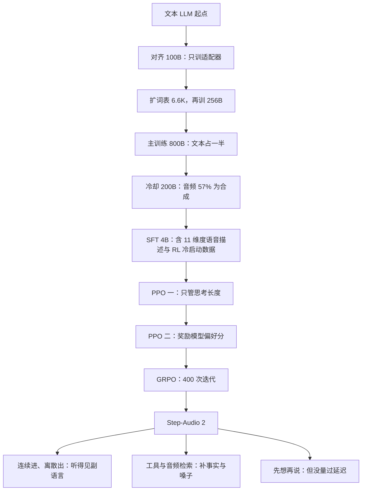

# Step-Audio 2：进来的声音不转成字，出去的嗓子可以检索

<!-- release-date: 2025-08-29 -->

> 本文依据 StepFun Audio Team 的 **Step-Audio 2 Technical Report**，arXiv:2507.16632v3，2025-08-27 提交，共 21 页。页码均指该 PDF 自身的页码。文中区分三件事：报告明确写了什么、我们怎么解释它、哪些是外部资料补充或本文推算。

## 阅读前先认识几个词

这份报告默认读者熟悉语音。下面几个词先说人话，后文不再解释：

- **级联流水线**：语音识别（ASR，Automatic Speech Recognition）把声音转成字，大语言模型读字回话，语音合成（TTS，Text-to-Speech）把回话念出来。三个现成系统串起来。
- **副语言信息**（para-linguistic information）：话里除了字面意思之外的东西，比如语气、情绪、犹豫、笑声、语速、音高，也包括说话人的年龄、性别和周围环境。
- **连续特征与离散 Token**：声音进模型前要压缩。压成一串浮点向量叫连续特征，细节保留得多，但模型只能「读」不能「写」；压成词表里的整数编号叫离散音频 Token，信息更少，但模型可以像写字一样一个个吐出来，再交给解码器还原成波形。
- **帧率**：一秒声音被压成几个向量或几个编号，单位 Hz。12.5 Hz 就是一秒占 12.5 个序列位置。
- **LALM**（Large Audio Language Model，大型音频语言模型）：能直接吃音频、吐音频的大模型，报告全篇用这个缩写。
- **声码器**（vocoder）与**流匹配**（Flow Matching）：前者把梅尔频谱还原成波形；后者是一类生成方法，这里用来从离散音频 Token 生成梅尔频谱。

## 一句话先说清

Step-Audio 2 是一个端到端的音频语言模型：**波形直接进，文字 Token 和音频 Token 交错着出**（PDF p. 6）。它比上一代 1300 亿参数的 Step-Audio 更小（PDF p. 1–2），但报告没有给出任何具体参数量。

它把四件事绑在一起：

1. **进出用两种表示**：输入走连续潜在特征，保住副语言细节；输出走离散音频 Token，保住可生成性（PDF p. 6）。
2. **接外部工具，其中一个检索的是声音本身**：网页搜索补事实，音频检索从几十万条语音里取回一段参考音，让模型照着换音色和说话风格。报告称它是「LALM 独有」的工具（PDF p. 2、p. 6）。
3. **从文本大模型出发，四段续训 1.356T Token、用时 21 天**，每段的数据配比逐项列出（PDF p. 7）。
4. **先想再说，并用强化学习把「想」压短**：第一段 RL 的奖励只看思考长度合不合适，不看答案对错（PDF p. 8–9）。

评测上，它在 ASR 三档平均错误率、MMAU、中英互译、中文 URO-Bench 上都排第一，自建的副语言基准拿到 83.09，对手最高 49.64（PDF p. 10–13）。

如果只记一句话：

> **这份报告的主张是「不要让信息在中途降级」**。声音不降级成文字，所以听得见叹气；知识不只靠参数记忆，所以答得出今天；音色不是一张枚举表，所以换得了嗓子。

## 先讲矛盾：一句话在流水线上被弄丢三次

设想你对语音助手说：「（叹气）……算了。你帮我查一下今天大盘怎么样吧。」

交给级联流水线，这句话会被弄丢三次。

**第一次在入口。** 识别模块的目标是「把声音变成正确的字」，于是那声叹气没了，「算了」里的疲惫也没了。后面的语言模型只看到一行干净的文字。报告在引言里批评的正是这个：以前的 LALM 主要把语音里的语义对齐到文本模态，忽略了对理解意图同样关键的副语言信息；少数能理解副语言的模型，又只输出文字，没法把理解用在说话上（PDF p. 1–2）。

**第二次在中间。** 「今天大盘怎么样」的答案不在参数里。报告把这写成第二个缺陷：现有 LALM 常出现幻觉，缺少通往真实世界文本知识的通路（PDF p. 2）。

**第三次在出口。** 合成模块能用的嗓子是出厂时那几副。报告说现有模型「可选的音色和说话风格很有限」，缺的是通往真实世界声学知识的通路（PDF p. 2）。

事实缺口和音色缺口，在报告的解法里是同一件事：都靠外部检索补。后面每一节都在给这三处补机制和证据。

## 全景：一次对话在模型里走的路

这张图按 Figure 3（PDF p. 6）和 §3.1 正文重画。原图用火焰和雪花标出训练与冻结，这里换成紫框与灰框；「冻结」对编码器有正文依据（PDF p. 6），对反 Token 化器只有原图的雪花图标。

报告在相关工作里（PDF p. 4–5）把自己放在「语音编码器 + 轻量适配器 + LLM」这条主流入口结构上，输出侧则接在 CosyVoice 2 这一脉的「语音 Token + 流匹配」合成路线上。它和上一代 Step-Audio 的关键区别只有一句：Step-Audio 2 **把音频 Token 的生成也并进了语言建模**（PDF p. 6）。

下面按图上的四个位置走：入口的连续特征、出口的离散 Token、旁路的工具、回流的历史。

## 核心设计一：连续进、离散出

### 旧问题：入口一离散化，就先聋了一半

最省事的做法是进出都用离散音频 Token，统一成编号最干净。

问题在于离散化有损，而且**丢什么不由你决定**。音频 Token 由某个编解码器或语义 Token 化器训出来，它的训练目标决定它保留什么：为重建波形训的，保留还原声音所需的信息；为配合识别训的，保留区分字词所需的信息。两者都不等于「保留让人听出情绪的信息」。入口一旦压成几千个编号之一，犹豫、气声、语速变化能不能活下来就看运气。

### 新设计：两端故意不对称

Step-Audio 2 的选择（PDF p. 6）：

- **输入侧**：音频编码器输出连续潜在特征，经适配器投影后直接送进 LLM 解码器，不进任何词表；
- **输出侧**：LLM 解码器输出离散音频 Token，和文字 Token 共用一个词表。

理由正是开头那组对比：连续特征信息多但不可生成，离散 Token 信息少但可生成。进和出的需求不同，就没有理由逼它们用同一种表示。

### 入口：一个听得出「字以外」的冻结编码器

报告给的入口规格很具体（PDF p. 6）：

- 音频编码器在多种语音与音频理解任务上预训练过，包括 ASR、**说话人年龄与性别预测**、音频事件检测等；
- 编码器输出帧率 25 Hz，**在整个训练过程中冻结**；
- 适配器降采样 2 倍，进入 LLM 的帧率变成 12.5 Hz。

预训练任务清单值得多看一眼：它从一开始就不是纯 ASR 编码器，**被要求听出的东西比字多**。后文副语言评测的 83.09（PDF p. 10），源头很可能在这里；这是我们的解释，报告没有做编码器消融。

12.5 Hz 意味着什么，可以自己算（以下换算为本文所做）：30 秒音频占 $30 \times 12.5 = 375$ 个位置；16K 序列最多装 $16384 / 12.5 \approx 1311$ 秒，约 22 分钟纯音频。真实对话里还有历史、工具返回和输出，实际能装的远短于此。**这个模型的上下文按分钟算，不按小时算。**

编码器是谁，报告没说。附录里的开源版 mini 明写用 Qwen2-Audio 的编码器（PDF p. 19），由此可推断满血版用的是另一个编码器，但它的结构与规模都没有公开。

### 出口：词表里多了 6.6K 个音频编号

预训练中途，模型在文本 LLM 的 Token 化器上**扩了 6.6K 个音频 Token**（PDF p. 7）；音频 Token 化器直接取自 CosyVoice 2（PDF p. 6）。

这里可以做一次交叉印证（**外部补充**）：CosyVoice 2 的语音 Token 化器用有限标量量化（FSQ），码本大小 6561、利用率 100%，Token 速率 25 Hz（[arXiv:2412.10117](https://arxiv.org/abs/2412.10117) 的 §2.2 与 Table 4）。所以「6.6K」几乎可以肯定就是这个 6561 码本，**输出侧音频 Token 应当是 25 Hz**。这两点报告自己都没写，是从它引用的 Token 化器推出来的。

推出来之后有一个不对称：输入 12.5 Hz，输出 25 Hz。同样一秒声音，模型「听」它占 12.5 个位置，「说」它占 25 个位置，还不算夹在中间的文字 Token。

### 交错：文字和声音贴着走

输出序列里文字 Token 和音频 Token **按固定比例交错**，末尾补齐以满足比例（PDF p. 6）。音频 Token 再从交错序列里抽出来，交给反 Token 化器（PDF p. 6）。

比例是多少，正文没给。Figure 3 画的是「一个文字 Token 跟三个音频 Token」重复两轮，但示意图不能当参数用。

为什么交错而不是先写完文字再念？我们的理解是：文字 Token 承担语义规划，音频 Token 承担声学实现，两者贴着走，念出来的和想好的不容易对不上，也不必等整段文字写完才开始发声。报告引用了三篇做交错的前作（PDF p. 6），但没有解释比例怎么选，也没有做比例消融。

### 反 Token 化器：流匹配里补了一层卷积

反 Token 化器和 Step-Audio、Step-Audio-AQAA 同构：流匹配模块从音频 Token 生成梅尔频谱，HiFi-GAN 声码器再把频谱变成波形（PDF p. 7）。

这一代的改动是：在流匹配 Transformer 块里**每个自注意力模块之后加一层基于 CNN 的编码器层**，并在 20 万小时高质量语音上训练。报告说这「显著提升」了梅尔频谱重建，带来发音准确度和音色相似度上的实质增益（PDF p. 7）。

动机不难理解：自注意力擅长长程关系，频谱的共振峰、过渡段却是强局部结构，卷积正好补上。但**报告没有给这项改动的任何数字**，「显著提升」是作者陈述。

部署沿用 Step-Audio 的基础设施，包括一个语音活动检测（VAD）模块来过滤输入，实现实时对话（PDF p. 7）。怎么判断用户说完、能不能被打断、延迟多少，报告都没写。

### 代价与边界

- **编码器冻结，听力就封顶了。** 全程冻结换来稳定和便宜，但编码器丢掉的信息，后面怎么训都补不回来。
- **进出不在同一个空间。** 模型听到的是连续特征、说出的是离散 Token，它没法把自己说过的话和用户说的话放进同一种表示里比较。报告没讨论这一点。
- **参数量全部缺席。** 编码器、适配器、解码器、初始文本 LLM 都没有数字。唯一的线索是「比 Step-Audio 少」，而 Step-Audio 是 130B（PDF p. 1–2）。

### 这一节可以带走什么

**输入表示和输出表示没有理由必须相同。** 输入侧问「哪种表示丢得最少」，输出侧问「哪种表示模型生成得了」。多模态系统里这两个答案经常不一样，硬统一就是给其中一端做无谓让步。检索系统的索引表示与召回表示、训练时的数据表示与推理时的缓存表示，都是同一个道理。

## 核心设计二：把「换个嗓子」变成一次检索

### 旧问题：音色是枚举出来的

一个语音模型能说几种嗓子，取决于训练时给了它几种。要加一种，就要收数据、标注、训练、上线。产品上永远是一张有限的音色列表。

### 新设计：四个工具，一个检索声音

报告设计了四个工具，用显式或隐式的语音指令触发（PDF p. 6）：

| 工具 | 取回什么 | 补的是哪种缺口 |
|---|---|---|
| 网页搜索 | 网页内容 | 参数里没有的事实 |
| 天气预报 | 天气数据 | 实时状态 |
| 当前日期与时间 | 时间 | 模型天生不知道「今天」 |
| **音频检索** | 一段参考语音 | 音色与说话风格 |

音频检索背后是一个**几十万条语音的库，每条都带转写文本和描述**（PDF p. 6）。模型拿到检索回的语音后，可以模仿它的说话风格或切换音色（PDF p. 6–7）。

「带转写和描述」是关键。查询来自用户的语音指令（比如「你能像个小女孩那样说话吗」），被检索的对象是波形；声音和指令之间没法直接比相似度，所以库里每条语音必须挂一段可被匹配的描述。这是我们的解释：报告没有写检索算法，只写了库里有什么。

### 工作机制：检索结果接在输入音频特征后面

报告只用一句话交代机制：**推理时，检索到的信息追加在输入音频特征之后，然后才开始生成语音输出**（PDF p. 7）。

这句话带来一个漂亮的性质：参考音成了上下文的一部分，而不是一个需要额外接口的条件输入。模型不需要专门的音色编码器，也不需要音色 ID 表，只是「听到一段声音，然后照着说」。换句话说，**它把零样本音色克隆改造成了一次由模型自己发起的检索调用**。零样本克隆本身不新，新的是「找哪段参考音」这一步交给了模型。

检索结果以什么形式进模型（是否经过同一个编码器），报告没写；上面那张全景图只按正文把它画在输入特征之后。

训练数据方面，SFT 阶段为每类工具构造了约 1K 条文本对话脚本，把带显式或隐式调用意图的指令和相应语句插进日常对话，再用自家的对话合成流水线合成为语音（PDF p. 8）。

### 证据：Table 5 能证明什么、不能证明什么

报告为此自建了 **StepEval-Audio-Toolcall**（PDF p. 12）：每类工具用文本 LLM 生成 200 段多轮脚本，每段 3–6 轮，最后一轮必须带对某个工具的调用意图；再配等量负样本，最后一句要么无调用意图，要么指向别的工具；合成为中文语音后，用 Qwen3-32B 自动判分。脚本、合成语音与评测脚本一起公开。

对照组只有一个，且不同类：纯文本模型 Qwen3-32B，用文字输入评测（PDF p. 13 表注）。报告的理由是没有别的 LALM 支持自定义工具调用（PDF p. 12）。

Table 5（PDF p. 13）：

| 指标 | 音频检索 | 日期与时间 | 天气 | 网页搜索 |
|---|---|---|---|---|
| Qwen3-32B 触发 精确率 / 召回率 | 67.5 / 98.5 | 98.4 / 100.0 | 90.1 / 100.0 | 86.8 / 98.5 |
| Step-Audio 2 触发 精确率 / 召回率 | **86.8 / 99.5** | 96.9 / 98.4 | 92.2 / 100.0 | 88.4 / 95.5 |
| Qwen3-32B 类型准确率 | 100.0 | 100.0 | 98.5 | 98.5 |
| Step-Audio 2 类型准确率 | 100.0 | 100.0 | 90.5 | 98.4 |

日期与时间工具没有参数；其余三类两边的参数准确率都是 100.0。

读表要知道三件事：

1. **音频检索这一格差距最大**：触发精确率 67.5 对 86.8。精确率低意味着误触发，文本模型在不该调音频检索时调了。报告把它解释为多模态模型相对文本模型的专长（PDF p. 12）。再往下推一句：「换个声音说」这类意图，有一部分藏在用户怎么说里，只读文字的模型分不清。
2. **不是全面领先**：天气的类型准确率 90.5 比文本模型低 8 分，日期时间的触发两项、网页搜索的召回率也略低。正文只写「与文本 LLM 相当，音频检索显著更好」（PDF p. 12）。
3. **它测的全是调用层面**：该不该调、调哪个、参数对不对。**取回的语音像不像用户要的、换音色后听感如何，报告没有任何评测。**

### 代价与边界

音频检索是报告里想法最好、细节最少的一节。检索算法、描述由人标还是模型生成、几十万条语音的来源与授权、检索质量、一次检索的延迟代价，全都没写。

### 这一节可以带走什么

- **输出空间里有一个无法枚举的维度时，把它做成可检索的，而不是可选择的。** 如果你在维护一张「支持的风格 / 音色 / 模板」列表，而它的增长追不上需求，这个维度就该改成检索，扩展只需往库里加条目。
- **要让 A 模态可检索，通常得给它挂一层 B 模态的描述。** 真正被匹配的是描述，被返回的才是原件；图片库、音效库、代码片段库同理。
- **参考样本作为上下文，比作为条件输入更通用。** 不必为每种条件设计接口，模型只要读得懂这个模态就行；代价是吃上下文长度。

## 训练：四段续训，配比就是优先级声明

图里的条长就是 Token 数。它先回答一个问题：1.356T 里，明确标为文本的有 $128 + 400 + 100 = 628$B，约占 46%；主训练一段就占了 800B（PDF p. 7）。模型由某个文本 LLM 初始化，续训 21 天（PDF p. 7），初始模型是哪个、用了多少卡，报告都没说。

### 第一段：先只训适配器

100B Token 的 ASR 数据，目的是让语音与文本的特征空间在适配器里对齐。此时**音频编码器和 LLM 全部冻结，只训适配器**；训 12K 步，序列长 8192，学习率从 $10^{-4}$ 降到 $2 \times 10^{-5}$（PDF p. 7）。

为什么这样？适配器刚随机初始化，一上来全参数训，它会往解码器里灌噪声，解码器为适应噪声开始破坏原有的文本能力。先冻两端只训中间，等于**先把接口谈拢，再谈业务**。这一段的学习率上限 $10^{-4}$ 比后面任何一段都高一个量级：新参数放开、旧参数不动。

### 第二段：扩词表，四组学习率护住文本能力

对齐之后扩 6.6K 个音频 Token，再训 128B 文本加 128B 音频，序列长提到 16384。报告写明目的：**妥善嵌入新的音频 Token，同时保住文本能力**（PDF p. 7）。

音频那 128B 里 TTS 占 80B（PDF p. 7）。原因不难想：ASR 数据里音频只在输入侧，不给新音频 Token 任何输出监督；要让新词表的 6.6K 个编号学到东西，它们必须大量出现在输出侧，TTS 正是「文字进、音频 Token 出」的最纯形式。**第一段用 ASR 训输入接口，第二段用 TTS 训输出词表**，分工清楚。这是我们的解读。

这一段给四个部件设了不同学习率（PDF p. 7）：

| 部件 | 学习率 |
|---|---:|
| LLM | $2 \times 10^{-5}$ |
| 适配器 | $5 \times 10^{-5}$ |
| 嵌入层 | $5 \times 10^{-5}$ |
| 输出层 | $4 \times 10^{-5}$ |

判据是**新初始化的放开，已训好的枢纽收紧**：嵌入层和输出层刚塞进 6.6K 个随机行，适配器也还年轻，都要快学；LLM 主干是要保护的资产。报告没做这组学习率的消融，「这样更好」是设计判断。

### 第三段：800B 主训练

学习率统一到 $2 \times 10^{-5}$，再训 800B（PDF p. 7）。图上能直接读出三件事：

- **文本占一半**（400B），这是防遗忘的配重；
- **音频里语音到语音对话最多**（150B），压过 TTS 的 120B，说明目标已从「学会发声」转向「学会对话」；
- **ASR 只有 42B**，因为第一段已经花了 100B 做对齐；翻译类加起来 38B，是顺带的能力。

报告没解释配比怎么定，也没做配比消融。但**读配比比读文字更能看出一个团队想要什么**。

### 第四段：200B 冷却，一半以上的音频是合成的

200B 高质量数据引入更多任务类型，学习率从 $2 \times 10^{-5}$ 降到 $5 \times 10^{-6}$（PDF p. 7）。音频部分真实 43B、合成 57B（分组求和为本文所做），另配 100B 高质量文本。

两件事要说破：

**第一，冷却阶段的音频有 57% 来自自家的对话合成流水线。** 冷却离最终模型最近，这意味着模型的说话方式在相当程度上被自己的合成器塑造。为保证嗓音多样性，合成时参考了约 5 万个不同说话人的库（PDF p. 7）；但说话人多样不等于内容和交互模式多样，报告没讨论分布收窄的风险。

**第二，「副语言信息理解」只有 2.4B**，是最小的一块之一，却是评测里差距最大的能力。这条能力更可能来自编码器预训练就带上的年龄、性别、事件任务，加上 SFT 里那个 11 维度语音描述任务（见下一节）。这是我们的解读，报告没有明说因果。

### 两个能自己验的加法

**第一个对得上**：$100 + 256 + 800 + 200 = 1356$B，正好是报告说的 1.356T（PDF p. 7）。四段就是全部，没有隐藏的第五段。

**第二个对不上**：引言说模型在「680B Token 的文本数据和 800 万小时真实与合成音频」上训练（PDF p. 3），但 §3.2 里明确标为文本的只有 628B；把 SFT 的 4B 全算进去也只有 632B（PDF p. 8）。报告没解释这 52B 的差额，可能是交错数据里的文字被单独计入，也可能是约数，我们不猜。「800 万小时」同样找不到分项支撑，只在引言和结论各出现一次（PDF p. 3、p. 14）。

21 天能算出一个平均吞吐：$1.356 \times 10^{12} / (21 \times 86400) \approx 7.5 \times 10^5$ Token/秒（本文除法）。没有参数量，这个数没法反推卡数，只能说明这不是小规模训练。

### SFT：4B Token，一次覆盖全部核心任务

SFT 用 4B Token 的文本与音频数据训 1 个 epoch，学习率从 $10^{-5}$ 降到 $10^{-6}$（PDF p. 8）。数据按任务组织（PDF p. 8）：

| 任务 | 数据来源 |
|---|---|
| 多语种与方言 ASR | GigaSpeech、WenetSpeech 等语料加内部数据 |
| 音频理解 | 把 AudioSet、AudioCaps 的分类与描述数据改写成语音问答 |
| 副语言 | 自建的详细语音描述任务，要求输出覆盖 **11 个副语言与环境维度**的完整文字描述 |
| TTS | 内部专业标注的高质量数据 |
| 语音到语音翻译 | CoVoST 2 的中译英、英译中子集 |
| 语音对话 | 内部文本对话经多个 LLM 改写成口语脚本，随机插入情绪与语速指令，再合成语音 |
| 工具调用 | 每类工具约 1K 条脚本，合成语音 |
| RL 冷启动 | 两套「以推理为中心」的数据集，见下文 |

### RL 的原料：先造一个已知答案的样本

两套冷启动数据集的构造方式很聪明（PDF p. 8）：

1. **复杂声学场景**：把 AudioSet、AudioCaps 的多段音频混合，人为造出复杂环境；
2. **副语言对话**：用文本 LLM 生成带合适情绪描述的对话脚本，再合成为语音对话。

然后用一个**带推理能力的文本 LLM**，根据「音频的混合配方」或「生成的对话脚本」产出带显式分步推理轨迹的问答对（PDF p. 8）。

关键在于：**推理轨迹的正确性来自构造过程，而不是来自模型的猜测。** 音频是自己混的，配方里写着混进了什么；对话是自己生成的，脚本里写着情绪是什么。文本 LLM 只需把已知答案展开成一条像样的推理链。边界也要认：这样造出的轨迹是「事后合理化」，和模型真遇到未知样本时该怎么想，未必是一回事。

### 强化学习：先教它想得短，再教它想得好

**旧问题**：文本模型里，多写几百个思考 Token 换更高正确率，用户多等两秒，通常划算。语音对话里这笔账不一样：用户说完话后，模型每多想一个 Token，静默就多一段。**想得对和想得快冲突在同一个变量上：思考长度。**

Step-Audio 2 是会先想再说的。Figure 2 最后一格给了一个例子（PDF p. 3）：用户说「晚上好……我有点心神不宁，不知道能不能跟你聊聊」，模型先写出对说话人的观察（年轻男性，20–25 岁，语气温和略带沉思，有轻微背景噪音，标准普通话），再写一段该怎么回应的推理，然后才回复。这些都要占解码步数。

**新设计**：三段 RL（PDF p. 8–9）。

| 阶段 | 算法 | 奖励 | 迭代数 | 超参 |
|---|---|---|---:|---|
| 一 | PPO | 二值：推理「既不为空也不过长」给 1，否则 0 | 60 | 全局 batch 64，actor 学习率 $1 \times 10^{-6}$，critic 学习率 $2.5 \times 10^{-6}$ |
| 二 | PPO | 训好的奖励模型给出的偏好分 | 120 | 与第一段相同 |
| 三 | GRPO | 报告未说明 | 400 | 报告未说明 |

第一段的目的写得很直白：为实时音频交互优化推理效率，把思考长度限制在预设上限内（PDF p. 9）。**这个奖励完全不关心推理对不对。**

**为什么顺序是先短后好？** 我们的理解：若先用偏好模型训质量，模型会发现多想通常更容易得高分，思考长度一路上涨；之后再压，压的是一个已经把「长」和「好」绑在一起的策略。先用纯长度奖励把预算刻进去，再在预算内追质量，等于**先划预算，再在预算内优化**。报告没有做反向顺序的对照。

第三段 GRPO 跑 400 次迭代，目的写的是「进一步提升音频感知能力」（PDF p. 9），奖励、数据、超参一个都没写。**三段里最长的一段，是描述最少的一段。**

**一处引用错误**：报告两次引用 [54]，一次标注 PPO（PDF p. 8），一次标注 GRPO（PDF p. 9），但参考文献 [54] 实际是 Rafailov 等人的 DPO 论文（PDF p. 16）。正文描述的 actor / critic 双学习率、逐迭代在线优化明确属于 PPO 家族，所以这是编号笔误，不影响方法本身。外部补充：PPO 原论文是 [arXiv:1707.06347](https://arxiv.org/abs/1707.06347)，GRPO 出自 DeepSeekMath 的 [arXiv:2402.03300](https://arxiv.org/abs/2402.03300)。

**这一节的空白**：奖励模型的规模与数据、「过长」的阈值、RL 框架与硬件都没写。最要紧的一处是，整套 RL 以实时交互为动机，**报告从头到尾没有一个以毫秒计的延迟数字**，压缩思考到底省下多少时间，没有测量。

### 这一节可以带走什么

- **给不同部件设不同学习率，判据是「新初始化的」对「全局枢纽」**。报告在第一、二段各用了一次，成本几乎为零。
- **数据配比就是优先级声明。** 多任务训练时把配比按数值排一遍，经常会发现它和嘴上说的重点不一致。
- **效果和成本冲突在同一个变量上时，先训预算，再训质量。** 输出长度、检索条数、重试次数都适用。
- **要推理轨迹数据，先造一个你已知答案的样本。**

## 实验：六块评测，分开算账

评测覆盖 ASR、副语言理解、音频理解、语音翻译、工具调用、语音到语音对话六项（PDF p. 9–13）。工具调用上文已讲，下面看其余五项。

先说封面雷达图（Figure 1，PDF p. 2）的一个读法：ASR 两个轴画的是「100 减错误率」（AISHELL-2 上 $100 - 2.10 = 97.9$，LibriSpeech test-clean 上 $100 - 1.17 = 98.8$，与 Table 1 对得上）。这样画整张图统一「越外圈越好」，但 ASR 的相对差距被压扁了：2.10 与 2.67 的错误率相差 27%，画成 97.9 与 97.3 几乎看不出来。判断 ASR 优劣要回 Table 1。

另外，雷达图与各表的基线口径有注脚（PDF p. 2）：GPT-4o Audio 的 ASR 用 gpt-4o-transcribe，其余用 gpt-4o-audio-preview-2025-06-03；Qwen-Omni 在 MMAU 与语音转文本翻译上用 Qwen2.5-Omni，其余用 qwen-omni-turbo-2025-03-26。

### ASR：平均第一，但平均值藏着分布

评测覆盖 6 个中文、4 个英文、3 个多语种（日语、粤语、阿拉伯语）测试集，外加 6 个内部的方言与带口音普通话测试集；对照是 Doubao LLM ASR、GPT-4o Transcribe、Kimi-Audio、Qwen-Omni，前两个是专用 ASR 系统。所有模型**评测时都不指定语种**；报告注明 Qwen-Omni 没有不依赖语种的测法，指定语种可能更好（PDF p. 9）。

三档平均（PDF p. 10，Table 1，越低越好）：

| 类别 | Doubao LLM ASR | GPT-4o Transcribe | Kimi-Audio | Qwen-Omni | Step-Audio 2 |
|---|---:|---:|---:|---:|---:|
| 英文平均 WER | 6.17 | 4.50 | 4.18 | 5.35 | **3.14** |
| 中文平均 CER | 3.81 | 14.05 | 3.75 | 4.81 | **3.08** |
| 内部方言与口音平均 CER | 14.66 | 40.49 | 25.52 | 19.40 | **8.85** |

三档都是第一。但逐项过一遍 Table 1 的 19 个测试集，Step-Audio 2 拿到最好成绩的是 10 个，另外 9 个输给别人（统计为本文所做）：

| 输掉的测试集 | 赢家 | 赢家的值 | Step-Audio 2 |
|---|---|---:|---:|
| FLEURS English | GPT-4o Transcribe | 2.71 | 3.03 |
| FLEURS Chinese | GPT-4o Transcribe | 2.62 | 2.68 |
| WenetSpeech net | Doubao LLM ASR | 4.46 | 4.67 |
| FLEURS Arabian | GPT-4o Transcribe | 11.72 | 14.22 |
| Common Voice yue | Qwen-Omni | 7.89 | 7.90 |
| 安徽口音 | Doubao LLM ASR | 8.83 | 10.61 |
| 广东口音 | Kimi-Audio | 3.76 | 3.81 |
| 广西口音 | Qwen-Omni | 3.35 | 4.11 |
| 四川方言 | Doubao LLM ASR | 3.01 | 4.35 |

把输赢放在一起看，能读出两件事：

1. **内部方言平均第一，是两格拉开的。** 6 个内部测试集里 Step-Audio 2 只赢了山西口音（12.44 对 20.26）和上海方言（17.77 对 47.49），另外 4 个都不是第一。但这两格上别人错得太多，平均值就被拉开了。所以准确的说法是：它在最难的两类方言上优势巨大，在其余口音上和专用系统互有胜负。
2. **报告的措辞偏宽。** 报告说阿拉伯语、日语与 GPT-4o Transcribe「相当」（PDF p. 9）：日语 3.18 对 3.27 确实相当，阿拉伯语 14.22 对 11.72 相对差了约 21%，说「相当」有些勉强。

同一张表还有一个反例值得记住：GPT-4o Transcribe 在 FLEURS 三个语种上都是最好，中文平均却是 14.05，拖累它的是 KeSpeech（26.80）、WenetSpeech meeting（31.40）和 WenetSpeech net（15.71）三格；到内部方言，上海方言 89.58、山西口音 55.03、安徽口音 50.55，全面失守（PDF p. 10）。

**平均值只告诉你一个系统的重心在哪，不告诉你它在你的场景里行不行。** 选型要按自己的音频分布去看逐项。

### 副语言：83.09，以及那两个「11」

**StepEval-Audio-Paralinguistic** 是报告自建、以单轮问答形式考 11 个副语言维度的语音到语音基准（PDF p. 9–10）：

- 550 条语音，均匀分布在 11 个任务上；
- 其中 8 个任务的 400 条中文语音取自公开播客录音；另 3 个任务（声音事件、场景、人声）各取 50 条，分别来自 AudioSet、CochlScene、VocalSound；
- 原始录音都短于 30 秒，统一重采样到 24000 Hz，标注由专业团队用开放集自然语言给出；
- 问答由文本 LLM 按标注生成。前 8 个任务用原始语音做提示去克隆合成问题语音，随机拼在原语音之前或之后；后 3 个任务还先把音频和合成语音混在一起，再拼问题，以提高难度；
- 评测时先用 ASR 把模型的语音回答转成文字，再由文本 LLM 自动判分；测试集与评测代码公开（PDF p. 10）。

一个小瑕疵：正文说 8 个任务，列出的维度却是性别、年龄、音色、情绪、音高、节奏、语速、说话风格、发声活动共 9 项（PDF p. 9）；而 Table 2 的 11 列里对应的是前 8 项加上场景、事件、人声（PDF p. 11），「发声活动」并没有单独一列。

结果（PDF p. 11，Table 2）：

| 模型 | 平均 | 性别 | 年龄 | 音色 | 场景 | 事件 | 情绪 | 音高 | 节奏 | 语速 | 风格 | 人声 |
|---|---:|---:|---:|---:|---:|---:|---:|---:|---:|---:|---:|---:|
| GPT-4o Audio | 43.45 | 18 | 42 | 34 | 22 | 14 | 82 | 40 | 60 | 58 | 64 | 44 |
| Kimi-Audio | 49.64 | 94 | 50 | 10 | 30 | 48 | 66 | 56 | 40 | 44 | 54 | 54 |
| Qwen-Omni | 44.18 | 40 | 50 | 16 | 28 | 42 | 76 | 32 | 54 | 50 | 50 | 48 |
| Step-Audio-AQAA | 36.91 | 70 | 66 | 18 | 14 | 14 | 40 | 38 | 48 | 54 | 44 | 0 |
| Step-Audio 2 | **83.09** | 100 | 96 | 82 | 78 | 60 | 86 | 82 | 86 | 88 | 88 | 68 |

83.09 对 49.64，是全篇差距最大的一项，11 列全部第一。基线在音色（34、10、16）、场景（22、30、28）这几列上的分数，更像是「能力有无」的差别，而不是调参的差别。

但有一件事报告没有连起来说：SFT 里那个自建描述任务要求输出「11 个副语言与环境维度」（PDF p. 8），这个基准考的也是「11 个维度」（PDF p. 9）。报告没明说两组维度是否相同，用词却高度接近。这不构成作弊，基准公开、构造写清、可以复现；但它意味着 **83.09 度量的是「按自家定义的 11 个维度作答」的能力**，其他模型没针对这套维度训练过，分低是可以预期的。

### 音频理解：MMAU 平均第一，领先 1 分

MMAU 用的是 v05.15.25 test-mini（PDF p. 11 注）。Audio Flamingo 3、Omni-R1、Qwen2.5-Omni 取各自论文的数，Gemini 2.5 Pro 取 MMAU 官网的数，GPT-4o Audio、Kimi-Audio、Step-Audio-AQAA 因基准更新而重测（PDF p. 11）。Table 3（PDF p. 11）：

| 模型 | 平均 | 声音 | 语音 | 音乐 |
|---|---:|---:|---:|---:|
| Omni-R1 | 77.0 | 81.7 | 76.0 | 73.4 |
| Audio Flamingo 3 | 73.1 | 76.9 | 66.1 | **73.9** |
| Gemini 2.5 Pro | 71.6 | 75.1 | 71.5 | 68.3 |
| Qwen2.5-Omni | 71.5 | 78.1 | 70.6 | 65.9 |
| Kimi-Audio | 69.6 | 79.0 | 65.5 | 64.4 |
| GPT-4o Audio | 58.1 | 58.0 | 64.6 | 51.8 |
| Step-Audio-AQAA | 49.7 | 50.5 | 51.4 | 47.3 |
| Step-Audio 2 | **78.0** | **83.5** | **76.9** | 73.7 |

平均分领先 Omni-R1 只有 1.0 分，音乐一栏略低于 Audio Flamingo 3。报告自己的措辞是准确的：声音和语音最好，音乐与最好成绩持平（PDF p. 11）。

### 语音翻译：两项第一，对照面窄

指标是 BLEU，越高越好（PDF p. 12，Table 4）：

| 基准 | GPT-4o Audio | Qwen2.5-Omni / Qwen-Omni | Step-Audio-AQAA | Step-Audio 2 |
|---|---:|---:|---:|---:|
| CoVoST 2 语音到文本翻译 平均 | 29.61 | 35.40 | 28.57 | **39.26** |
| 其中英译中 / 中译英 | 40.20 / 19.01 | 41.40 / 29.40 | 37.71 / 19.43 | 49.01 / 29.51 |
| CVSS 语音到语音翻译 平均 | 23.68 | 15.35 | 27.36 | **30.87** |
| 其中英译中 / 中译英 | 20.07 / 27.29 | 8.04 / 22.66 | 30.74 / 23.98 | 34.83 / 26.92 |

CoVoST 2 那列 Qwen 用的是 Qwen2.5-Omni 论文里的数，CVSS 那列是重测的 Qwen-Omni；Kimi-Audio 因「持续无视提示、改做 ASR」被排除（PDF p. 12）。拆开看，CVSS 的中译英上 GPT-4o Audio（27.29）其实略高于 Step-Audio 2（26.92），平均第一靠的是英译中。

### 语音对话：中文两档第一，但有一个子项排第四

URO-Bench 把能力拆成理解（U.）、推理（R.）、口语对话（O.），分基础与进阶两档；评测走 ASR 中介流程，Whisper 转写、GPT-4o-mini 判分（PDF p. 13）。Table 6 的平均分（PDF p. 13）：

| 语言 | 档位 | GPT-4o Audio | Kimi-Audio | Qwen-Omni | Step-Audio-AQAA | Step-Audio 2 |
|---|---|---:|---:|---:|---:|---:|
| 中文 | 基础 | 78.59 | 73.59 | 68.98 | 74.71 | **83.32** |
| 中文 | 进阶 | 67.10 | 66.07 | 59.11 | 65.61 | **68.25** |
| 英文 | 基础 | **84.54** | 60.04 | 70.58 | 71.11 | 83.90 |
| 英文 | 进阶 | **67.51** | 49.79 | 50.99 | 52.01 | 66.07 |

报告说中文显著领先、英文「略逊于 GPT-4o Audio」（PDF p. 13），差距 0.64 与 1.44，措辞准确。

但拆到子项有一格正文没提。中文进阶档的**口语对话（O.）**：Kimi-Audio 76.21、GPT-4o Audio 70.20、Step-Audio-AQAA 68.97、Step-Audio 2 65.10、Qwen-Omni 58.74（PDF p. 13）。Step-Audio 2 排第四，还低于自家上一代；中文进阶总分第一，靠的是理解（74.78）和推理（63.18）。英文进阶的 O. 也是 GPT-4o Audio 78.46 对 66.33。

这一格值得单独说，因为**口语对话正是这类模型的产品面**：理解和推理更像考试，口语对话更像「聊起来舒不舒服」。

### 这一节的判断

| 评测 | 测试集 | 别人能否复核 | 结论强度 |
|---|---|---|---|
| ASR | 13 个公开 + 6 个内部 | 公开部分可以 | 强，但内部方言部分不可复核 |
| MMAU | 公开 | 可以 | 强，领先幅度小 |
| 语音翻译 | 公开 | 可以 | 强，对照面窄 |
| 副语言 | 自建，已公开 | 可以 | 中，维度定义来自自家 |
| 工具调用 | 自建，已公开 | 可以 | 中，对照只有一个文本模型 |
| 语音对话 | 公开 | 可以 | 强，子项有短板 |

两个自建基准都连数据带评测脚本一起公开了（PDF p. 10、p. 12），这比「我们内部测过」高一个层次。

一个必须指出的缺失：**报告没有任何架构消融。** 去掉音频检索、换成离散输入、不做 RL、改交错比例会怎样，一个都没有。所有实验都是「Step-Audio 2 对别人」，所以这份报告能证明模型好，**不能证明它好是因为这几个设计**。

## 附录里的 Step-Audio 2 mini：一次有信息量、但不干净的对照

附录 B 介绍了开源版 Step-Audio 2 mini（PDF p. 19）：

- 音频编码器换成 **Qwen2-Audio 的编码器**，由 **Qwen2.5-7B** 初始化；
- **训练数据与 Step-Audio 2 相同**，但只能用网页搜索一种工具；
- 定位是「对开发者更友好」、参数量便于与 Qwen-Omni、Kimi-Audio 这类开源模型公平比较；
- 注脚说明 mini 的结果用 vLLM 后端测得，和 transformers 后端可能不同（PDF p. 19）。

报告只用一句「与 Step-Audio 2 相当」概括 mini 的结果。把 Table 7–11 的两列逐项对比（差值为本文计算）：

| 项目 | Step-Audio 2 | mini | 差值 |
|---|---:|---:|---:|
| CoVoST 2 平均 | 39.26 | 39.29 | mini 高 0.03 |
| URO-Bench 中文进阶 | 68.25 | 69.57 | mini 高 1.32 |
| ASR 中文平均 | 3.08 | 3.19 | mini 差 0.11 |
| ASR 英文平均 | 3.14 | 3.50 | mini 差 0.36 |
| ASR 内部方言平均 | 8.85 | 9.85 | mini 差 1.00 |
| CVSS 平均 | 30.87 | 29.08 | mini 差 1.79 |
| 副语言平均 | 83.09 | 80.00 | mini 差 3.09 |
| MMAU 平均 | 78.0 | 73.2 | mini 差 4.8 |
| URO-Bench 英文进阶 | 66.07 | 61.25 | mini 差 4.82 |
| URO-Bench 中文基础 | 83.32 | 77.81 | mini 差 5.51 |
| URO-Bench 英文基础 | 83.90 | 74.36 | mini 差 9.54 |

（数值来自 PDF p. 19–21。）

规律大致是：**答案被输入声音锁得越死的任务，掉得越少**——中英文转写、语音到文本翻译几乎不动；**越依赖模型自己补全的任务，掉得越多**——URO-Bench 基础档要答常识与推理，英文掉 9.54、中文掉 5.51。

但这不是一次干净的「主干规模」消融：**编码器也同时换了**，而且评测后端不同。副语言与 MMAU 的下降，可能有一部分来自编码器而不是主干；多语种 ASR 里日语（3.18 → 4.67）和阿拉伯语（14.22 → 16.46）的下降也不小（PDF p. 19）。所以只能把它当成一条方向性观察：

> **给多模态系统选主干规模时，先问「这个任务的答案有多少由输入信号决定」**。被信号锁得越死，主干可以越小；越依赖模型自己补全，主干越省不得。

## 报告没有公开的

- **所有参数量**，以及初始文本 LLM 的身份（mini 除外）；
- **满血版音频编码器的身份与结构**；
- **交错比例**与**输出音频 Token 帧率**（后者本文按 CosyVoice 2 推断为 25 Hz）；
- **任何以毫秒计的延迟**，以及流式、打断、全双工的机制；
- **音频检索的算法、索引、库来源与检索质量评测**；
- **RL 的奖励模型规格、GRPO 阶段的奖励与数据、思考长度阈值**；
- **训练算力、卡数、卡型**，只有「21 天」；
- **任何架构消融**；
- 满血版的权重。开源的只有 mini 系列（PDF p. 19）。

## 最值得带回自己项目的六条

### 1. 输入表示和输出表示不必相同

连续特征进、离散 Token 出（PDF p. 6）。输入侧要「丢得最少」，输出侧要「生成得了」，两个标准本来就不同。

### 2. 无法枚举的维度，做成可检索的

音色不是从列表里选，而是从几十万条语音里检索（PDF p. 6）。一张「支持的 XX 列表」追不上需求时，就该改成检索，并给被检索的原件挂一层可匹配的描述。

### 3. 接新模态，先只训接口层

两端冻结、只训适配器、学习率给到 $10^{-4}$（PDF p. 7）；扩词表后再用分部件学习率护住主干。**新初始化的放开，全局枢纽收紧。**

### 4. 配比就是优先级声明

主训练里文本占一半、语音对话压过 TTS、ASR 只补 42B（PDF p. 7）。把配比排一遍，比读宣传更能看清一个模型要做什么。

### 5. 预算约束先刻进策略，再追质量

RL 第一段只奖励「思考长度合适」，第二段才换成偏好分（PDF p. 9）。顺序反过来，质量优化会把长度一路推高。

### 6. 要推理轨迹，先造已知答案的样本

按配方混音、按脚本合成，再让文本 LLM 把已知答案写成推理链（PDF p. 8）。正确性由构造保证，代价是轨迹属于事后合理化。

## 用一张图重新串起全文

这张图按 PDF p. 6–9 的 §3 归纳，是顺序与机制的概括，不含时长、算力或延迟数据。

## 关键词回看

- **LALM**：能直接处理音频输入输出的大模型。
- **副语言信息**：语气、情绪、犹豫、语速、音高，以及说话人与环境信息。
- **连续进、离散出**：输入用连续潜在特征保信息，输出用离散音频 Token 保可生成性；本报告架构的核心不对称。
- **帧率**：输入侧 12.5 Hz；输出侧报告未写，按 CosyVoice 2 推断为 25 Hz。
- **交错输出**：文字与音频 Token 按固定比例交替出现，比例未公开。
- **音频反 Token 化器**：流匹配加 HiFi-GAN，流匹配块内补了 CNN 编码器层，20 万小时语音训练。
- **音频检索**：从几十万条带转写与描述的语音库里检索参考音，结果追加在输入音频特征之后。
- **分部件学习率**：新初始化的部件给大学习率，枢纽给小学习率。
- **思考长度奖励**：二值奖励，推理既不为空也不过长给 1。
- **StepEval-Audio-Paralinguistic**：自建 11 维度副语言基准，550 条，已公开；官方发布页称它 Step-SPQA。
- **StepEval-Audio-Toolcall**：自建语音工具调用基准，含负样本，已公开。
- **Step-Audio 2 mini**：Qwen2-Audio 编码器、Qwen2.5-7B 初始化、同一批数据的开源版本。

## 最后的判断

这份报告的价值不在某个新模块。CosyVoice 2 的 Token 化器、流匹配、HiFi-GAN、PPO、GRPO 都是现成的。它的贡献是**一套关于「不让信息在中途降级」的连贯选择**，并且每一处都有具体机制：

- 声音不降级成文字：连续特征直接进解码器，副语言评测 83.09 对 49.64；
- 知识不只靠参数：网页搜索与时间、天气工具；
- 音色不靠枚举：音频检索，把参考音当上下文；
- 思考不无限拉长：一段专门管长度的 RL。

证据强度是分层的：

- **有公开基准、可复核的**：ASR 三档平均第一、MMAU 平均第一、两项翻译第一、中文 URO-Bench 两档第一；
- **自建但公开的**：副语言 83.09（维度定义与 SFT 任务高度对应）、音频检索触发精确率明显高于文本模型（只有一个对照）；
- **只是作者陈述的**：CNN 编码器层「显著提升」重建、各段学习率与配比的合理性、端到端降低延迟、音频检索提升表现力。

还有几处需要读者自己校准：内部方言平均第一主要靠两格拉开；中文进阶的口语对话子项排第四；引言的 680B 文本与分项的 628B 对不上；[54] 号引用把 DPO 论文同时当成 PPO 和 GRPO 的出处。

如果只带走一句：

> **端到端不是「把三个模块合成一个」，而是找出流水线上每一次信息降级，逐个决定要不要付代价堵上**。堵不起的，应该在报告里明说，而不是用「实时」两个字盖过去。

## 和 StepAudio 2.5 的关系

StepAudio 2.5 沿用这里的「冻结编码器 + 适配器 + 文本 LLM 初始化的解码器」底座，并称预训练第一阶段「沿用 Step-Audio 2」；但它的对齐阶段只用 3B Token 的 ASR 数据，这里是 100B（PDF p. 7）；它还明确初始模型是文本 MoE LLM，而本篇没有说明初始模型是什么。2.5 报告还把本篇的副语言基准称作 Step-SPQA。代际差异见 StepAudio-2.5 一篇；本篇只写这份报告自己写了的内容，不拿后续代际去补。

## 资料与阅读边界

- **原始依据**：本地 `papers/StepFun/Step-Audio-2.pdf`，arXiv:2507.16632v3（2025-08-27），21 页，为 arXiv 上的最新版本（v1 于 2025-07-22 提交）。StepFun 官方发布页（[存档](https://web.archive.org/web/20250731155643/https://stepfun.ai/research/en/step-audio2)）引用的是 v1 的数字，例如副语言 76.55、MMAU 77.4，并把副语言基准称作 Step-SPQA；本文数字一律以 v3 为准。
- **首发日**：取 2025-08-29。官方仓库 [stepfun-ai/Step-Audio2](https://github.com/stepfun-ai/Step-Audio2) 的 News 记载 2025-07-23 发布技术报告与两个基准，2025-08-29 开源 Step-Audio 2 mini 与 mini Base，这是能定到天的最早模型可用事件；2025-07-23 的官方发布页写的是 App「即将上线」，当天模型尚不可用。满血版在 App 与 Realtime API 上线的具体日期未能找到官方记录，只能确定不晚于 2025-08-30（[Realtime 控制台存档](https://web.archive.org/web/20250830030239/https://realtime-console.stepfun.com/) 已列出 `step-audio-2`）。
- **外部技术补充**：CosyVoice 2 的 Token 化器规格（FSQ、码本 6561、25 Hz）来自 [arXiv:2412.10117](https://arxiv.org/abs/2412.10117)，用于解释「6.6K 音频 Token」并推断输出帧率；PPO 原论文 [arXiv:1707.06347](https://arxiv.org/abs/1707.06347)、GRPO 出处 [arXiv:2402.03300](https://arxiv.org/abs/2402.03300) 仅用于指出 [54] 号引用的笔误。
- **本文所做的计算与整理**：帧率换算、各段 Token 的分组与求和、680B 与 628B 的差额、平均吞吐、Table 1 逐项输赢统计、雷达图与 Table 1 的换算、mini 与满血版的差值表。这些都基于报告给出的数字，但报告本身没有写出这些结论。
- **读图所得**：Figure 3 上交错 Token 的 1:3 画法（PDF p. 6）、Figure 2 里「先观察、再推理、后回复」的示例（PDF p. 3），都只是示意，不能当参数用。
