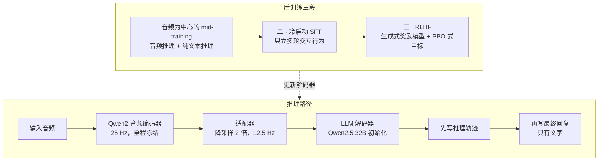
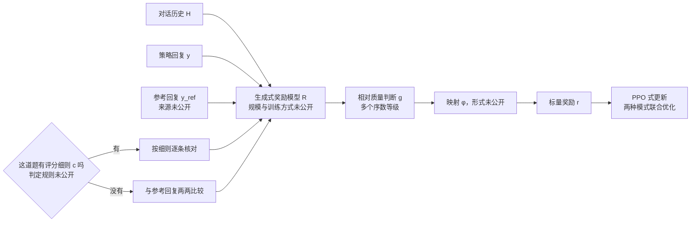

# Step-Audio-R1.5：把听觉推理的奖励，从「对不对」改成「好不好」

<!-- release-date: 2026-04-29 -->

> 本文依据 StepFun-Audio Team 的 **Step-Audio-R1.5 Technical Report**，arXiv:2604.25719v2（2026-05-31 修订），共 9 页，其中正文 7 页、参考文献 2 页。页码均指 PDF 自身页码。文中区分三件事：**报告明确写了什么**、**我们怎么解释它**、**哪些是外部资料或本文的算术**。

## 阅读前先认识几个词

- **思维链（Chain-of-Thought，CoT）**：模型先写出一段中间推理，再给最终答案。写出来的那段叫推理轨迹（reasoning trace）。
- **RLVR（Reinforcement Learning with Verified Rewards，可验证奖励强化学习）**：给有标准答案的题，让模型自己推理作答，用程序核对答案对错，对了给奖励、错了不给。它不需要另训一个打分模型，这是它流行的原因（PDF p. 1）。
- **RLHF（Reinforcement Learning from Human Feedback，基于人类反馈的强化学习）**：答案没法用程序核对时，先用人类偏好训一个奖励模型，再拿它的判断当奖励。
- **生成式奖励模型（generated reward model）**：奖励模型本身是个语言模型，读完对话和回复后「写出」一个判断，而不是直接回归出一个分数。
- **评分细则（rubric）**：针对某一道题写好的检查清单，例如「必须保持用户第一轮设定的人设」。
- **副语言信息（paralinguistic）**：话里字面意思以外的东西，如年龄、性别、语速、节奏、音色、情绪、口音。

## 一句话先说清

Step-Audio-R1.5 不是新架构。它沿用 Step-Audio-R1 的「音频编码器 → 适配器 → 32B 语言模型」骨架（PDF p. 3），改的是后训练：在 RLVR 之外补上一路 RLHF，用一个**能按评分细则核对、也能和参考回复两两比较**的生成式奖励模型，去管那些写不成标准答案的对话质量（PDF p. 4–5）。

报告的立论是一个诊断：只用 RLVR，模型会掉进 **可验证奖励陷阱（verifiable reward trap）**，越训越准，也越训越像「应答机」（PDF p. 1–2）。

在 8 个语音到文本基准上，R1.5 的平均分是 77.97，比前代 R1 的 72.50 高 5.47 分，在 6 个受评模型里排第二，仅次于 Gemini 3 Pro 的 79.67（PDF p. 6–7）。

读这份报告要带着一个判断走：**它提出的问题很准，给出的路线合理，但证据只撑得住其中一部分**。没有消融，没有人类评测，模型也只输出文字。后面会逐条摆清楚。

## 先看全景：骨架不变，后训练换成三段

上图按 PDF p. 3 的第 2 节与 p. 3–5 的第 3 节正文重画，只表示结构与阶段顺序。各阶段的数据量、步数和算力，报告都没有给。

架构一节只有三段话，能拿到的配置全在这张表里（PDF p. 3）：

| 部件 | 报告写的 | 报告没写的 |
|---|---|---|
| 音频编码器 | Qwen2 音频编码器，25 Hz，全程冻结 | — |
| 适配器 | 时间维降采样 2 倍，输出 12.5 Hz | 结构与参数量 |
| 语言模型解码器 | 由 Qwen2.5 32B 初始化，输入降采样后的音频特征，**只输出文本** | 上下文长度、训练时是否全参更新 |
| 输出格式 | 先写推理轨迹，再写最终回复 | 推理长度与采样参数 |

几处细节值得记住：

- **编码器冻结**，报告给的理由是保住它已经练好的听觉感知（PDF p. 3）。代价是编码器不能为下游任务做任何适配，声学上的上限由它决定。
- **12.5 Hz** 是为了缓解多轮交互里的序列长度爆炸（PDF p. 3）。换算一下（本文算术）：每 80 毫秒一个位置，1 分钟音频占 750 个位置。多轮对话里前面各轮的音频一直留在上下文里，所以这一半是每一轮都在省。
- **32B 指的是解码器**。报告在实验一节说 R1.5「只有 32B 参数」（PDF p. 6），这与解码器的初始化规模一致；编码器与适配器的参数量报告没给。
- 正文说解码器由 Qwen2.5 32B 初始化，但挂的参考文献 [15] 是 Qwen2 的技术报告（PDF p. 3、p. 8）。外部补充：Qwen2 系列没有 32B 这一档（[arXiv:2407.10671](https://arxiv.org/abs/2407.10671)），应是引文指错，模型名本身没有问题。

## 第一层矛盾：可验证奖励陷阱

### 旧做法卡在哪

RLVR 在文本推理上很成功，o1 和 DeepSeek-R1 都靠它（PDF p. 1）。音频模型照搬这套配方后，在语音问答、声学场景标注这类客观题上成绩很好（PDF p. 1）。

问题出在这类题的结构上。报告指出，一段在时间上展开的音频，最后被压成**一个离散标签**：一个类别、一个数字，或一小段事实字符串（PDF p. 2）。奖励只认这个标签，于是韵律是否自然、情绪是否连贯、对话是否接得上，全都不在奖励的视野里。报告用的词是模型对这些东西「结构性失明」（structurally blind，PDF p. 2）。

「结构性」这个词是关键：不是模型学得不够，而是目标里根本没有这一项。多训多少步都补不上一个从没被定义过的目标。

### 后果：越训越准，越训越难聊

报告描述的现象是（PDF p. 2）：

- 长时间 RLVR 训练后，模型在留出测试集上越来越准；
- 同时回复越来越短、越来越机械、情绪扁平；
- 在多轮口语对话里退化成一台「应答机」，技术上正确，体验上空洞。

报告把它归结为一组对比：**RLVR 优化的是「说什么」（what to say），用户在意的是「怎么说」（how to say it）**（PDF p. 2）。

### 这段诊断是作者观察，不是实验结论

报告说这个现象「一致且可复现」（PDF p. 2），但全文没有给出任何训练曲线、对照组或数字来支撑它。做过 RLVR 的人多半会认同这个观察；按证据分层，它仍然属于作者观察。整篇报告的动机建立在这里，所以要先记住这一点。

### 可迁移启发

自动指标持续变好、用户反馈持续变差时，先别急着把指标推得更高，先把奖励函数写下来，问一句：用户在意的东西里，有多少能被它看见？看不见的那部分，训练不会让它变好。推荐系统里点击率涨、留存跌，代码模型里测试通过率涨、可读性跌，都是同一个结构（这是本文的类比，报告没有讨论音频以外的场景）。

## 核心设计一：推理轨迹与最终回复分开写

解码器被提示先写显式的推理轨迹，再自回归地写最终回复。报告说这种「内部分析与外部回复解耦」是无缝接入 RLHF 的**架构基础**（PDF p. 3），但没有解释原因。

我们的解释是：RLHF 要判断的是回复质量。推理和回复混在一起时，奖励模型不知道该评哪一段；偏好优化还可能把压力打到推理段上，让它为了讨喜而变长、变花哨。切开之后，打分对象就是用户真正看到的那段回复。

边界要说清：式 (2) 里奖励模型的输入写的是策略回复 $y$（PDF p. 4），但报告没有一句正文确认推理轨迹不参与打分，也没说裁剪和 KL 项作用在哪一段上。

**对自己的项目有什么用**：打算给什么打分，就先让它在输出里有明确的起止。边界含糊，奖励就含糊，奖励被钻空子也更难发现。

## 核心设计二：三段后训练，各管一件事

### 第一段：音频为中心的 mid-training

目标是在对齐之前，先把音频理解、基于音频的推理和一般的深思能力练扎实（PDF p. 3）。统一的监督目标是（PDF p. 3，式 1）：

$$
\mathcal{L}_{\mathrm{mid}} = \mathbb{E}_{(x,q,r,y)\sim\mathcal{D}_{\mathrm{audio}}}\big[\log \pi_\theta(r,y \mid x,q)\big] + \mathbb{E}_{(q,r,y)\sim\mathcal{D}_{\mathrm{text}}}\big[\log \pi_\theta(r,y \mid q)\big]
$$

$x$ 是输入音频，$q$ 是文本上下文，$r$ 是推理轨迹，$y$ 是回复。前一项是带音频的样本，后一项是纯文本推理样本，两项都要求模型同时学会写推理和写回复。式子写成对数似然、没有负号，按字面是要最大化；两项之间也没有权重系数。

掺纯文本推理数据的理由报告写了（PDF p. 3）：文本数据提供高质量推理轨迹和长篇深思结构，便于把这些推理模式迁移到音频上。我们的理解是，带高质量长推理的音频数据很稀缺，而文本世界里这种存量很大；用文本教「怎么想」，用音频教「想的东西挂在哪」，两者靠共享的解码器渡过去。

数据量、配比、来源、训练步数，报告一个都没给。

### 第二段：冷启动 SFT

mid-training 提升了知识、感知和推理，但没有直接优化多轮交互。报告的原话是，光有强的音频理解，不足以保证自然、连贯、对指令敏感的对话（PDF p. 4）。

所以这一段不再扩知识，只给「面向交互的行为」一个监督式初始化，强调四个方面（PDF p. 4）：

| 方面 | 报告的定义 |
|---|---|
| 多轮对话连续性 | 跨轮维持上下文和用户设定的约束 |
| 指令遵循 | 用户对内容、格式、风格提出要求时保持一致 |
| 回复自然度 | 回复连贯、符合对话场合 |
| 交互意识 | 稳健应对追问、澄清请求、打断和用户改口 |

数据是「指令丰富的多轮对话」，鼓励模型以面向用户的方式组织回复，而不是当成孤立的任务输出（PDF p. 4）。规模和构造方式没写。

报告给了这一段放在 RLHF 之前的理由：让偏好优化专注于打磨整体交互质量，而不是纠正基本的对话行为（PDF p. 4）。展开一层（本文解释）：RL 的样本效率远低于监督学习，拿它去修「不知道要跨轮记住约束」这种基础缺陷很浪费；而且两个候选都不及格时，偏好比较给出的多半是噪声。

**对自己的项目有什么用**：RL 负责在合格答案里挑更好的，不负责把不合格变成合格。标注者经常要在两个都很糟的候选里选时，该回去补 SFT。

### 第三段：带评分细则的生成式奖励模型 + RLHF

这是全篇技术密度最高的一节。

**旧问题：多轮口语交互的目标是异质的。** 报告把目标分成两类（PDF p. 4）：

| 类别 | 例子 | 适合的评法 |
|---|---|---|
| 明确、局部的约束 | 内容要求、格式规范、人设设定、跨轮指令保持 | 按清晰判据逐条核对 |
| 偏好驱动、难以写清 | 对话自然度、追问下的连贯、语气是否得体、整体流畅 | 对完整回复做比较式判断 |

报告的判断是：两类目标不只形式不同，连「该怎么评」都不同（PDF p. 4）。

**新设计：一个奖励模型，两种判断模式。** 设 $\mathcal{H}_{1:T}$ 是到第 $T$ 轮为止的对话历史，$y$ 是策略回复，$y^{\mathrm{ref}}$ 是参考回复，$c$ 是可选的评分细则。奖励模型给出一个相对质量判断，再映射成标量奖励（PDF p. 4，式 2–3）：

$$
g = R\big(\mathcal{H}_{1:T},\, y,\, y^{\mathrm{ref}};\, c\big),\quad c \in \mathcal{C}\cup\{\varnothing\},\qquad r = \phi(g)
$$

$c$ 不为空时，奖励模型按这道题的评分细则检查回复是否满足要求；$c$ 为空时，退化成普通的两两偏好比较，把 $y$ 和 $y^{\mathrm{ref}}$ 放在一起比。

上图按 PDF p. 4–5 的式 2–3 与第 3.3 节正文重画，是机制示意。图里标「未公开」的四处，报告都没有给出。

**为什么是相对比较，不打绝对分。** 报告的理由是，口语对话里很多交互质量维度很难用一个绝对分数校准（PDF p. 5）。本文的理解：「这段回复自然度 7.3 分」在不同话题、不同轮次之间对不齐，尺子一漂，PPO 里优势的符号都可能翻。相对比较只问同一上下文里谁更好，参考回复就是那个固定锚点。

**为什么不是二元胜负。** 报告把奖励表示成**带多个序数等级**的细粒度相对偏好，用来区分「略好」和「好得多」，给策略更有区分度的信号（PDF p. 5）。到底几级、每级映射成多少奖励，没写。

**策略怎么更新。** 用 PPO 式目标，明确是最大化（PDF p. 5，式 4–5）：

$$
\mathcal{L}_{\mathrm{RLHF}}(\theta) = \mathbb{E}_t\Big[\min\big(\rho_t\hat A_t,\ \mathrm{clip}(\rho_t, 1-\epsilon, 1+\epsilon)\,\hat A_t\big)\Big] - \beta\, D_{\mathrm{KL}}\big(\pi_\theta \,\|\, \pi_{\mathrm{ref}}\big)
$$

$\rho_t$ 是新旧策略在同一位置上的概率比，$\hat A_t$ 是由生成式奖励估出的优势，裁剪项防止一步走太远，KL 项把策略拉在参考策略附近。上式省略了原式里每个策略都带的条件 $(\cdot \mid \mathcal{H}_{1:T}, c)$。优势怎么估（是否用价值网络、是否用 GAE）、$\epsilon$ 与 $\beta$ 取多少，报告都没写。还有一处记号含糊：$\mathcal{H}_{1:T}$ 里的下标是轮次，$\mathbb{E}_t$ 与 $y_t$ 里的 $t$ 在标准 PPO 里是 Token 位置，报告没有说明这里指哪一个。

**报告里最有价值的一句经验：两种监督必须一起训。** 原文的意思是：细则核对和偏好比较是联合优化的，不分阶段，因为两者的优化方向可能差别很大；经验上分开训练会引起不小的遗忘，后一阶段会退化前一阶段学到的行为（PDF p. 5）。

走一遍因果链：先按细则训好格式与人设，再按偏好训自然度，听起来好调试；但偏好优化会把模型往松弛自然的方向推，跑久了就冲掉了前一阶段的严谨。联合优化让每一步更新都同时看到两种信号，在每一步就完成折中。代价与边界：报告没给任何数字，「不小的遗忘」有多大、联合训练稳多少，都没有量化，只能当作者经验。

**对自己的项目有什么用**：

- 两类监督方向可能打架时，不要用「先训 A 再训 B」。分阶段等于授权后一阶段覆盖前一阶段，要么联合优化，要么给前一阶段加明确的保护。
- 没有稳定绝对刻度的质量，就别硬造一把尺子，改成同一上下文里带强度的相对比较。
- 引入参考回复后，它的质量就成了隐藏超参数：太弱，策略很快全赢，奖励饱和；太强，策略一直输，信号同样退化。报告没有交代 $y^{\mathrm{ref}}$ 从哪来、难度如何控制，这是本篇最大的方法空白。

## 实验：8 个基准，3 个是自家的

### 评测怎么设

全部用语音到文本（S2T）形式：输入音频，要求文字作答。报告的理由是这样能隔离出理解与推理声学信号的能力，并直接与语言模型比较（PDF p. 5）。所有基线都通过官方 API 在 StepFun 自己的统一评测框架里重跑，不引用各家公开数字（PDF p. 6）。这控制了变量，但框架本身没有公开，所以表里的数只能在表内横比。

| 基准 | 来源 | 考什么 | 规模 |
|---|---|---|---|
| Audio MultiChallenge（Audio MC） | 外部 [9] | 多轮口语对话，含打断、犹豫、话说到一半改口；四个维度为 Inference Memory、Instruction Retention、Self Coherence、Voice Editing（PDF p. 5） | 报告未给 |
| Step-Caption | 新提出 | 生成一段话，描述说话人的嗓音特征，提示词要求覆盖全部 16 个维度（PDF p. 5–6） | 905 条，来自 YouTube 与 Bilibili，以中英文为主，专家按 16 维标注（PDF p. 5） |
| Step-DU | 新提出 | 说话人直接问自己的年龄、性别、语速、节奏等，模型只能从声音推断（PDF p. 6） | 87 条（PDF p. 6） |
| Step-SPQA | 来自 Step-Audio 2 | 原为音频问音频答（AQAA），为统一文本评测改成音频问文字答（AQTA）（PDF p. 6） | 报告未给 |
| MMSU、MMAU | 外部 | 专家级音频理解与推理（PDF p. 6） | — |
| Big Bench Audio | 外部 | 从音频出发的多步逻辑推理（PDF p. 6） | — |
| Spoken MQA | 外部 | 口头表述的数学题（PDF p. 6） | — |

外部补充：按 Audio MultiChallenge 原论文（[arXiv:2512.14865](https://arxiv.org/abs/2512.14865)），Voice Editing 测的是用户话说到一半自我修正、往回改口时模型是否稳健，是用户在改自己的话，不是模型改自己的嗓音；该基准含 452 段对话、47 位说话人、1712 条逐题评分细则。

### Table 1 与 Figure 1

Figure 1（PDF p. 2）是下表 Avg. 一列的柱状图，六个数值与表一致，这里直接用表替代。粗体为该列第一；「†」标的是报告用下划线标出的第二名（PDF p. 6）：

| 模型 | Avg. | Audio MC | Big Bench | MMSU | MMAU | Spoken MQA | Step-Caption | Step-DU | Step-SPQA |
|---|---:|---:|---:|---:|---:|---:|---:|---:|---:|
| Gemini 3 Flash | 77.56 | 56.42 † | 96.80 | 76.64 | 75.90 | 95.37 | 65.12 | 80.46 | 73.80 |
| Gemini 3 Pro | **79.67** | **66.37** | **99.40** | **83.70** | **79.80** | **96.56** | **75.55** | 72.41 | 63.60 |
| qwen3.5-omni-flash | 70.55 | 25.44 | 59.59 | 72.50 | 77.20 | 93.39 | 73.57 | 83.91 † | 78.80 |
| qwen3.5-omni-plus | 75.77 | 39.38 | 73.03 | 82.74 † | 79.60 † | 96.03 † | 74.93 † | **85.63** | 74.80 † |
| Step-Audio-R1 | 72.50 | 24.61 | 98.29 | 75.68 | 77.00 | 95.06 | 70.60 | 64.37 | 74.36 |
| Step-Audio-R1.5 | 77.97 † | 41.15 | 98.30 † | 79.03 | 77.90 | 93.74 | 71.48 | 82.76 | **79.40** |

报告自己的结论（PDF p. 6–7）：平均分 77.97，排第二；只有 32B 参数，Audio MC 仍拿到 41.15，只落后 Gemini 家族；相对 R1 平均提升 5.47 分，主要来自多轮与长上下文任务，感知类也普遍提升：Step-DU +18.39、Step-SPQA +5.04、Step-Caption +0.88。

### 读表要知道的四件事

下面全是本文基于表内数字的核对，报告没有写出这些结论。

**一、平均分可以复算。** Avg. 是 8 列的算术平均，六行都对得上（R1.5 八项和 623.76，除以 8 得 77.97）。

**二、报告只列了一半的逐项变化，漏掉的那项是退步。** 补全 R1.5 相对 R1 的差值：

| 基准 | R1 | R1.5 | 差值 | 报告是否提及 |
|---|---:|---:|---:|---|
| Audio MC | 24.61 | 41.15 | +16.54 | 提了方向，没给差值 |
| Big Bench | 98.29 | 98.30 | +0.01 | 没提 |
| MMSU | 75.68 | 79.03 | +3.35 | 没提 |
| MMAU | 77.00 | 77.90 | +0.90 | 没提 |
| Spoken MQA | 95.06 | 93.74 | **−1.32** | 没提 |
| Step-Caption | 70.60 | 71.48 | +0.88 | 提了 |
| Step-DU | 64.37 | 82.76 | +18.39 | 提了 |
| Step-SPQA | 74.36 | 79.40 | +5.04 | 提了 |

Spoken MQA 是唯一退步的一项，也是最纯粹的数学推理题。R1.5 相对 R1 的主要改动是加了一路管「怎么说」的 RLHF，这 1.32 分是否就是从 RLVR 那边让出来的，报告没有消融，答不了。报告在这一段写的是「在所有基准上保持均衡表现」（PDF p. 7）。

**三、几个标记别当成能力差。** Big Bench 的「第二名」只比 R1 高 0.01 分。Step-SPQA 一列的第二名应是 qwen3.5-omni-flash 的 78.80，报告却把下划线标在 qwen3.5-omni-plus 的 74.80 上（PDF p. 6），属排版疏漏，不影响结论。Step-DU 只有 87 条，若按正确率计分，一条约合 1.15 分，+18.39 大约是 16 道题的对错变化，报告没给误差范围或多次运行方差。

**四、单项第一出现在自家基准上。** 9 列里 Gemini 3 Pro 拿了 7 个第一，qwen3.5-omni-plus 拿了 Step-DU，R1.5 拿了 Step-SPQA。3 个自建基准占平均分的 3/8。在 5 个公开基准上，R1.5 除 Big Bench 外都排第三或更后（Audio MC、MMSU、MMAU 第三，Spoken MQA 第五）。

### 表和正文对不上的两处

- 引言说 R1.5 在关键交互维度上「匹敌甚至超越 Gemini-2.5-Flash」（PDF p. 3），但 Table 1 的基线是 Gemini 3 Flash 与 Gemini 3 Pro，全文没有 Gemini-2.5-Flash 的任何数字，这句话无法从报告核实。
- 报告两次介绍 Audio MC 的四个维度（PDF p. 3、p. 5），引言说的也是「关键交互维度」，但表里只有一个合并分 41.15，四个维度的分项一个都没给。

外部补充：Audio MultiChallenge 原论文里得分最高的 Gemini 3 Pro Preview（Thinking）通过率是 54.65%，而本报告自测的 Gemini 3 Pro 是 66.37（PDF p. 6）。两者的模型版本和评测框架都不同，这正说明本表的数字不能拿去和外部榜单对照。

## 证据强度：哪些站得住，哪些要打问号

### 有表格数据支撑的

- 平均分 77.97、排第二，相对 R1 提升 5.47 分（PDF p. 6–7）；
- Audio MC 从 24.61 升到 41.15（PDF p. 6），这是「多轮交互变好」唯一的量化支撑；
- Step-DU、Step-SPQA、Step-Caption 的提升（PDF p. 7），其中前两个样本小或为自家基准。

### 只是作者观察的

- 长时间 RLVR 让模型越来越不自然，且「一致且可复现」（PDF p. 2）：没有数据；
- 分开训练会引起不小的遗忘（PDF p. 5）：没有对照；
- 在关键交互维度上匹敌或超越 Gemini-2.5-Flash（PDF p. 3）：表里没有这个模型；
- 「第一个系统性整合 RLHF 的音频推理模型」（PDF p. 3）：没有相关工作梳理支撑；
- 「这些结果共同验证了架构与训练流水线的有效性」（PDF p. 7）：没有消融，提升无法归因到 mid-training、冷启动 SFT 还是 RLHF 中的哪一段。

### 完全没有公开的

- **数据**：三段训练各自的数据量、配比、来源；人类偏好标注的规模与标注者；
- **奖励模型**：规模、初始化、训练方式；评分细则集合 $\mathcal{C}$ 的来源与大小；一道题走细则还是走两两比较的判定规则；参考回复 $y^{\mathrm{ref}}$ 的来源；映射 $\phi$ 与序数等级数；
- **训练配置**：PPO 的 $\epsilon$、$\beta$、学习率、batch、每题采样数、优势估计方式，算力与时长；
- **实验**：任何消融、任何人类评测、任何延迟数字、Audio MC 分维度成绩；
- **发布**：权重与推理代码的开放计划，报告没提。

### 最要紧的一条：这个模型不说话

报告写明解码器只输出文本（PDF p. 3），全部评测要求文字作答（PDF p. 5），连原本音频作答的 Step-SPQA 也改成了文字作答（PDF p. 6）。全文没有声码器、音频 Token 或任何输出侧的语音路径。

而摘要说 RLVR 严重损害了**韵律自然度、情感连续性和用户沉浸感**（PDF p. 1）。韵律是发出来的声音的属性，只输出文字的模型本身不产生韵律；如果「情感连续性」和「沉浸感」指的是听感，报告里也没有任何一项评测在测它们。

按证据能支持的说法，R1.5 改善的是**多轮口语对话里文本回复的质量**：记住用户说过什么、跨轮保持指令、面对打断和改口不崩、回复读起来不像交作业。这些很重要，Audio MC 的 16.54 分提升也是真的。但它和摘要里「怎么说」的承诺不是一回事。

## 最值得带回自己项目的五条

1. **定期检查奖励函数漏掉了什么。** 指标涨、体验跌，先怀疑奖励的定义域太窄，而不是指标还不够高（PDF p. 1–2）。
2. **会打架的目标联合优化，不分阶段。** 分阶段等于授权后一阶段覆盖前一阶段（PDF p. 5）。
3. **RL 不负责把不合格变成合格。** 基础行为用 SFT 立起来，偏好优化才比得出细微差别（PDF p. 4）。
4. **没有绝对刻度就做带强度的相对比较，并管好参考回复。** 参考回复太弱或太强，奖励信号都会退化（PDF p. 5 为设计，风险为本文判断）。
5. **想给什么打分，先给它一道结构上的边界。** 推理与回复切开，是接入 RLHF 的前提（PDF p. 3）。

附带一条读法：把**摘要的用词**和**评测的量纲**摆在一起对一遍。这份报告的摘要谈韵律和沉浸感，评测全是文本作答，这个落差不需要领域知识就能发现，但顺着读很容易滑过去。

## 关键词回看

- **可验证奖励陷阱**：奖励只认可被程序核对的离散标签，于是对韵律、情感连续性、对话连贯性结构性失明（PDF p. 2）。
- **RLVR 与 RLHF**：前者用程序核对的正确性做奖励，后者用学到的人类偏好做奖励；R1.5 在前者之上补了后者（PDF p. 2）。
- **推理与回复解耦**：解码器先写推理轨迹、再写最终回复，报告称这是接入 RLHF 的架构基础（PDF p. 3）。
- **audio-centric mid-training**：音频推理数据与纯文本推理数据用同一个监督目标一起训（PDF p. 3）。
- **冷启动 SFT**：不扩知识，只立多轮交互行为，为偏好优化打底（PDF p. 4）。
- **生成式奖励模型**：一个模型两种模式，有评分细则就按细则核对，没有就与参考回复两两比较（PDF p. 4）。
- **序数相对偏好**：不打绝对分，用多个等级表达「好多少」（PDF p. 5）。
- **联合优化**：细则核对与偏好比较放在同一次 RL 里，避免分阶段遗忘（PDF p. 5）。
- **S2T、AQAA、AQTA**：语音到文本评测；音频问音频答与音频问文字答（PDF p. 5–6）。

## 最后的判断

这份报告提出了一个好问题。「可验证奖励陷阱」是准确的诊断，「结构性失明」把问题的性质说清楚了：不是学得不够，是目标里没有。三段式后训练的分工讲得通，其中「联合优化而非分阶段」「相对比较而非绝对打分」是可以直接拿走的工程判断，哪怕报告没给数据。

不够的地方同样清楚：实验上没有消融，因果链是断的；用人类偏好训，却不用人来验；Spoken MQA 的退步被略过；最大的一处是量纲错位，系统里没有声音的出口，评测里也没有声音的指标；奖励模型的一切细节都不公开，方法无法复现。

所以更合适的读法是把它当一份**问题陈述**，而不是解决方案说明书。它的证据只支持「多轮对话的文本回复质量变好了」这一句。

> **优化目标看不见的东西，训练不会让它变好。反过来，一个看不见它的评测，也证明不了你已经把它修好了。**

## 资料与阅读边界

- **原始依据**：本地 `papers/StepFun/Step-Audio-R1.5.pdf`，即 arXiv:2604.25719v2，9 页。[arXiv 摘要页](https://arxiv.org/abs/2604.25719) 显示 v1 提交于 2026-04-28、v2 修订于 2026-05-31，v2 为最新版，与本地一致。
- **首发日**：取 2026-04-29。R1.5 的权重与推理代码至今未发布，官方仓库 [stepfun-ai/Step-Audio-R1](https://github.com/stepfun-ai/Step-Audio-R1) 的待办里推理代码仍未勾选；README 的 News 写明「Apr 29, 2026」发布技术报告并开源三个自建基准，仓库对应提交也在当日。StepFun 开放平台的 API 侧据称已有 R1.5，但未能找到带日期的官方记录，未能核实是否更早。
- **外部补充**：[arXiv:2407.10671](https://arxiv.org/abs/2407.10671)（Qwen2 技术报告，用于说明参考文献 [15] 指错）；[arXiv:2512.14865](https://arxiv.org/abs/2512.14865)（Audio MultiChallenge 原论文，用于解释 Voice Editing、基准规模和外部榜单分数）。二者都不是本报告内容。
- **本文算术**：12.5 Hz 的位置换算、Table 1 平均分复算、R1.5 相对 R1 的八项差值、各列名次统计、Step-DU 单条约合 1.15 分的估算。
- **署名**：通讯作者兼项目负责人为 Fei Tian；作者来自 StepFun、南洋理工大学、新南威尔士大学、上海交通大学（PDF p. 7），模型归属 StepFun。
- **相关篇目**：Step-SPQA 出自 Step-Audio-2 一篇的报告；同系列另有 StepAudio-2.5 一篇。本文不引用这两份材料的技术细节填补本报告的空白。
