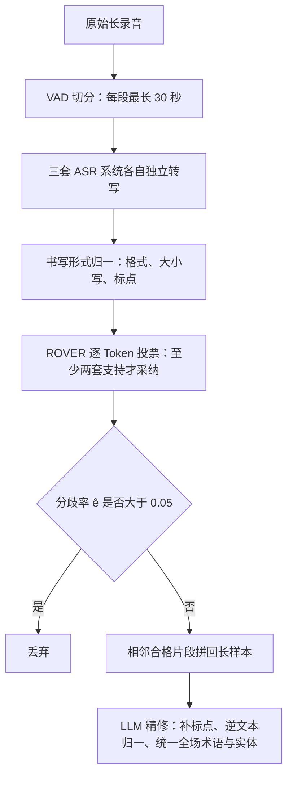
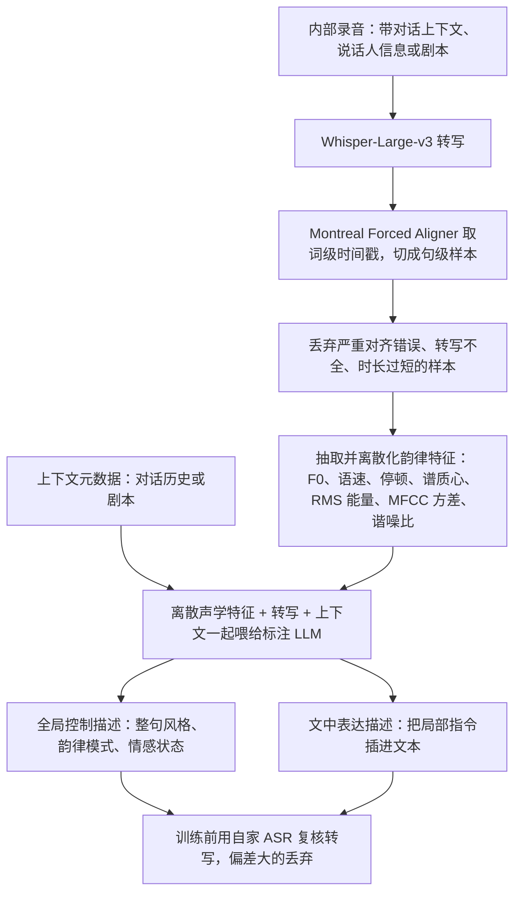
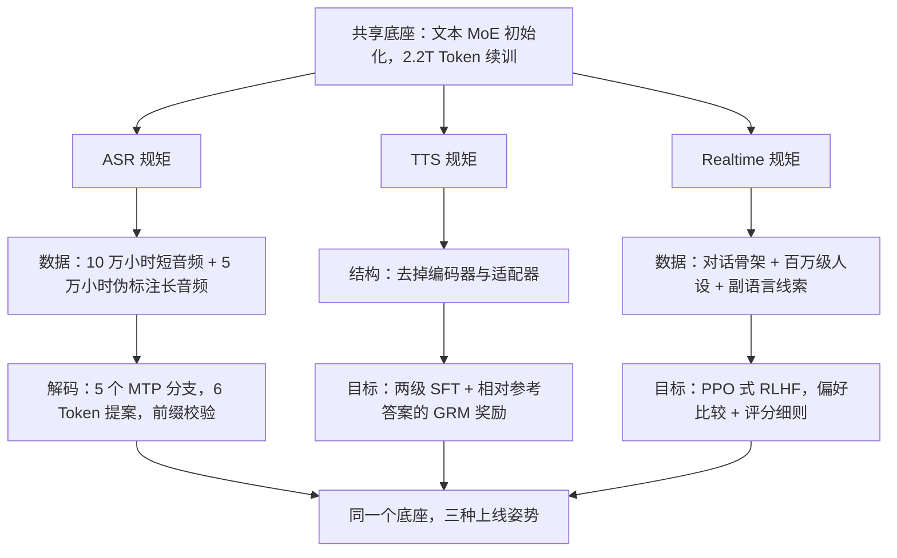

# StepAudio 2.5：把「专用系统」的差别，从架构挪进上线规矩

<!-- release-date: 2026-04-16 -->

> 本文依据 StepFun-Audio Team 的 **StepAudio 2.5 Technical Report**，arXiv:2605.23463v1，2026-05-22 提交，共 19 页。页码均指该 PDF 自身的页码。文中区分三件事：报告明确写了什么、我们怎么解释它、哪些是外部资料补充或本文推算。

## 先讲一个会被三种人骂的产品

你在做一个语音产品，三类用户同时提需求。

做会议纪要的扔进来一段两小时录音，只关心字要对、速度要快。做有声内容的给一段文案，要求「这句读得像在憋笑，下一句突然沉下来」。做语音助手的要模型听见用户的犹豫和叹气，用固定人设回话，而且话音一落就得出声。

三个需求彼此拉扯：纪要要的是**吐字快、别多想**，有声内容要的是**慢慢琢磨怎么读**，语音助手要的是**边听边想边说，还不能超时**。

传统做法是三类需求各做一套系统。这份报告的回答正好相反：只做一个底座，再用三套「上线规矩」把它变成三种产品。报告在引言里把这写成全文主张（PDF p. 2）：

> 一旦文本和音频共享一个成形的表示空间，下游任务之间的差别就会从架构迁移到运行方式上：数据、目标和解码约束。

后面每一节都在给这句话补证据。

## 阅读前先认识几个词

- **ASR / TTS**：语音识别（Automatic Speech Recognition）与语音合成（Text-to-Speech）。
- **连续特征与离散音频 Token**：声音进模型前要压缩。压成浮点向量叫连续特征，模型只能读；压成词表里的编号叫离散音频 Token，模型可以像写字一样吐出来。
- **MoE**（Mixture-of-Experts，混合专家）：很多组参数叫专家，每个 Token 只激活少数几个；决定激活谁的部件叫路由器（router）。
- **MTP**（Multi-Token Prediction，多 Token 预测）：一次前向除了下一个 Token，还额外猜后面几个。
- **RTF**（Real-Time Factor，实时率）：处理一秒音频要花几秒。0.01 意味着一小时录音只要 36 秒。
- **RLHF**（Reinforcement Learning from Human Feedback，基于人类反馈的强化学习）：先训一个判断「哪个回答更好」的奖励模型，再用它给策略打分。
- **GRM**（Generative Reward Model，生成式奖励模型）：奖励模型本身是一个生成模型，而不是只吐一个标量的小网络。
- **副语言信息**：话里除字面意思之外的东西，如犹豫、笑声、叹气、语速变化。
- **人设一致性**（persona consistency）：整段对话里保持同一个性格与说话风格，哪怕用户故意试探。

## 一句话先说清

StepAudio 2.5 不是三个模型共用一个名字，而是**一个续训出来的音频语言底座，加三套不同的后训练与解码规矩**：

- **底座**：从一个文本 MoE 模型出发，用 2.2T Token 的文本与音频数据续训，把音频接进同一个序列空间（PDF p. 4）；
- **ASR**：在解码器后面挂 5 个 MTP 分支，一次前向提出 6 个 Token，只接受校验通过的前缀，RTF 做到 0.0053（PDF p. 5、p. 9）；
- **TTS**：**把编码器和适配器整条拿掉**，合成退化成纯下一 Token 预测，再用生成式奖励做 RLHF（PDF p. 9–10）；
- **Realtime**：一行架构都不改，全部改动落在数据组成与分阶段优化上（PDF p. 12–13）。

三条分支都声称达到或超过专用系统（PDF p. 1），但证据强度差别很大：ASR 有公开基准可复核，TTS 与 Realtime 主要靠内部评测。

如果只记一句话：

> 当底层表示已经共享，**「做几个模型」会退化成「配几套数据、目标和解码约束」**。架构不再是产品差异的载体。

## 全景：一个底座，三个分支各用到什么

报告自己的 Figure 1（PDF p. 4）画的是「共享音频语言栈」在上、三个模型在下，三个分支都从完整的「编码器 → 适配器 → 解码器」栈上垂下来。但 §5 开头明说 TTS 完全去掉了编码器—适配器模块（PDF p. 9），所以 Figure 1 表达的是「同一个模型家族」，不是三个分支的实际数据通路。上图按正文把这一点画了出来。

### 结构故意不对称

报告点名这个设计是**有意不对称的**（PDF p. 3）：冻结的编码器只负责把波形稳定地抽象成声学表示；解码器承担语义、上下文管理、指令遵循和生成。理由是：**一旦语义主要住在解码器里，输出形态不同的下游任务也能共享模型的绝大部分**（PDF p. 3）。

反过来想更清楚：如果把大量语义放进音频编码器，ASR 的编码器和 TTS 的编码器会各自朝不同方向长，最后还是两个系统。把编码器压成只做声学抽象的薄层，是三条分支共享权重的前提。

### 三个方向是同一份记忆的三种问法

报告用「方向性推理」概括三条分支（PDF p. 3）：

| 分支 | 输入条件 | 输出空间 | 核心难点 |
|---|---|---|---|
| ASR | 音频嵌入 | 窄、离散，被语音信号牢牢锚住 | 准确、长音频一致、够快 |
| TTS | 文本与控制指令 | 丰富得多 | 不是字对不对，而是读得是否忠实、自然、有表现力 |
| Realtime | 音频理解与回复生成耦合 | 回复 | 严格的轮级延迟约束下维持对话状态与人设 |

由此报告给出一句观察：**底座本身不需要区分「理解」和「生成」**，只需要一个高质量的多模态先验，加上把监督路由到不同输出空间的机制；识别、合成、实时对话是查询同一份多模态记忆的三种方式（PDF p. 3–4）。

### 这一节可以带走什么

多任务共享的关键不在「有没有共享层」，而在**智能放在共享侧还是私有侧**。共享侧越薄越通用，私有侧越容易分叉。推荐系统的共享 embedding、多语言模型的共享词表，都是同一个取舍。

## 先把报告没写的东西摆出来

这份报告的重心在后训练，读者本能会找的一批数字它都没给：

- **任何参数量**：编码器、适配器、解码器多大，MoE 有几个专家、每 Token 激活几个，全文没有一个数，只说由「一个文本 MoE LLM」初始化（PDF p. 4）；
- **音频 Token 的规格**：帧率、码本、量化方式都没写；
- **音频 Token 怎么变回波形**：声码器或流匹配之类的下游模块完全没提；
- **任何以毫秒计的延迟**：摘要说 Realtime 实现了「低延迟」（PDF p. 1），评测里却只有质量分数（PDF p. 15）；
- **流式与全双工机制**：怎么判断用户说完、怎么处理插话，都没描述。参考文献里列了几篇全双工工作（PDF p. 18），但报告没说 StepAudio 2.5 用了它们；
- **训练算力、卡数、时长**；
- **权重与代码**：唯一放出的是一个长音频测试集的构造脚本（PDF p. 8 脚注）。

一个连锁后果：没有音频 Token 率，**32K 序列能装多长的录音就算不出来**。报告说长音频识别受益于「原生 32K 上下文」（PDF p. 8），读者无法换算成分钟。

## 共享数据引擎：先给声音分级，再决定谁在哪一阶段进场

三条分支共享的不只是权重，还有一条自动化数据生产流水线（PDF p. 4）：

1. 用声音事件检测（SED）和语音活动检测（VAD）滤掉低质量的非语音片段；
2. 把相邻 VAD 片段**先合并再重切**成语义相对完整、时长合适的基础样本；
3. 音频级标注：音质打分、合成语音检测、说话人数量；
4. 文本级标注：**两套** ASR 模型分别转写并识别语种，再用 WER、编辑距离、语速交叉验证；
5. 基于转写做语义完整性评估与内容分类；
6. 按语种、时长、语义质量分、音质分归类分级，**让预训练的不同阶段抽取不同质量档位的数据**。

第 6 步是重点。清洗是把坏数据扔掉，分级是把数据排队：前者只有一个门槛，后者能支撑课程式训练，早期用量大质量一般的数据铺覆盖，后期用高质量数据修细节。后面 600B 的冷却阶段就是「高质量」档位的用武之地（PDF p. 5）。

报告没公开各类数据的配比、语种清单、去重方案、两套 ASR 是哪两套、各级阈值。

**可迁移启发**：多阶段训练的项目，应该在数据流水线里**保留质量分，而不是入库时用阈值把数据二分掉**；阈值一旦落地，就失去了「这一阶段要什么档位」的调节能力。合成语音检测也值得单拎出来：训练数据里混进别家合成的声音，等于在悄悄做不受控的蒸馏。

## 底座预训练：四步把音频接进一个文本 MoE

底座从一个文本 MoE 大模型出发，在 2.2T Token 的文本与音频数据上续训；报告强调这是「具体的分阶段配方，不是含糊的扩规模」（PDF p. 4）。报告说第一阶段「沿用 Step-Audio 2」（PDF p. 5），所以把两代的配方并排放，能看出哪些是继承、哪些变了。Step-Audio 2 一列来自它自己的技术报告（PDF p. 7，见 Step-Audio-2 一篇），不是本报告的内容：

| 阶段 | Step-Audio 2 | StepAudio 2.5 |
|---|---|---|
| 初始模型 | 某个文本 LLM，未说明 | 文本 MoE LLM，规模未说明 |
| 对齐：只训适配器 | 100B Token ASR 数据 | **3B** Token ASR 数据 |
| 扩词表后的稳定期 | 256B（128B 文本 + 128B 音频），16K 序列，分部件学习率 | 128B 预热，16K 序列，分部件学习率，路由器学习率更小 |
| 主训练 | 800B，学习率统一 | 与预热同属 800B 文本 + 800B 语音的混合；学习率拉回基线，MoE 辅助损失与路由器学习率逐步退火 |
| 冷却 | 200B 高质量数据 | 600B 高质量数据，序列升到 32K，新增 Audio Caption 与 Instruct TTS |
| 合计 | 1.356T | 2.2T |

2.5 一列来自 PDF p. 4–5。

### 第一步：先只训适配器，而且只用 3B

用 3B Token 的 ASR 数据在适配器里对齐语音与文本特征空间，**音频编码器和 LLM 全部冻结**，只训适配器（PDF p. 5）。报告的说法是，这一阶段建立起声学特征能被文本原生解码器消费的初始接口。

为什么只训接口？适配器刚随机初始化，一上来全参数训，它会往解码器里灌噪声，解码器为适应噪声开始破坏原有的文本能力。**先把接口谈拢，再谈业务。**

值得注意的是规模：Step-Audio 2 这一步用了 100B，2.5 只用 3B，而且报告说是「沿用」。报告没有解释为什么能少两个数量级。

### 第二、三步：新参数放开，路由器收紧

扩词表之后进入统一多模态训练，序列 16K，混合里是 800B 文本加 800B 语音；语音部分包括 ASR、TTS、语音到文本翻译、句级文本—语音交错续写、语音到语音对话（PDF p. 5）。报告特意强调：模型接触音频**不只是作为转写输入，而是作为一种会出现在多种输入输出配置里的通用序列模态**（PDF p. 5）。这是三条分支能共享底座的直接前提：如果预训练时音频只出现在输入侧，TTS 分支就得从零学会把音频放到输出侧。

这一段又分两截（PDF p. 5）：

- **128B 预热**：稳住新加的语音词表，让 MoE 专家快速适应音频。适配器、嵌入层、输出层的学习率比基座大，**MoE 路由器的学习率更小**，以减少对文本模态的扰动；
- **主训练**：分部件学习率拉回基线，MoE 辅助损失系数与路由器学习率逐步退火，在专家利用率与 top-k 路由概率之间维持更好的平衡。

路由器那一条是 MoE 底座独有的新问题。路由器已经在文本上学会「哪个专家处理哪个 Token」，被音频数据大幅改写，文本侧的专家分工会被打乱，所以给它小学习率。辅助损失的退火，我们的理解是：它逼专家负载均衡，早期不加会塌到少数专家；稳定之后继续压着，会让路由器为了均衡把 Token 送给不是最合适的专家，所以逐步松手。

**可迁移启发**：给不同部件设不同学习率，判据是**这个部件是新初始化的，还是一个改动会波及全局的枢纽**。新参数放开，枢纽收紧；路由器、门控都属于枢纽。

### 第四步：600B 冷却，两类新数据

冷却阶段用 600B 高质量文本与音频，序列从 16K 升到 32K；新引入 **Audio Caption**（给一段音频写描述）和 **Instruct TTS**（按自然语言指令合成语音）两类数据（PDF p. 5）。后者正是 TTS 分支「一句话描述读法」这项能力的源头。

长上下文放在最后、用最干净的数据做，是常规安排：长序列每步更贵，放在质量最高的阶段最划算。

### 一个可以自己验算的加法

$3 + 800 + 800 + 600 = 2203$B，约等于报告说的 2.2T（PDF p. 4）。这说明 128B 预热包含在 1600B 的多模态混合里，而不是额外一段（加法为本文所做）。

报告把预训练的意义总结为：模型学到的不只是音频与文本的原始关联，而是**一个可操作的接口**，后来被三个方向复用（PDF p. 5）。

## ASR 分支：把声学确定性换成解码速度

### 旧问题：解码器越大，每个字越贵

自回归解码一次前向出一个 Token，长录音要出成千上万个字就要跑成千上万次前向。共享底座的解码器比传统 ASR 的解码器大得多：对照模型 Qwen3-ASR-1.7B 的规模写在名字里，StepAudio 2.5 只说自己用了「更大的解码器」（PDF p. 8）。矛盾很直接：**想要大解码器的语言先验，又不想付大解码器的逐 Token 代价。**

### 新设计：MTP-5，一次提 6 个，只收校验过的前缀

图为原文 Figure 2（PDF p. 6），只画了前两个 MTP 模块，正文说明共 5 个。

在解码位置 $t$，主分支预测下一个转写 Token $x_{t+1}$，第 $h$ 个 MTP 分支预测 $x_{t+1+h}$，$h \in \{1,\dots,5\}$，所以一次前向产出 6 个 Token 的提案（PDF p. 5）。

关键在采纳规则：提案**只以已验证前缀的形式被接受**，一旦某个未来 Token 与正常解码路径不一致，它和它之后的全部被拒绝，解码从已接受的前缀继续自回归（PDF p. 5）。报告的原话是 MTP「严格只作为加速原语」。

这句话的含义是：**最终转写永远由已验证路径决定**，MTP 猜错只会浪费一次前向，不会改变结果。加速和质量就此解耦，可以放心把 MTP 调激进。

每个 MTP 块接收两样东西：上一分支的隐状态，和一份右移过的 Token 嵌入。两路分别归一化（图中的 H-Norm 与 E-Norm），拼接后投影回解码器隐藏维度，再过一个解码器风格的 Transformer 块；**所有分支与主解码器共用同一个嵌入层和词表输出头**（PDF p. 5–6）。词表输出头通常是模型里最胖的矩阵之一，共用它让 5 个分支的增量参数只剩归一化、投影和一层 Transformer。报告没给这部分参数量。

### 训练分两段，顺序不能反

先做 ASR SFT：短音频与长音频打包进 32K 序列预算，对声学特征做 SpecAugment 式时间与频率掩蔽；编码器冻结，适配器与解码器训 10K 步，峰值学习率 $2 \times 10^{-5}$，全局 batch 32，100 步 warmup，余弦衰减到 $1 \times 10^{-6}$（PDF p. 6）。

**基础识别器充分收敛之后**才引入 MTP，分两段（PDF p. 6）：

1. **冻结分支对齐**：5 个 MTP 块挂到已收敛的解码器上，块内 Transformer 层**从解码器最后一层初始化**以继承语言先验，分支专有投影随机初始化；只训 MTP 块，峰值学习率 $2 \times 10^{-4}$，共享嵌入与 LM 头在内的其余模块全部冻结；
2. **联合校准**：分支对齐之后，解冻适配器与解码器联合优化，学习率降到 $2 \times 10^{-5}$，减少主干状态与前瞻分支之间的残余错配。

两段都沿用 32K 序列、全局 batch 32、10K 步（PDF p. 7）。

为什么顺序不能反？我们的理解：一开始就联合训练，主干可能为了让分支好猜而把自己的表示改得更容易预测，而「更容易预测」不等于「更准确」。先冻主干让新分支去适应，再小幅双向校准，把适应压力放在新部件上。这和预训练的「新参数放开、旧参数收紧」是同一条原则。

### 损失：越远的分支，权重越低

分支权重按指数衰减（PDF p. 7）：

$$
w_h = \frac{\alpha^{h-1}}{\sum_{j=1}^{H} \alpha^{j-1}}, \qquad H = 5, \quad \alpha = 0.9
$$

分子是第 $h$ 个分支的原始权重，分母把 5 个权重归一到和为 1；每往后一个分支，权重乘 0.9。每个位置的总损失是主任务加上加权的 MTP 损失：

$$
\mathcal{L}_t = \mathrm{CE}(p_t, x_{t+1}) + \sum_{h=1}^{H} w_h \, \mathrm{CE}(p_{t,h}, x_{t+1+h})
$$

$\mathrm{CE}$ 是交叉熵，$p_t$、$p_{t,h}$ 分别是主分支和第 $h$ 个辅助分支的分布。报告给的理由是「反映 MTP 的串行依赖」：第 5 个分支建立在前 4 个分支的隐状态之上，天生最不确定，**越靠后的猜测越不可信，就少给它一点话语权。**

### 数据：短音频保精度，长音频保一致性

**短音频**约 10 万小时，公开语料加内部数据，覆盖普通话、英语和高频中英夹杂，刻意纳入术语密集的垂直领域与远场、高噪声环境，每条最长 30 秒（PDF p. 7）。

**长音频**是 5 万小时伪标注数据（PDF p. 7）。没有人力标 5 万小时，报告用了一条多系统交叉验证流水线：

这张图按 PDF p. 7–8 的 §4.2 正文与 Figure 3 重画；Figure 3 上没有单独画「书写形式归一」一步，它来自正文。

几处讲究：

- **归一化放在投票之前**。三套系统可能一个写「2026年」一个写「二〇二六年」，不先统一，投票会把格式差异当识别错误。报告说这是为了让融合「聚焦于真正的识别错误」（PDF p. 7）。
- **ROVER 是 1997 年的方法**（Recognizer Output Voting Error Reduction，识别器输出投票纠错，PDF p. 19 参考文献 [30]）。在「多个弱信号合成一个强标签」这件事上，简单投票依然够用。
- **分歧率既是标签可靠性的代理，也是筛子**：

$$
\hat{e} = \frac{\text{分歧位置数}}{\text{文本单元数}}
$$

超过 0.05 的片段直接丢弃（PDF p. 7）。三套系统都拿不准的地方，多半是真难或真糊。

- **LLM 精修负责跨片段一致性**：恢复标点、做逆文本归一，并把整场会话里反复出现的术语和实体统一（PDF p. 7–8）。分段识别看不见整场，第一次把人名听成「李明」、第二次听成「李鸣」，它自己不会发现。

**可迁移启发**：要伪标签，不要只用一个更强的模型标一遍，而要**几个独立系统投票，再加一个可量化的一致性指标做筛子**。一致性指标同时给了你丢弃阈值和一张数据质量分布。

### 评测：平均值第一，逐项互有胜负

对照系统是 VibeVoice-ASR、FunASR-Nano、Doubao-ASR-2603、Qwen3-ASR-1.7B。除 Doubao 只能走官方 API 外，其余都在本地单张 NVIDIA H800 上单并发部署；不原生支持长音频的基线用 VAD 切成最长 30 秒的片段（PDF p. 8）。Table 1（PDF p. 9，错误率 %，越低越好）：

| 类别 | 测试集 | VibeVoice-ASR | FunASR-Nano | Doubao-ASR-2603 | Qwen3-ASR-1.7B | StepAudio 2.5 ASR | 不做 MTP 训练 |
|---|---|---:|---:|---:|---:|---:|---:|
| 中文 | AISHELL-1 | 5.19 | 1.88 | 2.07 | 1.49 | **0.71** | 0.79 |
| 中文 | AISHELL-2 ios | 5.10 | 2.61 | 2.70 | 2.50 | **2.29** | 2.30 |
| 中文 | WenetSpeech testnet | 14.79 | 5.30 | **4.03** | 4.44 | 4.54 | 4.57 |
| 中文 | WenetSpeech testmeeting | 17.09 | 5.31 | 5.09 | **4.66** | 4.70 | 4.73 |
| 中文 | FLEURS zh | 8.77 | 3.19 | 2.83 | 2.74 | **2.63** | 2.63 |
| 中文 | 平均 | 10.19 | 3.66 | 3.34 | 3.17 | **2.97** | 3.00 |
| 英文 | LibriSpeech clean | 2.30 | 1.80 | 2.94 | 1.69 | **1.38** | 1.40 |
| 英文 | LibriSpeech other | 5.79 | 4.43 | 5.98 | 3.57 | **3.16** | 3.14 |
| 英文 | Common Voice v11 en | 20.03 | 11.05 | 14.06 | **7.50** | 7.57 | 7.62 |
| 英文 | FLEURS en | 5.20 | 4.96 | 6.74 | **3.23** | 3.55 | 3.74 |
| 英文 | VoxPopuli cleaned AA | **2.38** | 3.97 | 3.61 | 3.28 | 2.76 | 3.23 |
| 英文 | 平均 | 7.14 | 5.24 | 6.67 | 3.85 | **3.68** | 3.83 |
| 长音频 | LibriSpeech clean long | 1.66 | 2.34 | 2.81 | 1.95 | **1.27** | 1.27 |
| 长音频 | LibriSpeech other long | 3.48 | 4.89 | 5.59 | 3.81 | **2.90** | 2.81 |
| 长音频 | WenetSpeech testnet long | 8.73 | 4.74 | **3.72** | 4.15 | 4.09 | 4.09 |
| 长音频 | Earnings22 cleaned AA | **5.62** | 10.38 | 12.33 | 6.90 | 6.52 | 6.34 |
| 长音频 | 平均 | 4.87 | 5.59 | 6.11 | 4.20 | **3.70** | 3.63 |

加粗是本文按数值在五个对照系统中取最低（不含最后一列）；原表的加粗与下划线在 LibriSpeech other、LibriSpeech other long 两行没有标出最低值。

三档平均都是第一。但 14 个测试集里 StepAudio 2.5 ASR 最好的是 7 个，另外 7 个输给别人：WenetSpeech 的 testnet、testmeeting、testnet long 三项输给 Doubao 或 Qwen3，英文的 Common Voice、FLEURS en 输给 Qwen3，VoxPopuli 与 Earnings22 输给 VibeVoice（统计为本文所做）。报告「新的性能前沿」这句话在平均值上成立，**真实选型要看和自己业务最像的那一两个测试集**。

### MTP 到底有没有伤到精度

报告说加上 MTP-5 后识别精度「基本不变，平均波动在 0.06 个绝对点以内」（PDF p. 8）。用 Table 1 核对（差值为本文所做）：中文平均 2.97 对 3.00，好 0.03；英文平均 3.68 对 3.83，好 0.15；长音频平均 3.70 对 3.63，差 0.07。单项差得最大的是 VoxPopuli：2.76 对 3.23，差 0.47。

结论要说准：方向上 MTP 没有损害精度，三档里两档还变好；但「0.06 以内」这个具体表述，按三档平均或逐项差值都复现不出来。另外，联合校准那一段解冻了适配器与解码器（PDF p. 6），「加 MTP」顺带多训了一轮，报告没把这两个因素分开。

### 速度：RTF 0.0053

Table 2（PDF p. 9，在 100 条 30 秒片段上测得）：

| 模型 | VibeVoice-ASR | FunASR-Nano | Doubao-ASR-2603 | Qwen3-ASR-1.7B | StepAudio 2.5 ASR |
|---|---:|---:|---:|---:|---:|
| RTF | 0.1039 | 0.0591 | 0.0640 | 0.0094 | **0.0053** |

换算一下（本文所做）：一小时录音约 $3600 \times 0.0053 \approx 19$ 秒；相对 Qwen3-ASR-1.7B 快 $0.0094 / 0.0053 \approx 1.77$ 倍。报告的解读是：**解码器规模不再线性转化为逐 Token 延迟，因为大多数步骤一次吐出好几个已验证的 Token**（PDF p. 8）。注意 Doubao 走的是 API，和本地单卡部署的其他系统不是同一种条件。

### 前瞻深度选 5，不选 7

Table 3 是严格逐位接受率，在 WenetSpeech meeting 集上测得（PDF p. 9）：

| 配置 | 第 1 位 | 第 2 位 | 第 3 位 | 第 4 位 | 第 5 位 | 第 6 位 | 第 7 位 | 平均接受长度 |
|---|---:|---:|---:|---:|---:|---:|---:|---:|
| MTP-3 | 0.96 | 0.88 | 0.80 | – | – | – | – | 3.6 / 4 |
| MTP-5 | 0.95 | 0.88 | 0.80 | 0.71 | 0.64 | – | – | 5.0 / 6 |
| MTP-7 | 0.96 | 0.88 | 0.80 | 0.72 | 0.65 | 0.59 | 0.53 | 6.1 / 8 |

报告读出两个趋势（PDF p. 8–9）：靠前位置的接受率几乎不随分支总数变化，说明每个 MTP 头学到的是稳定独立的预测任务；从第 2 位起，接受率按约 0.9 的因子逐位衰减。从 3 个分支到 5 个，平均接受长度提升 39%；到 7 个只再多 22%，因为第 6、7 位失败率高，频繁触发 KV Cache 回滚、打断解码流。所以选 MTP-5。$5.0 / 3.6 \approx 1.39$、$6.1 / 5.0 = 1.22$，两个百分比都对得上。

表里还藏着一个关系：

$$
\text{平均接受长度} = 1 + \sum_{h} p_h
$$

1 是主分支必然被采纳的那个 Token，$p_h$ 是第 $h$ 位的严格接受率。代入：MTP-3 得 3.64，MTP-5 得 4.98，MTP-7 得 6.13，与表中 3.6、5.0、6.1 一致（验算为本文所做，报告没写这个公式）。这说明「严格逐位接受率」指的是**前缀一直到该位都被接受的概率**，而不是该位单独猜对的概率；理解错了，加速比就会算错。

另有一个数值巧合：损失里的 $\alpha = 0.9$（PDF p. 7）与实测接受率的衰减因子约 0.9（PDF p. 9）相同。报告没说两者有因果关系。

### 报告自己提炼的启发

§4 结尾的 Insight（PDF p. 9）：有外部模态锚定的生成任务，有时可以比自由文本生成加速得更激进，**因为外部模态减少了语义分叉**；锚定不只是信息来源，也是算法结构的来源。

转写一段清晰的语音，下一个字往往只有一种合理选择；自由写作时下一个词有几十种。前者的未来本来就更好猜，投机式解码的接受率天然更高。

**可迁移启发**：判断一个任务适不适合投机解码，看的是**输出的条件熵**，不是模型大小。语音转写、OCR、结构化填充、按模板生成代码都属于答案被外部证据锁死的一类，前瞻可以调得更激进；创意写作上同样的深度会大量浪费在回滚上。

## TTS 分支：把编码器整条拿掉

### 旧问题：怎么用一句话控制读法

报告要的是自然语言控制：用一句描述指定读法。这意味着模型必须把**文本侧的语义**和**音频侧的实现**对齐，而不只是把文字转成音。

### 新设计：不是加东西，是减东西

和 ASR、Realtime 相比，TTS 分支的独特之处是**完全去掉编码器—适配器模块，只靠 LLM 主干建模**；音频 Token 被当成语言建模框架里的一门新「语言」，合成被改写成纯粹的下一 Token 预测，关键挑战变成文本与音频表示空间的对齐（PDF p. 9–10）。

理由很自然：编码器和适配器的职责是把声音读进来，TTS 的输入是文本和指令，不需要读声音。预训练已经把音频 Token 放进词表，TTS 就可以只用词表那一侧。这是「统一底座」主张最有说服力的证据之一：**能删掉的共享，才是真的共享。**

边界要同时说清：报告没交代音频 Token 如何得到、如何还原成波形；「零样本音色克隆」要用参考音，而编码器已被去掉，参考音以什么形式输入也没写。「纯 NTP」只覆盖从文本到音频 Token 这一段。

### SFT：先管整段，再管局部

SFT 以零样本音色克隆 TTS 为主要目标，分两级（PDF p. 10）：

1. 大规模零样本 TTS 训练，配**全局指令**监督，学会对说话人特征、说话风格与整体韵律做粗粒度控制；
2. 换成同时带全局指令与**文中指令**的高质量内部录音，把控制细化到句级与片段级。

先学「整段用什么调子」，再学「某一小段临时变调」；先教局部，模型没有稳定的全局基准，局部指令就没有参照系。报告说这只是建立了指令与音频之间的「初步」对齐（PDF p. 10），推上去要靠后面的 RL。

### 数据：一半自己造，一半标出来

SFT 数据分两类（PDF p. 10–11）：

**模型合成数据**：所有全局指令控制数据都由 Step-Audio-EditX 合成（PDF p. 10），理由是它在多种风格与情感属性上有很强的组合式编辑能力，能大批造出多样的语音。必须说破的边界：**用自家模型合成训练数据，会把那个模型的风格分布连同偏差一起继承下来**。报告没讨论这一点，也没给合成与录音的配比。

**录音标注数据**：用于全局与文中联合控制，沿用 Emotional-Context-Speech 的标注流水线，但改了标注目标：不再产出结构化的上下文标签，而是产出两种自然语言监督（PDF p. 11）：

这张图按 PDF p. 11 的 §5.2 正文重画，报告没有为这条流水线配图。

最巧的一步是**把连续声学量离散化后当文字喂给 LLM**。F0（基频，对应音高）、谐噪比（HNR，谐波与噪声成分之比，粗略对应嗓音清亮还是沙哑）这些数 LLM 本身读不懂，量化成有限档位拼进提示词后，LLM 就能结合转写和上下文写出「语速偏快、句末明显停顿、像在压着笑」这种描述。

**可迁移启发**：想让 LLM 标注一种它感知不到的信号时，**先把信号量化成有限档位的符号，再让 LLM 做语义合成**。信号处理负责测量，LLM 负责组织成语言。

### RLHF：拿参考答案当尺子

RL 的定位写得很清楚：处理指令变复杂、抽象、高度依赖上下文之后的对齐（PDF p. 10）。做法是先训一个生成式奖励模型 $r_\phi$（PDF p. 10）：每个提示 $x$ 配一条高质量参考回答 $y^*$；策略 $\pi_\theta$ 生成候选 $y$；GRM 在同一提示下评估 $y$ 相对 $y^*$ 的质量，输出成对的标量偏好分。最终奖励再过一次整形（PDF p. 10，式 1）：

$$
r_{hf}(x, y, y^*) = s\left(r_\phi(x, y, y^*)\right)
$$

$s(\cdot)$ 是奖励变换。真正的设计点在于**相对参考回答**：「这段语音的表现力几分」连人类评委都对不齐，「这段比参考读得更贴合指令吗」稳定得多。

空缺也要承认：$s(\cdot)$ 的形式、GRM 的规模与训练数据、RL 算法与超参数都没给。式 1 本身几乎没有约束，只说「分数还要再变换一下」。

### 评测：为什么放弃了常规指标

§5.3 花了一段解释为什么不用常规指标（PDF p. 11），这段比结果本身更有价值：

- CER 与说话人相似度对 LLM 类语音生成有系统性偏差：副语言现象丰富时 ASR 类指标失准，你让模型读得像憋笑，ASR 就更容易听错；
- 基于嵌入的说话人验证会丢掉高频细节，刻画不了韵律、风格和表现力上的相似；
- LLM 当裁判仍难可靠评估韵律与复杂情感；
- 主观 MOS 需要高度训练的评委，且评分标准常不一致。

所以改用竞技场式成对评测、以聚合胜率衡量，并做了三件事保证可靠（PDF p. 11–12）：用听感敏感度测试筛评委，评委集合固定、同一周期内连续评完；音频对的选取与左右位次都随机，并要求评委写出偏好理由；评测中周期抽检、及时干预，结束后复核分歧大的样本。三条分别对应评委不合格、位次偏见、中途标准漂移。

### 结果：胜率很高，但有三处要说清

对手是三个支持可控生成的商业模型，各用官方推荐的最优音色预设（PDF p. 12）。Figure 4 的计数（PDF p. 12，读图所得）：

| 对手 | 胜 | 平 | 负 | 合计 | 胜率 |
|---|---:|---:|---:|---:|---:|
| MiniMax-2.8-HD | 488 | 88 | 198 | 774 | 63.0% |
| ElevenLabs-v3 | 619 | 65 | 90 | 774 | 80.0% |
| Gemini-3.1-flash-tts | 230 | 62 | 95 | 387 | 59.4% |
| 汇总 | 1337 | 215 | 383 | 1935 | 69.1% |

1. **正文与图不一致**。正文写总体胜率 67.6%（PDF p. 12），图右下角是 69.1%，按计数 $1337 / 1935 = 69.1\%$ 与图一致；三组胜率的简单平均约 67.5%，接近正文的数，但也不完全相等。报告没说明 67.6% 的算法。
2. **Gemini 一组只有一半样本**。正文说每个模型用 774 条提示（PDF p. 12），Gemini 一组合计 387。它恰好是胜率最低的一组，在按局数加权的汇总里权重只有另两组的一半。
3. **对照面窄**。三个对手都是商业 TTS，没有开源系统，也没和自家上一代比。

这一节没有任何客观指标数值。这是主动取舍，理由站得住；代价是**这一分支的结论无法独立复核**：评委、提示集、音频样本都没公开。

## Realtime 分支：一行架构都不改

### 报告给自己出的最难考题

Realtime 分支**原封不动地继承底座架构**：音频编码器、把声学表示投进解码器隐空间的适配器，以及一个**回复前先产出显式内部推理轨迹**的大解码器（PDF p. 12）。报告再补一句：应对实时对话挑战，靠的是数据组成与分阶段优化，**不对架构做结构性改动**（PDF p. 13）。

如果开头那个主张成立，这里就必须如此：你说差别在数据、目标和解码上，那就一行架构都别改，看能不能做出实时对话。

### 四个挑战：三个关于能力，一个关于优化

报告的前提是「多轮口语交互在严格延迟约束下」，由此引出四个挑战（PDF p. 12–13）：

1. **对话连贯性**：跨长对话维持话题、风格和对话状态；
2. **人设一致性**：在多样甚至对抗性的输入下坚持既定性格与表达风格；
3. **副语言敏感度**：理解并恰当回应犹豫、笑声、叹气、语速变化；
4. **奖励稀疏**：自然度、情绪贴切度这类属性没有单一真值，很难只靠可验证奖励优化。

第 4 条和前三条不在一个层面：前三条是「模型要会什么」，第 4 条是「常规办法教不了」。数学题能判对错、代码能跑测试，「这句回得自然吗」没有验证器，所以核心手段只能是 RLHF。

### 训练流水线：三段

**第一段：以音频为中心的中期训练**，直接继承自底座，提供音频锚定的感知与长程推理能力，作为引入对话行为前的基线（PDF p. 13）。

**第二段：渐进式 SFT**，是把底座变成健谈对象的主要工具，按三个维度逐步注入（PDF p. 13–14）：

- **对话对齐**：用指令丰富的对话数据校准多轮交互，处理不流利、话说一半被打断这类口语现象，**偏好口语化、适合朗读的回复，而不是书面文本**；
- **人设与风格控制**：把一批精选种子扩展成庞大的「性格特征 × 语言习惯」矩阵，让策略同时以人设规格和对话历史为条件；报告称这带来组合式泛化，能对没见过的人设组合调整表达描述和笑声、叹气这类非语言发声；
- **副语言敏感度**：用真实口语交互训练模型识别细微线索，**把线索登记进内部推理轨迹**，再据此调整语气与节奏。报告的说法是，模型要把静态的外部人设（谁在说话）和实时的副语言读取（用户在怎么说）合成起来。

前者是配置，后者是观察。只按人设回话会死板，只跟着用户情绪走会失去人设；报告给两者安排的交汇点，是那条内部推理轨迹。

为防止灾难性遗忘与风格漂移，SFT 全程用**动态排练调度**：交互专用数据持续与通用指令数据、推理任务交错，比例**依据验证指标动态调整**（PDF p. 14）。固定配比是拍脑袋，动态调整是闭环：哪项能力开始掉就往回加哪类数据。具体的验证指标与调整规则没公开。

**第三段：带生成式奖励的 RLHF**（PDF p. 14）。目标是带 KL 正则的 PPO 式目标；生成式奖励模型对照参考回答给候选打分，两路信号合成：

- **偏好比较是主信号**，管整体回复质量与对话自然度；
- **评分细则（rubric）分数作补充**，专管指令敏感的方面，尤其是跨轮连贯、忠实于用户先前说过的内容。

训练混用多轮对话与单轮提示：前者逼策略跨轮保持一致，后者给更长的推理与更丰富的偏好表达留空间（PDF p. 14）。

两路设计解决的是一个实际冲突：纯偏好比较擅长判断「哪个更好听」，对「违反了用户三轮前给的约束」不敏感，因为违约的回复读起来也可能很顺。细则把能明文写出的要求单独打分，补上这块盲区。

**可迁移启发**：奖励设计不必二选一。**能对一条样本写出「它错在哪」的，进评分细则；只能说「感觉不如另一条」的，交给偏好比较**，两路合并。

### 数据：三股流，一股是造出来的

SFT 数据对应上面三个维度（PDF p. 14）：

- **对话骨架**：来自自然口语交互的多轮对话，偏好轮间连续、有省略或不流利、有中途改口的样本，**下调书面风格回复的权重**，把策略锚在口语语域；
- **人设**：起点是 1 万多个由人端到端撰写、人工审核的「原生人设」，再用算法「裂变」把性格、语言习惯、情绪边界、交互原型这些**正交属性**重新组合，得到百万级人设矩阵；每个合成人设配上取自百万级真实场景语料的对话；
- **副语言线索**：对话带一个管语速、重音与潜台词的氛围描述符，加上犹豫、轻笑、叹气、呼吸、节奏变化、语调下降这些线索标签。

外加一份继承自中期训练的通用能力数据交错其中；全量语料过一条统一流水线，检查角色内一致性、交叉验证标注，并**移除裂变带来的近重复样本**（PDF p. 14）。

人设那一股的关键是「正交」。直接让 LLM 生成一百万个人设，会得到一百万个相似的角色；先由人写一万个高质量种子、拆出彼此独立的维度、再组合，覆盖度来自组合爆炸而不是采样多样性。这也解释了为什么模型能泛化到没见过的人设组合：**每个属性都见过，只是没见过这个搭配**。失败模式也随之而来，「看着多、其实同质」，所以去重不可省。

### 评测：五个套件，全部是自家的

评测结合手机 App 会话里的主观人评与基于 API 的客观评测（PDF p. 15）：

- **Step-Dialogue-Human-Eval**：通用对话场景的主观 App 评测；
- **step_Dialogue_general**：通用对话的客观 API 评测；
- **step-Dialogue-car**：车载对话的客观 API 评测；
- **Step-Dialogue-Understanding**：87 条音频，测模型能否直接从音频推断说话人的年龄、性别、语速等声学特征；
- **Step-SPQA**：一个 11 类「音频提问、音频作答」基准，报告说它在 Step-Audio 2 中提出。

Figure 5 的分数（PDF p. 15，读图所得）：

| 套件 | StepAudio-Realtime | GPT-realtime-1.5 | Gemini live-202604 | DouBao Realtime-202604 |
|---|---:|---:|---:|---:|
| Human Eval（主观） | **80.41** | 68.01 | 67.16 | 70.70 |
| General（客观） | **86.36** | 81.60 | 76.51 | 62.61 |
| Car（客观） | **84.80** | 80.80 | 79.40 | 75.69 |
| AU（客观） | **82.18** | 80.46 | 58.05 | 16.09 |
| Step-SPQA（客观） | **79.80** | 53.20 | 63.20 | 33.80 |

图上第四组的横轴标签是「AU」，按套件列表推断对应 Step-Dialogue-Understanding（音频理解）；报告没写这个映射。

报告的两个具体主张（差值为本文所做）：

- 主观人评「相对次优系统 +10.0」（PDF p. 15）：次优是 DouBao 的 70.70，$80.41 - 70.70 = 9.71$，四舍五入是 9.7，不是 10.0；
- Step-SPQA「+16.6」：$79.80 - 63.20 = 16.60$，对得上。

五个套件全部第一成立，但幅度差别很大：AU 只比 GPT-realtime-1.5 高 1.72 分，Car 高 4.00，Step-SPQA 高 16.60。DouBao 在 AU 上只有 16.09，比其余三家低四十多分，这种量级的落差更像是输出格式或能力边界与评测方式不匹配，报告没解释。

还要知道这些套件是谁的：前四个是自家内部套件，评分口径与数据都没公开；Step-SPQA 对应 Step-Audio 2 报告里公开发布的 StepEval-Audio-Paralinguistic（Step-Audio 2 的官方发布页用的就是 Step-SPQA 这个名字，见 Step-Audio-2 一篇）。那份报告里 Step-Audio 2 在这个基准上得 83.09（Step-Audio 2 报告 PDF p. 11），高于这里 StepAudio 2.5 Realtime 的 79.80；但两份报告的对照模型、评测版本和打分流程都不同，本报告也没把 Step-Audio 2 列为基线，这两个数不能直接比出「退步」。

### 这一节最大的空缺

摘要说 Realtime 实现了「低延迟、人设一致的对话」（PDF p. 1），§2.2 说它工作在「严格的轮级延迟约束」下（PDF p. 3），§6 的四个挑战也是在「严格延迟约束」这个前提下提出的（PDF p. 12）。但**评测里没有一个延迟数字**：没有首包延迟、没有端到端时延、没有并发表现（PDF p. 15）。

更要紧的是，这条分支的解码器**回复前要先写一段显式内部推理轨迹**（PDF p. 12）。它要占解码步数，而步数直接换算成时间。轨迹多长、是否与出声并行、代价多大，都没写。怎么判断用户说完、能否被插话打断，也没写。

所以最稳妥的说法是：**它在五个对话质量套件上领先；它的延迟表现，这份报告无法评估。**

## 三条分支放在一起看

| | ASR | TTS | Realtime |
|---|---|---|---|
| 结构改动 | 加 5 个 MTP 分支 | 去掉编码器与适配器 | 无 |
| 数据 | 10 万小时短音频 + 5 万小时伪标注长音频 | Step-Audio-EditX 合成 + 录音的全局与文中双层标注 | 对话骨架 + 百万级人设矩阵 + 副语言线索 |
| 优化目标 | 交叉熵 + 加权 MTP 损失 | 两级 SFT 后接相对参考答案的 GRM 奖励 RLHF | PPO 式目标 + KL，生成式奖励 + 评分细则 |
| 解码约束 | 6 Token 提案 + 前缀校验 | 纯下一 Token 预测 | 先写内部推理，再在轮级延迟内回复 |
| 证据 | 14 个公开测试集 + RTF + 前瞻深度对比 + 去掉 MTP 的对照 | 1935 局内部竞技场，无客观指标 | 5 个自家套件，无延迟数字 |

这张表按 PDF p. 5–15 各节整理。

三条分支的结构改动方向完全不同：ASR 是加，TTS 是减，Realtime 是不动。如果三条都得靠加模块才能成立，「差别在运行方式」这句话就空了；TTS 那个减法和 Realtime 那个不动，是这个主张最实的两块支撑。

但证据强度递减：**ASR 最扎实**，别人拿得到基准能复核；**TTS 次之**，方法清楚，结果只有内部胜率，且正文与图的总体胜率不一致；**Realtime 最弱**，套件都是自家的，最核心的延迟缺席。读这份报告，三条分支的可信度不该用同一把尺子。

## 和上一代的关系

报告对代际只写了三处：它建立在 Step-Audio 系列之上（引用 Step-Audio 2、Step-Audio-R1、Step-Audio-R1.5，PDF p. 2）；预训练第一阶段「沿用 Step-Audio 2」（PDF p. 5）；Step-SPQA「在 Step-Audio 2 中提出」（PDF p. 15）。除此之外没有任何与上一代的架构对比、指标对比或消融。

对照 Step-Audio 2 的报告能补几条事实（见 Step-Audio-2 一篇，属于另一份材料的内容）：两代都是「冻结编码器 + 适配器 + 文本 LLM 初始化的解码器」；Step-Audio 2 的对齐阶段用 100B ASR Token，这里是 3B；Step-Audio 2 的初始模型未说明是否 MoE，这里明确是 MoE；Step-Audio 2 主打的工具调用与音频检索，在这份报告里没有再出现。「为什么对齐只需 3B」「为什么不再提检索」，两份报告都没有回答。

命名也要注意：这一代写作「StepAudio 2.5」（不带连字符）；上一代在本报告正文里写作「Step-Audio 2」，参考文献条目却写作「StepAudio 2」（PDF p. 18），它自己的报告标题是「Step-Audio 2」。检索时两种写法都要试。

## 这份报告的证据强度

**有公开基准支撑的**：

- ASR 在中文、英文、长音频三档平均错误率上均为对照系统最低（PDF p. 9）；
- ASR 的 RTF 0.0053，在本地单卡单并发设定下快于其余系统（PDF p. 9）；
- MTP-3、5、7 的逐位接受率与平均接受长度，支撑选 5（PDF p. 9）；
- 加入 MTP 训练后精度没有下降（PDF p. 8–9），但「0.06 以内」的具体表述与表格不符。

**只是内部评测或作者观察的**：

- TTS 竞技场胜率（PDF p. 12）：协议细致，但评委、提示与音频不公开，总体胜率有两个不同的数；
- Realtime 五个套件的分数（PDF p. 15）：四个套件未公开，最大领先幅度出现在唯一公开的 Step-SPQA 上；
- 「一个底座能内化三种部署目标」（PDF p. 1、p. 16）：由三组各自独立的评测支撑，但报告没做「不共享底座会差多少」的对照，**共享本身的收益没有被单独测量**。

**完全没有公开的**：参数量与 MoE 配置；音频 Token 规格与还原路径；任何毫秒级延迟；流式与全双工机制；TTS 的 $s(\cdot)$、GRM 规模与数据、RL 算法与超参；Realtime 的 PPO 超参、排练调度规则与验证指标；内部推理轨迹的格式与长度；预训练数据配比与语种清单；训练算力；权重与代码。

另有一处引用瑕疵：引言里支撑「副语言线索直接影响识别、合成与对话」的一组引用 [15–19]（PDF p. 2），其中 [18] 是一篇用自适应滤波提取胎儿心电图的论文（PDF p. 18），与语音无关；Step-Audio-EditX 也被重复列为 [21] 和 [39]（PDF p. 18–19）。

## 最值得带回自己项目的七条

### 1. 共享侧要薄，智能放在私有侧的上游

编码器冻结、只做声学抽象，语义压进解码器（PDF p. 3）。做多任务系统先问：**共享层里有没有混进只对某一个任务有用的智能？**

### 2. 接新模态先只训接口层

两端冻结、只训适配器（PDF p. 5）。这一步很便宜，却能避免随机初始化的接口冲掉已有能力。

### 3. 新参数放开，全局枢纽收紧

预热期给适配器、嵌入层、输出层大学习率，给路由器小学习率（PDF p. 5）；MTP 第一段给新分支 $2 \times 10^{-4}$，第二段给老模块 $2 \times 10^{-5}$（PDF p. 6）。同一条原则用了两次。

### 4. 加速手段要设计成「猜错不改变结果」

MTP 只以已验证前缀被接受（PDF p. 5），加速与质量就此解耦。缓存、预取、投机执行都应先满足这一条再谈收益。

### 5. 能不能投机，看输出的条件熵

有外部模态锚定的生成，语义分叉少，可以加速得更激进（PDF p. 9）。转写、OCR、结构化填充适合；创意写作不适合。

### 6. 伪标签靠多系统投票，加一个可量化的一致性筛子

三套 ASR 独立转写、ROVER 逐 Token 投票、分歧率超过 0.05 丢弃（PDF p. 7）。一致性指标同时给出丢弃阈值和质量分布。

### 7. 奖励设计不必二选一

能写成规则的进评分细则，写不成规则的交给偏好比较，两路合并（PDF p. 14）。

## 用一张图重新串起全文

这张图按 PDF p. 4–15 的正文归纳，是机制与流程的概括，不含实测时长或性能数据。

## 关键词回看

- **运行方式（operational regimes）**：报告的核心用词，指数据构成、优化目标与解码约束；它主张任务差别体现在这里，而不是架构。
- **不对称设计**：编码器冻结、只做声学抽象，解码器承担语义、上下文、指令遵循与生成。
- **MTP-5**：5 个前瞻分支，一次前向提 6 个 Token，只以已验证前缀被接受。
- **严格逐位接受率**：前缀一直到该位都被接受的概率；平均接受长度等于 1 加各位接受率之和。
- **RTF**：处理一秒音频要花几秒；StepAudio 2.5 ASR 为 0.0053。
- **ROVER 与分歧率**：多套识别结果逐 Token 投票；分歧位置占比既是可靠性代理，也是 0.05 的丢弃阈值。
- **全局指令与文中指令**：前者管整句风格与情感，后者插在文本里管局部片段。
- **GRM**：生成式奖励模型；TTS 里它评候选相对参考回答的偏好，Realtime 里它结合偏好比较与评分细则。
- **竞技场式成对评测**：放弃绝对量表，两两比较再聚合胜率。
- **人设裂变**：人工种子拆成正交属性再重组，用组合爆炸换覆盖度。
- **动态排练调度**：按验证指标调整专用数据与通用数据的交错比例，防止遗忘。
- **Step-SPQA**：11 类副语言问答基准，即 Step-Audio 2 报告里的 StepEval-Audio-Paralinguistic。

## 最后的判断

这份报告没有提出新的架构组件：MTP、生成式奖励模型、PPO 都已存在，ROVER 更是 1997 年的方法。它的贡献是一个组织判断加三组落地证据：**当文本和音频真的共享了表示空间，「做几个模型」会退化成「配几套数据、目标和解码约束」**。TTS 能把编码器整条删掉、Realtime 能一行架构不改，是这个判断最实在的支撑。

它的边界同样清楚。ASR 有公开基准，结论最硬；TTS 与 Realtime 建立在内部评测上。一份把「低延迟」写进摘要的报告，**从头到尾没有一个以毫秒计的延迟数字**，也没描述流式与全双工机制。它还没做「不共享底座会差多少」的对照，「统一」本身带来多少收益没有量化。另有几处数字自相矛盾：MTP 精度波动「0.06 以内」、TTS 总体胜率 67.6% 与 69.1%、人评领先「+10.0」实为 9.71。

如果只记一句话：

> **当底层表示统一之后，不要再用「加一个模块」来支持新任务。先问这条路上有没有一整块可以删掉，再问该给它配什么数据、什么目标、什么解码约束。**

## 资料与阅读边界

- **原始依据**：本地 `papers/StepFun/StepAudio-2.5.pdf`，arXiv:2605.23463v1（2026-05-22），19 页；arXiv 上只有这一版。
- **首发日**：本文覆盖 StepAudio 2.5 模型家族，取最早对外可用的变体，即 StepAudio 2.5 TTS 于 2026-04-16 上线阶跃星辰开放平台，依据是当天的媒体报道（[第一财经](https://www.yicai.com/news/103136194.html)、[IT之家](https://www.ithome.com/0/939/919.htm)）。阶跃星辰官网与开放平台未找到带日期的官方公告，所以这不是官方记时；官方演示页仓库中 `step-audio-2.5-tts` 路径的提交集中在 2026-04-08 至 04-15，属于发布前预置，只能说明首发不早于页面备好之时。ASR 变体约 2026-04-24 上线（[IT之家](https://www.ithome.com/0/943/340.htm)），技术报告晚于首发，不参与判定。
- **外部补充**：三个变体的官方演示页（[TTS](https://stepaudiollm.github.io/step-audio-2.5-tts/)、[ASR](https://stepaudiollm.github.io/step-audio-2.5-asr/)、[Realtime](https://stepaudiollm.github.io/step-audio-2.5-realtime/)）与开放平台文档（[TTS](https://platform.stepfun.ai/docs/en/guides/models/stepaudio-2.5-tts)、[ASR](https://platform.stepfun.com/docs/zh/guides/models/stepaudio-2.5-asr)）只用于确认模型以产品形态公开，不作为技术细节来源。Step-Audio 2 的预训练配方与 Step-SPQA 得分来自 Step-Audio 2 的技术报告（arXiv:2507.16632v3），见 Step-Audio-2 一篇。
- **报告自带的外部链接**：长音频测试集构造脚本 [wenetspeech-testnet-long](https://github.com/lawlict/wenetspeech-testnet-long)（PDF p. 8 脚注），TTS 标注参考的 [Emotional-Context-Speech](https://huggingface.co/Insects/Emotional-Context-Speech)（PDF p. 11 脚注）。
- **读图所得**：Figure 4 的竞技场计数与胜率（PDF p. 12）、Figure 5 的五个套件分数（PDF p. 15），报告正文没有把这些数写成文字。
- **本文所做的计算与整理**：预训练 Token 总量的加法、Table 1 逐项最优系统、加不加 MTP 的差值、RTF 的换算与倍数、平均接受长度与逐位接受率的关系验算、Figure 4 与 Figure 5 的差值核对。
